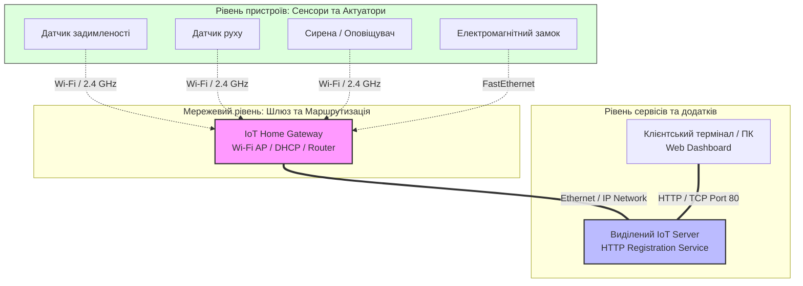
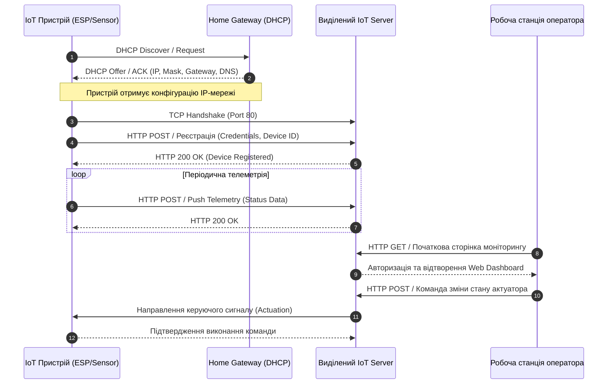
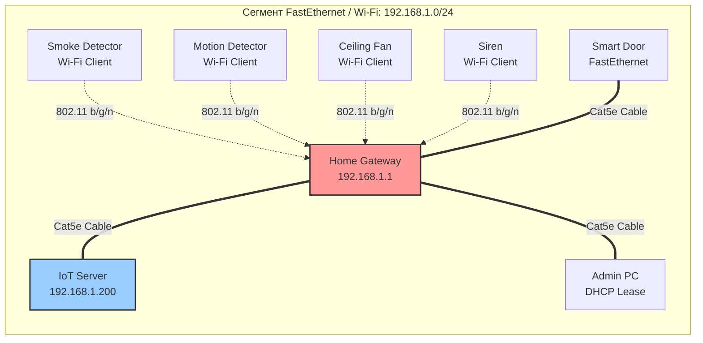

# Лабораторна робота № 1. Моделювання топологій IoT-мереж та серверів реєстрації у середовищі Cisco Packet Tracer

**Мета:** Дослідити багаторівневу архітектуру Інтернету речей, вивчити принципи адресації, маршрутизації та реєстрації розумних речей, а також набути практичних навичок проєктування топологій локальних бездротових мереж, підключення датчиків та актуаторів до домашнього шлюзу (Home Gateway) і налаштування виділеного сервера реєстрації (IoT Registration Server) для централізованого моніторингу та керування у середовищі Cisco Packet Tracer.

**Стек технологій та інструменти:**
* **Мова програмування / Середовище:** Середовище симуляції мереж Cisco Packet Tracer (версія 8.2 або вище), вбудований інтерпретатор Python / JavaScript для IoT-пристроїв.
* **Платформа / Бібліотеки / Модулі:** Вбудований стек протоколів TCP/IP, сервіси DHCP, DNS, HTTP, IoT Registration Service, бібліотека роботи з GPIO у середовищі Packet Tracer (`gpio`).
* **Інструменти розробки:** Робочий простір Cisco Packet Tracer Workspace, термінал командного рядка (CLI) мережевих пристроїв, інтегрований веббраузер для взаємодії з IoT-сервером.

---

## 1 Теоретичні відомості

Сучасна концепція Інтернету речей (Internet of Things, IoT) базується на об'єднанні фізичних об'єктів («речей»), оснащених сенсорами, виконавчими механізмами (актуаторами) та обчислювальними модулями, у єдину глобальну інфраструктуру за допомогою стандартних мережевих протоколів. Відповідно до еталонних моделей Міжнародного союзу електрозв'язку (ITU-T Y.2060) та Всесвітнього форуму IoT (IoT World Forum), архітектура системи розподіляється на три фундаментальні рівні: фізичний рівень пристроїв (Edge/Perception Layer), мережевий рівень передачі даних (Network/Transmission Layer) та рівень сервісів і додатків (Application/Cloud Layer).

На фізичному та граничному рівнях зосереджені датчики, які перетворюють неелектричні фізичні параметри навколишнього середовища (температуру, вологість, задимленість, освітленість) у цифрові або аналогові електричні сигнали. Поряд із ними функціонують актуатори, які виконують зворотну дію, трансформуючи керуючі електричні сигнали у фізичний рух, комутацію силових кіл або оптичну/акустичну сигналізацію.

Для організації взаємодії між автономними низькопотужними пристроями та магістральними комп'ютерними мережами використовують проміжні пристрої — шлюзи (IoT Gateways / Home Gateways). Шлюз виконує трансляцію протоколів фізичного і канального рівнів (наприклад, з бездротових стандартів малого радіуса дії IEEE 802.11 Wi-Fi або IEEE 802.15.4 у стандартний Ethernet), забезпечує локальну маршрутизацію, призначення мережевих адрес через протокол DHCP та ізоляцію сенсорної підмережі від зовнішнього трафіку.


*Рисунок 1 — Структурна схема багаторівневої IoT-інфраструктури утилізації даних*

Архітектурний підхід, наведений на рисунку 1, демонструє поділ потоків даних. Сенсори та актуатори зв'язуються зі шлюзом через захищений бездротовий канал Wi-Fi (або дротовий Ethernet). Шлюз направляє пакети до виділеного сервера реєстрації (IoT Server). Виділений сервер бере на себе задачі централізованої автентифікації пристроїв, накопичення телеметричних даних та надання інтерфейсу користувача (Dashboard). Користувач за допомогою звичайного веббраузера на ПК або смартфоні підключається до сервера за протоколом HTTP (порт 80) або HTTPS (порт 443), отримуючи повний контроль над станом всієї системи.

Процес реєстрації розумного пристрою на виділеному сервері відбувається через взаємодію клієнт-сервер за протоколом HTTP. Після отримання IP-адреси від DHCP-сервера пристрій надсилає запит на встановлення сесії до сервера реєстрації, передаючи власні ідентифікаційні дані (Device ID, типи входів/виходів та поточні значення параметрів).


*Рисунок 2 — Діаграма послідовності інформаційного обміну під час реєстрації та моніторингу*

При розрахунку параметрів мережі передачі даних для систем Інтернету речей визначальним фактором є загальний час доставки телеметричного повідомлення від сенсора до сервера реєстрації ($T_{\text{total}}$). Цей параметр складається з кількох ключових затримок і описується математичною моделлю:

$$T_{\text{total}} = T_{\text{trans}} + T_{\text{prop}} + T_{\text{proc}} + T_{\text{queue}}$$

де $T_{\text{trans}}$ — затримка передавання пакету в канал зв'язку (с);
$T_{\text{prop}}$ — затримка поширення сигналу фізичним середовищем (с);
$T_{\text{proc}}$ — час апаратної обробки пакета маршрутизатором або шлюзом (с);
$T_{\text{queue}}$ — затримка перебування пакета в черзі буфера інтерфейсу (с).

Затримка передавання пакету визначається відношенням довжини сформованого мережевого кадру до фізичної пропускної здатності каналу зв'язку:

$$T_{\text{trans}} = \frac{L}{R}$$

де $L$ — загальний розмір кадру разом зі службовими заголовками протоколів Ethernet/IP/TCP/HTTP (біт);
$R$ — номінальна бітова швидкість передачі даних у каналі (біт/с).

Для автономних датчиків важливим є розрахунок сумарного енергоспоживання вузла за один повний робочий цикл ($E_{\text{cycle}}$), який складається з фази вимірювання, передавання даних та перебування в енергозберігаючому режимі сну:

$$E_{\text{cycle}} = U \cdot \left( I_{\text{active}} \cdot t_{\text{active}} + I_{\text{sleep}} \cdot t_{\text{sleep}} \right)$$

де $U$ — робоча напруга живлення мікроконтролерного модуля (В);
$I_{\text{active}}$ — струм, що споживається пристроєм у активному режимі передавання даних (А);
$t_{\text{active}}$ — тривалість активного сеансу вимірювання та зв'язку (с);
$I_{\text{sleep}}$ — струм споживання мікроконтролера в режимі глибокого сну (А);
$t_{\text{sleep}}$ — тривалість пасивного інтервалу очікування (с).

Загальний термін автономної експлуатації датчика від хімічного джерела живлення ємністю $C_{\text{bat}}$ (вираженої в ампер-годинах, $\text{А}\cdot\text{год}$) розраховується з урахуванням періодичності надсилання телеметрії:

$$T_{\text{life}} = \frac{C_{\text{bat}}}{I_{\text{avg}}} = \frac{C_{\text{bat}} \cdot (t_{\text{active}} + t_{\text{sleep}})}{I_{\text{active}} \cdot t_{\text{active}} + I_{\text{sleep}} \cdot t_{\text{sleep}}}$$

де $I_{\text{avg}}$ — середній еквівалентний струм споживання вузла протягом усього життєвого циклу (А).

---

## 2 Підготовка середовища та розгортання проєкту (Крок 0)

Для виконання лабораторної роботи використовується програмний комплекс Cisco Packet Tracer. Перевірка готовності системи до моделювання передбачає контроль версії встановленого програмного забезпечення та створення робочого каталогу на комп'ютері.

1. Запустіть емулятор термінала операційної системи (Command Prompt у Windows або Terminal у Linux) та перевірте наявність інстальованого пакета Cisco Packet Tracer:

```bash
# Перевірка наявності виконуваного файлу Packet Tracer у Linux
which packettracer

# Для Windows у PowerShell перевірте наявність каталогу інсталяції
Test-Path "C:\Program Files\Cisco Packet Tracer *\bin\PacketTracer.exe"
```

2. Створіть структуру каталогів проєкту для збереження файлів симуляції, конфігурацій та знятих звітів:

```bash
# Створення робочих директорій для звітності
mkdir -p ~/IoT_Projects/Lab1_Topology/{configs,captures,scripts}
cd ~/IoT_Projects/Lab1_Topology
```

Файлова структура виконаної лабораторної роботи повинна мати такий вигляд:

```text
IoT_Projects/
└── Lab1_Topology/
    ├── Lab1_SmartSystem.pkt       # Основний файл симуляції топології Cisco Packet Tracer
    ├── configs/
    │   ├── gateway_config.txt     # Експортована конфігурація бездротової мережі та DHCP
    │   └── server_iot.json        # Експортований маніфест облікових записів сервера
    ├── scripts/
    │   └── edge_controller.py     # Вихідний код скрипта управління актуаторами (SBC/MCU)
    └── captures/
        └── registration_trace.pka # Логи інформаційного обміну та трасування пакетів
```

3. Відкрийте Cisco Packet Tracer. Переконайтеся, що в нижній лівій панелі компонентів доступні розділи:
   * **Network Devices** $\to$ **Wireless Devices** (зокрема шлюз `Home Gateway`);
   * **End Devices** $\to$ **End Devices** (сервер `Server-PT`, комп'ютер `PC-PT`);
   * **End Devices** $\to$ **Home / Smart Devices** (датчики `Smoke Detector`, `Motion Detector`, актуатори `Siren`, `Door`, `Ceiling Fan`).

---

## 3 Порядок виконання роботи

### 3.1 Індивідуальні завдання

Кожен здобувач вищої освіти виконує моделювання унікальної інтегрованої системи відповідно до свого номера варіанта у списку академічної групи.

| Варіант | Назва системи / галузь застосування | Вхідні параметри підмережі та безпеки | Склад датчиків (Sensors) | Склад актуаторів (Actuators) | Керуюча логіка автоматизації |
| :---: | :--- | :--- | :--- | :--- | :--- |
| **1** | Моніторинг лабораторії мікроелектроніки | `192.168.10.0/24`, SSID: `Lab_Micro_IoT`, Pass: `MicroPass2026!` | Датчик температури, Датчик диму | Вентилятор витяжки, Аварійна сирена | Якщо дим > 0.2 або $T > 45^\circ\text{C}$, увімкнути вентилятор на максимум та сирену |
| **2** | Клімат-контроль серверного приміщення | `192.168.20.0/24`, SSID: `Server_Room_Net`, Pass: `ServerSafe99#` | Датчик температури, Датчик вологості | Промисловий кондиціонер, Оповіщувач | Якщо $T > 28^\circ\text{C}$, увімкнути кондиціонер; якщо вологість > 70%, активувати сигнал |
| **3** | Система безпеки архіву документів | `192.168.30.0/24`, SSID: `Archive_Secure`, Pass: `ArchKeyPass88` | Датчик руху, Датчик відкриття дверей | LED-прожектор, Електрозамок | Якщо зафіксовано рух при закритому замку, увімкнути прожектор та заблокувати двері |
| **4** | Смарт-оранжерея з крапельним поливом | `192.168.40.0/24`, SSID: `GreenHouse_Mesh`, Pass: `FloraPlant44$` | Датчик вологості грунту, Датчик рівня світла | Електроклапан води, Лампа досвічування | Якщо вологість грунту < 30%, відкрити клапан; якщо світло < 200 lx, увімкнути лампу |
| **5** | Автоматизація складського термінала | `192.168.50.0/24`, SSID: `Logistics_Hub`, Pass: `CargoTrack123` | Оптичний датчик воріт, Датчик задимленості | Ролетні ворота, Витяжна вентиляція | При спрацюванні оптичного датчика відкрити ворота; при появі диму відкрити на 100% |
| **6** | Моніторинг хімічного складу цеху | `192.168.60.0/24`, SSID: `Chem_Industry_5`, Pass: `SafetyFirst77@` | Датчик CO, Датчик витоку газу | Припливна вентиляція, Звукова тривога | Якщо витік газу = True або CO > 50 ppm, запустити вентиляцію та сирену |
| **7** | Контроль доступу та освітлення паркінгу | `192.168.70.0/24`, SSID: `AutoPark_Smart`, Pass: `ParkAccess2026` | Датчик присутності авто, Фоторезистор | Світлофор, Шлагбаум | Якщо авто виявлено та шлагбаум закритий, відкрити шлагбаум та ввімкнути зелений |
| **8** | Енергоефективне вуличне освітлення | `192.168.80.0/24`, SSID: `City_Light_Net`, Pass: `SmartCityPass9` | Фоторезистор (Ambient Light), Датчик руху | Вуличний LED ліхтар, Камера спостереження | Якщо освітленість < 15% та зафіксовано рух, яскравість ліхтаря 100% та увімкнути запис |
| **9** | Охоронний комплекс котеджу | `192.168.90.0/24`, SSID: `Cottage_Guard`, Pass: `HomeSafeHome1` | Датчик вібрації вікна, Датчик руху | Внутрішня сирена, Стробоскоп | Якщо вібрація > 0.6 при активованому режимі охорони, увімкнути сирену та стробоскоп |
| **10** | Автоматизована котельна станція | `192.168.100.0/24`, SSID: `Boiler_Station`, Pass: `ThermoStat88*` | Датчик тиску теплоносія, Датчик температури | Сервопривід газового клапана, Насос | Якщо тиск > 4 бар, перекрити газовий клапан; якщо $T < 40^\circ\text{C}$, збільшити потік насоса |
| **11** | Контроль мікроклімату птахоферми | `192.168.110.0/24`, SSID: `Agro_Poultry_1`, Pass: `AgroFarmPass3` | Датчик аміаку (NH3), Датчик температури | Потужна витяжка, Калорифер | Якщо рівень аміаку > 25 ppm, активувати витяжку; якщо $T < 18^\circ\text{C}$, увімкнути обігрів |
| **12** | Розумний навчальний кабінет | `192.168.120.0/24`, SSID: `Uni_Auditory_10`, Pass: `Kremenchuk2026` | Датчик CO2, Датчик присутності людей | Моторизоване вікно, Кондиціонер | Якщо присутність = True та CO2 > 800 ppm, відкрити вікно для провітрювання |
| **13** | Диспетчеризація водонапірної вежі | `192.168.130.0/24`, SSID: `Water_Tower_Sys`, Pass: `AquaControl45` | Датчик рівня води, Датчик тиску магістралі | Магістральний насос, Зливний клапан | Якщо рівень води < 15%, запустити насос; якщо рівень > 95%, негайно зупинити насос |
| **14** | Протипожежний вузол деревообробки | `192.168.140.0/24`, SSID: `Wood_Factory_Net`, Pass: `TimberSafe55!` | Датчик температури підшипників, Датчик пилу | Спринклерна система (водяна), Сирена | Якщо температура підшипника > $85^\circ\text{C}$, вимкнути лінію та активувати спринклер |
| **15** | Автоматизація лікарняної палати | `192.168.150.0/24`, SSID: `Hospital_Ward_IoT`, Pass: `MedCareNet77` | Кнопка виклику медперсоналу, Пульсоксиметр | Світлове табло чергового, Звуковий маяк | При натисканні кнопки або падінні SpO2 < 90% вивести сигнал тривоги черговому |
| **16** | Розумна система збору побутових відходів | `192.168.160.0/24`, SSID: `Waste_Management`, Pass: `EcoCityRecycle` | Ультразвуковий датчик заповнення, Датчик диму | Електромагнітне блокування люка, Сирена | Якщо заповнення контейнера > 90%, заблокувати прийомний люк та передати статус |
| **17** | Лабораторія лазерної оптики | `192.168.170.0/24`, SSID: `Optics_Laser_Lab`, Pass: `PhotonBeam99$` | Датчик відкриття захисного кожуха, Датчик світла | Блокування лазерного випромінювача, Лампа | Якщо кожух відкрито під час генерації, зняти живлення з лазера та увімкнути червоне світло |
| **18** | Контроль доступу до шаф ЦОД | `192.168.180.0/24`, SSID: `DataCenter_Rack`, Pass: `SecureServer11` | Герконовий датчик дверей шафи, Датчик удару | Електронний ригельний замок, Камера | Якщо замок відкрито без авторизації, зафіксувати подію в журналі та подати тривогу |
| **19** | Автономна метеостанція аеродрому | `192.168.190.0/24`, SSID: `Aero_Meteo_Node`, Pass: `FlySafety2026` | Анемометр (швидкість вітру), Барометр | Світловий маяк злітної смуги, Сигнальне табло | Якщо швидкість вітру > 18 м/с, увімкнути заборонний червоний сигнал для посадки |
| **20** | Система кондиціонування фармацевтичного складу | `192.168.200.0/24`, SSID: `Pharma_Storage_1`, Pass: `VaccineSafe22#` | Датчик температури, Датчик вологості | Осушувач повітря, Прецизійний охолоджувач | Підтримувати вологість строго 40–50%; при відхиленні увімкнути відповідний актуатор |

---

### 3.2 Покроковий алгоритм та розв'язок еталонного прикладу

Як еталонний приклад реалізується **«Комплексна інтегрована система моніторингу та протипожежного захисту приміщення»**, яка не дублює індивідуальні варіанти і містить повний наскрізний цикл: формування топології, конфігурацію серверних служб, бездротову та дротову інтеграцію пристроїв і написання коду автоматизації.

Параметри еталонної системи:
* Діапазон адрес локальної мережі: `192.168.1.0/24`
* IP-адреса шлюзу (Home Gateway): `192.168.1.1`
* IP-адреса виділеного сервера (IoT Server): `192.168.1.200`
* Назва Wi-Fi мережі (SSID): `Fire_Safety_IoT`
* Пароль автентифікації WPA2-PSK: `SafetyMaster2026`
* Склад пристроїв: Датчик задимленості (`Smoke Detector`), Датчик руху (`Motion Sensor`), Витяжний стельовий вентилятор (`Ceiling Fan`), Охоронна сирена (`Siren`), Розумні двері (`Smart Door`), Сервер (`IoT Server`), Робоча станція адміністратора (`Admin PC`).


*Рисунок 3 — Топологія еталонної системи пожежної безпеки в Cisco Packet Tracer*

#### Крок 1. Розміщення та комутація компонентів топології

1. Перетягніть на робоче поле такі вузли:
   * Один шлюз **Home Gateway** (розділ *Network Devices* $\to$ *Wireless*);
   * Один сервер **Server-PT** та один комп'ютер **PC-PT** (розділ *End Devices*);
   * Датчики з розділу *End Devices* $\to$ *Home*: **Smoke Detector**, **Motion Detector**;
   * Актуатори з розділу *End Devices* $\to$ *Home*: **Siren**, **Ceiling Fan**, **Door**.

2. Здійсніть дротове підключення за допомогою кабелю типу «Мідний прямий» (Copper Straight-Through):
   * Порт `FastEthernet0` сервера `IoT Server` підключіть до порту `Ethernet 1` шлюзу `Home Gateway`;
   * Порт `FastEthernet0` комп'ютера `Admin PC` підключіть до порту `Ethernet 2` шлюзу `Home Gateway`;
   * Порт `FastEthernet0` розумних дверей `Smart Door` підключіть до порту `Ethernet 3` шлюзу `Home Gateway`.

#### Крок 2. Налаштування шлюзу Home Gateway

1. Відкрийте вікно конфігурації `Home Gateway`, натиснувши на пристрій, та перейдіть на вкладку **Config**.
2. В меню зліва оберіть пункт **LAN**:
   * Встановіть поле **IP Address** у значення `192.168.1.1`;
   * Встановіть поле **Subnet Mask** у значення `255.255.255.0`;
   * Увімкніть **DHCP Server** (позначка *Enabled*);
   * Вкажіть початкову адресу пулу **Start IP Address**: `192.168.1.100`;
   * Вкажіть максимальну кількість користувачів **Maximum Number of Users**: `50`.

3. В меню зліва оберіть пункт **Wireless**:
   * Встановіть ідентифікатор мережі **SSID**: `Fire_Safety_IoT`;
   * У блоці **Authentication** оберіть стандарт **WPA2-PSK**;
   * Введіть ключ шифрування **PSK Pass Phrase**: `SafetyMaster2026`;
   * Переконайтеся, що тип шифрування встановлено як **AES**.

4. У блоці **Internet** встановіть конфігурацію отримання адреси як **DHCP** або залиште значення за замовчуванням, оскільки маршрутизація здійснюється всередині локальної мережі LAN.

#### Крок 3. Налаштування виділеного сервера реєстрації (IoT Server)

1. Відкрийте `Server-PT`, перейдіть на вкладку **Desktop** $\to$ **IP Configuration**:
   * Оберіть режим **Static**;
   * **IP Address**: `192.168.1.200`;
   * **Subnet Mask**: `255.255.255.0`;
   * **Default Gateway**: `192.168.1.1`;
   * **DNS Server**: `192.168.1.200`.

2. Перейдіть на вкладку **Services**:
   * Оберіть сервіс **HTTP**: переконайтеся, що перемикачі **HTTP** та **HTTPS** встановлені в положення **On**;
   * Оберіть сервіс **IoT**: встановіть перемикач служб у положення **On** (це активує службу централізованої реєстрації та обробки телеметрії);
   * Усі інші неактивні служби (DHCP, TFTP, DNS, SYSLOG) переведіть у стан **Off** для зменшення службового навантаження.

#### Крок 4. Додавання бездротових модулів до IoT-пристроїв

За замовчуванням пристрої `Smoke Detector`, `Motion Detector`, `Ceiling Fan` та `Siren` оснащені дротовими портами Ethernet. Для їх бездротового підключення необхідно замінити мережевий адаптер:

1. Натисніть на пристрій `Smoke Detector`, перейдіть на вкладку **Physical**.
2. Натисніть кнопку **Advanced** у правому нижньому кутку, після чого відкриється доступ до додаткових конфігураційних вкладок.
3. Перейдіть на вкладку **I/O Config**:
   * У полі **Network Adapter** змініть значення з порту за замовчуванням `1CFE` (дротовий FastEthernet) на модуль `1WFW` (бездротовий інтерфейс Wi-Fi 2.4GHz).
4. Перейдіть на вкладку **Config** $\to$ меню **Wireless0**:
   * Встановіть **SSID**: `Fire_Safety_IoT`;
   * В блоці **Authentication** виберіть **WPA2-PSK**;
   * Введіть **PSK Pass Phrase**: `SafetyMaster2026`.
5. У розділі **Config** $\to$ **Settings**:
   * Встановіть отримання адреси шлюзу та DNS через **DHCP**;
   * У блоці **IoT Server** виберіть перемикач **Remote Server**;
   * Вкажіть **Server Address**: `192.168.1.200`;
   * Вкажіть **User Name**: `admin`;
   * Вкажіть **Password**: `admin123`;
   * Натисніть кнопку **Connect**.
6. Повторіть ідентичну процедуру модифікації мережевого інтерфейсу та конфігурації для:
   * `Motion Detector` (Wi-Fi адаптер `1WFW`, автентифікація, сервер `192.168.1.200`);
   * `Ceiling Fan` (Wi-Fi адаптер `1WFW`, автентифікація, сервер `192.168.1.200`);
   * `Siren` (Wi-Fi адаптер `1WFW`, автентифікація, сервер `192.168.1.200`).
7. Для пристрою `Smart Door`, який підключений дротом до шлюзу:
   * Перейдіть на вкладку **Config** $\to$ **Settings**;
   * У блоці **IoT Server** виберіть **Remote Server**;
   * Введіть адресу `192.168.1.200`, логін `admin`, пароль `admin123` та натисніть **Connect**.

#### Крок 5. Створення облікового запису адміністратора та перевірка реєстрації

1. Відкрийте робочу станцію `Admin PC`, перейдіть на вкладку **Desktop** $\to$ **IP Configuration** та переконайтеся, що активовано режим **DHCP**, а комп'ютер отримав адресу з діапазону `192.168.1.100 - 192.168.1.150`.
2. Перейдіть на вкладку **Desktop** $\to$ **Web Browser**.
3. В адресному рядку введіть URL-адресу виділеного сервера: `http://192.168.1.200` та натисніть **Go**.
4. На сторінці сервера IoT, що відкрилася, перейдіть за посиланням **Sign up now** для первинного створення облікового запису головного адміністратора:
   * **Username**: `admin`
   * **Password**: `admin123`
   * Натисніть кнопку **Create**.
5. Після авторизації відкриється панель моніторингу **IoT Server - Devices**, у якій автоматично з'являться зареєстровані пристрої:
   * `SmokeDetector` (значення концентрації диму від 0.0 до 1.0);
   * `MotionDetector` (логічний стан: True / False);
   * `CeilingFan` (режими роботи: 0 — Off, 1 — Low, 2 — High);
   * `Siren` (стан: On / Off);
   * `SmartDoor` (стан блокування ригеля: Locked / Unlocked).

```text
+---------------------------------------------------------------+
| Cisco Packet Tracer - IoT Server Dashboard (192.168.1.200)    |
+---------------------------------------------------------------+
| Device Name       | Status / Level          | Action          |
+-------------------+-------------------------+-----------------+
| SmokeDetector_1   | 0.00 (Normal)           | [Monitor Only]  |
| MotionDetector_1  | False (No Motion)       | [Monitor Only]  |
| CeilingFan_1      | 0 (Off)                 | ( )0  ( )1  (*)2|
| Siren_1           | Off                     | [ Turn ON ]     |
| SmartDoor_1       | Locked                  | [ Unlock ]      |
+---------------------------------------------------------------+
```

#### Крок 6. Програмування мікроконтролера та сценаріїв автоматизації

Автоматизацію поведінки системи можна реалізувати двома способами: за допомогою внутрішнього механізму правил сервера реєстрації (*Server Conditions*) або за допомогою вбудованого контролера Single Board Computer (SBC-PT) мовою Python. Для забезпечення академічної повноти реалізуємо логіку на мікроконтролері SBC.

Додайте на схему мікрокомп'ютер **SBC-PT** (розділ *Components* $\to$ *Boards*), підключіть його порт Ethernet до шлюзу, налаштуйте клієнт реєстрації та перейдіть на вкладку **Programming** $\to$ **New Project** (тип проекту — Python).

Введіть повний робочий код управління системою без скорочень:

```python
from time import sleep
import urllib.request
import json
from gpio import *

# =====================================================================
# НАЛАШТУВАННЯ КОНСТАНТ ТА ПАРАМЕТРІВ ПІДКЛЮЧЕННЯ ДО СЕРВЕРА
# =====================================================================
SERVER_IP = "192.168.1.200"
AUTH_USER = "admin"
AUTH_PASS = "admin123"
POLL_INTERVAL_SECONDS = 1.0  # Період опитування сенсорів у секундах
SMOKE_THRESHOLD = 0.25       # Критичний поріг концентрації диму

def get_server_device_data():
    """
    Функція надсилає HTTP GET запит до внутрішнього API сервера реєстрації
    для отримання поточного JSON-стану всіх зареєстрованих сенсорів.
    """
    url = "http://" + SERVER_IP + "/api/devices"
    # Формування базового HTTP-запиту
    req = urllib.request.Request(url)
    try:
        response = urllib.request.urlopen(req)
        raw_data = response.read().decode('utf-8')
        return json.loads(raw_data)
    except Exception as error_msg:
        print("[ПОМИЛКА ЗВ'ЯЗКУ]: Не вдалося отримати дані з сервера ->", str(error_msg))
        return None

def send_actuator_command(device_name, state_value):
    """
    Функція надсилає HTTP POST запит для зміни стану відповідного актуатора.
    Параметри:
      device_name (str) - унікальне ім'я пристрою на сервері
      state_value (int/str) - цільовий стан (наприклад, 2 для Fan, 1 для Siren)
    """
    url = "http://" + SERVER_IP + "/api/device/" + device_name
    payload = json.dumps({"state": state_value}).encode('utf-8')
    req = urllib.request.Request(url, data=payload, headers={'Content-Type': 'application/json'})
    try:
        with urllib.request.urlopen(req) as resp:
            if resp.status == 200:
                print("[УСПІХ]: Команду для " + device_name + " встановлено у " + str(state_value))
    except Exception as error_msg:
        print("[ПОМИЛКА УПРАВЛІННЯ]: Пристрій " + device_name + " ->", str(error_msg))

def main():
    """
    Головний цикл моніторингу та прийняття рішень на граничному рівні.
    """
    print("[ІНІЦІАЛІЗАЦІЯ]: Станцію моніторингу IoT запущено успішно.")
    print("[МОНІТОРИНГ]: Очікування телеметричних пакетів...")

    # Початковий стан актуаторів (безпечний режим)
    siren_active = False
    fan_speed = 0
    door_locked = True

    while True:
        # 1. Зчитування локального фізичного порта (якщо датчик підключено до GPIO контролера)
        local_analog_val = analogRead(A0)
        
        # 2. Отримання глобальних телеметричних даних із сервера
        telemetry = get_server_device_data()
        
        smoke_level = 0.0
        motion_detected = False

        if telemetry is not None:
            for item in telemetry:
                if item.get("name") == "SmokeDetector_1":
                    smoke_level = float(item.get("value", 0.0))
                elif item.get("name") == "MotionDetector_1":
                    motion_detected = bool(item.get("value", False))

        print(f"[ТЕЛЕМЕТРІЯ]: Рівень диму = {smoke_level:.2f} | Рух = {motion_detected} | A0 = {local_analog_val}")

        # 3. Логіка реагування на надзвичайну пожежну ситуацію
        if smoke_level >= SMOKE_THRESHOLD:
            print("[КРИТИЧНИЙ СТАН]: Зафіксовано задимлення! Активація протоколу безпеки.")
            
            # Якщо сирена вимкнена — вмикаємо
            if not siren_active:
                send_actuator_command("Siren_1", 1)
                siren_active = True
            
            # Вмикаємо вентилятор на максимальні оберти (рівень 2)
            if fan_speed != 2:
                send_actuator_command("CeilingFan_1", 2)
                fan_speed = 2
            
            # Розблокувати двері для безпечної евакуації
            if door_locked:
                send_actuator_command("SmartDoor_1", 0)  # 0 - Unlocked
                door_locked = False

        else:
            # 4. Штатний режим функціонування
            if siren_active:
                print("[НОРМАЛІЗАЦІЯ]: Задимлення ліквідовано. Вимкнення сирени.")
                send_actuator_command("Siren_1", 0)
                siren_active = False

            if not motion_detected and fan_speed != 0:
                # Якщо людей немає і диму немає — вимикаємо вентилятор для економії енергії
                print("[ЕНЕРГОЗБЕРЕЖЕННЯ]: Приміщення вільне. Зупинка вентилятора.")
                send_actuator_command("CeilingFan_1", 0)
                fan_speed = 0
            elif motion_detected and smoke_level < SMOKE_THRESHOLD and fan_speed != 1:
                # Якщо зафіксовано присутність людей — підтримуємо комфортну вентиляцію (рівень 1)
                print("[КОМФОРТ]: Присутність персоналу. Вмикання помірного обдуву.")
                send_actuator_command("CeilingFan_1", 1)
                fan_speed = 1

            if not door_locked and not motion_detected:
                # Блокування дверей у неробочий час
                send_actuator_command("SmartDoor_1", 1)  # 1 - Locked
                door_locked = True

        # Затримка між ітераціями циклу
        sleep(POLL_INTERVAL_SECONDS)

if __name__ == "__main__":
    main()
```

---

### 3.3 Запуск, тестування та перевірка результатів

1. Запустіть скрипт автоматизації на `SBC-PT`, натиснувши кнопку **Run** у вкладці **Programming**.
2. Відкрийте вкладку **Web Browser** на `Admin PC`, введіть `192.168.1.200` та тримайте вікно відкритим поряд із робочим полем Packet Tracer.
3. Проведіть тестові впливи на фізичні сенсори:
   * **Генерація задимлення:** Затисніть клавішу `Alt` і натисніть лівою кнопкою миші на пристрій `Smoke Detector`. Утримуйте курсор поряд із датчиком, щоб збільшити концентрацію аерозолю.
   * **Фіксація руху:** Наведіть курсор миші із затиснутою клавішею `Alt` на датчик `Motion Detector`.

#### Приклад виведення консольних логів SBC під час зміни режимів:

```text
[ІНІЦІАЛІЗАЦІЯ]: Станцію моніторингу IoT запущено успішно.
[МОНІТОРИНГ]: Очікування телеметричних пакетів...
[ТЕЛЕМЕТРІЯ]: Рівень диму = 0.00 | Рух = False | A0 = 0
[ТЕЛЕМЕТРІЯ]: Рівень диму = 0.00 | Рух = False | A0 = 0
[ТЕЛЕМЕТРІЯ]: Рівень диму = 0.00 | Рух = True  | A0 = 12
[КОМФОРТ]: Присутність персоналу. Вмикання помірного обдуву.
[УСПІХ]: Команду для CeilingFan_1 встановлено у 1
[ТЕЛЕМЕТРІЯ]: Рівень диму = 0.12 | Рух = True  | A0 = 145
[ТЕЛЕМЕТРІЯ]: Рівень диму = 0.38 | Рух = True  | A0 = 490
[КРИТИЧНИЙ СТАН]: Зафіксовано задимлення! Активація протоколу безпеки.
[УСПІХ]: Команду для Siren_1 встановлено у 1
[УСПІХ]: Команду для CeilingFan_1 встановлено у 2
[УСПІХ]: Команду для SmartDoor_1 встановлено у 0
[ТЕЛЕМЕТРІЯ]: Рівень диму = 0.42 | Рух = True  | A0 = 512
[ТЕЛЕМЕТРІЯ]: Рівень диму = 0.18 | Рух = False | A0 = 210
[НОРМАЛІЗАЦІЯ]: Задимлення ліквідовано. Вимкнення сирени.
[УСПІХ]: Команду для Siren_1 встановлено у 0
[ЕНЕРГОЗБЕРЕЖЕННЯ]: Приміщення вільне. Зупинка вентилятора.
[УСПІХ]: Команду для CeilingFan_1 встановлено у 0
[УСПІХ]: Команду для SmartDoor_1 встановлено у 1
```

4. Перевірте візуальні зміни в інтерфейсі Packet Tracer:
   * При рівні диму $\ge 0.25$ лопаті вентилятора `Ceiling Fan` починають обертатися з максимальною швидкістю;
   * На сирені `Siren` з'являється червона світлова індикація зі звуковою візуалізацією;
   * Індикатор замка `Smart Door` змінює колір з червоного (заблоковано) на зелений (розблоковано).

---

## 4 Вимоги до змісту звіту

Звіт оформлюється відповідно до вимог стандарту ДСТУ 3008:2015 і повинен містити такі обов'язкові структурні розділи:

1. **Титульна сторінка** із зазначенням назви Міністерства, вищого навчального закладу, кафедри, назви дисципліни, номера і теми лабораторної роботи, номера варіанта, прізвища та ініціалів здобувача й викладача.
2. **Мета роботи** та стисла теоретична довідка з описом технологій адресації й реєстрації пристроїв у комп'ютерній мережі.
3. **Постановка індивідуального завдання** для закріпленого варіанта: топологічна схема, діапазони адрес, перелік використаних сенсорів, актуаторів та параметри безпеки бездротової мережі.
4. **Скріншот загальної топології** у середовищі Cisco Packet Tracer з відображенням підписаних IP-адрес кожного вузла.
5. **Таблиця параметрів адресації мережі** із зазначенням імен вузлів, типів фізичних інтерфейсів, IP-адрес, масок підмереж, шлюзів за замовчуванням та MAC-адрес.
6. **Повний вихідний код програми/скрипту** автоматизації (мовою Python або JavaScript) із детальними коментарями до кожного функціонального блоку.
7. **Результати тестування:** скріншоти вікна веббраузера з панеллю керування IoT Server Dashboard у нормальному та аварійному станах системи, а також логи роботи консолі.
8. **Аналітичні висновки**, у яких оцінено стабільність роботи спроєктованої топології, описано труднощі, що виникли під час адресації пристроїв та запропоновано шляхи оптимізації енергоефективності бездротових вузлів.

---

## 5 Контрольні запитання для захисту роботи

1. **Які принципові відмінності існують між еталонною моделлю IoT ITU-T Y.2060 та класичною моделлю взаємодії відкритих систем OSI?** Поясніть, які рівні моделі OSI об'єднує в собі рівень пристроїв (Device Layer) моделі ITU-T.
2. **Яку роль відіграє Home Gateway у трансляції та агрегації потоків даних від неоднорідних засобів вимірювання?** Чому кінцеві сенсори не підключаються напряму до глобальних публічних хмарних сервісів?
3. **Опишіть покроковий механізм встановлення сесії та реєстрації IoT-пристрою на сервері реєстрації за протоколом HTTP.** Які заголовки та формати корисного навантаження (Payload) використовуються при передачі телеметрії?
4. **Як впливає вибір протоколу бездротового доступу (Wi-Fi 802.11 b/g/n vs IEEE 802.15.4 / BLE) на часові затримки $T_{\text{trans}}$ та сумарний енергетичний бюджет автономного вузла $E_{\text{cycle}}$?**
5. **Яким чином у середовищі Cisco Packet Tracer забезпечується взаємозв'язок між аналоговим сигналом на порту GPIO мікроконтролера та числовим значенням у коді мовою Python?**
6. **Які вектори кібератак виникають при використанні незахищеного протоколу HTTP для передавання телеметрії між шлюзом та Registration Server?** Запропонуйте інженерні рішення для мінімізації ризиків несанкціонованого перехоплення керування актуаторами.