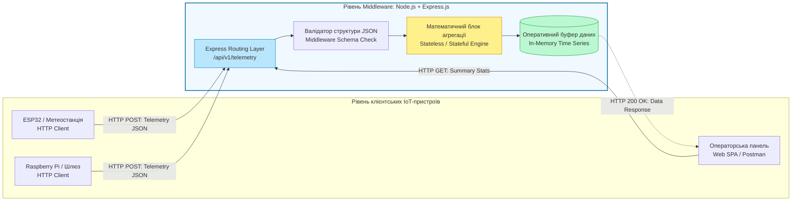
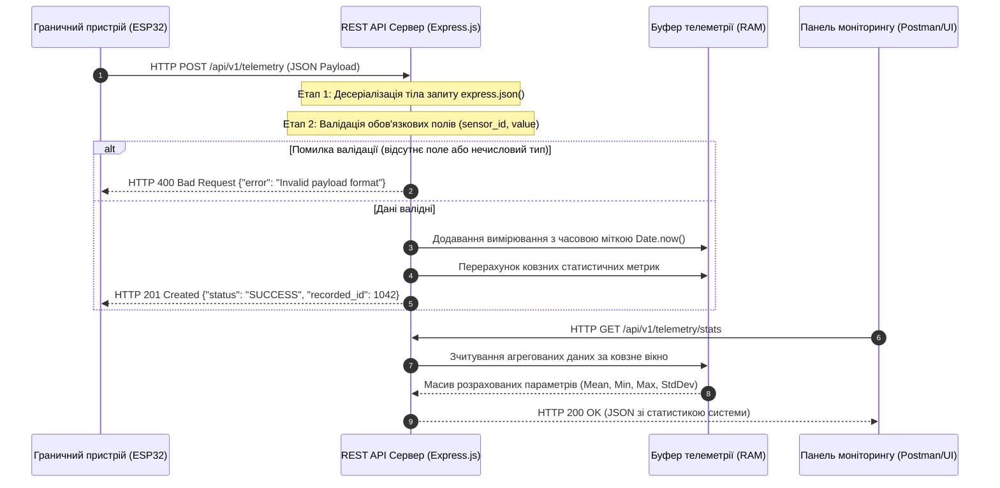

# Лабораторна робота № 10. Розробка сервісу REST API для агрегації телеметричних даних Інтернету речей на базі платформи Node.js та фреймворку Express

**Мета:** Дослідити архітектурні принципи побудови вебсервісів передачі стану (Representational State Transfer, REST), вивчити особливості асинхронної моделі обробки подій у середовищі Node.js, набути практичних навичок розробки серверного програмного забезпечення (Backend Middleware) на базі фреймворку Express.js, реалізувати прийом, валідацію, обчислювальну агрегацію та маршрутизацію телеметричних пакетів формату JSON від клієнтських пристроїв Інтернету речей за допомогою HTTP-запитів типу POST і GET, а також провести верифікацію розробленого програмного інтерфейсу за допомогою утиліти Postman та консольного клієнта cURL.

**Стек технологій та інструменти:**
* **Мова програмування / Середовище:** Мова програмування JavaScript (стандарт ECMAScript 2022+), програмна платформа Node.js (версія 18.x LTS або 20.x LTS), інтерпретатор командного рядка Linux Bash / Windows PowerShell.
* **Платформа / Бібліотеки / Модулі:** Вебфреймворк `express` (версія 4.19+), проміжний обробник тіла запитів `body-parser` (або вбудований `express.json()`), модуль крос-доменного доступу `cors` (версія 2.8+), логер HTTP-запитів `morgan` (версія 1.10+), середовище автоматичного перезапуску сервера під час розробки `nodemon`.
* **Інструменти розробки:** Інтегроване середовище розробки Visual Studio Code (або WebStorm), платформа тестування API Postman (або HTTP-клієнт cURL), термінал операційної системи.

---

## 1 Теоретичні відомості

Архітектурний стиль REST є основою побудови розподілених вебсервісів у глобальній мережі Інтернет. У контексті Інтернету речей архітектура RESTful API забезпечує взаємодію між клієнтськими граничними пристроями (Edge Devices / IoT Gateways) та хмарними платформами або внутрішньокорпоративними серверами баз даних. Кожен фізичний або логічний компонент системи (датчик, актуатор, група пристроїв, часовий ряд вимірювань) розглядається як окремий ресурс, що володіє унікальним уніфікованим ідентифікатором (Uniform Resource Identifier, URI).

Взаємодія з ресурсами здійснюється за допомогою стандартних методів прикладного протоколу передачі гіпертексту HTTP. Метод `POST` використовується автономними датчиками для надсилання нових телеметричних вимірювань на сервер. Метод `GET` застосовується клієнтськими панелями моніторингу (Dashboards) або мобільними додатками для отримання зрізів історичних даних та поточних розрахованих статистичних показників. Метод `PUT` слугує для повного оновлення конфігураційних параметрів кінцевого пристрою, а метод `DELETE` дозволяє вилучати застарілі або скомпрометовані записи з реєстраційної бази.


*Рисунок 1 — Структурна схема взаємодії клієнтських вузлів із сервісом REST API на базі Express.js*

Використання платформи Node.js для розробки IoT-бекендів обумовлено її однопотоковою асинхронною архітектурою, заснованою на циклі обробки подій (Event Loop) та неблокуючих операціях введення-виведення. Традиційні багатопотокові сервери створюють окремий системний потік під кожне клієнтське з'єднання, що призводить до катастрофічного дефіциту оперативної пам'яті за умови підключення десятків тисяч одночасних датчиків. На противагу цьому, Node.js реєструє мережеві сокети в системному мультиплексорі ядра (наприклад, `epoll` у Linux) та обробляє всі події надходження даних у єдиному головному потоці, що гарантує високу пропускну здатність при мінімальних накладних витратах.


*Рисунок 2 — Діаграма послідовності обробки пакетів телеметрії та видачі аналітичних даних*

Математична обробка часових рядів на сервері передбачає обчислення середнього арифметичного значення фізичного параметра ($\bar{X}$) за ковзним часовим вікном розміром у $N$ останніх вимірювань:

$$\bar{X} = \frac{1}{N} \sum_{i=1}^{N} X_i$$

де $X_i$ — числове значення фізичного параметра, зареєстроване у $i$-му пакеті телеметрії;  
$N$ — загальна кількість вимірювань у поточному буфері агрегації.

Для оцінки дисперсії сигналу та виявлення нестабільності технологічного процесу обчислюється вибіркове середньоквадратичне відхилення ($\sigma$):

$$\sigma = \sqrt{\frac{1}{N-1} \sum_{i=1}^{N} (X_i - \bar{X})^2}$$

де $\sigma$ — вибіркове середньоквадратичне відхилення фізичної величини (в одиницях вимірювання досліджуваного параметра);  
$\bar{X}$ — розраховане вибіркове середнє значення за аналізований інтервал часу.

Продуктивність та масштабованість розробленого REST API оцінюється максимальною кількістю запитів, яку сервер здатен успішно опрацювати за одну секунду ($RPS$, Requests Per Second):

$$RPS = \frac{C}{\bar{T}_{\text{resp}}}$$

де $C$ — кількість одночасно активних клієнтських мережевих з'єднань;  
$\bar{T}_{\text{resp}}$ — середній повний час відгуку сервера на один HTTP-запит (с).

Середній час відгуку сервера ($\bar{T}_{\text{resp}}$) складається з апаратних та алгоритмічних часових компонентів:

$$\bar{T}_{\text{resp}} = T_{\text{net}} + T_{\text{event\_loop}} + T_{\text{parse}} + T_{\text{calc}} + T_{\text{serialize}}$$

де $T_{\text{net}}$ — час мережевої доставки запиту від клієнта до сервера (с);  
$T_{\text{event\_loop}}$ — час перебування події у черзі очікування циклу Event Loop (с);  
$T_{\text{parse}}$ — час розбору текстового рядка запиту в об'єктне дерево JSON (с);  
$T_{\text{calc}}$ — час виконання математичного алгоритму валідації та статистичної агрегації (с);  
$T_{\text{serialize}}$ — час формування вихідного HTTP-пакета та його серіалізації в мережевий сокет (с).

---

## 2 Підготовка середовища та розгортання проєкту (Крок 0)

Для побудови сервера необхідно ініціалізувати робоче середовище Node.js, налаштувати файл дескриптора залежностей `package.json`, встановити необхідні бібліотеки та організувати модульну структуру вихідних кодів.

1. Запустіть емулятор термінала операційної системи та переконайтеся у наявності встановленого інтерпретатора Node.js та пакетного менеджера npm:

```bash
# Перевірка версії Node.js (повинна бути 18.x або 20.x LTS)
node -v

# Перевірка версії менеджера пакунків NPM
npm -v
```

2. Створіть робочу директорію проєкту та виконайте її первинну ініціалізацію:

```bash
# Створення кореневого каталогу проекту
mkdir -p ~/iot_rest_api
cd ~/iot_rest_api

# Ініціалізація нового проекту Node.js з генерацією package.json за замовчуванням
npm init -y
```

3. Встановіть необхідні виробничі (Production) залежності та допоміжні інструменти для розробки:

```bash
# Встановлення веб-фреймворку Express, логера Morgan, модуля CORS та Dotenv
npm install express morgan cors dotenv

# Встановлення Nodemon як залежності розробника для гарячого перезапуску сервера
npm install --save-dev nodemon
```

4. Створіть модульну ієрархію файлової структури проєкту:

```bash
# Створення каталогів для маршрутів, контролерів та утиліт
mkdir -p src/{controllers,routes,utils}

# Створення порожніх файлів проекту
touch server.js .env
touch src/controllers/telemetryController.js
touch src/routes/telemetryRoutes.js
touch src/utils/aggregator.js
```

Структура файлової системи розгорнутого серверного проєкту має наступний вигляд:

```text
iot_rest_api/
├── .env                              # Файл конфігурації змінних оточення (порти, константи)
├── package.json                      # Дескриптор проекту, конфігурація скриптів та залежностей
├── server.js                         # Головна точка входу додатку, налаштування Express
└── src/
    ├── controllers/
    │   └── telemetryController.js    # Бізнес-логіка прийому, обробки та збереження даних
    ├── routes/
    │   └── telemetryRoutes.js        # Визначення кінцевих точок URI (Endpoints)
    └── utils/
        └── aggregator.js             # Математичні модулі статистичного аналізу та фільтрації
```

5. Відкрийте файл `package.json` у текстовому редакторі та налаштуйте блок запуску скриптів `scripts`, додавши команду швидкого старту через `nodemon`:

```json
{
  "name": "iot-rest-api",
  "version": "1.0.0",
  "description": "REST API service for IoT telemetry aggregation and processing",
  "main": "server.js",
  "scripts": {
    "start": "node server.js",
    "dev": "nodemon server.js"
  },
  "keywords": ["iot", "rest", "api", "express", "telemetry"],
  "author": "Department of Computer Engineering and Electronics",
  "license": "ISC",
  "dependencies": {
    "cors": "^2.8.5",
    "dotenv": "^16.4.5",
    "express": "^4.19.2",
    "morgan": "^1.10.0"
  },
  "devDependencies": {
    "nodemon": "^3.1.0"
  }
}
```

6. Відкрийте файл `.env` та визначте базові змінні конфігурації середовища:

```env
# Порт прослуховування HTTP-сервера
PORT=3000

# Максимальний розмір ковзного вікна агрегації
MAX_WINDOW_SIZE=50

# Режим роботи додатку (development / production)
NODE_ENV=development
```

---

## 3 Порядок виконання роботи

### 3.1 Індивідуальні завдання

Кожен здобувач вищої освіти реалізує власний функціонал кінцевих точок REST API відповідно до закріпленого номера варіанта. Завдання передбачає розробку специфічної структури JSON-пакета, створення обробника маршруту `POST` із перевіркою коректності діапазону даних, а також розрахунок статистичних параметрів для методу `GET`.

| Варіант | Назва підсистеми / Домен | Маршрут (URI Endpoint) | Обов'язкові поля вхідного JSON | Валідаційно-агрегаційна логіка бекенду |
| :---: | :--- | :--- | :--- | :--- |
| **1** | Моніторинг промислового автоклава | `/api/v1/autoclave` | `device_id`, `temp_c`, `pressure_bar` | Валідація: $T_C \in [0, 200]$, $P \in [0, 10]$. Розрахунок середнього тиску та дисперсії температури. |
| **2** | Клімат-контроль серверного залу | `/api/v1/datacenter` | `rack_id`, `inlet_temp`, `exhaust_temp`, `fan_rpm` | Валідація: $T \in [10, 80]$. Розрахунок теплового градієнта $\Delta T = T_{\text{ex}} - T_{\text{in}}$ та максимального RPM. |
| **3** | Смарт-елеватор зерна | `/api/v1/silo` | `silo_id`, `moisture_pct`, `grain_temp_c` | Валідація: Вологість $\in [5, 40]\%$. Обчислення ризику самозаймання, якщо $T_C > 35$ і вологість $> 18\%$. |
| **4** | Насосна станція водоканалу | `/api/v1/pumping` | `pump_id`, `flow_rate_m3h`, `current_a` | Валідація: Струм $\in [0, 100]\text{ А}$. Обчислення питомої витрати енергії на кубічний метр води. |
| **5** | Сонячна електростанція | `/api/v1/solar` | `inverter_id`, `voltage_dc`, `current_dc`, `lux` | Валідація: Напруга $\in [0, 1000]\text{ В}$. Розрахунок миттєвої генерації потужності $P = U \cdot I$ та її інтеграла. |
| **6** | Станція біологічного очищення | `/api/v1/aerotank` | `tank_id`, `oxygen_mg_l`, `ph_level` | Валідація: $\text{pH} \in [0, 14]$, Кисень $\in [0, 20]$. Розрахунок середнього рівня оксигенації за останні 20 точок. |
| **7** | Моніторинг шахтного метану | `/api/v1/mining` | `sensor_id`, `methane_pct`, `co_ppm` | Валідація: Метан $\in [0, 100]\%$. Генерація статусу "CRITICAL_EVACUATION", якщо Метан $> 1.25\%$. |
| **8** | Вібромоніторинг турбіни | `/api/v1/turbine` | `bearing_id`, `vib_rms_mms`, `oil_temp` | Валідація: Вібрація $\in [0, 50]\text{ мм/с}$. Обчислення пікового значення вібрації за останню годину. |
| **9** | Розумна промислова теплиця | `/api/v1/greenhouse`| `zone_id`, `soil_moisture`, `par_light` | Валідація: Освітленість $\ge 0$. Розрахунок накопиченого добового квантового інтеграла світла (DLI). |
| **10** | Система зберігання вакцин | `/api/v1/cryo` | `freezer_id`, `temp_kelvin`, `door_status` | Валідація: $T_K \in [50, 300]\text{ К}$. Контроль виходу за межі діапазону $190 \dots 205\text{ К}$ (сухий лід). |
| **11** | Контроль загазованості паркінгу | `/api/v1/parking` | `level_id`, `co_ppm`, `no2_ppm`, `cars_count` | Валідація: Концентрації $> 0$. Розрахунок інтегрального індексу якості повітря для управління витяжкою. |
| **12** | Станція рекуперації тепла | `/api/v1/hvac` | `unit_id`, `temp_fresh`, `temp_exhaust`, `eff_pct` | Валідація: ККД $\in [0, 100]\%$. Обчислення зекономленої теплової потужності в кіловатах. |
| **13** | Автоклав фармакологічного синтезу | `/api/v1/reactor` | `vessel_id`, `viscosity_cps`, `agitator_rpm` | Валідація: В'язкість $\ge 0$. Обчислення тренду зміни в'язкості реакційної суміші для фіксації фази. |
| **14** | Трансформаторна підстанція | `/api/v1/substation` | `trans_id`, `oil_level_pct`, `load_kwa` | Валідація: Навантаження $\ge 0$. Розрахунок коефіцієнта перевантаження відносно номінальної потужності. |
| **15** | Система контролю сушіння деревини | `/api/v1/wooddry` | `chamber_id`, `wood_moisture`, `emc_pct` | Валідація: Вологість деревини $\in [0, 100]\%$. Розрахунок швидкості сушіння за одиницю часу. |
| **16** | Метеостанція вітропарку | `/api/v1/windfarm` | `mast_id`, `wind_speed_ms`, `wind_dir_deg` | Валідація: Напрямок $\in [0, 360]^\circ$. Побудова полярної троянди вітрів за останніми вимірюваннями. |
| **17** | Лінія розливу напоїв | `/api/v1/bottling` | `line_id`, `bottles_per_min`, `fill_error_ml` | Валідація: Швидкість $> 0$. Обчислення середньоквадратичного відхилення недоливу продукції. |
| **18** | Контроль тиску в газопроводі | `/api/v1/gasgrid` | `pipe_segment_id`, `p_in_bar`, `p_out_bar` | Валідація: $P_{\text{in}} \ge P_{\text{out}}$. Розрахунок коефіцієнта гідравлічного опору ділянки труби. |
| **19** | Випробувальний стенд акумуляторів | `/api/v1/battery` | `cell_id`, `voltage_mv`, `internal_res_mohm` | Валідація: Напруга $\in [2000, 4500]\text{ мВ}$. Розрахунок поточної деградації внутрішнього опору комірки. |
| **20** | Фарбувально-сушильний комплекс | `/api/v1/paintshop` | `booth_id`, `voc_mg_m3`, `humidity_pct` | Валідація: Леткі органічні сполуки $\ge 0$. Обчислення середнього вмісту розчинника у витяжній системі. |

---

### 3.2 Покроковий алгоритм та розв'язок еталонного прикладу

Як еталонний приклад реалізується **«Сервіс агрегації телеметрії мікроклімату та стану живлення виробничого цеху»**, що обслуговує запити за базовим маршрутом `/api/v1/telemetry`.

Параметри еталонної системи:
* Вхідний маршрут для надсилання телеметрії: `POST /api/v1/telemetry`
* Маршрут отримання агрегованої аналітики: `GET /api/v1/telemetry/stats`
* Маршрут отримання останніх $N$ сирих записів: `GET /api/v1/telemetry/raw`
* Маршрут скидання оперативного буфера: `DELETE /api/v1/telemetry/clear`
* Структура корисного навантаження JSON:
  `{"sensor_id": "ESP32_NODE_01", "temperature": 24.5, "humidity": 58.2, "voltage": 3.85}`

#### Крок 1. Реалізація математичного модуля агрегації

Створіть файл допоміжних математичних обчислень:

```bash
nano src/utils/aggregator.js
```

Внесіть повний текст модуля без скорочень:

```javascript
// =====================================================================
// МОДУЛЬ МАТЕМАТИЧНОЇ ТА СТАТИСТИЧНОЇ АГРЕГАЦІЇ ТЕЛЕМЕТРИЧНИХ ДАНИХ
// =====================================================================

/**
 * Розраховує середнє арифметичне значення числового масиву.
 * @param {Array<number>} values - Масив числових вимірювань.
 * @returns {number} Середнє значення або 0 для порожнього масиву.
 */
function calculateMean(values) {
    if (!values || values.length === 0) {
        return 0;
    }
    const sum = values.reduce((accumulator, currentValue) => accumulator + currentValue, 0);
    return parseFloat((sum / values.length).toFixed(2));
}

/**
 * Розраховує вибіркове середньоквадратичне відхилення (стандартне відхилення).
 * @param {Array<number>} values - Масив числових вимірювань.
 * @param {number} mean - Попередньо розраховане середнє арифметичне.
 * @returns {number} Середньоквадратичне відхилення.
 */
function calculateStandardDeviation(values, mean) {
    if (!values || values.length <= 1) {
        return 0;
    }
    const squaredDifferencesSum = values.reduce((accumulator, currentValue) => {
        const difference = currentValue - mean;
        return accumulator + (difference * difference);
    }, 0);
    const variance = squaredDifferencesSum / (values.length - 1);
    return parseFloat(Math.sqrt(variance).toFixed(3));
}

/**
 * Виконує комплексний аналіз масиву телеметричних об'єктів.
 * @param {Array<Object>} records - Масив записів телеметрії з оперативної пам'яті.
 * @returns {Object} Об'єкт із агрегованими статистичними показниками.
 */
function aggregateTelemetry(records) {
    if (!records || records.length === 0) {
        return {
            total_records: 0,
            temperature: { mean: 0, min: 0, max: 0, std_dev: 0 },
            humidity: { mean: 0, min: 0, max: 0, std_dev: 0 },
            voltage: { mean: 0, min: 0, max: 0 },
            system_status: "NO_DATA"
        };
    }

    const temperatures = records.map(item => item.temperature);
    const humidities = records.map(item => item.humidity);
    const voltages = records.map(item => item.voltage);

    const tempMean = calculateMean(temperatures);
    const humMean = calculateMean(humidities);
    const voltMean = calculateMean(voltages);

    const tempMin = Math.min(...temperatures);
    const tempMax = Math.max(...temperatures);
    const humMin = Math.min(...humidities);
    const humMax = Math.max(...humidities);
    const voltMin = Math.min(...voltages);
    const voltMax = Math.max(...voltages);

    const tempStdDev = calculateStandardDeviation(temperatures, tempMean);
    const humStdDev = calculateStandardDeviation(humidities, humMean);

    // Оцінка стану системи за граничними умовами
    let status = "NORMAL";
    if (tempMax > 40.0 || humMax > 80.0 || voltMin < 3.3) {
        status = "WARNING_THRESHOLD_EXCEEDED";
    }

    return {
        total_records: records.length,
        time_window_start: records[0].timestamp,
        time_window_end: records[records.length - 1].timestamp,
        temperature: {
            mean: tempMean,
            min: tempMin,
            max: tempMax,
            std_dev: tempStdDev,
            unit: "Celsius"
        },
        humidity: {
            mean: humMean,
            min: humMin,
            max: humMax,
            std_dev: humStdDev,
            unit: "Percentage"
        },
        voltage: {
            mean: voltMean,
            min: voltMin,
            max: voltMax,
            unit: "Volts"
        },
        system_status: status
    };
}

module.exports = {
    calculateMean,
    calculateStandardDeviation,
    aggregateTelemetry
};
```

#### Крок 2. Реалізація контролера обробки телеметрії

Створіть файл бізнес-логіки контролера:

```bash
nano src/controllers/telemetryController.js
```

Внесіть повний код контролера, який забезпечує валідацію вхідних полів, збереження у оперативний масив, логування в консоль та видачу агрегованих звітів:

```javascript
// =====================================================================
// КОНТРОЛЕР ОБРОБКИ ЗАПИТІВ ТЕЛЕМЕТРІЇ ДЛЯ IOT-ПРИСТРОЇВ
// =====================================================================

const { aggregateTelemetry } = require('../utils/aggregator');

// Локальне сховище часових рядів у пам'яті (In-Memory Buffer)
let telemetryStorage = [];
let recordCounter = 0;
const MAX_STORAGE_LIMIT = parseInt(process.env.MAX_WINDOW_SIZE, 10) || 50;

/**
 * Приймає та обробляє нове телеметричне повідомлення від IoT-пристрою (HTTP POST).
 */
exports.postTelemetry = (req, res) => {
    const payload = req.body;

    // 1. Контроль наявності тіла запиту
    if (!payload || Object.keys(payload).length === 0) {
        console.error(`[ПОМИЛКА] [${new Date().toISOString()}] Отримано порожнє тіло запиту`);
        return res.status(400).json({
            success: false,
            error_code: "EMPTY_PAYLOAD",
            message: "Тіло HTTP POST запиту не може бути порожнім. Очікується JSON-об'єкт."
        });
    }

    const { sensor_id, temperature, humidity, voltage } = payload;

    // 2. Валідація обов'язкових полів та їх типів даних
    if (!sensor_id || typeof sensor_id !== 'string') {
        console.warn(`[ВАЛІДАЦІЯ] [${new Date().toISOString()}] Відсутній або некоректний sensor_id`);
        return res.status(400).json({
            success: false,
            error_code: "INVALID_SENSOR_ID",
            message: "Поле 'sensor_id' є обов'язковим рядком (string)."
        });
    }

    if (temperature === undefined || typeof temperature !== 'number' || isNaN(temperature)) {
        console.warn(`[ВАЛІДАЦІЯ] [${new Date().toISOString()}] Некоректне значення temperature`);
        return res.status(400).json({
            success: false,
            error_code: "INVALID_TEMPERATURE",
            message: "Поле 'temperature' має містити валідне число (number)."
        });
    }

    if (humidity === undefined || typeof humidity !== 'number' || humidity < 0 || humidity > 100) {
        console.warn(`[ВАЛІДАЦІЯ] [${new Date().toISOString()}] Помилка діапазону humidity: ${humidity}`);
        return res.status(400).json({
            success: false,
            error_code: "INVALID_HUMIDITY_RANGE",
            message: "Поле 'humidity' має бути числом у діапазоні від 0 до 100%."
        });
    }

    if (voltage === undefined || typeof voltage !== 'number' || voltage < 0) {
        console.warn(`[ВАЛІДАЦІЯ] [${new Date().toISOString()}] Некоректне значення напруги voltage`);
        return res.status(400).json({
            success: false,
            error_code: "INVALID_VOLTAGE",
            message: "Поле 'voltage' має бути додатним числом."
        });
    }

    // 3. Формування нового внутрішнього запису телеметрії
    recordCounter += 1;
    const newRecord = {
        id: recordCounter,
        sensor_id: sensor_id.trim(),
        temperature: parseFloat(temperature.toFixed(2)),
        humidity: parseFloat(humidity.toFixed(2)),
        voltage: parseFloat(voltage.toFixed(2)),
        timestamp: new Date().toISOString()
    };

    // Додавання до оперативного масиву
    telemetryStorage.push(newRecord);

    // Підтримка принципу ковзного вікна: видалення найстаріших елементів при переповненні
    if (telemetryStorage.length > MAX_STORAGE_LIMIT) {
        telemetryStorage.shift();
    }

    // 4. Обов'язковий структурований вивід прийнятих даних у термінал сервера
    console.log(`[ПРИЙОМ ТЕЛЕМЕТРІЇ] ID: ${newRecord.id} | Сенсор: ${newRecord.sensor_id} | T: ${newRecord.temperature}°C | H: ${newRecord.humidity}% | U: ${newRecord.voltage}V | Час: ${newRecord.timestamp}`);

    // 5. Повернення клієнту статусу успішного створення ресурсу
    return res.status(201).json({
        success: true,
        message: "Телеметричні дані успішно збережено та додано до оперативного пулу.",
        data: {
            record_id: newRecord.id,
            server_timestamp: newRecord.timestamp,
            current_buffer_size: telemetryStorage.length
        }
    });
};

/**
 * Повертає зведений статистичний аналіз накопичених даних (HTTP GET).
 */
exports.getAggregatedStats = (req, res) => {
    console.log(`[АНАЛІТИКА] [${new Date().toISOString()}] Запит на розрахунок агрегованої статистики`);
    const statistics = aggregateTelemetry(telemetryStorage);
    return res.status(200).json({
        success: true,
        generated_at: new Date().toISOString(),
        analytics: statistics
    });
};

/**
 * Повертає масив останніх збережених записів телеметрії (HTTP GET).
 */
exports.getRawTelemetry = (req, res) => {
    const limit = parseInt(req.query.limit, 10) || telemetryStorage.length;
    const requestedData = telemetryStorage.slice(-limit);
    return res.status(200).json({
        success: true,
        count: requestedData.length,
        records: requestedData
    });
};

/**
 * Очищує накопичений масив телеметрії (HTTP DELETE).
 */
exports.clearTelemetry = (req, res) => {
    const previousCount = telemetryStorage.length;
    telemetryStorage = [];
    recordCounter = 0;
    console.log(`[СИСТЕМА] [${new Date().toISOString()}] Очищено буфер телеметрії. Вилучено записів: ${previousCount}`);
    return res.status(200).json({
        success: true,
        message: `Буфер оперативної пам'яті успішно очищено. Вилучено ${previousCount} записів.`
    });
};
```

#### Крок 3. Налаштування маршрутизатора API

Створіть файл визначення шляхів маршрутизації:

```bash
nano src/routes/telemetryRoutes.js
```

Внесіть наступний код:

```javascript
// =====================================================================
// КОНФІГУРАЦІЯ МАРШРУТІВ (ROUTES) ДЛЯ СЕРВІСУ ТЕЛЕМЕТРІЇ
// =====================================================================

const express = require('express');
const router = express.Router();
const telemetryController = require('../controllers/telemetryController');

// Маршрут для публікації нових даних від сенсора (POST)
router.post('/telemetry', telemetryController.postTelemetry);

// Маршрут для отримання статистичних агрегованих метрик (GET)
router.post('/telemetry/stats', (req, res) => res.status(405).json({ error: "Method Not Allowed. Use GET." }));
router.get('/telemetry/stats', telemetryController.getAggregatedStats);

// Маршрут для перегляду останніх необроблених вимірювань (GET)
router.get('/telemetry/raw', telemetryController.getRawTelemetry);

// Маршрут для повного очищення сховища телеметрії (DELETE)
router.delete('/telemetry/clear', telemetryController.clearTelemetry);

module.exports = router;
```

#### Крок 4. Створення головного виконуваного файлу сервера

Створіть головний файл програми `server.js` у кореневій директорії проєкту:

```bash
nano server.js
```

Внесіть повний вихідний код серверного додатку:

```javascript
// =====================================================================
// ГОЛОВНА ТОЧКА ВХОДУ IOT REST API СЕРВЕРА (EXPRESS.JS)
// =====================================================================

require('dotenv').config();
const express = require('express');
const cors = require('cors');
const morgan = require('morgan');
const telemetryRoutes = require('./src/routes/telemetryRoutes');

// Ініціалізація екземпляра додатку Express
const app = express();
const PORT = process.env.PORT || 3000;

// ---------------------------------------------------------------------
// ПІДКЛЮЧЕННЯ БАЗОВИХ ПРОМІЖНИХ ОБРОБНИКІВ (MIDDLEWARE)
// ---------------------------------------------------------------------

// Дозвіл на міждоменні запити (Cross-Origin Resource Sharing)
app.use(cors());

// Автоматичний парсер вхідного корисного навантаження у форматі JSON
app.use(express.json({ limit: '1mb' }));

// Логування мережевих запитів у форматі 'dev' (метод, URL, статус, час відповіді)
app.use(morgan('dev'));

// ---------------------------------------------------------------------
// РЕЄСТРАЦІЯ МАРШРУТІВ API
// ---------------------------------------------------------------------

// Базовий інформаційний маршрут перевірки працездатності сервера (Health Check)
app.get('/health', (req, res) => {
    res.status(200).json({
        status: "ONLINE",
        uptime_seconds: process.uptime(),
        timestamp: new Date().toISOString()
    });
});

// Підключення гілки маршрутів телеметрії версії 1
app.use('/api/v1', telemetryRoutes);

// ---------------------------------------------------------------------
// ОБРОБКА НЕІСНУЮЧИХ МАРШРУТІВ ТА СИСТЕМНИХ ПОМИЛОК
// ---------------------------------------------------------------------

// Обробник помилки 404 (Resource Not Found)
app.use((req, res, next) => {
    res.status(404).json({
        success: false,
        error_code: "ROUTE_NOT_FOUND",
        message: `Запитаний маршрут '${req.originalUrl}' не знайдено на сервері.`
    });
});

// Глобальний обробник неперехоплених системних винятків (Error 500)
app.use((err, req, res, next) => {
    console.error(`[КРИТИЧНИЙ ЗБІЙ]: ${err.stack}`);
    res.status(500).json({
        success: false,
        error_code: "INTERNAL_SERVER_ERROR",
        message: "Сталася внутрішня помилка сервера при обробці запиту."
    });
});

// ---------------------------------------------------------------------
// СТАРТ СЕРВЕРА
// ---------------------------------------------------------------------
app.listen(PORT, () => {
    console.log("=========================================================");
    console.log(`[СТАРТ]: IoT REST API сервер успішно запущено.`);
    console.log(`[АДРЕСА]: Сервер доступний за адресою: http://localhost:${PORT}`);
    console.log(`[ЕНДПОІНТИ]:`);
    console.log(`  - POST   http://localhost:${PORT}/api/v1/telemetry`);
    console.log(`  - GET    http://localhost:${PORT}/api/v1/telemetry/stats`);
    console.log(`  - GET    http://localhost:${PORT}/api/v1/telemetry/raw`);
    console.log(`  - DELETE http://localhost:${PORT}/api/v1/telemetry/clear`);
    console.log(`  - GET    http://localhost:${PORT}/health`);
    console.log("=========================================================");
});
```

---

### 3.3 Запуск, тестування та перевірка результатів

1. Запустіть розроблений сервер у режимі гарячого перезавантаження за допомогою `npm`:

```bash
npm run dev
```

#### Приклад стартового виводу сервера у термінал:

```text
> iot-rest-api@1.0.0 dev
> nodemon server.js

[nodemon] 3.1.0
[nodemon] to restart at any time, enter `rs`
[nodemon] watching path(s): *.*
[nodemon] watching extensions: js,mjs,cjs,json
[nodemon] starting `node server.js`
=========================================================
[СТАРТ]: IoT REST API сервер успішно запущено.
[АДРЕСА]: Сервер доступний за адресою: http://localhost:3000
[ЕНДПОІНТИ]:
  - POST   http://localhost:3000/api/v1/telemetry
  - GET    http://localhost:3000/api/v1/telemetry/stats
  - GET    http://localhost:3000/api/v1/telemetry/raw
  - DELETE http://localhost:3000/api/v1/telemetry/clear
  - GET    http://localhost:3000/health
=========================================================
```

2. Виконайте тестування прийому даних методом `POST` за допомогою консольного клієнта `cURL` (або утиліти Postman):

```bash
# Надсилання валідного телеметричного пакету 1
curl -X POST http://localhost:3000/api/v1/telemetry \
  -H "Content-Type: application/json" \
  -d '{"sensor_id": "ESP32_WORKSHOP_01", "temperature": 23.4, "humidity": 55.0, "voltage": 4.15}'

# Надсилання валідного телеметричного пакету 2
curl -X POST http://localhost:3000/api/v1/telemetry \
  -H "Content-Type: application/json" \
  -d '{"sensor_id": "ESP32_WORKSHOP_01", "temperature": 24.8, "humidity": 57.5, "voltage": 4.12}'

# Надсилання валідного телеметричного пакету 3 (з підвищеною температурою)
curl -X POST http://localhost:3000/api/v1/telemetry \
  -H "Content-Type: application/json" \
  -d '{"sensor_id": "ESP32_WORKSHOP_01", "temperature": 41.2, "humidity": 62.0, "voltage": 4.08}'
```

#### Приклад консольних логів сервера при прийомі пакетів:

```text
[ПРИЙОМ ТЕЛЕМЕТРІЇ] ID: 1 | Сенсор: ESP32_WORKSHOP_01 | T: 23.4°C | H: 55% | U: 4.15V | Час: 2026-08-26T12:26:10.114Z
POST /api/v1/telemetry 201 3.456 ms - 142
[ПРИЙОМ ТЕЛЕМЕТРІЇ] ID: 2 | Сенсор: ESP32_WORKSHOP_01 | T: 24.8°C | H: 57.5% | U: 4.12V | Час: 2026-08-26T12:26:12.305Z
POST /api/v1/telemetry 201 1.218 ms - 142
[ПРИЙОМ ТЕЛЕМЕТРІЇ] ID: 3 | Сенсор: ESP32_WORKSHOP_01 | T: 41.2°C | H: 62% | U: 4.08V | Час: 2026-08-26T12:26:15.890Z
POST /api/v1/telemetry 201 1.050 ms - 142
```

3. Проведіть верифікацію захисту від некоректних даних, надіславши помилковий пакет:

```bash
# Надсилання невалідного пакету (нечислова температура)
curl -X POST http://localhost:3000/api/v1/telemetry \
  -H "Content-Type: application/json" \
  -d '{"sensor_id": "ESP32_BAD_NODE", "temperature": "NOT_A_NUMBER", "humidity": 45.0, "voltage": 3.7}'
```

#### Очікувана HTTP-відповідь сервера зі статусом 400 Bad Request:

```json
{
  "success": false,
  "error_code": "INVALID_TEMPERATURE",
  "message": "Поле 'temperature' має містити валідне число (number)."
}
```

4. Виконайте запит на отримання агрегованої аналітики за методом `GET`:

```bash
# Отримання статистичного звіту агрегатора
curl -X GET http://localhost:3000/api/v1/telemetry/stats
```

#### Очікуваний вивід розрахованої аналітики (JSON):

```json
{
  "success": true,
  "generated_at": "2026-08-26T12:27:01.450Z",
  "analytics": {
    "total_records": 3,
    "time_window_start": "2026-08-26T12:26:10.114Z",
    "time_window_end": "2026-08-26T12:26:15.890Z",
    "temperature": {
      "mean": 29.8,
      "min": 23.4,
      "max": 41.2,
      "std_dev": 9.907,
      "unit": "Celsius"
    },
    "humidity": {
      "mean": 58.17,
      "min": 55,
      "max": 62,
      "std_dev": 3.551,
      "unit": "Percentage"
    },
    "voltage": {
      "mean": 4.12,
      "min": 4.08,
      "max": 4.15,
      "unit": "Volts"
    },
    "system_status": "WARNING_THRESHOLD_EXCEEDED"
  }
}
```

5. Проведіть тестування виклику кінцевих точок через графічний інтерфейс програми Postman:
   * Створіть нову колекцію із назвою `IoT_Telemetry_Lab10`;
   * Створіть запит `POST` за адресою `http://localhost:3000/api/v1/telemetry`, додайте заголовок `Content-Type: application/json` та передайте тіло запиту у форматі raw JSON;
   * Створіть запит `GET` за адресою `http://localhost:3000/api/v1/telemetry/stats` та перевірте значення обчислених статистичних полів;
   * Збережіть знімки екрана із кодами відповідей `201 Created`, `400 Bad Request` та `200 OK`.

---

## 4 Вимоги до змісту звіту

Звіт оформлюється відповідно до стандарту ДСТУ 3008:2015 і повинен містити наступні обов'язкові структурні елементи:

1. **Титульна сторінка** із зазначенням назви Міністерства, закладу вищої освіти, кафедри, дисципліни, номера лабораторної роботи, номера варіанта, навчальної групи та ПІБ студента й викладача.
2. **Мета роботи** та теоретичний опис архітектурного стилю REST і концепції асинхронної обробки подій у Node.js.
3. **Постановка індивідуального завдання** закріпленого варіанта: опис структури кінцевої точки, переліку обов'язкових полів телеметрії, правил валідації та математичних формул розрахунку статистичних показників.
4. **Повний вихідний код серверного додатку:**
   * Код головного файлу ініціалізації `server.js`;
   * Код маршрутизатора `telemetryRoutes.js`;
   * Код контролера `telemetryController.js` із валідацією полів та консольним логуванням;
   * Код математичного модуля `aggregator.js`.
5. **Результати тестування:**
   * Скріншоти термінального логування сервера, що відображають успішний прийом телеметрії від датчиків;
   * Скріншоти виконання запитів у Postman для методів POST (успішне внесення даних зі статусом 201 та помилка валідації зі статусом 400);
   * Скріншот виконання запиту GET для отримання розрахованої аналітики зі статусом 200 OK.
6. **Аналітичні висновки**, у яких проведено оцінку обчислювальної складності алгоритмів агрегації, проаналізовано стійкість розробленого REST API до некоректного формату вхідних даних та обґрунтовано доцільність застосування платформи Node.js для збору телеметрії в Інтернеті речей.

---

## 5 Контрольні запитання для захисту роботи

1. **Які ключові архітектурні обмеження (Architectural Constraints) визначають систему як дійсно RESTful?** Поясніть принципи функціонування інтерфейсу без збереження стану клієнта (Statelessness) у контексті IoT-систем.
2. **Як організовано механізм Event Loop у платформі Node.js?** Завдяки чому однопотоковий сервер на базі Express.js здатен ефективно обслуговувати велику кількість одночасних HTTP-з'єднань від сенсорів?
3. **Які принципові відмінності існують між семантикою методів HTTP POST, PUT та PATCH при взаємодії з пристроями Інтернету речей?**
4. **Яке функціональне призначення виконують проміжні обробники (Middleware) у фреймворку Express.js?** Поясніть послідовність обробки вхідного HTTP-запиту від моменту надходження у мережевий сокет до повернення відповіді клієнту.
5. **Які загрози виникають при використанні оперативної пам'яті (In-Memory Data Storage) як сховища часових рядів телеметрії?** Запропонуйте інженерні рішення щодо інтеграції промислових баз даних часових рядів (наприклад, InfluxDB або TimescaleDB).
6. **Які механізми захисту необхідно впровадити для запобігання атакам типу "відмова в обслуговуванні" (DoS/DDoS) на відкритий ендпоінт прийому телеметрії REST API?** Поясніть концепцію Rate Limiting (обмеження частоти запитів) та роль токенів авторизації (Bearer JWT Tokens / API Keys).