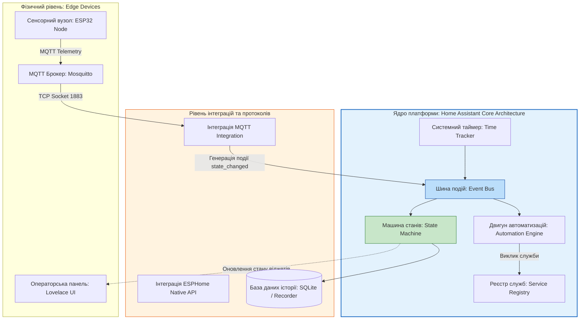
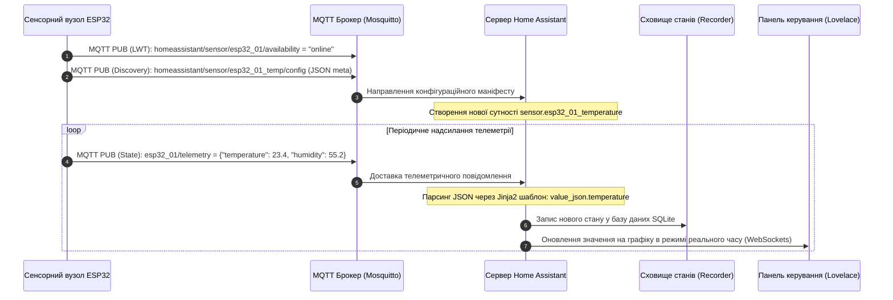

# Лабораторна робота № 11. Платформи розумного будинку: розгортання Home Assistant у контейнерному середовищі Docker та інтеграція MQTT-сенсорів

**Мета:** Дослідити архітектурні принципи функціонування сучасних відкритих платформ автоматизації будівель, опанувати концепцію локального управління (Local-First IoT Architecture) без залежності від зовнішніх хмарних провайдерів, набути практичних навичок розгортання та конфігурування контейнеризованого екземпляра Home Assistant Core за допомогою Docker Compose, реалізувати інтеграцію з брокером повідомлень Eclipse Mosquitto, а також розробити конфігурацію віртуальних сенсорів (Entities) мовою YAML та засобами протоколу автоматичного виявлення MQTT Discovery для прийому телеметрії від мікроконтролерних пристроїв.

**Стек технологій та інструменти:**
* **Мова програмування / Середовище:** Декларативна мова розмітки структурованих даних YAML, мова опису конфігурацій JSON, інтерпретатор командного рядка Linux Bash.
* **Платформа / Бібліотеки / Модулі:** Середовище контейнеризації Docker Engine (версія 24.0+), оркестратор Docker Compose v2, офіційний контейнерний образ `ghcr.io/home-assistant/home-assistant:stable`, брокер повідомлень `eclipse-mosquitto:2.0`, утиліти тестування протоколу MQTT `mosquitto-clients`.
* **Інструменти розробки:** Вебоглядач для взаємодії з панеллю керування Lovelace UI, консольний текстовий редактор `nano` або `vim`, термінал операційної системи Linux (Ubuntu / Debian / WSL2).

---

## 1 Теоретичні відомості

Платформи автоматизації «розумного будинку» (Smart Home Platforms) становлять ядро системного рівня додатків у трирівневій моделі Інтернету речей. Вони призначені для об'єднання різнорідних фізичних пристроїв, датчиків, актуаторів та мультимедійних підсистем, що функціонують за різними протоколами зв'язку (Wi-Fi, ZigBee, Z-Wave, BLE, Modbus), у єдину узгоджену систему управління з централізованим інтерфейсом моніторингу та механізмами виконання складних автоматизованих сценаріїв.

На противагу комерційним пропрієтарним хмарним екосистемам (таким як Tuya, Google Home, Apple HomeKit чи Xiaomi Mi Home), сучасні стандарти надійності та кібербезпеки вимагають впровадження систем із локальним контуром управління (Local-First Control). Платформа з відкритим вихідним кодом Home Assistant функціонує безпосередньо на граничному шлюзі (Edge Gateway) усередині локальної мережі, що гарантує збереження повної працездатності автоматизацій навіть за умови повної відсутності підключення до глобальної мережі Інтернет.

Архітектура ядра Home Assistant Core базується на модульній подійно-орієнтованій моделі (Event-Driven Architecture), центральними компонентами якої є шина подій (Event Bus), машина станів (State Machine), реєстр служб (Service Registry) та планувальник таймерів (Timer). Будь-яка зміна фізичної величини на сенсорі генерує подію `state_changed` на шині подій, після чого машина станів оновлює поточний стан відповідної сутності (Entity), а підсистема автоматизацій перевіряє наявність зареєстрованих тригерів для виконання керуючих дій.


*Рисунок 1 — Архітектурна схема ядра Home Assistant Core та інформаційних потоків обробки подій*

Основним будівельним блоком у Home Assistant є сутність (Entity) — узагальнене програмне представлення конкретного датчика або органу управління. Кожна сутність має унікальний ідентифікатор `entity_id`, що складається з назви домену та власного імені пристрою (наприклад, `sensor.living_room_temperature`, `switch.ventilation_relay`). Кожна сутність характеризується обов'язковим станом (`state`) та набором додаткових атрибутів (`attributes`), таких як одиниці вимірювання, час останнього оновлення або рівень заряду акумулятора.

Для інтеграції пристроїв через протокол MQTT застосовуються два основні підходи. Перший підхід передбачає ручне декларування сенсорів у конфігураційному файлі `configuration.yaml` із зазначенням топіка стану (`state_topic`) та шаблону вилучення даних за допомогою мови шаблонізації Jinja2 (`value_template: "{{ value_json.temperature }}"`). Другий підхід полягає у використанні механізму автоматичного виявлення (MQTT Discovery), за якого мікроконтролер при старті публікує спеціальний конфігураційний JSON-маніфест у службовий топік з префіксом `homeassistant/sensor/[device_id]/config`, після чого сутність автоматично створюється в системі без необхідності редагування конфігураційних файлів і перезавантаження сервера.


*Рисунок 2 — Діаграма послідовності ініціалізації пристрою та обробки телеметрії за протоколом MQTT Discovery*

Математична модель повної затримки оновлення стану системи ($T_{\text{state\_update}}$) від моменту зняття показу фізичним сенсором до моменту відображення нового значення на вебінтерфейсі Lovelace UI описується виразом:

$$T_{\text{state\_update}} = t_{\text{sensor\_acq}} + t_{\text{mcu\_enc}} + t_{\text{net\_tx}} + t_{\text{broker\_route}} + t_{\text{ha\_jinja}} + t_{\text{bus\_dispatch}} + t_{\text{ws\_render}}$$

де $t_{\text{sensor\_acq}}$ — апаратний час зчитування сигналу первинним перетворювачем (с);  
$t_{\text{mcu\_enc}}$ — тривалість формування та серіалізації структури JSON мікроконтролером (с);  
$t_{\text{net\_tx}}$ — затримка передавання мережевих кадрів через фізичний Wi-Fi/Ethernet канал зв'язку (с);  
$t_{\text{broker\_route}}$ — час обробки та маршрутизації повідомлення брокером Mosquitto (с);  
$t_{\text{ha\_jinja}}$ — тривалість виконання Jinja2-парсера шаблонів корисного навантаження у ядрі Home Assistant (с);  
$t_{\text{bus\_dispatch}}$ — час диспетчеризації події у черзі внутрішньої шини Event Bus (с);  
$t_{\text{ws\_render}}$ — затримка передавання оновленого стану через протокол WebSocket та відтворення DOM-елемента у вебоглядачі (с).

Оцінка мережевої ефективності передавання телеметрії за подійною моделлю на базі MQTT у порівнянні з традиційним циклічним опитуванням (HTTP Polling) визначається коефіцієнтом оптимізації трафіку ($\eta_{\text{traffic}}$):

$$\eta_{\text{traffic}} = \frac{V_{\text{HTTP}} \cdot f_{\text{poll}}}{V_{\text{MQTT\_head}} \cdot f_{\text{event}} + V_{\text{payload}} \cdot f_{\text{event}} + V_{\text{ping}} \cdot f_{\text{keepalive}}}$$

де $V_{\text{HTTP}}$ — повний обсяг HTTP-запиту та відповіді разом із заголовками (зазвичай 400–800 байт);  
$f_{\text{poll}}$ — частота опитування датчика сервером (Гц);  
$V_{\text{MQTT\_head}}$ — розмір фіксованого заголовка протоколу MQTT (від 2 до 5 байт);  
$V_{\text{payload}}$ — розмір корисного навантаження телеметрії у форматі JSON (байт);  
$f_{\text{event}}$ — середня частота виникнення фізичних подій або періодичність надсилання пакетів (Гц);  
$V_{\text{ping}}$ — обсяг службового пакету підтримки з'єднання `PINGREQ`/`PINGRESP` (2 байти);  
$f_{\text{keepalive}}$ — частота перевірки активності сесії (Гц).

---

## 2 Підготовка середовища та розгортання проєкту (Крок 0)

Для виконання роботи використовується контейнеризоване середовище Docker Engine, у якому паралельно розгортаються сервіси брокера Mosquitto та платформи Home Assistant Core.

1. Запустіть термінал операційної системи Linux та перейдіть у спільну робочу директорію IoT-стеку:

```bash
# Перехід до кореневого каталогу проектів
cd ~/iot_stack

# Створення необхідних підкаталогів для постійного сховища Home Assistant
mkdir -p ~/iot_stack/homeassistant/config
```

2. Створіть початковий конфігураційний файл `configuration.yaml` у каталозі налаштувань Home Assistant, якщо він відсутній:

```bash
touch ~/iot_stack/homeassistant/config/configuration.yaml
```

3. Надайте повні права доступу до каталогу конфігурації для запобігання помилкам створення внутрішньої бази даних SQLite процесом Home Assistant (який виконується у контейнері):

```bash
sudo chmod -R 777 ~/iot_stack/homeassistant/config
```

Структура каталогів та файлів розгорнутого лабораторного комплексу повинна мати такий вигляд:

```text
/home/user/iot_stack/
├── docker-compose.yml                  # Головний маніфест оркестрації контейнерів
├── mosquitto/
│   ├── config/
│   │   └── mosquitto.conf              # Конфігурація брокера MQTT
│   ├── data/
│   └── log/
└── homeassistant/
    └── config/
        ├── configuration.yaml          # Головний файл конфігурації платформи Home Assistant
        └── automations.yaml            # Файл збереження автоматичних сценаріїв
```

---

## 3 Порядок виконання роботи

### 3.1 Індивідуальні завдання

Кожен здобувач вищої освіти налаштовує в Home Assistant моніторинг індивідуального сенсорного вузла відповідно до закріпленого номера варіанта. Необхідно описати сутність типу `sensor` у файлі `configuration.yaml`, вказавши відповідний клас пристрою (`device_class`), одиниці вимірювання (`unit_of_measurement`), шаблон парсингу Jinja2 та топік доступності (`availability_topic`).

| Варіант | Назва підсистеми / Об'єкт | Топік стану (State Topic) | Досліджувані параметри в JSON | Клас пристрою (`device_class`) та одиниці |
| :---: | :--- | :--- | :--- | :--- |
| **1** | Кліматичний вузол спальні | `home/bedroom/climate/state` | `temp_val`, `hum_val`, `v_bat` | `temperature` ($^\circ\text{C}$), `humidity` ($\%$) |
| **2** | Моніторинг сонячного інвертора | `energy/solar/inverter/data` | `grid_voltage`, `power_w`, `temp_c` | `voltage` ($\text{V}$), `power` ($\text{W}$) |
| **3** | Станція обліку холодної води | `utilities/water/meter1/state` | `flow_m3`, `pressure_bar`, `leak` | `water` ($\text{m}^3$), `pressure` ($\text{bar}$) |
| **4** | Якість повітря дитячої кімнати | `home/nursery/air/telemetry` | `pm25_density`, `co2_ppm`, `aqi` | `pm25` ($\mu\text{g/m}^3$), `carbon_dioxide` ($\text{ppm}$) |
| **5** | Система контролю винного льоху | `cellar/zone1/climate/state` | `ambient_t`, `relative_h`, `lux` | `temperature` ($^\circ\text{C}$), `illuminance` ($\text{lx}$) |
| **6** | Смарт-електрощит котеджу | `power/panel/main/metrics` | `current_rms`, `active_pwr`, `pf` | `current` ($\text{A}$), `power` ($\text{W}$) |
| **7** | Метеостанція присадибної ділянки | `outdoor/meteo/station/state` | `baro_hpa`, `temp_ext`, `wind_ms` | `atmospheric_pressure` ($\text{hPa}$), `temperature` ($^\circ\text{C}$) |
| **8** | Моніторинг серверної шафи | `server/rack4/thermal/state` | `t_inlet`, `t_exhaust`, `fan_rpm` | `temperature` ($^\circ\text{C}$), `temperature` ($^\circ\text{C}$) |
| **9** | Контроль мікроклімату теплиці | `greenhouse/sectorA/sensors` | `soil_hum_pct`, `air_t`, `uv_idx` | `humidity` ($\%$), `temperature` ($^\circ\text{C}$) |
| **10** | Акумуляторна станція ДБЖ | `power/ups/battery/telemetry` | `cell_volt`, `soc_pct`, `temp_bms` | `battery` ($\%$), `temperature` ($^\circ\text{C}$) |
| **11** | Контроль опалення гаражного боксу| `garage/heating/state` | `coolant_t`, `room_t`, `pressure` | `temperature` ($^\circ\text{C}$), `pressure` ($\text{kPa}$) |
| **12** | Станція аерації домашнього басейну| `pool/water/sensors/data` | `water_t`, `redox_mv`, `ph_val` | `temperature` ($^\circ\text{C}$), `voltage` ($\text{mV}$) |
| **13** | Моніторинг зарядки електромобіля | `garage/evse/charger/state` | `charge_kwh`, `charge_pwr`, `t_gun` | `energy` ($\text{kWh}$), `power` ($\text{kW}$) |
| **14** | Смарт-вулик пасіки | `apiary/hive3/telemetry` | `internal_t`, `weight_kg`, `hum_pct`| `temperature` ($^\circ\text{C}$), `weight` ($\text{kg}$) |
| **15** | Автоматика гідропоніки | `hydro/nft/system/state` | `ec_ms`, `solution_t`, `water_lvl` | `temperature` ($^\circ\text{C}$), `humidity` ($\%$) |
| **16** | Моніторинг теплового насоса | `hvac/heatpump/circuit/data` | `t_evap`, `t_cond`, `cop_val` | `temperature` ($^\circ\text{C}$), `temperature` ($^\circ\text{C}$) |
| **17** | Охоронний контур периметра | `security/perimeter/node2` | `vib_rms`, `batt_pct`, `tamper` | `battery` ($\%$), `voltage` ($\text{V}$) |
| **18** | Контроль вентиляції кухні | `home/kitchen/hood/metrics` | `voc_index`, `co_ppm`, `air_flow` | `volatile_organic_compounds_parts`, `carbon_monoxide` ($\text{ppm}$) |
| **19** | Розумна сушарка одягу | `appliances/dryer/state` | `drum_t`, `moisture_val`, `power` | `temperature` ($^\circ\text{C}$), `power` ($\text{W}$) |
| **20** | Система поливу газону | `garden/irrigation/zone4` | `soil_t`, `moisture_raw`, `liters` | `temperature` ($^\circ\text{C}$), `volume` ($\text{L}$) |

---

### 3.2 Покроковий алгоритм та розв'язок еталонного прикладу

Як еталонний приклад реалізується **«Багатоканальний модуль моніторингу безпеки та мікроклімату Smart Safety Edge Node»**, дані якого публікуються у топік `smartroom/sensor_hub/state`.

Параметри еталонної системи:
* Мережевий топік телеметрії: `smartroom/sensor_hub/state`
* Топік доступності пристрою (Availability/LWT): `smartroom/sensor_hub/status`
* Структура корисного навантаження JSON:
  `{"device": "ESP32_HUB_01", "temperature": 25.64, "humidity": 52.80, "co2": 650, "battery": 94}`
* Домени сутностей, що створюються:
  1. `sensor.smart_safety_temperature` (клас `temperature`, одиниці $^\circ\text{C}$);
  2. `sensor.smart_safety_humidity` (клас `humidity`, одиниці $\%$);
  3. `sensor.smart_safety_co2` (клас `carbon_dioxide`, одиниці $\text{ppm}$);
  4. `sensor.smart_safety_battery` (клас `battery`, одиниці $\%$).

#### Крок 1. Конфігурація мультиконтейнерного стеку Docker Compose

Відкрийте файл `docker-compose.yml` у каталозі `~/iot_stack/` за допомогою редактора `nano`:

```bash
nano ~/iot_stack/docker-compose.yml
```

Внесіть повну конфігурацію, яка запускає брокер Eclipse Mosquitto та сервіс Home Assistant у єдиній конфігурації:

```yaml
version: '3.8'

# =====================================================================
# ОРКЕСТРАЦІЯ СЕРВІСІВ IOT: MQTT BROKER + HOME ASSISTANT CORE
# =====================================================================
services:

  # -------------------------------------------------------------------
  # СЕРВІС 1: MQTT БРОКЕР ECLIPSE MOSQUITTO
  # -------------------------------------------------------------------
  mosquitto:
    image: eclipse-mosquitto:2.0
    container_name: iot_mosquitto
    restart: unless-stopped
    ports:
      - "1883:1883"
    volumes:
      - ./mosquitto/config/mosquitto.conf:/mosquitto/config/mosquitto.conf:ro
      - ./mosquitto/data:/mosquitto/data
      - ./mosquitto/log:/mosquitto/log
    networks:
      iot_local_net:
        ipv4_address: 172.29.0.10
    deploy:
      resources:
        limits:
          cpus: '0.50'
          memory: 256M

  # -------------------------------------------------------------------
  # СЕРВІС 2: ПЛАТФОРМА АВТОМАТИЗАЦІЇ HOME ASSISTANT
  # -------------------------------------------------------------------
  homeassistant:
    image: ghcr.io/home-assistant/home-assistant:stable
    container_name: iot_homeassistant
    restart: unless-stopped
    privileged: true
    environment:
      - TZ=Europe/Kyiv
    ports:
      - "8123:8123"
    volumes:
      - ./homeassistant/config:/config
      - /etc/localtime:/etc/localtime:ro
    depends_on:
      - mosquitto
    networks:
      iot_local_net:
        ipv4_address: 172.29.0.20
    deploy:
      resources:
        limits:
          cpus: '1.50'
          memory: 1024M

# =====================================================================
# ВІРТУАЛЬНА МЕРЕЖА ДЛЯ ВНУТРІШНЬОЇ ВЗАЄМОДІЇ СЕРВІСІВ
# =====================================================================
networks:
  iot_local_net:
    name: iot_local_net
    driver: bridge
    ipam:
      driver: default
      config:
        - subnet: 172.29.0.0/16
          gateway: 172.29.0.1
```

Збережіть зміни та закрийте файл (`Ctrl+O`, `Enter`, `Ctrl+X`).

#### Крок 2. Декларативне налаштування MQTT-сенсорів у configuration.yaml

Відкрийте файл налаштувань Home Assistant:

```bash
nano ~/iot_stack/homeassistant/config/configuration.yaml
```

Внесіть повний текст конфігурації, яка визначає структуру чотирьох сенсорів на основі вхідного JSON-пакета:

```yaml
# =====================================================================
# БАЗОВА КОНФІГУРАЦІЯ HOME ASSISTANT CORE
# =====================================================================
default_config:

# Дозволяє використовувати інтерфейс користувача для управління автоматизаціями
automation: !include automations.yaml
script: !include scripts.yaml
scene: !include scenes.yaml

# =====================================================================
# ДЕКЛАРАТИВНА ІНТЕГРАЦІЯ СЕНСОРІВ ЧЕРЕЗ СТЕК MQTT
# =====================================================================
mqtt:
  sensor:
    # -----------------------------------------------------------------
    # СЕНСОР 1: ТЕМПЕРАТУРА ПРИМІЩЕННЯ
    # -----------------------------------------------------------------
    - name: "Smart Safety Temperature"
      unique_id: "smart_safety_temp_01"
      state_topic: "smartroom/sensor_hub/state"
      availability_topic: "smartroom/sensor_hub/status"
      payload_available: "online"
      payload_not_available: "offline"
      value_template: "{{ value_json.temperature }}"
      unit_of_measurement: "°C"
      device_class: "temperature"
      state_class: "measurement"
      suggested_display_precision: 2
      icon: "mdi:thermometer"

    # -----------------------------------------------------------------
    # СЕНСОР 2: ВІДНОСНА ВОЛОГІСТЬ ПОВІТРЯ
    # -----------------------------------------------------------------
    - name: "Smart Safety Humidity"
      unique_id: "smart_safety_hum_01"
      state_topic: "smartroom/sensor_hub/state"
      availability_topic: "smartroom/sensor_hub/status"
      payload_available: "online"
      payload_not_available: "offline"
      value_template: "{{ value_json.humidity }}"
      unit_of_measurement: "%"
      device_class: "humidity"
      state_class: "measurement"
      suggested_display_precision: 1
      icon: "mdi:water-percent"

    # -----------------------------------------------------------------
    # СЕНСОР 3: КОНЦЕНТРАЦІЯ ДІОКСИДУ ВУГЛЕЦЮ (CO2)
    # -----------------------------------------------------------------
    - name: "Smart Safety CO2 Level"
      unique_id: "smart_safety_co2_01"
      state_topic: "smartroom/sensor_hub/state"
      availability_topic: "smartroom/sensor_hub/status"
      payload_available: "online"
      payload_not_available: "offline"
      value_template: "{{ value_json.co2 }}"
      unit_of_measurement: "ppm"
      device_class: "carbon_dioxide"
      state_class: "measurement"
      icon: "mdi:molecule-co2"

    # -----------------------------------------------------------------
    # СЕНСОР 4: РІВЕНЬ ЗАРЯДУ АКУМУЛЯТОРА ВУЗЛА
    # -----------------------------------------------------------------
    - name: "Smart Safety Battery"
      unique_id: "smart_safety_batt_01"
      state_topic: "smartroom/sensor_hub/state"
      availability_topic: "smartroom/sensor_hub/status"
      payload_available: "online"
      payload_not_available: "offline"
      value_template: "{{ value_json.battery }}"
      unit_of_measurement: "%"
      device_class: "battery"
      state_class: "measurement"
      icon: "mdi:battery"
```

Збережіть та закрийте файл конфігурації.

#### Крок 3. Запуск та первинна ініціалізація Home Assistant

1. Запустіть контейнери за допомогою команди Docker Compose:

```bash
docker compose up -d
```

2. Відкрийте вебоглядач та перейдіть за адресою: `http://localhost:8123` (первинна ініціалізація бази даних може тривати 30–60 секунд).
3. На сторінці майстра налаштування виконайте реєстрацію головного адміністратора:
   * **Ім'я:** `IoT Administrator`
   * **Ім'я користувача:** `admin`
   * **Пароль:** `adminpassword123`
4. Пройдіть кроки вибору географічного розташування та одиниць вимірювання (оберіть метричну систему).
5. Підключіть інтеграцію MQTT у графічному інтерфейсі Home Assistant:
   * Перейдіть у меню **Settings (Налаштування)** $\to$ **Devices & Services (Пристрої та сервіси)**;
   * Натисніть кнопку **Add Integration (Додати інтеграцію)** у правому нижньому кутку;
   * У рядку пошуку введіть `MQTT` та оберіть знайдений компонент;
   * У вікні параметрів з'єднання вкажіть адресу брокера: `172.29.0.10` (або `127.0.0.1`, якщо використано режим мережі `host`), порт `1883`;
   * Залиште поля логіна і пароля порожніми (відповідно до конфігурації `allow_anonymous true`) та натисніть кнопку **Submit (Надіслати)**.

#### Крок 4. Створення скрипта емуляції сенсорного вузла ESP32

Створіть виконуваний скрипт мовою Bash, який моделює циклічну роботу мікроконтролера ESP32:

```bash
nano ~/iot_stack/homeassistant/mock_esp32.sh
```

Внесіть повний код емулятора:

```bash
#!/bin/bash
# =====================================================================
# ЕМУЛЯТОР СЕНСОРНОГО ВУЗЛА ESP32 ДЛЯ ПЕРЕДАЧІ ТЕЛЕМЕТРІЇ В MQTT
# =====================================================================

BROKER="127.0.0.1"
PORT="1883"
STATE_TOPIC="smartroom/sensor_hub/state"
STATUS_TOPIC="smartroom/sensor_hub/status"

echo "[ESP32]: Ініціалізація зв'язку з брокером..."

# Публікація статусу доступності пристрою (online)
mosquitto_pub -h $BROKER -p $PORT -t "$STATUS_TOPIC" -m "online" -r -q 1

# Початкові значення фізичних параметрів
TEMP=22.50
HUM=50.0
CO2=450
BATT=100

echo "[ESP32]: Запуск циклу передавання телеметричних вимірювань (Ctrl+C для виходу)..."

while true; do
    # Моделювання випадкових коливань параметрів
    TEMP=$(echo "$TEMP + ($(shuf -i -5-5 -n 1) / 10)" | bc -l)
    HUM=$(echo "$HUM + ($(shuf -i -3-3 -n 1) / 10)" | bc -l)
    CO2=$(echo "$CO2 + $(shuf -i -15-25 -n 1)" | bc)
    BATT=$(echo "$BATT - 0.05" | bc -l)

    # Формування структурованого корисного навантаження JSON
    PAYLOAD=$(printf '{"device":"ESP32_HUB_01","temperature":%.2f,"humidity":%.1f,"co2":%d,"battery":%.0f}' "$TEMP" "$HUM" "$CO2" "$BATT")

    # Публікація повідомлення на брокер
    mosquitto_pub -h $BROKER -p $PORT -t "$STATE_TOPIC" -m "$PAYLOAD" -q 1

    echo "[ESP32 НАДІСЛАНО]: $PAYLOAD"
    sleep 3
done
```

Надайте права на запуск та виконайте стартове тестування:

```bash
chmod +x ~/iot_stack/homeassistant/mock_esp32.sh
```

---

### 3.3 Запуск, тестування та перевірка результатів

1. Запустіть емулятор передачі телеметрії у фоновому терміналі:

```bash
~/iot_stack/homeassistant/mock_esp32.sh
```

#### Приклад консольного виводу працюючого емулятора:

```text
[ESP32]: Ініціалізація зв'язку з брокером...
[ESP32]: Запуск циклу передавання телеметричних вимірювань (Ctrl+C для виходу)...
[ESP32 НАДІСЛАНО]: {"device":"ESP32_HUB_01","temperature":22.80,"humidity":50.3,"co2":465,"battery":100}
[ESP32 НАДІСЛАНО]: {"device":"ESP32_HUB_01","temperature":23.10,"humidity":49.8,"co2":480,"battery":100}
[ESP32 НАДІСЛАНО]: {"device":"ESP32_HUB_01","temperature":23.40,"humidity":50.1,"co2":492,"battery":100}
[ESP32 НАДІСЛАНО]: {"device":"ESP32_HUB_01","temperature":23.90,"humidity":51.4,"co2":510,"battery":99}
```

2. Перевірте стан сутностей у панелі розробника Home Assistant:
   * Перейдіть у меню **Developer Tools (Інструменти розробника)** $\to$ вкладка **States (Стани)**;
   * У полі фільтра за сутностями введіть префікс `sensor.smart_safety`;
   * Переконайтеся, що всі 4 сенсори мають числові значення станів, що динамічно змінюються кожні 3 секунди, а їхній стан доступності відповідає значенню `online`.

```text
+------------------------------------+---------------+------------------------------------------------------+
| Entity ID                          | State         | Attributes                                           |
+------------------------------------+---------------+------------------------------------------------------+
| sensor.smart_safety_temperature    | 23.90         | unit_of_measurement: °C, device_class: temperature   |
| sensor.smart_safety_humidity       | 51.4          | unit_of_measurement: %, device_class: humidity       |
| sensor.smart_safety_co2_level      | 510           | unit_of_measurement: ppm, device_class: carbon_dioxide|
| sensor.smart_safety_battery        | 99            | unit_of_measurement: %, device_class: battery        |
+------------------------------------+---------------+------------------------------------------------------+
```

3. Налаштуйте графічну панель моніторингу Lovelace Dashboard:
   * Перейдіть на головний екран **Overview (Огляд)**;
   * Натисніть три крапки у правому верхньому кутку та оберіть **Edit Dashboard (Редагувати панель)**;
   * Натисніть **Add Card (Додати картку)** та оберіть тип картки **Gauge (Шкала)**;
   * Прив'яжіть сутність `sensor.smart_safety_temperature`, вкажіть мінімум `0`, максимум `50`, активуйте шкалу рівнів (зелений $18\dots 24$, жовтий $25\dots 30$, червоний $>30$);
   * Додайте картку типу **History Graph (Графік історії)** для відображення динаміки зміни концентрації CO2 та температури в часі.

4. Проведіть перевірку обробки аварійного вимкнення пристрою (LWT Mechanism):
   * Надішліть повідомлення втрати зв'язку в топік доступності:
     ```bash
     mosquitto_pub -h 127.0.0.1 -p 1883 -t "smartroom/sensor_hub/status" -m "offline" -r -q 1
     ```
   * Переконайтеся, що у вебінтерфейсі Home Assistant усі картки сенсорів перейшли у візуальний стан **Unavailable (Недоступний)**, що підтверджує коректність роботи механізму контролю живучості вузла.

---

## 4 Вимоги до змісту звіту

Звіт оформлюється відповідно до стандарту ДСТУ 3008:2015 і повинен містити такі обов'язкові структурні розділи:

1. **Титульна сторінка** із зазначенням повної назви закладу вищої освіти, факультету, кафедри, дисципліни, номера роботи, варіанта, академічної групи та ПІБ студента й викладача.
2. **Мета роботи** та теоретичне обґрунтування концепції Local-First архітектури розумного будинку.
3. **Постановка індивідуального завдання** закріпленого варіанта: назва досліджуваного об'єкта, структура топіків MQTT, опис полів вхідного JSON-пакета, класи пристроїв та одиниці вимірювання.
4. **Повний лістинг конфігураційного файлу** `docker-compose.yml` з коментарями щодо прокидання портів, монтування каталогів даних та виділення апаратних ресурсів для контейнера Home Assistant.
5. **Лістинг конфігурації сенсорів** у файлі `configuration.yaml` із вичерпним поясненням синтаксису Jinja2 шаблонів вилучення числових значень.
6. **Повний текст скрипта емуляції вузла ESP32** мовою Bash із коментарями до логіки формування повідомлень.
7. **Результати тестування:**
   * Скріншот вкладки *Developer Tools $\to$ States* платформи Home Assistant із відображенням створених сутностей та їхніх атрибутів;
   * Скріншот налаштованої панелі моніторингу Lovelace UI з віджетами шкал (Gauge) та графіків історії (History Graph) під час прийому реальних даних;
   * Скріншот реакції вебінтерфейсу на перехід сутності у стан `Unavailable` при надсиланні статусу `offline`.
8. **Аналітичні висновки**, у яких проведено аналіз надійності зв'язку через MQTT, оцінено часові затримки оновлення даних та обґрунтовано переваги контейнерного розгортання платформи Home Assistant.

---

## 5 Контрольні запитання для захисту роботи

1. **У чому полягає фундаментальна відмінність підходу Local-First від хмарних платформ управління розумним будинком?** Які ризики для приватності користувача та стабільності функціонування виникають при використанні виключно хмарних IoT-сервісів?
2. **Опишіть внутрішню архітектуру Home Assistant Core.** Як взаємодіють між собою Event Bus, State Machine та Service Registry при зміні показань одного з сенсорів?
3. **Поясніть принцип функціонування мови шаблонів Jinja2 у конфігураціях Home Assistant.** Як працює вираз `{{ value_json.temperature | float }}` при десеріалізації вхідного MQTT-пакета?
4. **Яке призначення параметра `device_class` у конфігурації сенсора?** Як вибір класу пристрою (наприклад, `temperature` vs `energy`) впливає на поведінку інтерфейсу Lovelace та правила довготривалого збереження історії (Long-Term Statistics)?
5. **Як працює механізм автоматичного виявлення MQTT Discovery у Home Assistant?** Яку структуру повинен мати топік конфігурації та корисне навантаження, щоб пристрій зареєструвався у системі без редагування `configuration.yaml`?
6. **Яку роль відіграє параметр `availability_topic` та механізм Last Will and Testament (LWT) протоколу MQTT у забезпеченні достовірності стану системи?** Чому небезпечно відображати останнє отримане значення сенсора, якщо фізичний вузол втратив електроживлення?