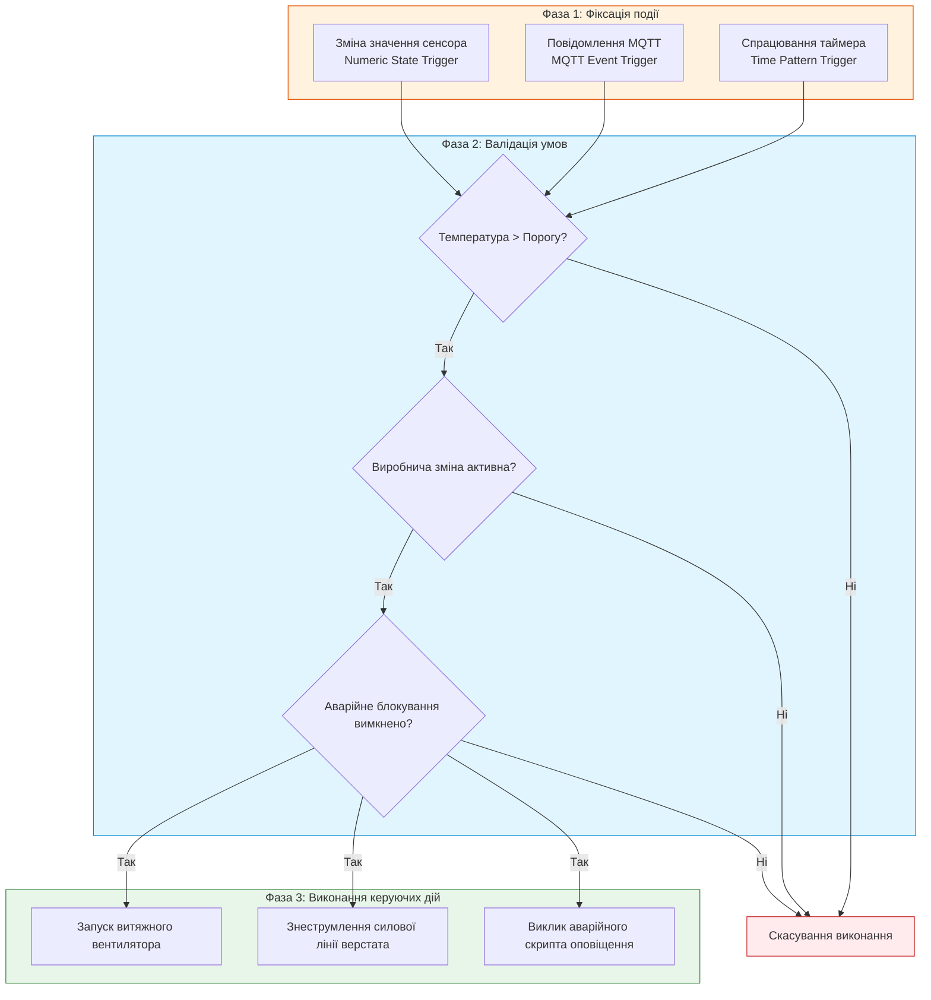
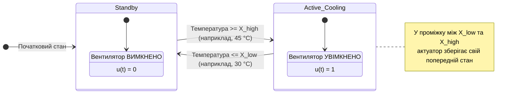

# Лабораторна робота № 12. Декларативне програмування сценаріїв автоматизації та скриптів у системі Home Assistant для задач промислового Інтернету речей (IIoT)

**Мета:** Дослідити механізми функціонування подійно-орієнтованих систем управління технологічними процесами, опанувати принципи побудови алгоритмів автоматичного реагування на базі моделі «Тригер — Умова — Дія» (Trigger — Condition — Action), набути практичних навичок проектування складних виробничих сценаріїв мовою розмітки YAML та шаблонізатором Jinja2 у середовищі Home Assistant, розробити модульні скрипти виконання послідовних керуючих операцій та реалізувати надійний захист промислового обладнання від аварійних режимів роботи.

**Стек технологій та інструменти:**
* **Мова програмування / Середовище:** Декларативна мова опису конфігурацій YAML, мова шаблонізації даних Jinja2, інтерпретатор командного рядка Linux Bash.
* **Платформа / Бібліотеки / Модулі:** Платформа автоматизації Home Assistant Core (версія 2024.1+), брокер повідомлень Eclipse Mosquitto, модуль віртуальних компонентів `template`, модуль створення допоміжних змінних `input_boolean` та `input_number`.
* **Інструменти розробки:** Вебоглядач для роботи з панеллю Home Assistant (розділи Automations & Scenes, Developer Tools), консольний редактор `nano` або `vim`, термінал операційної системи Linux.

---

## 1 Теоретичні відомості

У концепції Індустрії 4.0 та промислового Інтернету речей (Industrial Internet of Things, IIoT) ключовою вимогою до систем автоматизації є децентралізоване прийняття рішень у режимі реального часу. На відміну від класичних систем диспетчеризації SCADA, де логіка жорстко прив'язана до циклічного сканування входів програмованих логічних контролерів (ПЛК), платформи класу Home Assistant використовують гнучку подійно-орієнтовану архітектуру (Event-Driven Architecture). У такій системі обчислювальні ресурси задіюються виключно в момент виникнення конкретної події, що значно підвищує швидкодію та енергетичну ефективність обчислювального вузла.

Автоматизація в Home Assistant описується трьома фундаментальними компонентами:
* тригери визначають вихідні умови запуску сценарію, якими можуть виступати зміна числового значення датчика, надходження повідомлення у топік MQTT, перехід дискретного сенсора в інший стан або спрацювання таймера розкладу;
* умови виконують додаткову логічну фільтрацію події, перевіряючи, чи дозволено виконання дій у поточний момент часу, з урахуванням режимів роботи підприємства, стану суміжних механізмів або значень допоміжних змінних;
* дії представляють собою кінцеві керуючі впливи на актуатори, що реалізуються через виклики служб (Service Calls), запуск автономних скриптів, активацію світлозвукової сигналізації чи відправку термінових повідомлень черговому інженеру.


*Рисунок 1 — Алгоритмічна схема трикомпонентної моделі виконання сценарію автоматизації у ядрі Home Assistant*

Для уникнення помилкових частих спрацьовувань силового комутаційного обладнання (ефекту брязкоту контактів або частих пусків електродвигунів через флуктуації вимірюваного сигналу) в промислових алгоритмах обов'язково застосовують гістерезисне регулювання із зоною нечутливості (Deadband). Математична функція гістерезисного керування актуатором $u(t)$ описується рівнянням:

$$u(t) = \begin{cases} 1, & \text{якщо } x(t) \ge X_{\text{high}} \\ 0, & \text{якщо } x(t) \le X_{\text{low}} \\ u(t - \Delta t), & \text{якщо } X_{\text{low}} < x(t) < X_{\text{high}} \end{cases}$$

де $u(t)$ — вихідний стан виконавчого реле (значення $1$ відповідає увімкненому стану, $0$ — вимкненому);  
$x(t)$ — поточне фізичне значення вимірюваного параметра технологічного середовища;  
$X_{\text{high}}$ — верхній поріг активації охолоджувального або аварійного механізму;  
$X_{\text{low}}$ — нижній поріг деактивації механізму;  
$\Delta X = X_{\text{high}} - X_{\text{low}}$ — ширина зони нечутливості регулятора (гістерезис).


*Рисунок 2 — Діаграма переходів станів гістерезисного керування технологічним актуатором*

Для фільтрації короткочасних випадкових викидів сигналу (поодиноких некоректних відліків АЦП) у конфігурації тригерів Home Assistant використовується часова затримка підтвердження стану (параметр `for`). Математично спрацювання такого тригера описується за допомогою індикаторної функції:

$$\text{Trigger}(t) = \begin{cases} 1, & \text{якщо } \forall \tau \in [t - \Delta t_{\text{verify}}, t] : x(\tau) \ge X_{\text{threshold}} \\ 0, & \text{в іншому випадку} \end{cases}$$

де $\Delta t_{\text{verify}}$ — мінімально необхідна тривалість безперервного перевищення порогового значення для підтвердження аварійного стану (с);  
$X_{\text{threshold}}$ — встановлена критична межа технологічного параметра.

У складних автоматизаціях критичне значення має режим виконання сценарію (параметр `mode`):
* режим `single` блокує повторний запуск сценарію, якщо попередній екземпляр ще не завершив виконання дій;
* режим `restart` негайно перериває поточні дії та ініціалізує виконання сценарію спочатку при надходженні нового тригера;
* режим `queued` додає нові події у чергу послідовної обробки;
* режим `parallel` створює ізольовані потоки виконання для кожної події одночасно.

---

## 2 Підготовка середовища та розгортання проєкту (Крок 0)

Перед початком виконання лабораторної роботи необхідно переконатися, що платформа Home Assistant та брокер Mosquitto успішно функціонують у контейнерному оточенні Docker, а також налаштувати файлову структуру для збереження сценаріїв.

1. Запустіть термінал операційної системи Linux та перейдіть до каталогу конфігурацій Home Assistant:

```bash
cd ~/iot_stack/homeassistant/config
```

2. Перевірте наявність та права доступу до ключових файлів конфігурації платформи:

```bash
# Перевірка наявності файлів конфігурації, автоматизацій та скриптів
ls -la configuration.yaml automations.yaml scripts.yaml
```

3. У разі відсутності файлів `automations.yaml` або `scripts.yaml` створіть їх вручну за допомогою команд:

```bash
touch automations.yaml scripts.yaml
```

4. Відкрийте головний файл `configuration.yaml` у текстовому редакторі `nano`:

```bash
nano configuration.yaml
```

5. Переконайтеся, що головний файл містить директиви включення окремих файлів автоматизацій, скриптів та віртуальних датчиків:

```yaml
# =====================================================================
# ГОЛОВНИЙ ФАЙЛ КОНФІГУРАЦІЇ HOME ASSISTANT
# =====================================================================
default_config:

# Підключення модульних файлів логіки
automation: !include automations.yaml
script: !include scripts.yaml
scene: !include scenes.yaml

# Увімкнення підсистеми журналювання для відстеження спрацювання тригерів
logger:
  default: info
  logs:
    homeassistant.components.automation: debug
    homeassistant.components.script: debug
```

Збережіть файл (`Ctrl+O`, `Enter`) та вийдіть із редактора (`Ctrl+X`).

6. Створіть допоміжну структуру для збереження звітних логів тестування:

```bash
mkdir -p ~/iot_stack/lab12_automation/{logs,tests}
cd ~/iot_stack/lab12_automation
```

---

## 3 Порядок виконання роботи

### 3.1 Індивідуальні завдання

Кожен здобувач вищої освіти розробляє унікальний комплекс автоматизації виробничої ділянки відповідно до свого варіанта. Необхідно створити опис віртуальних сенсорів, розробити багаторівневий сценарій у файлі `automations.yaml` та реалізувати допоміжний керуючий скрипт у `scripts.yaml`.

| Варіант | Технологічний об'єкт IIoT | Тригер події (Trigger) | Умови блокування / дозволу (Conditions) | Послідовність дій та реакція (Actions) |
| :---: | :--- | :--- | :--- | :--- |
| **1** | Сушильна камера деревини | Вологість дошки < 10% протягом 5 хв | Температура в камері > $60^\circ\text{C}$ та зміна денна | Зупинити нагрівач, увімкнути циркуляційний обдув, надіслати звіт |
| **2** | Магістральний нафтовий насос | Тиск на виході > 25 бар | Насос увімкнений та масло < $75^\circ\text{C}$ | Плавно зменшити оберти ЧП на 30%, надіслати попередження оператору |
| **3** | Термопластавтомат (ТПА) | Температура сопла > $240^\circ\text{C}$ | Захисний кожух закритий та гідравліка в нормі | Увімкнути водяне охолодження форми, зареєструвати перевищення |
| **4** | Склад легкозаймистих речовин | Концентрація парів спирту > 200 ppm | Рівень задимленості нормальний | Активувати вибухозахищену витяжку, заблокувати автоматичні двері |
| **5** | Зварювальний робот-маніпулятор | Струм зварювального пальника > 350 А | Робот у русі та газ захисту подається | Знизити швидкість подачі дроту, запустити додатковий обдув шва |
| **6** | Компресор високого тиску | Вібрація підшипника > 5.5 мм/с (10 с) | Тиск ресивера > 8 бар | Аварійно вимкнути двигун, скинути тиск через електроклапан |
| **7** | Гальванічна ванна хромування | Рівень електроліту < 70% | Струм анода активний | Вимкнути випрямляч струму, запустити насос доливу дистиляту |
| **8** | Зерновий вертикальний силос | Температура зерна > $32^\circ\text{C}$ | Вологість повітря зовні < 65% | Запустити нижні аераційні вентилятори на 20 хв, увімкнути індикацію |
| **9** | ЧПУ фрезерний обробний центр | Температура шпинделя > $55^\circ\text{C}$ | Верстат у режимі виконання програми | Поставити програму на паузу (Feed Hold), подати МОР на підшипники |
| **10** | Лінія розливу стерильних ліків | Тиск у чистій кімнаті < 20 Па (3 с) | Лінія розливу працює | Зупинити подачу флаконів, перевести приплив повітря на 100% потужності |
| **11** | Котельна установка підприємства | Тиск пари > 12 бар | Рівень води в барабані котла в нормі | Перекрити відсічний газовий клапан, увімкнути продувку топки |
| **12** | Фарбувальна камера кузовів | Концентрація розчинника > 400 мг/м³ | Вхідні двері заблоковані | Зняти живлення з фарбопультів, запустити рециркуляційний фільтр |
| **13** | Автоклав полімеризації | Тиск у камері досяг 6 бар | Температура всередині $\in [160, 180]^\circ\text{C}$ | Запустити таймер витримки на 45 хв, перейти в режим термостатування |
| **14** | Цех лазерного розкрою металу | Відкриття захисної огорожі зони різу | Лазерний промінь активований | Миттєве апаратне вимкнення лазера, увімкнення червоного стробоскопа |
| **15** | Трансформаторна підстанція 10кВ | Температура трансформаторного масла > $85^\circ\text{C}$ | Навантаження мережі > 80% | Увімкнути другу групу вентиляторів обдуву, надіслати алярм черговому |
| **16** | Аміачна холодильна установка | Концентрація NH3 у цеху > 20 ppm | Система загазованості увімкнена | Запустити водяну завісу над ресивером, вимкнути аміачні насоси |
| **17** | Прес гарячого штампування | Зусилля гідроциліндра > 200 тонн | Захисна світлова штора перекрита | Негайно зупинити рух повзуна преса, зафіксувати аварійний стоп |
| **18** | Конвеєр транспортування руди | Проковзування стрічки конвеєра > 15% | Попередній бункер завантажений | Зупинити живильник подачі породи, через 10 с зупинити конвеєр |
| **19** | Індукційна плавильна піч | Температура футеровки > $1400^\circ\text{C}$ | Протік охолоджувальної води в нормі | Знизити потужність індуктора на 50%, подати сигнал машиністу крана |
| **20** | Станція рекуперації тепла газів | Температура вихідних газів > $300^\circ\text{C}$ | Насос рекуператора увімкнений | Відкрити байпасну заслінку теплообмінника, запустити аварійний насос |

---

### 3.2 Покроковий алгоритм та розв'язок еталонного прикладу

Як еталонний приклад реалізується **«Автоматизована система багаторівневого захисту та охолодження компресорного блоку цеху Smart Factory»**, яка демонструє поєднання гістерезисного керування та виконання комплексного аварійного скрипта.

Параметри еталонного технологічного об'єкта:
* Досліджуваний сенсор: Датчик температури компресорної головки `sensor.compressor_head_temperature` ($^\circ\text{C}$).
* Допоміжний сенсор: Датчик наявності протоку охолоджувальної рідини `binary_sensor.cooling_water_flow` (on / off).
* Виконавчі актуатори: Силове реле компресора `switch.compressor_motor_relay`, реле основного вентилятора `switch.cooling_fan_relay`, електроклапан скидання тиску `switch.emergency_exhaust_valve`.
* Допоміжний перемикач режиму: `input_boolean.factory_emergency_lock` (блокування повторного пуску).
* Алгоритм роботи:
  1. Якщо температура компресора перевищує $45^\circ\text{C}$ безперервно протягом 5 секунд, увімкнути охолоджувальний вентилятор (гістерезис: вимкнення при падінні температури нижче $32^\circ\text{C}$).
  2. Якщо температура досягає критичної позначки $75^\circ\text{C}$ АБО зникає протік води під час роботи двигуна, негайно ініціювати аварійний скрипт (зупинка двигуна, скидання тиску, блокування повторного пуску, фіксація логів).

#### Крок 1. Створення віртуальних датчиків та актуаторів

Для створення стенду додайте опис віртуальних сенсорів і комутаторів у файл `configuration.yaml`:

```bash
nano ~/iot_stack/homeassistant/config/configuration.yaml
```

Додайте наступний повний фрагмент коду до вмісту файлу:

```yaml
# =====================================================================
# СТВОРЕННЯ ВІРТУАЛЬНИХ ПРИЛАДІВ ТА ЗМІННИХ ДЛЯ ТЕСТУВАННЯ
# =====================================================================

# Допоміжна змінна аварійного блокування системи
input_boolean:
  factory_emergency_lock:
    name: "Аварійне блокування цеху"
    icon: mdi:shield-alert
    initial: false

  cooling_water_flow_mock:
    name: "Датчик протоку охолоджувача (Емулятор)"
    icon: mdi:water-check
    initial: true

# Допоміжна числова змінна для емуляції нагріву компресора
input_number:
  compressor_temp_mock:
    name: "Температура компресора (Емулятор)"
    initial: 25.0
    min: 0.0
    max: 100.0
    step: 0.5
    unit_of_measurement: "°C"
    icon: mdi:thermometer-alert

# Прив'язка віртуальних сенсорів до змінних стану
template:
  - sensor:
      - name: "Compressor Head Temperature"
        unique_id: "sensor_comp_head_temp"
        unit_of_measurement: "°C"
        device_class: "temperature"
        state: "{{ states('input_number.compressor_temp_mock') | float(0) }}"

  - binary_sensor:
      - name: "Cooling Water Flow"
        unique_id: "sensor_cooling_water_flow"
        device_class: "running"
        state: "{{ states('input_boolean.cooling_water_flow_mock') }}"

# Емулятори виконавчих реле та клапанів
input_boolean:
  compressor_motor_state:
    name: "Електродвигун компресора"
    icon: mdi:engine
    initial: true

  cooling_fan_state:
    name: "Охолоджувальний вентилятор"
    icon: mdi:fan
    initial: false

  emergency_exhaust_valve_state:
    name: "Клапан аварійного скидання тиску"
    icon: mdi:valve
    initial: false
```

Збережіть та закрийте файл конфігурації.

#### Крок 2. Розробка аварійного скрипта у scripts.yaml

Скрипти дозволяють описати послідовність дій із фіксованими часовими інтервалами затримки. Відкрийте файл `scripts.yaml`:

```bash
nano ~/iot_stack/homeassistant/config/scripts.yaml
```

Внесіть повний код аварійного алгоритму:

```yaml
# =====================================================================
# МОДУЛЬНИЙ СКРИПТ АВАРІЙНОГО ЗНЕСТРУМЛЕННЯ ТА ЗАХИСТУ КОМПРЕСОРА
# =====================================================================

emergency_compressor_shutdown:
  alias: "Аварійна зупинка та продувка компресора"
  icon: mdi:alert-octagon
  mode: single
  sequence:
    # 1. Негайне вимкнення контактора силового двигуна
    - service: input_boolean.turn_off
      target:
        entity_id: input_boolean.compressor_motor_state

    # 2. Активація блокування повторного пуску
    - service: input_boolean.turn_on
      target:
        entity_id: input_boolean.factory_emergency_lock

    # 3. Примусове ввімкнення охолодження на повну потужність
    - service: input_boolean.turn_on
      target:
        entity_id: input_boolean.cooling_fan_state

    # 4. Відкриття клапана скидання тиску для усунення гідроудару
    - service: input_boolean.turn_on
      target:
        entity_id: input_boolean.emergency_exhaust_valve_state

    # 5. Затримка для безпечного скидання тиску в магістралі
    - delay:
        seconds: 10

    # 6. Закриття аварійного електроклапана
    - service: input_boolean.turn_off
      target:
        entity_id: input_boolean.emergency_exhaust_valve_state

    # 7. Формування запису в системний журнал подій
    - service: logbook.log
      data:
        name: "IIoT Safety System"
        message: "Виконано регламент аварійної зупинки. Двигун вимкнено, тиск скинуто."
```

Збережіть та закрийте файл `scripts.yaml`.

#### Крок 3. Створення правил автоматизації в automations.yaml

Відкрийте файл опису сценаріїв `automations.yaml`:

```bash
nano ~/iot_stack/homeassistant/config/automations.yaml
```

Внесіть повний текст сценаріїв гістерезисного регулювання та захисту:

```yaml
# =====================================================================
# СЦЕНАРІЙ 1: ГІСТЕРЕЗИСНЕ КЕРУВАННЯ ВЕНТИЛЯТОРОМ ОХОЛОДЖЕННЯ
# =====================================================================

- id: 'iiot_compressor_cooling_control'
  alias: "Автоматичний термоконтроль компресора"
  description: "Вмикає вентилятор при нагріві понад 45C та вимикає при охолодженні нижче 32C"
  mode: restart
  trigger:
    # Тригер увімкнення охолодження (перевищення верхнього порогу протягом 5 секунд)
    - platform: numeric_state
      entity_id: sensor.compressor_head_temperature
      above: 45.0
      for:
        seconds: 5
      id: "trigger_overheat"

    # Тригер вимкнення охолодження (падіння нижче нижнього порогу гістерезису)
    - platform: numeric_state
      entity_id: sensor.compressor_head_temperature
      below: 32.0
      for:
        seconds: 5
      id: "trigger_cooled"

  condition:
    # Перевірка відсутності системного аварійного блокування
    - condition: state
      entity_id: input_boolean.factory_emergency_lock
      state: 'off'

  action:
    # Вибір гілки дії залежно від ідентифікатора спрацьованого тригера
    - choose:
        # Гілка 1: Перегрів
        - conditions:
            - condition: trigger
              id: "trigger_overheat"
          sequence:
            - service: input_boolean.turn_on
              target:
                entity_id: input_boolean.cooling_fan_state
            - service: logbook.log
              data:
                name: "Терморегулятор"
                message: "Температура досягла 45C. Вентилятор охолодження УВІМКНЕНО."

        # Гілка 2: Нормалізація температури
        - conditions:
            - condition: trigger
              id: "trigger_cooled"
          sequence:
            - service: input_boolean.turn_off
              target:
                entity_id: input_boolean.cooling_fan_state
            - service: logbook.log
              data:
                name: "Терморегулятор"
                message: "Температура знизилась до 32C. Вентилятор охолодження ВИМКНЕНО."

# =====================================================================
# СЦЕНАРІЙ 2: АВАРІЙНИЙ ЗАХИСТ ВІД КРИТИЧНОГО ПЕРЕГРІВУ ТА ЗРИВУ ПОТОКУ
# =====================================================================

- id: 'iiot_compressor_critical_protection'
  alias: "Аварійний захист компресора"
  description: "Зупиняє лінію при критичній температурі 75C або втраті охолоджувача"
  mode: single
  trigger:
    # Критичний перегрів
    - platform: numeric_state
      entity_id: sensor.compressor_head_temperature
      above: 75.0
      id: "trig_critical_temp"

    # Втрата протоку води в контурі
    - platform: state
      entity_id: binary_sensor.cooling_water_flow
      to: 'off'
      for:
        seconds: 2
      id: "trig_no_water"

  condition:
    # Перевірка: захист спрацьовує тільки якщо двигун компресора увімкнений
    - condition: state
      entity_id: input_boolean.compressor_motor_state
      state: 'on'

  action:
    # Фіксація першопричини аварії у журналі
    - service: logbook.log
      data:
        name: "АВАРІЙНИЙ ЗАХИСТ"
        message: >
          
            Критичний перегрів компресора (>75C)! Запуск аварійного протоколу.
          
            Зрив потоку охолоджувальної рідини! Запуск аварійного протоколу.
          

    # Виклик спеціалізованого аварійного скрипта
    - service: script.emergency_compressor_shutdown
```

Збережіть та закрийте файл `automations.yaml`.

#### Крок 4. Перевірка синтаксису та перезавантаження ядра Home Assistant

1. Відкрийте вебоглядач за адресою `http://localhost:8123`.
2. Перейдіть у меню **Developer Tools (Інструменти розробника)** $\to$ вкладка **YAML**.
3. Натисніть кнопку **Check Configuration (Перевірити конфігурацію)**. Переконайтеся у появі повідомлення зеленого кольору *Configuration will not prevent Home Assistant from starting!*.
4. Натисніть кнопки:
   * **Restart (Перезавантажити)** для повного застосування змін у `configuration.yaml`;
   * Або кнопки **Automations** та **Scripts** у блоці швидкого перезавантаження без зупинки сервера.

---

### 3.3 Запуск, тестування та перевірка результатів

Для тестування роботи спроектованого комплексу виконайте імітацію технологічних впливів за допомогою інструментів розробника Home Assistant або термінального скрипта.

1. Створіть автоматизований скрипт верифікації сценаріїв мовою Bash:

```bash
nano ~/iot_stack/lab12_automation/tests/test_scenarios.sh
```

Внесіть наступний код:

```bash
#!/bin/bash
# =====================================================================
# СКРИПТ ПОЕТАПНОГО ТЕСТУВАННЯ АВТОМАТИЗАЦІЙ ЧЕРЕЗ REST API
# =====================================================================

HA_URL="http://localhost:8123/api"
# Згенеруйте довгостроковий токен доступу в профілі користувача Home Assistant
TOKEN="YOUR_LONG_LIVED_ACCESS_TOKEN"

function set_temp() {
    curl -s -X POST "$HA_URL/states/input_number.compressor_temp_mock" \
         -H "Authorization: Bearer $TOKEN" \
         -H "Content-Type: application/json" \
         -d "{\"state\": \"$1\"}" > /dev/null
    echo "[ТЕСТ]: Встановлено температуру = $1 °C"
}

function set_flow() {
    curl -s -X POST "$HA_URL/states/input_boolean.cooling_water_flow_mock" \
         -H "Authorization: Bearer $TOKEN" \
         -H "Content-Type: application/json" \
         -d "{\"state\": \"$1\"}" > /dev/null
    echo "[ТЕСТ]: Стан протоку води = $1"
}

echo "=== ТЕСТ 1: Штатний нагрів (перехід через 45°C) ==="
set_temp 48.0
echo "Очікування 6 секунд для підтвердження тригера..."
sleep 6

echo "=== ТЕСТ 2: Перебування в зоні гістерезису (40°C) ==="
set_temp 40.0
echo "Вентилятор повинен залишатися УВІМКНЕНИМ..."
sleep 6

echo "=== ТЕСТ 3: Охолодження нижче зони гістерезису (30°C) ==="
set_temp 30.0
echo "Очікування 6 секунд для підтвердження вимкнення..."
sleep 6

echo "=== ТЕСТ 4: Аварійний збіг (Критичний перегрів 78°C) ==="
set_temp 78.0
sleep 2

echo "=== ТЕСТУВАННЯ ЗАВЕРШЕНО ==="
```

2. Виконайте ручне тестування через вебінтерфейс Home Assistant:
   * Перейдіть у розділ **Developer Tools** $\to$ вкладка **States**;
   * Знайдіть сутність `input_number.compressor_temp_mock` і встановіть значення `48.0`, натиснувши кнопку **Set State**;
   * Зачекайте 5 секунд і перевірте стан `input_boolean.cooling_fan_state` (повинен змінитися на `on`);
   * Знизьте значення до `38.0` (вентилятор продовжує працювати, оскільки температура вища за поріг вимкнення $32^\circ\text{C}$);
   * Знизьте значення до `28.0` (через 5 секунд вентилятор переходить у стан `off`);
   * Встановіть значення `78.0` — система негайно вимикає `input_boolean.compressor_motor_state`, активує `input_boolean.emergency_exhaust_valve_state` на 10 секунд та переводить змінну `input_boolean.factory_emergency_lock` у стан `on`.

3. Перевірте трасування та системні логи виконання:
   * Перейдіть у меню **Settings** $\to$ **Automations & Scenes** $\to$ оберіть автоматизацію *Автоматичний термоконтроль компресора*;
   * Натисніть кнопку **Traces (Трасування)** у правому верхньому кутку;
   * Перегляньте покроковий граф виконання гілок вибору дій (Choose Condition Evaluation).

#### Очікуваний вивід системного журналу (Logbook):

```text
14:35:10 - IIoT Safety System: Виконано регламент аварійної зупинки. Двигун вимкнено, тиск скинуто.
14:35:00 - АВАРІЙНИЙ ЗАХИСТ: Критичний перегрів компресора (>75C)! Запуск аварійного протоколу.
14:34:25 - Терморегулятор: Температура знизилась до 32C. Вентилятор охолодження ВИМКНЕНО.
14:33:12 - Терморегулятор: Температура досягла 45C. Вентилятор охолодження УВІМКНЕНО.
```

---

## 4 Вимоги до змісту звіту

Звіт з лабораторної роботи оформлюється у відповідності до вимог стандарту ДСТУ 3008:2015 і повинен містити такі обов'язкові структурні розділи:

1. **Титульна сторінка** встановленого зразка із зазначенням реквізитів університету, кафедри, дисципліни, номера лабораторної роботи, номера варіанта, навчальної групи та ПІБ студента й викладача.
2. **Мета роботи** та стисле теоретичне обґрунтування концепції подійно-орієнтованого управління на базі Home Assistant.
3. **Постановка індивідуального завдання** закріпленого варіанта: опис технологічного процесу, перелік задіяних сенсорів, актуаторів, умови гістерезису та алгоритм блокування.
4. **Повний лістинг файлу опису віртуальних сутностей** `configuration.yaml` із поясненнями налаштувань доменів `template` та `input_boolean`.
5. **Повний вихідний код модульного скрипта** `scripts.yaml` із детальними коментарями щодо послідовності кроків, тайм-аутів затримок (`delay`) та режимів виконання (`mode`).
6. **Повний вихідний код сценаріїв автоматизації** `automations.yaml` з описом платформ тригерів, структури умовних блоків `choose` та Jinja2-шаблонів повідомлень.
7. **Результати експериментального тестування:**
   * Скріншот вкладки *Developer Tools $\to$ States* у вихідному, робочому та аварійному станах системи;
   * Скріншот вікна трасування автоматизації (*Automation Trace Graph*) із відображенням шляху проходження події через умовні блоки;
   * Скріншот системного журналу подій (*Logbook*), що підтверджує коректну фіксацію фактів зміни станів обладнання.
8. **Аналітичні висновки**, у яких оцінено надійність розробленої логіки захисту, проаналізовано вплив ширини зони гістерезису на ресурс комутаційної апаратури та обґрунтовано вибір режимів виконання сценаріїв автоматизації.

---

## 5 Контрольні запитання для захисту роботи

1. **Яка принципова відмінність існує між платформою тригерів `state` та платформою `numeric_state` у системі Home Assistant?** У яких випадках необхідно використовувати Jinja2-шаблон (`platform: template`) як тригер автоматизації?
2. **Поясніть математичний та інженерний зміст застосування гістерезисного регулювання в автоматизованих системах керування технологічними процесами.** Які негативні наслідки для силових приводів виникають за умови відсутності зони нечутливості?
3. **Яке функціональне призначення мають параметри `mode: single`, `mode: restart`, `mode: queued` та `mode: parallel` у конфігурації автоматизацій та скриптів?** Який режим є найбільш безпечним для реалізації аварійних сценаріїв і чому?
4. **У чому полягає відмінність між компонентом `automation` та компонентом `script` у Home Assistant?** Чому складні багатоетапні керуючі алгоритми з часовими затримками доцільно виносити в окремі скрипти?
5. **Як функціонує часовий фільтр `for` у блоці тригерів автоматизації?** Поясніть, що відбудеться, якщо вимірюваний параметр короткочасно перевищить порогове значення, але повернеться в норму до закінчення інтервалу `for`.
6. **Яким чином у середовищі Home Assistant реалізуються залежні умови безпеки (Safety Interlocks), що виключають одночасне увімкнення взаємовиключних виконавчих механізмів (наприклад, одночасне відкриття клапанів прямого та зворотного ходу)?**