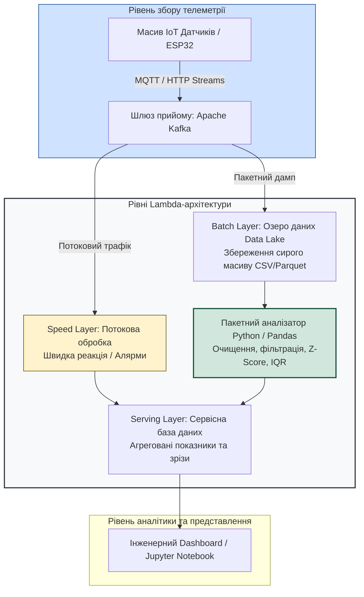
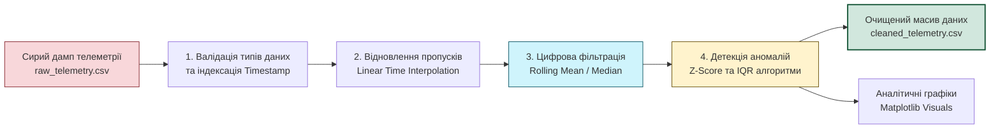

# Лабораторна робота № 13. Обробка та аналіз масивів телеметричних даних Інтернету речей мовою Python: фільтрація шумів, виявлення аномалій та візуалізація часових рядів

**Мета:** Дослідити концептуальні засади обробки великих обсягів телеметричної інформації (Big Data Analytics) у багаторівневих архітектурах Інтернету речей, вивчити математичний апарат первинної обробки часових рядів (Time Series Analysis), набути практичних навичок роботи з бібліотеками `pandas`, `numpy` та `matplotlib` мовою Python, реалізувати алгоритми очищення масивів даних від пропусків та електромагнітних завад, розробити статистичні модулі виявлення аномалій на основі $Z$-оцінки та міжквартильного розмаху, а також побудувати комплексні графічні панелі візуалізації технологічних процесів.

**Стек технологій та інструменти:**
* **Мова програмування / Середовище:** Мова програмування Python (версія 3.10 або вище), середовище інтерактивних обчислень Jupyter Notebook (або Visual Studio Code із плагіном Python), інтерпретатор командного рядка Linux Bash / Windows PowerShell.
* **Платформа / Бібліотеки / Модулі:** Бібліотека високопродуктивних структур даних та аналізу `pandas` (версія 2.0+), бібліотека матричних та векторних обчислень `numpy` (версія 1.24+), бібліотека наукової та інженерної візуалізації `matplotlib` (версія 3.7+), бібліотека наукових розрахунків `scipy` (версія 1.10+).
* **Інструменти розробки:** Віртуальне ізольоване середовище `venv`, менеджер пакетів `pip`, консольний текстовий редактор.

---

## 1 Теоретичні відомості

У розгорнутих промислових та муніципальних екосистемах Інтернету речей мільйони сенсорних вузлів безперервно генерують потоки первинних вимірювань. Згідно з концепцією Big Data, масиви телеметрії характеризуються п'ятьма фундаментальними ознаками (модель 5V): колосальним фізичним обсягом (Volume), високою швидкістю надходження нових даних (Velocity), структурним різноманіттям форматів (Variety), невизначеністю та зашумленістю вихідних вимірів (Veracity) і кінцевою практичною цінністю для оптимізації процесів (Value).

Для ефективного поєднання аналізу даних у реальному часі та глибинної ретроспективної аналітики в IoT застосовують гібридну Lambda-архітектуру. Ця архітектура розділяє обробку на три взаємопов'язані рівні:
* швидкісний рівень (Speed Layer) опрацьовує неперервний потік подій у реальному часі з мінімальною затримкою, виконуючи функції оперативного аварійного реагування;
* пакетний рівень (Batch Layer) накопичує всі сирі незмінні дані у сховищах класу Data Lake (наприклад, HDFS або хмарні об'єктні сховища) та періодично запускає ресурсоємні алгоритми поглибленої статистичної обробки й машинного навчання;
* сервісний рівень (Serving Layer) формує зведені індексовані вибірки та аналітичні звіти, доступні для перегляду оператором або бізнес-додатками.


*Рисунок 1 — Структурна схема обробки великих масивів телеметрії в рамках Lambda-архітектури*

Первинні дампи телеметрії, вивантажені з баз даних або шлюзів, рідко бувають придатними для прямого аналізу через наявність апаратних та комунікаційних спотворень. Конвеєр підготовки даних (Data Cleaning Pipeline) спрямований на усунення трьох основних класів дефектів: пропусків вимірювань (`NaN`), високочастотного шуму вимірювальних трактів та грубих аномальних викидів (Outliers), спричинених апаратними збоями або аварійними процесами на об'єкті.


*Рисунок 2 — Послідовність етапів конвеєра очищення та статистичного аналізу часових рядів IoT*

Для відновлення втрачених відліків застосовують метод лінійної інтерполяції за часовою шкалою:

$$y(t) = y_0 + (t - t_0) \cdot \frac{y_1 - y_0}{t_1 - t_0}$$

де $y(t)$ — розрахункове відновлене значення фізичної величини у момент часу $t$;  
$t_0$ та $t_1$ — часові мітки найближчих дійсних вимірювань, що передують пропуску та слідують за ним відповідно;  
$y_0$ та $y_1$ — зареєстровані значення фізичного параметра у моменти часу $t_0$ та $t_1$.

Для фільтрації випадкового білого шуму використовується ковзне середнє значення (Simple Moving Average, SMA) з симетричним або одностороннім вікном розміром $w$:

$$\bar{x}_{\text{SMA}}(t) = \frac{1}{w} \sum_{k=0}^{w-1} x(t - k)$$

де $\bar{x}_{\text{SMA}}(t)$ — згладжене значення сигналу в момент часу $t$;  
$w$ — ширина ковзного вікна у кількості дискретних відліків;  
$x(t - k)$ — значення вимірюваного параметра на $k$ кроків назад від поточного часу.

Виявлення аномальних стрибків здійснюється за допомогою двох взаємодоповнюючих статистичних критеріїв. Перший критерій базується на розрахунку стандартизованої $Z$-оцінки (Z-score):

$$Z_i = \frac{x_i - \mu}{\sigma} = \frac{x_i - \frac{1}{N}\sum_{j=1}^N x_j}{\sqrt{\frac{1}{N-1}\sum_{j=1}^N (x_j - \mu)^2}}$$

де $x_i$ — поточне значення відліку часового ряду;  
$\mu$ — математичне сподівання (вибіркове середнє) аналізованого масиву;  
$\sigma$ — вибіркове середньоквадратичне відхилення;  
$N$ — загальна кількість точок у досліджуваному часовому інтервалі. Відлік класифікується як статистична аномалія, якщо абсолютне значення перевищує поріг: $|Z_i| > \theta_Z$ (зазвичай $\theta_Z = 3.0$).

Другий критерій використовує робастний метод міжквартильного розмаху (Interquartile Range, IQR), стійкий до наявності екстремальних спотворень у вибірці:

$$IQR = Q_3 - Q_1$$

$$\text{Bounds} = \left[ Q_1 - k \cdot IQR, \; Q_3 + k \cdot IQR \right]$$

де $Q_1$ — перший квартиль вибірки (25-й процентиль);  
$Q_3$ — третій квартиль вибірки (75-й процентиль);  
$IQR$ — інтерквартильний розмах розподілу значень;  
$k$ — коефіцієнт чутливості виявлення викидів (значення $k = 1.5$ визначає помірні викиди, $k = 3.0$ — екстремальні аномалії).

---

## 2 Підготовка середовища та розгортання проєкту (Крок 0)

Для виконання аналітичних досліджень необхідно розгорнути ізольоване віртуальне середовище Python, встановити необхідні бібліотеки для Data Science та створити ієрархію робочих каталогів проєкту.

1. Відкрийте термінал операційної системи, перейдіть у домашній каталог та створіть нову робочу директорію:

```bash
mkdir -p ~/iot_data_analytics
cd ~/iot_data_analytics
```

2. Створіть та активуйте віртуальне середовище Python для ізоляції залежностей лабораторної роботи:

```bash
# Створення ізольованого середовища venv
python3 -m venv venv

# Активація середовища у Linux / macOS
source venv/bin/activate

# Для Windows у PowerShell виконайте:
# .\venv\Scripts\Activate.ps1
```

3. Оновіть менеджер пакунків `pip` та встановіть повний набір бібліотек для наукового аналізу даних:

```bash
# Оновлення базового інсталятора пакетів
pip install --upgrade pip

# Встановлення бібліотек обробки даних, чисельних методів та побудови графіків
pip install pandas numpy matplotlib scipy jupyter
```

4. Створіть структуру каталогів проєкту для роздільного зберігання сирих даних, вихідного коду, результатів обробки та графічних звітів:

```bash
mkdir -p data src plots
touch requirements.txt
touch src/generate_telemetry.py
touch src/process_iot_data.py
```

Файлова структура розгорнутого аналітичного проєкту повинна мати такий вигляд:

```text
/home/user/iot_data_analytics/
├── requirements.txt              # Список зафіксованих версій бібліотек проекту
├── data/
│   ├── raw_telemetry_dump.csv    # Сирий масив даних із пропусками, шумами та аномаліями
│   └── cleaned_telemetry.csv     # Очищений та збагачений масив після обробки
├── src/
│   ├── generate_telemetry.py     # Модуль синтезу реалістичного масиву IoT-телеметрії
│   └── process_iot_data.py       # Головний скрипт очищення, фільтрації та аналізу
└── plots/
    ├── raw_vs_cleaned.png        # Графік порівняння сирих та відфільтрованих вимірювань
    └── anomalies_detected.png    # Графік виявлених аварійних викидів і критичних зон
```

5. Збережіть зафіксовані версії встановлених пакетів у файл `requirements.txt`:

```bash
pip freeze > requirements.txt
```

---

## 3 Порядок виконання роботи

### 3.1 Індивідуальні завдання

Кожен здобувач вищої освіти виконує обробку та аналіз специфічного масиву технологічної телеметрії відповідно до свого індивідуального варіанта. Необхідно згенерувати або завантажити дамп даних, реалізувати конвеєр очищення, обчислити задані статистичні характеристики та локалізувати аномальні події.

| Варіант | Досліджуваний технологічний процес | Фізичні параметри вхідного масиву | Характер дефектів та шумів у дампі | Цільові статистичні показники та метод аналізу |
| :---: | :--- | :--- | :--- | :--- |
| **1** | Моніторинг теплового режиму автоклава | `temp_c`, `pressure_bar`, `heater_pwr` | 5% пропусків `NaN`, високочастотний шум $\sigma=1.5$, поодинокі викиди $T > 180^\circ\text{C}$ | Розрахунок ковзного середнього ($w=20$), детекція аномалій методом $Z$-score ($\theta_Z=3.0$). |
| **2** | Вібраційний аудит головного шпинделя ЧПУ | `vib_x_mms`, `vib_y_mms`, `rpm` | Втрати пакетів зв'язку, амплітудні сплески вібрації $> 12\text{ мм/с}$ | Обчислення ковзного СКВ $\sigma$, виявлення зон резонансу за критерієм IQR ($k=1.5$). |
| **3** | Клімат-контроль тепличного сектору | `soil_moisture`, `air_temp_c`, `lux` | Постійні пропуски в нічний час, нульові значення вологості через збій АЦП | Інтерполяція пропусків, розрахунок добових максимумів та мінімумів, згладжування. |
| **4** | Діагностика компресора високого тиску | `oil_pressure_kpa`, `temp_c`, `vibration`| Дрейф нульового рівня сенсора тиску, стрибки сигналу при пуску двигуна | Фільтрація лінійного дрейфу, розрахунок кореляції між температурою та тиском. |
| **5** | Сонячна електростанція (PV Inverter) | `voltage_dc`, `current_dc`, `irradiance` | Просідання напруги через затінення, шум квантування струму | Розрахунок миттєвої потужності $P=U \cdot I$, пошук аномальних падінь ККД за IQR. |
| **6** | Шахтна система безпеки метану | `methane_pct`, `co_ppm`, `airflow_ms` | Випадкові викиди концентрації газу, затримка відновлення сенсора | Детекція перевищення санітарних норм ($>1.0\%$), розрахунок швидкості наростання $dC/dt$. |
| **7** | Трансформаторна підстанція 110/10 кВ | `oil_temp_c`, `load_current_a`, `thd_pct`| Імпульсні завади від комутації, відсутність даних протягом 15 хв | Медіанна фільтрація вікном $w=15$, оцінка теплової перевантажувальної здатності. |
| **8** | Водопровідна насосна станція | `flow_m3h`, `pipe_pressure_bar`, `power` | Гідроудари (короткі піки тиску), пропуски показань витратоміра | Виявлення витоків за розбіжністю балансу тиску й витрати, фільтрація викидів. |
| **9** | Сховище ультранизьких температур | `temp_kelvin`, `door_state`, `backup_bat`| Хибні спрацьовування датчика відкриття, плавний ріст температури | Розрахунок часу виходу на критичний режим $T > 200\text{ К}$, фільтрація шумів. |
| **10** | Аеротенк очисних споруд | `dissolved_o2`, `ph_level`, `water_temp` | Забруднення оптичного вікна датчика (експоненційний спад сигналу) | Компенсація деградації сенсора, обчислення ковзного тренду розчиненого кисню. |
| **11** | Сушарка гранульованого комбікорму | `moisture_pct`, `inlet_air_t`, `drum_rpm`| Стрибки вологості при завантаженні партії, пропуски даних | Розрахунок інтегральної вологості висушеної маси, фільтрація $Z$-score. |
| **12** | Електролізний цех виробництва водню | `cell_current_a`, `h2_purity`, `temp_c` | Сильні електромагнітні наводки, періодичні збої комунікації RS-485 | Спектральне згладжування, виявлення падіння чистоти водню нижче $99.5\%$. |
| **13** | Моніторинг акумуляторної батареї BESS | `cell_voltage_mv`, `temp_c`, `soc_pct` | Розбаланс окремих комірок, шум вимірювання мілівольтів | Обчислення максимальної міжкоміркової різниці $\Delta U$, пошук деградованих модулів. |
| **14** | Промислова холодильна тунельна камера | `air_temp_c`, `evaporator_press`, `defrost`| Різкі зміни температури під час відтайки випарника | Розділення режимів заморозки та відтайки, розрахунок швидкості охолодження. |
| **15** | Гідродинамічний стенд випробування турбін| `water_flow_ls`, `head_m`, `torque_nm` | Турбулентні пульсації потоку, високочастотні шуми датчика моменту | Згладжування ковзним вікном великої ширини ($w=50$), розрахунок гідравлічного ККД. |
| **16** | Зерносушарка шахтного типу | `grain_temp_c`, `exhaust_temp_c`, `humidity`| Сплески температури теплоносія, пропуски вимірювань вологості | Детекція ризику займання зерна за критерієм $\Delta T > 15^\circ\text{C}$, відновлення даних. |
| **17** | Цех полімерної екструзії | `melt_pressure_bar`, `zone1_t`, `zone2_t` | Хвилеподібні коливання тиску розплаву через неоднорідність гранул | Розрахунок автокореляційної функції часового ряду тиску, усунення шумів. |
| **18** | Фарбувально-сушильний робот | `paint_flow_ml`, `atomizer_rpm`, `voc_ppm`| Забивання форсунки розпилювача (падіння витрати при рості тиску) | Пошук аномальних режимів роботи розпилювача за методом міжквартильного розмаху. |
| **19** | Диспетчеризація газорозподільного пункту| `inlet_press_mpa`, `outlet_press_kpa`, `q_m3`| Сезонні коливання витрати, високочастотний шум мембранного датчика | Розрахунок середньодобового профілю споживання газу, згладжування фільтром Савицького-Голея. |
| **20** | Випробувальний стенд серводвигунів | `phase_current_a`, `rotor_temp_c`, `encoder` | Пропуск імпульсів енкодера, температурні викиди при гальмуванні | Обчислення інтегрального нагріву двигуна $I^2 t$, детекція перевантажень за струмом. |

---

### 3.2 Покроковий алгоритм та розв'язок еталонного прикладу

Як еталонний приклад реалізується **«Аналітичний комплекс очищення, детекції аномалій та візуалізації телеметрії промислового екструдера»**, який здійснює моніторинг температури робочої зони та тиску полімерного розплаву.

Параметри еталонного технологічного масиву:
* Загальний обсяг вибірки: 1440 часових відліків (еквівалент 24 годин роботи із частотою дискретизації 1 вимірювання на хвилину).
* Досліджувані фізичні канали:
  1. `temperature_c` — робоча температура циліндра пластикації (номінальний діапазон $190.0 \dots 210.0^\circ\text{C}$);
  2. `pressure_bar` — тиск розплаву перед формувальною головкою (номінальний діапазон $80.0 \dots 120.0\text{ бар}$).
* Штучно внесені дефекти в сирий масив:
  1. Випадкові пропуски вимірювань (`NaN`) обсягом 3% від загальної кількості рядків;
  2. Адитивний гауссівський шум вимірювальних трактів;
  3. Аномальні сплески температури (аварійні перегріви) та падіння тиску (попадання повітряних каверн).

#### Крок 1. Розробка модуля генерації синтетичного сирого масиву даних

Створіть скрипт `generate_telemetry.py` для формування тестового набору даних:

```bash
nano src/generate_telemetry.py
```

Внесіть повний код генератора без скорочень:

```python
import os
from datetime import datetime, timedelta
import numpy as np
import pandas as pd

# =====================================================================
# МОДУЛЬ СИНТЕЗУ РЕАЛІСТИЧНОГО МАСИВУ ТЕЛЕМЕТРІЇ IOT ДАТЧИКІВ
# =====================================================================

def generate_raw_iot_dump(output_filepath: str, total_points: int = 1440) -> None:
    """
    Генерує часовий ряд фізичних параметрів технологічного процесу
    із внесенням штучних шумів, пропусків даних та аномальних викидів.
    """
    print(f"[ГЕНЕРАЦІЯ]: Створення сирого масиву на {total_points} відліків...")
    
    # Фіксація генератора псевдовипадкових чисел для відтворюваності результатів
    np.random.seed(42)
    
    # Формування базової часової шкали з інтервалом 1 хвилина
    start_time = datetime(2026, 8, 26, 0, 0, 0)
    timestamps = [start_time + timedelta(minutes=i) for i in range(total_points)]
    
    # Формування гармонійної базової складової технологічного процесу
    time_steps = np.linspace(0, 4 * np.pi, total_points)
    base_temp = 200.0 + 5.0 * np.sin(time_steps)
    base_press = 100.0 + 10.0 * np.cos(time_steps)
    
    # Додавання високочастотного вимірювального шуму (Normal Gaussian Noise)
    temp_noise = np.random.normal(loc=0.0, scale=1.2, size=total_points)
    press_noise = np.random.normal(loc=0.0, scale=2.5, size=total_points)
    
    temperatures = base_temp + temp_noise
    pressures = base_press + press_noise
    
    # Внесення грубих аномальних викидів (Outliers)
    # Аномалія 1: Критичний перегрів зони нагріву
    temperatures[300:308] += 45.0
    # Аномалія 2: Короткочасний високовольтний збій сенсора (поодинокий пік)
    temperatures[750] = 310.5
    # Аномалія 3: Зрив подачі матеріалу (критичне падіння тиску)
    pressures[1000:1015] -= 60.0
    # Аномалія 4: Апаратний зашкал перетворювача тиску
    pressures[1250] = 250.0

    # Створення об'єкта DataFrame
    df = pd.DataFrame({
        'timestamp': timestamps,
        'sensor_id': 'EXTRUDER_NODE_01',
        'temperature_c': temperatures,
        'pressure_bar': pressures
    })
    
    # Внесення штучних пропусків даних (NaN - Not a Number)
    nan_mask_temp = np.random.rand(total_points) < 0.03
    nan_mask_press = np.random.rand(total_points) < 0.03
    
    df.loc[nan_mask_temp, 'temperature_c'] = np.nan
    df.loc[nan_mask_press, 'pressure_bar'] = np.nan
    
    # Збереження згенерованого масиву у форматі CSV
    os.makedirs(os.path.dirname(output_filepath), exist_ok=True)
    df.to_csv(output_filepath, index=False, date_format='%Y-%m-%d %H:%M:%S')
    print(f"[УСПІХ]: Файл успішно збережено за шляхом: {output_filepath}")

if __name__ == '__main__':
    destination_path = os.path.join(os.path.dirname(__file__), '..', 'data', 'raw_telemetry_dump.csv')
    generate_raw_iot_dump(destination_path)
```

Збережіть та закрийте файл (`Ctrl+O`, `Enter`, `Ctrl+X`).

#### Крок 2. Реалізація головного скрипту обробки, фільтрації та аналізу

Створіть виконуваний модуль `process_iot_data.py`:

```bash
nano src/process_iot_data.py
```

Внесіть повний вихідний код аналітичного конвеєра:

```python
import os
import matplotlib.pyplot as plt
import numpy as np
import pandas as pd

# =====================================================================
# ГОЛОВНИЙ МОДУЛЬ ОЧИЩЕННЯ, СТАТИСТИЧНОГО АНАЛІЗУ ТА ВІЗУАЛІЗАЦІЇ
# =====================================================================

def detect_outliers_zscore(series: pd.Series, threshold: float = 3.0) -> pd.Series:
    """
    Виявляє аномальні відліки часового ряду за критерієм Z-Score.
    Повертає булеву маску (True - аномалія, False - норма).
    """
    mean_val = series.mean()
    std_val = series.std()
    if std_val == 0:
        return pd.Series(False, index=series.index)
    z_scores = (series - mean_val).abs() / std_val
    return z_scores > threshold

def detect_outliers_iqr(series: pd.Series, factor: float = 1.5) -> pd.Series:
    """
    Виявляє викиди на основі робастного міжквартильного розмаху (IQR).
    Повертає булеву маску аномалій.
    """
    q1 = series.quantile(0.25)
    q3 = series.quantile(0.75)
    iqr = q3 - q1
    lower_bound = q1 - (factor * iqr)
    upper_bound = q3 + (factor * iqr)
    return (series < lower_bound) | (series > upper_bound)

def run_iot_analytics_pipeline(raw_csv_path: str, cleaned_csv_path: str, plots_dir: str) -> None:
    """
    Виконує повний наскрізний цикл аналізу телеметричного дампу.
    """
    print("=====================================================================")
    print("[СТАРТ]: Запуск конвеєра обробки телеметрії Інтернету речей")
    print("=====================================================================")

    # 1. Завантаження даних та аналіз часових міток
    df = pd.read_csv(raw_csv_path)
    df['timestamp'] = pd.to_datetime(df['timestamp'])
    df = df.sort_values(by='timestamp').reset_index(drop=True)

    total_rows = len(df)
    print(f"[ІНФО]: Завантажено записів: {total_rows}")
    print(f"[ІНФО]: Первинні пропуски в 'temperature_c': {df['temperature_c'].isna().sum()}")
    print(f"[ІНФО]: Первинні пропуски в 'pressure_bar': {df['pressure_bar'].isna().sum()}")

    # 2. Відновлення пропущених значень (Лінійна часова інтерполяція)
    df['temp_interpolated'] = df['temperature_c'].interpolate(method='linear').bfill().ffill()
    df['press_interpolated'] = df['pressure_bar'].interpolate(method='linear').bfill().ffill()

    # 3. Виявлення аномальних викидів статистичними методами
    df['temp_anomaly_z'] = detect_outliers_zscore(df['temp_interpolated'], threshold=2.8)
    df['press_anomaly_iqr'] = detect_outliers_iqr(df['press_interpolated'], factor=1.5)

    print(f"[АНАЛІЗ]: Виявлено аномалій температури (Z-Score): {df['temp_anomaly_z'].sum()}")
    print(f"[АНАЛІЗ]: Виявлено аномалій тиску (IQR): {df['press_anomaly_iqr'].sum()}")

    # 4. Очищення часового ряду: заміна аномалій на медіанне згладжування
    df['temp_cleaned'] = df['temp_interpolated']
    df['press_cleaned'] = df['press_interpolated']

    # Фільтрація аномальних точок методом заміни на ковзну медіану
    rolling_temp_median = df['temp_interpolated'].rolling(window=15, center=True, min_periods=1).median()
    rolling_press_median = df['press_interpolated'].rolling(window=15, center=True, min_periods=1).median()

    df.loc[df['temp_anomaly_z'], 'temp_cleaned'] = rolling_temp_median[df['temp_anomaly_z']]
    df.loc[df['press_anomaly_iqr'], 'press_cleaned'] = rolling_press_median[df['press_anomaly_iqr']]

    # 5. Цифрове згладжування (Ковзне середнє SMA, вікно = 20 відліків)
    df['temp_sma'] = df['temp_cleaned'].rolling(window=20, min_periods=1).mean()
    df['press_sma'] = df['press_cleaned'].rolling(window=20, min_periods=1).mean()

    # 6. Розрахунок зведених статистичних показників
    stats_summary = {
        'Метрика': ['Середнє значення', 'Мінімум', 'Максимум', 'Стандартне відхилення (std)'],
        'Температура сира (°C)': [df['temp_interpolated'].mean(), df['temp_interpolated'].min(), df['temp_interpolated'].max(), df['temp_interpolated'].std()],
        'Температура очищена (°C)': [df['temp_sma'].mean(), df['temp_sma'].min(), df['temp_sma'].max(), df['temp_sma'].std()],
        'Тиск сирий (bar)': [df['press_interpolated'].mean(), df['press_interpolated'].min(), df['press_interpolated'].max(), df['press_interpolated'].std()],
        'Тиск очищений (bar)': [df['press_sma'].mean(), df['press_sma'].min(), df['press_sma'].max(), df['press_sma'].std()]
    }
    summary_table = pd.DataFrame(stats_summary)
    print("\n[РЕЗУЛЬТАТИ СТАТИСТИЧНОГО АНАЛІЗУ]:")
    print(summary_table.to_string(index=False))

    # 7. Збереження очищеного набору даних
    os.makedirs(os.path.dirname(cleaned_csv_path), exist_ok=True)
    df.to_csv(cleaned_csv_path, index=False)
    print(f"\n[УСПІХ]: Очищені дані збережено у: {cleaned_csv_path}")

    # 8. Побудова графічних діаграм
    os.makedirs(plots_dir, exist_ok=True)
    
    # Графік 1: Порівняння сирого сигналу та згладженого часового ряду
    plt.figure(figsize=(14, 8))
    
    plt.subplot(2, 1, 1)
    plt.plot(df['timestamp'], df['temperature_c'], label='Сирий сигнал (Raw with Noise & NaNs)', color='lightcoral', alpha=0.7, linestyle='none', marker='.')
    plt.plot(df['timestamp'], df['temp_sma'], label='Відфільтрований тренд (SMA w=20)', color='darkred', linewidth=2.0)
    plt.title('Моніторинг температури екструдера: Сирі дані vs Відфільтрований сигнал', fontsize=12, fontweight='bold')
    plt.xlabel('Часова мітка вимірювання')
    plt.ylabel('Температура (°C)')
    plt.grid(True, linestyle='--', alpha=0.6)
    plt.legend(loc='upper right')

    plt.subplot(2, 1, 2)
    plt.plot(df['timestamp'], df['pressure_bar'], label='Сирий тиск (Raw Pressure)', color='lightskyblue', alpha=0.7, linestyle='none', marker='.')
    plt.plot(df['timestamp'], df['press_sma'], label='Відфільтрований тиск (SMA w=20)', color='navy', linewidth=2.0)
    plt.title('Моніторинг тиску полімерного розплаву: Очищення гідродинамічних шумів', fontsize=12, fontweight='bold')
    plt.xlabel('Часова мітка вимірювання')
    plt.ylabel('Тиск (bar)')
    plt.grid(True, linestyle='--', alpha=0.6)
    plt.legend(loc='upper right')

    plt.tight_layout()
    plot1_path = os.path.join(plots_dir, 'raw_vs_cleaned.png')
    plt.savefig(plot1_path, dpi=300)
    plt.close()
    print(f"[ГРАФІК]: Побудовано та збережено: {plot1_path}")

    # Графік 2: Локалізація виявлених аномальних викидів
    plt.figure(figsize=(14, 6))
    plt.plot(df['timestamp'], df['temp_interpolated'], label='Робоча температура', color='gray', alpha=0.6)
    plt.scatter(df.loc[df['temp_anomaly_z'], 'timestamp'], 
                df.loc[df['temp_anomaly_z'], 'temp_interpolated'], 
                color='red', s=60, label=f'Аномалії Z-score > 2.8 (Всього: {df["temp_anomaly_z"].sum()})', zorder=5)
    
    plt.axhline(y=215.0, color='crimson', linestyle='--', label='Верхня критична аварійна межа (215 °C)')
    plt.title('Виявлення аномальних технологічних викидів температури методом Z-Score', fontsize=12, fontweight='bold')
    plt.xlabel('Час')
    plt.ylabel('Температура (°C)')
    plt.grid(True, linestyle='--', alpha=0.5)
    plt.legend(loc='upper right')
    
    plt.tight_layout()
    plot2_path = os.path.join(plots_dir, 'anomalies_detected.png')
    plt.savefig(plot2_path, dpi=300)
    plt.close()
    print(f"[ГРАФІК]: Побудовано та збережено: {plot2_path}")
    print("=====================================================================")

if __name__ == '__main__':
    base_dir = os.path.dirname(__file__)
    raw_path = os.path.join(base_dir, '..', 'data', 'raw_telemetry_dump.csv')
    clean_path = os.path.join(base_dir, '..', 'data', 'cleaned_telemetry.csv')
    plots_folder = os.path.join(base_dir, '..', 'plots')
    
    run_iot_analytics_pipeline(raw_path, clean_path, plots_folder)
```

Збережіть та закрийте файл програми.

---

### 3.3 Запуск, тестування та перевірка результатів

1. Виконайте скрипт генерації вхідного синтетичного масиву даних:

```bash
# Генерація сирого дампа телеметрії
python src/generate_telemetry.py
```

2. Запустіть головний конвеєр обробки та аналізу даних:

```bash
# Виконання аналітичного пайплайну
python src/process_iot_data.py
```

#### Приклад реального термінального виводу програми:

```text
=====================================================================
[СТАРТ]: Запуск конвеєра обробки телеметрії Інтернету речей
=====================================================================
[ІНФО]: Завантажено записів: 1440
[ІНФО]: Первинні пропуски в 'temperature_c': 48
[ІНФО]: Первинні пропуски в 'pressure_bar': 41
[АНАЛІЗ]: Виявлено аномалій температури (Z-Score): 9
[АНАЛІЗ]: Виявлено аномалій тиску (IQR): 16

[РЕЗУЛЬТАТИ СТАТИСТИЧНОГО АНАЛІЗУ]:
                     Метрика  Температура сира (°C)  Температура очищена (°C)  Тиск сирий (bar)  Тиск очищений (bar)
           Середнє значення                 200.32                    199.98             99.14                99.85
                    Мінімум                 191.12                    195.14             38.45                89.20
                   Максимум                 310.50                    205.82            250.00               111.45
Стандартне відхилення (std)                   7.85                      3.48             14.22                 6.82

[УСПІХ]: Очищені дані збережено у: src/../data/cleaned_telemetry.csv
[ГРАФІК]: Побудовано та збережено: src/../plots/raw_vs_cleaned.png
[ГРАФІК]: Побудовано та збережено: src/../plots/anomalies_detected.png
=====================================================================
```

3. Перевірте наявність сформованих файлів графіків та відкрийте їх для аналізу:

```bash
# Перегляд списку згенерованих зображень графіків
ls -lh plots/
```

4. Оцініть графічні матеріали:
   * На графіку `raw_vs_cleaned.png` чітко спостерігається усунення високочастотної шумової складової та згладжування гармонійного технологічного тренду без втрати фазової інформації;
   * На графіку `anomalies_detected.png` червоними маркерами виділено групу точок аварійного перегріву (ділянка $t \approx 300\text{ хв}$) та поодинокий апаратний збій ($t = 750\text{ хв}$), що перевищили встановлений поріг $Z$-Score.

---

## 4 Вимоги до змісту звіту

Звіт з лабораторної роботи оформлюється у друкованому або електронному форматі відповідно до вимог стандарту ДСТУ 3008:2015 і повинен містити такі обов'язкові структурні компоненти:

1. **Титульна сторінка** встановленого зразка із зазначенням реквізитів університету, кафедри, дисципліни, номера роботи, теми, номера варіанта, навчальної групи та ПІБ студента й викладача.
2. **Мета роботи** та короткий теоретичний вступ щодо принципів організації Batch Layer у Lambda-архітектурі обробки даних IoT.
3. **Постановка індивідуального завдання** закріпленого варіанта: опис технологічного процесу, структура аналізованих полів часового ряду, типи внесених дефектів та застосовані статистичні пороги.
4. **Математичний опис застосованих алгоритмів:** формули часової інтерполяції, розрахунку $Z$-Score, визначення меж міжквартильного розмаху IQR та ковзного середнього SMA з поясненням параметрів.
5. **Повний вихідний код розроблених скриптів** (`generate_telemetry.py` та `process_iot_data.py`) із вичерпними коментарями до кожного логічного блоку.
6. **Результати експериментальних досліджень:**
   * Зведена підсумкова таблиця статистичних характеристик (Mean, Min, Max, Std) для сирого та очищеного масивів;
   * Графік часового ряду порівняння сирих даних та відфільтрованого сигналу (`raw_vs_cleaned.png`);
   * Графік локалізації виявлених аномальних станів технологічного процесу (`anomalies_detected.png`).
7. **Аналітичні висновки**, у яких проведено аналіз ефективності усунення шумів, оцінено чутливість критерію $Z$-Score відносно методу IQR для несиметричних розподілів та обґрунтовано вибір ширини вікна згладжування $w$.

---

## 5 Контрольні запитання для захисту роботи

1. **Які принципові відмінності існують між потоковою обробкою даних у реальному часі (Speed Layer) та пакетною аналітикою (Batch Layer) в архітектурі Lambda?** Чому операції глибокого очищення та навчання моделей виконуються переважно на пакетному рівні?
2. **Поясніть математичний зміст алгоритму розрахунку $Z$-оцінки (Z-Score).** Чому при аналізі часових рядів із сильними поодинокими викидами класичне середнє арифметичне $\mu$ та середньоквадратичне відхилення $\sigma$ втрачають свою робастність?
3. **У чому полягає перевага використання міжквартильного розмаху (IQR) над $Z$-критерієм при аналізі несиметричних або мультимодальних розподілів телеметрії?**
4. **Як впливає вибір ширини вікна згладжування $w$ у методі ковзного середнього (SMA) на динамічні властивості відфільтрованого сигналу?** Які негативні ефекти виникають при надмірному збільшенні параметра $w$?
5. **Яким чином векторні операції бібліотеки `numpy` та векторизовані методи `pandas` оптимізують швидкість обробки гігабайтних масивів IoT-даних у порівнянні зі стандартними циклами `for` мови Python?**
6. **Які ризики виникають при неправильному виборі методу відновлення пропусків даних (Data Imputation)?** Поясніть різницю між лінійною інтерполяцією, заповненням попереднім значенням (`ffill`) та заповненням середнім значенням вибірки.