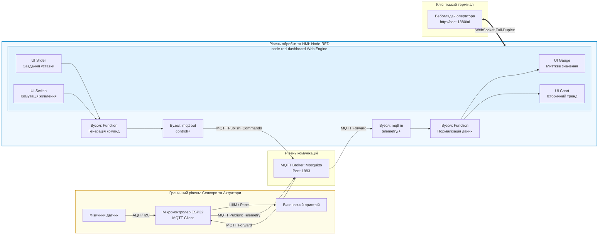
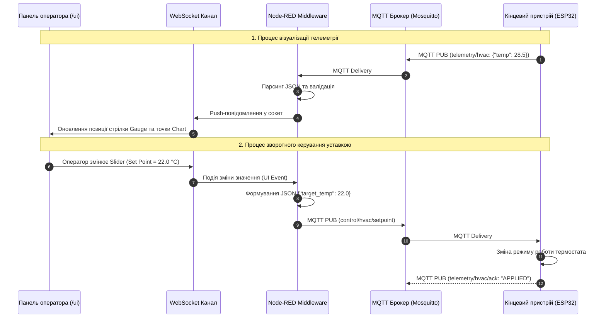

# Лабораторна робота № 14. Проєктування інтерактивного людино-машинного інтерфейсу для диспетчеризації та двонаправленого керування IoT-системами у середовищі Node-RED

**Мета:** Дослідити принципи побудови людино-машинних інтерфейсів (Human-Machine Interface, HMI) та вебпанелей диспетчерського контролю (SCADA Dashboard) для розподілених систем Інтернету речей, опанувати модульну бібліотеку `node-red-dashboard`, набути практичних навичок візуалізації потокових часових рядів телеметрії за допомогою радіальних індикаторів (Gauge) та динамічних трендів (Chart), а також реалізувати механізм зворотного зв'язку для дистанційного керування виконавчими механізмами шляхом генерації та публікації командних MQTT-пакетів за допомогою інтерактивних елементів інтерфейсу (Switch, Slider, Button).

**Стек технологій та інструменти:**
* **Мова програмування / Середовище:** Мова програмування JavaScript (стандарт ECMAScript 2022+), середовище виконання Node.js, мова розмітки HTML5 та таблиці стилів CSS3 (для кастомізації UI).
* **Платформа / Бібліотеки / Модулі:** Середовище потокового програмування Node-RED (версія 3.1 або вище), модуль розширення графічного інтерфейсу `node-red-dashboard` (версія 3.6+), брокер повідомлень Eclipse Mosquitto (версія 2.0+), протокол зв'язку MQTT v3.1.1/v5.0, мережевий транспорт WebSockets.
* **Інструменти розробки:** Сучасний вебоглядач (Google Chrome / Mozilla Firefox) з інструментами розробника (DevTools), термінал командного рядка Linux / WSL2, утиліти тестування `mosquitto-clients`.

---

## 1 Теоретичні відомості

Ефективне функціонування сучасних систем Інтернету речей та промислового Інтернету речей (IIoT) вимагає не лише автоматизованого збору та обробки телеметрії, але й забезпечення якісної взаємодії оператора з технологічним процесом. Людино-машинний інтерфейс (HMI) відіграє роль сполучної ланки між цифровою екосистемою та людиною-оператором, перетворюючи масиви числових даних на інтуїтивно зрозумілі візуальні образи: мнемосхеми, стрілочні індикатори, графіки зміни параметрів у часі та елементи аварійного оповіщення.

У середовищі Node-RED візуалізація реалізується за допомогою спеціалізованого модуля `node-red-dashboard`, який розгортає адаптивний односторінковий вебдодаток (Single Page Application, SPA) на базі фреймворків Angular та Material Design. Обмін даними між бекенд-потоками Node-RED та клієнтським вебінтерфейсом здійснюється за допомогою протоколу WebSockets у повнодуплексному режимі реального часу, що зводить затримку оновлення графічних елементів до часток мілісекунди.


*Рисунок 1 — Архітектура замкненого контуру моніторингу та керування через HMI Dashboard у середовищі Node-RED*

Наведена на рисунку 1 схема демонструє організацію замкненого контуру регулювання. Телеметричні пакети від датчиків потрапляють через MQTT-брокер у потік обробки Node-RED, де перетворюються на вхідні сигнали для візуальних віджетів. Зворотний канал керування ініціюється діями оператора у вебінтерфейсі: зміна положення повзунка (Slider) або стан перемикача (Switch) миттєво генерує внутрішню подію, формує командний JSON-пакет та транслює його через MQTT назад до мікроконтролера.

Для забезпечення інформативності графічних індикаторів застосовується лінійне масштабування та нормалізація вхідного сигналу до діапазону шкали віджета:

$$Y = Y_{\min} + \frac{X - X_{\min}}{X_{\max} - X_{\min}} \cdot (Y_{\max} - Y_{\min})$$

де $X$ — поточне фізичне значення параметра, отримане від датчика;  
$X_{\min}, X_{\max}$ — відповідно мінімальна та максимальна межі вимірювального діапазону сенсора;  
$Y_{\min}, Y_{\max}$ — діапазон відображення графічного віджета (наприклад, $0 \dots 100\%$ шкали Gauge);  
$Y$ — результуюче розраховане значення відхилення стрілки індикатора.

При відображенні часових рядів на графіках (Chart) виникає потреба контролю обсягу буфера пам'яті клієнтського браузера. Кількість точок ($N_{\text{points}}$), що зберігаються на графіку протягом часового вікна моніторингу $T_{\text{window}}$, визначається виразом:

$$N_{\text{points}} = \frac{T_{\text{window}}}{\Delta t_{\text{telemetry}}}$$

де $T_{\text{window}}$ — тривалість відображуваного часового інтервалу (наприклад, останні 3600 секунд або 1 година);  
$\Delta t_{\text{telemetry}}$ — період надходження телеметричних пакетів від вимірювального вузла (секунди).


*Рисунок 2 — Діаграма послідовності двонаправленого інформаційного обміну між HMI та мікроконтролером*

Загальна часова затримка реакції людино-машинного інтерфейсу ($L_{\text{HMI}}$), що визначає час від фізичної зміни параметра на сенсорі до моменту візуального відображення пікселя на екрані монітора, описується математичною моделлю:

$$L_{\text{HMI}} = t_{\text{sensor\_acq}} + t_{\text{mqtt\_pub}} + t_{\text{broker\_route}} + t_{\text{nodered\_proc}} + t_{\text{ws\_trans}} + t_{\text{dom\_render}}$$

де $t_{\text{sensor\_acq}}$ — час перетворення фізичної величини АЦП мікроконтролера (с);  
$t_{\text{mqtt\_pub}}$ — затримка передачі кадру мережевим інтерфейсом Wi-Fi/Ethernet (с);  
$t_{\text{broker\_route}}$ — час комутації та розсилки пакета чергою брокера Mosquitto (с);  
$t_{\text{nodered\_proc}}$ — тривалість обробки події функціональними вузлами Node-RED (с);  
$t_{\text{ws\_trans}}$ — мережева затримка транспорту WebSockets (с);  
$t_{\text{dom\_render}}$ — тривалість апаратного рендерингу оновленого DOM-дерева браузером (с).

---

## 2 Підготовка середовища та розгортання проєкту (Крок 0)

Для підготовки робочого простору необхідно встановити графічний модуль `node-red-dashboard`, створити каталог лабораторного проєкту та налаштувати конфігураційні зв'язки з локальним або контейнеризованим брокером MQTT.

1. Запустіть термінал операційної системи Linux та перейдіть до каталогу даних Node-RED:

```bash
# Для локальної інсталяції Node-RED
cd ~/.node-red

# У разі використання Docker-контейнера з лабораторної роботи №8
cd ~/iot_stack/nodered/data
```

2. Виконайте інсталяцію бібліотеки `node-red-dashboard` за допомогою пакетного менеджера npm:

```bash
# Встановлення модуля дашборду безпосередньо у директорію Node-RED
npm install node-red-dashboard
```

*Примітка: У разі використання середовища Docker інсталяцію можна здійснити безпосередньо через вбудований графічний інтерфейс: меню **Manage palette** $\to$ вкладка **Install** $\to$ пошук `node-red-dashboard` $\to$ натиснути кнопку **Install**.*

3. Перезапустіть сервіс Node-RED для ініціалізації та підключення встановленої палітри графічних віджетів:

```bash
# Перезапуск контейнерного стеку Docker Compose
cd ~/iot_stack
docker compose restart nodered-engine

# Або перезапуск локальної системної служби Linux
sudo systemctl restart nodered.service
```

4. Створіть структуру каталогів лабораторної роботи для експорту потоків, збереження резервних копій та логів тестування:

```bash
mkdir -p ~/iot_stack/lab14_dashboard/{flows,scripts,captures}
cd ~/iot_stack/lab14_dashboard
```

Файлова структура виконаної лабораторної роботи повинна мати такий вигляд:

```text
/home/user/iot_stack/lab14_dashboard/
├── flows/
│   └── hmi_dashboard_flow.json     # Повний експортований JSON-маніфест потоків та UI
├── scripts/
│   └── test_telemetry_feed.sh      # Bash-скрипт генерації тестових телеметричних потоків
└── captures/
    ├── dashboard_normal.png        # Знімок інтерфейсу HMI у штатному режимі
    └── dashboard_alarm.png         # Знімок інтерфейсу HMI у критичному режимі
```

5. Відкрийте вебоглядач та перевірте доступність двох основних вебсторінок середовища:
   * Редактор потоків (Flow Editor): `http://localhost:1880`
   * Користувацька панель приладів (Dashboard UI): `http://localhost:1880/ui`

---

## 3 Порядок виконання роботи

### 3.1 Індивідуальні завдання

Кожен здобувач вищої освіти розробляє унікальну інтерактивну панель HMI відповідно до свого індивідуального варіанта. Завдання передбачає розбиття інтерфейсу на дві групи (вкладки `Monitoring` та `Control`), прийом даних через MQTT, візуалізацію параметрів за допомогою стрілочних та лінійних графіків, а також організацію зворотного командного каналу з формуванням JSON-директив.

| Варіант | Назва технологічного об'єкта | Топік вхідної телеметрії (MQTT) | Параметри візуалізації (Sensors) | Елементи керування (Actuators) | Топік зворотного керування (Control) |
| :---: | :--- | :--- | :--- | :--- | :--- |
| **1** | Сушильна камера деревини | `timber/dryer/node1/telemetry` | Температура ($0 \dots 120^\circ\text{C}$), Вологість ($0 \dots 100\%$) | Слайдер уставки $T_C$, Кнопка реверсу | `timber/dryer/node1/control` |
| **2** | Пастеризатор молочного заводу | `dairy/pasteur/unit3/telemetry`| Температура пастеризації, Потік рідини | Перемикач клапана, Слайдер швидкості | `dairy/pasteur/unit3/cmd` |
| **3** | Кліматична камера теплиці | `greenhouse/sec2/telemetry` | Вологість грунту, Освітленість (Люкс) | Слайдер поливу, Тумблер фітолампи | `greenhouse/sec2/actuators` |
| **4** | Станція заряджання акумуляторів | `charging/bay4/telemetry` | Струм заряду ($0 \dots 50\text{ А}$), Напруга | Слайдер обмеження струму, Кнопка СТОП | `charging/bay4/setpoint` |
| **5** | Насосна магістраль водоканалу | `water/pump/station1/data` | Тиск магістралі ($0 \dots 16\text{ бар}$), RPM | Слайдер цільового тиску, Пуск/Стоп | `water/pump/station1/control` |
| **6** | Біореактор бродіння | `fermenter/tank5/telemetry` | Рівень кислотності pH ($0 \dots 14$), $T_C$ | Дозатор лугу, Підігрів сорочки | `fermenter/tank5/adjust` |
| **7** | Промисловий компресор | `compressor/line2/telemetry` | Тиск масла, Температура головки | Слайдер продуктивності, Скид тиску | `compressor/line2/commands` |
| **8** | Електролізний цех | `electrolysis/cell8/telemetry` | Струм ванни ($0 \dots 500\text{ А}$), Рівень електроліту | Слайдер сили струму, Аварійний вимикач | `electrolysis/cell8/override` |
| **9** | Сонячний трекер СЕС | `solar/tracker/panel12/data` | Кут нахилу ($0 \dots 90^\circ$), Освітленість | Слайдер ручного кута, Авто/Ручний режим | `solar/tracker/panel12/drive` |
| **10** | Вентиляція фарбувального цеху | `paint/exhaust/node3/telemetry`| Концентрація VOC (ppm), Потік повітря | Слайдер оборотів турбіни, Заслінка | `paint/exhaust/node3/actuation`|
| **11** | Автоклав медичної стерилізації | `autoclave/med/unit1/telemetry`| Тиск насиченої пари, Температура пари | Таймер експозиції, Випускний клапан | `autoclave/med/unit1/set` |
| **12** | Рекуператор будівлі ЦОД | `datacenter/hvac/rack5/data` | Температура гарячого коридору, $\Delta T$ | Слайдер потужності охолодження, Bypass | `datacenter/hvac/rack5/control`|
| **13** | Зерновий елеватор (силос) | `silo/storage/tower2/telemetry`| Температура зерна, Рівень CO2 (ppm) | Аераційний вентилятор, Засувка скиду | `silo/storage/tower2/motor` |
| **14** | Шпальти розкатної машини | `rolling/mill/stand4/telemetry` | Зусилля притиску (кН), Товщина листа | Слайдер зазору валків, Екстрений стоп | `rolling/mill/stand4/hydraulic`|
| **15** | Піч загартовування металу | `furnace/heat/zone1/telemetry` | Температура ($0 \dots 1100^\circ\text{C}$), Газ | Слайдер пальника, Відкриття заслінки | `furnace/heat/zone1/valve` |
| **16** | Вітрогенераторна установка | `wind/turbine/gen3/telemetry` | Швидкість генератора, Вібрація опор | Кут атаки лопатей (Pitch), Гальмо | `wind/turbine/gen3/yaw_ctrl` |
| **17** | Басейн аерації стоків | `water/aerotank/pool1/data` | Розчинений кисень ($0 \dots 15\text{ мг/л}$)| Продуктивність повітродувки, Шламовий насос | `water/aerotank/pool1/actuators`|
| **18** | Склад вакцин глибокої заморозки| `cryo/freezer/sec1/telemetry` | Температура ($-90 \dots -20^\circ\text{C}$)| Слайдер уставки температури, Сирена | `cryo/freezer/sec1/management` |
| **19** | Лінія розливу продукції | `bottling/line5/speed/telemetry`| Продуктивність (пляшок/хв), Рівень сиропу| Слайдер швидкості конвеєра, Живильник | `bottling/line5/speed/control` |
| **20** | Автономний маніпулятор | `robot/arm/joint2/telemetry` | Момент на валу (Нм), Температура серво | Слайдер кута повороту, Блокування гальма | `robot/arm/joint2/motion` |

---

### 3.2 Покроковий алгоритм та розв'язок еталонного прикладу

Як еталонний приклад реалізується **«Двонаправлена операторська HMI-панель моніторингу та управління мікрокліматом виробничої зони»**, що не повторює індивідуальні варіанти.

Параметри еталонного проєкту:
* Вхідний топік MQTT: `factory/zone1/climate/telemetry`
* Структура вхідного JSON-пакета:
  `{"node": "ESP32_MASTER_01", "temp": 26.4, "humidity": 68.5, "fan_rpm": 1200, "alarm": false}`
* Вихідний топік керування актуаторами: `factory/zone1/climate/control`
* Склад візуальних компонентів інтерфейсу Dashboard:
  1. Індикатор миттєвої температури **UI Gauge** (шкала $0 \dots 50^\circ\text{C}$, колірне зонування: зелений $18 \dots 25$, жовтий $25 \dots 35$, червоний $> 35$);
  2. Індикатор відносної вологості **UI Gauge** (шкала $0 \dots 100\%$);
  3. Графік зміни температури та вологості у часі **UI Chart** (історичний тренд за останні 15 хвилин);
  4. Текстове табло системного статусу **UI Text** (індикація нормального або аварійного стану);
  5. Слайдер завдання цільової уставки охолодження **UI Slider** ($15 \dots 30^\circ\text{C}$);
  6. Перемикач ручного примусового ввімкнення витяжки **UI Switch** (True / False);
  7. Кнопка скидання аварійного стану **UI Button** (Alarm Reset).

#### Крок 1. Конфігурація структури панелі інструментів Dashboard

1. Відкрийте редактор Node-RED у браузері за адресою `http://localhost:1880`.
2. У правій бічній панелі перейдіть на вкладку **Dashboard** (піктограма панелі приладів).
3. Натисніть кнопку **+ tab** та створіть нову вкладку із назвою `Клімат-контроль Цеху 1`.
4. Всередині створеної вкладки натисніть кнопку **+ group** та створіть дві роздільні візуальні групи:
   * Група 1: `Моніторинг телеметрії (Sensors)` шириною 6 колонок (`Width: 6`);
   * Група 2: `Панель диспетчерського керування (Actuators)` шириною 6 колонок (`Width: 6`).

#### Крок 2. Побудова графа потоку прийому даних та візуалізації

1. Перетягніть вузол **mqtt in** (розділ *network*), відкрийте його налаштування:
   * **Server**: вкажіть брокер `Local Mosquitto` (`127.0.0.1:1883`);
   * **Topic**: `factory/zone1/climate/telemetry`;
   * **QoS**: `1`;
   * **Output**: `parsed JSON object`.

2. Розмістіть вузол **function** із назвою `Розподіл телеметрії на віджети` та з'єднайте його з виходом вузла *mqtt in*. Код функції формує окремі вихідні повідомлення для кожного елемента інтерфейсу:

```javascript
// =====================================================================
// РОЗПОДІЛ ТЕЛЕМЕТРИЧНОГО JSON НА ОКРЕМІ ВІДЖЕТИ ДАШБОРДУ
// =====================================================================

var data = msg.payload;

// Перевірка цілісності отриманих числових полів
if (typeof data !== 'object' || data === null) {
    node.error("Некоректний формат вхідного повідомлення", msg);
    return null;
}

// 1. Повідомлення для індикатора температури (Gauge)
var msgTemp = {
    payload: parseFloat(data.temp.toFixed(1)),
    topic: "Температура (°C)"
};

// 2. Повідомлення для індикатора вологості (Gauge)
var msgHum = {
    payload: parseFloat(data.humidity.toFixed(1)),
    topic: "Вологість (%)"
};

// 3. Повідомлення для текстового індикатора статусу (Text)
var statusText = "ШТАТНИЙ РЕЖИМ";
var statusColor = "green";

if (data.temp > 35.0 || data.alarm === true) {
    statusText = "УВАГА: ПЕРЕГРІВ / АВАРІЯ!";
    statusColor = "red";
} else if (data.temp > 25.0) {
    statusText = "ПІДВИЩЕНЕ НАВАНТАЖЕННЯ";
    statusColor = "orange";
}

var msgStatus = {
    payload: `<span style="color:${statusColor}; font-weight:bold; font-size:16px;">${statusText} (Вузол: ${data.node})</span>`
};

// Повернення трьох незалежних сигналів через 3 вихідних порти вузла
return [msgTemp, msgHum, msgStatus];
```

*Примітка: У властивостях вузла `Function` встановіть кількість виходів **Outputs: 3**.*

3. Додайте на робоче поле графічні віджети та з'єднайте їх із відповідними виходами функції:
   * До виходу 1 підключіть **ui_gauge** (назва: `Температура`, група: `Моніторинг телеметрії`, Range: `min=0, max=50`, Type: `Gauge`, Sectors: `0-25 Green, 25-35 Yellow, 35-50 Red`);
   * До виходу 1 також підключіть **ui_chart** (назва: `Тренд температури та вологості`, група: `Моніторинг телеметрії`, X-axis: `last 15 minutes`, Type: `Line chart`);
   * До виходу 2 підключіть **ui_gauge** (назва: `Вологість повітря`, група: `Моніторинг телеметрії`, Range: `min=0, max=100`, Type: `Level (Donut)`);
   * До виходу 2 також підключіть спільний вузол **ui_chart** (для накладання графіків вологості й температури);
   * До виходу 3 підключіть **ui_text** (назва: `Статус системи`, група: `Моніторинг телеметрії`).

#### Крок 3. Реалізація зворотного зв'язку та елементів керування

1. Перетягніть віджет **ui_slider** на робоче поле:
   * **Group**: `Панель диспетчерського керування (Actuators)`;
   * **Label**: `Уставка температури кондиціонування: {{value}} °C`;
   * **Range**: `min = 15, max = 30, step = 0.5`;
   * **Output**: `Only on release` (надсилання команди лише після завершення руху повзунка).

2. Перетягніть віджет **ui_switch** на робоче поле:
   * **Group**: `Панель диспетчерського керування (Actuators)`;
   * **Label**: `Примусова витяжна вентиляція (Force Fan)`;
   * **On Payload**: `true` (тип: boolean);
   * **Off Payload**: `false` (тип: boolean).

3. Перетягніть віджет **ui_button** на робоче поле:
   * **Group**: `Панель диспетчерського керування (Actuators)`;
   * **Label**: `АВАРІЙНИЙ СКИД СИСТЕМИ (RESET)`;
   * **Payload**: `RESET_EXEC`;
   * **Color**: Background `red`, Text `white`.

4. Додайте вузол **function** із назвою `Генератор команд керування` та підключіть до нього виходи всіх трьох елементів керування (*ui_slider*, *ui_switch*, *ui_button*). Внесіть наступний повний код:

```javascript
// =====================================================================
// ФОРМУВАННЯ КОМАНДНОГО ПАКЕТА ДЛЯ ВІДПРАВКИ НА АКТУАТОРИ ПО MQTT
// =====================================================================

var commandPayload = {
    client_id: "HMI_OPERATOR_DASHBOARD",
    timestamp: new Date().toISOString(),
    directive: "UPDATE_PARAMETERS",
    parameters: {}
};

// Визначення джерела події за назвою вхідного повідомлення або значенням
if (typeof msg.payload === 'number') {
    // Подія надійшла від Слайдера уставки
    commandPayload.directive = "SET_TARGET_TEMPERATURE";
    commandPayload.parameters.target_temp_c = msg.payload;
    node.status({fill: "blue", shape: "dot", text: "Уставка: " + msg.payload + "C"});
} else if (typeof msg.payload === 'boolean') {
    // Подія надійшла від Перемикача вентиляції
    commandPayload.directive = "SET_FORCE_VENTILATION";
    commandPayload.parameters.force_fan_state = msg.payload;
    node.status({fill: "yellow", shape: "dot", text: "Витяжка: " + (msg.payload ? "УВІМК" : "ВИМК")});
} else if (msg.payload === "RESET_EXEC") {
    // Подія надійшла від кнопки Аварійного скиду
    commandPayload.directive = "SYSTEM_ALARM_RESET";
    commandPayload.parameters.reset_latch = true;
    node.status({fill: "red", shape: "ring", text: "Скид аварії виконано"});
}

// Формування вихідного повідомлення MQTT
msg.payload = commandPayload;
msg.topic = "factory/zone1/climate/control";

return msg;
```

5. Підключіть вихід вузла `Генератор команд керування` до вихідного вузла **mqtt out**:
   * **Server**: `Local Mosquitto`;
   * **Topic**: `factory/zone1/climate/control`;
   * **QoS**: `1`;
   * **Retain**: `false`.

6. Додайте вузол **debug** для локального контролю сформованих команд.

#### Повний маніфест графа потоку для імпорту в Node-RED (JSON):

```json
[
    {
        "id": "tab_hmi_lab14",
        "type": "tab",
        "label": "Лабораторна робота 14 (HMI)",
        "disabled": false,
        "info": "Двонаправлена HMI панель керування та моніторингу"
    },
    {
        "id": "ui_tab_climate",
        "type": "ui_tab",
        "name": "Клімат-контроль Цеху 1",
        "icon": "dashboard",
        "order": 1
    },
    {
        "id": "ui_grp_monitoring",
        "type": "ui_group",
        "name": "Моніторинг телеметрії (Sensors)",
        "tab": "ui_tab_climate",
        "order": 1,
        "disp": true,
        "width": "6",
        "collapse": false
    },
    {
        "id": "ui_grp_control",
        "type": "ui_group",
        "name": "Панель диспетчерського керування (Actuators)",
        "tab": "ui_tab_climate",
        "order": 2,
        "disp": true,
        "width": "6",
        "collapse": false
    },
    {
        "id": "mqtt_in_feed",
        "type": "mqtt in",
        "z": "tab_hmi_lab14",
        "name": "Прийом телеметрії",
        "topic": "factory/zone1/climate/telemetry",
        "qos": "1",
        "datatype": "json",
        "broker": "mosquitto_local_broker_14",
        "nl": false,
        "rap": true,
        "rh": 0,
        "inputs": 0,
        "x": 150,
        "y": 140,
        "wires": [["fn_split_telemetry"]]
    },
    {
        "id": "fn_split_telemetry",
        "type": "function",
        "z": "tab_hmi_lab14",
        "name": "Розподіл телеметрії на віджети",
        "func": "var data = msg.payload;\nif (typeof data !== 'object' || data === null) return null;\n\nvar msgTemp = { payload: parseFloat(data.temp.toFixed(1)), topic: \"Температура (°C)\" };\nvar msgHum = { payload: parseFloat(data.humidity.toFixed(1)), topic: \"Вологість (%)\" };\n\nvar statusText = \"ШТАТНИЙ РЕЖИМ\";\nvar statusColor = \"green\";\nif (data.temp > 35.0 || data.alarm === true) {\n    statusText = \"УВАГА: ПЕРЕГРІВ / АВАРІЯ!\";\n    statusColor = \"red\";\n} else if (data.temp > 25.0) {\n    statusText = \"ПІДВИЩЕНЕ НАВАНТАЖЕННЯ\";\n    statusColor = \"orange\";\n}\nvar msgStatus = {\n    payload: `<span style=\"color:${statusColor}; font-weight:bold; font-size:16px;\">${statusText} (Вузол: ${data.node})</span>`\n};\n\nreturn [msgTemp, msgHum, msgStatus];",
        "outputs": 3,
        "noerr": 0,
        "initialize": "",
        "finalize": "",
        "libs": [],
        "x": 420,
        "y": 140,
        "wires": [
            ["ui_gauge_temp", "ui_chart_trends"],
            ["ui_gauge_hum", "ui_chart_trends"],
            ["ui_text_status"]
        ]
    },
    {
        "id": "ui_gauge_temp",
        "type": "ui_gauge",
        "z": "tab_hmi_lab14",
        "name": "Індикатор температури",
        "group": "ui_grp_monitoring",
        "order": 1,
        "width": 6,
        "height": 4,
        "gtype": "gage",
        "title": "Температура зони",
        "label": "°C",
        "format": "{{value}}",
        "min": 0,
        "max": "50",
        "colors": ["#00b500", "#e6e600", "#ca3838"],
        "seg1": "25",
        "seg2": "35",
        "x": 730,
        "y": 80,
        "wires": []
    },
    {
        "id": "ui_gauge_hum",
        "type": "ui_gauge",
        "z": "tab_hmi_lab14",
        "name": "Індикатор вологості",
        "group": "ui_grp_monitoring",
        "order": 2,
        "width": 6,
        "height": 4,
        "gtype": "donut",
        "title": "Відносна вологість",
        "label": "%",
        "format": "{{value}}",
        "min": 0,
        "max": "100",
        "colors": ["#00d5e6", "#0077e6", "#1400e6"],
        "seg1": "40",
        "seg2": "70",
        "x": 720,
        "y": 140,
        "wires": []
    },
    {
        "id": "ui_chart_trends",
        "type": "ui_chart",
        "z": "tab_hmi_lab14",
        "name": "Графік трендів",
        "group": "ui_grp_monitoring",
        "order": 3,
        "width": 6,
        "height": 5,
        "label": "Історичний тренд (15 хв)",
        "chartType": "line",
        "legend": "true",
        "xformat": "HH:mm:ss",
        "interpolate": "linear",
        "nodata": "Очікування телеметрії...",
        "dot": false,
        "ymin": "0",
        "ymax": "100",
        "removeOlder": "15",
        "removeOlderPoints": "",
        "removeOlderUnit": "60",
        "cutout": 0,
        "useOneColor": false,
        "useUTC": false,
        "colors": ["#1f77b4", "#aec7e8", "#ff7f0e", "#2ca02c", "#98df8a", "#d62728"],
        "outputs": 1,
        "useDifferentColor": false,
        "x": 710,
        "y": 200,
        "wires": [[]]
    },
    {
        "id": "ui_text_status",
        "type": "ui_text",
        "z": "tab_hmi_lab14",
        "group": "ui_grp_monitoring",
        "order": 4,
        "width": 6,
        "height": 2,
        "name": "Статус вузла",
        "label": "Стан: ",
        "format": "{{msg.payload}}",
        "layout": "row-spread",
        "x": 700,
        "y": 260,
        "wires": []
    },
    {
        "id": "ui_slider_target",
        "type": "ui_slider",
        "z": "tab_hmi_lab14",
        "name": "Слайдер уставки",
        "label": "Цільова температура (°C)",
        "tooltip": "Вкажіть уставку термостата",
        "group": "ui_grp_control",
        "order": 1,
        "width": 6,
        "height": 2,
        "passthru": true,
        "outs": "end",
        "topic": "target_temp",
        "min": "15",
        "max": "30",
        "step": "0.5",
        "x": 150,
        "y": 380,
        "wires": [["fn_command_builder"]]
    },
    {
        "id": "ui_switch_fan",
        "type": "ui_switch",
        "z": "tab_hmi_lab14",
        "name": "Перемикач витяжки",
        "label": "Примусова витяжка (Force Fan)",
        "tooltip": "Ручне ввімкнення вентиляції",
        "group": "ui_grp_control",
        "order": 2,
        "width": 6,
        "height": 2,
        "passthru": true,
        "decouple": "false",
        "topic": "fan_switch",
        "style": "",
        "onvalue": "true",
        "onvalueType": "bool",
        "onicon": "",
        "oncolor": "",
        "offvalue": "false",
        "offvalueType": "bool",
        "officon": "",
        "offcolor": "",
        "animate": false,
        "x": 160,
        "y": 440,
        "wires": [["fn_command_builder"]]
    },
    {
        "id": "ui_button_reset",
        "type": "ui_button",
        "z": "tab_hmi_lab14",
        "name": "Кнопка скиду тривоги",
        "group": "ui_grp_control",
        "order": 3,
        "width": 6,
        "height": 2,
        "passthru": false,
        "label": "АВАРІЙНИЙ СКИД (RESET)",
        "tooltip": "Скинути зафіксовану аварію",
        "color": "white",
        "bgcolor": "red",
        "icon": "warning",
        "payload": "RESET_EXEC",
        "payloadType": "str",
        "topic": "reset_btn",
        "x": 170,
        "y": 500,
        "wires": [["fn_command_builder"]]
    },
    {
        "id": "fn_command_builder",
        "type": "function",
        "z": "tab_hmi_lab14",
        "name": "Генератор команд керування",
        "func": "var commandPayload = {\n    client_id: \"HMI_OPERATOR_DASHBOARD\",\n    timestamp: new Date().toISOString(),\n    directive: \"UPDATE_PARAMETERS\",\n    parameters: {}\n};\n\nif (typeof msg.payload === 'number') {\n    commandPayload.directive = \"SET_TARGET_TEMPERATURE\";\n    commandPayload.parameters.target_temp_c = msg.payload;\n    node.status({fill:\"blue\",shape:\"dot\",text:\"Уставка: \" + msg.payload + \"C\"});\n} else if (typeof msg.payload === 'boolean') {\n    commandPayload.directive = \"SET_FORCE_VENTILATION\";\n    commandPayload.parameters.force_fan_state = msg.payload;\n    node.status({fill:\"yellow\",shape:\"dot\",text:\"Витяжка: \" + (msg.payload ? \"УВІМК\" : \"ВИМК\")});\n} else if (msg.payload === \"RESET_EXEC\") {\n    commandPayload.directive = \"SYSTEM_ALARM_RESET\";\n    commandPayload.parameters.reset_latch = true;\n    node.status({fill:\"red\",shape:\"ring\",text:\"Скид аварії виконано\"});\n}\n\nmsg.payload = commandPayload;\nmsg.topic = \"factory/zone1/climate/control\";\nreturn msg;",
        "outputs": 1,
        "noerr": 0,
        "initialize": "",
        "finalize": "",
        "libs": [],
        "x": 480,
        "y": 440,
        "wires": [["mqtt_out_commands", "debug_cmd_log"]]
    },
    {
        "id": "mqtt_out_commands",
        "type": "mqtt out",
        "z": "tab_hmi_lab14",
        "name": "Публікація команд",
        "topic": "factory/zone1/climate/control",
        "qos": "1",
        "retain": "false",
        "respTopic": "",
        "contentType": "",
        "userProps": "",
        "correl": "",
        "expiry": "",
        "broker": "mosquitto_local_broker_14",
        "x": 760,
        "y": 440,
        "wires": []
    },
    {
        "id": "debug_cmd_log",
        "type": "debug",
        "z": "tab_hmi_lab14",
        "name": "Лог вихідних команд",
        "active": true,
        "tosidebar": true,
        "console": false,
        "tostatus": false,
        "complete": "payload",
        "targetType": "msg",
        "statusVal": "",
        "statusType": "auto",
        "x": 770,
        "y": 500,
        "wires": []
    },
    {
        "id": "mosquitto_local_broker_14",
        "type": "mqtt-broker",
        "name": "Local Mosquitto 14",
        "broker": "127.0.0.1",
        "port": "1883",
        "clientid": "NodeRED_HMI_Master",
        "autoConnect": true,
        "usetls": false,
        "protocolVersion": "4",
        "keepalive": "60",
        "cleansession": true,
        "birthTopic": "factory/hmi/status",
        "birthQos": "1",
        "birthPayload": "ONLINE",
        "birthMsg": {},
        "closeTopic": "factory/hmi/status",
        "closeQos": "1",
        "closePayload": "OFFLINE",
        "closeMsg": {},
        "willTopic": "factory/hmi/status",
        "willQos": "1",
        "willPayload": "CRASHED",
        "willMsg": {},
        "userProps": "",
        "sessionExpiry": ""
    }
]
```

7. Натисніть кнопку **Deploy** для компіляції та публікації змін у середовищі виконання.

---

### 3.3 Запуск, тестування та перевірка результатів

1. Відкрийте вебоглядач та перейдіть на адресу користувацької панелі: `http://localhost:1880/ui`.
2. Створіть виконуваний тестовий сценарій для генерації потоку вимірювань:

```bash
nano ~/iot_stack/lab14_dashboard/scripts/test_telemetry_feed.sh
```

Внесіть наступний повний текст скрипта:

```bash
#!/bin/bash
# =====================================================================
# ГЕНЕРАЦІЯ ДИНАМІЧНОГО ПОТОКУ ТЕЛЕМЕТРІЇ ДЛЯ ТЕСТУВАННЯ HMI DASHBOARD
# =====================================================================

BROKER="127.0.0.1"
PORT="1883"
TOPIC="factory/zone1/climate/telemetry"

echo "[ТЕСТ HMI]: Запуск симуляції вимірювань сенсорного вузла..."

# 1. Подача нормальних показників (Штатний стан)
echo ">>> Пакет 1: Нормальна температура (21.5 °C)"
mosquitto_pub -h $BROKER -p $PORT -t "$TOPIC" -m \
'{"node": "ESP32_ZONE1", "temp": 21.5, "humidity": 45.0, "fan_rpm": 800, "alarm": false}'
sleep 2

# 2. Подача сигналу помірного підвищення
echo ">>> Пакет 2: Зростання навантаження (27.8 °C)"
mosquitto_pub -h $BROKER -p $PORT -t "$TOPIC" -m \
'{"node": "ESP32_ZONE1", "temp": 27.8, "humidity": 58.2, "fan_rpm": 1100, "alarm": false}'
sleep 2

# 3. Подача сигналу перегріву (Аварійний стан)
echo ">>> Пакет 3: АВАРІЙНИЙ ПЕРЕГРІВ (38.2 °C)"
mosquitto_pub -h $BROKER -p $PORT -t "$TOPIC" -m \
'{"node": "ESP32_ZONE1", "temp": 38.2, "humidity": 75.4, "fan_rpm": 2400, "alarm": true}'
sleep 2

# 4. Повернення до норми
echo ">>> Пакет 4: Стабілізація мікроклімату (23.0 °C)"
mosquitto_pub -h $BROKER -p $PORT -t "$TOPIC" -m \
'{"node": "ESP32_ZONE1", "temp": 23.0, "humidity": 48.0, "fan_rpm": 900, "alarm": false}'

echo "[ТЕСТ HMI]: Генерацію тестового потоку завершено."
```

3. Надайте файлу права на виконання та запустіть скрипт:

```bash
chmod +x ~/iot_stack/lab14_dashboard/scripts/test_telemetry_feed.sh
~/iot_stack/lab14_dashboard/scripts/test_telemetry_feed.sh
```

4. У паралельному терміналі запустіть клієнт прослуховування командного топіка зворотного керування:

```bash
mosquitto_sub -h 127.0.0.1 -p 1883 -t "factory/zone1/climate/control" -v
```

5. У вебінтерфейсі `http://localhost:1880/ui` виконайте інтерактивні маніпуляції:
   * Змініть положення повзунка **Цільова температура** на значення `22.5 °C`;
   * Активуйте перемикач **Примусова витяжка (Force Fan)**;
   * Натисніть кнопку **АВАРІЙНИЙ СКИД (RESET)**.

#### Очікуваний вивід прийнятих команд у терміналі підписника MQTT:

```text
factory/zone1/climate/control {"client_id":"HMI_OPERATOR_DASHBOARD","timestamp":"2026-08-26T15:40:12.102Z","directive":"SET_TARGET_TEMPERATURE","parameters":{"target_temp_c":22.5}}
factory/zone1/climate/control {"client_id":"HMI_OPERATOR_DASHBOARD","timestamp":"2026-08-26T15:40:15.890Z","directive":"SET_FORCE_VENTILATION","parameters":{"force_fan_state":true}}
factory/zone1/climate/control {"client_id":"HMI_OPERATOR_DASHBOARD","timestamp":"2026-08-26T15:40:18.451Z","directive":"SYSTEM_ALARM_RESET","parameters":{"reset_latch":true}}
```

#### Приклад стану графічних віджетів на сторінці HMI Dashboard:

```text
+-----------------------------------------------------------------------------------+
|                            КЛІМАТ-КОНТРОЛЬ ЦЕХУ 1                                 |
+-----------------------------------------+-----------------------------------------+
| МОНІТОРИНГ ТЕЛЕМЕТРІЇ (SENSORS)         | ПАНЕЛЬ ДИСПЕТЧЕРСЬКОГО КЕРУВАННЯ        |
+-----------------------------------------+-----------------------------------------+
|  [ Температура зони: 38.2 °C ]          |  Цільова температура: 22.5 °C           |
|      /---\                              |  [-------O--------------] (15 - 30 °C)  |
|     |  *  | (Червона зона перегріву)    |                                         |
|      \---/                              |  Примусова витяжка (Force Fan)          |
|                                         |  [  ON  ]                               |
|  [ Відносна вологість: 75.4 % ]         |                                         |
|      ( * ) (Donut chart)                |  +-----------------------------------+  |
|                                         |  |   АВАРІЙНИЙ СКИД (RESET) [Кнопка] |  |
|  [ Історичний тренд ]                   |  +-----------------------------------+  |
|   /\  _                                 |                                         |
|  /  \/ \_ (Графік змін за 15 хв)        |                                         |
|                                         |                                         |
|  Стан: УВАГА: ПЕРЕГРІВ / АВАРІЯ!        |                                         |
+-----------------------------------------+-----------------------------------------+
```

---

## 4 Вимоги до змісту звіту

Звіт оформлюється згідно з вимогами стандарту ДСТУ 3008:2015 і повинен містити наступні обов'язкові розділи:

1. **Титульна сторінка** встановленого зразка із зазначенням назви Міністерства, закладу вищої освіти, кафедри, дисципліни, номера роботи, теми, номера індивідуального варіанта, академічної групи та ПІБ студента й викладача.
2. **Мета роботи** та короткий теоретичний опис принципів побудови людино-машинних інтерфейсів (HMI/SCADA) у системах Інтернету речей.
3. **Постановка індивідуального завдання** закріпленого варіанта: назва технологічного об'єкта, опис структури вхідного телеметричного JSON-пакета, шкали індикаторів та параметри команд зворотного керування.
4. **Структурна схема графа потоку (Flow)** із робочого простору Node-RED із детальним описом взаємозв'язків між вузлами вводу, обробки, візуалізації та виводу.
5. **Повний вихідний код мовою JavaScript**, розміщений у вузлах `Function Node`, із коментарями до кожного логічного блоку нормалізації даних та генерації команд.
6. **Експортований повний JSON-маніфест** розробленого потоку та графічної структури Dashboard.
7. **Результати експериментальних досліджень:**
   * Скріншот вебпанелі HMI (`http://localhost:1880/ui`) у нормальному та аварійному режимах роботи із зафіксованими графіками трендів;
   * Скріншот термінального журналу підписки на командний топік актуаторів із відображенням згенерованих JSON-директив;
   * Скріншоти вікна налагодження *Debug messages* середовища Node-RED.
8. **Аналітичні висновки**, у яких оцінено ергономічність створеного людино-машинного інтерфейсу, проаналізовано швидкодію оновлення даних через протокол WebSockets та обґрунтовано надійність реалізованого контуру зворотного керування через MQTT.

---

## 5 Контрольні запитання для захисту роботи

1. **Які принципові переваги надає використання протоколу WebSockets у порівнянні з традиційними періодичними опитуваннями за протоколом HTTP (HTTP Polling) для оновлення віджетів HMI Dashboard?**
2. **Яким чином у бібліотеці `node-red-dashboard` організовано ієрархічну структуру інтерфейсу користувача (Tabs $\to$ Groups $\to$ Widgets)?** Як налаштувати адаптивне розміщення елементів на екранах різного розміру (Responsive Layout Grid)?
3. **Поясніть математичний зміст формули лінійного масштабування сенсорних даних для відображення на кругових шкалах віджетів типу Gauge.** Що відбудеться з візуалізацією, якщо вхідне значення вийде за межі діапазону $[X_{\min}, X_{\max}]$?
4. **Як здійснюється накладання кількох незалежних часових рядів (наприклад, температури та вологості) на єдиному графіку віджета `ui_chart`?** Які властивості об'єкта `msg` відповідають за ідентифікацію окремих кривих на легенді графіка?
5. **Які архітектурні ризики виникають при прямому надсиланні команд керування з вебінтерфейсу безпосередньо у виконавчі механізми без проміжної перевірки стану системи?** Як реалізувати механізм захисту від випадкових натискань (наприклад, підтвердження дії / Confirmation Dialog)?
6. **Яким чином забезпечити збереження стану перемикачів (Switch) та повзунків (Slider) на панелі HMI після перезавантаження сторінки вебоглядача або рестарту сервера Node-RED?** Поясніть роль прапорця `Retain` у протоколі MQTT та контекстного сховища `flow.set()` / `global.set()`.
