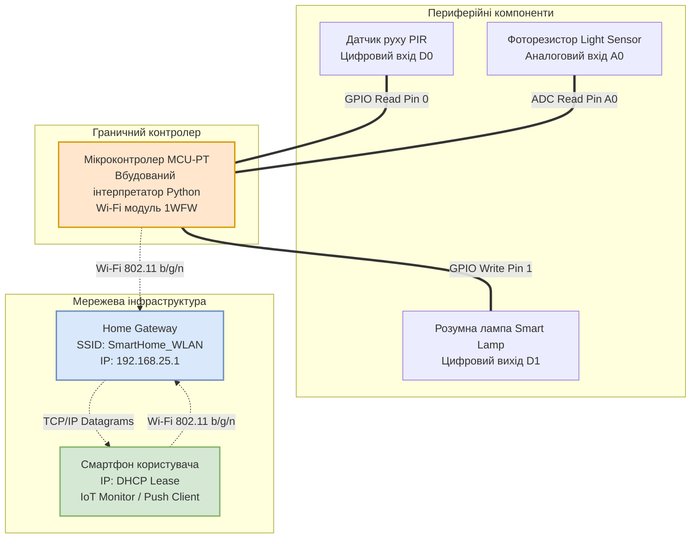
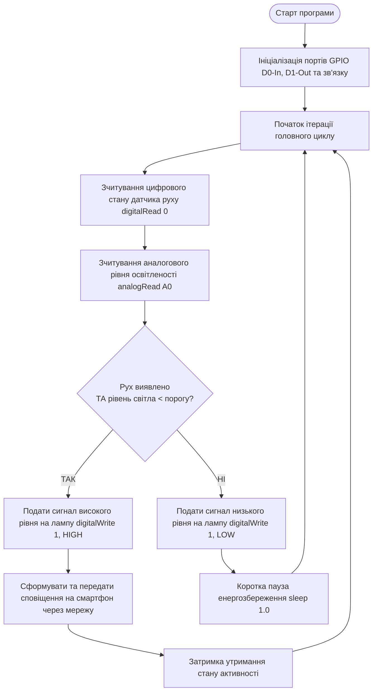
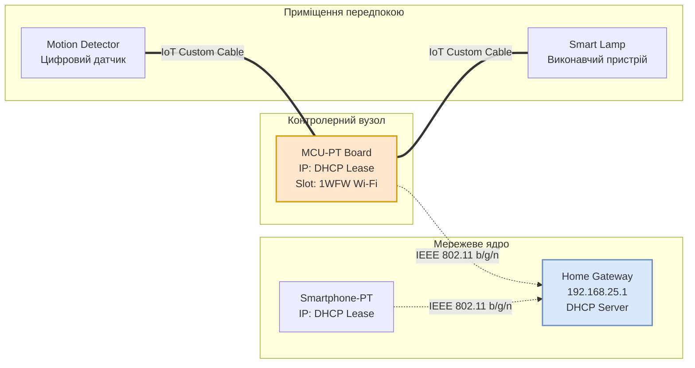

# Лабораторна робота № 2. Симуляція підсистем «Розумного будинку» на базі мікроконтролера MCU та бездротових технологій WLAN у середовищі Cisco Packet Tracer

**Мета:** Дослідити особливості використання бездротових технологій локальних мереж (WLAN стандарту IEEE 802.11) у системах автоматизації житлових приміщень, опанувати методи підключення сенсорів та актуаторів до віртуального мікроконтролера MCU, а також розробити алгоритм і прикладне програмне забезпечення мовою Python для автономного збору даних, адаптивного керування освітленням і передавання статусних сповіщень на мобільний пристрій користувача.

**Стек технологій та інструменти:**
* **Мова програмування / Середовище:** Вбудований інтерпретатор Python 3 у середовищі симуляції Cisco Packet Tracer (версія 8.2 або вище).
* **Платформа / Бібліотеки / Модулі:** Вбудовані модулі `gpio` та `time`, мережевий стек IEEE 802.11 b/g/n, протоколи IPv4, DHCP, TCP/IP, бездротова точка доступу Home Gateway.
* **Інструменти розробки:** Робочий простір Cisco Packet Tracer Workspace, вкладка програмування мікроконтролера (MCU Programming Tab), панель симуляції фізичних взаємодій.

---

## 1 Теоретичні відомості

Технології бездротового зв'язку формують основу для функціонування сучасних екосистем розумного будинку (Smart Home), дозволяючи інтегрувати значну кількість виконавчих пристроїв та датчиків без необхідності прокладання кабельних трас. Серед бездротових технологій найбільшого поширення набув стандарт IEEE 802.11 (Wi-Fi), який функціонує переважно в неліцензованих частотних діапазонах $2{,}4\text{ ГГц}$ та $5\text{ ГГц}$. У системах Інтернету речей використання Wi-Fi забезпечує високу пропускну здатність та сумісність із існуючою телекомунікаційною інфраструктурою житла, проте вимагає ретельного контролю енергоспоживання через відносно високий струм радіопередавача під час активного сеансу зв'язку.

Центральною ланкою обробки подій на граничному рівні (Edge Layer) у цій роботі виступає мікроконтролерний модуль (Microcontroller Unit, MCU-PT). Мікроконтролер поєднує в собі обчислювальне ядро, оперативну пам'ять, незалежну пам'ять програм і набір портів введення-виведення загального призначення (General Purpose Input/Output, GPIO). Порти GPIO можуть функціонувати в цифровому режимі (зчитування або генерація логічних рівнів $0$ та $1$, що відповідають напругам $0\text{ В}$ та $3{,}3\text{ В} / 5\text{ В}$) або в аналоговому режимі з використанням інтегрованого аналого-цифрового перетворювача (АЦП), що квантує вхідну напругу в дискретні числові значення.


*Рисунок 1 — Структурна схема взаємодії мікроконтролера з периферією та бездротовою мережею*

Наведену на рисунку 1 структуру побудовано за принципом децентралізованого керування. Сенсори підключаються безпосередньо до портів GPIO мікроконтролера, що дозволяє виконувати опитування та аналіз фізичних сигналів у реальному часі без внесення додаткових затримок мережевого рівня. Оброблені результати та сигнали тривоги передаються через вбудований бездротовий модуль до бездротового шлюзу Home Gateway, який транслює повідомлення безпосередньо на мобільний термінал користувача.

Алгоритм функціонування прошивки мікроконтролера реалізує цикл безперервного моніторингу простору. У разі детектування руху інфрачервоним сенсором контролер зчитує рівень фонового освітлення, ухвалює рішення щодо активації штучного освітлення та генерує службове інформаційне повідомлення, яке через транспортний рівень мережі надсилається на термінал смартфона.


*Рисунок 2 — Алгоритм функціонування мікроконтролера в підсистемі автоматизованого освітлення*

Під час проектування бездротового каналу зв'язку всередині житлових приміщень необхідно враховувати згасання електромагнітних хвиль при проходженні крізь стіни та перекриття. Для розрахунку втрат сигналу на трасі поширення у закритих приміщеннях застосовується логарифмічно-дистанційна модель втрат із врахуванням перешкод (Log-Distance Path Loss Model):

$$PL(d) = PL(d_0) + 10 \cdot n \cdot \log_{10}\left(\frac{d}{d_0}\right) + X_{\sigma} + \sum_{k=1}^{K} WAF_k$$

де $PL(d)$ — сумарні втрати потужності сигналу на відстані $d$ від точки доступу (дБ);
$PL(d_0)$ — втрати потужності на опорній відстані $d_0$ (зазвичай $d_0 = 1\text{ м}$, для частоти $2{,}4\text{ ГГц}$ становить близько $40{,}05\text{ дБ}$);
$n$ — показник затухання траси (для відкритих приміщень $n \approx 2{,}0$, для приміщень із перегородками $n = 3{,}0 \dots 4{,}5$);
$d$ — фактична відстань між точкою доступу та приймачем IoT-вузла (м);
$X_{\sigma}$ — випадкова величина з нульовим середнім та нормальним розподілом, яка моделює ефект затінення (дБ);
$WAF_k$ — коефіцієнт додаткового згасання радіосигналу на $k$-тій стіні чи перешкоді (Wall Attenuation Factor, дБ).

Рівень потужності радіосигналу, що надходить на вхід приймача бездротового модуля ($P_{rx}$), визначається рівнянням енергетичного бюджету радіолінії:

$$P_{rx} = P_{tx} + G_{tx} + G_{rx} - PL(d)$$

де $P_{tx}$ — вихідна потужність передавача точки доступу або контролера (дБм);
$G_{tx}$ — коефіцієнт підсилення передавальної антени (дБі);
$G_{rx}$ — коефіцієнт підсилення приймальної антени (дБі);
$PL(d)$ — сумарні втрати потужності сигналу на відстані $d$ (дБ).

Для забезпечення стабільного зв'язку рівень $P_{rx}$ повинен перевищувати поріг чутливості приймача ($S_{rx}$) із запасом надійності не менше $10\text{ дБ}$:

$$M = P_{rx} - S_{rx} \ge 10\text{ дБ}$$

де $M$ — запас радіолінії за потужністю (Link Margin, дБ).

Час повної реакції системи на виникнення фізичної події ($T_{\text{reaction}}$) визначається сумою затримок апаратного зчитування, виконання алгоритму та трансляції сигналу бездротовим каналом:

$$T_{\text{reaction}} = t_{\text{sense}} + t_{\text{proc}} + t_{\text{wlan}} + t_{\text{act}}$$

де $t_{\text{sense}}$ — апаратний час реакції чутливого елемента датчика (с);
$t_{\text{proc}}$ — тривалість виконання коду інтерпретатором мікроконтролера (с);
$t_{\text{wlan}}$ — затримка передавання мережевого пакета через бездротове середовище Wi-Fi (с);
$t_{\text{act}}$ — час перемикання силового реле або зміни фізичного стану актуатора (с).

---

## 2 Підготовка середовища та розгортання проєкту (Крок 0)

Для коректного виконання роботи необхідно підготувати робочий каталог та перевірити доступність необхідних інструментів моделювання.

1. Запустіть термінал операційної системи та створіть структуру робочих директорій для збереження симуляцій, скриптів автоматизації та конфігураційних файлів:

```bash
# Створення робочих папок для матеріалів лабораторної роботи
mkdir -p ~/SmartHome_Simulation/{topologies,scripts,reports}
cd ~/SmartHome_Simulation
```

Структура файлів розробленого проєкту має відповідати такій ієрархії:

```text
SmartHome_Simulation/
├── topologies/
│   └── SmartHome_MCU_WLAN.pkt    # Основний файл топології Cisco Packet Tracer
├── scripts/
│   └── mcu_controller.py         # Вихідний код алгоритму автоматизації для MCU-PT
└── reports/
    └── execution_log.txt         # Текстовий журнал реєстрації подій та стану пристроїв
```

2. Відкрийте Cisco Packet Tracer та переконайтеся, що на панелі вибору обладнання присутні компоненти:
   * Модуль **MCU-PT** (розділ *Components* $\to$ *Boards*);
   * Бездротовий маршрутизатор **Home Gateway** (розділ *Network Devices* $\to$ *Wireless Devices*);
   * Кінцевий термінал **Smartphone-PT** (розділ *End Devices* $\to$ *End Devices*);
   * Датчик руху **Motion Detector** та смарт-лампа **Light** (розділ *End Devices* $\to$ *Home*);
   * З'єднувальні кабелі **IoT Custom Cable** (розділ *Connections*).

---

## 3 Порядок виконання роботи

### 3.1 Індивідуальні завдання

Кожен здобувач реалізує індивідуальну підсистему автоматизації «Розумного будинку» відповідно до номера свого варіанта.

| Варіант | Назва підсистеми | Параметри мережі (SSID, IP-пул, WPA2) | Сенсори та порти MCU | Актуатори та порти MCU | Логіка функціонування підсистеми |
| :---: | :--- | :--- | :--- | :--- | :--- |
| **1** | Адаптивне освітлення коридору | SSID: `Home_Corridor_1`, `192.168.10.0/24`, Key: `CorrPass2026!` | Датчик руху (D0), Фоторезистор (A0) | Диммерна LED лампа (D1) | Якщо виявлено рух та освітленість < 300, увімкнути лампу на 100% та надіслати сповіщення на смартфон |
| **2** | Клімат-контроль дитячої кімнати | SSID: `Home_Kids_Net`, `192.168.20.0/24`, Key: `KidsRoomSafe77` | Датчик температури (A0), Датчик вікна (D0) | Обігрівач (D1), Зволожувач (D2) | Якщо вікно закрите та температура < 20°C, увімкнути обігрівач; статус температури транслювати на смартфон |
| **3** | Захист кухні від витоку газу | SSID: `Kitchen_Safe_IoT`, `192.168.30.0/24`, Key: `GasProtect88#` | Датчик газу (A0), Кнопка аварії (D0) | Відсічний клапан (D1), Витяжка (D2) | Якщо концентрація газу > 250, перекрити клапан, увімкнути витяжку та подати тривожний сигнал на смартфон |
| **4** | Автоматика вхідної групи | SSID: `Entrance_Door_Net`, `192.168.40.0/24`, Key: `AccessCode99$` | Геркон дверей (D0), Датчик руху (D1) | Електроригельний замок (D2), Дзвінок (D3) | Якщо замок відкрито без фіксації руху понад 30 секунд, увімкнути дзвінок і надіслати тривогу |
| **5** | Контроль протікання ванної кімнати | SSID: `Bath_Water_Guard`, `192.168.50.0/24`, Key: `AquaStop2026` | Датчик затоплення (D0), Датчик тиску (A0) | Сервопривід крана води (D1), Сирена (D2) | При спрацюванні датчика затоплення перекрити кран подачі води та надіслати PUSH-сповіщення |
| **6** | Розумна вентиляція спальні | SSID: `Bedroom_Air_Net`, `192.168.60.0/24`, Key: `AirCleanPass1` | Датчик CO2 (A0), Датчик присутності (D0) | Моторизоване вікно (D1), Вентилятор (D2) | Якщо людина присутня та CO2 > 800 ppm, відкрити вікно на провітрювання та вивести стан на смартфон |
| **7** | Безпека домашнього кабінету | SSID: `Cabinet_Guard`, `192.168.70.0/24`, Key: `PrivateRoom55@` | Датчик вібрації вікна (D0), Датчик руху (D1) | Стробоскоп (D2), Електромагнітний замок (D3) | При фіксації вібрації активувати стробоскоп, заблокувати сейфовий замок і сповістити власника |
| **8** | Автоматизована гардеробна | SSID: `Wardrobe_Smart`, `192.168.80.0/24`, Key: `LightControl33` | Кінцевий вимикач дверей (D0), Датчик вологості (A0) | LED-підсвітка полиць (D1), Осушувач (D2) | При відкритті дверей увімкнути підсвітку; якщо вологість > 65%, запустити осушувач та передати статус |
| **9** | Сигналізація гаражного боксу | SSID: `Garage_Auto_IoT`, `192.168.90.0/24`, Key: `GarageSecure22` | Оптичний бар'єр воріт (D0), Датчик диму (A0) | Підйомні ворота (D1), Сирена тривоги (D2) | Якщо ворота відкриті довше 5 хвилин або зафіксовано дим, закрити ворота та надіслати звіт |
| **10** | Освітлення прибудинкової тераси | SSID: `Terrace_Light_Net`, `192.168.100.0/24`, Key: `OpenAirPass8` | Фоторезистор (A0), Радар руху (D0) | Група вуличних бра (D1), Прожектор (D2) | У темний час доби при появі людини увімкнути бра; якщо рух триває > 10 с — увімкнути прожектор |
| **11** | Контроль підвального приміщення | SSID: `Basement_Safe`, `192.168.110.0/24`, Key: `DeepStorage44!` | Датчик вологості (A0), Датчик рівня води (D0) | Дренажний насос (D1), Вентилятор (D2) | Якщо рівень води критичний, увімкнути дренажний насос на максимальну потужність і передати SOS-повідомлення |
| **12** | Автоматика зимового саду | SSID: `Winter_Garden_WLAN`, `192.168.120.0/24`, Key: `GreenFlora99*` | Датчик вологості грунту (A0), Фотоелемент (A1) | Клапан автополиву (D1), Фітолампа (D2) | Якщо грунт сухий, активувати полив на 20 секунд; стан зволоженості щохвилини надсилати на мобільний |
| **13** | Моніторинг домашньої котельні | SSID: `Boiler_Room_IoT`, `192.168.130.0/24`, Key: `HeatSupply2026` | Датчик температури котла (A0), Датчик диму (D0) | Циркуляційний насос (D1), Аварійний клапан (D2) | Якщо температура котла > 85°C, скинути тиск через клапан і надіслати попередження на телефон |
| **14** | Смарт-система домашнього кінотеатру | SSID: `Media_Lounge_Net`, `192.168.140.0/24`, Key: `CinemaSound77` | Кнопка активації режиму (D0), Датчик світла (A0) | Моторизовані штори (D1), Фонове світло (D2) | При натисканні кнопки плавно опустити штори, вимкнути основне світло та вивести статус на смартфон |
| **15** | Безпека балкону та лоджії | SSID: `Balcony_Protect`, `192.168.150.0/24`, Key: `HighFloorSafe` | Датчик відкриття вікна (D0), Датчик дощу (D1) | Привід закриття стулок (D2), Оповіщувач (D3) | Якщо починається дощ при відкритому вікні, автоматично закрити стулку та сповістити господаря |
| **16** | Управління сауною розумного будинку | SSID: `Sauna_Control_IoT`, `192.168.160.0/24`, Key: `SteamMaster55#` | Термопара парної (A0), Таймер безпеки (D0) | Електрокам'янка (D1), Вентиляційний клапан (D2) | Підтримувати температуру на рівні 90°C; при досягненні ліміту часу вимкнути ТЕНи та подати звуковий сигнал |
| **17** | Охоронний периметр даху | SSID: `Roof_Security_Net`, `192.168.170.0/24`, Key: `TopLevelGuard` | Інфрачервоний датчик бар'єру (D0), Датчик вітру (A0) | Прожектор стеження (D1), Сирена (D2) | При перетині бар'єру направити світло прожектора у зону тривоги та передати координати на смартфон |
| **18** | Автоматика пральні та сушарки | SSID: `Laundry_Smart_Net`, `192.168.180.0/24`, Key: `CleanWashPass` | Датчик вібрації машини (D0), Датчик вологості (A0) | Витяжний вентилятор (D1), Світловий маяк (D2) | Після припинення вібрації (завершення циклу) активувати вентилятор і повідомити користувача про готовність |
| **19** | Контроль доступу до збройового сейфу | SSID: `Safe_Vault_Secure`, `192.168.190.0/24`, Key: `ArmorProtect11` | Сенсор дотику (D0), Датчик кута нахилу (D1) | Електронний замок сейфу (D2), Прихована тривога (D3) | Якщо сейф нахилено або відкрито без авторизації, миттєво заблокувати механізм і відправити тривогу |
| **20** | Енергоефективна сходова клітка | SSID: `Stairs_Light_IoT`, `192.168.200.0/24`, Key: `StepLight2026$` | Датчик руху знизу (D0), Датчик руху зверху (D1) | Східчаста LED підсвітка (D2) | Почергово увімкнути сходинки у напрямку руху людини та вимкнути через 15 секунд після виходу |

---

### 3.2 Покроковий алгоритм та розв'язок еталонного прикладу

У ролі еталонного прикладу розглядається **«Адаптивна підсистема безпеки та автоматичного керування освітленням передпокою з інтеграцією смартфона»**.

Конфігурація еталонної системи:
* Діапазон IP-адрес підмережі: `192.168.25.0/24`
* IP-адреса шлюзу (Home Gateway): `192.168.25.1`
* Бездротова мережа (SSID): `SmartHome_WLAN`
* Протокол безпеки та пароль: `WPA2-PSK`, ключ `HomeKey2026!`
* Склад обладнання: Шлюз `Home Gateway`, мікроконтролер `MCU-PT`, датчик руху `Motion Detector`, розумна лампа `Smart Lamp`, смартфон `Smartphone-PT`.
* Порти підключення до MCU:
  * Вхідний порт `D0` — Датчик руху (`Motion Detector`);
  * Вихідний порт `D1` — Розумна лампа (`Smart Lamp`).


*Рисунок 3 — Схема фізичних та логічних з'єднань еталонної системи*

#### Крок 1. Розміщення компонентів на робочому просторі

1. Додайте на робочу область Cisco Packet Tracer такі пристрої:
   * Один бездротовий шлюз **Home Gateway** (панель *Network Devices* $\to$ вкладка *Wireless*);
   * Один мікроконтролерний модуль **MCU-PT** (панель *Components* $\to$ вкладка *Boards*);
   * Один датчик руху **Motion Detector** (панель *End Devices* $\to$ вкладка *Home*);
   * Одну розумну лампу **Light** (панель *End Devices* $\to$ вкладка *Home*);
   * Один смартфон **Smart Phone** (панель *End Devices* $\to$ вкладка *End Devices*).

#### Крок 2. Налаштування бездротового шлюзу Home Gateway

1. Відкрийте графічний інтерфейс конфігурації `Home Gateway`, натиснувши на піктограму пристрою, та перейдіть у вкладку **Config**.
2. В меню навігації зліва відкрийте розділ **LAN**:
   * Вкажіть параметр **IP Address**: `192.168.25.1`;
   * Вкажіть параметр **Subnet Mask**: `255.255.255.0`;
   * Переконайтеся, що перемикач **DHCP Server** встановлено в положення *Enabled*;
   * Встановіть початкову адресу пулу **Start IP Address**: `192.168.25.100`;
   * Встановіть максимальну кількість клієнтів **Maximum Number of Users**: `50`.

3. Перейдіть до розділу **Wireless**:
   * Встановіть назву бездротової мережі **SSID**: `SmartHome_WLAN`;
   * У випадаючому списку стандарту безпеки виберіть **WPA2-PSK**;
   * Введіть ключ спільного доступу **PSK Pass Phrase**: `HomeKey2026!`;
   * Перевірте, щоб тип шифрування був встановлений як **AES**.

#### Крок 3. Додавання модуля Wi-Fi та підключення мікроконтролера MCU

За замовчуванням плата MCU-PT має лише дротовий Ethernet-інтерфейс. Для надання контролеру можливостей бездротового зв'язку необхідно виконати апаратну модифікацію:

1. Відкрийте вікно мікроконтролера `MCU-PT`, перейдіть на вкладку **Physical** та натисніть кнопку **Advanced** у правому нижньому кутку.
2. Перейдіть на вкладку **I/O Config**, що з'явилася на верхній панелі:
   * У випадаючому меню **Network Adapter** змініть значення з порту `PT-IOT-NM-1CFE` (FastEthernet) на модуль `PT-IOT-NM-1WFW` (бездротовий адаптер Wi-Fi 2.4 GHz).
3. Перейдіть на вкладку **Config** $\to$ меню **Wireless0**:
   * Вкажіть значення **SSID**: `SmartHome_WLAN`;
   * Оберіть протокол безпеки **WPA2-PSK**;
   * Введіть пароль **PSK Pass Phrase**: `HomeKey2026!`.
4. Перейдіть у розділ **Config** $\to$ **Settings**:
   * Встановіть радіокнопку **Gateway/DNS IPv4** у положення **DHCP**;
   * Переконайтеся, що інтерфейс отримав динамічну IP-адресу вигляду `192.168.25.10X`.

#### Крок 4. Підключення смартфона користувача до Wi-Fi мережі

1. Відкрийте пристрій `Smart Phone`, перейдіть на вкладку **Config** $\to$ меню **Wireless0**.
2. Вкажіть налаштування бездротового з'єднання:
   * Встановіть **SSID**: `SmartHome_WLAN`;
   * Виберіть автентифікацію **WPA2-PSK**;
   * Введіть **PSK Pass Phrase**: `HomeKey2026!`.
3. Перейдіть на вкладку **Desktop** $\to$ **IP Configuration** і перевірте успішне отримання мережевих параметрів за протоколом DHCP (IP-адреса з пулу `192.168.25.100 - 192.168.25.150`, шлюз `192.168.25.1`).

#### Крок 5. Фізичне з'єднання сенсора та актуатора з портами GPIO MCU

1. На панелі з'єднань оберіть кабель **IoT Custom Cable** (спеціальний кабель для зв'язку IoT-компонентів).
2. З'єднайте датчик руху `Motion Detector` (порт `IoT0`) із цифровим портом `D0` плати `MCU-PT`.
3. З'єднайте розумну лампу `Light` (порт `IoT0`) із цифровим портом `D1` плати `MCU-PT`.

#### Крок 6. Розробка керуючого програмного коду для MCU

1. Відкрийте вікно `MCU-PT` та перейдіть на вкладку **Programming**.
2. Натисніть кнопку **New**, введіть ім'я проєкту `SmartLighting` та оберіть шаблон **Python**.
3. Відкрийте файл `main.py` у вбудованому редакторі та введіть повний програмний код керування підсистемою:

```python
import time
from gpio import *

# =====================================================================
# КОНФІГУРАЦІЯ АПАРАТНИХ ПОРТІВ GPIO ТА ЧАСОВИХ ІНТЕРВАЛІВ
# =====================================================================
MOTION_SENSOR_PIN = 0     # Цифровий вхід D0: підключено датчик руху (PIR)
LIGHT_ACTUATOR_PIN = 1    # Цифровий вихід D1: підключено смарт-лампу
LIGHT_HOLD_TIME = 5       # Час утримання світла увімкненим після зупинки руху (сек)
POLL_INTERVAL = 0.5       # Інтервал дискретизації датчика (сек)

# Рівні керування актуатором освітлення в Packet Tracer
LIGHT_LEVEL_OFF = 0       # Стан: Лампа повністю вимкнена
LIGHT_LEVEL_LOW = 1       # Стан: Тьмяне чергове світло
LIGHT_LEVEL_HIGH = 2      # Стан: Максимальна яскравість освітлення

def setup_hardware():
    """
    Ініціалізація режимів роботи цифрових портів введення-виведення.
    """
    pinMode(MOTION_SENSOR_PIN, IN)
    pinMode(LIGHT_ACTUATOR_PIN, OUT)
    
    # Початковий стан: лампа вимкнена
    customWrite(LIGHT_ACTUATOR_PIN, LIGHT_LEVEL_OFF)
    print("[ІНІЦІАЛІЗАЦІЯ]: Порти GPIO налаштовано. D0 -> INPUT, D1 -> OUTPUT.")

def transmit_status_to_network(event_message):
    """
    Функція емулює формування та передавання статусного повідомлення
    через мережевий інтерфейс Wi-Fi на смартфон користувача.
    """
    current_timestamp = time.strftime("%H:%M:%S")
    network_payload = f"[{current_timestamp}] [WLAN-NOTIFY]: {event_message}"
    print(network_payload)

def main():
    """
    Головний нескінченний цикл опитування сенсорів та управління актуатором.
    """
    setup_hardware()
    
    motion_state = 0
    previous_motion_state = 0
    light_turn_off_timer = 0
    is_light_on = False

    print("[СИСТЕМА]: Моніторинг передпокою активовано у штатному режимі.")

    while True:
        # Зчитування цифрового сигналу з інфрачервоного датчика руху
        motion_state = digitalRead(MOTION_SENSOR_PIN)

        # Перевірка зміни стану: фіксація появи руху
        if motion_state == HIGH:
            # Оновлюємо таймер зворотного відліку
            light_turn_off_timer = time.time() + LIGHT_HOLD_TIME
            
            if not is_light_on:
                # Вмикання освітлення на максимальну яскравість
                customWrite(LIGHT_ACTUATOR_PIN, LIGHT_LEVEL_HIGH)
                is_light_on = True
                transmit_status_to_network("Виявлено рух! Освітлення увімкнено (Яскравість: 100%).")

            if previous_motion_state == LOW:
                transmit_status_to_network("Сенсор PIR: Активність у зоні спостереження.")

        else:
            # Якщо руху немає, перевіряємо, чи не вичерпано час утримання світла
            if is_light_on and time.time() >= light_turn_off_timer:
                customWrite(LIGHT_ACTUATOR_PIN, LIGHT_LEVEL_OFF)
                is_light_on = False
                transmit_status_to_network("Рух припинився. Тайм-аут вичерпано. Освітлення вимкнено.")

        # Збереження поточного стану для аналізу фронтів сигналу
        previous_motion_state = motion_state

        # Затримка для запобігання надлишкового завантаження процесора
        time.sleep(POLL_INTERVAL)

if __name__ == "__main__":
    main()
```

---

### 3.3 Запуск, тестування та перевірка результатів

1. У вікні мікроконтролера `MCU-PT` на вкладці **Programming** натисніть кнопку **Run** для запуску інтерпретації скрипта `main.py`.
2. Відкрийте вікно консолі мікроконтролера у нижній частині вкладки програмування.
3. Проведіть тестування підсистеми:
   * Для виклику спрацювання датчика руху затисніть на клавіатурі клавішу `Alt` та наведіть курсор миші на пристрій `Motion Detector`. Утримуйте курсор у зоні чутливості сенсора протягом $2\text{--}3$ секунд.
   * Спостерігайте зміну стану лампи `Smart Lamp` — її колір змінюється на яскраво-жовтий, що свідчить про перехід актуатора в режим повної яскравості.
   * Приберіть курсор від датчика руху та зачекайте 5 секунд. Після завершення тайм-ауту лампа автоматично згасне.

#### Приклад протоколу роботи мікроконтролера у терміналі:

```text
[ІНІЦІАЛІЗАЦІЯ]: Порти GPIO налаштовано. D0 -> INPUT, D1 -> OUTPUT.
[СИСТЕМА]: Моніторинг передпокою активовано у штатному режимі.
[00:00:02] [WLAN-NOTIFY]: Виявлено рух! Освітлення увімкнено (Яскравість: 100%).
[00:00:02] [WLAN-NOTIFY]: Сенсор PIR: Активність у зоні спостереження.
[00:00:08] [WLAN-NOTIFY]: Рух припинився. Тайм-аут вичерпано. Освітлення вимкнено.
[00:00:15] [WLAN-NOTIFY]: Виявлено рух! Освітлення увімкнено (Яскравість: 100%).
[00:00:15] [WLAN-NOTIFY]: Сенсор PIR: Активність у зоні спостереження.
[00:00:21] [WLAN-NOTIFY]: Рух припинився. Тайм-аут вичерпано. Освітлення вимкнено.
```

---

## 4 Вимоги до змісту звіту

Звіт оформлюється українською мовою згідно з вимогами ДСТУ 3008:2015 і повинен містити такі обов'язкові компоненти:

1. Титульна сторінка оформлена за встановленим університетським зразком із зазначенням навчального закладу, кафедри, дисципліни, номера лабораторної роботи, номера варіанта та відомостей про автора.
2. Мета роботи та коротка теоретична частина з описом принципів взаємодії мікроконтролерів із периферією та особливостей поширення бездротового сигналу стандарту IEEE 802.11 у приміщеннях.
3. Постановка індивідуального завдання відповідно до закріпленого варіанта, що включає перелік датчиків, актуаторів та параметри конфігурації бездротової мережі.
4. Розрахункова частина, де наведено розрахунок згасання бездротового сигналу $PL(d)$ та рівня потужності на вході приймача $P_{rx}$ для дистанції розташування вузла $d = 8\text{ м}$ за формулами, наведеними в теоретичних відомостях.
5. Скріншот розробленої топології у середовищі Cisco Packet Tracer із відображенням мікроконтролера, шлюзу, смартфона та підключених периферійних пристроїв.
6. Таблиця комутації та мережевої адресації, що містить назви пристроїв, номери використаних портів GPIO, фізичні MAC-адреси та динамічно призначені IP-адреси.
7. Повний текст керуючого скрипта мовою Python для мікроконтролера MCU-PT без скорочень і заповнювачів, з докладним порядковим коментуванням логіки.
8. Скріншоти результатів тестування системи у моменти активного та пасивного станів, а також роздруківка логу подій із консолі керування.
9. Аналітичні висновки, у яких проаналізовано надійність спрацювання автоматики, оцінено часові затримки реакції системи та наведено рекомендації щодо мінімізації енергоспоживання вузла.

---

## 5 Контрольні запитання для захисту роботи

1. **Які принципові відмінності існують між обробкою сигналів на фізичних портах введення-виведення мікроконтролера функціями `digitalRead()` та `analogRead()`?** Поясніть, яким чином розрядність вбудованого АЦП впливає на точність квантування аналогових параметрів.
2. **Чому під час проєктування сенсорних вузлів Інтернету речей у діапазоні $2{,}4\text{ ГГц}$ необхідно розраховувати показник затухання траси $n$ та коефіцієнт $WAF$?** Які фізичні матеріали стін викликають найбільше падіння потужності електромагнітної хвилі?
3. **Яким чином протокол DHCP у поєднанні з бездротовою точкою доступу Home Gateway автоматизує конфігурацію параметрів мережевого рівня для нових пристроїв IoT?**
4. **У чому полягає різниця між методами прямого програмного опитування сенсора (Polling) та обробкою подій на основі апаратних переривань (Interrupts) з точки зору енергоефективності мікроконтролера?**
5. **Які заходи безпеки забезпечує стандарт автентифікації WPA2-PSK із протоколом шифрування AES при передаванні телеметрії між мікроконтролером та бездротовим шлюзом?**
6. **Яким чином у коді мовою Python реалізується механізм програмного усунення брязкоту контактів (Debouncing) та запобігання помилковим багаторазовим спрацюванням сенсорів руху або кнопок?**