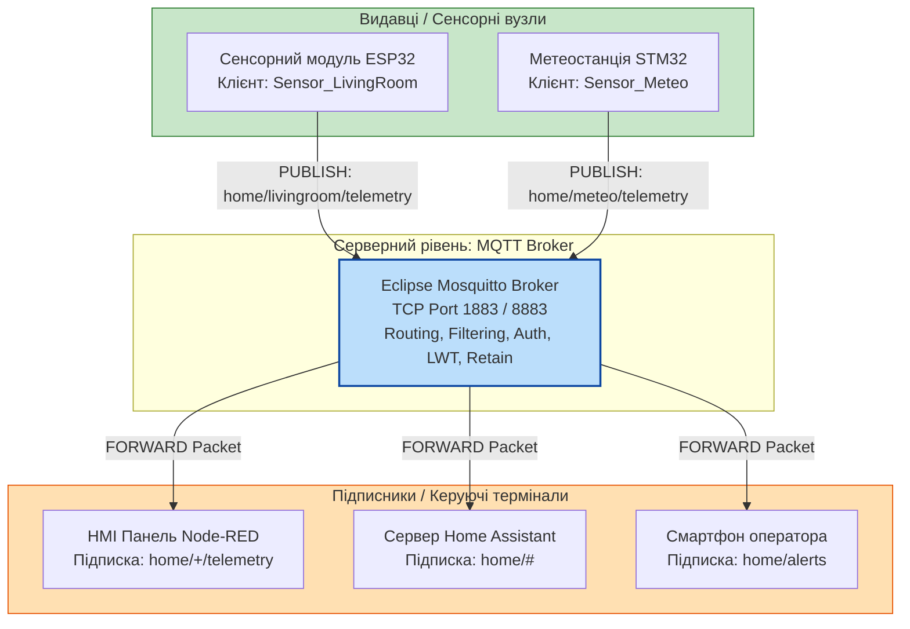
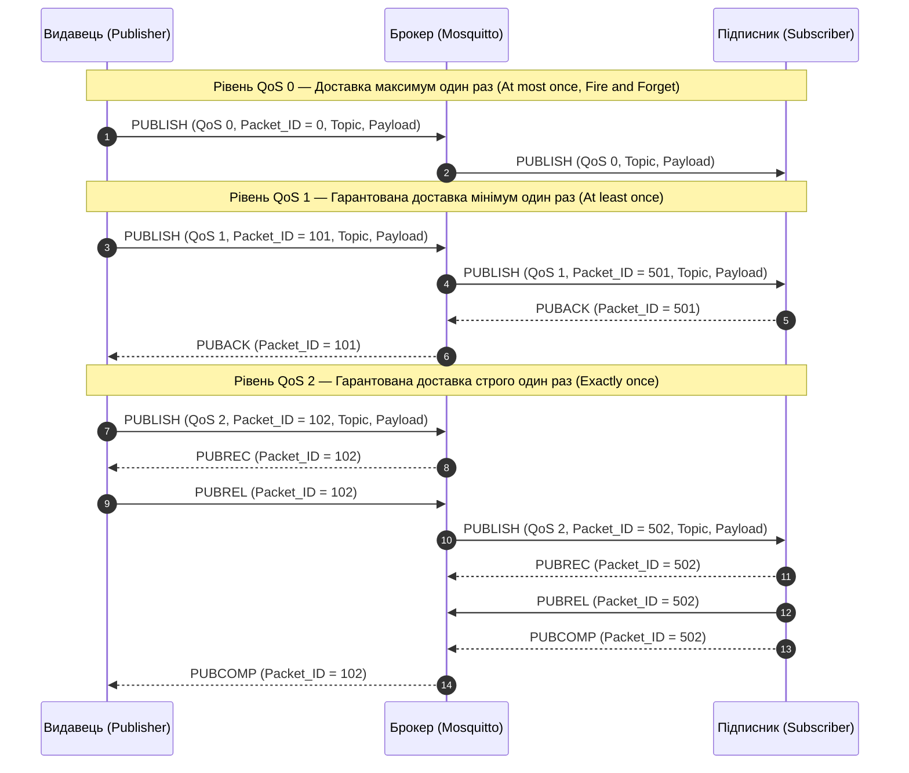

# Лабораторна робота № 3. Розгортання, конфігурування та дослідження параметрів функціонування локального MQTT-брокера Eclipse Mosquitto

**Мета:** Дослідити архітектуру шаблону проєктування «Видавець-Підписник» (Publish/Subscribe), опанувати методи встановлення, конфігурування та адміністрування локального брокера повідомлень Eclipse Mosquitto, вивчити структуру пакетів протоколу MQTT, механізми забезпечення рівнів якості обслуговування (QoS 0, QoS 1, QoS 2), роботу спеціальних прапорців Retain та Last Will and Testament (LWT), а також набути практичних навичок тестування інформаційного обміну за допомогою утиліт командного рядка та графічного клієнта MQTT Explorer.

**Стек технологій та інструменти:**
* **Мова програмування / Середовище:** Командний інтерпретатор Bash / PowerShell, мова програмування Python 3.10+ (для автоматизованого тестування).
* **Платформа / Бібліотеки / Модулі:** Серверний брокер Eclipse Mosquitto (версія 2.0.x), консольні клієнти `mosquitto_sub`, `mosquitto_pub`, утиліта генерації паролів `mosquitto_passwd`, клієнтська бібліотека `paho-mqtt` (версія 2.0+).
* **Інструменти розробки:** Емулятор термінала операційної системи, графічний клієнт MQTT Explorer, текстовий редактор Visual Studio Code або Nano.

---

## 1 Теоретичні відомості

Протокол MQTT (Message Queuing Telemetry Transport) є відкритим міжнародним стандартом (ISO/IEC 20922) прикладного рівня, оптимізованим для передавання телеметричних даних в умовах обмежених обчислювальних ресурсів кінцевих пристроїв, низької пропускної здатності каналів зв'язку та високої ймовірності нестабільного мережевого з'єднання. На відміну від класичної моделі клієнт-сервер (наприклад, протоколу HTTP), де взаємодія побудована на жорсткій синхронній схемі запит-відповідь, MQTT базується на подійно-орієнтованій архітектурі «Видавець-Підписник» (Publish/Subscribe).

У центрі мережевої взаємодії розташовується брокер повідомлень (Broker), який виступає посередником і повністю відокремлює клієнтів за трьома вимірами: у просторі (клієнтам не потрібно знати IP-адреси та порти один одного), у часі (відправник і одержувач можуть перебувати в мережі в різні моменти часу) та за синхронізацією (публікація даних не блокує виконання програми клієнта-видавця). Клієнти підключаються до брокера через довготривале TCP-з'єднання (за замовчуванням порт 1883 для незахищеного з'єднання або порт 8883 при використанні TLS/SSL).


*Рисунок 1 — Структурна схема маршрутизації повідомлень за моделлю Publish/Subscribe*

Наведений на рисунку 1 інформаційний потік організовано за допомогою ієрархічних тем (топіків, Topics), які являють собою текстові UTF-8 рядки, розділені косою рискою (`/`). Для гнучкої фільтрації повідомлень підписники використовують символи підстановки (Wildcards): символ `+` замінює строго один рівень ієрархії, а символ `#` замінює всі дочірні підрівні до кінця гілки топіка.

Протокол MQTT передбачає три рівні якості обслуговування (Quality of Service, QoS), які гарантують надійність доставки повідомлень за різних умов стабільності фізичного каналу зв'язку.


*Рисунок 2 — Діаграма послідовності процедур підтвердження доставки для рівнів QoS 0, QoS 1 та QoS 2*

Особливе значення в MQTT мають службові прапорці, що керують життєвим циклом даних:
* Прапорець **Retain** вказує брокеру зберегти останнє опубліковане в даному топіку повідомлення та негайно надіслати його будь-якому новому клієнту, який підпишеться на цей топік у майбутньому.
* Механізм **Last Will and Testament (LWT)** дозволяє клієнту на етапі ініціалізації з'єднання (`CONNECT`) зберегти на брокері заповітне аварійне повідомлення. Якщо брокер фіксує непередбачуваний обрив TCP-сесії (наприклад, зникнення живлення або таймаут Keep Alive), він автоматично публікує повідомлення LWT у визначений топік аварій.

Загальний обсяг службового мережевого навантаження одного пакету MQTT ($S_{\text{packet}}$) визначається сумою довжин фіксованого заголовка, змінного заголовка та корисного навантаження:

$$S_{\text{packet}} = S_{\text{fixed}} + S_{\text{variable}} + S_{\text{payload}}$$

де $S_{\text{fixed}}$ — розмір фіксованого заголовка, який складається з 1 байта типу пакету і прапорців та $1 \dots 4$ байтів довжини залишкової частини (байт);
$S_{\text{variable}}$ — довжина змінного заголовка, що містить ім'я топіка та 2-байтний `Packet Identifier` для рівнів $\text{QoS} \ge 1$ (байт);
$S_{\text{payload}}$ — безпосередній розмір передаваних даних у форматі тексту, JSON або двійкового масиву (байт).

Час доставки телеметричного повідомлення від видавця до підписника залежить від обраного рівня якості обслуговування і визначається через час кругового обігу пакетів ($RTT$):

$$T_{\text{QoS0}} = \frac{RTT_{\text{pub-brk}}}{2} + \frac{RTT_{\text{brk-sub}}}{2}$$

$$T_{\text{QoS1}} = RTT_{\text{pub-brk}} + RTT_{\text{brk-sub}}$$

$$T_{\text{QoS2}} = 2 \cdot RTT_{\text{pub-brk}} + 2 \cdot RTT_{\text{brk-sub}}$$

де $RTT_{\text{pub-brk}}$ — час кругового обігу пакетів між видавцем та брокером (с);
$RTT_{\text{brk-sub}}$ — час кругового обігу пакетів між брокером та кінцевим підписником (с).

Коефіцієнт корисної дії передавання інформаційного навантаження ($\eta$) визначається відношенням корисних даних до сумарного трафіку з урахуванням квитанцій підтвердження:

$$\eta = \frac{S_{\text{payload}}}{S_{\text{packet}} + \sum S_{\text{ack}}} \cdot 100\%$$

де $\sum S_{\text{ack}}$ — сумарний розмір службових пакетів підтвердження (`PUBACK` або `PUBREC` + `PUBREL` + `PUBCOMP`), переданих у процесі доставки (байт).

---

## 2 Підготовка середовища та розгортання проєкту (Крок 0)

Для підготовки робочого середовища необхідно встановити брокер Eclipse Mosquitto, консольні утиліти тестування та графічний клієнт.

1. Оновіть списки пакетів операційної системи та встановіть брокер разом із клієнтським набором утиліт (для ОС Ubuntu / Debian):

```bash
# Оновлення індексу пакетів та інсталяція брокера Mosquitto
sudo apt update
sudo apt install -y mosquitto mosquitto-clients python3-pip

# Встановлення бібліотеки paho-mqtt для написання тестових скриптів
pip3 install paho-mqtt
```

Якщо робота виконується в ОС Windows, завантажте та встановіть офіційний інсталятор з сайту `mosquitto.org`, додайте шлях `C:\Program Files\mosquitto` до системної змінної `PATH` та встановіть графічний інструмент `MQTT Explorer`.

2. Перевірте версії встановленого програмного забезпечення:

```bash
# Перевірка версії брокера та клієнтських утиліт
mosquitto -h | head -n 2
mosquitto_pub --help | head -n 2
```

3. Створіть робочу структуру папок проєкту:

```bash
# Створення ізольованого каталогу для конфігурацій та логів лабораторної роботи
mkdir -p ~/MQTT_Lab3/{config,auth,logs,scripts}
cd ~/MQTT_Lab3
```

Файлове дерево розгорнутого лабораторного проєкту має такий вигляд:

```text
MQTT_Lab3/
├── config/
│   ├── mosquitto.conf        # Головний конфігураційний файл брокера
│   └── acl.conf              # Таблиця розмежування прав доступу (ACL)
├── auth/
│   └── passwords.txt         # Хешована база облікових записів користувачів
├── logs/
│   └── mosquitto.log         # Файл системного журналу роботи брокера
└── scripts/
    └── test_client.py        # Скрипт автоматизованого тестування LWT та QoS
```

---

## 3 Порядок виконання роботи

### 3.1 Індивідуальні завдання

Кожен здобувач налаштовує систему топіків, створює облікові записи та досліджує вказані рівні QoS відповідно до закріпленого варіанта.

| Варіант | Предметна область | Префікс кореневого топіка | Сенсорні параметри (Publish) | Актуатори та команди (Subscribe) | Параметри тестування (QoS, Retain, LWT) |
| :---: | :--- | :--- | :--- | :--- | :--- |
| **1** | Розумна метеостанція | `facility/meteo/` | `temp`, `humidity`, `pressure` | `anemometer/calibrate` | QoS 1, Retain для тиску, LWT: `meteo/status` = `offline` |
| **2** | Клімат-контроль серверної | `datacenter/rack1/` | `temperature`, `fan_rpm`, `ups_v` | `cooling/fan_power` | QoS 2, Retain для `ups_v`, LWT: `rack1/state` = `critical` |
| **3** | Охоронний контур складу | `logistics/wh2/` | `motion`, `door_state`, `vibration` | `alarm/siren_trigger` | QoS 1, Retain для `door_state`, LWT: `wh2/conn` = `lost` |
| **4** | Автоматизована теплиця | `agri/sector_a/` | `soil_moist`, `lux`, `ph_level` | `valve/water_open` | QoS 0, Retain для `ph_level`, LWT: `sector_a/link` = `down` |
| **5** | Моніторинг сонячної електростанції | `energy/solar_inv3/`| `pv_power`, `ac_voltage`, `temp` | `inverter/grid_tie` | QoS 2, Retain для `pv_power`, LWT: `solar_inv3/diag` = `fault` |
| **6** | Розумна компресорна станція | `factory/comp4/` | `pressure_bar`, `oil_temp`, `hours` | `motor/start_stop` | QoS 1, Retain для `hours`, LWT: `comp4/status` = `halted` |
| **7** | Смарт-паркінг термінала | `transport/park_b/` | `slot_free`, `co2_ppm`, `gate_pos` | `barrier/open_close` | QoS 1, Retain для `slot_free`, LWT: `park_b/gw` = `offline` |
| **8** | Система захисту від протікань | `utility/water_sec/`| `flood_leak`, `pipe_pressure` | `servo/valve_shut` | QoS 2, Retain для `flood_leak`, LWT: `water_sec/hw` = `dead` |
| **9** | Лабораторія лазерної спектроскопії | `science/lab5/` | `laser_power`, `chamber_vac` | `interlock/arm_beam` | QoS 2, Retain для `laser_power`, LWT: `lab5/node` = `offline` |
| **10** | Вуличне адаптивне освітлення | `city/district9/` | `ambient_light`, `traffic_flow` | `lighting/dimmer_lvl`| QoS 0, Retain для `lighting/dimmer_lvl`, LWT: `dist9/st` = `0` |
| **11** | Контроль медичного депо | `hospital/cold_box/`| `temp_celsius`, `door_open_cnt` | `refrig/eco_mode` | QoS 2, Retain для `temp_celsius`, LWT: `box/alarm` = `fail` |
| **12** | Конвеєрна лінія пакування | `industry/line7/` | `belt_speed`, `item_count` | `feeder/speed_set` | QoS 1, Retain для `item_count`, LWT: `line7/run` = `stop` |
| **13** | Автоматика водної свердловини | `aqua/deep_pump1/` | `flow_rate`, `motor_current` | `pump/relay_power` | QoS 1, Retain для `flow_rate`, LWT: `deep_pump1/st` = `err` |
| **14** | Диспетчеризація трансформатора | `power/substation4/`| `oil_level`, `winding_temp` | `breaker/trip_cmd` | QoS 2, Retain для `winding_temp`, LWT: `subst4/link` = `lost` |
| **15** | Система очищення стічних вод | `eco/filter_basin/` | `turbidity_ntu`, `dissolved_o2`| `aerator/blower_on` | QoS 1, Retain для `turbidity_ntu`, LWT: `basin/health` = `off` |
| **16** | Зерносховище (елеватор) | `agro/silo_tower3/` | `grain_moisture`, `grain_temp` | `vent/fan_start` | QoS 1, Retain для `grain_temp`, LWT: `silo3/status` = `offline` |
| **17** | Охолодження ЦОД | `hvac/chiller2/` | `coolant_in`, `coolant_out` | `compressor/target_hz`| QoS 2, Retain для `coolant_out`, LWT: `chiller2/op` = `abort` |
| **18** | Сигналізація витоку хімікатів | `chem/tank_farm/` | `nh3_concentration`, `tank_lvl`| `scrubber/neutralize`| QoS 2, Retain для `tank_lvl`, LWT: `tank_farm/alert` = `dead` |
| **19** | Розумна зарядна станція | `ev/charge_hub/` | `active_amps`, `energy_kwh` | `gun/lock_solenoid` | QoS 1, Retain для `energy_kwh`, LWT: `charge_hub/net` = `0` |
| **20** | Контроль вітрогенератора | `renew/wind_turb1/` | `wind_speed_ms`, `rotor_rpm` | `blade/pitch_angle` | QoS 2, Retain для `rotor_rpm`, LWT: `wind_turb1/com` = `lost` |

---

### 3.2 Покроковий алгоритм та розв'язок еталонного прикладу

У ролі еталонного прикладу розглядається **«Розгортання системи телеметрії та контролю доступу лабораторії робототехніки (RoboLab Telemetry)»**.

Параметри еталонної конфігурації:
* Порт прослуховування: `1883`
* Адреса прив'язки: `127.0.0.1` та `0.0.0.0`
* Базовий топік телеметрії: `robolab/node1/telemetry`
* Топік керування актуатором: `robolab/node1/command`
* Топік аварійного заповіту (LWT): `robolab/node1/status`
* Користувачі: `sensor_user` (пароль: `SensPass2026!`), `operator_user` (пароль: `OperPass2026!`).

#### Крок 1. Формування бази облікових записів користувачів

За замовчуванням брокер Mosquitto версії 2.0+ забороняє анонімні підключення без явної конфігурації. Створимо базу автентифікації за допомогою утиліти `mosquitto_passwd`.

Виконайте в терміналі команди створення користувачів та їх хешованих паролів:

```bash
cd ~/MQTT_Lab3/auth

# Створення нового файлу паролів з першим користувачем (-c створює новий файл)
mosquitto_passwd -c -b passwords.txt sensor_user SensPass2026!

# Додавання другого користувача у створений файл (без ключа -c)
mosquitto_passwd -b passwords.txt operator_user OperPass2026!

# Перевірте, що файл створено та паролі захешовано алгоритмом PBKDF2/SHA512
cat passwords.txt
```

#### Крок 2. Налаштування правил доступу (Access Control List, ACL)

Створіть файл правил `~/MQTT_Lab3/config/acl.conf`, який обмежує права клієнтів (сенсор має право тільки публікувати у свою гілку, оператор має право читати та керувати):

```text
# Правила для сенсорного пристрою sensor_user
user sensor_user
topic write robolab/node1/telemetry
topic write robolab/node1/status

# Правила для робочого місця оператора operator_user
user operator_user
topic read robolab/node1/telemetry
topic read robolab/node1/status
topic write robolab/node1/command
topic read robolab/node1/command
```

#### Крок 3. Створення конфігураційного файлу брокера Mosquitto

Створіть файл конфігурації `~/MQTT_Lab3/config/mosquitto.conf` із таким повним вмістом:

```text
# =====================================================================
# КОНФІГУРАЦІЯ ЛОКАЛЬНОГО MQTT БРОКЕРА MOSQUITTO (Еталонний приклад)
# =====================================================================

# Мережевий порт та інтерфейс прослуховування
listener 1883 0.0.0.0

# Заборона неавторизованих (анонімних) підключень
allow_anonymous false

# Шляхи до файлів аутентифікації та контролю доступу
password_file /home/user/MQTT_Lab3/auth/passwords.txt
acl_file /home/user/MQTT_Lab3/config/acl.conf

# Налаштування системного журналу (логування)
log_dest file /home/user/MQTT_Lab3/logs/mosquitto.log
log_dest stdout
log_type error
log_type warning
log_type notice
log_type information

# Збереження стану брокера на диск (Persistent Storage)
persistence true
persistence_location /home/user/MQTT_Lab3/data/
```

*(Примітка: замініть `/home/user/` на абсолютний шлях до вашої домашньої директорії або використайте команду `pwd` для визначення точного шляху).*

Створіть директорію для файлів персистентності:

```bash
mkdir -p ~/MQTT_Lab3/data
```

#### Крок 4. Запуск брокера Mosquitto в діагностичному режимі

Відкрийте **Термінал №1** та запустіть процес брокера з вказівкою створеної конфігурації:

```bash
mosquitto -c ~/MQTT_Lab3/config/mosquitto.conf -v
```

Брокер перейде в активний стан та виведе повідомлення про відкриття порту 1883:
```text
mosquitto version 2.0.18 starting
Config loaded from /home/user/MQTT_Lab3/config/mosquitto.conf.
Opening ipv4 listen socket on port 1883.
mosquitto running
```

#### Крок 5. Тестування рівнів QoS та Retain через CLI

Відкрийте **Термінал №2** (клієнт-підписник `operator_user`) і підпишіться на топіки телеметрії:

```bash
# Підписка на всі топіки лабораторії з якістю обслуговування QoS 1
mosquitto_sub -h 127.0.0.1 -p 1883 \
  -u "operator_user" -P "OperPass2026!" \
  -t "robolab/node1/#" -v -q 1
```

Відкрийте **Термінал №3** (клієнт-видавець `sensor_user`) та проведіть серію публікацій:

1. **Публікація зі звичайним режимом (QoS 0):**
```bash
mosquitto_pub -h 127.0.0.1 -p 1883 \
  -u "sensor_user" -P "SensPass2026!" \
  -t "robolab/node1/telemetry" \
  -m '{"temp": 24.5, "humidity": 55}' -q 0
```

2. **Публікація з гарантією доставки (QoS 2) та прапорцем Retain:**
```bash
mosquitto_pub -h 127.0.0.1 -p 1883 \
  -u "sensor_user" -P "SensPass2026!" \
  -t "robolab/node1/telemetry" \
  -m '{"temp": 26.8, "humidity": 60, "status": "CALIBRATED"}' -q 2 -r
```

3. **Перевірка збереженого повідомлення (Retain):**
Закрийте підписник у Терміналі №2 (`Ctrl+C`) і запустіть його знову. Ви переконаєтеся, що останнє повідомлення з прапорцем `-r` надійде негайно у момент оформлення нової підписки без генерації нової публікації.

#### Крок 6. Розробка скрипта автоматизованого тестування з підтримкою LWT

Створіть файл `~/MQTT_Lab3/scripts/test_client.py`, який демонструє повноцінну роботу з бібліотекою `paho-mqtt`, встановлення аварійного заповіту (LWT), обробку викликів зворотного зв'язку (Callbacks) та аварійне відключення:

```python
#!/usr/bin/env python3
# -*- coding: utf-8 -*-

import time
import json
import sys
import paho.mqtt.client as mqtt

# =====================================================================
# КОНФІГУРАЦІЯ ПІДКЛЮЧЕННЯ ТА ТОПІКІВ
# =====================================================================
BROKER_HOST = "127.0.0.1"
BROKER_PORT = 1883
CLIENT_ID = "RoboLab_Sensor_Node1"

USERNAME = "sensor_user"
PASSWORD = "SensPass2026!"

TOPIC_TELEMETRY = "robolab/node1/telemetry"
TOPIC_STATUS = "robolab/node1/status"

def on_connect(client, userdata, flags, rc, properties=None):
    """
    Функція зворотного виклику, яка спрацьовує при встановленні з'єднання з брокером.
    Код повернення rc == 0 свідчить про успішну автентифікацію.
    """
    if rc == 0:
        print(f"[ЗВ'ЯЗОК ВСТАНОВЛЕНО]: Клієнт {CLIENT_ID} успішно підключився до брокера.")
        # Публікуємо статус нормальної роботи вузла з прапорцем Retain
        client.publish(TOPIC_STATUS, payload="online", qos=1, retain=True)
        print(f"[СТАТУС]: Опубліковано стан 'online' у топік {TOPIC_STATUS}")
    elif rc == 4:
        print("[ПОМИЛКА]: Невірний логін або пароль клієнта.")
    elif rc == 5:
        print("[ПОМИЛКА]: Авторизацію відхилено правилами ACL.")
    else:
        print(f"[ПОМИЛКА]: Збій підключення, код помилки: {rc}")

def on_publish(client, userdata, mid, reason_code=None, properties=None):
    """
    Функція зворотного виклику, що підтверджує успішну відправку пакету на брокер.
    """
    print(f"[ПІДТВЕРДЖЕННЯ]: Пакет із Message ID {mid} успішно передано на брокер.")

def main():
    """
    Головна функція ініціалізації клієнта, реєстрації LWT та циклічної передачі даних.
    """
    # Ініціалізація клієнта з підтримкою протоколу MQTT v3.1.1 / v5.0
    client = mqtt.Client(client_id=CLIENT_ID, protocol=mqtt.MQTTv311)
    
    # Встановлення облікових даних
    client.username_pw_set(username=USERNAME, password=PASSWORD)

    # Налаштування заповіту (Last Will and Testament):
    # Якщо зв'язок обірветься аварійно, брокер опублікує payload 'offline' у топік статусу
    client.will_set(
        topic=TOPIC_STATUS,
        payload="offline",
        qos=1,
        retain=True
    )

    # Прив'язка функцій зворотного виклику
    client.on_connect = on_connect
    client.on_publish = on_publish

    print(f"[ІНІЦІАЛІЗАЦІЯ]: Спроба підключення до {BROKER_HOST}:{BROKER_PORT}...")
    try:
        client.connect(BROKER_HOST, BROKER_PORT, keepalive=10)
    except Exception as error_msg:
        print(f"[КРИТИЧНА ПОМИЛКА]: Не вдалося з'єднатися з брокером: {error_msg}")
        sys.exit(1)

    # Запуск мережевого потоку обробки подій у фоновому режимі
    client.loop_start()

    # Передавання тестових пакетів телеметрії
    simulated_temperatures = [22.4, 23.1, 24.8, 25.5, 29.2]
    
    try:
        for index, current_temp in enumerate(simulated_temperatures):
            payload_dict = {
                "iteration": index + 1,
                "temperature": current_temp,
                "timestamp": int(time.time()),
                "sensor_health": "OK"
            }
            payload_str = json.dumps(payload_dict)
            
            print(f"\n[ВІДПРАВКА]: Ітерація {index + 1} -> {payload_str}")
            # Публікація з якістю обслуговування QoS 2
            message_info = client.publish(TOPIC_TELEMETRY, payload=payload_str, qos=2)
            message_info.wait_for_publish()
            
            time.sleep(2)

        print("\n[СИМУЛЯЦІЯ АВАРІЙНОГО ЗБОЮ]: Імітуємо раптовий розрив процесу без відправки DISCONNECT...")
        # Примусове завершення програми через os._exit імітує раптове вимкнення живлення мікроконтролера
        import os
        os._exit(0)

    except KeyboardInterrupt:
        print("\n[ЗУПИНКА]: Користувач перервав роботу. Коректне відключення...")
        client.publish(TOPIC_STATUS, payload="offline_graceful", qos=1, retain=True)
        client.loop_stop()
        client.disconnect()

if __name__ == "__main__":
    main()
```

---

### 3.3 Запуск, тестування та перевірка результатів

1. Запустіть підписник на статус аварійного заповіту в окремому вікні термінала:

```bash
mosquitto_sub -h 127.0.0.1 -p 1883 \
  -u "operator_user" -P "OperPass2026!" \
  -t "robolab/node1/status" -v
```

2. Запустіть написаний Python-скрипт тестування:

```bash
python3 ~/MQTT_Lab3/scripts/test_client.py
```

#### Еталонний вивід програми в терміналі видавця (Python):

```text
[ІНІЦІАЛІЗАЦІЯ]: Спроба підключення до 127.0.0.1:1883...
[ЗВ'ЯЗОК ВСТАНОВЛЕНО]: Клієнт RoboLab_Sensor_Node1 успішно підключився до брокера.
[СТАТУС]: Опубліковано стан 'online' у топік robolab/node1/status
[ПІДТВЕРДЖЕННЯ]: Пакет із Message ID 1 успішно передано на брокер.

[ВІДПРАВКА]: Ітерація 1 -> {"iteration": 1, "temperature": 22.4, "timestamp": 1774526400, "sensor_health": "OK"}
[ПІДТВЕРДЖЕННЯ]: Пакет із Message ID 2 успішно передано на брокер.

[ВІДПРАВКА]: Ітерація 2 -> {"iteration": 2, "temperature": 23.1, "timestamp": 1774526402, "sensor_health": "OK"}
[ПІДТВЕРДЖЕННЯ]: Пакет із Message ID 3 успішно передано на брокер.

[ВІДПРАВКА]: Ітерація 3 -> {"iteration": 3, "temperature": 24.8, "timestamp": 1774526404, "sensor_health": "OK"}
[ПІДТВЕРДЖЕННЯ]: Пакет із Message ID 4 успішно передано на брокер.

[ВІДПРАВКА]: Ітерація 4 -> {"iteration": 4, "temperature": 25.5, "timestamp": 1774526406, "sensor_health": "OK"}
[ПІДТВЕРДЖЕННЯ]: Пакет із Message ID 5 успішно передано на брокер.

[ВІДПРАВКА]: Ітерація 5 -> {"iteration": 5, "temperature": 29.2, "timestamp": 1774526408, "sensor_health": "OK"}
[ПІДТВЕРДЖЕННЯ]: Пакет із Message ID 6 успішно передано на брокер.

[СИМУЛЯЦІЯ АВАРІЙНОГО ЗБОЮ]: Імітуємо раптовий розрив процесу без відправки DISCONNECT...
```

#### Еталонний вивід термінала підписника (`mosquitto_sub` оператора):

```text
robolab/node1/status online
robolab/node1/telemetry {"iteration": 1, "temperature": 22.4, "timestamp": 1774526400, "sensor_health": "OK"}
robolab/node1/telemetry {"iteration": 2, "temperature": 23.1, "timestamp": 1774526402, "sensor_health": "OK"}
robolab/node1/telemetry {"iteration": 3, "temperature": 24.8, "timestamp": 1774526404, "sensor_health": "OK"}
robolab/node1/telemetry {"iteration": 4, "temperature": 25.5, "timestamp": 1774526406, "sensor_health": "OK"}
robolab/node1/telemetry {"iteration": 5, "temperature": 29.2, "timestamp": 1774526408, "sensor_health": "OK"}
robolab/node1/status offline
```

Зверніть увагу, що рядок `robolab/node1/status offline` з'являється автоматично через $15\text{ секунд}$ (період $1{,}5 \times \text{KeepAlive}$), коли брокер фіксує втрату зв'язку з клієнтом без штатного сигналу `DISCONNECT`.

---

## 4 Вимоги до змісту звіту

Звіт оформлюється відповідно до стандарту ДСТУ 3008:2015 і повинен містити такі розділи:

1. **Титульна сторінка** із зазначенням навчального закладу, кафедри, дисципліни, номера лабораторної роботи, номера варіанта та відомостей про автора.
2. **Мета роботи** та теоретичні відомості щодо протоколу MQTT, рівнів QoS, призначення Retained та LWT-повідомлень.
3. **Постановка індивідуального завдання** для закріпленого варіанта з розробленою картою топіків та профілями безпеки.
4. **Конфігураційні файли:** повні тексти файлів `mosquitto.conf`, `passwords.txt` (фрагмент хешів) та `acl.conf`.
5. **Розрахункова частина:** розрахунок розміру пакету $S_{\text{packet}}$ та коефіцієнта корисної дії каналу $\eta$ для повідомлення обраного варіанта згідно з математичною моделлю, наведеною в розділі 1.
6. **Вихідний код скрипта тестування** мовою Python з коментарями.
7. **Результати експериментів:** скріншоти консолі брокера, терміналів підписника та видавця, а також скріншот дерева топіків у програмі `MQTT Explorer`.
8. **Аналітичні висновки**, де сформульовано оцінку ефективності протоколу MQTT порівняно з HTTP, проаналізовано накладні витрати трафіку для різних рівнів QoS та підтверджено коректність спрацювання механізму LWT.

---

## 5 Контрольні запитання для захисту роботи

1. **У чому полягає фундаментальна відмінність шаблону Publish/Subscribe від клієнт-серверної моделі Request/Response протоколу HTTP?** Поясніть, чому MQTT є більш енергоефективним для малопотужних вбудованих систем.
2. **Опишіть чотириетапну процедуру підтвердження доставки повідомлення при рівні якості обслуговування QoS 2 (Exactly Once).** Для чого використовується пара пакетів `PUBREC` та `PUBREL`?
3. **Яке призначення має прапорець Retain у протоколі MQTT?** Що відбувається зі збереженим повідомленням на брокері, якщо видавець публікує у цей же топік порожнє корисне навантаження (Payload нульової довжини) із прапорцем Retain?
4. **Поясніть механізм роботи аварійного заповіту (Last Will and Testament, LWT).** За яких умов брокер надсилає повідомлення LWT підписникам, а за яких умов воно видаляється без відправлення?
5. **Як символи підстановки `+` (Single-level Wildcard) та `#` (Multi-level Wildcard) впливають на обробку підписок брокером?** Наведіть приклад топіка, який відповідає шаблону `building/+/room/#`, але не відповідає шаблону `building/floor1/+`.
6. **Яким чином у брокері Eclipse Mosquitto реалізується автентифікація та авторизація за допомогою файлу контролю доступу (ACL)?** Які потенційні вразливості виникають при використанні параметра `allow_anonymous true` у промисловій мережі?