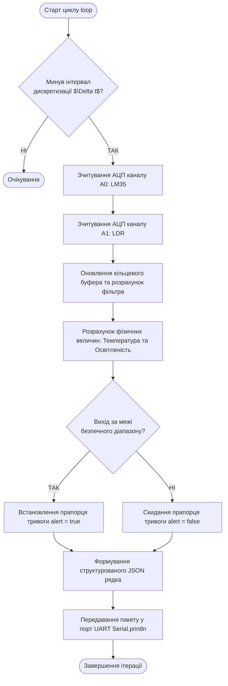
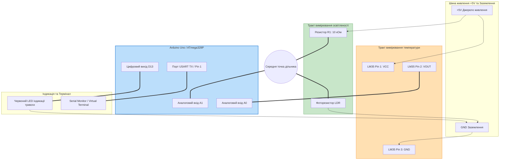

# Лабораторна робота № 4. Схемотехнічне моделювання та розробка прошивки вузла збору сенсорних даних на базі мікроконтролера ATmega328P у середовищі SimulIDE

**Мета:** Дослідити фізичні принципи функціонування та методи схемотехнічного сполучення аналогових і параметричних сенсорів із мікроконтролерами архітектури AVR, опанувати роботу в середовищі моделювання електронних схем SimulIDE, розробити алгоритми та прикладне програмне забезпечення (firmware) мовою C++ в Arduino IDE для аналого-цифрового перетворення, калібрування і цифрової фільтрації сигналів із подальшим формуванням серіалізованих JSON-пакетів даних для передавання через послідовний інтерфейс UART у стек протоколів верхнього рівня.

**Стек технологій та інструменти:**
* **Мова програмування / Середовище:** Мова програмування C++ (діалект Wiring / AVR-GCC), інтегроване середовище розробки Arduino IDE 2.x, середовище схемотехнічної симуляції SimulIDE (версія 1.0.0 або вище).
* **Платформа / Бібліотеки / Модулі:** Мікроконтролерна платформа ATmega328P (плати Arduino Uno / Nano), модуль 10-бітного послідовного наближення АЦП (SAR ADC), апаратний модуль USART.
* **Інструменти розробки:** Схемотехнічний редактор компонентів SimulIDE, вбудований монітор послідовного порту (Serial Monitor), утиліта компіляції `avr-gcc` та генератор бінарних прошивок `avr-objcopy`.

---

## 1 Теоретичні відомості

У багаторівневих системах Інтернету речей первинною ланкою формування інформаційних потоків є сенсорний вузол граничного рівня (Edge Node). Сенсорні пристрої взаємодіють із фізичним світом і перетворюють неелектричні величини (температуру, освітленість, тиск, механічні деформації) в електричні параметри: напругу, струм, опір або електричну ємність. Для введення цих параметрів у цифровий обчислювальний тракт мікроконтролера використовуються вимірювальні перетворювачі та аналого-цифровий перетворювач (АЦП).

Аналого-цифровий перетворювач мікроконтролера ATmega328P базується на архітектурі послідовного наближення (Successive Approximation Register, SAR) і має розрядність $N = 10\text{ біт}$. Процес квантування полягає у порівнянні вхідної неперервної напруги $V_{\text{in}}$ з опорною напругою $V_{\text{ref}}$, внаслідок чого на виході формується беззнаковий цілочисельний код $D_{\text{ADC}}$ у діапазоні від $0$ до $1023$:

$$D_{\text{ADC}} = \left\lfloor \frac{V_{\text{in}}}{V_{\text{ref}}} \cdot (2^N - 1) \right\rfloor = \left\lfloor \frac{V_{\text{in}}}{V_{\text{ref}}} \cdot 1023 \right\rfloor$$

де $D_{\text{ADC}}$ — дискретний цифровий код на виході регістра АЦП (безрозмірна величина від $0$ до $1023$);
$V_{\text{in}}$ — миттєве значення аналогової напруги на вимірювальному піні мікроконтролера (В);
$V_{\text{ref}}$ — опорна напруга АЦП (за замовчуванням напруга живлення $5{,}0\text{ В}$ або внутрішнє джерело $1{,}1\text{ В}$);
$N$ — розрядність аналого-цифрового перетворювача ($N = 10$).

Для відновлення фізичного значення вхідної напруги за отриманим цифровим кодом у прошивці мікроконтролера виконується зворотне математичне перетворення:

$$V_{\text{in}} = D_{\text{ADC}} \cdot \frac{V_{\text{ref}}}{1023}$$

де $V_{\text{in}}$ — обчислена напруга на вході АЦП (В);
$D_{\text{ADC}}$ — зчитане значення з регістра перетворювача;
$V_{\text{ref}}$ — величина використаної опорної напруги (В).

```mermaid
graph LR
    subgraph Physical_Domain [Фізичне середовище]
        EnvTemp[Температура $T^\circ\text{C}$]
        EnvLight[Освітленість $E\text{ (lx)}$]
    end

    subgraph Sensor_Circuit [Схемотехнічний рівень: Сенсори]
        LM35[Напівпровідниковий сенсор LM35<br/>$S = 10\text{ мВ}/^\circ\text{C}$]
        LDR_Divider[Резистивний дільник LDR + $R_1$<br/>$V_{\text{div}} = V_{\text{cc}} \cdot \frac{R_1}{R_{\text{LDR}} + R_1}$]
    end

    subgraph MCU_Edge [Обчислювальний тракт: ATmega328P]
        ADC0[Канал АЦП A0]
        ADC1[Канал АЦП A1]
        Filter[Цифровий фільтр ковзного середнього<br/>$y[k] = \frac{1}{M}\sum x[k-i]$]
        Formatter[JSON Серіалізатор та UART Драйвер]
    end

    subgraph Output_Stream [Вихідний інтерфейс]
        UART[Послідовний порт UART / 9600 baud<br/>Вихід до IoT-шлюзу]
    end

    EnvTemp --> LM35
    EnvLight --> LDR_Divider
    LM35 ===|Напруга $V_{\text{temp}}$| ADC0
    LDR_Divider ===|Напруга $V_{\text{light}}$| ADC1

    ADC0 --> Filter
    ADC1 --> Filter
    Filter --> Formatter
    Formatter ===|TX Кадр JSON| UART

    style MCU_Edge fill:#e1f5fe,stroke:#0288d1,stroke-width:2px
    style Sensor_Circuit fill:#fff9c4,stroke:#fbc02d,stroke-width:1px
    style Output_Stream fill:#e8f5e9,stroke:#388e3c,stroke-width:1px
```
*Рисунок 1 — Тракт перетворення, фільтрації та серіалізації сигналів на рівні граничного мікроконтролера*

При роботі з параметричними резистивними датчиками (фоторезисторами LDR, терморезисторами NTC) зміна фізичної величини викликає зміну активного опору $R_{\text{sens}}$. Для вимірювання цієї зміни застосовують резистивний дільник напруги з постійним резистором $R_{\text{fixed}}$. Напруга у середній точці дільника описується виразом:

$$V_{\text{in}} = V_{\text{cc}} \cdot \frac{R_{\text{fixed}}}{R_{\text{sens}} + R_{\text{fixed}}}$$

де $V_{\text{cc}}$ — напруга живлення дільника (В);
$R_{\text{sens}}$ — змінний опір сенсорного елемента (Ом);
$R_{\text{fixed}}$ — прецизійний опорний опір дільника (Ом).

Розрахунок опору сенсора за виміряним цифровим значенням АЦП здійснюється за формулою:

$$R_{\text{sens}} = R_{\text{fixed}} \cdot \left( \frac{1023}{D_{\text{ADC}}} - 1 \right)$$

Для активних інтегральних напівпровідникових перетворювачів температури (наприклад, LM35) вихідна напруга прямо пропорційна температурі з постійним коефіцієнтом чутливості $S_{\text{sens}} = 10\text{ мВ}/^\circ\text{C} = 0{,}010\text{ В}/^\circ\text{C}$. Температура обчислюється як:

$$T = \frac{V_{\text{in}}}{S_{\text{sens}}} = \frac{D_{\text{ADC}} \cdot V_{\text{ref}}}{1023 \cdot 0{,}010}$$

Для усунення високочастотних перешкод, наведених на лінії зв'язку від силових мереж, мікроконтролер виконує цифрову фільтрацію методом ковзного середнього (Moving Average Filter). Математичний опис фільтра з вікном згладжування $M$ має вигляд:

$$y[k] = \frac{1}{M} \sum_{i=0}^{M-1} x[k-i]$$

де $y[k]$ — згладжене значення сигналу на поточному $k$-му кроці вимірювання;
$x[k-i]$ — попередні сирі відліки з АЦП;
$M$ — розмір вікна усереднення (кількість збережених відліків).


*Рисунок 2 — Блок-схема алгоритму періодичного опитування, обробки та серіалізації даних*

---

## 2 Підготовка середовища та розгортання проєкту (Крок 0)

Для виконання лабораторної роботи необхідно встановити та налаштувати програмне забезпечення для схемотехнічного моделювання SimulIDE та середовище розробки Arduino IDE.

1. Запустіть емулятор термінала операційної системи та перевірте наявність інстальованого компілятора `avr-gcc`, необхідного для збірки бінарних файлів прошивки (`.hex`):

```bash
# Перевірка наявності компілятора avr-gcc у системі
avr-gcc --version

# Перевірка наявності утиліти для створення бінарних образів пам'яті
avr-objcopy --version
```

2. Створіть робочу структуру папок проєкту для збереження електричних схем, вихідного коду прошивки та скомпільованих бінарних файлів:

```bash
# Створення робочих каталогів лабораторної роботи
mkdir -p ~/IoT_Labs/Lab4_SimulIDE/{circuits,firmware,build,docs}
cd ~/IoT_Labs/Lab4_SimulIDE
```

Структура файлів розробленого проєкту повинна відповідати такій ієрархії:

```text
IoT_Labs/
└── Lab4_SimulIDE/
    ├── circuits/
    │   └── Sensor_Node_ATmega328.sim1  # Схемотехнічна модель пристрою в SimulIDE
    ├── firmware/
    │   └── firmware.ino                # Вихідний код програми мовою C++ для Arduino IDE
    ├── build/
    │   └── firmware.ino.hex            # Скомпільований бінарний файл машинного коду
    └── docs/
        └── test_log.csv                # Логи виведення послідовного порту
```

3. Запустіть середовище **SimulIDE**. Ознайомтеся з розташуванням панелі компонентів зліва:
   * Розділ **Micro** $\to$ **Avr** (мікроконтролер `ATmega328` або готова плата `Arduino Uno`);
   * Розділ **Sensors** (датчик температури `LM35`, фоторезистор `LDR`, потенціометри);
   * Розділ **Passive** (резистори `Resistor`, конденсатори `Capacitor`, земля `GND`, джерело `Vcc`);
   * Розділ **Meters** та **Outputs** (вольтметр `Voltmeter`, світлодіод `Led`, модуль `Serial Port`).

---

## 3 Порядок виконання роботи

### 3.1 Індивідуальні завдання

Кожен здобувач вищої освіти розробляє принципову схему, виконує схемотехнічне з'єднання компонентів та пише програму обробки згідно зі своїм індивідуальним варіантом.

| Варіант | Назва пристрою / Тип сенсорів | Схемотехнічні параметри сенсорів | Опорна напруга $V_{\text{ref}}$ та порти | Формат вихідного пакету UART |
| :---: | :--- | :--- | :--- | :--- |
| **1** | Монітор температури сушильної шафи | Сенсор LM35 (діапазон $0 \dots 100^\circ\text{C}$), Датчик задимленості | $V_{\text{ref}} = 5{,}0\text{ В}$, Порти: `A0` (LM35), `A1` (Smoke) | `{"dev": "dryer", "temp": 45.2, "smoke": 12}` |
| **2** | Кліматичний вузол теплиці | NTC термістор ($R_{25} = 10\text{ кОм}$, $R_{\text{fixed}} = 10\text{ кОм}$), LDR фоторезистор | $V_{\text{ref}} = 5{,}0\text{ В}$, Порти: `A0` (NTC), `A1` (LDR) | `{"greenhouse": 1, "t_ntc": 22.4, "lux": 450}` |
| **3** | Смарт-індикатор освітлення кімнати | Фоторезистор LDR ($R_{\text{fixed}} = 4{,}7\text{ кОм}$), Потенціометр порогу | $V_{\text{ref}} = 5{,}0\text{ В}$, Порти: `A0` (LDR), `A2` (Pot) | `{"light_lvl": 78.5, "setpoint": 50.0}` |
| **4** | Аналізатор перегріву трансформатора | Сенсор TMP36 ($S = 10\text{ мВ}/^\circ\text{C}$, зсув $500\text{ мВ}$), Сенсор струму | $V_{\text{ref}} = 5{,}0\text{ В}$, Порти: `A0` (TMP36), `A3` (Current) | `{"trans_id": 4, "temp": 68.1, "amps": 14.2}` |
| **5** | Контролер рівня води в баку | Резистивний датчик рівня ($0 \dots 5\text{ кОм}$), Сенсор тиску | $V_{\text{ref}} = 5{,}0\text{ В}$, Порти: `A0` (Level), `A1` (Pressure) | `{"tank": "main", "lvl_cm": 140, "bar": 2.1}` |
| **6** | Вузол контролю вібрації двигуна | П'єзоелектричний перетворювач, Термопара з підсилювачем | $V_{\text{ref}} = 1{,}1\text{ В}$ (Internal), Порти: `A0`, `A1` | `{"motor": "M1", "vib_g": 0.45, "temp": 52.0}` |
| **7** | Смарт-сенсор заряду акумулятора | Дільник напруги батареї $1:4$ ($R_1 = 30\text{ кОм}$, $R_2 = 10\text{ кОм}$), Термістор | $V_{\text{ref}} = 5{,}0\text{ В}$, Порти: `A0` (Volt), `A1` (Temp) | `{"batt_v": 12.6, "t_cell": 28.3, "soc": 95}` |
| **8** | Метеостанція: тиск та освітленість | Потенціометричний манометр, LDR фоторезистор ($10\text{ кОм}$) | $V_{\text{ref}} = 5{,}0\text{ В}$, Порти: `A0` (Press), `A2` (LDR) | `{"meteo": {"p_kpa": 101.3, "sun_pct": 84}}` |
| **9** | Охоронний вузол периметра | Оптичний бар'єр (фотодіод), Датчик вібрації огорожі | $V_{\text{ref}} = 5{,}0\text{ В}$, Порти: `A0` (Beam), `A1` (Vib) | `{"zone": "north", "beam": 1020, "vib": 4}` |
| **10** | Лабораторний pH-метр з термокомпенсацією | Аналоговий емулятор pH-електрода ($0 \dots 1\text{ В}$), Сенсор LM35 | $V_{\text{ref}} = 1{,}1\text{ В}$ (Internal), Порти: `A0` (pH), `A1` (T) | `{"ph_val": 7.35, "t_comp": 25.0}` |
| **11** | Контролер вентиляції та витоку CO | Емулятор газового сенсора MQ-7, Датчик температури LM35 | $V_{\text{ref}} = 5{,}0\text{ В}$, Порти: `A0` (Gas), `A1` (LM35) | `{"co_ppm": 35, "temp": 21.8, "fan": "OFF"}` |
| **12** | Детектор вологості деревини | Двоелектродний опір матеріалу ($100\text{ кОм} \dots 1\text{ МОм}$), Сенсор LM35 | $V_{\text{ref}} = 5{,}0\text{ В}$, Порти: `A0` (Moist), `A1` (Temp) | `{"wood_moist": 14.5, "t_amb": 19.4}` |
| **13** | Монітор кута нахилу сонячної панелі | Потенціометр зворотного зв'язку сервоприводу, Фоторезистор | $V_{\text{ref}} = 5{,}0\text{ В}$, Порти: `A0` (Angle), `A1` (Light) | `{"panel_deg": 45.0, "lux_raw": 890}` |
| **14** | Смарт-дозатор сипучих матеріалів | Тензометричний міст із підсилювачем ($0 \dots 2{,}5\text{ В}$), Оптичний датчик | $V_{\text{ref}} = 5{,}0\text{ В}$, Порти: `A0` (Weight), `A1` (Opto) | `{"mass_g": 350.5, "hopper": "FEEDING"}` |
| **15** | Система контролю температури холодильника | Сенсор LM35, Сенсор відкриття дверей (резистивний шлейф) | $V_{\text{ref}} = 5{,}0\text{ В}$, Порти: `A0` (LM35), `A1` (Loop) | `{"fridge_t": -18.2, "door_stat": "CLOSED"}` |
| **16** | Детектор перегріву силового кабелю | Два симетричні датчики LM35 на різних кінцях лінії | $V_{\text{ref}} = 5{,}0\text{ В}$, Порти: `A0` (T1), `A1` (T2) | `{"cable_t1": 34.1, "cable_t2": 39.5, "dt": 5.4}` |
| **17** | Сенсорний вузол перевірки мастила | Сенсор оптичної прозорості (LDR), Терморезистор NTC | $V_{\text{ref}} = 5{,}0\text{ В}$, Порти: `A0` (Optic), `A1` (NTC) | `{"oil_transparency": 65.0, "oil_t": 75.2}` |
| **18** | Контролер сонячного колектора | Сенсор температури бака (LM35), Сенсор температури трубок (LM35) | $V_{\text{ref}} = 5{,}0\text{ В}$, Порти: `A0` (T_tank), `A1` (T_pipe) | `{"t_tank": 55.4, "t_pipe": 72.1, "pump": 1}` |
| **19** | Вузол контролю тиску гідравліки | Сенсор тиску гідросистеми ($0 \dots 5\text{ В}$), Сенсор рівня рідини | $V_{\text{ref}} = 5{,}0\text{ В}$, Порти: `A0` (Press), `A1` (Lvl) | `{"hydro_p_bar": 120.5, "tank_pct": 82}` |
| **20** | Смарт-станція контролю ґрунту | Резистивний датчик вологості ґрунту, Фоторезистор фону | $V_{\text{ref}} = 5{,}0\text{ В}$, Порти: `A0` (Soil), `A1` (LDR) | `{"soil_raw": 420, "soil_pct": 58.9, "sun": 600}` |

---

### 3.2 Покроковий алгоритм та розв'язок еталонного прикладу

У ролі еталонного прикладу розглядається **«Двоканальний вимірювальний вузол моніторингу мікроклімату на базі аналогового термодатчика LM35 та фоторезистивного дільника LDR із цифровою фільтрацією та формуванням JSON-повідомлень»**.

Параметри еталонної конфігурації:
* Мікроконтролер: `ATmega328P` (тактова частота $16\text{ МГц}$, опорна напруга $V_{\text{ref}} = 5{,}0\text{ В}$).
* Канал 1 (`A0`): Датчик температури `LM35` із коефіцієнтом передачі $10\text{ мВ}/^\circ\text{C}$.
* Канал 2 (`A1`): Фоторезистор `LDR` увімкнений у дільник із постійним резистором $R_1 = 10\text{ кОм}$, підтягнутим до шини $+5\text{ В}$.
* Індикатор аварії (`D13`): Світлодіод тривоги перевищення температури $T > 30{,}0^\circ\text{C}$.
* Інтерфейс передавання даних: `UART` (швидкість $9600\text{ біт/с}$, формат 8N1).
* Період дискретизації та відправки телеметрії: $T_s = 500\text{ мс}$.

#### Крок 1. Створення схемотехнічної моделі у середовищі SimulIDE

1. Відкрийте SimulIDE та створіть нову порожню схему.
2. Перетягніть із бібліотеки компонентів на робоче поле:
   * Плату **Arduino Uno** (або окремий мікроконтролер `ATmega328`);
   * Аналоговий датчик температури **LM35**;
   * Фоторезистор **LDR**;
   * Постійний резистор **Resistor** номіналом $10\text{ кОм}$;
   * Компонент **Serial Port** (або утиліту `Serial Monitor`);
   * Джерело живлення **Vcc** ($+5\text{ В}$) та два компоненти заземлення **GND**;
   * Світлодіод **Led** червоного кольору та струмообмежувальний резистор $220\text{ Ом}$.


*Рисунок 3 — Схема принципова електрична підключення сенсорів LM35 та LDR до Arduino Uno*

3. Здійсніть з'єднання виводів компонентів відповідно до рисунка 3:
   * З'єднайте вивід `Pin 1 (+Vs)` сенсора LM35 з шиною `+5V`, вивід `Pin 3 (GND)` — із шиною `GND`, а середній вивід `Pin 2 (Vout)` підключіть до аналогового входу `A0` плати Arduino Uno.
   * Підключіть один вивід резистора $R_1 = 10\text{ кОм}$ до шини `+5V`, другий вивід резистора з'єднайте з першим виводом фоторезистора `LDR`, утворивши вимірювальний вузол. Цю середню точку підключіть до аналогового входу `A1` плати Arduino Uno. Другий вивід фоторезистора `LDR` підключіть до шини `GND`.
   * Підключіть анод світлодіода `Led` через резистор $220\text{ Ом}$ до цифрового виходу `D13`, а катод — до шини `GND`.
4. Збережіть розроблену схему у файл `~/IoT_Labs/Lab4_SimulIDE/circuits/Sensor_Node_ATmega328.sim1`.

#### Крок 2. Розробка прикладного програмного забезпечення (Firmware)

1. Відкрийте середовище **Arduino IDE**.
2. Створіть новий скетч та збережіть його як `firmware.ino` у папці `~/IoT_Labs/Lab4_SimulIDE/firmware/`.
3. Введіть повний робочий код програми з модулями фільтрації та серіалізації:

```cpp
#include <Arduino.h>

// =====================================================================
// КОНФІГУРАЦІЯ АПАРАТНИХ ПІНІВ ТА ВИМІРЮВАЛЬНИХ ПАРАМЕТРІВ
// =====================================================================
const uint8_t PIN_TEMP_SENSOR = A0;   // Аналоговий вхід для термодатчика LM35
const uint8_t PIN_LIGHT_SENSOR = A1;  // Аналоговий вхід для дільника фоторезистора LDR
const uint8_t PIN_ALERT_LED = 13;     // Цифровий вихід для світлодіода аварійної індикації

const float V_REF = 5.000;            // Точне опорне значення напруги АЦП (Вольти)
const float ADC_STEPS = 1023.0;       // Максимальна кількість квантів 10-бітного АЦП
const float LM35_SCALE = 0.010;       // Коефіцієнт передачі LM35: 10 мВ на градус Цельсія (В/C)
const float FIXED_RESISTOR_OHMS = 10000.0; // Опір опорного резистора дільника (10 кОм)

const float TEMP_ALERT_THRESHOLD = 30.0; // Критичний поріг температури для тривоги (град. C)
const unsigned long SAMPLING_PERIOD_MS = 500; // Періодичність вимірювання та відправки (мс)

const uint8_t FILTER_WINDOW_SIZE = 8; // Розмір вікна усереднення для цифрового фільтра

// Буфери для збереження історії відліків цифрового фільтра
int temp_raw_buffer[FILTER_WINDOW_SIZE];
int light_raw_buffer[FILTER_WINDOW_SIZE];
uint8_t buffer_index = 0;
bool buffer_filled = false;

// Таймер для неблокуючого виконання циклу
unsigned long last_sample_time = 0;
unsigned long packet_sequence_id = 0;

// =====================================================================
// ДОПОМІЖНІ ФУНКЦІЇ ЦИФРОВОЇ ОБРОБКИ СИГНАЛУ
// =====================================================================

/**
 * Ініціалізація кільцевих буферів нульовими значеннями.
 */
void initFilters() {
    for (uint8_t i = 0; i < FILTER_WINDOW_SIZE; i++) {
        temp_raw_buffer[i] = 0;
        light_raw_buffer[i] = 0;
    }
}

/**
 * Функція оновлення буфера та обчислення ковзного середнього (Moving Average).
 * @param new_sample Новий відлік з АЦП.
 * @param buffer Масив кільцевого буфера.
 * @return Згладжене значення відліку АЦП.
 */
float applyMovingAverage(int new_sample, int* buffer) {
    buffer[buffer_index] = new_sample;
    
    uint8_t count = buffer_filled ? FILTER_WINDOW_SIZE : (buffer_index + 1);
    long sum = 0;
    
    for (uint8_t i = 0; i < count; i++) {
        sum += buffer[i];
    }
    
    return (float)sum / (float)count;
}

/**
 * Перетворення відфільтрованого значення коду АЦП у напругу.
 */
float convertAdcToVoltage(float adc_value) {
    return (adc_value * V_REF) / ADC_STEPS;
}

/**
 * Обчислення температури в градусах Цельсія для датчика LM35.
 */
float calculateTemperatureC(float voltage) {
    return voltage / LM35_SCALE;
}

/**
 * Обчислення відносного рівня освітленості у відсотках (0..100%).
 */
float calculateLightPercentage(float voltage) {
    // Чим вища освітленість, тим менший опір LDR і нижча напруга на A1
    float percentage = ((V_REF - voltage) / V_REF) * 100.0;
    if (percentage < 0.0) percentage = 0.0;
    if (percentage > 100.0) percentage = 100.0;
    return percentage;
}

// =====================================================================
// ОСНОВНІ СИСТЕМНІ ФУНКЦІЇ ARDUINO
// =====================================================================

void setup() {
    // Налаштування цифрових та аналогових виводів
    pinMode(PIN_ALERT_LED, OUTPUT);
    pinMode(PIN_TEMP_SENSOR, INPUT);
    pinMode(PIN_LIGHT_SENSOR, INPUT);
    
    digitalWrite(PIN_ALERT_LED, LOW);
    
    // Ініціалізація апаратного послідовного порту UART
    Serial.begin(9600);
    while (!Serial) {
        ; // Очікування готовності послідовного інтерфейсу
    }
    
    initFilters();
    
    Serial.println(F("{\"system\": \"ATmega328P Sensor Node\", \"status\": \"BOOT_OK\"}"));
}

void loop() {
    unsigned long current_time = millis();
    
    // Перевірка настання інтервалу дискретизації (неблокуюча затримка)
    if (current_time - last_sample_time >= SAMPLING_PERIOD_MS) {
        last_sample_time = current_time;
        packet_sequence_id++;
        
        // 1. Апаратне зчитування аналогових каналів
        int raw_temp_adc = analogRead(PIN_TEMP_SENSOR);
        int raw_light_adc = analogRead(PIN_LIGHT_SENSOR);
        
        // 2. Цифрова фільтрація сигналів
        float filtered_temp_adc = applyMovingAverage(raw_temp_adc, temp_raw_buffer);
        float filtered_light_adc = applyMovingAverage(raw_light_adc, light_raw_buffer);
        
        // Оновлення покажчика кільцевого буфера
        buffer_index++;
        if (buffer_index >= FILTER_WINDOW_SIZE) {
            buffer_index = 0;
            buffer_filled = true;
        }
        
        // 3. Обчислення напруги та фізичних величин
        float v_temp = convertAdcToVoltage(filtered_temp_adc);
        float v_light = convertAdcToVoltage(filtered_light_adc);
        
        float temperature_c = calculateTemperatureC(v_temp);
        float light_percent = calculateLightPercentage(v_light);
        
        // 4. Логіка виявлення аварійного стану
        bool is_alert = false;
        if (temperature_c >= TEMP_ALERT_THRESHOLD) {
            digitalWrite(PIN_ALERT_LED, HIGH);
            is_alert = true;
        } else {
            digitalWrite(PIN_ALERT_LED, LOW);
            is_alert = false;
        }
        
        // 5. Формування та передавання структурованого JSON-пакету у UART
        Serial.print(F("{\"seq\":"));
        Serial.print(packet_sequence_id);
        Serial.print(F(",\"temp_raw\":"));
        Serial.print(raw_temp_adc);
        Serial.print(F(",\"temp_c\":"));
        Serial.print(temperature_c, 2);
        Serial.print(F(",\"light_pct\":"));
        Serial.print(light_percent, 1);
        Serial.print(F(",\"v_in\":"));
        Serial.print(v_temp, 3);
        Serial.print(F(",\"alert\":"));
        Serial.print(is_alert ? F("true") : F("false"));
        Serial.println(F("}"));
    }
}
```

#### Крок 3. Компіляція та завантаження прошивки в SimulIDE

1. В Arduino IDE оберіть плату: меню **Tools** $\to$ **Board** $\to$ **Arduino AVR Boards** $\to$ **Arduino Uno**.
2. У меню **Sketch** оберіть пункт **Export Compiled Binary** (або натисніть комбінацію клавіш `Ctrl + Alt + S`).
3. Перевірте наявність згенерованого файлу `firmware.ino.hex` у каталозі збірки.
4. Перейдіть у вікно **SimulIDE** до раніше створеної схеми:
   * Натисніть правою кнопкою миші на мікроконтролер `Arduino Uno` або `ATmega328`;
   * У контекстному меню оберіть пункт **Load firmware**;
   * У діалоговому вікні файлової системи вкажіть шлях до файлу `firmware.ino.hex` та натисніть кнопку **Open**.
5. Натисніть правою кнопкою миші на компонент `Arduino Uno` і виберіть пункт **Open Serial Monitor**. У нижній частині вікна відкриється термінал послідовного порту. Встановіть швидкість обміну **Baudrate**: `9600`.

---

### 3.3 Запуск, тестування та перевірка результатів

1. Запустіть процес симуляції в SimulIDE, натиснувши кнопку з піктограмою червоного перемикача живлення **Power Circuit** на верхній панелі керування.
2. Проведіть тестові випробування фізичного тракту перетворення:
   * Змініть повзунок температури на датчику `LM35` від початкового значення $20^\circ\text{C}$ до значення $35^\circ\text{C}$;
   * Змініть рівень опору фоторезистора `LDR`, імітуючи зміну освітленості приміщення;
   * Переконайтеся, що при перевищенні температури $30{,}0^\circ\text{C}$ світлодіод на піні `D13` переходить у активний стан, а поле `"alert"` у вихідному JSON-пакеті приймає значення `true`.

#### Еталонний вивід даних у вікні Serial Monitor середовища SimulIDE:

```json
{"system": "ATmega328P Sensor Node", "status": "BOOT_OK"}
{"seq":1,"temp_raw":45,"temp_c":22.00,"light_pct":51.2,"v_in":0.220,"alert":false}
{"seq":2,"temp_raw":46,"temp_c":22.25,"light_pct":51.2,"v_in":0.223,"alert":false}
{"seq":3,"temp_raw":48,"temp_c":22.75,"light_pct":52.0,"v_in":0.228,"alert":false}
{"seq":4,"temp_raw":55,"temp_c":24.50,"light_pct":54.3,"v_in":0.245,"alert":false}
{"seq":5,"temp_raw":61,"temp_c":26.80,"light_pct":55.1,"v_in":0.268,"alert":false}
{"seq":6,"temp_raw":66,"temp_c":29.50,"light_pct":55.0,"v_in":0.295,"alert":false}
{"seq":7,"temp_raw":68,"temp_c":31.20,"light_pct":55.4,"v_in":0.312,"alert":true}
{"seq":8,"temp_raw":72,"temp_c":33.40,"light_pct":55.2,"v_in":0.334,"alert":true}
{"seq":9,"temp_raw":70,"temp_c":34.80,"light_pct":55.2,"v_in":0.348,"alert":true}
{"seq":10,"temp_raw":50,"temp_c":28.10,"light_pct":55.0,"v_in":0.281,"alert":false}
```

---

## 4 Вимоги до змісту звіту

Звіт оформлюється українською мовою згідно з вимогами стандарту ДСТУ 3008:2015 і повинен містити такі обов'язкові компоненти:

1. **Титульна сторінка** із зазначенням повної назви Міністерства, закладу вищої освіти, кафедри, назви навчальної дисципліни, номера й теми лабораторної роботи, номера індивідуального варіанта, прізвища та ініціалів здобувача й викладача.
2. **Мета роботи** та стислий теоретичний вступ із розкриттям методів аналого-цифрового перетворення сигналів у мікроконтролерах.
3. **Постановка індивідуального завдання** відповідно до закріпленого варіанта, що включає перелік датчиків, формули перерахунку та структуру JSON-пакета.
4. **Скріншот принципової електричної схеми**, розробленої в середовищі SimulIDE, із позначенням позиційних номерів усіх компонентів, номіналів резисторів та точок підключення вимірювальних приладів.
5. **Розрахункова частина**, яка містить теоретичний розрахунок напруги дільника та значень кодів АЦП для трьох контрольних точок діапазону вимірювання сенсора вашого варіанта за формулами розділу 1.
6. **Повний текст вихідного коду прошивки** мовою C++ з докладними коментарями до кожного функціонального блоку (налаштування регістрів/пінів, алгоритм фільтрації, формування виводу).
7. **Результати тестування:** скріншоти вікна симулятора SimulIDE у робочому та аварійному станах схеми, а також таблиця або лістинг отриманих повідомлень монітора послідовного порту.
8. **Аналітичні висновки**, у яких оцінено точність вимірювального тракту, проаналізовано вплив розміру вікна фільтра ковзного середнього на плавність відгуку та сформульовано переваги використання формату JSON для інтеграції мікроконтролера з протоколами верхнього рівня (MQTT/HTTP).

---

## 5 Контрольні запитання для захисту роботи

1. **Який фізичний принцип покладено в основу функціонування АЦП послідовного наближення (SAR ADC) мікроконтролера ATmega328P?** Поясніть, як величина та стабільність опорної напруги $V_{\text{ref}}$ впливають на похибку визначення вхідної напруги.
2. **Чому для підключення резистивних сенсорів (терморезисторів NTC, фоторезисторів LDR) обов'язково використовується схема дільника напруги або вимірювального моста?** Яким чином обирається номінал постійного резистора $R_{\text{fixed}}$ для забезпечення максимальної чутливості схеми?
3. **У чому полягає відмінність між використанням вбудованої опорної напруги `INTERNAL` ($1{,}1\text{ В}$) та зовнішньої напруги живлення `DEFAULT` ($5{,}0\text{ В}$)?** У яких випадках доцільно перемикати опорне джерело на $1{,}1\text{ В}$ при роботі з датчиком LM35?
4. **Поясніть математичну суть та алгоритмічну реалізацію цифрового фільтра ковзного середнього (Moving Average Filter).** Як зміна розміру вікна $M$ впливає на динамічну похибку та фазове запізнення вимірюваного сигналу?
5. **Чому організація опитування датчиків у функції `loop()` за допомогою системного таймера `millis()` є більш ефективною, ніж використання функції затримки `delay()`?** Як це впливає на швидкодію мікроконтролера в системах реального часу?
6. **Які переваги надає структурування телеметричних даних у формат JSON під час їх передавання через послідовний інтерфейс UART на IoT-шлюз або MQTT-клієнт?**