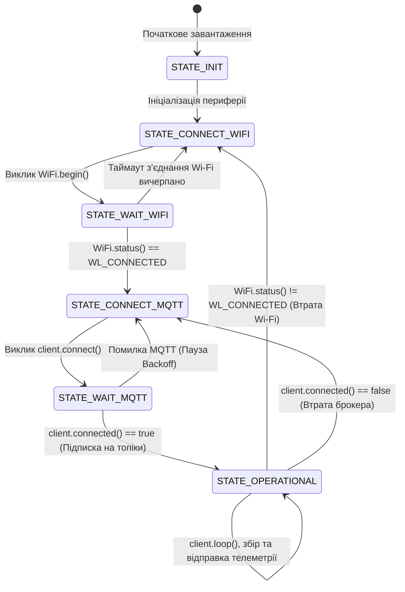

# Лабораторна робота № 5. Розробка вбудованого програмного забезпечення мікроконтролера ESP32 для бездротового передавання телеметрії за протоколом MQTT

**Мета:** Дослідити архітектуру системи на кристалі ESP32, опанувати методи керування вбудованим радіомодулем Wi-Fi у режимі клієнтської станції (Station Mode), вивчити принципи реалізації клієнтської частини протоколу MQTT за допомогою бібліотеки `PubSubClient`, розробити алгоритми відмовостійкого автоматичного відновлення мережевих з'єднань (Reconnection Logic) без блокування основного обчислювального циклу та створити повнофункціональну прошивку для публікації серіалізованих JSON-пакетів телеметрії і дистанційного керування актуаторами.

**Стек технологій та інструменти:**
* **Мова програмування / Середовище:** Мова програмування C++ (фреймворк Arduino Core for ESP32 / ESP-IDF), інтегроване середовище розробки Arduino IDE 2.x або Visual Studio Code з розширенням PlatformIO, онлайн-симулятор вбудованих систем Wokwi.
* **Платформа / Бібліотеки / Модулі:** Двоядерний мікроконтролер ESP32 (NodeMCU-32S / ESP32-WROOM-32), бібліотека зв'язку `WiFi.h`, клієнтська бібліотека протоколу MQTT `PubSubClient` (версія 2.8 або вище), бібліотека серіалізації даних `ArduinoJson` (версія 6.21+ або 7.x), локальний або хмарний брокер Eclipse Mosquitto.
* **Інструменти розробки:** Монітор послідовного порту (Serial Monitor, швидкість $115200\text{ біт/с}$), консольні мережеві утиліти `mosquitto_sub` та `mosquitto_pub`, графічний клієнт тестування MQTT Explorer.

---

## 1 Теоретичні відомості

Мікроконтролерна платформа ESP32 є високоефективною системою на кристалі (System-on-a-Chip, SoC), розробленою компанією Espressif Systems для застосування у вузлах Інтернету речей. Чип містить два 32-розрядні процесорні ядра Xtensa LX6 із регульованою тактовою частотою до $240\text{ МГц}$, оперативну пам'ять SRAM обсягом $520\text{ КБ}$, вбудовану енергонезалежну пам'ять Flash обсягом $4\text{ МБ}$ або більше, а також інтегровані радіочастотні трансівери стандартів Wi-Fi IEEE 802.11 b/g/n ($2{,}4\text{ ГГц}$) та Bluetooth v4.2 BR/EDR/BLE.

Для інтеграції пристрою в локальну комп'ютерну мережу модуль Wi-Fi конфігурується в режимі станції (Station Mode, `WIFI_STA`), у якому він виконує сканування радіоефіру, процедуру автентифікації за протоколом WPA2-PSK та запит мережевих параметрів (IP-адреси, маски, шлюзу за замовчуванням та DNS-сервера) у вбудованого в точку доступу сервера DHCP.

```mermaid
graph TD
    subgraph Physical_Hardware [Апаратний рівень: ESP32 SoC]
        ADC_Sens[Аналоговий датчик LDR<br/>Вхідний пін GPIO34 / ADC1_CH6]
        Act_Relay[Реле / Світлодіод<br/>Вихідний пін GPIO2]
        WiFi_Module[Радіотрансівер Wi-Fi 802.11 b/g/n<br/>Режим Station / TCP-стек]
    end

    subgraph Firmware_Runtime [Обчислювальний тракт прошивки]
        NonBlockingTimer[Таймери millis<br/>Дискретизація 1000 мс]
        JSON_Parser[Парсер та серіалізатор ArduinoJson]
        MQTT_Client[Клієнт PubSubClient<br/>Керування сесією, буферизація]
    end

    subgraph Network_Level [Мережевий рівень]
        AP[Wi-Fi Точка доступу / Шлюз<br/>SSID: Wokwi-GUEST / HomeNet]
        Broker[MQTT Брокер Eclipse Mosquitto<br/>Порт 1883]
    end

    subgraph Control_Terminal [Рівень моніторингу та керування]
        Dashboard[Керуюча панель MQTT Explorer / Node-RED<br/>Підписка: lab5/esp32/telemetry<br/>Публікація: lab5/esp32/relay/set]
    end

    ADC_Sens ===|Напруга АЦП $0\dots 3{,}3\text{ В}$| NonBlockingTimer
    NonBlockingTimer --> JSON_Parser
    JSON_Parser --> MQTT_Client
    MQTT_Client ===|TCP Socket| WiFi_Module
    WiFi_Module -.->|Радіоканал $2{,}4\text{ ГГц}$| AP
    AP ===|Ethernet / IP| Broker

    Broker -->|Forward Telemetry| Dashboard
    Dashboard -->|Command Payload| Broker
    Broker -->|Command Payload| MQTT_Client
    MQTT_Client -->|Callback Logic| Act_Relay

    style Physical_Hardware fill:#fff3e0,stroke:#e65100,stroke-width:2px
    style Firmware_Runtime fill:#e1f5fe,stroke:#0288d1,stroke-width:2px
    style Network_Level fill:#f3e5f5,stroke:#7b1fa2,stroke-width:2px
    style Control_Terminal fill:#e8f5e9,stroke:#2e7d32,stroke-width:2px
```
*Рисунок 1 — Архітектура інформаційних потоків та апаратного сполучення ESP32 з MQTT-брокером*

Архітектурний підхід, наведений на рисунку 1, демонструє повну незалежність процесів збору даних та їх мережевої передачі. Мікроконтролер виконує циклічне зчитування сенсора за допомогою системного таймера, формує текстовий пакет стандарту JSON і публікує його через клієнт `PubSubClient` на брокер. Зворотний канал керування забезпечується реєстрацією функції зворотного виклику (Callback Function), яка перехоплює вхідні команди від керуючих панелей і негайно змінює логічний рівень на цифровому виході GPIO.

Критичною проблемою вбудованих пристроїв є нестабільність бездротового зв'язку. Використання блокуючих викликів (наприклад, циклів `while (!client.connected()) delay(500);`) призводить до повної зупинки виконання основного циклу `loop()`, що унеможливлює своєчасне опитування локальних сенсорів та аварійне керування актуаторами під час обриву зв'язку. Тому для забезпечення надійності використовують автомат скінченних станів (State Machine) з неблокуючими перевірками на основі функції `millis()`.


*Рисунок 2 — Скінченний автомат неблокуючого керування станами мережевого підключення*

Для оптимізації частоти повторних підключень та запобігання перевантаженню брокера у разі масових аварій використовується алгоритм експоненційного відкладення повторних спроб (Exponential Backoff Algorithm) з додаванням випадкового часового зсуву (Jitter):

$$t_{\text{backoff}}(n) = \min\left(t_{\text{max}},\, t_{\text{base}} \cdot 2^n + \delta\right)$$

де $t_{\text{backoff}}(n)$ — розрахована тривалість паузи перед $n$-ю спробою підключення (с);
$t_{\text{base}}$ — базовий інтервал очікування (зазвичай $t_{\text{base}} = 1\dots 2\text{ с}$);
$n$ — лічильник поспіль зафіксованих невдалих спроб встановлення сесії;
$t_{\text{max}}$ — граничне максимальне значення періоду повторних запитів (наприклад, $60\text{ с}$);
$\delta$ — випадкова псевдовипадкова добавка (Jitter), що рівномірно розподілена на інтервалі $[0, \delta_{\text{max}}]$, яка дозволяє десинхронізувати одночасні запити від сотень вузлів мережі.

При проєктуванні автономних пристроїв на базі ESP32 виконується розрахунок середнього споживаного струму ($I_{\text{avg}}$) з урахуванням тривалості активної роботи Wi-Fi передавача та фази очікування:

$$I_{\text{avg}} = \frac{I_{\text{active}} \cdot t_{\text{sense}} + I_{\text{wifi}} \cdot t_{\text{tx}} + I_{\text{idle}} \cdot t_{\text{idle}}}{t_{\text{sense}} + t_{\text{tx}} + t_{\text{idle}}}$$

де $I_{\text{active}}$ — струм споживання обчислювальних ядер під час зчитування сенсорів (становить близько $30\dots 50\text{ мА}$);
$t_{\text{sense}}$ — тривалість фази аналого-цифрового перетворення та фільтрації (с);
$I_{\text{wifi}}$ — піковий струм модуля Wi-Fi під час роботи передавача на максимальній потужності (становить близько $160\dots 240\text{ мА}$);
$t_{\text{tx}}$ — час передавання TCP/MQTT пакету в ефір (с);
$I_{\text{idle}}$ — струм мікроконтролера в режимі очікування або легкого сну (Light Sleep, близько $0{,}8\dots 2\text{ мА}$);
$t_{\text{idle}}$ — інтервал між послідовними сеансами передавання телеметрії (с).

Загальна тривалість автономного функціонування вузла ($T_{\text{lifetime}}$) від літій-іонного хімічного джерела живлення номінальною ємністю $C_{\text{bat}}$ (мА·год) розраховується з урахуванням коефіцієнта корисної дії внутрішнього перетворювача напруги та деградації батареї:

$$T_{\text{lifetime}} = \frac{C_{\text{bat}} \cdot k_{\text{eff}}}{I_{\text{avg}} \cdot 24}$$

де $T_{\text{lifetime}}$ — прогнозований час роботи пристрою (діб);
$C_{\text{bat}}$ — номінальна електрична ємність акумулятора (мА·год);
$k_{\text{eff}}$ — коефіцієнт корисного використання ємності джерела з урахуванням саморозряду ($k_{\text{eff}} \approx 0{,}80\dots 0{,}85$);
$I_{\text{avg}}$ — середній струм споживання пристрою (мА).

---

## 2 Підготовка середовища та розгортання проєкту (Крок 0)

Для виконання лабораторної роботи здобувач може використовувати фізичну плату розробника ESP32 DevKit або хмарне середовище симуляції Wokwi.

1. Запустіть термінал операційної системи та створіть каталог для файлів проєкту:

```bash
# Створення робочих каталогів для вихідного коду, симуляції та звітних логів
mkdir -p ~/IoT_Labs/Lab5_ESP32_MQTT/{src,include,wokwi,docs}
cd ~/IoT_Labs/Lab5_ESP32_MQTT
```

2. Якщо розробка виконується в середовищі **Arduino IDE 2.x**:
   * Відкрийте меню **File** $\to$ **Preferences** і у поле **Additional Boards Manager URLs** додайте посилання:
     `https://raw.githubusercontent.com/espressif/arduino-esp32/gh-pages/package_esp32_index.json`
   * Відкрийте **Boards Manager** (комбінація клавіш `Ctrl + Shift + B`), знайдіть пакет **esp32** від *Espressif Systems* та виконайте встановлення версії 2.0.x або вище.
   * Відкрийте **Library Manager** (комбінація клавіш `Ctrl + Shift + I`), знайдіть і встановіть бібліотеки:
     1. **PubSubClient** (автор: *Nick O'Leary*);
     2. **ArduinoJson** (автор: *Benoit Blanchon*).

3. Якщо розробка виконується у середовищі **Visual Studio Code + PlatformIO**:
   * Створіть новий проєкт для плати `esp32dev` із фреймворком `arduino`.
   * Додайте залежності у конфігураційний файл `platformio.ini`:

```ini
[env:esp32dev]
platform = espressif32
board = esp32dev
framework = arduino
monitor_speed = 115200
lib_deps =
    knolleary/PubSubClient @ ^2.8
    bblanchon/ArduinoJson @ ^7.0.0
```

Структура файлів проєкту має відповідати такій ієрархії:

```text
Lab5_ESP32_MQTT/
├── src/
│   └── main.cpp              # Головний вихідний код прошивки ESP32
├── include/
│   └── config.h              # Заголовний файл мережевих констант та топіків
├── wokwi/
│   ├── diagram.json          # Схемотехнічна конфігурація симулятора Wokwi
│   └── wokwi.toml            # Файл прив'язки бінарних образів симуляції
└── docs/
    └── serial_output.log     # Журнал виведення консолі мікроконтролера
```

---

## 3 Порядок виконання роботи

### 3.1 Індивідуальні завдання

Кожен здобувач розробляє прошивку для мікроконтролера ESP32 відповідно до індивідуального завдання, наведеного в таблиці.

| Варіант | Назва пристрою / Призначення | Сенсорні параметри та порти | Актуатор та реакція на команду | Структура топіків (Pub / Sub) | Формат вихідного корисного навантаження (JSON) |
| :---: | :--- | :--- | :--- | :--- | :--- |
| **1** | Вузол контролю освітлення складу | Фоторезистор LDR (GPIO34) | Реле прожектора (GPIO2) | Pub: `wh/light/state`<br/>Sub: `wh/light/cmd` | `{"dev": "LDR_1", "raw": 2150, "lux": 420.5, "relay": 1}` |
| **2** | Монітор мікроклімату теплиці | Датчик вологості ґрунту (GPIO35) | Водяний клапан (GPIO4) | Pub: `agro/soil/telemetry`<br/>Sub: `agro/soil/valve` | `{"zone": "A1", "moist_raw": 1800, "pct": 45.2, "valve": 0}` |
| **3** | Детектор вібрації верстата | Аналоговий п'єзосенсор (GPIO32) | Сигнальний маяк (GPIO18) | Pub: `cnc/vib/data`<br/>Sub: `cnc/vib/alarm` | `{"machine": "CNC_4", "vib_amp": 0.82, "beacon": 1}` |
| **4** | Смарт-термостат приміщення | Терморезистор NTC (GPIO33) | Електричний ТЕН (GPIO5) | Pub: `hvac/temp/status`<br/>Sub: `hvac/temp/heater` | `{"sensor": "NTC_Room", "t_c": 21.8, "heater_state": "ON"}` |
| **5** | Контролер рівня рідини в резервуарі | Потенціометричний рівнемір (GPIO34) | Насос закачування (GPIO19) | Pub: `tank/lvl/report`<br/>Sub: `tank/lvl/pump` | `{"tank_id": 2, "lvl_pct": 78.4, "pump_run": true}` |
| **6** | Вузол безпеки серверної шафи | Датчик відкриття дверей (GPIO27) | Ригельний замок (GPIO2) | Pub: `dc/rack3/security`<br/>Sub: `dc/rack3/lock` | `{"rack": 3, "door_open": false, "lock_locked": true}` |
| **7** | Моніторинг тиску компресора | Сенсор тиску $0\dots 3{,}3\text{ В}$ (GPIO36) | Електроклапан скидання (GPIO21) | Pub: `plant/air/telemetry`<br/>Sub: `plant/air/purge` | `{"comp_num": 1, "p_bar": 6.85, "purge_valve": 0}` |
| **8** | Смарт-дозатор корму | Аналогова тензометрична балка (GPIO35) | Сервопривід шнека (GPIO22) | Pub: `farm/feeder/weight`<br/>Sub: `farm/feeder/dispense` | `{"feeder_id": 5, "weight_g": 350, "dispensing": false}` |
| **9** | Детектор якості повітря лабораторії | Аналоговий газовий сенсор (GPIO32) | Припливний вентилятор (GPIO23) | Pub: `lab/air/quality`<br/>Sub: `lab/air/fan` | `{"gas_ppm": 45, "air_clean": true, "fan_speed": 2}` |
| **10** | Вузол обліку заряду акумуляторів | Аналоговий дільник напруги (GPIO33) | Комутатор заряду (GPIO4) | Pub: `ups/cell1/telemetry`<br/>Sub: `ups/cell1/charge` | `{"v_cell": 3.82, "soc_pct": 82.0, "charging": true}` |
| **11** | Автоматика воріт гаража | Сенсор кінцевого положення (GPIO14) | Електродвигун воріт (GPIO16) | Pub: `garage/gate/state`<br/>Sub: `garage/gate/move` | `{"gate": "main", "pos": "CLOSED", "moving": false}` |
| **12** | Контролер сонячного трекера | Два фотодіоди схід/захід (GPIO34, 35) | Серводвигун кута (GPIO17) | Pub: `solar/track/pos`<br/>Sub: `solar/track/mode` | `{"e_lux": 820, "w_lux": 410, "track_mode": "AUTO"}` |
| **13** | Монітор струму навантаження | Сенсор струму Холла (GPIO32) | Автоматичний розчіплювач (GPIO5) | Pub: `power/line2/load`<br/>Sub: `power/line2/trip` | `{"current_a": 12.4, "power_w": 2728, "tripped": false}` |
| **14** | Станція виявлення протікання води | Резистивний сенсор вологи (GPIO36) | Запірний кульовий кран (GPIO18) | Pub: `water/leak/zone1`<br/>Sub: `water/leak/shut` | `{"leak_alert": true, "raw_adc": 3400, "valve_pos": "OFF"}` |
| **15** | Сигналізація периметра | Оптичний датчик бар'єра (GPIO13) | Прожектор тривоги (GPIO2) | Pub: `fence/beam/alert`<br/>Sub: `fence/beam/light` | `{"beam_broken": true, "floodlight": 1, "rssi": -65}` |
| **16** | Клімат-контроль винної шафи | Датчик температури аналоговий (GPIO34) | Елемент Пельтьє (GPIO19) | Pub: `cellar/temp/data`<br/>Sub: `cellar/temp/cool` | `{"t_wine": 12.2, "set_point": 12.0, "peltier": 0}` |
| **17** | Сенсорний вузол паркувального місця | Ультразвуковий аналоговий вхід (GPIO35) | Двоколірний індикатор (GPIO21) | Pub: `park/slot12/state`<br/>Sub: `park/slot12/led` | `{"slot": 12, "occupied": true, "dist_cm": 45, "led": "RED"}` |
| **18** | Контролер конвеєра сортування | Оптичний датчик наявності (GPIO25) | Пневмоштовхач (GPIO22) | Pub: `line/sorter/stats`<br/>Sub: `line/sorter/kick` | `{"item_detected": true, "batch_cnt": 142, "kicker": 1}` |
| **19** | Автономний поплавковий рівнемір | Аналоговий резистивний сенсор (GPIO33) | Сигнальна лампа (GPIO26) | Pub: `sewer/well/level`<br/>Sub: `sewer/well/lamp` | `{"well_m": 2.45, "overflow_risk": false, "lamp": 0}` |
| **20** | Смарт-засувка вентиляції каміна | Сенсор температури димоходу (GPIO32) | Електропривід засувки (GPIO2) | Pub: `chimney/flue/state`<br/>Sub: `chimney/flue/servo` | `{"chimney_t": 145.0, "flue_angle": 90, "draft_ok": true}` |

---

### 3.2 Покроковий алгоритм та розв'язок еталонного прикладу

У ролі еталонного прикладу розглядається **«Смарт-вузол екологічного моніторингу та вентиляції лабораторії на базі ESP32»**.

Параметри еталонної системи:
* Назва Wi-Fi мережі (SSID): `Wokwi-GUEST` (для симулятора) або `HomeNet_IoT` (для фізичного стенда).
* Пароль доступу Wi-Fi: порожній рядок `""` (для Wokwi) або `SecurePass2026!`.
* IP-адреса MQTT брокера: `192.168.1.200` (або загальнодоступний `broker.emqx.io`).
* Порт брокера: `1883`.
* Топік публікації телеметрії: `lab5/esp32/telemetry`.
* Топік підписки для отримання команд: `lab5/esp32/relay/set`.
* Апаратна конфігурація:
  * Вхідний аналоговий порт `GPIO34` підключено до дільника з фоторезистором (LDR);
  * Вихідний цифровий порт `GPIO2` підключено до вбудованого світлодіода / актуатора реле.

#### Крок 1. Створення конфігурації схеми у симуляторі Wokwi

Якщо симуляція проводиться у Wokwi, створіть файл `diagram.json` для моделювання фізичних з'єднань між ESP32, фоторезистором та світлодіодом:

```json
{
  "version": 1,
  "author": "IoT Laboratory Architect",
  "editor": "wokwi",
  "parts": [
    { "type": "wokwi-esp32-devkit-v1", "id": "esp", "top": 0, "left": 0, "attrs": {} },
    { "type": "wokwi-photoresistor-sensor", "id": "ldr", "top": -80, "left": 180, "attrs": {} },
    { "type": "wokwi-led", "id": "led1", "top": 120, "left": 180, "attrs": { "color": "red" } },
    { "type": "wokwi-resistor", "id": "r1", "top": 160, "left": 120, "attrs": { "resistance": "220" } }
  ],
  "connections": [
    [ "esp:TX0", "$serialMonitor:RX", "", [] ],
    [ "esp:RX0", "$serialMonitor:TX", "", [] ],
    [ "esp:3V3", "ldr:VCC", "red", [ "v0" ] ],
    [ "esp:GND.1", "ldr:GND", "black", [ "v0" ] ],
    [ "esp:D34", "ldr:AO", "green", [ "v0" ] ],
    [ "esp:D2", "r1:1", "blue", [ "v0" ] ],
    [ "r1:2", "led1:A", "blue", [ "v0" ] ],
    [ "led1:K", "esp:GND.2", "black", [ "v0" ] ]
  ],
  "dependencies": {}
}
```

#### Крок 2. Розробка заголовного файлу параметрів `config.h`

Створіть файл `~/IoT_Labs/Lab5_ESP32_MQTT/include/config.h` для централізованого зберігання мережевих облікових даних і конфігурації топіків:

```cpp
#ifndef CONFIG_H
#define CONFIG_H

// =====================================================================
// ПАРАМЕТРИ БЕЗДРОТОВОЇ МЕРЕЖІ WI-FI
// =====================================================================
const char* WIFI_SSID = "Wokwi-GUEST";       // Назва точки доступу
const char* WIFI_PASSWORD = "";              // Пароль бездротової мережі

// =====================================================================
// ПАРАМЕТРИ MQTT БРОКЕРА ТА ОБЛІКОВІ ДАНІ
// =====================================================================
const char* MQTT_BROKER_HOST = "broker.emqx.io"; // IP-адреса або доменне ім'я брокера
const uint16_t MQTT_BROKER_PORT = 1883;          // Порт служби MQTT
const char* MQTT_CLIENT_ID = "ESP32_Lab5_MasterNode"; // Унікальний ідентифікатор клієнта
const char* MQTT_AUTH_USER = "";                 // Користувач (якщо увімкнено автентифікацію)
const char* MQTT_AUTH_PASS = "";                 // Пароль користувача

// =====================================================================
// СТРУКТУРА ІЄРАРХІЇ ТОПІКІВ
// =====================================================================
const char* TOPIC_TELEMETRY = "lab5/esp32/telemetry";   // Топік відправки вимірів (Publish)
const char* TOPIC_COMMAND = "lab5/esp32/relay/set";     // Топік отримання команд (Subscribe)
const char* TOPIC_LWT = "lab5/esp32/status";            // Топік заповіту LWT

// =====================================================================
// АПАРАТНА КОНФІГУРАЦІЯ ВИВОДІВ ТА ІНТЕРВАЛІВ
// =====================================================================
const uint8_t PIN_ANALOG_LDR = 34;   // Вхід АЦП: фоторезистивний дільник
const uint8_t PIN_ACTUATOR_LED = 2;  // Цифровий вихід: вбудований індикатор / реле

const unsigned long TELEMETRY_INTERVAL_MS = 2000; // Період публікації даних (2 секунди)
const unsigned long MQTT_RECONNECT_INTERVAL_MS = 5000; // Базова пауза між спробами реконекту

#endif // CONFIG_H
```

#### Крок 3. Написання головного вихідного коду прошивки `main.cpp`

Створіть файл `~/IoT_Labs/Lab5_ESP32_MQTT/src/main.cpp` із повною реалізацією неблокуючих мережевих автоматів, прийому команд та серіалізації даних:

```cpp
#include <Arduino.h>
#include <WiFi.h>
#include <PubSubClient.h>
#include <ArduinoJson.h>
#include "config.h"

// =====================================================================
// ГЛОБАЛЬНІ МЕРЕЖЕВІ ОБ'ЄКТИ ТА ЗМІННІ СТАНУ
// =====================================================================
WiFiClient espTcpClient;
PubSubClient mqttClient(espTcpClient);

// Системні таймери для неблокуючого виконання
unsigned long lastTelemetryTimestamp = 0;
unsigned long lastMqttReconnectAttempt = 0;
unsigned long packetSequenceNumber = 0;

// Поточний стан актуатора
bool currentRelayState = false;

// =====================================================================
// ДЕКЛАРАЦІЇ ФУНКЦІЙ
// =====================================================================
void setupHardware();
void connectWiFi();
void maintainNetworkConnections();
void publishTelemetryData();
void handleIncomingMqttMessage(char* topic, byte* payload, unsigned int length);

// =====================================================================
// РЕАЛІЗАЦІЯ ОБРОБНИКА ВХІДНИХ ПОВІДОМЛЕНЬ (MQTT CALLBACK)
// =====================================================================
void handleIncomingMqttMessage(char* topic, byte* payload, unsigned int length) {
    Serial.print(F("[MQTT ВХІДНЕ ПОВІДОМЛЕННЯ]: Топік -> "));
    Serial.println(topic);

    // Створення буфера для безпечного парсингу JSON
    StaticJsonDocument<256> incomingDoc;
    DeserializationError jsonError = deserializeJson(incomingDoc, payload, length);

    if (jsonError) {
        Serial.print(F("[ПОМИЛКА JSON]: Некоректний формат пакету: "));
        Serial.println(jsonError.c_str());
        return;
    }

    // Перевірка наявності керуючого поля "relay" у вхідному пакеті
    if (incomingDoc.containsKey("relay")) {
        int commandState = incomingDoc["relay"].as<int>();
        if (commandState == 1) {
            currentRelayState = true;
            digitalWrite(PIN_ACTUATOR_LED, HIGH);
            Serial.println(F("[АКТУАТОР]: Стан змінено -> УВІМКНЕНО (HIGH)"));
        } else if (commandState == 0) {
            currentRelayState = false;
            digitalWrite(PIN_ACTUATOR_LED, LOW);
            Serial.println(F("[АКТУАТОР]: Стан змінено -> ВИМКНЕНО (LOW)"));
        }
    }
}

// =====================================================================
// ІНІЦІАЛІЗАЦІЯ АПАРАТНОЇ ЧАСТИНИ
// =====================================================================
void setupHardware() {
    pinMode(PIN_ACTUATOR_LED, OUTPUT);
    digitalWrite(PIN_ACTUATOR_LED, LOW);
    
    // Налаштування розрядності АЦП на 12 біт (0..4095)
    analogReadResolution(12);
    
    Serial.begin(115200);
    while (!Serial && millis() < 2000) {
        ; // Очікування готовності монітора порту
    }
    Serial.println(F("\n=================================================="));
    Serial.println(F("[ІНІЦІАЛІЗАЦІЯ]: Запуск системи моніторингу ESP32"));
    Serial.println(F("=================================================="));
}

// =====================================================================
// КЕРУВАННЯ WI-FI ПІДКЛЮЧЕННЯМ
// =====================================================================
void connectWiFi() {
    if (WiFi.status() == WL_CONNECTED) {
        return;
    }

    Serial.print(F("[WI-FI]: Спроба підключення до SSID: "));
    Serial.println(WIFI_SSID);

    WiFi.mode(WIFI_STA);
    WiFi.begin(WIFI_SSID, WIFI_PASSWORD);

    // Коротке неблокуюче очікування первинної асоціації
    unsigned long startAttemptTime = millis();
    while (WiFi.status() != WL_CONNECTED && millis() - startAttemptTime < 8000) {
        delay(250);
        Serial.print(F("."));
    }
    Serial.println();

    if (WiFi.status() == WL_CONNECTED) {
        Serial.print(F("[WI-FI УСПІХ]: З'єднання встановлено! IP: "));
        Serial.println(WiFi.localIP());
        Serial.print(F("[WI-FI]: Рівень сигналу RSSI = "));
        Serial.print(WiFi.RSSI());
        Serial.println(F(" dBm"));
    } else {
        Serial.println(F("[WI-FI ПОПЕРЕДЖЕННЯ]: Не вдалося отримати IP. Повтор у фоновому режимі."));
    }
}

// =====================================================================
// НЕБЛОКУЮЧИЙ АВТОМАТ ВІДНОВЛЕННЯ З'ЄДНАНЬ (RECONNECT STATE MACHINE)
// =====================================================================
void maintainNetworkConnections() {
    // 1. Контроль з'єднання з Wi-Fi точкою доступу
    if (WiFi.status() != WL_CONNECTED) {
        connectWiFi();
        return; // Якщо немає Wi-Fi, переходити до MQTT зарано
    }

    // 2. Контроль довготривалої сесії з MQTT брокером
    if (!mqttClient.connected()) {
        unsigned long currentMillis = millis();
        
        // Виконуємо спробу лише у разі вичерпання інтервалу очікування
        if (currentMillis - lastMqttReconnectAttempt >= MQTT_RECONNECT_INTERVAL_MS) {
            lastMqttReconnectAttempt = currentMillis;
            Serial.print(F("[MQTT]: Підключення до брокера "));
            Serial.print(MQTT_BROKER_HOST);
            Serial.print(F("... "));

            // Встановлення аварійного заповіту LWT
            const char* willTopic = TOPIC_LWT;
            const char* willMessage = "offline";
            uint8_t willQos = 1;
            bool willRetain = true;

            bool isConnected = false;
            if (strlen(MQTT_AUTH_USER) > 0) {
                isConnected = mqttClient.connect(
                    MQTT_CLIENT_ID, 
                    MQTT_AUTH_USER, 
                    MQTT_AUTH_PASS, 
                    willTopic, 
                    willQos, 
                    willRetain, 
                    willMessage
                );
            } else {
                isConnected = mqttClient.connect(
                    MQTT_CLIENT_ID, 
                    willTopic, 
                    willQos, 
                    willRetain, 
                    willMessage
                );
            }

            if (isConnected) {
                Serial.println(F("УСПІХ!"));
                // Публікація статусу готовності
                mqttClient.publish(TOPIC_LWT, "online", true);
                
                // Підписка на керуючий топік
                mqttClient.subscribe(TOPIC_COMMAND, 1);
                Serial.print(F("[MQTT]: Оформлено підписку на топік: "));
                Serial.println(TOPIC_COMMAND);
            } else {
                Serial.print(F("ПОМИЛКА! Код стану rc = "));
                Serial.println(mqttClient.state());
            }
        }
    }
}

// =====================================================================
// ФОРМУВАННЯ ТА ВІДПРАВКА ТЕЛЕМЕТРИЧНОГО ПАКЕТУ JSON
// =====================================================================
void publishTelemetryData() {
    packetSequenceNumber++;

    // Зчитування 12-бітного коду з аналогового піна (0..4095)
    int rawAdcValue = analogRead(PIN_ANALOG_LDR);
    
    // Перерахунок напруги на виводі мікроконтролера
    float measuredVoltage = (float)rawAdcValue * (3.3 / 4095.0);
    
    // Умовний перерахунок у рівень освітленості (0..100%)
    float illuminationPercent = (1.0 - (measuredVoltage / 3.3)) * 100.0;
    if (illuminationPercent < 0.0) illuminationPercent = 0.0;
    if (illuminationPercent > 100.0) illuminationPercent = 100.0;

    // Створення та наповнення JSON-документа
    StaticJsonDocument<256> telemetryDoc;
    telemetryDoc["device"] = MQTT_CLIENT_ID;
    telemetryDoc["seq"] = packetSequenceNumber;
    telemetryDoc["uptime_s"] = millis() / 1000;
    telemetryDoc["raw_adc"] = rawAdcValue;
    telemetryDoc["voltage"] = serialized(String(measuredVoltage, 2));
    telemetryDoc["light_pct"] = serialized(String(illuminationPercent, 1));
    telemetryDoc["relay_state"] = currentRelayState ? 1 : 0;
    telemetryDoc["rssi"] = WiFi.RSSI();

    char payloadBuffer[256];
    serializeJson(telemetryDoc, payloadBuffer);

    Serial.print(F("[ТЕЛЕМЕТРІЯ PUBLISH]: "));
    Serial.println(payloadBuffer);

    // Публікація сформованого JSON у топік телеметрії з QoS 1
    bool publishSuccess = mqttClient.publish(TOPIC_TELEMETRY, payloadBuffer, false);
    if (!publishSuccess) {
        Serial.println(F("[ПОМИЛКА]: Не вдалося опублікувати MQTT пакет (буфер переповнено)."));
    }
}

// =====================================================================
// СИСТЕМНІ ФУНКЦІЇ SETUP ТА LOOP
// =====================================================================
void setup() {
    setupHardware();
    
    // Налаштування параметрів MQTT клієнта
    mqttClient.setServer(MQTT_BROKER_HOST, MQTT_BROKER_PORT);
    mqttClient.setCallback(handleIncomingMqttMessage);
    mqttClient.setBufferSize(512); // Збільшення буфера для розміщення JSON
    
    connectWiFi();
}

void loop() {
    // 1. Підтримання з'єднань без блокування
    maintainNetworkConnections();

    // 2. Обробка черги вхідних/вихідних повідомлень MQTT
    if (mqttClient.connected()) {
        mqttClient.loop();
    }

    // 3. Періодичний збір і відправка телеметрії
    unsigned long currentMillis = millis();
    if (currentMillis - lastTelemetryTimestamp >= TELEMETRY_INTERVAL_MS) {
        lastTelemetryTimestamp = currentMillis;
        
        if (mqttClient.connected()) {
            publishTelemetryData();
        } else {
            Serial.println(F("[СТАТУС]: Телеметрію пропущено — немає зв'язку з брокером."));
        }
    }
}
```

---

### 3.3 Запуск, тестування та перевірка результатів

1. Якщо робота виконується у фізичній лабораторії, підключіть плату ESP32 кабелем USB до комп'ютера, оберіть відповідний COM-порт та натисніть кнопку **Upload** в Arduino IDE.
2. Якщо робота виконується у симуляторі Wokwi, відкрийте проєкт та натисніть кнопку **Play (Start Simulation)**.
3. Відкрийте **Термінал №1** на комп'ютері та підпишіться на топік телеметрії вашого пристрою:

```bash
# Підписка на топік телеметрії від ESP32
mosquitto_sub -h broker.emqx.io -p 1883 -t "lab5/esp32/telemetry" -v
```

4. Відкрийте **Термінал №2** і надішліть команду на зміну стану актуатора (увімкнення світлодіода):

```bash
# Публікація команди активації реле
mosquitto_pub -h broker.emqx.io -p 1883 -t "lab5/esp32/relay/set" -m '{"relay": 1}'
```

5. Надішліть команду вимкнення світлодіода:

```bash
# Публікація команди деактивації реле
mosquitto_pub -h broker.emqx.io -p 1883 -t "lab5/esp32/relay/set" -m '{"relay": 0}'
```

#### Еталонний вивід системного журналу в Serial Monitor мікроконтролера ($115200\text{ біт/с}$):

```text
==================================================
[ІНІЦІАЛІЗАЦІЯ]: Запуск системи моніторингу ESP32
==================================================
[WI-FI]: Спроба підключення до SSID: Wokwi-GUEST
......
[WI-FI УСПІХ]: З'єднання встановлено! IP: 10.0.1.15
[WI-FI]: Рівень сигналу RSSI = -54 dBm
[MQTT]: Підключення до брокера broker.emqx.io... УСПІХ!
[MQTT]: Оформлено підписку на топік: lab5/esp32/relay/set
[ТЕЛЕМЕТРІЯ PUBLISH]: {"device":"ESP32_Lab5_MasterNode","seq":1,"uptime_s":2,"raw_adc":1850,"voltage":1.49,"light_pct":54.8,"relay_state":0,"rssi":-54}
[ТЕЛЕМЕТРІЯ PUBLISH]: {"device":"ESP32_Lab5_MasterNode","seq":2,"uptime_s":4,"raw_adc":1845,"voltage":1.48,"light_pct":55.0,"relay_state":0,"rssi":-55}
[MQTT ВХІДНЕ ПОВІДОМЛЕННЯ]: Топік -> lab5/esp32/relay/set
[АКТУАТОР]: Стан змінено -> УВІМКНЕНО (HIGH)
[ТЕЛЕМЕТРІЯ PUBLISH]: {"device":"ESP32_Lab5_MasterNode","seq":3,"uptime_s":6,"raw_adc":3100,"voltage":2.49,"light_pct":24.3,"relay_state":1,"rssi":-54}
[MQTT ВХІДНЕ ПОВІДОМЛЕННЯ]: Топік -> lab5/esp32/relay/set
[АКТУАТОР]: Стан змінено -> ВИМКНЕНО (LOW)
[ТЕЛЕМЕТРІЯ PUBLISH]: {"device":"ESP32_Lab5_MasterNode","seq":4,"uptime_s":8,"raw_adc":800,"voltage":0.64,"light_pct":80.5,"relay_state":0,"rssi":-55}
```

---

## 4 Вимоги до змісту звіту

Звіт оформлюється українською мовою згідно з вимогами стандарту ДСТУ 3008:2015 і повинен містити такі обов'язкові компоненти:

1. **Титульна сторінка** за встановленим університетським зразком із зазначенням назви Міністерства, закладу вищої освіти, кафедри, дисципліни, номера лабораторної роботи, номера індивідуального варіанта, прізвища та ініціалів здобувача й викладача.
2. **Мета роботи** та стислі теоретичні відомості щодо архітектури бездротового зв'язку ESP32, протоколу MQTT та методів неблокуючого програмування.
3. **Постановка індивідуального завдання** для закріпленого варіанта з описом використовуваних сенсорів, актуаторів, структури топіків та формату JSON-повідомлень.
4. **Скріншот схеми електричних з'єднань** (із симулятора Wokwi або монтажної плати) із зазначенням використаних пінів GPIO та номіналів елементів.
5. **Розрахункова частина:** розрахунок прогнозованого часу автономної роботи $T_{\text{lifetime}}$ вузла від акумулятора ємністю $C_{\text{bat}} = 2500\text{ мА}\cdot\text{год}$ за формулами, наведеними в теоретичних відомостях розділу 1.
6. **Повний вихідний код програми** (`config.h` та `main.cpp`) без скорочень із детальними построковими коментарями до кожного блоку.
7. **Результати тестування:** скріншоти вікна монітора послідовного порту мікроконтролера, а також скріншоти отриманих пакетів телеметрії та відправлених команд у програмі `MQTT Explorer`.
8. **Аналітичні висновки**, у яких оцінено надійність роботи розробленого неблокуючого алгоритму перепідключення, проаналізовано затримки доставки повідомлень та сформульовано рекомендації щодо зниження енергоспоживання вузла.

---

## 5 Контрольні запитання для захисту роботи

1. **Чому використання блокуючих циклів `delay()` у коді IoT-пристроїв є неприпустимим при реалізації двостороннього обміну даними через MQTT?** Поясніть, яку роль відіграє регулярний виклик методу `mqttClient.loop()`.
2. **Яким чином налаштовується максимальний розмір буфера передачі бібліотеки `PubSubClient` за допомогою методу `setBufferSize()`?** Що станеться, якщо розмір серіалізованого JSON-рядка перевищить стандартне обмеження бібліотеки у 128 байтів?
3. **Поясніть принцип дії алгоритму Exponential Backoff із додаванням випадкового зсуву (Jitter) під час повторних спроб підключення до мережі.** Чому синхронне одночасне відновлення з'єднання тисячами пристроїв після збою створює загрозу типу «Thundering Herd» для брокера?
4. **У чому полягає різниця між розрядністю аналогово-цифрового перетворювача платформи ATmega328P ($10\text{ біт}$) та платформи ESP32 ($12\text{ біт}$)?** Як це впливає на цілочисельний діапазон значень функції `analogRead()`?
5. **Яке призначення має функція зворотного виклику (Callback Function) у клієнті MQTT?** У якому потоці виконання вона викликається та які обмеження накладаються на тривалість операцій усередині тіла цієї функції?
6. **Яким чином механізм Last Will and Testament (LWT) дозволяє зовнішнім сервісам моніторингу миттєво дізнатися про раптовий вихід мікроконтролера ESP32 з ладу або зникнення живлення?**