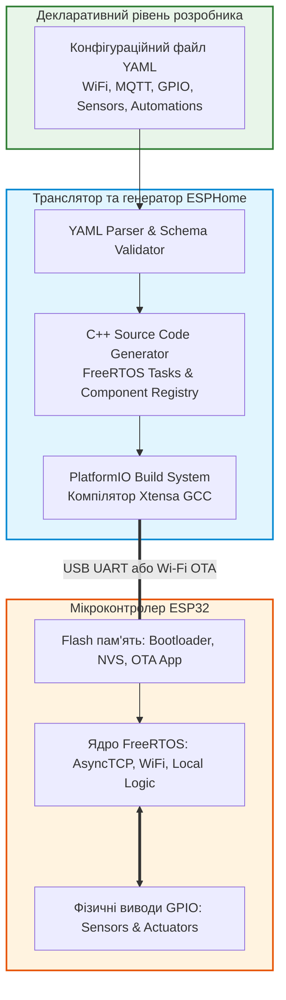
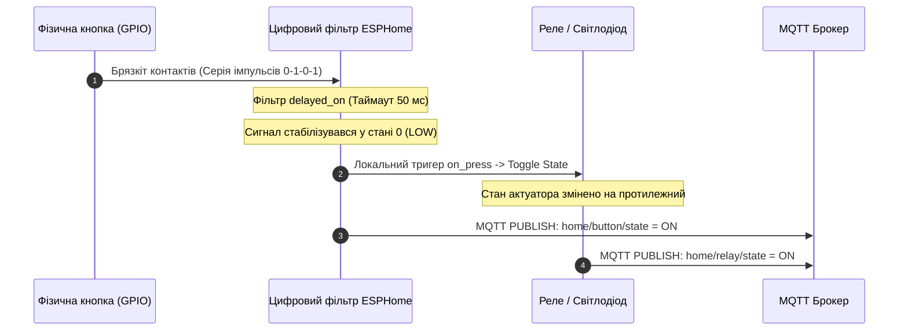

# Лабораторна робота № 6. Декларативне програмування мікроконтролерів ESP32 за допомогою фреймворку ESPHome та інтеграція з протоколом MQTT

**Мета:** Дослідити концепцію декларативного опису апаратної конфігурації та алгоритмів функціонування вузлів Інтернету речей, опанувати роботу з відкритим фреймворком ESPHome та мовою розмітки YAML, вивчити механізми автоматичної кодогенерації вбудованого програмного забезпечення на базі C++ та операційної системи реального часу FreeRTOS для мікроконтролера ESP32, реалізувати зчитування дискретних сигналів сенсорів і кнопок із програмним придушенням брязкоту контактів, налаштувати локальну автоматизацію на межі мережі (Edge Automation), а також забезпечити двосторонній обмін телеметрією та командами керування за протоколом MQTT безпосередньо з брокером.

**Стек технологій та інструменти:**
* **Мова програмування / Середовище:** Мова розмітки структурованих даних YAML, командний інтерпретатор Bash / PowerShell, середовище віртуального оточення Python `venv`.
* **Платформа / Бібліотеки / Модулі:** Фреймворк автоматичної збірки прошивок ESPHome (версія 2024.x або вище), інструментальний ланцюг PlatformIO Core, мікроконтролер ESP32-WROOM-32 (NodeMCU-32S), протокол бездротового зв'язку IEEE 802.11 Wi-Fi, локальний або хмарний брокер Eclipse Mosquitto.
* **Інструменти розробки:** Консольна утиліта `esphome`, вбудований монітор діагностичних повідомлень ESPHome Logger, консольні клієнти `mosquitto_sub` та `mosquitto_pub`, текстовий редактор Visual Studio Code.

---

## 1 Теоретичні відомості

Традиційне програмування мікроконтролерних систем базується на імперативному підході (Imperative Programming), за якого інженер власноруч описує покроковий процедурний алгоритм ініціалізації регістрів, налаштування переривань, керування пам'яттю, реалізації мережевих стеків та обробки таймерів мовами C або C++. На відміну від цього, фреймворк ESPHome використовує декларативний підхід (Declarative Programming), де розробник у структурованому текстовому файлі формату YAML визначає цільовий стан системи: перелік використовуваних апаратних інтерфейсів, пінів підключення, сенсорних компонентів, виконавчих механізмів, мережевих протоколів та логічних правил реагування на події.

Внутрішня архітектура ESPHome здійснює синтаксичний аналіз YAML-файлу, транслює задекларовані сутності у високоефективний об'єктно-орієнтований код мовою C++ на базі фреймворків Arduino Core for ESP32 або ESP-IDF, компілює бінарний образ прошивки за допомогою PlatformIO та завантажує його в пам'ять мікроконтролера через послідовний порт UART або бездротовим шляхом за технологією оновлення «по повітрю» (Over-The-Air, OTA).


*Рисунок 1 — Структурна схема конвеєра компіляції та виконання прошивки у середовищі ESPHome*

Архітектурний підхід, наведений на рисунку 1, забезпечує високу надійність роботи кінцевого вузла. Прошивка містить повністю автономний шар виконання, завдяки чому локальні автоматизації (наприклад, перемикання реле при натисканні фізичної кнопки) продовжують безвідмовно працювати навіть у разі повної втрати зв'язку з Wi-Fi мережею або центральним MQTT-брокером.

При підключенні механічних комутаційних елементів (кнопок, тумблерів, герконових датчиків) виникає явище брязкоту контактів (Contact Bounce), зумовлене пружною деформацією металевих пластин під час замикання та розмикання. Внаслідок цього протягом часу $t_{\text{bounce}}$ формується хаотична серія електричних імпульсів, яка може сприйматися обчислювальним ядром як багаторазове натискання.


*Рисунок 2 — Діаграма послідовності локальної обробки та фільтрації сигналу кнопки з подальшою публікацією у MQTT*

Для математичного моделювання перехідних процесів у вхідному колі з підтягувальним резистором $R_{\text{pullup}}$ та паразитною ємністю монтажу $C_{\text{parasitic}}$ час наростання напруги до порогу перемикання цифрового логічного елемента $V_{\text{th}}$ описується класичним диференціальним рівнянням заряду ємності:

$$V_{\text{in}}(t) = V_{\text{cc}} \cdot \left(1 - e^{-\frac{t}{\tau}}\right)$$

де $V_{\text{in}}(t)$ — миттєва напруга на вході мікроконтролера (В);
$V_{\text{cc}}$ — напруга живлення логічного ядра (для ESP32 $V_{\text{cc}} = 3{,}3\text{ В}$);
$\tau = R_{\text{pullup}} \cdot C_{\text{parasitic}}$ — часова стала вхідного RC-кола (с);
$t$ — час з моменту розмикання контакту (с).

Для усунення хибних перемикань цифровий фільтр дебаунсингу у прошивці ESPHome фіксує зміну логічного стану лише тоді, коли новий стан залишається стабільним протягом часу $T_{\text{debounce}}$, що перевищує максимальну тривалість механічних перехідних процесів:

$$T_{\text{debounce}} \ge t_{\text{settle}} = -\tau \cdot \ln\left(1 - \frac{V_{\text{th}}}{V_{\text{cc}}}\right) + t_{\text{bounce\_max}}$$

де $T_{\text{debounce}}$ — програмний інтервал фільтрації (зазвичай обирається в межах $30\dots 80\text{ мс}$);
$V_{\text{th}}$ — порогова напруга спрацьовування вхідного тригера Шмітта (В);
$t_{\text{bounce\_max}}$ — максимальна тривалість механічного брязкоту контактів (с).

Особливістю архітектури пам'яті мікроконтролера ESP32 при роботі з фреймворком ESPHome є використання таблиці розділів із підтримкою двох незалежних слотів для прошивки (`ota_0` та `ota_1`), що забезпечує безпечне оновлення коду через бездротовий канал без ризику виходу системи з ладу (Anti-Bricking Protection). Баланс розподілу енергонезалежної Flash-пам'яті обсягом $S_{\text{Flash}}$ описується формулою:

$$S_{\text{Flash}} \ge S_{\text{Boot}} + S_{\text{NVS}} + S_{\text{OTADATA}} + 2 \cdot S_{\text{App\_OTA}} + S_{\text{FS}}$$

де $S_{\text{Boot}}$ — розмір завантажувача другого ступеня (Bootloader, близько $32\text{ КБ}$);
$S_{\text{NVS}}$ — енергонезалежне сховище налаштувань Wi-Fi та калібрувань (Non-Volatile Storage, $16\dots 24\text{ КБ}$);
$S_{\text{OTADATA}}$ — таблиця вибору активного слота завантаження ($8\text{ КБ}$);
$S_{\text{App\_OTA}}$ — максимальний обсяг пам'яті, виділений під один бінарний образ виконуваної програми ($1{,}8\dots 2{,}0\text{ МБ}$);
$S_{\text{FS}}$ — розмір файлової системи LittleFS / SPIFFS для локальних ресурсів ($256\dots 512\text{ КБ}$).

---

## 2 Підготовка середовища та розгортання проєкту (Крок 0)

Для підготовки інструментарію використовується ізольоване віртуальне середовище Python, що виключає конфлікти версій системних пакетів.

1. Запустіть емулятор термінала операційної системи та створіть віртуальне оточення Python для встановлення ESPHome:

```bash
# Перевірка версії встановленого інтерпретатора Python
python3 --version

# Створення ізольованого середовища venv
python3 -m venv ~/esphome_venv

# Активація віртуального оточення
source ~/esphome_venv/bin/activate

# Оновлення базового менеджера пакетів та інсталяція ESPHome
pip install --upgrade pip
pip install esphome
```

2. Перевірте працездатність встановленого фреймворку та наявність необхідних утиліт компіляції:

```bash
# Перевірка встановленої версії фреймворку ESPHome
esphome version
```

3. Створіть робочу структуру папок проєкту:

```bash
# Створення робочих каталогів для конфігурацій та артефактів збірки
mkdir -p ~/IoT_Labs/Lab6_ESPHome/{config,build,docs}
cd ~/IoT_Labs/Lab6_ESPHome
```

Файлова структура проєкту повинна мати такий вигляд:

```text
IoT_Labs/
└── Lab6_ESPHome/
    ├── config/
    │   ├── secrets.yaml          # Файл конфіденційних даних (паролі Wi-Fi, MQTT)
    │   └── esp32_node.yaml       # Головний декларативний конфігураційний файл
    ├── build/                    # Каталог проміжних об'єктних файлів PlatformIO
    └── docs/
        └── compile_log.txt       # Журнал успішної компіляції та заливки
```

4. Створіть допоміжний файл `~/IoT_Labs/Lab6_ESPHome/config/secrets.yaml`, який використовується для безпечного збереження паролів окремо від основної конфігурації:

```yaml
# Файл збереження конфіденційних параметрів доступу
wifi_ssid: "Wokwi-GUEST"
wifi_password: ""
mqtt_broker: "broker.emqx.io"
mqtt_port: 1883
mqtt_username: ""
mqtt_password: ""
ota_password: "AdminOTAPassword2026!"
```

---

## 3 Порядок виконання роботи

### 3.1 Індивідуальні завдання

Кожен здобувач вищої освіти розробляє декларативний YAML-файл для мікроконтролера ESP32 згідно з індивідуальними параметрами вхідних датчиків, актуаторів та структури топіків MQTT.

| Варіант | Назва пристрою / Призначення | Дискретні входи (Binary Sensors) | Вихідні актуатори (Switches/Outputs) | Логіка автоматизації на рівні Edge | Структура MQTT топіків |
| :---: | :--- | :--- | :--- | :--- | :--- |
| **1** | Смарт-контролер освітлення кабінету | Тактова кнопка (GPIO0) з фільтром 50 мс | Світлодіод / Реле лампи (GPIO2) | Натискання кнопки інвертує стан реле; публікувати стан у MQTT | `office/switch/state`<br/>`office/light/set` |
| **2** | Монітор безпеки дверей складу | Герконовий датчик (GPIO14) | Сигнальний маяк (GPIO16) | При розмиканні геркона увімкнути маяк та надіслати тривогу | `warehouse/door/sensor`<br/>`warehouse/beacon/state` |
| **3** | Детектор затоплення серверної | Сенсор витоку води (GPIO27) | Відсічний електроклапан (GPIO18) | При фіксації вологи негайно закрити клапан та передати аварійний статус | `server/water/leak`<br/>`server/valve/control` |
| **4** | Автоматика вентиляції гаража | Датчик руху PIR (GPIO13) | Витяжний вентилятор (GPIO19) | Увімкнути вентилятор при виявленні руху та вимкнути через 60 с після зупинки | `garage/motion/state`<br/>`garage/fan/power` |
| **5** | Система контролю доступу лабораторії | Кнопка аварійного відкриття (GPIO32) | Електромагнітний замок (GPIO4) | Натискання кнопки знімає блокування замка на 10 секунд | `lab/door/emergency`<br/>`lab/lock/state` |
| **6** | Смарт-терморегулятор інкубатора | Сенсор перегріву термостата (GPIO25) | Нагрівальний елемент ТЕН (GPIO5) | При спрацюванні сенсора перегріву примусово знеструмити ТЕН | `incubator/temp/alert`<br/>`incubator/heater/cmd` |
| **7** | Контролер компресора високого тиску | Реле тиску магістралі (GPIO26) | Пускач двигуна компресора (GPIO21) | Якщо тиск нижче норми, запустити компресор; передавати статус роботи | `plant/pressure/sensor`<br/>`plant/motor/state` |
| **8** | Охоронний контур периметра | Оптичний бар'єр (GPIO33) | Прожектор тривоги (GPIO22) | Перетин бар'єра активує прожектор у режимі стробоскопа | `perimeter/beam/status`<br/>`perimeter/light/set` |
| **9** | Смарт-годівниця тваринницького комплексу | Кінцевий вимикач рівня бункера (GPIO15) | Сервопривід дозатора корму (GPIO23) | При спустошенні бункера подати звуковий сигнал і заблокувати дозатор | `farm/hopper/empty`<br/>`farm/feeder/run` |
| **10** | Вузол контролю конвеєрної стрічки | Індуктивний датчик заклинювання (GPIO34) | Головне контакторне реле (GPIO12) | При зупинці обертання негайно вимкнути головний контактор лінії | `conveyor/jam/detect`<br/>`conveyor/power/switch` |
| **11** | Автоматизовані ролети оранжереї | Фоторезистивний пороговий тригер (GPIO35) | Привід підйому/опускання ролет (GPIO17) | При падінні рівня світла нижче порогу опустити захисні ролети | `greenhouse/light/lvl`<br/>`greenhouse/shutter/cmd` |
| **12** | Контролер відкачування дренажу | Поплавковий датчик верхнього рівня (GPIO36) | Занурювальний насос (GPIO2) | Досягнення верхнього рівня вмикає насос до повного осушення | `drainage/float/high`<br/>`drainage/pump/state` |
| **13** | Смарт-система тестування плат | Кнопка старту циклу випробувань (GPIO0) | Пневмопритискач контактів (GPIO18) | Натискання кнопки активує притискач на 5 секунд та передає телеметрію | `testing/bench/start`<br/>`testing/clamp/state` |
| **14** | Блокування захисного кожуха верстата | Геркон захисного екрана (GPIO14) | Силове реле шпинделя (GPIO16) | Заборонено вмикати реле шпинделя, якщо геркон екрана розімкнений | `lathe/guard/closed`<br/>`lathe/spindle/power` |
| **15** | Клімат-контроль сушильної камери | Датчик вологості граничний (GPIO27) | Витяжна заслінка (GPIO19) | Якщо вологість висока, відкрити заслінку та передати стан у MQTT | `dryer/humidity/high`<br/>`dryer/damper/set` |
| **16** | Розумний паркувальний бар'єр | Ультразвуковий дискретний сенсор (GPIO13) | Електромеханічний блокіратор (GPIO4) | При наближенні автомобіля опустити блокіратор за умови дозволу з MQTT | `parking/car/present`<br/>`parking/barrier/ctrl` |
| **17** | Сигналізація виходу людей на колію | Радар присутності (GPIO25) | Світлодіодний семафор (GPIO5) | Фіксація руху в небезпечній зоні вмикає червоний сигнал семафора | `rail/danger/motion`<br/>`rail/signal/state` |
| **18** | Контроль тиску в системі пожежогасіння | Електроконтактний манометр (GPIO26) | Допоміжний насос підкачки (GPIO21) | Падіння тиску нижче 4 бар вмикає підкачку та надсилає сповіщення | `fire/pipe/pressure`<br/>`fire/booster/pump` |
| **19** | Автоматика освітлення сходів | Нижній датчик перетину сходинки (GPIO32) | Світлодіодна лінія підсвітки (GPIO22) | Перетин лінії вмикає підсвітку сходів на 20 секунд | `stairs/step1/trigger`<br/>`stairs/led/power` |
| **20** | Аварійна кнопка зупинки газопроводу | Грибоподібна кнопка аварії E-Stop (GPIO33) | Електромагнітна відсічна засувка (GPIO23) | Натискання кнопки аварії миттєво знеструмлює та перекриває засувку | `gas/estop/pressed`<br/>`gas/main_valve/state` |

---

### 3.2 Покроковий алгоритм та розв'язок еталонного прикладу

У ролі еталонного прикладу розглядається **«Смарт-вузол освітлення та сигналізації кабінету (Smart Office Node) на базі ESP32 з декларативною автоматизацією та інтеграцією з MQTT»**.

Параметри еталонної системи:
* Назва вузла в мережі: `office-smart-node`
* Мікроконтролер: `esp32dev` (SoC ESP32)
* Дискретний вхід: Фізична тактова кнопка на виводі `GPIO0` із внутрішньою підтяжкою `PULLUP` та часом дебаунсингу $50\text{ мс}$.
* Виконавчий пристрій: Світлодіод / Актуатор реле на виводі `GPIO2`.
* Логіка роботи: 
  * Натискання фізичної кнопки локально інвертує стан актуатора (Toggle) без затримок.
  * Поточний стан кнопки транслюється в топік `office/button/state`.
  * Поточний стан актуатора транслюється в топік `office/light/state`.
  * Брокер може дистанційно керувати реле за допомогою команд у топіку `office/light/set`.

#### Крок 1. Створення конфігураційного файлу `esp32_node.yaml`

Створіть файл `~/IoT_Labs/Lab6_ESPHome/config/esp32_node.yaml` та введіть повний декларативний код без скорочень:

```yaml
# =====================================================================
# ДЕКЛАРАТИВНА КОНФІГУРАЦІЯ ESPHOME ДЛЯ МІКРОКОНТРОЛЕРА ESP32
# =====================================================================

esphome:
  name: office-smart-node
  friendly_name: "Smart Office Controller"
  comment: "Лабораторна робота №6 - Декларативне програмування ESP32"

# Визначення цільової апаратної платформи
esp32:
  board: esp32dev
  framework:
    type: arduino

# Підключення зовнішнього файлу секретних даних
secrets: secrets.yaml

# =====================================================================
# НАЛАШТУВАННЯ БЕЗДРОТОВОГО ЗВ'ЯЗКУ WI-FI ТА СИСТЕМИ ДІАГНОСТИКИ
# =====================================================================
wifi:
  ssid: !secret wifi_ssid
  password: !secret wifi_password

  # Резервна точка доступу у разі втрати зв'язку з основним маршрутизатором
  ap:
    ssid: "Office-Node-Fallback"
    password: "FallbackPassword2026"

# Вебпортал аварійного налаштування Wi-Fi при першому запуску
captive_portal:

# Налаштування виведення діагностичних повідомлень у послідовний порт UART
logger:
  level: DEBUG
  baud_rate: 115200

# Служба безпечного оновлення прошивки по повітрю (Over-The-Air)
ota:
  platform: esphome
  password: !secret ota_password

# =====================================================================
# ІНТЕГРАЦІЯ З БРОКЕРОМ ПОВІДОМЛЕНЬ MQTT
# =====================================================================
mqtt:
  broker: !secret mqtt_broker
  port: !secret mqtt_port
  username: !secret mqtt_username
  password: !secret mqtt_password
  client_id: "Office_Node_ESP32"
  
  # Базовий топік для публікації статусу доступності пристрою
  topic_prefix: "office"
  
  # Аварійний заповіт (LWT)
  birth_message:
    topic: "office/status"
    payload: "online"
    qos: 1
    retain: true
  will_message:
    topic: "office/status"
    payload: "offline"
    qos: 1
    retain: true

# =====================================================================
# ДЕКЛАРАЦІЯ АПАРАТНИХ ВИХОДІВ (АКТУАТОРІВ)
# =====================================================================
output:
  - platform: gpio
    pin: GPIO2
    id: relay_gpio_pin

# Логічний перемикач освітлення, прив'язаний до виходу GPIO2
switch:
  - platform: output
    name: "Office Main Light"
    id: office_light_relay
    output: relay_gpio_pin
    icon: "mdi:lightbulb"
    
    # Специфікація MQTT топіків для дистанційного керування
    state_topic: "office/light/state"
    command_topic: "office/light/set"
    on_turn_on:
      - logger.log: "[АКТУАТОР]: Стан реле переведено в ON"
    on_turn_off:
      - logger.log: "[АКТУАТОР]: Стан реле переведено в OFF"

# =====================================================================
# ДЕКЛАРАЦІЯ ДИСКРЕТНИХ ВХОДІВ ТА ЛОКАЛЬНОЇ АВТОМАТИЗАЦІЇ
# =====================================================================
binary_sensor:
  - platform: gpio
    pin:
      number: GPIO0
      mode:
        input: true
        pullup: true
      inverted: true
    name: "Office Wall Button"
    id: wall_push_button
    
    # Фільтрація брязкоту контактів (Debounce Filter)
    filters:
      - delayed_on: 50ms
      - delayed_off: 50ms
      
    # Специфікація топіка публікації стану кнопки в MQTT
    state_topic: "office/button/state"
    
    # Локальна автоматизація на межі мережі (Edge Action)
    on_press:
      - logger.log: "[КНОПКА]: Фізичне натискання кнопки зафіксовано!"
      - switch.toggle: office_light_relay
```

#### Крок 2. Перевірка та валідація синтаксису конфігурації

Перед початком процесу генерації коду необхідно переконатися у відсутності синтаксичних помилок та відповідності схеми конфігурації:

```bash
# Перехід у робочу директорію проєкту
cd ~/IoT_Labs/Lab6_ESPHome

# Запуск валідатора конфігураційного файлу
esphome config config/esp32_node.yaml
```

У разі успішної валідації термінал виведе повідомлення `INFO Configuration is valid!`.

#### Крок 3. Компіляція вихідного коду C++ та генерація бінарного образу

Запустіть процес компіляції прошивки:

```bash
# Запуск генератора C++ коду та компілятора PlatformIO
esphome compile config/esp32_node.yaml
```

Фреймворк автоматично завантажить необхідні інструментальні ланцюги `toolchain-xtensa-esp32`, згенерує файли `src/main.cpp`, скомпілює всі бібліотеки зв'язку та створить виконуваний файл прошивки `.pioenvs/office-smart-node/firmware.bin`.

---

### 3.3 Запуск, тестування та перевірка результатів

1. Якщо використовується фізична плата ESP32, підключіть її через USB-кабель до комп'ютера та виконайте прошивку і запуск моніторингу:

```bash
# Компіляція, прошивка через послідовний порт та відкриття логів
esphome run config/esp32_node.yaml
```

2. Якщо тестування виконується у симуляторі Wokwi:
   * Знайдіть скомпільований файл `firmware.bin` у каталозі `.esphome/build/office-smart-node/`;
   * Завантажте бінарний образ у симулятор Wokwi через контекстне меню завантаження прошивки;
   * Натисніть кнопку **Start Simulation**.

3. Відкрийте **Термінал №1** на робочій станції та підпишіться на всі топіки вузла:

```bash
# Підписка на потоки стану кнопки, світлодіода та системного заповіту
mosquitto_sub -h broker.emqx.io -p 1883 -t "office/#" -v
```

4. Проведіть тестування локальної автоматизації:
   * Натисніть фізичну тактову кнопку на платі ESP32 (кнопка `BOOT` на піні `GPIO0`);
   * Переконайтеся, що світлодіод на піні `GPIO2` миттєво змінює стан на протилежний, а в терміналі з'являється лог натискання.

5. Відкрийте **Термінал №2** та надішліть команду дистанційного керування через MQTT:

```bash
# Дистанційне увімкнення світла через команду брокеру
mosquitto_pub -h broker.emqx.io -p 1883 -t "office/light/set" -m "ON"

# Дистанційне вимкнення світла
mosquitto_pub -h broker.emqx.io -p 1883 -t "office/light/set" -m "OFF"
```

#### Еталонний протокол системного журналу утиліти `esphome logs`:

```text
[15:30:00][I][app:029]: Initializing Node 'office-smart-node'...
[15:30:00][I][wifi:598]: Connecting to 'Wokwi-GUEST'...
[15:30:04][I][wifi:415]: WiFi Connected! IP: 10.0.1.18, RSSI: -48 dB
[15:30:04][I][mqtt:156]: Connecting to MQTT Broker broker.emqx.io:1883...
[15:30:05][I][mqtt:212]: MQTT Connected! ClientID: 'Office_Node_ESP32'
[15:30:05][D][mqtt:375]: Publish(topic='office/status' payload='online' qos=1 retain=1)
[15:30:05][D][mqtt:375]: Publish(topic='office/light/state' payload='OFF' qos=0 retain=0)
[15:30:05][D][mqtt:375]: Publish(topic='office/button/state' payload='OFF' qos=0 retain=0)
[15:30:05][I][mqtt:230]: Subscribed to 'office/light/set'
[15:30:12][D][binary_sensor:036]: 'Office Wall Button': State change -> ON
[15:30:12][D][main:089]: [КНОПКА]: Фізичне натискання кнопки зафіксовано!
[15:30:12][D][switch:013]: 'Office Main Light' Turning ON.
[15:30:12][D][main:065]: [АКТУАТОР]: Стан реле переведено в ON
[15:30:12][D][mqtt:375]: Publish(topic='office/button/state' payload='ON' qos=0 retain=0)
[15:30:12][D][mqtt:375]: Publish(topic='office/light/state' payload='ON' qos=0 retain=0)
[15:30:12][D][binary_sensor:036]: 'Office Wall Button': State change -> OFF
[15:30:12][D][mqtt:375]: Publish(topic='office/button/state' payload='OFF' qos=0 retain=0)
[15:30:25][D][mqtt:390]: Message arrived on 'office/light/set': 'OFF'
[15:30:25][D][switch:017]: 'Office Main Light' Turning OFF.
[15:30:25][D][main:068]: [АКТУАТОР]: Стан реле переведено в OFF
[15:30:25][D][mqtt:375]: Publish(topic='office/light/state' payload='OFF' qos=0 retain=0)
```

#### Еталонний вивід термінала підписника (`mosquitto_sub`):

```text
office/status online
office/light/state OFF
office/button/state OFF
office/button/state ON
office/light/state ON
office/button/state OFF
office/light/state OFF
```

---

## 4 Вимоги до змісту звіту

Звіт оформлюється українською мовою згідно з вимогами стандарту ДСТУ 3008:2015 і повинен містити такі обов'язкові компоненти:

1. **Титульна сторінка** із зазначенням навчального закладу, кафедри, навчальної дисципліни, номера лабораторної роботи, номера індивідуального варіанта, прізвища та ініціалів здобувача й викладача.
2. **Мета роботи** та теоретичні положення щодо переваг декларативного опису вбудованих систем порівняно з процедурним кодуванням.
3. **Постановка індивідуального завдання** для закріпленого варіанта з детальним описом обраних пінів GPIO, налаштувань фільтрів дебаунсингу та структури топіків MQTT.
4. **Розрахункова частина:** теоретичний розрахунок часової сталої вхідного RC-кола $\tau$ та мінімального часу програмної затримки $T_{\text{debounce}}$ для кнопки вашого варіанта згідно з математичною моделлю розділу 1.
5. **Повний вихідний текст конфігураційних файлів** `esp32_node.yaml` та `secrets.yaml` без скорочень із детальним коментуванням кожного функціонального блоку.
6. **Результати тестування:** скріншоти консолі під час компіляції прошивки утилітою `esphome compile`, логи моніторингу `esphome logs` та скріншоти відправки й отримання повідомлень у терміналах `mosquitto_sub`/`mosquitto_pub` або в інтерфейсі `MQTT Explorer`.
7. **Аналітичні висновки**, у яких оцінено автономність функціонування вузла при втраті зв'язку з брокером, проаналізовано обсяг згенерованого бінарного коду та сформульовано рекомендації щодо використання декларативного підходу у промислових проектах Інтернету речей.

---

## 5 Контрольні запитання для захисту роботи

1. **У чому полягає принципова різниця між декларативним підходом фреймворку ESPHome та класичним імперативним програмуванням мікроконтролерів мовою C++ у середовищі Arduino IDE?**
2. **Яким чином цифровий фільтр `delayed_on` / `delayed_off` у блоці `filters` компонента `binary_sensor` забезпечує захист від брязкоту контактів?** Як вибір занадто великого часу дебаунсингу впливає на чутливість системи до короткочасних натискань?
3. **Поясніть механізм захисту від збоїв прошивки за технологією OTA (Dual Partitioning) у мікроконтролері ESP32.** Чому для реалізації OTA обсяг пам'яті програми подвоюється у схемі розмітки Flash-пам'яті?
4. **Яке призначення має компонент `captive_portal` у конфігурації ESPHome?** За яких умов мікроконтролер активує власну аварійну точку доступу (Fallback AP)?
5. **Яким чином у конфігурації ESPHome реалізується локальна автоматизація без участі зовнішнього сервера за допомогою тригерів `on_press`, `on_turn_on` та дій `switch.toggle`?**
6. **Як працює механізм автоматичного виявлення пристроїв (MQTT Discovery / Native API) при інтеграції вузлів ESPHome із центральними платформами автоматизації (наприклад, Home Assistant)?**