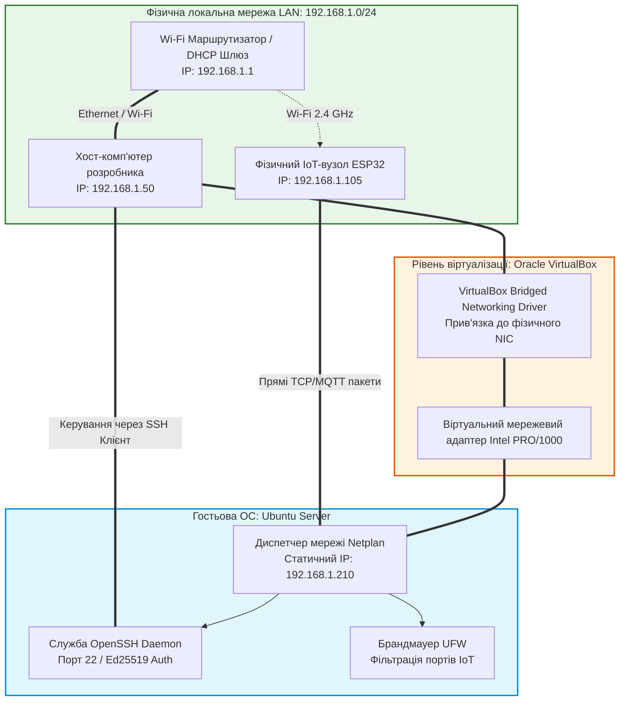
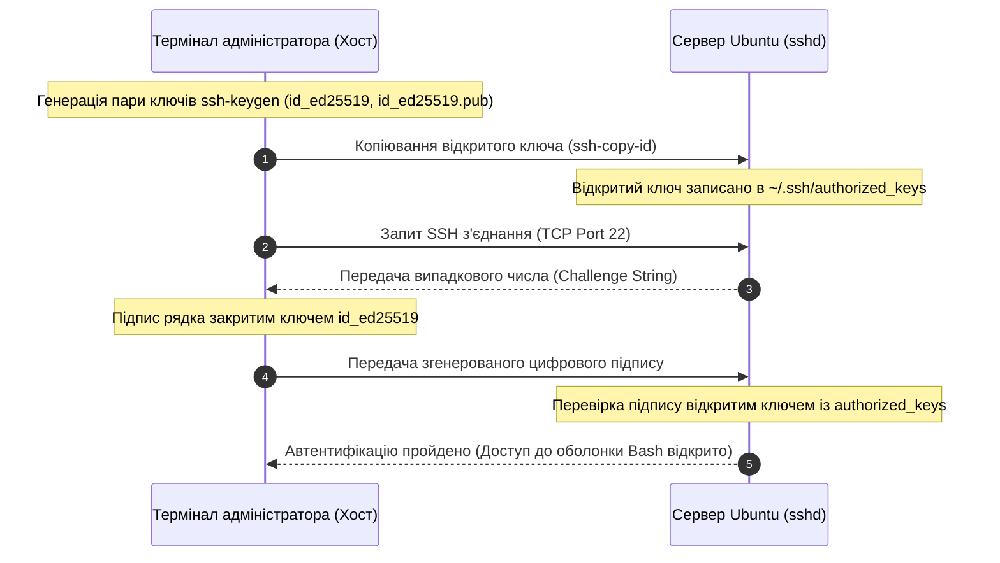

# Лабораторна робота № 7. Розгортання та адміністрування базового серверного віртуального середовища Linux на базі Oracle VirtualBox для інфраструктури Інтернету речей

**Мета:** Дослідити концепції апаратної віртуалізації та архітектури серверних платформ для розміщення служб Інтернету речей, опанувати методи створення та конфігурування віртуальних машин у середовищі гіпервізора Oracle VirtualBox, встановити та налаштувати серверну операційну систему Ubuntu Server, налаштувати мережевий міст (Bridged Adapter) для прямої адресації та двосторонньої взаємодії з фізичними й віртуальними IoT-вузлами в локальній мережі, організувати захищений віддалений доступ за протоколом SSH на основі асиметричних криптографічних ключів і налаштувати базовий міжмережевий екран для захисту серверної платформи.

**Стек технологій та інструменти:**
* **Мова програмування / Середовище:** Командна оболонка GNU Bash, декларативна мова конфігурації мережі Netplan (YAML).
* **Платформа / Бібліотеки / Модулі:** Гіпервізор другого типу Oracle VM VirtualBox (версія 7.0 або вище), серверна операційна система Ubuntu Server 22.04 LTS / 24.04 LTS (x86_64), служба віддаленого доступу OpenSSH Server, утиліта конфігурування брандмауера UFW (Uncomplicated Firewall).
* **Інструменти розробки:** Емулятор термінала хост-системи (Terminal у Linux/macOS або PowerShell у Windows), утиліти генерації ключів `ssh-keygen` та передавання файлів `scp`.

---

## 1 Теоретичні відомості

У розгалужених системах Інтернету речей централізовані та туманні (Fog) обчислення вимагають надійної серверної інфраструктури, яка забезпечує безперервне функціонування брокерів повідомлень (MQTT), систем керування базами даних (Time-Series Database) та аналітичних платформ. Для ізоляції процесів, гнучкого масштабування та ефективного використання фізичного апаратного забезпечення застосовують технології віртуалізації. Гіпервізор другого типу (Hosted Hypervisor), прикладом якого є Oracle VirtualBox, функціонує поверх основної операційної системи хоста (Host OS) та емулює повноцінні апаратні ресурси комп'ютера (процесор, пам'ять, накопичувачі, мережеві карти) для гостьової операційної системи (Guest OS).

Мережева підсистема гіпервізора підтримує кілька режимів роботи віртуальних адаптерів. У типовому режимі трансляції мережевих адрес (Network Address Translation, NAT) віртуальна машина прихована за внутрішнім шлюзом гіпервізора, що ускладнює пряме підключення до неї зовнішніх мікроконтролерів (ESP32, Arduino) без налаштування складних правил прокидання портів. Тому для серверів Інтернету речей стандартом є використання режиму «Мережевий міст» (Bridged Adapter).


*Рисунок 1 — Архітектура мережевої інтеграції віртуального сервера через режим Bridged Adapter*

Наведений на рисунку 1 мережевий міст перехоплює пакети безпосередньо з фізичного мережевого адаптера хост-машини. Завдяки цьому віртуальний сервер стає повноправним учасником локальної мережі, отримує власну унікальну MAC-адресу та статичну IP-адресу з того самого адресного простору, що й решта фізичних пристроїв. Це забезпечує пряму двосторонню маршрутизацію трафіку між мікроконтролерами ESP32 та сервісами сервера.

У сучасних дистрибутивах Ubuntu Server керування мережевими налаштуваннями виконується за допомогою утиліти Netplan, яка використовує декларативні конфігураційні файли мови YAML для передачі директив внутрішнім мережевим демонам `systemd-networkd` або `NetworkManager`.

Для захищеного дистанційного адміністрування сервера застосовується протокол SSH (Secure Shell). Найбільш стійким до атак повного перебору (Brute-force) є метод автентифікації за асиметричною парою криптографічних ключів на базі еліптичних кривих Ed25519 (Edwards-curve Digital Signature Algorithm).


*Рисунок 2 — Діаграма послідовності автентифікації на сервері за асиметричними ключами Ed25519*

Під час виділення апаратних ресурсів хост-системи для потреб віртуалізації необхідно дотримуватися математичних моделей балансування навантаження. Коефіцієнт перепідписки процесорних ядер (CPU Overcommit Ratio, $\rho_{\text{CPU}}$) визначає співвідношення між сумою виділених віртуальних ядер (vCPU) та кількістю фізичних ядер процесора ($pCPU_{\text{cores}}$):

$$\rho_{\text{CPU}} = \frac{\sum_{i=1}^{K} vCPU_i}{pCPU_{\text{cores}}}$$

де $vCPU_i$ — кількість віртуальних процесорів, призначених $i$-тій віртуальній машині;
$pCPU_{\text{cores}}$ — кількість фізичних ядер процесора хост-комп'ютера;
$K$ — загальна кількість одночасно запущених віртуальних машин.

Для забезпечення передбачуваних затримок обробки подій у системах Інтернету речей реального часу коефіцієнт перепідписки не повинен перевищувати одиниці ($\rho_{\text{CPU}} \le 1{,}0$), що гарантує відсутність конкуренції за процесорний час між потоками гостьової та хостової операційних систем.

Баланс розподілу оперативної пам'яті вимагає, щоб обсяг вільної фізичної пам'яті хост-системи ($M_{\text{host\_free}}$) після виділення пам'яті під віртуальні машини становив не менше ніж $20\%$ від загальної місткості:

$$M_{\text{host\_free}} = M_{\text{host\_total}} - \left( M_{\text{host\_os}} + \sum_{i=1}^{K} M_{\text{VM}_i} \right) \ge 0{,}20 \cdot M_{\text{host\_total}}$$

де $M_{\text{host\_total}}$ — сумарний обсяг фізичної оперативної пам'яті комп'ютера (МБ);
$M_{\text{host\_os}}$ — гарантований резерв пам'яті для стабільного функціонування операційної системи хоста (зазвичай $2048\dots 4096\text{ МБ}$);
$M_{\text{VM}_i}$ — обсяг оперативної пам'яті, виділений для $i$-тої віртуальної машини (МБ).

Ефективна пропускна здатність мережевого інтерфейсу віртуальної машини в режимі мосту ($B_{\text{eff}}$) враховує накладні витрати на емуляцію віртуального мережевого адаптера (vNIC):

$$B_{\text{eff}} = B_{\text{phys}} \cdot (1 - \mu_{\text{virt}})$$

де $B_{\text{phys}}$ — пропускна здатність фізичного каналу мережевого адаптера хоста (біт/с);
$\mu_{\text{virt}}$ — коефіцієнт накладних витрат драйвера віртуального мосту ($\mu_{\text{virt}} \approx 0{,}03\dots 0{,}06$).

---

## 2 Підготовка середовища та розгортання проєкту (Крок 0)

Для виконання лабораторної роботи необхідно перевірити стан апаратних розширень віртуалізації на хост-комп'ютері та завантажити офіційний інсталяційний образ Ubuntu Server.

1. Запустіть термінал хост-системи (PowerShell у Windows або Terminal у Linux/macOS) та перевірте стан підтримки апаратної віртуалізації (Intel VT-x або AMD-V):

```bash
# Для користувачів Linux: перевірка наявності апаратних інструкцій віртуалізації
egrep -c '(vmx|svm)' /proc/cpuinfo

# Для користувачів Windows у PowerShell:
Get-ComputerInfo -Property "HyperVRequirementVirtualizationFirmwareEnabled"
```

2. Завантажте інсталяційний образ **Ubuntu Server 22.04 LTS / 24.04 LTS (x86_64)** з офіційного джерела (`ubuntu.com/download/server`).
3. Створіть на хост-системі робочий каталог проєкту:

```bash
# Створення каталогу для збереження допоміжних скриптів та криптографічних ключів
mkdir -p ~/IoT_Server_Lab7/{keys,configs,backups}
cd ~/IoT_Server_Lab7
```

Файлова структура розгорнутого лабораторного середовища повинна мати такий вигляд:

```text
IoT_Server_Lab7/
├── configs/
│   ├── 00-installer-config.yaml   # Резервна копія конфігурації мережі Netplan
│   └── ufw_rules.txt              # Збережений стан правил брандмауера
├── keys/
│   ├── id_ed25519                 # Приватний криптографічний ключ адміністратора
│   └── id_ed25519.pub             # Відкритий криптографічний ключ для сервера
└── backups/
    └── virtualbox_vm_settings.txt # Експортований звіт параметрів віртуальної машини
```

---

## 3 Порядок виконання роботи

### 3.1 Індивідуальні завдання

Кожен здобувач вищої освіти налаштовує параметри віртуальної машини, призначає унікальне мережеве ім'я (Hostname), фіксовану статичну IP-адресу та специфічні правила міжмережевого екрана згідно з індивідуальним варіантом.

| Варіант | Мережеве ім'я сервера (Hostname) | Статична IP-адреса та маска | Ресурси ВМ (vCPU / RAM / Disk) | Профіль відкритості брандмауера UFW |
| :---: | :--- | :--- | :--- | :--- |
| **1** | `iot-srv-node01` | `192.168.1.201/24` | 2 vCPU / 2048 MB / 25 GB | SSH (22), MQTT (1883), HTTP (80) |
| **2** | `iot-srv-node02` | `192.168.1.202/24` | 2 vCPU / 2048 MB / 25 GB | SSH (22), MQTT (1883), HTTPS (443), Node-RED (1880) |
| **3** | `iot-srv-node03` | `192.168.1.203/24` | 1 vCPU / 2048 MB / 20 GB | SSH (22), MQTT TLS (8883), Home Assistant (8123) |
| **4** | `iot-srv-node04` | `192.168.1.204/24` | 2 vCPU / 4096 MB / 30 GB | SSH (22), MQTT (1883), InfluxDB (8086), Grafana (3000) |
| **5** | `iot-srv-node05` | `192.168.1.205/24` | 2 vCPU / 2048 MB / 25 GB | SSH (22), CoAP (5683/udp), HTTP (80), Node-RED (1880) |
| **6** | `iot-srv-node06` | `192.168.1.206/24` | 1 vCPU / 2048 MB / 20 GB | SSH (22), MQTT (1883), MySQL/MariaDB (3306) |
| **7** | `iot-srv-node07` | `192.168.1.207/24` | 2 vCPU / 2048 MB / 25 GB | SSH (22), MQTT (1883), PostgreSQL (5432), Grafana (3000) |
| **8** | `iot-srv-node08` | `192.168.1.208/24` | 2 vCPU / 3072 MB / 25 GB | SSH (22), HTTP (8080), Home Assistant (8123), MQTT (1883) |
| **9** | `iot-srv-node09` | `192.168.1.209/24` | 1 vCPU / 2048 MB / 20 GB | SSH (22), MQTT (1883), Redis (6379), Prometheus (9090) |
| **10** | `iot-srv-node10` | `192.168.1.210/24` | 2 vCPU / 2048 MB / 25 GB | SSH (22), MQTT (1883), Node-RED (1880), WebSockets (8083) |
| **11** | `iot-srv-node11` | `192.168.1.211/24` | 2 vCPU / 4096 MB / 30 GB | SSH (22), MQTT TLS (8883), InfluxDB (8086), HTTP (80) |
| **12** | `iot-srv-node12` | `192.168.1.212/24` | 1 vCPU / 2048 MB / 20 GB | SSH (22), CoAP (5683/udp), MQTT (1883), Home Assistant (8123) |
| **13** | `iot-srv-node13` | `192.168.1.213/24` | 2 vCPU / 2048 MB / 25 GB | SSH (22), MQTT (1883), RabbitMQ Management (15672) |
| **14** | `iot-srv-node14` | `192.168.1.214/24` | 2 vCPU / 2048 MB / 25 GB | SSH (22), HTTP (80), HTTPS (443), ESPHome Native API (6053) |
| **15** | `iot-srv-node15` | `192.168.1.215/24` | 1 vCPU / 2048 MB / 20 GB | SSH (22), MQTT (1883), EMQX Dashboard (18083) |
| **16** | `iot-srv-node16` | `192.168.1.216/24` | 2 vCPU / 3072 MB / 25 GB | SSH (22), Kafka (9092), Zookeeper (2181), MQTT (1883) |
| **17** | `iot-srv-node17` | `192.168.1.217/24` | 2 vCPU / 2048 MB / 25 GB | SSH (22), MQTT (1883), Grafana (3000), REST API (5000) |
| **18** | `iot-srv-node18` | `192.168.1.218/24` | 1 vCPU / 2048 MB / 20 GB | SSH (22), Modbus TCP (502), MQTT (1883), Node-RED (1880) |
| **19** | `iot-srv-node19` | `192.168.1.219/24` | 2 vCPU / 4096 MB / 30 GB | SSH (22), MQTT (1883), MongoDB (27017), HTTP (80) |
| **20** | `iot-srv-node20` | `192.168.1.220/24` | 2 vCPU / 2048 MB / 25 GB | SSH (22), OPC UA (4840), MQTT (1883), Home Assistant (8123) |

---

### 3.2 Покроковий алгоритм та розв'язок еталонного прикладу

У ролі еталонного прикладу розглядається **«Створення та безпечне налаштування віртуального сервера `iot-master-server` з мережевим мостом та безпарольним доступом по SSH»**.

Параметри еталонної системи:
* Мережеве ім'я (Hostname): `iot-master-server`
* Статична адресація: `192.168.1.210/24`, основний шлюз: `192.168.1.1`, DNS: `1.1.1.1, 8.8.8.8`
* Виділені апаратні ресурси: 2 vCPU, $2048\text{ МБ}$ RAM, динамічний віртуальний диск $25\text{ ГБ}$
* Обліковий запис системного адміністратора: `iotadmin` (первинний пароль: `SecurePass2026!`)
* Відкриті порти брандмауера UFW: `22/tcp` (SSH), `1883/tcp` (MQTT), `80/tcp` (HTTP), `1880/tcp` (Node-RED), `8123/tcp` (Home Assistant).

#### Крок 1. Створення віртуальної машини у середовищі Oracle VirtualBox

1. Відкрийте Oracle VirtualBox та натисніть кнопку **New** (Створити) на головній панелі керування.
2. Вкажіть базові параметри віртуальної машини:
   * **Name**: `iot-master-server`
   * **Folder**: оберіть каталог на диску зі швидким доступом (бажано SSD-накопичувач);
   * **ISO Image**: оберіть завантажений файл образу `ubuntu-22.04-live-server-amd64.iso` або `ubuntu-24.04-live-server-amd64.iso`;
   * Встановіть прапорець **Skip Unattended Installation** (Пропустити автоматичне встановлення), щоб повністю контролювати процес розмітки диска та мережевих параметрів.
3. На вкладці **Hardware** виділіть системні ресурси:
   * **Base Memory (RAM)**: `2048 MB`;
   * **Processors (vCPU)**: `2`.
4. На вкладці **Harddisk** створіть віртуальний накопичувач:
   * Оберіть пункт **Create a Virtual Harddisk Now**;
   * Вкажіть розмір диска: `25.00 GB`;
   * Переконайтеся, що обрано формат `VDI (VirtualBox Disk Image)` та динамічне виділення пам'яті.
5. Натисніть кнопку **Finish** для підтвердження створення машини.

#### Крок 2. Налаштування мережевого адаптера в режим «Мережевий міст»

1. Оберіть створену віртуальну машину у списку та натисніть кнопку **Settings** (Налаштування).
2. Перейдіть у лівому меню до розділу **Network** (Мережа).
3. На вкладці **Adapter 1**:
   * Переконайтеся, що встановлено прапорець **Enable Network Adapter**;
   * У випадаючому списку **Attached to** (Тип підключення) змініть значення з *NAT* на **Bridged Adapter** (Мережевий міст);
   * У полі **Name** (Ім'я) оберіть фізичний мережевий адаптер вашого комп'ютера (наприклад, вашу активну бездротову карту `Wi-Fi Adapter` або дротову `Realtek/Intel Ethernet Controller`);
   * Розгорніть блок **Advanced** і переконайтеся, що тип віртуального адаптера встановлено як `Intel PRO/1000 MT Desktop (82540EM)`, а режим нерозбірливого прослуховування **Promiscuous Mode** встановлено в положення `Allow All` або `Deny`.
4. Перейдіть до розділу **System** $\to$ вкладка **Processor** та переконайтеся, що встановлено прапорець **Enable PAE/NX**.
5. Натисніть кнопку **OK** для збереження змін.

#### Крок 3. Встановлення операційної системи Ubuntu Server

1. Запустіть віртуальну машину, натиснувши кнопку **Start** на панелі VirtualBox.
2. У меню завантажувача GRUB оберіть пункт `Try or Install Ubuntu Server`.
3. Покроково пройдіть майстер первинного налаштування інсталятора Subiquity:
   * Оберіть мову інтерфейсу: `English`;
   * Оберіть розкладку клавіатури: `English (US)`;
   * Тип встановлення: `Ubuntu Server` (базовий варіант без зайвих пакетів);
   * Мережеві налаштування (Network connections): тимчасово залиште отримання адреси за протоколом `DHCP` (налаштування статичної адреси виконаємо на рівні Netplan);
   * Налаштування проксі (Proxy) та дзеркала репозиторіїв (Mirror): залиште значення за замовчуванням;
   * Розмітка дискового простору (Guided storage configuration): оберіть пункт `Use an entire disk` та вимкніть групування LVM (або залиште стандартну розмітку ext4);
   * Профіль користувача (Profile setup):
     * **Your name**: `IoT Administrator`
     * **Your server's name**: `iot-master-server`
     * **Pick a username**: `iotadmin`
     * **Choose a password**: `SecurePass2026!`
     * **Confirm your password**: `SecurePass2026!`
   * Налаштування SSH: обов'язково встановіть позначку **Install OpenSSH server**;
   * Додаткові пакети (Featured Server Snaps): пропустіть вибір пакетів (натисніть *Done*).
4. Дочекайтеся завершення встановлення файлової системи, оберіть пункт **Reboot Now** та вимкніть віртуальний CD-привід при перезавантаженні.

#### Крок 4. Конфігурування статичної IP-адреси за допомогою Netplan

Після успішного завантаження та входу під обліковим записом `iotadmin` визначимо системне ім'я мережевого адаптера та налаштуємо постійну IP-адресу.

1. Перевірте назву мережевого інтерфейсу в системі:

```bash
# Перегляд переліку фізичних та віртуальних адаптерів
ip link show
```

Зазвичай мережевий адаптер має ім'я `enp0s3` або `eth0`.

2. Перейдіть до каталогу конфігурацій Netplan та відкрийте файл для редагування:

```bash
cd /etc/netplan/
ls -la

# Редагування конфігураційного файлу з правами суперкористувача
sudo nano /etc/netplan/00-installer-config.yaml
```

3. Введіть декларативну конфігурацію, строго дотримуючись структури відступів (рівно 2 пробіли на рівень ієрархії, заборонено використовувати символи табуляції):

```yaml
# Декларативна конфігурація статичної мережі для IoT Сервера
network:
  version: 2
  renderer: networkd
  ethernets:
    enp0s3:
      dhcp4: false
      dhcp6: false
      addresses:
        - 192.168.1.210/24
      routes:
        - to: default
          via: 192.168.1.1
      nameservers:
        addresses:
          - 1.1.1.1
          - 8.8.8.8
```

4. Застосуйте нові налаштування мережі та перевірте їх коректність:

```bash
# Тестування конфігурації перед остаточним застосуванням
sudo netplan try

# Застосування конфігурації
sudo netplan apply

# Перевірка призначеної IP-адреси та доступності шлюзу
ip addr show enp0s3
ping -c 3 192.168.1.1
ping -c 3 1.1.1.1
```

#### Крок 5. Генерація криптографічних ключів та організація безпарольного доступу SSH

1. Відкрийте **термінал на вашому хост-комп'ютері** (не у віртуальній машині).
2. Згенеруйте пару стійких ключів стандарту Ed25519:

```bash
# Генерація пари ключів Ed25519 на хост-машині
ssh-keygen -t ed25519 -C "admin-iot-master@lan" -f ~/.ssh/id_ed25519_iot
```

При запиті парольної фрази (Passphrase) натисніть `Enter` двічі для швидкого доступу або вкажіть додатковий захисний пароль.

3. Скопіюйте відкритий ключ на віртуальний сервер за допомогою утиліти `ssh-copy-id`:

```bash
# Копіювання відкритого ключа на віртуальну машину
ssh-copy-id -i ~/.ssh/id_ed25519_iot.pub iotadmin@192.168.1.210
```

Якщо утиліта `ssh-copy-id` недоступна (у старих версіях Windows PowerShell), виконайте команду:

```powershell
# Альтернативна передача відкритого ключа для Windows
cat ~/.ssh/id_ed25519_iot.pub | ssh iotadmin@192.168.1.210 "mkdir -p ~/.ssh && cat >> ~/.ssh/authorized_keys && chmod 700 ~/.ssh && chmod 600 ~/.ssh/authorized_keys"
```

4. Перевірте можливість входу на сервер без введення пароля користувача:

```bash
ssh -i ~/.ssh/id_ed25519_iot iotadmin@192.168.1.210
```

5. Посильте захист служби OpenSSH на сервері, заборонивши авторизацію за звичайним паролем:

```bash
sudo nano /etc/ssh/sshd_config
```

Знайдіть і змініть такі директиви:

```text
PasswordAuthentication no
PubkeyAuthentication yes
PermitRootLogin no
```

Перезапустіть службу SSH на сервері:

```bash
sudo systemctl restart ssh
```

#### Крок 6. Налаштування міжмережевого екрана UFW для IoT-сервісів

Налаштуйте системний брандмауер Ubuntu Server для відкриття лише тих портів, які необхідні для функціонування розгортаної системи Інтернету речей:

```bash
# Скидання налаштувань брандмауера до значень за замовчуванням
sudo ufw default deny incoming
sudo ufw default allow outgoing

# Відкриття порту віддаленого адміністрування SSH
sudo ufw allow 22/tcp comment 'Remote SSH Administration'

# Відкриття портів для майбутніх сервісів IoT інфраструктури
sudo ufw allow 1883/tcp comment 'Eclipse Mosquitto MQTT Broker'
sudo ufw allow 80/tcp comment 'HTTP Web Services'
sudo ufw allow 1880/tcp comment 'Node-RED Visual Programming Dashboard'
sudo ufw allow 8123/tcp comment 'Home Assistant Web UI'

# Активація міжмережевого екрана
sudo ufw enable

# Перевірка детального статусу правил
sudo ufw status verbose
```

---

### 3.3 Запуск, тестування та перевірка результатів

1. Виконайте комплексну перевірку мережевої доступності віртуального сервера з боку хост-машини та зовнішньої мережі.
2. Відкрийте термінал хост-системи та запустіть тестове підключення до віддаленої сесії:

```bash
# Підключення до віртуального сервера за допомогою криптографічного ключа
ssh -i ~/.ssh/id_ed25519_iot iotadmin@192.168.1.210
```

#### Еталонний вивід системної діагностики у терміналі віддаленої SSH-сесії:

```text
Welcome to Ubuntu 24.04 LTS (GNU/Linux 6.8.0-31-generic x86_64)

 * Documentation:  https://help.ubuntu.com
 * Management:     https://landscape.canonical.com
 * Support:        https://ubuntu.com/pro

  System information as of Wed Aug 26 12:00:00 UTC 2026

  System load:  0.08                Processes:               115
  Usage of /:   18.4% of 24.50GB    Users logged in:         1
  Memory usage: 14%                 IPv4 address for enp0s3: 192.168.1.210
  Swap usage:   0%

Last login: Wed Aug 26 11:58:20 2026 from 192.168.1.50
iotadmin@iot-master-server:~$
```

3. Перевірте активність мережевого адаптера та статус запущених мережевих служб за допомогою утиліт `ip`, `ss` та `ufw`:

```bash
# Контроль IP-адреси та стану каналу
ip -br addr show enp0s3

# Перевірка відкритих портів, що прослуховуються сервером
ss -tuln

# Перевірка активного стану міжмережевого екрана
sudo ufw status numbered
```

#### Еталонний вивід статусу правил міжмережевого екрана UFW:

```text
Status: active
Logging: on (low)
Default: deny (incoming), allow (outgoing), disabled (routed)
New profiles: skip

     To                         Action      From
     --                         ------      ----
[ 1] 22/tcp                     ALLOW IN    Anywhere                   # Remote SSH Administration
[ 2] 1883/tcp                   ALLOW IN    Anywhere                   # Eclipse Mosquitto MQTT Broker
[ 3] 80/tcp                     ALLOW IN    Anywhere                   # HTTP Web Services
[ 4] 1880/tcp                   ALLOW IN    Anywhere                   # Node-RED Visual Programming Dashboard
[ 5] 8123/tcp                   ALLOW IN    Anywhere                   # Home Assistant Web UI
[ 6] 22/tcp (v6)                ALLOW IN    Anywhere (v6)              # Remote SSH Administration
[ 7] 1883/tcp (v6)              ALLOW IN    Anywhere (v6)              # Eclipse Mosquitto MQTT Broker
[ 8] 80/tcp (v6)                ALLOW IN    Anywhere (v6)              # HTTP Web Services
[ 9] 1880/tcp (v6)              ALLOW IN    Anywhere (v6)              # Node-RED Visual Programming Dashboard
[10] 8123/tcp (v6)              ALLOW IN    Anywhere (v6)              # Home Assistant Web UI
```

---

## 4 Вимоги до змісту звіту

Звіт оформлюється відповідно до стандарту ДСТУ 3008:2015 і повинен містити такі обов'язкові компоненти:

1. **Титульна сторінка** за встановленою університетською формою із зазначенням назви Міністерства, навчального закладу, кафедри, дисципліни, номера лабораторної роботи, номера індивідуального варіанта та відомостей про студента і викладача.
2. **Мета роботи** та короткий теоретичний аналіз відмінностей між типами мережевих адаптерів у віртуалізованих середовищах.
3. **Постановка індивідуального завдання** для закріпленого варіанта з вказанням параметрів віртуальної машини, призначеної статичної IP-адреси, системного імені та специфікації портів брандмауера.
4. **Скріншоти налаштування віртуальної машини** у вікні параметрів Oracle VirtualBox (розділи *System* $\to$ *Motherboard*, *Processor* та розділ *Network* $\to$ *Adapter 1*).
5. **Розрахункова частина:** розрахунок коефіцієнта перепідписки ядер $\rho_{\text{CPU}}$ та балансу оперативної пам'яті $M_{\text{host\_free}}$ для вашого комп'ютера за математичними формулами розділу 1.
6. **Повний вихідний текст конфігураційних файлів:** файл конфігурації мережі Netplan (`00-installer-config.yaml`) та фрагмент конфігурації безпеки SSH (`/etc/ssh/sshd_config`).
7. **Результати експериментів та тестування:** скріншоти успішного входу на віртуальний сервер через SSH без введення пароля, лістинг команд перевірки мережевих інтерфейсів (`ip a`) та виведення правил брандмауера (`sudo ufw status verbose`).
8. **Аналітичні висновки**, де сформульовано оцінку надійності та швидкодії створеного віртуального середовища, проаналізовано переваги використання мережевого мосту для прямих комунікацій з IoT-вузлами та підтверджено доцільність використання криптографічних ключів Ed25519 для захисту системного доступу.

---

## 5 Контрольні запитання для захисту роботи

1. **У чому полягає принципова різниця між гіпервізорами першого типу (Bare-Metal) та гіпервізорами другого типу (Hosted)?** До якого типу належить Oracle VirtualBox і які обмеження це накладає на продуктивність серверів утилізації даних IoT?
2. **Поясніть механізм функціонування мережевого режиму «Мережевий міст» (Bridged Adapter) у VirtualBox.** Чому цей режим є обов'язковим для розгортання локальних IoT-серверів на відміну від стандартного режиму NAT?
3. **Яким чином здійснюється синтаксична валідація та застосування конфігураційних файлів утиліти Netplan в операційній системі Ubuntu Server?** Які наслідки для роботи мережевого демона має використання символів табуляції у структурі YAML?
4. **Опишіть математичні засади та переваги криптографічного алгоритму Ed25519 порівняно з класичним алгоритмом RSA при генерації SSH-ключів.**
5. **Чому коефіцієнт перепідписки процесорних ядер $\rho_{\text{CPU}}$ у серверах обробки телеметрії реального часу повинен бути меншим або дорівнювати одиниці?**
6. **Яке призначення має міжмережевий екран UFW і чому базовою політикою для вхідного трафіку сервера Інтернету речей завжди має бути директива `default deny incoming`?**