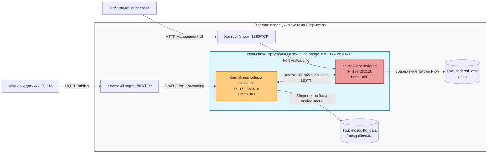

# Лабораторна робота № 8. Контейнеризація в Інтернеті речей: встановлення Docker та розгортання сервісів Mosquitto і Node-RED за допомогою Docker Compose

**Мета:** Дослідити концепцію системної віртуалізації на рівні операційної системи, опанувати технології контейнеризації на базі Docker для задач граничних обчислень (Edge Computing), набути практичних навичок інсталяції та конфігурування середовища Docker Engine і Docker Compose у середовищі Linux, а також реалізувати автоматизоване розгортання, мережеву інтеграцію та верифікацію взаємодії базових IoT-сервісів: брокера повідомлень Eclipse Mosquitto (протокол MQTT) та платформи візуального програмування потоків даних Node-RED.

**Стек технологій та інструменти:**
* **Мова програмування / Середовище:** Інтерпретатор командного рядка Linux Bash, мова опису конфігурацій YAML, мова програмування JavaScript (Node.js runtime всередині контейнера Node-RED).
* **Платформа / Бібліотеки / Модулі:** Середовище контейнеризації Docker Engine (версія 24.0 або вище), оркестратор Docker Compose v2, офіційні контейнерні образи `eclipse-mosquitto:2.0` та `nodered/node-red:latest`, утиліти тестування протоколу MQTT (`mosquitto-clients`).
* **Інструменти розробки:** Операційна система Linux (Ubuntu 22.04/24.04 LTS або Debian 12 / віртуальна машина VirtualBox / середовище WSL2), консольний редактор `nano` або `vim`, вебоглядач для доступу до графічного інтерфейсу Node-RED.

---

## 1 Теоретичні відомості

У сучасних розподілених архітектурах Інтернету речей критично важливу роль відіграє парадигма туманних (Fog) та граничних (Edge) обчислень. Перенесення функцій первинної обробки, агрегації, фільтрації та маршрутизації даних безпосередньо на граничні шлюзи (Edge Gateways) дозволяє суттєво розвантажити магістральні канали зв'язку, мінімізувати мережеві затримки та забезпечити автономне функціонування системи у разі втрати зв'язку з глобальною хмарою. Традиційні методи розгортання програмного забезпечення безпосередньо в хостовій операційній системі стикаються з проблемами несумісності бібліотек, складністю масштабування та високим ризиком взаємного впливу процесів. 

Застосування повної апаратної віртуалізації (Hypervisors Type-1 або Type-2) на малопотужних граничних пристроях є економічно та технологічно недоцільним через значні накладні витрати на емуляцію апаратного забезпечення та дублювання ядер гостьових операційних систем. Альтернативою виступає легковажна віртуалізація на рівні ядра операційної системи — технологія контейнеризації, лідером якої є платформа Docker.

Контейнеризація забезпечує повну ізоляцію процесів за рахунок використання двох базових механізмів ядра Linux: просторів імен (Namespaces) та контрольних груп (Control Groups, cgroups). Простори імен ізолюють системні ресурси (таблиці процесів `PID`, мережеві інтерфейси `NET`, точки монтування файлових систем `MNT`, міжпроцесорну взаємодію `IPC`, імена хостів `UTS` та облікові записи користувачів `USER`), створюючи для процесу ілюзію роботи на виділеній машині. Контрольні групи дозволяють жорстко лімітувати та контролювати обсяг виділеної оперативної пам'яті, процесорного часу та операцій дискового вводу-виводу для кожного окремого контейнера.

```mermaid
graph TB
    subgraph Hypervisor_Arch [Традиційна віртуалізація: Hypervisor Type-2]
        App1[IoT Додаток A]
        App2[IoT Додаток B]
        Bins1[Бібліотеки / Залежності]
        Bins2[Бібліотеки / Залежності]
        GuestOS1[Гостьова ОС 1]
        GuestOS2[Гостьова ОС 2]
        Hyper[Гіпервізор: VirtualBox]
        HostOS1[Хостова ОС Linux]
        HW1[Апаратне забезпечення Edge-вузла]

        App1 --> Bins1 --> GuestOS1 --> Hyper
        App2 --> Bins2 --> GuestOS2 --> Hyper
        Hyper --> HostOS1 --> HW1
    end

    subgraph Container_Arch [Контейнеризація: Docker Engine]
        C_App1[Сервіс: Mosquitto MQTT]
        C_App2[Сервіс: Node-RED Flow]
        C_Bins1[Бібліотеки Alpine/Debian]
        C_Bins2[Бібліотеки Node.js]
        Docker[Docker Engine: containerd / runc]
        HostOS2[Хостове ядро Linux: Namespaces + cgroups]
        HW2[Апаратне забезпечення Edge-вузла]

        C_App1 --> C_Bins1 --> Docker
        C_App2 --> C_Bins2 --> Docker
        Docker --> HostOS2 --> HW2
    end

    style Hypervisor_Arch fill:#f9f9f9,stroke:#666,stroke-width:1px
    style Container_Arch fill:#e8f4f8,stroke:#006699,stroke-width:2px
    style Docker fill:#0099cc,stroke:#003366,stroke-width:2px,color:#fff
```


*Рисунок 1 — Порівняльна архітектура апаратної віртуалізації та контейнеризації на базі Docker Engine*

Архітектурні відмінності, продемонстровані на рисунку 1, пояснюють переваги контейнерів для систем Інтернету речей. Завдяки відсутності проміжного прошарку гостьових операційних систем контейнери стартують практично миттєво та споживають у десятки разів менше системної пам'яті.

Математична модель споживання оперативної пам'яті для системи із $N$ ізольованих IoT-сервісів у випадку контейнеризації описується виразом:

$$M_{\text{docker}} = M_{\text{host\_kernel}} + \sum_{i=1}^{N} \left( M_{\text{app}, i} + M_{\text{libs}, i} \right) + \delta_{\text{daemon}}$$

де $M_{\text{host\_kernel}}$ — обсяг пам'яті, що займає базове ядро хостової операційної системи (МБ);  
$M_{\text{app}, i}$ — безпосередній робочий набір пам'яті $i$-го прикладного сервісу (МБ);  
$M_{\text{libs}, i}$ — обсяг розділюваних або специфічних системних бібліотек середовища виконання $i$-го сервісу (МБ);  
$\delta_{\text{daemon}}$ — накладні витрати на функціонування системного демона контейнеризації Docker/containerd (МБ).

Для порівняння, аналогічна система, побудована на базі віртуальних машин під управлінням гіпервізора, вимагає суттєво більшого обсягу пам'яті:

$$M_{\text{hypervisor}} = M_{\text{host\_OS}} + M_{\text{VMM}} + \sum_{i=1}^{N} \left( M_{\text{guest\_kernel}, i} + M_{\text{guest\_services}, i} + M_{\text{app}, i} + M_{\text{libs}, i} \right)$$

де $M_{\text{host\_OS}}$ — повний обсяг хостової операційної системи з графічним та сервісним оточенням (МБ);  
$M_{\text{VMM}}$ — накладні витрати монітора віртуальних машин (гіпервізора) (МБ);  
$M_{\text{guest\_kernel}, i}$ — обсяг пам'яті, що виділяється під ядро $i$-ї гостьової операційної системи (МБ);  
$M_{\text{guest\_services}, i}$ — фонові системні процеси та демони $i$-ї гостьової операційної системи (МБ).

Час холодного запуску контейнерного сервісу ($T_{\text{start\_cont}}$) залежить лише від тривалості системних викликів ядра щодо виділення просторів імен:

$$T_{\text{start\_cont}} = t_{\text{fork}} + t_{\text{clone\_ns}} + t_{\text{cgroup\_init}} + t_{\text{exec\_app}} \approx 10^{-1} \dots 10^{0} \text{ с}$$

де $t_{\text{fork}}$ — системний час створення дескриптора нового процесу в таблиці ОС (с);  
$t_{\text{clone\_ns}}$ — тривалість створення ізольованих просторів імен за допомогою системного виклику `clone()` (с);  
$t_{\text{cgroup\_init}}$ — час накладання обмежень контрольних груп на підсистеми CPU та RAM (с);  
$t_{\text{exec\_app}}$ — час ініціалізації коду прикладного бінарного файлу сервісу (с).

Для організації багатовузлових IoT-додатків використовується інструмент декларативної оркестрації Docker Compose. Він дозволяє описати весь стек технологій (брокери, бази даних, шлюзи, аналітичні платформи), правила їхньої взаємної мережевої взаємодії, точки постійного зберігання даних (Persistent Volumes) та обмеження ресурсів у єдиному файлі формату YAML (`docker-compose.yml`).


*Рисунок 2 — Схема мережевої та дискової інтеграції контейнерного стеку Mosquitto та Node-RED у Docker Compose*

Принцип функціонування стеку, зображеного на рисунку 2, ґрунтується на повній ізоляції трафіку всередині користувацької віртуальної мережі типу Bridge. Хостові порти перенаправляються за допомогою механізму DNAT (Destination Network Address Translation) підсистеми `iptables` ядра Linux. Дані зберігаються на хостових накопичувачах завдяки прив'язкам томів (Volumes), що виключає втрату телеметрії або логіки автоматизацій під час перезапуску або оновлення версій контейнерів.

---

## 2 Підготовка середовища та розгортання проєкту (Крок 0)

Для підготовки робочого середовища необхідно інсталювати платформу Docker Engine, системний плагін Docker Compose, налаштувати права доступу користувача та розгорнути коректне дерево директорій для проєкту.

1. Відкрийте термінал операційної системи Linux і виконайте оновлення індексу системних пакетів, а також інсталяцію базових залежностей:

```bash
# Оновлення індексу репозиторіїв
sudo apt-get update -y

# Встановлення допоміжних системних утиліт для роботи через HTTPS
sudo apt-get install -y ca-certificates curl gnupg lsb-release mosquitto-clients
```

2. Додайте офіційний GPG-ключ репозиторію Docker для верифікації цифрових підписів пакетів:

```bash
# Створення системної директорії для ключів
sudo install -m 0755 -d /etc/apt/keyrings

# Завантаження та збереження офіційного GPG ключа Docker
curl -fsSL https://download.docker.com/linux/ubuntu/gpg | sudo gpg --dearmor -o /etc/apt/keyrings/docker.gpg
sudo chmod a+r /etc/apt/keyrings/docker.gpg
```

3. Підключіть стабільний офіційний репозиторій Docker до списку джерел пакетного менеджера APT:

```bash
# Додавання репозиторію Docker до конфігурації APT
echo \
  "deb [arch="$(dpkg --print-architecture)" signed-by=/etc/apt/keyrings/docker.gpg] https://download.docker.com/linux/ubuntu \
  "$(. /etc/os-release && echo "$VERSION_CODENAME")" stable" | \
  sudo tee /etc/apt/sources.list.d/docker.list > /dev/null

# Повторне оновлення бази пакетів із підключеного репозиторію
sudo apt-get update -y
```

4. Виконайте інсталяцію компонентів середовища контейнеризації Docker Engine та оркестратора Docker Compose:

```bash
# Встановлення Docker Engine, демона containerd та compose-плагіна
sudo apt-get install -y docker-ce docker-ce-cli containerd.io docker-buildx-plugin docker-compose-plugin
```

5. Додайте поточного облікового запису користувача до системної групи `docker` для забезпечення можливості виконання команд без префікса `sudo`:

```bash
# Додавання користувача до групи docker
sudo usermod -aG docker $USER
```

*Примітка: Після виконання команди необхідно перезайти у сеанс користувача або виконати команду `newgrp docker` для застосування оновлених прав доступу.*

6. Перевірте працездатність встановленого середовища та версії компонентів:

```bash
# Перевірка версії Docker Engine
docker --version

# Перевірка версії Docker Compose
docker compose version

# Контроль статусу системної служби демона Docker
systemctl is-active docker
```

7. Створіть структуру каталогів лабораторного проєкту для забезпечення ізольованого зберігання конфігураційних файлів та постійних даних контейнерів:

```bash
# Створення кореневого та вкладених каталогів проекту
mkdir -p ~/iot_stack/mosquitto/{config,data,log}
mkdir -p ~/iot_stack/nodered/data

# Перехід у робочу директорію
cd ~/iot_stack
```

Структура файлової системи розгорнутого проєкту повинна мати наступний вигляд:

```text
/home/user/iot_stack/
├── docker-compose.yml           # Головний маніфест декларативної оркестрації сервісів
├── mosquitto/
│   ├── config/
│   │   └── mosquitto.conf       # Конфігураційний файл брокера Eclipse Mosquitto
│   ├── data/                    # Каталог збереження бази даних повідомлень (persistence)
│   └── log/                     # Журнали подій та системні логи брокера
└── nodered/
    └── data/                    # Каталог файлів потоків (flows.json), налаштувань та вузлів
```

8. Налаштуйте права доступу до створених каталогів, щоб внутрішні процеси контейнерів (які працюють під специфічними системними ідентифікаторами `UID 1883` для Mosquitto та `UID 1000` для Node-RED) мали змогу записувати дані на диск:

```bash
# Надання прав на запис у директорії даних та логів
sudo chmod -R 777 ~/iot_stack/mosquitto/data ~/iot_stack/mosquitto/log
sudo chmod -R 777 ~/iot_stack/nodered/data
```

---

## 3 Порядок виконання роботи

### 3.1 Індивідуальні завдання

Кожен здобувач вищої освіти розгортає власний контейнеризований IoT-стек із параметрами, вказаними у відповідному варіанті. Конфігурація передбачає налаштування індивідуальної адресації віртуальної підмережі, виділення лімітів обчислювальних ресурсів та перенаправлення нестандартних зовнішніх портів.

| Варіант | Префікс імен сервісів | Хостовий порт MQTT | Хостовий порт Node-RED | Віртуальна підмережа Docker Bridge | Ліміт CPU / RAM на сервіс | Індивідуальний топік моніторингу |
| :---: | :--- | :---: | :---: | :--- | :--- | :--- |
| **1** | `iot_var01` | 1883 | 1880 | `172.28.1.0/24` | 0.5 CPU / 256 MB | `plant1/sensor/temperature` |
| **2** | `iot_var02` | 1884 | 1881 | `172.28.2.0/24` | 0.5 CPU / 256 MB | `warehouse/climate/humidity` |
| **3** | `iot_var03` | 1885 | 1882 | `172.28.3.0/24` | 0.75 CPU / 512 MB | `smart_grid/station4/voltage` |
| **4** | `iot_var04` | 1886 | 1883 | `172.28.4.0/24` | 0.5 CPU / 256 MB | `greenhouse/zone2/soil_moisture`|
| **5** | `iot_var05` | 1887 | 1884 | `172.28.5.0/24` | 1.0 CPU / 512 MB | `boiler/line1/pressure` |
| **6** | `iot_var06` | 1888 | 1885 | `172.28.6.0/24` | 0.5 CPU / 256 MB | `security/gate/rfid_status` |
| **7** | `iot_var07` | 1889 | 1886 | `172.28.7.0/24` | 0.75 CPU / 512 MB | `solar_panel/inverter/power` |
| **8** | `iot_var08` | 1890 | 1887 | `172.28.8.0/24` | 0.5 CPU / 256 MB | `city_lighting/sectorB/lux` |
| **9** | `iot_var09` | 1891 | 1888 | `172.28.9.0/24` | 1.0 CPU / 512 MB | `datacenter/rack3/thermal` |
| **10** | `iot_var10` | 1892 | 1889 | `172.28.10.0/24` | 0.5 CPU / 256 MB | `hospital/ward12/spo2` |
| **11** | `iot_var11` | 1893 | 1890 | `172.28.11.0/24` | 0.75 CPU / 512 MB | `water_station/tank1/level` |
| **12** | `iot_var12` | 1894 | 1891 | `172.28.12.0/24` | 0.5 CPU / 256 MB | `cnc_machine/spindle/vibration` |
| **13** | `iot_var13` | 1895 | 1892 | `172.28.13.0/24` | 1.0 CPU / 512 MB | `poultry/hall1/ammonia_nh3` |
| **14** | `iot_var14` | 1896 | 1893 | `172.28.14.0/24` | 0.5 CPU / 256 MB | `smart_parking/slot45/status` |
| **15** | `iot_var15` | 1897 | 1894 | `172.28.15.0/24` | 0.75 CPU / 512 MB | `weather/station/barometer` |
| **16** | `iot_var16` | 1898 | 1895 | `172.28.16.0/24` | 0.5 CPU / 256 MB | `waste_box/bin8/fill_percent` |
| **17** | `iot_var17` | 1899 | 1896 | `172.28.17.0/24` | 1.0 CPU / 512 MB | `chemical_lab/fume_hood/flow` |
| **18** | `iot_var18` | 1900 | 1897 | `172.28.18.0/24` | 0.5 CPU / 256 MB | `refrigeration/unit2/co2_level` |
| **19** | `iot_var19` | 1901 | 1898 | `172.28.19.0/24` | 0.75 CPU / 512 MB | `air_defense/shelter/radiation` |
| **20** | `iot_var20` | 1902 | 1899 | `172.28.20.0/24` | 1.0 CPU / 512 MB | `robot_arm/joint1/current` |

---

### 3.2 Покроковий алгоритм та розв'язок еталонного прикладу

Як еталонний приклад виконується розгортання та взаємна інтеграція стеку **«Базовий IoT-контур Edge-вузла»** на базі брокера Eclipse Mosquitto версії 2.0 та середовища Node-RED.

Параметри еталонного прикладу:
* Префікс імен сервісів: `master_iot`
* Зовнішній порт MQTT: `1883`
* Зовнішній порт Node-RED Web UI: `1880`
* Назва віртуальної мережі Docker: `iot_production_net`
* Адресація підмережі: `172.30.0.0/16`
* Статична IP-адреса контейнера Mosquitto: `172.30.0.10`
* Статична IP-адреса контейнера Node-RED: `172.30.0.20`
* Обмеження ресурсів: максимум 1.0 ядра CPU та 512 МБ оперативної пам'яті для кожного контейнера.

#### Крок 1. Створення конфігураційного файлу брокера Mosquitto

У версії Eclipse Mosquitto 2.0 і вище обов'язковою вимогою є явне налаштування мережевих слухачів (listeners) та політики автентифікації.

Створіть файл конфігурації за допомогою текстового редактора `nano`:

```bash
nano ~/iot_stack/mosquitto/config/mosquitto.conf
```

Внесіть у файл наступний повний текст конфігурації:

```conf
# =====================================================================
# КОНФІГУРАЦІЯ СЛУХАЧІВ ТА МЕРЕЖІ БРОКЕРА ECLIPSE MOSQUITTO
# =====================================================================

# Відкриття мережевого порта 1883 на всіх мережевих інтерфейсах
listener 1883 0.0.0.0

# Дозвіл на підключення клієнтів без передачі логіна і пароля (для лабораторного середовища)
allow_anonymous true

# =====================================================================
# НАЛАШТУВАННЯ ПОСТІЙНОГО ЗБЕРІГАННЯ ДАНИХ (PERSISTENCE)
# =====================================================================

# Увімкнення збереження бази даних повідомлень на енергонезалежний накопичувач
persistence true

# Шлях всередині контейнера до каталогу збереження бази
persistence_location /mosquitto/data/

# =====================================================================
# НАЛАШТУВАННЯ ЖУРНАЛЮВАННЯ ТА ЛОГІВ
# =====================================================================

# Виведення інформаційних логів у файл журналу
log_dest file /mosquitto/log/mosquitto.log

# Дублювання системних повідомлень брокера у стандартний консольний потік
log_dest stdout

# Типи подій, що підлягають фіксації в журналі
log_type error
log_type warning
log_type notice
log_type information

# Формат відображення часу в системних повідомленнях
log_timestamp true
log_timestamp_format %Y-%m-%dT%H:%M:%S
```

Збережіть файл (`Ctrl+O`, `Enter`) та вийдіть із редактора (`Ctrl+X`).

#### Крок 2. Розробка оркестраційного маніфесту docker-compose.yml

Створіть головний файл конфігурації сервісів у кореневій директорії проєкту:

```bash
nano ~/iot_stack/docker-compose.yml
```

Внесіть повністю наступний код маніфесту без скорочень:

```yaml
version: '3.8'

# =====================================================================
# ВИЗНАЧЕННЯ КОНТЕЙНЕРИЗОВАНИХ СЕРВІСІВ IOT СТЕКУ
# =====================================================================
services:

  # -------------------------------------------------------------------
  # СЕРВІС 1: БРОКЕР ПОВІДОМЛЕНЬ ECLIPSE MOSQUITTO (MQTT)
  # -------------------------------------------------------------------
  mqtt-broker:
    image: eclipse-mosquitto:2.0
    container_name: master_iot_mosquitto
    restart: unless-stopped
    ports:
      # Прокидання стандартного порта MQTT з хоста в контейнер
      - "1883:1883"
    volumes:
      # Монтування локальних каталогів хоста всередину контейнера
      - ./mosquitto/config/mosquitto.conf:/mosquitto/config/mosquitto.conf:ro
      - ./mosquitto/data:/mosquitto/data
      - ./mosquitto/log:/mosquitto/log
    networks:
      iot_production_net:
        ipv4_address: 172.30.0.10
    deploy:
      resources:
        limits:
          cpus: '1.0'
          memory: 512M
    healthcheck:
      test: ["CMD-SHELL", "mosquitto_sub -t '$$SYS/broker/version' -C 1 -i healthcheck_probe || exit 1"]
      interval: 15s
      timeout: 5s
      retries: 3
      start_period: 5s

  # -------------------------------------------------------------------
  # СЕРВІС 2: СЕРЕДОВИЩЕ ОБРОБКИ ПОТОКІВ ДАНИХ NODE-RED
  # -------------------------------------------------------------------
  nodered-engine:
    image: nodered/node-red:latest
    container_name: master_iot_nodered
    restart: unless-stopped
    depends_on:
      mqtt-broker:
        condition: service_healthy
    ports:
      # Прокидання веб-інтерфейсу Node-RED
      - "1880:1880"
    environment:
      # Налаштування часового поясу для точної часової мітки телеметрії
      - TZ=Europe/Kyiv
      - NODE_OPTIONS=--max-old-space-size=256
    volumes:
      # Постійне сховище для конфігурацій та потоків Node-RED
      - ./nodered/data:/data
    networks:
      iot_production_net:
        ipv4_address: 172.30.0.20
    deploy:
      resources:
        limits:
          cpus: '1.0'
          memory: 512M
    healthcheck:
      test: ["CMD-SHELL", "curl -f http://localhost:1880/ || exit 1"]
      interval: 30s
      timeout: 10s
      retries: 3
      start_period: 10s

# =====================================================================
# ОПИС ВІРТУАЛЬНИХ МЕРЕЖ ДЛЯ ІЗОЛЯЦІЇ СЕРВІСІВ
# =====================================================================
networks:
  iot_production_net:
    name: iot_production_net
    driver: bridge
    ipam:
      driver: default
      config:
        - subnet: 172.30.0.0/16
          gateway: 172.30.0.1
```

Збережіть файл (`Ctrl+O`, `Enter`) та вийдіть із редактора (`Ctrl+X`).

#### Крок 3. Запуск контейнерного стеку

Виконайте запуск описаної мультиконтейнерної інфраструктури у фоновому режимі (detached mode):

```bash
# Завантаження образів та запуск контейнерів
docker compose up -d
```

---

### 3.3 Запуск, тестування та перевірка результатів

1. Перевірте поточний статус розгорнутих контейнерів, статус проходження перевірок працездатності (Healthchecks) та призначені порти:

```bash
# Перевірка стану роботи контейнерів стеку
docker compose ps
```

#### Приклад очікуваного термінального виводу `docker compose ps`:

```text
NAME                   IMAGE                    COMMAND                  SERVICE          CREATED          STATUS                    PORTS
master_iot_mosquitto   eclipse-mosquitto:2.0    "/docker-entrypoint.…"   mqtt-broker      20 seconds ago   Up 19 seconds (healthy)   0.0.0.0:1883->1883/tcp, :::1883->1883/tcp
master_iot_nodered     nodered/node-red:latest  "./entrypoint.sh"        nodered-engine   20 seconds ago   Up 18 seconds (healthy)   0.0.0.0:1880->1880/tcp, :::1880->1880/tcp
```

2. Виконайте моніторинг споживання оперативної пам'яті та процесорного часу працюючими контейнерами для підтвердження математичної моделі легковажності віртуалізації:

```bash
# Отримання миттєвого звіту утилізації ресурсів
docker stats --no-stream
```

#### Приклад очікуваного виводу системних ресурсів:

```text
CONTAINER ID   NAME                   CPU %     MEM USAGE / LIMIT   MEM %     NET I/O          BLOCK I/O        PIDS
a1b2c3d4e5f6   master_iot_mosquitto   0.05%     4.12MiB / 512MiB    0.80%     1.2kB / 850B     0B / 16.4kB      1
f6e5d4c3b2a1   master_iot_nodered     0.42%     58.34MiB / 512MiB   11.40%    2.4kB / 1.8kB    12.3MB / 0B      11
```

*Аналітичний коментар:* Результати вимірювань підтверджують, що обидва повноцінно функціонуючі промислові IoT-сервіси сумарно займають менше 65 МБ оперативної пам'яті, що є недосяжним показником для систем на базі гіпервізорів.

3. Проведіть верифікацію роботи брокера MQTT за допомогою термінальних утиліт публікації та підписки.

Відкрийте перше термінальне вікно та запустіть процес прослуховування топіка:

```bash
# Підписка на топік телеметрії всередині створеного брокера
mosquitto_sub -h 127.0.0.1 -p 1883 -t "master_iot/telemetry/#" -v
```

Відкрийте друге термінальне вікно та здійсніть публікацію тестового телеметричного пакету:

```bash
# Публікація JSON-структури у топік датчика
mosquitto_pub -h 127.0.0.1 -p 1883 -t "master_iot/telemetry/temp_sensor" -m '{"sensor_id": "ESP32_01", "temperature": 24.85, "unit": "Celsius", "status": "OK"}'
```

У першому терміналі має миттєво з'явитися прийняте повідомлення:

```text
master_iot/telemetry/temp_sensor {"sensor_id": "ESP32_01", "temperature": 24.85, "unit": "Celsius", "status": "OK"}
```

4. Виконайте налаштування інтеграційного потоку в Node-RED:
   * Відкрийте вебоглядач та перейдіть за адресою `http://localhost:1880` (або `http://<IP_адреса_сервера>:1880`);
   * Перетягніть із лівої панелі вузол **mqtt in** на робоче поле;
   * Двічі натисніть на доданий вузол, у полі **Server** оберіть *Add new mqtt-broker* та вкажіть адресу брокера: `172.30.0.10` (внутрішня IP-адреса або мережеве ім'я `mqtt-broker`), порт `1883`;
   * У полі **Topic** вкажіть: `master_iot/telemetry/#`;
   * Перетягніть вузол **function**, з'єднайте його вхід із виходом вузла *mqtt in*, та вставте наступний JavaScript-код:

```javascript
// Розпакування отриманого корисного навантаження JSON
var telemetryData = JSON.parse(msg.payload);

// Додавання мітки часу обробки на Edge-рівні
telemetryData.processed_by = "NodeRED_Edge_Engine";
telemetryData.processed_at = new Date().toISOString();

// Конвертація температури у шкалу Кельвіна
if (telemetryData.temperature) {
    telemetryData.temp_kelvin = (telemetryData.temperature + 273.15).toFixed(2);
}

// Формування вихідного повідомлення
msg.payload = telemetryData;
return msg;
```

   * Перетягніть вузол **debug**, з'єднайте його з виходом вузла *function*;
   * Натисніть червону кнопку **Deploy** у правому верхньому кутку;
   * Надішліть повторно повідомлення через `mosquitto_pub` та зафіксуйте оброблений JSON у вкладці *Debug messages* інтерфейсу Node-RED.

---

## 4 Вимоги до змісту звіту

Звіт з лабораторної роботи оформлюється у друкованому або електронному вигляді відповідно до стандарту ДСТУ 3008:2015 і повинен містити такі обов'язкові елементи:

1. **Титульна сторінка** за встановленим університетським зразком із зазначенням кафедри, дисципліни, номера роботи, варіанта, академічної групи та ПІБ студента.
2. **Формулювання мети роботи** та коротке теоретичне обґрунтування застосування контейнеризації в IoT-системах.
3. **Індивідуальне завдання** згідно із закріпленим варіантом (назва сервісів, виділені порти, адреса підмережі, ліміти ресурсів).
4. **Лістинг конфігураційного файлу** `mosquitto.conf` із детальними поясненнями параметрів слухачів та журналювання.
5. **Повний лістинг оркестраційного маніфесту** `docker-compose.yml` з коментарями щодо правил прокидання портів, мостів та монтування томів.
6. **Графічні матеріали та скріншоти тестування:**
   * Результат виконання команди `docker compose ps` із відображенням стану `(healthy)`;
   * Результат виконання команди `docker stats` із підтвердженням дотримання виділених лімітів пам'яті;
   * Скріншот термінального обміну повідомленнями між утилітами `mosquitto_sub` та `mosquitto_pub`;
   * Скріншот робочого простору Node-RED зі створеним потоком та вікном налагодження (Debug panel).
7. **Аналітичні висновки**, у яких проведено порівняння контейнеризації з повною віртуалізацією, проаналізовано надійність роботи механізму Persistent Volumes при перезапуску контейнерів та оцінено ресурсоємність розгорнутого стеку.

---

## 5 Контрольні запитання для захисту роботи

1. **Які системні механізми ядра Linux забезпечують ізоляцію процесів у контейнерах Docker?** Поясніть різницю між функціональним призначенням просторів імен (Namespaces) та контрольних груп (cgroups).
2. **Чим обумовлена висока ефективність використання контейнерів на граничних IoT-шлюзах (Edge Gateways) у порівнянні з гіпервізорами типу VirtualBox або VMware?**
3. **Яке призначення виконують директиви `volumes` у маніфесті Docker Compose?** Що станеться з налаштуваннями потоків Node-RED та базою збережених повідомлень Mosquitto після виконання команди `docker compose down`, якщо дані каталоги не були змонтовані на хост?
4. **Опишіть мережеву модель `bridge` у Docker.** Яким чином контейнери знаходять один одного за іменем сервісу всередині спільної віртуальної мережі без використання статичних IP-адрес?
5. **Поясніть призначення та структуру блоку `healthcheck` у файлі `docker-compose.yml`.** Чому директива `depends_on` у промислових конфігураціях повинна контролювати саме стан `service_healthy`, а не просто факт запуску контейнера?
6. **Які заходи безпеки необхідно реалізувати при переході від тестового розгортання брокера Mosquitto до промислової експлуатації (Production)?** Як обмежити доступ неавторизованих пристроїв та увімкнути шифрування трафіку TLS/SSL?