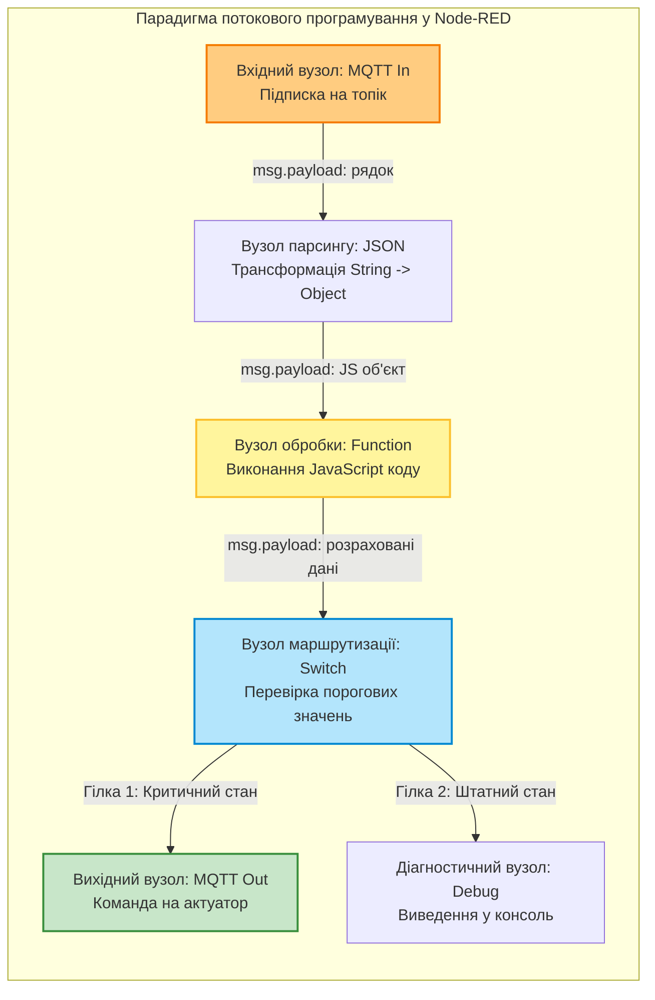
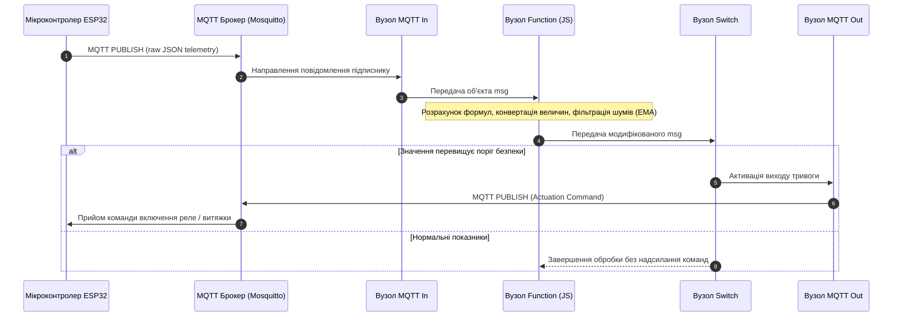

# Лабораторна робота № 9. Проміжне програмне забезпечення Інтернету речей: візуальне програмування потоків обробки даних у середовищі Node-RED та інтеграція з MQTT

**Мета:** Опанувати концепцію потокового програмування (Flow-Based Programming, FBP) для побудови проміжного програмного забезпечення (Middleware) систем Інтернету речей, набути практичних навичок роботи з середовищем Node-RED, реалізувати прийом та валідацію телеметричних пакетів формату JSON від мікроконтролерних вузлів через протокол MQTT, розробити алгоритми обробки, фільтрації, математичної конвертації фізичних величин мовою JavaScript у вузлах Function Node, а також налаштувати умовну маршрутизацію керуючих впливів на актуатори.

**Стек технологій та інструменти:**
* **Мова програмування / Середовище:** Мова програмування JavaScript (стандарт ECMAScript 2020+), середовище виконання Node.js (LTS), структурований формат представлення даних JSON, інтерпретатор командного рядка Linux Bash.
* **Платформа / Бібліотеки / Модулі:** Середовище візуального проектування Node-RED (версія 3.1 або вище), брокер повідомлень Eclipse Mosquitto, базові вузли палітри Node-RED (`mqtt in`, `mqtt out`, `json`, `function`, `switch`, `change`, `debug`), утиліти тестування `mosquitto-clients`.
* **Інструменти розробки:** Вебоглядач для взаємодії з графічним редактором Node-RED Flow Editor, емулятор термінала операційної системи Linux/Windows, консольний текстовий редактор.

---

## 1 Теоретичні відомості

У складних розподілених системах Інтернету речей особливе місце посідає рівень проміжного програмного забезпечення (Middleware), який ліквідує розрив між гетерогенними апаратними платформами граничного рівня (Edge) та високорівневими сервісами збереження й візуалізації даних (Cloud/Enterprise). Основним завданням Middleware є нормалізація потоків даних, приведення різнорідних протоколів до єдиного формату, фільтрація шумів та первинне прийняття рішень безпосередньо в процесі передачі інформації.

Одним із найбільш ефективних інструментів для реалізації IoT Middleware є середовище Node-RED, розроблене на базі парадигми потокового програмування (Flow-Based Programming, FBP). У межах цього підходу додаток представляється у вигляді орієнтованого графа, вершинами якого є функціональні блоки (вузли, Nodes), а ребрами — канали передачі повідомлень (зв'язки, Wires). Обмін даними між вузлами здійснюється за допомогою дискретних інформаційних об'єктів — повідомлень `msg`, які передаються за подійно-орієнтованим принципом (Event-Driven Architecture) завдяки неблокуючій моделі вводу-виводу платформи Node.js.


*Рисунок 1 — Структурна схема графа обробки інформаційного повідомлення у середовищі Node-RED*

Кожне повідомлення у системі Node-RED є стандартним об'єктом JavaScript, кореневими властивостями якого є `msg._msgid` (унікальний системний ідентифікатор події), `msg.topic` (назва каналу або MQTT-топіка, звідки надійшли дані) та `msg.payload` (безпосереднє корисне навантаження повідомлення). При взаємодії з мікроконтролерами ESP32 або Arduino корисне навантаження зазвичай передається у вигляді текстового рядка, що містить серіалізований JSON-документ. Вузол `JSON` десеріалізує цей рядок у повноцінний об'єкт, надаючи доступ до окремих фізичних параметрів датчиків за їхніми ключами (`msg.payload.temperature`, `msg.payload.humidity`).

Для виконання довільних математичних та логічних перетворень використовується вузол `Function`, всередині якого виконується ізольований блок коду мовою JavaScript. Окрім обробки даних поточного повідомлення, цей вузол має доступ до механізмів контекстного збереження стану:
* контекст вузла (`context`) зберігає змінні, доступні виключно поточному функціональному блоку між послідовними викликами;
* контекст потоку (`flow`) забезпечує розділення даних між усіма вузлами, розташованими на поточній вкладці робочого простору;
* глобальний контекст (`global`) надає спільний доступ до змінних для абсолютно всіх потоків у системі.


*Рисунок 2 — Діаграма послідовності інформаційних потоків у контурі моніторингу та керування*

У практичних задачах IoT дані датчиків часто містять високочастотні шуми, спричинені електромагнітними завадами або нестабільністю живлення. Для їх згладжування на рівні Middleware застосовують алгоритм експоненційного ковзного середнього (Exponential Moving Average, EMA), який рекурсивно розраховує нове значення на основі попереднього згладженого результату та поточного вимірювання:

$$S_t = \alpha \cdot X_t + (1 - \alpha) \cdot S_{t-1}$$

де $S_t$ — згладжене значення фізичної величини у поточний момент часу $t$;  
$X_t$ — сире (необроблене) вимірювання, отримане від сенсора в момент часу $t$;  
$S_{t-1}$ — згладжене значення фізичної величини, обчислене на попередньому кроці вимірювання;  
$\alpha$ — безрозмірний коефіцієнт згладжування, що лежить у діапазоні $0 < \alpha \le 1$ (чим менше значення $\alpha$, тим сильніше пригнічуються шуми, але зростає динамічне запізнення реакції системи).

Конвертація температури зі шкали Цельсія у шкалу Фаренгейта здійснюється за лінійною математичною залежністю:

$$T_F = \left( T_C \cdot \frac{9}{5} \right) + 32$$

де $T_F$ — температура за шкалою Фаренгейта ($^\circ\text{F}$);  
$T_C$ — температура за шкалою Цельсія ($^\circ\text{C}$).

Для розрахунку абсолютної температури за термодинамічною шкалою Кельвіна використовується формула:

$$T_K = T_C + 273.15$$

де $T_K$ — термодинамічна температура за шкалою Кельвіна ($\text{K}$).

Розрахунок температури точки роси ($T_d$), яка характеризує температуру, до якої повинно охолонути повітря при даній вологості для випадання конденсату, апроксимується за формулою Магнуса-Тетенса:

$$\gamma(T_C, RH) = \frac{a \cdot T_C}{b + T_C} + \ln\left(\frac{RH}{100}\right)$$

$$T_d = \frac{b \cdot \gamma(T_C, RH)}{a - \gamma(T_C, RH)}$$

де $RH$ — відносна вологість повітря, виражена у відсотках ($\%$);  
$a$ та $b$ — емпіричні коефіцієнти апроксимації (для діапазону температур $0 \dots 60^\circ\text{C}$ приймаються значення $a = 17.27$, $b = 237.7^\circ\text{C}$).

---

## 2 Підготовка середовища та розгортання проєкту (Крок 0)

Перед початком виконання практичної частини необхідно запустити середовище Node-RED та переконатися у доступності брокера MQTT Eclipse Mosquitto, розгорнутого у попередній лабораторній роботі.

1. Запустіть термінал операційної системи Linux та перейдіть до робочого каталогу проєкту:

```bash
cd ~/iot_stack
```

2. Якщо стек контейнерів зупинено, запустіть його у фоновому режимі за допомогою Docker Compose:

```bash
# Запуск контейнерів Mosquitto та Node-RED
docker compose up -d

# Контроль працездатності та стану контейнерів
docker compose ps
```

3. У разі локального запуску Node-RED без використання Docker перевірте версії інстальованих пакетів та запустіть сервіс вручну:

```bash
# Перевірка версії Node.js та NPM
node -v
npm -v

# Запуск локального екземпляра Node-RED
node-red
```

4. Створіть робочу структуру каталогів для збереження експортованих конфігурацій потоків (Flows) та тестових скриптів генерації телеметрії:

```bash
mkdir -p ~/iot_stack/nodered_lab/{flows,scripts,logs}
cd ~/iot_stack/nodered_lab
```

Файлова структура виконаної лабораторної роботи повинна мати такий вигляд:

```text
/home/user/iot_stack/nodered_lab/
├── flows/
│   └── laboratory_flow.json      # Експортований повний JSON-файл потоків Node-RED
├── scripts/
│   └── mock_esp32_publisher.sh   # Bash-скрипт емуляції надсилання телеметрії від ESP32
└── logs/
    └── processed_telemetry.log   # Журнал виведених оброблених повідомлень
```

5. Відкрийте вебоглядач та перейдіть за адресою вебінтерфейсу Node-RED: `http://localhost:1880` (або `http://<IP_адреса_хоста>:1880`). Переконайтеся, що робоче поле редактора завантажується без помилок, а в правій панелі доступні вкладки **Info** та **Debug messages**.

---

## 3 Порядок виконання роботи

### 3.1 Індивідуальні завдання

Кожен здобувач вищої освіти розробляє унікальний потік обробки даних у Node-RED відповідно до свого індивідуального варіанта. Завдання передбачає підписку на вказаний топік MQTT, парсинг JSON-пакета, виконання математичних розрахунків у вузлі `Function`, прийняття рішення у вузлі `Switch` та публікацію результатів в окремий вихідний топік.

| Варіант | Назва системи / Об'єкт | Вхідний MQTT топік | Структура вхідного JSON-пакета | Алгоритм обробки у Function Node (JS) | Цільовий топік для керування |
| :---: | :--- | :--- | :--- | :--- | :--- |
| **1** | Клімат-контроль серверної шафи | `telemetry/server/rack1` | `{"temp_c": float, "humidity": float, "door": bool}` | Конвертація $T_C \to T_F$, розрахунок точки роси $T_d$, згладжування температури ($\alpha=0.3$). Якщо $T_C > 35$ або $door = \text{true}$ $\to$ тривога | `control/server/rack1/alarm` |
| **2** | Моніторинг промислового калорифера | `telemetry/factory/heater` | `{"temp_c": float, "air_flow": float, "power_kw": float}` | Конвертація $T_C \to T_K$, розрахунок питомої теплоємності потоку. Якщо $T_C > 65$ $\to$ зменшити потужність | `control/factory/heater/power` |
| **3** | Автоматизація теплиці | `telemetry/agro/zone3` | `{"soil_temp_c": float, "soil_moisture": float, "lux": int}` | Конвертація $T_C \to T_F$, фільтрація вологості ($\alpha=0.2$). Якщо вологість < 25% та $T_C > 20$ $\to$ увімкнути полив | `control/agro/zone3/pump` |
| **4** | Станція перекачування нафтопродуктів | `telemetry/oil/pump4` | `{"pressure_bar": float, "temp_c": float, "rpm": int}` | Конвертація бар $\to$ PSI ($1 \text{ бар} = 14.5038 \text{ PSI}$), розрахунок гідравлічного фактора. Якщо тиск > 16 бар $\to$ аварійна зупинка | `control/oil/pump4/estop` |
| **5** | Моніторинг вібростійкості ЧПУ | `telemetry/cnc/spindle` | `{"vib_x": float, "vib_y": float, "temp_c": float}` | Розрахунок векторної вібрації $V = \sqrt{x^2+y^2}$, конвертація $T_C \to T_F$. Якщо $V > 4.5 \text{ мм/с}$ $\to$ подати попередження | `control/cnc/spindle/warn` |
| **6** | Розумна зарядка електробусів | `telemetry/ev/charger` | `{"voltage_v": float, "current_a": float, "battery_temp_c": float}` | Розрахунок потужності $P=U \cdot I$ (кВт), конвертація $T_C \to T_K$. Якщо $T_C > 50$ $\to$ знизити струм заряду на 50% | `control/ev/charger/limit` |
| **7** | Сховище медичних вакцин | `telemetry/pharma/freezer` | `{"temp_c": float, "ice_thick_mm": float, "door_open_sec": int}` | Згладжування $T_C$ ($\alpha=0.1$), розрахунок відхилення від уставки $-20^\circ\text{C}$. Якщо $T_C > -15$ або $door > 60$ с $\to$ сирена | `control/pharma/freezer/alert` |
| **8** | Системи сушіння деревини | `telemetry/timber/dryer` | `{"temp_c": float, "humidity": float, "wood_moisture": float}` | Конвертація $T_C \to T_F$, розрахунок швидкості висихання. Якщо вологість повітря > 85% $\to$ увімкнути витяжку | `control/timber/dryer/exhaust` |
| **9** | Сонячна електростанція | `telemetry/solar/panel5` | `{"irradiance_wm2": float, "panel_temp_c": float, "v_out": float}` | Розрахунок ККД панелі з урахуванням температурного коефіцієнта. Якщо $T_C > 70$ $\to$ увімкнути охолодження | `control/solar/panel5/cooling` |
| **10** | Контроль загазованості шахти | `telemetry/mine/shaft2` | `{"methane_percent": float, "co_ppm": float, "temp_c": float}` | Згладжування метану ($\alpha=0.4$), конвертація $T_C \to T_K$. Якщо метан > 1.0% або CO > 50 ppm $\to$ евакуаційна тривога | `control/mine/shaft2/siren` |
| **11** | Автоматизація пивоварного затору | `telemetry/brewery/mash` | `{"temp_c": float, "ph": float, "volume_l": float}` | Конвертація $T_C \to T_F$, розрахунок швидкості нагріву $dT/dt$. Якщо $T_C$ досягла 64.0 $\to$ перехід на паузу паузи оцукрювання | `control/brewery/mash/heater` |
| **12** | Моніторинг чистої кімнати | `telemetry/cleanroom/hvac` | `{"particles_pm25": float, "pressure_pa": float, "temp_c": float}` | Згладжування PM2.5 ($\alpha=0.2$), переведення Па $\to$ мм вод. ст. Якщо PM2.5 > 10 $\to$ увімкнути турборежим HEPA | `control/cleanroom/hvac/hepa` |
| **13** | Контроль автоклава стерилізації | `telemetry/hospital/autoclave` | `{"temp_c": float, "steam_pressure_bar": float, "time_min": int}` | Конвертація $T_C \to T_F$, перевірка відповідності тиску і температури насиченої пари. Якщо $T_C < 121$ $\to$ додати нагрів | `control/hospital/autoclave/valve` |
| **14** | Охолодження компресорної станції | `telemetry/compressor/unit1`| `{"temp_c": float, "oil_pressure_kpa": float, "current_a": float}` | Конвертація кПа $\to$ бар, розрахунок споживаної потужності. Якщо тиск масла < 150 кПа $\to$ аварійне блокування | `control/compressor/unit1/trip` |
| **15** | Розумний елеватор зерна | `telemetry/elevator/silo3` | `{"temp_c": float, "humidity": float, "co2_ppm": float}` | Розрахунок ризику самозаймання зерна за критерієм $T_C$ та CO2. Якщо $T_C > 30$ та CO2 > 1000 ppm $\to$ аерація | `control/elevator/silo3/fan` |
| **16** | Моніторинг силового трансформатора | `telemetry/grid/transformer` | `{"oil_temp_c": float, "ambient_temp_c": float, "load_pct": float}`| Розрахунок перевищення температури масла над середовищем $\Delta T$. Якщо $\Delta T > 55^\circ\text{C}$ $\to$ включити додаткові вентилятори | `control/grid/transformer/fans`|
| **17** | Басейн очищення стічних вод | `telemetry/water/aerotank` | `{"dissolved_oxygen_mg_l": float, "temp_c": float, "ph": float}` | Згладжування рівня кисню ($\alpha=0.3$), конвертація $T_C \to T_F$. Якщо кисень < 2.0 мг/л $\to$ форсувати аератор | `control/water/aerotank/blower` |
| **18** | Контроль параметрів пастеризатора | `telemetry/dairy/pasteur` | `{"temp_c": float, "flow_rate_l_h": float, "turbidity_ntu": float}`| Конвертація $T_C \to T_K$, контроль експозиції пастеризації. Якщо $T_C < 72.0$ $\to$ повернення потоку на рециркуляцію | `control/dairy/pasteur/divert` |
| **19** | Автоматизація фарбувальної камери | `telemetry/paint/booth` | `{"voc_ppm": float, "temp_c": float, "humidity": float}` | Згладжування летких речовин VOC ($\alpha=0.2$), розрахунок точки роси. Якщо VOC > 300 ppm $\to$ блокування фарбопульта | `control/paint/booth/lock` |
| **20** | Стенд випробування ДВЗ | `telemetry/dyno/engine` | `{"exhaust_temp_c": float, "torque_nm": float, "rpm": int}` | Конвертація $T_C \to T_F$, розрахунок механічної потужності $P = (M \cdot n) / 9550$ (кВт). Якщо $T_C > 850$ $\to$ скинути газ | `control/dyno/engine/throttle` |

---

### 3.2 Покроковий алгоритм та розв'язок еталонного прикладу

Як еталонний приклад реалізується **«Інтелектуальний шлюз обробки мікроклімату та моніторингу безпеки промислового приміщення»**, що не входить до переліку індивідуальних завдань.

Параметри еталонного прикладу:
* Вхідний топік MQTT: `factory/unit1/environment/telemetry`
* Вхідний формат повідомлення: 
  `{"sensor_id": "ESP32_ENV_NODE", "temperature_c": 28.6, "humidity_pct": 65.4, "gas_ppm": 120, "battery_v": 3.75}`
* Задачі обробки:
  1. Десеріалізація вхідного JSON-пакета;
  2. Фільтрація шуму вимірювання температури алгоритмом експоненційного згладжування з коефіцієнтом $\alpha = 0.25$;
  3. Конвертація температури за шкалами Фаренгейта та Кельвіна;
  4. Обчислення точки роси за формулою Магнуса-Тетенса;
  5. Перевірка перевищення порогових значень: якщо згладжена температура $> 30.0^\circ\text{C}$ або концентрація газу $> 200 \text{ ppm}$, сформувати статус тривоги;
  6. Маршрутизація даних: збагачений пакет відправляється у топік аналітики `factory/unit1/analytics/processed`, а у разі аварійного стану — генерується керуючий сигнал у топік актуатора `factory/unit1/actuators/ventilation`.

#### Крок 1. Створення вузлів вводу та десеріалізації

1. Відкрийте вебредактор Node-RED за адресою `http://localhost:1880`.
2. З лівої панелі інструментів перетягніть на робоче поле вузол **mqtt in** (розділ *network*).
3. Відкрийте параметри вузла подвійним кліком миші:
   * У полі **Server** виберіть *Add new mqtt-broker* (або оберіть існуючий `localhost:1883`), вкажіть назву `Local Mosquitto`;
   * У полі **Topic** введіть: `factory/unit1/environment/telemetry`;
   * У полі **QoS** оберіть значення `1`;
   * У полі **Output** оберіть `auto-detect (parsed JSON object, string or buffer)`.
4. З лівої панелі перетягніть вузол **json** (розділ *parser*) та з'єднайте вихід вузла *mqtt in* із входом вузла *json*. Вузол автоматично гарантує, що на його виході буде сформовано об'єкт JavaScript, навіть якщо брокер надіслав сирий текстовий рядок.

#### Крок 2. Програмування вузла Function Node мовою JavaScript

Перетягніть вузол **function** (розділ *function*) на робоче поле та з'єднайте його вхід із виходом вузла *json*. Відкрийте редактор вузла та введіть повний робочий код обробки даних без скорочень:

```javascript
// =====================================================================
// ВУЗОЛ ОБРОБКИ ТЕЛЕМЕТРІЇ ТА РОЗРАХУНКУ ФІЗИЧНИХ ПОКАЗНИКІВ
// =====================================================================

// Перевірка наявності коректного об'єкта корисного навантаження
if (!msg.payload || typeof msg.payload !== 'object') {
    node.error("Отримано некоректне корисне навантаження, очікувався JSON-об'єкт", msg);
    return null;
}

var rawData = msg.payload;

// Вилучення первинних фізичних величин
var tempC = parseFloat(rawData.temperature_c);
var humidity = parseFloat(rawData.humidity_pct);
var gasPpm = parseFloat(rawData.gas_ppm);
var batteryVolt = parseFloat(rawData.battery_v);

// Перевірка достовірності числових значень
if (isNaN(tempC) || isNaN(humidity) || isNaN(gasPpm)) {
    node.warn("Пропуск пакета: один або декілька параметрів мають значення NaN");
    return null;
}

// ---------------------------------------------------------------------
// 1. АЛГОРИТМ ЕКСПОНЕНЦІЙНОГО ЗГЛАДЖУВАННЯ ТЕМПЕРАТУРИ (EMA)
// ---------------------------------------------------------------------
var alpha = 0.25; // Коефіцієнт згладжування фільтра
var previousSmoothedTemp = context.get('smoothed_temp');

// Ініціалізація початкового значення фільтра при першому запуску
if (previousSmoothedTemp === undefined || previousSmoothedTemp === null) {
    previousSmoothedTemp = tempC;
}

// Розрахунок поточного згладженого значення
var currentSmoothedTemp = (alpha * tempC) + ((1.0 - alpha) * previousSmoothedTemp);

// Збереження нового стану у локальний контекст вузла
context.set('smoothed_temp', currentSmoothedTemp);

// ---------------------------------------------------------------------
// 2. КОНВЕРТАЦІЯ ТЕМПЕРАТУРИ ЗА РІЗНИМИ ФІЗИЧНИМИ ШКАЛАМИ
// ---------------------------------------------------------------------
var tempFahrenheit = (currentSmoothedTemp * (9.0 / 5.0)) + 32.0;
var tempKelvin = currentSmoothedTemp + 273.15;

// ---------------------------------------------------------------------
// 3. РОЗРАХУНОК ТОЧКИ РОСИ ЗА ФОРМУЛОЮ МАГНУСА-ТЕТЕНСА
// ---------------------------------------------------------------------
var a = 17.27;
var b = 237.7;
var gamma = ((a * currentSmoothedTemp) / (b + currentSmoothedTemp)) + Math.log(humidity / 100.0);
var dewPointC = (b * gamma) / (a - gamma);

// ---------------------------------------------------------------------
// 4. ОЦІНКА РІВНЯ ЗАРЯДУ АКУМУЛЯТОРА (Li-Ion 3.0V - 4.2V)
// ---------------------------------------------------------------------
var batteryPercentage = 0;
if (!isNaN(batteryVolt)) {
    batteryPercentage = Math.round(((batteryVolt - 3.0) / (4.2 - 3.0)) * 100.0);
    if (batteryPercentage > 100) batteryPercentage = 100;
    if (batteryPercentage < 0) batteryPercentage = 0;
}

// ---------------------------------------------------------------------
// 5. ОЦІНКА КРИТИЧНИХ ПОРОГОВИХ ЗНАЧЕНЬ
// ---------------------------------------------------------------------
var isCritical = false;
var alertReasons = [];

if (currentSmoothedTemp > 30.0) {
    isCritical = true;
    alertReasons.push("Перевищення температури: " + currentSmoothedTemp.toFixed(2) + " °C");
}

if (gasPpm > 200.0) {
    isCritical = true;
    alertReasons.push("Висока концентрація газу: " + gasPpm.toFixed(0) + " ppm");
}

// ---------------------------------------------------------------------
// 6. ФОРМУВАННЯ ЗБАГАЧЕНОГО ВИХІДНОГО ПАКЕТА ДАНИХ
// ---------------------------------------------------------------------
msg.payload = {
    metadata: {
        source_device: rawData.sensor_id || "UNKNOWN_NODE",
        timestamp_iso: new Date().toISOString(),
        gateway_processor: "NodeRED_Edge_Middleware"
    },
    telemetry_raw: {
        temp_c_raw: tempC,
        humidity_pct: humidity,
        gas_ppm: gasPpm,
        voltage_v: batteryVolt
    },
    telemetry_calculated: {
        temp_c_filtered: parseFloat(currentSmoothedTemp.toFixed(2)),
        temp_f: parseFloat(tempFahrenheit.toFixed(2)),
        temp_k: parseFloat(tempKelvin.toFixed(2)),
        dew_point_c: parseFloat(dewPointC.toFixed(2)),
        battery_pct: batteryPercentage
    },
    system_status: {
        is_alarm: isCritical,
        status_code: isCritical ? "CRITICAL" : "NORMAL",
        reasons: alertReasons
    }
};

// Збереження статусу вузла для наочності в редакторі
if (isCritical) {
    node.status({fill: "red", shape: "dot", text: "АВАРІЯ: " + alertReasons.join("; ")});
} else {
    node.status({fill: "green", shape: "ring", text: "Норма: " + currentSmoothedTemp.toFixed(1) + "°C"});
}

return msg;
```

#### Крок 3. Налаштування умовної маршрутизації та актуації

1. Перетягніть на робоче поле вузол **switch** (розділ *function*) та підключіть його до виходу вузла *function*.
2. Налаштуйте два вихідних правила перевірки:
   * **Rule 1:** `msg.payload.system_status.is_alarm` == `true` (спрямовує потік у порт 1 у разі тривоги);
   * **Rule 2:** `msg.payload.system_status.is_alarm` == `false` (спрямовує потік у порт 2 у штатному режимі).
3. До першого виходу вузла *switch* підключіть вузол **change** (розділ *function*) для генерації команди ввімкнення вентиляції:
   * Встановіть дію: `Set` `msg.payload` `to` `{"command": "VENTILATION_START", "mode": "MAX_SPEED", "emergency": true}`;
   * Встановіть `Set` `msg.topic` `to` `factory/unit1/actuators/ventilation`.
4. Після вузла *change* підключіть вузол **mqtt out** (розділ *network*), вказавши брокер `Local Mosquitto` та порожній топік у властивостях (оскільки назва топіка динамічно передається через `msg.topic`).
5. Для збереження повного аналітичного потоку підключіть окремий вузол **mqtt out** паралельно до виходу вузла *function*, налаштувавши його на публікацію в топік `factory/unit1/analytics/processed`.
6. Підключіть діагностичні вузли **debug** до виходів для спостереження за повідомленнями у правій панелі вебінтерфейсу.

#### Повний експортований код графа потоків (JSON):

Для швидкої перевірки та імпорту всього графа скопіюйте наведений нижче повний JSON-маніфест через меню **Node-RED $\to$ Import**:

```json
[
    {
        "id": "tab_iot_lab9",
        "type": "tab",
        "label": "Лабораторна робота 9",
        "disabled": false,
        "info": "Повний потік обробки телеметрії та контролю мікроклімату"
    },
    {
        "id": "mqtt_in_telemetry",
        "type": "mqtt in",
        "z": "tab_iot_lab9",
        "name": "Прийом телеметрії ESP32",
        "topic": "factory/unit1/environment/telemetry",
        "qos": "1",
        "datatype": "auto-detect",
        "broker": "mosquitto_local_broker",
        "nl": false,
        "rap": true,
        "rh": 0,
        "inputs": 0,
        "x": 170,
        "y": 140,
        "wires": [["json_parser_node"]]
    },
    {
        "id": "json_parser_node",
        "type": "json",
        "z": "tab_iot_lab9",
        "name": "Парсер JSON",
        "property": "payload",
        "action": "obj",
        "pretty": false,
        "x": 380,
        "y": 140,
        "wires": [["js_processor_node"]]
    },
    {
        "id": "js_processor_node",
        "type": "function",
        "z": "tab_iot_lab9",
        "name": "Обробка та конвертація (JS)",
        "func": "if (!msg.payload || typeof msg.payload !== 'object') {\n    node.error(\"Очікувався JSON об'єкт\", msg);\n    return null;\n}\nvar rawData = msg.payload;\nvar tempC = parseFloat(rawData.temperature_c);\nvar humidity = parseFloat(rawData.humidity_pct);\nvar gasPpm = parseFloat(rawData.gas_ppm);\nvar batteryVolt = parseFloat(rawData.battery_v);\n\nif (isNaN(tempC) || isNaN(humidity) || isNaN(gasPpm)) {\n    node.warn(\"Пропуск: некоректні дані\");\n    return null;\n}\n\nvar alpha = 0.25;\nvar prevTemp = context.get('smoothed_temp') || tempC;\nvar smoothedTemp = (alpha * tempC) + ((1.0 - alpha) * prevTemp);\ncontext.set('smoothed_temp', smoothedTemp);\n\nvar tempF = (smoothedTemp * (9.0 / 5.0)) + 32.0;\nvar tempK = smoothedTemp + 273.15;\n\nvar a = 17.27, b = 237.7;\nvar gamma = ((a * smoothedTemp) / (b + smoothedTemp)) + Math.log(humidity / 100.0);\nvar dewPointC = (b * gamma) / (a - gamma);\n\nvar batteryPct = Math.min(100, Math.max(0, Math.round(((batteryVolt - 3.0) / 1.2) * 100.0)));\n\nvar isCritical = (smoothedTemp > 30.0) || (gasPpm > 200.0);\nvar alertReasons = [];\nif (smoothedTemp > 30.0) alertReasons.push(\"Висока температура: \" + smoothedTemp.toFixed(1) + \"C\");\nif (gasPpm > 200.0) alertReasons.push(\"Витік газу: \" + gasPpm + \"ppm\");\n\nmsg.payload = {\n    metadata: { source: rawData.sensor_id || \"ESP32\", timestamp: new Date().toISOString() },\n    calculated: {\n        temp_c: parseFloat(smoothedTemp.toFixed(2)),\n        temp_f: parseFloat(tempF.toFixed(2)),\n        temp_k: parseFloat(tempK.toFixed(2)),\n        dew_point_c: parseFloat(dewPointC.toFixed(2)),\n        battery_pct: batteryPct\n    },\n    alarm: { active: isCritical, reasons: alertReasons }\n};\n\nif (isCritical) {\n    node.status({fill:\"red\",shape:\"dot\",text:\"АВАРІЯ\"});\n} else {\n    node.status({fill:\"green\",shape:\"ring\",text:\"НОРМА: \" + smoothedTemp.toFixed(1) + \"C\"});\n}\nreturn msg;",
        "outputs": 1,
        "timeout": 0,
        "noerr": 0,
        "initialize": "",
        "finalize": "",
        "libs": [],
        "x": 630,
        "y": 140,
        "wires": [["switch_logic_node", "mqtt_out_analytics"]]
    },
    {
        "id": "switch_logic_node",
        "type": "switch",
        "z": "tab_iot_lab9",
        "name": "Перевірка тривоги",
        "property": "payload.alarm.active",
        "propertyType": "msg",
        "rules": [
            { "t": "true" },
            { "t": "false" }
        ],
        "checkall": "true",
        "repair": false,
        "outputs": 2,
        "x": 900,
        "y": 140,
        "wires": [["change_alarm_payload"], ["debug_normal_status"]]
    },
    {
        "id": "change_alarm_payload",
        "type": "change",
        "z": "tab_iot_lab9",
        "name": "Генерація команди вентиляції",
        "rules": [
            {
                "t": "set",
                "p": "payload",
                "pt": "msg",
                "to": "{\"command\":\"VENTILATION_START\",\"mode\":\"MAX_SPEED\",\"emergency\":true}",
                "tot": "json"
            },
            {
                "t": "set",
                "p": "topic",
                "pt": "msg",
                "to": "factory/unit1/actuators/ventilation",
                "tot": "str"
            }
        ],
        "action": "",
        "property": "",
        "from": "",
        "to": "",
        "reg": false,
        "x": 1170,
        "y": 100,
        "wires": [["mqtt_out_actuator", "debug_alarm_out"]]
    },
    {
        "id": "mqtt_out_analytics",
        "type": "mqtt out",
        "z": "tab_iot_lab9",
        "name": "Публікація аналітики",
        "topic": "factory/unit1/analytics/processed",
        "qos": "0",
        "retain": "false",
        "respTopic": "",
        "contentType": "",
        "userProps": "",
        "correl": "",
        "expiry": "",
        "broker": "mosquitto_local_broker",
        "x": 910,
        "y": 220,
        "wires": []
    },
    {
        "id": "mqtt_out_actuator",
        "type": "mqtt out",
        "z": "tab_iot_lab9",
        "name": "Надсилання команди актуатору",
        "topic": "",
        "qos": "1",
        "retain": "false",
        "respTopic": "",
        "contentType": "",
        "userProps": "",
        "correl": "",
        "expiry": "",
        "broker": "mosquitto_local_broker",
        "x": 1460,
        "y": 100,
        "wires": []
    },
    {
        "id": "debug_normal_status",
        "type": "debug",
        "z": "tab_iot_lab9",
        "name": "Лог: Штатний стан",
        "active": true,
        "tosidebar": true,
        "console": false,
        "tostatus": false,
        "complete": "payload",
        "targetType": "msg",
        "statusVal": "",
        "statusType": "auto",
        "x": 1130,
        "y": 180,
        "wires": []
    },
    {
        "id": "debug_alarm_out",
        "type": "debug",
        "z": "tab_iot_lab9",
        "name": "Лог: Аварійне керування",
        "active": true,
        "tosidebar": true,
        "console": false,
        "tostatus": false,
        "complete": "payload",
        "targetType": "msg",
        "statusVal": "",
        "statusType": "auto",
        "x": 1440,
        "y": 160,
        "wires": []
    },
    {
        "id": "mosquitto_local_broker",
        "type": "mqtt-broker",
        "name": "Local Mosquitto",
        "broker": "127.0.0.1",
        "port": "1883",
        "clientid": "NodeRED_Core_Middleware",
        "autoConnect": true,
        "usetls": false,
        "protocolVersion": "4",
        "keepalive": "60",
        "cleansession": true,
        "birthTopic": "factory/middleware/status",
        "birthQos": "1",
        "birthPayload": "CONNECTED",
        "birthMsg": {},
        "closeTopic": "factory/middleware/status",
        "closeQos": "1",
        "closePayload": "DISCONNECTED",
        "closeMsg": {},
        "willTopic": "factory/middleware/status",
        "willQos": "1",
        "willPayload": "CRASHED",
        "willMsg": {},
        "userProps": "",
        "sessionExpiry": ""
    }
]
```

7. Натисніть червону кнопку **Deploy** у правому верхньому кутку інтерфейсу для компіляції та запуску розробленого потоку обробки даних.

---

### 3.3 Запуск, тестування та перевірка результатів

Для тестування розробленого Middleware створено скрипт автоматизованої генерації серій повідомлень, який емулює роботу датчиків ESP32 у штатному та критичному режимах.

1. Створіть виконуваний тестовий скрипт мовою Bash:

```bash
nano ~/iot_stack/nodered_lab/scripts/mock_esp32_publisher.sh
```

Внесіть наступний повний текст скрипта:

```bash
#!/bin/bash
# =====================================================================
# СКРИПТ ГЕНЕРАЦІЇ ЕМУЛЬОВАНОЇ ТЕЛЕМЕТРІЇ ВІД ВУЗЛА ESP32
# =====================================================================

BROKER_HOST="127.0.0.1"
BROKER_PORT="1883"
TOPIC="factory/unit1/environment/telemetry"

echo "[ТЕСТУВАННЯ]: Старт відправки тестових даних у топік: $TOPIC"

# 1. Відправка першого пакету (Нормальний стан)
echo ">>> Відправка пакету 1 (Штатний стан)..."
mosquitto_pub -h $BROKER_HOST -p $BROKER_PORT -t "$TOPIC" -m \
'{"sensor_id": "ESP32_ENV_NODE", "temperature_c": 22.4, "humidity_pct": 50.0, "gas_ppm": 85, "battery_v": 4.12}'
sleep 2

# 2. Відправка другого пакету (Підвищення температури)
echo ">>> Відправка пакету 2 (Зростання температури)..."
mosquitto_pub -h $BROKER_HOST -p $BROKER_PORT -t "$TOPIC" -m \
'{"sensor_id": "ESP32_ENV_NODE", "temperature_c": 26.8, "humidity_pct": 55.2, "gas_ppm": 95, "battery_v": 4.10}'
sleep 2

# 3. Відправка третього пакету (Критичне задимлення)
echo ">>> Відправка пакету 3 (АВАРІЯ: витік газу)..."
mosquitto_pub -h $BROKER_HOST -p $BROKER_PORT -t "$TOPIC" -m \
'{"sensor_id": "ESP32_ENV_NODE", "temperature_c": 31.5, "humidity_pct": 68.0, "gas_ppm": 245, "battery_v": 4.05}'
sleep 2

# 4. Відправка четвертого пакету (Повернення до норми)
echo ">>> Відправка пакету 4 (Нормалізація показників)..."
mosquitto_pub -h $BROKER_HOST -p $BROKER_PORT -t "$TOPIC" -m \
'{"sensor_id": "ESP32_ENV_NODE", "temperature_c": 24.1, "humidity_pct": 52.0, "gas_ppm": 90, "battery_v": 4.01}'

echo "[ТЕСТУВАННЯ]: Усі тестові пакети успішно надіслано."
```

2. Надайте файлу права на виконання та запустіть процес тестування:

```bash
chmod +x ~/iot_stack/nodered_lab/scripts/mock_esp32_publisher.sh
~/iot_stack/nodered_lab/scripts/mock_esp32_publisher.sh
```

3. Паралельно у сусідньому терміналі підпишіться на топік керування актуатором для перевірки автоматичного спрацьовування захисту:

```bash
mosquitto_sub -h 127.0.0.1 -p 1883 -t "factory/unit1/actuators/ventilation" -v
```

#### Очікуваний термінальний вивід актуатора при спрацюванні тривоги:

```text
factory/unit1/actuators/ventilation {"command":"VENTILATION_START","mode":"MAX_SPEED","emergency":true}
```

#### Очікуваний вивід у вікні Debug Messages панелі Node-RED:

```json
// --- Пакет 1 (Штатний стан) ---
{
  "metadata": {
    "source": "ESP32_ENV_NODE",
    "timestamp": "2026-08-26T14:20:10.105Z"
  },
  "calculated": {
    "temp_c": 22.4,
    "temp_f": 72.32,
    "temp_k": 295.55,
    "dew_point_c": 11.58,
    "battery_pct": 93
  },
  "alarm": {
    "active": false,
    "reasons": []
  }
}

// --- Пакет 3 (Аварійний стан) ---
{
  "metadata": {
    "source": "ESP32_ENV_NODE",
    "timestamp": "2026-08-26T14:20:14.120Z"
  },
  "calculated": {
    "temp_c": 28.52,
    "temp_f": 83.34,
    "temp_k": 301.67,
    "dew_point_c": 22.04,
    "battery_pct": 88
  },
  "alarm": {
    "active": true,
    "reasons": [
      "Висока концентрація газу: 245 ppm"
    ]
  }
}
```

---

## 4 Вимоги до змісту звіту

Звіт з лабораторної роботи оформлюється у відповідності до стандарту ДСТУ 3008:2015 та повинен містити такі обов'язкові структурні розділи:

1. **Титульна сторінка** встановленого зразка із зазначенням назви Міністерства, вищого навчального закладу, кафедри, дисципліни, номера роботи, варіанта, академічної групи та ПІБ студента і викладача.
2. **Мета роботи** та короткий виклад теоретичних положень щодо моделі потокового програмування (Flow-Based Programming) у Node-RED.
3. **Постановка індивідуального завдання** для закріпленого варіанта: опис структури вхідного JSON-пакета, математичних моделей перетворення фізичних величин та критеріїв умовної маршрутизації.
4. **Графічна схема розробленого графа потоку (Flow)** із вікна Node-RED із підписами функціонального призначення кожного вузла.
5. **Повний вихідний код мовою JavaScript**, розміщений усередині вузла `Function Node`, із вичерпними коментарями до кожного рядка та логічного блоку.
6. **Експортований JSON-маніфест** розробленого потоку Node-RED (додається у вигляді лістингу в додатках або у тексті звіту).
7. **Результати тестування:**
   * Скріншоти термінальних команд надсилання тестової телеметрії через утиліту `mosquitto_pub`;
   * Скріншоти вікна налагодження *Debug messages* середовища Node-RED для нормального та аварійного режимів функціонування;
   * Скріншот термінального лога підписки на вихідний топік актуатора (`mosquitto_sub`).
8. **Аналітичні висновки**, у яких оцінено ефективність застосування фільтра експоненційного згладжування, проаналізовано швидкодію обробки повідомлень у Node-RED та обґрунтовано доцільність реалізації бізнес-логіки на рівні Middleware.

---

## 5 Контрольні запитання для захисту роботи

1. **У чому полягає фундаментальна відмінність парадигми потокового програмування (Flow-Based Programming) від традиційного імперативного та об'єктно-орієнтованого програмування?**
2. **Які рівні контексту (Context Scopes) існують у середовищі Node-RED?** У яких випадках розробнику необхідно використовувати `flow.set()` або `global.set()` замість локальних змінних вузла?
3. **Яким чином працює алгоритм експоненційного ковзного середнього (EMA)?** Як зміна коефіцієнта згладжування $\alpha$ впливає на чутливість системи до високочастотних шумів датчика та час запізнення реакції на аварійний стрибок вимірюваного параметра?
4. **Опишіть внутрішню структуру об'єкта повідомлення `msg` у Node-RED.** Чому при роботі з потоками даних критично важливо повертати об'єкт `msg` або масив об'єктів наприкінці виконання коду у вузлі `Function`?
5. **Яким чином у Node-RED реалізується маршрутизація повідомлень за кількома паралельними напрямками з різною логікою?** Поясніть принцип налаштування мультиплексування виходів у вузлах `Function` та `Switch`.
6. **Які переваги надає розміщення логіки первинної обробки телеметрії на локальному IoT Middleware (Node-RED/Edge) у порівнянні з відправкою необроблених даних безпосередньо у віддалені хмарні платформи?**