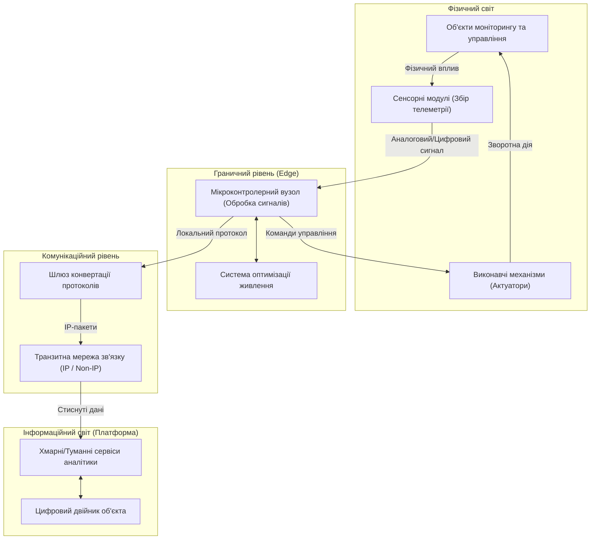
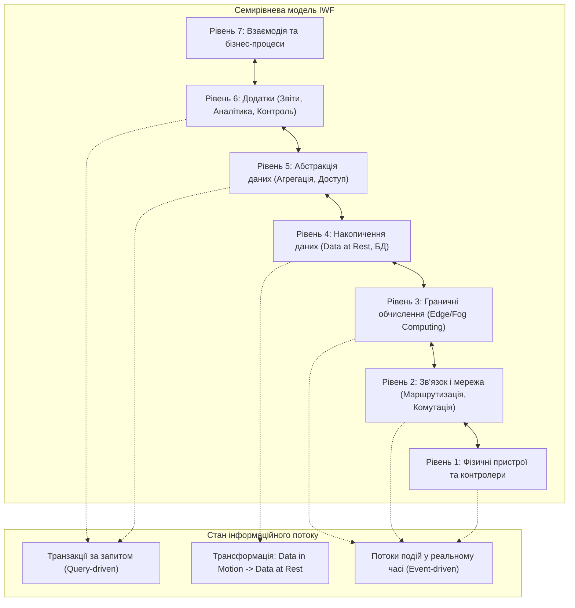
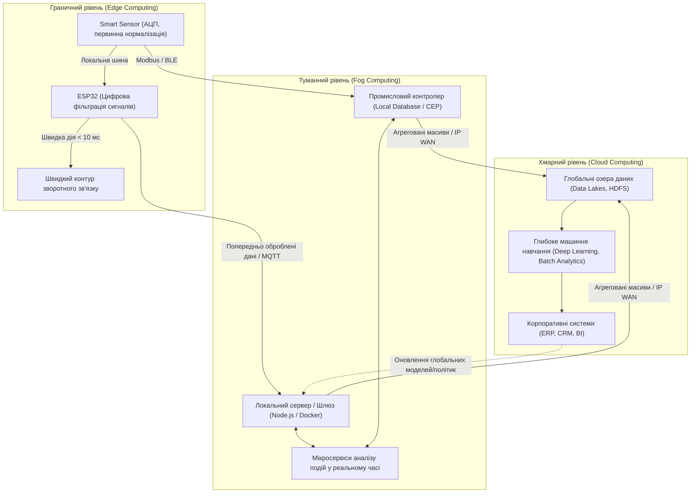

# Змістовий модуль 1. Архітектура, мережі та протоколи ІоТ

# Тема 1. Екосистема, еталонні моделі та архітектура IoT (Edge, Fog, Cloud)

---

## 1.1. Базові принципи та компоненти ІоТ

### Основний зміст та теоретичний базис

Сучасний етап розвитку інформаційно-комунікаційних систем характеризується переходом від парадигми Інтернету людей (Internet of People), орієнтованої на передачу мультимедійного та текстового контенту між кінцевими користувачами, до концепції **Інтернету речей** (Internet of Things, IoT). У межах цього підходу глобальна мережа розглядається як кіберфізичний простір, де матеріальні об'єкти фізичного світу інтегруються з обчислювальними системами за допомогою сенсорних, виконавчих, мікропроцесорних та мережевих компонентів. Головна мета впровадження таких комплексів полягає у забезпеченні автономної взаємодії між пристроями без обов’язкового безпосереднього втручання людини в контур оперативного управління.

Фундаментальну структуру Інтернету речей утворюють чотири взаємопов’язані базові складові. По-перше, це фізичні об’єкти або сутності реального світу, стан яких підлягає контролю або модифікації. По-друге, це сенсорні модулі та виконавчі пристрої (актуатори), що здійснюють пряму конвертацію фізичних величин в електричні сигнали та навпаки. По-третє, це локальні мікроконтролерні вузли первинної обробки, які відповідають за цифрову фільтрацію сигналів, формування пакетів даних та реалізацію базових алгоритмів поведінки. По-четверте, це масштабована комунікаційна інфраструктура, яка забезпечує транспортування телеметричної та командної інформації до платформ аналітики. У загалі сутність функціонування системи Інтернету речей описується системною залежністю:

$$\text{IoT} = \sum (\text{Об'єкти фізичного світу}) + \text{Сенсори та Актуатори} + \text{Мікроконтролери} + \text{Мережева інфраструктура}$$

Ключовими системними властивостями екосистеми Інтернету речей є гетерогенність, динамічність топології, масштабованість та контекстна взаємозв'язаність. **Гетерогенність** зумовлена функціонуванням в єдиному інформаційному полі пристроїв із кардинально різними обчислювальними можливостями, обсягами пам'яті, джерелами енергоживлення та інтерфейсами передачі даних. **Динамічність** проявляється у постійній зміні станів вузлів, їх періодичному входженні в режими глибокого сну для збереження заряду, можливій фізичній мобільності та спонтанних змінах параметрів радіоканалу. **Масштабованість** вимагає від архітектури здатності обслуговувати мільйони паралельних інформаційних потоків без деградації показників якості обслуговування (QoS).

*Рисунок 1 — Структурно-функціональна схема взаємодії компонентів кіберфізичної системи IoT*

Як продемонстровано на рисунку 1, взаємодія між фізичним та інформаційним світами замкнена в єдиний контур зворотного зв'язку. Первинні дані знімаються сенсорними перетворювачами, проходять стадію локальної дискретизації та нормалізації у мікроконтролерному вузлі й передаються через шлюз до аналітичного ядра. На основі розрахунків цифрового двійника формуються керуючі впливи, які транслюються назад на виконавчі пристрої для корекції параметрів фізичного об'єкта.

Головна інженерна специфіка вузлів Інтернету речей криється у жорстких апаратних обмеженнях (Resource-Constrained Devices). На відміну від класичних комп'ютерних систем, пристрої класу Edge зазвичай оснащені мікроконтролерами з обмеженим обсягом оперативної пам'яті (RAM від кількох кілобайтів до кількох сотень кілобайтів) та енергонезалежної пам'яті програм (Flash-пам'ять обсягом від 128 Кбайт до кількох мегабайтів). Такі обмеження унеможливлюють виконання важких криптографічних протоколів чи збереження тривалих часових рядів безпосередньо на сенсорному вузлі. 

Окремим критичним фактором є автономність живлення. Більшість польових сенсорів функціонують від обмежених хімічних джерел струму (батарей або акумуляторів) або систем збору енергії з навколишнього середовища (Energy Harvesting: п'єзоелементи, фотоелектричні панелі, термоелектрогенератори на ефекті Зеєбека). У зв'язку з цим програмне забезпечення кінцевих вузлів розробляється з урахуванням концепції низького робочого циклу (Duty Cycle), за якої мікроконтролер перебуває у стані активного обчислення та передачі даних лише частки секунди, а решту часу проводить у режимі енергозбереження (Deep Sleep).

Для оцінки середнього струму споживання автономного вузла та прогнозування тривалості його функціонування використовується розрахункова математична модель енергетичного балансу:

$$I_{avg} = \frac{I_{act} \cdot T_{act} + I_{sleep} \cdot T_{sleep}}{T_{act} + T_{sleep}}$$

де $I_{avg}$ позначає середній струм споживання пристрою за один повний робочий цикл, вимірюваний у міліамперах (мА); $I_{act}$ є струмом, що споживається електронною схемою вузла в активному режимі обчислення та передачі радіосигналу (мА); $T_{act}$ визначає тривалість перебування вузла в активному стані (с); $I_{sleep}$ відповідає струму витоку та споживання мікроконтролера в режимі глибокого сну при вимкнених основних тактових генераторах і периферійних блоках (мкА або мА); $T_{sleep}$ позначає тривалість пасивної фази сну (с).

Відповідно, загальний теоретичний термін експлуатації автономного сенсорного вузла $L_{years}$ (у роках) без заміни хімічного джерела струму визначається виразом:

$$L_{years} = \frac{C_{batt} \cdot \eta}{I_{avg} \cdot 8760 \cdot 1000}$$

де $C_{batt}$ позначає номінальну електричну ємність джерела живлення, виражену в міліампер-годинах (мА·год); $\eta$ є коефіцієнтом корисної дії джерела з урахуванням внутрішнього саморозряду та деградації електрохімічної системи при зміні температури експлуатації (безрозмірна величина в діапазоні $0{,}7 \dots 0{,}9$); величина $8760$ дорівнює кількості годин у невисокосному календарному році; числовий коефіцієнт $1000$ забезпечує масштабування одиниць вимірювання струму.

Згідно з класифікацією IETF (RFC 7228), пристрої Інтернету речей з обмеженими ресурсами чітко диференціюються за обчислювальними можливостями на три класи.

| Клас пристрою | Обсяг пам'яті даних (RAM) | Обсяг пам'яті програм (Flash) | Можливість виконання мережевих стеків | Сфера практичного застосування |
| :--- | :--- | :--- | :--- | :--- |
| **Клас 0 (Class 0)** | $< 10 \text{ Кбайт}$ | $< 100 \text{ Кбайт}$ | Повноцінний стек TCP/IP або CoAP не підтримується; необхідне використання спеціалізованих пропрієтарних протоколів та обов'язкових шлюзів | Пасивні мітки, прості бінарні сенсори присутності, примітивні актуатори |
| **Клас 1 (Class 1)** | $\approx 10 \text{ Кбайт}$ | $\approx 100 \text{ Кбайт}$ | Підтримка оптимізованих стеків (CoAP, MQTT-SN, DTLS поверх UDP) без можливості підтримки важких стеків на базі повноцінного HTTP/TLS | Бездротові сенсори клімату, автономні трекери, розумні лічильники |
| **Клас 2 (Class 2)** | $\approx 50 \text{ Кбайт}$ | $\approx 250 \text{ Кбайт}$ | Повна підтримка стандартних стеків протоколів TCP/IP, CoAP/HTTP, механізмів безпеки TLS/DTLS та легких операційних систем реального часу (FreeRTOS) | Контролери розумного будинку на базі ESP32, прикордонні маршрутизатори 6LoWPAN |

Аналіз даних таблиці показує, що вибір апаратної платформи для кінцевого вузла є компромісом між складністю інтегрованого комунікаційного стека та собівартістю виробу разом із його енергетичною автономністю.

---

## 1.2. Еталонні моделі (ITU-T, IWF, IIC)

### Основний зміст та теоретичний базис

Гетерогенність пристроїв, мережевих інтерфейсів і прикладного програмного забезпечення спричинила необхідність стандартизації структурних підходів до побудови систем Інтернету речей. Міжнародні організації розробили кілька еталонних архітектурних моделей, що формалізують розподіл системних функцій за рівнями абстракції. Найбільш ґрунтовними серед них є моделі Міжнародного союзу електрозв’язку (ITU-T Y.2060), Всесвітнього форуму Інтернету речей (IoT World Forum — IWF) та Консорціуму індустріального Інтернету (Industrial Internet Consortium — IIC).

**Еталонна модель Сектора стандартизації електрозв’язку Міжнародного союзу електрозв’язку (ITU-T Y.2060)** визначає чотири базові горизонтальні рівні та дві наскрізні вертикальні площини функціоналу:

1. Рівень пристроїв (Device Layer) включає безпосередньо сенсори, актуатори, пристрої перенесення даних (RFID-мітки) та пристрої збору інформації, які взаємодіють із фізичним світом через локальні з'єднання або спеціалізовані шлюзи.
2. Мережевий рівень (Network Layer) реалізує функції управління доступом до середовища, комутації, автентифікації сеансів зв'язку, а також забезпечення надійного транспортування пакетів між сенсорними мережами та ядрами обробки.
3. Рівень підтримки служб і додатків (Service Support and Application Support Layer) надає уніфіковані обчислювальні інтерфейси для агрегації телеметрії, управління базами даних, профілювання конфігурацій пристроїв та семантичної сумісності.
4. Рівень додатків (Application Layer) об'єднує кінцеве галузеве програмне забезпечення систем розумного міста, промисловості, охорони здоров'я чи агросектору.
5. Вертикальні площини управління та безпеки (Management and Security Capabilities) охоплюють усі чотири горизонтальні рівні й регламентують процедури конфігурування, виявлення несправностей, шифрування, авторизації доступу та забезпечення цілісності інформації.

Окрему увагу в стандартах ITU-T (зокрема, у Рекомендації Y.2067) приділено функціональним вимогам до **IoT-шлюзів**. Шлюз у концепції ITU-T розглядається не просто як маршрутизатор пакетів, а як багатофункціональний конвертер протоколів. Він транслює специфічні польові інтерфейси (RS-485/Modbus, ZigBee, BLE) у стандартні IP-протоколи глобальної мережі, здійснює локальне кешування телеметрії при розриві зовнішніх магістральних каналів і виконує функцію IoT-агента для віддаленої діагностики кінцевих вузлів.

*Рисунок 2 — Архітектурна модель Всесвітнього форуму IoT (IWF) та фази трансформації потоків даних*

Архітектурна модель **Всесвітнього форуму IoT (IWF)**, наведена на рисунку 2, деталізує обробку інформації через 7-рівневу структуру. Критично важливим концептуальним вузлом цієї моделі є границя між Рівнем 3 та Рівнем 4. Нижче цієї межі дані існують як «дані в русі» (Data in Motion) — асинхронні високошвидкісні потоки подій, які потребують обробки в реальному часі (Event-driven paradigm). На Рівні 4 (Data Accumulation) відбувається фільтрація, відсіювання надлишковості та конвертація потоку в реляційні чи документоорієнтовані структури сховищ. Вище Рівня 4 дані функціонують у формі «даних у спокої» (Data at Rest), взаємодія з якими відбувається за транзакційним принципом (Query-driven paradigm).

**Еталонна архітектура індустріального Інтернету речей (IIC IIRA)** розроблена для застосування у важкій промисловості, транспорті та енергетиці. Модель IIRA базується на розгляді системи крізь призму чотирьох точок зору (Viewpoints): Business, Usage, Functional та Implementation Viewpoints.

У межах функціональної точки зору (Functional Viewpoint) виділяються п’ять доменів:

1. Домен управління (Control Domain) об'єднує сенсори, актуатори, контролери та модулі промислової автоматизації, забезпечуючи виконання критичних за часом контурів локального регулювання.
2. Операційний домен (Operations Domain) реалізує функції конфігурування, діагностики, оновлення програмного забезпечення та управління активами підприємства.
3. Інформаційний домен (Information Domain) забезпечує збереження, інтеграцію, агрегацію та поглиблений аналіз виробничих даних за допомогою технологій Big Data.
4. Домен додатків (Application Domain) реалізує логіку бізнес-додатків, людино-машинні інтерфейси (HMI) операторів та планування виробничих циклів.
5. Бізнес-домен (Business Domain) інтегрує системи класу ERP (Enterprise Resource Planning), CRM та управління ланцюгами поставок (SCM) із реальними виробничими процесами.

З погляду системної топології (Implementation Viewpoint), стандарт IIC IIRA визначає референсний трирівневий патерн (Three-Tier Architecture), який зіставляється з іншими міжнародними стандартами.

| Рівень моделі IIC IIRA | Відповідні рівні моделі IWF | Відповідні рівні моделі ITU-T Y.2060 | Домінуючі інтерфейси та протоколи |
| :--- | :--- | :--- | :--- |
| **Рівень краю (Edge Tier)** | Рівень 1 (Devices), Рівень 2 (Connectivity), Рівень 3 (Edge Computing) | Рівень пристроїв (Device Layer), частково Мережевий рівень | RS-485, CANbus, Modbus RTU/TCP, BLE, ZigBee, SPI, I2C |
| **Рівень платформи (Platform Tier)** | Рівень 4 (Data Accumulation), Рівень 5 (Data Abstraction) | Рівень підтримки служб і додатків (Service/App Support) | MQTT, CoAP, AMQP, REST API, OPC UA, WebSockets |
| **Рівень підприємства (Enterprise Tier)**| Рівень 6 (Application), Рівень 7 (Collaboration & Processes) | Рівень додатків (Application Layer) | HTTPS, SQL, GraphQL, gRPC, OData |

Зіставлення архітектурних моделей демонструє однозначну тенденцію: нижні рівні орієнтовані на протоколи з мінімальними накладними витратами заголовків та роботу з детермінованими часовими інтервалами, тоді як верхні рівні застосовують високорівневі стандарти корпоративної інтеграції.

---

## 1.3. Розподіл обчислень: Edge, Fog, Cloud

### Основний зміст та теоретичний базис

Класична централізована модель хмарних обчислень (Cloud Computing), за якої всі первинні вимірювання від польових сенсорів безпосередньо передаються на віддалені сервери в дата-центри, стикається в системах Інтернету речей із низкою нездоланних фізичних та технічних обмежень:

1. Неприпустима затримка транспортування сигналів унеможливлює використання віддалених хмарних ресурсів для управління критичними технологічними процесами.
2. Обмежена пропускна здатність глобальних та мобільних каналів зв'язку перевантажується потоками високої щільності, наприклад відеоспостереженням чи багатоточковою вібродіагностикою механізмів.
3. Передача конфіденційної інформації через зовнішні мережі створює додаткові ризики компрометації даних.
4. Повна залежність локальної інфраструктури від стабільності підключення до Інтернету знижує загальну надійність системи.

Для подолання зазначених обмежень архітектура сучасних IoT-систем організовується у вигляді багаторівневого обчислювального континууму (Edge-Fog-Cloud Continuum), де процеси збереження, фільтрації, попередньої обробки та прийняття рішень розподіляються між різними рівнями ієрархії.

*Рисунок 3 — Розподіл обчислювальних функцій та часових діапазонів в ієрархії Edge-Fog-Cloud*

**Граничні обчислення (Edge Computing)** реалізуються безпосередньо на кінцевих вузлах (мікроконтролерах типу ESP32, STM32 або інтелектуальних сенсорах). Основним завданням цього рівня є виконання процедур аналого-цифрового перетворення, компенсація дрейфу нуля, фільтрація високочастотних завад, детектування аварійних перевищень порогових значень та формування негайної реакції через локально підключені виконавчі пристрої. Час відгуку на рівні Edge становить від мікросекунд до десятків мілісекунд, що гарантує високу детермінованість поведінки системи.

**Туманні обчислення (Fog Computing)**, згідно зі специфікацією консорціуму OpenFog (стандарт IEEE 1934), є горизонтальною системною архітектурою, яка розподіляє обчислення, сховища, контроль та мережеві функції ближче до користувачів уздовж усього шляху від хмари до речей. Вузлами туману (Fog Nodes) виступають локальні сервери, промислові комп'ютери, прикордонні маршрутизатори або віртуалізовані контейнери Docker. На цьому рівні реалізуються агрегація інформації з сотень сенсорних вузлів, кореляція подій між різними датчиками, маршрутизація та обробка складних подій (Complex Event Processing — CEP) із затримкою від десятків до сотень мілісекунд.

Стовпи архітектури OpenFog (OpenFog Pillars) визначають вісім обов’язкових системних вимог до побудови вузлів туману:
1. Безпека (Security) вимагає апаратно-підтвердженого кореня довіри (Hardware Root of Trust) та наскрізного шифрування комунікацій.
2. Масштабованість (Scalability) забезпечує динамічне нарощування обчислювальних потужностей локального кластера.
3. Відкритість (Openness) гарантує взаємозамінність програмно-апаратних модулів від різних постачальників без пропрієтарних обмежень.
4. Автономність (Autonomy) дозволяє туманному кластеру зберігати працездатність та виконувати операційні сценарії у разі повної втрати зв'язку із зовнішньою хмарою.
5. Програмованість (Programmability) забезпечує автоматизоване оновлення прошивок, контейнерів та бізнес-логіки на вузлах.
6. Надійність, доступність та зручність обслуговування (Reliability, Availability, Serviceability — RAS) гарантують відмовостійкість архітектури в промислових умовах експлуатації.
7. Маневреність (Agility) забезпечує оперативне перетворення потокових даних на локальні управлінські рішення.
8. Ієрархічність (Hierarchy) формалізує впорядкування обчислювальних шарів від найпростіших шлюзів до потужних серверів.

**Хмарні обчислення (Cloud Computing)** займають верхній рівень ієрархії. Хмара призначена для глобальної довготривалої аналітики, навчання важких моделей штучного інтелекту на великих масивах даних (Big Data), зберігання історичних баз даних глибиною в роки та візуалізації зведених показників на корпоративних панелях моніторингу.

Математична оцінка сумарної затримки передачі та обробки сигналу в трирівневій структурі визначається формулою:

$$\tau_{total} = \tau_{prop} + \tau_{trans} + \tau_{proc} + \tau_{queue}$$

де $\tau_{total}$ позначає повний час відгуку системи від моменту фізичної події до отримання реакції або збереження запису (с або мс); $\tau_{prop}$ є затримкою поширення електромагнітної хвилі в середовищі передачі, пропорційною фізичній відстані $d$ між вузлом та обчислювачем ($\tau_{prop} = d / v$, де $v$ — швидкість поширення сигналу в кабелі чи ефірі); $\tau_{trans}$ відповідає затримці серіалізації пакета в каналі зв'язку, що залежить від розміру кадру $S$ та швидкості передачі даних каналу $B$ ($\tau_{trans} = S / B$); $\tau_{proc}$ визначає тривалість обчислювальної обробки даних на процесорі відповідного рівня; $\tau_{queue}$ позначає час очікування пакета в буферах черг маршрутизаторів та брокерів повідомлень.

Завдяки перенесенню частини аналітичних операцій на рівні Edge та Fog суттєво зменшується обсяг інформації, що транслюється у глобальну мережу. Коефіцієнт скорочення мережевого трафіку $R_{red}$ визначається співвідношенням:

$$R_{red} = \left( 1 - \frac{\sum_{i=1}^{M} D_{agg,i}}{\sum_{j=1}^{N} D_{raw,j}} \right) \cdot 100\%$$

де $D_{raw,j}$ позначає обсяг вихідних невідфільтрованих даних, генерованих $j$-м сенсором за одиницю часу (байт/с); $N$ є загальною кількістю сенсорів у системі; $D_{agg,i}$ відповідає обсягу агрегованих та нормалізованих повідомлень, що надсилаються $i$-м туманним вузлом до хмари (байт/с); $M$ позначає кількість туманних вузлів.

| Критерій порівняння | Граничні обчислення (Edge) | Туманні обчислення (Fog) | Хмарні обчислення (Cloud) |
| :--- | :--- | :--- | :--- |
| **Місце виконання обчислень** | Безпосередньо на мікроконтролері або SoC сенсорного модуля | На локальних шлюзах, маршрутизаторах, промислових ПК (Local LAN) | У віддалених центрах обробки даних (Data Centers / WAN) |
| **Типовий час відгуку (Latency)** | Мікросекунди — одиниці мілісекунд ($< 10 \text{ мс}$) | Десятки — сотні мілісекунд ($10 \dots 500 \text{ мс}$) | Від кількох сотень мілісекунд до десятків секунд і хвилин |
| **Обчислювальні ресурси та пам'ять** | Вкрай обмежені (Кілобайти RAM, одиниці МГц тактової частоти) | Середні (Гігабайти RAM, багатоядерні x86/ARM процесори) | Практично необмежені (Еластичні пули віртуалізованих серверів) |
| **Автономність при втраті зв'язку** | Повна автономність для локальних контурів захисту | Висока автономність (локальне збереження даних та виконання правил) | Робота пристроїв блокується або деградує без підключення до мережі |
| **Обсяг оброблюваних даних** | Одиничні покази датчиків у реальному часі (Data in Motion) | Локальні потоки телеметрії групи пристроїв (CEP, агрегація) | Глобальні масиви Big Data (Data at Rest, історичні архіви) |
| **Програмний стек і середовище** | Bare-metal C/C++, MicroPython, FreeRTOS, ESPHome | Linux, Docker-контейнери, Node-RED, Mosquitto, Python | Kubernetes, Apache Hadoop, Apache Spark, NoSQL бази даних |

Порівняльний аналіз підтверджує, що для побудови енергоефективної, надійної та економічно збалансованої системи Інтернету речей необхідне раціональне комбінування всіх трьох підходів: рівень Edge гарантує локальний контур безпеки та мінімізацію енергоспоживання, рівень Fog забезпечує локальну інтеграцію, оркестрацію та фільтрацію потоків, а рівень Cloud вирішує завдання глобальної аналітики та довготривалого управління.

---

### Питання для самоперевірки та аналітичного осмислення

1. Яким чином обмеженість обчислювальних ресурсів (Class 0 — Class 2 за RFC 7228) мікроконтролерів кінцевих вузлів впливає на архітектуру комунікаційних протоколів та механізми безпеки в IoT?
2. На основі математичної моделі енергоспоживання проаналізуйте, як зміна співвідношення між часом активного радіозв'язку $T_{act}$ та часом глибокого сну $T_{sleep}$ впливає на підсумковий життєвий цикл автономного сенсорного вузла.
3. Опишіть призначення та функції IoT-шлюзу відповідно до положень Рекомендації ITU-T Y.2067. Чому шлюз не можна вважати звичайним мережевим комутатором чи маршрутизатором?
4. У чому полягає принципова відмінність між концепціями «даних у русі» (Data in Motion) та «даних у спокої» (Data at Rest) у семирівневій еталонній моделі Всесвітнього форуму IoT (IWF)?
5. Розкрийте зміст функціональних доменів моделі IIC IIRA (Control, Operations, Information, Application, Business Domains) та поясніть характер інформаційних потоків між ними.
6. Проаналізуйте стовпи архітектури OpenFog (IEEE 1934). Які переваги надає розгортання локальних аналітичних модулів на базі контейнеризації Docker безпосередньо у туманних вузлах?
7. Проведіть порівняльний аналіз критеріїв латентності та пропускної здатності для архітектурних рішень Edge, Fog та Cloud. За яких технічних умов доцільно відмовитися від передачі сирих даних у хмарне сховище?