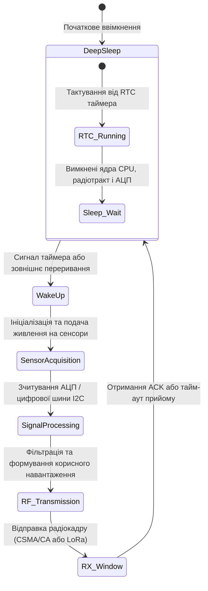
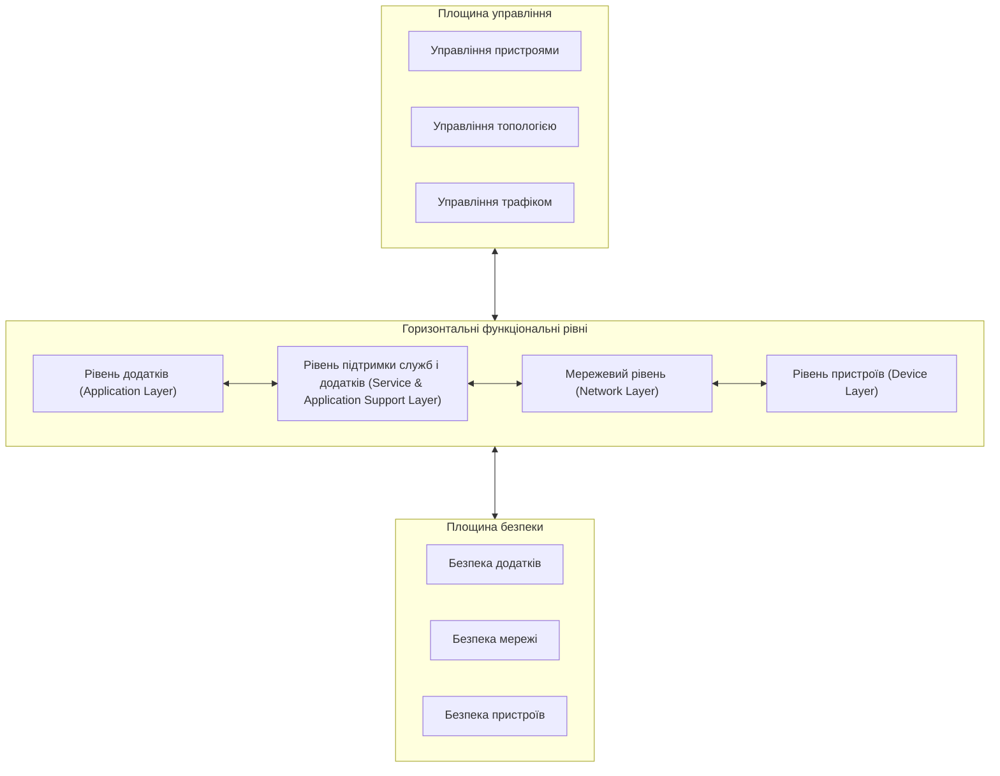
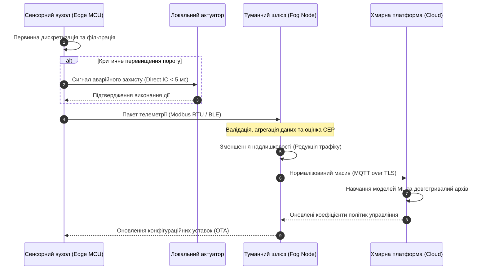
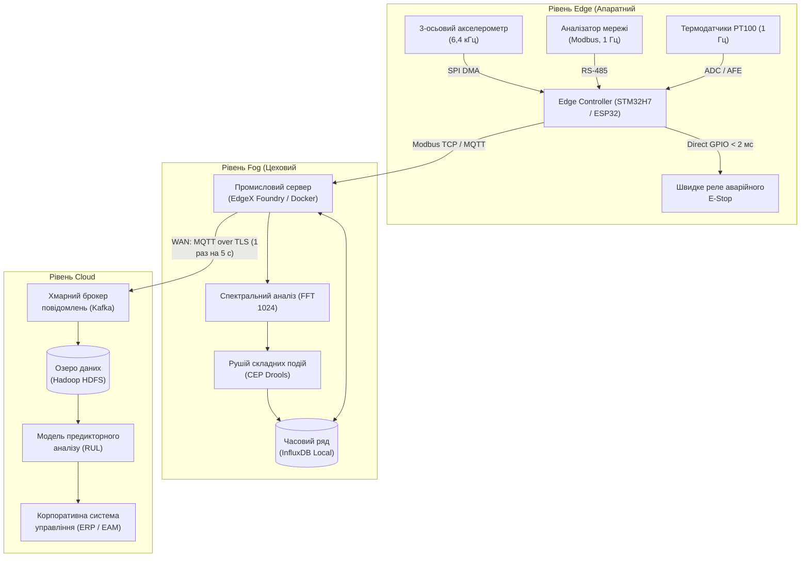

# Тема 1. Екосистема, еталонні моделі та архітектура IoT (Edge, Fog, Cloud)

## Мета лекції
Формування у здобувачів вищої освіти системних компетентностей та поглибленого інженерно-технічного розуміння архітектурних засад побудови Інтернету речей, базових еталонних моделей провідних міжнародних консорціумів і стандартів (ITU-T, IWF, IIC), а також принципів багаторівневого розподілу обчислювальних ресурсів за континуумом Edge-Fog-Cloud для створення масштабованих, відмовостійких і високопродуктивних кіберфізичних систем різного галузевого призначення.

## Очікувані результати навчання
1. **Знання та розуміння.** Здобувачі мають засвоїти фундаментальні концепції та специфіку функціонування екосистеми Інтернету речей, класифікацію ресурсних обмежень пристроїв за стандартом RFC 7228, а також структуру еталонних архітектурних моделей ITU-T Y.2060, Всесвітнього форуму IoT та консорціуму Industrial Internet Consortium.
2. **Застосування.** Студенти навчаться проектувати розподіл функціональних завдань первинної обробки сигналів, агрегації потоків даних та аналітики між граничним, туманним і хмарним рівнями з урахуванням апаратних характеристик контролерів і пропускної спроможності мережевих каналів.
3. **Аналіз.** Слухачі зможуть диференціювати поведінку даних у русі та даних у спокої, досліджувати математичні моделі латентності й енергоспоживання автономних сенсорних вузлів, а також виявляти критичні вузькі місця при передачі інтенсивних потоків телеметрії до хмарних платформ.
4. **Оцінювання та синтез.** Фахівці опанують здатність обґрунтовувати вибір топологій туманних мереж за критеріями відкритості, надійності та автономності відповідно до специфікації OpenFog, формуючи комплексні архітектурні рішення для промислових і муніципальних кіберфізичних систем.

---

## Детальний покроковий план лекції

### 1. Теоретико-концептуальний базис. Екосистема та еталонні моделі Інтернету речей
* 1.1. Генезис, фундаментальні принципи та ключові компоненти екосистеми IoT у контексті кіберфізичної конвергенції
* 1.2. Класифікація кінцевих вузлів за апаратними обмеженнями та енергетичними бюджетами відповідно до специфікацій RFC 7228
* 1.3. Еталонна чотирирівнева модель ITU-T Y.2060 та функціональні вимоги до спеціалізованих IoT-шлюзів за стандартом Y.2067
* 1.4. Семирівнева архітектура Всесвітнього форуму IoT (IWF) та концепція трансформації потоків від даних у русі до даних у спокої

### 2. Методологія та аналіз граничних умов. Багаторівневий розподіл обчислень у континуумі Edge-Fog-Cloud
* 2.1. Доменна функціональна структура Industrial Internet Reference Architecture (IIC IIRA) та шаблони топологічного розгортання
* 2.2. Граничні обчислення (Edge Computing) на базі мікроконтролерних систем для реалізації жорстких контурів управління в реальному часі
* 2.3. Архітектура та вісім опор консорціуму OpenFog (IEEE 1934) як методологія забезпечення локальної обробки та автономності
* 2.4. Аналіз критичних обмежень, затримок і мережевих бар'єрів при прямій трансляції необробленої телеметрії у глобальні хмарні сховища
* 2.5. Моделі математичної оцінки латентності передачі даних та аналітичні заходи зменшення мережевого трафіку на рівні шлюзів

### 3. Практичний індустріальний / фаховий кейс. Проектування архітектури промислової системи моніторингу
**Тема наскрізної задачі.** «Розподіл обчислювального навантаження в трирівневій системі вібродіагностики та моніторингу енергоспоживання верстатного парку машинобудівного цеху»

## 1. Теоретико-концептуальний базис. Екосистема та еталонні моделі Інтернету речей

### 1.1. Генезис, фундаментальні принципи та ключові компоненти екосистеми IoT у контексті кіберфізичної конвергенції

Сучасний етап розвитку інформаційно-комунікаційних технологій ознаменований фундаментальним переходом від класичної моделі Інтернету людей (**Internet of People**), де базовим споживачем та генератором трафіку виступала людина, до парадигми Інтернету речей (**Internet of Things, IoT**). Історична передумова цієї трансформації полягає у вичерпанні ефективності традиційних централізованих методів автоматизації та необхідності прямої інтеграції фізичних процесів із цифровим обчислювальним простором. У кіберфізичних системах матеріальні сутності отримують спроможність комунікувати між собою та з зовнішніми аналітичними платформами, що виключає необхідність постійного оперативного втручання людини в контур прийняття рішень.

З точки зору системної інженерії, архітектура кіберфізичної конвергенції вимагає формального опису складових частин обчислювального середовища. Математично розподілена гетерогенна система Інтернету речей може бути формалізована у вигляді кортежу взаємопов’язаних множин:

$$\mathcal{S}_{\text{IoT}} = \langle \mathcal{P}, \mathcal{S}, \mathcal{A}, \mathcal{C}, \mathcal{N}, \mathcal{D} \rangle$$

де символ $\mathcal{P}$ позначає множину фізичних об'єктів або контрольованих матеріальних середовищ; елемент $\mathcal{S}$ відповідає скінченній множині первинних вимірювальних перетворювачів (сенсорів), інтегрованих у фізичні об'єкти; множина $\mathcal{A}$ охоплює виконавчі пристрої (актуатори), які здійснюють зворотний фізичний або механічний вплив на керований об'єкт; символ $\mathcal{C}$ визначає сукупність локальних обчислювальних контролерів та прикордонних вузлів первинної обробки; параметр $\mathcal{N}$ формалізує комунікаційну інфраструктуру, що складається з транзитних дротових і бездротових каналів передачі даних; змінна $\mathcal{D}$ являє собою кібернетичний простір зберігання даних, побудови цифрових двійників та високорівневої аналітики.

Основними властивостями, які відрізняють сучасну екосистему IoT від класичних телеметричних мереж або систем диспетчеризації класу SCADA, є висока гетерогенність компонентів, динамічність топології, екстремальна масштабованість та семантична взаємозв'язаність. **Гетерогенність** полягає в одночасному функціонуванні в межах єдиної логічної мережі пристроїв із різною апаратною архітектурою, обсягами оперативної пам'яті, розрядністю мікропроцесорів та типами інтерфейсів зв'язку. **Динамічність** топології зумовлюється регулярним підключенням нових вузлів, зміною їх просторового розташування, періодичним переходом вузлів у глибокі енергоощадні сплячі режими та спонтанною зміною фізичних характеристик бездротового середовища. **Масштабованість** забезпечує стійку роботу системи в умовах лавиноподібного зростання кількості підключених вузлів, щільність яких у промислових або урбаністичних сценаріях може сягати сотень тисяч одиниць на один квадратний кілометр.

> **ПРАКТИЧНИЙ ЯКІР:** У процесі модернізації технологічного циклу збирання мотоциклів на підприємстві Harley-Davidson впровадження наскрізної кіберфізичної системи IoT із відстеженням кожної деталі за допомогою радіочастотних міток і цехових контролерів дозволило скоротити повний термін виробництва одиниці продукції з 21 дня до 6 годин.

### 1.2. Класифікація кінцевих вузлів за апаратними обмеженнями та енергетичними бюджетами відповідно до специфікацій RFC 7228

Кінцеві пристрої Інтернету речей суттєво відрізняються від традиційних обчислювальних машин обмеженими обчислювальними ресурсами, малим обсягом доступної пам'яті та лімітованим запасом енергії. Для стандартизації вимог до таких пристроїв Інженерна рада Інтернету (IETF) у специфікації RFC 7228 ввела офіційну таксономію пристроїв з обмеженими ресурсами (**Constrained Devices**). Згідно з цим стандартом, польові компоненти поділяються на класи залежно від доступного обсягу оперативної пам'яті даних (RAM) та постійної енергонезалежної пам'яті програм (Flash або ROM).

У таблиці систематизовано технічні характеристики класів пристроїв за стандартом RFC 7228, особливості їхньої комунікаційної взаємодії та вимоги до мережевого стека.

| Клас пристрою | Обсяг пам'яті даних (RAM) | Обсяг пам'яті програм (Flash) | Можливості мережевого стека | Типова сфера використання |
| :--- | :--- | :--- | :--- | :--- |
| **Class 0 (C0)** | До 10 Кбайт | До 100 Кбайт | Повноцінна пряма підтримка IP-протоколів відсутня; зв'язок реалізується виключно через проксі-шлюзи із застосуванням специфічних або пропрієтарних бінарних кадрів | Пасивні та напівпасивні RFID-мітки, найпростіші порогові датчики затоплення або витоку газу |
| **Class 1 (C1)** | Близько 10 Кбайт | Близько 100 Кбайт | Підтримка оптимізованих стеків бездротових мереж із обмеженнями, зокрема протоколу CoAP поверх UDP та механізмів безпеки DTLS, без можливості обробки важких форматів HTTP і TLS | Автономні сенсори вібрації, розподілені агрономічні вимірювачі вологості ґрунту на базі мікроконтролерів із низьким енергоспоживанням |
| **Class 2 (C2)** | Близько 50 Кбайт | Близько 250 Кбайт | Повна нативна реалізація стека TCP/IP або IPv6/6LoWPAN, використання безпечних сесій TLS, можливість виконання легких операційних систем реального часу (FreeRTOS, Zephyr) | Інтелектуальні промислові лічильники електроенергії, контролери автоматизації будівель, пристрої на базі чипів ESP32 |

Більшість пристроїв класу C0 та C1 проектуються як повністю автономні вузли, що живляться від невеликих хімічних джерел струму без можливості підзарядки або заміни протягом усього життєвого циклу, який може тривати від 5 до 10 років. У таких умовах розробка алгоритмів функціонування вузла вимагає суворого розрахунку енергетичного бюджету. Базовим принципом мінімізації енерговитрат є використання робочого циклу з чергуванням активного стану та режиму глибокого сну (**Deep Sleep**), під час якого енергоспоживання вузла зменшується до мікроамперних значень.

*Рисунок 1.1 — Діаграма станів функціонування енергоощадного сенсорного вузла*

На діаграмі станів проілюстровано типовий життєвий цикл роботи вузла з обмеженим живленням. Основну частину життєвого циклу мікроконтролер проводить у стані глибокого сну, де активним залишається лише низькочастотний годинник реального часу. Після настання запланованого інтервалу або виникнення апаратного переривання від порогового компаратора процесорне ядро переходить у стан вимірювання, виконує обчислення і передає пакет у радіоефір, після чого негайно відновлює стан мінімального енергоспоживання.

Середнє значення струму споживання пристрою за один повний робочий період $I_{\text{avg}}$ описується формулою зваженого усереднення:

$$I_{\text{avg}} = \frac{I_{\text{act}} \cdot T_{\text{act}} + I_{\text{sleep}} \cdot T_{\text{sleep}}}{T_{\text{act}} + T_{\text{sleep}}}$$

де параметр $I_{\text{act}}$ позначає струм, споживаний схемою у фазі активного вимірювання та роботи радіотрансивера на передачу або прийом; величина $T_{\text{act}}$ вказує тривалість активної фази у секундах; змінна $I_{\text{sleep}}$ відображає струм витоку та пасивного споживання кристала у стані сну; часовий інтервал $T_{\text{sleep}}$ відповідає тривалості перебування пристрою в пасивному стані очікування.

Розрахунок прогнозованого терміну експлуатації автономного сенсора $T_{\text{life}}$ у роках від автономного джерела живлення здійснюється за формулою:

$$T_{\text{life}} = \frac{C_{\text{batt}} \cdot \eta}{I_{\text{avg}} \cdot 8760 \cdot 1000}$$

де $C_{\text{batt}}$ визначає номінальну ємність батареї, виражену в міліампер-годинах (мА·год); коефіцієнт $\eta$ враховує втрати від саморозряду джерела та температурну деградацію ємності (зазвичай приймається в діапазоні від $0{,}75$ до $0{,}85$); константа $8760$ дорівнює річній кількості годин; числовий множник $1000$ приводить міліампери до амперів.

> **ТИПОВА ПОМИЛКА:** При проектуванні схем живлення автономних сенсорів інженери нерідко спираються виключно на струм споживання мікроконтролера в активному режимі, ігноруючи струм витоку в режимі Deep Sleep. Проте через те, що співвідношення $T_{\text{sleep}} / T_{\text{act}}$ у системах періодичного моніторингу часто перевищує значення $1000$, навіть незначне збільшення струму сну з 5 мкА до 50 мкА (наприклад, через неякісні блокувальні конденсатори або підтягувальні резистори) скорочує реальний час життя батареї з семи років до кількох місяців.

### 1.3. Еталонна чотирирівнева модель ITU-T Y.2060 та функціональні вимоги до спеціалізованих IoT-шлюзів за стандартом Y.2067

Стандартизація архітектурних рішень для глобальних кіберфізичних систем отримала ґрунтовний розвиток у документах Міжнародного союзу електрозв'язку. Рекомендація **ITU-T Y.2060** описує базову еталонну модель, що структуризує простір взаємодії пристроїв і додатків за допомогою чотирьох горизонтальних шарів та двох наскрізних вертикальних площин управління і безпеки.

Модель ITU-T чітко розмежовує фізичний та віртуальний світи. Фізичні речі відображаються в інформаційному просторі у вигляді цифрових сутностей, причому віртуальна річ може функціонувати навіть за відсутності прямого фізичного зв'язку в поточний момент часу. Для переходу від матеріальних об'єктів до цифрового середовища стандарт визначає такі категорії апаратних засобів:

1. Пристрої перенесення даних, які інтегруються з об'єктом для його непрямого підключення до мережі, типовим прикладом чого є радіочастотні мітки або електронні бирки.
2. Пристрої збору даних, що є приладами зчитування або запису сигналів із носіїв даних.
3. Сенсорні пристрої, які здійснюють пряму конвертацію фізичних величин довкілля у цифрові електричні сигнали.
4. Виконавчі пристрої, що забезпечують перетворення цифрових команд від інформаційних систем на фізичні дії.
5. Пристрої загального призначення, які поєднують інтелектуальну обробку інформації, комунікаційні можливості та взаємодію з периферією, зокрема сучасні смартфони, бортові комп'ютери та системні контролери.

*Рисунок 1.2 — Структура еталонної моделі Інтернету речей згідно з Рекомендацією ITU-T Y.2060*

Як показано на схемі рисунка 1.2, горизонтальна ієрархія взаємопов'язана з вертикальними площинами. Рівень пристроїв включає кінцеве польове обладнання та шлюзи доступу. Мережевий рівень відповідає за маршрутизацію пакетів, комутацію сигналів управління та транспортне транспортування. Рівень підтримки служб забезпечує платформенні можливості, такі як обробка і нормалізація даних, профілювання та керування доступом до баз даних. Рівень додатків безпосередньо взаємодіє з кінцевими користувацькими сервісами.

Фундаментальну роль у цій структурі відіграє спеціалізований **IoT-шлюз**, детальні вимоги до якого регламентовані стандартом **ITU-T Y.2067**. Шлюз забезпечує трансляцію протоколів між локальними бездротовими мережами персонального радіусу дії (WPAN) та магістральними IP-мережами глобального охоплення (WAN). Згідно зі стандартом Y.2067, шлюз реалізує функцію програмного IoT-агента, який агрегує інформацію від багатьох слабких сенсорів, виконує локальне шифрування каналів зв'язку, підтримує кешування даних у моменти втрати зв'язку з центральним сервером і забезпечує дистанційну діагностику та оновлення прошивок кінцевих пристроїв по бездротовому каналу (**Over-The-Air, OTA**).

> **ПРАКТИЧНИЙ ЯКІР:** У муніципальній системі обліку води міста Барселона концентратори на базі відкритої платформи Sentilo діють як стандартизовані шлюзи за специфікацією ITU-T Y.2067, транслюючи телеметричні пакети від 20 тисяч підземних ультразвукових лічильників з пропрієтарних бездротових протоколів у стандартні веб-сервіси міського дата-центру.

### 1.4. Семирівнева архітектура Всесвітнього форуму IoT (IWF) та концепція трансформації потоків від даних у русі до даних у спокої

На відміну від моделі ITU-T, яка більшою мірою акцентує увагу на телекомунікаційних інтерфейсах, семирівнева модель, запропонована комітетом архітектури **Всесвітнього форуму Інтернету речей (IoT World Forum, IWF)**, глибше розкриває логіку обробки інформації та її підготовки для корпоративних систем.

Головна концептуальна перевага моделі IWF полягає в деталізації процесів перетворення інформаційного потоку. На нижніх рівнях системи дані існують у вигляді неперервного, високошвидкісного, просторово розподіленого потоку подій. Цей стан у термінології інженерії даних називається **«даними в русі» (Data in Motion)**. Їхня обробка базується на парадигмі реакції на події (**Event-driven architecture**), де кожен відлік сенсора повинен бути швидко проаналізований із жорстким контролем затримок.

Трансформація потоку відбувається на межі Рівня 3 (периферійні/туманні обчислення) та Рівня 4 (накопичення даних). На цьому етапі сирі потоки телеметрії фільтруються, проходять математичну денатурацію, очищення від шумів та упаковуються у структуровані формати. У результаті дані переводяться у категорію **«даних у спокої» (Data at Rest)**. Для даних у спокої домінуючою стає парадигма виконання запитів (**Query-driven architecture**), де корпоративні додатки та аналітичні сервіси звертаються до сховищ за розкладом або у міру необхідності через транзакційні інтерфейси.

У таблиці наведено порівняльний аналіз рівнів обробки інформації відповідно до еталонної моделі Всесвітнього форуму Інтернету речей.

| Рівень моделі IWF | Функціональне призначення рівня | Характер інформаційного потоку | Приклад з реальної практики |
| :--- | :--- | :--- | :--- |
| **Рівень 7: Взаємодія та процеси** | Забезпечення координації бізнес-процесів підприємства за участю людей та систем управління | Транзакційні бізнес-звіти, аналітичні дашборди | Автоматичне формування наряду на ремонт станка в ERP SAP на основі діагностики |
| **Рівень 6: Додатки** | Реалізація галузевої логіки, систем моніторингу та диспетчеризації | Запити до баз даних, пакетна обробка | Панель моніторингу SCADA для оператора теплоелектростанції |
| **Рівень 5: Абстракція даних** | Уніфікація гетерогенних джерел, реплікація, формування семантичних моделей для доступу | Структуровані схеми (OLAP, NoSQL, реляційні БД) | Віртуалізація потоків даних датчиків через інтерфейси Apache Spark SQL |
| **Рівень 4: Накопичення даних** | Трансформація потокових пакетів у реляційні таблиці, файлові масиви або документоорієнтовані сховища | Конвертація «даних у русі» в «дані у спокої» | Запис часових рядів телеметрії в розподілену розподілену файлову систему Hadoop HDFS |
| **Рівень 3: Периферійні обчислення** | Локальна фільтрація, детектування критичних порогових відхилень, редукція та дистиляція обсягу | Потоки подій у реальному та квазіреальному часі | Програмний комплекс EdgeX Foundry, що відсіює 90% неінформативного шуму вібродатчиків |
| **Рівень 2: Зв'язок і мережа** | Передача кадрів і пакетів через мережеві пристрої, комутація, перетворення транспортних протоколів | Мережеві пакети та кадри канального рівня | Маршрутизатори серії Cisco 800 із підтримкою модулів розширення LoRaWAN і 4G LTE |
| **Рівень 1: Фізичні пристрої** | Безпосереднє вимірювання фізичних параметрів та генерація первинних електричних сигналів | Аналогові сигнали, цифрові відліки (Data in Motion) | Триосьовий MEMS-акселерометр MPU-6050, що знімає вібрацію вала турбіни |

Аналіз моделі IWF підтверджує, що для забезпечення життєздатності складних систем Інтернету речей необхідно проектувати багаторівневі обчислювальні конвеєри, які зменшують навантаження на мережевий рівень шляхом інтелектуалізації граничних вузлів.

> **КОНТРОЛЬНЕ ПИТАННЯ:** Чому пряме підключення мільйонів сенсорних пристроїв Class 1 безпосередньо до хмарного озера даних (Рівень 4 моделі IWF) через протокол HTTP поверх TCP є архітектурно некоректним інженерним рішенням у високонавантажених промислових системах?

Розгорнути аналіз / відповідь

**Правильний варіант: Таке рішення спричиняє критичне перевантаження каналів зв'язку через надлишковий розмір заголовків, швидке вичерпання енергетичного ресурсу автономних вузлів та втрату детермінізму при обробці аварійних подій.**

1. Аналітичне обґрунтування. Протокол HTTP поверх стека TCP вимагає попереднього встановлення тристороннього рукостискання (**TCP 3-Way Handshake**) та передає великі текстові заголовки розміром від 200 до 800 байтів, тоді як корисне навантаження сенсора часто не перевищує 2-4 байти. Крім того, пристрої Class 1 мають менше 10 Кбайт RAM, що робить утримання складних буферів TCP-сесій та обчислення криптографії TLS ресурсномістким завданням, яке спричиняє лавиноподібне падіння заряду батареї. Відсутність проміжного рівня периферійних обчислень (Рівень 3) позбавляє систему механізму локального реагування на критичні аварії в реальному часі через неконтрольовані мережеві затримки в глобальній мережі WAN.

2. Аналіз дистракторів. Твердження про те, що передача даних через HTTP неможлива через несумісність форматів даних, є хибним, оскільки HTTP може переносити довільний бінарний або JSON-контент. Припущення про обмеження максимального розміру бази даних на Рівні 4 також є некоректним, оскільки сучасні сховища на базі Hadoop HDFS або NoSQL масштабуються горизонтально без жорстких обмежень на загальний обсяг збереженої інформації.

---

### Вказівки для самостійного осмислення

1. Складіть аналітичну схему балансу енергоспоживання для бездротового сенсорного вузла моніторингу температури на базі чипа CC2538, розрахувавши теоретичний термін його автономного функціонування від елемента живлення Li-SOCl2 ємністю 2400 мА·год за умови опитування датчика один раз на 60 секунд.
2. Проаналізуйте архітектурні відмінності між концепцією шлюзу за специфікацією ITU-T Y.2067 та класичним мережевим маршрутизатором рівня L3 моделі OSI, звернувши особливу увагу на виконання функцій трансляції прикладних протоколів і підтримку локальних сховиль даних.
3. Опишіть інженерні ризики та наслідки відсутності Рівня 3 (периферійних обчислень) у системі відеоспостереження розумного міста, що налічує 10 000 камер високої роздільної здатності, які здійснюють пряму неперервну передачу відеопотоку до централізованої хмарної платформи.

## 2. Методологія та аналіз граничних умов. Багаторівневий розподіл обчислень у континуумі Edge-Fog-Cloud

### 2.1. Доменна функціональна структура Industrial Internet Reference Architecture (IIC IIRA) та шаблони топологічного розгортання

Консорціум промислового Інтернету (**Industrial Internet Consortium, IIC**) розробив еталонну архітектуру **Industrial Internet Reference Architecture (IIRA)**, яка спрямована на уніфікацію проектування складних міжгалузевих кіберфізичних систем. Методологічною основою IIRA є опис системи через призму функціональної точки зору (**Functional Viewpoint**), яка структурує технологічні процеси за п'ятьма базовими доменами.

Домен управління (**Control Domain**) безпосередньо взаємодіє з фізичним світом, забезпечуючи виконання циклів зчитування сенсорних показників, їх первинне калібрування, оцінку цілісності та формування керуючих сигналів на виконавчі механізми з детермінованими часовими характеристиками. Операційний домен (**Operations Domain**) реалізує комплекс функцій щодо безперервного моніторингу працездатності обладнання, управління конфігураціями польових контролерів, діагностики апаратних збоїв та планування технічного обслуговування активів. Інформаційний домен (**Information Domain**) акумулює гетерогенні потоки даних, здійснює їх семантичну нормалізацію, агрегацію, контекстне перетворення та масштабний аналітичний розрахунок за допомогою методів штучного інтелекту та моделювання часових рядів. Домен додатків (**Application Domain**) містить спеціалізоване програмне забезпечення, орієнтоване на оптимізацію конкретних виробничих завдань, координацію підсистем і людино-машинну взаємодію на рівні цеху чи підприємства. Бізнес-домен (**Business Domain**) інтегрує операційні показники системи у вищі рівні корпоративного менеджменту, поєднуючи функціонал ERP, CRM та автоматизованого логістичного планування з реальними параметрами виробничих ліній.

У межах реалізації зазначеної доменної моделі IIRA визначає три основні шаблони топологічного розгортання:

1. Трирівневий шаблон (**Three-Tier Architecture Pattern**) передбачає послідовну ієрархічну побудову системи через виокремлення рівня краю (**Edge Tier**), рівня платформи (**Platform Tier**) та рівня підприємства (**Enterprise Tier**), де кожен рівень виконує суворо детермінований набір функцій перетворення інформації від низькорівневих польових інтерфейсів до глобальних веб-сервісів.
2. Шлюзовий шаблон взаємодії (**Gateway-Mediated Edge Pattern**) ізолює локальні сенсорні мережі зі специфічними протоколами за допомогою інтелектуальних шлюзів, які беруть на себе завдання конвертації не-IP трафіку, локальної буферизації та первинної фільтрації шумів перед виходом у транзитну магістраль.
3. Шаблон багатошарової шини даних (**Layered Databus Pattern**) базується на використанні концепції комунікації видавець-підписник із прямою міжвузловою адресацією за стандартом DDS, що дозволяє створювати однорангові контури управління з ультранизькою латентністю без необхідності проходження трафіку через централізований брокер.

Для інженерного аналізу взаємодії компонентів у часовому вимірі нижче наведено діаграму послідовності проходження інформаційних потоків між польовим рівнем, туманним шлюзом та центральною хмарною платформою.

*Рисунок 2.1 — Діаграма послідовності багаторівневої обробки та передачі сигналів у континуумі Edge-Fog-Cloud*

Як відображено на рисунку 2.1, контур аварійного захисту замикається безпосередньо на фізичному рівні протягом часток мілісекунди, усуваючи ризики затримок у мережі. Туманний вузол агрегує нормальні відліки, забезпечує значне зниження обсягу трафіку та передає до хмари лише інформативні масиви, повертаючи на польовий рівень скориговані уставки функціонування.

---

### 2.2. Граничні обчислення (Edge Computing) на базі мікроконтролерних систем для реалізації жорстких контурів управління в реальному часі

Реалізація граничних обчислень (**Edge Computing**) на рівні мікроконтролерів орієнтована на обслуговування систем із жорсткими вимогами до детермінізму (**Hard Real-Time Systems**). У таких системах правильність функціонування визначається не лише логічною точністю обчислень, але й часом надання результату. Недотримання часового дедлайну розцінюється як критична відмова всього комплексу.

Типовий програмно-апаратний стек граничного вузла будується безпосередньо на мікроконтролерах із ядрами ARM Cortex-M або Xtensa (зокрема ESP32), які функціонують під управлінням операційних систем реального часу, таких як **FreeRTOS** чи **Zephyr RTOS**. Виконання завдань регламентується детермінованими планувальниками з витісненням за пріоритетами (**Preemptive Priority-Based Scheduling**). Основним завданням граничного контролера є періодичний розрахунок законів автоматичного регулювання, зокрема пропорційно-інтегрально-диференціальних (ПІД) алгоритмів:

$$u(t) = K_p \, e(t) + K_i \int_{0}^{t} e(\tau) \, d\tau + K_d \, \frac{de(t)}{dt}$$

де величина $u(t)$ представляє результуючий керуючий вплив на виконавчий механізм; коефіцієнт $K_p$ задає пропорційне підсилення; параметр $K_i$ визначає інтегральний коефіцієнт для усунення статичної похибки; константа $K_d$ позначає диференціальний коефіцієнт, призначений для демпфування коливань; функція $e(t)$ описує неузгодженість між заданим значенням регульованого параметра $r(t)$ та його фактичним виміряним значенням $y(t)$: $e(t) = r(t) - y(t)$.

Критичним параметром для граничного контролера є часове тремтіння періоду дискретизації (**Jitter**), яке кількісно виражає відхилення реального моменту запуску алгоритму обробки від математично розрахованого значення:

$$J = |t_{\text{actual}} - t_{\text{nominal}}|$$

де змінна $t_{\text{actual}}$ визначає фактичний фізичний момент спрацьовування апаратного переривання або виклику підпрограми обробки сигналу; величина $t_{\text{nominal}}$ позначає строго регламентований момент часу за шкалою тактового генератора реального часу. Якщо величина джитера $J$ перевищує 5-10% від загальної тривалості періоду квантування $T_s$, дискретний контур управління втрачає фазовий запас стійкості, що провокує виникнення автоколивань та аварійний зрив стабілізації об'єкта.

> **ВАЖЛИВО:** Для систем жорсткого реального часу інваріант безпеки стверджує: контур первинного аварійного захисту та критичної стабілізації параметрів повинен бути замкнений виключно на апаратному та мікроконтролерному рівні Edge. Забороняється делегувати прийняття рішень щодо захисту систем у віддалені сегменти мережі з недетермінованим часом транспортування кадрів.

---

### 2.3. Архітектура та вісім опор консорціуму OpenFog (IEEE 1934) як методологія забезпечення локальної обробки та автономності

Для усунення пропрієтарної розрізненості туманних рішень міжнародний консорціум OpenFog стандартизував еталонну модель, закріплену в стандарті **IEEE 1934**. На відміну від ізольованих шлюзів, архітектура OpenFog розглядає мережу як обчислювальний континуум із горизонтальним розподілом навантаження між сусідніми вузлами (комунікація схід-захід) та вертикальним обміном даними (комунікація північ-південь).

Методологічну базу стандарту IEEE 1934 складають вісім фундаментальних принципів, які називаються опорами (**OpenFog Pillars**):

1. Безпека (**Security**) забезпечує наскрізну довіру на основі апаратного кореня довіри (**Hardware Root of Trust**), безпечного завантаження (**Secure Boot**), криптографічної ізоляції мікросервісів та локального шифрування каналів.
2. Масштабованість (**Scalability**) дозволяє динамічно адаптувати обчислювальні та мережеві ресурси туманного кластера відповідно до стрибків інтенсивності інформаційних потоків.
3. Відкритість (**Openness**) гарантує апаратну та програмну інтероперабельність вузлів від різних вендорів без прив'язки до закритих протоколів.
4. Автономність (**Autonomy**) надає туманному вузлу здатність повноцінно виконувати функції управління, аудиту та локальної аналітики в умовах повної відсутності доступу до зовнішніх хмарних центрів обробки даних.
5. Програмованість (**Programmability**) забезпечує гнучку оркестрацію бізнес-логіки за допомогою контейнеризованих середовищ (наприклад, Docker або легковагових runtime-рушіїв Wasm) та дистанційного оновлення конфігурацій.
6. Надійність, доступність та зручність обслуговування (**RAS — Reliability, Availability, Serviceability**) гарантують стабільність виконання критичних функцій в агресивних промислових середовищах із резервуванням комунікацій та апаратних блоків.
7. Маневреність (**Agility**) визначає швидкість трансформації сирих даних сенсорних потоків у конкретні управлінські команди для адаптації бізнес-процесів підприємства.
8. Ієрархічність (**Hierarchy**) структурує обчислювальні рівні від простих польових агрегаторів до складних промислових серверів відповідно до допустимих затримок і глибини аналізу даних.

> **ПРАКТИЧНИЙ ЯКІР:** У рамках стандарту IEEE 1934 на тягових підстанціях швидкісної залізничної мережі Франції (SNCF) розгорнуто туманні обчислювальні вузли під управлінням EdgeX Foundry. Вони автономно аналізують тепловий стан трансформаторів та спектр вібрації підшипників, ухвалюючи рішення про перемикання навантаження за 15 мс без надсилання первинних віброграм до центрального дата-центру.

---

### 2.4. Аналіз критичних обмежень, затримок і мережевих бар'єрів при прямій трансляції необробленої телеметрії у глобальні хмарні сховища

Спроба побудови системи Інтернету речей шляхом безпосередньої передачі сирої телеметрії від усіх первинних сенсорів у глобальну хмару розбивається об низку об'єктивних фізичних та економічних обмежень. 

Першим фундаментальним бар'єром є **стохастична природа мережевої затримки** у глобальних каналах зв'язку (WAN/Internet). Якщо фізичне поширення сигналу оптоволокном лімітоване швидкістю світла в середовищі ($v \approx 200\,000\text{ км/с}$), то наявність проміжних вузлів комутації, багаторівневої буферизації та механізмів динамічного рекурсивного пошуку маршрутів вносить непрогнозований мережевий джитер. Час кругового обігу пакета (**Round-Trip Time, RTT**) у транзитних мережах коливається від десятків мілісекунд до кількох секунд за умов виникнення колізій або перевантаження буферів маршрутизаторів (**Bufferbloat**). Для критичних технологічних систем (наприклад, управління турбінами, високошвидкісними конвеєрами або медичними апаратами штучної вентиляції легень) така затримка призводить до втрати контролю над об'єктом.

Другим критичним обмеженням виступає **пропускна здатність каналів зв'язку та економічна вартість трафіку**. Потоки високочастотної телеметрії генерують колосальні масиви даних. Наприклад, один триосьовий вібродатчик із частотою квантування $10\text{ кГц}$ і розрядністю АЦП $16\text{ біт}$ на вісь формує потік:

$$D_{\text{sensor}} = 3 \times 10\,000 \times 2 = 60\,000\text{ байт/с} \approx 480\text{ кбіт/с}$$

У цеху з 200 верстатами, на кожному з яких встановлено по чотири такі датчики, сумарний потік даних складатиме майже $384\text{ Мбіт/с}$. Неперервна трансляція такого обсягу інформації через зовнішні мережі вимагає надвисоких фінансових витрат на оренду гарантованих магістральних каналів і оплату операцій вводу-виводу (**I/O Operations**) у хмарних провайдерів.

Третій бар'єр полягає у **проблемах кібербезпеки та конфіденційності**. Пряма трансляція сирих даних через публічний Інтернет багаторазово збільшує поверхню атаки (**Attack Surface**). Перехоплення телеметрії промислового обладнання дозволяє зловмисникам реконструювати топологію заводу, відстежувати графіки роботи персоналу або формувати вектори атак для підміни команд управління.

**Граничні умови застосування технологій:**
Централізована хмарна архітектура стає нерелевантною і технічно непридатною у таких сценаріях:
1. За необхідності реалізації захисних блокувань із гарантованим часом спрацьовування $\tau < 50\text{ мс}$.
2. У географічно віддалених, рухомих або підземних об'єктах із нестабільним каналом зв'язку, де показник доступності мережі (**Network Availability**) падає нижче рівня $99{,}9\%$.
3. У системах комп'ютерного зору та потокового спектрального аналізу, де витрати на передачу сирого відеопотоку перевищують вартість встановлення локальних прискорювачів на базі GPGPU або FPGA.
4. На об'єктах критичної національної інфраструктури, де нормативні вимоги регуляторів законодавчо забороняють передачу первинних операційних даних за межі локального захищеного периметра підприємства.

---

### 2.5. Моделі математичної оцінки латентності передачі даних та аналітичні заходи зменшення мережевого трафіку на рівні шлюзів

Для розрахунку та оптимізації характеристик контуру управління кіберфізичної системи необхідно виконати покрокову формалізацію часових затримок, що виникають під час руху сигналу від сенсора до хмари і назад. 

Аналітичний розрахунок загальної латентності системи реалізується за такою формалізованою процедурою:

$$
\begin{aligned}
\text{Крок 1 (Затримка поширення сигналу):} & \quad \tau_{\text{prop}} = \frac{d}{v} \\
\text{Крок 2 (Затримка серіалізації кадру):} & \quad \tau_{\text{trans}} = \frac{L_{\text{frame}}}{R_{\text{link}}} \\
\text{Крок 3 (Затримка буферизації за моделлю M/M/1):} & \quad \tau_{\text{queue}} = \frac{1}{\mu - \lambda} \\
\text{Крок 4 (Повний час реакції хмарного контуру):} & \quad \tau_{\text{total}} = 2 \cdot (\tau_{\text{prop}} + \tau_{\text{trans}} + \tau_{\text{queue}}) + \tau_{\text{proc,edge}} + \tau_{\text{proc,cloud}}
\end{aligned}
$$

де параметр $d$ відображає фізичну відстань траси передачі між джерелом та приймачем (м); константа $v$ задає швидкість поширення електромагнітної хвилі в каналі (м/с); змінна $L_{\text{frame}}$ позначає повну довжину кадру з урахуванням заголовків усіх рівнів стека протоколів (біт); величина $R_{\text{link}}$ визначає пропускну спроможність каналу зв'язку (біт/с); параметри $\lambda$ та $\mu$ описують інтенсивність вхідного потоку пакетів та інтенсивність обслуговування черги маршрутизатора відповідно (пакетів/с); величини $\tau_{\text{proc,edge}}$ та $\tau_{\text{proc,cloud}}$ відповідають тривалості обчислювальної обробки даних на процесорі прикордонного вузла та в інфраструктурі хмарного сервера.

Для мінімізації навантаження на канали зв'язку на рівні туманних шлюзів застосовують комплекс аналітичних методів редукції трафіку. До них належать алгоритми апертурної фільтрації (**Deadband Compression**), за яких передача нового відліку ініціюється виключно тоді, коли зміна сигналу перевищує задану зону нечутливості:

$$|y(t_k) - y(t_{k-1})| > \Delta_{\text{threshold}}$$

Додатково на шлюзах виконується швидке перетворення Фур'є (**Fast Fourier Transform, FFT**), що дозволяє транслювати до хмари не сирі коливальні процеси, а лише розраховані спектральні коефіцієнти гармонік.

У таблиці зведено результати системного аналізу трьох обчислювальних парадигм за сукупністю ключових інженерних і експлуатаційних параметрів.

| Критерій оцінки | Граничні обчислення (Edge) | Туманні обчислення (Fog) | Хмарні обчислення (Cloud) |
| :--- | :--- | :--- | :--- |
| **Гарантований час відгуку** | Детермінований, від 100 мкс до 10 мс | Квазідетермінований, від 10 до 200 мс | Стохастичний, від 200 мс до десятків секунд |
| **Складність впровадження** | Висока, через необхідність низькорівневої оптимізації під конкретні MCU | Середня, за рахунок використання стандартних платформ і контейнеризації | Низька, завдяки розвиненим високорівневим API провайдерів |
| **Критичні ризики / Обмеження** | Жорсткий дефіцит RAM і Flash пам'яті, складність дистанційного дебагінгу | Обмежена обчислювальна потужність порівняно з масштабними ЦОД | Повна втрата працездатності контуру при аварії каналу зв'язку WAN |
| **Енергетична автономність** | Робота від батарей до 10 років у режимі чергування активності та сну | Постійне живлення від локальної мережі або акумуляторів ДБЖ | Живлення від промислової енергомережі рівня дата-центрів |
| **Рівень абстракції даних** | Сирий електричний сигнал, одиничні цифрові коди (Data in Motion) | Очищені події, структуровані локальні часові ряди (Local CEP) | Глобальні структури Big Data, озера даних (Data at Rest) |

Порівняння підтверджує необхідність інтеграції всіх трьох обчислювальних парадигм у межах єдиної системи для досягнення балансу між надійністю контурів реального часу та глибиною глобальної аналітики.

---

> **КОНТРОЛЬНЕ ПИТАННЯ:** Промисловий комплекс містить 500 сенсорних вузлів, кожен з яких формує пакети даних корисним розміром 64 байти з інтервалом 100 мс. Пропускна здатність висхідного каналу зв'язку WAN становить 2 Мбіт/с. Оцініть, чи виникне перевантаження каналу зв'язку при прямій трансляції необроблених даних через протокол MQTT поверх TCP/IPv4 (сумарний розмір службових заголовків становить 54 байти), та визначте мінімальний коефіцієнт редукції трафіку на туманному шлюзі для забезпечення стабільної передачі даних за умови завантаження каналу не більше ніж на 70%.

Розгорнути аналіз / відповідь

**Правильний варіант: Канал буде суттєво перевантажений (навантаження сягне майже 236%), а мінімально необхідний коефіцієнт редукції трафіку на шлюзі становить 70,34%.**

1. Поетапний аналітичний розрахунок:
- Розрахунок розміру одного повного кадру передачі:
  $$L_{\text{total}} = L_{\text{payload}} + L_{\text{headers}} = 64 + 54 = 118\text{ байтів} = 944\text{ біти}$$
- Визначення частоти генерації повідомлень від одного сенсора:
  $$f = \frac{1}{T} = \frac{1}{0{,}1\text{ с}} = 10\text{ пакетів/с}$$
- Розрахунок сумарного бітрейту від 500 сенсорів при прямій передачі:
  $$R_{\text{raw}} = 500 \times 10 \times 944 = 4\,720\,000\text{ біт/с} = 4{,}72\text{ Мбіт/с}$$
- Оцінка стану каналу: фізична пропускна здатність становить $2\text{ Мбіт/с}$. Коефіцієнт перевантаження каналу дорівнює:
  $$K_{\text{load}} = \frac{4{,}72}{2{,}0} \times 100\% = 236\%$$
  Канал фізично не здатний пропустити такий потік, що призведе до переповнення буферів черги та масової втрати пакетів.
- Розрахунок гранично допустимого потоку даних за умови 70% ліміту завантаження:
  $$R_{\text{target}} = 2{,}0\text{ Мбіт/с} \times 0{,}70 = 1{,}40\text{ Мбіт/с}$$
- Визначення мінімального коефіцієнта редукції трафіку ($R_{\text{red}}$) на туманному шлюзі:
  $$R_{\text{red}} = \left( 1 - \frac{R_{\text{target}}}{R_{\text{raw}}} \right) \times 100\% = \left( 1 - \frac{1{,}40}{4{,}72} \right) \times 100\% \approx 70{,}34\%$$

2. Висновок щодо системного проектування: пряма трансляція даних у хмару неможлива. Для вирішення проблеми на рівні туманного шлюзу необхідно впровадити алгоритми децимації відліків, локального розрахунку ковзного середнього та відправки даних пакетами раз на 1-2 секунди, що дозволить скоротити необхідний трафік більш ніж на 75% без втрати контролю за динамікою процесів.

---

### Вказівки для самостійного осмислення

1. Розрахуйте зміну фазового запасу стійкості дискретного контуру ПІД-регулювання температури промислової печі при зростанні джитера періоду виклику підпрограми керування з 0,1 мс до 15 мс.
2. Сформулюйте архітектурну специфікацію вимог безпеки для автономного туманного шлюзу нафтоперекачувальної станції відповідно до стовпів OpenFog Security та Autonomy.
3. Проаналізуйте методичні засади вибору між протоколами DDS та MQTT для реалізації обміну даними між вузлами в межах шаблону Layered Databus консорціуму IIC.

## 3. Практичний індустріальний / фаховий кейс. Проектування архітектури промислової системи моніторингу

### 3.1. Комплексний фаховий кейс. Розподіл обчислювального навантаження в трирівневій системі вібродіагностики та моніторингу енергоспоживання верстатного парку машинобудівного цеху

#### Постановка задачі / ситуації

На машинобудівному підприємстві введено в експлуатацію механообробний цех, що налічує шістдесят токарних і фрезерних верстатів із числовим програмним управлінням. Технологічний процес вимагає безперервного моніторингу вібраційного стану шпиндельних вузлів для завчасного виявлення кавітації мастила, дефектів підшипників кочення та запобігання поломці різального інструменту. Одночасно підприємство реалізує програму енергоефективності, яка передбачає облік трифазного струму, напруги та споживаної активної і реактивної потужності кожного верстата для оптимізації добового графіка навантаження цехової підстанції.

Критичним фактором надійності є час реакції на аварійний дисбаланс або заклинювання шпинделя: захисне відключення приводу повинно здійснюватися за час, що не перевищує десяти мілісекунд, для уникнення механічного руйнування верстата. При цьому зовнішній канал зв'язку цеху з корпоративним центром обробки даних реалізовано на базі виділеної оптоволоконної лінії з резервним мобільним каналом зв'язку, де гарантована пропускна здатність обмежена значенням десять мегабіт на секунду. Пряме передавання сирих високочастотних сигналів від усіх сенсорів у хмару спричинить миттєвий колапс мережі зв'язку. Інженерна задача полягає в оптимізації трирівневої архітектури (Edge-Fog-Cloud), проектуванні контурів обробки та розрахунку балансу мережевого навантаження.

У таблиці наведено вихідні інженерно-технічні параметри системи моніторингу цеху, характеристики датчиків і ліміти каналів передачі даних.

| Параметр системи | Числове значення | Одиниця вимірювання | Технічні примітки та опис параметра |
| :--- | :--- | :--- | :--- |
| **Кількість технологічних одиниць** | 60 | верстатів | Парк ЧПУ верстатів високої точності |
| **Кількість осей вібродіагностики на верстат** | 3 | осі ($X, Y, Z$) | Триосьовий MEMS-акселерометр на шпинделі |
| **Частота квантування вібросигналу ($f_s$)** | 6400 | Гц (вибірок/с) | Забезпечує смугу пропускання аналізу до 2,5 кГц |
| **Розрядність АЦП акселерометра** | 16 | біт (2 байти) | Динамічний діапазон вимірювань $\pm 16g$ |
| **Параметри енергомоніторингу** | 8 | вимірюваних величин | Три напруги, три струми, активна і реактивна потужність |
| **Період опитування енергомоніторингу** | 1 | секунда | Інтерфейс RS-485, протокол Modbus RTU |
| **Датчики температури підшипників** | 2 | канали | Сенсори PT100 на передній і задній опорах, 1 Гц |
| **Допустимий час аварійного відключення** | $\le 10$ | мілісекунд | Жорсткий дедлайн аварійної зупинки приводу |
| **Пропускна здатність каналу WAN** | 10 | Мбіт/с | Висхідний потік до корпоративної хмари |
| **Ліміт завантаження каналу зв'язку** | $\le 40$ | відсотків | Вимога надійності за стандартом промислової безпеки |

Для вирішення поставленої задачі розроблено трирівневу структурно-функціональну схему розподілу обчислень, наведену на рисунку 3.1.

*Рисунок 3.1 — Схема багаторівневого розподілу потоків даних та контурів управління цеху*

#### Покроковий аналітичний розв'язок

##### Крок 1. Розрахунок сумарного бітрейту сирої телеметрії

Обчислення обсягу невідфільтрованих первинних даних необхідне для оцінки навантаження на мережеву інфраструктуру в разі відсутності граничної обробки.

Потік цифрових даних вібрації від одного верстата за одну секунду формується виходячи з кількості вимірювальних осей, частоти дискретизації та розрядності АЦП:

$$B_{\text{vib}} = N_{\text{axes}} \cdot f_s \cdot \frac{b_{\text{adc}}}{8} = 3 \cdot 6400 \cdot 2 = 38\,400 \text{ байт/с}$$

де $N_{\text{axes}}$ позначає кількість осей акселерометра; $f_s$ відповідає частоті квантування; $b_{\text{adc}}$ є кількістю бітів на одну вибірку сигналу.

Потік параметрів енергомоніторингу та температури вимагає передавання десяти числових значень формату float (4 байти кожне) щосекунди:

$$B_{\text{param}} = N_{\text{param}} \cdot 4 = 10 \cdot 4 = 40 \text{ байт/с}$$

Сумарний потік невідфільтрованих даних від одного верстата та від усього парку із шістдесяти верстатів дорівнює:

$$B_{\text{raw,machine}} = 38\,400 + 40 = 38\,440 \text{ байт/с} \approx 307{,}52 \text{ кбіт/с}$$

$$B_{\text{raw,total}} = 60 \cdot 307{,}52 \text{ кбіт/с} = 18\,451{,}2 \text{ кбіт/с} \approx 18{,}45 \text{ Мбіт/с}$$

Отримане значення 18,45 Мбіт/с суттєво перевищує пропускну спроможність наявного зовнішнього каналу зв'язку цеху (10 Мбіт/с). Коефіцієнт перевантаження каналу становить $K_{\text{load}} = (18{,}45 / 10) \cdot 100\% = 184{,}5\%$, що доводить повну неможливість прямої передачі сирих даних у хмару.

##### Крок 2. Проектування граничного рівня (Edge) та забезпечення аварійного дедлайну

Для забезпечення жорсткого дедлайну зупинки верстата ($\tau \le 10\text{ мс}$) обчислення середньоквадратичного значення віброшвидкості ($V_{\text{RMS}}$) покладається на локальний контролер STM32H7. Обчислення виконуються апаратно за вибірками ковзного вікна тривалістю 10 мс ($N = 64$ відліки):

$$V_{\text{RMS}} = \sqrt{\frac{1}{N} \sum_{i=1}^{N} v_i^2}$$

де $v_i$ позначає миттєве значення амплітуди віброшвидкості, зняте з датчика через шину SPI.

Якщо розраховане значення перевищує критичну межу безпеки $V_{\text{RMS}} > 4{,}5\text{ мм/с}$, мікроконтролер за допомогою прямого апаратного переривання виставляє низький логічний рівень на виводі швидкого твердотільного реле, розриваючи ланцюг живлення силового контактора шпинделя. Час спрацьовування контуру аварійного захисту складається з часу збору вибірки, часу обчислення та затримки спрацьовування реле:

$$\tau_{\text{edge}} = \tau_{\text{sample}} + \tau_{\text{calc}} + \tau_{\text{relay}} = 2{,}5\text{ мс} + 0{,}15\text{ мс} + 1{,}2\text{ мс} = 3{,}85\text{ мс}$$

Оскільки $3{,}85\text{ мс} < 10\text{ мс}$, запропоноване рішення повністю задовольняє вимогам промислової безпеки без звернення до зовнішніх мереж.

##### Крок 3. Оптимізація та редукція трафіку на рівні цехового сервера (Fog)

Цеховий туманний сервер акумулює блоки сирих відліків вібрації від контролерів верстатів за внутрішнім каналом Gigabit Ethernet. Раз на секунду сервер виконує швидке перетворення Фур'є (**FFT**) за 1024 точками для кожної осі. Замість передачі масиву відліків формується стиснутий спектральний паспорт: амплітуди та частоти п'яти найбільших піків гармонік, значення RMS, коефіцієнт ексцесу (Kurtosis) та пік-фактор (Crest Factor).

Обсяг стиснутих спектральних даних на одну вісь становить 28 байтів, що дає сумарно для трьох осей $28 \cdot 3 = 84\text{ байти}$. Додаючи 40 байтів зведених енергетичних і температурних параметрів, отримуємо корисне навантаження інформаційного повідомлення верстата:

$$L_{\text{payload}} = 84 + 40 = 124 \text{ байти}$$

Цеховий сервер агрегує показники за п'ять секунд від усіх верстатів в один спільний пакет формату JSON/Protobuf, додає заголовок протоколу MQTT та метадані (загальний розмір заголовків $L_{\text{head}} = 120\text{ байтів}$):

$$L_{\text{batch}} = (60 \cdot 124 \cdot 5) + 120 = 37\,320 \text{ байтів за 5 секунд}$$

Середній вихідний бітрейт туманного сервера до хмари дорівнює:

$$B_{\text{fog}\to\text{cloud}} = \frac{37\,320 \cdot 8 \text{ біт}}{5 \text{ с}} = 59\,712 \text{ біт/с} \approx 59{,}71 \text{ кбіт/с} \approx 0{,}06 \text{ Мбіт/с}$$

Коефіцієнт скорочення мережевого трафіку становить:

$$R_{\text{red}} = \left(1 - \frac{0{,}06 \text{ Мбіт/с}}{18{,}45 \text{ Мбіт/с}}\right) \cdot 100\% = 99{,}67\%$$

Навантаження на висхідний канал зв'язку WAN складає:

$$K_{\text{load,new}} = \frac{0{,}06 \text{ Мбіт/с}}{10 \text{ Мбіт/с}} \cdot 100\% = 0{,}6\%$$

Показник $0{,}6\%$ із запасом вписується в нормативне обмеження безпеки ($\le 40\%$).

#### Інтерпретація результатів та альтернативні сценарії

Отримані результати доводять, що гібридний розподіл обчислювальних функцій забезпечує одночасне виконання жорстких вимог щодо часу реакції в аварійних ситуаціях та радикальне зменшення мережевого трафіку. Локальний рівень Edge усуває ризик пошкодження обладнання завдяки автономному контуру реакції за 3,85 мс, рівень Fog знімає навантаження з транзитної лінії зв'язку шляхом стиснення спектрів на 99,67%, а рівень Cloud накопичує зведені часові ряди для прогнозування залишкового ресурсу шпинделів (**Remaining Useful Life, RUL**) та оптимізації загальної собівартості продукції.

Аналіз стійкості архітектурного рішення до зміни граничних умов вимагає розгляду радикальних альтернативних сценаріїв:

1. Якби висхідний канал зв'язку був деградований до супутникового з'єднання з високою вартістю оплати за переданий мегабайт та затримкою понад 600 мс, архітектура зажадала б переходу до концепції виключної передачі за подіями (**Report by Exception**). У такому разі регулярне надсилання спектральних паспортів скасовується: туманний вузол транслює телеметрію в хмару тільки за фактом виходу розрахованого індексу деградації обладнання за межі попереджувального порогу, що скоротило б вихідний трафік ще в 50-100 разів.
2. Якби виробнича лінія складалася з рухомих робототехнічних платформ (AGV) або безпілотних візків, дротове підключення до цехового сервера стало б неможливим. За таких умов обчислення швидкого перетворення Фур'є довелося б перенести безпосередньо на бортові контролери Edge, а замість стандарту Ethernet використати промислову бездротову мережу з низькою затримкою (наприклад, приватну мережу 5G URLLC або бездротову комірчасту мережу з детермінованим виділенням квантів часу TSCH).

---

### 3.2. Зведена довідкова система лекції

Нижче наведено зведену матрицю ключових понять, моделей та технологій архітектури Інтернету речей, що систематизує теоретичний матеріал курсу.

| Термін / Концепція | Формалізація / Сутність | Реальний кейс застосування | Основне обмеження / Ризик |
| :--- | :--- | :--- | :--- |
| **Екосистема IoT** | $\mathcal{S}_{\text{IoT}} = \langle \mathcal{P}, \mathcal{S}, \mathcal{A}, \mathcal{C}, \mathcal{N}, \mathcal{D} \rangle$; конвергенція матеріальних об'єктів і кібернетичного простору | Комплексна автоматизація складального цеху Harley-Davidson | Висока складність інтеграції різнорідних систем захисту інформації |
| **Class 1 Devices (RFC 7228)** | Обчислювальні пристрої з пам'яттю $\text{RAM} \approx 10 \text{ Кб}$, $\text{Flash} \approx 100 \text{ Кб}$ | Автономні бездротові датчики витоку газу в комунальному господарстві | Неможливість виконання повноцінних протоколів HTTP/TLS через брак пам'яті |
| **Deep Sleep Duty Cycle** | $I_{\text{avg}} = \frac{I_{\text{act}} T_{\text{act}} + I_{\text{sleep}} T_{\text{sleep}}}{T_{\text{act}} + T_{\text{sleep}}}$; мінімізація середнього струму споживання | Автономний моніторинг температури та вологості ґрунту на фермерських полях | Неможливість негайного реагування на вхідні запити мережі під час фази сну |
| **ITU-T Y.2060** | 4-рівнева еталонна модель (Device, Network, Service/App Support, Application) + Management & Security | Стандартизація загальноміської інфраструктури моніторингу води в Барселоні | Абстрактний опис верхніх аналітичних рівнів корпоративного ПЗ |
| **IoT Gateway (ITU-T Y.2067)** | Багатопротокольний конвертер і агент безпеки на стику мереж WPAN і WAN | Шлюзи Dell Edge Gateway у системах управління компресорними станціями | Ризик утворення вузького місця відмови при апаратних збоях шлюзу |
| **Data in Motion vs Data at Rest** | Трансформація потоків подій реального часу (Event-driven) у статичні реляційні таблиці (Query-driven) | Архітектура IWF: перехід між рівнем периферійних обчислень (L3) і накопичення (L4) | Втрата мікроконтексту первинних сигналів при агрегації та фільтрації |
| **IIC IIRA (Three-Tier)** | Трирівневий шаблон: Рівень краю (Edge), Рівень платформи (Platform), Рівень підприємства (Enterprise) | Промислові системи моніторингу флоту суден і залізничного транспорту | Високі капітальні витрати на створення серверної інфраструктури платформи |
| **OpenFog (IEEE 1934)** | Горизонтальна туманна архітектура, заснована на 8 опорах (Security, Autonomy, Scalability тощо) | Розподілений контроль тягових підстанцій на лініях швидкісних поїздів | Складність оркестрації та синхронізації розподілених контейнерів на периферії |
| **Jitter періоду квантування** | $J = \|t_{\text{actual}} - t_{\text{nominal}}\|$; абсолютне відхилення моменту опитування сенсора | Локальний контур стабілізації температури шпинделя високошвидкісного верстата | Зрив фазової стійкості системи автоматичного регулювання при зростанні джитера |
| **Deadband Compression** | Редукція потоку даних за умовою перевищення порогу: $\|y(t_k) - y(t_{k-1})\| > \Delta$ | Зниження трафіку сенсорів тиску в газорозподільних магістралях | Ризик пропуску повільних трендів дрейфу параметрів за межами обраної апертури |

---

### 3.3. Контрольні питання та завдання

#### Прикладні тестові завдання

1. На автоматизованій нафтоперекачувальній станції датчик тиску класу Class 1 (згідно з RFC 7228) зафіксував гідроудар у трубопроводі, що вимагає негайного відкриття аварійного скидного клапана протягом 25 мілісекунд. Проектна команда вирішила надсилати сигнал про подію через протокол MQTT до віддаленої хмари Amazon Web Services, де запущено модуль аналітики, який після підтвердження надсилає команду управління на виконавчий актуатор. Яка головна інженерна помилка допущена в цьому проектному рішенні?
   - A. Протокол MQTT не підтримує передачу числових значень тиску в двійковому форматі.
   - B. Порушено інваріант систем реального часу щодо замикання критичного контуру захисту на рівні Edge через стохастичну затримку глобальної мережі WAN.
   - C. Датчики класу Class 1 не здатні формувати електричний сигнал з дискретністю швидше однієї секунди.
   - D. Хмарна інфраструктура не підтримує обробку запитів у разі використання брокера повідомлень.

Розгорнути аналіз / відповідь

**Правильний варіант: B.**

1. Логічне та аналітичне обґрунтування. Затримка передачі пакета через глобальну мережу WAN складається із затримки поширення сигналу, серіалізації, буферизації та обробки на серверах. Сумарний час кругового обігу інформації (**RTT**) у таких мережах коливається від 50 до 500 мс і має високий рівень випадкового джитера. Дедлайн у 25 мс належить до систем жорсткого реального часу, тому контур аварійного захисту повинен реалізовуватися виключно на рівні Edge за допомогою прямих апаратних зв'язків між мікроконтролером і актуатором.
2. Аналіз дистракторів. Варіант A є помилковим, оскільки корисне навантаження MQTT не залежить від формату даних і може передавати будь-який бінарний масив. Варіант C є невірним, оскільки класифікація RFC 7228 регламентує обсяг пам'яті мікроконтролера, а не фізичну швидкодію його АЦП. Варіант D є хибним, оскільки брокери повідомлень є стандартним компонентом хмарних аналітичних платформ.

2. Проектується автономний сенсорний вузол із батарейним живленням (ємність 1200 мА·год, $\eta = 0{,}8$). Струм в активному режимі вимірювання та передачі становить 80 мА (тривалість 100 мс), струм у режимі глибокого сну — 20 мкА. Інженер вирішив збільшити частоту відправки повідомлень з одного разу на 10 хвилин до одного разу на 5 секунд. Як це рішення вплине на термін служби батареї?
   - A. Термін служби батареї практично не зміниться, оскільки мікроконтролер використовує сучасні енергоощадні технології.
   - B. Термін служби батареї збільшиться завдяки частішій синхронізації годинника реального часу.
   - C. Термін служби батареї катастрофічно зменшиться (з кількох років до приблизно двох місяців) через значне зростання середнього струму споживання.
   - D. Пристрій негайно вийде з ладу через теплове перегрівання батареї.

Розгорнути аналіз / відповідь

**Правильний варіант: C.**

1. Логічне та аналітичне обґрунтування. При періоді 10 хвилин ($T = 600\text{ с}$) активна фаза $T_{\text{act}} = 0{,}1\text{ с}$, фаза сну $T_{\text{sleep}} = 599{,}9\text{ с}$. Середній струм $I_{\text{avg}} \approx (80 \cdot 0{,}1 + 0{,}02 \cdot 599{,}9)/600 = (8 + 12)/600 \approx 0{,}033\text{ мА}$. Час життя: $L = (1200 \cdot 0{,}8)/(0{,}033 \cdot 8760) \approx 3{,}3\text{ роки}$. При періоді 5 секунд ($T = 5\text{ с}$) активна фаза займає 0,1 с, фаза сну 4,9 с. Середній струм: $I_{\text{avg}} = (80 \cdot 0{,}1 + 0{,}02 \cdot 4,9)/5 = (8 + 0{,}098)/5 \approx 1{,}62\text{ мА}$. Час життя: $L = (1200 \cdot 0{,}8)/(1{,}62 \cdot 8760) \approx 0{,}067\text{ роки} \approx 24\text{ дні}$. Тобто час автономної роботи падає більш ніж у 45 разів.
2. Аналіз дистракторів. Варіант A суперечить закону збереження енергії. Варіант B є абсурдним, оскільки часті сеанси радіозв'язку збільшують інтегральну витрату заряду. Варіант D є некоректним, оскільки струм 80 мА не викликає теплового пробою стандартних літієвих елементів.

3. Відповідно до семирівневої моделі Всесвітнього форуму IoT (IWF), у чому полягає фундаментальна різниця в обробці інформації на Рівні 3 (Edge Computing) та Рівні 4 (Data Accumulation)?
   - A. Рівень 3 працює з базами даних SQL, а Рівень 4 здійснює аналого-цифрове перетворення.
   - B. Рівень 3 здійснює перетворення протоколів фізичного рівня, а Рівень 4 відповідає за відображення графіків на екрані смартфона.
   - C. Рівень 3 обробляє «дані в русі» за подійною моделлю (Event-driven), а Рівень 4 трансформує їх у «дані в спокої» для запитів (Query-driven).
   - D. Рівень 3 виконує виключно шифрування, а Рівень 4 відправляє SMS-повідомлення персоналу.

Розгорнути аналіз / відповідь

**Правильний варіант: C.**

1. Логічне та аналітичне обґрунтування. Рівень 3 оперує потоками високої інтенсивності, що надходять у реальному часі від сенсорних пристроїв («дані в русі»), фільтруючи та очищуючи їх від надлишковості. Рівень 4 фіксує результати в сховищах (реляційних БД, NoSQL, розподілених файлових системах), переводячи інформацію у стаціонарний стан («дані в спокої»), що дозволяє бізнес-додаткам вищих рівнів звертатися до них за допомогою транзакцій за запитом.
2. Аналіз дистракторів. Варіант A переплутав рівні місцями: АЦП відбувається на Рівні 1, а бази даних з'являються на Рівнях 4 і 5. Варіант B відносить до Рівня 4 функції Рівня 6 і 7. Варіант D описує часткові випадкові сервісні операції, які не розкривають архітектурної сутності рівнів.

4. Яка з восьми опор архітектури OpenFog (IEEE 1934) безпосередньо гарантує, що в разі пошкодження магістрального кабелю зв'язку між заводом і центральним хмарним дата-центром локальний туманний кластер продовжить повноцінне регулювання цехових процесів?
   - A. Опора масштабованості (Scalability).
   - B. Опора відкритості (Openness).
   - C. Опора автономності (Autonomy).
   - D. Опора ієрархічності (Hierarchy).

Розгорнути аналіз / відповідь

**Правильний варіант: C.**

1. Логічне та аналітичне обґрунтування. Опора автономності (**Autonomy**) стандарту IEEE 1934 визначає здатність туманного вузла чи локального кластера забезпечувати безперервне виконання функцій моніторингу, захисту, аудиту та оперативного управління технологічним процесом незалежно від доступності зовнішніх хмарних ресурсів чи глобальної мережі.
2. Аналіз дистракторів. Варіант A стосується здатності системи нарощувати обчислювальну потужність при зростанні навантаження. Варіант B регламентує відсутність вендорної залежності та сумісність інтерфейсів. Варіант D описує структуру підпорядкування шарів обробки даних, але сама по собі ієрархічність без закладеної автономності не рятує від збоїв у каналах зв'язку.

---

#### Завдання для самостійної роботи

##### Постановка задачі

Ви працюєте провідним системним архітектором на великому агропромисловому підприємстві. Необхідно спроектувати багаторівневу систему Інтернету речей для моніторингу мікроклімату та управління крапельним зрошенням у тепличному комплексі загальною площею 10 гектарів. Комплекс містить 20 ізольованих теплиць. У кожній теплиці встановлено 50 комбінованих сенсорних вузлів (вимірювання температури повітря, вологості повітря, вологості ґрунту та освітленості), 4 виконавчі пристрої (електромагнітні клапани поливу) та 2 приводи кватирок провітрювання. Зв'язок між теплицями та центральним офісом агронома здійснюється через локальну бездротову мережу Wi-Fi, а доступ до регіонального центру агроаналітики — через нестабільний мобільний канал 4G LTE.

##### Завдання для виконання

1. Визначте класифікацію сенсорних вузлів та виконавчих механізмів відповідно до специфікації RFC 7228 із обґрунтуванням вибору мікроконтролерної бази для кожного типу пристроїв.
2. Складіть детальну специфікацію розподілу функціональних завдань між рівнями Edge (контролери теплиць), Fog (локальний сервер управління комплексом) та Cloud (регіональний центр аналітики) із зазначенням типів використовуваних протоколів передачі даних.
3. Розробіть математичну модель енергетичного балансу для автономного польового вузла вологості ґрунту та розрахуйте мінімально необхідну ємність літієвої батареї для забезпечення п'яти років безперервної роботи при опитуванні один раз на 15 хвилин.
4. Побудуйте діаграму послідовності дій у середовищі Mermaid sequenceDiagram для сценарію виявлення критичного перегріву повітря в теплиці, відобразивши локальний контур автоматичного відкриття кватирок та відкладене надсилання звіту в хмарне сховище.

