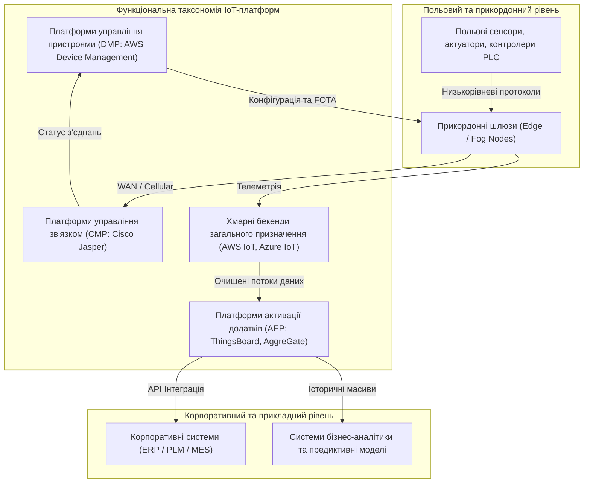
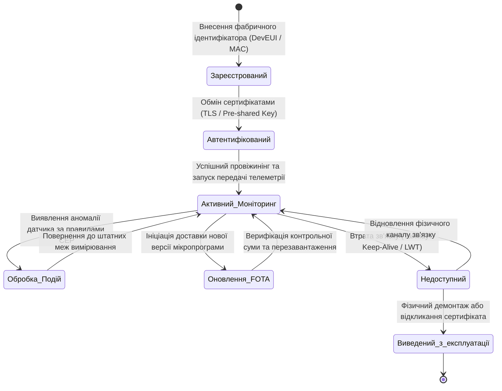
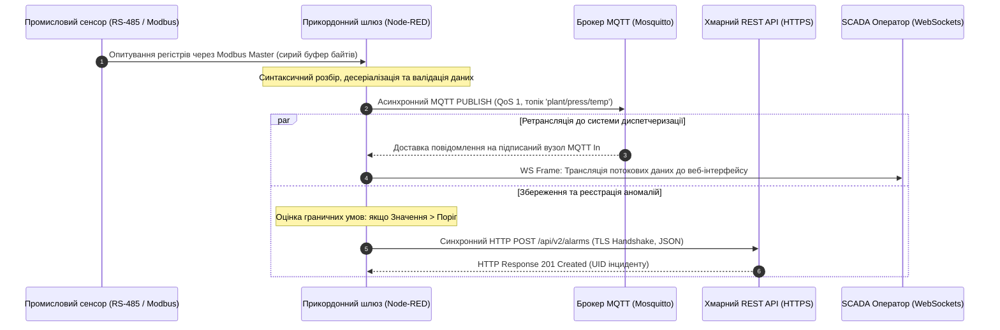
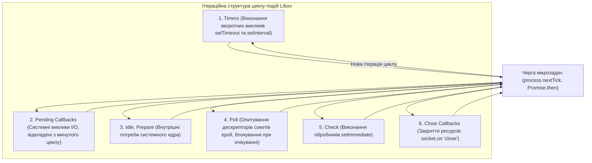
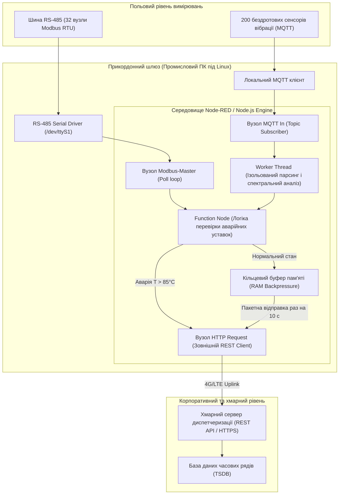

# Тема 10. IoT платформи та Middleware (Node-RED, Node.js)

## Мета лекції

Метою лекції є формування у майбутніх інженерів комплексної системи знань щодо архітектурних принципів, функціонального призначення та практичного використання проміжного програмного забезпечення і платформ Інтернету речей, вивчення концепцій та математичних засад нормалізації гетерогенних даних, а також опанування методології потокового візуального програмування в середовищі Node-RED і розробки масштабованих асинхронних серверних рішень на базі середовища Node.js для надійної інтеграції розподілених польових пристроїв із корпоративними та хмарними сервісами.

## Очікувані результати навчання

1. **Знання та розуміння.** Студенти засвоять фундаментальні принципи функціонування проміжного програмного забезпечення, класифікацію платформ Інтернету речей за функціональними напрямами, концепцію потокового програмування та архітектуру однопотокового неблокуючого циклу обробки подій у середовищі Node.js.
2. **Застосування.** Здобувачі вищої освіти набудуть практичних умінь конструювати інформаційні графи в середовищі Node-RED для міжпротокольної конвертації телеметрії, а також розробляти серверні мікросервіси на мові JavaScript для обробки та ретрансляції сенсорних потоків даних.
3. **Аналіз.** Студенти зможуть аналізувати мережеву латентність у розподілених інформаційних ланцюжках, порівнювати багатопотокові та подійно-орієнтовані моделі конкурентності за допомогою аналітичного апарату теорії масового обслуговування, а також локалізувати вузькі місця у вузлах трансформації даних.
4. **Оцінювання та синтез.** Слухачі навчаться обґрунтовувати вибір типу платформи Інтернету речей під конкретні інженерні обмеження, проєктувати відмовостійкі архітектури прикордонних шлюзів і розробляти комплексні сценарії взаємодії між гетерогенними сенсорними мережами та хмарними системами збереження даних.

---

## Детальний покроковий план лекції

### 1. Теоретико-концептуальний базис. Архітектура Middleware та функціональна таксономія IoT-платформ
* 1.1. Концепція та системні функції проміжного програмного забезпечення як інструменту подолання гетерогенності розподілених кіберфізичних систем
* 1.2. Функціональна таксономія платформ Інтернету речей з виокремленням рівнів AEP, CMP, DMP та хмарних розширень загального призначення
* 1.3. Архітектурна модель восьми базових компонентів повнофункціональної платформи Інтернету речей та принципи їхньої міжрівневої інтеграції
* 1.4. Математична формалізація процесів нормалізації протоколів і простору фізичних вимірювань за критерієм мінімізації інформаційної ентропії

### 2. Методологія та аналіз граничних умов. Потокова обробка в Node-RED та асинхронні моделі обчислень у Node.js
* 2.1. Парадигма потокового програмування та граф-орієнтована модель обробки подійних повідомлень у середовищі Node-RED
* 2.2. Механізми міжпротокольної маршрутизації, фільтрації та контекстної трансформації корисного навантаження в контурах MQTT, WebSockets та HTTP REST API
* 2.3. Архітектурний шаблон Reactor, фазова структура циклу подій Libuv та реалізація неблокуючого введення-виведення в Node.js
* 2.4. Моделювання латентності черги подій на основі співвідношення Поллачека-Хінчіна для систем масового обслуговування типу M/G/1
* 2.5. Критичні бар'єри та вузькі місця однопотокової обробки, проблема блокування циклу подій ресурсомістким синхронним кодом та методи розвантаження ядра за допомогою пулу потоків

### 3. Практичний індустріальний / фаховий кейс. Проєктування багатопротокольного шлюзу промислового Інтернету речей
**Тема наскрізної задачі.** «Розгортання відмовостійкого прикордонного шлюзу на базі Node-RED та Node.js для агрегації телеметрії з польової мережі Modbus RTU/MQTT та її трансляції до хмарної платформи з контролем затримок Event Loop»

## 1. Теоретико-концептуальний базис. Архітектура Middleware та функціональна таксономія IoT-платформ

### 1.1. Концепція та системні функції проміжного програмного забезпечення як інструменту подолання гетерогенності розподілених кіберфізичних систем

Сучасні кіберфізичні системи та розподілені комплекси Інтернету речей характеризуються екстремальним рівнем просторової, апаратної та протокольної гетерогенності. На рівні первинного збору інформації функціонують тисячі різнорідних пристроїв: від восьмибітних мікроконтролерів із вкрай обмеженими обчислювальними ресурсами та енергонезалежною пам'яттю обсягом у кілька кілобайтів до багатоядерних промислових контролерів та прикордонних серверів. Фізичний рівень передачі даних формується несумісними між собою дротовими та бездротовими каналами зв'язку, що охоплюють польові шини послідовного обміну, промислові мережі на основі оптичного волокна, локальні радіоінтерфейси субгігагерцового діапазону, а також стільникові стандарти низького енергоспоживання. Формати представлення вимірювальних величин варіюються від щільно упакованих бінарних бітових масок, сирих шістнадцяткових значень напруги аналого-цифрових перетворювачів до структурованих текстових рядків. Пряма інтеграція кожного окремого датчика чи виконавчого органу безпосередньо з кінцевими аналітичними або корпоративними додатками призводить до експоненційного зростання кількості зв'язків $N \times M$, унеможливлює модифікацію системи та створює непереборні бар'єри масштабування.

Для подолання проблеми структурної дезінтеграції в архітектуру сучасних систем вводиться **проміжне програмне забезпечення** (Middleware). За своєю системною суттю проміжне програмне забезпечення являє собою функціональний шар абстракції, розташований між операційними системами, мережевими драйверами апаратних вузлів та високорівневим прикладним програмним забезпеченням. Головна роль цього шару полягає в приховуванні технічних деталей реалізації фізичного обладнання, забезпеченні прозорості локалізації ресурсів, фільтрації інформаційних шумів та уніфікації методів програмного доступу до сервісів. Проміжне програмне забезпечення гарантує декомпозицію системи на автономні підсистеми завдяки просторовому та часовому розв'язанню компонентів. При просторовому розв'язанні відправник даних не потребує знання фізичної мережевої топології чи IP-адреси конкретного отримувача, адресуючи інформацію до логічних каналів чи тематичних просторів імен. Часове розв'язання дозволяє джерелам інформації публікувати вимірювання навіть тоді, коли кінцевий споживач перебуває в режимі глибокого сну або тимчасово недоступний через деградацію каналу зв'язку.

Функціональний базис сучасного проміжного програмного забезпечення реалізує кілька ключових завдань системної інтеграції. Насамперед це інкапсуляція мережевих протоколів та забезпечення їх міжрівневої трансляції, що дозволяє поєднувати периферійні сегменти без підтримки стека IP із магістральними мережами. Другим критичним завданням є семантична конвертація даних, під час якої різнорідні структури перетворюються на єдиний інформаційний базис підприємства. Проміжне програмне забезпечення бере на себе маршрутизацію повідомлень, балансування мережевого навантаження, управління локальними чергами доставки в умовах нестабільного радіозв'язку, а також забезпечення наскрізної кібербезпеки за допомогою шифрування, авторизації запитів та контролю цілісності інформаційних потоків.

> **ПРАКТИЧНИЙ ЯКІР:** У процесі цифровізації складальних цехів авіабудівного концерну Airbus розгортання промислового проміжного програмного забезпечення дозволило об'єднати в єдиний контур моніторингу застарілі преси з інтерфейсом RS-485 та новітні мобільні заклепувальні платформи, що передають телеметрію по бездротовому стандарту Wi-Fi 6, скоротивши час виявлення геометричних дефектів фюзеляжу на 40 відсотків без заміни наявного верстатного парку.

---

### 1.2. Функціональна таксономія платформ Інтернету речей з виокремленням рівнів AEP, CMP, DMP та хмарних розширень загального призначення

Розвиток концепції проміжного програмного забезпечення зумовив формування спеціалізованого класу програмних комплексів, які отримали назву платформ Інтернету речей. Оскільки жоден універсальний монолітний програмний продукт не здатний одночасно задовольнити взаємовиключні вимоги ультранизької латентності польових мереж та практично необмеженої місткості глобальних аналітичних сховищ, на ринку сформувалася чітка спеціалізація рішень. 

Платформи розробки та активації додатків (**Application Enablement Platforms, AEP**) займають найвищий щабель у прикладній ієрархії IoT-програмного забезпечення. Вони надають інженерам середовище швидкої розробки, яке включає засоби візуального проектування графічних мнемосхем, потужні рушії бізнес-правил, підсистеми управління подіями та диспетчеризації сповіщень. Платформи цього класу абстрагують логіку конкретної предметної галузі від деталей збору інформації, дозволяючи зосередитися на побудові сценаріїв автоматизації розумного будинку, агросектору або інтелектуального виробництва.

Платформи управління зв'язком (**Connectivity Management Platforms, CMP**) сконцентровані на рівні передачі даних та взаємодії з телекомунікаційною інфраструктурою. Основним завданням систем цього типу є централізоване керування пулом абонентських ідентифікаторів (SIM, eSIM, віртуальні профілі), автоматичний вибір оптимального стільникового оператора, облік використаного трафіку, білінг та діагностика стану радіоканалу в реальному часі. CMP виступають фундаментом для масштабних географічно розподілених систем, таких як моніторинг автопарків або дистанційний облік енергоресурсів на рівні країни.

Платформи управління пристроями (**Device Management Platforms, DMP**) забезпечують супровід фізичних компонентів системи на всіх стадіях їхньої експлуатації. До функціонального спектра DMP належить безпечна початкова реєстрація вузла в мережі з видачею унікальних криптографічних сертифікатів, постійний моніторинг апаратного стану батарей та сенсорів, віддалена зміна конфігураційних файлів і виконання масових оновлень вбудованого програмного забезпечення за бездротовим каналом. Своєчасна доставка патчів безпеки через механізми DMP є критичною для запобігання використанню польових пристроїв як елементів ботнет-мереж.

Хмарні бекенди загального призначення є високонавантаженими розподіленими серверами класу IaaS та PaaS, доповненими спеціалізованими модулями обробки даних Інтернету речей. Вони орієнтовані на гарантований прийом терабайтних інформаційних потоків, що надходять одночасно від мільйонів активних сесій, та їх безпечну маршрутизацію в озера даних або розподілені бази часових рядів.

| Клас платформи | Архітектурний фокус | Цільовий рівень стека | Приклад з реальної практики |
| :--- | :--- | :--- | :--- |
| **AEP (Application Enablement)** | Швидке конструювання бізнес-логіки, розробка графічних інтерфейсів, формування правил обробки подій | Прикладний рівень, системи взаємодії з користувачем | Платформа ThingsBoard для моніторингу параметрів мікроклімату та автоматичного поливу у тепличному господарстві |
| **CMP (Connectivity Management)** | Адміністрування телекомунікаційних профілів, облік стільникового трафіку, виявлення обривів зв'язку | Канальний та мережевий рівні зв'язку операторів | Система Cisco Jasper для централізованого білінгу та контролю зв'язку парку комерційних електромобілів |
| **DMP (Device Management)** | Автоматизований провіжинінг, моніторинг метрик заліза, масове завантаження мікропрограм FOTA | Рівень фізичних пристроїв та системне програмне забезпечення | Сервіс AWS IoT Device Management для оновлення систем безпеки та сертифікатів вуличних камер спостереження |
| **Хмарні сервіси (IaaS/PaaS Core)** | Масштабований прийом високочастотних потоків, балансування мережевого навантаження, довготривале архівування | Транспортний рівень, глобальні розподілені сховища | Комплекс Azure IoT Hub у поєднанні з HDInsight для накопичення телеметрії з тисяч вітроенергетичних установок |
| **Edge / Fog Middleware** | Локальна нормалізація протоколів, первинна фільтрація шумів, виконання коду без доступу до хмари | Прикордонні шлюзи, промислові маршрутизатори | Фреймворк EdgeX Foundry або платформа Node-RED, розгорнута на контролері цехової конвеєрної лінії |

---

### 1.3. Архітектурна модель восьми базових компонентів повнофункціональної платформи Інтернету речей та принципи їхньої міжрівневої інтеграції

Згідно з дослідженнями провідних галузевих аналітиків, архітектура повнофункціональної промислової платформи Інтернету речей повинна декомпонуватися на вісім фундаментальних підсистем, кожна з яких відповідає за ізольовану функціональну ділянку обробки інформації та управління.

Першим базовим елементом є компонент зв'язку та нормалізації. Його призначення полягає в підтримці фізичного мережевого з'єднання з вузлами за широким спектром стандартів та трансляції гетерогенних структур вхідних повідомлень у єдиний внутрішньосистемний формат представлення об'єктів. Без нормалізації будь-яка спроба зіставити дані з різних датчиків призводитиме до фатальних помилок інтерпретації параметрів.

Другий елемент — компонент управління пристроями. Він функціонує як системний реєстр активів підприємства, зберігаючи унікальні ідентифікатори пристроїв, їхні мережеві адреси, версії апаратних ревізій та поточний експлуатаційний статус. На цю підсистему покладається реалізація життєвого циклу фізичного вузла в мережі.

Третім компонентом є база даних, яка в сучасних платформах будується за поліглот-архітектурою. Реляційні бази даних застосовуються для збереження конфігураційних параметрів, прав користувачів та структури активів. Нереляційні сховища типу NoSQL та спеціалізовані бази даних часових рядів використовуються для фіксації безперервних високочастотних векторів телеметрії, де кожен запис супроводжується міткою часу з наносекундною або мілісекундною дискретністю.

Четвертий компонент відповідає за обробку та управління діями. Цей програмний модуль безперервно аналізує потоки первинних даних, порівнює їх із граничними уставками та генерує керівні впливи на основі методів комплексної обробки подій (**Complex Event Processing, CEP**). Якщо комбінація параметрів свідчить про аварійну ситуацію, механізм правил негайно ініціює виконання відповідного сценарію без очікування запитів від оператора.

П'ятий компонент — підсистема аналітики. Вона виконує глибинний аналіз накопичених масивів інформації, статистичну обробку, кластеризацію режимів функціонування об'єктів та навчання моделей штучного інтелекту для задач предиктивного обслуговування, попереджаючи технічний персонал про знос підшипників чи деградацію ізоляції задовго до настання критичної відмови.

Шостим елементом є компонент візуалізації, що формує людино-машинний інтерфейс платформи. Сучасні вимоги передбачають інтерактивне представлення даних на основі технологій веб-графіки, де оператор має змогу переглядати мнемосхеми технологічних процесів, графіки часових трендів, теплові карти та просторову локалізацію об'єктів на інтегрованих географічних картах.

Сьомий компонент охоплює додаткові інструменти розробки. До них належать графічні конструктори логіки, вбудовані тестові емулятори поведінки датчиків, інструменти відлагодження інформаційних потоків та пісочниці для безпечного виконання користувацьких скриптів без загрози порушення стабільності ядра платформи.

Восьмий компонент складають зовнішні інтерфейси, які реалізують безпечну взаємодію платформи з навколишнім цифровим середовищем. Через механізми відкритих інтерфейсів REST API, брокери черг повідомлень та веб-сокети здійснюється інтеграція телеметричних даних з корпоративними системами управління виробництвом, системами планування ресурсів підприємства та сторонніми хмарними екосистемами.

> **ТИПОВА ПОМИЛКА:** Поширеною помилкою інженерів-початківців є ототожнення стандартного брокера повідомлень (наприклад, Eclipse Mosquitto) або автономної бази даних часових рядів (наприклад, InfluxDB) із повноцінною платформою Інтернету речей. Брокер повідомлень вирішує виключно транспортне завдання передачі бітових пакетів за шаблоном публікація-підписка без збереження стану, семантичного розбору чи аналітики. Використання ізольованого брокера без інших семи компонентів архітектури вимагає створення власної надбудови управління пристроями, візуалізації та безпеки, що багаторазово здорожчує кінцеву вартість проєкту.

---

### 1.4. Математична формалізація процесів нормалізації протоколів і простору фізичних вимірювань за критерієм мінімізації інформаційної ентропії

Процес нормалізації інформаційних потоків на рівні проміжного програмного забезпечення є суворою математичною операцією взаємно-однозначного перетворення гетерогенного дискретного простору сирих вимірювань у канонічний континуальний простір станів фізичного об'єкта. Формалізуємо множину сирих вхідних пакетів, що надходять від довільного сенсорного вузла, як кортеж інформаційних параметрів:

$$m_{in} = \langle P_{src}, \tau_{rx}, \mathbf{b} \rangle$$

де $P_{src} \in \mathcal{P}$ визначає протокол передачі фізичного каналу зв'язку зі скінченної множини підтримуваних протоколів $\mathcal{P} = \{\text{Modbus}, \text{ZigBee}, \text{LoRaWAN}, \text{BLE}, \text{CoAP}\}$; $\tau_{rx} \in \mathbb{R}^+$ є часовою міткою реєстрації пакета приймальним мережевим інтерфейсом шлюзу; $\mathbf{b} = (b_1, b_2, \dots, b_L) \in \{0, 1\}^L$ являє собою двійковий вектор корисного навантаження довжиною $L$ біт.

Оператор семантичного та протокольного перетворення проміжного програмного забезпечення $\mathcal{T}_{norm}$ здійснює відображення вхідного повідомлення $m_{in}$ у нормалізований вектор фізичних змінних $\mathbf{x} \in \mathbb{R}^k$:

$$\mathcal{T}_{norm}: \mathcal{M}_{in} \longrightarrow \mathcal{M}_{norm}$$

$$\mathbf{x}(\tau) = \mathbf{K} \cdot \psi_{dec}(\mathbf{b}, P_{src}) + \mathbf{x}_0$$

де $\psi_{dec}: \{0,1\}^L \times \mathcal{P} \to \mathbb{Z}^k$ є функцією синтаксичного декодування та десеріалізації бінарного потоку відповідно до специфікації вхідного протоколу, яка витягує з кадрів сирі цілочисельні коди регістрів АЦП; $\mathbf{K} = \operatorname{diag}(k_1, k_2, \dots, k_k)$ позначає діагональну матрицю вагових масштабувальних коефіцієнтів та передавальних характеристик датчиків; $\mathbf{x}_0 = [x_{0,1}, x_{0,2}, \dots, x_{0,k}]^T$ є вектором статичних апаратних зміщень (нульових рівнів або поправок калібрування); $\tau$ позначає скоригований розрахунковий час фізичного вимірювання.

Фундаментальною вимогою до коректності алгоритмів нормалізації в розподілених системах є збереження повноти інформації, тобто мінімізація втрати корисної інформації при переході між форматами представлення. Відповідно до теорії інформації Клода Шеннона, інформаційна ентропія дискретного ансамблю повідомлень джерела $\mathcal{M}$ визначається виразом:

$$H(\mathcal{M}) = -\sum_{i=1}^{N} p(m_i) \log_2 p(m_i)$$

де $p(m_i)$ позначає апостеріорну ймовірність появи дискретного квантованого стану $m_i$ серед $N$ можливих станів системи.

Критерій неспотвореної нормалізації протоколів формулюється як мінімізація втрат ентропії $\Delta H$ за умови збереження метричних інтервалів та детермінованості перетворення:

$$\Delta H = \left| H(\mathcal{M}_{in}) - H(\mathcal{M}_{norm}) \right| \le \varepsilon, \quad \varepsilon \to 0$$

Якщо оператор $\mathcal{T}_{norm}$ містить процедури грубого округлення, втрати розрядності або переповнення буферів, ентропія нормалізованого стану різко спадає, що призводить до незворотної деградації якості роботи високорівневих алгоритмів діагностики та предиктивного аналізу.

> **ПРАКТИЧНИЙ ЯКІР:** При моніторингу вібрацій підшипників газоперекачувальних турбін на компресорних станціях перехід від сирого бінарного кодування тензодатчиків до спрощеного текстового формату з надмірним округленням плаваючої коми викликав зростання інформаційних втрат $\Delta H > 0{,}15\text{ біт/відлік}$, через що математична модель спектрального аналізу перестала детектувати мікротріщини вала на ранніх стадіях зародження дефекту.

> **КОНТРОЛЬНЕ ПИТАННЯ:** Під час модернізації автоматизованого вузла обліку промислових газів на прикордонному шлюзі було впроваджено функцію проміжного програмного забезпечення, яка зчитує 16-розрядні цілочисельні дані витратоміра за протоколом Modbus RTU, конвертує їх у рядок тексту JSON та транслює за протоколом MQTT на хмарний сервер. Яким чином зміна структури представлення даних впливає на пропускну здатність каналу зв'язку та інформаційну ентропію системи вимірювання?

Розгорнути аналіз / відповідь

**Правильний варіант: Зростає навантаження на канал передачі при збереженні інформаційної ентропії за умови відсутності операцій заокруглення.**

1. **Аналітичне обґрунтування:** Первинне корисне навантаження вимірювання в протоколі Modbus займає рівно 2 байти (16 біт). Конвертація цього числа в текстовий формат JSON виду `{"flow": 65535}` потребує щонайменше 15–20 байтів у кодуванні ASCII/UTF-8, до чого додаються накладні заголовки транспортного рівня TCP/IP та службового пакета MQTT. Таким чином, навантаження на фізичний канал зв'язку зростає приблизно в 8–10 разів. Разом з тим, якщо перетворення цілого числа в десятковий рядок здійснюється без квантування та втрати розрядів, функція синтаксичного відображення залишається бієктивною. У результаті інформаційна ентропія за Шенноном не змінюється, оскільки кожному значенню сирого коду АЦП однозначно відповідає рівно одне текстове числове представлення.

2. **Аналіз дистракторів:** Твердження про те, що інформаційна ентропія зменшується внаслідок конвертації у формат JSON, є хибним, оскільки втрата ентропії виникає лише в операціях із неповною інформацією (наприклад, при втраті молодших розрядів чи стисненні з втратами). Твердження про скорочення мережевого трафіку через компактність текстових форматів суперечить дійсності, оскільки бінарні формати завжди мають значно вищу щільність упаковки даних, ніж еквівалентні структуровані текстові серіалізатори.

---

### Вказівки для самостійного осмислення

1. Здійснити аналітичний розрахунок накладних витрат мережевого трафіку при передачі одного мільйона вимірювань температури у вигляді сирого бінарного буфера довжиною 4 байти порівняно з текстовим документом JSON із зазначенням мітки часу та унікального ідентифікатора пристрою.
2. Проаналізувати функціональні відмінності між архітектурою відкритих прикордонних платформ EdgeX Foundry та комерційних хмарних сервісів Azure IoT Hub, виокремивши специфіку їхнього застосування для виробничих процесів із жорсткими часовими обмеженнями.
3. Розробити концептуальну схему декомпозиції складної системи управління міським водопостачанням на рівні таксономії IoT Analytics, визначивши функціональні обов'язки платформ класу CMP, DMP та AEP у загальному контурі автоматизації.

## 2. Методологія та аналіз граничних умов. Потокова обробка в Node-RED та асинхронні моделі обчислень у Node.js

### 2.1. Парадигма потокового програмування та граф-орієнтована модель обробки подійних повідомлень у середовищі Node-RED

Парадигма потокового програмування (**Flow-Based Programming, FBP**) базується на концепції представлення обчислювального процесу як орієнтованої мережі автономних функціональних компонентів, що взаємодіють між собою виключно шляхом передачі дискретних інформаційних пакетів через фіксовані комунікаційні канали. На відміну від класичного імперативного підходу, де послідовність виконання жорстко зафіксована лістингом інструкцій та станом глобального адресного простору пам'яті, у парадигмі FBP керування повністю підпорядковане доступності вхідних даних. Функціональний блок залишається пасивним доти, доки на його вхідні інтерфейси не надійде квант інформації, що ініціює локальне перетворення та породжує вихідне повідомлення без модифікації внутрішнього стану сусідніх вузлів.

У середовищі потокового моделювання **Node-RED** зазначена парадигма отримує формалізовану граф-орієнтовану реалізацію. Програмний потік проектується у формі орієнтованого мультиграфа $G = (V, E)$, де множина вершин $V$ відповідає програмним блокам обробки, а множина спрямованих дуг $E$ описує комунікаційні траєкторії руху об'єктів повідомлень. Кожен вузол $v_i \in V$ інкапсулює детерміновану функцію перетворення $\phi_i: \mathcal{M} \to \mathcal{M} \cup \{\emptyset\}$, що відображає вхідне повідомлення у вихідне або повністю відсіює його у разі невиконання заданих фільтраційних умов.

Комунікація між вершинами графа здійснюється за допомогою уніфікованого об'єкта повідомлення `msg`. Архітектурна узгодженість середовища забезпечується збереженням базових полів, серед яких головну інформаційну роль відіграє корисне навантаження `msg.payload` довільної структури та контекстний маршрутизатор `msg.topic`. Для збереження проміжних результатів обчислень у Node-RED використовується трирівнева модель контексту: локальний контекст вузла (**Node Context**), видимий лише в межах поточної вершини; контекст інформаційного потоку (**Flow Context**), доступний для всіх взаємопов'язаних вузлів на окремій вкладці робочої області; глобальний контекст (**Global Context**), доступний для всієї активної конфігурації середовища. 

> **ВАЖЛИВО:** При проєктуванні інформаційних потоків у Node-RED використання глобального контексту має суворо обмежуватися константами конфігурації, оскільки неконтрольована модифікація глобальних об'єктів паралельними асинхронними подіями порушує інваріант ізоляції FBP-компонентів і породжує важковиправні стани перегонів (race conditions).

---

### 2.2. Механізми міжпротокольної маршрутизації, фільтрації та контекстної трансформації корисного навантаження в контурах MQTT, WebSockets та HTTP REST API

Реалізація шлюзів прикордонної взаємодії вимагає узгодження різних за своєю природою комунікаційних моделей, таких як модель публікації-підписки протоколу MQTT, синхронна транзакційна модель запит-відповідь протоколу HTTP та повнодуплексний потоковий обмін постійних сесій WebSockets. Проміжне програмне забезпечення функціонує як багатопротокольний маршрутизатор, який усуває несумісність форматів та семантичних часових рамок між цими протоколами.

Наведена на рисунку послідовність взаємодії демонструє процес одночасного розщеплення інформаційного потоку. Отриманий із польової шини бінарний масив після первинного розбору перетворюється на нормалізоване повідомлення, яке публікується у брокер MQTT для забезпечення локального шинного обміну. Одночасно активований потік дублює інформацію на диспетчерські веб-панелі за допомогою легковикого бінарного протоколу WebSockets без створення накладних витрат на повторні з'єднання. Якщо модуль правил виявляє перевищення технологічного ліміту, потік ініціює створення захищеної сесії TLS для виклику зовнішнього хмарного REST API.

Міжпротокольна трансформація вимагає обов'язкової динамічної конвертації метаданих. Якщо в протоколі MQTT адресація повністю інкапсульована в текстовому ієрархічному рядку теми, то протокол HTTP вимагає перенесення цієї інформації в структуру шляху уніфікованого ідентифікатора ресурсів (URI) та формування службових заголовків `Content-Type` і `Authorization`. Проміжне програмне забезпечення здійснює автоматичне зіставлення цих параметрів, запобігаючи втраті контексту походження вимірювання.

---

### 2.3. Архітектурний шаблон Reactor, фазова структура циклу подій Libuv та реалізація неблокуючого введення-виведення в Node.js

В основі високопродуктивної обробки повідомлень як самого середовища Node-RED, так і автономних серверних сервісів Інтернету речей лежить програмна платформа **Node.js**. Її фундаментальною архітектурною концепцією є відмова від виділення окремого потоку операційної системи на кожне мережеве підключення на користь архітектурного шаблону **Reactor**, реалізованого за допомогою низькорівневої системної бібліотеки **Libuv**.

Шаблон Reactor базується на синхронному демультиплексуванні подій введення-виведення за допомогою механізмів ядра операційної системи, таких як `epoll` у дистрибутивах Linux, `kqueue` в BSD-системах та `IOCP` у сімействі ОС Windows. Замість того, щоб блокувати процесор в очікуванні надходження чергового кадру від датчика, потік програми передає дескриптор сокета ядру операційної системи разом із зареєстрованим вказівником на функцію зворотного виклику (**Callback**).

Цикл подій (**Event Loop**) послідовно проходить через шість строго детермінованих фаз, виконання кожної з яких супроводжується очищенням пріоритетної черги мікрозадач:

1. Фаза таймерів перевіряє поріг спрацьовування таймерів, створених функціями `setTimeout()` та `setInterval()`, та ініціює їхні обробники.
2. Фаза очікування зворотних викликів виконує функції, які повернули системні помилки мережевих адаптерів або буферів на попередніх кроках.
3. Фаза підготовки та простою виконує внутрішні налаштування контексту рушія.
4. Фаза опитування є ядром системи, де здійснюється розрахунок часу блокування потоку, отримання нових пакетів даних із зареєстрованих сокетів та запуск функцій обробки вхідної телеметрії.
5. Фаза перевірки викликає специфічні функції, призначені методом `setImmediate()`, дозволяючи впроваджувати код безпосередньо після фази опитування введення-виведення.
6. Фаза закриття виконує деструктори та очищення пам'яті при аварійному або штатному розриві сокетів.

Черга мікрозадач, що обробляє виклики `process.nextTick()` та резолви `Promise`, має найвищий пріоритет. Вона повністю вичерпується після завершення кожної операції поточної фази, що забезпечує миттєву реакцію на внутрішні зміни стану програми.

---

### 2.4. Моделювання латентності черги подій на основі співвідношення Поллачека-Хінчіна для систем масового обслуговування типу M/G/1

Для кількісної оцінки часових характеристик та стійкості прикордонного шлюзу на базі Node.js застосуємо апарат теорії масового обслуговування. Оскільки вхідний потік повідомлень від великої кількості незалежних сенсорів є пуассонівським процесом, а тривалість обробки повідомлень є випадковою величиною з довільним законом розподілу через змінну довжину корисного навантаження, прикордонний шлюз моделюється як система масового обслуговування типу $M/G/1$.

Формалізуємо процес аналізу та розрахунку середнього часу перебування повідомлення в черзі подій циклу Event Loop за допомогою поетапного виведення:

$$
\begin{aligned}
\text{Крок 1 (Параметризація навантаження):} & \quad \lambda = \sum_{j=1}^{M} \lambda_j, \quad \mathbb{E}[S] = \frac{1}{\mu} \\
\text{Крок 2 (Коефіцієнт завантаження системи):} & \quad \rho = \lambda \cdot \mathbb{E}[S] = \frac{\lambda}{\mu} < 1 \\
\text{Крок 3 (Другий момент часу обслуговування):} & \quad \mathbb{E}[S^2] = \operatorname{Var}(S) + (\mathbb{E}[S])^2 = \sigma_S^2 + \frac{1}{\mu^2} \\
\text{Крок 4 (Формула Поллачека-Хінчіна):} & \quad W_q = \frac{\lambda \cdot \mathbb{E}[S^2]}{2(1 - \rho)} = \frac{\lambda (\sigma_S^2 + \mu^{-2})}{2(1 - \lambda / \mu)} \\
\text{Крок 5 (Повний середній час затримки):} & \quad T_{resp} = W_q + \mathbb{E}[S] = \frac{\lambda (\sigma_S^2 + \mu^{-2})}{2(1 - \lambda / \mu)} + \frac{1}{\mu}
\end{aligned}
$$

У наведеній математичній моделі величина $\lambda$ позначає сумарну інтенсивність вхідного потоку пакетів від $M$ підключених пристроїв, вимірювану в повідомленнях за секунду; $\mathbb{E}[S]$ є математичним сподіванням часу виконання синхронного коду обробника в головному потоці V8; $\mu$ — середня продуктивність обробки подій одним потоком; $\rho$ — безрозмірний коефіцієнт утилізації обчислювальних ресурсів процесора; $\sigma_S^2$ позначає дисперсію часу виконання обробників; $W_q$ визначає математичне сподівання часу очікування повідомлення в черзі циклу подій (**Event Loop Lag**); $T_{resp}$ є повним часом реакції шлюзу від моменту надходження пакета до завершення його передачі у вихідний канал.

Аналіз формули Поллачека-Хінчіна виявляє критичну залежність: навіть за умови ненасиченого навантаження, коли коефіцієнт утилізації процесора становить помірні величини $\rho \approx 0{,}6 \dots 0{,}7$, значна дисперсія тривалості обробки $\sigma_S^2$ викликає різке, майже експоненційне зростання часу очікування $W_q$. Якщо в систему надходять неструктуровані пакети, час парсингу яких суттєво відрізняється від середнього, виникають тривалі мікрозатримки, неприпустимі для систем автоматизації реального часу.

> **ПРАКТИЧНИЙ ЯКІР:** Під час пікових навантажень на автоматизованих сортувальних терміналах логістичного оператора Deutsche Post обробка штрих-кодів посилчастих сканерів за допомогою однопотокового шлюзу викликала зростання затримки Event Loop Lag з $2\text{ мс}$ до $450\text{ мс}$ через варіативність довжини бінарних пакетів, що зумовило збої синхронізації оптичних датчиків конвеєра та вимагало винесення розбору зображень у пули Worker Threads.

---

### 2.5. Критичні бар'єри та вузькі місця однопотокової обробки, проблема блокування циклу подій ресурсомістким синхронним кодом та методи розвантаження ядра за допомогою пулу потоків

Незважаючи на високу ефективність архітектури Reactor під час операцій введення-виведення, однопотокова природа середовища Node.js становить головне джерело архітектурних ризиків у задачах Інтернету речей. Головний потік платформи виконує компіляцію, оптимізацію коду в рушії V8 та виклики всіх функцій зворотного виклику. Якщо будь-який вузол системи запускає обчислювально складну синхронну операцію, весь процес виконання циклу подій повністю блокується.

**ГРАНИЧНІ УМОВИ ЗАСТОСУВАННЯ МОДЕЛІ:**
Теоретична модель високої масштабованості асинхронного неблокуючого вводу-виводу повністю деградує та втрачає практичну релевантність у таких випадках:
- Якщо корисне навантаження складається з великих обсягів структурованого тексту, операція `JSON.parse()` над масивами розміром понад $5\text{ Мбайт}$ блокує головний потік на десятки мілісекунд, протягом яких шлюз перестає відповідати на Keep-Alive запити від мережевих контролерів.
- Застосування криптографічних операцій шифрування або підпису телеметрії алгоритмами типу RSA без використання апаратних криптопроцесорів призводить до падіння пропускної здатності черги сокетів на два порядки.
- Використання регулярних виразів із катастрофічним поверненням (Catastrophic Backtracking) для синтаксичного аналізу сирих рядків може спричинити зависання процесу V8 із навантаженням на процесорне ядро у 100 відсотків.

Для усунення зазначених критичних бар'єрів розробляються методи апаратного та програмного розвантаження головного ядра. Першим підходом є делегування важких завдань стандартному фоновому пулу потоків бібліотеки Libuv (**Thread Pool**), розмір якого за замовчуванням становить 4 потоки і може бути динамічно розширений встановленням змінної середовища `UV_THREADPOOL_SIZE`. Цей пул автоматично обслуговує системні виклики файлової системи, DNS-запити та вбудовані криптографічні модулі. Другим підходом є використання багатопотокового модуля **Worker Threads**, що дозволяє створювати паралельні ізоляти рушія V8 зі спільним буфером пам'яті (`SharedArrayBuffer`), переносячи ресурсомісткі математичні алгоритми цифрової фільтрації на інші фізичні ядра центрального процесора.

| Модель обробки | Складність впровадження | Пропускна здатність при I/O-bound задачах | Поведінка при ресурсомістких обчисленнях (CPU-bound) | Критичні ризики / Обмеження |
| :--- | :--- | :--- | :--- | :--- |
| **Однопотоковий Reactor (Node.js / Node-RED)** | Низька (проста модель написання коду без синхронізації) | Екстремально висока (до $10^5$ підключень на вузол) | Катастрофічна деградація (блокування черги подій) | Блокування головного потоку будь-якою синхронною операцією, ризик переповнення пам'яті |
| **Багатопотокова блокуюча модель (Java / C++)** | Висока (вимагає управління м'ютексами, блокуваннями) | Середня (лінійне зростання витрат на стек потоку) | Висока (рівномірний розподіл навантаження по ядрах) | Високі накладні витрати на перемикання контексту ОС, загроза взаємних блокувань (Deadlocks) |
| **Пул Worker Threads у Node.js** | Середня (вимагає організації асинхронного IPC зв'язку) | Висока (збереження неблокуючого мережевого вводу) | Добра (обчислення ізольовані в окремих потоках) | Накладні витрати на серіалізацію повідомлень між потоками, складність балансування пулу |
| **Акторна модель (Erlang / Elixir OTP)** | Дуже висока (вимагає зміни парадигми на чисту функціональну) | Максимальна (мільйони паралельних мікропроцесів) | Відмінна (витісняюча багатозадачність, ізоляція крахів) | Високий поріг входження, дефіцит готових драйверів промислового обладнання |

---

> **КОНТРОЛЬНЕ ПИТАННЯ:** Промисловий контролер автоматизації газової котельні під керуванням середовища Node-RED опитує 50 датчиків тиску та температури з інтервалом $100\text{ мс}$ через послідовну шину Modbus RTU. Інженер додав у потік обробки вузол `Function`, який виконує синхронний розрахунок поліноміальної регресії вищого порядку для прогнозування аварійного викиду газу, що триває в середньому $80\text{ мс}$ на кожну вибірку. Поясніть, чому через кілька секунд після запуску система починає фіксувати масові таймаути читання датчиків і втрачає зв'язок із сервером диспетчеризації?

Розгорнути аналіз / відповідь

**Правильний варіант: Блокування однопотокового циклу подій (Event Loop) важким синхронним обчисленням у поєднанні з переповненням черги вхідних запитів.**

1. **Етапи аналітичного розв'язку:**
   - Розрахунок сумарної інтенсивності вхідного потоку: при періоді опитування кожного з $50$ датчиків у $T = 100\text{ мс}$, сумарна частота генерації подій становить $\lambda = 50 / 0{,}1 = 500\text{ подій/с}$.
   - Аналіз тривалості обслуговування: тривалість синхронної обчислювальної функції складає $S = 80\text{ мс} = 0{,}08\text{ с}$. Максимальна пропускна здатність процесора для даної задачі становить $\mu = 1 / 0{,}08 = 12{,}5\text{ подій/с}$.
   - Оцінка коефіцієнта завантаження системи: $\rho = \lambda / \mu = 500 / 12{,}5 = 40$. Оскільки умова стійкості черги $\rho < 1$ грубо порушена, черга задач у фазі Poll починає зростати до нескінченності.
   - Наслідки для системи: цикл подій виявляється заблокованим синхронним кодом регресії протягом $80\text{ мс}$. Таймери опитування послідовного порту та зворотні виклики Keep-Alive сокета TCP/IP не можуть отримати процесорний час. Послідовні буфери переповнюються, викликаючи системні помилки переповнення (Overrun Error), а брокер розриває з'єднання через перевищення інтервалу пінгу.

2. **Аналіз дистракторів:**
   - Пояснення через недостатню швидкість фізичної лінії RS-485 є хибним, оскільки таймаути виникають не на фізичній лінії, а безпосередньо в диспетчері подій операційної системи шлюзу.
   - Пояснення збоєм операційної пам'яті є вторинним: витік або дефіцит оперативної пам'яті стане наслідком необмеженого буферизування невідпрацьованих об'єктів `msg` у черзі Libuv, але першопричиною є порушення правила неблокуючого виконання в головному потоці V8.

## 3. Практичний індустріальний / фаховий кейс. Проєктування багатопротокольного шлюзу промислового Інтернету речей

### 3.1. Комплексний фаховий кейс. Розгортання відмовостійкого прикордонного шлюзу на базі Node-RED та Node.js

#### Постановка задачі / ситуації

На металургійному комбінаті впроваджується система моніторингу та раннього виявлення перегріву підшипникових вузлів прокатного стану. Технологічна лінія містить тридцять два важких редуктори, кожен з яких оснащений цифровим вимірювальним модулем температури та струму двигуна з інтерфейсом RS-485 (протокол Modbus RTU). Одночасно в цеху розгорнута бездротова сенсорна мережа з двохсот автономних віброперетворювачів, які передають усереднені спектральні характеристики вібрації через локальний бездротовий шлюз у топіки брокера MQTT.

Перед інженером-розробником поставлено завдання спроєктувати та запустити прикордонний шлюз на базі промислового комп'ютера з операційною системою Linux. Шлюз повинен опитувати фізичні пристрої за протоколом Modbus RTU, приймати асинхронні повідомлення MQTT, виконувати локальну первинну нормалізацію даних, виявляти аварійні виходи за уставки та транслювати агреговані телеметричні пакети до корпоративної хмарної платформи через зовнішній канал 4G/LTE за протоколом HTTPS REST API. Головним інженерним викликом є запобігання деградації пропускної здатності та накопичення черг у циклі подій Node-RED при сплесках вібраційних повідомлень.

| Параметр системи | Символьне позначення | Числове значення | Одиниці вимірювання та примітки |
| :--- | :--- | :--- | :--- |
| Кількість Modbus-вузлів на шині RS-485 | $N$ | $32$ | Прилади обліку температури та струму |
| Швидкість передачі по шині RS-485 | $B$ | $19200$ | біт/с (формат кадру: 1 старт, 8 даних, 1 стоп, без парності) |
| Розмір запиту / відповіді Modbus RTU | $L_{req} / L_{resp}$ | $8 / 15$ | Байти (читання чотирьох регістрів зберігання) |
| Затримка відповіді датчика Modbus | $t_{turn}$ | $5{,}0$ | мілісекунди (апаратна затримка контролера) |
| Кількість вібродатчиків у мережі MQTT | $M$ | $200$ | Бездротові автономні вузли |
| Частота публікації одного вібродатчика | $f_{v}$ | $5$ | повідомлень за секунду ($5\text{ Гц}$) |
| Середній час обробки пакета в Node-RED | $\mathbb{E}[S]$ | $0{,}4$ | мілісекунди ($0{,}0004\text{ с}$) |
| Середньоквадратичне відхилення часу обробки | $\sigma_S$ | $0{,}2$ | мілісекунди ($0{,}0002\text{ с}$) |
| Пропускна здатність каналу зв'язку 4G/LTE | $C_{wan}$ | $5$ | Мбіт/с |
| Допустима затримка аварійної реакції | $\tau_{crit}$ | $100$ | мілісекунди (жорстке обмеження автоматики) |

---

#### Покроковий аналіз та розв'язок

##### Крок 1. Розрахунок пропускної здатності фізичного рівня Modbus RTU та частоти опитування

Для запобігання колізіям на спільній шині RS-485 шлюз виступає в ролі єдиного ведучого пристрою (Master). Тривалість передачі одного байта $t_{byte}$ при швидкості $19200\text{ біт/с}$ та довжині символу в $10\text{ біт}$ становить:

$$t_{byte} = \frac{10}{19200} \approx 0{,}5208\text{ мс}$$

Повний час транзакції для опитування одного підпорядкованого пристрою $t_{slave}$ складається з передачі запиту, міжфреймового інтервалу тиші $3{,}5\text{ символу}$, апаратного часу реакції датчика $t_{turn}$, прийому відповіді та захисного інтервалу завершення кадру:

$$t_{frame\_silence} = 3{,}5 \times t_{byte} = 3{,}5 \times 0{,}5208 \approx 1{,}823\text{ мс}$$

$$
\begin{aligned}
t_{slave} &= (L_{req} \times t_{byte}) + t_{frame\_silence} + t_{turn} + (L_{resp} \times t_{byte}) + t_{frame\_silence} \\
t_{slave} &= (8 \times 0{,}5208) + 1{,}823 + 5{,}0 + (15 \times 0{,}5208) + 1{,}823 \approx 20{,}637\text{ мс}
\end{aligned}
$$

Загальний період опитування всіх $N = 32$ датчиків на шині становить:

$$T_{cycle} = N \times t_{slave} = 32 \times 20{,}637\text{ мс} \approx 660{,}38\text{ мс} \approx 0{,}66\text{ с}$$

Інтенсивність надходження повідомлень від підсистеми Modbus дорівнює:

$$\lambda_{Modbus} = \frac{N}{T_{cycle}} = \frac{32}{0{,}66038} \approx 48{,}46\text{ повідомлень/с}$$

##### Крок 2. Оцінка сумарного навантаження на чергу подій Node.js

Загальний вхідний потік формується суперпозицією детермінованого опитування Modbus та стохастичного надходження повідомлень від вібродатчиків по каналу MQTT:

$$\lambda_{MQTT} = M \times f_v = 200 \times 5 = 1000\text{ повідомлень/с}$$

$$\lambda = \lambda_{Modbus} + \lambda_{MQTT} = 48{,}46 + 1000 = 1048{,}46\text{ повідомлень/с}$$

Розрахуємо коефіцієнт завантаження головного потоку платформи $\rho$ за умови, що середній час обробки повідомлення становить $\mathbb{E}[S] = 0{,}0004\text{ с}$:

$$\rho = \lambda \cdot \mathbb{E}[S] = 1048{,}46 \times 0{,}0004 \approx 0{,}4194 \quad (41{,}94\%)$$

Оскільки коефіцієнт завантаження менший за одиницю ($\rho < 1$), система залишається ергодичною, і черга в теорії не повинна необмежено зростати.

##### Крок 3. Моделювання затримки Event Loop Lag за формулою Поллачека-Хінчіна

Для оцінки реального часу очікування повідомлення у черзі подій Libuv застосуємо математичну модель системи масового обслуговування $M/G/1$. Другий початковий момент часу обслуговування $\mathbb{E}[S^2]$ визначається через дисперсію $\sigma_S^2 = (0{,}0002)^2 = 4 \times 10^{-8}\text{ с}^2$:

$$\mathbb{E}[S^2] = \sigma_S^2 + (\mathbb{E}[S])^2 = 4 \times 10^{-8} + (0{,}0004)^2 = 2{,}0 \times 10^{-7}\text{ с}^2$$

Середній час перебування повідомлення в черзі циклу подій становить:

$$W_q = \frac{\lambda \cdot \mathbb{E}[S^2]}{2(1 - \rho)} = \frac{1048{,}46 \times 2{,}0 \times 10^{-7}}{2 \times (1 - 0{,}4194)} = \frac{2{,}0969 \times 10^{-4}}{1{,}1612} \approx 1{,}8058 \times 10^{-4}\text{ с} \approx 0{,}181\text{ мс}$$

Повний час реакції програмного шлюзу на одну подію складає:

$$T_{resp} = W_q + \mathbb{E}[S] = 0{,}181\text{ мс} + 0{,}4\text{ мс} = 0{,}581\text{ мс}$$

Отримане значення $0{,}581\text{ мс}$ значно менше за критичний технологічний поріг $\tau_{crit} = 100\text{ мс}$, що підтверджує стійкість системи в штатному режимі функціонування.

##### Крок 4. Аналіз критичного стану при виникненні аномалії корисного навантаження

Припустимо, що в результаті програмного збою один із вібродатчиків починає надсилати нестиснені сирі масиви спектра, що призводить до зростання часу розбору JSON у вузлі Node-RED до $S_{anomaly} = 2{,}5\text{ мс}$ ($0{,}0025\text{ с}$). Якщо частка таких повідомлень становить лише $10\%$ від загального потоку MQTT ($\lambda_{anomaly} = 100\text{ повідомлень/с}$), новий середній час обробки перераховується наступним чином:

$$\mathbb{E}[S_{new}] = 0{,}9 \times 0{,}0004 + 0{,}1 \times 0{,}0025 = 0{,}00036 + 0{,}00025 = 0{,}00061\text{ с}$$

Новий коефіцієнт завантаження системи:

$$\rho_{new} = \lambda \cdot \mathbb{E}[S_{new}] = 1048{,}46 \times 0{,}00061 \approx 0{,}6396$$

Розрахуємо новий другий момент часу обслуговування, враховуючи високу варіативність:

$$\mathbb{E}[S_{new}^2] = 0{,}9 \times (0{,}0004^2 + 0{,}0002^2) + 0{,}1 \times (0{,}0025)^2 = 0{,}9 \times (2 \times 10^{-7}) + 0{,}1 \times (6{,}25 \times 10^{-6}) = 8{,}05 \times 10^{-7}\text{ с}^2$$

Новий середній час очікування в черзі:

$$W_{q\_new} = \frac{1048{,}46 \times 8{,}05 \times 10^{-7}}{2 \times (1 - 0{,}6396)} = \frac{8{,}44 \times 10^{-4}}{0{,}7208} \approx 1{,}17 \times 10^{-3}\text{ с} \approx 1{,}17\text{ мс}$$

Хоча математичне сподівання затримки зросло майже на порядок, система зберігає працездатність, проте поодинокі важкі повідомлення блокують цикл подій на $2{,}5\text{ мс}$, що зумовлює сплески джиттеру в опитуванні послідовного порту RS-485.

---

#### Інтерпретація результатів та альтернативні сценарії

Проведений розрахунок доводить, що архітектура на основі Node-RED та Node.js забезпечує необхідну швидкодію в умовах змішаних промислових навантажень за умови, що час обчислень у функціональних вузлах суворо обмежений субмілісекундним діапазоном.

Якби проектні вимоги змінилися у бік збільшення кількості точок вібромоніторингу до двох тисяч або частоти опитування до $50\text{ Гц}$ на датчик, вхідна інтенсивність сягнула б величини $\lambda \approx 100000\text{ повідомлень/с}$. За таких умов коефіцієнт $\rho$ перевищив би $40$, що призвело б до миттєвого колапсу системи, вичерпання виділеної оперативної пам'яті V8 Heap та аварійного завершення процесу. 

Для вирішення подібних високочастотних завдань необхідно застосувати альтернативну архітектуру: перенести процедури парсингу та попередньої фільтрації вібраційного спектра безпосередньо на прикордонний рівень драйверів операційної системи шляхом розробки C++ аддонів для Node.js або використання пулу фонових потоків `Worker Threads`, а вхідний потік протоколу MQTT агрегувати на рівні проміжного брокера з пакетною передачею телеметрії.

---

### 3.2. Зведена довідкова система лекції

| Термін / Концепція | Формалізація / Сутність | Реальний кейс застосування | Основне обмеження / Ризик |
| :--- | :--- | :--- | :--- |
| **Проміжне ПЗ (Middleware)** | Шар абстракції $\mathcal{T}_{norm}: \mathcal{M}_{in} \to \mathcal{M}_{norm}$, що усуває просторову та часову прив'язку систем | Інтеграція застарілих верстатів ЧПУ з хмарними MES-системами | Зростання обчислювальних накладних витрат та затримок передачі |
| **AEP Платформа** | Комплекс інструментів візуалізації, CEP та оркестрації бізнес-правил | Диспетчеризація мікроклімату в мережі тепличних господарств | Непридатність для прямого керування швидкими приводами (<10 мс) |
| **DMP Платформа** | Сервіс обліку життєвого циклу, автентифікації та масових оновлень FOTA | Управління прошивками парку з 50 000 розумних лічильників води | Ризик виведення з ладу обладнання при некоректній верифікації образу |
| **CMP Платформа** | Інтерфейс управління пулом телеком-з'єднань, e-SIM та білінгу трафіку | Моніторинг та балансування зв'язку логістичного парку вантажівок | Залежність від зони покриття та тарифної політики стільникових мереж |
| **Flow-Based Programming** | Обчислення у вигляді орієнтованого графа $G=(V,E)$ над об'єктами `msg` | Візуальна побудова шлюзів телеметрії в середовищі Node-RED | Складність відлагодження паралельних гілок та спільних контекстів |
| **Шаблон Reactor** | Синхронне демультиплексування подій сокетів через системний виклик `epoll` | Обслуговування тисяч одночасних IoT-з'єднань одним потоком Node.js | Повне блокування черги при виконанні синхронних обчислень CPU |
| **Event Loop Lag** | Час очікування задачі в черзі фази Poll, оцінюваний через $W_q$ для $M/G/1$ | Моніторинг надійності прикордонного IoT-шлюзу під навантаженням | Лавиноподібне зростання затримок при збільшенні дисперсії часу обробки |
| **Зворотний тиск (Backpressure)** | Механізм сигналізації джерелу про зниження темпу генерації потоку даних | Захист локального буфера пам'яті шлюзу при обриві зовнішнього 4G каналу | Ризик втрати телеметрії при відсутності локальних енергонезалежних буферів |

---

### 3.3. Контрольні питання та завдання

#### Прикладні тестові завдання

1. Прикордонний шлюз на базі Node-RED збирає телеметрію з контролерів. Розробник реалізував функцію розрахунку геш-суми SHA-256 від вхідного буфера даних розміром 10 Мбайт за допомогою стандартного синхронного модуля `crypto.createHash` у вузлі Function. Що відбудеться з мережевими клієнтами MQTT, які надсилають Keep-Alive пакети кожні 100 мс, під час виконання цього блоку?
   - A. Клієнти продовжать роботу без змін, оскільки Node-RED автоматично виносить вузли Function в окремі процеси ОС.
   - B. Повідомлення клієнтів будуть оброблені з мінімальною затримкою завдяки асинхронному пулу потоків Libuv.
   - C. Клієнти отримають таймаут з'єднання та будуть відключені брокером, оскільки синхронний виклик заблокує цикл подій.
   - D. Платформа перенаправить надлишковий трафік у віртуальну пам'ять без затримки основного потоку.

Розгорнути аналіз / відповідь

**Правильний варіант: C.**

1. **Повне обґрунтування:** Синхронні методи криптографічного модуля, виконані всередині головного потоку Node.js (де функціонує середовище виконання Node-RED), блокують стек викликів V8 на весь час обчислення гешу. Протягом цього проміжку жодна фаза циклу подій (включаючи обробку сокетів `epoll` та таймерів) не отримує процесорного часу. Якщо тривалість розрахунку перевищує інтервал очікування пінгу, брокер вважає вузол відключеним та ініціює процедуру розриву сесії.

2. **Аналіз дистракторів:**
   - Варіант A є хибним, оскільки стандартний вузол `Function` у Node-RED виконує JavaScript у тому ж самому процесі та потоці, що й саме ядро середовища.
   - Варіант B є хибним, оскільки синхронні функції з префіксом `Sync` або прямі обчислювальні виклики без зворотного виклику не делегуються системному пулу потоків Libuv.
   - Варіант D є хибним, оскільки пам'ять під черги формується динамічно, але не здатна компенсувати зупинку диспетчеризації дескрипторів вхідних мережевих інтерфейсів.

2. Під час аналізу черги повідомлень на шлюзі встановлено, що середнє завантаження процесора становить $\rho = 0{,}5$. Проте дисперсія тривалості парсингу повідомлень зросла у 16 разів через надходження пошкоджених пакетів різної довжини. Як зміниться середній час очікування повідомлення в черзі $W_q$ відповідно до формули Поллачека-Хінчіна?
   - A. Зменшиться вдвічі через спрацьовування внутрішніх механізмів витіснення задач.
   - B. Залишиться незмінним, оскільки коефіцієнт утилізації ядра $\rho$ не змінився.
   - C. Зросте майже прямо пропорційно зростанню другого моменту часу обслуговування.
   - D. Зросте рівно вдвічі відповідно до лінійної моделі Маркова $M/M/1$.

Розгорнути аналіз / відповідь

**Правильний варіант: C.**

1. **Повне обґрунтування:** Згідно з формулою Поллачека-Хінчіна $W_q = \frac{\lambda \mathbb{E}[S^2]}{2(1 - \rho)}$, час очікування в черзі безпосередньо пропорційний другому моменту часу обслуговування $\mathbb{E}[S^2] = \sigma_S^2 + (\mathbb{E}[S])^2$. При незмінному значенні $\rho = 0{,}5$ та математичному сподіванні $\mathbb{E}[S]$, різке збільшення дисперсії $\sigma_S^2$ суттєво збільшує чисельник дробу, що призводить до відповідного пропорційного зростання часу затримки в черзі Event Loop.

2. **Аналіз дистракторів:**
   - Варіант A є хибним, оскільки цикл подій Libuv реалізує кооперативну, а не витісняючу багатозадачність, і не може зменшити чергу без втрати пакетів.
   - Варіант B є хибним, оскільки незалежність затримки від дисперсії характерна лише для примітивних систем без урахування стохастичності тривалості операцій.
   - Варіант D є хибним, оскільки модель $M/M/1$ спирається на експоненційний розподіл тривалості обслуговування, де дисперсія жорстко пов'язана із математичним сподіванням, що не відповідає реальним умовам варіативного парсингу пакетів.

3. Який механізм середовища Node-RED забезпечує тимчасове припинення зчитування повідомлень із польової шини у випадку, коли зовнішній хмарний буфер переповнений або фізичний канал передачі тимчасово недоступний?
   - A. Автоматичне збільшення тактової частоти віртуальної машини V8.
   - B. Реалізація механізму зворотного тиску (Backpressure) з використанням сигналів паузи джерела.
   - C. Примусове скидання налаштувань підпорядкованих мікроконтролерів до заводських параметрів.
   - D. Перемикання операційної системи шлюзу в однокористувацький режим безпеки.

Розгорнути аналіз / відповідь

**Правильний варіант: B.**

1. **Повне обґрунтування:** Механізм зворотного тиску (Backpressure) у потокових архітектурах призначений для захисту від переповнення оперативної пам'яті шлюзу. Коли цільовий вузол (наприклад, HTTP-клієнт) не встигає відправляти дані через деградацію каналу зв'язку, він сигналізує попереднім вузлам у ланцюжку про необхідність призупинення викликів читання (виклики методів `pause()` потоку читання), що змушує вхідний драйвер тимчасово припинити генерацію нових об'єктів `msg`.

2. **Аналіз дистракторів:**
   - Варіант A є технічно абсурдним, оскільки тактова частота процесора керується апаратними регуляторами енергоспоживання ядра ОС і не залежить від стану мережевих черг прикладного ПЗ.
   - Варіант C є некоректним, оскільки збій зв'язку верхнього рівня не повинен призводити до деструктивного скидання конфігурації польового обладнання.
   - Варіант D не має відношення до управління інформаційними потоками вводу-виводу на прикладному рівні.

4. За якої умови повнофункціональна платформа Інтернету речей класу AEP здатна гарантувати виконання керуючого впливу на польовий актуатор із затримкою менше 5 мілісекунд?
   - A. Лише за умови розгортання бізнес-правил у високопродуктивному хмарному кластері з доступом через супутниковий канал.
   - B. За умови підключення всіх датчиків виключно за протоколом HTTP/1.1 із використанням сертифікатів безпеки.
   - C. За умови виконання бізнес-логіки безпосередньо на прикордонному шлюзі (Edge/Fog) із використанням детермінованих польових інтерфейсів.
   - D. Така вимога є принципово недосяжною для будь-яких архітектур Інтернету речей.

Розгорнути аналіз / відповідь

**Правильний варіант: C.**

1. **Повне обґрунтування:** Затримки передачі пакетів через глобальні мережі (WAN, Інтернет, стільниковий зв'язок) становлять десятки й сотні мілісекунд і мають високу стохастичну варіативність (джиттер). Єдиним технічним способом гарантувати час відгуку на рівні субмілісекундного або мілісекундного діапазону (< 5 мс) є перенесення обробної логіки AEP безпосередньо на прикордонний шлюз цехового рівня, з'єднаний із виконавчими пристроями через детерміновані канали польового зв'язку (наприклад, Real-Time Ethernet або виділена шина введення-виведення).

2. **Аналіз дистракторів:**
   - Варіант A суперечить законам фізики розповсюдження електромагнітних хвиль, оскільки затримка сигналу до геостаціонарного або середньоорбітального супутника перевищує сотні мілісекунд.
   - Варіант B призведе до гарантованого порушення часового ліміту через великі накладні витрати на встановлення TCP-сесій та обробку текстових заголовків HTTP.
   - Варіант D є хибним, оскільки парадигма туманних і прикордонних обчислень (Fog/Edge Computing) успішно вирішує задачі жорсткого реального часу на локальному рівні.

---

#### Завдання для самостійної роботи

##### Постановка задачі

На фармацевтичному складі зберігання термолабільних вакцин необхідно забезпечити безперервний моніторинг температури в сорока п'яти холодильних камерах. Кожна камера обладнана прецизійним перетворювачем температури з виходом RS-485 (Modbus RTU). Додатково в приміщеннях встановлено тридцять охоронних датчиків відкриття дверей з автономним живленням, які надсилають повідомлення тривоги через радіошлюз LoRaWAN у локальний брокер MQTT. Необхідно розробити архітектуру інформаційного шлюзу на базі Node-RED, який здійснює циклічне опитування датчиків Modbus, відстежує стан дверей по MQTT, веде локальне кільцеве архівування телеметрії на випадок зникнення зв'язку та передає дані на центральний сервер фармаконагляду за протоколом HTTPS.

##### Завдання для виконання

1. Визначити оптимальну швидкість опитування шини RS-485 та часовий розклад зняття показників з усіх сорока п'яти температурних датчиків, виключаючи виникнення таймаутів фізичного інтерфейсу.
2. Спроєктувати схему граф-орієнтованого потоку Node-RED, що об'єднує гілки обробки Modbus та MQTT з використанням внутрішніх змінних контексту потоку для збереження останніх відомих станів об'єктів.
3. Розрахувати теоретичне навантаження на головний потік платформи Node.js та обґрунтувати граничний обсяг повідомлень, який шлюз здатен накопичити в оперативній пам'яті під час аварійного відключення зовнішнього Інтернет-каналу тривалістю до двох годин.
4. Розробити алгоритм екстреного сповіщення, який при підвищенні температури в будь-якій камері понад допустиму межу формує терміновий сигнал тривоги та забезпечує його пріоритетну відправку без блокування черги циклу подій.
