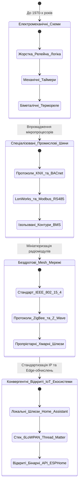
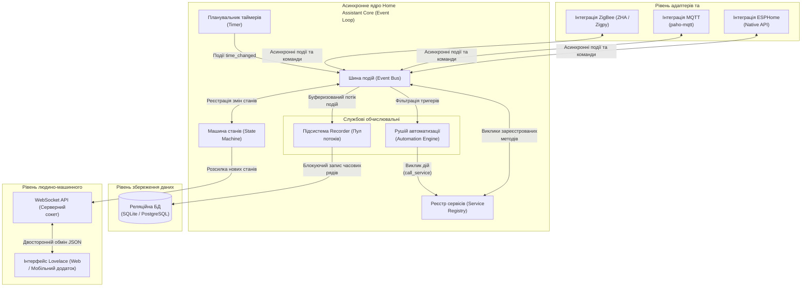
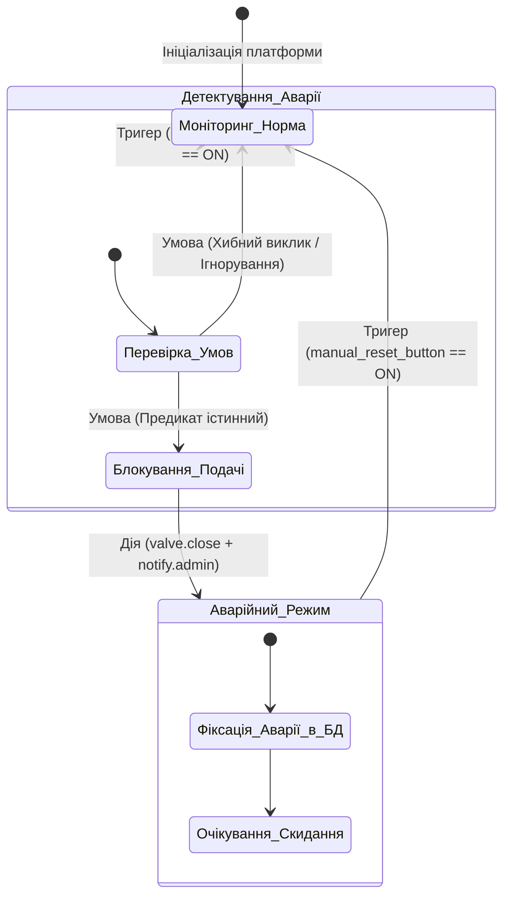
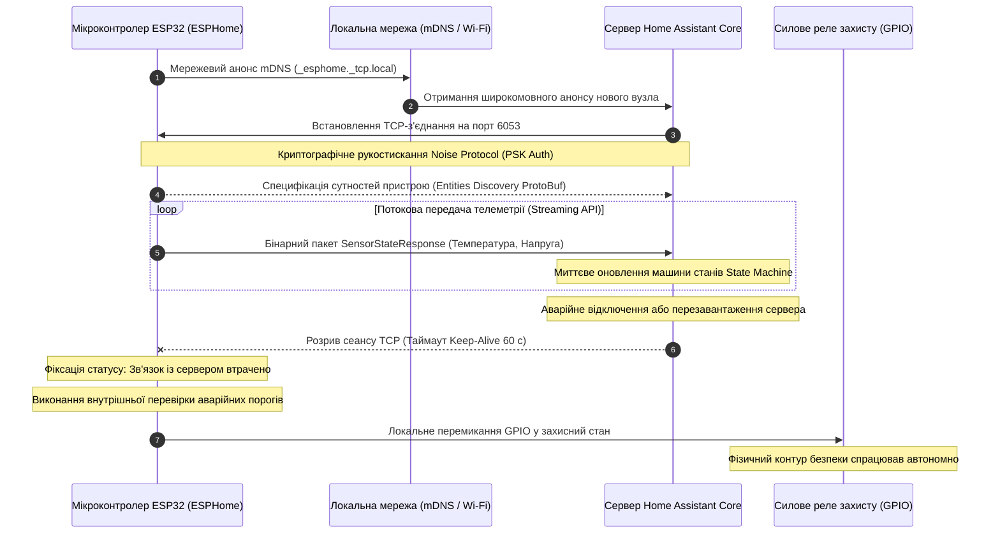
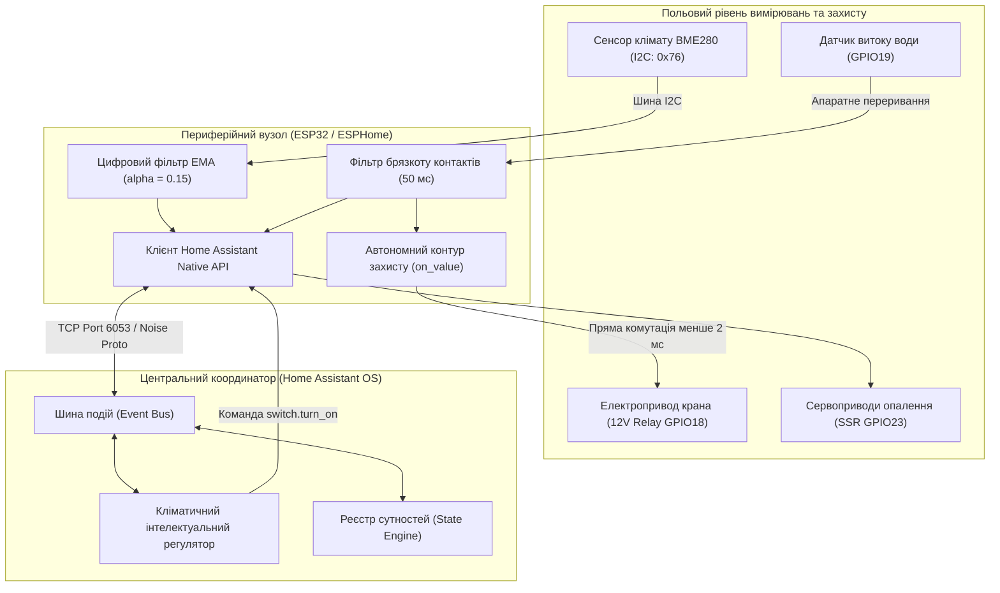

# Тема 11. «Розумний будинок»: архітектура, платформи

## Мета лекції
Метою лекції є формування у здобувачів вищої освіти комплексної системи теоретичних знань і прикладних інженерних компетентностей щодо архітектурної організації сучасних кіберфізичних просторів житлового та комерційного призначення, розгортання автономних відкритих платформ управління на прикладі екосистеми Home Assistant, а також проектування відмовостійких контурів збору сенсорних даних і силового регулювання з використанням мікроконтролерів сімейств ESP32 та ESP8266 під управлінням середовища ESPHome для побудови функціональних IoT-систем із високим рівнем конфіденційності та надійності без обов'язкової прив'язки до зовнішніх хмарних сервісів.

## Очікувані результати навчання
1. **Знання та розуміння.** Здобувачі засвоять фундаментальні відмінності між хмарно-залежними та локальними архітектурами розумного будинку, принципи роботи подієво-орієнтованого ядра Home Assistant Core, а також протокольні особливості взаємодії датчиків та виконавчих механізмів на канальному та прикладному рівнях моделі OSI.
2. **Застосування.** Здобувачі набудуть практичних навичок конфігурування локального вузла автоматизації, проектування пристроїв на базі мікроконтролерів засобами фреймворку ESPHome та реалізації прямих каналів обміну даними через бінарний протокол Home Assistant Native API.
3. **Аналіз.** Здобувачі зможуть здійснювати комплексний порівняльний аналіз пропускної здатності, латентності, показників енергоспоживання і векторів кіберзагроз для проводових і бездротових технологій інтерфейсного зв'язку в умовах інтенсивних електромагнітних завад.
4. **Оцінювання та синтез.** Здобувачі здобудуть здатність проектувати багаторівневі розподілені системи управління розумним будинком, формувати оптимізовані сценарії автоматизації за моделлю скінченних автоматів та створювати алгоритми автономного аварійного реагування безпосередньо на рівні периферійних контролерів.

---

## Детальний покроковий план лекції

### 1. Теоретико-концептуальний базис. Архітектурні моделі систем автоматизації будівель та ядро Home Assistant
* 1.1. Еволюція концепції розумного будинку від локальних релейних автоматів і закритих промислових протоколів до відкритих конвергентних IoT-екосистем.
* 1.2. Порівняльний системний аналіз хмарно-залежних платформ і концепції локального контролю з розрахунком коефіцієнтів готовності та латентності.
* 1.3. Внутрішня організація ядра Home Assistant Core, взаємозв'язок шини подій, реєстру станів, сервісної підсистеми, планувальника таймерів та бази історії.
* 1.4. Об'єктна модель фізичного середовища, типологія доменів і сутностей, а також формалізація логіки автоматизації на основі кінцевих автоматів.

### 2. Методологія та аналіз граничних умов. Проектування периферійних вузлів, мережева інтеграція та бар'єри відмовостійкості
* 2.1. Методи розгортання серверного вузла автоматизації в ізольованих контейнерах та оцінка апаратних ресурсів мікрокомп'ютерних платформ.
* 2.2. Мережева інтеграція польового рівня за допомогою бездротових mesh-мереж, промислових шин та протоколів транспортного рівня TCP/IP.
* 2.3. Декларативне проектування прошивок мікроконтролерів ESP32 у фреймворку ESPHome та специфікація бінарного протоколу Home Assistant Native API.
* 2.4. Методи первинної обробки сигналів на периферійних вузлах, цифрова фільтрація шуму, усунення брязкоту контактів і локальні контури захисту.
* 2.5. Критичні бар'єри масштабування, колізії радіоканалів неліцензованого діапазону та ризики порушення доступності при відмові центрального координатора.

### 3. Практичний індустріальний / фаховий кейс. Розгортання комплексної автономної системи управління кліматом і безпекою житла
**Тема наскрізної задачі.** «Проектування та розгортання відмовостійкої локальної системи клімат-контролю та захисту від протікання води на базі Home Assistant, шлюзу ESP32 з прошивкою ESPHome та автономного контуру аварійного реагування».

## 1. Теоретико-концептуальний базис. Архітектурні моделі систем автоматизації будівель та ядро Home Assistant

### 1.1. Еволюція концепції розумного будинку від локальних релейних автоматів і закритих промислових протоколів до відкритих конвергентних IoT-екосистем

Розвиток систем автоматизації житлових і виробничих приміщень пройшов шлях від ізольованих електромеханічних вузлів до розподілених кіберфізичних систем. На початкових етапах автоматизація будівель базувалася на жорсткій логіці релейно-контакторних схем і дискретних регуляторів. У таких системах функції управління реалізовувалися безпосереднім комутуванням силових електричних кіл через біметалічні термостати, механічні реле часу, кінцеві вимикачі та пневматичні давачі тиску. Подібна архітектура володіла високою ремонтопридатністю та стійкістю до перешкод, однак будь-яка зміна алгоритму роботи вимагала повної фізичної перебудови кабельних трас і щитового обладнання, що унеможливлювало побудову гнучких сценаріїв адаптації середовища до потреб користувача.

З появою мікропроцесорної техніки та інтегральних схем у другій половині двадцятого століття виникли перші спеціалізовані системи диспетчеризації будівель (Building Management Systems). Промисловість перейшла до використання виділених контролерів і спеціалізованих польових шин. Класичними представниками цього покоління стали технології стандарту KNX, що виріс із протоколу EIB, системи на основі відкритого протоколу BACnet, розробленого товариством ASHRAE для інженерних комунікацій, а також мережі LonWorks компанії Echelon. Паралельно в промисловій автоматизації закріпився протокол Modbus, що використовує передачу двійкових або шістнадцяткових пакетів по інтерфейсу RS-485 за клієнт-серверною топологією з одним провідним пристроєм. Попри високу експлуатаційну надійність, ці протоколи створювалися як закриті або вузькоспеціалізовані сегменти, що вимагали дорогого інсталяційного програмного забезпечення, спеціальних шлюзів для сполучення між різними вендорами та спеціалізованої кабельної інфраструктури з екранованою парою.

Бурхливий розвиток споживчої мікроелектроніки та поширення радіоінтерфейсів зумовили перехід до бездротових сенсорних мереж децентралізованого типу. Виникли протоколи бездротового зв'язку малого радіуса дії з низьким енергоспоживанням, такі як ZigBee (специфікація над стеком IEEE 802.15.4) та Z-Wave (пропрієтарний протокол діапазону субгігагерцових частот), орієнтовані на створення комірчастих коміркових топологій із маршрутизацією повідомлень від джерела до адресата. Проте справжній якісний стрибок відбувся під час проникнення Інтернет-протоколів на фізичний рівень сенсорів. Завдяки появі енергоефективного стека 6LoWPAN, протоколів Thread, Matter, а також широкому розповсюдженню мікроконтролерів із вбудованими радіомодулями Wi-Fi та Bluetooth Low Energy, концепція розумного будинку трансформувалася в конвергентну IoT-екосистему. У таких середовищах кожен виконавчий пристрій чи вимірювальний зонд стає повноправним мережевим вузлом, здатним взаємодіяти з гетерогенними платформами верхнього рівня через єдиний інформаційно-комунікаційний простір.

Еволюційні переходи парадигм автоматизації, зміни їхнього функціонального призначення та принципові технологічні трансформації відображені на поданій діаграмі станів.

> **ПРАКТИЧНИЙ ЯКІР:** При модернізації інфраструктури автоматизації готельного комплексу класичну провідну підсистему клімат-контролю на базі ліній Modbus RTU (RS-485) інтегрують через шлюзи перетворення протоколів у платформу Home Assistant, що дозволяє поєднати тридцятирічні промислові фанкойли з сучасними бездротовими сенсорами присутності стандарту ZigBee без демонтажу капітальних кабельних трас.

---

### 1.2. Порівняльний системний аналіз хмарно-залежних платформ і концепції локального контролю з розрахунком коефіцієнтів готовності та латентності

Архітектурний ландшафт сучасного ринку інтернету речей розділений між двома діаметрально протилежними підходами до обробки даних: хмарно-орієнтованим (Cloud-First) та локально-орієнтованим (Local-First). Хмарний підхід, активно просуваний корпоративними екосистемами, передбачає передачу всієї необробленої телеметрії з кінцевих пристроїв через маршрутизатор локальної мережі до глобальних центрів обробки даних. На віддалених серверах виконуються аналітичні обчислення, перевірка бізнес-правил та генерація зворотних команд, що надсилаються назад на виконавчі пристрої.

Головним недоліком хмарної парадигми є суттєве зниження надійності системи за рахунок утворення критичного ланцюга залежностей. З точки зору теорії надійності складних систем, коефіцієнт готовності хмарної системи $A_{\text{cloud}}$ розраховується як добуток коефіцієнтів готовності всіх її послідовно включених складових ланок:

$$A_{\text{cloud}} = A_{\text{dev}} \cdot A_{\text{LAN}} \cdot A_{\text{ISP}} \cdot A_{\text{WAN}} \cdot A_{\text{srv}}$$

де змінна $A_{\text{dev}}$ позначає коефіцієнт готовності апаратного забезпечення кінцевого пристрою або мікроконтролера; $A_{\text{LAN}}$ визначає надійність локального комутатора або точки доступу бездротової мережі; $A_{\text{ISP}}$ відповідає коефіцієнту доступності каналу локального постачальника послуг інтернету; $A_{\text{WAN}}$ характеризує готовність магістральних транзитних мереж глобального зв'язку; $A_{\text{srv}}$ описує доступність обчислювальних серверів і баз даних хмарного провайдера.

Якщо підставити у наведене співвідношення типові емпіричні значення надійності корпоративних систем ($A_{\text{dev}} = 0{,}999$, $A_{\text{LAN}} = 0{,}998$, $A_{\text{ISP}} = 0{,}985$, $A_{\text{WAN}} = 0{,}995$, $A_{\text{srv}} = 0{,}990$), сумарний коефіцієнт готовності хмарної системи набуває значення $A_{\text{cloud}} \approx 0{,}967$. Це відповідає річному сумарному простою системи тривалістю приблизно 289 годин, протягом яких автоматизоване керування будівлею виявляється заблокованим.

На противагу цьому, архітектура локального контролю (Local Control), представлена такими платформами, як Home Assistant, замикає всі контури передачі інформації, реєстрації подій та прийняття рішень всередині локальної обчислювальної мережі об'єкта. У цьому випадку коефіцієнт готовності локальної системи $A_{\text{local}}$ залежить виключно від надійності польових пристроїв та компонентів локальної мережі:

$$A_{\text{local}} = A_{\text{dev}} \cdot A_{\text{LAN}}$$

При використанні аналогічних значень надійності апаратури сумарний показник готовності досягає величини $A_{\text{local}} = 0{,}999 \cdot 0{,}998 \approx 0{,}997$, що скорочує річний час потенційної відмови системи до менш ніж 26 годин (підвищення надійності більш ніж на порядок).

Другим вирішальним фактором виступає часова затримка передачі керуючих сигналів. Повна затримка доставки сигналу у хмарній екосистемі $\tau_{\text{cloud}}$ формується як сума часових компонентів фізичного поширення, черг маршрутизації та обробки на віддалених серверах:

$$\tau_{\text{cloud}} = \tau_{\text{sens}} + \tau_{\text{LAN}} + \tau_{\text{queue}} + \tau_{\text{WAN\_up}} + \tau_{\text{cloud\_proc}} + \tau_{\text{WAN\_down}} + \tau_{\text{act}}$$

де $\tau_{\text{sens}}$ відповідає часу апаратного опитування сенсора мікроконтролером; $\tau_{\text{LAN}}$ позначає час транзиту пакетів через локальні комутатори або радіоефір Wi-Fi; $\tau_{\text{queue}}$ визначає час буферизації пакета у чергах шлюзу; $\tau_{\text{WAN\_up}}$ та $\tau_{\text{WAN\_down}}$ є затримками передачі сигналу лініями глобальної мережі інтернет у висхідному та низхідному напрямках відповідно; $\tau_{\text{cloud\_proc}}$ позначає час виконання бізнес-логіки серверним пулом провайдера; $\tau_{\text{act}}$ представляє час спрацювання виконавчого реле або приводу.

Сумарна величина $\tau_{\text{cloud}}$ на практиці варіюється в діапазоні від $250\text{ мс}$ до $3000\text{ мс}$, а в разі завантаженості каналів зв'язку перевищує зазначені межі. Натомість для локально-орієнтованої архітектури час затримки $\tau_{\text{local}}$ містить мінімальний набір доданків:

$$\tau_{\text{local}} = \tau_{\text{sens}} + \tau_{\text{LAN}} + \tau_{\text{local\_proc}} + \tau_{\text{act}}$$

де $\tau_{\text{local\_proc}}$ є часом обробки події центральним процесором локального шлюзу всередині оперативної пам'яті. Сумарна затримка $\tau_{\text{local}}$ рідко перевищує $5 \dots 20\text{ мс}$, що забезпечує миттєвий тактильний відгук інфраструктури будівлі на дії людини.

Для детальної системної диференціації та всебічної оцінки існуючих технологічних підходів складено порівняльну характеристику сучасних моделей функціонування розумних просторів.

| Архітектурний підхід | Топологія обробки | Залежність від зовнішнього каналу | Показники латентності | Стійкість до компрометації | Приклад з реальної практики |
| :--- | :--- | :--- | :--- | :--- | :--- |
| **Централізований хмарний (Cloud-First)** | Ієрархічна «зірка» через публічні дата-центри | Повна непрацездатність алгоритмів у разі обриву зв'язку з провайдером | Від $200\text{ мс}$ до $3\dots 5\text{ с}$, наявність непередбачуваного джиттеру | Низька, загроза масового витоку при зламі центральної хмари | Екосистема Tuya Smart або Xiaomi Mi Home на штатних прошивках |
| **Локально-орієнтований (Local-First Edge)** | Розподілена обчислювальна мережа на базі локального сервера | Повна автономність, інтернет необхідний лише для зовнішнього моніторингу | Детермінована, у межах $2\dots 15\text{ мс}$ для більшості взаємодій | Висока, дані не виходять за фізичний периметр об'єкта | Платформа Home Assistant на базі Home Assistant OS (HAOS) |
| **Гібридний туманний (Fog Architecture)** | Дворівнева обробка: локальні шлюзи плюс синхронізація з хмарою | Збереження базових контурів безпеки при деградації аналітики | Низька для локальних контурів ($10\text{ мс}$), середня для звітів ($200\text{ мс}$) | Середня, вимагає суворого розмежування політик доступу | Промислові рішення на базі AWS Greengrass або Azure IoT Edge |
| **Прямий міжмашинний (P2P Mesh)** | Однорангова мережа без виділеного центрального сервера | Абсолютно автономна робота у межах радіопокриття вузлів | Ультранизька між сусідніми вузлами (від $1$ до $8\text{ мс}$) | Висока на рівні каналу, складна централізована криптографія | Зв'язування вимикача і лампи напряму через ZigBee Touchlink або Matter |

> **ТИПОВА ПОМИЛКА:** Хибним є ототожнення наявності локального Wi-Fi-інтерфейсу в приладі з його реальною автономністю. Більшість комерційних смарт-розеток із модулями Wi-Fi функціонують виключно через встановлення зовнішнього TCP-з'єднання з хмарним брокером виробника; за відсутності доступу до глобальної мережі такий пристрій перестає виконувати навіть внутрішні сценарії за розкладом, перетворюючись на некерований приймач радіозавад.

---

### 1.3. Внутрішня організація ядра Home Assistant Core, взаємозв'язок шини подій, реєстру станів, сервісної підсистеми, планувальника таймерів та бази історії

Платформа Home Assistant розроблена на мові Python з інтенсивним використанням парадигми асинхронного неблокуючого введення-виведення на основі стандартної бібліотеки `asyncio`. Ядро системи Home Assistant Core спроектоване як повністю подієво-орієнтована модульна структура, що мінімізує використання обчислювальних ресурсів процесора і забезпечує одночасну підтримку тисяч підключених сутностей без виникнення черг затримки.

Архітектурна композиція ядра Home Assistant Core та маршрутизація потоків даних між його внутрішніми підсистемами схематично представлена нижче.

У центрі архітектури знаходиться **шина подій** (Event Bus), через яку транслюються всі повідомлення в системі. Коли периферійний модуль передає новий вимір, інтеграція генерує спеціальний об'єкт події, який ставиться в чергу циклу подій (Event Loop). Будь-який внутрішній компонент платформи може підписатися на конкретний тип подій за допомогою функцій зворотного виклику (Callbacks) або асинхронних слухачів (Listeners).

Безпосередньо з шиною подій інтегрована **машина станів** (State Machine), яка виконує функції центрального сховища актуальних параметрів об'єктів. Машина станів містить глобальну таблицю всіх зареєстрованих у системі сутностей. Щоразу, коли сенсор чи актуатор змінює значення, генерується спеціалізована подія `state_changed`, що містить унікальний ідентифікатор сутності, її попередній стан (Old State) та новий стан (New State) разом із метаданими. Завдяки цьому жоден компонент системи не опитує фізичний пристрій напряму; замість цього компоненти миттєво зчитують актуальні дані з машини станів в оперативній пам'яті.

Виконання активних операцій здійснюється через **реєстр сервісів** (Service Registry). Якщо машина станів відображає пасивний зріз реальності, то сервіси уособлюють активні дії, які система може спрямувати до фізичного світу або внутрішніх підсистем. Сервіси реєструються інтеграціями при ініціалізації та групуються за доменами (наприклад, сервіс `light.turn_on` або `climate.set_temperature`). Коли надходить команда на виклик сервісу, реєстр перевіряє права доступу, валідує передані параметри згідно зі схемою Voluptuous і передає керування відповідному обробнику пристрою.

Синхронізацію процесів у часі реалізує **планувальник таймерів** (Timer), інтегрований у головний цикл подій. Планувальник з фіксованою дискретністю генерує подію `time_changed`, що використовується для перевірки розкладів, відліку затримок та моніторингу працездатності периферійних вузлів.

Довготривале зберігання інформації реалізується за допомогою **підсистеми Recorder**, виділеної в окремий системний потік для запобігання блокуванню основного асинхронного циклу вводу-виводу операціями запису на диск. Підсистема перехоплює всі події `state_changed` на шині подій, упаковує їх у структуровані транзакції реляційної моделі та записує до бази даних (за замовчуванням застосовується вбудована база SQLite, яку для високонавантажених інсталяцій замінюють сервером PostgreSQL або MariaDB). Завдяки цьому формуються часові ряди для подальшої статистичної обробки, побудови графіків та екстраполяції даних.

> **ПРАКТИЧНИЙ ЯКІР:** При розгортанні сервера Home Assistant на базі мікрокомп'ютера Raspberry Pi з накопичувачем MicroSD висока інтенсивність циклів перезапису підсистеми Recorder здатна вивести картку пам'яті з ладу за кілька місяців; інженерним стандартом для промислової експлуатації є винесення бази даних на зовнішній твердотільний накопичувач SSD із шиною NVMe або перенесення журналу подій у зовнішню базу TimescaleDB.

> **КОНТРОЛЬНЕ ПИТАННЯ:** Під час написання власної програмної інтеграції для нового датчика інженер викликав функцію `time.sleep(10)` всередині обробника повідомлень шини подій. До яких системних наслідків призведе це рішення всередині ядра Home Assistant?
>
> 

> 
Розгорнути аналіз / відповідь

>
> **Правильний варіант: Повне блокування головного асинхронного циклу подій (Event Loop) платформи на 10 секунд.**
>
> 1. Архітектура Home Assistant Core функціонує в рамках єдиного головного потоку, що виконує цикл подій `asyncio.EventLoop`. Синхронний виклик функції `time.sleep()` є блокуючою операцією для потоку операційної системи. Це призводить до миттєвого зупинення диспетчеризації шини подій: протягом десяти секунд платформа не зможе обробляти повідомлення від інших сенсорів, запускати автоматизації, оновлювати веб-інтерфейс Lovelace та відповідати на мережеві запити.
> 
> 2. Аналіз некоректних припущень показує, що операційна система не перемикає контекст на інші задачі всередині одного потоку автоматично, якщо код не містить інструкції `await`. Правильним інженерним рішенням у середовищі Python `asyncio` є використання неблокуючого виклику `await asyncio.sleep(10)` або делегування блокуючої операції у спеціальний системний пул потоків ядра за допомогою методу `hass.async_add_executor_job()`.
>
> 

---

### 1.4. Об'єктна модель фізичного середовища, типологія доменів і сутностей, а також формалізація логіки автоматизації на основі кінцевих автоматів

Для створення єдиного абстрактного представлення різнорідного фізичного обладнання в платформі Home Assistant використовується сувора об'єктна модель. Будь-який компонент фізичного світу проектується в інформаційний простір як **сутність** (Entity). Множина всіх сутностей розбивається на логічні категорії — **домени** (Domains), кожен з яких визначає набір доступних станів, підтримуваних сервісів та перелік базових атрибутів. Ідентифікатор кожної сутності має уніфікований формат `domain.object_id`, де ім'я домену відокремлене від унікального імені пристрою крапкою (наприклад, `sensor.hall_temperature` або `light.kitchen_ceiling`).

Формально об'єктний стан системи автоматизації в довільний дискретний момент часу $t$ описується вектором глобального стану $\mathbf{X}(t)$, що формується як об'єднання станів окремих сутностей:

$$\mathbf{X}(t) = \left[ e_1(t), e_2(t), \dots, e_N(t) \right]^T$$

де кожна сутність $e_i(t)$ є кортежем структурованих даних вигляду:

$$e_i(t) = \langle s_i(t), \mathbf{A}_i(t), \tau_i(t) \rangle$$

де $s_i(t) \in \mathcal{S}_{\text{domain}}$ позначає дискретне або неперервне значення стану сутності, визначене в просторі станів відповідного домену; $\mathbf{A}_i(t) = \{k_1: v_1, k_2: v_2, \dots, k_m: v_m\}$ представляє словник додаткових атрибутів (одиниці вимірювання, рівень заряду батареї, координати тощо); $\tau_i(t)$ фіксує мітку точного астрономічного часу останньої зміни стану або атрибута.

Для опису функціональних взаємодій між сутностями підсистема автоматизацій формалізується як розширений недетермінований кінцевий автомат зі станом (Finite State Machine):

$$\mathcal{M} = \langle \mathcal{Q}, \Sigma, \Delta, \delta, \lambda, q_0 \rangle$$

де $\mathcal{Q} \subseteq \mathbf{X}$ визначає множину допустимих внутрішніх конфігурацій простору станів об'єкта; $\Sigma$ позначає алфавіт вхідних символів, що формується подіями-тригерами (Triggers), такими як спрацювання таймерів, отримання сигналів від сенсорів або повідомлень від протокольних шин; $\Delta$ є алфавітом вихідних сигналів, що відповідає множині сервісних команд (Actions), які надсилаються виконавчим механізмам; $\delta: \mathcal{Q} \times \Sigma \times \mathcal{C} \to \mathcal{Q}$ визначає функцію переходів між станами за умови виконання логічного предиката умов $\mathcal{C}$ (Conditions); $\lambda: \mathcal{Q} \times \Sigma \times \mathcal{C} \to \Delta$ позначає функцію виходів, що транслює результати логічного висновку у виклики сервісів виконавчих контролерів; $q_0 \in \mathcal{Q}$ фіксує початковий стан системи під час ініціалізації середовища.

Семантика функціонування логічного правила в Home Assistant спирається на жорстку послідовність оцінки тріади компонентів:
- **Тригер** генерує подію переходу, ініціюючи оцінку правила у момент виконання співвідношення $e_i(t) \neq e_i(t - \Delta t)$ або при збігу системного часу з цільовою міткою.
- **Умова** обчислює булеву функцію валідації $f_{\text{cond}}(\mathbf{X}(t)) \in \{0, 1\}$. Якщо функція набуває нульового значення, автомат скидає активний перехід без виконання керуючих команд.
- **Дія** виконується тільки при $f_{\text{cond}}(\mathbf{X}(t)) = 1$ і формує вихідний керуючий вектор команд $\mathbf{u}(t) \in \Delta$, який змінює стан актуаторів через відповідний доменний інтерфейс.

Поведінка системи під час обробки критичних подій, наприклад детектування витоку води, відображає циклічний перехід між дискретними операційними режимами.

Завдяки такій об'єктній типізації складна гетерогенна інфраструктура з сотень фізичних контролерів різних виробників зводиться до єдиного нормалізованого набору даних, над яким виконуються детерміновані алгоритми цифрового керування.

---

### Вказівки для самостійного осмислення

1. Складіть аналітичну записку з розрахунком надійності гіпотетичної системи захисту від затоплення, порівнявши варіант виконання логіки безпосередньо у хмарі виробника через зовнішній веб-сервіс із варіантом локальної обробки через контролер Home Assistant, урахувавши середньостатистичні показники відмови побутових інтернет-шлюзів та провайдерів зв'язку.
2. Сформулюйте формальну математичну модель переходу станів для системи комбінованого управління мікрокліматом приміщення (опалення, зволоження, припливна вентиляція), визначивши вхідні вектори сенсорних даних, простір внутрішніх станів регулятора та умови блокування одночасної роботи конфліктуючих підсистем (наприклад, одночасного нагріву та кондиціонування).
3. Дослідіть архітектурні відмінності між реляційними базами даних загального призначення та спеціалізованими сховищами часових рядів при збереженні телеметрії розумного будинку; обґрунтуйте, які саме технічні обмеження викликають деградацію продуктивності стандартної бази даних SQLite при безперервному надходженні понад ста вимірювань за секунду.

## 2. Методологія та аналіз граничних умов. Проектування периферійних вузлів, мережева інтеграція та бар'єри відмовостійкості

### 2.1. Методи розгортання серверного вузла автоматизації в ізольованих контейнерах та оцінка апаратних ресурсів мікрокомп'ютерних платформ

Проектування обчислювального вузла автоматизації вимагає збалансованого підходу до вибору апаратної платформи та програмної архітектури ізоляції процесів. Центральний шлюз розумного будинку бере на себе функції диспетчеризації подій, обчислення логіки реального часу, збереження часових рядів телеметрії та обслуговування інтерфейсів взаємодії. Основним середовищем для розгортання серверних платформ виступають одноплатні комп'ютери архітектури ARM64 або енергоефективні процесори архітектури x86-64.

Для забезпечення безперервного функціонування системи у промисловому та побутовому секторах найбільш доцільним є використання технології контейнеризації на рівні операційної системи за стандартом OCI з використанням інструментарію Docker та декларативного опису багатоконтейнерних конфігурацій через Docker Compose. Контейнеризація дозволяє ізолювати ядро Home Assistant Core від супутніх служб, таких як брокер повідомлень Eclipse Mosquitto, сервіс координації мережі Zigbee2MQTT та продуктивна реляційна база даних PostgreSQL. Це запобігає виникненню конфліктів системних залежностей і спрощує процес резервного копіювання образів файлової системи.

Інженерний розрахунок апаратних ресурсів мікрокомп'ютера зводиться до багатокрокового визначення мінімально необхідного обсягу оперативної пам'яті та оцінки експлуатаційного зносу накопичувача даних:

$$
\begin{aligned}
\text{Крок 1 (Розрахунок оперативної пам'яті):} & \quad M_{\text{total}} = M_{\text{OS}} + M_{\text{HA}} + \sum_{i=1}^{k} M_{\text{cont}, i} + M_{\text{DB\_buf}} \\
\text{Крок 2 (Оцінка деградації флеш-пам'яті):} & \quad T_{\text{wear}} = \frac{C_{\text{drive}} \cdot \text{TBW}}{D_{\text{daily}} \cdot 365}
\end{aligned}
$$

У наведеній математичній моделі параметр $M_{\text{total}}$ позначає сумарний необхідний обсяг системної оперативної пам'яті; величина $M_{\text{OS}}$ відображає накладні витрати ядра Linux і базових демонів; $M_{\text{HA}}$ є обсягом пам'яті, що споживається асинхронним процесом Home Assistant Core з урахуванням кешу сутностей; $M_{\text{cont}, i}$ представляє вимоги до оперативної пам'яті $i$-го ізольованого контейнера з загальної кількості $k$ допоміжних служб; змінна $M_{\text{DB\_buf}}$ задає розмір буфера сторінок бази даних, що мінімізує кількість операцій скидання інформації на диск. У формулі оцінки довговічності накопичувача змінна $T_{\text{wear}}$ визначає прогнозований термін служби накопичувача в роках; $C_{\text{drive}}$ позначає фізичну ємність твердотільного диска в гігабайтах; параметр $\text{TBW}$ визначає ресурс витривалості флеш-пам'яті у повних циклах перезапису всього обсягу; $D_{\text{daily}}$ позначає щоденний обсяг транзакцій запису, генерованих підсистемою реєстрації подій.

> **ВАЖЛИВО:** Застосування карт пам'яті стандарту MicroSD для розгортання центрального координатора Home Assistant із базою даних на базі SQLite є неприпустимим в експлуатаційних умовах з безперервною фіксацією сенсорних даних. Високий коефіцієнт підсилення запису (Write Amplification Factor) під час частих транзакцій призводить до деградації контролера пам'яті та руйнування файлової системи протягом 3–6 місяців активної роботи. Нормативною вимогою є встановлення промислових накопичувачів eMMC або твердотільних накопичувачів SSD із протоколом NVMe чи SATA.

---

### 2.2. Мережева інтеграція польового рівня за допомогою бездротових mesh-мереж, промислових шин та протоколів транспортного рівня TCP/IP

Інтеграція польового рівня розумного будинку вимагає узгодження різнорідних фізичних середовищ передачі даних. Сенсори та виконавчі механізми суттєво різняться за вимогами до пропускної здатності, допустимої латентності та джерел електроживлення. Бездротові технології персональних мереж WPAN використовують самоорганізовані комірчасті структури, де кожен стаціонарний вузол із постійним живленням бере на себе роль ретранслятора пакетів, що розширює зону покриття радіомережі без збільшення вихідної потужності передавачів.

Протокол ZigBee стандарту IEEE 802.15.4 функціонує в неліцензованому діапазоні 2,4 ГГц, використовуючи 16 частотних каналів шириною по 5 МГц кожен із модуляцією OQPSK. Проте висока щільність використання цього ж спектра побутовими мережами Wi-Fi (стандарти IEEE 802.11b/g/n) породжує інтерференційні завади. Для запобігання деградації пакетів необхідно застосовувати частотне планування: якщо базова мережа Wi-Fi займає канали 1, 6 або 11, координатор ZigBee налаштовується на роботу у каналах 15, 20 або 25, оскільки вони потрапляють у спектральні проміжки між широкими смугами випромінювання Wi-Fi.

Протокол Z-Wave оминає проблему спектрального перевантаження завдяки використанню діапазону частот нижче 1 ГГц (зокрема 868,42 МГц для європейського регіону), що забезпечує значно кращу дифракцію радіохвиль навколо будівельних перешкод та виключає інтерференцію з комп'ютерними мережами. Промислові шини передачі даних, зокрема RS-485 із протоколом Modbus RTU, застосовуються для найбільш відповідальних вузлів автоматизації будівель (ввідно-розподільні щити, теплові насоси, вентиляційні установки), де неприпустимі втрати зв'язку через радіоелектронні завади.

Для систематизації критеріїв вибору технологій побудови мережевої інфраструктури розроблено порівняльну матрицю, подану в наступній таблиці.

| Технологія / Протокол | Фізичний рівень та середовище | Топологічна структура | Складність впровадження | Критичні ризики / Обмеження | Енергоефективність вузлів |
| :--- | :--- | :--- | :--- | :--- | :--- |
| **ZigBee 3.0** | IEEE 802.15.4 (2,4 ГГц / 868 МГц) | Повнозв'язна комірчаста (Mesh) | Середня (вимагає частотного узгодження та виділеного координатора) | Колізії в діапазоні 2,4 ГГц з Wi-Fi, обмеження пам'яті координатора на прямі дочірні вузли | Висока (термін автономності кінцевих пристроїв становить 2–5 років) |
| **Thread** | IEEE 802.15.4 із підтримкою 6LoWPAN | Самовідновлювана комірчаста на базі IPv6 | Висока (потребує граничного маршрутизатора OTBR) | Складна діагностика маршрутизації дейтаграм, обмежена номенклатура сертифікованих датчиків | Висока (енергозберігаючі режими сну для кінцевих точок) |
| **Wi-Fi (IEEE 802.11n)** | Радіоканал 2,4 ГГц / 5 ГГц із модуляцією OFDM | Централізована «зірка» навколо точки доступу | Низька (використовує існуючу побутову інфраструктуру) | Високе енергоспоживання, обмеження на кількість одночасних асоціацій на точці доступу | Вкрай низька (автономне батарейне живлення неефективне) |
| **Z-Wave Plus** | Субгігагерцовий радіоканал (868,42 МГц) | Комірчаста з маршрутизацією від джерела | Середня (жорстка сертифікація сумісності альянсу) | Ліміт до 232 пристроїв у мережі, пропрієтарні ліцензійні обмеження чіпсетів | Висока (подібна до показників стандарту ZigBee) |
| **Modbus RTU** | Екранована вита пара RS-485 | Послідовна лінійна шина (Daisy Chain) | Висока (необхідність прокладання фізичного кабелю та термінаторів) | Повна залежність від цілісності кабелю, відсутність вбудованих механізмів автентифікації | Максимальна (пасивні приймачі з живленням від зовнішньої лінії) |

Аналіз даних таблиці показує, що найбільш збалансованим інженерним рішенням для масштабованого об'єкта є гібридна топологія, в якій критичні силові підсистеми з'єднані шиною Modbus RTU, масові батарейні сенсори об'єднані в мережу ZigBee або Thread, а швидкісні канали мультимедіа та відеоспостереження використовують дротову лінію Ethernet або локальний Wi-Fi.

---

### 2.3. Декларативне проектування прошивок мікроконтролерів ESP32 у фреймворку ESPHome та специфікація бінарного протоколу Home Assistant Native API

Фреймворк ESPHome кардинально змінює інженерний процес створення спеціалізованих вузлів інтернету речей. Замість традиційного ручного програмування логіки роботи апаратних переривань, таймерів, стеків зв'язку та парсерів текстових форматів розробник формує декларативний маніфест структури пристрою мовою YAML. Внутрішній компілятор фреймворку транслює зазначені декларації в оптимізований вихідний код мови C++, інтегруючи низькорівневі бібліотеки взаємодії з апаратною периферією мікроконтролера ESP32, після чого здійснюється збирання бінарного образу через платформу PlatformIO.

Для передачі інформації між мікроконтролером та сервером автоматизації в ESPHome реалізовано протокол **Home Assistant Native API**, що функціонує поверх транспортного протоколу TCP через порт 6053. На відміну від текстових протоколів MQTT чи HTTP REST, Native API базується на компактній бінарній серіалізації **Google Protocol Buffers** (ProtoBuf). Це дозволяє передавати структуровані повідомлення про стан аналогових та дискретних каналів із мінімальними накладними витратами оперативної пам'яті (RAM) та обчислювальних циклів мікроконтролера. 

Безпека передачі даних у Native API гарантується криптографічним фреймворком **Noise Protocol Framework**, що використовує симетричний попередньо узгоджений ключ PSK та алгоритми шифрування ChaCha20-Poly1305. Це виключає ризик перехоплення телеметрії або ін'єкції неавторизованих команд керування у локальному сегменті мережі.

Динаміка мережевої взаємодії, ініціалізація шифрованого сеансу зв'язку, передача потокових вимірювань і відпрацювання аварійного сценарію при втраті центрального сервера проілюстровані на наступній діаграмі послідовності.

> **ПРАКТИЧНИЙ ЯКІР:** У сучасних комерційних пристроях автоматизації відкритого типу, таких як контролери електроживлення лінійки Shelly Plus або шлюзи Home Assistant Green, заводська прошивка підтримує пряме оновлення по повітрю бінарними збірками ESPHome, що дозволяє корпоративним замовникам виключати пропрієтарні хмарні прошивки виробника та інтегрувати обладнання безпосередньо у захищені закриті VLAN-сегменти з нульовою довірою до зовнішніх мереж.

---

### 2.4. Методи первинної обробки сигналів на периферійних вузлах, цифрова фільтрація шуму, усунення брязкоту контактів і локальні контури захисту

Перенесення частини обчислювального навантаження з центрального сервера на периферійні вузли є фундаментальним принципом концепції Edge Computing в інтернеті речей. Сирі аналогові вимірювання, зняті з давачів через вбудований аналого-цифровий перетворювач мікроконтролера, містять електромагнітний високочастотний шум, випадкові спотворення та нестабільність опорної напруги. Якщо транслювати кожне дискретне вимірювання в мережу безпосередньо, шина зв'язку та шина подій сервера автоматизації зазнають перевантаження потоком надлишкової інформації.

Методологія первинної обробки сенсорних даних на рівні мікроконтролера складається з трьох послідовних математичних етапів: квантування аналогового сигналу, фільтрації випадкових шумів та застосування зони гістерезису для запобігання хибним спрацьовуванням:

$$
\begin{aligned}
\text{Крок 1 (Дискретизація сигналу):} & \quad x[k] = \frac{V_{\text{ADC}}[k]}{V_{\text{ref}}} \cdot (2^N - 1) \\
\text{Крок 2 (Експоненційне згладжування):} & \quad y[k] = \alpha \cdot x[k] + (1 - \alpha) \cdot y[k-1] \\
\text{Крок 3 (Гістерезисна квантизація):} & \quad u[k] = \begin{cases} 1, & \text{якщо } y[k] \ge T_{\text{high}} \\ 0, & \text{якщо } y[k] \le T_{\text{low}} \\ u[k-1], & \text{якщо } T_{\text{low}} < y[k] < T_{\text{high}} \end{cases}
\end{aligned}
$$

У наведеній системі виразів змінна $x[k]$ є безрозмірним значенням цифрового коду на $k$-му кроці дискретизації; $V_{\text{ADC}}[k]$ позначає миттєву аналогову напругу на вхідному піні мікроконтролера; $V_{\text{ref}}$ є опорною напругою вбудованого АЦП; величина $N$ задає розрядність аналого-цифрового перетворювача (наприклад, $N=12$ біт для мікроконтролера ESP32, що відповідає діапазону значень від 0 до 4095). На етапі експоненційної фільтрації змінна $y[k]$ представляє згладжене значення вимірюваної величини; $\alpha$ є ваговим коефіцієнтом фільтра, значення якого обирається в діапазоні $0 < \alpha \le 1$, визначаючи баланс між здатністю придушення високочастотного шуму та часовим запізненням відгуку системи. На етапі оцінки порогових станів змінна $u[k]$ визначає результуючий двійковий сигнал управління; $T_{\text{high}}$ позначає верхній поріг перемикання компаратора; $T_{\text{low}}$ відповідає нижньому порогу спрацьовування. Наявність несиметричних порогів формує зону нечутливості $\Delta T = T_{\text{high}} - T_{\text{low}}$, що повністю усуває спонтанне високочастотне перемикання силових реле поблизу граничних значень температури чи тиску.

Для дискретних сигналів, що надходять від механічних вимикачів, магнітокерованих контактів (герконів) та кнопок аварійної зупинки, обов'язковим є застосування алгоритмів придушення брязкоту контактів (Contact Bounce). Брязкіт є наслідком механічних коливань пружних пластин комутатора при замиканні, що призводить до генерації серії паразитних імпульсів тривалістю від $5$ до $50\text{ мс}$. Програмна демпферна обробка в ESPHome реалізує часове стробування: стан вхідного піна фіксується як змінений лише у випадку, якщо новий логічний рівень безперервно утримується протягом інтервалу, тривалість якого перевищує максимальну тривалість механічних коливань:

$$t_{\text{stable}} \ge \Delta t_{\text{debounce}}$$

де $t_{\text{stable}}$ позначає виміряний інтервал стабільності сигналу, а $\Delta t_{\text{debounce}}$ задає конфігураційний поріг фільтра затримки (типове значення становить $30 \dots 50\text{ мс}$).

Критично важливим аспектом проектування периферійного вузла є реалізація автономного контуру безпеки (Fallback Logic). Прошивка мікроконтролера повинна містити локальні правила переривання, які безпосередньо зв'язують вхідні апаратні переривання від захисних сенсорів (наприклад, датчика максимального тиску пари або сенсора затоплення) з вихідними реєстрами комутації силових актуаторів. Зазначена логіка виконується на рівні ядра мікроконтролера з детермінованою затримкою менше $1\text{ мс}$, незалежно від наявності зв'язку з центральним сервером Home Assistant або стану локального Wi-Fi роутера.

---

### 2.5. Критичні бар'єри масштабування, колізії радіоканалів неліцензованого діапазону та ризики порушення доступності при відмові центрального координатора

Практичне розгортання розподілених систем інтернету речей у житлових та промислових будівлях супроводжується зіткненням із суворими технічними обмеженнями, за межами яких класичні архітектурні моделі зазнають функціонального колапсу. Аналіз граничних умов дозволяє виявити чотири фундаментальні бар'єри масштабування та стійкості систем автоматизації.

Першим критичним бар'єром виступає явище радіочастотної колізійної інтерференції у неліцензованому промислово-науковому діапазоні ISM 2,4 ГГц. Стандарт IEEE 802.15.4 використовує механізм множинного доступу з контролем несучої та уникненням колізій (CSMA/CA). У разі розташування в одному просторі потужних точок доступу Wi-Fi передавачі останніх створюють високий рівень щільності випромінювання. Коли сенсор ZigBee намагається ініціювати передачу кадру, детектор енергії виявляє зайнятість каналу стороннім сигналом і відкладає передачу на випадковий експоненційний інтервал (Backoff Time). Якщо щільність трафіку Wi-Fi перевищує критичну межу, буфери передачі радіомодулів мікроконтролерів переповнюються, викликаючи втрату пакетів телеметрії та масове розсинхронізування часових слотів суперфреймів.

Другим обмеженням є бар'єр обчислювальної ємності координатора бездротової мережі. Апаратні координатори на базі чіпів Texas Instruments CC2652 або Silicon Labs EFR32 володіють фіксованим обсягом статичної пам'яті SRAM, виділеної для таблиць маршрутизації та сусідніх вузлів. Координатор здатний підтримувати пряме з'єднання (Direct Child Associations) лише з обмеженою кількістю кінцевих пристроїв (зазвичай не більше 32–50 вузлів). Подальше нарощування мережі вимагає обов'язкового розгортання стаціонарних маршрутизаторів (Routers) для формування деревовидної чи комірчастої топології. Ігнорування цього ліміту призводить до відхилення нових запитів на асоціацію та втрати зв'язку з раніше зареєстрованими приладами.

Третій бар'єр пов'язаний із внутрішньою архітектурою центрального сервера Home Assistant Core та обмеженнями диспетчеризації шини подій. За наявності великої кількості сенсорів, що передають телеметрію з високою частотою оновлення (наприклад, імпульсні вимірювачі активної та реактивної потужності з частотою опитування $10\text{ Гц}$), виникає шторм подій (Event Storm). Оскільки головний цикл подій `asyncio.EventLoop` функціонує в єдиному системному потоці, час обробки черги повідомлень починає перевищувати тривалість надходження нових подій. Це зумовлює нелінійне зростання обчислювальної латентності, затримку виконання автоматизацій на десятки секунд і ризик аварійного перезавантаження процесу демоном контролю працездатності (Watchdog).

Четвертим бар'єром є катастрофічна відмова внаслідок наявності єдиної точки відмови (Single Point of Failure, SPoF), якою виступає сам центральний сервер. У випадку апаратної відмови центрального процесора шлюзу, виходу з ладу накопичувача або збою живлення серверної кімнати, топологія розумного будинку розпадається на ізольовані фрагменти. За відсутності на периферійних мікроконтролерах реалізованих локальних правил автоматизації та контурів захисту, описаних у підрозділі 2.4, будівля повністю втрачає керованість: блокуються механізми перекриття водопостачання, системи захисту від задимлення та контури кліматичного регулювання.

> **КОНТРОЛЬНЕ ПИТАННЯ:** Під час аудиту мережевої інфраструктури об'єкта автоматизації було зафіксовано, що бездротова сенсорна мережа ZigBee, що працює на каналі 11, зазнає втрати до 40% пакетів під час активної передачі даних користувачами через бездротову точку доступу стандарту Wi-Fi 802.11n, налаштовану на канал 1 із шириною смуги 40 МГц. Розрахуйте спектральне перекриття цих радіоканалів та сформулюйте інженерне рішення щодо реконфігурації радіочастотних параметрів без необхідності заміни апаратного забезпечення.
>
> 

> 
Розгорнути аналіз / відповідь

>
> **Правильний варіант: Переведення мережі ZigBee на канал 25 або 26 та звуження смуги Wi-Fi на точці доступу до стандартних 20 МГц на каналі 1.**
>
> 1. Математично-частотне обґрунтування:
> Центральна частота $k$-го каналу Wi-Fi в діапазоні 2,4 ГГц розраховується за формулою:
> $$f_{\text{Wi-Fi}} = 2412 + 5 \cdot (k - 1) \text{ МГц}$$
> Для каналу 1 центральна частота становить $2412\text{ МГц}$. При використанні надлишкової смуги пропускання $40\text{ МГц}$ спектральний слід випромінювання Wi-Fi охоплює діапазон від $2392\text{ МГц}$ до $2432\text{ МГц}$.
>
> Центральна частота $m$-го каналу стандарту IEEE 802.15.4 (ZigBee) визначається формулою:
> $$f_{\text{ZigBee}} = 2405 + 5 \cdot (m - 11) \text{ МГц}$$
> Для каналу 11 центральна частота дорівнює точно $2405\text{ МГц}$ із шириною смуги випромінювання $2\text{ МГц}$ (діапазон $2404 \dots 2406\text{ МГц}$). Таким чином, канал 11 ZigBee знаходиться під прямим впливом потужного випромінювання передавача Wi-Fi каналу 1, що викликає постійну блокування середовища за алгоритмом CSMA/CA та спотворення пакетів.
>
> 2. Аналіз інженерного рішення:
> Канал 25 ZigBee має центральну частоту $2475\text{ МГц}$ (діапазон $2474 \dots 2476\text{ МГц}$), а канал 26 — $2480\text{ МГц}$. Звуження ширини каналу Wi-Fi на точці доступу до нормативних $20\text{ МГц}$ обмежує смугу частот діапазоном $2402 \dots 2422\text{ МГц}$. За такої конфігурації між верхньою межею спектра Wi-Fi ($2422\text{ МГц}$) та каналом 25 ZigBee ($2474\text{ МГц}$) утворюється захисний частотний інтервал величиною понад $50\text{ МГц}$, що повністю ліквідує колізійне перекриття сигналів та знижує відсоток втрати пакетів до нуля.
>
> 

## 3. Практичний індустріальний / фаховий кейс. Розгортання комплексної автономної системи управління кліматом і безпекою житла

### 3.1. Комплексний фаховий кейс. Проектування та розгортання відмовостійкої локальної системи клімат-контролю та захисту від протікання води

#### Постановка задачі / ситуації

У сучасному двоповерховому житловому котеджі загальною площею $180\text{ м}^2$ виникла необхідність впровадження комплексної інфраструктури автоматизації, яка об'єднує підсистему прецизійного регулювання мікроклімату та підсистему захисту від аварійного затоплення. Простір містить котельню з газовим конденсаційним котлом, водяний контур теплої підлоги, вісім радіаторних батарей, дві магістральні гілки водопостачання (холодна та гаряча вода), а також серверне приміщення. Основними технічними вимогами замовника є повна незалежність працездатності обладнання від зовнішнього хмарного зв'язку, детермінований час спрацьовування аварійного перекриття води (менше $5\text{ с}$ від моменту детектування протікання) та гарантований захист від одночасного вмикання контурів нагріву та охолодження.

Для реалізації проекту обрано локальну платформу Home Assistant, розгорнуту на базі виділеного промислового міні-комп'ютера, та мережу периферійних контролерів ESP32, які працюють під управлінням прошивки ESPHome і зв'язуються із сервером через захищений бінарний протокол Native API. Параметри фізичного середовища, граничні показники та характеристики апаратних компонентів зведені у наступну розрахункову таблицю.

| Параметр системи | Значення / Характеристика | Примітка та інженерні обмеження |
| :--- | :--- | :--- |
| **Площа об'єкта та кількість зон** | $180\text{ м}^2$, 4 незалежні кліматичні зони | 2 поверхи, міжповерхове залізобетонне перекриття товщиною $220\text{ мм}$ |
| **Центральний обчислювальний шлюз** | Тонкий клієнт x86-64 (Intel Celeron J4125, 8 ГБ RAM) | Накопичувач 128 ГБ NVMe SSD, операційна система Home Assistant OS |
| **Периферійні мікроконтролери** | ESP32-WROOM-32D (4 вузли зв'язку) | Підключення через Wi-Fi 2,4 ГГц (WPA3-Personal, фіксований IP) |
| **Сенсори температури та вологості** | Bosch BME280 (інтерфейс I2C) | Частота зняття показів $0{,}1\text{ Гц}$ (один раз на $10\text{ с}$), похибка $\pm 0{,}5^\circ\text{C}$ |
| **Сенсори витоку води** | Резистивні сенсори з транзисторним компаратором | 4 провідні датчики, підключені до дискретних входів GPIO мікроконтролера |
| **Виконавчі механізми захисту води** | Кульові крани з електроприводом (12 В DC) | Нормально відкриті, час повного закриття $t_{\text{close}} \le 4\text{ с}$, струм $1{,}5\text{ А}$ |
| **Виконавчі кліматичні актуатори** | Твердотільні реле SSR-40DA (GPIO) | Керування сервоприводами колектора теплої підлоги та фанкойлами |
| **Бюджет резервного живлення вузлів** | Акумулятор LiFePO4, ємність $3000\text{ мА}\cdot\text{год}$ | Резервування живлення контролера котельні та приводів кранів |

Взаємодію системних рівнів, структуру передачі інформації від первинних датчиків та організацію резервного контуру локальної безпеки представлено на наступній схемі.

#### Покроковий аналіз та розв'язок

##### Крок 1. Розрахунок енергетичного балансу та автономності аварійного вузла

Для забезпечення безперебійної роботи системи перекриття води за умов аварійного відключення електропостачання мережі 230 В розраховується баланс споживання вузла на базі контролера ESP32 та силових приводів кранів. Середня потужність, споживана мікроконтролером у режимі активного прийомопередавання по Wi-Fi, розраховується за формулою:

$$P_{\text{ctrl}} = V_{\text{in}} \cdot I_{\text{avg}} = 5{,}0\text{ В} \cdot 0{,}16\text{ А} = 0{,}8\text{ Вт}$$

де $V_{\text{in}}$ позначає напругу живлення цифрової частини схеми, а $I_{\text{avg}}$ є середньозваженим струмом споживання мікроконтролера ESP32 з урахуванням періодичної роботи радіотрансивера.

Максимальна пікова енергія, необхідна для гарантованого перекриття двох кульових кранів із електроприводами при детектуванні затоплення, визначається інтегралом потужності за час руху штока:

$$E_{\text{valves}} = 2 \cdot \left( V_{\text{motor}} \cdot I_{\text{motor}} \cdot t_{\text{close}} \right) = 2 \cdot (12\text{ В} \cdot 1{,}5\text{ А} \cdot 4\text{ с}) = 144\text{ Дж} = 0{,}04\text{ Вт}\cdot\text{год}$$

де $V_{\text{motor}}$ представляє робочу напругу двигуна приводу; $I_{\text{motor}}$ позначає пусковий робочий струм двигуна; $t_{\text{close}}$ задає повний час перекриття кулі клапана.

Загальний час автономного функціонування вузла $T_{\text{backup}}$ від акумуляторної батареї LiFePO4 з номінальною напругою $V_{\text{bat}} = 12{,}8\text{ В}$, ємністю $C_{\text{bat}} = 3{,}0\text{ А}\cdot\text{год}$ та коефіцієнтом корисної дії імпульсного перетворювача $\eta = 0{,}88$ визначається виразом:

$$T_{\text{backup}} = \frac{(C_{\text{bat}} \cdot V_{\text{bat}} \cdot \eta) - E_{\text{valves}}}{P_{\text{ctrl}}} = \frac{(3{,}0 \cdot 12{,}8 \cdot 0{,}88) - 0{,}04}{0{,}8} = \frac{33{,}792 - 0{,}04}{0{,}8} \approx 42{,}19\text{ год}$$

Таким чином, розрахована ємність джерела живлення гарантує понад 42 години безперервного моніторингу простору котельні та збереження здатності до аварійного закриття трубопроводів при повному знеструмленні будівлі.

##### Крок 2. Синтез параметрів цифрового фільтра сенсора температури

Зняття первинної інформації із сенсора Bosch BME280 супроводжується температурними флуктуаціями, спричиненими конвекційними потоками від радіаторів та внутрішнім самонагріванням кристала. Для запобігання надмірному навантаженню шини подій Home Assistant та виключення помилкових спрацьовувань термостата застосовується фільтр експоненційного ковзного середнього (EMA).

Вихідне фільтроване значення температури $T_f[k]$ на поточному $k$-му кроці обчислюється на базі дискретного співвідношення:

$$T_f[k] = \alpha \cdot T_{\text{raw}}[k] + (1 - \alpha) \cdot T_f[k-1]$$

де $T_{\text{raw}}[k]$ позначає миттєве виміряне значення з регістра сенсора, а $\alpha$ є ваговим множником згладжування.

Часова стала еквівалентного фільтра низьких частот першого порядку $\tau_{\text{filter}}$ пов'язана з періодом опитування $\Delta t = 10\text{ с}$ та коефіцієнтом $\alpha$ залежністю:

$$\tau_{\text{filter}} \approx \frac{\Delta t}{\alpha} \implies \alpha = \frac{\Delta t}{\tau_{\text{filter}}}$$

Прийнявши бажану часову сталу згладжування $\tau_{\text{filter}} = 66{,}7\text{ с}$ для виключення впливу короткочасних протягів, отримуємо точне значення коефіцієнта фільтрації:

$$\alpha = \frac{10}{66{,}7} \approx 0{,}15$$

Підстановка значення $\alpha = 0{,}15$ у конфігураційний блок сенсора в ESPHome забезпечує плавний тренд зміни температури зі збереженням високої чутливості до системних змін мікроклімату приміщення.

##### Крок 3. Розрахунок граничного об'єму витоку води при аварії

Критичним показником ефективності підсистеми захисту від протікань є сумарний об'єм води $V_{\text{leak}}$, що встигає вилитися у приміщення до моменту повної герметизації магістралі кульовим краном. Розрахунок здійснюється для аварійного сценарію повного розриву гнучкого підведення діаметром $D = 15\text{ мм}$ при тиску в магістралі $P = 0{,}4\text{ МПа}$ ($4\text{ бар}$).

Швидкість витоку рідини з отвору $v$ визначається за формулою Торрічеллі з урахуванням коефіцієнта гідравлічного опору $\varphi = 0{,}62$:

$$v = \varphi \cdot \sqrt{\frac{2 \cdot P}{\rho}} = 0{,}62 \cdot \sqrt{\frac{2 \cdot 400000\text{ Па}}{1000\text{ кг/м}^3}} = 0{,}62 \cdot \sqrt{800} \approx 17{,}54\text{ м/с}$$

де $\rho = 1000\text{ кг/м}^3$ позначає густину води.

Миттєва об'ємна витрата води $Q$ через площу перерізу $S = \frac{\pi \cdot D^2}{4} = \frac{3{,}1416 \cdot (0{,}015)^2}{4} \approx 1{,}767 \cdot 10^{-4}\text{ м}^3\text{/с}$ складає:

$$Q = S \cdot v = 1{,}767 \cdot 10^{-4} \cdot 17{,}54 \approx 3{,}10 \cdot 10^{-3}\text{ м}^3\text{/с} = 3{,}10\text{ л/с}$$

Сумарний час аварійного циклу $t_{\text{total}}$ складається з апаратного часу фільтрації брязкоту контактів сенсора $t_{\text{debounce}} = 0{,}05\text{ с}$, латентності спрацьовування внутрішнього контуру мікроконтролера $t_{\text{edge}} = 0{,}002\text{ с}$ та механічного часу перекриття крана $t_{\text{close}} = 4{,}0\text{ с}$:

$$t_{\text{total}} = t_{\text{debounce}} + t_{\text{edge}} + t_{\text{close}} = 0{,}05 + 0{,}002 + 4{,}0 = 4{,}052\text{ с}$$

За умови лінійного зменшення площі прохідного перерізу крана від початкового значення до нуля об'єм вилитої води визначається інтегруванням витрати в часі:

$$V_{\text{leak}} = Q \cdot \left( t_{\text{debounce}} + t_{\text{edge}} \right) + \int_{0}^{t_{\text{close}}} Q \cdot \left(1 - \frac{t}{t_{\text{close}}}\right) dt = Q \cdot (0{,}052) + Q \cdot \frac{t_{\text{close}}}{2}$$

Підставляючи отримані числові значення, знаходимо сумарний об'єм аварійного витоку:

$$V_{\text{leak}} = 3{,}10 \cdot 0{,}052 + 3{,}10 \cdot \frac{4{,}0}{2} = 0{,}161 + 6{,}20 = 6{,}361\text{ л}$$

Отриманий об'єм у $6{,}36\text{ л}$ повністю утримується плитковим приямком котельні глибиною $20\text{ мм}$, що запобігає проникненню рідини в суміжні житлові кімнати та підтверджує коректність вибору швидкодіючого приводу.

##### Крок 4. Оцінка мережевого навантаження та пропускної здатності каналу

Для забезпечення стійкості бездротового сегмента розраховується сумарна пропускна здатність, необхідна для обслуговування протоколу Home Assistant Native API чотирма вузлами ESP32. Кожен бінарний пакет повідомлення стану `SensorStateResponse` на базі Protocol Buffers має довжину $L_{\text{proto}} = 36\text{ байтів}$.

При періоді передачі телеметрії $\Delta t = 10\text{ с}$ частота надсилання повідомлень кожним контролером складає $f_{\text{msg}} = 0{,}1\text{ Гц}$. З урахуванням накладних витрат транспортного рівня TCP/IP (розмір заголовків складає $40\text{ байтів}$) повний розмір кадру на канальному рівні дорівнює:

$$L_{\text{frame}} = L_{\text{proto}} + L_{\text{TCP/IP}} = 36 + 40 = 76\text{ байтів} = 608\text{ бітів}$$

Сумарний мережевий потік даних від усіх чотирьох вузлів системи $\Phi_{\text{net}}$ становить:

$$\Phi_{\text{net}} = 4 \cdot f_{\text{msg}} \cdot L_{\text{frame}} = 4 \cdot 0{,}1 \cdot 608 = 243{,}2\text{ біт/с} \approx 0{,}243\text{ кбіт/с}$$

Отримане значення навантаження показує, що протокол Native API споживає менше $0{,}001\%$ реальної пропускної здатності мережі Wi-Fi стандарту 802.11n, залишаючи весь радіочастотний ресурс вільним від колізій і запобігаючи затримкам передачі критичних сигналів безпеки.

#### Інтерпретація результатів та альтернативні сценарії

1. Розрахунки доводять, що локальна архітектура на базі ESP32 з автономним контуром Fallback усуває ризики затоплення навіть за умови повної відсутності зв'язку з центральним сервером, оскільки фізичний час закриття кранів лімітується виключно механічною швидкістю редуктора сервоприводу.
2. Програмна реалізація експоненційного фільтра безпосередньо на мікроконтролері дозволила згладити апаратні шуми аналого-цифрового тракту та зменшити частоту оновлення станів сутностей у машині станів ядра системи без втрати контролю над температурними трендами.
3. У разі зміни топології об'єкта та заміни локального каналу зв'язку Wi-Fi на промислову шину RS-485 із протоколом Modbus RTU, затримка передачі сигналу аварії зросла б лише на $1{,}2\text{ мс}$, однак система отримала б повний імунітет до електромагнітних завад від комутації потужних електродвигунів системи вентиляції.
4. Якщо як резервний канал передачі аварійних сповіщень застосувати технологію LPWAN стандарту LoRaWAN замість локальної мережі, передача сигналу на великі відстані (до $10\text{ км}$) залишатиметься гарантованою, але обмеження робочого циклу передавача величиною $1\%$ вимагатиме суворого лімітування розміру пакетів телеметрії до одного разу на 10 хвилин у штатному режимі.

---

### 3.2. Зведена довідкова система лекції

Нижче наведено підсумкову систему взаємопов'язаних понять і технологічних інваріантів, що формують архітектурний базис вивченого матеріалу.

| Термін / Концепція | Формалізація / Сутність | Реальний кейс застосування | Основне обмеження / Ризик |
| :--- | :--- | :--- | :--- |
| **Локальне управління (Local Control)** | Архітектура, де $A_{\text{system}} = A_{\text{dev}} \cdot A_{\text{LAN}}$, а контури обробки подій замкнені всередині периметра будівлі | Локальний сервер автоматизації без виходу в зовнішній інтернет для режимного об'єкта | Потребує наявності власного локального сервера та резервованого живлення шлюзу |
| **Шина подій (Event Bus)** | Асинхронний диспетчер черги повідомлень, що реалізує шаблон проектування Publish-Subscribe у пам'яті | Централізована передача телеметрії від інтеграції Zigbee2MQTT до підсистеми автоматизації | Можливість виникнення шторму подій (Event Storm) при надмірній частоті опитування сенсорів |
| **Машина станів (State Machine)** | Глобальний реєстр векторів станів сутностей $\mathbf{X}(t) = [e_1(t), \dots, e_N(t)]^T$ із мітками часу | Відображення актуальних температур, положення клапанів та замків у веб-інтерфейсі Lovelace | Зберігає лише поточний стан у RAM; історія змін вимагає окремої бази даних |
| **Реєстр сервісів (Service Registry)** | Каталог методів зворотного виклику $\lambda: \mathcal{Q} \times \Sigma \to \Delta$, згрупованих за функціональними доменами | Виклик сервісу закриття крана води `switch.turn_off` під час спрацьовування сценарію | Некоректні аргументи виклику можуть генерувати виняткові ситуації валідатора схем |
| **ESPHome** | Декларативне середовище генерації прошивок C++ для мікроконтролерів ESP32/ESP8266 на базі YAML | Розробка уніфікованого модуля контролю мікроклімату з датчиками BME280 на шині I2C | Вимагає повторної перекомпіляції бінарного образу при зміні конфігурації пінів |
| **Native API (Home Assistant)** | Бінарний RPC-протокол поверх TCP (порт 6053) на базі Google Protocol Buffers та Noise PSK | Потокова передача даних вимірювання напруги та струму з частотою $1\text{ Гц}$ без затримок | Специфічний виключно для екосистеми Home Assistant (відсутня сумісність з іншими хабами) |
| **Фільтр EMA** | Алгоритм $y[k] = \alpha x[k] + (1 - \alpha)y[k-1]$ для цифрового згладжування завад датчиків на Edge | Фільтрація шумів вимірювання ваги та тиску на аналогових тензометричних мостах | Вносить фазове запізнення сигналу при занадто малих значеннях коефіцієнта $\alpha$ |
| **Антибрязкіт (Debounce)** | Часове стробування логічного рівня $t_{\text{stable}} \ge \Delta t_{\text{debounce}}$ для усунення перехідних процесів | Обробка сигналів від дверних герконів, датчиків руху та механічних кнопок аварії | Затримка фіксації натискання кнопки на величину часового порогу фільтрації |
| **Крайова автономність (Edge Fallback)** | Незалежний контур релейного регулювання на базі мікроконтролера, ізольований від статусу мережі | Аварійне вимкнення нагрівача бойлера при перевищенні температури $85^\circ\text{C}$ контролером | Обмежені обчислювальні ресурси мікроконтролера не дозволяють будувати складні моделі |
| **Гарантовані часові слоти (GTS)** | Механізм резервування інтервалів суперфрейму без колізій у стандарті IEEE 802.15.4 | Доставка критичних повідомлень від медичних датчиків пульсу або промислових реле зупинки | Зменшує пропускну здатність для решти вузлів мережі у конкурентному періоді |
| **Топологія DODAG (RPL)** | Спрямований ациклічний граф із кореневою адресацією для малопотужних мереж 6LoWPAN | Маршрутизація трафіку у вуличних мережах міського освітлення та обліку енергії | Високі накладні витрати на передачу маршрутної інформації у режимі зі збереженням стану |

---

### 3.3. Контрольні питання та завдання

#### Прикладні тестові завдання

1. Під час роботи системи клімат-контролю на базі Home Assistant виявлено, що температура в кімнаті періодично перевищує уставку на $2^\circ\text{C}$, після чого кондиціонер та котел починають працювати одночасно. Яка архітектурна помилка в конфігурації автоматизації найбільш імовірно призвела до цього стану?
   - A. Відсутність фільтрації брязкоту контактів на вихідних реле керування живленням котла.
   - B. Використання двох незалежних автоматизацій без взаємного блокування через перевірку умов (Conditions) та відсутність гістерезису.
   - C. Переповнення буфера підсистеми Recorder внаслідок частих записів у базу даних SQLite.
   - D. Використання протоколу MQTT замість Home Assistant Native API на мікроконтролері.

Розгорнути аналіз / відповідь

**Правильний варіант: B.**

1. Якщо системи нагріву та охолодження регулюються незалежними автоматами без перехресної перевірки станів суміжного обладнання, виникає стан гонки (Race Condition). Коли кімнатна температура коливається навколо заданої точки, за відсутності мертвої зони (гістерезису) котел продовжує прогрівати теплоносій через теплову інерцію системи, тоді як датчик фіксує перегрів і активує кондиціонер. Правильним інженерним рішенням є використання єдиного кліматичного об'єкта домену `climate` із заданням гістерезису та умов блокування.

2. Аналіз дистракторів:
   - Варіант A є помилковим, оскільки брязкіт контактів характерний лише для вхідних дискретних сенсорів (кнопок, герконів), а вихідні реле керуються детермінованим логічним рівнем без явища механічного брязкоту на керуючій котушці.
   - Варіант C є помилковим, оскільки деградація бази даних уповільнює формування графіків історії, проте не впливає на негайну диспетчеризацію подій всередині шини Event Bus.
   - Варіант D є помилковим, оскільки протокол передачі даних (MQTT або Native API) відповідає лише за доставку байтів між шиною та вузлом, але не бере участі в обчисленні логіки взаємовиключення процесів.

2. Інженер розгортає систему автоматизації на мікроконтролері ESP32 з підключеним датчиком струму, що вимірює навантаження насоса. Що відбудеться, якщо в конфігурації ESPHome задати відправку кожного вимірювання струму з частотою $50\text{ Гц}$ безпосередньо через Native API до Home Assistant Core, що працює на Raspberry Pi 4?
   - A. Мікроконтролер автоматично перезавантажиться через спрацювання апаратного захисту від перевантаження за струмом шини живлення 3,3 В.
   - B. Серверний процес Home Assistant почне накопичувати затримку в обробці шини подій через переповнення черги Event Loop, що призведе до затримки решти автоматизацій.
   - C. Протокол Noise Protocol розірве TCP-з'єднання через порушення узгодженої симетричної довжини блоку шифрування ChaCha20.
   - D. База даних SQLite автоматично перемкнеться в режим пам'яті In-Memory Database та заблокує дискові операції запису.

Розгорнути аналіз / відповідь

**Правильний варіант: B.**

1. Головний потік ядра Home Assistant Core працює на базі єдиного циклу подій `asyncio.EventLoop`. Потік подій із частотою $50\text{ Гц}$ від одного датчика означає генерацію 50 об'єктів подій `state_changed` щосекунди. Це викличе перевантаження черги диспетчеризації, різке зростання навантаження на процесор і значне запізнення в обробці сигналів від інших датчиків (затримка може досягати десятків секунд).

2. Аналіз дистракторів:
   - Варіант A є помилковим, оскільки генерація мережевих пакетів збільшує енергоспоживання радіомодуля в межах штатного струму $200\text{ мА}$, що не викликає апаратного перевантаження стабілізатора живлення за умови правильного проектування плати.
   - Варіант C є помилковим, оскільки фреймворк Noise Protocol обробляє потокові дані як послідовність незалежних зашифрованих кадрів довільного розміру, якщо довжина кадру не перевищує ліміт протоколу.
   - Варіант D є помилковим, оскільки реляційна СУБД не має вбудованої логіки динамічної зміни сховища на оперативну пам'ять при перевантаженні вхідного потоку транзакцій.

3. Який механізм канального рівня протоколу IEEE 802.15.4 забезпечує передачу критичного сигналу від датчика затоплення без конкуренції за радіоефір з іншими пристроями мережі?
   - A. Алгоритм стрибкоподібної перебудови робочої частоти FHSS.
   - B. Механізм виділення гарантованих часових слотів (GTS) у межах суперфрейму координатора.
   - C. Використання протоколу стиснення заголовків 6LoWPAN RFC 6282.
   - D. Застосування алгоритму псевдовипадкового вибору затримки Backoff у процедурі CSMA/CA.

Розгорнути аналіз / відповідь

**Правильний варіант: B.**

1. У стандарті IEEE 802.15.4 структура суперфрейму може ділитися на період конкурентного доступу (CAP) та період без конкуренції (CFP). Координатор мережі має право призначити конкретному вузлу гарантовані часові слоти (Guaranteed Time Slots, GTS), під час яких передача дозволена виключно цьому вузлу, що виключає колізії та гарантує детерміновану доставку пакета.

2. Аналіз дистракторів:
   - Варіант A є помилковим, оскільки механізм FHSS застосовується в протоколі Bluetooth (IEEE 802.15.1), а базовий стандарт IEEE 802.15.4 використовує пряме розширення спектра DSSS.
   - Варіант C є помилковим, оскільки специфікація 6LoWPAN належить до мережевого рівня адаптації дейтаграм IPv6 і не керує розподілом квантів часу в радіоефірі.
   - Варіант D є помилковим, оскільки затримка Backoff у методі CSMA/CA є якраз механізмом вирішення колізій в умовах жорсткої конкуренції за спільний канал зв'язку.

4. Чому при реалізації контуру безпеки від протікання води логіку прямого закриття кульового крана обов'язково програмують безпосередньо у маніфесті ESPHome мікроконтролера, а не обмежуються створенням автоматизації в Home Assistant?
   - A. Мікроконтролер ESP32 не підтримує прийом команд від Home Assistant через протокол Native API в разі аварійних ситуацій.
   - B. Швидкість комутації контактів реле при керуванні від Home Assistant знижується внаслідок падіння напруги на лініях GPIO.
   - C. Забезпечується збереження захисної функції при відмові роутера Wi-Fi, зависанні сервера або обриві локальної мережі зв'язку.
   - D. Протокол Protocol Buffers вимагає обов'язкової наявності локальних сценаріїв для реєстрації сутності типу `switch`.

Розгорнути аналіз / відповідь

**Правильний варіант: C.**

1. Принцип відмовостійкості розподілених кіберфізичних систем (Edge Autonomy) вимагає, щоб базові захисні інваріанти виконувалися навіть у разі деградації або повної відмови компонентів вищих рівнів ієрархії. Програмування правила перекриття крана в самій прошивці гарантує час спрацьовування до кількох мілісекунд незалежно від працездатності центрального хаба.

2. Аналіз дистракторів:
   - Варіант A є помилковим, оскільки Native API забезпечує повноцінне двостороннє керування всіма зареєстрованими актуаторами за наявності зв'язку.
   - Варіант B є помилковим, оскільки фізичний рівень напруги логічного виходу GPIO залежить виключно від внутрішнього стабілізатора плати і ніяк не пов'язаний з джерелом ініціалізації команди.
   - Варіант D є помилковим, оскільки бінарна схема серіалізації ProtoBuf не містить вимог щодо обов'язкового дублювання бізнес-логіки на боці клієнта.

---

#### Завдання для самостійної роботи

##### Постановка задачі

Вам доручено розробити проект системи моніторингу та протипожежного захисту для архівного приміщення з рідкісними книгами. Об'єкт містить сервер зберігання цифрових копій, систему прецизійного кондиціонування та порошкову установку пожежогасіння. Спроектована система повинна контролювати температуру, вологість, концентрацію чадного газу CO та детектувати відкриття дверей. 

Система повинна забезпечувати надійне функціонування в умовах автономії при втраті живлення мережі 230 В, вести безперервний локальний аудит параметрів та блокувати припливну вентиляцію при підтвердженні задимлення без участі зовнішніх хмарних служб.

##### Завдання для виконання

1. Складіть структурну схему підключення цифрових сенсорів та виконавчих пристроїв до мікроконтролера ESP32, зазначивши конкретні апаратні інтерфейси та номери виводів GPIO з урахуванням обмежень на завантажувальні піни (Strapping Pins).
2. Напишіть фрагмент конфігураційного файлу YAML для середовища ESPHome, який реалізує зчитування показників сенсора BME280 через шину I2C, налаштовує цифровий фільтр ковзного вікна для показників вологості та забезпечує локальну комутацію реле аварійної заслінки вентиляції при фіксації критичного сигналу від датчика газу.
3. Розрахуйте мінімальну ємність свинцево-кислотної або літій-залізо-фосфатної акумуляторної батареї для безперебійного живлення центрального шлюзу автоматизації протягом 12 годин за умови, що споживана потужність сервера складає $15\text{ Вт}$, а коефіцієнт корисної дії джерела безперебійного живлення становить $85\%$.
4. Опишіть матрицю можливих відмов системи (аварія бездротової точки доступу, вихід із ладу накопичувача сервера, фізичний обрив лінії сенсора) та вкажіть відповідні технічні заходи щодо забезпечення працездатності контуру безпеки при виникненні кожної з них.
