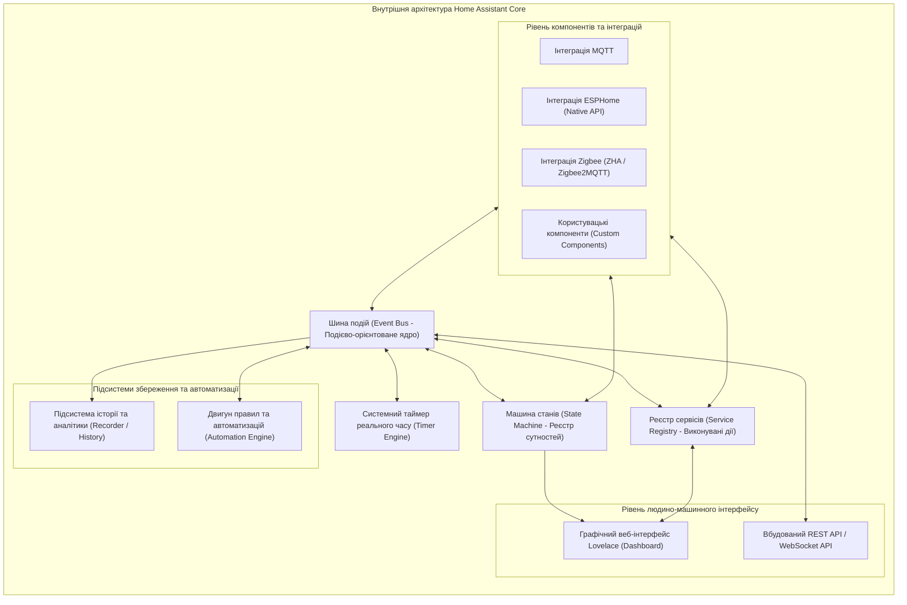
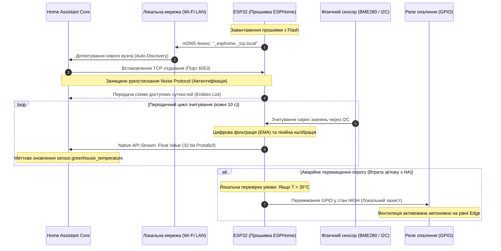

# Змістовий модуль 3. Інтеграція, Smart-системи та аналітика

# Тема 11. "Розумний будинок": архітектура, платформи (Home Assistant)

---

## 11.1. Концепція Smart Home

### Основний зміст та теоретичний базис

В еволюції кіберфізичних систем житлового та комерційного призначення концепція **розумного будинку** (Smart Home) займає одне з провідних місць як комплексне програмно-апаратне середовище, покликане забезпечити синергетичну взаємодію інженерних підсистем життєзабезпечення, комфорту, енергоефективності та фізичної безпеки. Історично системи автоматизації будівель розвивалися у формі розрізнених та ізольованих контурів управління: окремо функціонували локальні термостати опалення, охоронна сигналізація, системи відеоспостереження та релейні автомати вимикання освітлення. Сучасна парадигма Smart Home докорінно змінює цей підхід, об'єднуючи різнорідні виконавчі пристрої, сенсорні масиви та користувацькі інтерфейси в єдиний інформаційно-обчислювальний простір із наскрізною передачею даних та автоматизованим прийняттям рішень.

Центральною проблемою проектування систем розумного будинку на сучасному етапі є вибір архітектурної моделі взаємодії компонентів. На ринку комерційних споживчих рішень тривалий час домінувала парадигма хмарної залежності (Cloud-Dependent Architecture), пропонована великими вендорами. У таких екосистемах кожен польовий пристрій передає дані телеметрії на віддалений сервер провайдера через глобальну мережу Інтернет, де виконується оцінка умов і формуються зворотні керуючі команди. Практичний досвід експлуатації таких систем виявив низку фундаментальних недоліків, серед яких ключовими є критична залежність від стабільності зовнішнього інтернет-провайдера, висока та погано прогнозована затримка проходження сигналу (Latency), загрози конфіденційності внаслідок постійного витоку персональних даних життєдіяльності людини на сторонні сервери, а також ризик раптового припинення підтримки сервісів або переведення їх на платну підписку (Vendor Lock-in).

На противагу хмарному підходу висунуто фундаментальний принцип **локального управління** (Local Control / Local-First Architecture). Відповідно до цієї парадигми вся первинна інформація від сенсорів, конфігураційні профілі, бази даних історії та алгоритми автоматизації розміщуються та обробляються виключно всередині локальної обчислювальної мережі житла на власному серверному шлюзі (Home Gateway / Edge Node). Зовнішній доступ до глобальної мережі Інтернет розглядається як другорядна опція, що використовується виключно для віддаленого інформування власника через захищені тунелі або отримання метеорологічних прогнозів.

```mermaid
flowchart TD
    subgraph LocalDomain["Локальний домен безпеки та управління (Local-First)"]
        direction TB
        Sensors["Сенсорні масиви (Клімат, Рух, Витік води, Струм)"]
        Actuators["Виконавчі пристрої (Реле, Термостати, Е-замки, Клапани)"]
        
        LocalHub["Локальний координатор Smart Home (Home Assistant)"]
        LocalDB["Локальна база даних часових рядів (SQLite / MariaDB)"]
        LocalEngine["Локальний рушій автоматизацій та правил (State Engine)"]
        
        Sensors -->|Локальний зв'язок: ESPHome API / MQTT / ZigBee| LocalHub
        LocalHub -->|Миттєві команди керування < 10 мс| Actuators
        LocalHub <--> LocalDB
        LocalHub <--> LocalEngine
    end

    subgraph UserInterface["Користувацькі термінали"]
        HMI["Локальна панель керування / Смартфон (Wi-Fi LAN)"]
    end

    subgraph ExternalWorld["Зовнішнє середовище (Опційно)"]
        RemoteApp["Віддалений клієнт (VPN / WireGuard)"]
        ExtCloud["Зовнішні сервіси (Прогноз погоди)"]
    end

    LocalHub <-->|Прямий WebSocket/HTTP без хмари| HMI
    RemoteApp <==|Шифрований тунель| LocalHub
    ExtCloud -.->|REST API / Async poll| LocalHub
```
*Рисунок 1 — Структурна схема системи розумного будинку на базі принципу локального управління (Local Control)*

Як продемонстровано на рисунку 1, замкнений контур регулювання локалізований безпосередньо у фізичному просторі об'єкта. У разі аварії на лінії зовнішнього інтернет-провайдера чи повного фізичного відключення зовнішнього кабелю локальна система продовжує функціонувати в штатному режимі: датчики безпеки миттєво перекривають кульові крани з електроприводом при детектуванні витоку води, реле освітлення реагують на натискання настінних вимикачів без затримок, а кліматичні контролери підтримують заданий температурний графік.

З погляду математичної теорії надійності, коефіцієнт готовності (Availability) системи розумного будинку з хмарною залежністю $A_{cloud\_arch}$ визначається як добуток коефіцієнтів готовності всіх послідовно з'єднаних елементів інформаційного тракту:

$$A_{cloud\_arch} = A_{local\_hw} \cdot A_{LAN} \cdot A_{ISP} \cdot A_{WAN} \cdot A_{cloud\_service}$$

де $A_{local\_hw}$ позначає коефіцієнт готовності локальних датчиків та мікроконтролерів; $A_{LAN}$ є показником надійності внутрішнього бездротового та дротового сегментів локальної мережі; $A_{ISP}$ відповідає готовності каналу зв'язку локального інтернет-провайдера; $A_{WAN}$ позначає готовність магістральних маршрутизаторів глобальної мережі; $A_{cloud\_service}$ визначає коефіцієнт готовності серверної інфраструктури хмарного провайдера.

Натомість коефіцієнт готовності системи, спроектованої за принципом локального управління $A_{local\_arch}$, повністю виключає зовнішні фактори ризику:

$$A_{local\_arch} = A_{local\_hw} \cdot A_{LAN}$$

Приймаючи типові промислові оцінки надійності ($A_{local\_hw} = 0{,}999$, $A_{LAN} = 0{,}998$, $A_{ISP} = 0{,}985$, $A_{WAN} = 0{,}995$, $A_{cloud\_service} = 0{,}990$), отримуємо сумарну готовність хмарної системи $A_{cloud\_arch} \approx 0{,}967$ (що еквівалентно майже 290 годинам простою на рік). Для локальної системи готовність становить $A_{local\_arch} \approx 0{,}997$ (менше 26 годин простою на рік), що забезпечує підвищення експлуатаційної надійності системи більше ніж на порядок.

| Характеристика системи | Хмарно-залежні екосистеми (Tuya, SmartThings, Xiaomi Cloud) | Системи на базі локального управління (Home Assistant, openHAB) |
| :--- | :--- | :--- |
| **Місце збереження та обробки даних** | Віддалені дата-центри вендора (Data Centers / Public Cloud) | Локальний шлюз безпосередньо всередині об'єкта (Local Edge / Fog) |
| **Працездатність без Інтернету** | Повна або значна втрата функціоналу автоматизації та управління | Абсолютне збереження всіх локальних алгоритмів та зв'язків |
| **Типова латентність реакції** | Від $200\text{ мс}$ до кількох секунд (залежить від завантаження каналів) | Детермінована затримка в межах $2 \dots 15\text{ мс}$ |
| **Конфіденційність персональних даних** | Низька (Телеметрія, голосові записи та відео потоки доступні третім особам) | Абсолютна (Дані не залишають фізичного периметра локальної мережі) |
| **Залежність від політики виробника** | Висока (Ризик відключення API, платної підписки, припинення підтримки) | Нульова (Повна автономність та відкритий вихідний код програмного ядра) |
| **Гнучкість інтеграції протоколів** | Обмежена пристроями сумісними лише з екосистемою даного вендора | Універсальна підтримка сотень гетерогенних технологій (MQTT, ZigBee, Z-Wave, BLE) |

Аналіз даних таблиці переконливо доводить, що для побудови безпечного, відмовостійкого та довговічного розумного будинку інженерне проектування повинно ґрунтуватися виключно на принципах локальної автономії та відкритої інтеграції.

---

## 11.2. Огляд open-source платформи Home Assistant

### Основний зміст та теоретичний базис

Серед сучасних платформ проміжного програмного забезпечення для інтеграції систем розумного будинку безумовним лідером із відкритим вихідним кодом є **Home Assistant** (написаний переважно на мові Python із використанням асинхронного фреймворку `asyncio`). Архітектура платформи спроектована навколо концепції максимальної модульності, об'єктно-орієнтованого моделювання фізичного середовища та реактивної обробки подій у реальному часі.


*Рисунок 2 — Внутрішня модульна архітектура ядра платформи Home Assistant*

Фундаментальними складовими архітектури ядра Home Assistant Core, представленої на рисунку 2, є:
- Шина подій (Event Bus) виступає центральною магістраллю обміну повідомленнями всередині системи. Усі події (зміна фізичного стану сенсора, натискання кнопки користувачем, спрацювання системного таймера) публікуються на шині подій у неблокуючому асинхронному режимі.
- Машина станів (State Machine) веде централізований динамічний реєстр усіх підключених об'єктів. Вона гарантує, що кожна сутність у системі має однозначно визначений поточний стан та набір додаткових атрибутів, а будь-яка зміна стану автоматично генерує подію `state_changed` на шині подій.
- Реєстр сервісів (Service Registry) містить перелік усіх зареєстрованих функцій і методів, які можуть бути викликані для виконання фізичної дії (наприклад, увімкнення світла `light.turn_on`, закриття замка `lock.lock` або відправка текстового повідомлення).
- Системний таймер (Timer) формує регулярні імпульси часу (подія `time_changed`), що забезпечує функціонування періодичних перевірок, планувальників завдань та часових затримок.
- Підсистема історії (Recorder) асинхронно записує всі зміни станів та виклики служб у реляційну базу даних (за замовчуванням SQLite з можливістю безшовної заміни на PostgreSQL чи MariaDB), надаючи масив даних для статистичного аналізу та побудови графіків.

У моделі даних Home Assistant базовою одиницею опису фізичного або віртуального світу є **сутність** (Entity). Кожна сутність належить до конкретного функціонального домену (Domain) та ідентифікується унікальним рядком формату `domain.object_id` (наприклад, `sensor.boiler_temperature`, `switch.pump_relay`, `binary_sensor.front_door_contact`). Сутність характеризується скалярним значенням стану (`state`, наприклад `"on"`, `"off"`, `24.5`, `"unavailable"`) та асоціативним масивом метаданих (`attributes`), що містить додаткові фізичні та службові показники (одиниці вимірювання, рівень заряду батареї, версію прошивки).

Автоматизація в Home Assistant описується за допомогою декларативної парадигми на основі тріади **Тригер — Умова — Дія** (Trigger — Condition — Action):
- Тригери (Triggers) визначають події, які ініціюють початок аналізу правила (зміна стану сутності, перетин порогового значення, настання певного часу доби, прийом MQTT-повідомлення чи сигналу геолокації).
- Умови (Conditions) являють собою набір логічних предикатів (булевих виразів), які перевіряються після спрацювання тригера; якщо хоча б одна умова не виконується, обробка сценарію миттєво переривається.
- Дії (Actions) визначають виклики конкретних сервісів з реєстру Service Registry, які система виконує у разі успішної перевірки всіх умов.

Математично роботу рушія автоматизації Home Assistant можна формалізувати як розширений кінцевий автомат (Extended State Machine):

$$\mathcal{S}_{HA} = \langle \mathcal{E}, \mathcal{Q}, \mathcal{T}, \mathcal{C}, \mathcal{A}, \delta, \lambda \rangle$$

де $\mathcal{E} = \{e_1, e_2, \dots, e_m\}$ є множиною всіх зареєстрованих сутностей у системі; $\mathcal{Q} = \mathcal{S}_1 \times \mathcal{S}_2 \times \dots \times \mathcal{S}_m$ позначає повний простір станів системи, що утворюється декартовим добутком множин допустимих значень кожної окремої сутності; $\mathcal{T}$ є множиною вхідних подій-тригерів; $\mathcal{C}: \mathcal{Q} \to \{0, 1\}$ є вирішальною функцією перевірки комплексу умов над поточним вектором станів системи; $\mathcal{A}$ є простором вихідних керуючих дій (сервісів); $\delta: \mathcal{Q} \times \mathcal{T} \times \mathcal{C} \to \mathcal{Q}$ позначає функцію переходів системи у новий стан; $\lambda: \mathcal{Q} \times \mathcal{T} \times \mathcal{C} \to \mathcal{A}$ є функцією формування вихідних впливів на виконавчі механізми.

Час реакції локальної автоматизації $\tau_{local\_action}$ обчислюється як сума затримок на окремих етапах локальної системи:

$$\tau_{local\_action} = \tau_{sensor\_tx} + \tau_{bus\_dispatch} + \tau_{eval\_cond} + \tau_{action\_exec}$$

де $\tau_{sensor\_tx}$ позначає тривалість передачі даних сенсором у локальній мережі (зазвичай $1 \dots 5\text{ мс}$ по Wi-Fi або ZigBee); $\tau_{bus\_dispatch}$ є часом маршрутизації події у черзі шини Event Bus (мікросекунди); $\tau_{eval\_cond}$ позначає тривалість обчислення умов процесором шлюзу; $\tau_{action\_exec}$ є часом доставки команди на актуатор. Сумарне значення $\tau_{local\_action}$ у середовищі Home Assistant становить від $5$ до $20\text{ мс}$, що забезпечує непомітну для людини, миттєву реакцію інфраструктури будівлі.

| Спосіб розгортання Home Assistant | Середовище виконання | Наявність супервізора (Supervisor) | Підтримка магазину аддонів (Add-ons) | Повний контроль над ОС | Складність адміністрування |
| :--- | :--- | :--- | :--- | :--- | :--- |
| **Home Assistant OS (HAOS)** | Виділений образ ОС на базі Buildroot / Linux | Повна підтримка | Повна підтримка в один клік | Мінімальний (ОС повністю керована HA) | Низька (Ідеально для виділених Edge-шлюзів) |
| **Home Assistant Container** | Окремий Docker-контейнер поверх існуючої ОС | Відсутній | Відсутня (Аддони розгортаються вручну через Docker) | Повний контроль хостової ОС | Середня (Вимагає навичок адміністрування Docker) |
| **Home Assistant Supervised** | Docker-контейнери під керуванням супервізора на Debian | Повна підтримка | Повна підтримка | Повний контроль хостової ОС | Висока (Суворі вимоги до налаштувань Debian) |
| **Home Assistant Core** | Віртуальне середовище Python venv безпосередньо в ОС | Відсутній | Відсутня | Повний контроль | Висока (Потребує ручного вирішення залежностей) |

Аналіз варіантів розгортання вказує на те, що для автономних промислових та домашніх серверів оптимальним вибором є Home Assistant OS або Home Assistant Container під керуванням Docker Compose, що гарантує безвідмовність та простоту резервного копіювання.

---

## 11.3. Інтеграція пристроїв через ESPHome

### Основний зміст та теоретичний базис

Серед технологій розробки вбудованого програмного забезпечення для мікроконтролерів класів ESP8266 та ESP32 особливе місце посідає проект **ESPHome**. Це система, що дозволяє створювати надійні, високопродуктивні прошивки для пристроїв Інтернету речей без необхідності написання низькорівневого C/C++ коду вручну. Замість цього розробник описує повну конфігурацію сенсорів, інтерфейсів, пінів вводу-виводу та локальних правил поведінки у вигляді структурованого декларативного документа на мові **YAML**. Компілятор ESPHome автоматично генерує оптимізований вихідний C++ код на базі фреймворку ESP-IDF або Arduino Core, компілює його в бінарний образ і прошиває мікроконтролер через USB-інтерфейс або по бездротовому каналу за технологією **OTA** (Over-The-Air).


*Рисунок 3 — Життєвий цикл ініціалізації, потокового обміну за протоколом Native API та виконання локальних правил автоматизації у вузлі ESPHome*

Взаємодія між Home Assistant та пристроями під управлінням ESPHome, представлена на рисунку 3, реалізується за допомогою спеціалізованого протоколу **Home Assistant Native API** (протокол відкритого порту 6053/TCP), який має суттєві переваги над стандартним брокером MQTT:
- Мінімальні накладні витрати передачі даних: передача метрик здійснюється у бінарному форматі за допомогою механізму серіалізації **Google Protocol Buffers** (ProtoBuf), що усуває ресурсомісткий парсинг текстових рядків JSON і заощаджує оперативну пам'ять мікроконтролера.
- Автоматичне виявлення (Zero-Configuration Auto-Discovery): пристрій після підключення до Wi-Fi анонсує свій функціонал через протокол локального простору імен mDNS; Home Assistant автоматично виявляє вузол та створює в машині станів усі відповідні сутності без ручного редагування конфігураційних файлів сервера.
- Криптографічний захист каналу зв'язку: починаючи з сучасних версій, Native API використовує криптографічний фреймворк **Noise Protocol** (симетричне шифрування ChaCha20-Poly1305 із попередньо розподіленими ключами PSK), що унеможливлює перехоплення телеметрії чи підміну керуючих команд у локальній мережі.
- Двостороннє потокове сполучення: замість періодичного опитування (Polling) між сервером та ESP32 встановлюється постійна TCP-сесія з контролем доступності через Keep-Alive пінг; зміна стану сенсора транслюється на сервер за частки мілісекунди.

Надзвичайно важливою властивістю ESPHome є здатність реалізовувати **граничну автономність (Edge Fallback Automation)**. Якщо зв'язок між мікроконтролером і сервером Home Assistant переривається внаслідок перезавантаження шлюзу або відмови роутера, пристрій ESP32 продовжує самостійно виконувати критичні алгоритми захисту, описані у внутрішньому блоці автоматизацій прошивки.

У процесі збору даних ESPHome надає розвинений математичний апарат цифрової фільтрації сигналів безпосередньо на мікроконтролері. Для усунення високочастотного шуму АЦП та випадкових стрибків вимірювань використовується цифровий фільтр експоненційного ковзного середнього (**EMA**, Exponential Moving Average):

$$S_t = \alpha \cdot X_t + (1 - \alpha) \cdot S_{t-1}$$

де $S_t$ позначає згладжене вихідне значення фізичної величини на поточному кроці дискретизації; $X_t$ є поточним сирим вимірюванням, знятим із сенсора або регістра АЦП; $S_{t-1}$ відповідає попередньому згладженому значенню фільтра; $\alpha$ є коефіцієнтом згладжування ($0 < \alpha \le 1$), який задає співвідношення між чутливістю та ступенем фільтрації завад.

Для перерахунку сирих електричних величин сенсорів (опору, напруги або струму) у фізичні одиниці вимірювання застосовується алгоритм багатоточкової лінійної калібрації:

$$Y = Y_1 + \frac{(X - X_1) \cdot (Y_2 - Y_1)}{X_2 - X_1}$$

де $X$ позначає поточне значення вхідного сигналу, а відрізок $[X_1, X_2]$ формує діапазон калібрувального інтервалу, якому відповідають еталонні фізичні значення відрізка $[Y_1, Y_2]$.

Нижче наведено практичний, вичерпний та повністю робочий маніфест конфігурації `esphome_node.yaml` для мікроконтролера ESP32, який демонструє підключення цифрових сенсорів, релейного модуля, фільтрацію та реалізацію аварійного контуру автономного управління:

```yaml
esphome:
  name: esp32-climate-controller
  friendly_name: "ESP32 Контролер Клімату"

esp32:
  board: esp32dev
  framework:
    type: esp-idf

# Налаштування захищеного Wi-Fi з'єднання
wifi:
  ssid: "SmartHome_Private_IoT"
  password: "SecureWPA3Password2026"
  fast_connect: true
  manual_ip:
    static_ip: 192.168.10.45
    gateway: 192.168.10.1
    subnet: 255.255.255.0

# Активація криптографічного протоколу Native API для Home Assistant
api:
  encryption:
    key: "Noise_PSK_Secret_Key_Base64_String_Generated_Here="

# Модуль оновлення прошивки по повітрю
ota:
  platform: esphome
  password: "StrongOTAPassword2026"

# Активація діагностичного виводу
logger:
  level: INFO

# Шина зв'язку I2C для цифрових сенсорів
i2c:
  sda: GPIO21
  scl: GPIO22
  scan: true
  id: bus_i2c

# Визначення сенсорних компонентів
sensor:
  # Цифровий датчик температури та вологості BME280 на шині I2C
  - platform: bme280_i2c
    i2c_id: bus_i2c
    address: 0x76
    temperature:
      name: "Температура приміщення"
      id: room_temp
      accuracy_decimals: 1
      filters:
        - exponential_moving_average:
            alpha: 0.2
            send_every: 3
        - calibrate_linear:
            - 0.0 -> 0.2
            - 40.0 -> 39.7
      # Локальна автоматизація контуру захисту на рівні Edge
      on_value_range:
        - above: 30.0
          then:
            - switch.turn_on: relay_fan
            - logger.log: "Увага! Критична температура. Вентилятор увімкнено локально."
        - below: 26.0
          then:
            - switch.turn_off: relay_fan
    humidity:
      name: "Відносна вологість"
      id: room_humidity
      accuracy_decimals: 1
      filters:
        - sliding_window_moving_average:
            window_size: 5
            send_every: 1
    pressure:
      name: "Атмосферний тиск"
      id: room_pressure
      accuracy_decimals: 1
    update_interval: 10s

# Виконавчі пристрої (Реле управління вентиляцією)
switch:
  - platform: gpio
    pin: GPIO18
    name: "Силове реле охолодження"
    id: relay_fan
    inverted: false
    restore_mode: ALWAYS_OFF

# Бінарний сенсор стану вхідних дверей (Геркон)
binary_sensor:
  - platform: gpio
    pin:
      number: GPIO19
      mode: INPUT_PULLUP
      inverted: true
    name: "Контакт дверей"
    id: door_sensor
    filters:
      - delayed_on_off: 50ms
```

| Директива конфігурації ESPHome | Тип об'єкта | Призначення в системі Smart Home |
| :--- | :--- | :--- |
| `api.encryption.key` | Безпека | Активує симетричне шифрування сеансів Native API на основі фреймворку Noise Protocol |
| `filters.exponential_moving_average` | Математична обробка | Згладжує стрибки шумів сенсора за формулою експоненційного середнього без затримок пам'яті |
| `on_value_range` | Гранична автоматизація | Реалізує повністю автономний апаратний контур регулювання на самому мікроконтролері |
| `binary_sensor.filters.delayed_on_off`| Апаратна фільтрація | Програмно усуває брязкіт механічних контактів геркона чи кнопки без додаткових RC-ланцюгів |
| `switch.restore_mode` | Відмовостійкість | Детермінує безпечний стан виконавчого реле після аварійного скидання живлення мікроконтролера |

Наведена структура конфігурації демонструє, як декларативний опис перетворює мікроконтролер ESP32 на повноцінний інтелектуальний вузол Edge-рівня, здатний вести цифрову фільтрацію, керувати виконавчими механізмами, самостійно відпрацьовувати контури локального захисту та транслювати високоточні дані в ядро Home Assistant.

---

### Питання для самоперевірки та аналітичного осмислення

1. Розкрийте фундаментальні інженерні відмінності між концепцією хмарно-залежного розумного будинку (Cloud-Dependent) та архітектурою локального управління (Local Control). Чому показник надійності $A_{local\_arch}$ суттєво перевершує $A_{cloud\_arch}$?
2. Опишіть призначення та взаємозв'язок основних компонентів ядра Home Assistant Core (Event Bus, State Machine, Service Registry, Timer, History).
3. На основі формальної математичної моделі скінченного автомата $\mathcal{S}_{HA}$ розкрийте функціональне призначення елементів тріади автоматизації: Trigger, Condition та Action.
4. Проаналізуйте протокол Home Assistant Native API у порівнянні з класичним брокером MQTT. За рахунок яких механізмів досягається підвищення продуктивності та безпеки обміну даними між сервером і контролером ESP32?
5. Поясніть принцип функціонування цифрового фільтра експоненційного ковзного середнього (EMA) на мікроконтролері. Як вибір коефіцієнта $\alpha$ впливає на динамічні властивості сенсорного каналу?
6. Що таке гранична автономність (Edge Fallback Automation) у контексті ESPHome, і чому реалізація критичних блокувань безпосередньо у прошивці мікроконтролера є обов'язковою вимогою промислової та побутової безпеки?
7. Проведіть порівняльний аналіз чотирьох способів розгортання Home Assistant (HAOS, Container, Supervised, Core). Який із варіантів є найбільш доцільним для створення компактного шлюзу на базі одноплатного комп'ютера з підтримкою ізольованих Docker-контейнерів?