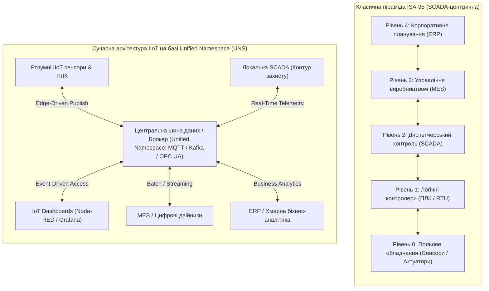

# Змістовий модуль 3. Інтеграція, Smart-системи та аналітика

# Тема 12. Промисловий ІоТ (IIoT) та концепція Smart Factory

---

## 12.1. Індустрія 4.0 та IIoT

### Основний зміст та теоретичний базис

Глобальна трансформація виробничого сектору, що отримала назву **Індустрія 4.0** (Industry 4.0), знаменує собою перехід до кіберфізичних виробничих систем (**CPPS**, Cyber-Physical Production Systems), у яких фізичні технологічні процеси тісно інтегровані з розподіленими обчислювальними мережами, алгоритмами штучного інтелекту та аналітикою великих даних. Історично промисловість пройшла шлях від механізації за допомогою парових машин у першій промисловій революції, електрифікації та запровадження конвеєрного виробництва у другій, до комплексної автоматизації на базі мікропроцесорних програмованих логічних контролерів (**ПЛК**, Programmable Logic Controllers) у третій революції. Четверта промислова революція базується на створенні «розумних фабрик» (**Smart Factory**), де засоби виробництва, матеріали, готова продукція та логістичні ланцюги об'єднуються в єдину самоорганізовану та самоадаптивну екосистему.

Фундаментальним технологічним рушієм Індустрії 4.0 є **Промисловий Інтернет речей** (Industrial Internet of Things, **IIoT**). Під цим поняттям розуміють багаторівневу систему взаємопов'язаних промислових об'єктів, верстатів, датчикових масивів, виконавчих механізмів, локальних контролерів та хмарно-туманних аналітичних платформ, які взаємодіють через відкриті або спеціалізовані промислові протоколи зв'язку з метою автоматизованого моніторингу, діагностики, оптимізації та автономного керування виробництвом.

Для здобувачів вищої освіти принципово важливо провести чітке науково-інженерне розмежування між споживчим Інтернетом речей (**Consumer IoT**) та Промисловим Інтернетом речей (**IIoT**). Якщо у споживчому секторі (наприклад, у системах розумного будинку чи персональних трекерах) головними пріоритетами є низька собівартість пристроїв, простота використання кінцевим споживачем та гнучкість, а тимчасова затримка сигналу в $200 \dots 500\text{ мс}$ або короткочасна втрата зв'язку з хмарою є допустимими й призводять лише до незначного дискомфорту користувача, то в промисловому секторі діють кардинально інші критерії.

```mermaid
flowchart TD
    subgraph Consumer_IoT["Споживчий IoT (Consumer IoT)"]
        direction TB
        C_Goal["Мета: Комфорт та зручність користувача"]
        C_Latency["Латентність: М'який реальний час (200-1000 мс)"]
        C_Reliability["Надійність: Best-Effort (99.0% - 99.9%)"]
        C_Failure["Наслідок відмови: Побутовий дискомфорт (вимикання лампи)"]
        C_Cost["Собівартість: Мінімальна (масові побутові SoC)"]
    end

    subgraph Industrial_IoT["Промисловий IoT (Industrial IoT / IIoT)"]
        direction TB
        I_Goal["Мета: Безперервність процесів, OEE, безпека праці"]
        I_Latency["Латентність: Жорсткий/детермінований час (< 1 - 10 мс)"]
        I_Reliability["Надійність: Mission-Critical (99.999% - Five Nines)"]
        I_Failure["Наслідок відмови: Аварія, руйнування обладнання, ризик життю"]
        I_Cost["Собівартість: Висока (промислове виконання, сертифікація SIL)"]
    end
```


*Рисунок 1 — Порівняння парадигм споживчого (Consumer IoT) та промислового (IIoT) Інтернету речей*

На рисунку 1 наведено принципове зіставлення вимог до систем. Відмова побутового пристрою, наприклад розумної розетки, не створює загрози для життя людей чи критичних матеріальних збитків. Натомість в індустріальному середовищі відмова системи вібраційного моніторингу підшипникових вузлів потужної парової або газової турбіни електростанції тягне за собою катастрофічні наслідки. Руйнування ротора, що обертається зі швидкістю $3000\text{ об/хв}$, здатне призвести до знищення енергоблоку, багатомільйонних фінансових втрат, екологічного лиха та загрози життю обслуговуючого персоналу. 

Через це пристрої IIoT проєктуються з урахуванням концепції функціональної безпеки (стандарти IEC 61508 та ISO 13849 з рівнями повноти безпеки **SIL 2 / SIL 3** та рівнями продуктивності **PL d / PL e**), оснащуються захистом від електромагнітних завад промислового рівня (відповідно до стандарту IEEE 1613), функціонують у розширеному температурному діапазоні від $-40\text{ }^\circ\text{C}$ до $+85\text{ }^\circ\text{C}$ і підтримують детерміновані протоколи зв'язку з гарантованим часом доставки пакетів.

Ключовим завданням впровадження IIoT на сучасних підприємствах є підвищення інтегрального показника ефективності використання обладнання (**OEE**, Overall Equipment Effectiveness). Математична модель OEE є трифакторним добутком коефіцієнтів доступності обладнання $A$, продуктивності $P$ та якості виготовлення продукції $Q$:

$$OEE = A \cdot P \cdot Q = \left( \frac{T_{oper}}{T_{planned}} \right) \cdot \left( \frac{N_{actual} \cdot T_{ideal}}{T_{oper}} \right) \cdot \left( \frac{N_{good}}{N_{actual}} \right)$$

де $T_{oper}$ позначає фактичний час продуктивної роботи технологічного обладнання без урахування простоїв (год); $T_{planned}$ є запланованим фондом робочого часу за виробничим графіком (год); $N_{actual}$ позначає загальну кількість виробленої продукції за час $T_{oper}$ (одиниць); $T_{ideal}$ визначає мінімально можливий теоретичний час виготовлення одиниці продукції відповідно до паспортних даних верстата (год/одиницю); $N_{good}$ відповідає кількості вироблених одиниць продукції, які повністю відповідають стандартам якості та не містять браку.

Безперервний моніторинг параметрів обладнання за допомогою технологій IIoT безпосередньо оптимізує коефіцієнт доступності $A$ завдяки переходу від планово-попереджувальних ремонтів до предиктивного технічного обслуговування (**PdM**, Predictive Maintenance). Це усуває раптові аварійні зупинки ліній і скорочує час непланових простоїв.

| Критерій порівняння | Споживчий Інтернет речей (Consumer IoT) | Промисловий Інтернет речей (IIoT) |
| :--- | :--- | :--- |
| **Цільовий об'єкт управління** | Побутова техніка, кліматичні системи, носії інформації | Верстати з ЧПУ, турбіни, роботизовані лінії, реактори |
| **Вимоги до часу реакції** | М'який реальний час (Soft Real-Time, десятки або сотні мілісекунд) | Жорсткий та детермінований реальний час (Hard Real-Time, від $100\text{ мкс}$ до $10\text{ мс}$) |
| **Рівень доступності (Availability)** | $99{,}0 \dots 99{,}9\%$ (допускаються короткочасні перезавантаження) | $99{,}999\%$ («п'ять дев'яток», час простою менше $5{,}26$ хв на рік) |
| **Експлуатаційне середовище** | Офісні та житлові приміщення з нормальним мікрокліматом | Агресивні середовища, вібрація, пил, вибухонебезпечні зони (ATEX) |
| **Домінуючі інтерфейси** | Wi-Fi (2.4/5 ГГц), Bluetooth Low Energy, Zigbee Home | Промисловий Ethernet (PROFINET, EtherCAT), TSN, Modbus, OPC UA |
| **Наслідки відмови системи** | Тимчасова втрата комфорту, незручність для споживача | Техногенна катастрофа, людські жертви, колосальні збитки |
| **Термін експлуатації компонентів** | Від 2 до 5 років (швидке моральне застарівання) | Від 15 до 30 років із збереженням сумісності протоколів |

Порівняльний аналіз демонструє, що впровадження IIoT вимагає кардинально вищого рівня надійності та системної інтеграції, об'єднуючи світ інформаційних технологій (**IT**, Information Technology) зі світом операційних технологій (**OT**, Operational Technology).

---

## 12.2. Цифрові двійники (Digital Twins)

### Основний зміст та теоретичний базис

Центральною концепцією управління активами та оптимізації процесів на підприємствах Індустрії 4.0 є технологія **цифрових двійників** (Digital Twins). Вперше формалізована професором Майклом Грівзом у 2002 році та згодом адаптована аерокосмічним агентством NASA, концепція цифрового двійника визначається як динамічна, віртуальна копія фізичного об'єкта, процесу або системи, яка функціонує паралельно з реальним прототипом, безперервно отримує дані його поточного стану через сенсорні масиви IIoT і використовує фізико-математичні моделі та алгоритми машинного навчання для симуляції, діагностики, прогнозування та оптимізації поведінки об'єкта в реальному часі.

У теорії моделювання розрізняють три рівні зрілості цифрових представлень фізичних об'єктів залежно від способу інтеграції інформаційних потоків:
- Цифрова модель (Digital Model) являє собою статичний цифровий опис об'єкта (наприклад, 3D CAD-креслення чи математичну модель), де відсутній будь-який автоматичний обмін даними між фізичним виробом і його віртуальним аналогом.
- Цифрова тінь (Digital Shadow) забезпечує автоматизований односпрямований потік даних від фізичного об'єкта до цифрового образу; будь-які зміни фізичного стану миттєво відображаються у віртуальному просторі, проте зворотний керуючий вплив на фізичний об'єкт формується виключно людиною-оператором.
- Повноцінний цифровий двійник (Digital Twin) реалізує замкнений двоспрямований зв'язок; система не лише постійно поглинає телеметрію від сенсорної мережі об'єкта, але й на основі симуляції та оптимізаційних розрахунків автоматично генерує та надсилає керуючі команди на виконавчі пристрої фізичного об'єкта для запобігання позаштатним ситуаціям.

```mermaid
flowchart TD
    subgraph PhysicalSpace["Фізичний простір (Physical Space)"]
        direction TB
        Asset["Фізичний актив (наприклад, Газова турбіна)"]
        Sensors["Сенсорна телеметрія: Вібрація, Температура, Тиск, Оберти"]
        Actuators["Виконавчі органи: Клапани подачі палива, Сервоприводи"]
        Asset -->|Генерація фізичних процесів| Sensors
        Actuators -->|Зворотна фізична дія| Asset
    end

    subgraph CyberSpace["Кібернетичний простір (Цифровий двійник)"]
        direction TB
        StateObserver["Спостерігач стану (Кальманівська фільтрація)"]
        PhysicsModel["Фізико-математична симуляція (Динаміка ротора)"]
        AI_Model["Нейромережева модель деградації матеріалів"]
        RUL_Engine["Блок розрахунку залишкового ресурсу (RUL)"]
        OptControl["Оптимізаційний регулятор параметрів"]
        
        StateObserver <--> PhysicsModel
        PhysicsModel --> AI_Model
        AI_Model --> RUL_Engine
        RUL_Engine --> OptControl
    end

    Sensors -->|Потокові дані через промисловий шлюз| StateObserver
    OptControl -->|Автоматичні команди адаптації режиму| Actuators
    RUL_Engine -->|Оповіщення інженерної служби (PdM)| MES_ERP["Системи планування MES / ERP"]
```
*Рисунок 2 — Архітектурна схема замкненого кіберфізичного цифрового двійника промислового агрегату*

На рисунку 2 зображено замкнений контур функціонування цифрового двійника турбіни. Первинні дані вібрації та температури надходять до блоку спостерігача стану, який у режимі реального часу синхронізує параметри розрахункової математичної моделі з фізичною реальністю.

Математично динаміка фізичного промислового активу та його віртуального цифрового двійника описується системою диференціальних рівнянь у просторі станів:

$$\dot{\mathbf{x}}_p(t) = \mathbf{A}_p(t) \mathbf{x}_p(t) + \mathbf{B}_p(t) \mathbf{u}_p(t) + \mathbf{w}_p(t), \quad \mathbf{y}_p(t) = \mathbf{C}_p \mathbf{x}_p(t) + \mathbf{v}_p(t)$$

$$\dot{\mathbf{x}}_v(t) = \mathbf{A}_v(\boldsymbol{\theta}) \mathbf{x}_v(t) + \mathbf{B}_v(\boldsymbol{\theta}) \mathbf{u}_v(t) + \mathbf{K}(t) \left( \mathbf{y}_p(t) - \mathbf{C}_v \mathbf{x}_v(t) \right)$$

де $\mathbf{x}_p(t) \in \mathbb{R}^n$ позначає вектор дійсного фізичного стану активу (включаючи розподіл температур, амплітуди вібраційних гармонік, механічні напруження); $\mathbf{u}_p(t) \in \mathbb{R}^m$ є вектором керуючих дій на виконавчі органи; $\mathbf{y}_p(t) \in \mathbb{R}^k$ позначає вектор вихідних сигналів, знятих сенсорами; $\mathbf{w}_p(t)$ та $\mathbf{v}_p(t)$ є випадковими векторами технологічних збурень і вимірювальних шумів відповідно; $\mathbf{x}_v(t)$ є розрахунковим вектором стану всередині цифрового двійника; $\boldsymbol{\theta}$ позначає вектор повільно змінюваних параметрів фізичного зносу матеріалу (наприклад, коефіцієнт втомної міцності лопаток); $\mathbf{K}(t)$ є матрицею коефіцієнтів підсилення фільтра Кальмана, яка мінімізує нев'язку між дійсними вимірюваннями сенсорів $\mathbf{y}_p(t)$ та прогнозованими показниками $\hat{\mathbf{y}}_v(t) = \mathbf{C}_v \mathbf{x}_v(t)$.

На основі розрахованої динаміки віртуального стану цифровий двійник здійснює неперервне обчислення залишкового терміну корисної експлуатації (**RUL**, Remaining Useful Life) обладнання:

$$RUL(t) = \inf \left\{ \Delta t \in \mathbb{R}^+ \mid \mathbf{x}_v(t + \Delta t) \in \Omega_{critical} \right\}$$

де $\Omega_{critical}$ позначає підпростір критичних станів системи, за якого вібрація перевищує гранично допустиму норму за ГОСТ/ISO або виникає ризик втомного руйнування металу. Завдяки цій оцінці система завчасно повідомляє корпоративні системи планування виробництва (**MES/ERP**) про необхідність замовлення комплектуючих та проведення ремонту в заплановане технологічне вікно, повністю запобігаючи аварійним зупинкам.

---

## 12.3. SCADA vs IoT Dashboard

### Основний зміст та теоретичний базис

В автоматизації промислових підприємств тривалий час панувала класична ієрархічна модель автоматизації, формалізована стандартом **ISA-95** (Purdue Enterprise Reference Architecture, **PERA**). Відповідно до цієї піраміди, обмін інформацією відбувався строго між сусідніми вертикальними рівнями: польові датчики та приводи (Рівень 0) підключалися до програмованих логічних контролерів (Рівень 1), контролери опитувалися системами диспетчерського контролю та збору даних (**SCADA**, Supervisory Control and Data Acquisition, Рівень 2), які передавали узагальнені звіти на рівень управління виробничими процесами (**MES**, Рівень 3), а той, у свою чергу, інтегрувався з системою планування ресурсів підприємства (**ERP**, Рівень 4).


*Рисунок 3 — Трансформація класичної вертикальної піраміди ISA-95 у подієво-орієнтовану плоску архітектуру Unified Namespace (UNS)*

Як показано на рисунку 3, впровадження технологій Промислового Інтернету речей руйнує жорстку вертикальну ізоляцію рівнів піраміди ISA-95, трансформуючи її у відкриту розподілену структуру єдиного простору імен (**UNS**, Unified Namespace). У традиційній SCADA доступ до даних датчика з боку корпоративної аналітики вимагав послідовного опитування та ретрансляції через усі проміжні рівні, що призводило до інформаційного блокування та значних витрат часу. В архітектурі IIoT будь-який авторизований споживач (від локального інженерного планшета до хмарного штучного інтелекту) може підписатися на необхідні топіки телеметрії напряму через єдину високонадійну брокерську шину даних (на базі протоколів MQTT, Apache Kafka або OPC UA).

Традиційна система **SCADA** розроблялася як локальний, апаратно-залежний програмний комплекс, встановлений на серверах диспетчерських пунктів у межах закритого технологічного периметра підприємства. SCADA орієнтована на циклічне синхронне опитування контролерів (Master-Slave Polling) за промисловими протоколами (Modbus RTU/TCP, Profibus, DNP3). Головне призначення SCADA полягає у забезпеченні оперативного людино-машинного інтерфейсу (**HMI**) для чергового інженера-технолога, видачі термінових технологічних аварійних сигналів (Alarms) та захисті локальних технологічних контурів. Вона має статичні мнемосхеми, оновлення яких вимагає зупинки проекту, і практично позбавлена засобів масштабної предиктивної аналітики.

На противагу цьому, сучасний **IoT Dashboard** (реалізований на платформах ThingsBoard, Grafana, Node-RED Dashboard чи Home Assistant) являє собою розподілену, хмарно-туманну, платформонезалежну систему візуалізації та оперативного управління. Вона функціонує за асинхронним подієво-орієнтованим принципом (Event-Driven), отримуючи дані через веб-сокети (**WebSockets**) та брокери повідомлень. 

IoT Dashboard не замінює SCADA повністю на нижньому критичному рівні управління агрегатами, але бере на себе роль глобальної аналітичної панелі для керівництва, технічних служб та мобільних сервісних бригад, забезпечуючи доступ до телеметрії з будь-якої точки світу через веб-браузери без необхідності встановлення спеціалізованого клієнтського ПЗ.

Математично різниця у формуванні затримки відображення технологічної події між традиційною SCADA-системою $\tau_{scada}$ та подієво-орієнтованим IoT Dashboard $\tau_{iiot}$ моделюється співвідношеннями:

$$\tau_{scada} = \frac{T_{scan\_plc}}{2} + \sum_{m=1}^{M} \frac{T_{poll, m}}{2} + \tau_{render\_hmi}$$

$$\tau_{iiot} = \tau_{irq\_edge} + \tau_{pub\_net} + \tau_{broker\_queue} + \tau_{ws\_push}$$

де $T_{scan\_plc}$ позначає період робочого циклу виконання логіки контролером (мс); $T_{poll, m}$ є періодом опитування SCADA-сервером $m$-го підпорядкованого контролера через промисловий інтерфейс (у розгалужених мережах RS-485 опитування сотень пристроїв може тривати від $500\text{ мс}$ до кількох секунд); $\tau_{render\_hmi}$ позначає час перемальовування графічного кадру SCADA; $\tau_{irq\_edge}$ є часом виникнення апаратного переривання на розумному IIoT-датчику при зміні фізичного параметра; $\tau_{pub\_net}$ відповідає часу передачі асинхронного повідомлення у мережу; $\tau_{broker\_queue}$ є часом комутації пакета в оперативній пам'яті брокера; $\tau_{ws\_push}$ позначає час доставки події через постійно відкритий WebSocket-канал на екран браузера (одиниці мілісекунд).

Оскільки в IIoT передача здійснюється виключно за фактом зміни стану (Report-by-Exception), а не через постійне безперервне циклічне опитування незмінних параметрів, навантаження на канали зв'язку скорочується в десятки разів при одночасному зменшенні середньої латентності відображення критичних аварій.

| Параметр системи | Традиційна система SCADA | Сучасний IoT Dashboard |
| :--- | :--- | :--- |
| **Архітектурна модель** | Монолітна або клієнт-серверна у закритій мережі (On-Premises) | Мікросервісна, хмарна або гібридна (Cloud / Fog / Hybrid) |
| **Модель передачі даних** | Циклічне опитування майстром (Cyclic Master-Slave Polling) | Асинхронна публікація за подією (Publish-Subscribe / WebSockets) |
| **Базові протоколи зв'язку** | Modbus, Profibus, DNP3, OPC DA, IEC 60870-5-104 | MQTT, Sparkplug B, OPC UA PubSub, HTTPS, WebSockets |
| **Користувацький інтерфейс** | Спеціалізовані товсті клієнти на робочих станціях операторів | Адаптивні веб-інтерфейси (HTML5/CSS3), мобільні додатки |
| **Інтеграція з Big Data та AI** | Складна, вимагає сторонніх шлюзів конвертації даних | Нативна (пряма передача потоків у Data Lakes, Spark, Python API) |
| **Масштабованість системи** | Жорстко обмежена ліцензіями на кількість тегів (I/O Tags) | Висока, динамічне горизонтальне додавання нових вузлів |
| **Модель капітальних витрат** | Високі початкові витрати (CAPEX: сервери, ліцензії на ПЗ) | Гнучкі операційні витрати (OPEX: підписка, хмарні ресурси) |

Аналіз даних таблиці показує, що сучасна архітектура Smart Factory реалізує симбіоз обох технологій: SCADA залишається ядром швидкого автоматичного захисту та диспетчеризації цехового рівня, тоді як IoT Dashboard забезпечує наскрізну аналітику, зв'язок із цифровими двійниками та стратегічне управління бізнес-процесами підприємства.

---

### Питання для самоперевірки та аналітичного осмислення

1. Розкрийте ключові відмінності між споживчим Інтернетом речей (Consumer IoT) та Промисловим Інтернетом речей (IIoT) з точки зору вимог до латентності, надійності та функціональної безпеки (SIL).
2. На основі математичної моделі розрахунку показника OEE (Overall Equipment Effectiveness) поясніть, яким чином безперервний збір вібраційної телеметрії впливає на коефіцієнт доступності обладнання $A$.
3. У чому полягає принципова різниця між поняттями «цифрова модель» (Digital Model), «цифрова тінь» (Digital Shadow) та «цифровий двійник» (Digital Twin)?
4. Опишіть математичну модель синхронізації динамічного цифрового двійника з реальним фізичним об'єктом у просторі станів за допомогою фільтра Кальмана.
5. Як визначається показник залишкового ресурсу (RUL, Remaining Useful Life) всередині аналітичного ядра цифрового двійника, і яке його практичне значення для предиктивного технічного обслуговування?
6. Проаналізуйте трансформацію класичної вертикальної піраміди автоматизації ISA-95 у подієво-орієнтовану плоску архітектуру Unified Namespace (UNS). Які переваги це надає для корпоративної аналітики?
7. Проведіть порівняльний аналіз механізмів доставки даних у традиційних SCADA-системах (Master-Slave Polling) та сучасних IoT Dashboard (Publish-Subscribe / Report-by-Exception). Як це впливає на утилізацію пропускної здатності каналів зв'язку?