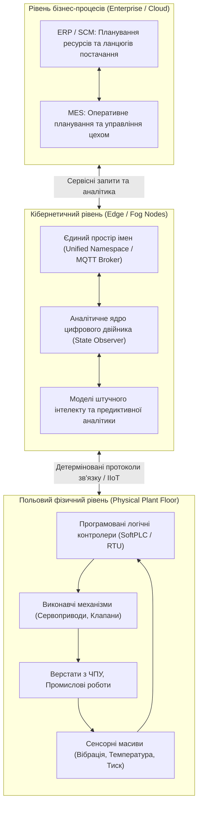
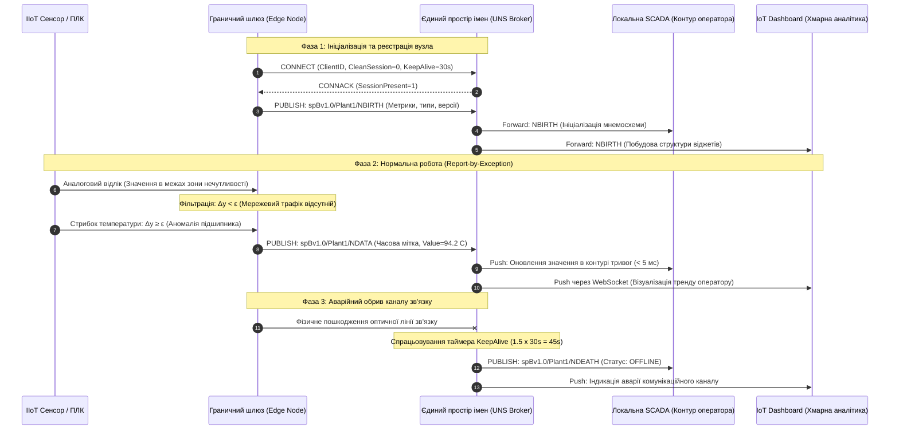
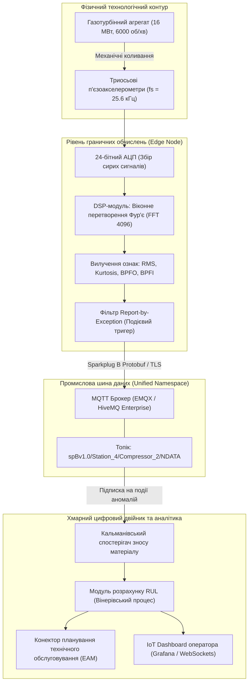

# Тема 12. Промисловий Інтернет речей (IIoT) та концепція Smart Factory

## Мета лекції
Формування у здобувачів вищої освіти комплексної системи теоретичних знань і прикладних інженерних компетентностей щодо архітектурної організації кіберфізичних виробничих систем, функціонування промислового Інтернету речей та розгортання технологій Smart Factory, що забезпечують підвищення загальної ефективності обладнання, перехід до предиктивного обслуговування на основі цифрових двійників і конвергенцію інформаційних та операційних технологій у сучасному високоавтоматизованому виробництві.

## Очікувані результати навчання
1. **Знання та розуміння.** Здобувачі засвоять фундаментальні принципи Індустрії 4.0, архітектурні особливості промислового Інтернету речей на відміну від споживчого сегмента, а також понятійний апарат технології цифрових двійників і математичні моделі розрахунку показників доступності, продуктивності та надійності обладнання.
2. **Застосування.** Студенти навчаться інтегрувати компоненти телеметрії в єдиний простір імен виробництва, проєктувати схеми обміну даними між польовими контролерами, брокерами повідомлень і аналітичними панелями та налаштовувати промислові комунікаційні протоколи для задач оперативного диспетчерського контролю.
3. **Аналіз.** Слухачі зможуть диференціювати функціональні можливості класичних SCADA-комплексів і сучасних розподілених систем візуалізації IoT Dashboard, виявляти критичні часові затримки та вузькі місця у мережевих інфраструктурах і оцінювати придатність хмарних і туманних обчислень для конкретних класів виробничих процесів.
4. **Оцінювання та синтез.** Майбутні фахівці опанують методи оцінювання ризиків кібербезпеки в операційному контурі, обґрунтування вибору апаратних засобів захисту і сенсорних мереж, а також синтезу комплексної архітектури розумного виробництва для вирішення завдань предиктивного моніторингу складних динамічних активів.

---

## Детальний покроковий план лекції

### 1. Теоретико-концептуальний базис. Архітектура кіберфізичних виробничих систем та цифрових двійників
* 1.1. Еволюційний перехід від традиційної автоматизації до концепції Індустрії 4.0 та кіберфізичних систем виробництва.
* 1.2. Системне зіставлення споживчого Інтернету речей та IIoT за критеріями детермінізму, надійності й функціональної безпеки.
* 1.3. Концептуальна модель та рівні зрілості цифрових двійників у замкненому контурі оптимізації фізичних активів.
* 1.4. Математичний апарат розрахунку загальної ефективності обладнання OEE та оцінювання залишкового терміну експлуатації RUL.

### 2. Методологія та аналіз граничних умов. Конвергенція IT/OT, диспетчеризація та мережеві обмеження
* 2.1. Трансформація класичної ієрархічної піраміди автоматизації ISA-95 у розподілену подієво-орієнтовану модель Unified Namespace.
* 2.2. Порівняльний аналіз архітектури, пропускної здатності та способів опитування систем SCADA та розподілених IoT Dashboard.
* 2.3. Промислові комунікаційні протоколи обміну телеметрією та стандарти публікації-підписки MQTT Sparkplug B і OPC UA.
* 2.4. Критичні затримки, втрати пакетів та обмеження пропускної здатності каналів зв'язку як бар'єри хмарної обробки промислових даних.
* 2.5. Моделі туманних і граничних обчислень для забезпечення локального детермінізму та фільтрації первинної телеметрії.

### 3. Практичний індустріальний / фаховий кейс. Розгортання предиктивного моніторингу роторного агрегату на базі IIoT
**Тема наскрізної задачі.** «Проєктування архітектури цифрового двійника газотурбінної установки компресорної станції з виявленням підшипникових дефектів методами граничної віброаналітики та передачею даних у корпоративну хмару через брокер MQTT»

## 1. Теоретико-концептуальний базис. Архітектура кіберфізичних виробничих систем та цифрових двійників

### 1.1. Еволюційний перехід від традиційної автоматизації до концепції Індустрії 4.0 та кіберфізичних систем виробництва

Історичний розвиток промислового виробництва являє собою послідовну зміну технологічних укладів, де кожен етап базувався на радикальній зміні енергетичної та інформаційної парадигми. Перша промислова революція замінила мускульну силу механічною енергією пари. Друга революція впровадила електричну енергію, потоковий конвеєрний поділ праці та масове стандартизоване виробництво. Третя промислова революція, що розгорнулася у другій половині двадцятого століття, інтегрувала в цехи електронно-обчислювальні машини, числове програмне керування та програмовані логічні контролери, сформувавши класичну автоматизацію дискретних і неперервних технологічних процесів. 

Традиційна автоматизація третього покоління спиралася на жорстко детерміновану піраміду керування з централізованим прийняттям рішень і функціональною ізоляцією рівнів. Проте глобалізація ринків, скорочення життєвого циклу продукції та вимога випуску індивідуалізованих виробів за ціною масового продукту виявили фундаментальні обмеження класичних автоматизованих систем керування технологічними процесами. Виникла гостра потреба у гнучких виробничих системах, здатних до миттєвої переконфігурації технологічних маршрутів без повної зупинки ліній і ручного перепрограмування контролерів.

Відповіддю на ці виклики стала концепція **Індустрії 4.0**, ключовим базисом якої є розгортання кіберфізичних виробничих систем (**CPPS**, Cyber-Physical Production Systems). На відміну від класичних мехатронних комплексів, у яких цифрова обчислювальна частина відігравала суто підпорядковану роль локального регулятора, кіберфізична система забезпечує безперервну двосторонню інтеграцію фізичних процесів із розподіленими обчислювальними ресурсами, сенсорними мережами та аналітичними алгоритмами. Об'єкти матеріального світу (верстати, роботи, транспортери, заготовки та інструменти) оснащуються вбудованими процесорами, модулями зв'язку та пам'яттю, набуваючи здатності сприймати стан навколишнього середовища, взаємодіяти між собою через промислові комунікаційні протоколи та самостійно адаптувати технологічні параметри в динамічному середовищі.

Для уніфікації проектування таких складних комплексів міжнародними організаціями було розроблено тривимірну модель архітектури еталонної моделі Індустрії 4.0 (**RAMI 4.0**, Reference Architectural Model Industrie 4.0). Модель систематизує життєвий цикл виробів і обладнання відповідно до стандарту IEC 62890, рівні функціональної ієрархії виробництва на базі стандартів IEC 62264 та IEC 61512, а також шість вертикальних шарів інтеграції: фізичні активи (**Asset**), рівень інтеграції цифрового перетворення (**Integration**), комунікаційний рівень взаємодії (**Communication**), інформаційний рівень структуризації даних (**Information**), функціональний рівень прикладної логіки (**Functional**) та бізнес-рівень оптимізації процесів підприємства (**Business**).

*Рисунок 1 — Структурна декомпозиція кіберфізичної виробничої системи (CPPS)*

На рисунку 1 відображено комплексну взаємодію між рівнями сучасної кіберфізичної системи, де класичні ізольовані шари об'єднуються через відкриту інформаційну шину кібернетичного рівня, забезпечуючи наскрізну прозорість матеріальних та інформаційних потоків.

---

### 1.2. Системне зіставлення споживчого Інтернету речей та IIoT за критеріями детермінізму, надійності й функціональної безпеки

Незважаючи на спільність базових принципів побудови мереж із пакетною передачею даних, між споживчим Інтернетом речей (**Consumer IoT**) та Промисловим Інтернетом речей (**IIoT**) існує фундаментальна прірва в інженерних вимогах, обумовлена характером об'єктів управління та ціною системної відмови. 

У споживчому секторі системи проектуються з огляду на мінімізацію собівартості кінцевого вузла та швидкість виведення продукту на ринок. Архітектура більшості побутових рішень базується на концепції доставки за можливістю (**Best-Effort Delivery**), де короткочасна відсутність інтернет-з'єднання, затримка передачі пакета на сотні мілісекунд або тимчасова недоступність хмарного сервера спричиняють лише незначні незручності для користувача, не створюючи загрози життю людей чи фінансової катастрофи.

На противагу цьому, в індустріальному секторі системи автоматизації працюють у жорстких умовах технологічного середовища, керуючи швидкоплинними фізичними процесами: високошвидкісним обробленням металів, хімічним синтезом в автоклавах або переміщенням багатотонних вантажів промисловими роботами. Будь-яка непередбачувана затримка в контурі зворотного зв'язку може призвести до зіткнення виконавчих механізмів, вибуху технологічного апарату чи повного руйнування різального інструменту. Тому ключовою вимогою до IIoT є детермінізм часових інтервалів доставки повідомлень, коли максимальний час реакції системи строго обмежений зверху.

Для вирішення проблеми недетермінованості класичного стандарту Ethernet у промисловості впроваджуються технології синхронізації та квантування трафіку **TSN** (Time-Sensitive Networking, сімейство стандартів IEEE 802.1), зокрема протокол точної синхронізації часу IEEE 802.1AS та планувальник передачі за часовими слотами IEEE 802.1Qbv. Завдяки ізоляції критичного керуючого трафіку від фонового інформаційного потоку, технологія TSN гарантує доставку керуючих пакетів із часовим джитером менше одного мікросекунди.

Надійність промислових систем нормується за коефіцієнтом готовності системи $K_{\text{гот}}$, який для об'єктів безперервного виробництва повинен відповідати рівню п'яти дев'яток ($99{,}999\%$), що еквівалентно сумарному простою технологічної лінії менше $5{,}26$ хвилини на рік. У математичній теорії надійності цей показник визначається через середній наробіток до відмови ($MTBF$, Mean Time Between Failures) та середній час відновлення працездатності ($MTTR$, Mean Time To Repair):

$$K_{\text{гот}} = \frac{MTBF}{MTBF + MTTR}$$

де $MTBF$ вимірюється в десятках або сотнях тисяч годин безперервної роботи в умовах агресивного виробничого середовища, а мінімізація $MTTR$ досягається модульністю архітектури та гарячою заміною вузлів без знеструмлення мережі.

Функціональна безпека індустріального обладнання строго регламентується міжнародними стандартами IEC 61508 та ISO 13849. Впровадження IIoT-рішень вимагає відповідності певним рівням повноти безпеки (**SIL**, Safety Integrity Level). Для контурів екстреного захисту критичних установок допускається інтеграція лише тих сенсорів та мережевих шлюзів, які мають сертифікацію не нижче SIL 2 або SIL 3, що накладає жорсткі вимоги щодо дублювання каналів вимірювання, апаратної самодіагностики та використання безпечних протоколів передачі даних із контролем послідовності пакетів (наприклад, PROFIsafe або CIP Safety).

> **ПРАКТИЧНИЙ ЯКІР:**
> На повністю автоматизованому заводі з виробництва електромобільних батарей корпорації Tesla в Неваді (Gigafactory) застосування детермінованих мереж Industrial Ethernet та шини TSN дозволило скоротити час циклу зварювання акумуляторних модулів до 80 мілісекунд на комірку, виключивши мікропростої конвеєра, які раніше коштували підприємству сотні тисяч доларів щогодини.

Для наочної систематизації фундаментальних відмінностей між двома напрямами Інтернету речей у таблиці 1 наведено порівняльний інженерний аналіз ключових критеріїв їхнього проектування та експлуатації.

*Таблиця 1 — Порівняльний аналіз споживчого та промислового сегментів Інтернету речей*

| Критерій оцінювання | Споживчий сектор (Consumer IoT) | Промисловий сектор (IIoT) | Приклад з реальної практики |
| :--- | :--- | :--- | :--- |
| **Вимоги до латентності** | М'який реальний час, типові затримки становлять від $200$ до $1000\text{ мс}$ | Жорсткий детермінований час реакції у межах від $100\text{ мкс}$ до $10\text{ мс}$ | Синхронізація осей багатоосьового оброблювального центру DMG MORI |
| **Рівень надійності** | Допустимий коефіцієнт готовності складає $99{,}0 \dots 99{,}9\%$ | Критичний коефіцієнт готовності становить $99{,}999\%$ (висока доступність) | Система безперервного моніторингу ректифікаційної колони нафтопереробного заводу |
| **Функціональна безпека** | Відсутня нормативна сертифікація за стандартами безпеки | Обов'язкова атестація за рівнями SIL 2, SIL 3 (IEC 61508) або PL d, PL e (ISO 13849) | Аварійне відсікання подачі горючого газу при згасанні полум'я пальника печі |
| **Експлуатаційні умови** | Кліматичні умови побутових приміщень, діапазон температур від $0$ до $+40\text{ }^\circ\text{C}$ | Агресивні середовища, вібраційні навантаження, температура від $-40$ до $+85\text{ }^\circ\text{C}$ | Вібраційні датчики на підшипникових опорах тягодуттьових машин ТЕС |
| **Протоколи передачі** | Базові бездротові стеки Wi-Fi, BLE, Zigbee без гарантії доставки | Промислові шини PROFINET, EtherCAT, Modbus TCP, OPC UA, TSN | Мережева синхронізація роботів-маніпуляторів KUKA на автомобільній лінії складання |
| **Життєвий цикл систем** | Швидка моральна амортизація та заміна пристроїв кожні $2 \dots 4$ роки | Тривалий життєвий цикл експлуатації технологічних ліній від $15$ до $30$ років | Модернізація прокатних станів металургійного комбінату з інтеграцією IoT-шлюзів |

---

### 1.3. Концептуальна модель та рівні зрілості цифрових двійників у замкненому контурі оптимізації фізичних активів

Технологія **цифрових двійників** (Digital Twins) є найвищим ступенем еволюції інформаційних моделей реального світу в рамках Індустрії 4.0. Вперше запропонована Майклом Грівзом у 2002 році як концепція управління життєвим циклом виробу, вона трансформувалася у фундаментальний метод моделювання, діагностики та оптимізації складних динамічних систем. 

В інженерній практиці прийнято строго розмежовувати три рівні зрілості віртуальних представлень залежно від ступеня автоматизації потоків даних між фізичним та віртуальним світами:
1. Цифрова модель (**Digital Model**) передбачає створення статичного або динамічного комп'ютерного опису об'єкта (наприклад, 3D CAD-моделі, гідродинамічного розрахунку або електричної схеми), у якому обмін інформацією між фізичним виробом і моделлю виконується виключно в ручному режимі оператором.
2. Цифрова тінь (**Digital Shadow**) характеризується наявністю автоматичного односпрямованого каналу передачі даних від фізичного об'єкта до його віртуального образу за допомогою датчиків та телеметрії, проте зворотний вплив розрахованих оптимізаційних параметрів на фізичний процес реалізується виключно людиною або взагалі відсутній.
3. Цифровий двійник (**Digital Twin**) забезпечує повністю інтегрований замкнений двосторонній обмін даними, коли віртуальна модель не лише в реальному часі відстежує стан фізичного об'єкта, а й на основі фізико-математичної симуляції та алгоритмів оптимізації автоматично коригує уставки контролерів і режими роботи виконавчих органів без прямого втручання інженерного персоналу.

Життєвий цикл цифрового двійника охоплює етапи проектування виробу (**Digital Twin Prototype**), його виготовлення та валідації (**Digital Twin Instance**), а також експлуатації парку однойменного обладнання (**Digital Twin Aggregate**). 

```mermaid
stateDiagram-v2
    [*] --> Prototype_Design: Створення CAD/CAE фізико-математичної моделі
    
    state Prototype_Design {
        [*] --> ParameterEstimation: Оцінка номінальних характеристик
        ParameterEstimation --> VirtualSimulation: Віртуальні випробування навантажень
        VirtualSimulation --> [*]
    }

    Prototype_Design --> Shadowing_Phase: Фізичне виготовлення агрегату та монтаж сенсорів IIoT
    
    state Shadowing_Phase {
        [*] --> Calibration: Калібрування нулів і масштабів телеметрії
        Calibration --> StateFiltering: Кальманівська фільтрація та усунення шумів
        StateFiltering --> BaselineVerification: Порівняння відгуку з проектною моделлю
        BaselineVerification --> [*]
    }

    Shadowing_Phase --> ClosedLoop_Twin: Впровадження контуру зворотного керування
    
    state ClosedLoop_Twin {
        [*] --> RealTimeMonitoring: Потоковий моніторинг робочих режимів
        RealTimeMonitoring --> AnomalyDetection: Виявлення термодинамічних девіацій
        AnomalyDetection --> OptimizationLoop: Генерація адаптивних уставок регуляторів
        OptimizationLoop --> RealTimeMonitoring: Автоматичне внесення правок у ПЛК
    }

    ClosedLoop_Twin --> Degradation_Tracking: Фіксація симптомів механічного зносу
    
    state Degradation_Tracking {
        [*] --> FeatureExtraction: Спектральний аналіз вібраційних гармонік
        FeatureExtraction --> RUL_Calculation: Розрахунок залишкового ресурсу підшипників
        RUL_Calculation --> MaintenanceTrigger: Формування замовлення на запчастини в ERP
        MaintenanceTrigger --> [*]
    }

    Degradation_Tracking --> [*]: Виведення обладнання з експлуатації та утилізація
```

*Рисунок 2 — Стейт-машина життєвого циклу та фазових переходів промислового цифрового двійника*

На рисунку 2 наведено життєвий цикл цифрового двійника від етапу його віртуального проектування до безперервного моніторингу деградації та інтеграції з сервісними службами підприємства.

> **ПРАКТИЧНИЙ ЯКІР:**
> Корпорація General Electric впровадила понад один мільйон цифрових двійників окремих лопаток і роторів газових турбін на платформі Predix, що дало змогу оптимізувати кути атаки напрямних апаратів на теплових електростанціях у режимі реального часу, знизивши питомі витрати палива на $1{,}5\%$ та попередивши раптові теплові прогари камери згоряння.

Для математичного опису функціонування цифрового двійника у замкненому контурі застосовується апарат теорії лінійних або лінеаризованих динамічних систем у просторі станів. Динаміка реального фізичного об'єкта описується системою стохастичних диференціальних рівнянь:

$$\dot{\mathbf{x}}_p(t) = \mathbf{A}_p(t) \mathbf{x}_p(t) + \mathbf{B}_p(t) \mathbf{u}_p(t) + \mathbf{w}_p(t)$$

$$\mathbf{y}_p(t) = \mathbf{C}_p(t) \mathbf{x}_p(t) + \mathbf{v}_p(t)$$

де $\mathbf{x}_p(t) \in \mathbb{R}^n$ позначає вектор дійсного внутрішнього стану фізичного агрегату (наприклад, розподіл температурних полів ротора, механічні напруження, миттєві кутові швидкості); $\mathbf{u}_p(t) \in \mathbb{R}^m$ є вектором керуючих сигналів, що подаються на приводи та клапани; $\mathbf{y}_p(t) \in \mathbb{R}^k$ визначає вектор вимірюваних сенсорами вихідних величин; $\mathbf{A}_p(t)$, $\mathbf{B}_p(t)$, $\mathbf{C}_p(t)$ являють собою матриці динаміки об'єкта, розподілу керування та вимірювання відповідно; $\mathbf{w}_p(t)$ позначає вектор неконтрольованих випадкових збурень процесу з коваріаційною матрицею $\mathbf{Q}$; $\mathbf{v}_p(t)$ позначає вектор похибок і шумів сенсорних вимірювань із коваріаційною матрицею $\mathbf{R}$.

Оскільки пряме вимірювання всіх координат стану $\mathbf{x}_p(t)$ фізично неможливе через відсутність або дороговизну сенсорів, ядро цифрового двійника містить програмний спостерігач стану (фільтр Кальмана або фільтр частинок Люенбергера), який синхронізується з фізичним процесом за наступним диференціальним законом:

$$\dot{\hat{\mathbf{x}}}_v(t) = \mathbf{A}_v \hat{\mathbf{x}}_v(t) + \mathbf{B}_v \mathbf{u}_p(t) + \mathbf{K}(t) \left( \mathbf{y}_p(t) - \mathbf{C}_v \hat{\mathbf{x}}_v(t) \right)$$

де $\hat{\mathbf{x}}_v(t)$ позначає оцінений цифровим двійником вектор стану системи; $\mathbf{A}_v$, $\mathbf{B}_v$, $\mathbf{C}_v$ є матрицями фізико-математичної моделі активу; $\mathbf{K}(t)$ позначає матрицю вагових коефіцієнтів підсилення фільтра Кальмана, яка мінімізує середньоквадратичну похибку оцінки стану і розраховується через розв'язання матричного диференціального рівняння Ріккаті відносно поточної коваріації похибок:

$$\mathbf{K}(t) = \mathbf{P}(t) \mathbf{C}_v^T \mathbf{R}^{-1}, \quad \dot{\mathbf{P}}(t) = \mathbf{A}_v \mathbf{P}(t) + \mathbf{P}(t) \mathbf{A}_v^T - \mathbf{P}(t) \mathbf{C}_v^T \mathbf{R}^{-1} \mathbf{C}_v \mathbf{P}(t) + \mathbf{Q}$$

Завдяки неперервному коригувальному впливу нев'язки вимірювань $\mathbf{e}(t) = \mathbf{y}_p(t) - \mathbf{C}_v \hat{\mathbf{x}}_v(t)$, цифровий двійник усуває накопичення похибок числового інтегрування фізичної моделі та відтворює дійсні приховані параметри об'єкта навіть за наявності шумів у каналах промислового зв'язку.

---

### 1.4. Математичний апарат розрахунку загальної ефективності обладнання OEE та оцінювання залишкового терміну експлуатації RUL

Фундаментальним індикатором ефективності технологічного комплексу в парадигмі Smart Factory є інтегральний коефіцієнт загальної ефективності обладнання (**OEE**, Overall Equipment Effectiveness). Показник інтегрує ключові виробничі втрати, які класифікуються за трьома критичними категоріями: втрати на доступність обладнання через аварійні та налагоджувальні простої, втрати продуктивності через зниження робочої швидкості технологічної операції порівняно з паспортною, а також втрати якості через випуск некондиційних виробів.

Математична формалізація показника OEE базується на мультиплікативній моделі взаємодії трьох безрозмірних коефіцієнтів:

$$OEE = K_{\text{доступ}} \cdot K_{\text{продукт}} \cdot K_{\text{якість}}$$

Коефіцієнт доступності технологічного обладнання $K_{\text{доступ}}$ відображає відношення чистого операційного часу роботи активу до запланованого виробничого фонду часу:

$$K_{\text{доступ}} = \frac{T_{\text{факт}}}{T_{\text{план}}} = \frac{T_{\text{план}} - T_{\text{простій}}}{T_{\text{план}}}$$

де $T_{\text{план}}$ позначає плановий фонд часу роботи за зміну з відрахуванням регламентних зупинок (хв); $T_{\text{простій}}$ позначає сумарну тривалість непланових зупинок, спричинених поломками механізмів, очікуванням сировини, зміною оснащення чи аварійними блокуваннями (хв); $T_{\text{факт}}$ позначає фактичний час, протягом якого обладнання безпосередньо здійснювало технологічну операцію (хв).

Коефіцієнт продуктивності $K_{\text{продукт}}$ оцінює ступінь використання швидкісних характеристик устаткування за фактичний час його функціонування:

$$K_{\text{продукт}} = \frac{N_{\text{заг}} \cdot t_{\text{ідеал}}}{T_{\text{факт}}}$$

де $N_{\text{заг}}$ позначає загальну кількість одиниць виробленої продукції за час $T_{\text{факт}}$ (одиниць або кілограмів); $t_{\text{ідеал}}$ позначає мінімально можливий теоретичний час виготовлення одиниці виробу, передбачений паспортною документацією виробника обладнання (хв/одиницю).

Коефіцієнт якості виготовлення $K_{\text{якість}}$ визначає частку випущеної придатної продукції без дефектів відносно загального обсягу випуску:

$$K_{\text{якість}} = \frac{N_{\text{придат}}}{N_{\text{заг}}} = \frac{N_{\text{заг}} - N_{\text{брак}}}{N_{\text{заг}}}$$

де $N_{\text{придат}}$ позначає кількість готових виробів, що повністю відповідають технічним умовам з першого пред'явлення; $N_{\text{брак}}$ відповідає обсягу бракованих виробів та зразків, спрямованих на повторну переробку.

Впровадження систем IIoT безпосередньо максимізує параметр $K_{\text{доступ}}$ завдяки відмові від календарно-планового обслуговування на користь обслуговування за технічним станом. Основою такого переходу є алгоритмічне оцінювання залишкового терміну корисної експлуатації (**RUL**, Remaining Useful Life) відповідальних вузлів обладнання.

Для аналітичного моделювання деградації механічних компонентів (наприклад, підшипників кочення шпинделів верстатів або зубчастих передач редукторів) застосовується теорія надійності, що описує інтенсивність відмов через двопараметричний розподіл Вейбулла. Функція інтенсивності відмов $h(t)$, яка також називається функцією небезпеки, має наступний вигляд:

$$h(t) = \frac{\beta}{\eta} \left( \frac{t}{\eta} \right)^{\beta - 1}$$

де $t$ позначає поточний час напрацювання вузла з моменту монтажу (год); $\beta > 0$ є безрозмірним параметром форми кривої розподілу; $\eta > 0$ визначає масштабний параметр характерного терміну служби, за якого відмовляє приблизно $63{,}2\%$ парку однойменних вузлів (год). При значеннях $\beta < 1$ система перебуває в зоні ранніх приробних відмов; при $\beta = 1$ інтенсивність відмов є строго константною, що відповідає випадковим відмовам за експоненційним законом; при $\beta > 1$ настає стадія прогресуючого втомного зношування матеріалу.

У кіберфізичних системах значення поточної деградації вузла $D(t)$ моделюється як випадковий процес із дрейфом на основі вилучених із сенсорного потоку вібраційних чи теплових ознак:

$$D(t) = D_0 + \mu t + \sigma W(t)$$

де $D_0$ позначає початковий базовий рівень вібрації нового компонента; $\mu$ позначає параметр середньої швидкості накопичення пошкоджень матеріалу; $\sigma$ є коефіцієнтом дифузії процесу зношування; $W(t)$ являє собою стандартний броунівський рух (вінерівський процес). За умови встановлення критичного порогу вібраційного прискорення $D_{\text{крит}}$ (визначеного за стандартом ISO 10816 для даного класу потужності агрегату), функція густини ймовірності моменту відмови $T_{\text{відм}}$ підпорядковується зворотному гауссовому розподілу, а математичне сподівання залишкового ресурсу $\mathbb{E}[RUL(t_k)]$ у момент спостереження $t_k$ обчислюється аналітично:

$$\mathbb{E}[RUL(t_k)] = \frac{D_{\text{крит}} - D(t_k)}{\mu}$$

Отримане значення залишкового ресурсу передається через промисловий шлюз безпосередньо в систему управління технічним обслуговуванням і ремонтами (**EAM/CMMS**), автоматично генеруючи завдання на заміну вузла в найближче технологічне вікно переналагодження лінії.

> **ТИПОВА ПОМИЛКА:**
> Ототожнення понять «цифрова тінь» (Digital Shadow) та «цифровий двійник» (Digital Twin) на інженерному рівні. Багато фахівців помилково вважають, що розгортання гарної мнемосхеми на базі хмарного дашборду, яка в реальному часі відображає поточні температури чи тиск із датчиків, уже є цифровим двійником. Насправді це лише цифрова тінь. Справжній цифровий двійник вимагає замкненого контуру керування: наявності всередині віртуального ядра фізико-математичної симуляції об'єкта, здатної прораховувати альтернативні сценарії поведінки та автоматично повертати керуючі коригувальні команди у фізичний світ на виконавчі механізми чи контролери.

> **КОНТРОЛЬНЕ ПИТАННЯ:**
> Чому при спробі передачі високочастотного вібраційного сигналу (наприклад, $20\text{ кГц}$ із трьох осей акселерометра) безпосередньо у віддалену публічну хмару для розрахунку параметрів деградації підшипника система предиктивного обслуговування стає економічно та технічно нежиттєздатною, і яке інженерне рішення цієї проблеми пропонує концепція OpenFog?

Розгорнути аналіз / відповідь

**Правильний варіант: Неприпустиме перевантаження каналів зв'язку та необхідність використання граничних обчислень (Edge Computing) з вилученням діагностичних ознак на місці.**

1. Пряма трансляція сирого високочастотного вібросигналу з частотою дискретизації $f_d = 20\text{ кГц}$ за трьома осями з розрядністю АЦП $24\text{ біти}$ створює безперервний потік даних:
$$B = 3 \cdot 20\,000\text{ відліків/с} \cdot 3\text{ байти} = 180\,000\text{ байт/с} \approx 1{,}44\text{ Мбіт/с}$$
Для цеху з $200$ підшипникових опор сумарний трафік перевищить $288\text{ Мбіт/с}$ безперервного завантаження зовнішнього каналу, що вимагатиме величезних витрат на трафік, викликає непередбачувані мережеві затримки, втрати пакетів у WAN та колосальні витрати на хмарне сховище (понад $60\text{ терабайт}$ на місяць).

2. Аналіз дистракторів: Спроба знизити частоту дискретизації призведе до ефекту накладання спектрів (аліасингу) за теоремою Котельникова-Найквіста, що унеможливить фіксацію ранніх дефектів сепаратора та кілець підшипника на ультразвукових частотах. Варіант простого збереження даних у локальній базі також не вирішує задачу предиктивного реагування. Архітектурне рішення за стандартом OpenFog полягає у переносі обчислень на край мережі (Edge): локальний мікропроцесор виконує швидке перетворення Фур'є (FFT) та вейвлет-аналіз безпосередньо у датчику чи граничному шлюзі, вилучаючи лише компактний вектор діагностичних ознак (пік-фактор, ексцес, амплітуди спектральних гармонік дефекту обсягом кілька байтів), які транслюються в хмару з низькою частотою ($1\text{ раз на хвилину}$).

---

### Вказівки для самостійного осмислення

1. Проаналізуйте структуру технологічного обладнання лабораторії мікроконтролерних систем або відомого вам виробничого цеху та класифікуйте наявні там інформаційні моделі об'єктів за градацією цифрової моделі, цифрової тіні та цифрового двійника.
2. Розрахуйте потенційну зміну коефіцієнта загальної ефективності обладнання для верстата з числовим програмним керуванням, якщо відомо, що перехід від реактивного ремонту до предиктивного моніторингу скоротив аварійні простої на вісімдесят відсотків за збереження номінальних показників продуктивності та якості.
3. Ознайомтеся з текстом стандарту ISO 10816 щодо оцінки механічної вібрації машин та складіть логічну послідовність дій алгоритму граничної діагностики, який визначає момент переходу роботи турбоагрегату із зони задовільного стану в зону тривоги.

## 2. Методологія та аналіз граничних умов. Конвергенція IT/OT, диспетчеризація та мережеві обмеження

### 2.1. Трансформація класичної ієрархічної піраміди автоматизації ISA-95 у розподілену подієво-орієнтовану модель Unified Namespace

Класична методологія побудови промислових систем управління впродовж останніх трьох десятиліть базувалася на міжнародному стандарті ANSI/ISA-95, який формалізував модель PERA (Purdue Enterprise Reference Architecture). Ця архітектурна парадигма організовувала виробництво у вигляді суворої п'ятирівневої піраміди, де взаємодія відбувалася виключно між сусідніми рівнями за жорстко регламентованими інтерфейсами. Сенсори та виконавчі механізми нульового рівня передавали аналогові й дискретні сигнали на рівень програмованих логічних контролерів, контролери транслювали агреговані технологічні змінні в диспетчерські комплекси SCADA, диспетчерські системи формували пакети даних для виробничих виконавчих систем MES, а інформація рівня MES періодично спрямовувалася до корпоративних систем планування ресурсів ERP.

Така монолітна ієрархія має фундаментальний методологічний недолік, відомий в інженерній практиці як проблема інформаційних колодязів або ізольованих сховищ даних. Будь-яка аналітична задача верхнього рівня, наприклад оптимізація споживання енергоресурсів на основі даних струмових трансформаторів або побудова предиктивної моделі зносу підшипника за вібраційними спектрами, натрапляє на непереборні бар'єри конфігурації проміжних шарів. Для того щоб значення з аналогового датчика досягло хмарної аналітичної платформи, інженерам необхідно послідовно виконати конфігурування змінної в проекті ПЛК, створити відповідний тег у драйвері опитування SCADA, модифікувати базу даних реального часу, налаштувати інтерфейс передачі в MES і врешті побудувати шлюз обміну з корпоративною мережею. Подібний підхід зумовлює високу вартість інтеграції, спотворює семантику первинних сигналів і створює неприпустимі часові затримки.

Методологічним проривом Індустрії 4.0 став перехід від вертикальної інтеграції ISA-95 до плоскої, подієво-орієнтованої архітектури єдиного простору імен (**UNS**, Unified Namespace). Концепція UNS базується на створенні централізованої, але розподіленої за вузлами програмної шини повідомлень, яка функціонує як єдине достовірне джерело правди про стан усіх фізичних і віртуальних сутностей підприємства. У моделі UNS кожен виробничий компонент (від інтелектуального датчика тиску до лінії пакування чи ERP-системи) самостійно публікує свої технологічні параметри, метадані та поточний контекст у структуровану ієрархію топіків. Споживачі даних більше не запитують інформацію послідовно через вертикальні шлюзи, а підписуються безпосередньо на релевантні гілки єдиного простору імен.

Семантична структура адресного простору UNS узгоджується з виробничою топологією підприємства, що визначається стандартом ISA-95:

$$\text{Підприємство} \;/\; \text{Виробничий майданчик} \;/\; \text{Цех} \;/\; \text{Технологічна лінія} \;/\; \text{Робоча комірка} \;/\; \text{Функціональний модуль}$$

Методологія міграції діючого підприємства від жорсткої піраміди ISA-95 до архітектури Unified Namespace формалізується послідовністю аналітичних та інженерних етапів:

$$
\begin{aligned}
\text{Крок 1 (Структурний аудит):} & \quad \mathcal{S}_{\text{legacy}} \to \{\mathcal{P}_i, \mathcal{T}_i\}, \quad \text{ідентифікація адресних просторів ПЛК та тегів;} \\
\text{Крок 2 (Гранична інкапсуляція):} & \quad \mathbf{y}_i(t) \mapsto \mathcal{M}_{\text{Sparkplug}}(\mathbf{y}_i), \quad \text{пакетування сирих регістрів у формат Sparkplug B;} \\
\text{Крок 3 (Ініціалізація сесії):} & \quad \mathcal{B} \leftarrow \text{STATE} \cup \text{NBIRTH}, \quad \text{публікація сертифіката народження вузла в брокер;} \\
\text{Крок 4 (Подієва маршрутизація):} & \quad \Delta \mathbf{y}_i > \varepsilon \implies \mathcal{B} \xrightarrow{\text{NDATA}} \mathcal{D}_{\text{sub}}, \quad \text{трансляція девіацій споживачам;} \\
\text{Крок 5 (Контроль цілісності):} & \quad \tau_{\text{loss}} > T_{\text{keepalive}} \implies \mathcal{B} \xrightarrow{\text{NDEATH}} \mathcal{D}_{\text{sub}}, \quad \text{фіксація обриву сесії з польовим вузлом.}
\end{aligned}
$$

У наведеній математичній формалізації множина $\mathcal{S}_{\text{legacy}}$ відображає сукупність успадкованих технологічних контролерів; $\mathcal{P}_i$ та $\mathcal{T}_i$ є множинами підтримуваних фізичних протоколів і внутрішніх адресних тегів відповідно; вектор $\mathbf{y}_i(t)$ позначає сирі вимірювання сенсорів у часі; відображення $\mathcal{M}_{\text{Sparkplug}}$ перетворює апаратні типи даних у типізовані корисні навантаження; $\mathcal{B}$ є простором станів центрального брокера повідомлень; символи $\text{NBIRTH}$, $\text{NDATA}$ та $\text{NDEATH}$ позначають нормативні типи повідомлень промислового стандарту; $\varepsilon$ задає зону нечутливості вимірювання (deadband); $\mathcal{D}_{\text{sub}}$ являє собою множину авторизованих підписників (SCADA, MES, хмарні аналітичні панелі); $\tau_{\text{loss}}$ позначає час відсутності пакетів зв'язку, а $T_{\text{keepalive}}$ визначає ліміт таймауту сесії.

Аналіз граничних умов моделі Unified Namespace демонструє, що вона втрачає ефективність у технологічних контурах, які вимагають субмілісекундного часу реакції. Архітектура брокера повідомлень за своєю природою вносить стохастичну затримку черги, через що пряме використання шини UNS для задач замкненого позиціонування осей верстатів або захисту енергомереж є неприпустимим. Крім того, в умовах відмови мережевої інфраструктури система має спиратися на локальні апаратні блокування контролерів нульового рівня, функціонування яких не залежить від стану центрального брокера.

---

### 2.2. Порівняльний аналіз архітектури, пропускної здатності та способів опитування систем SCADA та розподілених IoT Dashboard

Принципова різниця між класичними SCADA-системами та сучасними розподіленими IoT Dashboard полягає в механізмі комунікації з джерелами даних. SCADA історично проектувалася для роботи за моделлю синхронного циклічного опитування (Master-Slave Polling). У цій парадигмі сервер SCADA виступає активним ініціатором обміну, який періодично формує запити до кожного підпорядкованого контролера за чергою. Навіть якщо технологічний параметр не зазнав жодних змін, контролер змушений повертати повний пакет із поточними значеннями.

Такий метод створює лінійне зростання мережевого навантаження зі збільшенням кількості точок вимірювання. Якщо канал зв'язку має обмежену пропускну здатність або високий рівень завад (наприклад, промисловий радіоканал або супутниковий лінк на віддалених свердловинах), переважна більшість смуги пропускання витрачається на транспортування статичних, незмінних величин. При цьому час оновлення критичного аварійного сигналу прямо пропорційний загальній кількості підключених вузлів, оскільки черга опитування не може бути миттєво перервана без втрати синхронізації протоколу.

На противагу циклічному опитуванню, архітектура IoT Dashboard базується на моделі асинхронного сповіщення за винятком (Report-by-Exception). Граничний пристрій або інтелектуальний шлюз контролює стан датчика локально. Поки виміряна величина залишається всередині попередньо налаштованої смуги допустимих відхилень, передача в мережу повністю блокується. Як тільки параметр зазнає стрибка або змінює свій логічний статус, граничний вузол формує одиничне асинхронне повідомлення і передає його споживачам.

*Рисунок 3 — Подієва діаграма взаємодії вузлів при використанні промислового протоколу публікації-підписки*

На рисунку 3 продемонстровано послідовність проходження сигналів у часі: від початкової ініціалізації простору імен до обробки аварійного відключення вузла через системний механізм контролю сесій.

Граничні умови застосування концепції Report-by-Exception виникають у високодинамічних процесах із безперервним коливанням технологічного параметра або високим рівнем вимірювального білого шуму. Якщо смуга нечутливості налаштована некоректно, граничний вузол генерує безперервний потік мікроповідомлень, що спричиняє ефект лавинного шторму публікацій (Publish Storm). У такій ситуації брокер повідомлень відчуває критичне перевантаження черги оперативної пам'яті, а накладні витрати на заголовки пакетів роблять споживання трафіку значно вищим, ніж при класичному циклічному опитуванні фіксованого масиву регістрів Modbus.

---

### 2.3. Промислові комунікаційні протоколи обміну телеметрією та стандарти публікації-підписки MQTT Sparkplug B і OPC UA

Уніфікація гетерогенного обладнання на рівні польових комунікацій вимагає застосування відкритих протоколів, здатних вирішувати проблему семантичної сумісності. Базовий протокол MQTT, попри свою легковагість та адаптованість до ненадійних мереж, має серйозне обмеження для промислового сектору: він не стандартизує структуру топіків і формат переданого корисного навантаження. Для брокера корисне навантаження є суцільним масивом байтів, що вимагає ручного узгодження кодувальників і декодувальників між кожною парою видавець-підписник.

Для подолання цієї проблеми асоціацією Eclipse Foundation було розроблено промисловий стандарт **MQTT Sparkplug B**. Специфікація визначає жорсткі правила побудови структури адресного простору топіків, регламентує обов'язкові службові повідомлення життєвого циклу вузла та використовує двійкове компактне кодування корисного навантаження на основі Protocol Buffers (Google Protobuf).

Простір імен топіків у специфікації Sparkplug B має наступну структуру:

$$\text{spBv1.0} \;/\; \text{Ідентифікатор групи} \;/\; \text{Тип повідомлення} \;/\; \text{Ідентифікатор крайового вузла} \;[\;/\; \text{Ідентифікатор пристрою}\;]$$

Типи повідомлень стандарту строго регламентують поведінку системи. Сертифікат народження вузла (NBIRTH) передає повний перелік усіх доступних метрик, їхні інженерні одиниці вимірювання та початкові значення, повністю виключаючи необхідність попереднього ручного опису бази тегів у підписниках. Повідомлення NDATA транслюють виключно змінені технологічні змінні з фіксацією точного часу генерації відліку на рівні мілісекунд. Системне повідомлення смерті вузла (NDEATH) автоматично розсилається брокером у разі обриву TCP-з'єднання завдяки механізму Last Will and Testament, гарантуючи достовірність відображення статусу зв'язку.

Паралельно з розвитком сімейства MQTT для вирішення комплексних задач обміну даними розвивається відкрита архітектура **OPC UA** (Open Platform Communications Unified Architecture, стандарт IEC 62541). На відміну від орієнтованого на повідомлення протоколу MQTT, OPC UA є об'єктно-орієнтованою платформою з розвиненою моделлю адресного простору, яка включає поняття вузлів, об'єктів, змінних, методів та посилань між ними. Модель забезпечує багаторівневу семантику за рахунок застосування галузевих інформаційних специфікацій (Companion Specifications), що дозволяє пристроям різних виробників представляти технологічні дані в уніфікованому вигляді (наприклад, за специфікацією Euromap для термопластавтоматів або PackML для пакувальних ліній).

> **ВАЖЛИВО:**
> Застосування відкритого протоколу MQTT без промислової надбудови типу Sparkplug B у масштабних проектах промислової автоматизації призводить до виникнення хаотичного простору імен і повної втрати контролю над семантикою даних. Відсутність регламентованого статусу підключення та сертифікатів народження тегів перетворює довільний MQTT-брокер на критичну точку відмови, де споживачі не здатні відрізнити зависле значення вимірювання від незмінного технологічного параметра.

> **ПРАКТИЧНИЙ ЯКІР:**
> На заводах концерну Volkswagen під час розгортання глобальної хмари Industrial Cloud для об'єднання понад 120 виробничих майданчиків стандарт OPC UA з його структурованими інформаційними моделями було обрано для внутрішньоцехової інтеграції верстатів, тоді як протокол MQTT Sparkplug B застосовано для трансляції подій із граничних шлюзів у централізовані аналітичні озера даних.

Для оцінки доцільності вибору комунікаційних технологій у таблиці 2 наведено системну матрицю порівняння промислових методів передачі даних.

*Таблиця 2 — Аналітична матриця зіставлення промислових комунікаційних протоколів*

| Протокол / Технологія | Базовий транспортний рівень | Семантична стандартизація | Складність впровадження | Критичні ризики / Обмеження |
| :--- | :--- | :--- | :--- | :--- |
| **Modbus TCP / RTU** | TCP/IP або послідовна лінія RS-485 | Відсутня (передаються лише нетипізовані 16-бітні регістри) | Низька (наявність драйверів на всіх типах мікроконтролерів) | Повна відсутність метаданих, відсутність вбудованого шифрування, блокуюче циклічне опитування |
| **OPC UA (Client/Server)** | Оптимізований бінарний TCP стек (порт 4840) | Надзвичайно висока (об'єктна модель адресного простору, Companion Specs) | Висока (вимагає значних обчислювальних ресурсів ОЗП і ЦП від контролера) | Високі накладні витрати на формування стеків повідомлень, затримки при встановленні клієнтських сесій |
| **MQTT Sparkplug B** | Легковажний стек TCP/IP (порти 1883, 8883) | Висока (структурований простір топіків, типізація Google Protobuf) | Середня (необхідність підтримки бібліотек Protobuf та логіки сесій) | Залежність від централізованого брокера, критична чутливість до обриву сесії зв'язку |
| **OPC UA PubSub over TSN** | Безпосередньо канальний рівень Ethernet (без TCP/IP) | Максимальна (поєднання повноцінної моделі даних з квантуванням часу) | Критично висока (вимагає спеціалізованих мережевих комутаторів з підтримкою TSN) | Неможливість маршрутизації через стандартні WAN-мережі, висока вартість апаратної інфраструктури |

---

### 2.4. Критичні затримки, втрати пакетів та обмеження пропускної здатності каналів зв'язку як бар'єри хмарної обробки промислових даних

Ілюзія нескінченних обчислювальних можливостей хмарних центрів обробки даних спонукає розробників-початківців до спроб проектування повністю хмарних контурів автоматизації, де сигнали польових датчиків спрямовуються безпосередньо у віртуальні машини провайдерів Amazon Web Services, Microsoft Azure чи Google Cloud для формування керуючих впливів. Проте в умовах реального промислового виробництва така архітектура стикається з фізичними та мережевими обмеженнями, які унеможливлюють надійне функціонування критичних процесів.

Першим нездоланним фактором є час затримки поширення сигналу у глобальних мережах (Propagation Delay), зумовлений скінченною швидкістю світла в оптичному волокні ($v \approx 2 \cdot 10^8\text{ м/с}$) та необхідністю комутації пакетів на десятках проміжних маршрутизаторів глобальної мережі Інтернет. Навіть за ідеальних умов відстань у кілька тисяч кілометрів між цеховим шлюзом і дата-центром створює затримку туди й назад (Round Trip Time, RTT) на рівні десятків мілісекунд. Більше того, глобальний інтернет-трафік характеризується нестабільним статистичним джитером (варіацією затримки), значення якого може коливатися від $15\text{ мс}$ до $200\text{ мс}$ у періоди пікових завантажень магістральних вузлів.

Другим критичним фактором є механізм блокування початку черги (Head-of-Line Blocking) у транспортному протоколі TCP, на якому функціонує абсолютна більшість хмарних інтерфейсів (включаючи MQTT та HTTPS). Протокол TCP гарантує повну доставку кожного байта у вихідній послідовності. Якщо на лінії стається втрата хоча б одного пакета через електромагнітну заваду чи переповнення буфера маршрутизатора, приймальний стек повністю призупиняє видачу всіх наступних успішно прийнятих пакетів прикладній програмі доти, доки втрачений сегмент не буде повторно надіслано відправником і підтверджено. Для високошвидкісних технологічних процесів така секундна пауза рівнозначна повній аварії лінії.

Граничні умови повної відмови хмарної моделі керування настають за необхідності забезпечення наступних вимог:
1. Контури позиціонування та швидкісного сервоприводу, які вимагають періоду розрахунку керуючого сигналу менше десяти мілісекунд із часовим розкидом не більше ста мікросекунд.
2. Системи протиаварійного захисту компресорних агрегатів і турбін, які повинні зняти напругу з електромагнітних клапанів протягом часу, що не перевищує двадцять мілісекунд від моменту виявлення небезпечної вібрації або зриву полум'я.
3. Системи високошвидкісного оптичного сортування продукції, де швидкість конвеєра становить кілька метрів на секунду, а затримка реакції пневматичного штовхача призводить до пропуску дефектного виробу або пошкодження продукції.

У всіх зазначених ситуаціях контур зворотного керування повинен бути жорстко закритий на локальному рівні виробництва за допомогою технологій граничних і туманних обчислень.

---

### 2.5. Моделі туманних і граничних обчислень для забезпечення локального детермінізму та фільтрації первинної телеметрії

Для вирішення суперечності між необхідністю глибокого інтелектуального аналізу даних та вимогами жорсткого детермінізму в парадигмі Індустрії 4.0 застосовується методологія ієрархічних туманних обчислень, стандартизована консорціумом OpenFog. Відповідно до цієї концепції, обчислювальне навантаження розподіляється вздовж безперервного ланцюга від датчика до хмари (Edge-to-Fog-to-Cloud Continuum). 

Рівень граничних обчислень (**Edge Computing**) розгортається безпосередньо всередині інтелектуальних датчиків або граничних промислових шлюзів, розташованих на відстані фізичного кабельного з'єднання від технологічного вузла. Його основна функція полягає у високочастотній первинній фільтрації шумів, усуненні надлишковості та вилученні діагностичних векторів. Замість передачі сирого масиву відліків АЦП граничний процесор виконує алгоритми швидкого перетворення Фур'є, вейвлет-декомпозиції або розрахунку статистичних моментів розподілу (дисперсії, асиметрії, ексцесу).

Рівень туманних обчислень (**Fog Computing**) розташовується на цехових мікросерверах або локальних кластерах, об'єднуючи групу суміжних технологічних ліній. Туманний вузол виконує роль локального ядра прийняття рішень: він агрегує діагностичні вектори від кількох граничних шлюзів, співвідносить їх із контекстом виробничого розкладу, виконує запуск компактних моделей машинного навчання та керує аварійними сценаріями в режимі м'якого реального часу. Навіть у разі повного обриву зв'язку з глобальним інтернетом туманний кластер продовжує автономне функціонування, накопичуючи аналітичну інформацію в локальній базі даних часових рядів і забезпечуючи повноцінне керування технологічною ділянкою.

Граничними умовами життєздатності туманних вузлів є фізичні та ресурсні обмеження апаратної бази. Промислові граничні шлюзи часто позбавлені активного примусового охолодження через високу запиленість середовища і герметичність корпусів (IP67), що жорстко лімітує тепловий пакет процесорів (TDP) на рівні $10 \dots 15\text{ Вт}$. Це унеможливлює розгортання ресурсоємних глибоких нейронних мереж без використання спеціалізованих енергоефективних мікросхем нейропроцесорів (NPU). Крім того, децентралізація обчислень істотно розширює площину потенційних кібератак, вимагаючи апаратного захисту ключів шифрування за допомогою криптографічних модулів TPM (Trusted Platform Module) на кожному фізичному пристрої.

> **КОНТРОЛЬНЕ ПИТАННЯ:**
> На металургійному комбінаті реалізовано проект моніторингу вібрації та теплового стану підшипників прокатного стану. Технічний директор наполягає на передачі всіх сирих вимірювань (частота опитування $10\text{ кГц}$ із $64$ датчиків) через польовий шлюз безпосередньо у хмару Microsoft Azure для побудови регресійної моделі залишкового ресурсу. Водночас системний архітектор пропонує розгорнути дворівневу схему: граничний аналізатор виконує спектральну фільтрацію та передає топіки Sparkplug B у цеховий туманний сервер, який лише раз на годину синхронізує розраховані параметри деградації з хмарою. Яке архітектурне рішення є життєздатним і чому пропозиція директора призведе до системної аварії?

Розгорнути аналіз / відповідь

**Правильний варіант: Життєздатним є виключно рішення системного архітектора на базі гранично-туманної фільтрації, оскільки пряма трансляція сирих даних у хмару гарантовано перевантажить мережу і призведе до фатальних втрат інформації.**

1. Обґрунтування: Прямий потік даних від $64$ датчиків із частотою $10\text{ кГц}$ і роздільною здатністю $16\text{ бітів}$ ($2\text{ байти}$) створює сумарне навантаження:
$$B = 64 \cdot 10\,000\text{ відліків/с} \cdot 2\text{ байти} = 1\,280\,000\text{ байт/с} \approx 10{,}24\text{ Мбіт/с}$$
Безперервний щосекундний трафік такого обсягу через зовнішній інтернет-канал призводить до постійного переповнення буферів маршрутизації, втрати пакетів через обмеження MTU та блокування початку черги в протоколі TCP. Затримка передачі непередбачувано зростатиме до секунд, що унеможливить фіксацію аварійного розсипання підшипника на прокатній кліті, де руйнування настає за частки секунди.

2. Аналіз дистракторів: Спроба вирішити проблему розширенням смуги пропускної здатності зовнішнього інтернет-каналу є економічно нераціональною і не усуває стохастичного джитеру глобальної мережі. Рішення архітектора з локальним виконанням швидкого перетворення Фур'є на граничному рівні скорочує обсяг інформації більш ніж на $99\%$: у туманний сервер транслюються лише розраховані амплітуди характерних частот дефектів сепаратора та кілець. Локальний туманний вузол здійснює бекап даних, а в хмару надсилаються узагальнені показники тренду деградації, що гарантує надійність системи та мінімізацію витрат.

---

### Вказівки для самостійного осмислення

1. Здійсніть порівняльний розрахунок середнього мережевого навантаження на цехову шину передачі даних при опитуванні ста контролерів за протоколом Modbus TCP із фіксованим періодом двісті мілісекунд та при переведенні цих вузлів на подієво-орієнтований протокол MQTT Sparkplug B за умови, що технологічні параметри зазнають змін у середньому два рази на хвилину.
2. Розробіть логічну схему адресного простору топіків Unified Namespace для умовного ділянки термообробки металевих деталей, що включає гартувальну піч, бак охолодження та автоматизований портальний маніпулятор, дотримуючись семантичних рівнів стандарту ISA-95.
3. Проаналізуйте наслідки виникнення ефекту блокування початку черги в мережевому протоколі TCP для роботизованого складального осередку та запропонуйте комплекс заходів щодо сегментації мережі відповідно до рекомендацій стандарту промислової кібербезпеки IEC 62443.

## 3. Практичний індустріальний / фаховий кейс. Розгортання предиктивного моніторингу роторного агрегату на базі IIoT

### 3.1. Комплексний фаховий кейс. Розгортання системи предиктивної вібродіагностики газотурбінного газоперекачувального агрегату

#### Постановка задачі / ситуації
На компресорній станції магістрального газопроводу експлуатується парк газоперекачувальних агрегатів потужністю $16\text{ МВт}$ на базі промислової газотурбінної установки. Основним критичним вузлом, вихід з ладу якого спричиняє аварійне зупинення транспортування газу та збитки у розмірі понад $120\,000\text{ USD}$ за добу простою, є роликовий радіально-упорний підшипник силового турбокомпресора. Наявна система SCADA здійснює лише базовий моніторинг загального середньоквадратичного значення віброшвидкості ($v_{\text{RMS}}$) у смузі частот від $10\text{ Гц}$ до $1000\text{ Гц}$ з періодом опитування контролера один раз на секунду. Такий підхід фіксує аварію лише на пізній стадії критичного руйнування металу, залишаючи експлуатаційному персоналу менше двох годин до повного заклинювання ротора.

Перед інженерною групою поставлено завдання модернізації технологічного вузла в рамках концепції Smart Factory шляхом створення кіберфізичної системи вібродіагностики та цифрового двійника підшипникового вузла. Система повинна забезпечувати раннє виявлення зародження мікротріщин на зовнішньому та внутрішньому кільцях підшипника щонайменше за сорок діб до настання критичного стану, розраховувати залишковий ресурс вузла (RUL) та транслювати подієві дані в єдиний простір імен (UNS) без перевантаження корпоративної мережі. 

Параметри технологічного вузла, сенсорного оснащення та мережевої інфраструктури наведено у таблиці 1.

*Таблиця 1 — Вхідні параметри промислового кейсу вібродіагностики турбоагрегату*

| Параметр системи | Позначення | Номінальне числове значення | Одиниці вимірювання |
| :--- | :--- | :--- | :--- |
| Частота обертання вала турбіни | $f_r$ | $100$ | Гц ($6000\text{ об/хв}$) |
| Кількість тіл кочення (роликів) | $Z$ | $12$ | шт. |
| Діаметр тіла кочення | $d$ | $20{,}0$ | мм |
| Середній ділильний діаметр підшипника | $D$ | $120{,}0$ | мм |
| Кут контакту тіл кочення | $\alpha$ | $0$ | градуси ($\cos\alpha = 1$) |
| Частота дискретизації вібросенсорів | $f_s$ | $25\,600$ | вибірок/с на канал |
| Розрядність аналого-цифрового перетворювача | $N_{\text{adc}}$ | $24$ | біти ($3\text{ байти}$) |
| Кількість осей вимірювання вібрації | $M_{\text{axis}}$ | $3$ | осі ($X, Y, Z$) |
| Розмір вікна швидкого перетворення Фур'є | $N_{\text{FFT}}$ | $4096$ | точок |
| Критичний поріг віброшвидкості (ISO 10816) | $D_{\text{крит}}$ | $7{,}1$ | мм/с |
| Базовий рівень вібрації нового підшипника | $D_0$ | $1{,}2$ | мм/с |

*Рисунок 1 — Структурна схема дворівневої системи предиктивного моніторингу роторного агрегату*

На рисунку 1 відображено повний наскрізний потік даних: від перетворення механічної енергії вібрації в електричні сигнали на фізичному рівні до інтелектуального аналізу деградації підшипника в ядрі цифрового двійника.

#### Покроковий аналіз та розв'язок

##### Крок 1. Розрахунок характерних кінематичних частот дефектів підшипника кочення
На першому етапі інженерного аналізу необхідно визначити точні аналітичні частоти, на яких проявлятимуться періодичні ударні імпульси при виникненні локальних дефектів геометрії підшипника. Кінематична частота проходження тіл кочення по дефекту зовнішнього кільця ($f_{\text{BPFO}}$, Ball Pass Frequency Outer Race) обчислюється відповідно до аналітичного співвідношення:

$$f_{\text{BPFO}} = \frac{Z}{2} \cdot f_r \cdot \left( 1 - \frac{d}{D} \cos\alpha \right)$$

Підставивши геометричні та швидкісні параметри агрегату з таблиці 1, отримуємо точну розрахункову частоту прояву тріщини зовнішнього кільця:

$$f_{\text{BPFO}} = \frac{12}{2} \cdot 100 \cdot \left( 1 - \frac{20{,}0}{120{,}0} \cdot 1 \right) = 6 \cdot 100 \cdot \left( 1 - 0{,}1667 \right) = 600 \cdot 0{,}8333 = 500{,}0\text{ Гц}$$

Частота проходження тіл кочення по дефекту внутрішнього кільця ($f_{\text{BPFI}}$, Ball Pass Frequency Inner Race) розраховується за формулою:

$$f_{\text{BPFI}} = \frac{Z}{2} \cdot f_r \cdot \left( 1 + \frac{d}{D} \cos\alpha \right) = 6 \cdot 100 \cdot \left( 1 + \frac{20{,}0}{120{,}0} \right) = 600 \cdot 1{,}1667 = 700{,}0\text{ Гц}$$

Отримані дискретні гармоніки $500\text{ Гц}$ та $700\text{ Гц}$ заносяться в пам'ять граничного шлюзу як опорні діагностичні маркери.

##### Крок 2. Оцінка навантаження на мережу та необхідність граничної декомпозиції
Необхідно розрахувати пропускну здатність каналу зв'язку, яка знадобилася б для прямої неперервної трансляції первинного сенсорного потоку безпосередньо у хмару з трьох осей акселерометра:

$$B_{\text{raw}} = M_{\text{axis}} \cdot f_s \cdot \frac{N_{\text{adc}}}{8} = 3 \cdot 25\,600\text{ вибірок/с} \cdot 3\text{ байти} = 230\,400\text{ байт/с} \approx 1{,}843\text{ Мбіт/с}$$

Для компресорної станції з десятьма паралельно працюючими агрегатами сумарний вхідний трафік складе:

$$B_{\text{total}} = 10 \cdot 1{,}843\text{ Мбіт/с} = 18{,}43\text{ Мбіт/с}$$

У промислових умовах віддалених компресорних станцій, де підключення до мережі забезпечується резервованим стільниковим каналом LTE або радіорелейними лініями, такий цілодобовий трафік спричинить значні фінансові витрати та періодичні втрати пакетів. Тому граничний контролер виконує віконне перетворення Фур'є для блоків розміром $N_{\text{FFT}} = 4096$ точок. Роздільна здатність спектра за частотою при цьому дорівнює:

$$\Delta f = \frac{f_s}{N_{\text{FFT}}} = \frac{25\,600\text{ Гц}}{4096} = 6{,}25\text{ Гц}$$

Така дискретизація гарантує надійне розрізнення розрахованих частот $500\text{ Гц}$ та $700\text{ Гц}$ без взаємного перекриття спектральних ліній.

##### Крок 3. Гранична компресія та фільтрація в режимі Report-by-Exception
Замість передачі масиву відліків граничний контролер щосекунди вилучає компактний вектор діагностичних ознак, який складається з інтегрального середньоквадратичного значення віброшвидкості $v_{\text{RMS}}$, ексцесу віброприскорення $\text{Kurt}$ та амплітуд на характерних частотах дефектів $A(f_{\text{BPFO}})$ і $A(f_{\text{BPFI}})$. 

Повідомлення формується за стандартом MQTT Sparkplug B із бінарною серіалізацією Google Protobuf. Застосування фільтрації за зоною нечутливості $\varepsilon = 0{,}05\text{ мм/с}$ дозволяє передавати повідомлення лише при наявності статистично значущих змін або не рідше одного разу на $10$ секунд для підтвердження працездатності вузла. Розмір закодованого бінарного пакета складає лише $48\text{ байтів}$. Оцінимо ступінь скорочення мережевого трафіку:

$$\eta_{\text{comp}} = \left( 1 - \frac{48\text{ байтів} / 10\text{ с}}{230\,400\text{ байт/с}} \right) \cdot 100\% = \left( 1 - \frac{4{,}8}{230\,400} \right) \cdot 100\% \approx 99{,}998\%$$

##### Крок 4. Розрахунок залишкового ресурсу RUL всередині цифрового двійника
У процесі тривалої експлуатації агрегату граничний шлюз зафіксував стійке зростання амплітуди на частоті $f_{\text{BPFO}} = 500\text{ Гц}$, що свідчить про розвиток втомної раковини на зовнішньому кільці підшипника. Поточний інтегральний рівень вібрації на вузлі досяг значення $D(t_k) = 2{,}4\text{ мм/с}$. 

Цифровий двійник використовує модель стохастичного вінерівського процесу з лінійним дрейфом. На основі аналізу останніх двадцяти вимірювань розрахована середня швидкість деградації матеріалу становить $\mu = 0{,}015\text{ мм/с за добу}$. Розрахуємо залишковий ресурс вузла до моменту досягнення критичної межі згідно з вимогами стандарту ISO 10816 ($D_{\text{крит}} = 7{,}1\text{ мм/с}$):

$$\mathbb{E}[RUL(t_k)] = \frac{D_{\text{крит}} - D(t_k)}{\mu} = \frac{7{,}1 - 2{,}4}{0{,}015} = \frac{4{,}7}{0{,}015} \approx 313{,}3\text{ діб}$$

Отримане значення свідчить про наявність контрольованого дефекту, який не вимагає аварійної зупинки обладнання в поточний момент, але дозволяє запланувати заміну підшипника під час чергової планової зупинки агрегату через $240$ діб.

#### Інтерпретація результатів та альтернативні сценарії
Запропоноване архітектурне рішення успішно розв'язує конфлікт між високою деталізацією діагностики та обмеженнями пропускної здатності каналів зв'язку промислових об'єктів. Завдяки переносу спектральних обчислень на рівень Edge-шлюзу вдалося виявити зародження дефекту підшипника на стадії мікротріщини, скоротивши мережевий трафік майже на сто відсотків. 

Якби турбоагрегат функціонував не з фіксованою швидкістю обертання, а в умовах змінного швидкісного режиму під керуванням частотно-регульованого електропривода (де частота обертання вала $f_r$ динамічно варіюється в діапазоні від $40\text{ Гц}$ до $110\text{ Гц}$ залежно від гідравлічного опору газопроводу), класичне перетворення Фур'є з фіксованими частотними фільтрами втратило б працездатність. У такому альтернативному сценарії алгоритмічне ядро граничного контролера вимагало б доповнення модулем порядкового аналізу (Order Tracking), де дискретизація вібросигналу здійснюється не за стабільними інтервалами часу, а синхронно з імпульсами фазового оптичного енкодера вала (кут-орієнтована вибірка), що забезпечило б стабільність відносних спектральних ліній дефектів незалежно від миттєвої кутової швидкості турбіни.

---

### 3.2. Зведена довідкова система лекції

Нижче наведено комплексну систематизацію фундаментальних концепцій, нормативних моделей і технологічних інструментів, розглянутих у межах теми Промислового Інтернету речей та інтелектуального виробництва.

*Таблиця 2 — Фундаментальні поняття, моделі та стандарти дисципліни*

| Термін / Концепція | Формалізація / Сутність | Реальний кейс застосування | Основне обмеження / Ризик |
| :--- | :--- | :--- | :--- |
| **Індустрія 4.0 (Industry 4.0)** | Концепція побудови кіберфізичних виробничих систем (CPPS) з повною наскрізною цифровою інтеграцією матеріальних потоків | Цифрове виробництво кузовів на заводі BMW у Регенсбурзі | Висока капіталомісткість первинної заміни парку застарілого верстатного обладнання |
| **Промисловий IoT (IIoT)** | Багаторівнева мережа підключених промислових активів із вимогами жорсткого детермінізму та підвищеної надійності | Система телеметричного контролю мережі нафтоперекачувальних насосів | Критична вразливість до кібератак у разі прямого виходу польових пристроїв у глобальну мережу |
| **Цифровий двійник (Digital Twin)** | Динамічна віртуальна копія фізичного об'єкта, інтегрована замкненим контуром двостороннього зв'язку та симуляції | Оптимізація теплових режимів лопаток газових турбін General Electric | Необхідність безперервного калібрування моделі для запобігання накопиченню похибок розрахунку |
| **Загальна ефективність (OEE)** | Мультиплікативний критерій ефективності: $OEE = K_{\text{доступ}} \cdot K_{\text{продукт}} \cdot K_{\text{якість}}$ | Моніторинг та усунення мікропростоїв складальних ліній заводу Bosch | Не враховує непрямі енергетичні та логістичні витрати підприємства |
| **Залишковий ресурс (RUL)** | Прогнозований інтервал часу до досягнення параметрами зносу гранично допустимого критичного порогу | Предиктивне обслуговування тягових редукторів швидкісних електропоїздів Siemens | Залежність точності прогнозу від стаціонарності зовнішніх експлуатаційних навантажень |
| **Єдиний простір імен (UNS)** | Подієво-орієнтована архітектура централізованої шини даних зі стандартизованою ієрархією топіків ISA-95 | Інтеграція MES і SCADA підприємства харчової промисловості через брокер MQTT | Непридатність для використання у контурах швидкісного регулювання із часом реакції менше $10\text{ мс}$ |
| **MQTT Sparkplug B** | Промисловий стандарт надбудови MQTT з бінарним кодуванням Google Protobuf та станами сесій | Телеметрія територіально розподілених газорозподільних пунктів | Повна залежність функціонування вузлів від працездатності та мережевої доступності брокера |
| **Time-Sensitive Networking (TSN)** | Група стандартів IEEE 802.1 для забезпечення гарантованого детермінізму в стандартних мережах Ethernet | Синхронізація осей багатокомпонентних зварювальних роботів KUKA | Потребує застосування дорогого спеціалізованого комутаційного обладнання |
| **Граничні обчислення (Edge Computing)** | Перенесення функцій фільтрації, стиснення та первинної аналітики безпосередньо до фізичного джерела даних | Локальний спектральний віброаналіз підшипників на базі промислового контролера | Обмежені обчислювальні ресурси та жорсткі теплові ліміти процесорів у закритих корпусах |

---

### 3.3. Контрольні питання та завдання

#### Прикладні тестові завдання

1. На автоматизованій лінії фасування фармацевтичної продукції необхідно реалізувати систему відбраковування ампул із мікротріщинами за допомогою машинного зору. Швидкість руху конвеєра становить $5\text{ м/с}$, відстань між камерою та пневматичним ежектором становить $25\text{ см}$. Інженер пропонує передавати знімки через REST API до хмарного сервісу розпізнавання образів. Оцініть правильність цього інженерного рішення.
   - A. Рішення є оптимальним, оскільки хмарні ресурси мають максимальну точність нейромережевих моделей.
   - B. Рішення є технічно помилковим, оскільки фізичний час проходження ампули до ежектора складає $50\text{ мс}$, що менше за типову мережеву затримку глобальної мережі.
   - C. Рішення є правильним за умови використання протоколу HTTPS із криптографічним ключем RSA-4096.
   - D. Рішення є допустимим лише за умови підключення граничного шлюзу через бездротову мережу LoRaWAN.

Розгорнути аналіз / відповідь

**Правильний варіант: B.**

1. Обґрунтування: Час переміщення ампули від зони зйомки до виконавчого механізму становить:
$$t = \frac{S}{v} = \frac{0{,}25\text{ м}}{5\text{ м/с}} = 0{,}05\text{ с} = 50\text{ мс}$$
Типова затримка передачі графічного кадру високої роздільної здатності через протокол REST/HTTPS через зовнішні мережі з урахуванням часу інференсу в хмарі складає від $150\text{ мс}$ до $800\text{ мс}$. Отже, ампула пройде повз ежектор задовго до надходження команди на відбраковування, що зробить систему недієздатною. Задачу необхідно вирішувати виключно на локальному Edge-контролері.

2. Аналіз дистракторів: Варіант A ігнорує фізичні обмеження швидкості зв'язку; варіант C стосується виключно кібербезпеки, яка ще більше збільшує час затримки через операції шифрування; варіант D є абсурдним, оскільки протокол LoRaWAN має пропускну здатність лише до $50\text{ кбіт/с}$ і категорично не призначений для потокового відео.

2. Під час аварійного пошкодження мережевого кабелю між цеховим шлюзом MQTT Sparkplug B та центральним брокером підприємства зв'язок було повністю розірвано. Які процеси відбудуться в системі диспетчеризації відповідно до стандарту Sparkplug B?
   - A. Диспетчерська SCADA продовжуватиме відображати останні отримані значення датчиків без будь-яких сповіщень.
   - B. Брокер повідомлень негайно згенерує та надішле клієнтам пакет NBIRTH для всіх підпорядкованих сенсорів.
   - C. Брокер після закінчення таймауту KeepAlive надішле підписникам повідомлення NDEATH, а шлюз збереже історію вимірювань у локальному буфері.
   - D. Контролер перейде в режим зависання і вимкне живлення всіх підключених технологічних датчиків.

Розгорнути аналіз / відповідь

**Правильний варіант: C.**

1. Обґрунтування: Специфікація Sparkplug B чітко визначає поведінку системи при втраті зв'язку. Брокер фіксує відсутність активності протягом інтервалу $1{,}5 \cdot T_{\text{keepalive}}$, закриває сесію та публікує попередньо збережене повідомлення останньої волі (Last Will and Testament) у форматі NDEATH. Це сповіщає всі системи, що вузол перейшов у статус офлайн. Одночасно якісний граничний шлюз переходить в автономний режим локального кешування, зберігаючи зміни метрик в енергонезалежну пам'ять для наступної передачі після відновлення з'єднання.

2. Аналіз дистракторів: Варіант A описує поведінку небезпечних систем без контролю цілісності; варіант B суперечить логіці стандарту, оскільки NBIRTH надсилається лише після відновлення з'єднання; варіант D описує неприпустимий апаратний збій, який суперечить вимогам надійності промислових контролерів.

3. Для технологічної установки розраховано компоненти загальної ефективності обладнання: коефіцієнт доступності становить $0{,}90$, коефіцієнт продуктивності дорівнює $0{,}85$, а коефіцієнт якості складає $0{,}95$. Визначте інтегральний показник OEE та оберіть правильний висновок щодо відповідності системи світовим стандартам (World Class OEE $\ge 85\%$).
   - A. $OEE = 90{,}0\%$, система повністю відповідає рівню світового класу.
   - B. $OEE = 72{,}68\%$, система не досягає рівня світового класу внаслідок накопичення взаємних втрат.
   - C. $OEE = 85{,}0\%$, система перебуває точно на межі світового стандарту.
   - D. $OEE = 27{,}0\%$, система знаходиться в глибоко критичному аварійному стані.

Розгорнути аналіз / відповідь

**Правильний варіант: B.**

1. Обґрунтування: Інтегральний показник OEE розраховується як добуток трьох складових:
$$OEE = K_{\text{доступ}} \cdot K_{\text{продукт}} \cdot K_{\text{якість}} = 0{,}90 \cdot 0{,}85 \cdot 0{,}95 \approx 0{,}72675 \approx 72{,}68\%$$
Попри те, що кожен окремий показник перевищує $85\%$, їхній взаємний добуток дає менше $73\%$, що є класичною демонстрацією кумулятивного ефекту виробничих втрат. Загальновизнаний рівень «World Class OEE» становить від $85\%$ і вище, отже установка потребує модернізації.

2. Аналіз дистракторів: Варіанти A, C та D отримані внаслідок грубих математичних помилок (підсумовування, взяття середнього арифметичного або некоректного множення).

4. Чому архітектурна модель Unified Namespace базується саме на ієрархічній системі найменування топіків відповідно до стандарту ISA-95?
   - A. Це технічна вимога для забезпечення сумісності з побутовими бездротовими мережами Wi-Fi HaLow.
   - B. Це дозволяє уникнути колізій імен та забезпечує єдину семантичну відповідність фізичної структури заводу логічній адресації даних.
   - C. Така структура є обов'язковою умовою для прискорення швидкості світла в оптоволоконних лініях передачі.
   - D. Вона дозволяє повністю відмовитися від використання мережевого протоколу IP на всіх рівнях підприємства.

Розгорнути аналіз / відповідь

**Правильний варіант: B.**

1. Обґрунтування: Ієрархія ISA-95 (Підприємство / Майданчик / Цех / Лінія / Комірка) створює стандартизовану онтологію виробництва. Коли кожен сенсор публікує дані у суворо визначену гілку, будь-який новий користувач, алгоритм штучного інтелекту або сервісна система можуть однозначно інтерпретувати фізичне розташування та призначення метрики без необхідності вивчення схем монтажу чи таблиць відповідності регістрів.

2. Аналіз дистракторів: Варіант A не має стосунку до промислової структуризації даних; варіант C суперечить законам фізики; варіант D є хибним, оскільки брокери повідомлень та корпоративні мережі функціонують саме поверх стека протоколів TCP/IP.

---

#### Завдання для самостійної роботи

##### Постановка задачі
На автомобільному заводі експлуатується ділянка роботизованого контактного точкового зварювання, яка включає вісім шестиосьових промислових роботів-маніпуляторів. Кожен робот оснащений сервоприводами з інтегрованими датчиками струму фаз двигунів, датчиками температури обмоток статора та енкодерами абсолютного положення. Час зварювання однієї точки становить $1{,}2\text{ секунди}$. У процесі роботи спостерігаються періодичні відмови зварювальних кліщів через перегрів вторинної обмотки зварювального трансформатора та знос мідних електродів, що призводить до браку кузовів автомобілів. 

Необхідно розробити архітектуру підсистеми предиктивного контролю якості зварювання та технічного стану роботів на основі гранично-туманної моделі IIoT та протоколу MQTT Sparkplug B.

##### Завдання для виконання
1. Складіть детальну функціональну схему розміщення датчикових масивів, локальних граничних обчислювачів на базі мікроконтролерів промислового класу та цехового туманного сервера з чітким розмежуванням зон відповідальності за часом реакції.
2. Спроектуйте дерево топіків єдиного простору імен Unified Namespace для роботизованої комірки зварювання відповідно до семантичних рівнів стандарту ISA-95, включаючи метрики зварювального струму, падіння напруги на електродах, температури трансформатора та координати точок кузова.
3. Опишіть алгоритм вилучення діагностичних ознак на рівні граничного шлюзу, що дозволяє за інтегралом теплового виділення Джоуля-Ленца та формою імпульсу струму фіксувати факт деградації робочої поверхні електрода без передачі сирого масиву миттєвих відліків у хмару.
4. Розробіть структурну схему інформаційної взаємодії між локальним туманним сервером та корпоративною системою управління ремонтами підприємства для автоматичної генерації замовлення-наряду на проточку електродів під час планової технологічної перерви зміни.
