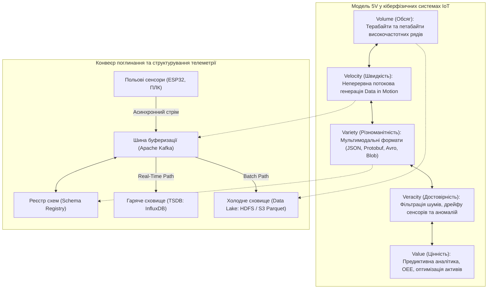
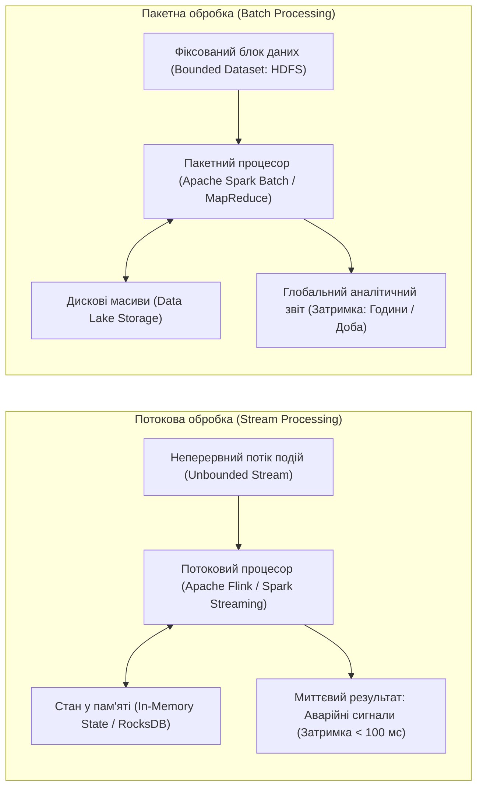
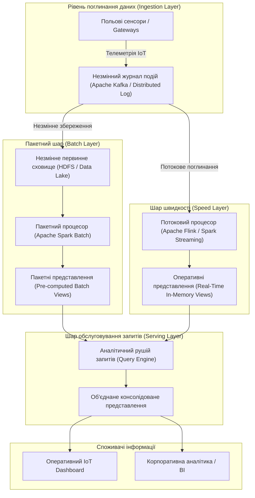

# Змістовий модуль 3. Інтеграція, Smart-системи та аналітика

# Тема 13. Big Data в ІоТ. Лямбда та Каппа архітектури

---

## 13.1. Характеристики Big Data (5V) в ІоТ

### Основний зміст та теоретичний базис

Стрімке розгортання систем Інтернету речей у промисловості, енергетиці, транспортній інфраструктурі та комунальному секторі спричинило якісний та кількісний стрибок в обсягах генерованої інформації. Традиційні реляційні системи управління базами даних (**СУБД**), орієнтовані на транзакційну обробку даних (**OLTP**, Online Transaction Processing) зі статичними схемами та строгою типізацією, виявилися неспроможними впоратися з неперервними, високоінтенсивними та структурно неоднорідними потоками телеметрії. У контексті функціонування кіберфізичних систем інформаційні потоки від датчикових масивів набули всіх фундаментальних ознак **Великих даних** (Big Data).

У сучасній комп'ютерній інженерії та науці про дані феномен Big Data в просторі Інтернету речей формалізується за допомогою розширеної моделі **5V**, яка комплексно описує специфіку телеметричних потоків за п'ятьма взаємопов'язаними вимірами.

*Рисунок 1 — Концептуальна модель 5V Big Data та її проекція на конвеєр структурування телеметрії в IoT*

Перший вектор **Volume (Обсяг)** відображає колосальну кількість генерованих даних, зумовлену високою частотою опитування датчиків. Якщо окреме вимірювання температури займає лише кілька байтів, то промислова вібродіагностика підшипників турбіни з частотою дискретизації $10\text{ кГц}$ формує понад $1{,}5\text{ Гбайт}$ сирих даних щогодини лише з однієї точки вимірювання. У масштабах сучасного підприємства або міської інфраструктури щоденний обсяг зібраної телеметрії сягає десятків терабайтів. 

Вектор **Velocity (Швидкість)** характеризує інтенсивність генерації та надходження інформаційних пакетів, вимагаючи обробки даних безпосередньо в момент їхнього руху (**Data in Motion**) з часом відгуку в частки секунди до моменту запису на постійні носії. 

Вектор **Variety (Різноманітність)** описує структурну неоднорідність масивів: система повинна одночасно приймати скалярні числові ряди за протоколом MQTT, бінарні кадри шини CAN, неструктуровані аудіо- та відеопотоки систем комп'ютерного зору, просторово-часові координати GPS-трекерів та текстові діагностичні логи операційних систем. 

Вектор **Veracity (Достовірність)** визначає ступінь відповідності отриманих даних реальному фізичному процесу. Внаслідок електромагнітних завад, втрати пакетів у бездротових каналах зв'язку, деградації чутливих елементів датчиків та часового розсинхрону годинників мікроконтролерів вхідний потік містить шуми, пропуски та спотворення, які вимагають обов'язкової статистичної фільтрації та валідації. 

Вектор **Value (Цінність)** є результуючим фактором, що полягає у вилученні з гігантських масивів низькорівневої телеметрії корисної інформації для запобігання технологічним аваріям, розрахунку залишкового ресурсу вузлів та підвищення загальної економічної ефективності виробництва.

Процес збору та структурування терабайтних масивів сенсорних даних спирається на багаторівневу організацію сховищ. Первинний потік телеметрії поглинається розподіленими брокерами черг повідомлень (зокрема Apache Kafka), де дані детерміновано розподіляються за партиціями та проходять верифікацію через реєстр схем (Schema Registry). Далі потік розділяється: для оперативної візуалізації на дашбордах та генерації тривог дані записуються у високошвидкісні бази даних часових рядів (**TSDB**, Time-Series Database, наприклад InfluxDB чи TimescaleDB), що формують так зване «гаряче сховище» (Hot Storage). 

Паралельно повний невідфільтрований масив телеметрії спрямовується до «озера даних» (**Data Lake**) на базі розподілених файлових систем (HDFS або хмарних об'єктних сховищ Amazon S3 / Ceph). У межах Data Lake інформація структурується та зберігається у бінарних колонкових форматах (Apache Parquet, Apache ORC), які підтримують ефективні алгоритми компресії та дозволяють виконувати паралельні аналітичні запити над терабайтними вибірками без повного завантаження файлів у пам'ять.

Математична модель сумарної швидкості надходження телеметричного потоку $V_{total}(t)$ від масиву з $N$ активних сенсорних вузлів описується рівнянням:

$$V_{total}(t) = \sum_{i=1}^{N} f_i \cdot \left( S_{payload, i} + S_{meta, i} \right) \cdot \left( 1 - \delta_i \right)$$

де $f_i$ позначає частоту вимірювання та відправки пакетів $i$-м датчиком, виражену в герцах (Гц); $S_{payload, i}$ є розміром корисного навантаження фізичних вимірювань у байтах; $S_{meta, i}$ позначає розмір службових метаданих (включаючи 64-бітну мітку часу, унікальний ідентифікатор пристрою Device ID, геопросторові координати та прапорці якості вимірювання); $\delta_i$ є коефіцієнтом локальної компресії та фільтрації на рівні прикордонного мікроконтролера ($0 \le \delta_i < 1$).

Сумарний обсяг дискового простору $S_{storage}(T)$, необхідний для збереження історичного масиву телеметрії за інтервал часу $T$, з урахуванням колонкового стиснення та індексації, визначається інтегральним виразом:

$$S_{storage}(T) = \int_{0}^{T} V_{total}(t) \cdot \left( 1 - \kappa(t) \right) \, dt + M_{index}(T)$$

де $\kappa(t)$ позначає коефіцієнт стиснення даних колонковими форматами (для форматів Parquet із алгоритмами стиснення Snappy або ZSTD величина $\kappa$ досягає значень $0{,}75 \dots 0{,}85$, забезпечуючи зменшення початкового обсягу у $4 \dots 6$ разів); $M_{index}(T)$ відповідає обсягу додаткових структур індексації (B-Tree, LSM-Tree) для забезпечення швидкого пошуку за часовими мітками та ідентифікаторами обладнання.

| Формат серіалізації даних | Тип структури | Швидкість серіалізації/десеріалізації | Коефіцієнт стиснення даних | Підтримка еволюції схем (Schema Evolution) | Рекомендована область застосування в ІоТ |
| :--- | :--- | :--- | :--- | :--- | :--- |
| **JSON** | Текстовий | Низька (вимагає складного рядкового парсингу) | Мінімальний (високі накладні витрати на текстові назви полів) | Гнучка (динамічна відсутність схеми) | Взаємодія з клієнтськими веб-інтерфейсами (REST API, WebSockets) |
| **Protocol Buffers (Protobuf)** | Бінарний | Надвисока (пряме бінарне кодування структур) | Високий (компактні чисельні типи varint) | Повна (сувора зворотна сумісність через індекси полів) | Обмін даними між Edge-вузлами та чергами повідомлень (Native API, gRPC) |
| **Apache Avro** | Бінарний | Висока (компактна серіалізація зі схемою) | Високий (схема зберігається окремо від даних) | Відмінна (динамічне зіставлення схем через Registry) | Поглинання потокових повідомлень брокером Apache Kafka для Data Lake |
| **Apache Parquet** | Колонковий бінарний | Середня при записі, надвисока при аналітичному читанні | Максимальний (колонкове стиснення словниками, RLE, Snappy) | Повна (можливість додавання нових колонок метрик) | Довготривале аналітичне збереження терабайтних архівів Big Data (HDFS, S3) |

Порівняльний аналіз форматів доводить, що для мінімізації навантаження на обчислювальні вузли та канали зв'язку архітектура Big Data в IoT передбачає обов'язкову конвертацію текстових повідомлень JSON у бінарні формати Avro на етапі поглинання та в колонковий формат Parquet на етапі довготривалого збереження в озері даних.

---

## 13.2. Потокова (Stream) vs Пакетна (Batch) обробка

### Основний зміст та теоретичний базис

В аналітичних системах Інтернету речей принциповим завданням є вибір парадигми обробки інформаційних масивів. Залежно від вимог до часу отримання результату, обчислювальної складності аналізу та меж оброблюваного набору даних, класичні інформаційні системи поділяються на дві діаметрально протилежні моделі: пакетну обробку (**Batch Processing**) та потокову обробку в реальному часі (**Stream Processing**).

*Рисунок 2 — Порівняння контурів виконання потокової та пакетної обробки телеметрії*

**Пакетна обробка (Batch Processing)** оперує обмеженими, статичними наборами даних (**Bounded Data**), зафіксованими за певний минулий інтервал часу (наприклад, архів телеметрії за добу або місяць). Основним призначенням пакетної обробки є виконання складних глобальних обчислень над усім обсягом історичної інформації, включаючи багатовимірні агрегації, навчання нейромережевих моделей глибокого навчання, розрахунок загальних показників ефективності обладнання та побудову місячної фінансової звітності. 

Головними програмними платформами цього класу є **Apache Hadoop MapReduce** та **Apache Spark**. Процес обробки у пакетній парадигмі оптимізується за критерієм максимальної пропускної здатності (Throughput) обчислювального кластера. Недоліком пакетного підходу є висока затримка отримання результатів (від десятків хвилин до кількох діб), що унеможливлює використання пакетних розрахунків для оперативного запобігання технологічним аваріям на виробництві.

**Потокова обробка (Stream Processing)** працює з принципово необмеженими, неперервними послідовностями даних (**Unbounded Data**), що генеруються датчиками в реальному часі. Обчислення виконуються безпосередньо в оперативній пам'яті вузлів кластера (In-Memory Computing) за подієво-орієнтованим принципом для кожного окремого повідомлення (Record-by-Record) або надзвичайно малими порціями (Micro-Batching). Потокова обробка реалізується за допомогою спеціалізованих платформ, таких як **Apache Flink**, **Apache Spark Structured Streaming** або **Apache Storm**. Цей підхід забезпечує мінімальну затримку отримання аналітичного висновку (від одиниць до сотень мілісекунд), що дозволяє реалізувати системи негайного реагування на аварійні викиди тиску, перегрів підшипників чи несанкціоноване проникнення в периметр об'єкта.

Ключовим теоретичним аспектом потокової обробки в IoT є механізм **віконної агрегації** (Windowing), який дозволяє розбивати нескінченний часовий потік вимірювань на дискретні сегменти для розрахунку статистичних функцій (середнього, медіани, дисперсії чи тренду).

```mermaid
flowchart TD
    subgraph WindowingMechanisms["Типи віконних функцій у потоковій аналітиці IoT"]
        direction TB
        
        subgraph Tumbling["Фіксовані вікна (Tumbling Windows: Не перекриваються)"]
            T1["Вікно 1: [00:00 - 00:05)"] --> T2["Вікно 2: [00:05 - 00:10)"] --> T3["Вікно 3: [00:10 - 00:15)"]
        end
        
        subgraph Sliding["Ковзні вікна (Sliding Windows: Перекриваються з кроком delta)"]
            S1["Вікно A: [00:00 - 00:05)"]
            S2["Вікно B: [00:01 - 00:06)"]
            S3["Вікно C: [00:02 - 00:07)"]
            S1 -.->|Крок delta = 1 хв| S2
            S2 -.->|Крок delta = 1 хв| S3
        end
        
        subgraph Session["Сесійні вікна (Session Windows: Розрив за неактивністю)"]
            SES1["Сесія активності 1"] --> GAP["Інтервал неактивності > T_gap"] --> SES2["Сесія активності 2"]
        end
    end
```

*Рисунок 3 — Концептуальні схеми часових вікон: фіксовані, ковзні та сесійні вікна*

У практиці обробки великих даних виділяють три базові типи віконних функцій, проілюстровані на рисунку 3:
1. Фіксовані або тумблінгові вікна (Tumbling Windows) ділять часову вісь на рівні, суміжні інтервали, які не перекриваються між собою; кожна подія належить рівно одному вікну (наприклад, розрахунок середнього споживання електроенергії кожні 5 хвилин).
2. Ковзні вікна (Sliding / Hopping Windows) характеризуються фіксованою тривалістю вікна $\Delta T$ та кроком зміщення $\delta$ ($\delta < \Delta T$), внаслідок чого сусідні вікна перекриваються, а одна й та сама подія може потрапляти в кілька послідовних розрахункових інтервалів (наприклад, оцінка середньоквадратичного значення вібрації за останні 10 хвилин, що перераховується щомиті).
3. Сесійні вікна (Session Windows) формуються динамічно на основі періодів активності сенсорного вузла і закриваються тоді, коли інтервал між послідовними повідомленнями перевищує заданий поріг тайм-ауту неактивності $T_{gap}$.

Математично операція розрахунку агрегованого значення $y(W_k)$ над множиною подій у межах $k$-го фіксованого вікна тривалістю $\Delta T$ описується виразом:

$$y(W_k) = \mathcal{F} \left( \left\{ x(t_j) \mid t_j \in [k \cdot \Delta T, \, (k+1) \cdot \Delta T) \right\} \right)$$

де $x(t_j)$ позначає значення вимірювання сенсора, згенероване у момент часу $t_j$; $\mathcal{F}$ є функцією агрегації (математичне сподівання, пошук максимуму, розрахунок інтеграла або швидке перетворення Фур'є).

Для ковзного вікна з кроком зміщення $\delta$ функція набуває вигляду:

$$y(W_{k, \delta}) = \mathcal{F} \left( \left\{ x(t_j) \mid t_j \in [k \cdot \delta, \, k \cdot \delta + \Delta T) \right\} \right)$$

Особливою теоретичною проблемою потокової обробки в IoT є різниця між **Event Time** (фізичним часом виникнення події на сенсорі, зафіксованим його годинником) та **Processing Time** (системним часом сервера, коли пакет дійшов до обчислювального вузла). Через затримки в бездротових мережах пакети надходять із запізненням та порушенням хронологічної послідовності (Out-of-Order Events). 

Для коректної обробки таких запізнілих даних потокові процесори використовують механізм водяних знаків (**Watermarks**). Водяний знак $W(t)$ є спеціальною службовою міткою часу, яка гарантує, що система більше не очікує надходження подій із міткою часу, меншою за $W(t)$:

$$W(t) = \max_{j} \{ t_{event, j} \} - \Delta t_{skew}$$

де $\max \{ t_{event, j} \}$ є максимальним зафіксованим часом події серед усіх отриманих пакетів на даний момент, а $\Delta t_{skew}$ позначає допустимий похибковий інтервал запізнення пакетів у мережі зв'язку.

| Параметр порівняння | Пакетна обробка (Batch Processing) | Потокова обробка (Stream Processing) |
| :--- | :--- | :--- |
| **Характер вхідних даних** | Фіксовані, завершені масиви (Bounded Data) | Нескінченні потоки подій (Unbounded Data) |
| **Латентність обробки** | Від десятків хвилин до кількох годин і діб | Від одиниць мілісекунд до кількох секунд |
| **Обчислювальне середовище** | Дисково-орієнтоване (HDFS, розподілені файлові системи) | Пам'яттєво-орієнтоване (In-Memory state, RocksDB) |
| **Межі оптимізації** | Максимізація загальної пропускної здатності (Throughput) | Мінімізація часу реакції системи (Low Latency) |
| **Складність аналітичних операцій** | Довільна (глибокі регресії, глобальні багатотабличні Joins) | Обмежена розміром поточного вікна або стану (Stateful) |
| **Цільове призначення в IoT** | Навчання AI, довгострокові звіти, аналіз трендів за роки | Оперативне виявлення аварій, зворотний зв'язок на актуатори |

Порівняння підтверджує, що жодна з парадигм не є універсальною: потокова обробка незамінна для оперативного реагування, але нездатна виконувати важку глобальну аналітику, тоді як пакетна обробка забезпечує точність і глибину аналізу за рахунок неприпустимої для аварійного контуру затримки.

---

## 13.3. Lambda-архітектура

### Основний зміст та теоретичний базис

Необхідність одночасного забезпечення субсекундної реакції на потокові події та виконання високоточного аналізу над терабайтними історичними архівами зумовила створення гібридних архітектурних шаблонів. Фундаментальним рішенням цієї проблеми стала **Lambda-архітектура** (Lambda Architecture), запропонована Натаном Марцем (Nathan Marz). 

Сутність Lambda-архітектури полягає у фізичному та логічному розділенні обчислювального контуру на два незалежні паралельні шляхи обробки — рівень швидкості (**Speed Layer**) та пакетний рівень (**Batch Layer**), результати роботи яких об'єднуються на рівні обслуговування запитів (**Serving Layer**).

*Рисунок 4 — Структурна схема обробки даних у Lambda-архітектурі*

Архітектура функціонує за чітко розмежованими контурами, представленими на рисунку 4:

1. Незмінний журнал подій (Ingestion Layer) приймає потоки повідомлень від сенсорів і дублює їх без змін як у шар швидкості, так і в пакетне сховище, виступаючи єдиним джерелом істини (Single Source of Truth).
2. Пакетний шар (Batch Layer) зберігає всі первинні дані у незмінному вигляді (**Master Dataset**) у розподіленому сховищі HDFS або об'єктному сховищі S3. Періодично (наприклад, раз на годину чи раз на добу) пакетний процесор Apache Spark запускає масивні паралельні обчислення над усім накопиченим масивом, виправляючи можливі помилки потокового шару та формуючи статичні агреговані таблиці — пакетні представлення (**Batch Views**).
3. Шар швидкості (Speed Layer) поглинає повідомлення з нульовою затримкою за допомогою потокового процесора (Apache Flink чи Spark Streaming). Цей рівень виконує швидку, попередню обробку виключно тих свіжих даних, які ще не встигли увійти до останнього пакетного розрахунку, і формує оперативні представлення в пам'яті (**Real-Time Views**).
4. Шар обслуговування (Serving Layer) містить високопродуктивні бази даних (Apache Cassandra, Apache HBase або ClickHouse), які індексують Batch Views та забезпечують швидкий доступ до них. При надходженні користувацького або програмного запиту аналітичний рушій виконує операцію об'єднання (Union) точного історичного пакетного представлення та свіжого оперативного представлення з шару швидкості, повертаючи цілісну, актуальну та абсолютно точну картину стану системи.

Математична модель формування відповіді на аналітичний запит $Q$ у Lambda-архітектурі формалізується функціональним виразом:

$$\text{Query}(Q) = \mathcal{M}_{merge} \left( \text{BatchView}(Q), \, \text{RealtimeView}(Q) \right)$$

де $\text{BatchView}(Q)$ позначає результат виконання запиту над історичними даними в інтервалі часу $[0, \, t - \Delta T_{batch}]$; $\text{RealtimeView}(Q)$ є результатом потокового обчислення над свіжими даними за інтервал $[t - \Delta T_{batch}, \, t]$; $\Delta T_{batch}$ відповідає періоду оновлення пакетного шару; $\mathcal{M}_{merge}$ позначає функцію узгодження та дедуплікації результатів двох рівнів.

Загальний час виконання запиту $\tau_{query}$ визначається часом паралельного звернення до двох рівнів представлення:

$$\tau_{query} = \max \left( \tau_{read\_batch}, \, \tau_{read\_speed} \right) + \tau_{merge}$$

де $\tau_{read\_batch}$ та $\tau_{read\_speed}$ позначають час зчитування даних із систем збереження пакетного та швидкісного рівнів відповідно, а $\tau_{merge}$ є часом злиття структур в оперативній пам'яті сервера запитів.

Незважаючи на високу відмовостійкість, Lambda-архітектура має суттєвий недолік — **подвійну складність кодової бази** (Dual Codebase Problem). Розробникам доводиться двічі реалізовувати одну й ту саму бізнес-логіку обробки даних: один раз мовою Java/Scala для пакетного рушія Apache Spark, а другий раз — для потокового процесора Apache Flink. 

Для подолання цієї проблеми Джей Крепс (Jay Kreps) запропонував альтернативну концепцію — **Kappa-архітектуру** (Kappa Architecture). У Kappa-архітектурі пакетний рівень повністю ліквідується, а вся обробка — як реального часу, так і історична — виконується єдиним потоковим рушієм поверх розподіленого лога повідомлень (Apache Kafka) із великою глибиною зберігання. У разі зміни алгоритму або потреби перерахунку історії весь масив подій просто повторно зчитується («прокручується») з початку черги Kafka через нову версію потокового коду.

| Критерій порівняння | Lambda-архітектура (Nathan Marz) | Kappa-архітектура (Jay Kreps) |
| :--- | :--- | :--- |
| **Кількість контурів обробки** | Два паралельні контури (Batch Layer + Speed Layer) | Один уніфікований контур (Stream Layer) |
| **Складність супроводу кодової бази** | Висока (необхідність підтримки двох різних стеків технологій) | Низька (єдиний програмний код для реального часу та історії) |
| **Механізм перерахунку історичних даних** | Природний перерахунок у межах регулярних пакетних завдань | Повторне зчитування всього журналу подій із Kafka у новий топік |
| **Вимоги до сховища черги повідомлень** | Тимчасове збереження (дні або тижні до фіксації в HDFS) | Довготривале збереження (місяці або роки в логах Kafka/Pulsar) |
| **Стійкість до збоїв у потоковому коді** | Абсолютна (помилки потоку автоматично виправляються пакетом) | Вимагає повного перезапуску потокового конвеєра та виправлення |
| **Обчислювальна база** | Apache Spark (Batch) + Apache Flink/Storm (Speed) | Apache Flink / Kafka Streams / Apache Spark Streaming |

Порівняльна оцінка показує, що Lambda-архітектура залишається найбільш надійним інженерним вибором для критично важливих промислових та енергетичних об'єктів, де неприпустимі навіть тимчасові спотворення статистичної звітності, тоді як Kappa-архітектура забезпечує максимальну гнучкість та швидкість модернізації алгоритмів у динамічних проектах Smart City та споживчого IoT.

---

### Питання для самоперевірки та аналітичного осмислення

1. Розкрийте зміст моделі 5V (Volume, Velocity, Variety, Veracity, Value) стосовно завдань моніторингу та діагностики в промисловому Інтернеті речей.
2. На основі математичної моделі $V_{total}(t)$ проаналізуйте фактори, що впливають на швидкість зростання обсягу телеметрії у розподіленій сенсорній мережі. Яку роль відіграють метадані пакета?
3. Проведіть порівняльний аналіз бінарних форматів серіалізації Protocol Buffers та Apache Avro з колонковим форматом Apache Parquet. Чому Parquet є стандартом де-факто для аналітичних озер даних (Data Lakes)?
4. Поясніть принципову різницю між пакетною (Batch) та потоковою (Stream) парадигмами обробки інформації в контексті систем реального часу.
5. Розкрийте відмінності між фіксованими (Tumbling), ковзними (Sliding) та сесійними (Session) вікнами. У яких практичних задачах IoT застосовується кожен із цих типів?
6. Що таке механізм водяних знаків (Watermarks) у потокових процесорах, і яким чином він розв'язує проблему запізнілих та десинхронізованих за часом повідомлень (Out-of-Order Events)?
7. Детально опишіть функціонування трьох рівнів Lambda-архітектури (Batch, Speed, Serving Layers). Яким чином формула об'єднання запитів гарантує актуальність та точність даних на IoT Dashboard?
8. У чому полягає сутність проблеми подвійної кодової бази (Dual Codebase) у Lambda-архітектурі, і яким чином Kappa-архітектура усуває цей недолік?