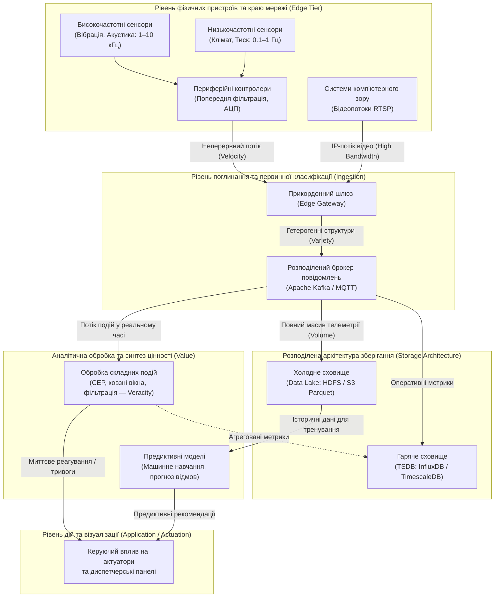
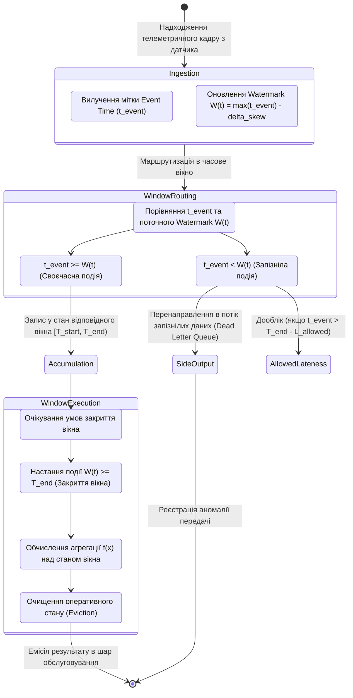
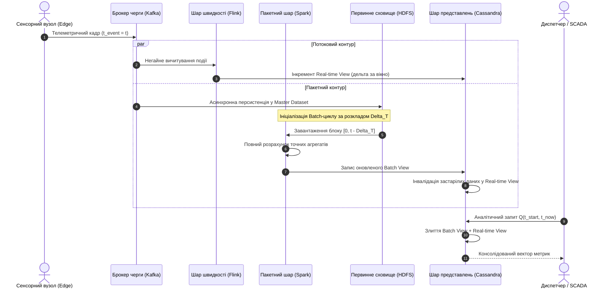
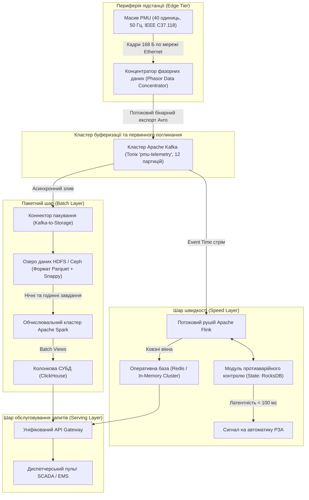

# Тема 13. Технології Big Data в Інтернеті речей: потокова аналітика, Лямбда та Каппа архітектури

## Мета лекції

Формування у майбутніх інженерів комплексної системи фундаментальних знань та прикладних компетентностей щодо проектування, масштабування та оптимізації високонавантажених систем обробки великих даних у кіберфізичних комплексах Інтернету речей. Опанування математичних засад потокової та пакетної обробки неперервних телеметричних потоків, вивчення інженерних компромісів між затримкою доставки та повнотою аналітичних розрахунків, а також глибоке засвоєння методології побудови відмовостійких архітектурних рішень на базі шаблонів Lambda та Kappa для їх подальшого самостійного впровадження у критично важливих промислових, транспортних та муніципальних інфраструктурах.

## Очікувані результати навчання

1. **Знання та розуміння.** Здобувачі вищої освіти засвоять сутність моделі 5V у контексті телеметрії Інтернету речей, внутрішню будову та специфіку бінарних і колонкових форматів даних, математичний апарат віконної агрегації та концептуальні відмінності функціонування обчислювальних контурів у шаблонах Lambda та Kappa.
2. **Застосування.** Студенти набудуть здатності практично конфігурувати брокери повідомлень і конвеєри поглинання даних, будувати аналітичні моделі агрегації за часовими вікнами з використанням водяних знаків для компенсації мережевих затримок, а також розробляти узгоджені схеми збереження даних у гарячих і холодних сховищах.
3. **Аналіз.** Слухачі зможуть здійснювати системне діагностування вузьких місць розподілених обчислювальних контурів, диференціювати затримки передачі та обробки на різних рівнях стека IoT, аналізувати проблеми подвійної кодової бази та виявляти ризики десинхронізації станів між пакетним шаром і шаром швидкості.
4. **Оцінювання та синтез.** Майбутні фахівці зможуть науково обґрунтовувати вибір між Lambda- та Kappa-архітектурами на основі індустріальних вимог до латентності, пропускної здатності та надійності, а також синтезувати комплексні технічні специфікації для відмовостійких аналітичних платформ моніторингу складних кіберфізичних об'єктів.

---

## Детальний покроковий план лекції

### 1. Теоретико-концептуальний базис. Модель 5V та парадигми обробки телеметрії в IoT
* 1.1. Специфікація характеристик великих даних (5V) у кіберфізичних розподілених системах сенсорного моніторингу.
* 1.2. Формати серіалізації, схеми кодування та оптимізація збереження телеметричних потоків від польових мікроконтролерів до озера даних.
* 1.3. Принципові розбіжності між пакетною (Batch) та потоковою (Stream) парадигмами обробки інформаційних масивів.
* 1.4. Математичні та алгоритмічні моделі віконної агрегації, концепція часу подій (Event Time) та механізм водяних знаків (Watermarks).

### 2. Методологія та аналіз граничних умов. Проектування архітектурних шаблонів Lambda та Kappa
* 2.1. Організація трирівневої структури Lambda-архітектури з розділенням пакетного шару (Batch Layer) та шару швидкості (Speed Layer).
* 2.2. Побудова аналітичного шару обслуговування запитів (Serving Layer) та механізми консолідації гетерогенних представлень.
* 2.3. Архітектурний шаблон Kappa на базі незмінного розподіленого журналу подій з єдиним потоковим рушієм.
* 2.4. Критичні бар'єри та вузькі місця паралельних контурів: проблема подвійної кодової бази, десинхронізація станів та затримки реплікації.
* 2.5. Критерії вибору та порівняльна оцінка відмовостійкості обчислювальних стеків для промислових IoT-платформ.

### 3. Практичний індустріальний / фаховий кейс. Розгортання відмовостійкого аналітичного конвеєра в Smart Grid
**Тема наскрізної задачі.** «Проектування гібридної аналітичної платформи моніторингу високовольтної підстанції на базі синхрофазорних вимірювань PMU із застосуванням Apache Kafka, Spark та Flink»

## 1. Теоретико-концептуальний базис. Модель 5V та парадигми обробки телеметрії в IoT

### 1.1. Специфікація характеристик великих даних (5V) у кіберфізичних розподілених системах сенсорного моніторингу

Стрімке розгортання систем Інтернету речей у промисловому секторі, енергетиці, транспортній інфраструктурі та комунальному господарстві спричинило якісний перехід від локального збору показників до глобальної аналітики розподілених кіберфізичних комплексів. Традиційні реляційні системи управління базами даних, що функціонують за принципами транзакційної цілісності та вимагають жорсткої структуризації таблиць, виявилися неспроможними обробляти неперервні потоки телеметрії. У просторі Інтернету речей інформаційні потоки від сенсорних мереж набули всіх ознак **великих даних** (Big Data), що зумовило необхідність адаптації класичної аналітичної моделі **5V** до інженерних реалій розподілених апаратно-програмних комплексів.

Характеристика **обсягу (Volume)** у системах Інтернету речей визначається масштабом розгортання периферійних пристроїв та високою частотою зняття метрик. На відміну від класичних бізнес-систем, де генерація транзакцій ініціюється дискретними діями користувачів, промислові сенсори генерують вимірювання детерміновано та безперервно. Окремий акустичний датчик або триосьовий акселерометр, що функціонує на платформі мікроконтролера STM32 чи вузла MPU-6050, опитується із частотою від кількох сотень герц до десятків кілогерц, що продукує десятки гігабайтів сирої інформації щогодини з одного агрегата.

Вектор **швидкості (Velocity)** відображає інтенсивність надходження повідомлень та вимоги до реакції обчислювальної системи на події реального світу. Телеметрія генерується у формі рухомих даних (**Data in Motion**), які вимагають попередньої фільтрації, маршрутизації та агрегації в темпі надходження. Якщо затримка аналізу в системах електронної комерції допускає секундні або хвилинні інтервали, то у критичних контурах автоматизації з запізнюванням понад кілька мілісекунд коригувальний керуючий сигнал на виконавчий механізм втрачає сенс і може призвести до аварійної зупинки обладнання.

Параметр **різноманітності (Variety)** зумовлений глибокою апаратною та програмною гетерогенністю Інтернету речей. В єдиний аналітичний простір стікаються структуровані чисельні часові ряди, бінарні пакети послідовних шин контролерів, текстові повідомлення прикладних протоколів, просторово-часові координати рухомих об'єктів та неструктуровані медіадані систем комп'ютерного зору. Об'єднання цих потоків вимагає створення універсальних рівнів абстракції протоколів.

Властивість **достовірності (Veracity)** безпосередньо пов'язана з фізичною природою первинних вимірювань. Сенсорні потоки за своєю суттю є зашумленими: вони містять аномалії, пропуски через нестабільність бездротового зв'язку стандарту IEEE 802.15.4 або LoRaWAN, систематичний апаратний дрейф калібрувальних коефіцієнтів та помилки розсинхронізації внутрішніх таймерів. Аналітичні системи мають розрізняти реальні фізичні девіації об'єкта та хибні спрацьовування апаратної частини.

Кінцева категорія **цінності (Value)** визначає економічну та технологічну доцільність обробки телеметрії. Вона полягає у переході від ретроспективної фіксації аварій до прогностичного технічного обслуговування, розрахунку загальної ефективності функціонування обладнання та динамічної оптимізації енергетичних балансів розумних мереж.



Математичний опис сумарної швидкості надходження інформації $V_{total}(t)$ від масиву з $N$ сенсорних пристроїв формалізується залежністю:

$$V_{total}(t) = \sum_{i=1}^{N} f_i \cdot \left( S_{payload, i} + S_{meta, i} \right) \cdot \left( 1 - \delta_i \right)$$

де $f_i$ позначає частоту дискретизації та формування повідомлень $i$-м датчиком, виражену в герцах; $S_{payload, i}$ є розміром корисного навантаження вимірюваної фізичної величини у байтах; $S_{meta, i}$ представляє розмір метаданих кадру, що включають часову мітку, ідентифікатор вузла та код достовірності; $\delta_i$ позначає коефіцієнт скорочення обсягу інформації за рахунок локальної фільтрації та компресії безпосередньо на мікроконтролері, який змінюється в діапазоні від нуля до одиниці.

Сумарний обсяг сховища $S_{storage}(T)$, необхідний для накопичення історичного масиву телеметрії за часовий інтервал $T$, описується інтегральним рівнянням з урахуванням динамічного коефіцієнта стиснення:

$$S_{storage}(T) = \int_{0}^{T} V_{total}(t) \cdot \left( 1 - \kappa(t) \right) \, dt + M_{index}(T)$$

де $\kappa(t)$ позначає усереднений коефіцієнт стиснення даних алгоритмами колонкового кодування на часовому проміжку; $M_{index}(T)$ є функцією зростання обсягу системних індексів, структур B-дерев або LSM-дерев, необхідних для адресації та пошуку часових рядів.

> **ПРАКТИЧНИЙ ЯКІР:** На сучасних газоперекачувальних станціях моніторинг турбінних агрегатів виконується за допомогою п'єзоелектричних датчиків вібрації з частотою дискретизації $10\text{ кГц}$, де один агрегат формує понад $1{,}7\text{ Гбайт}$ необробленої телеметрії щогодини. Застосування периферійної фільтрації на базі промислових контролерів дозволяє скоротити потік даних на $85\%$ шляхом передачі лише спектральних коефіцієнтів швидкого перетворення Фур'є, виключаючи перевантаження корпоративної мережі передачі даних.

---

### 1.2. Формати серіалізації, схеми кодування та оптимізація збереження телеметричних потоків від польових мікроконтролерів до озера даних

Ефективність функціонування систем великих даних у просторі Інтернету речей визначається вибором формату внутрішнього представлення інформації на кожному етапі її руху. Польові контролери, такі як мікроконтролери платформи Arduino або мікросхеми ESP8266 та ESP32, мають суворі обмеження обсягу оперативної пам'яті та тактової частоти процесора, тому використання надлишкових текстових форматів на рівні польового зв'язку є неприпустимим. Водночас аналітичні платформи рівня озера даних (Data Lake) потребують бінарних структур, оптимізованих для паралельного читання селективних колонок у терабайтних масивах.

Текстовий формат **JSON** здобув значне поширення на рівні прототипів та веб-інтерфейсів завдяки легкості сприйняття людиною, проте він створює надмірне навантаження на обчислювальні ресурси вбудованих систем. Повторення рядкових назв ключів у кожному повідомленні збільшує трафік на сотні відсотків порівняно з корисним навантаженням, а необхідність синтаксичного аналізу рядків на боці мікроконтролера викликає непродуктивне витрачання циклів центрального процесора.

Для передачі телеметрії між прикордонними пристроями та брокерами повідомлень застосовують компактні бінарні протоколи. **Protocol Buffers (Protobuf)** забезпечує строгу типізацію даних на основі попередньо скомпільованих схем, транслюючи числові значення у компактний формат зі змінною довжиною байтів (varint), що знижує обсяг повідомлення у кілька разів порівняно з текстовими аналогами. 

Формат **Apache Avro** оптимізований для потокових систем поглинання даних. Він зберігає схему у форматі JSON окремо від самих повідомлень, маркуючи пакети лише числовим ідентифікатором схеми. У поєднанні з реєстром схем (**Schema Registry**) Avro забезпечує еволюцію структур даних, гарантуючи сумісність старих і нових версій прошивок мікроконтролерів без зупинки глобального конвеєра обробки.

На рівні довготривалого зберігання в озері даних де-факто стандартом став колонково-орієнтований формат **Apache Parquet**. На відміну від рядкових сховищ, де всі атрибути одного запису зберігаються послідовно, Parquet розбиває масив на групи рядків і зберігає значення кожного поля окремим безперервним бінарним блоком. Це дозволяє аналітичним рушіям зчитувати з диска лише ті стовпці, які беруть участь у розрахунку, ігноруючи решту атрибутів. Крім того, однорідність даних у межах колонки дозволяє застосовувати спеціалізовані методи компресії: кодування довжинами серій (**Run-Length Encoding, RLE**), бітове пакування (**Bit Packing**) та словникову компресію.

Під час проектування сховищ для великих обсягів телеметрії інженери стикаються з критичними відмінностями між форматами обміну даними, що наведені у таблиці нижче.

| Формат представлення | Тип та архітектура структури | Ефективність стиснення та швидкість обробки | Можливості еволюції схеми даних | Приклад з реальної практики |
| :--- | :--- | :--- | :--- | :--- |
| **JSON** | Текстовий, ієрархічний, без явної схеми | Вкрай низьке стиснення, повільний синтаксичний парсинг через сканування рядків | Повна динамічна гнучкість за відсутності формальних гарантій | Відладка REST-інтерфейсів веб-сторінок налаштування шлюзів через HTTP |
| **Protocol Buffers** | Бінарний, рядково-орієнтований, строга типізація | Високе стиснення корисного навантаження, надшвидка серіалізація в C++ коді | Висока, за умови збереження унікальних числових тегів полів | Передача телеметрії бортових контролерів електромобілів через gRPC-канали |
| **Apache Avro** | Бінарний, потоковий, схема відокремлена від даних | Висока щільність пакування, швидка серіалізація за наявності локальної схеми | Повна підтримка зворотної сумісності через централізований Schema Registry | Поглинання вимірювань смарт-лічильників брокером Apache Kafka для стрімінгу |
| **Apache Parquet** | Бінарний, колонково-орієнтований, збагачений метаданими | Максимальна компресія однотипних колонок (Snappy, ZSTD), блискавичні вибірки | Підтримка додавання нових колонок метрик без перезапису файлових блоків | Довготривалий ретроспективний аналіз річних трендів напруги в розподілених мережах Smart Grid |

> **ТИПОВА ПОМИЛКА:** Збереження сирих телеметричних повідомлень безпосередньо у форматі JSON на розподілені файлові системи HDFS або об'єктні сховища S3 є грубою інженерною помилкою. Це спричиняє так звану проблему дрібних файлів (Small Files Problem), перевантажує оперативну пам'ять метаданими простору імен та змушує аналітичні рушії виконувати повне сканування гігабайтних обсягів текстових символів замість прямого адресного вичитування потрібних числових колонок.

---

### 1.3. Принципові розбіжності між пакетною (Batch) та потоковою (Stream) парадигмами обробки інформаційних масивів

Усі обчислювальні завдання в аналітиці великих даних класифікуються за фундаментальним критерієм часових обмежень надходження вхідних масивів. Пакетна обробка (**Batch Processing**) та потокова обробка (**Stream Processing**) спираються на принципово різні математичні моделі та вимагають діаметрально протилежних інженерних підходів до розподілу пам'яті, дискового введення-виведення та обчислювальних ресурсів.

Пакетна парадигма оперує концепцією **обмеженого набору даних** (Bounded Data). Вхідний масив є статичним, дискретним за часом та завершеним у просторі. Обчислювальний процес ініціюється періодично за розкладом або по досягненні певного кванту інформації. Парадигма пакетних обчислень, яскравими представниками якої є класична модель **MapReduce** та обчислення ядра **Apache Spark**, оптимізується за критерієм максимальної пропускної здатності (**Throughput**). 

Утилізація обчислювальних ресурсів у пакетному режимі прагне до ста відсотків: алгоритм планувальника розпаралелює виконання операцій над терабайтними блоками файлів, зберігаючи проміжні результати на розподілених дискових масивах або в пам'яті виконавців. Проте розплатою за здатність виконувати складні багатовимірні перетворення, глибокі математичні регресії та навчання нейромережевих моделей є висока латентність, яка вимірюється хвилинами, годинами або добами.

Потокова парадигма розглядає світ як неперервну генерацію **необмежених даних** (Unbounded Data). У цій моделі не існує поняття завершеного набору: нові елементи потоку виникають щомиті і мають бути опрацьовані індивідуально в міру надходження (**Record-by-Record**) або надмалими мікропакетами (**Micro-Batching**). Потокові рушії, такі як **Apache Flink** та **Apache Spark Structured Streaming**, оптимізуються за критерієм мінімальної затримки обробки (**Low Latency**). 

Усі проміжні розрахунки виконуються виключно в оперативній пам'яті з використанням швидких вбудованих сховищ стану (наприклад, RocksDB), що забезпечує час відгуку системи на рівні одиниць чи десятків мілісекунд. Проте потокові обчислення суворо обмежені у доступних аналітичних операціях: через неможливість зафіксувати глобальний контекст потік не дозволяє проводити довільні реляційні з'єднання нелокалізованих у часі сутностей без застосування часових меж.

> **ПРАКТИЧНИЙ ЯКІР:** У системах диспетчеризації магістрального транспорту алгоритми потокової обробки безперервно аналізують телеметрію з GPS-трекерів та CAN-шин вантажівок для миттєвого контролю виходу за межі геозон та фіксації екстреного гальмування із часом реакції $80\text{ мс}$. Водночас пакетний аналітичний контур раз на добу завантажує терабайтний зріз показників витрати палива та температурних режимів двигунів для побудови математичних моделей оптимізації міжремонтних інтервалів автопарку.

---

### 1.4. Математичні та алгоритмічні моделі віконної агрегації, концепція часу подій (Event Time) та механізм водяних знаків (Watermarks)

Для виконання статистичних, регресійних або спектральних обчислень над нескінченними потоками телеметрії необхідно дискретизувати часову вісь на скінченні інтервали. Ця процедура реалізується за допомогою **віконних функцій** (Windowing). У практиці проектування інформаційних систем Інтернету речей виділяють три базові типи віконних моделей: фіксовані, ковзні та сесійні вікна.

Фіксовані вікна (**Tumbling Windows**) ділять часовий потік на послідовні інтервали однакової тривалості $\Delta T$, які не перекриваються та не мають проміжків між собою. Кожна подія сенсорної мережі належить рівно одному вікну. Якщо $t$ є часовою міткою вимірювання, то індекс вікна $k$ детерміновано обчислюється як ціла частина від ділення часу на ширину вікна:

$$k = \left\lfloor \frac{t}{\Delta T} \right\rfloor$$

Ковзні вікна (**Sliding Windows**) характеризуються фіксованою тривалістю $\Delta T$ та параметром кроку зміщення $\delta$, де $\delta < \Delta T$. Оскільки крок зміщення менший за розмір вікна, суміжні інтервали частково перекриваються. Подія з міткою часу $t$ одночасно потрапляє до декількох послідовних вікон, кількість яких дорівнює $\lceil \Delta T / \delta \rceil$. Це забезпечує високу плавність розрахунку ковзних середніх або оцінки середньоквадратичного відхилення сигналів у динаміці.

Сесійні вікна (**Session Windows**) формуються динамічно на основі аналізу пауз неактивності джерела даних. Сесія залишається відкритою доти, доки інтервал між послідовними повідомленнями датчика не перевищує порогового значення $T_{gap}$. Як тільки виникає пауза $\Delta t > T_{gap}$, сесійне вікно закривається, ініціюючи виконання агрегаційної функції над накопиченими записами, а наступне повідомлення започатковує нову сесію.

Для виконання агрегації потоковий процесор застосовує оператор згортки над множиною точок, що потрапили у межі визначеного вікна:

$$y(W_k) = \bigoplus_{x_j \in W_k} \varphi(x_j)$$

де $\bigoplus$ позначає комутативну та асоціативну бінарну операцію акумуляції значень; $\varphi(x_j)$ є функцією проекції або перетворення сирого вимірювання $x_j$.

Критичною проблемою потокової аналітики в Інтернеті речей є розмежування трьох часових шкал:
1. Час події (**Event Time**) — фізичний момент виникнення явища на об'єкті спостереження, що фіксується локальним годинником мікроконтролера і записується в тіло пакету.
2. Час поглинання (**Ingestion Time**) — системний час брокера повідомлень або шлюзу в момент реєстрації кадру в черзі на вхідному контурі.
3. Час обробки (**Processing Time**) — локальний системний час обчислювального вузла кластера, який безпосередньо виконує алгоритмічний код віконної трансформації.

Через флуктуації пропускної здатності бездротових каналів зв'язку, буферизацію на проміжних вузлах та повторні передачі кадрів пакети надходять до обчислювача із непередбачуваним запізненням та порушенням хронологічної послідовності (**Out-of-Order Data**). Використання Processing Time у таких умовах призводить до спотворення результатів: події, що відбулися одночасно у фізичному просторі, потрапляють у різні обчислювальні вікна через затримку в радіоефірі.

Для коректної обробки інформації за шкалою Event Time застосовується механізм **водяних знаків (Watermarks)**. Водяний знак є монотонно зростаючою службовою міткою часу $W(t)$, яка вплітається в потік подій і сигналізує обчислювачу, що надходження повідомлень з часом події, меншим за $W(t)$, вважається малоймовірним.

Математично генерація евристичного водяного знака з фіксованим відставанням описується формулою:

$$W(t) = \max_{j} \{ t_{event, j} \} - \Delta t_{skew}$$

де $\max \{ t_{event, j} \}$ позначає максимальний зафіксований час події серед усіх пакетів, поглинених системою на даний момент часу; $\Delta t_{skew}$ є емпірично встановленим захисним інтервалом запізнення, що враховує максимальну очікувану затримку в мережах передачі даних.



Події, чий фізичний час $t_{event}$ перевищує значення поточного водяного знака, акумулюються у робочому стані відкритого вікна. Щойно водяний знак перетинає верхню часову межу вікна ($W(t) \ge T_{end}$), вікно вважається сформованим: тригер викликає функцію агрегації, емітує результуючий вектор в аналітичне сховище та ініціює видалення проміжного стану з оперативної пам'яті. 

Події, які прибувають після закриття вікна ($t_{event} < W(t)$), класифікуються як запізнілі. Залежно від політики системи вони або відкидаються, або направляються в ізольований потік коригування (**Side Output**), запобігаючи нескінченному блокуванню ресурсів кластера.

> **КОНТРОЛЬНЕ ПИТАННЯ:** Під час тимчасового обриву стільникового каналу зв'язку автономний агротехнічний комбайн продовжував вести збір телеметрії з датчиків витрати палива та позиціонування протягом 40 хвилин, накопичуючи пакети в локальному буфері енергонезалежної пам'яті. Після відновлення зв'язку вся черга накопичених пакетів надійшла на брокер повідомлень за 10 секунд. Як поведеться потоковий обчислювальний процесор, сконфігурований на розрахунок 5-хвилинних агрегатів, у двох випадках: якщо він налаштований за шкалою Processing Time та якщо він працює за шкалою Event Time з механізмом Watermarks?

<details markdown="1">
<summary>Розгорнути аналіз / відповідь</summary>

**Правильний варіант: За шкалою Processing Time виникне некоректний стрибок агрегатів, тоді як за Event Time дані ретроспективно розподіляться за 8 відповідними вікнами.**

1. При використанні шкали **Processing Time** потоковий процесор маркує всі повідомлення системним часом моменту їх надходження на сервер. Оскільки 40-хвилинний масив інформації надходить на обчислювач за 10 секунд, усі дані комбайна потраплять до одного-двох поточних 5-хвилинних вікон. Це сформує фіктивний 8-кратний сплеск витрати палива в поточному вікні, повністю спотворивши статистику, а попередні вікна залишаться порожніми.

2. При застосуванні шкали **Event Time** процесор аналізує вбудовані часові мітки генерації вимірювань сенсорами. Якщо глибина допустимого запізнення (Allowed Lateness) у системі дозволяє обробку таких затримок або якщо механізм генерації водяних знаків враховує монотонне відставання міток, завантажений буфер пакетів коректно розіб'ється на вісім послідовних 5-хвилинних вікон у минулому часі. Кожне вікно обчислить точні витрати палива для свого фізичного інтервалу руху.

</details>

---

### Вказівки для самостійного осмислення

1. Проаналізуйте інженерні компроміси між вибором бінарного формату серіалізації Protocol Buffers та Apache Avro для організації обміну даними між польовими сенсорними шлюзами промислового підприємства та хмарним брокером повідомлень, звернувши особливу увагу на накладні витрати пам'яті мікроконтролера та механізми забезпечення зворотної сумісності при зміні складу підключених датчиків.
2. Складіть аналітичну записку з порівнянням поведінки віконних агрегацій різного типу (Tumbling, Sliding та Session) в умовах виникнення раптового затору в мережі зв'язку, визначивши параметри захисного часового зсуву для генератора водяних знаків, які гарантують баланс між повнотою охоплення вимірювань та граничним часом утримання стану вікна в оперативній пам'яті потокового процесора.
3. Дослідіть вплив високої частоти дискретизації вібраційних датчиків на продуктивність розподіленого дискового сховища озера даних, розрахувавши критичні пороги пропускної здатності шини введення-виведення при переході від наївного збереження часових рядів до пакетного стиснення з використанням колонкових алгоритмів Apache Parquet.


## 2. Методологія та аналіз граничних умов. Проектування архітектурних шаблонів Lambda та Kappa

### 2.1. Організація трирівневої структури Lambda-архітектури з розділенням пакетного шару (Batch Layer) та шару швидкості (Speed Layer)

Класична методологія проектування розподілених інформаційних систем обробки великих даних у кіберфізичних просторах спирається на парадигму функціональної декомпозиції обчислювальних навантажень. **Lambda-архітектура** була розроблена як системна відповідь на неможливість забезпечення одночасно низької латентності та глобальної аналітичної точності в межах єдиного технологічного стека. В основу архітектури покладено фундаментальний принцип, згідно з яким будь-який довільний аналітичний запит є функцією від усієї сукупності історичних даних системи. 

Для практичної реалізації цього принципу контур обробки інформації розділяється на два паралельні обчислювальні тракти, що живляться з єдиного незмінного джерела первинних подій, а результати їхньої роботи інтегруються на вихідному рівні представлення.

Первинне поглинання інформації здійснюється на рівні розподіленого незмінного журналу подій, де дані телеметрії фіксуються в порядку їх надходження без будь-яких деструктивних модифікацій. Відправлені промисловими шлюзами або мікроконтролерами пакети дублюються у два незалежні контури: пакетний шар (**Batch Layer**) та шар швидкості (**Speed Layer**).

Пакетний шар виконує роль еталонного сховища та обчислювача над повним масивом незмінних первинних даних (**Master Dataset**). Усі вимірювання, що надходять від сенсорних мереж, записуються в розподілену файлову систему HDFS або об'єктне сховище S3 у вихідному вигляді. Пакетний процесор періодично запускає обчислювальні завдання над накопиченими історичними блоками. 

Головним завданням цього шару є формування попередньо розрахованих пакетних представлень (**Batch Views**). Оскільки пакетний шар має доступ до всієї глибини ретроспективних вимірювань і необмежений жорсткими часовими рамками, він виконує повне очищення даних від шумів, усуває дублікати, виправляє наслідки порушення черговості пакетів та будує глобальні статистичні агрегати. Повторне обчислення пакетного представлення з нуля гарантує виправлення будь-яких системних збоїв чи алгоритмічних помилок, що могли виникнути на попередніх циклах.

Паралельно функціонує шар швидкості, головним призначенням якого є мінімізація затримки між фізичним моментом генерації сигналу датчиком та його відображенням у системі прийняття рішень. Цей шар обробляє виключно той дельта-потік телеметрії, який надійшов у систему після запуску останньої ітерації пакетного процесора і ще не встиг потрапити до актуального пакетного представлення. 

Обчислення виконуються потоковими процесорами в оперативній пам'яті без звернення до повільних дискових масивів. Шар швидкості генерує оперативні представлення в реальному часі (**Real-Time Views**). На відміну від пакетного шару, шар швидкості використовує інкрементні алгоритми обчислення та ймовірнісні структури даних, жертвуючи абсолютною точністю та повнотою заради досягнення субсекундної швидкодії.

> **ВАЖЛИВО:** Незмінність первинного набору даних (Immutability of Master Dataset) є базовим інваріантом Lambda-архітектури. Будь-які корекції алгоритмів або усунення системних помилок здійснюються виключно шляхом повторного пакетного прогону історичного масиву сирих подій через оновлену функцію обробки, а не модифікацією вже збережених агрегованих показників.

---

### 2.2. Побудова аналітичного шару обслуговування запитів (Serving Layer) та механізми консолідації гетерогенних представлень

Шар обслуговування запитів (**Serving Layer**) є інтеграційним ядром Lambda-архітектури, що забезпечує низьколатентний доступ клієнтських додатків до результатів обчислень обох паралельних контурів. Цей рівень реалізується на базі розподілених нереляційних баз даних, оптимізованих для інтенсивного пакетного запису та швидких вибірок за ключем, таких як Apache Cassandra, Apache HBase або ClickHouse.

Основна складність функціонування шару обслуговування полягає у необхідності динамічного об'єднання двох принципово різних структур: статичних, заздалегідь індексованих пакетних представлень (Batch Views) та динамічних, постійно оновлюваних оперативних представлень (Real-Time Views). Коли клієнтська система ініціює запит на отримання значень показників за певний інтервал, механізм маршрутизації шару обслуговування декомпозує його на дві складові, паралельно опитує обидва сховища та синтезує фінальну відповідь.

Взаємодія компонентів у часі під час надходження телеметрії та виконання клієнтських аналітичних запитів наведена на діаграмі нижче.



Формалізація процесу розв'язання аналітичного запиту та узгодження гетерогенних станів у шарі обслуговування описується наступною послідовністю операцій:

$$
\begin{aligned}
\text{Крок 1 (Декомпозиція часового простору):} & \quad \mathcal{T}_{query} = [t_{start}, \, t_{now}] = \mathcal{T}_{batch} \cup \mathcal{T}_{speed}, \\
& \quad \text{де } \mathcal{T}_{batch} = [t_{start}, \, T_{checkpoint}], \quad \mathcal{T}_{speed} = (T_{checkpoint}, \, t_{now}] \\
\text{Крок 2 (Паралельна екстракція представлень):} & \quad \mathcal{V}_{batch} = \mathcal{F}_{read}(\text{BatchStore}, \, Q, \, \mathcal{T}_{batch}), \\
& \quad \mathcal{V}_{speed} = \mathcal{F}_{read}(\text{RealtimeStore}, \, Q, \, \mathcal{T}_{speed}) \\
\text{Крок 3 (Консолідація та дедуплікація):} & \quad \mathcal{R}_{final} = \mathcal{M}_{merge}\left(\mathcal{V}_{batch}, \, \mathcal{V}_{speed}\right) \setminus \mathcal{D}_{overlap} \\
\text{Крок 4 (Інвалідація оперативного шару):} & \quad \text{RealtimeStore} \leftarrow \text{RealtimeStore} \setminus \left\{ x(t) \mid t \le T_{checkpoint} \right\}
\end{aligned}
$$

де $t_{start}$ та $t_{now}$ позначають початкову та поточну часові межі користувацького запиту $Q$; $T_{checkpoint}$ є міткою часу останнього успішно завершеного розрахунку пакетного шару; $\mathcal{V}_{batch}$ представляє історичний набір даних високої точності, зчитаний із постійного сховища; $\mathcal{V}_{speed}$ відповідає оперативному набору свіжих метрик, згенерованому шаром швидкості; $\mathcal{M}_{merge}$ позначає оператор об'єднання схем і структур вибірок; $\mathcal{D}_{overlap}$ є областю колізійного перекриття даних, викликаного затримкою фіксації транзакцій між шарами, яка підлягає обов'язковому вилученню; $\text{RealtimeStore}$ позначає внутрішній стан бази даних шару швидкості, що очищується від застарілих записів після оновлення пакетних таблиць.

---

### 2.3. Архітектурний шаблон Kappa на базі незмінного розподіленого журналу подій з єдиним потоковим рушієм

Незважаючи на високу відмовостійкість, функціональна дуальність Lambda-архітектури породжує значні інженерні витрати на її супровід. У відповідь на ці виклики Джей Крепс запропонував альтернативну методологію, яка отримала назву **Kappa-архітектури**. Ключова ідея шаблону Kappa полягає у повній ліквідації пакетного рівня як окремого технологічного шару та уніфікації всієї обробки навколо єдиного потокового обчислювального рушія.

У Kappa-архітектурі єдиним джерелом істини для всієї системи виступає розподілений апенд-онлі журнал подій (**Append-Only Distributed Log**), найчастіше реалізований засобами Apache Kafka або Apache Pulsar. На відміну від типових конфігурацій черг повідомлень, де дані видаляються одразу після вичитування абонентами, у системі Kappa встановлюється тривалий або нескінченний термін утримання повідомлень (**Retention Policy**). Це дозволяє розглядати журнал не просто як тимчасовий буфер, а як постійне сховище повної історії функціонування кіберфізичної системи.

Обробка даних як у режимі реального часу, так і над історичними вибірками виконується єдиним програмним кодом за допомогою потокових фреймворків (Apache Flink, Kafka Streams або Bytewax). Поняття пакетної обробки трансформується у вироджений випадок потокової обробки: історичні дані розглядаються як обмежений часовими рамками потік, що зчитується з журналу подій на максимальній швидкості пропускної здатності дискової підсистеми.

Методологічний алгоритм перерахунку історичних даних або оновлення бізнес-логіки у системі Kappa не вимагає переписування коду під інший фреймворк і виконується за чіткою послідовністю дій:

1. Програміст вносить зміни до аналітичного алгоритму і розгортає нову версію потокового застосунку поруч із поточною діючою версією без зупинки системи.
2. Новий екземпляр застосунку призначається до нової групи споживачів (Consumer Group) брокера повідомлень і налаштовує свій стартовий покажчик читання на нульовий оффсет (Offset 0), починаючи паралельне вичитування всієї збереженої історії журналу подій.
3. У міру проходження історичних даних новий застосунок записує результати обчислень у нову незалежну таблицю шару представлення, не впливаючи на роботу основного інтерфейсу користувача.
4. Як тільки новий застосунок наздоганяє реальний час надходження подій, системний маршрутизатор виконує атомарне перемикання трафіку користувацьких запитів на нове представлення, після чого стара версія потокового завдання разом зі застарілою таблицею безперервно виводяться з експлуатації.

> **ПРАКТИЧНИЙ ЯКІР:** Індустріальна платформа аналітики промислового Інтернету речей Siemens MindSphere використовує принципи Kappa-архітектури для обробки телеметрії виробничих ліній. Завдяки тривалому зберіганню сирих сигналів у топіках Apache Kafka, інженери мають можливість безперервно навчати та валідувати нові алгоритми виявлення аномалій верстатів з ЧПК безпосередньо на реальних історичних даних, виключаючи необхідність підтримки окремих Hadoop-кластерів.

---

### 2.4. Критичні бар'єри та вузькі місця паралельних контурів: проблема подвійної кодової бази, десинхронізація станів та затримки реплікації

Практична реалізація систем великих даних в Інтернеті речей стикається із суворими інженерними та алгоритмічними обмеженнями, які можуть нівелювати теоретичні переваги обраних архітектурних шаблонів. Проектувальник зобов'язаний чітко розпізнавати граничні умови працездатності кожної моделі.

Головним системним недоліком Lambda-архітектури є **проблема подвійної кодової бази (Dual Codebase Problem)**. Необхідність реалізації однієї й тієї самої логіки обробки різними інструментами (наприклад, мовою Scala для пакетного рушія Apache Spark та мовою Java для потокового процесора Apache Flink) створює розрив у поведінці алгоритмів. 

Різні внутрішні бібліотеки оптимізації математичних операцій, відмінності в алгоритмах віконного закриття та різна точність представлення чисел із плаваючою комою призводять до виникнення ситуацій, коли шар швидкості та пакетний шар видають відмінні значення для ідентичних фізичних подій. Це явище спричиняє раптові стрибки графіків на диспетчерських панелях у момент, коли попередньо розраховані значення шару швидкості заміщуються точними пакетними представленнями.

Наступним критичним бар'єром є **проблема гонитви станів (Race Conditions) та десинхронізації вікон**. Якщо пакетний процес розрахунку затримується через брак обчислювальних ресурсів кластера або блокування операцій введення-виведення, шар швидкості змушений необмежено утримувати в оперативній пам'яті все більший обсяг незакритих станів. Переповнення оперативної пам'яті вузлів потокового процесора призводить до скидання буферів на диск, стрімкої деградації продуктивності та лавиноподібного зростання латентності, що перетворює шар швидкості на неефективний псевдопакетний контур.

```
ГРАНИЧНІ УМОВИ НЕЗАСТОСОВНОСТІ ТА КРИТИЧНОГО ЗБОЮ АРХІТЕКТУРНИХ МОДЕЛЕЙ:

1. Граничні умови для Lambda-архітектури:
   - Об'єкти з високою динамікою зміни алгоритмів: якщо бізнес-правила коригуються частіше, 
     ніж період повного регресійного тестування подвійної кодової бази, система неминуче 
     переходить у стан хронічної семантичної неузгодженості результатів.
   - Дефіцит кваліфікованого інженерного персоналу: подвоєння обчислювальної інфраструктури 
     (Spark + Flink + Hadoop + Cassandra) підвищує операційні витрати (OPEX) до меж, 
     що перевищують комерційну цінність отримуваної телеметрії.

2. Граничні умови для Kappa-архітектури:
   - Невисока пропускна здатність сховища при повторному відтворенні: якщо обсяг історичних даних 
     сягає десятків петабайтів, повне зчитування журналу брокера від нульового зміщення 
     створює критичне дискове навантаження, уповільнюючи поточне поглинання свіжих вимірювань 
     та блокуючи процеси реального часу.
   - Складні багатовимірні Joins із довільним часовим зміщенням: алгоритми, що вимагають 
     зіставлення подій, віддалених одна від одної на роки (наприклад, порівняння параметрів 
     зносу турбіни із заводськими тестами трирічної давнини), перевантажують внутрішній стан 
     потокових рушіїв і призводять до фатальних помилок вичерпання пам'яті (OutOfMemoryError).
```

---

### 2.5. Критерії вибору та порівняльна оцінка відмовостійкості обчислювальних стеків для промислових IoT-платформ

Вибір оптимального архітектурного шаблону для промислових кіберфізичних комплексів є багатокритеріальною оптимізаційною задачею, де інженерні компроміси безпосередньо впливають на вартість володіння системою, надійність та готовність інформаційного сервісу. Для обґрунтованого проектування архітектури необхідно зіставити ключові технічні та економічні показники розглянутих моделей.

Порівняльна матриця функціональних характеристик, складності та обмежень базових аналітичних підходів подана в таблиці нижче.

| Архітектурний критерій | Традиційна пакетна архітектура (Batch/Hadoop) | Lambda-архітектура (Гібрид Spark + Flink) | Kappa-архітектура (Уніфікований Flink/Kafka) |
| :--- | :--- | :--- | :--- |
| **Мінімальна гарантована латентність** | Від $10\text{ хвилин}$ до десятків годин | $10\text{ мс} \dots 100\text{ мс}$ (у шарі швидкості) | $10\text{ мс} \dots 50\text{ мс}$ (неперервно) |
| **Складність алгоритмічної кодової бази** | Низька (єдиний пакетний фреймворк) | Критично висока (синхронізація логіки на двох мовах/рушіях) | Середня (єдиний потоковий код для всіх сценаріїв) |
| **Накладні витрати на інфраструктуру** | Базові (один обчислювальний кластер) | Подвійні (утримання паралельних серверних потужностей) | Оптимізовані (високі вимоги лише до дискового масиву брокера) |
| **Ефективність виконання глобальних Ad-hoc запитів** | Максимальна (глибоке сканування Parquet/ORC масивів) | Висока (через шари індексованих Batch Views) | Обмежена (вимагає попередньої матеріалізації представлень) |
| **Складність впровадження** | Низька: стандартні налаштування ETL та MapReduce задач | Екстремальна: складна інтеграція та налагодження шару злиття | Висока: вимагає глибокого розуміння потокового стану та оффсетів |
| **Критичні ризики / Обмеження** | Непридатність для систем аварійного захисту та безпеки | Семантичний розрив результатів, гонитва станів під час злиття | Висока вартість довготривалого утримання петабайт у топіках брокера |

Аналіз матриці свідчить, що **Lambda-архітектура** залишається безальтернативним вибором для енергетичних комплексів, хімічних заводів та об'єктів критичної інфраструктури, де діють суворі нормативні вимоги до аудиту незмінних первинних даних, а ціна помилки аналітики може вимірюватися мільйонними збитками або людськими жертвами. 

Натомість **Kappa-архітектура** демонструє максимальну ефективність у проектах розумного міста (Smart City), розподілених логістичних мережах та споживчому сегменті Інтернету речей, де критично важливими є гнучкість адаптації коду, швидкість виведення нових сервісів на ринок та відсутність витрат на синхронізацію різнорідних системних шарів.

> **КОНТРОЛЬНЕ ПИТАННЯ:** Під час модернізації диспетчерського пункту теплової електростанції інженерам було доручено розробити систему детектування детонаційних хвиль у камерах згоряння на базі масиву п'єзодатчиків тиску ($5\text{ кГц}$). Одночасно система повинна виконувати довгостроковий розрахунок коефіцієнта корисної дії котлоагрегатів за місяць на основі інтеграції показників спаленого газу та хімічного складу води. Яку архітектуру — Lambda чи Kappa — необхідно обрати для реалізації даного проекту, і які конкретно технологічні компоненти повинні бути задіяні для запобігання втратам високочастотних імпульсів тиску?

<details markdown="1">
<summary>Розгорнути аналіз / відповідь</summary>

**Правильний варіант: Необхідно впроваджувати Lambda-архітектуру з локалізованим Edge-контуром для детектування детонації.**

1. **Обґрунтування архітектурного вибору:** 
Поставлена задача містить два діаметрально протилежні функціональні контури: задачу протиаварійного захисту з латентністю реагування менше $5\text{ мс}$ (детектування детонації) та важке ретроспективне інтегральне обчислення термодинамічного ККД котла за місяць з множинними нелінійними з'єднаннями різнорідних показників. 
   - Спроба реалізувати місячний розрахунок ККД через потоковий рушій Kappa-архітектури призведе до колапсу пам'яті через необхідність утримання гігантського місячного стану (State) для багатокомпонентних кореляцій. 
   - Відповідно, для даного промислового об'єкта класична **Lambda-архітектура** є єдино надійним рішенням: довгостроковий ККД розраховується в пакетному шарі (Apache Spark) над первинним архівом у Parquet/HDFS, а детонаційний контур обслуговується шаром швидкості.

2. **Запобігання втратам високочастотних імпульсів ($5\text{ кГц}$):**
Передача сирого потоку $5\text{ кГц}$ від кожного датчика безпосередньо у центральний брокер повідомлень перевантажить мережу. 
   - На рівні польових мікроконтролерів (Edge Tier) реалізується пороговий апаратний тригер або розрахунок ковзної дисперсії в реальному часі. 
   - Безпосередньо у високошвидкісний брокер (Apache Kafka) передаються лише пакети високої мітки загрози при виході амплітуди за критичну межу, що гарантує доставку аварійного кадру потоковому рушію менш ніж за $2\text{ мс}$.

</details>

---

### Вказівки для самостійного осмислення

1. Розробіть формалізовану структурну модель дедуплікації даних у шарі обслуговування (Serving Layer) Lambda-архітектури для сценарію, коли потоковий процесор через мережеві затримки продовжив оновлювати оперативні таблиці після успішного завершення чергового пакетного розрахунку та запису нових історичних представлень.
2. Проаналізуйте з використанням апарату теорії масового обслуговування механізм повторного вичитування журналу подій у Kappa-архітектурі при перерахунку річного обсягу телеметрії, розрахувавши необхідну пропускну здатність дискової підсистеми брокера повідомлень, за якої час побудови нового аналітичного представлення не перевищить регламентного ліміту у 6 годин.
3. Дослідіть технічні причини виникнення семантичного розриву (Semantic Gap) між результатами обчислень алгоритмів машинного навчання у пакетному та потоковому контурах Lambda-архітектури, запропонувавши інженерні методи верифікації ідентичності математичних результатів без зниження загальної продуктивності системи.


## 3. Практичний індустріальний / фаховий кейс. Розгортання відмовостійкого аналітичного конвеєра в Smart Grid

### 3.1. Комплексний фаховий кейс. Проектування гібридної аналітичної платформи моніторингу високовольтної підстанції на базі синхрофазорних вимірювань PMU із застосуванням Apache Kafka, Spark та Flink

#### Постановка задачі / ситуації

На магістральній високовольтній підстанції напругою $750\text{ кВ} / 330\text{ кВ}$ об'єднаної енергетичної системи впроваджується система моніторингу перехідних режимів (WAMS, Wide Area Monitoring System). Об'єкт спостереження містить сорок пристроїв синхрофазорних вимірювань (**Phasor Measurement Units, PMU**), які встановлені на трансформаторах, збірних шинах та відхідних лініях електропередач. Кожен пристрій вимірює миттєві вектори напруги та струму, синхронізуючись із сигналами точного часу супутників GPS відповідно до стандарту IEEE C37.118.

Перед інженерною групою постає завдання спроектувати відмовостійку архітектуру збору, збереження та аналізу телеметрії, яка одночасно розв'язує дві суперечливі задачі:
1. Забезпечення роботи швидкого контуру автоматичного протиаварійного захисту (детектування асинхронного ходу, міжсистемних низькочастотних коливань та локалізації коротких замикань) із наскрізною затримкою обробки не більше $100\text{ мс}$.
2. Забезпечення роботи повільного аналітичного контуру (глибинний аналіз деградації ізоляції силових трансформаторів, спектральний аналіз вищих гармонік, розрахунок фактичних втрат активної потужності та формування обов'язкових регуляторних звітів за місяць) над повним історичним масивом вимірювань без втрати сирих даних.

Вхідні параметри, апаратні обмеження та вимоги до надійності проектованої системи наведені у таблиці нижче.

| Параметр системи | Технічне значення / Характеристика | Примітка та інженерні обмеження |
| :--- | :--- | :--- |
| **Кількість терміналів PMU ($N$)** | $40\text{ одиниць}$ | Розподілені по відкритому розподільчому пристрою підстанції |
| **Частота формування кадрів ($f_s$)** | $50\text{ кадрів/с}$ ($50\text{ Гц}$) | Синхронізація за мітками часу GPS із точністю $\le 1\text{ мкс}$ |
| **Розмір корисного навантаження ($S_{pmu}$)** | $128\text{ байтів}$ | Величини та фазові кути 4 напруг, 4 струмів, частота, ROCOF |
| **Розмір мережевого кадру ($S_{frame}$)** | $168\text{ байтів}$ | Включає заголовки TCP/IP та службові поля IEEE C37.118 |
| **Гранична латентність швидкого контуру** | $\tau_{crit} \le 100\text{ мс}$ | Час від фізичної події до генерації сигналу керування |
| **Глибина ретроспективного архіву** | $365\text{ діб}$ ($1\text{ рік}$) | Повний масив незмінних даних для державного регулятора |
| **Допустиме запізнення пакетів ($\Delta t_{skew}$)** | $40\text{ мс}$ | Максимальний джиттер комутаторів мережі підстанції |
| **Цільова доступність системи (SLA)** | $99{,}999\%$ («п'ять дев'яток») | Не більше 5 хвилин сумарного простою на рік |

Архітектура розв'язання задачі базується на Lambda-шаблоні, адаптованому під стандарти промислової автоматизації, що проілюстровано на блок-схемі нижче.



#### Покроковий аналіз та розв'язок

##### Крок 1. Розрахунок інтенсивності інформаційного потоку та пропускної здатності мережі

Розрахунок сумарної швидкості надходження корисної телеметрії та необхідної пропускної здатності каналу зв'язку є першим етапом проектування системи. Для визначення навантаження підставимо значення параметрів із таблиці вхідних даних у вираз:

$$
\begin{aligned}
V_{payload} &= N \cdot f_s \cdot S_{pmu} = 40 \cdot 50 \cdot 128 = 256\,000\text{ байтів/с} = 250\text{ Кбайт/с} \\
V_{network} &= N \cdot f_s \cdot S_{frame} = 40 \cdot 50 \cdot 168 = 336\,000\text{ байтів/с} = 328{,}125\text{ Кбайт/с} \approx 2{,}69\text{ Мбіт/с}
\end{aligned}
$$

Потік пакетів у системі становить рівно $2\,000\text{ повідомлень/с}$. Хоча мережева швидкість $2{,}69\text{ Мбіт/с}$ повністю вкладається в стандартний інтерфейс Ethernet $100\text{Base-TX}$, ключовим викликом є не обсяг каналу, а частота обробки транзакцій брокером повідомлень без накопичення затримок у чергах.

##### Крок 2. Оцінка необхідного обсягу сховища озера даних (Data Lake)

Для забезпечення річного зберігання масиву незмінних первинних даних розраховується добовий та річний обсяг простору. При прямому збереженні сирого потоку без стиснення добовий обсяг $S_{raw/day}$ становить:

$$S_{raw/day} = V_{network} \cdot 86\,400 = 336\,000 \cdot 86\,400 = 29\,030\,400\,000\text{ байтів} \approx 27{,}037\text{ Гбайт/добу}$$

Оскільки чисельні часові ряди синхрофазорів характеризуються високим ступенем кореляції сусідніх відліків, застосування колонкового формату Apache Parquet зі стисненням алгоритмом Snappy забезпечує коефіцієнт компресії $\kappa = 0{,}78$. Тоді скоригований добовий обсяг збереження $S_{parquet/day}$ та річна ємність озера даних $S_{year}$ визначаються співвідношеннями:

$$
\begin{aligned}
S_{parquet/day} &= S_{raw/day} \cdot (1 - \kappa) = 27{,}037 \cdot (1 - 0{,}78) = 5{,}948\text{ Гбайт/добу} \\
S_{year} &= 5{,}948 \cdot 365 \approx 2\,171\text{ Гбайт} \approx 2{,}12\text{ Тбайт}
\end{aligned}
$$

З урахуванням трикратного фактора реплікації в кластері HDFS ($R = 3$) та необхідності виділення $30\%$ технологічного резерву під індекси та метадані, мінімальна чиста ємність дискового масиву сховища становить $S_{cluster} = 2{,}12 \cdot 3 \cdot 1{,}3 = 8{,}27\text{ Тбайт}$.

##### Крок 3. Параметризація шару швидкості та конфігурація водяних знаків (Watermarks)

Для виявлення міжсистемних низькочастотних коливань частоти мережі (діапазон коливань від $0{,}1$ до $2\text{ Гц}$) у потоковому процесорі Apache Flink налаштовується ковзне вікно тривалістю $\Delta T = 2\text{ с}$ із кроком зміщення $\delta = 100\text{ мс}$. Для запобігання втраті даних через мережевий джиттер генератор водяних знаків налаштовується на затримку $\Delta t_{skew} = 40\text{ мс}$:

$$W(t) = \max_{j} \{ t_{event, j} \} - 0{,}040\text{ с}$$

Обсяг оперативної пам'яті $M_{state}$, необхідний потоковому рушію для утримання відкритого стану всіх паралельних вікон по 40 вузлах PMU з урахуванням допустимого запізнення, обчислюється як:

$$M_{state} = N \cdot (\Delta T + \Delta t_{skew}) \cdot f_s \cdot S_{state\_record} = 40 \cdot (2{,}0 + 0{,}04) \cdot 50 \cdot 256\text{ байтів} \approx 1\,044\,480\text{ байтів} \approx 1{,}0\text{ Мбайт}$$

Малий обсяг стану дозволяє утримувати всі робочі структури у швидкісній пам'яті L3/RAM процесорних вузлів із бекендом на базі RocksDB, забезпечуючи час обчислення ковзного вікна менше $8\text{ мс}$, що гарантує сумарний бюджет затримки контуру в межах $65\text{ мс}$ (при ліміті $100\text{ мс}$).

##### Крок 4. Алгоритмічна формалізація злиття представлень у шарі обслуговування

Консолідація даних для диспетчерського інтерфейсу SCADA, що надсилає запит на інтервал $[t_{now} - 1\text{ година}, \, t_{now}]$, формалізується алгоритмом динамічного вибору гранул:

$$
\begin{aligned}
\text{Крок 1:} & \quad T_{checkpoint} = \text{ClickHouse.getMaxTimestamp()} \\
\text{Крок 2:} & \quad \mathcal{V}_{batch} = \text{SELECT time, pmu\_id, v\_mag, freq FROM batch\_views WHERE time BETWEEN } (t_{now} - 3600) \text{ AND } T_{checkpoint} \\
\text{Крок 3:} & \quad \mathcal{V}_{speed} = \text{Redis.zrangebyscore}(\text{realtime\_stream}, \, T_{checkpoint} + 1, \, t_{now}) \\
\text{Крок 4:} & \quad \mathcal{R}_{SCADA} = \text{MergeSort}(\mathcal{V}_{batch}, \, \mathcal{V}_{speed})
\end{aligned}
$$

де $T_{checkpoint}$ фіксує останню закриту годину пакетного агрегатора; вибірка $\mathcal{V}_{batch}$ повертає точно згладжені значення з постійного сховища ClickHouse; $\mathcal{V}_{speed}$ повертає високочастотну сиру телеметрію останніх секунд із пам'яті Redis; функція MergeSort гарантує лінійне поєднання масивів без розривів часового ряду на межі переходу.

#### Інтерпретація результатів та альтернативні сценарії

Розрахунки доводять, що розроблена комбінація технологій повністю задовольняє вимогам надійності та швидкодії об'єкта генерації: критичний контур протиаварійного захисту функціонує в ізольованому потоковому шарі з латентністю $65\text{ мс}$, тоді як важкі аналітичні алгоритми працюють над озером даних обсягом $2{,}12\text{ Тбайт/рік}$ без деградації оперативного моніторингу.

Аналіз альтернативних сценаріїв визначає межі стійкості спроектованої системи:
1. Якщо кількість терміналів PMU зросте вдесятеро (до 400 одиниць у масштабі регіонального оператора передачі), сумарний вхідний потік сягне $20\,000\text{ повідомлень/с}$, що вимагатиме переходу від локального шлюзу до шардованого кластера брокерів Apache Kafka із збільшенням кількості партицій топіка до 48 для забезпечення паралельної утилізації потокових ядер Flink.
2. Якщо інженерне рішення розгортатиметься на віддалених сонячних електростанціях без надійного оптоволоконного зв'язку, де передача здійснюється через стільникові модеми з затримками до $2\text{ с}$, модель водяних знаків із фіксованим відставанням $40\text{ мс}$ призведе до масової класифікації даних як запізнілих та їх втрати швидким контуром. У такому разі потоковий рушій повинен бути переконфігурований на адаптивну генерацію водяних знаків на основі квантилів запізнення або переведений на модель децентралізованих обчислень (Edge Computing) із первинною фіксацією аварій безпосередньо на польовому шлюзі.

---

### 3.2. Зведена довідкова система лекції

Підсумкова система концепцій, аналітичних моделей та технологічних інструментів, розглянутих у межах лекції, систематизована у зведеній інженерній матриці.

| Термін / Концепція | Формалізація / Сутність | Реальний кейс застосування | Основне обмеження / Ризик |
| :--- | :--- | :--- | :--- |
| **Модель 5V Big Data** | Комплексна характеристика потоків даних за параметрами Volume, Velocity, Variety, Veracity, Value | Класифікація вимірювальних потоків енергосистеми Smart Grid | Нехтування Veracity призводить до хибних аварійних сигналів |
| **Protocol Buffers** | Бінарна серіалізація зі строгою типізацією та числовими тегами полів кадру | Передача векторних вимірювань PMU на шлюз за стандартом IEEE C37.118 | Вимагає попередньої дистрибуції скомпільованих схем на всі вузли |
| **Apache Avro** | Бінарний потоковий формат із динамічним відокремленням схеми через Registry | Буферизація та маршрутизація телеметрії в топіках Apache Kafka | Затримка першого виклику при зверненні до зовнішнього Schema Registry |
| **Apache Parquet** | Колонково-орієнтований бінарний формат збереження з блоками метаданих | Довготривале сховище Data Lake для ретроспективного аналізу | Непридатний для потокового оновлення окремих полів у реальному часі |
| **Batch Processing** | Пакетна обчислювальна модель над обмеженими масивами (Bounded Data) | Розрахунок місячного балансу активної та реактивної енергії підстанції | Висока латентність (від хвилин до годин), неможливість реагування на аварії |
| **Stream Processing** | Неперервна обробка необмежених потоків даних у пам'яті (In-Memory) | Автоматичне виявлення асинхронного ходу ліній у системі РЗА | Обмежений обсяг пам'яті для утримання історичного контексту подій |
| **Tumbling Window** | Фіксовані часові вікна $\Delta T$, що не перекриваються: $k = \lfloor t / \Delta T \rfloor$ | Дискретний підрахунок кількості імпульсів лічильників за кожні 5 хвилин | Втрата контексту на стиках двох послідовних розрахункових вікон |
| **Sliding Window** | Перекривні часові вікна $\Delta T$ із кроком зміщення $\delta$ ($\delta < \Delta T$) | Безперервний розрахунок ковзного середньоквадратичного значення напруги | Збільшення навантаження на пам'ять пропорційно відношенню $\Delta T / \delta$ |
| **Event Time** | Фізичний час генерації вимірювання сенсором за шкалою GPS/RTC | Кореляція векторів напруги з різних географічних точок енергомережі | Необхідність використання складних алгоритмів обліку запізнілих даних |
| **Watermarks** | Монотонно зростаюча службова мітка часу: $W(t) = \max(t_e) - \Delta t_{skew}$ | Фіксація закриття часових вікон у потоковому процесорі Apache Flink | Заниження $\Delta t_{skew}$ веде до втрати даних, завищення — до затримок |
| **Lambda-архітектура** | Гібридний патерн паралельної обробки через Batch Layer, Speed Layer та Serving Layer | Корпоративні WAMS/EMS системи керування магістральними мережами | Проблема подвійної кодової бази та ризики розсинхронізації станів |
| **Kappa-архітектура** | Патерн обробки всіх сценаріїв єдиним потоковим рушієм над журналом Kafka | Системи динамічного моніторингу парку електротранспорту Smart City | Висока вартість зберігання петабайтних архівів безпосередньо в топіках |

---

### 3.3. Контрольні питання та завдання

#### Прикладні тестові завдання

1. Під час аналізу роботи швидкого контуру моніторингу вібрації турбіни потоковий процесор раптово почав ігнорувати $15\%$ вхідних повідомлень, що надходять від бездротових датчиків, маркуючи їх як запізнілі (Late Events). Адміністратор встановив, що середній мережевий джиттер зріс із $15\text{ мс}$ до $60\text{ мс}$ через перевантаження радіоканалу, тоді як параметр генератора водяних знаків $\Delta t_{skew}$ залишався рівним $20\text{ мс}$. Яке коригування конфігурації рушія відновлює повний прийом даних із мінімальним впливом на загальну латентність контуру аварійного захисту?
   - A. Перемикання обчислень на системну часову шкалу Processing Time із повною ліквідацією водяних знаків.
   - B. Збільшення параметра допустимого часового зсуву водяного знака $\Delta t_{skew}$ до $70\text{ мс}$.
   - C. Збільшення розміру фіксованого вікна Tumbling Window з $200\text{ мс}$ до $2\text{ с}$.
   - D. Направлення всіх запізнілих повідомлень у чергу Side Output із їх подальшим вилученням.

<details markdown="1">
<summary>Розгорнути аналіз / відповідь</summary>

**Правильний варіант: B.**

1. Механізм водяних знаків базується на рівнянні $W(t) = \max \{ t_{event} \} - \Delta t_{skew}$. Якщо фактичний мережевий джиттер сягає $60\text{ мс}$, а допустимий зсув становить лише $20\text{ мс}$, водяний знак перетинає кінцеву межу вікна раніше, ніж фізичний пакет доходить мережею. Встановлення $\Delta t_{skew} = 70\text{ мс}$ компенсує максимальну мережеву затримку і гарантує потрапляння пакетів у робочий стан вікна до його закриття, збільшуючи загальну затримку реакції лише на контрольовані $50\text{ мс}$.
2. Аналіз дистракторів:
   - Варіант A є помилковим, оскільки перехід на Processing Time в умовах джиттеру призведе до змішування відліків різних фізичних секунд в одне вікно, спотворюючи результати фазового аналізу.
   - Варіант C не усуває проблему запізнення пакетів відносно водяного знака всередині самого вікна, а лише збільшує загальну латентність системи у десять разів.
   - Варіант D призведе до остаточної втрати $15\%$ критичних вимірювань для контуру реального часу, оскільки дані осядуть у допоміжній черзі без участі в розрахунку протиаварійного тригера.

</details>

2. Інженерна група обирає формат зберігання піврічного архіву телеметрії підстанції (понад 50 мільярдів числових записів) для забезпечення можливості виконання аналітиками довільних Ad-hoc SQL-запитів, які звертаються до 2-3 обраних колонок параметрів струму. Чому використання колонкового формату Apache Parquet є радикально ефективнішим за збереження даних у масиві файлів Apache Avro або JSON?
   - A. Parquet автоматично видаляє дублікати записів на рівні заголовків файлових блоків.
   - B. Parquet не потребує наявності метаданих і використовує текстову компресію рядків за алгоритмом Gzip.
   - C. Parquet підтримує пропуск непотрібних колонок при читанні (Projection Pushdown) та використовує статистику блоків для пропуску непотрібних діапазонів рядків (Predicate Pushdown).
   - D. Parquet дозволяє здійснювати інкрементний запис по одному повідомленню безпосередньо з мікроконтролера.

<details markdown="1">
<summary>Розгорнути аналіз / відповідь</summary>

**Правильний варіант: C.**

1. Формат Apache Parquet організований за колонковим принципом. При читанні запиту, що вимагає аналізу лише колонок струму, дискова підсистема взагалі не зчитує байти інших колонок (Projection Pushdown), зменшуючи обсяг зчитування на $80-90\%$. Крім того, кожен блок Parquet містить метадані про мінімальні та максимальні значення (min/max statistics) для кожної колонки, що дозволяє рушію запитів повністю пропускати цілі блоки файлів, якщо шукані часові інтервали не перетинаються з їхнім діапазоном (Predicate Pushdown).
2. Аналіз дистракторів:
   - Варіант A є технічно хибним, оскільки Parquet не є транзакційною СУБД і не виконує автоматичну дедуплікацію на рівні формату.
   - Варіант B суперечить структурі формату: Parquet перенасичений службовими бінарними метаданими у кінцевику файлу (File Footer) і не є текстовим.
   - Варіант D описує властивість, прямо протилежну сутності Parquet: запис у Parquet вимагає накопичення великих груп рядків (Row Groups) в оперативній пам'яті і є категорично неефективним для поодиноких записів від польових мікроконтролерів.

</details>

3. У промисловій системі контролю теплових режимів, спроектованій за принципами класичної Lambda-архітектури, виявлено феномен стрибкоподібної зміни усереднених показників температури щогодини в момент оновлення диспетчерського дашборду. Технічний аудит показав, що обчислювальна логіка розрахунку ковзного середнього в Apache Spark (Batch Layer) використовує алгоритм дійсних чисел подвійної точності IEEE 754 (Double), а в Apache Flink (Speed Layer) оптимізована під 32-бітні цілі числа з фіксованою комою. Проявом якої класичної системної проблеми великих даних є цей інцидент?
   - A. Проблеми голодування ресурсів брокера (Broker Resource Starvation).
   - B. Проблеми семантичного розриву внаслідок подвійної кодової бази (Dual Codebase Semantic Gap).
   - C. Порушення реплікації партицій у кластері незмінного збереження.
   - D. Аномалії переповнення буфера зворотного тиску (Backpressure Saturation).

<details markdown="1">
<summary>Розгорнути аналіз / відповідь</summary>

**Правильний варіант: B.**

1. Сутність проблеми подвійної кодової бази в Lambda-архітектурі полягає в необхідності підтримки двох незалежних реалізацій однакових математичних алгоритмів для різних обчислювальних середовищ. Навіть незначні відмінності в машинному представленні чисел, округленні чи логіці агрегації між пакетом (Spark) та потоком (Flink) призводять до розбіжностей результатів. Коли шар обслуговування заміщує тимчасові значення шару швидкості еталонними пакетними даними, користувач спостерігає штучний стрибок значень на графіку.
2. Аналіз дистракторів:
   - Варіант A стосується дефіциту процесорного часу або пам'яті брокера черги і проявляється у зростанні затримок доставки, а не в розбіжності числових значень.
   - Варіант C описує мережевий збій кластера збереження, наслідком якого є повна недоступність частини файлових блоків, а не планомірна розбіжність розрахунків.
   - Варіант D описує гідродинамічний ефект перевантаження конвеєра обробки, який зупиняє вичитування з черги, але не змінює внутрішню математичну логіку коду.

</details>

4. Проектувальник системи диспетчеризації вітроелектростанції пропонує повністю відмовитися від Lambda-архітектури на користь Kappa-архітектури, аргументуючи це скороченням витрат на супровід коду. Система повинна виконувати аналіз швидкості деградації лопатей шляхом порівняння поточних вібрацій із еталонними випробуваннями, що проводилися три роки тому при запуску станції, над масивом у $25\text{ Пбайт}$ сирих вимірювань. Яка критична гранична умова робить вибір Kappa-архітектури для цього завдання технологічно та економічно неспроможним?
   - A. Відсутність у брокера Apache Kafka механізмів автентифікації користувачів за протоколом Kerberos.
   - B. Неможливість потокових процесорів виконувати віконні операції тривалістю понад одну секунду.
   - C. Колосальні дискові витрати на постійне утримання 25 Пбайт сирих логів у черзі брокера та надвисока тривалість і ресурсомісткість процедури повторного відтворення такого обсягу потоковим рушієм.
   - D. Несумісність протоколу передачі телеметрії вітрогенераторів із форматом серіалізації JSON.

<details markdown="1">
<summary>Розгорнути аналіз / відповідь</summary>

**Правильний варіант: C.**

1. Архітектура Kappa вимагає зберігання всієї ретроспективної історії в топіках брокера повідомлень із нескінченною політикою утримання (Retention) та базується на повному повторному вичитуванні журналу для перерахунку. Зберігання 25 Пбайт у сховищі Kafka з трикратною реплікацією на високошвидкісних NVMe/SSD дисках є економічно неприйнятним. Крім того, потоковий перерахунок 25 Пбайт від нульового зміщення триватиме тижнями і перевантажить дискову підсистему кластера, заблокувавши поточне поглинання свіжої телеметрії.
2. Аналіз дистракторів:
   - Варіант A є хибним, оскільки корпоративні версії Kafka повністю підтримують Kerberos та SASL для безпеки.
   - Варіант B не відповідає дійсності: сучасні потокові рушії (зокрема Apache Flink) можуть утримувати стани вікон будь-якої тривалості за умови наявності відповідного обсягу сховища RocksDB.
   - Варіант D не є валідним технічним обмеженням, оскільки брокери повідомлень та потокові процесори повністю нейтральні до формату корисного навантаження пакетів.

</details>

---

#### Завдання для самостійної роботи

##### Постановка задачі

Вам доручено розробити технічну архітектуру та специфікацію аналітичної платформи моніторингу парку промислових сонячних електростанцій загальною встановленою потужністю $200\text{ МВт}$. Комплекс містить 80 інверторних підстанцій, кожна з яких оснащена сорока трифазними смарт-лічильниками електроенергії та десятьма метеостанціями (датчики сонячної інсоляції, температури фотопанелей, швидкості та напрямку вітру). Метрологічні пристрої опитуються із частотою $1\text{ Гц}$. 

Платформа повинна розв'язувати завдання миттєвого контролю генерації активної потужності для компенсації відхилень у загальній енергомережі із затримкою не більше $200\text{ мс}$, а також забезпечувати щоденне машинне навчання прогнозу генерації на наступну добу з інтеграцією зовнішніх погодних моделей чисельного прогнозування погоди.

##### Завдання для виконання

1. Розрахуйте добовий та річний обсяг генерації сирих даних телеметрії всім комплексом сонячних електростанцій, визначивши параметри стиснення при переході від протоколу Modbus TCP до колонкових бінарних структур.
2. Розробіть структурну схему поглинання та аналітичної обробки телеметрії, обґрунтувавши вибір між архітектурними шаблонами Lambda та Kappa з урахуванням вимоги щоденного перенавчання прогностичних моделей.
3. Сформулюйте математичну модель конфігурації часових вікон потокового процесора для оперативного розрахунку сумарної генерації активної потужності, розрахувавши параметри водяних знаків в умовах нестабільного бездротового каналу зв'язку.
4. Опишіть інженерні заходи щодо запобігання втраті даних та переповненню оперативної пам'яті потокових обчислювальних вузлів у разі масштабного аварійного обриву каналу зв'язку між станціями та центральною хмарною платформою тривалістю до 4 годин.
