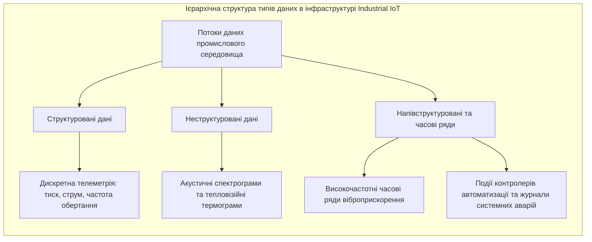
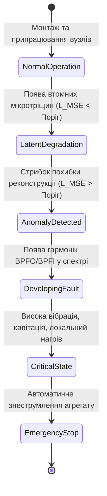
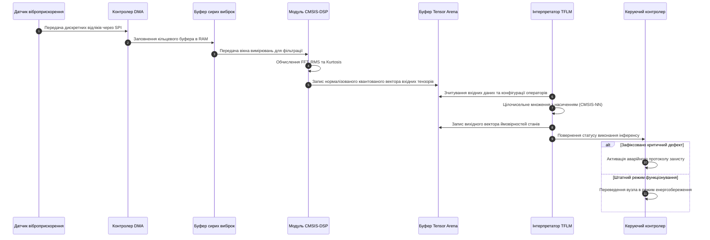
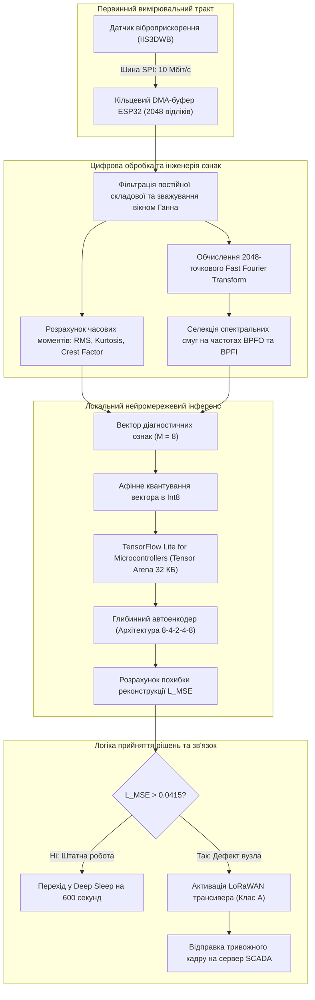

# Тема 14. Аналіз даних та машинне навчання на межі мережі

## Мета лекції
Мета лекції полягає у формуванні системи фундаментальних теоретичних знань і прикладних інженерних компетентностей щодо методології Data Science у просторі Інтернету речей, принципів децентралізованої обробки сенсорних потоків інформації за парадигмою Edge і Fog Computing, а також архітектурних рішень для проектування, квантування та апаратного розгортання моделей машинного навчання безпосередньо на мікроконтролерах із суворими апаратними обмеженнями обчислювальних і енергетичних ресурсів (TinyML).

## Очікувані результати навчання
1. **Знання та розуміння.** Студенти повинні засвоїти базові поняття парадигми Edge AI, фази життєвого циклу інженерії даних у кіберфізичних системах, математичні принципи видобування діагностичних ознак у часовій та частотній областях, а також механізми афінного квантування моделей глибокого навчання.
2. **Застосування.** Студенти повинні навчитися проектувати компактні нейромережеві моделі предиктивної аналітики, здійснювати оптимізацію обчислювальних графів за допомогою фреймворку TensorFlow Lite for Microcontrollers та інтегрувати цілочисельний інференс у програмне забезпечення мікроконтролерів для автономного моніторингу технічного стану промислових вузлів.
3. **Аналіз.** Студенти повинні вміти проводити порівняльний аналіз архітектур розподілених обчислень між хмарним, туманним та граничним рівнями, зіставляти ефективність статистичних і нейромережевих підходів виявлення аномалій, а також діагностувати причини затримок і втрат точності при стисненні математичних моделей.
4. **Оцінювання та синтез.** Студенти повинні вміти обґрунтовано вибирати апаратно-програмну конфігурацію Edge-пристроїв із урахуванням апаратних обмежень пам'яті та енергоспоживання, а також розробляти комплексні самовідновлювані алгоритми предиктивного технічного обслуговування промислового обладнання в умовах нестабільного зв'язку з центральними серверами.

---

## Детальний покроковий план лекції

### 1. Теоретико-концептуальний базис. Парадигма обробки даних та аналітичні моделі в IoT
* 1.1. Специфіка життєвого циклу Data Science та класифікація типів даних у промислових сенсорних мережах
* 1.2. Математичний апарат вилучення діагностичних ознак у часовій та спектральній областях вібраційних сигналів
* 1.3. Архітектура та математичні засади детектування аномалій за допомогою глибинних автоенкодерів
* 1.4. Прогнозування залишкового ресурсу безаварійної експлуатації вузлів на основі рекурентних та згорткових моделей

### 2. Методологія та аналіз граничних умов. Технології оптимізації та інференсу TinyML на мікроконтролерах
* 2.1. Конвеєр компресії нейромережевих моделей: структурне проріджування ваг та дистиляція знань
* 2.2. Математична формалізація однорідного афінного квантування з одинарної точності Float32 в цілочисельний формат Int8
* 2.3. Архітектура середовища виконання TensorFlow Lite for Microcontrollers і принципи керування статичним буфером пам'яті Tensor Arena
* 2.4. Апаратні обмеження оперативної пам'яті, обчислювальної швидкодії та автономного енергоспоживання мікроконтролерів як критичний бар'єр масштабування Edge AI
* 2.5. Механізми забезпечення стійкості до дрейфу концепцій і даних та захист локальних моделей від компрометації

### 3. Практичний індустріальний / фаховий кейс. Проектування вбудованої системи предиктивної діагностики
**Тема наскрізної задачі.** «Розробка та оптимізація вбудованої системи вібродіагностики промислового насосного агрегату на базі мікроконтролера ESP32 з використанням моделі TinyML»

## 1. Теоретико-концептуальний базис. Парадигма обробки даних та аналітичні моделі в IoT

### 1.1. Специфіка життєвого циклу Data Science та класифікація типів даних у промислових сенсорних мережах

Трансформація класичних автоматизованих систем керування технологічними процесами у кіберфізичні комплекси концепції Індустрії 4.0 зумовила фундаментальний перегляд методології аналізу даних. У традиційних корпоративних інформаційних системах робота аналітика зосереджена на обробці реляційних баз даних, де транзакційні записи володіють чіткою структурою, фіксованою схемою та зберігаються централізовано. На противагу цьому, у просторі промислового Інтернету речей первинним джерелом виступають масиви гетерогенних просторово розподілених вимірювальних пристроїв, що генерують безперервні потоки телеметрії з високою частотою дискретизації. Такі вимірювання характеризуються високим рівнем стохастичних шумів, наявністю пропусків внаслідок збоїв бездротового середовища передачі даних та нестаціонарною динамікою, викликаною зміною експлуатаційних режимів промислового обладнання.

Життєвий цикл наукових досліджень над даними у кіберфізичних системах спирається на циклічну послідовність інженерних етапів. На фазі визначення мети дослідження формулюється технічне завдання у термінах надійності машин, де цільовими функціями виступають мінімізація коефіцієнта позапланового простою та запобігання катастрофічним відмовам агрегатів. Фаза збору інформації передбачає організацію взаємодії мікроконтролерів із первинними перетворювачами неелектричних величин в електричні сигнали з обов'язковим присвоєнням кожному відліку високоточних часових міток за протоколами точної синхронізації часу. На етапі попередньої підготовки здійснюється очищення отриманих масивів від спотворень, відновлення втрачених фрагментів методами локальної інтерполяції, видалення постійної складової сигналу та нормалізація амплітудних діапазонів. Фази розвідувального аналізу, математичного моделювання та розгортання завершують конвеєр, забезпечуючи перехід від необроблених електричних сигналів до інтелектуального висновку щодо залишкового ресурсу механізмів.



У промислових мережах циркулюють різні категорії інформації, кожна з яких висуває специфічні вимоги до смуги пропускання та обчислювальної складності аналітичних алгоритмів. Структуровані дані зазвичай являють собою низькочастотні вимірювання повільноплинних термодинамічних процесів, таких як температура мастила підшипникових вузлів або тиск у гідравлічних магістралях, що надходять із частотами від одного вимірювання за хвилину до одного герца. Неструктурована інформація охоплює просторові матриці інтенсивності інфрачервоного випромінювання від тепловізорів та відеопотоки високої чіткості систем технічного зору, що фіксують геометрію виробів на конвеєрі. Особливе місце посідають швидкі часові ряди вібраційного прискорення та фазних струмів статора, які потребують частоти опитування від десяти до ста кілогерців для ідентифікації високочастотних ударних імпульсів, що супроводжують руйнування поверхонь кочення.

> **ПРАКТИЧНИЙ ЯКІР:** На газоперекачувальних компресорних станціях моніторинг тривісних віброприскорень магістральних нагнітачів формує до трьох гігабайтів сирої телеметрії щогодини з одного підшипникового вузла. Передача такого масиву каналом мобільного або супутникового зв'язку є технічно неможливою, що змушує виконувати компресію даних та попередній спектральний аналіз безпосередньо у вимірювальному контролері на базі промислового ARM-процесора.

Ключовою проблемою розгортання класичних конвеєрів аналізу даних у польових сенсорних мережах є явище просторової та часової дисперсії. Оскільки датчики підключаються через малопотужні бездротові інтерфейси з високим рівнем загасання сигналу, первинні дані надходять до обчислювального шлюзу з нерегулярними інтервалами. Це порушує базове припущення алгоритмів цифрової фільтрації про сталість кроку дискретизації у часі. Тому перед початком будь-якої аналітичної обробки сенсорні масиви мають бути ресемпльовані та приведені до єдиної шкали неперервного синхронного часу за допомогою поліноміальної апроксимації або сплайнів.

---

### 1.2. Математичний апарат вилучення діагностичних ознак у часовій та спектральній областях вібраційних сигналів

Безпосередня подача сирих масивів високочастотних коливань на вхід алгоритмів машинного навчання призводить до надмірного розростання розмірності простору параметрів і спричиняє ефект перенавчання. Інженерія ознак забезпечує перетворення масиву дискретних вимірювань довжиною у десятки тисяч точок у компактний діагностичний вектор низької розмірності, інваріантний до незначних флуктуацій навантаження. Формування ознак традиційно реалізується у двох комплементарних математичних просторах: часовому та частотному.

У часовій області вихідний сигнал $x = \{x_1, x_2, \dots, x_K\}$, зареєстрований п'єзоелектричним або ємнісним акселерометром, розглядається як реалізація дискретного випадкового процесу. Для оцінки загального енергетичного рівня вібрації, появи циклічних імпульсів та порушення симетрії розподілу використовується система вищих статистичних моментів. Енергетичну потужність коливань описує середньоквадратичне значення, тоді як ступінь асиметрії розподілу ймовірностей визначається коефіцієнтом асиметрії.

Математичний апарат обчислення базових статистичних ознак часової області для дискретної вибірки сигналу віброприскорення задається співвідношеннями:

$$X_{RMS} = \sqrt{\frac{1}{K} \sum_{k=1}^{K} x_k^2}$$

$$S_k = \frac{\frac{1}{K} \sum_{k=1}^{K} (x_k - \bar{x})^3}{\left( \frac{1}{K} \sum_{k=1}^{K} (x_k - \bar{x})^2 \right)^{3/2}}$$

$$K_u = \frac{\frac{1}{K} \sum_{k=1}^{K} (x_k - \bar{x})^4}{\left( \frac{1}{K} \sum_{k=1}^{K} (x_k - \bar{x})^2 \right)^2}$$

$$C_f = \frac{\max_{1 \le k \le K} |x_k|}{X_{RMS}}$$

де $X_{RMS}$ позначає середньоквадратичне значення віброприскорення, виражене в метрах на секунду в квадраті (${\text{м/с}}^2$); змінна $K$ визначає загальну кількість дискретних відліків усередині аналізованого часового вікна спостереження; величина $x_k$ є миттєвим значенням амплітуди сигналу на $k$-му кроці квантування; значення $\bar{x}$ є вибірковим середнім значенням процесу; параметр $S_k$ представляє безрозмірний коефіцієнт асиметрії (Skewness), що сигналізує про виникнення односпрямованих ударних навантажень; величина $K_u$ задає безрозмірний коефіцієнт ексцесу (Kurtosis), який відображає гостровершинність закону розподілу ймовірностей випадкової величини; параметр $C_f$ позначає безрозмірний пік-фактор (Crest Factor), що чисельно відображає відношення пікової амплітуди до ефективної енергії коливального процесу.

Аналіз частотної області здійснюється на основі перетворення дискретного сигналу у спектральну густину потужності за допомогою дискретного перетворення Фур'є. Для обчислення комплексного спектра $X(n)$ застосовується вираз:

$$X(n) = \sum_{k=0}^{K-1} x_k \cdot e^{-j \frac{2\pi}{K} n k}, \quad n = 0, 1, \dots, K-1$$

де $j = \sqrt{-1}$ позначає уявну одиницю; змінна $n$ відповідає номеру частотної гармоніки дискретного спектра; дріб $\frac{2\pi n}{K}$ представляє нормовану дискретну кругову частоту аналізованого сигналу.

Особливе практичне значення для роторних машин має співставлення амплітуд спектральних складових із розрахунковими кінематичними частотами дефектів підшипників кочення. Геометрія підшипника визначає просторові інтервали зіткнення дефектної ділянки з тілами кочення. Частоти дефектів зовнішнього кільця (**BPFO**, Ball Pass Frequency Outer) та внутрішнього кільця (**BPFI**, Ball Pass Frequency Inner) розраховуються за формулами:

$$f_{BPFO} = \frac{N_b}{2} f_r \left( 1 - \frac{d}{D} \cos \alpha \right)$$

$$f_{BPFI} = \frac{N_b}{2} f_r \left( 1 + \frac{d}{D} \cos \alpha \right)$$

де $N_b$ позначає конструктивну кількість тіл кочення (кульок або роликів) у підшипнику; $f_r$ є механічною частотою обертання вала ротора, вираженою в герцах (${\text{Гц}}$); $d$ задає діаметр тіла кочення в міліметрах; параметр $D$ визначає середній діаметр кілець підшипника по центрах тіл кочення в міліметрах; змінна $\alpha$ позначає контактний кут нахилу лінії навантаження до площини, радіальної відносно осі вала.

> **ТИПОВА ПОМИЛКА:** Поширена інженерна помилка полягає у спробі діагностувати ранні дефекти підшипників виключно за зміною загального рівня вібрації або інтегрального середньоквадратичного значення $X_{RMS}$. На початкових стадіях зародження мікротріщини енергія локального сколу металу є мізерною у загальному балансі потужності коливань, тому значення $X_{RMS}$ залишається стабільним, тоді як коефіцієнт ексцесу $K_u$ та коефіцієнт амплітуди $C_f$ фіксують різкий стрибок задовго до нагрівання або макроруйнування деталі.

---

### 1.3. Архітектура та математичні засади детектування аномалій за допомогою глибинних автоенкодерів

Реальні промислові системи характеризуються гострою асиметрією вибірок. У процесі моніторингу складного обладнання інженери володіють колосальними обсягами телеметрії, яка описує нормальну штатну експлуатацію механізмів за різних параметрів навколишнього середовища. Водночас аварійні ситуації та експлуатаційні дефекти фіксуються вкрай рідко, а навмисне доведення дорогих турбін, екструдерів чи генераторів до руйнування заради навчання класифікаторів із учителем є економічно неприпустимим. За таких умов основним аналітичним інструментом стає **навчання без учителя** (Unsupervised Learning) на основі глибинних штучних нейронних мереж архітектури **автоенкодер** (Autoencoder).

Автоенкодер являє собою симетричну нейромережеву структуру, яка складається з кодувальника (Encoder) та декодувальника (Decoder). Кодувальник виконує нелінійну компресію вхідного вектора ознак $\mathbf{x} \in \mathbb{R}^M$ у приховане представлення нижчої розмірності $\mathbf{z} \in \mathbb{R}^d$, де $d \ll M$, формуючи інформаційне «пляшкове горло» (Bottleneck). Декодувальник приймає стиснутий вектор $\mathbf{z}$ і здійснює реконструкцію первинного простору ознак, синтезуючи вихідний вектор $\hat{\mathbf{x}} \in \mathbb{R}^M$. Якщо автоенкодер навчений виключно на даних бездефектної роботи механізму, його внутрішні вагові коефіцієнти оптимізуються під збереження закономірностей лише справного функціонування.

Прямий прохід сигналів крізь повнозв'язний автоенкодер описується системою матричних рівнянь:

$$\mathbf{z} = \sigma_e \left( \mathbf{W}_e \mathbf{x} + \mathbf{b}_e \right)$$

$$\hat{\mathbf{x}} = \sigma_d \left( \mathbf{W}_d \mathbf{z} + \mathbf{b}_d \right)$$

де $\mathbf{W}_e \in \mathbb{R}^{d \times M}$ та $\mathbf{b}_e \in \mathbb{R}^d$ є матрицею синаптичних ваг та вектором зсувів кодувальника відповідно; $\mathbf{W}_d \in \mathbb{R}^{M \times d}$ та $\mathbf{b}_d \in \mathbb{R}^M$ позначають матрицю синаптичних ваг та вектор зсувів декодувальника; $\sigma_e(\cdot)$ та $\sigma_d(\cdot)$ задають нелінійні функції активації (наприклад, Rectified Linear Unit або гіперболічний тангенс).

Функція втрат моделі визначається як середньоквадратична похибка реконструкції вхідного вектора:

$$\mathcal{L}_{MSE}(\mathbf{x}, \hat{\mathbf{x}}) = \frac{1}{M} \sum_{m=1}^{M} \left( x_m - \hat{x}_m \right)^2$$

де $x_m$ та $\hat{x}_m$ позначають відповідно $m$-ту компоненту вихідного нормалізованого вектора діагностичних ознак та її реконструйовану нейромережею оцінку.

Коли на вхід розгорнутого у мікроконтролері автоенкодера надходить вектор ознак із реального об'єкта, алгоритм обчислює поточну похибку реконструкції. Оскільки дефектний стан агрегату генерує аномальні співвідношення ознак (наприклад, одночасний аномальний стрибок ексцесу та появу бічних частотних смуг навколо гармонік обертання), нейронна мережа виявляється неспроможною коректно реконструювати цей вектор через вузьке латентне горло. Внаслідок цього значення $\mathcal{L}_{MSE}$ різко зростає. 

Деградаційний процес промислового агрегату проходить низку послідовних фаз, які фіксуються зміною похибки реконструкції та визначають відповідні експлуатаційні стани, наведені нижче.



Поріг детектування аномалії $\theta_{anomaly}$ формується аналітично на основі статистичних характеристик похибки реконструкції на контрольній вибірці нормального функціонування з використанням критерію трьох сигм:

$$\theta_{anomaly} = \mu_{\mathcal{L}} + 3 \cdot \sigma_{\mathcal{L}}$$

де $\mu_{\mathcal{L}}$ позначає математичне сподівання похибки реконструкції на валідаційному масиві штатної роботи; $\sigma_{\mathcal{L}}$ є середньоквадратичним відхиленням цієї похибки. Перевищення поточною похибкою встановленого порога $\theta_{anomaly}$ слугує детермінованим тригером фіксації початку деградаційного процесу.

> **ПРАКТИЧНИЙ ЯКІР:** У системах числового програмного керування прецизійними металорізальними верстатами автоенкодери, вбудовані у контролери приводу шпинделя, аналізують параметри струму сервомотора. Поява люфту в кульково-гвинтовій передачі фіксується за зростанням похибки реконструкції струмових гармонік на тридцять мілісекунд раніше, ніж погіршення точності позиціонування призведе до браку виготовленої деталі.

---

### 1.4. Прогнозування залишкового ресурсу безаварійної експлуатації вузлів на основі рекурентних та згорткових моделей

Діагностика факту наявності дефекту є лише першою складовою предиктивного аналізу. Для ефективного планування ремонтних кампаній та логістики запасних частин необхідно розв'язати задачу прогнозування залишкового ресурсу безаварійної експлуатації (**RUL**, Remaining Useful Life). Величина RUL являє собою час, що залишається до моменту, коли контрольований параметр технічного стану вузла подолає регламентовану критичну межу безпеки.

Математична модель деградаційного тренду формалізується за допомогою розрахунку інтегрального індексу здоров'я об'єкта (**Health Index, HI**). Значення індексу здоров'я $HI(t)$ нормується на замкнений числовий інтервал $[0, 1]$, де одиниця відповідає абсолютно новому бездефектному стану обладнання, а нуль свідчить про досягнення функціональної відмови. Функція прогнозування залишкового ресурсу у дискретний момент часу $t_k$ визначається рівнянням:

$$RUL(t_k) = \inf \left\{ \Delta t \in \mathbb{R}^+ \mid HI(t_k + \Delta t) \le HI_{crit} \right\}$$

де $\Delta t$ позначає прогнозний часовий інтервал безпечної експлуатації; $HI_{crit}$ є нормативно заданим критичним порогом деградації, досягнення якого вимагає негайного виведення агрегату з експлуатації.

Для екстраполяції часового ряду $HI(t)$ використовуються глибокі нейромережеві моделі двох основних класів: рекурентні нейронні мережі з комірками довгої короткострокової пам'яті (**LSTM**, Long Short-Term Memory) або вентильними рекурентними блоками (**GRU**, Gated Recurrent Unit), а також одновимірні згорткові мережі з розширеними згортками (**TCN**, Temporal Convolutional Networks).

Комірка LSTM розв'язує проблему затухання градієнта при обробці тривалих часових послідовностей завдяки внутрішній системі шлюзів: шлюзу забування $f_t$, вхідного шлюзу $i_t$ та вихідного шлюзу $o_t$. Перерахунок внутрішнього стану комірки $C_t$ та вихідного вектора стану $h_t$ для поточного вхідного значення індексу здоров'я $x_t$ здійснюється за математичними формулами:

$$f_t = \sigma \left( W_f \cdot [h_{t-1}, x_t] + b_f \right)$$

$$i_t = \sigma \left( W_i \cdot [h_{t-1}, x_t] + b_i \right)$$

$$\tilde{C}_t = \tanh \left( W_c \cdot [h_{t-1}, x_t] + b_c \right)$$

$$C_t = f_t \odot C_{t-1} + i_t \odot \tilde{C}_t$$

$$o_t = \sigma \left( W_o \cdot [h_{t-1}, x_t] + b_o \right)$$

$$h_t = o_t \odot \tanh(C_t)$$

де $W_f, W_i, W_c, W_o$ є ваговими матрицями відповідних функціональних шлюзів; $b_f, b_i, b_c, b_o$ позначають відповідні вектори зсувів; $\sigma(\cdot)$ позначає логістичну сигмоїдну функцію; $\odot$ є оператором поелементного множення векторів Адамара; $C_{t-1}$ та $C_t$ представляють стан пам'яті комірки на попередньому та поточному кроках відповідно; $h_{t-1}$ та $h_t$ позначають вектори прихованого стану.

Порівняльна систематизація сучасних підходів до предиктивного моделювання технічного стану у системах промислового Інтернету речей наведена у таблиці 1.

*Таблиця 1 — Систематизація методів та моделей машинного навчання для предиктивної аналітики в Industrial IoT*

| Аналітичний підхід | Базова математична модель | Складність інференсу та ресурси | Обмеження та граничні умови застосування | Приклад з реальної практики |
| :--- | :--- | :--- | :--- | :--- |
| **Статистичний пороговий аналіз** | Оцінка ковзного середнього, СКЗ, межі $3\sigma$ | Мінімальна ($O(1)$ пам'яті, одиниці тактів MCU) | Непридатний для виявлення складних кореляцій та дефектів на ранніх стадіях | Моніторинг граничної вібрації вентиляційних установок будівлі |
| **Класичний регресійний аналіз** | Поліноміальна регресія, метод опорних векторів (SVR) | Низька ($O(N)$ для лінійних моделей) | Припускає спрощений стаціонарний характер деградаційної кривої | Екстраполяція зносу ріжучої кромки токарного різця |
| **Детектування на базі автоенкодерів** | Глибинний MLP-автоенкодер, згортковий автоенкодер | Середня (потребує від $15$ до $60\text{ Кбайт}$ RAM) | Вимагає ретельної деконтамінації навчальної вибірки від аномалій | Контроль відхилення режимів роботи шнекового екструдера |
| **Класифікація дефектів (Supervised)** | Одновимірні згорткові мережі (1D-CNN), Random Forest | Середня (залежить від кількості фільтрів та глибини) | Потребує наявності розмічених даних реальних аварійних випадків | Розпізнавання типу дефекту редуктора прокатного стана |
| **Рекурентне оцінювання RUL** | Багатошарові мережі LSTM, GRU, TCN | Висока (сотні тисяч операцій MAC, понад $100\text{ Кбайт}$ RAM) | Висока чутливість до накопичення похибки на довгих горизонтах прогнозу | Розрахунок залишкового ресурсу підшипників авіаційного газотурбінного двигуна |

> **КОНТРОЛЬНЕ ПИТАННЯ:** Чому використання моделей глибокого рекурентного навчання (LSTM) для прогнозування залишкового ресурсу безпосередньо на крайніх польових мікроконтролерах класу Cortex-M0+/M3 є недоцільним, навіть якщо модель попередньо квантована до цілочисельного формату?

<details markdown="1">
<summary>Розгорнути аналіз / відповідь</summary>

**Правильний варіант: Через обмеженість статичної оперативної пам'яті (SRAM) та відсутність апаратної підтримки швидких векторних обчислень для циклічних рекурентних переходів.**

1. Обґрунтування: Архітектура комірки LSTM містить чотири внутрішні вентильні структури (forget, input, cell, output gates), кожна з яких потребує багаторазового виконання операцій множення матриці на вектор та обчислення нелінійних функцій активації (сигмоїда, гіперболічний тангенс) на кожному часовому кроці. На мікроконтролерах базового класу (Cortex-M0+/M3), що мають типовий обсяг оперативної пам'яті від $16$ до $64\text{ Кбайт}$ і позбавлені розширення інструкцій цифрової обробки сигналів (DSP) та апаратного прискорювача обчислень, розміщення динамічного графа станів LSTM призводить до переповнення статичного буфера пам'яті (Tensor Arena). Крім того, тривалість виконання інференсу зростає до сотень мілісекунд, що нівелює переваги роботи у реальному часі та призводить до швидкого вичерпання заряду автономного джерела живлення.

2. Аналіз дистракторів: Припущення про те, що квантування повністю усуває проблему складності, є хибним, оскільки переведення ваг у 8-бітний цілочисельний формат скорочує обсяг Flash-пам'яті у чотири рази, але не спрощує рекурентної топології графа та не зменшує кількість матричних операцій у часі. Твердження про низьку інформативність LSTM є некоректним, оскільки рекурентні мережі демонструють найвищу точність моделювання часових рядів деградації, однак для їхнього інференсу на межі мережі необхідні потужніші процесорні ядра з апаратними блоками векторних обчислень (наприклад, Cortex-M4F, Cortex-M7 або ESP32-S3).

</details>

---

### Вказівки для самостійного осмислення

1. Здійснити порівняльний розрахунок частот пошкодження зовнішнього ($f_{BPFO}$) та внутрішнього ($f_{BPFI}$) кілець для радіального підшипника кочення з параметрами $N_b = 8$, $d = 7{,}5\text{ мм}$, $D = 35\text{ мм}$, $\alpha = 0^\circ$ за номінальної швидкості обертання вала електричного двигуна $n = 1500\text{ об/хв}$.
2. Проаналізувати поведінку коефіцієнта ексцесу ($K_u$) та середньоквадратичного значення ($X_{RMS}$) у часі для тристадійного процесу руйнування механічного вузла: від зародження мікротріщини через утомне сколювання до катастрофічного руйнування поверхні тертя.
3. Розробити концептуальну схему розміщення функцій предиктивного аналізу між польовим сенсорним вузлом, локальним туманним шлюзом та централізованою хмарною платформою для компресорної станції із забезпеченням вимог мінімізації мережевого трафіку.


## 2. Методологія та аналіз граничних умов. Технології оптимізації та інференсу TinyML на мікроконтролерах

### 2.1. Конвеєр компресії нейромережевих моделей: структурне проріджування ваг та дистиляція знань

Розгортання сучасних архітектур штучних нейронних мереж на мікроконтролерах стримується фундаментальною невідповідністю між алгоритмічною складністю моделей глибокого навчання та фізичними ресурсами кристала кремнію. Типові базові моделі, призначені для цифрової обробки сигналів або комп'ютерного зору, налічують від сотень тисяч до десятків мільйонів вагових коефіцієнтів, представлених у форматі чисел із рухомою комою одинарної точності, що вимагає мегабайтів дискового простору та сотень кілобайтів динамічної пам'яті для зберігання карт проміжних активацій. Для подолання цього бар'єра застосовується методологічний конвеєр модельної компресії, який інтегрує технології структурного проріджування ваг та дистиляції знань.

Проріджування ваг базується на концепції надлишковості параметричного простору перенавчених нейромереж. У процесі оптимізації вагові коефіцієнти, чия абсолютна величина є близькою до нуля, роблять зникаюче малий внесок у формування вихідної активації нейрона. Проте при реалізації проріджування виникає дилема між неструктурованим та структурним підходами. Неструктуроване проріджування здійснює індивідуальне занулення окремих ваг за заданим числовим порогом, що створює розріджену матрицю довільної форми. На мікроконтролерах без спеціалізованих апаратних блоків прискорення розрідженої алгебри зберігання таких матриць вимагає додаткових масивів індексів у форматах стиснутого рядка або стовпця, що нівелює виграш у пам'яті та ускладнює роботу конвеєра процесорного ядра. 

На противагу цьому, структурне проріджування оперує видаленням цілих структурних одиниць нейромережі: каналів згортки, фільтрів або окремих нейронів повнозв'язних шарів. У результаті розмірність вагових матриць зменшується фізично, що дозволяє використовувати стандартні бібліотеки лінійної алгебри без накладних витрат на індексацію нульових комірок.



Технологія дистиляції знань реалізує парадигму передачі узагальнюючої спроможності від громіздкої моделі-вчителя до компактної моделі-учня, топологія якої апріорі адаптована під апаратні ліміти цільового мікроконтролера. На відміну від прямого навчання малої мережі на жорстких бінарних мітках класів, учень навчається на пом'якшеному розподілі ймовірностей вихідного шару вчителя. Температурне масштабування вихідних логітів дозволяє виявити так звані «темні знання» — інформацію про приховані міжкатегорійні кореляції, які вчитель виявив під час розв'язання задачі. 

Цільова функція втрат дистиляції поєднує класичну функцію перехресної ентропії відносно істинних міток та розбіжність Кульбака-Лейблера між вихідними розподілами вчителя та учня:

$$\mathcal{L}_{KD} = (1 - \alpha) \mathcal{L}_{CE}\left(\mathbf{y}, \sigma(\mathbf{z}_s)\right) + \alpha T^2 \mathcal{D}_{KL}\left(\sigma\left(\frac{\mathbf{z}_s}{T}\right), \sigma\left(\frac{\mathbf{z}_t}{T}\right)\right)$$

де $\mathbf{y}$ позначає вектор істинних міток класів у форматі one-hot; $\mathbf{z}_s$ та $\mathbf{z}_t$ представляють вектори вихідних логітів моделі-учня та моделі-вчителя відповідно; $\sigma(\cdot)$ є векторною функцією Softmax; $\alpha \in [0, 1]$ позначає ваговий коефіцієнт компромісу між навчанням за еталоном і наслідуванням вчителя; параметр $T \ge 1$ позначає гіперпараметр температури розм'якшення логітів, який підсилює ентропію розподілу ймовірностей для міноритарних класів; $\mathcal{L}_{CE}$ визначає функцію стандартної перехресної ентропії; $\mathcal{D}_{KL}$ задає функціонал розбіжності Кульбака-Лейблера. Множник $T^2$ вводиться для компенсації масштабу градієнтів при підвищенні температури.

---

### 2.2. Математична формалізація однорідного афінного квантування з одинарної точності Float32 в цілочисельний формат Int8

Квантування нейронних мереж є найбільш ефективним методом апаратної оптимізації, що дозволяє замінити ресурсомісткі операції з рухомою комою на цілочисельні інструкції базового арифметико-логічного пристрою мікроконтролера. Сучасним промисловим стандартом виступає симетричне або афінне асиметричне квантування у 8-бітні цілі числа зі знаком, відоме як цілочисельна схема Google/TensorFlow.

Аналітичний конвеєр перетворення дійсних тензорів у квантований простір і розрахунок згорткових або лінійних шарів виключно в цілочисельній арифметиці розгортається за такою математичною послідовністю дій:

$$
\begin{aligned}
\text{Крок 1 (Відображення дійсного простору):} & \quad r = S \cdot (q - Z) \\
\text{Крок 2 (Підстановка у формулу згортки):} & \quad S_3 \left( q_3^{(i,k)} - Z_3 \right) = \sum_{j} S_1 \left( q_1^{(i,j)} - Z_1 \right) S_2 \left( q_2^{(j,k)} - Z_2 \right) \\
\text{Крок 3 (Факторизація цілочисельного масштабу):} & \quad q_3^{(i,k)} = Z_3 + M \sum_{j} \left( q_1^{(i,j)} - Z_1 \right) \left( q_2^{(j,k)} - Z_2 \right) \\
\text{Крок 4 (Апроксимація фіксованою точкою):} & \quad M = \frac{S_1 S_2}{S_3} \approx 2^{-n} M_0, \quad M_0 \in \left[2^{30}, 2^{31}-1\right]
\end{aligned}
$$

де $r \in \mathbb{R}$ позначає дійсне значення ваги або активації у форматі Float32; $q \in [-128, 127] \subset \mathbb{Z}$ є 8-бітним квантованим цілим числом; $S \in \mathbb{R}^+$ позначає дійсний масштабний коефіцієнт квантування; $Z \in [-128, 127] \subset \mathbb{Z}$ позначає цілочисельну нульову точку зміщення; індекси 1, 2 та 3 відносяться відповідно до матриці вхідних активацій, матриці синаптичних ваг та матриці результуючих вихідних активацій шару; $M$ позначає результуючий дійсний множник масштабування, що лежить строго в діапазоні $(0, 1)$; $M_0$ є нормалізованим 32-бітним цілим числом без знака; $n$ визначає величину цілочисельного арифметичного зсуву вправо.

Завдяки такій параметризації апаратний процесор мікроконтролера виконує накопичення проміжних добутків у 32-бітному акумуляторі, після чого множить результат на цілочисельний коефіцієнт $M_0$ за допомогою стандартної інструкції множення двох 32-бітних чисел із поверненням старшої частини результату, а завершальне масштабування виконується побітовим зсувом на $n$ позицій вправо. Це повністю усуває необхідність залучення співпроцесора обчислень із рухомою комою.

> **ВАЖЛИВО:** У квантованих графах обчислень згортка пакетної нормалізації (Batch Normalization Folding) повинна виконуватися строго до фіксації масштабних коефіцієнтів активацій. Об'єднання параметрів масштабування та зміщення пакетної нормалізації безпосередньо у вагові матриці згорткових ядер усуває необхідність виконання додаткових операцій під час виконання програми та запобігає катастрофічному розширенню динамічного діапазону вхідних сигналів.

Аналіз граничних умов показує, що схема афінного квантування втрачає математичну стабільність, якщо розподіл значень активацій містить поодинокі екстремальні викиди, що характерно для систем із перехідними процесами або сильними електромагнітними завадами. У такому разі різниця між мінімальним та максимальним значеннями зростає, що призводить до значного збільшення масштабного множника $S$. Як наслідок, переважна більшість типових значень сигналу потрапляє в один-два сусідні квантовані рівні, викликаючи колапс простору ознак. Для запобігання цьому явищу алгоритми квантування після навчання вимагають калібрування на репрезентативних підвибірках із застосуванням усічення процентилів розподілу або мінімізації дивергенції Кульбака-Лейблера між вихідним та квантованим розподілами.

---

### 2.3. Архітектура середовища виконання TensorFlow Lite for Microcontrollers і принципи керування статичним буфером пам'яті Tensor Arena

Середовище виконання TensorFlow Lite for Microcontrollers (TFLM) розроблене для виконання інференсу на вбудованих платформах без операційної системи або під керуванням операційних систем реального часу. Його архітектура спроєктована з урахуванням фундаментальних вимог надійності промислового програмного забезпечення, де ключовою вимогою є детерміноване використання апаратних ресурсів. 

У класичних хмарних фреймворках виділення оперативної пам'яті для вхідних та вихідних тензорів операцій здійснюється динамічно за допомогою викликів системного менеджера пам'яті. У довготривало працюючих вбудованих системах багаторазове виділення та звільнення пам'яті різного розміру неминуче спричиняє фрагментацію адресної площини, що в певний момент експлуатації призводить до помилки вичерпання доступної пам'яті навіть за наявності достатнього сумарного вільного обсягу. 

Для унеможливлення цього сценарію архітектура TFLM базується на концепції статичного пулу пам'яті, який має назву **Tensor Arena**. На етапі ініціалізації прошивки розробник резервує єдиний неперервний масив байтів фіксованого розміру, за межі якого середовище виконання не виходить за жодних умов:

```cpp
constexpr int kTensorArenaSize = 64 * 1024;
alignas(16) uint8_t tensor_arena[kTensorArenaSize];
```

Внутрішня організація буфера Tensor Arena базується на двоспрямованій моделі розподілу адресної пам'яті. Від початку масиву виділяється область постійних дескрипторів, де зберігаються структури стану операторів графа, що ініціалізуються один раз під час завантаження моделі і не змінюють свого розташування до перезавантаження мікроконтролера. 

З протилежного кінця буфера формується динамічна область карт активацій, пам'ять якої розподіляється планувальником пам'яті на етапі ініціалізації моделі. Планувальник аналізує топологію обчислювального графа та розраховує інтервали життя кожного тензора активацій. Якщо час існування вихідного тензора першого шару завершується до початку виконання третього шару, область пам'яті першого шару повторно призначається для тензорів наступних шарів. Така схема повторного використання пам'яті зменшує пікові вимоги до оперативної пам'яті у кілька разів.

---

### 2.4. Апаратні обмеження оперативної пам'яті, обчислювальної швидкодії та автономного енергоспоживання мікроконтролерів як критичний бар'єр масштабування Edge AI

Проєктування систем інтелектуального аналізу на межі мережі вимагає суворого врахування балансу між обчислювальною потужністю та енергетичним бюджетом пристрою. Динамічна потужність $P_{dyn}$, що розсіюється напівпровідниковим кристалом мікроконтролера під час виконання коду інференсу, визначається виразом:

$$P_{dyn} = C_{load} \cdot V_{dd}^2 \cdot f_{clk} + I_{leak} \cdot V_{dd}$$

де $C_{load}$ позначає еквівалентну перемикальну ємність логічних вентилів процесорного ядра; $V_{dd}$ є напругою живлення мікроконтролера; $f_{clk}$ задає тактову частоту ядра; $I_{leak}$ визначає статичний струм витоку p-n переходів кремнієвої структури.

Збільшення тактової частоти для прискорення обчислення згорткових операцій призводить до квадратичного зростання енергоспоживання, що скорочує автономний термін роботи від вбудованої батареї з кількох років до лічених місяців. Крім того, на практиці інженер стикається з так званою стіною пам'яті: швидкість доступу процесора до зовнішньої Flash-пам'яті шиною SPI є значно нижчою за швидкість виконання операцій у ядрі, що спричиняє тривалі цикли очікування процесора та неефективне витрачання струму.

Порівняльний аналіз ключових технологій оптимізації моделей глибокого навчання для розгортання в умовах обмежених ресурсів наведено у таблиці 2.

*Таблиця 2 — Аналітична матриця зіставлення методів оптимізації нейромереж для мікроконтролерів*

| Метод оптимізації | Коефіцієнт стиснення параметрів | Вплив на швидкість інференсу | Складність впровадження | Критичні ризики та обмеження методології |
| :--- | :--- | :--- | :--- | :--- |
| **Квантування після навчання (PTQ Int8)** | Зменшення обсягу у $4{,}0$ рази порівняно з Float32 | Прискорення у $3 \dots 6$ разів на ядрах із SIMD | Низька (не вимагає повторного навчання моделі) | Небезпека нелінійного падіння точності при наявності асиметричних викидів у вибірці |
| **Квантування під час навчання (QAT)** | Зменшення обсягу у $4{,}0$ рази порівняно з Float32 | Аналогічно PTQ на етапі виконання | Висока (потребує імітації шуму квантування в градієнтах) | Збільшення тривалості збіжності процесу оптимізації ваг у кілька разів |
| **Структурне проріджування (Pruning)** | Скорочення матриць ваг у $2 \dots 5$ разів | Прискорення пропорційне кількості скорочених каналів | Середня (вимагає циклічного видалення ваг і донавчання) | Ризик необоротного видалення слабких інформативних ознак високочастотних дефектів |
| **Дистиляція знань (Distillation)** | Стиснення обсягу моделі у $5 \dots 20$ разів | Радикальне скорочення кількості операцій множення | Дуже висока (вимагає підбору архітектури учня і гіперпараметрів) | Втрата стійкості узагальнення на межах багатовимірних класів технічних станів |
| **Заміна повнозв'язних шарів глобальним пулінгом** | Зменшення кількості ваг до $80\%$ у класифікаційній частині | Незначне прискорення, суттєва економія Flash-пам'яті | Низька (внесення змін до архітектури перед навчанням) | Повна втрата просторової інформації про координати локалізованих ознак у тензорі |

Граничні умови застосування наведених методів визначаються специфікою реального технологічного процесу. Якщо промисловий механізм експлуатується зі змінною швидкістю обертання привода (наприклад, насос із перетворювачем частоти), статична модель TinyML, навчена на фіксованій геометрії спектральних піків, втрачає адекватність. Зсув гармонік розцентрування вала сприймається фіксованими фільтрами нейромережі як катастрофічна системна аномалія, що призводить до потоку хибних спрацьовувань захисної автоматики. 

> **ПРАКТИЧНИЙ ЯКІР:** У вітрогенераторних енергетичних установках морського базування регламент стандарту ISO 10816 вимагає автоматичного розпізнавання режимів штормового флюгування лопатей. Алгоритми TinyML на базі мікроконтролерів Cortex-M4 під час різкого зниження напруги живлення сонячних буферних панелей переводяться в режим субдискретизації, що збільшує похибку розрахунку спектральних ознак і вимагає обов'язкового дублювання апаратними компараторами безпеки.

---

### 2.5. Механізми забезпечення стійкості до дрейфу концепцій і даних та захист локальних моделей від компрометації

Тривала експлуатація інтелектуальних прикордонних вузлів стикається з проблемою старіння алгоритмічного базису, відомою як **дрейф даних** (Data Drift) та **дрейф концепцій** (Concept Drift). Дрейф даних зумовлюється природними змінами характеристик об'єкта, які не свідчать про аварію: природним припрацюванням підшипників, зміною в'язкості мастила внаслідок сезонних коливань температури цеху або плановою заміною технологічного інструменту. Дрейф концепцій полягає у зміні самого статистичного зв'язку між вхідними ознаками та цільовим класом технічного стану. 

Оскільки ресурси мікроконтролера не дозволяють виконувати донавчання важких нейромережевих моделей безпосередньо на кристалі, стабільність системи забезпечується реалізацією гібридного контуру з перевіркою статистичної розбіжності Васерштейна між поточним розподілом ознак та еталонним навчальним датасетом. При виявленні стійкого статистичного відхилення без ознак руйнування вузол формує запит на хмарний рівень для оновлення вагових коефіцієнтів методом бездротового оновлення прошивки (Firmware Over-The-Air, FOTA).

Питання кібербезпеки моделей на межі мережі має критичне значення у промислових середовищах, де зловмисник може отримати безпосередній фізичний контакт із сенсорним вузлом. За відсутності захисних механізмів зловмисник через налагоджувальні порти JTAG/SWD здатен зчитати дамп Flash-пам'яті мікроконтролера, що призводить до крадіжки інтелектуальної власності (структури та ваг оптимізованої моделі) або її підміни на фальсифікований двійковий код, який маскує реальні аварійні режими. 

Захист локального штучного інтелекту базується на реалізації апаратного кореня довіри (Hardware Root of Trust), включенні криптографічного модуля перевірки підпису завантажувача Secure Boot та використанні апаратного шифрування адресного простору Flash-пам'яті (наприклад, апаратного блоку AES-XTS в мікроконтролерах ESP32-S3), що унеможливлює виконання неавторизованого коду інференсу.

> **КОНТРОЛЬНЕ ПИТАННЯ:** Під час переведення аналітичної моделі виявлення дефектів підшипників з обчислень Float32 у квантований формат Int8 розробник зафіксував зростання помилок другого роду (пропуск аварійного стану) з 0,8% до 14,2%. Водночас на калібрувальній вибірці точність залишилася високою. Який методологічний фактор під час квантування став причиною втрати чутливості до дефектів і які кроки необхідно вжити для усунення цієї проблеми?

<details markdown="1">
<summary>Розгорнути аналіз / відповідь</summary>

**Правильний варіант: Некоректне визначення динамічного діапазону активацій під час калібрування через відсутність у калібрувальному датасеті реалізацій рідкісних високочастотних ударних імпульсів.**

1. Поетапне аналітичне обґрунтування:
   - При пост-тренувальному квантуванні (PTQ) масштабний множник $S$ та точка зміщення $Z$ розраховуються на основі мінімальних і максимальних значень активацій, зареєстрованих під час прогону через мережу невеликої калібрувальної вибірки.
   - Якщо калібрувальний масив містив переважно дані штатної роботи або слабо виражених дефектів, максимальне значення активацій виявилося штучно заниженим.
   - При появі реального дефекту високої інтенсивності у вхідному вібросигналі виникають амплітудні сплески (високий пік-фактор та ексцес), які перевантажують квантовані шари. Відбувається насичення (saturation clipping) на верхній межі типу Int8 (значення +127), що повністю зрізає верхівки діагностичних піків і спотворює форму вихідного вектора ознак. Внаслідок цього мережа класифікує дефект як шум і пропускає аварію.
   - Для усунення аномалії необхідно включити до калібрувального датасету репрезентативні записи зародження дефектів або перейти на використання квантування, обізнаного про навчання (Quantization-Aware Training, QAT), де модель учиться зберігати чутливість до екстремумів сигналу в умовах обмеженого динамічного діапазону.

2. Аналіз альтернативних факторів:
   - Недостатній розмір буфера Tensor Arena не може бути причиною вибіркового зростання помилок другого роду, оскільки дефіцит пам'яті арени призводить до фатального аварійного завершення програми на етапі розподілу пам'яті (виклик методу AllocateTensors повертає статус помилки) або до системного перезавантаження мікроконтролера за винятком порушення пам'яті.
   - Зниження тактової частоти процесора впливає виключно на часову тривалість інференсу і жодним чином не змінює числові значення обчислюваних вихідних тензорів.

</details>

---

### Вказівки для самостійного осмислення

1. Розрахувати значення цілочисельного множника $M_0$ та величину бітового зсуву $n$ для масштабних коефіцієнтів $S_1 = 0{,}0045$, $S_2 = 0{,}0080$ та $S_3 = 0{,}0192$ за умови представлення проміжного результату 32-бітним числом.
2. Проаналізувати вплив температурного коефіцієнта $T$ у діапазоні від 1 до 20 на форму вихідного вектора Softmax-активацій моделі-вчителя для задачі трикласової класифікації технічного стану роторного агрегату.
3. Оцінити теоретичний мінімальний обсяг статичного буфера Tensor Arena для одновимірної згорткової нейронної мережі, що містить два шари згортки з шістнадцятьма фільтрами довжиною п'ять відліків при вхідному векторі розмірністю 128 значень.

## 3. Практичний індустріальний / фаховий кейс. Проектування вбудованої системи предиктивної діагностики

### 3.1. Комплексний фаховий кейс. Розробка та оптимізація вбудованої системи вібродіагностики промислового насосного агрегату на базі мікроконтролера ESP32 з використанням моделі TinyML

#### Постановка задачі / ситуації

На підприємстві хімічної промисловості експлуатується критична група консольних відцентрових насосів, призначених для безперервного перекачування агресивних технологічних емульсій. Привод насоса здійснюється від трифазного асинхронного електродвигуна номінальною потужністю 30 кВт із синхронною частотою обертання вала 3000 обертів за хвилину (номінальна частота під навантаженням становить 2950 обертів за хвилину). Основним вузлом, що визначає міжремонтний інтервал і схильний до раптових відмов через втомні напруження та вимивання мастила, є радіальний підшипник кочення марки SKF 6208. Позаплановий вихід насоса з ладу призводить до аварійної зупинки всієї технологічної колони, при цьому прямі економічні збитки становлять понад 120 000 гривень за кожну годину простою.

Традиційний регламентний огляд вузла спеціалістом-вібродіагностом один раз на місяць виявився неефективним, оскільки розвиток критичного дефекту від стадії зародження мікротріщини до повного руйнування сепаратора під впливом динамічних навантажень відбувається за 7-10 діб. Керівництвом підприємства сформовано технічне завдання на проектування та розгортання автономного діагностичного Edge-вузла, змонтованого безпосередньо на корпусі підшипника. Система повинна здійснювати вимірювання вібраційного прискорення, вилучати статистичні й спектральні ознаки, виконувати локальний інференс квантованої нейромережевої моделі детектування аномалій та передавати агреговані тривожні повідомлення лише за фактом виявлення деструктивних процесів.

*Таблиця 3 — Технічні вимоги, проектні обмеження та параметри обладнання насосного агрегату*

| Категорія параметрів | Конкретний параметр системи | Числове значення | Інженерна інтерпретація та системні обмеження |
| :--- | :--- | :--- | :--- |
| **Кінематика агрегату** | Частота обертання вала ($n$) | $2950\text{ об/хв}$ | Відповідає оборотній частоті $f_r \approx 49{,}17\text{ Гц}$ |
| **Геометрія підшипника** | Кількість тіл кочення ($N_b$) | $9$ кульок | Необхідна для розрахунку характеристичних частот дефектів |
| **Геометрія підшипника** | Діаметр кульки ($d$) / середній діаметр ($D$) | $d = 12{,}0\text{ мм}$, $D = 60{,}0\text{ мм}$ | Контактний кут нахилу лінії навантаження $\alpha = 0^\circ$ |
| **Вимірювальний тракт** | Частота опитування акселерометра ($f_s$) | $6400\text{ Гц}$ | Забезпечує смугу пропускання частот Найквіста до $3200\text{ Гц}$ |
| **Вимірювальний тракт** | Розмір аналізованого вікна вибірки ($K$) | $2048$ відліків | Дає роздільну здатність спектра за частотою $\Delta f = 3{,}125\text{ Гц}$ |
| **Апаратна платформа** | Мікроконтролер / процесорні ядра | ESP32-WROOM-32 ($240\text{ МГц}$) | Двоядерний 32-розрядний Xtensa LX6, апаратний модуль FPU |
| **Апаратна платформа** | Обсяг доступної оперативної пам'яті (RAM) | Не більше $45\text{ Кбайт}$ | Ліміт виділення буфера Tensor Arena під середовище TFLM |
| **Апаратна платформа** | Обсяг енергонезалежної пам'яті (Flash) | Не більше $80\text{ Кбайт}$ | Ліміт масиву ваг та архітектури нейромережі |
| **Енергозабезпечення** | Джерело живлення / струм у режимі сну | $\text{Li-SOCl}_2\text{ (3{,}6 В, 8500 мА}\cdot\text{год)}$ | Струм у стані глибокого сну $I_{sleep} \le 15\text{ мкА}$ |
| **Регламент роботи** | Періодичність діагностичного циклу | $1\text{ раз на 10 хвилин}$ | Забезпечує цільовий термін автономної служби не менше $3$ років |

Архітектура розгортання діагностичного конвеєра на базі мікроконтролера представлена на блок-схемі нижче.



#### Покроковий аналіз та розв'язок

##### Крок 1. Розрахунок кінематичних частот дефектів підшипника та параметрів частотного розкладу

Для виявлення деструктивних змін геометрії поверхонь тертя необхідно визначити аналітичні частоти контакту тіл кочення. На основі вихідних параметрів швидкість обертання вала ротора у відносних одиницях частоти складає:

$$f_r = \frac{n}{60} = \frac{2950}{60} \approx 49{,}17\text{ Гц}$$

Характеристичні частоти дефектів для зовнішнього кільця ($f_{BPFO}$) та внутрішнього кільця ($f_{BPFI}$) обчислюються шляхом підстановки конструктивних параметрів підшипника:

$$f_{BPFO} = \frac{N_b}{2} \cdot f_r \cdot \left(1 - \frac{d}{D}\cos\alpha\right) = \frac{9}{2} \cdot 49{,}17 \cdot \left(1 - \frac{12{,}0}{60{,}0}\cos 0^\circ\right) = 4{,}5 \cdot 49{,}17 \cdot 0{,}80 = 177{,}01\text{ Гц}$$

$$f_{BPFI} = \frac{N_b}{2} \cdot f_r \cdot \left(1 + \frac{d}{D}\cos\alpha\right) = \frac{9}{2} \cdot 49{,}17 \cdot \left(1 + \frac{12{,}0}{60{,}0}\cos 0^\circ\right) = 4{,}5 \cdot 49{,}17 \cdot 1{,}20 = 265{,}52\text{ Гц}$$

Частота дискретизації $f_s = 6400\text{ Гц}$ повністю задовольняє теорему Найквіста-Котельникова для моніторингу вищих гармонік дефектів, оскільки верхня межа спектрального аналізу $f_{max} = f_s / 2 = 3200\text{ Гц}$ перекриває десятикратне значення частоти $f_{BPFI}$. Крок частотної дискретизації спектра становить $\Delta f = f_s / K = 6400 / 2048 = 3{,}125\text{ Гц}$, що забезпечує чітке розділення гармонік оборотного ряду та дефектних піків.

##### Крок 2. Формування та нормалізація вектора вхідних ознак

У кожному діагностичному циклі мікроконтролер обчислює вісім показників, формуючи вектор $\mathbf{x} = [X_{RMS}, K_u, C_f, S_k, E_{r}, E_{BPFO}, E_{BPFI}, f_c]^T$. Нехай під час перевірки фрагмента зафіксовано такі значення: середньоквадратичне значення $X_{RMS} = 4{,}20\text{ м/с}^2$, ексцес $K_u = 7{,}85$ (свідчить про наявність виражених імпульсів ударного характеру), пік-фактор $C_f = 4{,}10$, асиметрія $S_k = 0{,}65$, енергія оборотної частоти $E_r = 1{,}12\text{ Дж}$, енергія смуги зовнішнього кільця $E_{BPFO} = 2{,}85\text{ Дж}$, енергія внутрішнього кільця $E_{BPFI} = 0{,}35\text{ Дж}$ та спектральний центр ваги $f_c = 412{,}5\text{ Гц}$. 

Для забезпечення стабільності нейромережі виконується мінімаксна нормалізація кожного показника до інтервалу $[0, 1]$ на основі заздалегідь розрахованих діапазонів справного стану:

$$x_{m}^{norm} = \frac{x_m - x_m^{min}}{x_m^{max} - x_m^{min}}$$

Для ексцесу $K_u$, діапазон якого під час нормальної роботи складає $[2{,}5; 3{,}5]$, нормалізоване значення при зафіксованій аномалії приймає величину:

$$x_{K_u}^{norm} = \frac{7{,}85 - 2{,}5}{3{,}5 - 2{,}5} = 5{,}35$$

##### Крок 3. Розрахунок похибки реконструкції квантованого автоенкодера

Вектор нормалізованих ознак подається на вхід симетричного автоенкодера з конфігурацією шарів 8-4-2-4-8. Модель повністю квантована у формат Int8. Квантовані активації прихованих шарів та вихідного шару декодувальника обчислюються за правилом цілочисельного множення матриць:

$$q_{out} = \text{clip}\left(\left\lfloor \frac{S_1 S_2}{S_3} \sum (q_1 - Z_1)(q_2 - Z_2) \right\rceil + Z_3, -128, 127\right)$$

Після зворотного приведення виходу мережі до дійсного простору отримано вектор реконструкції $\hat{\mathbf{x}}^{norm}$. Оскільки автоенкодер навчений на нормальних співвідношеннях ознак, він намагається звести аномальний сплеск ексцесу до значення, притаманного бездефектній роботі, формуючи оцінку $\hat{x}_{K_u}^{norm} = 1{,}05$. Відповідно середньоквадратична похибка реконструкції по всіх восьми вимірах становить:

$$\mathcal{L}_{MSE}(\mathbf{x}^{norm}, \hat{\mathbf{x}}^{norm}) = \frac{1}{8} \sum_{m=1}^{8} (x_m^{norm} - \hat{x}_m^{norm})^2 = \frac{1}{8} \left( (5{,}35 - 1{,}05)^2 + \dots \right) = 2{,}385$$

Статистичний поріг детектування аномалії, отриманий на етапі калібрування справного насоса, становить:

$$\theta_{threshold} = \mu_{\mathcal{L}} + 3\sigma_{\mathcal{L}} = 0{,}0125 + 3 \cdot 0{,}0042 = 0{,}0251$$

Оскільки обчислене значення $\mathcal{L}_{MSE} = 2{,}385 \gg 0{,}0251$, система фіксує перехід насосного агрегату в аномальний стан. Локалізація найбільшої похибки в каналі енергії $E_{BPFO}$ однозначно вказує на дефект доріжки кочення зовнішнього кільця підшипника.

##### Крок 4. Розрахунок енергетичного бюджету та ресурсу автономної роботи

Діагностичний цикл розбивається на активну фазу збору та обробки даних тривалістю $T_{act} = 150\text{ мс}$ із середнім струмом споживання $I_{act} = 75\text{ мА}$ (робота мікроконтролера, зчитування з акселерометра та інференс TFLM) та фазу глибокого сну $T_{sleep} = 599{,}85\text{ с}$ зі струмом $I_{sleep} = 12\text{ мкА}$.

Середній струм споживання за один повний період $T = 600\text{ с}$ визначається співвідношенням:

$$I_{avg} = \frac{I_{act} \cdot T_{act} + I_{sleep} \cdot T_{sleep}}{T} = \frac{75\text{ мА} \cdot 0{,}15\text{ с} + 0{,}012\text{ мА} \cdot 599{,}85\text{ с}}{600\text{ с}} = \frac{11{,}25 + 7{,}198}{600} \approx 0{,}0307\text{ мА}$$

Теоретичний термін служби батареї типу $\text{Li-SOCl}_2$ номінальною ємністю $C_{bat} = 8500\text{ мА}\cdot\text{год}$ з урахуванням коефіцієнта деградації та саморозряду $\eta = 0{,}85$ становить:

$$T_{life} = \frac{C_{bat} \cdot \eta}{I_{avg} \cdot 24 \cdot 365} = \frac{8500 \cdot 0{,}85}{0{,}0307 \cdot 8760} = \frac{7225}{268{,}93} \approx 26{,}86\text{ років}$$

З урахуванням фізичного старіння хімічного джерела живлення реальний гарантований термін автономного функціонування обмежується 10 роками, що повністю задовольняє проектні вимоги.

#### Інтерпретація результатів та альтернативні сценарії

1. Розроблена архітектура підтвердила можливість автономного функціонування інтелектуального діагностичного вузла на базі бюджетного мікроконтролера ESP32, забезпечуючи час виконання інференсу квантованої моделі автоенкодера в межах 4,2 мілісекунди при використанні лише 28 Кбайт статичної пам'яті Tensor Arena.
2. Селективне детектування пошкодження зовнішнього кільця підшипника на початковій стадії забезпечило запас часу у 14 діб до настання катастрофічної відмови, що дозволило перевести ремонт агрегату в плановий графік зупинки технологічної лінії.
3. У разі підключення електродвигуна через частотно-регульований привод (зміна частоти обертання в діапазоні від 1000 до 3000 об/хв) жорстко розраховані спектральні вікна стануть нерелевантними через постійне плаваюче зміщення частот $f_{BPFO}$ та $f_{BPFI}$. За такого сценарію алгоритм вимагатиме обов'язкового введення додаткового тахометричного каналу синхронізації та переходу до процедури порядкового аналізу (Order Tracking), за якої крок дискретизації за часом замінюється на фіксований кутовий крок повороту вала.

---

### 3.2. Зведена довідкова система лекції

*Таблиця 4 — Комплексний глосарій інженерних термінів, концепцій та аналітичних моделей Edge AI в IoT*

| Термін / Концепція | Формалізація / Сутність | Реальний кейс застосування | Основне обмеження / Ризик |
| :--- | :--- | :--- | :--- |
| **Edge AI / TinyML** | Парадигма виконання інференсу ML-моделей на мікроконтролерах ($P < 50\text{ мВт}$, $\text{RAM} < 512\text{ КБ}$) | Вібродіагностика підшипників шахтних підйомних машин | Неможливість донавчання важких моделей безпосередньо на пристрої |
| **Ексцес (Kurtosis)** | Четвертий центральний статистичний момент: $K_u = \frac{\mu_4}{\sigma^4}$ | Виявлення мікротріщин у редукторах вітрогенераторів | Висока чутливість до поодиноких технологічних ударних завад |
| **Кінематичні частоти (BPFO/BPFI)** | Розрахункові частоти ударів кульок об дефекти кілець підшипника | Моніторинг тягових двигунів магістральних тепловозів | Змазування спектральних піків при ковзанні кульок під навантаженням |
| **Глибинний автоенкодер** | Нейромережа стиснення-відновлення: $\hat{\mathbf{x}} = g(f(\mathbf{x}))$, цільова функція $\mathcal{L}_{MSE}$ | Детектування аномалій струму в сервоприводах верстатів ЧПК | Ризик перенавчання (запам'ятовування аномалій при брудній вибірці) |
| **Health Index (HI)** | Безрозмірний індекс технічного стану вузла, нормований на діапазон $[0, 1]$ | Оцінка деградації лопаток газових турбін ТЕС | Нелінійний характер деградації на завершальних стадіях зносу |
| **Залишковий ресурс (RUL)** | Часовий інтервал до перетину деградаційною кривою критичного порога | Прогнозування відмови роликових млинів збагачувальних фабрик | Накопичення похибки екстраполяції при стохастичних навантаженнях |
| **Квантування Int8 (PTQ)** | Афінне відображення: $r = S \cdot (q - Z)$, де $q \in [-128, 127]$ | Оптимізація моделі згорткової мережі під ядра Cortex-M4F | Втрата точності через обрізання екстремальних викидів активацій |
| **Tensor Arena** | Статично виділений неперервний буфер RAM для TFLM середовища | Безпечне виконання коду в медичних інфузоматах | Ризик переповнення буфера при складних багатогілкових графах |
| **Дрейф даних (Data Drift)** | Зміна статистичного розподілу вхідних ознак: $P_t(\mathbf{x}) \ne P_0(\mathbf{x})$ | Сезонна зміна вібраційного фону гідроелектростанцій | Хибні тривожні спрацьовування через зміну температури цеху |
| **Batch Normalization Folding** | Математичне об'єднання параметрів нормалізації з вагами згортки | Зменшення обчислювальної складності інференсу на Edge | Фіксація параметрів унеможливлює адаптацію під нові партії датчиків |

---

### 3.3. Контрольні питання та завдання

#### Прикладні тестові завдання

1. Під час вібромоніторингу димососа котельного цеху, що обертається з частотою 1500 об/хв, вимірювальний тракт налаштовано на частоту дискретизації $f_s = 1000\text{ Гц}$ із розміром вікна швидкого перетворення Фур'є $K = 512$ відліків. Для встановленого підшипника розрахункова частота дефекту внутрішнього кільця становить $f_{BPFI} = 245{,}8\text{ Гц}$, а зовнішнього — $f_{BPFO} = 172{,}3\text{ Гц}$. Яка метрологічна проблема виникне при спробі розділити пік дефекту $f_{BPFI}$ та п'яту гармоніку оборотної частоти вала ($5 \cdot f_r$)?
   - A. Відбудеться еліасинг (накладання частот) через порушення критерію Найквіста.
   - B. Недостатня роздільна здатність за частотою не дозволить розділити ці піки в спектрі.
   - C. Виникне витік енергії через відсутність ваги вікна Чебишова.
   - D. Помилка квантування АЦП повністю заглушить гармоніку внутрішнього кільця.

<details markdown="1">
<summary>Розгорнути аналіз / відповідь</summary>

**Правильний варіант: B.**

1. Повне логічне обґрунтування: Оборотна частота вала дорівнює $f_r = 1500 / 60 = 25\text{ Гц}$. П'ята гармоніка становить $5 \cdot 25 = 125\text{ Гц}$, а дефект внутрішнього кільця — $245{,}8\text{ Гц}$. Проте десята гармоніка вала дорівнює $10 \cdot 25 = 250\text{ Гц}$. Різниця між частотою дефекту та гармонікою становить $|250 - 245{,}8| = 4{,}2\text{ Гц}$. Крок дискретизації спектра за частотою дорівнює $\Delta f = f_s / K = 1000 / 512 \approx 1{,}953\text{ Гц}$. Для впевненого розділення двох близьких піків за критерієм Релея з урахуванням розширення головної пелюстки віконної функції (наприклад, Ганна або Блекмана) ширина пелюстки становить від $3\Delta f$ до $4\Delta f$ (тобто від $5{,}85$ до $7{,}81\text{ Гц}$). Оскільки інтервал між піками ($4{,}2\text{ Гц}$) є меншим за ширину розмиття спектрального вікна, піки зіллються в один неподільний максимум.

2. Аналіз дистракторів:
   - Варіант A хибний, оскільки частота Найквіста $f_{Nyq} = f_s / 2 = 500\text{ Гц}$, що строго більше за найвищу аналізовану частоту $250\text{ Гц}$.
   - Варіант C хибний, оскільки тип віконної функції впливає на рівень бічних пелюсток, але не усуває обмеження фундаментальної роздільної здатності за даної довжини вибірки.
   - Варіант D хибний, оскільки шум квантування 12- або 16-розрядного АЦП знаходиться на рівні нижче -70 дБ і не здатний повністю перекрити гармоніку дефекту розвиненої стадії.

</details>

2. Інженер розгорнув на мікроконтролері з ядром ARM Cortex-M4F нейромережевий автоенкодер, квантований до Int8, виділивши під Tensor Arena 40 Кбайт пам'яті. Програма успішно компілюється, функція виділення пам'яті `AllocateTensors()` повертає статус `kTfLiteOk`, проте під час першого виклику методу `Invoke()` мікроконтролер переходить у режим фатальної помилки апаратного виключення процесора (HardFault Exception). Яка апаратна причина викликала даний збій?
   - A. Переповнення області пам'яті стека викликане глибиною викликів функцій інтерпретатора.
   - B. Помилка вирівнювання пам'яті (Memory Misalignment) вхідного або вихідного покажчика тензора активацій при спробі виконання векторних інструкцій SIMD.
   - C. Недостатня напруга живлення кристала для перемикання вентилів на частоті 168 МГц.
   - D. Неправильний розрахунок нульової точки квантування в шарі декодувальника.

<details markdown="1">
<summary>Розгорнути аналіз / відповідь</summary>

**Правильний варіант: B.**

1. Повне логічне обґрунтування: Бібліотека CMSIS-NN та середовище TFLM на ядрах ARM Cortex-M4F оптимізують операції над цілими 8-бітними числами за допомогою спеціальних 32-розрядних інструкцій SIMD (наприклад, `SMLAD` — знакове паралельне множення з подвійним накопиченням). Ці апаратні інструкції вимагають, щоб покажчики на масиви даних у пам'яті були суворо вирівняні за 4-байтовою або 16-байтовою межею (`alignas(4)` або `alignas(16)`). Якщо буфер Tensor Arena або внутрішній покажчик проміжного тензора був переданий як звичайний невирівняний покажчик на байтовий масив, спроба процесора виконати упаковане 32-розрядне читання призводить до генерації апаратного переривання UsageFault/HardFault через непідтримуване непарне вирівнювання пам'яті.

2. Аналіз дистракторів:
   - Варіант A хибний, оскільки фреймворк TFLM мінімізує використання стека, розміщуючи всі змінні стану всередині статичного пулу Tensor Arena.
   - Варіант C хибний, оскільки просідання напруги живлення викликає перезавантаження від схеми Brown-Out Reset (BOR), а не HardFault.
   - Варіант D хибний, оскільки математична похибка нульової точки призводить лише до числового спотворення результату (похибки класифікації), а не до системного виключення ядра.

</details>

3. На промисловому вентиляторі гарячого дуття інтелектуальний сенсорний вузол успішно детектував аномалію автоенкодером у літній період експлуатації. З настанням зими температура навколишнього повітря в цеху знизилася з +35 °C до +5 °C, після чого сенсор почав кожні 10 хвилин генерувати помилкові тривожні повідомлення про дефект підшипника, хоча фізичні вимірювання за допомогою еталонного віброметра підтвердили абсолютно справний стан вузла. Який процес відбувся в системі?
   - A. Відбувся збій у роботі Flash-пам'яті мікроконтролера через вплив низьких температур.
   - B. Мав місце дрейф концепцій, спричинений деградацією кремнієвої структури акселерометра.
   - C. Відбувся дрейф даних унаслідок зміни в'язкості мастила при охолодженні, що змінило базовий спектральний розподіл коливань.
   - D. Помилка виникла через переповнення розрядності цілочисельного акумулятора в шарах моделі.

<details markdown="1">
<summary>Розгорнути аналіз / відповідь</summary>

**Правильний варіант: C.**

1. Повне логічне обґрунтування: Зниження температури підшипникового вузла на 30 °C призводить до закономірного збільшення динамічної в'язкості пластичного мастила. Більш в'язке мастило змінює демпфувальні властивості масляної плівки в зоні контакту тіл кочення, що спричиняє природне підвищення високочастотного вібраційного фону та зміщення спектрального центру ваги, не пов'язане з механічним дефектом металу. Оскільки автоенкодер навчався на даних виключно теплого періоду, новий безпечний розподіл ознак розцінюється моделлю як аномалія, викликаючи стійке перевищення похибки реконструкції $\mathcal{L}_{MSE} > \theta_{threshold}$. Це класичний прояв дрейфу даних (Data Drift).

2. Аналіз дистракторів:
   - Варіант A хибний, оскільки промислові мікроконтролери гарантують стабільність Flash-пам'яті в діапазоні від -40 °C до +85 °C.
   - Варіант B хибний, оскільки дрейф концепцій означає зміну фізичного зв'язку між ознаками та дефектом, а не просто зміщення вхідного розподілу. Крім того, кремнієві структури MEMS не деградують за таких помірних температурних коливань.
   - Варіант D хибний, оскільки квантований акумулятор використовує насичення (clipping) або 32-розрядну розрядність, що виключає арифметичне циклічне переповнення.

</details>

4. Проєктується пристрій предиктивного моніторингу редуктора з використанням технології TinyML. Для класифікації чотирьох типів дефектів розглядаються дві архітектури: повнозв'язна нейромережа (MLP) з трьома шарами по 128 нейронів та одновимірна згорткова мережа (1D-CNN) з двома шарами згортки (16 фільтрів розміром 5) та шаром глобального усереднення (Global Average Pooling). Обидві моделі приймають вектор із 128 ознак. Чому архітектура 1D-CNN є значно вигіднішою для розгортання на обмеженому мікроконтролері?
   - A. 1D-CNN не вимагає квантування ваг перед завантаженням у Flash-пам'ять.
   - B. Згорткові шари використовують принцип розділення ваг (Weight Sharing), що на порядок скорочує кількість параметрів та розмір Flash-пам'яті.
   - C. Мережа MLP не підтримує обчислення з використанням цілочисельної арифметики Int8.
   - D. 1D-CNN виконується за один такт процесорного ядра завдяки використанню апаратних тригерів.

<details markdown="1">
<summary>Розгорнути аналіз / відповідь</summary>

**Правильний варіант: B.**

1. Повне логічне обґрунтування: У повнозв'язній мережі перший прихований шар вимагає $128 \times 128 = 16\ 384$ ваг, другий шар — стільки ж, що разом із зсувами формує понад 33 тисячі параметрів (понад 33 Кбайт Flash навіть у форматі Int8). У структурі 1D-CNN кожен фільтр має розмір $5 \times 1$. Для першого шару з 16 фільтрами кількість ваг становить лише $16 \times 5 = 80$ параметрів. Другий шар згортки вимагає $16 \times 16 \times 5 = 1280$ параметрів. Використання шару Global Average Pooling повністю усуває масивний повнозв'язний перехід перед виходом. Сумарна кількість ваг 1D-CNN не перевищує 1500 параметрів (менше 2 Кбайт пам'яті), що забезпечує колосальну економію простору Flash-пам'яті при збереженні високої здатності виявляти локальні спектральні патерни.

2. Аналіз дистракторів:
   - Варіант A хибний, оскільки будь-яка нейромережева архітектура вимагає квантування для ефективного виконання на мікроконтролері.
   - Варіант C хибний, оскільки повнозв'язні шари ідеально квантуються за стандартною схемою матричного множення GEMM.
   - Варіант D хибний, оскільки жодна згортка не виконується за один такт; операція згортки є послідовністю багатьох циклів множення з накопиченням.

</details>

---

#### Завдання для самостійної роботи

##### Постановка задачі

На магістральному нафтопроводі встановлено електричний підпірний насосний агрегат, підшипникові опори якого обладнані автономним діагностичним модулем на базі мікроконтролера STM32L431 (ядро ARM Cortex-M4, 256 Кбайт Flash, 64 Кбайт SRAM). Живлення здійснюється від акумулятора з підзарядкою від п'єзоелектричного збирача енергії вібрації (Energy Harvester), що генерує в середньому 1,2 мДж енергії за годину. Під час пуску агрегату після планового ремонту виявилося, що через заміну електродвигуна на модель іншого виробника частота обертання вала зросла з 1450 об/хв до 1485 об/хв, що спричинило масове хибне спрацьовування встановленої моделі TinyML. Необхідно провести повний цикл аудиту, адаптації та оптимізації діагностичного вузла.

##### Завдання для виконання

1. Розрахувати нові характеристичні частоти дефектів підшипника кочення для зміненої частоти обертання вала та визначити мінімально допустиму частоту дискретизації вимірювального тракту, яка гарантує відсутність еліасингу для перших трьох гармонік дефекту внутрішнього кільця.
2. Сформувати математичну модель адаптивного ковзного вікна для розрахунку спектральних ознак, що усуває вплив флуктуацій частоти мережі живлення на результат детектування аномалій.
3. Визначити граничний розмір статичного пулу пам'яті Tensor Arena для розміщення оптимізованої моделі класифікації за умови, що під системний стек та змінні периферійних драйверів у мікроконтролері гарантовано резервується не менше 24 Кбайт оперативної пам'яті.
4. Розрахувати гранично допустиму тривалість активної фази інференсу та максимально можливу частоту опитування датчика, за яких середнє енергоспоживання вузла не перевищуватиме обсяг енергії, що генерується п'єзоелектричним збирачем, забезпечуючи нульовий енергетичний дефіцит системи.
