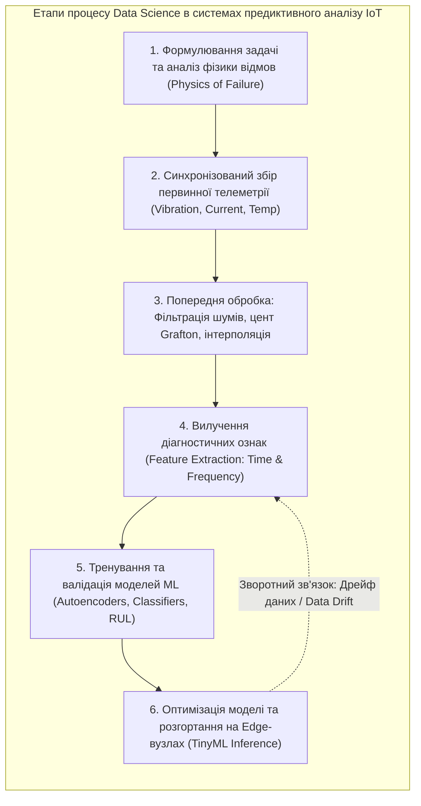
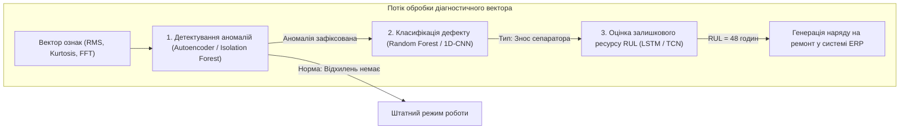
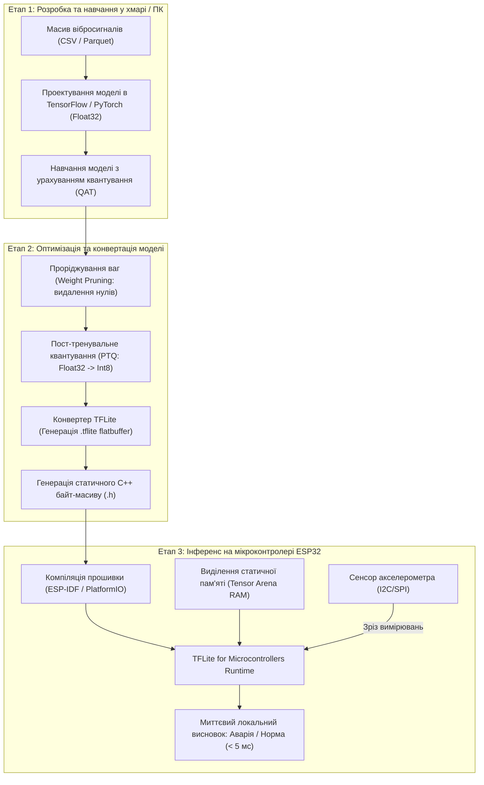

# Змістовий модуль 3. Інтеграція, Smart-системи та аналітика

# Тема 14. Аналіз даних та Machine Learning на межі мережі (Edge AI)

---

## 14.1. Процес Data Science в ІоТ

### Основний зміст та теоретичний базис

Впровадження концепції Інтернету речей у виробничі та інженерні системи докорінно змінило методологію класичного аналізу даних (**Data Science**). Якщо у традиційних бізнес-додатках аналітики працюють зі статичними або слабодинамічними транзакційними вибірками у реляційних базах даних, то в кіберфізичних системах вхідною інформацією є неперервні часові ряди високої частоти дискретизації, згенеровані масивами просторово розподілених датчиків. Специфіка процесу Data Science в IoT визначається необхідністю виявлення прихованих закономірностей у зашумлених сигналах, врахуванням просторово-часової кореляції між різними вимірювальними каналами та жорсткими обмеженнями на обчислювальні ресурси прикордонних вузлів.

У контексті моніторингу технічного стану промислового обладнання та реалізації стратегії предиктивного технічного обслуговування (**Predictive Maintenance, PdM**) життєвий цикл аналізу даних включає шість послідовних етапів. На першому етапі здійснюється формулювання інженерного завдання та аналіз фізики деградації об'єкта, де визначаються критичні вузли машин (підшипники кочення, зубчасті передачі, вали, обмотки статора) та їхні характерні дефекти. Другий етап передбачає збір первинних сигналів вібраційного прискорення, струмового навантаження, акустичної емісії та температури за допомогою аналого-цифрових перетворювачів польових мікроконтролерів. На третьому етапі виконується попередня очистка даних, яка полягає у видаленні високочастотних шумів квантування, інтерполяції втрачених через збої зв'язку пакетів, усуненні постійної складової (дрейфу нуля) та вирівнюванні часових міток між різнорідними датчиками.


*Рисунок 1 — Структурно-логічна послідовність етапів Data Science для задач предиктивного обслуговування в IoT*

Четвертий етап, представлений на рисунку 1 як вилучення діагностичних ознак (**Feature Extraction / Feature Engineering**), є найбільш відповідальною фазою. Сирий оцифрований масив коливань містить надто великий обсяг надлишкової інформації, яку неможливо безпосередньо передати на вхід легковажної нейронної мережі мікроконтролера. 

З цією метою часовий ряд розбивається на вікна фіксованої довжини $K$ відліків, для яких обчислюється вектор інформативних статистичних і спектральних ознак. У часовій області найважливішими показниками є середньоквадратичне значення сигналу (**RMS**, Root Mean Square), пікове значення, коефіцієнт ексцесу (**Kurtosis**) та коефіцієнт амплітуди (**Crest Factor**).

Математичний апарат обчислення базових часових діагностичних ознак для дискретної вибірки сигналу віброприскорення $x = \{x_1, x_2, \dots, x_K\}$ описується системою формул:

$$X_{RMS} = \sqrt{\frac{1}{K} \sum_{k=1}^{K} x_k^2}$$

$$K_u = \frac{\frac{1}{K} \sum_{k=1}^{K} (x_k - \bar{x})^4}{\left( \frac{1}{K} \sum_{k=1}^{K} (x_k - \bar{x})^2 \right)^2}$$

$$C_f = \frac{\max_{1 \le k \le K} |x_k|}{X_{RMS}}$$

де $X_{RMS}$ позначає середньоквадратичне значення віброприскорення, що відображає загальну енергетичну потужність коливального процесу (${\text{м/с}}^2$); $K$ є кількістю дискретних відліків усередині аналізованого часового вікна; $x_k$ позначає миттєве значення амплітуди $k$-го відліку (${\text{м/с}}^2$); $\bar{x} = \frac{1}{K}\sum_{k=1}^K x_k$ є вибірковим середнім значенням сигналу; $K_u$ є безрозмірним коефіцієнтом ексцесу, який вимірює гостровершинність розподілу й виявляється надзвичайно чутливим до появи первинних ударних імпульсів при зародженні мікротріщин у підшипниках (для нормального гаусового шуму справного механізму $K_u \approx 3$, тоді як при виникненні локального дефекту значення зростає до $K_u > 6 \dots 10$); $C_f$ позначає безрозмірний коефіцієнт амплітуди (пік-фактор), що характеризує відношення екстремального сплеску до середньої енергії сигналу.

У частотній області первинний сигнал перетворюється за допомогою алгоритму швидкого перетворення Фур'є (**FFT**, Fast Fourier Transform). Спектральний аналіз дозволяє виділити амплітуди на специфічних характеристичних частотах обертання вала $f_r$, частотах проходження тіл кочення по зовнішньому кільцю підшипника (**BPFO**, Ball Pass Frequency Outer) та внутрішньому кільцю (**BPFI**, Ball Pass Frequency Inner), що однозначно ідентифікує локалізацію механічного пошкодження.

| Клас діагностичних ознак | Назва ознаки | Математична сутність | Фізична інтерпретація для предиктивного аналізу |
| :--- | :--- | :--- | :--- |
| **Часова область (Time Domain)** | **RMS (Середньоквадратичне)** | $X_{RMS} = \sqrt{\frac{1}{K} \sum x_k^2}$ | Відображає інтегральну енергію вібрації; зростає на пізніх стадіях загального зносу |
| **Часова область (Time Domain)** | **Kurtosis (Ексцес)** | Четвертий центральний момент розподілу | Чутливий до одиничних гострих ударів; виявляє дефекти на ранніх етапах зародження |
| **Часова область (Time Domain)** | **Crest Factor (Пік-фактор)** | Відношення піку до RMS | Фіксує появу імпульсних ударних навантажень на тлі низького загального рівня вібрації |
| **Частотна область (Frequency Domain)**| **Спектральна енергія смуги** | $E_{band} = \sum_{f=f_1}^{f_2} \|X(f)\|^2$ | Контролює появу гармонік на специфічних частотах пошкодження елементів підшипника |
| **Частотна область (Frequency Domain)**| **Спектральний центр ваги** | $f_c = \frac{\sum f \cdot \|X(f)\|}{\sum \|X(f)\|}$ | Фіксує зміщення спектрального максимуму у високочастотну область при сухому терті |

Аналіз характеристик таблиці підтверджує, що комбінування статистичних та спектральних ознак дозволяє сформувати компактний вектор низької розмірності ($10 \dots 30$ числових значень замість тисяч вихідних точок осцилограми), який містить вичерпний інформаційний опис технічного стану об'єкта і може бути класифікований безпосередньо на мікроконтролері.

---

## 14.2. Машинне навчання для предиктивної аналітики

### Основний зміст та теоретичний базис

Розвиток інтелектуальних систем управління привів до переходу від реактивного обслуговування за фактом аварії (Run-to-Failure) та регламентного планово-попереджувального обслуговування (Time-Based Maintenance) до стратегії **обслуговування за фактичним станом** (Condition-Based Maintenance) та **предиктивної аналітики** (Predictive Analytics). Предиктивне технічне обслуговування використовує алгоритми машинного навчання (**Machine Learning, ML**) для вирішення трьох ключових завдань: детектування аномалій на ранніх етапах, мультикласової класифікації типу виявленого дефекту та регресійного прогнозування залишкового ресурсу безпечної експлуатації вузла (**RUL**, Remaining Useful Life).


*Рисунок 2 — Багаторівнева ієрархія алгоритмів машинного навчання у системі предиктивної аналітики промислового обладнання*

Першим бар'єром захисту в ієрархії, представленій на рисунку 2, виступає **детектування аномалій без учителя** (Unsupervised Anomaly Detection). На реальному промисловому виробництві масиви даних про аварійні стани надзвичайно обмежені, оскільки обладнання переважну більшість часу функціонує у штатному режимі, а доведення агрегатів до фізичного руйнування заради збору навчальної вибірки є економічно неприпустимим. 

Для розв'язання цієї проблеми застосовують глибокі автоенкодери (**Autoencoders**). Нейронна мережа-автоенкодер навчається виключно на історичних даних нормального функціонування обладнання. Автоенкодер стискає вхідний вектор ознак $\mathbf{x}$ у низьковимірний латентний простір за допомогою шарів кодувальника $f_{\theta}(\mathbf{x})$ і відновлює його на виході через шари декодувальника $g_{\phi}(\mathbf{z})$, мінімізуючи середньоквадратичну похибку реконструкції.

Математично оцінка аномальності поточного стану обладнання на основі похибки реконструкції автоенкодера описується рівнянням:

$$\mathcal{L}_{recon}(\mathbf{x}) = \|\mathbf{x} - \hat{\mathbf{x}}\|^2 = \frac{1}{M} \sum_{j=1}^{M} \left( x_j - g_{\phi}\left( f_{\theta}(\mathbf{x}) \right)_j \right)^2$$

де $\mathbf{x} \in \mathbb{R}^M$ позначає вектор вхідних діагностичних ознак розмірністю $M$; $\hat{\mathbf{x}} = g_{\phi}(f_{\theta}(\mathbf{x}))$ є вектором реконструйованих ознак на виході декодувальника; $f_{\theta}$ та $g_{\phi}$ позначають нелінійні параметричні функції кодувальника та декодувальника з наборами ваг $\theta$ та $\phi$ відповідно; $\mathcal{L}_{recon}(\mathbf{x})$ позначає числове значення похибки реконструкції (Reconstruction Loss).

Рішення про перехід обладнання в передаварійний аномальний стан приймається за детермінованим правилом виходу похибки за статистичний поріг $\theta_{threshold}$:

$$\text{Статус}(t) = \begin{cases} 0 \text{ (Штатний режим)}, & \text{якщо } \mathcal{L}_{recon}(\mathbf{x}(t)) \le \theta_{threshold} \\ 1 \text{ (Аномалія / Дефект)}, & \text{якщо } \mathcal{L}_{recon}(\mathbf{x}(t)) > \theta_{threshold} \end{cases}$$

де поріг $\theta_{threshold} = \mu_{norm} + 3\sigma_{norm}$ розраховується за правилом трьох сигм на основі математичного сподівання $\mu_{norm}$ та стандартного відхилення $\sigma_{norm}$ похибки реконструкції на валідаційній вибірці справного стану. Оскільки дефектний стан формує комбінації ознак, які мережа ніколи не бачила під час навчання, декодувальник не здатний адекватно відновити такий вектор, що викликає стрибок $\mathcal{L}_{recon}$ на кілька порядків.

У разі підтвердження аномалії активується модель класифікації дефектів на основі алгоритмів випадкового лісу (**Random Forest**) або одновимірних згорткових нейромереж (**1D-CNN**), які зіставляють патерн збурень із конкретним фізичним типом несправності (дисбаланс ротора, кавітація насоса, розцентрування валів або дефект доріжки кочення підшипника). 

Паралельно рекурентна нейронна мережа з блоками довгої короткострокової пам'яті (**LSTM**, Long Short-Term Memory) виконує нелінійну регресію для оцінки залишкового ресурсу $RUL(t)$, що визначається як прогнозований час $\Delta t$, через який показники деградації досягнуть критичної межі відмови $y_{failure}$:

$$RUL(t) = \inf \left\{ \Delta t \in \mathbb{R}^+ \mid \hat{y}(t + \Delta t) \ge y_{failure} \right\}$$

де $\hat{y}(t + \Delta t)$ є екстрапольованим значенням інтегрального індексу деградації механізму в майбутній момент часу.

| Алгоритм машинного навчання | Тип задачі в PdM | Обчислювальна складність інференсу | Вимоги до оперативної пам'яті | Придатність для виконання на Edge (ESP32 / ARM) |
| :--- | :--- | :--- | :--- | :--- |
| **Deep Autoencoder (MLP / Conv)** | Детектування невідомих аномалій | Низька ($O(M \cdot H)$, де $H$ — розмір шарів) | Дуже низька ($10 \dots 50\text{ Кбайт}$) | Ідеальна (навчається тільки на справному стані) |
| **Isolation Forest** | Виявлення викидів у метриках | Середня ($O(T \cdot \log K)$, де $T$ — число дерев) | Середня ($100 \dots 300\text{ Кбайт}$) | Висока при оптимізації глибини дерев |
| **Random Forest Classifier** | Багатокласова класифікація дефектів | Низька (послідовне проходження бінарних дерев) | Середня ($50 \dots 200\text{ Кбайт}$) | Відмінна (висока інтерпретованість правил) |
| **1D-CNN (Згорткова мережа)** | Пряма класифікація сирих спектрів FFT | Середня ($O(\sum K_w \cdot C_{in} \cdot C_{out})$) | Низька ($30 \dots 100\text{ Кбайт}$) | Ідеальна для виявлення спектральних патернів |
| **LSTM / GRU Network** | Регресійне прогнозування RUL | Висока (матричні множення в рекурентних гейтах) | Висока ($200 \dots 512\text{ Кбайт}$) | Обмежена (вимагає контролерів класу Cortex-M7/ESP32-S3) |

Зіставлення моделей підтверджує, що для реалізації автономної предиктивної діагностики безпосередньо біля джерела даних оптимальною комбінацією є використання компактного автоенкодера для безперервного моніторингу аномалій разом із 1D-CNN для експрес-класифікації дефектів.

---

## 14.3. Запуск нейромереж на мікроконтролерах (TinyML)

### Основний зміст та теоретичний базис

Історично виконання моделей штучного інтелекту вважалося прерогативою потужних серверних кластерів із графічними прискорювачами (GPGPU) через значні обчислювальні вимоги операцій лінійної алгебри. Проте необхідність передачі гігабайтів сирої телеметрії у хмару створює затримки зв'язку, перевантажує мережу та несе ризики компрометації технологічних даних. 

Це привело до виникнення нової науково-технічної парадигми — **TinyML** (Tiny Machine Learning), яка передбачає виконання повноцінного інференсу оптимізованих моделей машинного навчання та штучних нейронних мереж безпосередньо на ультрамалопотужних мікроконтролерах (Microcontroller Units, **MCU**) та цифрових сигнальних процесорах з бюджетом споживання енергії менше $1 \dots 50\text{ мВт}$ та жорстко обмеженою пам'яттю (до $512\text{ Кбайт}$ RAM та до кількох мегабайтів Flash).


*Рисунок 3 — Повний наскрізний ланцюжок розробки, квантування та розгортання моделі TinyML на мікроконтролері ESP32*

Як деталізовано на рисунку 3, процес переносу штучного інтелекту на мікроконтролер вимагає проходження спеціалізованого конвеєра оптимізації. Базова нейронна мережа, навчена у середовищі TensorFlow або PyTorch, використовує 32-бітні числа з плаваючою комою одинарної точності (**Float32**). Для виконання на мікроконтролері модель піддається трьом фундаментальним перетворенням:
- Проріджування ваг (Weight Pruning) видаляє з матриць зв'язків ті синаптичні ваги, абсолютні значення яких близькі до нуля, перетворюючи матриці на розріджені без відчутної втрати узагальнюючої здатності мережі.
- Дистиляція знань (Knowledge Distillation) використовує виходи важкої моделі-«вчителя» для навчання компактної студентської мережі з меншою кількістю шарів.
- Однорідне афінне квантування (Uniform Affine Quantization) замінює 32-бітні значення ваг і функцій активації на 8-бітні цілі числа зі знаком (**Int8**).

Математичний апарат квантування значень із простору дійсних чисел $r \in [\alpha, \beta] \subset \mathbb{R}$ у простір цілих чисел $q \in [q_{min}, q_{max}] \subset \mathbb{Z}$ (де для 8-бітного представлення зі знаком $q_{min} = -128$, $q_{max} = 127$) описується формулами:

$$q = \text{clip} \left( \left\lfloor \frac{r}{S} \right\rceil + Z, \quad q_{min}, \quad q_{max} \right)$$

$$r \approx \hat{r} = S \cdot (q - Z)$$

де $S$ позначає дійсний масштабний множник (Scale factor), що визначає крок квантування; $Z$ є цілочисельним зміщенням нульового рівня (Zero-point offset), яке забезпечує точне відображення дійсного значення $0{,}0$ у відповідне ціле число для коректного розрахунку нульових зміщень; оператор $\lfloor \cdot \rceil$ позначає округлення до найближчого цілого; функція $\text{clip}(v, l, u) = \max(l, \min(v, u))$ обмежує діапазон значень межами розрядності цілочисельного типу.

Масштабний коефіцієнт $S$ та нульова точка $Z$ розраховуються за формулами:

$$S = \frac{\beta - \alpha}{q_{max} - q_{min}}$$

$$Z = \text{round} \left( \frac{-\alpha \cdot q_{max} - \beta \cdot q_{min}}{\beta - \alpha} \right)$$

де $\alpha$ та $\beta$ є мінімальним та максимальним значеннями дійсного діапазону ваг або активацій відповідно.

Перехід від арифметики Float32 до операцій над Int8 дає потрійний системний ефект: обсяг пам'яті Flash для збереження ваг зменшується рівно в 4 рази ($75\%$ економії), вимоги до оперативної пам'яті RAM скорочуються у $3 \dots 4$ рази, а швидкість виконання операцій множення з накопиченням (**MAC**, Multiply-Accumulate) зростає у $4 \dots 8$ разів за рахунок використання цілочисельних SIMD-інструкцій процесорних ядер (зокрема асемблерних оптимізацій бібліотеки **CMSIS-NN** для ядер ARM Cortex-M або векторних інструкцій ESP32-S3).

Програмне розгортання моделі здійснюється за допомогою легковикового фреймворку **TensorFlow Lite for Microcontrollers (TFLM)**. Фундаментальною особливістю TFLM є повна відмова від динамічного виділення пам'яті (заборона викликів `malloc()` та оператора `new`) для запобігання фатальній фрагментації RAM під час неперервної роботи пристрою. Замість цього розробник виділяє єдиний статичний байтовий масив — **Tensor Arena**, у межах якого інтерпретатор самостійно організовує буфери вхідних, проміжних та вихідних тензорів.

Нижче наведено практичний фрагмент вихідного C++ коду прошивки мікроконтролера ESP32, що реалізує ініціалізацію середовища TFLM та виконання локального інференсу діагностичної нейронної мережі:

```cpp
#include <Arduino.h>
#include "tensorflow/lite/micro/all_ops_resolver.h"
#include "tensorflow/lite/micro/micro_error_reporter.h"
#include "tensorflow/lite/micro/micro_interpreter.h"
#include "tensorflow/lite/schema/schema_generated.h"
#include "model_data.h" // Скомпільований масив ваг моделі int8

// Виділення статичної пам'яті для Tensor Arena (без динамічного виділення)
constexpr int kTensorArenaSize = 30 * 1024; // 30 Кбайт RAM
alignas(16) uint8_t tensor_arena[kTensorArenaSize];

// Глобальні вказівники на компоненти TFLM
const tflite::Model* model = nullptr;
tflite::MicroInterpreter* interpreter = nullptr;
TfLiteTensor* input_tensor = nullptr;
TfLiteTensor* output_tensor = nullptr;

void setup() {
    Serial.begin(115200);
    
    // Завантаження моделі з Flash-пам'яті
    model = tflite::GetModel(g_model_data);
    if (model->version() != TFLITE_SCHEMA_VERSION) {
        Serial.println("[TinyML Error] Невідповідність версії схеми TFLite!");
        return;
    }

    // Реєстрація набору операцій (AllOpsResolver або MicroMutableOpResolver)
    static tflite::AllOpsResolver resolver;

    // Ініціалізація інтерпретатора у виділеному статичному буфері
    static tflite::MicroInterpreter static_interpreter(
        model, resolver, tensor_arena, kTensorArenaSize, nullptr);
    interpreter = &static_interpreter;

    // Виділення пам'яті для тензорів графа
    if (interpreter->AllocateTensors() != kTfLiteOk) {
        Serial.println("[TinyML Error] Помилка розміщення тензорів у Tensor Arena!");
        return;
    }

    // Отримання дескрипторів вхідного та вихідного тензорів
    input_tensor = interpreter->input(0);
    output_tensor = interpreter->output(0);
    
    Serial.println("[TinyML] Нейромережевий рушій успішно ініціалізовано на ESP32.");
}

void loop() {
    // Приклад заповнення вхідного тензора ознаками (RMS, Kurtosis, FFT енергії)
    // Значення попередньо квантуються у формат int8 відповідно до Scale та Zero-Point
    int8_t input_features[5] = { 45, -12, 88, 102, -5 }; // Квантований вектор
    
    for (int i = 0; i < 5; ++i) {
        input_tensor->data.int8[i] = input_features[i];
    }

    // Виконання інференсу моделі безпосередньо на мікроконтролері
    uint32_t start_time = micros();
    TfLiteStatus invoke_status = interpreter->Invoke();
    uint32_t execution_time = micros() - start_time;

    if (invoke_status != kTfLiteOk) {
        Serial.println("[TinyML Error] Збій виконання інференсу!");
        return;
    }

    // Отримання квантованих виходів класифікатора дефектів
    int8_t normal_score = output_tensor->data.int8[0];
    int8_t fault_score = output_tensor->data.int8[1];

    Serial.printf("[TinyML Result] Час інференсу: %u мкс | Норма: %d | Дефект: %d\n", 
                  execution_time, normal_score, fault_score);

    // Локальна реакція при підтвердженні аномалії
    if (fault_score > normal_score) {
        Serial.println("[ALARM] Виявлено критичний дефект підшипника! Активація захисту.");
    }

    delay(1000); // Період між діагностичними циклами
}
```

| Параметр ефективності | Модель Float32 (Без оптимізації) | Модель Int8 (TinyML після квантування) | Коефіцієнт покращення |
| :--- | :--- | :--- | :--- |
| **Обсяг Flash-пам'яті (Розмір моделі)** | $184\text{ Кбайт}$ | $46\text{ Кбайт}$ | Скорочення у $4{,}0$ рази ($75\%$) |
| **Використання RAM (Tensor Arena)** | $96\text{ Кбайт}$ | $24\text{ Кбайт}$ | Скорочення у $4{,}0$ рази |
| **Час інференсу (ESP32 @ 240 МГц)** | $18{,}4\text{ мс}$ | $3{,}2\text{ мс}$ | Прискорення у $5{,}75$ раза |
| **Споживання енергії на один інференс** | $1{,}47\text{ мДж}$ | $0{,}25\text{ мДж}$ | Енергоефективність вища у $5{,}88$ раза |
| **Діагностична точність (Top-1 Accuracy)**| $98{,}6\%$ | $98{,}1\%$ | Деградація точності лише на $0{,}5\%$ |

Експериментальні показники таблиці переконливо доводять практичну ефективність квантування. Зниження точності розпізнавання дефектів становить менше піввідсотка, водночас енерговитрати та час виконання зменшуються майже в шість разів. Це дозволяє здійснювати повний вібраційний аналіз промислового обладнання в автономному режимі сотні разів на добу без заміни батарейного джерела живлення.

---

### Питання для самоперевірки та аналітичного осмислення

1. Розкрийте зміст та специфіку фаз життєвого циклу Data Science у просторі Інтернету речей у порівнянні з класичним аналізом корпоративних реляційних баз даних.
2. Поясніть фізичну та математичну сутність діагностичних ознак часової області: середньоквадратичного значення ($X_{RMS}$), коефіцієнта ексцесу ($K_u$) та пік-фактора ($C_f$). Чому ексцес є найбільш інформативним для ранньої діагностики мікротріщин підшипників?
3. У чому полягає фундаментальна складність навчання моделей класифікації дефектів з учителем (Supervised Learning) на промислових підприємствах, і яким чином архітектура глибинного автоенкодера вирішує проблему браку аварійних даних?
4. На основі математичного апарату похибки реконструкції автоенкодера $\mathcal{L}_{recon}$ та правила трьох сигм поясніть алгоритм прийняття рішення про перехід промислового агрегату в аномальний стан.
5. Опишіть математичну модель однорідного афінного квантування дійсних чисел Float32 в 8-бітні цілі числа зі знаком Int8. Яку роль відіграють масштабний множник $S$ та нульова точка $Z$?
6. Поясніть, чому фреймворк TensorFlow Lite for Microcontrollers принципово відмовляється від динамічного виділення пам'яті (`malloc`), і як організоване керування пам'яттю за допомогою статичного буфера Tensor Arena.
7. Проаналізуйте інженерний компроміс між втратою точності класифікації та виграшем в обсягах пам'яті і часі інференсу при розгортанні моделей TinyML на мікроконтролерах класу ESP32.