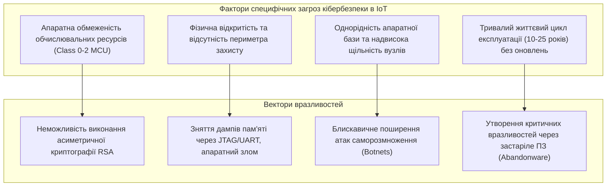
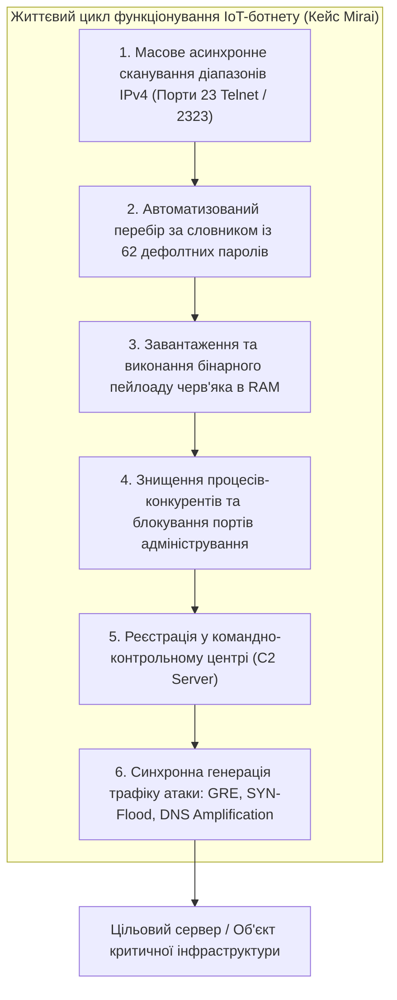
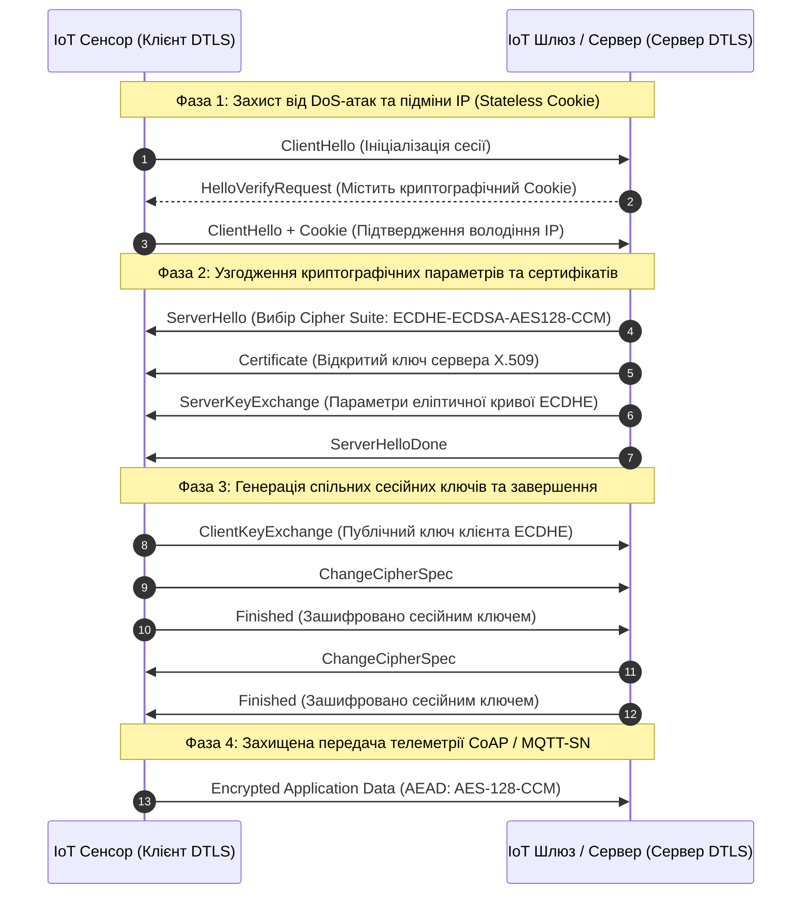

# Змістовий модуль 3. Інтеграція, Smart-системи та аналітика

# Тема 15. Кібербезпека в системах ІоТ. Вразливості та методи захисту

---

## 15.1. Унікальні проблеми безпеки пристроїв IoT

### Основний зміст та теоретичний базис

Стрімка інтеграція обчислювальних технологій у матеріальний світ зумовила виникнення принципово нових викликів у галузі інформаційної та функціональної безпеки. У класичних інформаційних системах захист будується навколо тріади конфіденційності, цілісності та доступності (**CIA**, Confidentiality, Integrity, Availability), де пріоритет зазвичай надається конфіденційності збережених даних. У просторі Інтернету речей та кіберфізичних систем на перший план виходять критерії фізичної безпеки (Safety), експлуатаційної надійності (Reliability) та безперервної доступності сервісів у реальному часі. Компрометація пристроїв IoT загрожує не лише втратою цифрової інформації, але й безпосереднім фізичним руйнуванням промислового обладнання, аваріями на об'єктах критичної інфраструктури та прямою загрозою життю і здоров'ю людей.

Унікальність проблем кібербезпеки в екосистемах Інтернету речей визначається чотирма фундаментальними факторами: апаратною обмеженістю кінцевих вузлів, фізичною доступністю пристроїв, безпрецедентною масштабованістю мереж та тривалим життєвим циклом експлуатації обладнання.

*Рисунок 1 — Причинно-наслідковий зв'язок між специфічними факторами IoT та векторами вразливостей*

Апаратна обмеженість мікроконтролерів класів Class 0 та Class 1 (за специфікацією RFC 7228) унеможливлює використання важких криптографічних протоколів. Класичні алгоритми асиметричного шифрування, такі як RSA з довжиною ключа $2048$ або $4096\text{ біт}$, вимагають виконання операцій модульного зведення до степеня над надвеликими числами, що виснажує доступний обсяг оперативної пам'яті (RAM) та спричиняє тривалі затримки процесора. 

Другим фактором є фізична незахищеність польових вузлів. Більшість сенсорів розміщуються у відкритих громадських місцях, на протяжних трубопроводах, сільськогосподарських угіддях або транспортних засобах без постійного нагляду. Зловмисник, отримавши прямий фізичний доступ до модуля, може підключити апаратний логічний аналізатор до інтерфейсів внутрішньосхемного налагодження (**JTAG**, **SWD** або **UART**), вилучити дамп енергонезалежної Flash-пам'яті, декомпілювати прошивку та викрасти статичні симетричні ключі шифрування чи облікові записи доступу до центрального брокера.

Третім фактором є висока структурна однорідність мереж Інтернету речей. Розгортання мільйонів ідентичних за апаратною архітектурою та прошивкою сенсорів багаторазово масштабує потенційну загрозу: виявлення єдиної програмної вразливості в одній моделі розумного лічильника чи IP-камери дозволяє автоматизованим скриптам скомпрометувати всю глобальну мережу за лічені години. Ситуація ускладнюється тим, що експлуатаційний цикл промислового обладнання становить від $10$ до $25$ років, протягом яких первинні виробники можуть припинити підтримку пристроїв, перетворюючи їх на постійно відкриті точки входу для кібератак (Abandonware).

Математичне моделювання енергетичних витрат мікроконтролера $E_{crypto}$ на виконання одного сеансу криптографічного перетворення описується інтегралом миттєвої потужності:

$$E_{crypto} = V_{dd} \cdot \int_{0}^{T_{calc}} I_{cpu}(t) \, dt \approx V_{dd} \cdot I_{active} \cdot \frac{N_{cycles}}{f_{cpu}}$$

де $V_{dd}$ позначає напругу живлення мікроконтролера, вимірювану у вольтах (В); $I_{active}$ є середнім струмом споживання обчислювального ядра в активному режимі (мА); $T_{calc}$ позначає час виконання криптографічної операції (с); $N_{cycles}$ визначає загальну кількість тактів центрального процесора, необхідних для виконання алгоритму; $f_{cpu}$ позначає тактову частоту мікроконтролера (Гц).

Для класичного алгоритму RSA-2048 кількість операцій множення зводить показник $N_{cycles}$ до десятків мільйонів тактів, тоді як криптографія на еліптичних кривих (**ECC**, Elliptic Curve Cryptography, наприклад крива `secp256r1` або `Curve25519`) зменшує кількість необхідних обчислювальних тактів на два порядки при еквівалентній криптостійкості:

$$\gamma = \frac{E_{RSA-2048}}{E_{ECDSA-256}} = \frac{N_{cycles}(RSA-2048)}{N_{cycles}(ECDSA-256)} \approx 15 \dots 30$$

де $\gamma$ є коефіцієнтом енергетичної переваги еліптичної криптографії, що доводить безальтернативність використання протоколів на базі ECC у бездротових сенсорних вузлах з автономним батарейним живленням.

| Критерій порівняння | Традиційні корпоративні IT-системи | Споживчий Інтернет речей (Consumer IoT) | Промисловий Інтернет речей (IIoT) |
| :--- | :--- | :--- | :--- |
| **Фізичний доступ до обладнання** | Обмежений, обладнання розміщене в закритих серверних шафах і ЦОД | Легкодоступне для користувачів та зловмисників у побуті | Повністю відкрите на протяжних об'єктах або необслуговуваних цехах |
| **Обчислювальні можливості захисту**| Потужні багатоядерні CPU, апаратні модулі TPM 2.0, необмежена RAM | Дешеві 8/32-бітні мікроконтролери з мінімальними ресурсами | Спеціалізовані захищені промислові контролери з обмеженою швидкістю |
| **Механізми оновлення прошивок** | Регулярні автоматизовані патчі безпеки операційних систем | Ручні або повністю відсутні механізми оновлення ПЗ | Суворо регламентовані, оновлення вимагає зупинки техпроцесу |
| **Пріоритет цілей безпеки** | Конфіденційність $\to$ Цілісність $\to$ Доступність (CIA) | Зручність користувача $\to$ Конфіденційність $\to$ Доступність | Фізична безпека (Safety) $\to$ Доступність $\to$ Цілісність |

Наведена таблиця наочно ілюструє глибоку розбіжність у підходах до забезпечення безпеки між традиційними IT-серверами та кінцевими пристроями Інтернету речей.

---

## 15.2. Типові атаки (DDoS, Botnets, MITM)

### Основний зміст та теоретичний базис

Вразливості в архітектурі пристроїв Інтернету речей створили передумови для реалізації масштабних класів кібератак, які класифікуються на пасивні та активні. Пасивні атаки спрямовані на несанкціоноване перехоплення конфіденційної інформації та аналіз структури мережевого трафіку без внесення змін у передавані кадри. Активні атаки передбачають безпосереднє втручання в роботу системи шляхом модифікації телеметрії, підміни команд управління, блокування каналів зв'язку або захоплення контролю над обчислювальними ресурсами вузлів.

Найбільш руйнівним феноменом у сфері кіберзагроз стало формування **ботнетів** (Botnets) на базі скомпрометованих IoT-пристроїв для подальшої генерації розподілених атак на відмову в обслуговуванні (**DDoS**, Distributed Denial of Service). 

*Рисунок 2 — Етапи розповсюдження шкідливого програмного забезпечення та генерації DDoS-атаки в мережах IoT*

Класичним прикладом масштабної кібератаки в історії Інтернету речей став ботнет **Mirai**, зафіксований у вересні 2016 року. Архітектура та послідовність дії хробака Mirai, наведена на рисунку 2, ґрунтувалася на експлуатації критичної недбалості виробників та користувачів обладнання:
1. Модуль сканування генерував випадкові IP-адреси адресного простору IPv4 і здійснював високошвидкісне зондування портів віддаленого адміністрування 23 (Telnet) та 2323.
2. При виявленні відкритого порту запускався алгоритм авторизації за вбудованим словником, що складався лише з 62 пар стандартних заводських логінів та паролів (таких як `root:xc3511`, `admin:admin`, `root:vizxv`), встановлених за замовчуванням на IP-камерах, цифрових відеореєстраторах (DVR) та домашніх маршрутизаторах.
3. Після успішного входу скрипт завантажував у пам'ять пристрою мікропрограму бота під відповідну процесорну архітектуру (ARM, MIPS, x86), закріплювався в оперативній пам'яті без запису на диск для ускладнення виявлення, завершував процеси інших конкуруючих вірусів і перекривав порти адміністрування.
4. Скомпрометований пристрій встановлював зв'язок із командно-контрольним центром (**C2 Server**, Command and Control Server) і за єдиною командою розпочинав синхронну генерацію паразитного трафіку.

Масштаб ботнету Mirai досяг сотень тисяч одночасно заражених пристроїв, що дозволило зловмисникам згенерувати безпрецедентні за потужністю потоки трафіку понад $665\text{ Гбіт/с}$ під час атаки на блог журналіста Брайана Кребса (*Krebs on Security*) та понад $1{,}2\text{ Тбіт/с}$ проти провайдера DNS-інфраструктури *Dyn*. Внаслідок цієї атаки на кілька годин було паралізовано доступ до десятків світових сервісів (включаючи GitHub, Twitter, Spotify та Netflix).

Динаміку епідемічного поширення саморозмножуваного шкідливого програмного забезпечення серед масиву вразливих IoT-пристроїв описує модифікована математична модель Кермака-МакКендріка (епідемічна модель SIR):

$$\frac{dI(t)}{dt} = \beta \cdot \frac{\Omega_{vuln} - I(t) - R(t)}{\Omega_{total}} \cdot I(t) \cdot \nu_{scan} - \mu_{reboot} \cdot I(t)$$

де $I(t)$ позначає кількість активних інфікованих пристроїв, що здійснюють паралельне сканування у момент часу $t$; $\Omega_{vuln}$ є загальною початковою кількістю пристроїв у глобальній мережі, які містять заводські вразливості або відкриті порти; $R(t)$ позначає кількість вилучених або ізольованих із мережі вузлів; $\Omega_{total} = 2^{32} \approx 4{,}29 \cdot 10^9$ є загальною кількістю адрес простору IPv4; $\beta$ позначає ймовірність успішного зламу пристрою при переборі пароля; $\nu_{scan}$ є швидкістю генерації запитів сканування одним зараженим вузлом (пакетів/с); $\mu_{reboot}$ позначає коефіцієнт очищення пристроїв шляхом перезавантаження живлення (оскільки Mirai не зберігався у Flash-пам'яті, перезапуск тимчасово видаляв вірус до наступного сканування).

Іншим небезпечним класом атак є атака «людина посередині» (**MITM**, Man-in-the-Middle). У бездротових сенсорних мережах за відсутності взаємної криптографічної автентифікації зловмисник може перехоплювати пакети, здійснювати підміну IP/MAC-адрес (ARP-spoofing) та транслювати сфальсифіковані показники датчиків до ядра автоматизації. 

У сенсорних топологіях 6LoWPAN та ZigBee активними загрозами є атака типу «бездонна воронка» (**Sinkhole Attack**), за якої скомпрометований вузол оголошує себе фіктивним найкоротшим маршрутом до координатора, притягуючи та знищуючи весь трафік підмережі, та «шаманська атака» (**Sybil Attack**), за якої один фізичний шкідливий вузол маскується під множину віртуальних пристроїв із різними ідентифікаторами для спотворення результатів розподіленого голосування та агрегації.

| Назва кібератаки | Вектор та рівень моделі OSI | Фізичний механізм реалізації загрози | Наслідки для системи IoT | Методи інженерного захисту |
| :--- | :--- | :--- | :--- | :--- |
| **DDoS (на базі Botnet)** | Мережевий / Прикладний (L3/L4/L7) | Масоване синхронне затоплення каналів зв'язку запитами (SYN/UDP/HTTP Flood) | Повна відмова в обслуговуванні серверів і шлюзів | Зміна дефолтних паролів, закриття портів Telnet, rate-limiting |
| **MITM (Людина посередині)**| Канальний / Мережевий (L2/L3) | Перехоплення та проксіювання трафіку через ARP/DNS-спуфінг | Перехоплення ключів, підміна керуючих команд | Взаємна автентифікація вузлів, шифрування сеансів TLS/DTLS |
| **Replay Attack (Атака повтором)**| Прикладний рівень (L7) | Запис валідного зашифрованого пакета та його повторна передача в ефір | Повторне несанкціоноване виконання команди (відкриття замка) | Додавання міток часу (Timestamps) та одноразових чисел (Nonce) |
| **Sinkhole Attack** | Мережевий рівень маршрутизації | Оголошення фіктивних метрик найкоротшого шляху в протоколі RPL | Повне перехоплення та скидання пакетів телеметрії суміжних вузлів | Специфікації захищеної маршрутизації, географічний контроль шляхів |
| **Sybil Attack** | Рівень ідентифікації та додатків | Генерація одним вузлом множини фейкових ідентифікаторів у мережі | Порушення розподіленого консенсусу, дискредитація рейтингу вузлів | Централізована криптографічна сертифікація ідентифікаторів |

Систематизація векторів атак доводить, що захист систем Інтернету речей вимагає комплексного підходу, який поєднує безпеку мережевих протоколів із надійною апаратною ізоляцією обчислювачів.

---

## 15.3. Апаратне та програмне забезпечення захисту (TLS/DTLS)

### Основний зміст та теоретичний базис

Побудова надійної системи захисту Інтернету речей вимагає реалізації концепції наскрізної безпеки (End-to-End Security), яка охоплює всі рівні кіберфізичної системи — від кристала напівпровідникового мікроконтролера до протоколів прикладного рівня. 

Основою захисту сучасного мікроконтролера (наприклад, ESP32 або процесорів архітектури ARM Cortex-M із технологією TrustZone) є **апаратний корінь довіри** (Hardware Root of Trust). Апаратний корінь довіри спирається на блоки одноразово програмованої пам'яті (**eFuse**), у які на етапі виробництва безповоротно записуються 256-бітні криптографічні ключі та конфігураційні біти захисту. 

На базі цих ключів функціонують дві ключові апаратні підсистеми:
- Безпечне завантаження (Secure Boot) гарантує, що під час подачі живлення внутрішній апаратний завантажувач ROM перевіряє цифровий підпис бінарного образу прошивки за алгоритмом ECDSA або RSA перед передачею управління коду, що унеможливлює запуск модифікованого або шкідливого ПЗ.
- Апаратне шифрування флеш-пам'яті (Flash Encryption) здійснює прозоре шифрування та дешифрування всього коду і даних, що передаються між зовнішньою мікросхемою SPI Flash та процесором, за алгоритмом AES-256 у режимі XTS, унеможливлюючи викрадення інтелектуальної власності шляхом прямого зчитування мікросхеми пам'яті програматором.
- Апаратні криптографічні прискорювачі (Hardware Cryptographic Accelerators) виконують ресурсомісткі операції симетричного блочного шифрування (AES-128/256), обчислення геш-функцій (SHA-256/512) та множення точок еліптичних кривих за одиниці мікросекунд без завантаження основного процесорного ядра.

*Рисунок 3 — Послідовність встановлення захищеного з'єднання за протоколом DTLS 1.2 з перевіркою Cookie*

На транспортному рівні стандартом безпеки для з'єднань на базі протоколу TCP є протокол захисту транспортного рівня **TLS** (Transport Layer Security, актуальна версія TLS 1.3). Проте для пристроїв Інтернету речей, що функціонують у бездротових мережах із втратами пакетів і використовують протокол UDP (наприклад, у зв'язці з протоколами CoAP або MQTT-SN), застосування TLS є неможливим через відсутність гарантій доставки та впорядкування пакетів на рівні UDP. 

Для захисту датаграмного трафіку розроблено протокол **DTLS** (Datagram Transport Layer Security, RFC 6347 / RFC 9147). Протокол DTLS повторює архітектуру та набори шифрів TLS, але вводить додаткові механізми для компенсації ненадійності транспорту UDP, представлені на діаграмі рисунка 3:
- Захист від атак підміни IP-адреси та ампліфікації відмови в обслуговуванні: сервер у відповідь на перше повідомлення `ClientHello` не виділяє пам'ять і не виконує важких криптографічних розрахунків, а повертає легковикове повідомлення `HelloVerifyRequest`, що містить згенерований stateless-cookie; клієнт зобов'язаний повторити запит із цим cookie, що підтверджує реальність його мережевої IP-адреси.
- Вбудований контроль повторної передачі та таймаутів: якщо фрагмент рукостискання втрачається в ефірі, внутрішній таймер DTLS ініціює повторну передачу пакета без розриву сесії.
- Захист від атак повторного відтворення (Anti-Replay Protection): кожна датаграма DTLS містить явний 48-бітний порядковий номер (Sequence Number), а приймач підтримує розсувне бітове вікно (Sliding Window) розміром 64 пакети, відкидаючи будь-які дубльовані кадри.

Для забезпечення конфіденційності та автентичності повідомлень у сучасних профілях безпеки IoT використовується виключно режим шифрування з автентифікацією додаткових даних (**AEAD**, Authenticated Encryption with Associated Data), зокрема алгоритми **AES-128-CCM** та **AES-128-GCM**.

Математична модель розрахунку накладних витрат мережевого протоколу (Protocol Overhead, $OH_{dtls}$) при захисті одного сеансу передачі корисного навантаження датчика описується виразом:

$$OH_{dtls} = \frac{S_{header} + S_{epoch\_seq} + S_{iv} + S_{tag}}{S_{payload} + S_{header} + S_{epoch\_seq} + S_{iv} + S_{tag}} \cdot 100\%$$

де $S_{payload}$ позначає розмір корисних даних датчика у байтах; $S_{header} = 13\text{ байтів}$ відповідає довжині статичного заголовка запису DTLS Record; $S_{epoch\_seq}$ позначає розмір полів епохи та номера послідовності; $S_{iv}$ є розміром вектора ініціалізації (Initialization Vector / Nonce, зазвичай $8\text{ байтів}$); $S_{tag}$ позначає розмір автентифікаційного тегу цілісності (Authentication Tag, $8$ або $16\text{ байтів}$).

Якщо сенсор передає коротке повідомлення температури обсягом $S_{payload} = 10\text{ байтів}$, сумарні накладні витрати заголовків DTLS становлять $29\text{ байтів}$, що призводить до накладних витрат $OH_{dtls} \approx 74{,}3\%$. Це вимагає від розробників агрегувати вимірювання в більші пакети або застосовувати механізми стиснення заголовків 6LoWPAN/CoAP.

Сумарна затримка встановлення захищеної сесії $\tau_{handshake}$ визначається часом проходження пакетів у мережі та тривалістю обчислень асиметричної криптографії:

$$\tau_{handshake} = 2 \cdot RTT + \frac{\sum S_{handshake\_frames}}{R_{bit}} + \tau_{verify}(ECDSA) + \tau_{gen}(ECDH)$$

де $RTT$ позначає час кругового обігу пакета в радіомережі (Round-Trip Time, с); $R_{bit}$ є фізичною швидкістю каналу зв'язку (біт/с); $\tau_{verify}(ECDSA)$ відповідає часу верифікації сертифіката X.509 сервера на мікроконтролері; $\tau_{gen}(ECDH)$ позначає час генерації спільного секрету за протоколом Діффі-Геллмана на еліптичних кривих. Завдяки наявності апаратного прискорювача сума $\tau_{verify} + \tau_{gen}$ на контролері ESP32 зменшується з $1200\text{ мс}$ до менш ніж $40\text{ мс}$, що робить захищений зв'язок практично реалізованим в автономних пристроях.

| Протокол безпеки | Транспортний протокол | Накладні витрати заголовка на пакет | Механізм стійкості до втрати пакетів | Стійкість до Replay-атак | Вимоги до оперативної пам'яті (RAM) |
| :--- | :--- | :--- | :--- | :--- | :--- |
| **TLS 1.3** | TCP | $5 \dots 16\text{ байтів}$ | Забезпечується транспортом TCP | Вбудована через порядкові номери TCP | Високі ($30 \dots 80\text{ Кбайт}$) |
| **DTLS 1.2 / 1.3** | UDP | $13 \dots 29\text{ байтів}$ | Власний таймер повторної передачі кадру | Ковзне вікно номерів (Sliding Window) | Середні ($15 \dots 40\text{ Кбайт}$) |
| **Noise Protocol** | UDP / Послідовний порт | $8 \dots 16\text{ байтів}$ | Реалізується на рівні програми | Контроль міток часу та одноразових кодів | Низькі ($5 \dots 15\text{ Кбайт}$, ESPHome) |
| **OSCORE (RFC 8613)** | Прикладний рівень (CoAP) | $5 \dots 12\text{ байтів}$ | Не залежить від транспорту (End-to-End) | Вбудований механізм на базі COSE | Мінімальні ($2 \dots 8\text{ Кбайт}$) |

Аналіз даних таблиці підтверджує, що для розподілених гетерогенних систем Інтернету речей вибір стандарту безпеки визначається мережевим транспортом: протокол TLS є стандартом для клієнт-серверних сесій поверх TCP, протокол DTLS забезпечує комплексний захист датаграмних каналів зв'язку, а фреймворки класу Noise Protocol та OSCORE надають найбільш компактні рішення для вбудованих мікроконтролерів із критичними обмеженнями пам'яті.

---

### Питання для самоперевірки та аналітичного осмислення

1. Розкрийте фундаментальні відмінності у пріоритетах безпеки між традиційними корпоративними IT-системами та промисловими кіберфізичними системами IIoT. Чому концепція фізичної безпеки (Safety) домінує над конфіденційністю?
2. На основі математичної моделі енергоспоживання $E_{crypto}$ поясніть, чому криптографія на базі еліптичних кривих (ECC) повністю витіснила алгоритми сімейства RSA в автономних пристроях Інтернету речей.
3. Проаналізуйте анатомію та життєвий цикл розповсюдження ботнету Mirai. Які вразливості архітектури та конфігурації пристроїв дозволили сформувати безпрецедентний за потужністю потік DDoS-атаки?
4. Опишіть фізичну сутність та небезпеку атак типу «бездонна воронка» (Sinkhole) та «шаманська атака» (Sybil) у бездротових сенсорних мережах стандарту IEEE 802.15.4 / 6LoWPAN.
5. Що таке апаратний корінь довіри (Hardware Root of Trust) у мікроконтролерах класу ESP32, і яким чином механізми Secure Boot та Flash Encryption захищають пристрій від апаратного зламу?
6. Поясніть принципову різницю між протоколами TLS та DTLS. Яким чином протокол DTLS розв'язує проблему захисту від DoS-атак за допомогою механізму Stateless Cookie та компенсує ненадійність транспорту UDP?
7. На основі математичної моделі $OH_{dtls}$ проаналізуйте проблему високих накладних витрат криптографічних заголовків при трансляції дрібних пакетів сенсорної телеметрії та запропонуйте інженерні методи оптимізації трафіку.