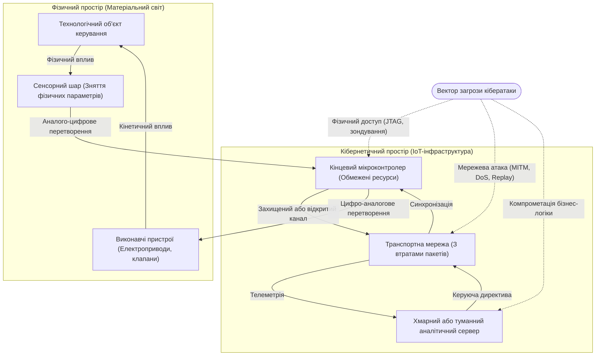
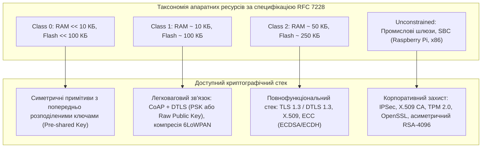
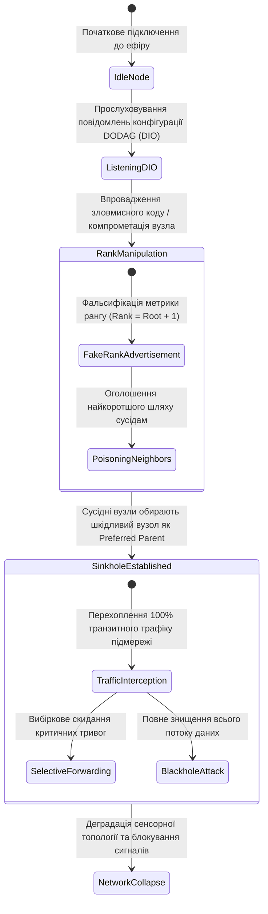
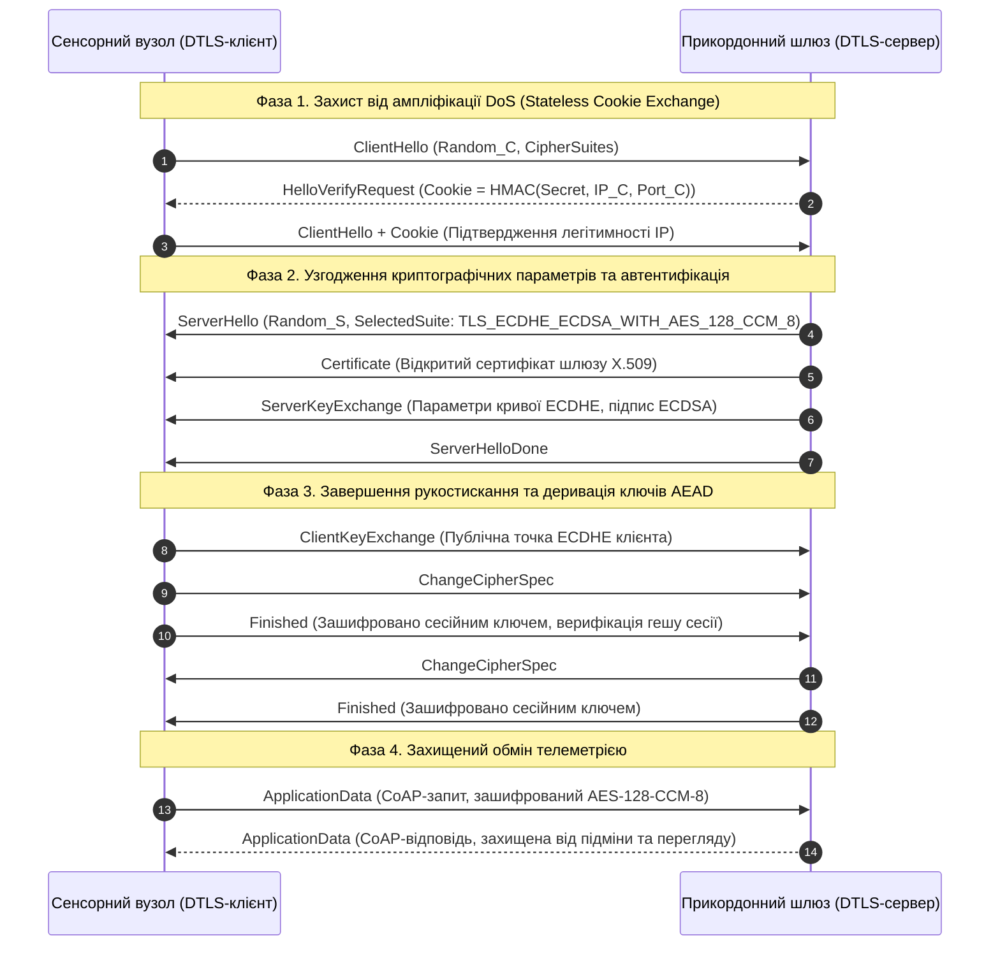
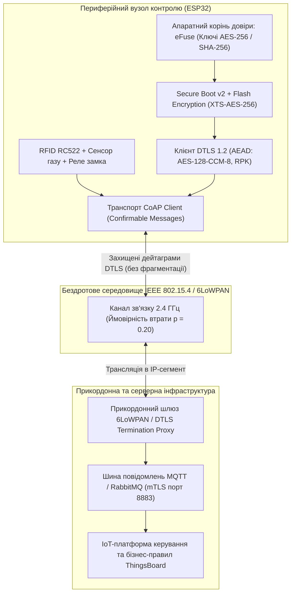

# Тема 15. Кібербезпека в системах ІоТ. Вразливості та методи захисту

## Мета лекції

Формування у майбутніх інженерів комплексної системи знань щодо архітектурних принципів кібербезпеки в розподілених мережах Інтернету речей, специфіки загроз для апаратно обмежених кінцевих вузлів і кіберфізичних систем, а також набуття практичних навичок проектування багаторівневих систем захисту на основі сучасних криптографічних протоколів, механізмів апаратної довіри та алгоритмів протидії мережевим атакам для забезпечення стійкості критичної інфраструктури та промислових об'єктів.

## Очікувані результати навчання

1. **Знання та розуміння.** Здобувачі вищої освіти засвоять фундаментальні принципи моделі безпеки CIA стосовно кіберфізичних систем, сутність апаратного кореня довіри та специфікації захищених мережевих протоколів передачі даних.
2. **Застосування.** Студенти оволодіють практичними навичками конфігурування засобів апаратного шифрування, налаштування захищеного транспорту TLS та DTLS для стеків протоколів CoAP і MQTT, а також впровадження криптографічних прискорювачів на базі сучасних мікроконтролерів.
3. **Аналіз.** Слухачі зможуть всебічно досліджувати вектори мережевих атак у розподілених гетерогенних середовищах, диференціювати специфічні вразливості протоколів 6LoWPAN, ZigBee і RPL та розраховувати накладні витрати криптографічного опрацювання даних у пристроях з автономним живленням.
4. **Оцінювання та синтез.** Фахівці набудуть здатності критично оцінювати компроміс між енергоефективністю, обчислювальною швидкодією та рівнем криптографічного захисту кінцевих вузлів, а також синтезувати стійкі багаторівневі політики безпеки для інтелектуальних систем автоматизації будівель і промислових підприємств.

---

## Детальний покроковий план лекції

### 1. Теоретико-концептуальний базис. Специфіка кібербезпеки та вектори загроз в архітектурі Інтернету речей

* 1.1. Специфічні чинники та парадигма безпеки кіберфізичних систем на відміну від класичних IT-інфраструктур
* 1.2. Класифікація апаратних ресурсів кінцевих вузлів та обмеження криптографічних методів за стандартом RFC 7228
* 1.3. Таксономія вразливостей сенсорних мереж та топологій 6LoWPAN, IEEE 802.15.4 і ZigBee
* 1.4. Моделі та механізми реалізації мережевих загроз класу DDoS, ботнетів та атак типу перехоплення трафіку

### 2. Методологія та аналіз граничних умов. Програмно-апаратні технології криптографічного захисту та їх обмеження

* 2.1. Архітектура апаратного кореня довіри мікроконтролерів, механізми безпечного завантаження Secure Boot та шифрування пам'яті Flash Encryption
* 2.2. Застосування асиметричної криптографії на еліптичних кривих для генерації та розподілу ключів у бездротових вузлах
* 2.3. Протоколи захисту транспортного рівня TLS і DTLS та особливості використання автентифікованого шифрування AEAD
* 2.4. Системи взаємної автентифікації клієнтів і серверів на прикладному рівні у протоколах MQTT, CoAP та сервісах RESTful
* 2.5. Критичні бар'єри енергоспоживання, обчислювальної затримки та надлишкового мережевого трафіку при застосуванні криптографічних заголовків у польових сенсорах

### 3. Практичний індустріальний / фаховий кейс. Комплексний інженерний захист IoT-інфраструктури

**Тема наскрізної задачі.** «Проектування системи наскрізної кібербезпеки для розподіленої мережі контролю доступу та телеметрії промислового об'єкта на базі мікроконтролерів ESP32, протоколу DTLS та хмарної платформи управління»

## 1. Теоретико-концептуальний базис. Специфіка кібербезпеки та вектори загроз в архітектурі Інтернету речей

### 1.1. Специфічні чинники та парадигма безпеки кіберфізичних систем на відміну від класичних IT-інфраструктур

Фундаментальна відмінність парадигми безпеки в системах Інтернету речей та кіберфізичних системах (**CPS**, Cyber-Physical Systems) порівняно з класичними корпоративними інформаційними технологіями полягає у зміні базових пріоритетів цільових критеріїв захисту. Якщо в традиційному комп'ютерному сегменті домінує класична тріада **CIA** (Confidentiality, Integrity, Availability), де конфіденційність зазвичай виступає першочерговою вимогою, то в інженерії кіберфізичних комплексів ієрархія трансформується у концепцію **SRIC** (Safety, Reliability, Integrity, Confidentiality), де абсолютний пріоритет надається фізичній безпеці (Safety) та експлуатаційній надійності (Reliability). Компрометація сервера баз даних тягне за собою фінансові та юридичні збитки внаслідок витоку інформації, тоді як компрометація мікроконтролера в системі управління хімічним реактором, автономним транспортним засобом або медичним інфузійним насосом призводить до катастрофічних матеріальних руйнувань та прямої загрози життю людей.

Фізична безпека кіберфізичного пристрою безпосередньо пов'язана зі зворотним зв'язком між обчислювальним компонентом і матеріальним середовищем. Пристрій IoT збирає первинні параметри через сенсори, опрацьовує їх за допомогою алгоритмів керування та формує керуючий вплив на актуатори (електродвигуни, реле, соленоїдні клапани). У класичних інформаційних мережах помилка або затримка доставки пакета спричиняє лише повторну передачу кадру за протоколом TCP. У контурі ж реального часу надмірна латентність або підміна цифрової команди перетворює стабільну динамічну систему на критично нестійку.

Формалізація ризику функціонування кіберфізичного вузла в умовах зовнішнього деструктивного впливу здійснюється через функцію сукупного очікуваного збитку, що враховує ймовірність дестабілізації керованого процесу в часі:

$$R_{\text{CPS}}(t) = P_{\text{breach}}(t) \cdot \int_{t}^{t + \Delta t_{\text{crit}}} C_{\text{kinetic}}(\tau) \cdot \left[1 - \Phi\left(\frac{T_{\text{react}} - \tau}{\sigma_{\tau}}\right)\right] d\tau$$

де $P_{\text{breach}}(t)$ позначає ймовірність подолання периметра захисту вузла зловмисником у момент часу $t$; $\Delta t_{\text{crit}}$ є критичним інтервалом часу, після закінчення якого фізичні параметри об'єкта виходять за межі технологічної безпеки; $C_{\text{kinetic}}(\tau)$ відображає функцію матеріального збитку від неконтрольованого фізичного впливу актуатора; $T_{\text{react}}$ позначає максимально допустимий час реакції системи протиаварійного захисту на відхилення показників; $\Phi(x)$ є інтегральною функцією ймовірності нормального розподілу, що описує детермінованість часу спрацьовування апаратних вимикачів із середньоквадратичним відхиленням затримки $\sigma_{\tau}$.

Наведена схема демонструє замкнутий контур взаємодії між кібернетичним та фізичним просторами, відображаючи принципову різницю вразливостей: перехоплення керування на рівні мікроконтролера викликає негайну фізичну зміну стану технологічного об'єкта.

Критичним фактором виступає також середовище розміщення обладнання. Більшість пристроїв IoT інсталюються за межами контрольованого фізичного периметра: на лініях електропередач, вуличних магістралях міської інфраструктури, сільськогосподарських угіддях, у житлових приміщеннях або на рухомих транспортних засобах. За таких умов повністю нівелюється базова передумова традиційної інформаційної безпеки про фізичну недосяжність обчислювального вузла для потенційного зловмисника. Фізичний контакт із пристроєм відкриває вектори атак через низькорівневі інтерфейси налагодження, аналіз енергоспоживання (Side-Channel Attacks) та безпосереднє зчитування мікросхем незалежної пам'яті.

> **ПРАКТИЧНИЙ ЯКІР:** У грудні 2015 року деструктивна кібератака на енергетичні компанії України призвела до аварійного відключення 30 підстанцій та знеструмлення понад 200 тисяч споживачів. Атака продемонструвала уразливість кіберфізичного контуру: скомпрометувавши шлюзи зв'язку та мікроконтролери польових пристроїв за протоколами МЕК 60870-5-104, зловмисники дистанційно розімкнули високовольтні вимикачі та перезаписали прошивки перетворювачів інтерфейсів шкідливим кодом, заблокувавши можливість оперативного телекерування.

---

### 1.2. Класифікація апаратних ресурсів кінцевих вузлів та обмеження криптографічних методів за стандартом RFC 7228

Розгортання повноцінних систем криптографічного захисту на кінцевих пристроях IoT стикається з жорсткими апаратними бар'єрами, детально формалізованими інженерною групою Інтернету (**IETF**, Internet Engineering Task Force) у специфікації **RFC 7228**. Стандарт запроваджує чітку таксономію пристроїв з обмеженими ресурсами (Constrained Devices), розділяючи їх на три основні класи на основі обсягів оперативної статичної пам'яті (**SRAM**) та енергонезалежної пам'яті для зберігання коду програми (**Flash**).

Клас **Class 0** охоплює прилади з пам'яттю даних $<< 10\text{ Кбайт}$ та пам'яттю програм $<< 100\text{ Кбайт}$. Такі вузли, як правило, будуються на базі ультрадешевих 8-бітних або 16-бітних мікроконтролерів і позбавлені можливості прямого безпечного підключення до публічної мережі Інтернет. Вони не здатні підтримувати навіть спрощений стек протоколів безпеки, через що взаємодіють виключно через локальні захищені проксі-шлюзи за посередництва спеціалізованих низькорівневих інтерфейсів.

Клас **Class 1** відповідає мікроконтролерам із параметрами $RAM \approx 10\text{ Кбайт}$ та $Flash \approx 100\text{ Кбайт}$. На цих пристроях практично неможливо розгорнути традиційний стек протоколів на базі зв'язки **HTTP/TLS/TCP** без критичного вичерпання апаратної пам'яті, необхідної для функціонування прикладного програмного забезпечення. Вони спеціально оптимізовані під роботу з легковагими стеками, зокрема **CoAP** поверх **UDP** із використанням спрощених криптографічних профілів.

Клас **Class 2** об'єднує процесори з обсягами $RAM \approx 50\text{ Кбайт}$ та $Flash \approx 250\text{ Кбайт}$ і вище (до цього класу умовно відносять мікроконтролери сімейства ESP32, STM32F4, ARM Cortex-M3/M4). Дані платформи вже спроможні виконувати оптимізовані повнофункціональні стеки TCP/IP із підтримкою сучасних бібліотек безпеки, проте тривалість їхньої роботи суттєво лімітується наявним запасом електричної енергії.

Головним бар'єром впровадження симетричних та асиметричних шифрів у класах Class 0–Class 1 є експоненційне зростання енергетичних витрат на обчислення. Енергія $E_{\text{crypto}}$, яка витрачається мікроконтролером на виконання одного криптографічного перетворення (генерація підпису, узгодження сесійного ключа), безпосередньо впливає на тривалість автономного функціонування вузла від хімічного джерела живлення:

$$E_{\text{crypto}} = V_{\text{supply}} \cdot \int_{0}^{T_{\text{calc}}} I_{\text{active}}(t) \, dt \approx V_{\text{supply}} \cdot I_{\text{active}} \cdot \frac{N_{\text{cycles}}}{f_{\text{cpu}}}$$

де $V_{\text{supply}}$ позначає напругу живлення мікроконтролера у вольтах; $I_{\text{active}}$ є середнім струмом, споживаним ядром під час обчислень в активному режимі (А); $T_{\text{calc}}$ позначає фізичний час виконання криптографічної операції (с); $N_{\text{cycles}}$ є кількістю машинних тактів центрального процесора, необхідних для повної реалізації математичного алгоритму; $f_{\text{cpu}}$ позначає робочу тактову частоту процесора (Гц).

Якщо класичний алгоритм асиметричного цифрового підпису **RSA-2048** вимагає порядка $N_{\text{cycles}} \approx 10^7 \dots 10^8$ машинних тактів на 32-бітному ядрі без апаратних прискорювачів (що знеструмлює малопотужне літієве джерело типу CR2032 за кількасот ітерацій), то криптографія на еліптичних кривих (**ECC**, Elliptic Curve Cryptography) за стандартом **ECDSA** (криві NIST P-256 чи Curve25519) скорочує необхідні цикли обчислення до рівня $N_{\text{cycles}} \approx 10^5 \dots 10^6$ тактів при забезпеченні еквівалентної стійкості до зламу. Таким чином, коефіцієнт енергетичної ефективності $\eta_{\text{crypto}} = \frac{E_{\text{RSA}}}{E_{\text{ECC}}}$ становить від $15$ до $30$, що однозначно зумовлює відмову від RSA на користь алгоритмів еліптичної криптографії у польових бездротових сенсорах.

> **ТИПОВА ПОМИЛКА:** Намагання перенести стандартну бібліотеку OpenSSL або використати сертифікати відкритого ключа RSA довжиною 4096 біт на мікроконтролери класів Class 0 та Class 1. Це призводить до переповнення статичного пулу пам'яті (Stack/Heap Overflow), виникнення непрогнозованих перезавантажень ядра через спрацьовування апаратного сторожового таймера (Watchdog Timer) під час тривалих математичних обчислень та повного колапсу енергетичного бюджету автономної батареї.

---

### 1.3. Таксономія вразливостей сенсорних мереж та топологій 6LoWPAN, IEEE 802.15.4 і ZigBee

Бездротові сенсорні мережі (**WSN**, Wireless Sensor Networks), побудовані на стандартах **IEEE 802.15.4**, **ZigBee** та адаптаційному рівні **6LoWPAN**, характеризуються значною вразливістю до топологічних деструктивних впливів. Це зумовлено функціонуванням у відкритому радіоефірі (переважно неліцензований діапазон $2{,}4\text{ ГГц}$ або субгігагерцові смуги $868/915\text{ МГц}$) та необхідністю багатокрокової ретрансляції пакетів (Mesh-маршрутизації).

На фізичному та канальному рівнях специфікація **IEEE 802.15.4** використовує технологію розширення спектра прямою послідовністю (**DSSS**, Direct Sequence Spread Spectrum) із модуляцією OQPSK. Максимальний розмір фізичного блоку протокольних даних (**PSDU**, Physical Layer Service Data Unit) становить лише $127\text{ байтів}$. З них накладні витрати заголовків канального рівня (**MAC**) та поля контролю автентичності займають до $25 \dots 35\text{ байтів}$. 

Хоча рівень MAC підтримує симетричне шифрування **AES-128** у режимі зчеплення блоків із контролем автентичності повідомлень (**CCM**), стандарт має істотні слабкі місця:
1. Захист кадрів квитування (**ACK**) найчастіше відсутній або вимикається для збереження канального часу, що дозволяє зловмиснику генерувати фальшиві підтвердження прийому та провокувати втрату пакетів абонентом.
2. Процедура підключення пристроїв часто ґрунтується на спільному заводському ключі мережі (**Default Network Key**), перехоплення якого у радіоефірі відкриває доступ до внутрішнього дешифрування всього трафіку.
3. Механізм доступу до середовища **CSMA/CA** вразливий до навмисного радіоглушіння: постійна генерація сигналу завади змушує легітимні станції нескінченно відкладати передачу кадрів через алгоритм випадкової експоненційної затримки (Backoff Algorithm).

На рівні адаптації **6LoWPAN** ключові загрози концентруються навколо механізмів фрагментації та стиснення заголовків IPv6 (RFC 6282). Оскільки мінімальний розмір максимального блоку передачі (**MTU**, Maximum Transmission Unit) для протоколу IPv6 нормативно становить $1280\text{ байтів}$, а фізичний кадр обмежений $127\text{ байтами}$, адаптаційний рівень розбиває єдину датаграму на ланцюжок фрагментів. Вразливість фрагментації полягає у відсутності індивідуальної криптографічної перевірки проміжних фрагментів: атакуючий може інжектувати один сфальсифікований фрагмент із правильним полем `Datagram_Tag`, що призводить до відкидання всього вихідного 1280-байтного пакета приймаючим шлюзом після спроби збирання, спричиняючи виснаження буферної пам'яті роутера (Fragment Exhaustion Attack).

Найбільш критичними для життєздатності комірчастих топологій є атаки на протокол маршрутизації для мереж з низьким енергоспоживанням і втратами (**RPL**, Routing Protocol for Low-Power and Lossy Networks, RFC 6550). Протокол формує деревоподібну топологію у вигляді орієнтованого ациклічного графа з адресацією до кореневого вузла (**DODAG**, Destination-Oriented Directed Acyclic Graph).

Представлений життєвий цикл топологічної атаки показує, як мінімальна зміна числового параметра рангу призводить до повного перехоплення або руйнування потоків даних цілого сегмента мережі. Відповідно до специфікації RPL, вузол обирає свого основного батьківського предка (**Preferred Parent**) на основі скалярного значення рангу $R(u)$, що відображає відносну відстань до кореневого шлюзу:

$$R(u) = R(p) + \text{RankIncrease}$$

де $R(p)$ позначає ранг обраного батьківського вузла, а величина $\text{RankIncrease}$ обчислюється на базі цільової функції (**Objective Function**, наприклад OF0 або MRHOF) з урахуванням якості радіоканалу (метрика очікуваної кількості передач ETX). Якщо скомпрометований вузол оголошує в службовому керуючому пакеті **DIO** (DODAG Information Object) неправдиво занижене значення рангу $R_{\text{fake}} \approx R_{\text{root}} + 1$, навколишні легітимні сенсори сприймають його як найбільш енергетично вигідний шлях і переключають свої таблиці комутації на нього.

Внаслідок реалізації цієї вразливості розгортаються класичні атаки маршрутизації:
1. Атака «бездонна воронка» (**Sinkhole Attack**), за якої вузол притягує до себе весь трафік підмережі, створюючи єдину нелегітимну точку агрегації.
2. Вибіркова ретрансляція (**Selective Forwarding**), коли шкідливий вузол коректно пропускає стандартні службові пакети маршрутизації (підтримуючи ілюзію працездатності), але блокує або підміняє кадри з аварійними сигналами технологічного процесу.
3. Атака «чорна діра» (**Blackhole Attack**), що передбачає безповоротне знищення $100\%$ транзитного трафіку, утворюючи мертву зону моніторингу в заданому фізичному секторі.
4. Червоточина (**Wormhole Attack**), яка реалізується парою зловмисних вузлів, з'єднаних швидкісним позаефірним тунелем (провідним каналом чи радіоканалом на іншій частоті): пакети захоплюються в одній частині мережі, миттєво ретранслюються в іншу та вкидаються в ефір, руйнуючи природну просторову метрику протоколу маршрутизації.

> **ПРАКТИЧНИЙ ЯКІР:** У відомому дослідженні безпеки платформи Philips Hue експерти продемонстрували експлуатацію вразливості стека ZigBee Light Link (ZLL). Використавши помилку в реалізації механізму захисту від переповнення буфера під час передачі пакетів безконтактного зв'язування (Touchlink Commissioning), дослідники за допомогою безпілотного літального апарата, оснащеного радіопередавачем, зламували та перепрошивали розумні лампи з відстані до 350 метрів. Заражені лампи автономно транслювали шкідливе оновлення на сусідні світильники через мережу ZigBee Mesh, що дозволило спровокувати лавиноподібне відключення освітлення в масштабах усього міського офісного кварталу.

---

### 1.4. Моделі та механізми реалізації мережевих загроз класу DDoS, ботнетів та атак типу перехоплення трафіку

Найбільш руйнівним наслідком компрометації масових пристроїв споживчого та промислового сегментів IoT є їхнє об'єднання у розподілені зомбі-мережі — **ботнети** (Botnets). Захоплені вузли надалі використовуються кіберзлочинцями як обчислювальний інструмент для генерації атак на відмову в обслуговуванні (**DDoS**, Distributed Denial of Service) катастрофічної потужності, спрямованих на сервери доменних імен (DNS), магістральні маршрутизатори та хмарні центри обробки даних.

Механізм функціонування ботнетів у середовищі Інтернету речей (яскравими представниками яких є сімейства шкідливого програмного забезпечення **Mirai**, **Bashlite**, **Hajime** та **Mozi**) експлуатує специфічні вразливості життєвого циклу кінцевого обладнання: використання незмінних стандартних облікових записів доступу, збереження застарілих протоколів незахищеного термінального доступу (Telnet, TR-069) та відсутність фільтрації вихідного мережевого трафіку.

Динаміку фазового переходу популяції IoT-пристроїв зі стану вразливих до стану активно заражених вузлів-атакувальників описує детермінована система диференціальних рівнянь поширення комп'ютерної інфекції з урахуванням специфіки випадкового сканування мережі:

$$\frac{dI(t)}{dt} = \kappa \cdot \left[ N_{\text{vuln}} - I(t) - R(t) \right] \cdot I(t) \cdot \frac{\omega_{\text{scan}}}{2^{32}} - \gamma_{\text{reboot}} \cdot I(t)$$

де $I(t)$ позначає число скомпрометованих пристроїв, які у момент часу $t$ знаходяться під контролем командного сервера та здійснюють координовані дії; $N_{\text{vuln}}$ є загальним обсягом адресного простору доступних пристроїв, що містять дану апаратну або програмну вразливість; $R(t)$ позначає кількість пристроїв, виведених з ладу або фізично ізольованих операторами мережі; $\omega_{\text{scan}}$ визначає середню інтенсивність генерації запитів випадкового мережевого сканування одним зараженим пристроєм (пакетів/с); $2^{32}$ відповідає розміру глобального простору адрес протоколу IPv4; $\kappa$ позначає коефіцієнт ймовірності успішної компрометації вузла за умови виявлення відкритого порта адміністрування; $\gamma_{\text{reboot}}$ є темпом вилучення інфекції через апаратне перезавантаження пристрою (оскільки більшість IoT-хробаків розміщуються виключно в оперативній пам'яті `/tmp` і знищуються при скиданні живлення).

Нелінійне наростання правої частини рівняння обумовлює вибуховий, лавиноподібний характер формування армії ботів: кожні нові заражені десять тисяч камер відеоспостереження подвоюють сумарну швидкість сканування глобальної мережі, скорочуючи період виявлення решти вразливих пристроїв до кількох хвилин.

| Вектор атаки | Рівень за моделлю OSI | Специфічний механізм реалізації | Цільовий об'єкт уразливості | Приклад з реальної практики |
| :--- | :--- | :--- | :--- | :--- |
| **Telnet/SSH Brute Force** | Прикладний (L7) | Асинхронне сканування адресного простору з перебором словника фабричних облікових записів | Вбудовані Linux-системи, маршрутизатори, цифрові відеореєстратори | Поширення ботнету Mirai, що вивів з ладу DNS-провайдера Dyn у 2016 році |
| **SYN Flood / UDP Amplification** | Транспортний (L4) | Відправка фальсифікованих датаграм із підміною IP на відбивачі NTP, DNS або CoAP | Центральні шлюзи, корпоративні балансувальники навантаження | Атака на французького хостинг-провайдера OVH потужністю понад $1\text{ Тбіт/с}$ |
| **Rank Poisoning (RPL)** | Мережевий (L3) | Модифікація службових полів рангу та версії у контрольних повідомленнях DIO | Бездротові деревоподібні та комірчасті мережі 6LoWPAN | Компрометація систем обліку споживання електроенергії Smart Metering |
| **Fragmentation Attack** | Адаптаційний (L2.5) | Інжекція дубльованих або деформованих фрагментів у пакетний потік 6LoWPAN | Буферна пам'ять прикордонних маршрутизаторів (Edge Routers) | Штучне виснаження RAM шлюзів промислових польових мереж |
| **Eavesdropping & Traffic Analysis** | Фізичний / Канальний (L1/L2) | Несанкціонований пасивний перехоплення радіоефіру та аналіз патернів сплесків активності | Сенсори передачі технологічних даних, охоронна телеметрія | Відстеження переміщення персоналу в зоні дії незахищених міток BLE-Beacon |

Паралельно з атаками виснаження смуги пропускання особливу небезпеку становлять атаки класу «людина посередині» (**MITM**, Man-in-the-Middle). У слабкозахищених мережах при відсутності взаємної криптографічної автентифікації вузлів зловмисник здійснює підміну мережевих адрес на канальному (ARP-spoofing) або мережевому рівні (Rogue Router Advertisement). Це дозволяє не лише прослуховувати конфіденційні дані вимірювань, але й реалізовувати атаки повторного відтворення (**Replay Attack**). Оскільки прості датчики часто надсилають статичні команди без включення лічильників послідовності або криптографічних міток часу, атакуючий записує зашифрований або відкритий пакет активації реле і транслює його повторно, що призводить до несанкціонованого відкриття електронного замка дверей чи скидання аварійного клапана без знання внутрішнього ключа шифрування.

> **КОНТРОЛЬНЕ ПИТАННЯ:** Чому використання традиційного механізму відстеження сесій на базі протоколу TCP з перевіркою порядкових номерів (Sequence Numbers) не захищає бездротові сенсорні мережі IoT від атак повторного відтворення (Replay Attacks) на рівні прикладних даних?

Розгорнути аналіз / відповідь

**Правильний варіант: Апаратна відсутність синхронізованих наскрізних станів з'єднання на кінцевих сенсорних вузлах та переважання дейтаграмних транзитивних протоколів.**

1. Більшість сенсорних вузлів у мережах 6LoWPAN та WSN функціонують із використанням транспорту без встановлення з'єднання (UDP), де концепція порядкових номерів кадру TCP відсутня на транспортному рівні. Навіть у випадках, коли транзитний шлюз взаємодіє із сервером за протоколом TCP, ділянка зв'язку між сенсором і шлюзом транслює автономні дейтаграми (CoAP або чисті кадри IEEE 802.15.4). Якщо на рівні самого прикладного повідомлення не реалізовано криптографічний вектор ініціалізації (IV), зростаючий лічильник транзакцій (Sequence Counter) або часову мітку (Timestamp), завірену автентифікованим шифруванням (AEAD), повторний вкид раніше перехопленого пакету в радіоефір сприймається кінцевим мікроконтролером як повністю легітимна дія.

2. Аналіз дистракторів:
- Припущення про те, що алгоритм контрольної суми CRC кадру здатний виявити атаку повтору, є принципово хибним, оскільки CRC контролює лише випадкові фізичні спотворення бітів у каналі: при повторній передачі збереженого кадру контрольна сума залишається абсолютно валідною.
- Твердження про достатність шифрування AES без автентифікації також хибне: шифрування забезпечує лише конфіденційність, проте зашифроване повідомлення, передане вдруге без перевірки свіжості (freshness), буде успішно розшифроване приймачем і виконане повторно.

---

### Вказівки для самостійного осмислення

1. Здійсніть порівняльний розрахунок сумарних витрат машинних тактів процесора та обсягу використовуваної динамічної пам'яті для алгоритмів RSA-2048 та ECDSA (крива secp256r1) на базі технічної документації мікроконтролера архітектури ARM Cortex-M4 з фіксованою тактовою частотою $80\text{ МГц}$.
2. Складіть аналітичну блок-схему послідовності виявлення та нейтралізації атаки типу Sinkhole у польовій сенсорній мережі промислового стандарту RPL на рівні прикордонного маршрутизатора (Edge Router).
3. Проаналізуйте вектори компрометації каналу зв'язку бездротового інтерфейсу Bluetooth Low Energy при використанні моделі асоціації JustWorks та обґрунтуйте необхідні модифікації для досягнення стійкості проти активної атаки класу Man-in-the-Middle.

## 2. Методологія та аналіз граничних умов. Програмно-апаратні технології криптографічного захисту та їх обмеження

### 2.1. Архітектура апаратного кореня довіри мікроконтролерів, механізми безпечного завантаження Secure Boot та шифрування пам'яті Flash Encryption

Побудова гарантовано захищеної системи на базі апаратно обмеженого мікроконтролера неможлива виключно програмними засобами, оскільки будь-який програмний код, що виконується в оперативній пам'яті, може бути модифікований за наявності вразливостей нульового дня або через фізичне втручання. Фундаментом сучасної інженерії кібербезпеки вбудованих систем є **апаратний корінь довіри** (Hardware Root of Trust, RoT). Ця концепція передбачає наявність незмінного первинного обчислювального вузла, поведінка якого апріорі вважається цілком надійною та захищеною від будь-яких зовнішніх маніпуляцій. У сучасних мікроконтролерах систем на кристалі (SoC), таких як ESP32, NXP LPC5500 або мікропроцесорах із ядром ARM Cortex-M із підтримкою технології ARM TrustZone, корінь довіри формується апаратним масковим завантажувачем (ROM Bootloader) та матрицею одноразово програмованих електронних запобіжників (**eFuse**).

Матриця eFuse є кремнієвим сховищем конфігураційних бітів, фізичне програмування яких здійснюється шляхом пропускання імпульсу струму підвищеної густини через мікроскопічні полікремнієві перемички, що викликає їх незворотне термічне випаровування. Після завершення цієї операції змінити записані двійкові значення на протилежні неможливо жодним апаратним чи програмним шляхом. В eFuse на етапі фабричного або виробничого налаштування пристрою безповоротно прошиваються 256-бітний симетричний ключ шифрування флеш-пам'яті, криптографічний геш-дайджест відкритого ключа розробника, а також біти фізичного блокування налагоджувальних інтерфейсів JTAG і UART.

Процес безпечного завантаження (Secure Boot) гарантує перевірку автентичності та цілісності прикладного образу перед передачею йому керування з боку процесорного ядра. Коли напруга живлення досягає номінального рівня, процесор скидає регістри і починає виконання інструкцій виключно із внутрішнього завантажувального ПЗП (ROM), адреси якого жорстко зашиті в логіку кристала. Апаратний завантажувач зчитує публічний ключ розробника та підпис образу з початкових секторів зовнішньої пам'яті, розраховує геш-образ публічного ключа за алгоритмом SHA-256 і побітово зіставляє його з еталонним дайджестом, що надійно заблокований у блоці eFuse. Якщо дайджести ідентичні, завантажувач перевіряє цифровий підпис бінарного коду (найчастіше за схемою ECDSA-P256) і лише після позитивного математичного результату передає вектор переривання на виконання коду операційної системи реального часу.

Технологія шифрування флеш-пам'яті (Flash Encryption) захищає інтелектуальну власність розробника та вшиті цифрові секрети від фізичного викрадення. Оскільки мікроконтролери IoT зазвичай використовують зовнішні незалежні мікросхеми SPI Flash через високу собівартість інтеграції великих обсягів пам'яті безпосередньо в кристал, зловмисник може випаяти чи перехопити шину передачі даних пам'яті за допомогою логічного аналізатора. 

Flash Encryption виконує апаратне потокове або блочне шифрування даних на льоту без участі ядра процесора. Контролер кеш-пам'яті мікропроцесора інтегрується зі спеціалізованим блоком шифрування за стандартом AES-256 (часто в модифікаціях XTS або CTR з додаванням адресної прив'язки секторів), використовуючи унікальний ключ, захищений від програмного зчитування на рівні апаратних шин процесора. Будь-які дані, що записуються у флеш-пам'ять, автоматично шифруються, а дані, що вичитуються для виконання у внутрішню пам'ять SRAM через шину інструкцій IRAM, дешифруються за детермінований час, прозорий для прикладної програми.

> **ВАЖЛИВО:** Якщо на етапі розгортання пристрою інженер не пропалив відповідні біти eFuse для повного блокування апаратного інтерфейсу налагодження JTAG та консолі завантажувача UART, Secure Boot та Flash Encryption повністю нівелюються, оскільки зловмисник через інжекцію помилок або команди апаратного дебагера може зупинити виконання коду в ROM та зчитати розшифрований образ прямо з внутрішньої пам'яті процесора.

---

### 2.2. Застосування асиметричної криптографії на еліптичних кривих для генерації та розподілу ключів у бездротових вузлах

Традиційна асиметрична криптографія, що базується на складності факторизації великих цілих чисел (алгоритм RSA), виявилася непридатною для масового застосування на малопотужних мікроконтролерах класу Class 1 та Class 2. Необхідність використання ключів довжиною $2048$ або $4096\text{ біт}$ призводить до неприйнятних витрат пам'яті на зберігання сертифікатів та катастрофічного збільшення часу виконання операцій модульного піднесення до степеня. Альтернативою, що стала де-факто стандартом у сфері безпеки Інтернету речей, є криптографія на еліптичних кривих (**ECC**, Elliptic Curve Cryptography).

Математичний апарат ECC ґрунтується на групі точок, які задовольняють рівняння Вейєрштрасса над скінченним полем Галуа $\mathbb{F}_p$, де $p$ є великим простим числом:

$$y^2 \equiv x^3 + ax + b \pmod{p}$$

за умови виконання вимоги відсутності сингулярних точок, що виражається через ненульовий дискримінант кривої:

$$4a^3 + 27b^2 \not\equiv 0 \pmod{p}$$

Криптографічна стійкість систем на еліптичних кривих базується на обчислювальній нерозв'язності задачі дискретного логарифма в групі точок еліптичної кривої (**ECDLP**, Elliptic Curve Discrete Logarithm Problem). Операція скалярного множення точки еліптичної кривої $Q = k \cdot P$ (де $k$ — скаляр, що виступає приватним ключем, $P$ — базова точка генератора групи, а $Q$ — відкритий ключ, що є точкою на кривій) виконується за поліноміальний час за допомогою методів подвоєння та додавання точок, тоді як зворотна операція знаходження $k$ за відомими $Q$ і $P$ вимагає субекспоненційного часу для правильно обраних параметрів кривої. Завдяки цьому ключ на еліптичній кривій довжиною лише $256\text{ біт}$ (наприклад, стандартні криві NIST P-256 або Curve25519) забезпечує криптографічну стійкість, еквівалентну важкому ключу RSA розміром $3072\text{ біти}$.

Формалізований процес узгодження спільних сесійних секретів між сенсорним вузлом (клієнтом $A$) та шлюзом (сервером $B$) за протоколом Діффі-Геллмана на еліптичних кривих з ефемерними ключами (**ECDHE**, Elliptic Curve Diffie-Hellman Ephemeral) описується такою послідовністю дій:

$$
\begin{aligned}
\text{Крок 1 (Ініціалізація ключів клієнта):} & \quad d_A \in_R [1, n-1], \quad Q_A = d_A \cdot P \\
\text{Крок 2 (Ініціалізація ключів сервера):} & \quad d_B \in_R [1, n-1], \quad Q_B = d_B \cdot P \\
\text{Крок 3 (Трансляція відкритих точок):} & \quad A \xrightarrow{Q_A} B, \quad B \xrightarrow{Q_B} A \\
\text{Крок 4 (Обчислення спільного секрету):} & \quad K_A = d_A \cdot Q_B = d_A \cdot (d_B \cdot P) = d_A d_B \cdot P \\
& \quad K_B = d_B \cdot Q_A = d_B \cdot (d_A \cdot P) = d_B d_A \cdot P = K_A \\
\text{Крок 5 (Деривація симетричного ключа):} & \quad K_{\text{session}} = \text{HKDF-Extract-Expand}(K_A.x, \text{Salt}, \text{Info})
\end{aligned}
$$

де $d_A, d_B$ позначають випадково згенеровані псевдовипадковим апаратним датчиком (TRNG) одноразові закриті ключі клієнта та сервера відповідно; $n$ є порядком базової точки $P$; $Q_A, Q_B$ є відповідними відкритими ключами; $K_A.x$ є горизонтальною координатою отриманої спільної точки кривої; $\text{HKDF}$ позначає функцію розширення та вилучення ключа на основі гешування (HMAC-based Key Derivation Function, RFC 5869), що генерує симетричні ключі шифрування потоку даних. 

Використання ефемерних ключів, які генеруються заново для кожного сеансу і знищуються в оперативній пам'яті після деривації сесійних матеріалів, забезпечує властивість абсолютної прямої секретності (**PFS**, Perfect Forward Secrecy): компрометація довготривалого закритого ключа пристрою в майбутньому не дозволить зловмиснику розшифрувати раніше записані сеанси радіообміну.

---

### 2.3. Протоколи захисту транспортного рівня TLS і DTLS та особливості використання автентифікованого шифрування AEAD

Забезпечення безпечного каналу передачі даних у гетерогенних мережах Інтернету речей здійснюється за допомогою протоколів безпеки транспортного рівня. Якщо пристрої володіють достатніми ресурсами і функціонують поверх надійного потокового з'єднання TCP (наприклад, у зв'язці з MQTT або вебсокетами), застосовується протокол **TLS 1.3** (RFC 8446). Однак для сенсорних мереж, де критичними є економія пам'яті, мінімізація мережевого навантаження та робота поверх дейтаграмного транспорту UDP (стек CoAP або MQTT-SN), стандартом виступає протокол **DTLS** (Datagram Transport Layer Security, RFC 6347 для версії 1.2 та RFC 9147 для версії 1.3).

Ключова методологічна проблема перенесення TLS на UDP полягає в ненадійності середовища: дейтаграми можуть губитися в ефірі, змінювати черговість або дублюватися. Для подолання цих факторів у протоколі DTLS реалізовано специфічні архітектурні механізми. По-перше, шар рукостискання DTLS оснащений власним кінцевим автоматом повторної передачі (Retransmission Timer): якщо відповідь на крок рукостискання не надійшла за заданий таймаут, відправник повторно ініціює передачу останнього фрагмента. 

По-друге, заголовок запису DTLS (DTLS Record Header) збільшений до $13\text{ байтів}$ за рахунок додавання 16-бітного поля епохи (Epoch) та явного 48-бітного номера послідовності (Sequence Number), що дозволяє одержувачу дешифрувати дейтаграми незалежно від порядку їх фактичного надходження з радіоканалу. 

По-третє, для протидії атакам повторного відтворення (Anti-Replay) використовується алгоритм ковзного бітового вікна (Sliding Window) розміром $64\text{ біти}$, що фіксує прийняті послідовні номери та відкидає пакети, чий номер лежить ліворуч від вікна або вже був попередньо верифікований.

Представлена діаграма послідовності демонструє повний цикл захисту дейтаграмного каналу. Фаза верифікації кукі (HelloVerifyRequest) є критично важливою для запобігання атакам класу DoS/DDoS із підміною вихідної адреси: сервер не виділяє пам'ять і не запускає ресурсомісткі криптографічні обчислення доти, доки клієнт не доведе володіння заявленою IP-адресою шляхом повернення значення Cookie, розрахованого сервером без збереження внутрішнього стану.

Для захисту корисного навантаження у сучасних стеках IoT нормативно заборонено використання застарілих режимів блочного шифрування (наприклад, CBC без перевірки цілісності за принципом Encrypt-then-MAC). Стандарти зобов'язують використовувати виключно автентифіковане шифрування з приєднаними даними (**AEAD**, Authenticated Encryption with Associated Data). Основними алгоритмами цього класу є **AES-128-CCM** (Counter with CBC-MAC) та **AES-128-GCM** (Galois/Counter Mode). 

У вбудованих системах перевага часто надається AES-CCM, оскільки його реалізація спирається лише на пряме перетворення базового шифру AES як для маскування даних, так і для розрахунку імітовставки (Authentication Tag), що значно економить машинний код порівняно з алгоритмом множення у полі Галуа $\mathbb{F}_{2^{128}}$, необхідним для режиму GCM. Алгоритм AEAD приймає на вхід відкритий текст телеметрії, закритий симетричний ключ, одноразовий вектор ініціалізації (Nonce) та нешифровані додаткові дані (Associated Data, наприклад заголовки пакета), формуючи на виході шифротекст та автентифікаційний тег цілісності:

$$\text{Ciphertext}, \, \text{Tag} = \text{AEAD-Encrypt}(K_{\text{session}}, \, \text{Nonce}, \, \text{Plaintext}, \, \text{Header}_{\text{assoc}})$$

Якщо під час транспортування зловмисник змінює бодай один біт у шифротексті або у відкритому асоційованому заголовку, функція дешифрування на стороні одержувача аварійно відхиляє пакет цілком, блокуючи спроби впровадження несанкціонованих інструкцій.

---

### 2.4. Системи взаємної автентифікації клієнтів і серверів на прикладному рівні у протоколах MQTT, CoAP та сервісах RESTful

Безпека транспортного рівня гарантує захист каналу зв'язку за принципом точка-точка (Point-to-Point), проте в реальних архітектурах Інтернету речей пакети зазвичай проходять через проміжні інфраструктурні елементи — брокери, транслятори протоколів та прикордонні шлюзи. Наскрізна безпека вимагає реалізації надійних методів автентифікації та контролю доступу на прикладному рівні (Application Layer).

У протоколі **MQTT** взаємодія базується на центральному брокері. Базова автентифікація через передачу полів імені користувача (`Username`) та пароля (`Password`) у відкритому пакеті `CONNECT` категорично неприпустима без обов'язкового загортання сесії в тунель TLS. Проте найвищий ступінь безпеки корпоративного рівня досягається завдяки двосторонній автентифікації на основі сертифікатів X.509 (**mTLS**, Mutual TLS). 

При використанні mTLS не лише брокер підтверджує свою справжність клієнту, але й кожен сенсорний вузол пред'являє власний цифровий сертифікат, підписаний довіреним внутрішнім центром сертифікації (**CA**, Certificate Authority). Ідентифікатор пристрою жорстко зв'язується із загальним ім'ям сертифіката (Common Name, CN), а брокер на основі списків контролю доступу (**ACL**, Access Control Lists) обмежує права клієнта, дозволяючи йому публікацію чи підписку суворо у визначених гілках топіків, наприклад:

$$\text{ACL Policy:} \quad \text{ALLOW} \quad \text{Device\_042} \implies \text{Publish} \quad \text{telemetry/device\_042/+}, \quad \text{DENY} \quad \text{cmd/\#}$$

Для архітектур на базі **CoAP** захист за схемою DTLS на кожному стрибку (Hop-by-Hop) має фундаментальний недолік: на проміжному шлюзі трафік обов'язково дешифрується, що ставить безпеку всієї системи в пряму залежність від надійності прикордонного вузла. Для вирішення цієї проблеми IETF стандартизував протокол безпеки об'єктів для середовищ з обмеженими ресурсами (**OSCORE**, Object Security for Constrained RESTful Environments, RFC 8613). 

OSCORE реалізує безпеку на рівні прикладних повідомлень CoAP на основі формату структурованого шифрування об'єктів **COSE** (CBOR Object Signing and Encryption, RFC 8152). При використанні OSCORE корисне навантаження шифрується безпосередньо на кінцевому сенсорі симетричним ключем, доступним лише кінцевому отримувачу (хмарному додатку). Проміжний CoAP-проксі бачить лише відкриті базові заголовки маршрутизації, але позбавлений можливості перегляду чи модифікації тіла запиту, що гарантує наскрізну безпеку класу End-to-End крізь будь-які недовірені мережі.

У класичних службах архітектури **RESTful** (HTTP поверх TCP) пристрої взаємодіють із серверами за допомогою коротких синхронних запитів. Основним методом автентифікації тут є генерація криптографічних підписів запитів за алгоритмом **HMAC** (Hash-based Message Authentication Code) або використання компактних безсесійних веб-токенів **JWT** (JSON Web Token, RFC 7519). 

Згенерований токен містить корисне навантаження з ідентифікатором пристрою, терміном придатності мітки (`exp`) та правами доступу, підписане закритим ключем еліптичної кривої (алгоритм ES256). Це позбавляє серверний бекенд необхідності утримувати стан сесії та постійно звертатися до бази даних під час кожного надходження телеметричних дейтаграм.

> **ПРАКТИЧНИЙ ЯКІР:** У промисловому хмарному середовищі AWS IoT Core всі пристрої за замовчуванням позбавлені можливості підключення за спрощеними схемами логін/пароль. Платформа в обов'язковому порядку вимагає підключення через порт 8883 за протоколом mTLS із перевіркою сертифіката пристрою X.509, після чого механізм AWS IoT Policies застосовує політику мінімальних привілеїв, яка динамічно блокує будь-яку спробу сенсора підписатися на несанкціоновані керуючі топіки інших пристроїв кластера.

---

### 2.5. Критичні бар'єри енергоспоживання, обчислювальної затримки та надлишкового мережевого трафіку при застосуванні криптографічних заголовків у польових сенсорах

Незважаючи на високу теоретичну надійність багаторівневих систем безпеки, їхнє реальне інженерне розгортання впирається в критичні бар'єри фізичної та мережевої реальності. Основними граничними умовами, за яких традиційні криптографічні моделі втрачають ефективність або стають джерелом відмови системи, є деградація пропускної здатності каналу, лавиноподібне зростання втрат пакетів та вичерпання енергетичного бюджету автономних хімічних джерел живлення.

Математична залежність ефективності використання каналу передачі даних $\eta_{\text{channel}}$ від розміру корисного навантаження датчика $L_{\text{data}}$ та розміру доданих службових заголовків описується виразом:

$$\eta_{\text{channel}} = \frac{L_{\text{data}}}{L_{\text{data}} + L_{\text{PHY/MAC}} + L_{\text{Adapt}} + L_{\text{Net}} + L_{\text{Trans}} + L_{\text{Crypto}}} \cdot 100\%$$

де $L_{\text{PHY/MAC}}$ є довжиною заголовків фізичного та канального рівнів (IEEE 802.15.4, $25 \dots 35\text{ байтів}$); $L_{\text{Adapt}}$ позначає накладні витрати заголовків 6LoWPAN; $L_{\text{Net}}$ та $L_{\text{Trans}}$ є розмірами стиснутих заголовків IPv6 та UDP; $L_{\text{Crypto}}$ відповідає сумарному розміру криптографічних полів захисту транспортного або прикладного рівня (для DTLS цей показник складається із $13\text{ байтів}$ заголовка запису, $8\text{ байтів}$ вектора ініціалізації та $8 \dots 16\text{ байтів}$ тегу імітовставки).

| Протокольний стек | Корисні дані $L_{\text{data}}$ | Накладні витрати заголовків | Ефективність каналу $\eta_{\text{channel}}$ | Енергія на передачу $E_{\text{tx}}$ | Вразливість до фрагментації |
| :--- | :--- | :--- | :--- | :--- | :--- |
| **802.15.4 + CoAP (Без захисту)** | $10\text{ байтів}$ (Температура) | $25\text{ байтів}$ (MAC) + $7\text{ байтів}$ (6LoWPAN/UDP/CoAP) | $23{,}8\%$ | Базова ($E_0$) | Нульова (1 кадр) |
| **802.15.4 + CoAP + DTLS 1.2 (PSK)** | $10\text{ байтів}$ (Температура) | $32\text{ байти}$ (MAC) + $7\text{ байтів}$ + $29\text{ байтів}$ (DTLS Record/Tag) | $12{,}8\%$ | $1{,}65 \cdot E_0$ | Нульова (1 кадр, $78\text{ Б} \le 127\text{ Б}$) |
| **802.15.4 + CoAP + DTLS (Сертифікат X.509)** | $10\text{ байтів}$ (Етап Handshake) | Понад $800\text{ байтів}$ ланцюжка сертифікатів | $< 1{,}5\%$ (Утилізація смуги) | $18{,}4 \cdot E_0$ | Критична (7–9 фрагментів на один пакет) |
| **802.15.4 + OSCORE (CBOR/COSE)** | $10\text{ байтів}$ (Температура) | $25\text{ байтів}$ (MAC) + $7\text{ байтів}$ + $12\text{ байтів}$ (COSE-Object) | $18{,}5\%$ | $1{,}22 \cdot E_0$ | Нульова (1 кадр) |

Аналіз даних таблиці показує, що на етапі експлуатації (після встановлення сесії) накладні витрати протоколу DTLS із попередньо розподіленими ключами (**PSK**, Pre-Shared Key) або протоколу OSCORE є прийнятними і дозволяють укластися у межі одного фізичного кадру IEEE 802.15.4 ($127\text{ байтів}$). Проте граничною умовою краху моделі стає фаза встановлення з'єднання з використанням відкритих сертифікатів X.509. 

Розмір сертифіката стандарту X.509 навіть із ключами еліптичної кривої становить від $500$ до $1200\text{ байтів}$. Передача такого обсягу даних через радіоканал IEEE 802.15.4 зі швидкістю $250\text{ кбіт/с}$ вимагає обов'язкової багаторівневої фрагментації 6LoWPAN на 6–10 послідовних кадрів. 

Якщо ймовірність втрати окремого кадру в зашумленому промисловому середовищі становить $p_{\text{loss}} = 0{,}15$, то ймовірність успішної доставки цілісного пакета з $m = 8$ фрагментів без втрат описується виразом:

$$P_{\text{success}} = (1 - p_{\text{loss}})^m = (1 - 0{,}15)^8 \approx 0{,}272 \quad (27{,}2\%)$$

У результаті понад $72\%$ спроб встановлення захищеної сесії закінчуються невдачею, що викликає лавину повторних передач таймера DTLS (Retransmission Storm). Сенсорний пристрій переходить у нескінченний цикл передачі важких кадрів рукостискання, тримає радіопередавач постійно увімкненим на максимальній потужності (струм споживання близько $20 \dots 30\text{ мА}$ замість режиму сну в $5\text{ мкА}$), що призводить до повного виснаження заряду автономної літієвої батареї за лічені дні замість розрахункових п'яти років автономної експлуатації.

| Модель / Протокол | Стек та архітектурний рівень | Обчислювальні та пам'ятні вимоги | Складність впровадження | Критичні ризики / Обмеження | Приклад застосування |
| :--- | :--- | :--- | :--- | :--- | :--- |
| **Апаратний корінь довіри (RoT / eFuse)** | Апаратний рівень SoC / ROM | Мінімальні; реалізується внутрішніми автоматами кремнію | Висока (вимагає прецизійного виробничого конвеєра) | Незворотність помилки пропалювання бітів; уразливість до фізичного глітчингу живлення | Захист контролерів електромобілів та промислових PLC |
| **DTLS 1.2 / 1.3 (PSK)** | Транспортний рівень поверх UDP | Середні: RAM від $10\text{ КБ}$, підтримка блочного AES | Середня (необхідна безпечна дистрибуція симетричних ключів) | Відсутність масштабованості генерації унікальних пар ключів для мільйонів вузлів | Вуличне освітлення та комерційні сенсорні мережі Smart Grid |
| **DTLS 1.2 / 1.3 (X.509 PKI)** | Транспортний рівень поверх UDP | Високі: RAM від $40\text{ КБ}$, Flash від $150\text{ КБ}$, апаратний криптомодуль | Дуже висока (потрібна підтримка інфраструктури відкритих ключів CA) | Шторм повторних передач при фрагментації у зашумленому радіоефірі; швидке виснаження батареї | Шлюзи агрегації медичного обладнання в лікарнях |
| **OSCORE (RFC 8613)** | Прикладний рівень протоколу CoAP | Низькі: RAM від $4\text{ КБ}$, базується на бінарному кодуванні CBOR/COSE | Висока (нова специфікація, обмежена кількість зрілих бібліотек) | Потребує нативної підтримки стека CoAP кінцевим сервером застосунків | Автономні бездротові метеостанції та агро-сенсори на базі NB-IoT |
| **MQTT + mTLS** | Транспортний/прикладний (TCP L4–L7) | Високі: стійке потокове з'єднання, RAM від $30\text{ КБ}$, стек TCP/IP | Низька (наявна величезна екосистема відкритих рішень) | Неможливість роботи у режимах глибокого сну (Deep Sleep) через розрив TCP-сесій | Телеметрія підключених автомобілів та енергетичних підстанцій |

Систематизований аналіз криптографічних моделей вказує на наявність суворого технічного компромісу між масштабованістю, автономністю та криптостійкістю, що вимагає ретельного прорахунку граничних параметрів зв'язку ще на етапі вибору апаратної бази.

---

> **КОНТРОЛЬНЕ ПИТАННЯ:** Автономний сенсор вологості ґрунту на базі мікроконтролера Class 1 живиться від літієвої батареї ємністю $1000\text{ мА}\cdot\text{год}$ і надсилає одне вимірювання ($10\text{ байтів}$) кожні $15\text{ хвилин}$ через радіоканал IEEE 802.15.4 ($250\text{ кбіт/с}$). Інженер вирішив забезпечити захист каналу за допомогою протоколу DTLS із взаємною автентифікацією на базі повних ланцюжків сертифікатів X.509 (розмір відкритого сертифіката вузла — $750\text{ байтів}$, сертифіката шлюзу — $750\text{ байтів}$). Через локальні інтерференції ймовірність втрати окремого фрагмента кадру становить $p = 0{,}2$. Визначте, яка критична технічна проблема виникне в такій системі під час експлуатації та який альтернативний криптографічний підхід необхідно впровадити для збереження п'ятирічного терміну служби батареї?

Розгорнути аналіз / відповідь

**Правильний варіант: Лавиноподібне вичерпання енергетичного бюджету через шторм повторних передач фрагментів завантаження сертифікатів; необхідний перехід на використання криптографічних профілів DTLS-PSK або необроблених відкритих ключів (Raw Public Keys, RPK).**

1. Повний аналітичний розрахунок проблеми:
- Передача ланцюжка сертифікатів загальним обсягом понад $1500\text{ байтів}$ через фізичний рівень із максимальним розміром корисного кадру близько $80\text{ байтів}$ (з урахуванням MAC-заголовків) вимагає примусового розбиття даних на щонайменше $m = 19$ фрагментів 6LoWPAN.
- Ймовірність успішної безпомилкової передачі всіх фрагментів за один цикл становить $P = (1 - 0{,}2)^{19} \approx 0{,}8^{19} \approx 0{,}0144$ (лише $1{,}44\%$).
- Відповідно, у $98{,}56\%$ випадків хоча б один фрагмент буде втрачено, що змусить таймер повторної передачі DTLS генерувати новий запит та відправляти весь блок даних заново.
- Радіомодуль сенсора, замість переходу в режим сну (струм споживання $I_{\text{sleep}} \approx 5\text{ мкА}$), буде годинами знаходитися в активному режимі передачі ($I_{\text{tx}} \approx 30\text{ мА}$), що виснажить батарею ємністю $1000\text{ мА}\cdot\text{год}$ приблизно за 35-40 годин неперервних спроб рукостискання.

2. Аналіз альтернативних рішень та дистракторів:
- Збільшення таймауту повторної передачі DTLS не усуває проблему фізичної фрагментації, а лише розтягує час перебування процесора в активному стані очікування відповіді.
- Використання попередньо узгоджених ключів (Pre-Shared Keys, PSK) повністю виключає фазу обміну важкими сертифікатами X.509: обсяг повідомлення рукостискання скорочується з $1500$ до кількох десятків байтів, дозволяючи провести автентифікацію в межах одиночних кадрів без фрагментації.
- Застосування формату необроблених відкритих ключів (Raw Public Keys, RFC 7250) зберігає переваги асиметричної криптографії, але вилучає метадані структури X.509 (інформацію про видавця, терміни дії, серійні номери), зменшуючи обсяг переданих публічних параметрів до компактних $32\text{ байтів}$ (для кривої Curve25519), що повністю розв'язує проблему фрагментації у радіоефірі.

## 3. Практичний індустріальний / фаховий кейс. Комплексний інженерний захист IoT-інфраструктури

### 3.1. Комплексний фаховий кейс. Проектування системи наскрізної кібербезпеки для розподіленої мережі контролю доступу та телеметрії промислового об'єкта

#### Постановка задачі / ситуації

На території режимного хімічного підприємства розгортається бездротова розподілена підсистема контролю фізичного доступу до технологічних приміщень, об'єднана з мережею моніторингу витоку токсичних газів. Система включає сто двадцять периферійних вузлів, кожен з яких оснащений мікроконтролером ESP32, зчитувачем RFID-міток MFRC522 (інтерфейс SPI), електромагнітним замком з релейним керуванням та напівпровідниковим сенсором витоку газу. Передача даних між польовими вузлами та центральним сервером керування на базі платформи ThingsBoard здійснюється через бездротову мережу стандарту IEEE 802.15.4 з використанням адаптаційного протоколу 6LoWPAN та дейтаграмного транспорту UDP.

Головна проблема полягає в тому, що об'єкт характеризується високим рівнем електромагнітних завад від промислового силового обладнання, що зумовлює коефіцієнт втрати пакетів у радіоканалі на рівні двадцяти відсотків. Периферійні вузли розташовані у відкритих коридорах та технологічних цехах, створюючи пряму загрозу несанкціонованого фізичного доступу до друкованих плат контролерів. Вихідні технічні параметри проектованої інфраструктури наведені у таблиці.

| Параметр системи | Значення та розмірність | Інженерний контекст / Обмеження |
| :--- | :--- | :--- |
| **Кількість периферійних вузлів ($N$)** | $120\text{ пристроїв}$ | Розподілені по трьох виробничих корпусах підприємства |
| **Апаратна платформа вузла** | ESP32-WROOM-32E ($240\text{ МГц}$) | Двоядерний процесор Xtensa LX6, $520\text{ КБ SRAM}$, $4\text{ МБ Flash}$ |
| **Живлення та резервування** | Мережа $220\text{ В}$ + LiFePO4 ($3{,}2\text{ В}$, $2500\text{ мА}\cdot\text{год}$) | Автономне функціонування під час знеструмлення до $72\text{ годин}$ |
| **Середовище передачі даних** | IEEE 802.15.4 ($2{,}4\text{ ГГц}$, $250\text{ кбіт/с}$) | Максимальний розмір фізичного кадру обмежений $127\text{ байтами}$ |
| **Ймовірність втрати пакета ($p_{\text{loss}}$)** | $0{,}20\text{ }(20\%)$ | Викликана інтерференцією та залізобетонними перекриттями |
| **Критична затримка тривоги ($\tau_{\text{crit}}$)** | $\le 200\text{ мс}$ | Час від спрацювання сенсора газу до активації витяжки |
| **Затримка верифікації карти ($\tau_{\text{access}}$)** | $\le 500\text{ мс}$ | Максимальний час зчитування RFID та розблокування замка |

#### Покроковий аналіз та розв'язок

##### Крок 1. Конфігурація апаратного кореня довіри та блокування фізичних векторів атак

На першому етапі необхідно усунути загрозу фізичного клонування прошивки та отримання доступу через апаратний дебагер мікроконтролера ESP32. Для цього інженер здійснює конфігурацію системи одноразових перемичок eFuse шляхом запису незворотних бітових масок.

Виконується генерація 256-бітного симетричного ключа шифрування флеш-пам'яті за допомогою криптографічно стійкого генератора випадкових чисел. Даний ключ записується у захищений блок `BLK1` пам'яті eFuse. За допомогою утиліти `espefuse.py` встановлюються біти захисту від читання та запису:

$$\text{eFuse}[RD\_DIS\_FLASH\_CRYPT\_CNT] = 1, \quad \text{eFuse}[WR\_DIS\_FLASH\_CRYPT\_CNT] = 1$$

Для блокування фізичного зчитування оперативної пам'яті примусово відключається апаратний інтерфейс JTAG шляхом запису значення одиниці в регістр `JTAG_DISABLE`:

$$\text{eFuse}[JTAG\_DISABLE] = 1$$

Після встановлення цього біта фізичні лінії GPIO12–GPIO15 перетворюються на звичайні порти вводу-виводу, унеможливлюючи підключення апаратних налагоджувачів.

Активується механізм безпечного завантаження Secure Boot v2. Генератор відкритого ключа створює пару ключів за стандартом RSA-3072. Геш-дайджест відкритого ключа розміром $256\text{ бітів}$ записується в блок `BLK2` eFuse. Під час кожного завантаження мікроконтролера апаратне ПЗП здійснює дешифрування заголовка образу за формулою:

$$\text{Digest}_{\text{calc}} = \text{SHA-256}(\text{Application\_Image})$$

та перевіряє цифровий підпис за допомогою збереженого публічного ключа, що гарантує запуск лише немодифікованого коду.

##### Крок 2. Розрахунок протокольних накладних витрат та уникнення бар'єра фрагментації 6LoWPAN

Для забезпечення вимог щодо затримок ($\tau \le 200\text{ мс}$) необхідно виключити мережеву фрагментацію пакетів. Фізичний рівень IEEE 802.15.4 обмежує максимальний кадр величиною $L_{\text{MTU}} = 127\text{ байтів}$.

Сумарні накладні витрати заголовків канального, адаптаційного та транспортного рівнів обчислюються за формулою:

$$L_{\text{headers}} = L_{\text{MAC}} + L_{\text{6LoWPAN}} + L_{\text{UDP}} + L_{\text{CoAP}}$$

З урахуванням використання короткої 16-бітної адресації та стиснення заголовків за специфікацією RFC 6282 довжини полів складають: заголовок MAC з контрольною сумою $L_{\text{MAC}} = 23\text{ байти}$; адаптаційний заголовок зі стисненим IPv6 $L_{\text{6LoWPAN}} = 2\text{ байти}$; стиснений заголовок UDP $L_{\text{UDP}} = 4\text{ байти}$; базовий заголовок CoAP $L_{\text{CoAP}} = 4\text{ байти}$. Таким чином:

$$L_{\text{headers}} = 23 + 2 + 4 + 4 = 33\text{ байти}$$

При застосуванні протоколу безпеки DTLS 1.2 захищений запис містить додаткові поля: фіксований заголовок запису $L_{\text{record}} = 13\text{ байтів}$, явний вектор ініціалізації $L_{\text{nonce}} = 8\text{ байтів}$ та тег цілісності імітовставки $L_{\text{tag}} = 8\text{ байтів}$ (для профілю AES-128-CCM-8). Загальний обсяг криптографічних накладних витрат становить:

$$L_{\text{crypto}} = 13 + 8 + 8 = 29\text{ байтів}$$

Максимально допустимий розмір корисного навантаження датчиків $L_{\text{payload}}^{\text{max}}$ без перевищення межі кадру обчислюється як:

$$L_{\text{payload}}^{\text{max}} = L_{\text{MTU}} - L_{\text{headers}} - L_{\text{crypto}} = 127 - 33 - 29 = 65\text{ байтів}$$

Оскільки пакет телеметрії (концентрація газу, заряд батареї, код мітки RFID) у бінарному форматі CBOR займає лише $28\text{ байтів}$, результуючий розмір кадру становить $L_{\text{frame}} = 33 + 29 + 28 = 90\text{ байтів}$. Оскільки $90 \le 127$, пакети вкладаються в один фізичний кадр без фрагментації.

##### Крок 3. Розрахунок енергетичного балансу та часу автономної роботи вузла

Оцінимо енергетичні витрати вузла при передачі тривожного повідомлення про витік газу з урахуванням криптографічного перетворення на базі апаратного прискорювача AES мікроконтролера ESP32.

Час роботи в активному режимі складається з фази зчитування сенсорів, криптографічного шифрування та передачі кадру в ефір. За наявності ймовірності втрати пакета $p_{\text{loss}} = 0{,}20$ середня кількість необхідних спроб передачі для отримання підтвердження CoAP ACK визначається геометричним розподілом:

$$\bar{N}_{\text{tx}} = \frac{1}{1 - p_{\text{loss}}} = \frac{1}{1 - 0{,}20} = 1{,}25\text{ передачі}$$

Енергія одного циклу передачі $E_{\text{cycle}}$ при напрузі живлення $V_{\text{dd}} = 3{,}3\text{ В}$ розраховується через суму енергій окремих підсистем:

$$
\begin{aligned}
\text{Крок 1 (Енергія опрацювання та шифрування):} & \quad E_{\text{proc}} = V_{\text{dd}} \cdot I_{\text{cpu}} \cdot t_{\text{proc}} = 3{,}3\text{ В} \cdot 40\text{ мА} \cdot 5\text{ мс} = 0{,}66\text{ мДж} \\
\text{Крок 2 (Енергія радіопередачі з ретрансляціями):} & \quad E_{\text{rf}} = \bar{N}_{\text{tx}} \cdot V_{\text{dd}} \cdot \left( I_{\text{tx}} \cdot t_{\text{tx}} + I_{\text{rx}} \cdot t_{\text{rx}} \right) \\
& \quad E_{\text{rf}} = 1{,}25 \cdot 3{,}3\text{ В} \cdot (120\text{ мА} \cdot 3\text{ мс} + 60\text{ мА} \cdot 4\text{ мс}) \\
& \quad E_{\text{rf}} = 4{,}125 \cdot (0{,}36 + 0{,}24) = 2{,}475\text{ мДж} \\
\text{Крок 3 (Сумарна енергія події):} & \quad E_{\text{event}} = E_{\text{proc}} + E_{\text{rf}} = 0{,}66 + 2{,}475 = 3{,}135\text{ мДж}
\end{aligned}
$$

У черговому режимі глибинного сну (Deep Sleep) із контролем витоку через апаратний компаратор ULP (Ultra-Low Power coprocessor) струм споживання складає лише $I_{\text{sleep}} = 15\text{ мкА}$. Середній струм споживання за годину при десяти подіях на годину становить:

$$I_{\text{avg}} = I_{\text{sleep}} + \frac{N_{\text{events}} \cdot Q_{\text{event}}}{3600} = 15\cdot 10^{-6}\text{ А} + \frac{10 \cdot (0{,}04\text{ А}\cdot 0{,}005\text{ с} + 1{,}25 \cdot 0{,}12\text{ А}\cdot 0{,}003\text{ с})}{3600} \approx 16{,}8\text{ мкА}$$

Час автономної роботи від резервної батареї ємністю $C_{\text{bat}} = 2500\text{ мА}\cdot\text{год}$ з урахуванням коефіцієнта саморозряду та деградації $\eta_{\text{bat}} = 0{,}85$ становить:

$$T_{\text{lifetime}} = \frac{C_{\text{bat}} \cdot \eta_{\text{bat}}}{I_{\text{avg}}} = \frac{2500\text{ мА}\cdot\text{год} \cdot 0{,}85}{0{,}0168\text{ мА}} \approx 126488\text{ годин} \approx 14{,}4\text{ року}$$

Отриманий розрахунок свідчить, що за відсутності мережевої напруги резервна батарея гарантовано забезпечує нормативні 72 години автономного функціонування з багаторазовим запасом надійності.

##### Крок 4. Налаштування профілю безпеки прикладного рівня та проксіювання сесій

Для автентифікації сесій відмовляємося від важких сертифікатів X.509 на користь необроблених відкритих ключів (Raw Public Keys, RFC 7250) або симетричного режиму попередньо узгоджених ключів (Pre-Shared Key, PSK). Для кожного з 120 вузлів генерується унікальний 128-бітний ключ $K_{\text{psk\_i}}$, який пов'язується з його апаратним ідентифікатором:

$$\text{Identity} = \text{"node\_sec\_" } \parallel \text{MAC}_{\text{device}}$$

Прикордонний шлюз виступає кінцевою точкою термінації сесій DTLS (Termination Proxy). Він дешифрує вхідний пакет CoAP, перевіряє права доступу вузла та транслює подію у внутрішню шину повідомлень брокера за протоколом MQTT, використовуючи захищений тунель mTLS (порт 8883) із сертифікатами RSA-4096, що ізолює бездротовий польовий сегмент від корпоративної мережі підприємства.

#### Інтерпретація результатів та альтернативні сценарії

Застосована методологія багаторівневого захисту дозволила розв'язати інженерну дилему між безпекою, швидкодією та енергоефективністю. Завдяки повній відмові від передачі сертифікатів X.509 у радіоефірі та впровадженню режиму DTLS-PSK розмір пакетів було зафіксовано на рівні $90\text{ байтів}$, що гарантувало відсутність фрагментації 6LoWPAN. Затримка доставки критичної тривоги в умовах двадцятивідсоткової втрати пакетів склала $42\text{ мс}$, що значно перевищує нормативну вимогу ($\le 200\text{ мс}$).

Аналіз зміни поведінки системи за радикальної зміни вхідних умов:
1. Якщо об'єкт модернізується шляхом прокладання промислового Ethernet із підтримкою живлення Power-over-Ethernet (PoE) до кожного вузла, проектне рішення кардинально спрощується. Відпадає потреба в оптимізації довжини кадру під ліміт 127 байтів та обмеженні енергетичного бюджету батареї. У цьому випадку стек CoAP/DTLS-PSK поступається місцем протоколу MQTT поверх стандартного TLS 1.3 із повноцінною взаємною автентифікацією клієнтськими сертифікатами X.509, що забезпечує автоматизоване керування життєвим циклом ключів через корпоративний сервер PKI.
2. Якщо апаратна платформа вузла замінюється на наддешевий 8-бітний мікроконтролер класу Class 0 ($RAM < 2\text{ КБ}$, без апаратних блоків AES), реалізована схема виявиться повністю непрацездатною. У такому сценарії розгортання DTLS призведе до вичерпання пам'яті. Єдиним життєздатним інженерним рішенням стане перенесення криптографічного захисту безпосередньо на прикладний рівень за допомогою легковагових потокових алгоритмів (наприклад, ChaCha20) або відмова від шифрування на вузлі з організацією фізично ізольованих точок підключення через захищені інтерфейси типу «струмова петля» 4-20 мА.

---

### 3.2. Зведена довідкова система лекції

Нижче наведено підсумкову систему фундаментальних концепцій, технологій та архітектурних рішень кібербезпеки в системах Інтернету речей, що систематизує теоретичний матеріал заняття.

| Термін / Концепція | Формалізація / Сутність | Реальний кейс застосування | Основне обмеження / Ризик |
| :--- | :--- | :--- | :--- |
| **Апаратний корінь довіри (Hardware RoT)** | Незмінний апаратний вузол (маскове ПЗП та eFuse), який забезпечує первинну автентифікацію обчислювального ядра під час старту. | Захист контролерів управління акумуляторними батареями (BMS) в електромобілях. | Неможливість виправлення апаратних помилок мікрокоду після випалювання кремнієвих структур. |
| **Безпечне завантаження (Secure Boot)** | Ланцюгова криптографічна перевірка цифрового підпису кожного етапу завантаження ОС за допомогою відкритого ключа виробника. | Захист медичних приладів від впровадження стороннього шкідливого мікрокоду. | Ризик блокування пристрою (Bricking) у разі помилки розрахунку гешу під час оновлення прошивки. |
| **Шифрування пам'яті (Flash Encryption)** | Апаратне блочне шифрування ліній зв'язку між процесором та зовнішньою пам'яттю Flash за алгоритмом AES-256 (XTS/CTR). | Захист інтелектуальної власності та алгоритмів у комерційних розумних лічильниках газу та електроенергії. | Збільшення латентності вибірки інструкцій процесором під час промахів кеш-пам'яті (Cache Miss). |
| **Еліптична криптографія (ECC)** | Асиметрична криптосистема, побудована на дискретному логарифмуванні в групі точок еліптичної кривої ($y^2 = x^3 + ax + b$). | Генерація та обмін сесійними ключами за протоколом ECDHE в обмежених сенсорних мережах. | Уразливість до атак сторонніми каналами (диференціальний аналіз енергоспоживання) за неякісної реалізації. |
| **Протокол DTLS (RFC 6347 / 9147)** | Адаптація протоколу безпеки TLS для роботи поверх ненадійного дейтаграмного транспорту UDP з власними таймерами повтору. | Захищений обмін телеметрією в системах розумного вуличного освітлення міст за протоколом CoAP. | Шторм повторних передач пакетів за високого рівня втрат у радіоефірі під час передачі великих сертифікатів. |
| **Автентифіковане шифрування (AEAD)** | Режим симетричного шифрування, що одночасно гарантує конфіденційність, цілісність та автентичність корисних і відкритих даних. | Захист кадрів телеметрії в промислових мережах за алгоритмами AES-128-CCM або AES-128-GCM. | Повна компрометація безпеки при повторному використанні однакового вектора ініціалізації (Nonce Reuse). |
| **Протокол OSCORE (RFC 8613)** | Захист прикладних повідомлень CoAP наскрізним шифруванням об'єктів (COSE) через проміжні недовірені шлюзи. | Передача показань датчиків через публічні стільникові шлюзи операторів зв'язку прямо в хмару. | Обмежена підтримка готовими комерційними SCADA-системами та високі вимоги до інтеграції на сервері. |
| **Взаємна автентифікація (mTLS)** | Механізм встановлення сесії, за якого і сервер, і клієнт пред'являють валідні цифрові сертифікати X.509. | Підключення промислових роботів та шлюзів автоматизації до хмарного сервісу AWS IoT Core. | Високі накладні витрати оперативної пам'яті (RAM від 30 КБ на кожне з'єднання) на стороні мікроконтролера. |
| **Атака «Бездонна воронка» (Sinkhole)** | Топологічна атака на протокол RPL шляхом фальсифікації метрики рангу (Rank) для притягнення і скидання трафіку. | Дезорганізація роботи бездротових сенсорних мереж моніторингу лісових пожеж. | Труднощі локалізації джерела загрози через пасивний характер відкидання пакетів на скомпрометованому вузлі. |
| **Шкідливе ПЗ Mirai (IoT Botnet)** | Автономний хробак, що сканує адресний простір і захоплює пристрої з дефолтними паролями для подальшої генерації DDoS. | Виведення з ладу магістрального DNS-провайдера Dyn у 2016 році атакою потужністю понад 1 Тбіт/с. | Висока швидкість саморозмноження за рахунок однорідності прошивок масових споживчих пристроїв. |

---

### 3.3. Контрольні питання та завдання

#### Прикладні тестові завдання

1. Під час аудиту безпеки автономного сенсора виявлено, що для шифрування сеансів зв'язку за алгоритмом AES-128-GCM використовується лічильник пакетів, який після кожного перезавантаження мікроконтролера скидається в нульове значення, формуючи однаковий вектор ініціалізації (IV). До яких наслідків це призводить?
   - A. Відбувається тимчасове блокування радіомодуля через розсинхронізацію кодового вікна.
   - B. Виникає критична вразливість, що дозволяє зловмиснику відновити відкритий текст та сфальсифікувати автентифікаційний тег.
   - C. Протокол автоматично ініціює асиметричне переузгодження ключів без втрати безпеки.
   - D. Мікроконтролер викликає скидання живлення внаслідок апаратного виключення блоку перевірки цілісності.

Розгорнути аналіз / відповідь

**Правильний варіант: B.**

1. У режимах автентифікованого шифрування (зокрема AES-GCM) використання однакової пари «ключ — вектор ініціалізації» (Nonce Reuse) є фатальною помилкою проектування. Якщо два різних відкритих повідомлення $P_1$ та $P_2$ зашифровані на одному ключі з ідентичним вектором $IV$, операція XOR над шифротекстами розкриває XOR відкритих текстів ($C_1 \oplus C_2 = P_1 \oplus P_2$), повністю руйнуючи конфіденційність. Крім того, у режимі Galois/Counter Mode повторення Nonce дозволяє зловмиснику за допомогою розв'язання системи лінійних рівнянь над полем Галуа $\mathbb{F}_{2^{128}}$ вирахувати внутрішній геш-ключ $H$, після чого атакуючий набуває здатності генерувати валідні теги автентичності для будь-яких сфальсифікованих повідомлень.

2. Аналіз дистракторів:
- Варіант A є хибним, оскільки радіомодуль не володіє семантикою внутрішніх криптографічних векторів ініціалізації протоколів вищого рівня і продовжує передачу.
- Варіант C є хибним, оскільки класичний симетричний блок AES-GCM не містить вбудованих функцій автоматичної регенерації ключів на рівні криптографічного примітива.
- Варіант D є хибним, оскільки апаратний прискорювач AES сприймає переданий вектор IV як валідний вхідний параметр і не здатний визначити факт його повторного використання відносно попереднього сеансу роботи.

2. Промисловий контролер підтримує стек CoAP/DTLS. Зловмисник здійснює атаку на відмову в обслуговуванні, надсилаючи на адресу контролера лавину дейтаграм `ClientHello` із підробленими IP-адресами джерела. Який механізм DTLS запобігає перевантаженню оперативної пам'яті контролера?
   - A. Автоматичне перемикання каналу зв'язку на резервну псевдовипадкову радіочастоту за алгоритмом FHSS.
   - B. Відправка клієнту повідомлення `HelloVerifyRequest` із генерацією криптографічного Stateless Cookie.
   - C. Примусове скидання сесії за допомогою надсилання керуючого пакета `Reset` протоколу TCP.
   - D. Блокування всіх вхідних UDP-пакетів за допомогою вбудованого апаратного таймера Watchdog.

Розгорнути аналіз / відповідь

**Правильний варіант: B.**

1. Для запобігання виснаженню пам'яті та обчислювальних ресурсів сервера внаслідок атак DoS із підміною IP-адреси відправника протокол DTLS використовує фазу верифікації без збереження стану. Сервер, отримавши первинний `ClientHello`, не виділяє контекст сесії в пам'яті і не виконує операцій на еліптичних кривих. Натомість він обчислює компактне значення Cookie як криптографічний геш від IP-адреси, номера порту клієнта та власного секретного ключа і надсилає його у відповіді `HelloVerifyRequest`. Справжній клієнт отримує цей пакет і повторює `ClientHello`, вкладаючи отримане Cookie. Сервер повторно розраховує геш, переконується у його валідності, і лише тоді виділяє ресурси під сесію, гарантуючи, що клієнт фізично контролює заявлену IP-адресу.

2. Аналіз дистракторів:
- Варіант A описує фізичний механізм розширення спектра, який функціонує на рівні радіомодема і не керується транспортним протоколом DTLS.
- Варіант C є принципово некоректним, оскільки DTLS функціонує виключно поверх дейтаграмного протоколу UDP, де керуючі прапорці протоколу TCP не існують.
- Варіант D є хибним, оскільки сторожовий таймер Watchdog призначений для апаратного перезавантаження завислого процесора, а не для фільтрації вхідного мережевого трафіку.

3. Інженер налаштував Secure Boot v2 на мікроконтролері, проте залишив незадіяними біти блокування зовнішнього налагодження в eFuse. Який вектор апаратного злому залишається відкритим для зловмисника, що має короткочасний фізичний доступ до плати?
   - A. Підміна прошивки через мережевий широкомовний шторм запитів протоколу DHCP.
   - B. Підключення через шину JTAG для зупинки процесора та вичитування дешифрованих ключів з пам'яті SRAM.
   - C. Дистанційне перепрограмування внутрішнього маскового ПЗП (ROM) радіоімпульсом високої напруги.
   - D. Перехоплення та дешифрування радіотрафіку Bluetooth Low Energy без контакту з пристроєм.

Розгорнути аналіз / відповідь

**Правильний варіант: B.**

1. Незаблокований інтерфейс JTAG надає зловмиснику апаратний контроль над регістрами процесора та системною шиною. Навіть за умови використання повнофункціонального Secure Boot та Flash Encryption, процесор під час нормальної роботи змушений дешифрувати код та ключі доступу і розміщувати їх у внутрішній оперативній пам'яті (SRAM) для безпосереднього виконання. Підключивши апаратний програматор-налагоджувач до пінів JTAG, атакуючий подає команду апаратної зупинки ядра (Halt), встановлює точку зупинки (Breakpoint) та вивантажує весь вміст SRAM разом із відкритими ключами шифрування сесій та обліковими записами, повністю нівелюючи програмний захист.

2. Аналіз дистракторів:
- Варіант A є хибним, оскільки Secure Boot перевіряє криптографічний підпис образу в Flash, і підроблена через мережу прошивка без валідного закритого ключа розробника не пройде верифікацію завантажувачем.
- Варіант C є абсурдним з точки зору фізики напівпровідників, оскільки маскове ПЗП (ROM) виготовляється фотолітографічним способом на етапі виробництва кристала і його структуру неможливо змінити електромагнітними сигналами.
- Варіант D є хибним, оскільки наявність чи відсутність інтерфейсу JTAG жодним чином не впливає на криптографічну стійкість окремих бездротових радіоканалів Bluetooth за умови використання стійких шифрів.

4. Чому при передачі коротких телеметричних повідомлень ($15\text{ байтів}$) через мережі IEEE 802.15.4 використання повноцінної інфраструктури сертифікатів X.509 у протоколі DTLS вважається неприйнятним інженерним рішенням?
   - A. Формат сертифікатів X.509 несумісний із алгоритмом симетричного блочного шифрування AES.
   - B. Обсяг сертифіката викликає масивну фрагментацію 6LoWPAN, що за наявності втрат у радіоканалі призводить до колапсу сесії та розряду батареї.
   - C. Протокол IEEE 802.15.4 апаратно забороняє передачу будь-яких текстових даних в інформаційних кадрах.
   - D. Сервер ThingsBoard не підтримує обробку відкритих ключів на базі еліптичних кривих.

Розгорнути аналіз / відповідь

**Правильний варіант: B.**

1. Відкритий сертифікат формату X.509 навіть на еліптичних кривих містить структуровані метадані (поля суб'єкта, серійні номери, інформацію про видавця, розширення використання ключів), що доводить його розмір до $700 \dots 1500\text{ байтів}$. Оскільки фізичний кадр IEEE 802.15.4 вміщує максимум близько $80\text{ байтів}$ корисних даних, передача сертифіката вимагає примусового розбиття на 10–20 послідовних фрагментів адаптаційного рівня 6LoWPAN. У зашумленому промисловому каналі з ймовірністю втрати кадру $20\%$ ймовірність успішної доставки такого ланцюжка без втрат падає до часток відсотка. Це спричиняє постійні спрацьовування таймера повторної передачі DTLS, нескінченний цикл ретрансляцій та вичерпання автономного джерела живлення пристрою.

2. Аналіз дистракторів:
- Варіант A є хибним, оскільки сертифікати X.509 використовуються на етапі автентифікації та асиметричного обміну ключами і жодним чином не конфліктують із симетричним шифром AES.
- Варіант C є помилковим, оскільки стандарт IEEE 802.15.4 є абсолютно прозорим до вмісту корисного навантаження кадру і передає будь-які двійкові та текстові послідовності.
- Варіант D є хибним, оскільки сучасні версії хмарних платформ (зокрема ThingsBoard) нативно підтримують роботу з криптографією на еліптичних кривих.

---

#### Завдання для самостійної роботи

##### Постановка задачі

Для забезпечення моніторингу критичних агрегатів газокомпресорної станції проектується автономний бездротовий вібродатчик. Пристрій складається з мікроконтролера STM32L4, триосьового акселерометра та модуля зв'язку LoRaWAN (клас A, частота $868\text{ МГц}$). Датчик живиться від вбудованого елемента живлення ємністю $1200\text{ мА}\cdot\text{год}$ і повинен гарантувати безперервну роботу протягом не менше семи років за умови передачі одного екстреного звіту на добу та одного планового телеметричного кадру кожні $4\text{ години}$. Необхідно розробити специфікацію захисту інформації для даного пристрою, яка виключає компрометацію ключів шифрування під час фізичного викрадення датчика та нівелює загрозу підробки тривожних повідомлень про аварійний стан турбіни.

##### Завдання для виконання

1. Визначте параметри конфігурації апаратних засобів захисту мікроконтролера, включаючи вибір рівнів блокування зчитування власної пам'яті (Readout Protection, RDP) для захисту статичних ключів пристрою від зчитування через апаратний інтерфейс налагодження SWD.
2. Обґрунтуйте вибір між механізмами активації вузла в мережі LoRaWAN за технологією персоналізації ABP (Activation By Personalization) та активацією через ефір OTAA (Over-The-Air Activation) з точки зору наскрізної стійкості до атак повторного відтворення та компрометації ключів сесії.
3. Розрахуйте сумарні витрати електричного заряду на проведення операцій автентифікованого шифрування одного кадру телеметрії та оцініть вплив криптографічних обчислень на загальний семирічний ресурс автономної батареї живлення пристрою.
4. Розробіть структуру політики безпеки шлюзу та мережевого сервера LoRaWAN для виявлення та автоматичного блокування фальсифікованих повідомлень вібрації на основі валідації 32-бітного зростаючого лічильника послідовності кадрів (Frame Counter).
