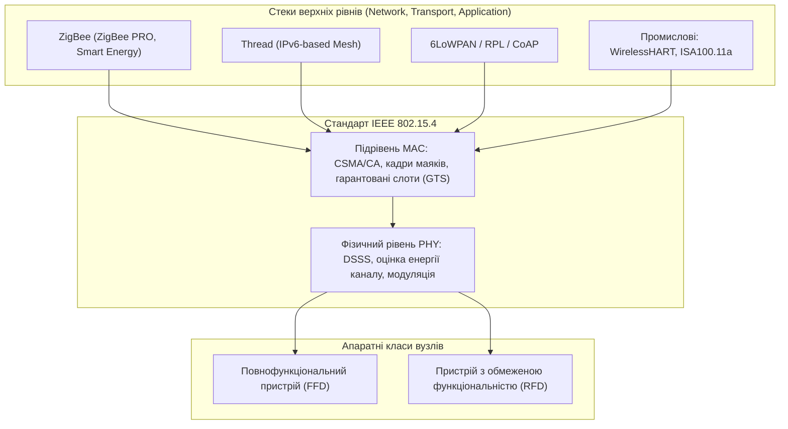
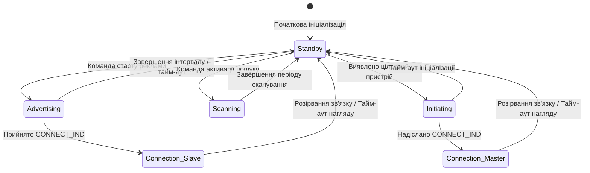
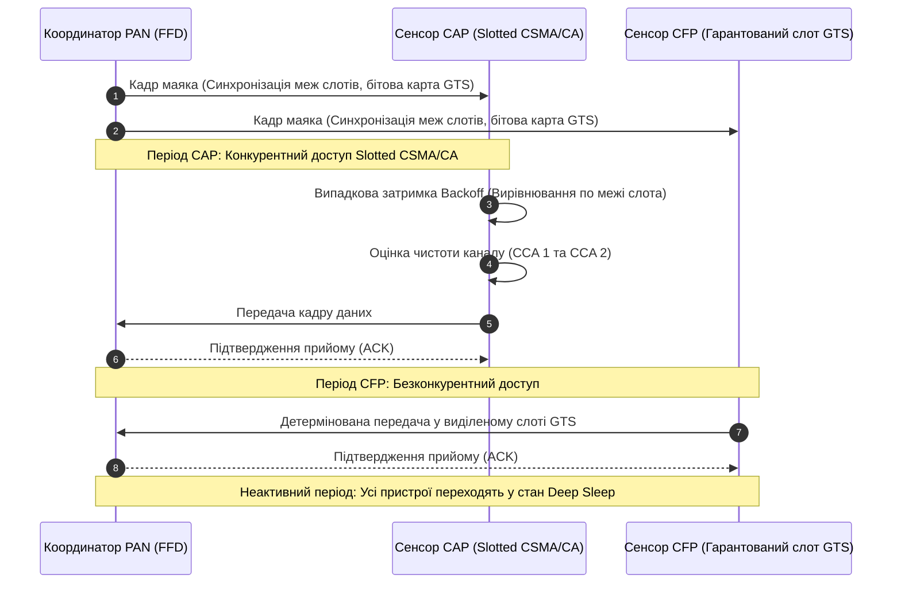
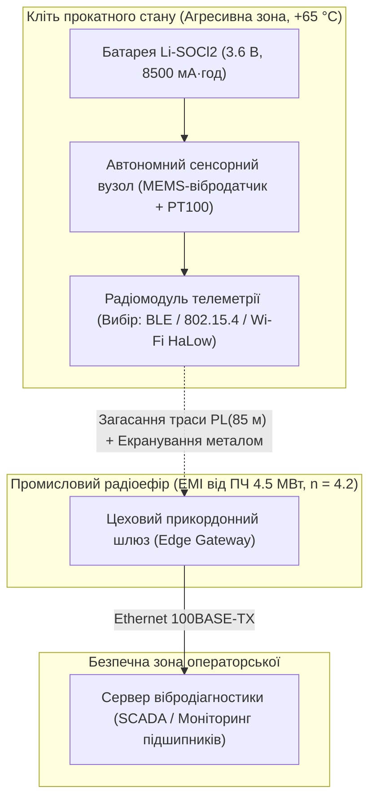

# Тема 2. Технології WPAN та WLAN у IoT. Специфіка Wi-Fi в ІоТ

## Мета лекції

Формування у майбутніх інженерів цілісної системи фундаментальних знань і прикладних компетенцій щодо фізичних і канальних принципів організації бездротових персональних та локальних мереж (WPAN/WLAN) в екосистемах Інтернету речей. Опанування архітектурних і схемотехнічних відмінностей між енергоефективними протоколами низької швидкості (IEEE 802.15.4, Bluetooth Low Energy) та високошвидкісними стандартами бездротового зв'язку родини IEEE 802.11 (Wi-Fi, Wi-Fi HaLow). Набуття практичних навичок аналітичного розрахунку енергетичного бюджету автономних сенсорних вузлів, часових параметрів передачі пакетів і обґрунтованого вибору бездротового інтерфейсу для роботи в умовах суворих обмежень щодо споживання енергії, обчислювальних ресурсів і завадозахищеності.

## Очікувані результати навчання

1. **Знання та розуміння.** Здобувачі вищої освіти засвоять фізичні принципи передачі сигналів, структуру використовуваних частотних діапазонів, методи модуляції та архітектуру стеків протоколів стандартів IEEE 802.15.4, Bluetooth Low Energy і специфікації Wi-Fi HaLow, а також розумітимуть функціональну роль кожного рівня при організації гетерогенних мереж Інтернету речей.
2. **Застосування.** Студенти набудуть практичних умінь розраховувати параметри часового поділу каналу в структурі суперфрейму, визначати робочий цикл сенсорних вузлів, конфігурувати параметри подій з'єднання у стеку BLE та обчислювати енергетичний баланс автономних пристроїв при різних інтервалах виходу в ефір.
3. **Аналіз.** Здобувачі зможуть здійснювати багатофакторний порівняльний аналіз технологій WPAN і WLAN за показниками латентності, пропускної здатності, стійкості до колізій і питомих енергетичних витрат на біт корисної інформації, виявляючи критичні вузькі місця традиційних мереж Wi-Fi під час обслуговування малопотужних сенсорів.
4. **Оцінювання та синтез.** Майбутні інженери зможуть критично оцінювати відповідність бездротових інтерфейсів технічним вимогам розподілених виробничих і муніципальних об'єктів, проектувати гібридні архітектури обміну телеметрією між автономними польовими датчиками і граничними шлюзами та оптимізувати конфігурацію радіоканалу для мінімізації ризиків втрати критичних даних.

---

## Детальний покроковий план лекції

### 1. Теоретико-концептуальний базис. Архітектурні та фізичні основи технологій IEEE 802.15.4 і Bluetooth Low Energy

* 1.1. Стандарт IEEE 802.15.4 розглядається як фундаментальна основа для бездротових персональних мереж низької швидкості з аналізом його місця в еталонній моделі OSI та взаємодії з протоколами верхніх рівнів.
* 1.2. Фізичний рівень стандарту IEEE 802.15.4 визначає використання неліцензованих смуг частот, розподіл частотних каналів та алгоритми модуляції сигналів DSSS і O-QPSK для досягнення максимальної стійкості радіозв'язку.
* 1.3. Архітектура стека Bluetooth Low Energy демонструє структурне розділення на рівні контролера і хоста через інтерфейс HCI з аналізом базових функцій профілів GAP та GATT.
* 1.4. Організація канального зв'язку в технології BLE базується на виділенні первинних каналів реклами, застосуванні алгоритмів адаптивного перемикання робочих частот і використанні новітніх фізичних режимів передачі даних стандарту Bluetooth 5.0.

### 2. Методологія та аналіз граничних умов. Енергетичні розрахунки, синхронізація доступу та системні бар'єри застосування Wi-Fi в ІоТ

* 2.1. Механізми канального доступу IEEE 802.15.4 регламентують структуру суперфрейму, процедури Slotted і Unslotted CSMA/CA, виділення гарантованих часових слотів GTS та аналітичний розрахунок робочого циклу вузлів.
* 2.2. Математичне моделювання енергоспоживання вузлів BLE базується на інтегруванні струмів активних фаз передачі і прийому з урахуванням механізму пропуску сеансів зв'язку за рахунок параметра Slave Latency.
* 2.3. Специфікація стандарту Wi-Fi HaLow (IEEE 802.11ah) забезпечує подолання високого енергоспоживання завдяки переходу в субгігагерцовий діапазон частот, впровадженню вікна обмеженого доступу RAW та цільового часу пробудження TWT.
* 2.4. Аналіз критичних обмежень та бар'єрів впровадження традиційного Wi-Fi (IEEE 802.11 b/g/n) в автономних пристроях доводить неприпустимість тривалих процедур асоціації, автентифікації WPA і підтримки сесії за протоколом DHCP при живленні від мініатюрних батарей.
* 2.5. Порівняльний критеріальний аналіз бездротових інтерфейсів дозволяє формалізувати метрики питомої вартості передачі корисного біта інформації для різних сценаріїв експлуатації кінцевого обладнання.

### 3. Практичний індустріальний / фаховий кейс. Проектування бездротової системи збору телеметрії в умовах металургійного виробництва

**Тема наскрізної задачі.** «Інженерне обґрунтування вибору бездротового інтерфейсу, топології та енергетичного бюджету автономних сенсорних вузлів діагностики підшипників прокатного стану в цеху з високим рівнем електромагнітних завад»

## 1. Теоретико-концептуальний базис. Архітектурні та фізичні основи технологій IEEE 802.15.4 і Bluetooth Low Energy

### 1.1. Стандарт IEEE 802.15.4 як базовий фундамент побудови бездротових персональних мереж низької швидкості

Створення сучасних розподілених систем Інтернету речей базується на необхідності об'єднання в єдину інформаційну інфраструктуру сотень і тисяч автономних пристроїв, що володіють суворими апаратними та енергетичними обмеженнями. Класичні мережеві технології, орієнтовані на високу пропускну здатність персональних комп'ютерів, виявилися непридатними для польових сенсорних вузлів через надмірну ресурсомісткість протоколів та високе енергоспоживання радіочастотних трактів. Відповіддю на цей технологічний виклик стала розробка міжнародного стандарту **IEEE 802.15.4**, що визначив правила функціонування бездротових персональних мереж із низькою швидкістю передачі даних (**LR-WPAN**, Low-Rate Wireless Personal Area Networks). 

Фундаментальна особливість стандарту IEEE 802.15.4 полягає в тому, що він регламентує виключно два нижні рівні класичної семирівневої моделі взаємодії відкритих систем: фізичний рівень (**PHY**, Physical Layer) та підрівень управління доступом до середовища (**MAC**, Medium Access Control). Стандарт свідомо не визначає специфікації мережевого, транспортного чи прикладного рівнів, надаючи розробникам відкриту платформу для надбудови спеціалізованих стеків протоколів. Завдяки такій модульній архітектурі IEEE 802.15.4 став несучим фундаментом для широкого спектра індустріальних і споживчих рішень, серед яких провідне місце посідають промислові стандарти автоматизації WirelessHART та ISA100.11a, мережеві специфікації ZigBee та Thread, а також механізм інкапсуляції інтернет-протоколів 6LoWPAN.

На рівні архітектури пристроїв стандарт IEEE 802.15.4 чітко розмежовує апаратні вузли за обчислювальними можливостями та доступним енергетичним бюджетом на два класи: повнофункціональні пристрої (**FFD**, Full-Function Device) та пристрої з обмеженою функціональністю (**RFD**, Reduced-Function Device). Вузол класу FFD реалізує повний набір функцій стандарту, володіє розширеним обсягом пам'яті й здатний працювати в трьох системних ролях: як координатор персональної мережі (**PAN Coordinator**), який створює мережу та керує нею; як звичайний координатор, що ретранслює повідомлення; або як кінцевий пристрій. На противагу йому, вузол класу RFD оптимізований для реалізації найпростіших завдань збору первинних даних або управління поодинокими актуаторами. Пристрій RFD реалізує лише мінімально необхідний піднабір протоколу MAC, взаємодіє в ефірі виключно з одним батьківським FFD-вузлом і принципово позбавлений можливості ретранслювати транзитний трафік, що дозволяє проектувати такі вузли на базі ультрадешевих мікроконтролерів із мінімальною ємністю оперативної пам'яті.

Взаємодія між вузлами в мережах IEEE 802.15.4 організовується за двома базовими топологічними схемами: зіркоподібною (Star) та одноранговою (Peer-to-Peer). У зіркоподібній топології обмін даними здійснюється суворо через центральний вузол — координатор PAN, навколо якого групуються кінцеві пристрої FFD та RFD. Однорангова топологія дозволяє будь-якому вузлу класу FFD безпосередньо взаємодіяти з будь-яким іншим FFD у зоні прямої радіовидимості. На основі однорангового підходу реалізуються складні високорівневі структури, зокрема топологія дерева кластерів (Cluster Tree) та чарункові комірчасті структури (Mesh). У дереві кластерів координатор PAN обирає перший вузол як голову кластера (**CLH**, Cluster Head) та призначає йому унікальний ідентифікатор (**CID**, Cluster Identifier). Після цього процес приєднання поширюється вглиб структури, утворюючи ієрархічні зв'язки, де вузли RFD можуть підключатися виключно як листові вершини на кінцях гілок, захищаючи енергетичні ресурси малопотужних сенсорів від неконтрольованого ретрансляційного навантаження.

> **ПРАКТИЧНИЙ ЯКІР:** У муніципальних системах обліку споживання природного газу та води бездротові лічильники реалізуються виключно у вигляді кінцевих вузлів класу RFD на базі енергоефективного радіотракту стандарту IEEE 802.15.4, які прокидаються один раз на добу для надсилання короткого кадру з поточними показаннями до вуличного FFD-маршрутизатора, закріпленого на стовпі вуличного освітлення. Завдяки повній відсутності обов'язків щодо обробки чужого транзитного трафіку такий сенсорний лічильник забезпечує безперервну автономну роботу понад десять років від вбудованого незмінного літій-тіонілхлоридного елемента живлення.

---

### 1.2. Фізичний рівень стандарту IEEE 802.15.4: частотні діапазони та модуляція сигналів

Фізичний рівень IEEE 802.15.4 відповідає за узгодження цифрового бітового потоку з електромагнітним простором передачі інформації. Основними функціями даного рівня є активація та деактивація високочастотного приймально-передавального тракту, модуляція та демодуляція сигналів, вимірювання потужності сигналу у відкритому каналі, детектування енергії (**ED**, Energy Detection), оцінка чистоти каналу (**CCA**, Clear Channel Assessment), а також визначення індикатора якості лінії зв'язку (**LQI**, Link Quality Indication).

Функціонування пристроїв стандарту зосереджено в неліцензованих смугах частот наукового, виробничого та медичного призначення (**ISM**, Industrial, Scientific, Medical). Архітектура частотного розподілу побудована з урахуванням глобальних і регіональних регуляторних обмежень. Первісна редакція стандарту IEEE 802.15.4-2003 передбачала використання трьох діапазонів: європейського субгігагерцового на частоті $868{,}0 \dots 868{,}6\text{ МГц}$, північноамериканського діапазону $902 \dots 928\text{ МГц}$ та всесвітнього неліцензованого діапазону $2400 \dots 2483{,}5\text{ МГц}$. Згодом, із прийняттям модифікацій IEEE 802.15.4-2006 та поправок IEEE 802.15.4c/d/g, спектральна сітка була суттєво розширена за рахунок включення смуг для Китаю ($779 \dots 787\text{ МГц}$), Японії ($950 \dots 956\text{ МГц}$) та субгігагерцових промислових каналів розумних енергосистем.

У найбільш поширеному глобальному діапазоні $2{,}4\text{ ГГц}$ сформовано 16 частотних каналів (з номерами від 11 до 26 включно), центральні частоти яких $F_k$ розраховуються за формулою:

$$F_k = 2405 + 5 \cdot (k - 11)\text{ МГц}, \quad k \in \{11, 12, \dots, 26\}$$

Для досягнення високої завадостійкості в перенасиченому промисловому ефірі фізичний рівень діапазону $2{,}4\text{ ГГц}$ використовує метод прямого розширення спектра послідовністю максимальної довжини (**DSSS**, Direct Sequence Spread Spectrum). Кожні 4 біти вихідних даних групуються в окремий символ, який однозначно перетворюється на 32-чіпову псевдовипадкову послідовність за допомогою таблиці ортогональних кодів. Модульований сигнал транслюється в ефір за допомогою зміщеної квадратурної фазової маніпуляції (**O-QPSK**, Offset Quadrature Phase-Shift Keying) з напівсинусоїдальним згладжуванням імпульсів, що еквівалентно частотній маніпуляції з мінімальним зсувом (**MSK**, Minimum Shift Keying). Така структура забезпечує швидкість передачі чіпів $R_c = 2{,}0\text{ Мчіп/с}$ при результуючій інформаційній швидкості передачі даних $R_b = 250\text{ кбіт/с}$.

Формальний виграш обробки за рахунок розширення спектра (коефіцієнт розширення або виграш від кодування $G_p$) визначається логарифмічним співвідношенням ширини смуги частот радіосигналу або швидкості слідування чіпів $R_c$ до первинної інформаційної швидкості потоку даних $R_b$:

$$G_p = 10 \cdot \log_{10}\left(\frac{R_c}{R_b}\right) = 10 \cdot \log_{10}\left(\frac{2{,}0 \cdot 10^6\text{ чіп/с}}{250 \cdot 10^3\text{ біт/с}}\right) = 10 \cdot \log_{10}(8) \approx 9{,}03\text{ дБ}$$

Завдяки досягнутому виграшу обробки у понад $9\text{ дБ}$ радіоприймачі IEEE 802.15.4 здатні успішно виділяти та відновлювати інформаційний сигнал навіть за умови, коли рівень широкосмугових шумів або внутрішньоканальних завад перевищує рівень корисного сигналу, забезпечуючи нормативну чутливість приймального тракту не гірше $-85\text{ дБм}$ у діапазоні $2{,}4\text{ ГГц}$ та $-92\text{ дБм}$ у субгігагерцових діапазонах.

Поширення радіохвиль в умовах реальних промислових приміщень і щільної міської забудови описується логарифмічно дистанційною моделлю загасання сигналу (**Log-Distance Path Loss Model**) з урахуванням випадкових тіньових завмирань:

$$PL(d) = PL(d_0) + 10 \cdot n \cdot \log_{10}\left(\frac{d}{d_0}\right) + X_\sigma$$

де $PL(d)$ позначає загасання радіосигналу на відстані $d$ між передавачем та приймачем (дБ); $PL(d_0)$ є втратами потужності сигналу на опорній відстані вільного простору $d_0$ (зазвичай $d_0 = 1\text{ м}$); $n$ визначає показник загасання траси (Path Loss Exponent), величина якого змінюється від $n = 2$ для ідеального відкритого простору до $n = 3 \dots 5$ для металургійних цехів і приміщень із залізобетонними конструкціями; параметр $X_\sigma$ є випадковою гауссовою величиною з нульовим математичним сподіванням і середньоквадратичним відхиленням $\sigma$ (дБ), яка описує ефект затінення сигналу масивними об'єктами.

> **ТИПОВА ПОМИЛКА:** Ототожнення понять «IEEE 802.15.4» та «ZigBee» як взаємозамінних синонімів. На практиці стандарт IEEE 802.15.4 є виключно специфікацією фізичного та канального рівнів (PHY/MAC), ратифікованою інженерним інститутом IEEE, тоді як ZigBee — це комерційний багатошаровий мережевий стек, створений промисловим альянсом Connectivity Standards Alliance (раніше ZigBee Alliance). Стек ZigBee використовує IEEE 802.15.4 як апаратний фундамент нижнього рівня, однак на основі того ж самого фізичного стандарту функціонують альтернативні, несумісні з ZigBee стеки, такі як 6LoWPAN/Thread, WirelessHART або ISA100.11a.

---

### 1.3. Архітектура стека Bluetooth Low Energy: функціональний поділ на Controller та Host

Технологія **Bluetooth Low Energy** (BLE) виникла як принципово нова концепція бездротового зв'язку малої дальності, розроблена консорціумом Bluetooth SIG для задоволення потреб систем із наднизьким піковим і середнім струмом споживання. На відміну від класичного стандарту Bluetooth Basic Rate / Enhanced Data Rate (**BR/EDR**), оптимізованого для безперервної трансляції потокового аудіо та масивів даних між спареними обчислювальними машинами, стек BLE орієнтований на передачу дискретних подій, аварійних сповіщень та ультракоротких пакетів телеметрії, дозволяючи сенсорному контролеру перебувати в стані неактивності більшу частину свого життєвого циклу.

В інженерній практиці розрізняють дворежимні (Dual-Mode, комерційне маркування Bluetooth Smart Ready) та однорежимні (Single-Mode, маркування Bluetooth Smart) пристрої. Дворежимні вузли, реалізовані у смартфонах, планшетах і шлюзах, містять комбінований апаратний трансивер і два паралельних програмних стеки для забезпечення одночасної взаємодії з класичними аудіопристроями BR/EDR та сенсорними вузлами BLE. Однорежимні пристрої містять виключно апаратно спрощений трансивер BLE, розроблений для гранично дешевих малогабаритних сенсорних кінцевих пристроїв.

Архітектура протокольного стека BLE має суворий дворівневий поділ, межею якого є стандартизований інтерфейс хост-контролера (**HCI**, Host Controller Interface). Апаратна частина стека, що безпосередньо взаємодіє з радіоефіром, називається контролером (**Controller**), тоді як логічна обробка протоколів вищого рівня реалізується хостом (**Host**). В інтегрованих однокристальних системах (System-on-Chip, SoC) інтерфейс HCI реалізується на рівні функцій операційної системи або прямих програмних викликів API, тоді як у двокомпонентних рішеннях (наприклад, мікроконтролер додатка, сполучений із зовнішнім радіомодулем) взаємодія через HCI організовується фізично за допомогою інтерфейсів UART, SPI або USB.

Нижній рівень контролера формується фізичним рівнем (**PHY**) та канальним рівнем (**Link Layer**). Канальний рівень реалізує складний апаратний кінцевий автомат, що безпосередньо керує станами трансивера з жорсткою прив'язкою до системних квантів часу.

Автомат станів канального рівня, наведений на діаграмі переходів, визначає п'ять базових режимів роботи вузла:
1. Стан очікування (Standby), в якому пристрій не випромінює і не приймає радіочастотну енергію, мінімізуючи споживання струму.
2. Стан рекламування (Advertising), під час якого вузол періодично розсилає широкомовні пакети на спеціально виділених частотних каналах, сповіщаючи про свою присутність та готовність до з'єднання.
3. Стан сканування (Scanning), у якому пристрій прослуховує ефір на рекламних каналах із метою виявлення активних рекламодавців.
4. Стан ініціалізації (Initiating), призначений для прослуховування рекламних повідомлень конкретного вузла та надсилання запиту на встановлення двостороннього зв'язку.
5. Стан з'єднання (Connection), що настає після успішного обміну пакетами ініціалізації, де один пристрій бере на себе роль провідного (**Master**), а інший — веденого (**Slave**).

На рівні програмного хоста протокол **L2CAP** (Logical Link Control and Adaptation Protocol) забезпечує мультиплексування потоків даних вищих рівнів, сегментацію та зворотне складання великих пакетів для канального рівня. Диспетчер безпеки (**SM**, Security Manager) реалізує симетричне шифрування за алгоритмом AES-128, управління процедурами безпечного сполучення (Pairing), автентифікації та обміну криптографічними ключами зв'язку.

Основу взаємодії прикладних даних у BLE становить тандем протоколу атрибутів (**ATT**, Attribute Protocol) та універсального профілю атрибутів (**GATT**, Generic Attribute Profile). Протокол ATT організовує внутрішній банк даних пристрою у вигляді простої клієнт-серверної таблиці низькорівневих записів — атрибутів. Кожен атрибут складається з чотирьох обов'язкових компонентів: шістнадцятибітового індексу (Handle), типу атрибута, представленого унікальним глобальним ідентифікатором (**UUID**, Universally Unique Identifier, розміром 16 біт для стандартних профілів або 128 біт для розробок користувача), прав доступу (Permissions) та безпосереднього значення (Value). 

Профіль GATT надбудовує над плоским банком атрибутів ATT сувору ієрархічну модель представлення даних, що складається з профілів, служб (Services), характеристик (Characteristics) та дескрипторів (Descriptors). Служба являє собою логічно згрупований набір характеристик, що реалізують конкретну функцію пристрою. Характеристика містить окреме значення виміряного фізичного параметра, права на його читання, запис або надсилання асинхронних оновлень (Notifications чи Indications). Дескриптори служать для конфігурації характеристик (наприклад, включення сповіщень через дескриптор Client Characteristic Configuration Descriptor, CCCD) або опису формату виведеного значення. Організація взаємодії пристроїв у просторі імен, алгоритми пошуку сервісів, виявлення фізичних вузлів та розподіл ролей Master/Slave і Broadcaster/Observer визначаються профілем загального доступу (**GAP**, Generic Access Profile).

> **ПРАКТИЧНИЙ ЯКІР:** У кардіологічних медичних моніторах холтерівського типу зняття електрокардіограми та вимірювання пульсу пацієнта транслюється на мобільний термінал за допомогою однорежимного мікроконтролера BLE. Дані частоти серцевих скорочень організовані за стандартним медичним профілем GATT Heart Rate Profile (UUID сервісу `0x180D`), де значення пульсу передається через механізм асинхронних нотифікацій (GATT Notifications) характеристики `0x2A37`. Відсутність необхідності надсилання підтверджень на кожен пакет на рівні додатка та мінімальний активний час роботи передавача дозволяють пацієнтові носити прилад протягом двох тижнів без заміни елемента живлення.

---

### 1.4. Організація канального зв'язку в технології BLE: радіоканали, алгоритми AFH та фізичні режими Bluetooth 5.0

Функціонування канального рівня BLE зосереджено в діапазоні $2{,}4\text{ ГГц}$ ISM ($2400 \dots 2483{,}5\text{ МГц}$), який розбитий на 40 радіочастотних каналів із постійним міжканальним інтервалом $2\text{ МГц}$. Центральна частота кожного каналу $f_c$ визначається виразом:

$$f_c = 2402 + 2 \cdot c\text{ МГц}, \quad c \in \{0, 1, \dots, 39\}$$

де індекс $c$ позначає порядковий номер фізичного радіочастотного каналу.

Стандарт реалізує функціональну сегрегацію канального простору на дві нерівнозначні групи: первинні канали рекламування та канали передачі даних. Рекламними каналами обрано рівно три канали: канал 37 ($2402\text{ МГц}$), канал 38 ($2426\text{ МГц}$) та канал 39 ($2480\text{ МГц}$). Таке просторове розташування не є випадковим: у діапазоні $2{,}4\text{ ГГц}$ традиційні мережі Wi-Fi (IEEE 802.11 b/g/n) здебільшого використовують неперекривні канали з номерами 1, 6 та 11, ширина спектра яких становить від $20$ до $22\text{ МГц}$. 

Рекламні канали BLE 37, 38 та 39 розміщені на краях і в спектральних інтервалах між основними смугами випромінювання точок доступу Wi-Fi. Це захищає процедури виявлення пристроїв та початкового встановлення з'єднання від блокування потужними пакетами локальних комп'ютерних мереж.

Решта 37 каналів (з номерами від 0 до 36) задіяні виключно для передачі даних у стані встановленого зв'язку. Для мінімізації впливу вузькосмугових інтерференційних завад від працюючого обладнання канальний рівень BLE використовує технологію псевдовипадкового адаптивного перемикання робочої частоти (**AFH**, Adaptive Frequency Hopping). Під час кожного сеансу зв'язку (події з'єднання, Connection Event) пара пристроїв здійснює перехід на новий частотний канал відповідно до алгоритму обчислення неперетвореного індексу каналу $f_{k+1}$:

$$f_{k+1} = (f_k + \text{HopIncrement}) \bmod 37$$

де $f_k$ позначає номер каналу даних, використаного в попередній події зв'язку; $\text{HopIncrement}$ є цілочисельним псевдовипадковим кроком перемикання частоти, що задається провідним вузлом Master на етапі ініціалізації сесії та набуває фіксованого значення в діапазоні від 5 до 16; операція $\bmod 37$ забезпечує циклічність вибору в межах пулу каналів передачі даних.

Якщо обчислений канал $f_{k+1}$ збігається з каналом, який на основі попереднього моніторингу інтерференції був позначений як зашумлений або пошкоджений (виключений з актуальної бітової карти каналів Channel Map), канальний рівень виконує процедуру переадресації (Remapping). Номер робочого каналу обирається із заздалегідь сформованої таблиці справних радіочастотних каналів за формулою:

$$f_{remapped} = f_{k+1} \bmod k_{good}$$

де $k_{good}$ позначає кількість активних каналів із високим відношенням сигнал/шум, внесених до списку дозволених для зв'язку.

Специфікація Bluetooth 5.0 розширила можливості радіоканалу, впровадивши підтримку трьох взаємодоповнюючих фізичних режимів роботи: LE 1M, LE 2M та LE Coded. Базовий некодований режим LE 1M забезпечує швидкість модуляції $1\text{ Мбод}$ за допомогою двопозиційної гауссової частотної маніпуляції (**GFSK**, Gaussian Frequency Shift Keying) з індексом модуляції від 0,45 до 0,55. 

Режим LE 2M підвищує швидкість модуляції до $2\text{ Мбод}$ при аналогічній девіації частоти, що дозволяє передати кадр фіксованого розміру рівно вдвічі швидше, скорочуючи активний радіочастотний час перебування мікроконтролера в енерговитратному стані випромінювання. 

Режим збільшеної дальності LE Coded використовує пряме виправлення помилок (**FEC**, Forward Error Correction) на основі згорткового кодування з довжиною обмеження $K=4$. У схемі кодування $S=2$ кожен біт інформаційного кадру кодується двома символами, що формує підсумкову корисну швидкість $500\text{ кбіт/с}$. У схемі $S=8$ кожен вхідний біт перетворюється на 8 символів, забезпечуючи швидкість $125\text{ кбіт/с}$. Застосування надлишкового кодування $S=8$ забезпечує додатковий виграш у чутливості приймача величиною до $6\text{ дБ}$, розширюючи загальний енергетичний бюджет каналу (Link Budget) до $121\text{ дБ}$ і дозволяючи здійснювати надійну трансляцію телеметрії на відстані до одного кілометра в умовах прямої видимості.

| Технологія та специфікація | Частотний діапазон і швидкість | Мережева архітектура та стек | Енергетичний профіль та оптимізація | Приклад з реальної практики |
| :--- | :--- | :--- | :--- | :--- |
| **IEEE 802.15.4 (DSSS PHY)** | $2{,}4\text{ ГГц}$ ($250\text{ кбіт/с}$), $868\text{ МГц}$ ($20/100\text{ кбіт/с}$), $915\text{ МГц}$ ($40/250\text{ кбіт/с}$) | Рівні PHY/MAC; основа для ZigBee, 6LoWPAN, WirelessHART; топології: Star, Peer-to-Peer, Tree | Робочий цикл (Duty Cycle) регулюється суперфреймом ($SO/BO$), струм сну $1 \dots 5\text{ мкА}$ | Бездротова сенсорна мережа виявлення витоків газу у технологічних колодязях |
| **Bluetooth Low Energy 4.2** | $2{,}4\text{ ГГц}$ ISM, 40 каналів, інформаційна швидкість до $1\text{ Мбіт/с}$ (LE 1M) | Стек Controller/Host (HCI); архітектура клієнт-сервер ATT/GATT; топології: Star, Piconet | Оптимізація Connection Interval та Slave Latency, середній струм $10 \dots 20\text{ мкА}$ | Портативний пульсоксиметр пацієнта з передачею даних на планшет чергового лікаря |
| **Bluetooth 5.0 (LE Coded)** | $2{,}4\text{ ГГц}$ ISM, $125\text{ кбіт/с}$ ($S=8$) або $500\text{ кбіт/с}$ ($S=2$) | Стек GATT/GAP із розширеними рекламними пакетами (Advertising Extensions) | Підвищений Link Budget до $121\text{ дБ}$ за рахунок FEC без збільшення потужності передавача | Система моніторингу залізничних стрілочних переводів на віддалених коліях |
| **ZigBee PRO** | $2{,}4\text{ ГГц}$ (IEEE 802.15.4 PHY), корисна швидкість до $250\text{ кбіт/с}$ | Повноцінний стек: NWK (Mesh-маршрутизація AODV), APS, ZDO, профілі ZCL | Вузли-роутери живляться від електромережі, кінцеві вузли сплять з опитуванням батька | Автоматизоване комерційне освітлення складських комплексів та логістичних терміналів |
| **Z-Wave (ITU-T G.9959)** | Субгігагерцовий ($868{,}42\text{ МГц}$ у ЄС, $908{,}42\text{ МГц}$ у США), $9{,}6 \dots 100\text{ кбіт/с}$ | Пропрієтарний стек Sigma Designs; комірчаста топологія (до 232 пристроїв), Source Routing | Низький струм споживання ведених вузлів, ретранслятори не сплять | Домашня система контролю затоплення з бездротовими сервоприводами кульових кранів |

> **КОНТРОЛЬНЕ ПИТАННЯ:** Чому в технології Bluetooth Low Energy виділено рівно три первинні канали рекламування (37, 38, 39), і чому їхнє розміщення по краях та в центрі спектра ISM $2{,}4\text{ ГГц}$ вважається критично важливим системним рішенням для забезпечення надійності зв'язку в сучасних промислових умовах?

Розгорнути аналіз / відповідь

**Правильний варіант: Мінімізація колізій із найпотужнішими неперекривними каналами стандарту Wi-Fi (IEEE 802.11 b/g/n) та компроміс між швидкістю виявлення і енергетичними витратами на сканування.**

1. Спектральний аналіз показує, що в діапазоні $2{,}4\text{ ГГц}$ найбільш енергонасиченими джерелами електромагнітних завад є класичні точки доступу Wi-Fi, які транслюють широкосмугові сигнали шириною $20\text{ МГц}$ або $40\text{ МГц}$ на стандартних неперекривних каналах 1, 6 та 11. Канал 37 ($2402\text{ МГц}$) розташований безпосередньо нижче спектрального дзвона каналу 1 Wi-Fi. Канал 38 ($2426\text{ МГц}$) розташований у захисному проміжку між каналами 1 та 6 Wi-Fi. Канал 39 ($2480\text{ МГц}$) винесений за верхню межу каналу 11 Wi-Fi. Таке розташування гарантує, що навіть за умови стовідсоткового завантаження корпоративної мережі Wi-Fi широкомовні кадри реклами та запити на підключення BLE надійдуть до приймача без викривлень хоча б на одному з вільних від завад інтервалів. Кількість каналів обмежена трьома, оскільки кожне сканування чи передача реклами вимагає послідовного перемикання радіочастотного синтезатора: збільшення числа рекламних каналів призвело б до неприпустимого зростання часу активності передавача та швидкої деградації заряду батареї.

2. Аналіз дистракторів:
   - Твердження про те, що три канали виділено для сумісності з антенами з трьома резонансними піками, є фізично некоректним, оскільки мініатюрні мікросмужкові та керамічні антени проектуються широкосмуговими на весь діапазон $2400 \dots 2483{,}5\text{ МГц}$.
   - Твердження про забезпечення синхронізації з фазами промислової трифазної мережі живлення $380\text{ В}$ є хибним, оскільки події канального рівня прив'язуються виключно до внутрішнього тактового генератора контролера і жодним чином не корелюють з мережами змінного струму.
   - Припущення, що передача даних на інших 37 каналах є менш безпечною з точки зору криптографії, не відповідає дійсності, оскільки алгоритм шифрування AES-CCM реалізується на рівні Link Layer однаково для будь-якого фізичного каналу передачі даних.

---

### Вказівки для самостійного осмислення

1. Зіставте на основі наведеної логарифмічно дистанційної моделі загасання сигналу теоретичні радіуси покриття бездротового каналу IEEE 802.15.4 у діапазонах $868\text{ МГц}$ та $2{,}4\text{ ГГц}$ всередині залізобетонного виробничого цеху за умови однакової вихідної потужності передавача $10\text{ мВт}$ та фіксованого значення показника загасання траси $n = 3{,}5$.
2. Проаналізуйте послідовність дій та часові витрати кінцевого автомата канального рівня BLE при переході з режиму глибокого сну Standby через стани Scanning та Initiating у стан Connection, визначивши параметри, які критично впливають на збереження заряду батареї автономного сканера.
3. Сформулюйте системні критерії, за якими інженер-проектувальник має віддати перевагу технології Bluetooth 5.0 у режимі LE Coded над стандартом IEEE 802.15.4 при створенні мережі диспетчеризації автономних датчиків температури на відкритому нафтогазовому терміналі.

## 2. Методологія та аналіз граничних умов. Енергетичні розрахунки, синхронізація доступу та системні бар'єри застосування Wi-Fi в ІоТ

### 2.1. Механізми канального доступу IEEE 802.15.4: суперфрейм, CSMA/CA, GTS та розрахунок робочого циклу

Методологія координації доступу до фізичного середовища у стандарті IEEE 802.15.4 вирішує фундаментальну проблему усунення колізій між неоднорідними вузлами в умовах нестабільного радіозв'язку. У безмаяковому режимі застосовується класичний асинхронний протокол несинхронізованого випадкового доступу, тоді як для критичних до затримок застосунків регламентується маяковий синхронізований режим на основі структури суперфрейму. 

У маяковому режимі весь часовий простір функціонування мережі структурується послідовністю періодичних маяків, які випромінює координатор мережі. Координатор задає межі активної частини суперфрейму $SD$ (Superframe Duration) та загальний інтервал між маяками $BI$ (Beacon Interval). Математичний апарат конфігурації часового простору базується на двох цілочисельних параметрах: порядку суперфрейму $SO$ (Superframe Order) та порядку маяка $BO$ (Beacon Order), причому завжди виконується системне обмеження $0 \le SO \le BO \le 14$. 

Базовий часовий квант структури суперфрейму формується на основі тривалості елементарного слота $\text{aBaseSlotDuration} = 60\text{ символів}$ та їхньої фіксованої кількості $\text{aNumSuperframeSlots} = 16$. У частотному діапазоні $2{,}4\text{ ГГц}$ при швидкості модуляції $62{,}5\text{ ксимв/с}$ період одного символу становить $T_{sym} = 16\text{ мкс}$, що задає базову константу суперфрейму $\text{aBaseSuperframeDuration} = 960\text{ символів} = 15{,}36\text{ мс}$.

Активна частина суперфрейму поділяється на період конкурентного доступу (**CAP**, Contention Access Period) та період безконкурентного доступу (**CFP**, Contention-Free Period). У межах CAP пристрої змагаються за право виходу в ефір за допомогою синхронізованого алгоритму множинного доступу з контролем несучої та уникненням колізій (**Slotted CSMA/CA**). Початок кожного слота затримки алгоритму суворо вирівнюється за межами часових слотів суперфрейму. 

Період CFP резервується координатором для обслуговування пристроїв, що потребують детермінованої смуги пропускання або суворого обмеження часу доставки пакетів. Для цього координатор виділяє до семи гарантованих часових слотів (**GTS**, Guaranteed Time Slots). Кожен слот GTS може займати один або декілька базових слотів суперфрейму і надається конкретному вузлу в ексклюзивне користування, що виключає конкуренцію та гарантує нульову ймовірність внутрішньомережевих колізій.

> **ВАЖЛИВО:** Використання гарантованих слотів GTS забезпечує детермінований час доставки повідомлень, проте накладає жорстке обмеження на масштабованість мережі. У межах одного координатора стандартом дозволено виділення сумарно не більше 7 слотів GTS на суперфрейм, при цьому тривалість частини CAP, що залишилася, не може бути меншою за константу $\text{aMinCAPLength} = 440\text{ символів}$ ($7{,}04\text{ мс}$). Порушення цього правила унеможливлює передачу службових команд асоціації нових пристроїв.

#### Граничні умови застосування моделі суперфрейму

Математична модель суперфрейму та механізм Slotted CSMA/CA втрачають практичну ефективність у високодинамічних мережах із мобільними вузлами. При переміщенні об'єктів зі швидкістю понад $5\text{ м/с}$ регулярний дрейф фази прийому маяка призводить до втрати синхронізації меж слотів, змушуючи вузол переходити в енерговитратний режим безперервного пошуку маяків (Orphan Scan). Крім того, у разі збільшення кількості активних пристроїв у зоні дії одного координатора понад 30 одиниць, фаза CAP зазнає колапсу пропускної здатності через лавиноподібне зростання колізій і вичерпання ліміту спроб затримки $\text{macMaxCSMABackoffs}$. За таких умов енергетична перевага низького робочого циклу нівелюється багаторазовими повторними процедурами прослуховування ефіру.

---

### 2.2. Математичне моделювання енергоспоживання вузлів BLE: оптимізація Connection Events та Slave Latency

Оцінка життєвого циклу автономних сенсорних вузлів на базі Bluetooth Low Energy базується на точній формалізації споживаного заряду протягом кожної мікросекунди функціонування радіомодуля. На відміну від неперервних систем зв'язку, де домінує статична потужність, у протоколі BLE обмін даними дискретизований у межах подій з'єднання (**Connection Events**). Для інженерного розрахунку строку служби автономного джерела струму застосовується покрокова аналітична методологія інтегрування струмових профілів.

Трансформація фазових часових параметрів у сумарний баланс енергії та прогнозований термін автономної роботи formalізується такою аналітичною послідовністю:

$$
\begin{aligned}
\text{Крок 1 (Заряд активного сеансу):} & \quad Q_{active} = I_{wake} t_{wake} + I_{rx} t_{rx} + I_{proc} t_{proc} + I_{tx} t_{tx} + I_{post} t_{post} \\
\text{Крок 2 (Ефективний період подій):} & \quad T_{eff} = T_{conn} \cdot (N_{sl} + 1) \\
\text{Крок 3 (Заряд фази глибокого сну):} & \quad Q_{sleep} = I_{sleep} \cdot \left( T_{eff} - T_{active} \right) \\
\text{Крок 4 (Середній струм споживання):} & \quad I_{avg} = \frac{Q_{active} + Q_{sleep}}{T_{eff}} \\
\text{Крок 5 (Термін служби батареї):} & \quad T_{life} = \frac{C_{batt} \cdot \kappa_{temp} \cdot (1 - \sigma_{self} \cdot t_{years})}{I_{avg} \cdot 8760}
\end{aligned}
$$

де $I_{wake}$, $I_{rx}$, $I_{proc}$, $I_{tx}$, $I_{post}$ позначають миттєві значення струму відповідно на етапах запуску високочастотного кварцового генератора, прийому пакета від ведучого вузла, обчислювальної обробки даних процесором, випромінювання пакета-відповіді передавачем та завершального переведення периферії у стан енергозбереження (мА); змінні $t_{wake}$, $t_{rx}$, $t_{proc}$, $t_{tx}$, $t_{post}$ відображають тривалості відповідних фаз (с); $T_{conn}$ позначає базовий інтервал з'єднання (Connection Interval); $N_{sl}$ є параметром затримки веденого пристрою (Slave Latency), що визначає кількість подій з'єднання, які ведений вузол може пропустити за відсутності нових вимірювальних даних; $T_{active} = t_{wake} + t_{rx} + t_{proc} + t_{tx} + t_{post}$ позначає сукупну тривалість активного стану (с); $I_{sleep}$ позначає струм мікроконтролера у стані Deep Sleep із працюючим таймером реального часу RTC (мА); $C_{batt}$ позначає номінальну електричну ємність джерела живлення (мА·год); $\kappa_{temp}$ є емпіричним коефіцієнтом деградації ємності від робочої температури середовища; $\sigma_{self}$ позначає річний коефіцієнт саморозряду елемента живлення; константа $8760$ дорівнює кількості годин у календарному році.

#### Граничні умови та фізичні бар'єри оптимізації BLE

Описана аналітична модель розрахунку втрачає адекватність у разі неврахування внутрішнього динамічного опору джерела живлення. Для мініатюрних літієвих елементів типу CR2032 внутрішній опір зростає в процесі розряду від $10\text{ Ом}$ до $100 \dots 150\text{ Ом}$. Під час випромінювання радіоімпульсу з вихідною потужністю $+4\text{ дБм}$ імпульсний струм передавача сягає $I_{tx} \approx 15 \dots 20\text{ мА}$. Відповідно до закону Ома, спад напруги на внутрішньому опорі батареї становить:

$$\Delta V = I_{tx} \cdot R_{int} \approx 0{,}015\text{ А} \cdot 100\text{ Ом} = 1{,}5\text{ В}$$

При початковій напрузі свіжої батареї $3{,}0\text{ В}$ робоча напруга на виводах мікроконтролера просідає до рівня $1{,}5\text{ В}$, що є значно нижчим за поріг апаратного скидання за зниженням напруги (**BOD**, Brown-Out Reset), який для більшості сучасних чипів становить $1{,}7 \dots 1{,}8\text{ В}$. Пристрій циклічно перезавантажується, витрачаючи повну ємність елемента на пускові перехідні процеси, а розрахований багаторічний термін служби скорочується до кількох діб.

Додатковим бар'єром оптимізації є компроміс параметра затримки веденого $N_{sl}$ із системним тайм-аутом нагляду (**Supervision Timeout**, $T_{sup}$). За вимогами специфікації Bluetooth Core має суворо виконуватися нерівність:

$$T_{sup} > T_{conn} \cdot (N_{sl} + 1) \cdot 2$$

У разі порушення цієї граничної умови будь-яка випадкова втрата одного радіопакета через локальну електромагнітну заваду призводить до помилкового рішення ведучого пристрою про аварійний розрив зв'язку (Link Loss). Це ініціює повний цикл енерговитратного повторного підключення через широкомовну рекламу.

---

### 2.3. Специфікація стандарту Wi-Fi HaLow (IEEE 802.11ah): субрегіональний діапазон, RAW та TWT

Стандарт **IEEE 802.11ah** (Wi-Fi HaLow) розроблено з метою адаптації нативної адресації інтернет-протоколів до жорстких вимог енергозбереження та дальності радіозв'язку в промислових та муніципальних мережах Інтернету речей. Головною методологічною відмінністю Wi-Fi HaLow від класичних стандартів IEEE 802.11a/b/g/n/ac є перехід із діапазонів $2{,}4\text{ ГГц}$ і $5\text{ ГГц}$ у субгігагерцовий спектр частот $850 \dots 950\text{ МГц}$, а також використання вузьких каналів зв'язку шириною $1$, $2$, $4$, $8$ та $16\text{ МГц}$.

Звуження смуги пропускання до $1\text{ МГц}$ на фізичному рівні безпосередньо покращує чутливість приймача завдяки зменшенню інтегральної потужності теплового шуму в каналі. Відповідно до формули Найквіста, спектральна густина потужності шуму $P_{noise}$ визначається виразом:

$$P_{noise} = k_B \cdot T \cdot \Delta F$$

де $k_B = 1{,}38 \cdot 10^{-23}\text{ Дж/К}$ є сталою Больцмана; $T$ позначає абсолютну температуру приймача (К); $\Delta F$ позначає смугу пропускання фільтра проміжних частот (Гц). 

Перехід від стандартної смуги Wi-Fi $\Delta F_1 = 20\text{ МГц}$ до смуги Wi-Fi HaLow $\Delta F_2 = 1\text{ МГц}$ зменшує рівень власних шумів на:

$$\Delta P_{dB} = 10 \cdot \log_{10}\left(\frac{20\text{ МГц}}{1\text{ МГц}}\right) = 13\text{ дБ}$$

Таке системне зниження шумового порогу разом із низьким коефіцієнтом поглинання субгігагерцових хвиль будівельними конструкціями забезпечує дальність зв'язку до $1{,}5\text{ км}$ при потужності випромінювання лише $10 \dots 20\text{ мВт}$.

Для масштабування мережі до 8191 пристрою на одну точку доступу стандарт впроваджує метод вікна обмеженого доступу (**RAW**, Restricted Access Window). Замість одночасного виходу в ефір тисяч станцій точка доступу групує вузли за їхніми ідентифікаторами асоціації (**AID**, Association Identifier) і квантує часовий інтервал між маяками на підслоти RAW. Кожен підслот призначається окремій групі сенсорів, що повністю нівелює проблему конкурентного блокування ефіру.

Другим критичним компонентом є цільовий час пробудження (**TWT**, Target Wake Time), запозичений пізніше стандартом Wi-Fi 6 (802.11ax). Механізм TWT дозволяє кінцевому вузлу укласти з точкою доступу індивідуальну угоду, згідно з якою пристрій повністю знеструмлює приймально-передавальний тракт на довільний період (до кількох місяців чи років), прокидаючись суворо у визначений момент часу без виконання повторного сканування каналів, автентифікації та обміну сертифікатами безпеки.

> **ПРАКТИЧНИЙ ЯКІР:** У системах контролю масштабних агротехнічних комплексів із системами крапельного зрошення застосування стандарту Wi-Fi HaLow дозволяє одній базовій станції з круговою антеною контролювати понад 3000 автономних датчиків вологості ґрунту та приводів клапанів у радіусі $1{,}2\text{ км}$. Завдяки індивідуальним розкладам TWT сенсорні вузли активуються за власним графіком один раз на годину, синхронно передають дані телеметрії за $8\text{ мс}$ і повертаються в стан сну, забезпечуючи розрахункову роботу протягом 5 років від двох пальчикових батарейок типу АА.

#### Граничні умови та регіональні бар'єри Wi-Fi HaLow

Незважаючи на високу технічну досконалість, методологія розгортання IEEE 802.11ah стикається з регуляторними бар'єрами, зумовленими відсутністю єдиного глобального частотного плану. У країнах Європейського Союзу доступна смуга частот обмежена діапазоном $863 \dots 868\text{ МГц}$, при цьому нормативні документи ETSI EN 300 220 накладають суворе обмеження на максимальний робочий цикл передавачів (Duty Cycle не більше $1\%$ або обов'язкове застосування механізму Listen Before Talk). 

Це лімітує передачу широкосмугових потоків даних або частих кадрів підтвердження. На противагу цьому, в США (FCC Part 15) для неліцензованого використання виділено смугу $902 \dots 928\text{ МГц}$, що дозволяє організувати широкосмугові канали до $16\text{ МГц}$ без обмежень робочого циклу за умови використання псевдовипадкової перебудови частоти. Така регіональна фрагментація виключає створення уніфікованої апаратної бази для глобального ринку.

---

### 2.4. Аналіз критичних обмежень та бар'єрів впровадження традиційного Wi-Fi (IEEE 802.11 b/g/n) в автономних пристроях

Застосування традиційного протоколу Wi-Fi (IEEE 802.11 b/g/n) у кінцевих автономних вузлах Інтернету речей є однією з найбільш поширених інженерних помилок на етапі системного проектування. Позірна зручність прямої взаємодії датчика з наявною домашньою чи промисловою IP-інфраструктурою без використання проміжних шлюзів нівелюється колосальними накладними витратами протоколів канального, мережевого та безпекового рівнів.

Критичні обмеження традиційного Wi-Fi зумовлені фізичною природою його протокольного стека:

По-перше, вихідний каскад підсилювача потужності (**PA**, Power Amplifier) трансивера стандарту 802.11 b/g/n для подолання високого коефіцієнта згасання хвиль у смузі $2{,}4\text{ ГГц}$ та компенсації пік-фактора сигналів OFDM вимагає значного миттєвого струму випромінювання, який становить від $150\text{ мА}$ до $350\text{ мА}$. Навіть у стані пасивного прослуховування ефіру приймач споживає не менше $50 \dots 80\text{ мА}$, що повністю виключає використання компактних хімічних джерел живлення.

По-друге, відновлення зв'язку після виходу мікроконтролера зі стану глибокого сну вимагає виконання повноцінної багатоетапної процедури встановлення з'єднання, що відображено у такій хронологічній моделі:

$$
\begin{aligned}
\text{Крок 1 (Апаратний старт):} & \quad \text{Стабілізація напруги живлення та запуск PLL } (t_{boot} \approx 30 \dots 50\text{ мс}) \\
\text{Крок 2 (Сканування ефіру):} & \quad \text{Пасивне чи активне прослуховування каналів } (t_{scan} \approx 100 \dots 300\text{ мс}) \\
\text{Крок 3 (Асоціація 802.11):} & \quad \text{Обмін кадрами Auth Req/Resp та Assoc Req/Resp } (t_{assoc} \approx 30 \dots 50\text{ мс}) \\
\text{Крок 4 (Безпека WPA2/WPA3):} & \quad \text{Чотиристороннє рукостискання 4-Way Handshake } (t_{crypto} \approx 150 \dots 500\text{ мс}) \\
\text{Крок 5 (Конфігурація IP):} & \quad \text{Отримання параметрів мережі через DHCP } (t_{dhcp} \approx 500 \dots 1500\text{ мс}) \\
\text{Крок 6 (Розпізнавання шлюзу):} & \quad \text{Визначення MAC-адреси шлюзу за протоколом ARP } (t_{arp} \approx 20 \dots 100\text{ мс})
\end{aligned}
$$

Сумарна тривалість перехідних процедур перед відправкою першого корисного байта телеметрії становить $T_{overhead} = \sum t_i \approx 1{,}5 \dots 3{,}5\text{ секунди}$. Увесь цей час радіомодуль функціонує в режимах максимального енергоспоживання, спалюючи до $98\%$ сумарного енергетичного бюджету сенсорного вузла на системні накладні витрати.

По-третє, стандартний протокол збереження енергії Wi-Fi Legacy Power Save Mode (**PSM**) зобов'язує клієнта прокидатися на кожне повідомлення з бітовою картою доставки трафіку (**DTIM**), яке транслює точка доступу з інтервалом $100 \dots 300\text{ мс}$. Якщо мікроконтролер сенсора самовільно засинає на довший час для збереження батареї, точка доступу фіксує тайм-аут бездіяльності клієнта (Inactivity Timeout), видаляє інформацію про стан його сесії (Client State) зі своєї оперативної пам'яті та примусово надсилає кадр деасоціації. Наступне пробудження змушує датчик знову проходити весь шлях від сканування до запитів DHCP.

Існуючі методи програмної компенсації цих недоліків, такі як фіксація номера радіоканалу, збереження стану асоціації та параметрів безпеки в енергонезалежній пам'яті RTC-пам'яті мікроконтролера (Fast Connect) та використання статичної IP-адреси в обхід протоколу DHCP, дозволяють скоротити час підключення до $200 \dots 400\text{ мс}$. Проте навіть такий час на два порядки перевищує типові часові витрати трансиверів BLE або IEEE 802.15.4 ($2 \dots 5\text{ мс}$), що залишає традиційний Wi-Fi економічно та технічно непридатним для батарейних пристроїв із життєвим циклом понад декілька місяців.

---

### 2.5. Порівняльний критеріальний аналіз бездротових інтерфейсів за метрикою питомої вартості передачі корисної інформації

Для інженерного обґрунтування вибору технології радіодоступу в гетерогенних системах Інтернету речей застосовується критерій питомої вартості передачі одиниці корисної інформації $E_{bit}$ (виражається в мікроджоулях на біт, мкДж/біт). Дана метрика комплексно інтегрує тривалість встановлення зв'язку, потужність передавача, швидкість модуляції та розмір службових протокольних заголовків.

Формальний розрахунок здійснюється на основі математичного співвідношення повної енергії сеансу зв'язку до розміру корисного навантаження датчика:

$$E_{bit} = \frac{V_{dd} \cdot \int_{0}^{T_{session}} i(t) \, dt}{8 \cdot L_{payload}} = \frac{V_{dd} \cdot \left( Q_{overhead} + Q_{tx\_payload} + Q_{ack} \right)}{8 \cdot L_{payload}}$$

де $V_{dd}$ позначає робочу напругу живлення вузла (В); $i(t)$ є функцією миттєвого струму споживання протягом сеансу зв'язку тривалістю $T_{session}$; $L_{payload}$ позначає довжину виключно корисних даних вимірювання (байтів); $Q_{overhead}$ відображає заряд, витрачений на ініціалізацію, синхронізацію, сканування та передачу заголовків протоколів усіх рівнів (мА·с); $Q_{tx\_payload}$ визначає заряд безпосереднього випромінювання корисних біт у радіоефір (мА·с); $Q_{ack}$ позначає витрати заряду на прийом підтвердження доставки кадру (мА·с).

Аналітична матриця порівняння бездротових технологій WPAN та WLAN дозволяє системно оцінити ключові інженерні параметри при виборі платформи:

| Технологія / Стандарт | Енергія на корисний біт ($E_{bit}$, при 32 байтах) | Час встановлення сесії з Cold Boot | Підтримка нативного IP | Складність впровадження | Критичні ризики / Обмеження |
| :--- | :--- | :--- | :--- | :--- | :--- |
| **IEEE 802.15.4 (2.4 ГГц)** | $1{,}2 \dots 2{,}5\text{ мкДж/біт}$ | $10 \dots 25\text{ мс}$ | Потрібен адаптаційний шар 6LoWPAN | Середня (вимагає координатора мережі) | Високий рівень завад від Wi-Fi у діапазоні $2{,}4\text{ ГГц}$, обмеження розміру фізичного кадру 127 байтами |
| **Bluetooth Low Energy 5.0 (LE 1M)** | $0{,}15 \dots 0{,}4\text{ мкДж/біт}$ | $2 \dots 5\text{ мс}$ | Потрібен протокол IPSP або проксі-шлюз | Низька (наявність розвинених SDK та SoC) | Обмежена топологія зірки в пікомережі, швидке згасання сигналу за наявності металевих перешкод |
| **Bluetooth Low Energy 5.0 (LE Coded)** | $1{,}8 \dots 3{,}5\text{ мкДж/біт}$ | $5 \dots 15\text{ мс}$ | Потрібен протокол IPSP або проксі-шлюз | Середня (необхідність калібрування FEC) | Суттєве зниження швидкості до $125\text{ кбіт/с}$, зростання часу випромінювання ефіру (Airtime) |
| **Традиційний Wi-Fi 4 (802.11n, 2.4 ГГц)** | $80 \dots 250\text{ мкДж/біт}$ | $1500 \dots 3500\text{ мс}$ | Нативна (IPv4 / IPv6 стек без шлюзів) | Низька (пряма інтеграція в чинну інфраструктуру) | Несумісність із дисковими елементами живлення через імпульсні струми понад $300\text{ мА}$, затримки асоціації |
| **Wi-Fi HaLow (IEEE 802.11ah, Sub-GHz)** | $0{,}8 \dots 1{,}9\text{ мкДж/біт}$ | $5 \dots 15\text{ мс}$ (у режимі TWT) | Нативна (IPv4 / IPv6 стек без трансляцій) | Висока (дефіцит комерційних чипсетів і антен) | Фрагментація національних діапазонів, нормативні ліміти робочого циклу передавачів у Європі |

Аналітичні дані матриці доводять, що за критерієм мінімізації питомої вартості біта для рідкісних передач невеликих пакетів технологія Bluetooth Low Energy не має рівних серед комерційних рішень, демонструючи питомі енерговитрати, що майже на три порядки менші за показники традиційного Wi-Fi. 

Водночас у сценаріях, де критичною вимогою є нативна наскрізна IP-маршрутизація з можливістю підключення тисяч пристроїв до єдиної базової станції без проміжних шлюзів перетворення прикладних профілів, технологічним фаворитом виступає стандарт Wi-Fi HaLow.

> **КОНТРОЛЬНЕ ПИТАННЯ:** Автономний промисловий сенсор з напругою живлення $V_{\text{dd}} = 3{,}0\text{ В}$ передає пакет корисних даних розміром 32 байти один раз на 60 секунд. У разі використання модуля BLE активна фаза зв'язку триває $t_{\text{act}} = 3\text{ мс}$ із середнім струмом $I_{\text{act}} = 15\text{ мА}$, а струм сну становить $I_{\text{sleep}} = 2\text{ мкА}$. У разі використання класичного модуля Wi-Fi із процедурою Fast Connect активна фаза триває $t_{\text{act}} = 300\text{ мс}$ із середнім струмом $I_{\text{act}} = 120\text{ мА}$, а струм сну становить $I_{\text{sleep}} = 15\text{ мкА}$. Розрахуйте середній струм споживання для обох варіантів та визначте теоретичний строк служби вузла від батареї CR2032 номінальною ємністю $220\text{ мА}\cdot\text{год}$ з урахуванням доступного коефіцієнта використання ємності $\eta = 0{,}85$.

Розгорнути аналіз / відповідь

**Правильний варіант: Для модуля BLE середній струм становить приблизно $2{,}75\text{ мкА}$, а строк автономної служби сягає понад 7,7 років; для модуля Wi-Fi середній струм становить $615\text{ мкА}$, а строк служби вичерпується за 12,6 діб.**

1. Розрахунок параметрів для технології Bluetooth Low Energy:
   - Обчислення заряду активної фази передачі даних:
     $$Q_{act\_BLE} = I_{act} \cdot t_{act} = 15\text{ мА} \cdot 0{,}003\text{ с} = 0{,}045\text{ мА}\cdot\text{с} = 45\text{ мкКл}$$
   - Тривалість фази глибокого сну протягом періоду $T = 60\text{ с}$:
     $$t_{sleep} = 60 - 0{,}003 = 59{,}997\text{ с}$$
   - Обчислення заряду фази сну:
     $$Q_{sleep\_BLE} = I_{sleep} \cdot t_{sleep} = 0{,}002\text{ мА} \cdot 59{,}997\text{ с} \approx 0{,}120\text{ мА}\cdot\text{с} = 120\text{ мкКл}$$
   - Сумарний середній струм споживання вузла BLE:
     $$I_{avg\_BLE} = \frac{Q_{act\_BLE} + Q_{sleep\_BLE}}{T} = \frac{0{,}045 + 0{,}120}{60} = \frac{0{,}165}{60} = 0{,}00275\text{ мА} = 2{,}75\text{ мкА}$$
   - Прогнозований строк автономної роботи вузла:
     $$T_{life\_BLE} = \frac{C_{batt} \cdot \eta}{I_{avg\_BLE} \cdot 24 \cdot 365} = \frac{220 \cdot 0{,}85}{0{,}00275 \cdot 8760} = \frac{187}{24{,}09} \approx 7{,}76\text{ років}$$
     *(Примітка: в реальних умовах обмеженням стане власний хімічний саморозряд батареї, який за 7–10 років вичерпає залишок ємності).*

2. Розрахунок параметрів для технології класичного Wi-Fi:
   - Обчислення заряду активної фази підключення та відправки:
     $$Q_{act\_WiFi} = I_{act} \cdot t_{act} = 120\text{ мА} \cdot 0{,}3\text{ с} = 36\text{ мА}\cdot\text{с} = 36000\text{ мкКл}$$
   - Тривалість фази сну:
     $$t_{sleep} = 60 - 0{,}3 = 59{,}7\text{ с}$$
   - Обчислення заряду фази сну:
     $$Q_{sleep\_WiFi} = I_{sleep} \cdot t_{sleep} = 0{,}015\text{ мА} \cdot 59{,}7\text{ с} \approx 0{,}8955\text{ мА}\cdot\text{с} = 895{,}5\text{ мкКл}$$
   - Сумарний середній струм споживання вузла Wi-Fi:
     $$I_{avg\_WiFi} = \frac{Q_{act\_WiFi} + Q_{sleep\_WiFi}}{T} = \frac{36 + 0{,}8955}{60} = \frac{36{,}8955}{60} \approx 0{,}6149\text{ мА} \approx 615\text{ мкА}$$
   - Прогнозований строк автономної роботи вузла у годинах і добах:
     $$T_{hours} = \frac{C_{batt} \cdot \eta}{I_{avg\_WiFi}} = \frac{220 \cdot 0{,}85}{0{,}6149} \approx \frac{187}{0{,}6149} \approx 304{,}1\text{ годин} \approx 12{,}67\text{ діб}$$

3. Аналіз граничних умов: Розрахунок наочно доводить, що навіть оптимізований швидкий вихід Wi-Fi модуля на зв'язок ($300\text{ мс}$) спалює у $800$ разів більше активного заряду, ніж BLE ($36\text{ мА}\cdot\text{с}$ проти $0{,}045\text{ мА}\cdot\text{с}$). Якщо для BLE автономна експлуатація від дискового елемента є абсолютно життєздатною, то для Wi-Fi батарея розрядиться менш ніж за два тижні, що робить його застосування без постійного мережевого живлення неприпустимим.

## 3. Практичний індустріальний / фаховий кейс. Проектування бездротової системи збору телеметрії в умовах металургійного виробництва

### 3.1. Комплексний фаховий кейс. Модернізація системи вібродіагностики та термометрії підшипників прокатного стану

#### Постановка задачі / ситуації

На металургійному комбінаті реалізується проект модернізації системи предиктивного технічного обслуговування черв'ячних редукторів та опорних підшипників клітей гарячого прокату. Технологічне середовище цеху характеризується екстремальним рівнем широкосмугових електромагнітних завад, що генеруються тиристорними перетворювачами частотно-регульованих приводів потужністю $4{,}5\text{ МВт}$, наявністю суцільних металевих екранів, високою температурою навколишнього середовища (до $+65\ ^\circ\text{C}$) та присутністю водяної пари від контурів охолодження валків.

Інженерна група отримала завдання розгорнути систему автономних датчиків, які мають фіксувати середньоквадратичне значення віброприскорення (**RMS**), пікові амплітуди вібрації та температуру підшипникових вузлів із подальшою передачею даних на цеховий шлюз. Прокладка кабельних ліній зв'язку та силового живлення категорично заборонена за правилами техніки безпеки через ризик механічного пошкодження рухомими металевими заготовками та агресивною окалиною.

| Параметр системи | Числове значення | Інженерна розмірність та примітки |
| :--- | :--- | :--- |
| **Відстань до цехового шлюзу ($d$)** | $85$ | Метрів (по прямій через масивні металоконструкції) |
| **Показник згасання середовища ($n$)** | $4{,}2$ | Безрозмірна величина (цех із високим рівнем затінення) |
| **Втрати на опорній відстані $1\text{ м}$ ($PL_0$)** | $40{,}2$ (для $2{,}4\text{ ГГц}$); $31{,}2$ (для $868\text{ МГц}$) | дБ (розраховано для вільного простору) |
| **Запас на випадкові завмирання ($X_\sigma$)** | $8{,}5$ | дБ (нормативний запас завадостійкості) |
| **Обсяг корисного навантаження ($L_{data}$)** | $128$ | Байтів на один сеанс вимірювання |
| **Період надсилання телеметрії ($T_{int}$)** | $120$ | Секунд (один вимір кожні дві хвилини) |
| **Джерело автономного живлення** | Елемент Li-SOCl2 (тип C, $3{,}6\text{ В}$) | Номінальна ємність $C_{\text{nom}} = 8500\text{ мА}\cdot\text{год}$ |
| **Температурний коефіцієнт ємності ($\eta_T$)** | $0{,}75$ | Зниження ємності при температурі $+65\ ^\circ\text{C}$ |
| **Річний коефіцієнт саморозряду ($\sigma_{self}$)** | $0{,}015$ | $1{,}5\%$ на рік при підвищеній температурі |
| **Вимога до строку служби ($T_{req}$)** | $\ge 5{,}0$ | Років безперервної експлуатації без обслуговування |

#### Покроковий аналіз та розв'язок

##### Крок 1. Розрахунок енергетичного бюджету радіолінії та загасання радіосигналу

Оцінка працездатності радіолінії в умовах металургійного цеху вимагає розрахунку загального згасання електромагнітної хвилі $PL(d)$ на робочій дистанції $85\text{ м}$ для частотних діапазонів $2{,}4\text{ ГГц}$ (IEEE 802.15.4, BLE) та $868\text{ МГц}$ (Wi-Fi HaLow) згідно з логарифмічно дистанційною моделлю:

$$PL_{2.4}(85) = PL_0(2.4) + 10 \cdot n \cdot \log_{10}\left(\frac{d}{d_0}\right) + X_\sigma = 40{,}2 + 10 \cdot 4{,}2 \cdot \log_{10}(85) + 8{,}5$$

Розрахунок числового значення для діапазону $2{,}4\text{ ГГц}$ виконується у такий спосіб:

$$PL_{2.4}(85) = 40{,}2 + 42 \cdot 1{,}9294 + 8{,}5 = 40{,}2 + 81{,}03 + 8{,}5 = 129{,}73\text{ дБ}$$

Для субгігагерцового діапазону $868\text{ МГц}$ показник згасання сигналу за рахунок кращого огинання металевих перешкод зменшується до $n_{sub} = 3{,}4$, а опорні втрати становлять $PL_0(868) = 31{,}2\text{ дБ}$:

$$PL_{868}(85) = 31{,}2 + 10 \cdot 3{,}4 \cdot \log_{10}(85) + 8{,}5 = 31{,}2 + 34 \cdot 1{,}9294 + 8{,}5 = 105{,}30\text{ дБ}$$

Енергетичний бюджет радіолінії (**Link Budget**, $LB$) визначається різницею між максимальною потужністю передавача $P_{tx}$ та порогом чутливості приймача $P_{rx\_sens}$:

$$LB = P_{tx} - P_{rx\_sens}$$

Для стандартного трансивера IEEE 802.15.4 ($P_{tx} = +3\text{ дБм}$, $P_{rx\_sens} = -85\text{ дБм}$) енергетичний бюджет становить:

$$LB_{802.15.4} = 3 - (-85) = 88\text{ дБ} < 129{,}73\text{ дБ} \quad (\text{Зв'язок неможливий})$$

Для модуля BLE 5.0 у режимі LE Coded $S=8$ ($P_{tx} = +8\text{ дБм}$, $P_{rx\_sens} = -103\text{ дБм}$):

$$LB_{BLE\_Coded} = 8 - (-103) = 111\text{ дБ} < 129{,}73\text{ дБ} \quad (\text{Зв'язок неможливий})$$

Для модуля Wi-Fi HaLow 802.11ah у діапазоні $868\text{ МГц}$ при смузі каналу $1\text{ МГц}$ ($P_{tx} = +14\text{ дБм}$, $P_{rx\_sens} = -105\text{ дБм}$):

$$LB_{HaLow} = 14 - (-105) = 119\text{ дБ} > 105{,}30\text{ дБ} \quad (\text{Запас по потужності } +13{,}7\text{ дБ})$$

Розрахунок доводить, що прямий зв'язок на відстані $85\text{ м}$ через суцільні металоконструкції в діапазоні $2{,}4\text{ ГГц}$ фізично неможливий без ретрансляторів. Реалізація задачі на частоті $2{,}4\text{ ГГц}$ потребує розгортання двокрокової чарункової мережі ZigBee з проміжним мережевим маршрутизатором, тоді як стандарт Wi-Fi HaLow забезпечує прямий одноранговий зв'язок із запасом понад $13\text{ дБ}$.

##### Крок 2. Розрахунок струмового профілю та енергії активної фази передачі

Проаналізуємо два інженерні сценарії: Сценарій 1 на базі технології IEEE 802.15.4 (ZigBee RFD) із передачею через проміжний ретранслятор на відстань $40\text{ м}$ (згасання $98\text{ дБ}$, де зв'язок є стабільним), та Сценарій 2 на базі прямого каналу Wi-Fi HaLow.

У Сценарії 1 передача 128 байтів корисних даних вимагає фрагментації та формування службових заголовків MAC і NWK. Фізична швидкість становить $250\text{ кбіт/с}$, час перебування передавача в ефірі разом із очікуванням підтвердження дорівнює $t_{tx\_15.4} = 8{,}5\text{ мс}$ при струмі $I_{tx} = 32\text{ мА}$. Час попереднього пробудження та вимірювання датчиками становить $t_{sens} = 25\text{ мс}$ при струмі $I_{sens} = 8\text{ мА}$. Електричний заряд активної фази для IEEE 802.15.4 розраховується як:

$$Q_{act\_15.4} = I_{sens} \cdot t_{sens} + I_{tx} \cdot t_{tx\_15.4} = 8\text{ мА} \cdot 0{,}025\text{ с} + 32\text{ мА} \cdot 0{,}0085\text{ с} = 0{,}200 + 0{,}272 = 0{,}472\text{ мА}\cdot\text{с}$$

У Сценарії 2 модуль Wi-Fi HaLow використовує режим TWT. Швидкість передачі у найвужчому каналі $1\text{ МГц}$ при модуляції BPSK становить $300\text{ кбіт/с}$. Передача кадру розміром 168 байтів (разом із заголовками LLC/SNAP/IPv6/UDP) триває $t_{tx\_HaLow} = 6{,}5\text{ мс}$ при струмі $I_{tx} = 65\text{ мА}$. Струм сенсорної підсистеми ідентичний. Розрахунок заряду активної фази для Wi-Fi HaLow:

$$Q_{act\_HaLow} = I_{sens} \cdot t_{sens} + I_{tx} \cdot t_{tx\_HaLow} = 8\text{ мА} \cdot 0{,}025\text{ с} + 65\text{ мА} \cdot 0{,}0065\text{ с} = 0{,}200 + 0{,}4225 = 0{,}6225\text{ мА}\cdot\text{с}$$

##### Крок 3. Розрахунок середнього струму та прогнозованого ресурсу автономної роботи

Розрахуємо середній струм споживання пристрою протягом циклу $T_{int} = 120\text{ с}$. Струм сенсорного вузла у стані глибокого сну при відключеному радіотракті та роботі мікропотужного таймера для обох платформ становить $I_{sleep} = 3{,}5\text{ мкА} = 0{,}0035\text{ мА}$.

Середній струм для рішення на базі IEEE 802.15.4 становить:

$$I_{avg\_15.4} = \frac{Q_{act\_15.4} + I_{sleep} \cdot (T_{int} - t_{act})}{T_{int}} = \frac{0{,}472 + 0{,}0035 \cdot (120 - 0{,}0335)}{120} = \frac{0{,}472 + 0{,}4198}{120} \approx 0{,}00743\text{ мА} = 7{,}43\text{ мкА}$$

Середній струм для рішення на базі Wi-Fi HaLow становить:

$$I_{avg\_HaLow} = \frac{Q_{act\_HaLow} + I_{sleep} \cdot (T_{int} - t_{act})}{T_{int}} = \frac{0{,}6225 + 0{,}0035 \cdot (120 - 0{,}0315)}{120} = \frac{0{,}6225 + 0{,}4198}{120} \approx 0{,}00868\text{ мА} = 8{,}68\text{ мкА}$$

Ефективна ємність батареї Li-SOCl2 типу С з урахуванням високотемпературної деградації становить:

$$C_{\text{eff}} = C_{\text{nom}} \cdot \eta_T = 8500\text{ мА}\cdot\text{год} \cdot 0{,}75 = 6375\text{ мА}\cdot\text{год}$$

Прогнозований термін автономної експлуатації для технології IEEE 802.15.4 (з урахуванням саморозряду за 5 років $\sigma_{total} = 5 \cdot 1{,}5\% = 7{,}5\%$):

$$T_{life\_15.4} = \frac{C_{eff} \cdot (1 - \sigma_{total})}{I_{avg\_15.4} \cdot 8760} = \frac{6375 \cdot 0{,}925}{0{,}00743 \cdot 8760} = \frac{5896{,}87}{65{,}08} \approx 90{,}6\text{ місяців} \approx 7{,}55\text{ років}$$

Прогнозований термін автономної експлуатації для технології Wi-Fi HaLow:

$$T_{life\_HaLow} = \frac{C_{eff} \cdot (1 - \sigma_{total})}{I_{avg\_HaLow} \cdot 8760} = \frac{6375 \cdot 0{,}925}{0{,}00868 \cdot 8760} = \frac{5896{,}87}{76{,}03} \approx 77{,}5\text{ місяців} \approx 6{,}46\text{ років}$$

Обидва технічні рішення перевищують нормативну вимогу замовника у 5 років автономної роботи.

#### Інтерпретація результатів та альтернативні сценарії

Зіставлення отриманих інженерних результатів дозволяє зробити однозначний висновок щодо вибору підсумкової системної архітектури:
1. Рішення на базі Wi-Fi HaLow є пріоритетним, оскільки забезпечує прямий бездротовий зв'язок між сенсорним вузлом та цеховим шлюзом на відстані $85\text{ м}$ без встановлення додаткових проміжних ретрансляторів, гарантуючи термін служби батареї понад 6,4 роки при нативній підтримці IPv6-адресації.
2. Рішення на базі IEEE 802.15.4 (ZigBee), попри дещо нижчий середній струм ($7{,}43\text{ мкА}$ проти $8{,}68\text{ мкА}$), вимагає монтажу додаткового проміжного FFD-маршрутизатора із стаціонарним живленням у технологічній зоні кліті, що створює ризик відмови всієї системи в разі пошкодження кабелю живлення ретранслятора.

Якби вхідні вимоги задачі змінилися радикально, наприклад, період опитування сенсора скоротився зі $120\text{ с}$ до $100\text{ мс}$ для моніторингу високодинамічного руйнування валків, середня споживана потужність радіомодулів зросла б більш ніж у 1000 разів. За таких умов струм споживання досяг би величини $7 \dots 10\text{ мА}$, повністю вичерпавши заряд хімічного джерела ємністю $8500\text{ мА}\cdot\text{год}$ менш ніж за 40 діб.

У подібному альтернативному сценарії автономне хімічне живлення стає нерелевантним і вимагає переходу на технології відбору енергії навколишнього середовища (Energy Harvesting), зокрема встановлення високоефективних термоелектричних генераторів Зеєбека на гарячі корпуси підшипників або використання вібраційних п'єзогенераторів для постійної підзарядки буферних суперконденсаторів.

---

### 3.2. Зведена довідкова система лекції

| Термін / Концепція | Формалізація / Сутність | Реальний кейс застосування | Основне обмеження / Ризик |
| :--- | :--- | :--- | :--- |
| **IEEE 802.15.4 (LR-WPAN)** | Стандарт рівнів PHY/MAC для низькошвидкісних радіомереж; кадр до 127 байт, швидкість $250\text{ кбіт/с}$ у смузі $2{,}4\text{ ГГц}$. | Сенсорні мережі обліку газу та води, протоколи ZigBee, WirelessHART. | Втрата пропускної здатності та колізійний колапс при високій щільності несинхронізованих вузлів. |
| **Гарантований часовий слот (GTS)** | Механізм безконкурентного доступу в структурі суперфрейму, резервує до 7 слотів у фазі CFP. | Керування аварійними електромагнітними клапанами у нафтогазових колекторах. | Максимальна межа у 7 слотів обмежує кількість критичних пристроїв під одним координатором. |
| **Bluetooth Low Energy (BLE)** | Енергоефективний протокол $2{,}4\text{ ГГц}$ із 40 каналами по $2\text{ МГц}$, оптимізований для передачі подій і коротких пакетів. | Бездротові медичні датчики Holter, трекери пацієнтів у клініках. | Низька проникна здатність крізь масивні залізобетонні та металеві бар'єри. |
| **Затримка веденого (Slave Latency)** | Параметр Link Layer, що дозволяє Slave пропускати до $N_{sl}$ подій з'єднання за відсутності нових даних. | Портативні автономні пульсоксиметри та датчики відкриття дверей. | Ризик помилкового розриву зв'язку (Link Loss) за умови перевищення ліміту Supervision Timeout. |
| **Адаптивне перемикання частоти (AFH)** | Алгоритм динамічного виключення зашумлених каналів зі списку псевдовипадкових стрибків радіочастоти. | Промислові термінали збору даних у зоні активної роботи мереж Wi-Fi. | Необхідність постійного оновлення карти каналів Channel Map створює системний оверхед. |
| **Режим BLE LE Coded** | Метод передачі з прямим виправленням помилок (FEC, $S=2$ або $S=8$), що забезпечує бюджет зв'язку до $121\text{ дБ}$. | Системи телеметрії на віддалених залізничних коліях і стрілочних переводах. | Зниження швидкості до $125\text{ кбіт/с}$ та збільшення часу зайнятості радіоефіру (Airtime). |
| **Wi-Fi HaLow (IEEE 802.11ah)** | Субгігагерцовий стандарт Wi-Fi ($850 \dots 950\text{ МГц}$) із каналами $1 \dots 16\text{ МГц}$ та нативною підтримкою IP. | Автоматизовані системи зрошення полів, контроль шахтних тунелів. | Відсутність єдиного глобального частотного регулювання та суворі ліміти Duty Cycle у країнах ЄС. |
| **Цільовий час пробудження (TWT)** | Механізм погодженого розкладу сну між точкою доступу та вузлом без розриву асоціації та сесії зв'язку. | Смарт-сенсори тиску в міських підземних розподільчих гідромережах. | Критична залежність від точності внутрішнього тактового генератора вузла при тривалому сні. |
| **Вікно обмеженого доступу (RAW)** | Механізм групування вузлів за ідентифікаторами AID для розділення ефіру на безконфліктні інтервали. | Масштабні промислові майданчики з одночасним підключенням до 8191 пристрою. | Збільшення затримки доставки сповіщень для вузлів, які очікують своєї черги слота RAW. |
| **Швидке підключення Wi-Fi (Fast Connect)** | Алгоритм кешування радіоканалу, параметрів BSSID та ключів WPA в RTC-пам'яті без запитів DHCP. | Wi-Fi відеокамери дверних дзвінків із живленням від акумулятора. | Не рятує від пікового струму понад $200\text{ мА}$, що викликає скидання напруги на дискових батареях. |

---

### 3.3. Контрольні питання та завдання

#### Прикладні тестові завдання

1. Інженер проектує систему бездротового моніторингу сейсмічних датчиків на базі стандарту IEEE 802.15.4 у маяковому режимі. Задано параметри конфігурації: порядок суперфрейму $SO = 2$, порядок маяка $BO = 6$. Яку частку часу радіомодулі кінцевих пристроїв перебувають у неактивному стані (режимі сну), і чи дозволяє ця конфігурація виділення двох гарантованих часових слотів GTS?
   - A. Пристрої сплять $75{,}0\%$ часу; слоти GTS виділити неможливо через замале значення $SO$.
   - B. Пристрої сплять $93{,}75\%$ часу; виділення двох слотів GTS є технічно можливим.
   - C. Пристрої сплять $50{,}0\%$ часу; виділення слотів GTS можливе лише за умови $SO = BO$.
   - D. Пристрої сплять $98{,}44\%$ часу; слоти GTS виділити неможливо, оскільки $BO > 4$.

Розгорнути аналіз / відповідь

**Правильний варіант: B.**

1. Розрахунок робочого циклу (Duty Cycle, $DC$) мережі здійснюється за аналітичним виразом:
   $$DC = \frac{SD}{BI} = 2^{SO - BO} = 2^{2 - 6} = 2^{-4} = \frac{1}{16} = 0{,}0625 \quad (6{,}25\%)$$
   Частка часу перебування у стані глибокого сну становить:
   $$T_{sleep\%} = 100\% - DC = 100\% - 6{,}25\% = 93{,}75\%$$
   Виділення слотів GTS регулюється правилом: мінімальна довжина залишкової частини CAP повинна становити не менше $\text{aMinCAPLength} = 440\text{ символів}$. При $SO = 2$ загальна тривалість суперфрейму дорівнює:
   $$SD = 960 \cdot 2^2 = 3840\text{ символів}$$
   Тривалість одного слота становить:
   $$T_{slot} = \frac{3840}{16} = 240\text{ символів}$$
   Два слоти GTS займуть $2 \cdot 240 = 480\text{ символів}$. Залишкова тривалість CAP становить:
   $$3840 - 480 = 3360\text{ символів} > 440\text{ символів}$$
   Отже, виділення двох гарантованих слотів повністю відповідає стандарту.

2. Аналіз дистракторів:
   - Варіант A містить помилку у розрахунку степеня ($2^{2-6} \ne 0{,}25$) та хибне твердження щодо обмеження $SO$.
   - Варіант C базується на хибному припущенні щодо необхідності рівності $SO = BO$, оскільки за такої умови неактивний період взагалі відсутній ($DC = 100\%$).
   - Варіант D містить математичну помилку в обчисленні $2^{-4}$ та вигадане нормативне обмеження на величину $BO$.

2. Під час аналізу причин швидкого розряду літієвої батареї CR2032 у бездротовому датчику температури на базі чипа ESP32 (Wi-Fi 802.11n) осцилограма зафіксувала циклічні падіння напруги живлення до $1{,}6\text{ В}$ у момент активації передавача. Яка фізична причина викликає це явище, і яке інженерне рішення є найбільш коректним для забезпечення тривалої автономної роботи?
   - A. Відбувається перегрів кристала мікроконтролера; необхідно знизити тактову частоту ядра з $240\text{ МГц}$ до $80\text{ МГц}$.
   - B. Внутрішній опір свіжої батареї є занадто низьким; необхідно встановити послідовний струмообмежувальний резистор $10\text{ Ом}$.
   - C. Високий імпульсний струм передавача ($>200\text{ мА}$) створює критичний спад напруги на внутрішньому опорі батареї ($R_{int} \approx 20 \dots 40\text{ Ом}$), спричиняючи спрацьовування захисту Brown-Out; необхідно замінити технологію зв'язку на BLE або застосувати буферний іоністор паралельно батареї.
   - D. Точка доступу відхиляє запити асоціації через невірний пароль WPA2; необхідно перепрошити ключі безпеки в енергонезалежну пам'ять EEPROM.

Розгорнути аналіз / відповідь

**Правильний варіант: C.**

1. Дискові літій-діоксидмарганцеві елементи живлення CR2032 мають високий внутрішній динамічний опір ($R_{int} \ge 20 \dots 40\text{ Ом}$). Під час виходу в ефір вихідний каскад підсилювача потужності Wi-Fi модуля споживає імпульсний струм $I_{tx} \approx 250\text{ мА}$. Згідно із законом Ома для повного кола, спад напруги всередині елемента становить:
   $$\Delta V = I_{tx} \cdot R_{int} = 0{,}25\text{ А} \cdot 30\text{ Ом} = 7{,}5\text{ В}$$
   Напруга на клемах миттєво падає нижче критичного порогу апаратного перезавантаження ($V_{BOD} \approx 1{,}8\text{ В}$), мікроконтролер скидається і не може завершити сеанс зв'язку. Інженерним вирішенням є відмова від енергоємного стандарту Wi-Fi на користь BLE або встановлення танталового конденсатора великої ємності / іоністора паралельно батареї для компенсації пускових струмів.

2. Аналіз дистракторів:
   - Варіант A є недієвим, оскільки зниження частоти процесора зменшує струм обчислювального ядра, але не знижує піковий струм вихідного каскаду радіотракту Wi-Fi.
   - Варіант B пропонує рішення, яке навпаки збільшить сумарний опір кола і призведе до ще глибшого колапсу напруги живлення.
   - Варіант D плутає апаратний фізичний збій живлення з помилкою прикладного програмного рівня.

3. В автономній системі на базі Bluetooth Low Energy встановлено такі параметри зв'язку: інтервал з'єднання $T_{conn} = 50\text{ мс}$, затримка веденого $N_{sl} = 9$, таймаут нагляду $T_{sup} = 800\text{ мс}$. Що відбудеться з каналом зв'язку в реальних промислових умовах, якщо ведений сенсор пропустить передачу даних за відсутності вимірювальних подій?
   - A. Зв'язок працюватиме стабільно, пристрій прокидатиметься кожні $500\text{ мс}$ без виникнення помилок.
   - B. Система зафіксує аварійний розрив зв'язку (Link Loss), оскільки порушено нормативне співвідношення $T_{sup} > T_{conn} \cdot (N_{sl} + 1) \cdot 2$.
   - C. Ведучий пристрій Master примусово зменшить значення $T_{conn}$ до мінімального рівня $7{,}5\text{ мс}$.
   - D. Ведений вузол перейде у режим безперервного широкомовного рекламування на каналах 37, 38 та 39.

Розгорнути аналіз / відповідь

**Правильний варіант: B.**

1. Специфікація Bluetooth Core вимагає дотримання умови:
   $$T_{sup} > T_{conn} \cdot (N_{sl} + 1) \cdot 2$$
   Підставимо задані числові значення:
   $$T_{conn} \cdot (N_{sl} + 1) \cdot 2 = 50\text{ мс} \cdot (9 + 1) \cdot 2 = 50\text{ мс} \cdot 10 \cdot 2 = 1000\text{ мс}$$
   Заданий таймаут нагляду становить $T_{sup} = 800\text{ мс}$. Оскільки $800\text{ мс} < 1000\text{ мс}$, умова специфікації порушена. 
   Якщо ведений пристрій скористається своїм правом пропустити 9 подій з'єднання поспіль, фактичний час його мовчання досягне $500\text{ мс}$. Якщо при спробі виходу на зв'язок десятий пакет буде випадково пошкоджений завадою в ефірі, загальний час відсутності зв'язку перевищить $800\text{ мс}$. Ведучий пристрій Master констатує перевищення таймауту нагляду і розірве з'єднання.

2. Аналіз дистракторів:
   - Варіант A ігнорує вимогу запасу по таймауту на випадок втрати пакета підтвердження.
   - Варіант C описує процедуру оновлення параметрів з'єднання (Connection Parameter Update), яка не може ініціюватися автоматично ведучим у разі втрати зв'язку.
   - Варіант D описує поведінку вузла вже після розриву з'єднання, але не пояснює першопричину збою в налаштуваннях таймерів.

4. Проектується система зрошення на базі стандарту Wi-Fi HaLow (IEEE 802.11ah). Точка доступу обслуговує 2048 сенсорних пристроїв. Який технологічний механізм дозволяє запобігти колізійному колапсу середовища при одночасному пробудженні сотень вузлів, і за яким принципом він функціонує?
   - A. DSSS з розширенням спектра 32-чіповими послідовностями для розділення сигналів у кодовому просторі.
   - B. Механізм вікна обмеженого доступу (RAW), який розділяє станції на групи за ідентифікаторами AID та надає кожній групі виділений часовий підслот.
   - C. Протокол CSMA/CD із негайною зупинкою випромінювання при виявленні колізії в антенному тракті.
   - D. Автоматичне перемикання пристроїв у частотний діапазон $5\text{ ГГц}$ з використанням модуляції 256-QAM.

Розгорнути аналіз / відповідь

**Правильний варіант: B.**

1. Механізм вікна обмеженого доступу (**RAW**, Restricted Access Window) у стандарті IEEE 802.11ah призначений спеціально для вирішення проблеми надмірної конкуренції у надщільних мережах. Точка доступу сегментує загальний часовий інтервал між маяками на окремі підслоти та передає у службовому маяку бітову карту дозволу доступу. Кожен кінцевий пристрій на основі свого унікального номера асоціації (**AID**) визначає, до якої групи він належить, і виходить в ефір виключно у межах свого короткого підслота RAW. Це дозволяє усунути колізії між тисячами пристроїв.

2. Аналіз дистракторів:
   - Варіант A описує метод кодового розділення, притаманний стандарту IEEE 802.15.4, а не Wi-Fi HaLow (який використовує мультиплексування OFDM).
   - Варіант C описує технологію виявлення колізій CSMA/CD, яка використовується у дротових мережах Ethernet (IEEE 802.3) і фізично не може бути реалізована в бездротовому напівдуплексному ефірі.
   - Варіант D пропонує перехід у діапазон $5\text{ ГГц}$, що повністю суперечить фізичній концепції стандарту Wi-Fi HaLow, який створений виключно для субгігагерцових частот ($850 \dots 950\text{ МГц}$).

---

#### Завдання для самостійної роботи

##### Постановка задачі

Для забезпечення автономного моніторингу витоків агресивних рідин на відкритому хімічному терміналі площею $0{,}8\text{ км}^2$ необхідно спроектувати бездротову мережу збору телеметрії. Об'єкт містить 120 точок контролю, розташованих на відстані від $100$ до $600\text{ метрів}$ від центрального диспетчерського пункту. Кожен вузол містить сенсор тиску в магістралі та кондуктометричний датчик витоку. 

Опитування датчиків виконується один раз на 10 хвилин у штатному режимі та негайно у разі виникнення аварійної ситуації (перевищення порогу тиску). Живлення кожного вузла здійснюється від автономного літій-залізофосфатного акумулятора ($3{,}2\text{ В}$, ємність $3200\text{ мА}\cdot\text{год}$). Необхідно провести комплексне порівняння застосування технологій Bluetooth 5.0 (LE Coded), ZigBee PRO (з організацією ретрансляторів) та Wi-Fi HaLow, обравши оптимальну платформу за критеріями надійності та довговічності.

##### Завдання для виконання

1. Розрахуйте загасання радіосигналу на максимальній дистанції $600\text{ метрів}$ для діапазонів $868\text{ МГц}$ та $2{,}4\text{ ГГц}$, прийнявши показник згасання відкритого простору з частковим перекриттям резервуарами $n = 2{,}8$ та запас на завмирання $X_\sigma = 6\text{ дБ}$.
2. Визначте необхідність встановлення проміжних ретрансляційних вузлів для кожної з трьох технологій на основі порівняння отриманого згасання з нормативним енергетичним бюджетом радіоліній.
3. Побудуйте хронологічний струмовий профіль сеансу передачі аварійного пакета розміром 64 байти для обраної технології з урахуванням тривалості пробудження мікроконтролера, фази активного випромінювання та очікування підтвердження доставки.
4. Обчисліть очікуваний термін автономної експлуатації вузла від заданого акумулятора з урахуванням струму саморозряду хімічного джерела за нормальної температури навколишнього середовища.
