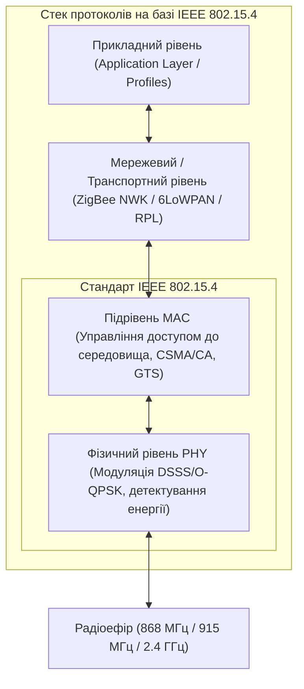
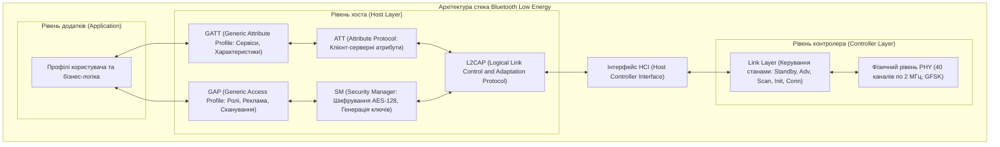
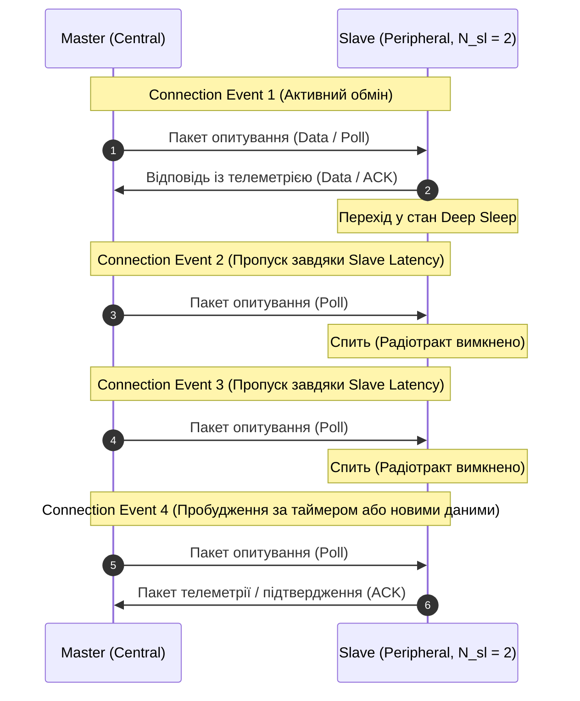
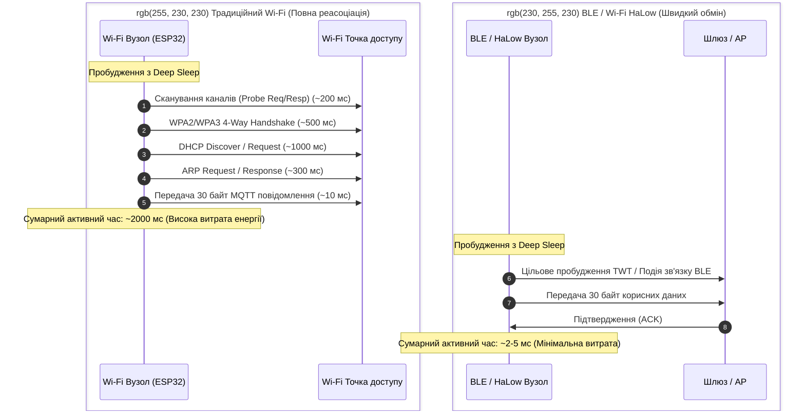
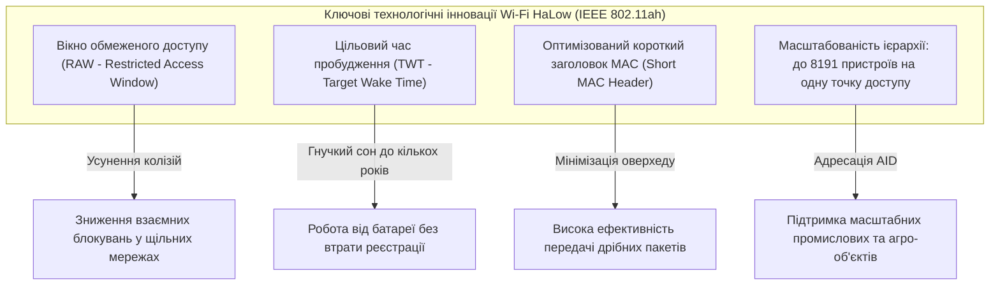

# Змістовий модуль 1. Архітектура, мережі та протоколи ІоТ

# Тема 2. Технології WPAN та WLAN у IoT. Специфіка Wi-Fi в ІоТ

---

## 2.1. Стандарт IEEE 802.15.4

### Основний зміст та теоретичний базис

У процесі побудови сенсорних вузлів та виконавчих систем Інтернету речей ключовим інженерним завданням є вибір бездротового стандарту передачі даних, оптимізованого для роботи в умовах суворих обмежень щодо енергоспоживання, обчислювальної складності та смуги пропускання. Базовим фундаментом для цілого класу бездротових персональних мереж низької швидкості (**LR-WPAN**, Low-Rate Wireless Personal Area Networks) став стандарт **IEEE 802.15.4**. Цей нормативний документ регламентує функціонування виключно двох нижніх рівнів еталонної моделі взаємодії відкритих систем — фізичного рівня (**PHY**, Physical Layer) та підрівня управління доступом до середовища (**MAC**, Medium Access Control), залишаючи реалізацію мережевих і прикладних стеків спеціалізованим протоколам вищого рівня, таким як ZigBee, Thread, WirelessHART, ISA100.11a та 6LoWPAN.

*Рисунок 1 — Структура стека протоколів на основі стандарту IEEE 802.15.4*

Фізичний рівень стандарту розроблений із розрахунку на максимальну стійкість до внутрішньоканальних завад за мінімальної складності приймально-передавального тракту. Стандарт передбачає функціонування в кількох неліцензованих смугах частот категорії ISM (Industrial, Scientific, Medical). У глобальному діапазоні $2{,}4\text{ ГГц}$ виділено 16 частотних каналів із міжканальним інтервалом $5\text{ МГц}$, де застосовується метод прямого розширення спектра послідовністю максимальної довжини (**DSSS**, Direct Sequence Spread Spectrum) у поєднанні зі зміщеною квадратурною фазовою маніпуляцією (**O-QPSK**, Offset Quadrature Phase-Shift Keying). Кожні чотири біти вхідних даних перетворюються на 32-чіпову псевдовипадкову послідовність, що забезпечує швидкість модуляції $2\text{ Мчіп/с}$ та підсумкову інформаційну швидкість $250\text{ кбіт/с}$. Для регіональних субгігагерцових діапазонів ($868{,}0 \dots 868{,}6\text{ МГц}$ у Європі та $902 \dots 928\text{ МГц}$ у Північній Америці) початкові версії стандарту використовували двійкову фазову маніпуляцію (**BPSK**, Binary Phase-Shift Keying), яка забезпечувала швидкості $20\text{ кбіт/с}$ та $40\text{ кбіт/с}$ відповідно, проте в наступних редакціях стандарту (зокрема IEEE 802.15.4-2006 та поправках IEEE 802.15.4e/g) для цих частот також було впроваджено модуляцію O-QPSK та амплітудну маніпуляцію з паралельним розширенням спектра (**PSSS**), що дозволило підвищити швидкість передачі до $100\text{ кбіт/с}$ та $250\text{ кбіт/с}$.

| Параметр фізичного рівня | Діапазон 868 МГц (Європа) | Діапазон 915 МГц (США) | Діапазон 2.4 ГГц (Глобальний) |
| :--- | :--- | :--- | :--- |
| **Кількість частотних каналів** | 1 (канал 0) | 10 (канали 1–10) | 16 (канали 11–26) |
| **Міжканальний інтервал** | — | $2\text{ МГц}$ | $5\text{ МГц}$ |
| **Тип модуляції (IEEE 802.15.4-2003)** | BPSK | BPSK | O-QPSK |
| **Швидкість модуляції (Chip rate)** | $300\text{ кчіп/с}$ | $600\text{ кчіп/с}$ | $2000\text{ кчіп/с}$ |
| **Інформаційна швидкість передачі** | $20\text{ кбіт/с}$ | $40\text{ кбіт/с}$ | $250\text{ кбіт/с}$ |
| **Чутливість приймача (нормативна)** | $-92\text{ дБм}$ | $-92\text{ дБм}$ | $-85\text{ дБм}$ |

Подані в таблиці характеристики демонструють, що діапазон $2{,}4\text{ ГГц}$ надає найкращу пропускну здатність для завдань телеметрії, проте субгігагерцові смуги мають суттєво нижчий коефіцієнт загасання радіохвиль в огороджувальних будівельних конструкціях, що робить їх незамінними в системах промислового та муніципального обліку ресурсів.

Підрівень MAC стандарту IEEE 802.15.4 регламентує функціонування двох типів фізичних пристроїв: повнофункціональних пристроїв (**FFD**, Full-Function Device) та пристроїв з обмеженою функціональністю (**RFD**, Reduced-Function Device). Вузол класу FFD містить повну реалізацію стека MAC, здатний функціонувати в ролі координатора персональної мережі (**PAN Coordinator**), встановлювати власні синхронізовані кластери, транслювати службові маяки та здійснювати ретрансляцію повідомлень. Вузол класу RFD розробляється на базі мікроконтролерів із мінімальним обсягом пам'яті (Class 0 / Class 1 за RFC 7228), взаємодіє в ефірі виключно з одним батьківським FFD-вузлом і ніколи не бере участі в маршрутизації транзитного трафіку, що забезпечує тривале збереження заряду батареї.

*Рисунок 2 — Часова діаграма суперфрейму з активним і неактивним інтервалами за стандартом IEEE 802.15.4*

Організація канального доступу в стандарті здійснюється за двома принциповими режимами: маяковим (Beacon-enabled mode) та безмаяковим (Non-beacon-enabled mode). У безмаяковому режимі пристрої застосовують несинхронізований алгоритм множинного доступу з контролем несучої та уникненням колізій (**Unslotted CSMA/CA**), прослуховуючи ефір перед кожною передачею через механізм оцінки чистоти каналу (**CCA**, Clear Channel Assessment). У маяковому режимі координатор періодично випромінює спеціальні синхронізуючі кадри — маяки, що задають структуру так званого суперфрейму, детально зображеного на рисунку 2. 

Суперфрейм складається рівно з 16 часових квантів (слотів) однакової тривалості й поділяється на активний та неактивний інтервали. В активному інтервалі виділяється період конкурентного доступу (**CAP**, Contention Access Period), де функціонує синхронізований алгоритм **Slotted CSMA/CA**, та період гарантованого безконкурентного доступу (**CFP**, Contention-Free Period). У межах CFP координатор може призначити до 7 гарантованих часових слотів (**GTS**, Guaranteed Time Slots) конкретним критичним сенсорам або актуаторам, що усуває колізії та забезпечує детерміновану передачу інформації в реальному часі. Під час неактивного періоду координатор та підпорядковані вузли переводять трансивери у стан глибокого сну, що знижує середнє енергоспоживання.

Математично тривалість активної частини суперфрейму $SD$ (Superframe Duration) та інтервал між маяками $BI$ (Beacon Interval) визначаються експоненційними залежностями від параметрів порядку суперфрейму $SO$ (Superframe Order) та порядку маяка $BO$ (Beacon Order):

$$SD = \text{aBaseSuperframeDuration} \cdot 2^{SO} = \text{aBaseSlotDuration} \cdot \text{aNumSuperframeSlots} \cdot 2^{SO} \cdot T_{sym}$$

$$BI = \text{aBaseSuperframeDuration} \cdot 2^{BO} = \text{aBaseSlotDuration} \cdot \text{aNumSuperframeSlots} \cdot 2^{BO} \cdot T_{sym}$$

де $\text{aBaseSlotDuration} = 60$ позначає нормативну базову кількість символів в одному часовому слоті; $\text{aNumSuperframeSlots} = 16$ визначає константну кількість слотів у структурі суперфрейму; $T_{sym}$ позначає період передачі одного інформаційного символу ($T_{sym} = 16\text{ мкс}$ для смуги $2{,}4\text{ ГГц}$ при швидкості $62{,}5\text{ ксимв/с}$, що відповідає базовій тривалості $\text{aBaseSuperframeDuration} = 960\text{ символів} = 15{,}36\text{ мс}$); значення параметрів конфігурації перебувають у межах цілих чисел $0 \le SO \le BO \le 14$.

Робочий цикл (Duty Cycle, $DC$) вузлів у маяковій мережі розраховується як частка часу перебування системи в активному стані відносно загального інтервалу повторення маяків:

$$DC = \frac{SD}{BI} = \frac{2^{SO}}{2^{BO}} = 2^{SO - BO}$$

Якщо координатор встановлює значення $SO = 0$ та $BO = 8$, робочий цикл мережі становить $DC = 2^{-8} \approx 0{,}0039$ ($0{,}39\%$). Це свідчить про те, що понад $99{,}6\%$ часу приймально-передавальні тракти сенсорних пристроїв перебувають у вимкненому стані, забезпечуючи багаторічну роботу кінцевих вузлів від одного дискового літієвого елемента живлення.

---

## 2.2. Bluetooth Low Energy (BLE)

### Основний зміст та теоретичний базис

Технологія **Bluetooth Low Energy** (BLE, комерційна назва Bluetooth Smart) була інтегрована до специфікації Bluetooth починаючи з версії 4.0 і суттєво перероблена у версіях 4.2, 5.0 та наступних. Хоча класичний Bluetooth (Basic Rate / Enhanced Data Rate, **BR/EDR**) і BLE функціонують у спільному неліцензованому частотному діапазоні $2{,}4\text{ ГГц}$ ISM ($2400 \dots 2483{,}5\text{ МГц}$), BLE являє собою абсолютно інший протокольний та апаратний дизайн. Він розроблений не для тривалої потокової передачі аудіосигналів чи великих файлів, а для періодичної трансляції ультракоротких пакетів телеметрії з мінімальним часом виходу радіомодуля з режиму сну.

*Рисунок 3 — Рівнева архітектура стека протоколів Bluetooth Low Energy*

Архітектурно стек BLE, наведений на рисунку 3, розділений інтерфейсом хост-контролера (**HCI**, Host Controller Interface) на два функціональні блоки: апаратний контролер (**Controller**) та програмний стек хоста (**Host**). Фізичний рівень контролера ділить смугу $2{,}4\text{ ГГц}$ на 40 радіочастотних каналів із шириною смуги $2\text{ МГц}$ кожен (на відміну від 79 каналів по $1\text{ МГц}$ у класичному Bluetooth). 

Канали чітко розмежовані за функціональним призначенням:
1. Три канали (канали з номерами 37, 38 та 39 з центральними частотами $2402\text{ МГц}$, $2426\text{ МГц}$ та $2480\text{ МГц}$) є первинними каналами реклами (**Primary Advertising Channels**). Вони стратегічно розміщені в інтервалах між неперекривними каналами 1, 6 та 11 стандарту Wi-Fi (IEEE 802.11), що мінімізує ймовірність блокування широкомовних повідомлень BLE інтенсивним Wi-Fi трафіком.
2. Решта 37 каналів (з індексами від 0 до 36) є каналами передачі даних (**Data Channels**). Під час встановленого з'єднання пара пристроїв здійснює адаптивну стрибкоподібну перебудову робочої частоти (**AFH**, Adaptive Frequency Hopping) між цими каналами зі швидкістю до 1600 стрибків на секунду, виключаючи з послідовності зашумлені частоти.

На фізичному рівні BLE версії 5.0 впроваджено три режими роботи: **LE 1M** (базовий некодований режим зі швидкістю передачі символів $1\text{ Мбод}$ та інформаційною швидкістю $1\text{ Мбіт/с}$), **LE 2M** (високошвидкісний некодований режим зі швидкістю $2\text{ Мбод}$ та інформаційною швидкістю $2\text{ Мбіт/с}$, що дозволяє вдвічі скоротити час активного випромінювання передавача і зберегти заряд батареї) та **LE Coded** (далекобійний режим із застосуванням прямого виправлення помилок FEC). У режимі LE Coded кожен біт кодується двома ($S=2$, швидкість $500\text{ кбіт/с}$) або вісьмома ($S=8$, швидкість $125\text{ кбіт/с}$) символами, що покращує чутливість приймача до $-103\text{ дБм}$ і дозволяє збільшити дистанцію прямого зв'язку на відкритому просторі до сотень метрів.

| Режим фізичного рівня BLE 5.0 | Швидкість передачі символів | Корисна швидкість передачі | Схема кодування (FEC) | Чутливість приймача (типова) | Дальність зв'язку на відкритому просторі |
| :--- | :--- | :--- | :--- | :--- | :--- |
| **LE 1M (Обов'язковий)** | $1\text{ Мсимв/с}$ | $1\text{ Мбіт/с}$ | Без кодування | $-94\text{ дБм}$ | До $50 \dots 100\text{ м}$ |
| **LE 2M (Високошвидкісний)** | $2\text{ Мсимв/с}$ | $2\text{ Мбіт/с}$ | Без кодування | $-91\text{ дБм}$ | До $30 \dots 50\text{ м}$ |
| **LE Coded ($S=2$)** | $1\text{ Мсимв/с}$ | $500\text{ кбіт/с}$ | Згортковий код ($S=2$) | $-98\text{ дБм}$ | До $200 \dots 300\text{ м}$ |
| **LE Coded ($S=8$)** | $1\text{ Мсимв/с}$ | $125\text{ кбіт/с}$ | Згортковий код ($S=8$) | $-103\text{ дБм}$ | До $800 \dots 1000\text{ м}$ |

Рівень Link Layer керує кінцевим автоматом станів пристрою: Standby (Очікування), Advertising (Рекламування/Трансляція), Scanning (Сканування), Initiating (Ініціалізація з'єднання) та Connection (З'єднання). У стані з'єднання один пристрій бере на себе роль ведучого (**Master** або Central), а інший — веденого (**Slave** або Peripheral). Взаємодія між ними суворо регламентована регулярними сеансами — подіями з'єднання (**Connection Events**). 

Параметри Connection Event визначають компроміс між латентністю та струмом споживання вузла. Інтервал з'єднання ($T_{conn}$, Connection Interval) може набувати значень від $7{,}5\text{ мс}$ до $4{,}0\text{ с}$ із дискретністю $1{,}25\text{ мс}$. Для максимальної економії енергії веденого вузла Link Layer підтримує параметр затримки веденого (**Slave Latency**, $N_{sl}$). Цей цілочисельний параметр визначає максимальну кількість послідовних подій з'єднання, які ведений пристрій має право проігнорувати і не вмикати свій радіоприймач, якщо він не має нових сформованих даних для передачі.

*Рисунок 4 — Механізм пропуску сеансів опитування у BLE за рахунок параметра Slave Latency*

Послідовність, наведена на рисунку 4, ілюструє, як параметр $N_{sl} = 2$ дозволяє сенсорному вузлу залишатися в режимі низького енергоспоживання протягом трьох інтервалів з'єднання, активуючи радіомодуль лише за необхідності передачі даних або для запобігання тайм-ауту зв'язку (**Supervision Timeout**).

Енергетичний баланс однієї події з'єднання розраховується шляхом інтегрування миттєвої потужності за окремими фазами функціонування вузла:

$$E_{event} = V_{dd} \cdot \left( I_{wake} t_{wake} + I_{rx} t_{rx} + I_{proc} t_{proc} + I_{tx} t_{tx} + I_{post} t_{post} \right)$$

де $E_{event}$ позначає сумарну електричну енергію, витрачену пристроєм на проведення однієї процедури обміну даними (Дж); $V_{dd}$ є напругою живлення мікроконтролерного модуля (В); $I_{wake}$ позначає струм запуску внутрішнього високочастотного кварцового генератора та стабілізаторів напруги (мА) протягом часу $t_{wake}$ (с); $I_{rx}$ відповідає струму активного прослуховування радіоефіру приймачем (мА) під час отримання пакета від Master тривалістю $t_{rx}$ (с); $I_{proc}$ позначає струм обчислювального ядра під час розбору пакета та підготовки відповіді (мА) протягом часу $t_{proc}$ (с); $I_{tx}$ є струмом випромінювання передавача (мА) при відправці пакету у відповідь тривалістю $t_{tx}$ (с); $I_{post}$ позначає струм завершальних операцій збереження стану і переходу в сон тривалістю $t_{post}$ (с).

З урахуванням активованого механізму Slave Latency ($N_{sl}$), коли пристрій відповідає лише один раз на кожні $(N_{sl} + 1)$ подій з'єднання, середня електрична потужність споживання вузла $P_{avg}$ описується формулою:

$$P_{avg} = \frac{E_{event} + V_{dd} \cdot I_{sleep} \cdot \left[ T_{conn} \cdot (N_{sl} + 1) - T_{active} \right]}{T_{conn} \cdot (N_{sl} + 1)}$$

де $I_{sleep}$ позначає фоновий струм вузла у стані Deep Sleep при роботі лише низькочастотного таймера реального часу RTC $32{,}768\text{ кГц}$ (зазвичай становить від $1\text{ мкА}$ до $5\text{ мкА}$ для мікроконтролерів класу ESP32 чи nRF52840); $T_{conn}$ позначає базовий інтервал з'єднання; $T_{active} = t_{wake} + t_{rx} + t_{proc} + t_{tx} + t_{post}$ є сумарним часом активної фази трансивера (який у BLE зазвичай не перевищує $1{,}5 \dots 3{,}0\text{ мс}$). 

Така мікросекундна оптимізація фаз активності забезпечує середній струм споживання на рівні $10 \dots 20\text{ мкА}$, що гарантує безперервну роботу сенсора протягом кількох років від дискової батареї CR2032 ємністю $220\text{ мА·год}$.

---

## 2.3. Wi-Fi HaLow та специфіка використання традиційного Wi-Fi в ІоТ

### Основний зміст та теоретичний базис

Традиційні стандарти локальних бездротових мереж родини **Wi-Fi** (IEEE 802.11 a/b/g/n/ac/ax), функціонуючи в діапазонах $2{,}4\text{ ГГц}$, $5\text{ ГГц}$ та $6\text{ ГГц}$, спочатку оптимізувалися для вирішення завдань із передачі максимальних обсягів даних на високих швидкостях (сотні мегабітів і гігабіти за секунду) між персональними комп'ютерами та мультимедійними терміналами. Однак при спробі застосування класичного Wi-Fi безпосередньо в автономних вузлах Інтернету речей інженери стикаються з критичними системними бар'єрами:

По-перше, радіомодулі традиційного Wi-Fi споживають значний миттєвий струм як під час передачі ($I_{tx} \approx 150 \dots 350\text{ мА}$), так і в режимі постійного прийому/прослуховування ефіру ($I_{rx} \approx 50 \dots 100\text{ мА}$). 

По-друге, процедура повторного входження пристрою в мережу після пробудження зі стану глибокого сну (Deep Sleep із повним знеструмленням радіотракту) вимагає значних часових та енергетичних витрат. Вона передбачає виконання активного або пасивного радіосканування каналів, автентифікації за протоколами WPA2/WPA3 (чотиристороннє рукостискання 4-Way Handshake), виконання процедури асоціації з точкою доступу (**AP**, Access Point), а також отримання IP-адреси за протоколом DHCP і розв'язання адрес через ARP. Сукупний час цієї процедури становить від $1{,}0$ до $4{,}0$ секунд. Увесь цей період радіотракт пристрою працює на максимальній потужності, витрачаючи колосальну кількість енергії ще до моменту відправки першого байта корисного навантаження датчика.

По-третє, традиційні механізми збереження енергії Wi-Fi, такі як **PSM** (Power Save Mode) на основі прослуховування періодичних маяків точки доступу з бітовою картою трафіку **DTIM** (Delivery Traffic Indication Message), змушують клієнтський пристрій прокидатися кожні $100 \dots 300\text{ мс}$. Якщо вузол пропустить кілька DTIM-маяків поспіль через завади або тривалий сон, точка доступу деасоціює клієнта та видаляє його стан зі своєї таблиці комутації, що знову спричиняє енерговитратну процедуру повторної асоціації.

*Рисунок 5 — Порівняльна часова діаграма активної фази обміну даними традиційного Wi-Fi та протоколів класу BLE / Wi-Fi HaLow*

Наведене на рисунку 5 порівняння наочно демонструє причину непридатності традиційного Wi-Fi для живлення від автономних дискових батарей при коротких сеансах зв'язку: накладні витрати на встановлення з'єднання на кілька порядків перевищують тривалість безпосередньої трансляції даних сенсора.

Для подолання цих критичних обмежень організація Wi-Fi Alliance спільно з комітетом IEEE розробила спеціалізований стандарт бездротового зв'язку для Інтернету речей — **IEEE 802.11ah**, що отримав комерційну назву **Wi-Fi HaLow**.

Стандарт Wi-Fi HaLow переносить концепцію Wi-Fi у субгігагерцовий діапазон частот ($850 \dots 950\text{ МГц}$, залежно від нормативної бази конкретної країни). За рахунок використання довших електромагнітних хвиль досягається у $2 \dots 3$ рази більший радіус покриття на відкритій місцевості (понад $1\text{ км}$) та радикально краща здатність огинання і проникнення крізь стіни, перекриття та рослинність порівняно зі стандартами діапазонів $2{,}4\text{ ГГц}$ і $5\text{ ГГц}$. 

Wi-Fi HaLow використовує канали з вузькою смугою пропускання: базовими є смуги $1\text{ МГц}$ та $2\text{ МГц}$ з можливістю об'єднання каналів до $4$, $8$ та $16\text{ МГц}$. Зниження смуги пропускання дозволяє пропорційно зменшити рівень теплового шуму приймача і підвищити енергетичний потенціал лінії радіозв'язку (Link Budget). Фізичний рівень базується на ортогональному частотному мультиплексуванні (**OFDM**, Orthogonal Frequency Division Multiplexing), підтримуючи схеми модуляції від BPSK до 256-QAM, що забезпечує гнучку адаптацію швидкості передачі даних від $150\text{ кбіт/с}$ (на граничних відстанях понад $1\text{ км}$) до десятків мегабітів за секунду.

*Рисунок 6 — Архітектурні компоненти забезпечення енергоефективності та масштабованості в стандарті Wi-Fi HaLow*

Як показано на рисунку 6, висока ефективність стандарту 802.11ah досягається за рахунок чотирьох фундаментальних механізмів рівня MAC:
1. Вікно обмеженого доступу (**RAW**, Restricted Access Window) дозволяє точці доступу сегментувати весь масив обслуговуваних вузлів на окремі групи та виділяти кожній групі унікальні часові інтервали для передачі даних. Це повністю вирішує проблему конкурентного колапсу середовища при одночасній активності тисяч сенсорів.
2. Цільовий час пробудження (**TWT**, Target Wake Time) дає змогу клієнту і точці доступу заздалегідь узгодити точний розклад майбутніх сеансів обміну даними. Вузол може переходити у стан глибокого сну на хвилини, години або навіть дні, не втрачаючи логічної асоціації з точкою доступу та уникаючи повторної автентифікації.
3. Короткий заголовок MAC-кадру (Short MAC Header) зменшує накладні витрати на передачу службових полів протоколу, що суттєво підвищує коефіцієнт корисного використання радіоефіру при трансляції коротких повідомлень телеметрії.
4. Розширена система адресації на основі ідентифікаторів асоціації (**AID**, Association Identifier) збільшує максимальну кількість пристроїв, що одночасно підключаються до однієї точки доступу, до 8191 одиниці.

Математична модель повної енергії $E_{trans}$, що витрачається бездротовим вузлом на одноразову трансляцію блоку телеметричних даних, описується виразом:

$$E_{trans} = V_{dd} \cdot \left( I_{wake} t_{wake} + I_{conn} t_{conn} + \frac{S_{frame}}{R_{bit}} I_{tx} + I_{rx} t_{ack} + I_{post} t_{post} \right)$$

де $V_{dd}$ позначає робочу напругу живлення вузла (В); $I_{wake}$ та $t_{wake}$ визначають струм (мА) та час (с) ініціалізації мікроконтролера і виходу стабілізаторів напруги на робочий режим; $I_{conn}$ позначає струм, споживаний під час процедур синхронізації та асоціації з мережею (мА) протягом часу $t_{conn}$ (с); $S_{frame}$ відповідає сумарному розміру сформованого фізичного кадру (разом зі службовими заголовками PHY/MAC/IP), вираженому в бітах; $R_{bit}$ позначає фізичну швидкість передачі даних у радіоканалі (біт/с); $I_{tx}$ є струмом випромінювання передавача (мА); $I_{rx}$ та $t_{ack}$ визначають струм (мА) та тривалість (с) очікування підтвердження доставки пакета (ACK); $I_{post}$ і $t_{post}$ позначають параметри завершальної фази та переходу мікроконтролера в енергозберігаючий режим.

Питома енергетична вартість передачі одного біта корисної інформації $E_{bit}$ (Дж/біт) обчислюється як:

$$E_{bit} = \frac{E_{trans}}{N_{payload}}$$

де $N_{payload}$ позначає виключно обсяг корисних даних сенсора без урахування службових заголовків (біт).

У традиційному Wi-Fi через тривалий час асоціації ($t_{conn} \approx 1{,}5 \dots 3\text{ с}$) перший доданок $I_{conn} t_{conn}$ домінує в загальному балансі, призводячи до колосальних значень $E_{bit}$ при періодичній передачі дрібних пакетів. Натомість у технологіях BLE та Wi-Fi HaLow завдяки збереженню стану з'єднання та механізму TWT величина $t_{conn} \to 0$, що знижує загальні енергетичні витрати до мінімально можливих фізичних меж.

| Критерій порівняння | IEEE 802.15.4 (ZigBee/6LoWPAN) | Bluetooth Low Energy 5.0 | Традиційний Wi-Fi 4/5 (802.11n/ac) | Wi-Fi HaLow (IEEE 802.11ah) |
| :--- | :--- | :--- | :--- | :--- |
| **Частотний діапазон** | $868\text{ МГц}$ / $915\text{ МГц}$ / $2{,}4\text{ ГГц}$ | $2{,}4\text{ ГГц}$ ISM | $2{,}4\text{ ГГц}$ / $5\text{ ГГц}$ | $850 \dots 950\text{ МГц}$ (Субгігагерцовий) |
| **Ширина каналу** | $5\text{ МГц}$ (для $2{,}4\text{ ГГц}$) | $2\text{ МГц}$ (40 каналів) | $20\text{ МГц}$ / $40\text{ МГц}$ / $80\text{ МГц}$ | $1\text{ МГц}$, $2\text{ МГц}$, $4\text{ МГц}$, $8\text{ МГц}$ |
| **Максимальна швидкість** | $250\text{ кбіт/с}$ | $2\text{ Мбіт/с}$ (LE 2M) | До сотень Мбіт/с | $150\text{ кбіт/с} \dots 15\text{ Мбіт/с}$ (до 86 Мбіт/с) |
| **Дальність дії (назовні)** | $50 \dots 100\text{ м}$ | До $100\text{ м}$ (до $1\text{ км}$ Coded) | $50 \dots 100\text{ м}$ | До $1000 \dots 1500\text{ м}$ |
| **Струм у режимі сну** | $1 \dots 5\text{ мкА}$ | $1 \dots 3\text{ мкА}$ | $10 \dots 50\text{ мкА}$ | $2 \dots 5\text{ мкА}$ |
| **Струм передавача ($I_{tx}$)** | $15 \dots 35\text{ мА}$ | $5 \dots 15\text{ мА}$ | $150 \dots 350\text{ мА}$ | $25 \dots 80\text{ мА}$ |
| **Час встановлення сесії** | $10 \dots 30\text{ мс}$ | $2 \dots 5\text{ мс}$ | $1500 \dots 4000\text{ мс}$ (Cold Boot) | $5 \dots 15\text{ мс}$ (з TWT) |
| **Підтримка IP-адресації** | Потрібен 6LoWPAN | Потрібен IPSP/6LoWPAN | Нативна (IPv4 / IPv6) | Нативна (IPv4 / IPv6) |
| **Ємність мережі (вузлів на AP/Coord)**| До 65535 (теоретична) | До 7 активних (на piconet) | Зазвичай $30 \dots 100$ | До 8191 пристроїв |

Порівняльний аналіз, наведений у таблиці, засвідчує, що стандарт Wi-Fi HaLow усуває фундаментальний розрив між високою швидкістю та нативною IP-адресацією традиційного Wi-Fi з одного боку, та наднизьким енергоспоживанням і великою дальністю технологій WPAN/BLE з іншого. Це робить Wi-Fi HaLow оптимальним вибором для сучасних масштабованих систем розумного міста, інтелектуального сільського господарства та розподілених об'єктів промислового моніторингу.

---

### Питання для самоперевірки та аналітичного осмислення

1. Розкрийте математичний та фізичний зміст розрахунку робочого циклу (Duty Cycle) для маякового режиму функціонування стандарту IEEE 802.15.4 на основі параметрів $SO$ та $BO$.
2. Яким чином вибір трьох первинних каналів реклами (37, 38, 39) у стандарті Bluetooth Low Energy забезпечує завадостійкість до сигналів високопотужних мереж стандарту Wi-Fi (IEEE 802.11)?
3. Проаналізуйте роботу механізму Slave Latency у протоколі Link Layer технології BLE. Які переваги та ризики виникають при надмірному збільшенні значення параметра $N_{sl}$ для контуру керування в реальному часі?
4. Детально поясніть часові та енергетичні причини, через які традиційний Wi-Fi (IEEE 802.11 b/g/n) демонструє вкрай низьку ефективність при живленні сенсорних вузлів від малогабаритних дискових батарей.
5. Опишіть призначення та принципи функціонування механізмів RAW (Restricted Access Window) та TWT (Target Wake Time) у стандарті Wi-Fi HaLow (IEEE 802.11ah).
6. На основі формули розрахунку сумарної енергії передачі кадру $E_{trans}$ поясніть, чому наявність нативної підтримки протоколів IPv4/IPv6 у Wi-Fi HaLow надає системні переваги над використанням рівня адаптації 6LoWPAN у мережах IEEE 802.15.4.
7. Зробіть інженерне обґрунтування вибору бездротового інтерфейсу (IEEE 802.15.4, BLE 5.0, Wi-Fi 4 чи Wi-Fi HaLow) для системи моніторингу вібрації підшипників прокатного стану з частотою дискретизації $2\text{ кГц}$ при живленні від промислової мережі порівняно з автономним вузлом контролю вологості ґрунту на площі $2\text{ км}^2$.