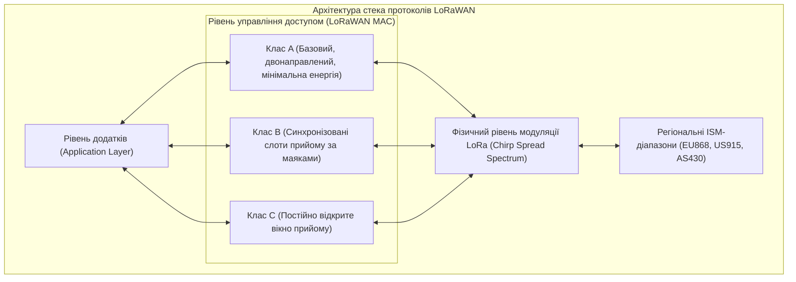
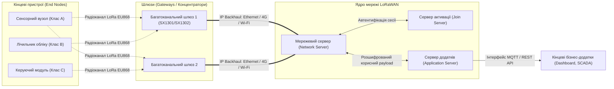
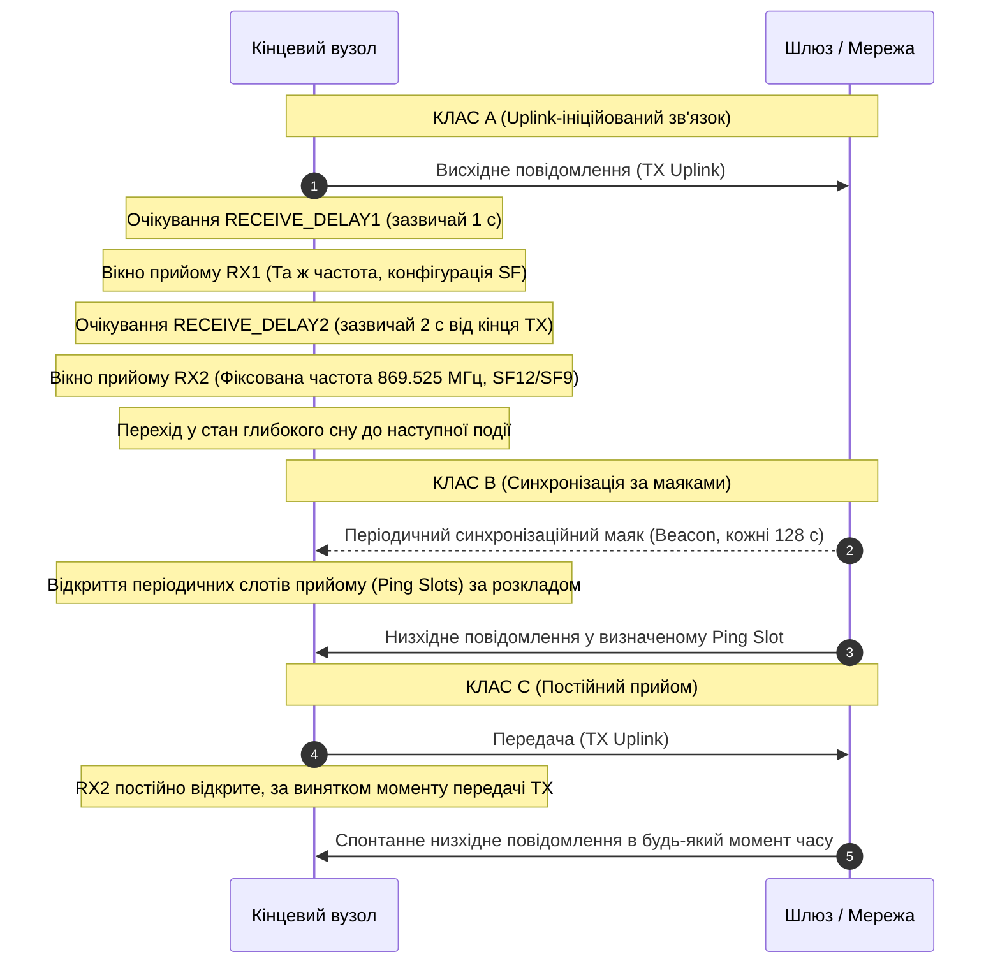
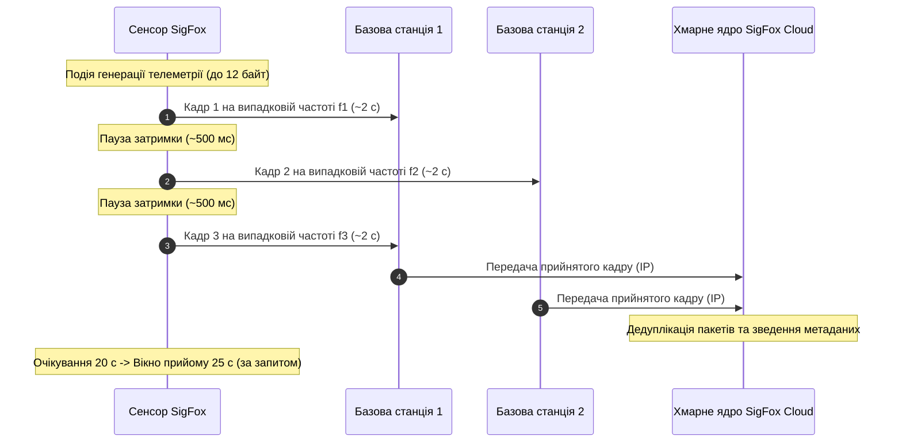
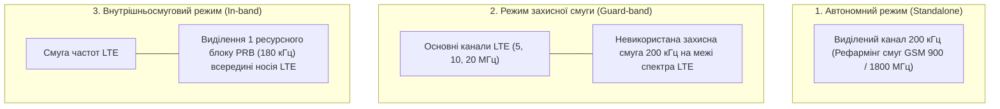
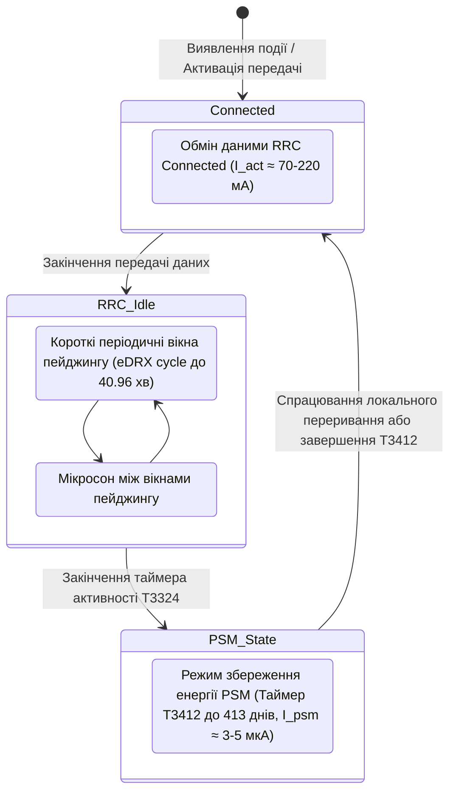

# Змістовий модуль 1. Архітектура, мережі та протоколи ІоТ

# Тема 3. LPWAN технології

---

## 3.1. Архітектура та модуляція LoRaWAN

### Основний зміст та теоретичний базис

У процесі еволюції бездротових сенсорних систем та розподілених кіберфізичних комплексів виникла гостра суперечність між дальністю радіозв'язку, швидкістю передачі даних та енергоспоживанням кінцевих вузлів. Традиційні бездротові мережі стандарту IEEE 802.11 (Wi-Fi) чи IEEE 802.15.1 (Bluetooth), забезпечуючи високу пропускну здатність, вимагають значних енергетичних витрат і мають радіус дії, обмежений кількома десятками або сотнями метрів. З іншого боку, класичні стільникові мережі другого та третього поколінь (2G/3G) характеризуються надмірною апаратною складністю та високим рівнем споживання струму в режимі підтримання радіоканалу, що унеможливлює їх використання в автономних сенсорних пристроях із багаторічним терміном експлуатації від одного хімічного джерела живлення. 

Для подолання цієї проблеми сформувався клас бездротових технологій глобальних мереж із низьким енергоспоживанням (**LPWAN**, Low-Power Wide-Area Network), де пропускна здатність свідомо приноситься в жертву заради досягнення максимального енергетичного потенціалу радіолінії (**Link Budget**) та екстремально низького струму споживання у стані спокою.

Серед усього спектра неліцензованих технологій LPWAN домінуючі позиції займає відкрита екосистема, побудована на поєднанні запатентованого фізичного рівня модуляції **LoRa** (Long Range), розробленого компанією Semtech, та відкритого мережевого протоколу верхнього рівня **LoRaWAN**, стандартизованого міжнародним консорціумом LoRa Alliance. Необхідно чітко розмежовувати ці два поняття: LoRa є виключно методом модуляції радіосигналу на фізичному рівні (PHY), тоді як LoRaWAN регламентує протокол канального доступу (MAC), мережеву топологію, структуру кадрів, механізми безпеки та взаємодію із серверами додатків.

*Рисунок 1 — Структурна декомпозиція стека протоколів LoRa/LoRaWAN*

Фізичний рівень LoRa базується на модифікованому методі розширення спектра лінійною частотною модуляцією (**CSS**, Chirp Spread Spectrum). На відміну від класичного фазового маніпулювання чи прямого розширення спектра послідовністю максимальної довжини (DSSS), у модуляції CSS інформаційні біти кодуються за допомогою широкосмугових радіоімпульсів зі змінною у часі миттєвою частотою — так званих «чірпів» (chirps). Розрізняють висхідні чірпи (**up-chirps**), частота яких лінійно зростає від мінімального до максимального значення смуги пропускання, та спадні чірпи (**down-chirps**), де частота лінійно спадає.

Миттєва частота базового немодульованого висхідного чірпа $f(t)$ у часовому інтервалі тривалості символу $t \in [0, T_{sym}]$ описується лінійною математичною залежністю:

$$f(t) = f_0 - \frac{BW}{2} + \frac{BW}{T_{sym}} \cdot t$$

де $f_0$ позначає центральну несучу частоту радіоканалу, вимірювану в герцах (Гц); $BW$ є шириною смуги пропускання сигналу (Bandwidth), яка для стандартних конфігурацій LoRa зазвичай становить $125\text{ кГц}$, $250\text{ кГц}$ або $500\text{ кГц}$; $T_{sym}$ позначає повну часову тривалість одного модуляційного символу, виражену в секундах (с).

Ключовим параметром, що визначає властивості модуляції LoRa, є коефіцієнт розширення спектра (**SF**, Spreading Factor), який набуває дискретних цілочисельних значень $SF \in \{7, 8, 9, 10, 11, 12\}$. Коефіцієнт розширення показує, скільки бітів інформації кодується одним переданим символом (чірпом). В одному модуляційному символі тривалістю $T_{sym}$ міститься рівно $2^{SF}$ елементарних чіпів. Оскільки швидкість маніпуляції чіпів $R_c$ (Chip Rate) у модуляції LoRa строго дорівнює ширині виділеної смуги пропускання $BW$ ($R_c = BW$ чіпів за секунду), тривалість передачі одного символу $T_{sym}$ однозначно задається виразом:

$$T_{sym} = \frac{2^{SF}}{BW}$$

Кожен інформаційний символ із числовим значенням $S \in [0, 2^{SF}-1]$ модулюється шляхом циклічного часового зсуву початкової частоти висхідного чірпа. Сигнал стартує з проміжної частоти $f_{start} = f_0 - \frac{BW}{2} + \frac{S}{2^{SF}} \cdot BW$, лінійно наростає до верхньої межі смуги $f_0 + \frac{BW}{2}$, після чого миттєво падає до нижньої межі $f_0 - \frac{BW}{2}$ і продовжує наростання протягом залишку часового інтервалу символу. 

Для підвищення завадостійкості модуляція LoRa інтегрує механізм прямого виправлення помилок (**FEC**, Forward Error Correction) зі швидкістю кодування $CR = \frac{4}{4+n}$, де $n \in \{1, 2, 3, 4\}$. 

З урахуванням параметрів $SF$, $BW$ та $CR$, результуюча корисна бітова швидкість передачі даних $R_b$ (біт/с) обчислюється за формулою:

$$R_b = SF \cdot \frac{BW}{2^{SF}} \cdot \left(\frac{4}{4+n}\right)$$

Фізична перевага методу CSS полягає в його екстремальній стійкості до вузькосмугових завад, доплерівського зсуву частоти та ефектів багатопроменевого розповсюдження. Завдяки когерентній кореляційній обробці в приймачі сигнал LoRa надійно демодулюється навіть тоді, коли його потужність перебуває значно нижче спектральної густини потужності теплового шуму. 

Для коефіцієнта розширення $SF = 12$ граничне відношення сигнал/шум (**SNR**, Signal-to-Noise Ratio), при якому забезпечується відновлення даних, досягає $-20\text{ дБ}$ (тобто потужність корисного сигналу становить лише $1\%$ від потужності навколишнього шуму). Загальний енергетичний потенціал радіолінії при цьому сягає $156\text{ дБ}$, що дозволяє встановлювати прямий зв'язок на дистанціях до $15\text{ км}$ у сільській місцевості та до $3\dots 5\text{ км}$ в умовах щільної міської забудови.

*Рисунок 2 — Топологія мережі LoRaWAN типу «зірка зірок» (Star-of-Stars)*

На канальному та мережевому рівнях протокол **LoRaWAN** організовує зв'язок за топологією «зірка зірок» (**Star-of-Stars**), як проілюстровано на рисунку 2. Кінцеві сенсорні вузли не прив'язані до конкретного базового приймача. Вони транслюють пакети широкомовно у радіоефір, і ці пакети можуть бути одночасно прийняті всіма шлюзами (**Gateways**), які перебувають у зоні радіодосяжності. Шлюзи функціонують як прозорі концентратори на базі спеціалізованих мультимодемних мікросхем (наприклад, Semtech SX1301, SX1302 чи SX1303), здатних одночасно демодулювати до 8–16 каналів на різних коефіцієнтах $SF$. Отримані радіопакети інкапсулюються шлюзом у стандартні IP-пакети і через транзитні канали зв'язку (**Backhaul**: Ethernet, 4G/LTE, супутниковий зв'язок) надсилаються на централізований мережевий сервер (**Network Server**).

Мережевий сервер бере на себе складні інтелектуальні функції управління:
- Видаляє дублікати пакетів, отримані від різних шлюзів, залишаючи екземпляр із найкращим показником рівня сигналу (RSSI) та відношенням сигнал/шум (SNR).
- Здійснює перевірку цілісності та автентифікації повідомлень за допомогою коду автентифікації повідомлення (**MIC**, Message Integrity Code).
- Маршрутизує корисне навантаження до відповідного сервера додатків (**Application Server**).
- Вибирає оптимальний шлюз для відправки низхідного повідомлення (**Downlink**).
- Реалізує алгоритм адаптивної швидкості передачі даних (**ADR**, Adaptive Data Rate), який динамічно оптимізує значення $SF$ та потужність передавача $P_{tx}$ для кожного вузла окремо, мінімізуючи час перебування пристрою в ефірі (Time-on-Air) та зберігаючи заряд акумулятора.

Безпека в мережах LoRaWAN побудована на дворівневій криптографічній системі з використанням алгоритму **AES-128**. Під час процедури активації пристрою через ефір (**OTAA**, Over-The-Air Activation) за участю сервера активації (**Join Server**) генеруються два незалежні сесійні ключі: мережевий сесійний ключ **NwkSKey** (застосовується для шифрування заголовків MAC-рівня та розрахунку поля цілісності MIC) та сесійний ключ додатків **AppSKey** (забезпечує наскрізне надійне шифрування корисного навантаження датчика від сенсора до сервера додатків). Завдяки цьому оператор мережевого сервера не має доступу до відкритих даних користувача.

Залежно від часової організації вікон прийому, протокол LoRaWAN ділить кінцеві вузли на три функціональні класи.

*Рисунок 3 — Часові діаграми функціонування класів пристроїв LoRaWAN (Клас A, Клас B, Клас C)*

Пристрої **Класу A** становлять обов'язковий базовий функціонал стандарту. Пристрій перебуває у стані глибокого сну і прокидається виключно за власною ініціативою (Event-driven або за внутрішнім таймером). Після завершення передачі висхідного кадру (TX Uplink) вузол відкриває два короткі слоти прийому — RX1 (через $1\text{ с}$, використовуючи ті самі частоту та $SF$, що й при передачі) та RX2 (через $2\text{ с}$, використовуючи фіксовані параметри, наприклад $869{,}525\text{ МГц}$ на $SF9$ або $SF12$). Клас A має мінімальне енергоспоживання, проте характеризується високою затримкою отримання команд управління від сервера.

Пристрої **Класу B** на додаток до випадкових вікон Класу A періодично відкривають додаткові слоти прийому за розкладом (**Ping Slots**). Для синхронізації внутрішнього таймера вузла шлюзи кожні $128\text{ секунд}$ випромінюють високоточний радіомаяк (**Beacon**), прив'язаний до сигналу супутникової навігації GPS. Це дозволяє серверу надсилати команди до пристрою з гарантованою максимальною затримкою без очікування позачергової передачі від вузла.

Пристрої **Класу C** тримають вікно прийому RX2 відкритим практично безперервно, вимикаючи приймач тільки на короткий момент трансляції власного висхідного пакета. Це усуває будь-які затримки доставки команд від сервера, проте через безперервне енергоспоживання радіоприймача (струм $10\dots 15\text{ мА}$) такі пристрої вимагають підключення до стаціонарної електромережі або використання потужних акумуляторів великої ємності.

---

## 3.2. Технологія SigFox

### Основний зміст та теоретичний базис

Технологія **SigFox**, розроблена однойменною французькою компанією, є пропрієтарним стандартом класу LPWAN, побудованим на принципово іншій фізичній парадигмі, ніж LoRa. Якщо LoRa використовує широкосмугові сигнали з модуляцією CSS для вилучення інформації з-під рівня шуму, то SigFox застосовує технологію надвузькосмугового радіозв'язку (**UNB**, Ultra Narrow Band).

Фізичний принцип UNB полягає в концентрації всієї випромінюваної енергії передавача у надзвичайно вузькій смузі радіочастотного спектра шириною всього $100\text{ Гц}$ (для висхідного каналу Uplink у європейському діапазоні ISM $868\text{ МГц}$). Згідно з фундаментальними законами радіотехніки, інтегральна потужність теплового шуму $P_{noise}$ (Вт) у смузі приймача прямо пропорційна ширині цієї смуги $B$ (Гц):

$$P_{noise} = k \cdot T \cdot B$$

де $k = 1{,}38 \cdot 10^{-23}\text{ Дж/К}$ є сталою Больцмана; $T$ позначає абсолютну термодинамічну температуру приймального тракту (зазвичай приймається $T = 290\text{ К}$).

Завдяки зменшенню смуги пропускання з типових $125\text{ кГц}$ (як у LoRa) до $100\text{ Гц}$ (у $1250$ разів), рівень фонового шуму в каналі SigFox знижується майже на $31\text{ дБ}$. Це дозволяє навіть при використанні найпростіших схем модуляції — диференціальної двійкової фазової маніпуляції (**DBPSK**, Differential Binary Phase Shift Keying) для висхідного каналу та гаусової частотної маніпуляції (**GFSK**, Gaussian Frequency Shift Keying) у смузі $600\text{ Гц}$ для низхідного каналу — досягати високої чутливості базових станцій (до $-142\text{ дБм}$) при використанні низької потужності випромінювання кінцевих пристроїв ($+14\text{ дБм}$, тобто $25\text{ мВт}$).

*Рисунок 4 — Часова та частотна організація передачі даних у системі SigFox з просторово-часовою надмірністю*

Механізм канального доступу SigFox базується на алгоритмі множинного доступу з випадковим вибором частоти та часу (**RFTDMA**, Random Frequency and Time Division Multiple Access). У системі SigFox повністю відсутня процедура попереднього прослуховування ефіру (Non-LBT, Non-Listen-Before-Talk), а також немає процедури реєстрації вузла на конкретній базовій станції. Коли кінцевий пристрій генерує повідомлення, він реалізує підхід «передай і забудь» (**Fire-and-Forget**). 

Як проілюстровано на рисунку 4, задля подолання колізій та інтерференційних завад кожен інформаційний пакет транслюється вузлом рівно тричі: на трьох різних випадкових центральних частотах у межах доступного операційного діапазону $192\text{ кГц}$ та з псевдовипадковими часовими інтервалами затримки ($\Delta t \approx 500\text{ мс}$). 

Така комбінація частотного, часового та просторового рознесення гарантує, що принаймні один із трьох пакетів буде прийнятий хоча б однією базовою станцією оператора, яка перенаправить його до хмарного сервісу **SigFox Cloud**.

Жорсткі обмеження стандарту зумовлені вимогами європейського регламенту ETSI EN 300-220 щодо використання неліцензованих смуг ISM, який обмежує робочий цикл передавачів показником $1\%$ за годину (не більше 36 секунд випромінювання на годину). Оскільки швидкість передачі даних у висхідному каналі SigFox становить лише $100\text{ біт/с}$, трансляція одного кадру займає близько $2$ секунд, а триразова передача пакета триває сукупно близько $6$ секунд активного радіомовлення. 

У зв'язку з цим регламент SigFox встановлює суворі системні ліміти:
- Максимальний розмір корисного навантаження (**Payload**) одного висхідного повідомлення становить рівно $12\text{ байтів}$.
- Кількість висхідних повідомлень суворо обмежена значенням не більше $140\text{ трансляцій на добу}$ для одного пристрою (приблизно 6 повідомлень на годину).
- Низхідний зв'язок (Downlink) має жорстко асиметричний характер: ініціюється виключно кінцевим вузлом (який встановлює відповідний прапорець у висхідному пакеті), дозволяє передати не більше $8\text{ байтів}$ корисних даних та обмежений лімітом до $4\text{ низхідних повідомлень на добу}$.

Енергія $E_{msg}$, необхідна для передачі одного 12-байтного повідомлення SigFox, визначається інтегральною тривалістю триразової посилки:

$$E_{msg} = V_{dd} \cdot I_{tx} \cdot \left( 3 \cdot \frac{L_{frame}}{R_b} \right) + V_{dd} \cdot I_{sleep} \cdot T_{wait}$$

де $V_{dd}$ позначає напругу живлення вузла (В); $I_{tx}$ є струмом споживання вихідного підсилювача потужності передавача під час випромінювання (зазвичай $30\dots 50\text{ мА}$); $L_{frame}$ позначає повну довжину сформованого кадру разом із преамбулою, ідентифікатором пристрою, корисним навантаженням та кодом автентифікації HMAC (становить близько 208 біт); $R_b = 100\text{ біт/с}$ є бітовою швидкістю передачі; $I_{sleep}$ позначає струм мікроконтролера в режимі очікування між трьома посилками тривалістю $T_{wait} \approx 1\text{ с}$.

Організаційна модель SigFox побудована за принципом глобального оператора зв'язку (LPWAN Operator). Кінцевий користувач або інтегратор не має права розгортати власні незалежні приватні базові станції чи локальні сервери; уся телеметрія надходить виключно в інфраструктуру SigFox Cloud, звідки розробник забирає дані через механізми вебретрансляцій (**Callbacks**) або відкриті інтерфейси REST API.

---

## 3.3. Стільниковий ІоТ: NB-IoT

### Основний зміст та теоретичний базис

Альтернативою неліцензованим протоколам LoRaWAN та SigFox виступають стандарти стільникового Інтернету речей (**Cellular IoT**), розроблені міжнародним консорціумом **3GPP** (3rd Generation Partnership Project). Починаючи зі Специфікації Release 13 (2016 рік), було стандартизовано технологію вузькосмугового Інтернету речей **NB-IoT** (Narrowband IoT, стандартизоване найменування LTE Cat-NB1, а в наступних релізах — Cat-NB2). 

Головна відмінність NB-IoT полягає у функціонуванні в ліцензованих діапазонах частот мобільних операторів (наприклад, смуги LTE Band 3 (1800 МГц), Band 8 (900 МГц), Band 20 (800 МГц)), що повністю виключає неконтрольовану інтерференцію від сторонніх пристроїв, гарантує високу якість обслуговування (QoS) та забезпечує безпосереднє підключення до існуючої стільникової інфраструктури без необхідності монтажу проміжних шлюзів.

Стандарт NB-IoT займає мінімальну системну смугу частот шириною рівно $180\text{ кГц}$, що точно відповідає ширині одного фізичного ресурсного блоку (**PRB**, Physical Resource Block) у класичній мережі LTE, а з урахуванням захисних інтервалів вимагає смуги $200\text{ кГц}$. 

Консорціум 3GPP регламентував три взаємовиключні сценарії розгортання радіоінтерфейсу NB-IoT:

*Рисунок 5 — Варіанти частотного розміщення технології NB-IoT у ліцензованому спектрі*

Як проілюстровано на рисунку 5, радіоінтерфейс стандарту може розгортатися у трьох варіантах:
1. Автономний режим (**Standalone Deployment**) передбачає виділення окремого частотного каналу шириною $200\text{ кГц}$ за рахунок конверсії (рефармінгу) застарілого спектра мереж GSM або спеціальних діапазонів, що виключає взаємний вплив із традиційним LTE-трафіком.
2. Режим захисної смуги (**Guard-band Deployment**) використовує вільні захисні інтервали між несучими широкосмугових каналів LTE (шириною 5, 10, 15 або 20 МГц), не зменшуючи пропускну здатність основної мережі стільникового зв'язку.
3. Внутрішньосмуговий режим (**In-band Deployment**) виділяє один фізичний ресурсний блок безпосередньо всередині робочої смуги LTE. У цьому випадку базова станція eNodeB динамічно резервує потужність (Power Boosting до $+6\text{ дБ}$) для забезпечення пріоритетного обслуговування пристроїв NB-IoT.

На фізичному рівні у низхідному каналі зв'язку (Downlink) NB-IoT використовує ортогональне частотне мультиплексування **OFDMA** з міжканальним інтервалом між піднесучими $\Delta f = 15\text{ кГц}$ (12 ортогональних піднесучих у межах ресурсного блоку $180\text{ кГц}$). У висхідному каналі (Uplink) застосовується схема множинного доступу з частотним розділенням та однією несучою **SC-FDMA** (Single-Carrier Frequency-Division Multiple Access). 

Для підтримки пристроїв із різними енергетичними профілями висхідний канал може функціонувати в багатотональному режимі (**Multi-tone**: 3, 6 або 12 піднесучих по $15\text{ кГц}$ з модуляцією QPSK) або однотональному режимі (**Single-tone**). В однотональному режимі підтримується надвузьке рознесення піднесучих $\Delta f = 3{,}75\text{ кГц}$ (48 піднесучих), що дозволяє зосередити випромінювану потужність передавача в надвузькій смузі, кардинально покращуючи енергетичний потенціал лінії зв'язку.

Ключовою технічною перевагою NB-IoT є розширення радіопокриття на $+20\text{ дБ}$ порівняно зі стандартними мережами GSM/LTE, що забезпечує максимальне допустиме загасання в тракті (**MCL**, Maximum Coupling Loss) до $164\text{ дБ}$. Це дозволяє обслуговувати пристрої, розміщені в екранованих підвальних приміщеннях, підземних шахтах, залізобетонних колодязях комунальних систем водопостачання та в глибоких технологічних нішах. 

Фізичний механізм розширення покриття базується не на підвищенні вихідної потужності передавача (яка обмежена рівнем $+23\text{ дБм}$), а на застосуванні багаторазового повторення передачі однакових блоків даних (**Repetition Coding**). Залежно від якості радіоканалу, базова станція призначає один із трьох рівнів покриття (**Coverage Enhancement Levels** — CE0, CE1, CE2), у межах яких кожен радіокадр може повторюватися в ефірі до 128 разів у низхідному каналі та до 2048 разів у висхідному каналі. Приймач здійснює когерентне накопичення енергії всіх повторів, підвищуючи результуюче співвідношення сигнал/шум.

Для досягнення багаторічної автономної роботи (до 10 років від батареї типу AA ємністю $2500\text{ мА·год}$) у стандарті NB-IoT реалізовано два специфічні енергозберігаючі протокольні механізми рівня управління радіоресурсами (RRC):

*Рисунок 6 — Діаграма станів енергозбереження пристрою NB-IoT (RRC Connected, eDRX в режимі Idle, Power Saving Mode)*

**Режим збереження енергії (PSM, Power Saving Mode)** дозволяє пристрою після сеансу зв'язку та закінчення активного таймера $T3324$ (Active Timer, від $2\text{ с}$ до кількох хвилин) переходити у стан надглибокого сну, в якому радіотракт повністю знеструмлюється, а струм споживання не перевищує $3\dots 5\text{ мкА}$. При цьому вузол залишається зареєстрованим у ядрі стільникової мережі (Core Network), зберігаючи всі безпекові контексти та IP-адресу. Тривалість періоду перебування в PSM регулюється розширеним таймером періодичного оновлення зони відстеження $T3412$ (Extended Periodic TAU), який може досягати 413 діб. Пробудження відбувається або за спрацюванням зовнішнього переривання сенсора, або після закінчення таймера $T3412$.

**Розширений режим переривчастого прийому (eDRX, Extended Discontinuous Reception)** оптимізує стан очікування (RRC Idle). Замість перевірки радіоефіру кожні $1{,}28 \dots 2{,}56\text{ с}$, як у класичному LTE, протокол eDRX збільшує інтервали між циклами пейджингового опитування базової станції до $40{,}96\text{ хвилин}$, що дозволяє значно знизити витрати енергії пристроями, які повинні періодично приймати низхідні команди управління.

---

## 3.4. Порівняльний аналіз та інженерна оцінка LPWAN технологій

### Основний зміст та теоретичний базис

Вибір конкретної технології глобальної бездротової мережі низького енергоспоживання для проєктування системи Інтернету речей є багатокритеріальною оптимізаційною задачею. Інженер-розробник повинен оцінювати такі параметри, як частотний діапазон, топологія, вартість розгортання інфраструктури, вимоги до затримки передачі сигналів, обсяг корисного навантаження, глибина покриття та запланований термін служби батареї.

| Системний параметр | LoRaWAN (Клас A/B/C) | SigFox | NB-IoT (3GPP Cat-NB1/NB2) |
| :--- | :--- | :--- | :--- |
| **Використовуваний частотний спектр** | Неліцензований ISM ($868\text{ МГц}$, $915\text{ МГц}$, $433\text{ МГц}$) | Неліцензований ISM ($868\text{ МГц}$, $902\text{ МГц}$) | Ліцензовані смуги операторів стільникового зв'язку (LTE Bands) |
| **Ширина смуги каналу (Bandwidth)** | $125\text{ кГц}$, $250\text{ кГц}$, $500\text{ кГц}$ | $100\text{ Гц}$ (Uplink), $600\text{ Гц}$ (Downlink) | $180\text{ кГц}$ (один PRB LTE), $200\text{ кГц}$ із захисними смугами |
| **Фізичний метод модуляції** | Chirp Spread Spectrum (CSS) | DBPSK (Uplink), GFSK (Downlink) | SC-FDMA (Uplink), OFDMA (Downlink) |
| **Пікова корисна швидкість** | $250\text{ біт/с} \dots 50\text{ кбіт/с}$ | $100\text{ біт/с}$ | $20 \dots 250\text{ кбіт/с}$ (Cat-NB1/NB2) |
| **Максимальний розмір корисних даних** | $51 \dots 222\text{ байти}$ (динамічно від SF) | $12\text{ байтів}$ (Uplink), $8\text{ байтів}$ (Downlink) | До $1600\text{ байтів}$ (підтримка стандартного MTU IP) |
| **Енергетичний потенціал (Link Budget)**| $150 \dots 156\text{ дБ}$ | $155 \dots 160\text{ дБ}$ | $164\text{ дБ}$ (розширення $+20\text{ дБ}$) |
| **Максимальна дальність зв'язку** | Сільська місцевість: до $15\text{ км}$; Місто: $3\dots 5\text{ км}$ | Сільська місцевість: до $40\text{ км}$; Місто: $5\dots 10\text{ км}$ | Сільська місцевість: до $15\text{ км}$; Місто: $1\dots 3\text{ км}$ (підвали) |
| **Підтримка нативної IP-адресації** | Ні (потрібен рівень адаптації SCHC/6LoWPAN) | Ні (суто прикладний транслятор Callbacks) | Так (нативна підтримка стеків IPv4/IPv6, UDP, CoAP, MQTT) |
| **Типова затримка доставки (Latency)** | Клас A: секунди; Клас C: $< 50\text{ мс}$ | $1 \dots 10\text{ секунд}$ (асиметрична) | $1{,}5 \dots 10\text{ секунд}$ (до $30\text{ с}$ при 128 повторах) |
| **Модель розгортання мережі** | Приватні автономні мережі або публічні оператори | Виключно глобальний оператор SigFox | Виключно оператори мобільного стільникового зв'язку |
| **Безпека та шифрування** | Дворівневий AES-128 (NwkSKey + AppSKey) | 16-байтний ключ HMAC (без нативного шифрування Payload) | Шифрування рівня 3GPP (AES-128/256, SNOW 3G, ZUC) + DTLS/TLS |

Аналітичний розбір зведених характеристик показує чіткі інженерні межі використання кожного зі стандартів:

Технологія **SigFox** орієнтована на найпростіші сценарії моніторингу з украй рідкісним надсиланням даних (розумні поштові скриньки, базові датчики заповнення сміттєвих баків, сигналізатори відкриття люків). Її головна перевага — найнижча вартість радіомодуля та рекордна дальність передачі сигналу завдяки принципу надвузької смуги UNB. Проте жорсткі ліміти на обсяг пакета ($12\text{ байтів}$) та неможливість розгортання власної локальної інфраструктури без підписки на послуги глобального оператора суттєво звужують сферу її застосування.

Технологія **LoRaWAN** є лідером для побудови приватних і корпоративних бездротових мереж на промислових підприємствах, у портах, розумних кампусах університетів, агрохолдингах та системах муніципального обліку ресурсів. Можливість вільного розгортання власних шлюзів і незалежних серверів управління (на базі рішень з відкритим кодом ChirpStack або The Things Stack) усуває операційні витрати на оплату трафіку операторам. Гнучка система вибору класів пристроїв (A, B, C) дозволяє створювати як повністю автономні сенсори, так і виконавчі пристрої з миттєвим часом реакції.

Стандарт **NB-IoT** є найбільш технологічно розвиненим рішенням для критичної інфраструктури, що вимагає максимальної проникаючої здатності в підвальні приміщення, гарантованої якості обслуговування (QoS) та нативної підтримки протоколів сімейства TCP/IP (IPv6, CoAP, MQTT). Використання ліцензованого спектра повністю захищає мережу від завад, притаманних перевантаженим безліцензійним діапазонам $868\text{ МГц}$ та $2{,}4\text{ ГГц}$. Однак розгортання NB-IoT вимагає обов'язкової наявності SIM-картки/eSIM для кожного кінцевого вузла та сплати абонентської плати оператору стільникового зв'язку, а в умовах максимального покриття (CE2 з масивними повтореннями пакетів) енергоспоживання вузла значно зростає.

---

### Питання для самоперевірки та аналітичного осмислення

1. Розкрийте фізичний принцип модуляції Chirp Spread Spectrum (CSS) у технології LoRa. Яким чином зміна коефіцієнта розширення спектра ($SF$) впливає на тривалість передачі символу $T_{sym}$, чутливість приймача та бітову швидкість радіоканалу?
2. На основі математичної моделі теплового шуму приймального тракту поясніть, чому технологія надвузькосмугового зв'язку SigFox (UNB) забезпечує високу чутливість базових станцій (до $-142\text{ дБм}$) без використання складних алгоритмів розширення спектра.
3. Опишіть три класи кінцевих пристроїв у стандарті LoRaWAN (Клас A, Клас B, Клас C). Які схемотехнічні та алгоритмічні фактори визначають різницю в їхніх енергетичних бюджетах і показниках затримки доставки низхідних команд?
4. Проаналізуйте принципи організації безпеки в протоколі LoRaWAN. Яку роль відіграють сесійні ключі NwkSKey та AppSKey у реалізації наскрізного шифрування між сенсором, мережевим сервером та кінцевим сервером додатків?
5. Детально охарактеризуйте три варіанти розгортання стандарту NB-IoT у радіочастотному спектрі (Standalone, Guard-band, In-band). Які переваги та технічні компроміси притаманні кожному з цих варіантів?
6. Розкрийте механізм досягнення розширення радіопокриття на $+20\text{ дБ}$ (MCL до $164\text{ дБ}$) у стандарті NB-IoT. Як застосування багаторазових повторень пакетів (Repetition Coding) впливає на пропускну здатність каналу та швидкість розряду джерела живлення?
7. Проаналізуйте роботу механізмів енергозбереження PSM (Power Saving Mode) та eDRX у мережах NB-IoT. Яким чином значення таймерів $T3324$ та $T3412$ впливають на режим функціонування стільникового радіомодема та можливість віддаленого опитування сенсора?