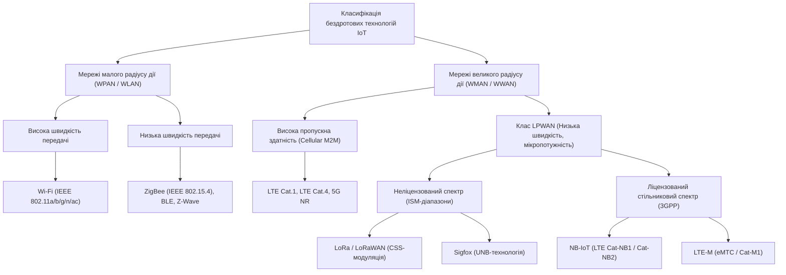
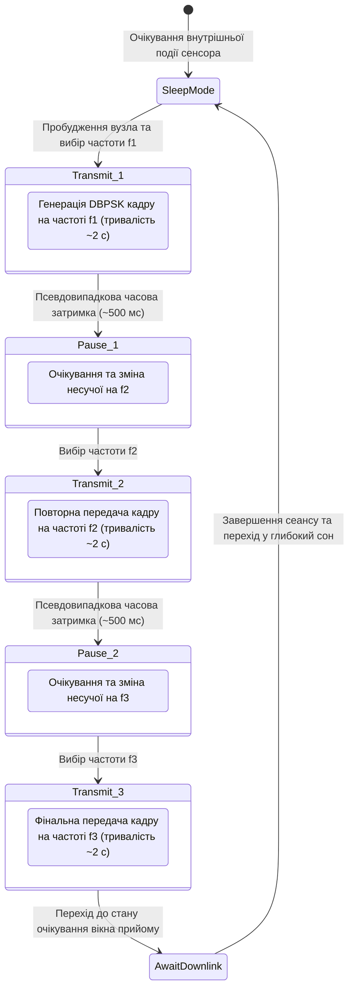
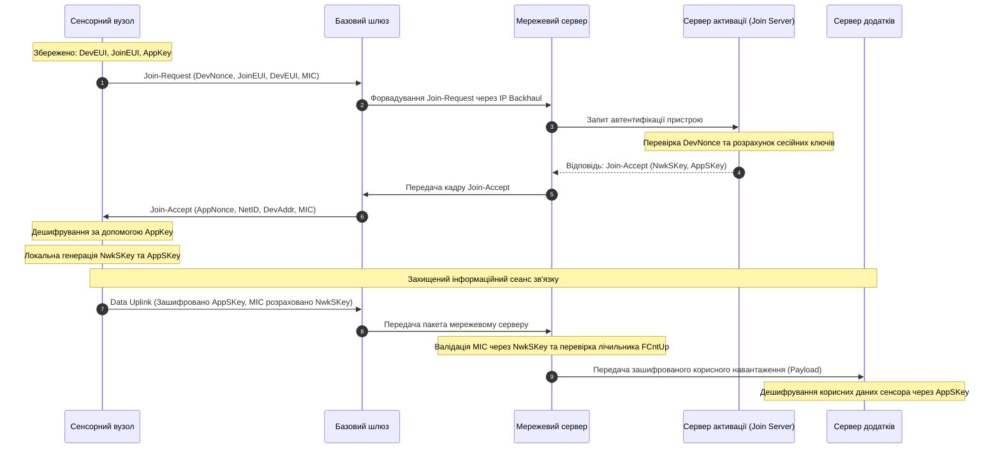
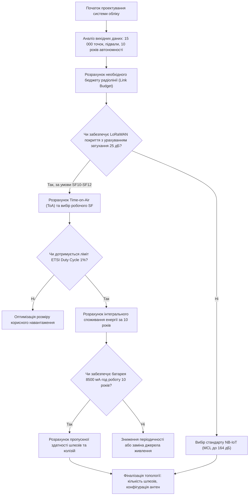

# Тема 3. Технології бездротових глобальних мереж низької потужності (LPWAN): LoRaWAN, Sigfox та NB-IoT

## Мета лекції

Формування у майбутніх фахівців комплексної системи фундаментальних теоретичних знань і практичних компетентностей щодо фізичних принципів передачі сигналів, архітектурної побудови, канальних протоколів доступу та алгоритмів енергозбереження в бездротових глобальних мережах низької потужності (LPWAN). Дисципліна закладає інженерну базу для обґрунтованого проектування, розгортання та адміністрування телекомунікаційної інфраструктури інтернету речей, забезпечуючи вміння знаходити компроміс між пропускною здатністю каналу, енергетичним потенціалом радіолінії, радіусом покриття та тривалістю автономної роботи кінцевих пристроїв для вирішення прикладних завдань автоматизації, розумного обліку та моніторингу виробничих процесів.

## Очікувані результати навчання

1. **Знання та розуміння.** Здобувачі вищої освіти засвоять теоретичні положення побудови систем LPWAN, фізичну природу методів модуляції з розширенням спектра (Chirp Spread Spectrum) та надвузькосмугового зв'язку (Ultra Narrow Band), архітектурні особливості стеків протоколів LoRaWAN, Sigfox, а також специфікацію стандарту стільникового зв'язку NB-IoT у ліцензованому спектрі.
2. **Застосування.** Студенти набудуть практичних умінь розраховувати енергетичний бюджет радіолінії (Link Budget), визначати часові параметри перебування пакета в ефірі (Time-on-Air), конфігурувати режими енергозбереження кінцевих модулів (PSM, eDRX) та призначати класи функціонування терміналів відповідно до вимог технічного завдання.
3. **Аналіз.** Слухачі зможуть виконувати порівняльний декомпозиційний аналіз мережевих топологій, досліджувати залежність завадостійкості від коефіцієнтів розширення спектра і кодових повторень, а також оцінювати вразливості систем та протокольні обмеження ліцензованого і неліцензованого радіочастотного спектра.
4. **Оцінювання та синтез.** Майбутні інженери зможуть критично оцінювати техніко-економічну ефективність впровадження різних стандартів LPWAN для спеціалізованих сценаріїв використання та синтезувати оптимальну архітектуру гетерогенної мережі збору телеметрії з дотриманням нормативних вимог робочого циклу (Duty Cycle) і криптографічного захисту даних.

---

## Детальний покроковий план лекції

### 1. Теоретико-концептуальний базис. Фізичні основи модуляції та мережеві архітектури LPWAN
* 1.1. Еволюційна суперечність між дальністю, швидкістю передачі та енергоспоживанням у бездротових сенсорних мережах та передумови формування класу LPWAN.
* 1.2. Фізичні засади технології LoRa: модуляція з лінійним частотним розширенням спектра (Chirp Spread Spectrum), коефіцієнт розширення (SF) та механізм прямої корекції помилок (FEC).
* 1.3. Принципи надвузькосмугового радіозв'язку (Ultra Narrow Band) у технології Sigfox: спектральна щільність потужності шуму, просторово-часове рознесення та метод канального доступу RFTDMA.
* 1.4. Архітектура радіоінтерфейсу стандарту NB-IoT: використання методів OFDMA і SC-FDMA та сценарії частотного розгортання в ліцензованому спектрі LTE (Standalone, Guard-band, In-band).

### 2. Методологія та аналіз граничних умов. Протокольні стеки, енергетичні бюджети та системні бар'єри
* 2.1. Канальний протокол LoRaWAN: топологія «зірка зірок», часові профілі вікон прийому класів пристроїв (Клас A, Клас B, Клас C) та функціонування алгоритму адаптивної швидкості (ADR).
* 2.2. Механізми енергозбереження та забезпечення зв'язності в ліцензованих мережах: протокольні стани RRC, режими PSM і eDRX, кодування повтореннями для розширення покриття на 20 дБ.
* 2.3. Організація інформаційної безпеки: дворівневе симетричне шифрування AES-128 у LoRaWAN, автентифікація повідомлень у Sigfox та захист каналів стільникового зв'язку рівня 3GPP.
* 2.4. Комплексний порівняльний аналіз технологій LoRaWAN, Sigfox та NB-IoT за параметрами пропускної здатності, затримок (latency), енергетичного потенціалу та підтримки IP-адресації.
* 2.5. Критичні обмеження, регуляторні бар'єри робочого циклу передавачів (Duty Cycle за нормами ETSI) та проблеми масштабованості при масовому розгортанні вузлів у неліцензованих смугах частот.

### 3. Практичний індустріальний / фаховий кейс. Проектування бездротової інфраструктури збору телеметрії
**Тема наскрізної задачі.** «Розробка та розрахунок параметрів бездротової мережі автоматизованого обліку водопостачання в умовах щільної міської забудови та підвального розташування вузлів обліку».

## 1. Теоретико-концептуальний базис. Фізичні основи модуляції та мережеві архітектури LPWAN

### 1.1. Еволюційна суперечність між дальністю, швидкістю передачі та енергоспоживанням у бездротових сенсорних мережах та передумови формування класу LPWAN

Проєктування бездротових сенсорних мереж та розподілених кіберфізичних систем історично стримувалося фундаментальним компромісом між радіусом просторового охоплення, швидкістю передачі даних та енергетичною автономністю кінцевого вузла. У межах класичної теорії зв'язку гранична пропускна здатність каналу зв'язку в умовах адитивного білого гаусового шуму описується теоремою Шеннона-Гартлі:

$$C = B \log_2 \left(1 + \frac{P_{sig}}{P_{noise}}\right)$$

де $C$ позначає пропускну здатність каналу, вимірювану в бітах за секунду; $B$ є шириною смуги пропускання частотного каналу в герцах; $P_{sig}$ представляє середню потужність корисного сигналу на вході приймача у ватах; $P_{noise}$ виражає інтегральну потужність шуму в межах обраної смуги пропускання у ватах.

З наведеного математичного виразу випливає, що за фіксованого відношення потужності сигналу до потужності шуму підвищення швидкості передачі інформації вимагає пропорційного розширення частотної смуги $B$. Одночасно, відповідно до рівняння радіолокаційного та радіозв'язкового бюджету лінії (**Link Budget**), рівень прийнятої потужності сигналу $P_{rx}$ на вході приймача залежить від потужності випромінювання передавача, коефіцієнтів підсилення антен і втрат розповсюдження у вільному просторі:

$$P_{rx} = P_{tx} + G_{tx} + G_{rx} - L_{path} - L_{misc}$$

де $P_{rx}$ та $P_{tx}$ позначають потужності сигналу на прийомі та передачі відповідно, виражені в децибел-міліватах (дБм); $G_{tx}$ та $G_{rx}$ визначають коефіцієнти спрямованої дії передавальної та приймальної антен у децибелах (дБі); $L_{path}$ відповідає загальним втратам енергії радіохвилі на трасі розповсюдження (Path Loss) у децибелах; $L_{misc}$ акумулює апаратні втрати в антенно-фідерному тракті та деградацію сигналу через перешкоди у децибелах.

Традиційні бездротові технології локального та персонального радіусу дії, такі як IEEE 802.11 (Wi-Fi), оптимізовані для максимізації пропускної здатності шляхом розширення смуги до десятків мегагерц та застосування складних квадратурних амплітудних модуляцій, однак їхній енергетичний бюджет обмежує радіус дії межами сотні метрів, а струм споживання радіотракту виключає багаторічну роботу від автономного хімічного джерела. Навпаки, стандарти бездротових персональних мереж, такі як IEEE 802.15.4 (ZigBee) або IEEE 802.15.1 (Bluetooth Low Energy), зменшують енергоспоживання завдяки звуженню робочого циклу трансивера, проте через низьку чутливість приймального тракту (порядку $-85\dots -95\text{ дБм}$) та обмежену вихідну потужність вимагають організації складної ретрансляційної комірчастої топології (**mesh-мережі**) для покриття значних географічних зон. Своєю чергою, ретрансляція пакетів проміжними вузлами призводить до лавиноподібного вичерпання енергії батарей вузлів-маршрутизаторів та створює непередбачувані затримки при доставці пакетів.

Класичні стільникові технології попередніх поколінь (GSM/GPRS/3G) покривають великі відстані, проте надмірне ускладнення протоколів сигналізації, необхідність безперервної синхронізації з базовими станціями та значні пікові струми прийомопередавача (до $2\text{ А}$ у піках передачі GSM) роблять автономне використання польових пристроїв тривалістю понад кілька місяців неможливим без заміни джерел струму. 

У результаті усвідомлення цих обмежень виник новий клас мережевих технологій — глобальні мережі з низьким енергоспоживанням (**LPWAN**, Low-Power Wide-Area Network). Технологічна парадигма LPWAN докорінно змінює пріоритети: пропускна здатність свідомо знижується до одиниць або десятків кілобіт за секунду (а в деяких випадках — до сотень біт за секунду), що дозволяє радикально підвищити енергетичний потенціал радіолінії до $150\dots 164\text{ дБ}$. Це забезпечує прямий зв'язок між кінцевими сенсорами та базовими станціями на відстанях у десятки кілометрів без проміжних ретрансляторів, зберігаючи теоретичний термін експлуатації батареї пристрою до $5\dots 10\text{ років}$.

Нижче наведена діаграма класифікації бездротових технологій Інтернету речей відповідно до їхньої просторової досяжності та швидкості передачі даних.

> **ПРАКТИЧНИЙ ЯКІР:** У муніципальних системах обліку води міста Барселона розгортання технологій LPWAN замість ручного зчитування лічильників дозволило підключити понад 200 000 пристроїв обліку в підвальних приміщеннях через єдину мережу з менш ніж сорока базових станцій, забезпечивши гарантований термін автономної роботи кінцевих радіомодулів протягом дванадцяти років від інтегрованих літій-тіонілхлоридних батарей.

---

### 1.2. Фізичні засади технології LoRa: модуляція з лінійним частотним розширенням спектра (Chirp Spread Spectrum), коефіцієнт розширення (SF) та механізм прямої корекції помилок (FEC)

Технологія **LoRa** (Long Range) представляє фізичний рівень (Physical Layer, PHY) зв'язку, права на який належать корпорації Semtech. В її основі лежить метод розширення спектра лінійною частотною модуляцією (**CSS**, Chirp Spread Spectrum). На відміну від класичних систем із фазовою маніпуляцією (наприклад, BPSK або QPSK), у модуляції CSS інформаційним носієм виступає синусоїдальний сигнал, частота якого безперервно та лінійно змінюється протягом тривалості символу — так званий **чірп** (chirp).

Математичний опис миттєвої частоти базового немодульованого висхідного чірпа (**up-chirp**) у часовому вікні передачі символу $t \in [0, T_{sym}]$ задається лінійним рівнянням:

$$f(t) = f_{0} - \frac{BW}{2} + \left( \frac{BW}{T_{sym}} \right) \cdot t$$

де $f_{0}$ позначає центральну носійну частоту радіоканалу в герцах; $BW$ є шириною смуги пропускання сигналу (Bandwidth) у герцах; $T_{sym}$ позначає повну часову тривалість одного символу модуляції в секундах. 

Для спадного чірпа (**down-chirp**) похідна миттєвої частоти за часом є від'ємною, тобто частота лінійно спадає від значення $f_{0} + \frac{BW}{2}$ до значення $f_{0} - \frac{BW}{2}$. Спадні чірпи використовуються здебільшого для формування службових сигналів преамбули кадру, забезпечуючи мережеву синхронізацію часових шкал передавача та приймача.

Ключовим параметром цифрового керування характеристиками фізичного каналу LoRa є коефіцієнт розширення спектра (**SF**, Spreading Factor), який може набувати дискретних цілочисельних значень від 7 до 12. Фізичний зміст коефіцієнта розширення полягає в тому, що він визначає кількість інформаційних бітів, що кодуються одним радіосимволом:

$$\text{Кількість бітів на символ} = SF$$

Кожен символ тривалістю $T_{sym}$ формується з рівно $2^{SF}$ елементарних дискретних складових частотної траєкторії, які називаються **чіпами** (chips). Швидкість маніпуляції чіпів $R_c$ (Chip Rate) у модуляції LoRa тотожно дорівнює ширині виділеної смуги пропускання сигналу, тобто $R_c = BW$ (чіпів за секунду). Звідси випливає фундаментальна формула визначення часової тривалості одного символу LoRa:

$$T_{sym} = \frac{2^{SF}}{BW}$$

Кодування конкретного інформаційного значення символу $S$, де ціле число $S \in [0, 2^{SF}-1]$, здійснюється за допомогою циклічного часового зсуву початкової точки частотного розгортання. Сигнал стартує з проміжної частоти $f_{start} = f_{0} - \frac{BW}{2} + \frac{S}{2^{SF}} \cdot BW$, лінійно наростає до верхньої межі $f_{0} + \frac{BW}{2}$, після чого стрибкоподібно переходить до нижньої межі $f_{0} - \frac{BW}{2}$ та продовжує наростання до моменту завершення символу $T_{sym}$. Оскільки такий циклічний зсув зберігає незмінною похідну $\frac{df}{dt}$, сигнали з однаковими $BW$ та $SF$ мають ідентичний нахил траєкторії в частотно-часовій площині.

Сигнали, згенеровані з різними коефіцієнтами розширення $SF$, взаємно квазіортогональні. Це дозволяє приймачеві шлюзу на одній несучій частоті та в межах однієї смуги пропускання одночасно й без взаємного руйнування демодулювати кілька потоків даних від різних кінцевих пристроїв, якщо вони передають пакети з різними значеннями $SF$.

Для забезпечення стабільності каналу в умовах глибоких завмирань фізичний рівень LoRa інтегрує механізм прямої корекції помилок (**FEC**, Forward Error Correction). Швидкість кодування задається відношенням:

$$CR = \frac{4}{4 + n}, \quad n \in \{1, 2, 3, 4\}$$

де $n$ визначає кількість доданих надлишкових бітів паритету на кожні чотири біти корисних даних. З урахуванням коефіцієнта розширення $SF$, смуги пропускання $BW$ та обраного значення кодового рівня $CR$, результуюча корисна швидкість передачі бітів $R_b$ обчислюється наступним чином:

$$R_b = SF \cdot \frac{BW}{2^{SF}} \cdot \left( \frac{4}{4 + n} \right)$$

Зі збільшенням параметра $SF$ тривалість передачі символу подвоюється з кожним кроком, внаслідок чого корисна бітова швидкість падає, проте пропорційно зростає енергія, зосереджена в одному символі. Завдяки кореляційній обробці демодулятор LoRa здатний виявляти сигнал при співвідношеннях потужності сигналу до потужності шуму (**SNR**, Signal-to-Noise Ratio), що лежать значно нижче рівня шумів (до $-20\text{ дБ}$ для $SF=12$). Гранична чутливість приймача $S_{rx}$ (дБм) описується залежністю:

$$S_{rx} = -174 + 10 \log_{10}(BW) + NF + \text{SNR}_{limit}$$

де $-174\text{ дБм/Гц}$ представляє спектральну густину потужності теплового шуму за кімнатної температури; $NF$ є коефіцієнтом шуму приймального тракту в децибелах; $\text{SNR}_{limit}$ відповідає мінімальному значенню відношення сигнал/шум, необхідному для стійкої демодуляції конкретного $SF$. Для смуги $125\text{ кГц}$ і $SF=12$ чутливість досягає $-137\text{ дБм}$, забезпечуючи енергетичний потенціал лінії зв'язку понад $155\text{ дБ}$.

> **ТИПОВА ПОМИЛКА:** Поширена інженерна помилка полягає в ототожненні понять «LoRa» та «LoRaWAN». LoRa є виключно запатентованим пропрієтарним фізичним рівнем модуляції сигналів, що реалізується на кристалах трансиверів (Semtech SX1276, SX1262), тоді як LoRaWAN є відкритим протоколом вищих рівнів (канального доступу MAC, мережевого управління та шифрування), який розроблений консорціумом LoRa Alliance і може функціонувати навіть поверх інших фізичних рівнів, таких як FSK.

---

### 1.3. Принципи надвузькосмугового радіозв'язку (Ultra Narrow Band) у технології Sigfox: спектральна щільність потужності шуму, просторово-часове рознесення та метод канального доступу RFTDMA

На відміну від підходу LoRa, побудованого на значному штучному розширенні смуги випромінювання (Spread Spectrum), альтернативна технологія **Sigfox** базується на концепції надвузькосмугової передачі (**UNB**, Ultra Narrow Band). Фізичний принцип UNB полягає в тому, що сигнал випромінюється у надзвичайно вузькій смузі частот шириною всього лише $100\text{ Гц}$ для європейського регіону (стандарт ETSI $868\text{ МГц}$) або $600\text{ Гц}$ для Північної Америки (стандарт FCC $902\text{ МГц}$).

Зв'язок між шириною спектральної смуги та рівнем шумів безпосередньо випливає з формули потужності теплового (найквістового) шуму в радіоканалі:

$$P_{noise} = k \cdot T \cdot B$$

де $k$ позначає постійну Больцмана ($1{,}38 \times 10^{-23}\text{ Дж/К}$); $T$ відповідає абсолютній температурі приймача в кельвінах; $B$ є еквівалентною шумовою смугою пропускання фільтра приймача в герцах. 

У логарифмічній шкалі потужність шуму при кімнатній температурі ($T = 290\text{ К}$) описується виразом:

$$P_{noise}\text{ [дБм]} = -174\text{ [дБм/Гц]} + 10 \log_{10}(B)$$

Порівнюючи смугу пропускання LoRa ($B = 125\text{ кГц}$) та смугу Sigfox ($B = 100\text{ Гц}$), можна простежити різницю в інтегральній потужності теплового шуму, що потрапляє у вхідний тракт приймача:

$$P_{noise, \text{LoRa}} = -174 + 10 \log_{10}(125000) = -174 + 51 = -123\text{ дБм}$$

$$P_{noise, \text{Sigfox}} = -174 + 10 \log_{10}(100) = -174 + 20 = -154\text{ дБм}$$

Таким чином, колосальне звуження смуги приймання в технології Sigfox забезпечує фізичне зниження потужності внутрішнього шуму на $31\text{ дБ}$. Завдяки цьому зникає потреба в алгоритмах розширення спектра для детектування сигналів нижче рівня шумів: звичайна диференціальна двійкова фазова маніпуляція (**DBPSK**, Differential Binary Phase Shift Keying), застосована у висхідному каналі (Uplink), забезпечує чутливість базових станцій оператора на рівні $-142\dots -146\text{ дБм}$ за вихідної потужності передавача кінцевого вузла всього $+14\text{ дБм}$ ($25\text{ мВт}$). У низхідному каналі (Downlink) використовується гаусова частотна маніпуляція (**GFSK**) у смузі $600\text{ Гц}$ зі швидкістю передачі даних $600\text{ біт/с}$.

Метод канального доступу в Sigfox класифікується як множинний доступ із випадковим вибором частоти та часу (**RFTDMA**, Random Frequency and Time Division Multiple Access). На кінцевих пристроях відсутня функція попереднього прослуховування ефіру перед початком передачі (Listen-Before-Talk, LBT). Вузол не синхронізується з базовою станцією за часом і не виконує процедур узгодження з'єднання (Handshake). 

Для забезпечення необхідної ймовірності доставки пакетів в умовах некерованої колізійної обстановки застосовується парадигма просторово-часового та частотного рознесення (**Spatial, Frequency, and Time Diversity**). Кожне повідомлення передається пристроєм тричі: на трьох різних випадкових центральних частотах у межах доступного операційного діапазону шириною $192\text{ кГц}$, причому між цими трьома передачами витримуються випадкові часові інтервали тривалістю кілька сотень мілісекунд. Передане повідомлення приймається одночасно всіма базовими станціями в зоні радіовидимості, після чого дедуплікація та збирання даних виконуються в хмарному ядрі мережі (**Sigfox Cloud**).

Нижче наведена діаграма часового процесу формування та випромінювання триразового пакета передачі Sigfox.

Через використання бітової швидкості лише $100\text{ біт/с}$ сумарний час передачі одного кадру корисного навантаження становить близько двох секунд, а весь триразовий цикл випромінювання займає до шести секунд активної роботи передавача. Суворі нормативні регламенти європейського комітету ETSI EN 300-220 обмежують максимальний робочий цикл випромінювання (**Duty Cycle**) величиною $1\%$ за годину, що еквівалентно 36 секундам трансляції на годину для одного термінала. Внаслідок цього архітектура Sigfox має фундаментальні регуляторні та протокольні обмеження:
- Довжина корисного навантаження висхідного повідомлення обмежена значенням рівно $12\text{ байтів}$.
- Кількість висхідних трансляцій становить максимум $140\text{ повідомлень на добу}$ для одного термінала.
- Обсяг низхідного повідомлення від базової станції не перевищує $8\text{ байтів}$, а кількість таких трансляцій жорстко лімітована до чотирьох сеансів на добу.

> **ПРАКТИЧНИЙ ЯКІР:** Система автономної охоронної сигналізації та захисту від глушіння Securitas Direct використовує технологію Sigfox як резервний завадозахищений канал передачі сигналу тривоги: завдяки ширині спектра всього 100 Гц передача сигналу тривоги успішно проходить крізь навмисні широкосмугові завади побутових глушилок радіочастот GSM/3G/4G, які застосовують зловмисники.

---

### 1.4. Архітектура радіоінтерфейсу стандарту NB-IoT: використання методів OFDMA і SC-FDMA та сценарії частотного розгортання в ліцензованому спектрі LTE (Standalone, Guard-band, In-band)

Стандарт **NB-IoT** (NarrowBand Internet of Things), стандартизований консорціумом 3GPP у межах Специфікацій Release 13 (LTE Cat-NB1) та Release 14/15 (LTE Cat-NB2), є відповіддю телекомунікаційної індустрії на розвиток неліцензованих протоколів LPWAN. Його ключовою концептуальною відмінністю є функціонування виключно в межах ліцензованого спектра частот операторів стільникового зв'язку (смуги LTE Band 1, 3, 8, 20, 28 тощо). Це гарантує повну відсутність некерованої радіоінтерференції, що виникає в загальнодоступних ISM-діапазонах, забезпечує високу якість обслуговування (**QoS**) та детермінований час передачі сигналів.

Фізичний радіоінтерфейс стандарту NB-IoT адаптовано під системну смугу шириною рівно $180\text{ кГц}$, що точно відповідає ширині одного стандартного фізичного ресурсного блоку (**PRB**, Physical Resource Block) у мережах широкосмугового доступу LTE, а разом із необхідними захисними інтервалами вимагає смуги пропускання $200\text{ кГц}$. 

Специфікація 3GPP визначає три базові сценарії розгортання радіоінтерфейсу NB-IoT у ліцензованому частотному спектрі оператора:

1. Автономний режим (**Standalone**) передбачає виділення окремої смуги частот $200\text{ кГц}$, отриманої шляхом рефармінгу однієї або кількох несних каналів застарілої системи GSM (де ширина несучої становить $200\text{ кГц}$), або використання вільного спектра технології CDMA. Даний режим повністю виключає взаємний вплив стільникового LTE-трафіку та сенсорної мережі.
2. Режим захисної смуги (**Guard-band**) використовує невикористовуваний спектральний ресурс на захисних інтервалах між несучими широкосмугових каналів LTE (наприклад, смуг шириною $5$, $10$, $15$ або $20\text{ МГц}$). Це дозволяє розгорнути послугу без втрати ресурсних блоків комерційного мобільного трафіку користувачів.
3. Внутрішньосмуговий режим (**In-band**) виділяє один робочий ресурсний блок PRB безпосередньо всередині загальної смуги частот діючого носія LTE. У цьому сценарії базова станція (eNodeB) виділяє ресурси часу та потужності для терміналів NB-IoT динамічно, резервуючи додаткове підсилення потужності (Power Boosting на $3\dots 6\text{ дБ}$) для виділеного блока.

На рівні фізичної модуляції в низхідному каналі (Downlink від базової станції до пристрою) завжди застосовується технологія ортогонального частотного мультиплексування **OFDMA** (Orthogonal Frequency Division Multiple Access) із міжканальним інтервалом $\Delta f = 15\text{ кГц}$. У межах смуги $180\text{ кГц}$ формуються рівно 12 паралельних піднесучих, кожна з яких модулюється методом QPSK.

У висхідному каналі (Uplink від пристрою до базової станції) стандарт підтримує метод множинного доступу з частотним розділенням та однією несучою **SC-FDMA** (Single-Carrier FDMA), що знижує відношення пікової до середньої потужності сигналу (PAPR) та запобігає перевитраті заряду джерела живлення. Для висхідного каналу стандартизовано два режими роботи:
- Багатотональний режим (**Multi-tone**), де передавач активує 3, 6 або 12 піднесучих із частотним рознесенням $\Delta f = 15\text{ кГц}$, використовуючи модуляцію QPSK, що забезпечує пікову швидкість висхідного каналу до $62{,}5\text{ кбіт/с}$ (у Cat-NB1) або до $158\text{ кбіт/с}$ (у Cat-NB2).
- Однотональний режим (**Single-tone**), де застосовується лише одна піднесуча з рознесенням $\Delta f = 15\text{ кГц}$ або спеціально передбаченим надвузьким рознесенням $\Delta f = 3{,}75\text{ кГц}$ (загалом 48 піднесучих у каналі) з модуляцією $\pi/2\text{-BPSK}$ або $\pi/4\text{-QPSK}$. Однотональний режим дозволяє сконцентрувати всю потужність передавача ($23\text{ дБм}$, або $200\text{ мВт}$) у надвузькій смузі, максимізуючи щільність випромінювання.

Фундаментальною перевагою NB-IoT є технологія розширення радіопокриття на $+20\text{ дБ}$ порівняно з базовим рівнем стандарту GSM/LTE, що забезпечує максимальні допустимі втрати на трасі розповсюдження (**MCL**, Maximum Coupling Loss) до $164\text{ дБ}$. Такий результат досягається за рахунок механізму надлишкового канального повторення блоків даних (**Repetition Coding**). Залежно від виміряного рівня втрат у радіоканалі, базова станція відносить пристрій до одного з трьох рівнів охоплення покриття (**Coverage Enhancement**, CE):
- Нормальний рівень покриття (CE Level 0) із відсутністю або мінімальною кількістю повторень (MCL до $144\text{ дБ}$).
- Посилений рівень покриття (CE Level 1) із кількістю повторень блоків до 16 разів (MCL до $154\text{ дБ}$).
- Екстремальний рівень покриття (CE Level 2) із багаторазовим дублюванням кожного переданого субкадру до 128 разів у низхідному каналі та до 2048 разів у висхідному каналі (MCL до $164\text{ дБ}$). 

Приймач когерентно накопичує енергію всіх повторених копій пакетів, що дозволяє демодулювати сигнал крізь залізобетонні перекриття, екрановані підвальні стіни та масивні металеві кришки технологічних колодязів підземних комунікацій.

Нижче наведено порівняльну таблицю фізичних та системних характеристик базових бездротових технологій, що розглядаються у курсі.

| Параметр порівняння | LoRa / LoRaWAN | Sigfox | NB-IoT (3GPP Cat-NB1) | ZigBee (IEEE 802.15.4) |
| :--- | :--- | :--- | :--- | :--- |
| **Частотний спектр** | Неліцензований (ISM 868/915 МГц) | Неліцензований (ISM 868/902 МГц) | Ліцензований (LTE Band 3, 8, 20 тощо) | Неліцензований (ISM 2,4 ГГц, 868 МГц) |
| **Ширина каналу** | 125 кГц, 250 кГц, 500 кГц | 100 Гц (Uplink), 600 Гц (Downlink) | 180 кГц (один ресурсний блок LTE) | 5 МГц (для діапазону 2,4 ГГц) |
| **Метод модуляції** | Chirp Spread Spectrum (CSS) | DBPSK (Uplink), GFSK (Downlink) | SC-FDMA (Uplink), OFDMA (Downlink) | O-QPSK з розширенням DSSS |
| **Максимальний Link Budget** | $155\dots 157\text{ дБ}$ | $155\dots 160\text{ дБ}$ | $164\text{ дБ}$ (розширення покриття +20 дБ) | $105\dots 110\text{ дБ}$ |
| **Пікова корисна швидкість** | 250 біт/с – 50 кбіт/с | 100 біт/с | 20 – 62,5 кбіт/с | 250 кбіт/с |
| **Обсяг корисного навантаження**| 51 – 222 байти (залежно від SF) | Фіксовано 12 байт (Uplink) | До 1600 байт (нативна підтримка IP) | До 102 байтів |
| **Топологія мережі** | Зірка зірок (Star-of-Stars) | Зірка до хмари (Star-to-Cloud) | Зірка мобільного зв'язку (eNodeB) | Комірчаста (Mesh), дерево кластерів |
| **Приклад з реальної практики** | Локальна телеметрія агрохолдингу через приватні шлюзи | Сигналізація викрадення автотранспорту в межах континенту | Розумні лічильники газу в глибоких підвалах мегаполіса | Домашня система автоматизації освітлення за протоколом ZigBee |

> **КОНТРОЛЬНЕ ПИТАННЯ:** Чому застосування максимального рівня кодування повтореннями (Coverage Enhancement Level 2 із фактором дублювання до 2048 разів) у стандарті NB-IoT забезпечує проникнення сигналу в підвали з показником MCL до $164\text{ дБ}$, але одночасно створює критичну загрозу розрахунковому життєвому циклу автономного джерела живлення сенсора?

Розгорнути аналіз / відповідь

**Правильний варіант: Зростання тривалості активного стану передавача (Time-on-Air) у сотні разів збільшує сумарне споживання енергії на передачу одиничного кадру, нівелюючи переваги енергозберігаючих режимів.**

1. Механізм розширення покриття (Coverage Enhancement) у стандарті NB-IoT не збільшує пікову потужність передавача понад апаратну межу $+23\text{ дБм}$ ($200\text{ мВт}$), а базується на тривалому накопиченні енергії сигналу шляхом когерентного складання багаторазово повторених однакових субкадрів (до 2048 разів). У нормальному режимі (CE Level 0) час випромінювання пакета становить десятки мілісекунд, і витрати заряду акумулятора є мізерними. У режимі CE Level 2 час перебування вузла в стані активної передачі з максимальним струмом споживання ($I_{tx} \approx 120\dots 220\text{ мА}$) розтягується на десятки секунд для передачі одного короткого повідомлення. У результаті один сеанс передачі витрачає заряд батареї, еквівалентний тисячам передач у сприятливих умовах, що скорочує розрахунковий 10-річний ресурс джерела струму до кількох місяців.

2. Аналіз дистракторів:
- Твердження про те, що батарея деградує через надмірне перегрівання передавача чи короткочасні сплески імпульсного струму, є технічно неточним, оскільки піковий струм обмежений внутрішньою схемотехнікою підсилювача і не перевищує номінальних розрядних характеристик літієвих елементів живлення.
- Припущення, що падіння ресурсу батареї спричинене постійними колізіями з сусідніми терміналами, є помилковим, оскільки в стандарті NB-IoT базова станція централізовано планує ортогональні часово-частотні ресурси для кожного вузла, повністю усуваючи випадкові колізії на канальному рівні.

---

### Вказівки для самостійного осмислення

1. Розрахуйте тривалість перебування в ефірі (Time-on-Air) для пакета LoRa з довжиною корисного навантаження 32 байти, шириною смуги пропускання 125 кГц, швидкістю кодування CR 4/5 та коефіцієнтами розширення спектра SF=7 та SF=12 відповідно, проаналізувавши кількісну різницю у витратах енергії між двома конфігураціями.
2. Проаналізуйте обмеження регламенту ETSI EN 300-220 щодо річного балансу використання неліцензованого спектра частот та сформулюйте аналітичний висновок про придатність протоколу Sigfox для побудови мереж моніторингу вібрацій промислового обладнання з частотою дискретизації вимірювань один раз на хвилину.
3. Дослідіть архітектурні відмінності розподілу висхідних піднесучих технології NB-IoT у режимах Single-tone (з рознесенням 3,75 кГц) та Multi-tone (з рознесенням 15 кГц) з точки зору мінімізації коефіцієнта пік-фактора потужності (PAPR) вихідного підсилювача передавача.

## 2. Методологія та аналіз граничних умов. Протокольні стеки, енергетичні бюджети та системні бар'єри

### 2.1. Канальний протокол LoRaWAN: топологія «зірка зірок», часові профілі вікон прийому класів пристроїв (Клас A, B, C) та функціонування алгоритму адаптивної швидкості (ADR)

Організація канального доступу в екосистемі LoRaWAN базується на децентралізованому протоколі типу Pure ALOHA, за якого пристрої ініціюють трансляцію даних асинхронно, без попереднього прослуховування несучої частоти. Відсутність вимоги щодо постійної синхронізації з базовою станцією дозволяє кінцевому пристрою перебувати в режимі глибокого сну з мікропотужним струмом споживання до моменту виникнення вимірювальної або таймерної події. Проте взаємодія кінцевого вузла з мережевим сервером суттєво різниться залежно від програмно-апаратного класу пристрою.

Пристрої **Класу A** підтримують найбільш енергоефективну модель, де кожен цикл зв'язку є виключно висхідним (**Uplink-driven**). Після випромінювання пакета передавач вимикається, і мікроконтролер переходить в режим очікування на час інтервалу $RECEIVE\_DELAY1$ (за стандартом — $1\text{ секунда}$), після чого відкриває перше приймальне вікно $RX1$. Якщо на центральній частоті та з коефіцієнтом розширення висхідного пакета сигнал від шлюзу не зафіксовано протягом тривалості преамбули, вузол вимикає радіотракт до завершення інтервалу $RECEIVE\_DELAY2$ ($2\text{ секунди}$ від моменту закінчення передачі). У вікні $RX2$ прийом здійснюється на окремій загальносистемній частоті (для регіону EU868 це $869{,}525\text{ МГц}$) із фіксованим заниженим коефіцієнтом розширення спектра (зазвичай $SF9$ або $SF12$). Якщо команда чи підтвердження не надійшли у вікні $RX2$, вузол знеструмлює трансивер до наступної ініціативи висхідної передачі.

Пристрої **Класу B** усувають головне обмеження Класу A — неможливість доставки повідомлень від сервера за ініціативою самого сервера без попереднього висхідного запиту. Для цього мережеві шлюзи випромінюють високоточний радіомаяк (**Beacon**) кожні $128\text{ секунд}$, прив'язаний до секундної мітки супутників GPS. Кінцевий пристрій синхронізує свій внутрішній кварцовий генератор із цим маяком і за детермінованим псевдовипадковим алгоритмом періодично активує короткі слоти прийому (**Ping Slots**). Тривалість одного слота становить близько $30\text{ мс}$, а їхня частота може варіюватися від одного слота за секунду до одного слота за весь інтервал між маяками. Це гарантує доставку низхідного трафіку з прогнозованою максимальною затримкою.

Пристрої **Класу C** забезпечують роботу з мінімально можливою латентністю, оскільки їхнє вікно прийому $RX2$ залишається відкритим постійно, вимикаючись виключно на інтервал випромінювання власних висхідних кадрів або на час роботи вікна $RX1$. Постійний струм споживання високочастотної частини трансивера (на рівні $10\dots 15\text{ мА}$) робить експлуатацію таких модулів від автономних батарей неможливою без використання зовнішнього джерела живлення.

Фундаментальним механізмом балансування ємності мережі та енергоспоживання вузлів у LoRaWAN є алгоритм адаптивної швидкості передачі даних (**ADR**, Adaptive Data Rate). Цей механізм передає контроль над параметрами радіолінії мережевому серверу. Сервер накопичує історію вимірювань якості сигналу для останніх $N$ пакетів (за замовчуванням $N = 20$) від конкретного пристрою, оцінюючи параметри відношення сигнал/шум ($SNR$).

Формалізований процес адаптації фізичних параметрів радіоканалу в алгоритмі ADR виконується за наступною математичною процедурою:

$$
\begin{aligned}
\text{Крок 1 (Оцінка запасу завадостійкості):} & \quad SNR_{margin} = \max_{i=1..N}(SNR_i) - SNR_{req}(SF) - M_{margin} \\
\text{Крок 2 (Визначення кількості кроків оптимізації):} & \quad N_{steps} = \mathrm{round}\left(\frac{SNR_{margin}}{3}\right) \\
\text{Крок 3 (Зниження коефіцієнта розширення):} & \quad \Delta SF = \min\left(N_{steps}, SF_{current} - SF_{min}\right) \\
& \quad SF_{new} = SF_{current} - \Delta SF \\
\text{Крок 4 (Зниження вихідної потужності передавача):} & \quad N_{pwr} = N_{steps} - \Delta SF \\
& \quad P_{tx, new} = \max\left(P_{tx, min}, P_{tx, current} - N_{pwr} \cdot 3\text{ дБ}\right)
\end{aligned}
$$

де $\max_{i=1..N}(SNR_i)$ представляє максимальне відношення сигнал/шум серед останніх $N$ прийнятих висхідних пакетів у децибелах; $SNR_{req}(SF)$ є теоретичним мінімальним порогом демодуляції для поточного коефіцієнта розширення спектра; $M_{margin}$ позначає внутрішній інженерний запас надійності каналу (Device Margin, зазвичай встановлюється рівним $10\text{ дБ}$); значення $3\text{ дБ}$ відповідає кроку між суміжними значеннями $SF$ або ступенями дискретного атенюатора потужності вихідного каскаду передавача.

Після виконання розрахунку мережевий сервер формує спеціальну керуючу команду канального рівня `LinkADRReq`, яка передається пристрою в найближчому вікні прийому. Вузол змінює конфігурацію регістрів радіомодема та повертає підтвердження `LinkADRAns`.

> **ГРАНИЧНІ УМОВИ:** Алгоритм ADR стає абсолютно нерелевантним і призводить до катастрофічної втрати зв'язку, якщо кінцеві вузли встановлені на мобільних об'єктах (наприклад, у системах моніторингу громадського транспорту чи відстеження великої рогатої худоби). Під час переміщення об'єкта багатопроменева інтерференція та просторове віддалення від базової станції змінюють профіль каналу набагато швидше, ніж сервер накопичує історію з 20 висхідних повідомлень. Якщо сервер на основі сприятливих вимірювань зменшить параметр $SF$ до мінімального значення $SF7$, а об'єкт переміститься за масивну залізобетонну споруду, рівень сигналу миттєво впаде нижче порогу чутливості, внаслідок чого пристрій втратить канал зв'язку з мережею на тривалий час. Для рухомих об'єктів механізм ADR повинен бути примусово деактивований у прошивці мікроконтролера.

---

### 2.2. Механізми енергозбереження та забезпечення зв'язності в ліцензованих мережах: протокольні стани RRC, режими PSM і eDRX, кодування повтореннями для розширення покриття на 20 дБ

На відміну від мереж з довільним доступом, протокольний стек стандарту **NB-IoT** базується на суворій часово-частотній синхронізації та виділенні радіоресурсів під керуванням базової станції (eNodeB). На канальному та мережевому рівнях взаємодія регулюється протоколом управління радіоресурсами (**RRC**, Radio Resource Control). Класичний для систем мобільного зв'язку стан безперервного моніторингу пейджингових повідомлень утилізує занадто багато енергії, тому в специфікаціях 3GPP Release 13 стандартизовано два специфічні режими енергозбереження: **PSM** та **eDRX**.

У режимі **PSM** (Power Saving Mode) пристрій після завершення обміну пакетами у стані $RRC\_Connected$ переходить у режим очікування $RRC\_Idle$ і запускає активний таймер $T3324$. Протягом часу дії таймера $T3324$ термінал залишається доступним для низхідних викликів базової станції. Після вичерпання цього часового інтервалу модуль вимикає приймальний і передавальний тракти, входячи у стан надглибокого сну з типовим споживанням струму $I_{psm} \approx 3\dots 5\text{ мкА}$. 

Головна відмінність стану PSM від повного вимкнення живлення полягає в збереженні контексту реєстрації пристрою в опорній мережі (Core Network): збереженими залишаються виділена IP-адреса, ідентифікатори базової станції та криптографічні ключі сесії. Пристрій перебуває в режимі PSM до завершення дії періодичного таймера оновлення зони відстеження (**TAU**, Tracking Area Update) $T3412$, значення якого може сягати $413\text{ діб}$, або до виникнення апаратного переривання від сенсора.

Режим **eDRX** (Extended Discontinuous Reception) оптимізує інтервали прийому у фазі $RRC\_Idle$. Замість класичного циклу перевірки пейджингового каналу тривалістю $1{,}28\dots 2{,}56\text{ с}$, режим eDRX збільшує цей період до величини $40{,}96\text{ хвилини}$. В інтервалах між циклами пейджингу пристрій повністю вимикає радіоприймач, мінімізуючи середній інтегральний струм споживання в очікуванні команд від системи автоматизації.

Іншим критичним механізмом NB-IoT є технологія забезпечення зв'язності через залізобетонні перешкоди шляхом розширення максимальних допустимих втрат на трасі розповсюдження радіохвилі до $MCL = 164\text{ дБ}$, що на $20\text{ дБ}$ перевищує характеристики класичного стандарту LTE. 

Аналітичний розрахунок енерговитрат на одну сесію передачі даних $E_{session}$ в умовах граничного розширення покриття (Coverage Enhancement Level 2) формалізується наступним покроковим рівнянням:

$$
\begin{aligned}
\text{Крок 1 (Час перебування в активній передачі):} & \quad T_{tx\_active} = N_{rep} \cdot T_{subframe} \cdot K_{blocks} \\
\text{Крок 2 (Енергія фази випромінювання):} & \quad E_{tx} = V_{dd} \cdot I_{tx}(P_{max}) \cdot T_{tx\_active} \\
\text{Крок 3 (Енергія процедури синхронізації NPRACH):} & \quad E_{sync} = V_{dd} \cdot I_{tx}(P_{max}) \cdot \left(N_{preamble\_rep} \cdot T_{preamble}\right) \\
\text{Крок 4 (Сумарні енергетичні витрати циклу):} & \quad E_{session} = E_{sync} + E_{tx} + V_{dd} \cdot I_{rx} \cdot T_{rx\_ack}
\end{aligned}
$$

де $N_{rep}$ представляє коефіцієнт повторення блоків даних у висхідному каналі (може досягати значення до 2048 разів); $T_{subframe}$ позначає тривалість одного субкадру стандарту, що дорівнює $1\text{ мс}$; $K_{blocks}$ є кількістю сформованих субкадрів з корисним навантаженням; $V_{dd}$ позначає робочу напругу живлення вузла (В); $I_{tx}(P_{max})$ виражає струм споживання передавача на максимальній вихідній потужності $+23\text{ дБм}$ (зазвичай від $180$ до $250\text{ мА}$); $N_{preamble\_rep}$ позначає кількість повторень преамбули каналу випадкового доступу NPRACH; $T_{preamble}$ є тривалістю однієї преамбули; $I_{rx}$ та $T_{rx\_ack}$ відповідають струму споживання приймача та тривалості очікування підтвердження відповідно.

> **ГРАНИЧНІ УМОВИ:** Фізична модель розширення покриття NB-IoT через багаторазові повторення ($N_{rep} \gg 1$) демонструє повну непридатність для систем із жорстким детермінованим часом реакції (Hard Real-Time). За максимального значення фактора повторення висхідного каналу тривалість передачі одного інформаційного пакета розміром 50 байтів зростає від початкових $50\text{ мс}$ до $25\dots 35\text{ секунд}$. Крім того, тривале випромінювання на максимальній потужності призводить до локального нагрівання кристала радіомодуля, стрибкоподібного падіння напруги на внутрішньому опорі хімічного джерела живлення та скорочення реального терміну експлуатації батареї від розрахункових 10 років до менш ніж 8 місяців.

---

### 2.3. Організація інформаційної безпеки: дворівневе симетричне шифрування AES-128 у LoRaWAN, автентифікація повідомлень у Sigfox та захист каналів стільникового зв'язку рівня 3GPP

Безпека в технологіях глобальних мереж низької потужності розглядається через призму балансу між криптографічною стійкістю та ресурсними обмеженнями апаратних обчислювачів кінцевих вузлів, які зазвичай базуються на 8-бітних або 32-бітних мікроконтролерах із ядрами ARM Cortex-M0+/M3 та мізерним обсягом пам'яті.

У стандарті **LoRaWAN** реалізовано дворівневу модель симетричної криптографії на базі стандарту блочного шифрування **AES-128**. Підключення пристрою до мережі здійснюється за двома сценаріями: персоналізація при виробництві (**ABP**, Activation By Personalization) або активація через ефір (**OTAA**, Over-The-Air Activation). З точки зору безпеки стандарт категорично рекомендує процедуру OTAA.

Нижче наведена діаграма послідовності сигнального обміну під час виконання процедури підключення вузла LoRaWAN OTAA та подальшої передачі телеметрії.

Під час виконання процедури OTAA кінцевий пристрій генерує випадкове одноразове число $DevNonce$ для захисту від атак повторного відтворення (**Replay Attacks**). Сервер активації відповідає повідомленням `Join-Accept`, яке містить ідентифікатор мережі $NetID$, адресу пристрою $DevAddr$ та випадкове число сервера $AppNonce$. Після прийому цього пакета обидві сторони незалежно генерують пару симетричних сесійних ключів:

$$NwkSKey = \mathrm{AES128\_Encrypt}(AppKey, 0x01 \mid AppNonce \mid NetID \mid DevNonce \mid pad)$$

$$AppSKey = \mathrm{AES128\_Encrypt}(AppKey, 0x02 \mid AppNonce \mid NetID \mid DevNonce \mid pad)$$

Мережевий ключ $NwkSKey$ передається на мережевий сервер і служить для перевірки цілісності кадру за допомогою 4-байтного поля $MIC$ (розрахованого алгоритмом AES-128-CMAC) та шифрування службових команд управління рівнем MAC. Ключ додатків $AppSKey$ відомий виключно кінцевому пристрою та серверу додатків, що забезпечує наскрізну конфіденційність: навіть за повної компрометації оператора базових станцій і мережевого сервера зловмисник не має змоги дешифрувати показники сенсорів.

У технології **Sigfox** модель безпеки організована значно простіше, що обумовлено жорстким лімітом на розмір пакета. Кожен пристрій на етапі виробництва отримує симетричний 16-байтний ключ автентифікації, прошитий у захищену пам'ять. Системний протокол Sigfox забезпечує виключно автентифікацію джерела повідомлення та контроль цілісності за допомогою криптографічного коду автентифікації повідомлення на основі хеш-функції (**HMAC**), розрахованого над корисним навантаженням та послідовним номером кадру. Корисне навантаження кадру Sigfox за замовчуванням передається у відкритому, незашифрованому вигляді. Захист від атак повторного відтворення гарантується перевіркою послідовного 12-бітного лічильника повідомлень, який не повинен зменшуватися.

У стандарті **NB-IoT** безпека реалізується на рівні телекомунікаційної інфраструктури 3GPP. Автентифікація базується на апаратній смарт-картці USIM/eSIM та протоколі взаємної автентифікації й розподілу ключів (**AKA**, Authentication and Key Agreement). Трафік шифрується на канальному рівні (рівень PDCP) алгоритмами AES, SNOW 3G або ZUC зі 128-бітними чи 256-бітними ключами. Додатково на рівні додатків для безпечної передачі IP-датаграм поверх ненадійного протоколу UDP застосовується протокол захисту транспортного рівня дейтаграм (**DTLS**, Datagram Transport Layer Security).

> **ВАЖЛИВО:** Фундаментальним криптографічним інваріантом у мережах LoRaWAN є неприпустимість скидання лічильників висхідних ($FCntUp$) та низхідних ($FCntDown$) пакетів без повторної генерації сесійних ключів. У пристроях, активованих за спрощеним методом ABP, де ключі зашиті статично, перезавантаження мікроконтролера призводить до обнулення локального лічильника $FCntUp$. У результаті мережевий сервер, зафіксувавши пакет із меншим значенням лічильника, ніж було зареєстровано раніше, автоматично відкидає всі наступні повідомлення як потенційну атаку повтору (Replay Attack), що призводить до повного блокування передачі даних.

---

### 2.4. Комплексний порівняльний аналіз технологій LoRaWAN, Sigfox та NB-IoT за параметрами пропускної здатності, затримок (latency), енергетичного потенціалу та підтримки IP-адресації

Прийняття обґрунтованого системного рішення щодо вибору конкретної технології класу LPWAN вимагає зіставлення їхніх техніко-економічних параметрів у вигляді матриці критеріїв, що відображає обмеження радіоінтерфейсу, мережеву складність та операційні ризики.

Нижче наведена детальна порівняльна матриця функціональних характеристик та інженерних ризиків технологій LPWAN.

| Критерій оцінки | LoRaWAN (Клас A) | Sigfox | NB-IoT (Cat-NB1) |
| :--- | :--- | :--- | :--- |
| **Ефективна пропускна здатність** | Від $250\text{ біт/с}$ до $50\text{ кбіт/с}$ | Фіксовано $100\text{ біт/с}$ (Uplink) | Від $20\text{ кбіт/с}$ до $62{,}5\text{ кбіт/с}$ |
| **Мінімальна затримка низхідного зв'язку** | Секунди (очікування вікон RX1/RX2) | До десятків секунд (строго за запитом) | Від $1{,}5\text{ с}$ (eDRX) до годин (глибокий PSM) |
| **Енергетичний потенціал лінії (Link Budget)** | $150\dots 156\text{ дБ}$ | $155\dots 160\text{ дБ}$ | $164\text{ дБ}$ (найглибше покриття) |
| **Підтримка нативного стека TCP/IP** | Відсутня (вимагає шлюзової конверсії або адаптації SCHC) | Відсутня (трансляція через хмарні вебхуки Callbacks) | Повна нативна підтримка стеків IPv4/IPv6, UDP, CoAP, MQTT |
| **Складність впровадження** | Середня: вимагає розгортання власних шлюзів і мережевого сервера або використання публічного сервера | Низька: готові модеми, миттєве підключення до хмари оператора Sigfox | Висока: контракт із мобільним оператором, активація SIM-карт, конфігурування APN та операторських таймерів |
| **Критичні ризики / Обмеження** | Колізії типу ALOHA при зростанні щільності мережі; ліміт Duty Cycle базових станцій | Повна залежність від комерційного оператора Sigfox; відсутність локального шифрування корисного навантаження | Постійні операційні витрати (OPEX); різка деградація батареї в зоні слабкого сигналу (CE2) |
| **Приклад з реальної практики** | Приватна телеметрична мережа гірничо-збагачувального комбінату | Трекінг міжнародних логістичних контейнерів на автотрасах | Інтелектуальний комерційний облік газу в багатоквартирних будинках |

Аналіз матриці свідчить про наявність чіткого розмежування архітектурних концепцій. Технологія **Sigfox** забезпечує найпростіший шлях інтеграції кінцевого сенсора завдяки повній абстракції мережевих функцій у хмарі оператора, проте накладає найжорсткіші обмеження на обсяг транзакцій (до 12 байтів) та позбавляє розробника контролю над конфіденційністю переданих вимірювань.

Технологія **LoRaWAN** виступає оптимальним промисловим стандартом для побудови приватних, повністю автономних та ізольованих систем передачі даних, які не потребують сплати абонентської плати операторам зв'язку. Проте відсутність нативної підтримки протоколу IP вимагає застосування спеціалізованих механізмів адаптації, таких як специфікація статичного стиснення контексту заголовків (**SCHC**, Static Context Header Compression, RFC 8724), яка дозволяє інкапсулювати IPv6-дейтаграми поверх кадрів LoRaWAN.

Стандарт **NB-IoT** органічно інтегрується в сучасну інтернет-інфраструктуру завдяки підтримці класичної IP-адресації та стандартних протоколів прикладного рівня, таких як CoAP, MQTT та LwM2M, що усуває потребу у проміжних трансляторах даних. Водночас це вимагає постійних операційних витрат на оплату стільникового трафіку та ретельного інженерного контролю радіопокриття для запобігання передчасному розряду джерел живлення.

---

### 2.5. Критичні обмеження, регуляторні бар'єри робочого циклу передавачів (Duty Cycle за нормами ETSI) та проблеми масштабованості при масовому розгортанні вузлів у неліцензованих смугах частот

Використання неліцензованого спектра радіочастот регулюється обов'язковими міжнародними та національними стандартами, спрямованими на забезпечення електромагнітної сумісності та запобігання монополізації ефіру окремими системами. У європейському регіоні діє стандарт **ETSI EN 300-220**, що встановлює жорсткі нормативи щодо максимального робочого циклу випромінювання (**Duty Cycle**) у смугах $868\text{ МГц}$.

Робочий цикл визначається як частка часу, протягом якої пристрій має право генерувати радіовипромінювання в межах спостережуваного інтервалу тривалістю в одну годину ($T_{obs} = 3600\text{ секунд}$):

$$\text{Duty Cycle} = \frac{\sum T_{on}}{T_{obs}} \cdot 100\%$$

де $\sum T_{on}$ представляє сумарний час активного випромінювання передавача (Time-on-Air) у секундах за інтервал $T_{obs}$.

Після кожної передачі кадру тривалістю $T_{on}$ мікроконтролер пристрою згідно з вимогами стандарту зобов'язаний витримати час примусового радіомовчання $T_{off}$, який обчислюється за формулою:

$$T_{off} = T_{on} \cdot \left( \frac{1 - \text{Duty Cycle}}{\text{Duty Cycle}} \right)$$

Для основного діапазону частот LoRaWAN (піддіапазон g1: $868{,}0\dots 868{,}6\text{ МГц}$) ліміт робочого циклу становить строго $1\%$. Це означає, що пристрій не може вести передачу довше $36\text{ секунд}$ протягом однієї астрономічної години. Якщо вузол передає пакет із коефіцієнтом $SF12$, час його перебування в ефірі може сягати $T_{on} \approx 2{,}8\text{ секунди}$, що змушує передавач витримувати інтервал мовчання:

$$T_{off} = 2{,}8 \cdot \left( \frac{1 - 0{,}01}{0{,}01} \right) = 2{,}8 \cdot 99 = 277{,}2\text{ секунди} \approx 4{,}6\text{ хвилини}$$

У разі спроби частішого виходу в ефір пристрій порушує регламент зв'язку, що тягне за собою відмову в сертифікації обладнання та створення недопустимих завад іншим користувачам спектра.

> **ПРАКТИЧНИЙ ЯКІР:** У 2018 році на одному з великих нафтохімічних терміналів у Нідерландах розгортання системи промислового моніторингу на 5000 датчиків за протоколом LoRaWAN зазнало колапсу через неврахування обмеження Duty Cycle для шлюзів. Розробники налаштували передачу всіх пакетів у режимі з обов'язковим підтвердженням прийому (Confirmed Uplink). Через велику кількість датчиків шлюз вичерпав свій дозволений 10-відсотковий ліміт мовлення у виділеному піддіапазоні 869,4–869,65 МГц вже за 15 хвилин роботи. Вичерпавши ліміт, шлюз перестав транслювати квитанції ACK у вікнах RX2, внаслідок чого сенсори почали нескінченні повторні передачі (до 8 спроб кожен), що спричинило повний параліч радіоефіру та лавиноподібний розряд акумуляторів усієї вимірювальної мережі.

Другим системним бар'єром неліцензованого спектра є теоретична межа пропускної здатності несинхронізованих протоколів множинного доступу. Оскільки канальний рівень LoRaWAN побудований на принципах Pure ALOHA, ймовірність успішної передачі пакета без колізій $P_{succ}$ за умови загальної інтенсивності генерування пакетів у мережі $G$ (вимірюваної в пакетах за час тривалості одного кадру) описується рівнянням Пуассона:

$$P_{succ} = e^{-2G}$$

Максимальна теоретична пропускна здатність каналу за такої моделі досягається при значенні інтенсивності трафіку $G = 0{,}5$ і становить лише:

$$S_{max} = G \cdot e^{-2G} = 0{,}5 \cdot e^{-1} \approx 0{,}184 \quad (18{,}4\%)$$

Якщо сумарне навантаження на радіоканал перевищує цей поріг, мережа входить у режим колізійного колапсу: більшість пакетів стикаються в ефірі, взаємно знищуються, а корисний трафік прямує до нуля. Хоча квазіортогональність коефіцієнтів розширення $SF$ дещо покращує цей показник (створюючи кілька віртуальних підканалів на одній частоті), неідеальне придушення інтерференції сусідніх $SF$ (так званий ефект захоплення або Capture Effect) накладає жорсткі межі на максимальну кількість сенсорів, що можуть обслуговуватися одним концентратором (зазвичай не більше $1000\dots 2000$ вузлів на 8-канальний шлюз за умови трансляції рідше ніж один раз на 15 хвилин).

> **КОНТРОЛЬНЕ ПИТАННЯ:** Під час аудиту проекту автономного газоаналізатора для шахтного колектора інженер запропонував використовувати LoRaWAN з передачею даних на коефіцієнті $SF12$ з підтвердженням доставки (Confirmed Uplink) кожні 2 хвилини в піддіапазоні g1 (868,0–868,6 МГц, Duty Cycle = 1%). Обчисліть параметри каналу та оцініть, чому запропоноване проектне рішення є непрацездатним з точки зору нормативних регламентів зв'язку.

Розгорнути аналіз / відповідь

**Правильний варіант: Запропонована конфігурація грубо порушує регламент ETSI EN 300-220, оскільки необхідний час перебування в ефірі перевищує нормативний ліміт Duty Cycle у 2,3 рази, а шлюз швидко вичерпає власний ліміт мовлення для надсилання підтверджень ACK.**

1. Розрахунок часу перебування в ефірі (Time-on-Air) для пакета LoRaWAN з типовою довжиною корисного навантаження газоаналізатора (наприклад, 20 байт) разом із заголовками канального рівня MAC (13 байт) за параметрів $SF = 12$, $BW = 125\text{ кГц}$, $CR = 4/5$ та преамбули у 8 символів показує, що тривалість одного пакета $T_{on}$ становить приблизно $2{,}79\text{ секунди}$. Якщо пристрій передає дані кожні 2 хвилини, то за одну годину ($3600\text{ секунд}$) він здійснить рівно 30 передач. Сумарний час випромінювання становитиме:
$$\sum T_{on} = 30 \cdot 2{,}79\text{ с} = 83{,}7\text{ секунди}$$
Нормативне обмеження Duty Cycle в 1% дозволяє випромінювати не більше $36\text{ секунд}$ на годину. Коефіцієнт використання ефіру цим пристроєм складе $\frac{83{,}7}{3600} \cdot 100\% \approx 2{,}325\%$, що є прямим порушенням закону про зв'язок. Більше того, робота в режимі підтвердження прийому (Confirmed Uplink) за такого коефіцієнта розширення змусить базову станцію відповідати на кожне повідомлення довгим низхідним пакетом на тому ж $SF12$, що заблокує власний ліміт передавача шлюзу вже за наявності кількох десятків подібних приладів у радіусі дії.

2. Аналіз дистракторів:
- Припущення, що система працюватиме за рахунок зменшення міжканального інтервалу або застосування фільтрації, є помилковим, оскільки обмеження Duty Cycle є нормативно-часовим бар'єром, який не залежить від схемотехніки приймача і вимагає обов'язкового періоду мовчання.
- Твердження про те, що проблему можна вирішити переходом на Клас C, є беззмістовним, оскільки Клас C не знімає з передавача обов'язку дотримуватися ліміту 1% Duty Cycle на передачу, а також унеможливлює автономне живлення пристрою в шахті.

---

### Вказівки для самостійного осмислення

1. Складіть математичну модель розрахунку часу перебування в ефірі (Time-on-Air) кадру LoRaWAN з урахуванням тривалості преамбули, бітів заголовка та механізму низькошвидкісної оптимізації (Low Data Rate Optimization), визначивши граничний розмір корисного навантаження для коефіцієнта розширення SF12 за збереження вимоги Duty Cycle менше 0,1% при годинному інтервалі передачі.
2. Проаналізуйте сценарій розгортання мережі NB-IoT у режимі In-band для оператора з шириною робочої смуги LTE 10 МГц та оцініть вплив функції підсилення потужності (Power Boosting) ресурсного блоку IoT на пропускну здатність суміжних ресурсних блоків комерційного трафіку смартфонів.
3. Дослідіть механізм запобігання колізіям між низхідними та висхідними пакетами в пристроях LoRaWAN Класу B, розрахувавши мінімальний часовий захисний інтервал між завершенням трансляції маяка (Beacon) та першим доступним слотом опитування (Ping Slot).

## 3. Практичний індустріальний / фаховий кейс. Проектування бездротової інфраструктури збору телеметрії

### 3.1. Комплексний фаховий кейс. Розробка та розрахунок параметрів бездротової мережі автоматизованого обліку водопостачання в умовах щільної міської забудови та підвального розташування вузлів обліку

#### Постановка задачі / ситуації

Перед інженерною групою комунального підприємства водопостачання поставлено завдання модернізації комерційного обліку води в житловому масиві міста з високою щільністю забудови (багатоповерхові будинки з масивними залізобетонними фундаментами). Існуючий метод щомісячного ручного обходу контролерами генерує високі операційні витрати, призводить до значних затримок виявлення аварійних витоків і небалансу подачі ресурсу, а також унеможливлює точне формування погодинних профілів споживання. 

Основною технічною складністю проекту є встановлення вузлів обліку в екранованих підвальних приміщеннях нижче рівня ґрунту та в середині технологічних ніш, де сигнал перекривається товстими бетонними стінами та чавунними люками. Необхідно здійснити інженерний вибір між розгортанням власної приватної мережі LoRaWAN та підключенням до публічної мережі стільникового зв'язку стандарту NB-IoT, забезпечивши гарантований термін автономного функціонування кінцевих модулів не менше десяти років без заміни батарей.

Вхідні вимоги, проектні обмеження та характеристики середовища наведено у таблиці нижче.

| Параметр системи | Значення параметра | Одиниці вимірювання | Примітки та інженерні обмеження |
| :--- | :--- | :--- | :--- |
| **Кількість вузлів обліку ($N$)** | 15 000 | одиниць | Індивідуальні лічильники холодної води в підвалах |
| **Площа зони обслуговування ($S$)** | 4,0 | км² | Щільна житлова забудова, радіус зони $R \approx 1{,}13\text{ км}$ |
| **Розташування сенсорних модулів** | -1,5 ... -2,5 | метри | Підвали будинків, глибина відносно поверхні землі |
| **Додаткові втрати на перешкодах ($L_{pen}$)** | 25,0 | дБ | Затухання крізь залізобетонні перекриття та ґрунт |
| **Обсяг корисного навантаження ($PL$)** | 24 | байти | Покази лічильника, статус зворотного клапана, напруга батареї, код аварії |
| **Періодичність виходу на зв'язок** | 2 | рази на добу | Фіксована передача телеметрії кожні 12 годин |
| **Ємність автономної батареї ($Q_{nom}$)** | 8500 | мА·год | Елемент живлення типу Li-SOCl2 (типорозмір C, 3,6 В) |
| **Річний саморозряд елемента живлення** | 1,0 | % на рік | Пасивна деградація хімічного джерела струму |
| **Вимога до надійності доставки пакетів** | 99,0 | % | Забезпечення розрахунку балансу без втрати місячних даних |
| **Бюджетні обмеження розгортання (CAPEX)** | Обмежений | умовні одиниці | Пріоритет мінімізації вартості обладнання інфраструктури |

Нижче наведено блок-схему алгоритму прийняття інженерного рішення та покрокового проектування інфраструктури збору телеметрії.

#### Покроковий аналіз та розв'язок

##### Крок 1. Розрахунок енергетичного бюджету радіолінії та оцінка радіопокриття

Для визначення фізичної можливості встановлення радіозв'язку необхідно зіставити максимально досяжний енергетичний потенціал радіолінії (**Link Budget**) технології LoRaWAN із розрахунковими втратами поширення радіохвилі в умовах щільної міської забудови з урахуванням проникнення в підвали.

Втрати на трасі поширення у міському середовищі обчислюються за емпіричною моделлю Окумура-Хата для діапазону $868\text{ МГц}$ на максимальній відстані $d = 1{,}2\text{ км}$ від базової станції за висоти підвісу антени шлюзу $h_{gw} = 30\text{ м}$ та висоти антени лічильника $h_{node} = 1\text{ м}$:

$$L_{path} = 69{,}55 + 26{,}16 \log_{10}(f) - 13{,}82 \log_{10}(h_{gw}) - a(h_{node}) + \left[44{,}9 - 6{,}55 \log_{10}(h_{gw})\right] \log_{10}(d)$$

де $f = 868\text{ МГц}$ є робочою частотою; поправковий коефіцієнт для висоти антени термінала становить $a(h_{node}) \approx 0\text{ дБ}$.

Підстановка числових параметрів дозволяє отримати оцінку втрат у вільному просторі та забудові:

$$L_{path} = 69{,}55 + 26{,}16 \log_{10}(868) - 13{,}82 \log_{10}(30) + \left[44{,}9 - 6{,}55 \log_{10}(30)\right] \log_{10}(1{,}2) \approx 126{,}8\text{ дБ}$$

Загальні втрати радіосигналу на трасі $L_{total}$ з урахуванням проходження крізь залізобетонні стіни та перекриття підвалів визначаються сумою:

$$L_{total} = L_{path} + L_{pen} = 126{,}8\text{ дБ} + 25{,}0\text{ дБ} = 151{,}8\text{ дБ}$$

З боку апаратної частини передавача кінцевого вузла вихідна потужність становить $P_{tx} = +14\text{ дБм}$, коефіцієнт підсилення компактної підвальної антени лічильника дорівнює $G_{node} = -2\text{ дБі}$, а підсилення секторної базової антени шлюзу становить $G_{gw} = +6\text{ дБі}$. Рівень сигналу на вході приймача шлюзу складе:

$$P_{rx} = P_{tx} + G_{node} + G_{gw} - L_{total} = 14 - 2 + 6 - 151{,}8 = -133{,}8\text{ дБм}$$

Чутливість приймача LoRaWAN для смуги $BW = 125\text{ кГц}$ залежно від коефіцієнта розширення становить: для $SF7$ вона дорівнює $-123\text{ дБм}$, для $SF10$ становить $-132\text{ дБм}$, а для $SF12$ досягає $-137\text{ дБм}$. Отже, для забезпечення стійкого зв'язку з підвальними приміщеннями на межі зони обслуговування пристрої мають використовувати виключно коефіцієнти $SF11$ або $SF12$, що забезпечує запас завадостійкості не менше $3{,}2\text{ дБ}$.

##### Крок 2. Розрахунок часу перебування пакета в ефірі (Time-on-Air)

Час перебування пакета в ефірі ($T_{ToA}$) складається з тривалості випромінювання преамбули та тривалості передачі фізичного кадру з корисним навантаженням. 

Повна довжина кадру фізичного рівня LoRaWAN містить $24\text{ байти}$ корисних даних лічильника та $13\text{ байтів}$ обов'язкових заголовків протоколу MAC (поля MHDR, DevAddr, FCtrl, FCnt, FPort та 4 байти коду MIC), що дає сумарний обсяг корисного навантаження $PL = 37\text{ байтів}$.

Тривалість символу для конфігурації $SF12$ та смуги $BW = 125\text{ кГц}$ дорівнює:

$$T_{sym} = \frac{2^{12}}{125\,000} = \frac{4096}{125\,000} = 0{,}032768\text{ с} = 32{,}768\text{ мс}$$

Тривалість преамбули за стандартом становить $N_{pream} = 8$ символів плюс $4{,}25$ обов'язкових синхронізаційних символів:

$$T_{preamble} = (8 + 4{,}25) \cdot T_{sym} = 12{,}25 \cdot 32{,}768\text{ мс} = 401{,}41\text{ мс}$$

Кількість символів корисного навантаження $N_{payload}$ визначається специфікацією за формулою:

$$N_{payload} = 8 + \max\left( \left\lceil \frac{8PL - 4SF + 28 + 16 - 20H}{4(SF - 2DE)} \right\rceil \cdot (CR + 4), \; 0 \right)$$

де $PL = 37$; $SF = 12$; наявність заголовка позначається $H = 0$ (явний заголовок); наявність оптимізації низької швидкості (обов'язкова для $SF11$ і $SF12$) задається як $DE = 1$; швидкість кодування паритету $CR = 1$ (що відповідає кодуванню $4/5$).

Виконаємо поетапне обчислення аргументу функції округлення до більшого цілого:

$$\frac{8 \cdot 37 - 4 \cdot 12 + 28 + 16 - 0}{4 \cdot (12 - 2)} = \frac{296 - 48 + 44}{40} = \frac{292}{40} = 7{,}3 \implies \lceil 7{,}3 \rceil = 8$$

$$N_{payload} = 8 + (8 \cdot 5) = 48\text{ символів}$$

Сумарна тривалість передачі пакета в ефірі для конфігурації $SF12$ становить:

$$T_{ToA} = T_{preamble} + N_{payload} \cdot T_{sym} = 401{,}41\text{ мс} + 48 \cdot 32{,}768\text{ мс} = 401{,}41 + 1572{,}86 = 1974{,}27\text{ мс} \approx 1{,}974\text{ с}$$

##### Крок 3. Розрахунок енергетичного бюджету та життєвого циклу автономного джерела живлення

Для оцінки терміну служби хімічного джерела живлення необхідно врахувати енерговитрати у трьох режимах: активної передачі, очікування вікон прийому та глибокого сну.

Ефективна доступна ємність батареї Li-SOCl2 з початковим номіналом $Q_{\text{nom}} = 8500\text{ мА}\cdot\text{год}$ за умови 10-річного терміну експлуатації зменшується на величину паспортного саморозряду ($1\%$ на рік) та коефіцієнта нелінійної деградації при імпульсному розряді ($\eta = 0{,}85$):

$$Q_{\text{eff}} = Q_{\text{nom}} \cdot (1 - 0{,}01 \cdot 10) \cdot \eta = 8500 \cdot 0{,}90 \cdot 0{,}85 \approx 6502{,}5\text{ мА}\cdot\text{год}$$

За добу пристрій здійснює рівно дві висхідні трансляції. Розрахунок щоденного споживання заряду $Q_{\text{day}}$ виконується за складовими:

$$
\begin{aligned}
\text{Крок 1 (Заряд фази передачі):} & \quad Q_{\text{tx}} = 2 \cdot \left(\frac{I_{\text{tx}} \cdot T_{\text{ToA}}}{3600}\right) = 2 \cdot \left(\frac{40\text{ мА} \cdot 1{,}974\text{ с}}{3600}\right) \approx 0{,}04387\text{ мА}\cdot\text{год} \\
\text{Крок 2 (Заряд вікон прийому RX1/RX2):} & \quad Q_{\text{rx}} = 2 \cdot \left(\frac{I_{\text{rx}} \cdot T_{\text{rx\_windows}}}{3600}\right) = 2 \cdot \left(\frac{12\text{ мА} \cdot 0{,}08\text{ с}}{3600}\right) \approx 0{,}00053\text{ мА}\cdot\text{год} \\
\text{Крок 3 (Заряд режиму сну):} & \quad Q_{\text{sleep}} = I_{\text{sleep}} \cdot \left(24 - \frac{2 \cdot (T_{\text{ToA}} + T_{\text{rx}})}{3600}\right) \approx 0{,}002\text{ мА} \cdot 24\text{ год} = 0{,}04800\text{ мА}\cdot\text{год} \\
\text{Крок 4 (Сумарний добовий заряд):} & \quad Q_{\text{day}} = Q_{\text{tx}} + Q_{\text{rx}} + Q_{\text{sleep}} = 0{,}04387 + 0{,}00053 + 0{,}04800 = 0{,}0924\text{ мА}\cdot\text{год/добу}
\end{aligned}
$$

де $I_{tx} = 40\text{ мА}$ є струмом передавача за потужності $+14\text{ дБм}$; $I_{rx} = 12\text{ мА}$ позначає струм приймального тракту під час відкриття вікон прийому тривалістю сукупно $T_{rx\_windows} \approx 80\text{ мс}$; $I_{sleep} = 2\text{ мкА}$ ($0{,}002\text{ мА}$) є струмом споживання мікроконтролера та годинника реального часу в режимі сну.

Розрахунковий термін автономної роботи $T_{life}$ (у роках) становить:

$$T_{life} = \frac{Q_{eff}}{Q_{day} \cdot 365} = \frac{6502{,}5}{0{,}0924 \cdot 365} = \frac{6502{,}5}{33{,}726} \approx 19{,}28\text{ року}$$

Отримане значення суттєво перевищує цільову вимогу в 10 років. На практиці термін експлуатації обмежиться природною хімічною деградацією електроліту та пасивацією літієвого анода, що підтверджує можливість стабільної 10-12-річної експлуатації лічильників без втручання персоналу.

##### Крок 4. Оцінка завантаження радіоефіру та необхідної кількості шлюзів

Для перевірки стійкості системи до колізій необхідно визначити канальне навантаження. Загальна кількість передач становить:

$$N_{trans} = 15\,000\text{ пристроїв} \cdot 2\text{ передачі/добу} = 30\,000\text{ повідомлень на добу}$$

Сумарний час перебування всіх вузлів в ефірі за добу дорівнює:

$$T_{air\_total} = 30\,000 \cdot 1{,}974\text{ с} = 59\,220\text{ секунд}$$

Один стандартний шлюз LoRaWAN підтримує 8 незалежних частотних каналів. У добі міститься $86\,400\text{ секунд}$. Відповідно, сумарний часовий фонд 8-канального шлюзу становить:

$$T_{gw\_fund} = 8 \cdot 86\,400 = 691\,200\text{ канало-секунд на добу}$$

Коефіцієнт утилізації радіоефіру для одного шлюзу склав би $\frac{59\,220}{691\,200} \approx 8{,}56\%$. Оскільки теоретична межа пропускної здатності Pure ALOHA становить $18{,}4\%$, один шлюз теоретично міг би впоратися з трафіком. Проте для гарантування просторового резервування, нівелювання радіотіней від щільної забудови та мінімізації пакетних втрат нижче рівня $1\%$ необхідно забезпечити мінімум трикратне перекриття кожної точки масиву. 

Таким чином, для покриття району площею $4\text{ км}^2$ з підвальними вузлами потрібно розгорнути рівно 4 базові шлюзи, встановлені на панівних висотах житлового масиву.

#### Інтерпретація результатів та альтернативні сценарії

Проведений інженерний розрахунок доводить, що приватна мережа LoRaWAN із чотирма 8-канальними шлюзами повністю задовольняє вимоги технічного завдання за автономністю (понад 10 років) та пропускною здатністю для 15 000 лічильників.

Якщо розглядати альтернативні сценарії зміни вихідних вимог, інженерні рішення трансформуються наступним чином:

1. У разі підвищення вимог до дискретності збору телеметрії до одного опитування кожні 15 хвилин замість двох разів на добу, сумарне щоденне число передач зросте з 2 до 96 на пристрій, що збільшить енерговитрати передавача у 48 разів. У такому сценарії розрахунковий термін служби батареї скоротиться до 1,4 року, що зробить проект економічно неприйнятним. Одночасно сумарний час перебування вузлів в ефірі перевищить пропускну здатність шлюзів і викличе колізійний колапс мережі ALOHA.
2. У разі перенесення вузлів обліку з підвалів на зовнішні фасади будівель параметр додаткового затухання знизиться з $25\text{ дБ}$ до $0\text{ дБ}$. Це дозволить алгоритму ADR перевести всі пристрої з енергоємного режиму $SF12$ на високошвидкісний $SF7$. Тривалість перебування в ефірі $T_{ToA}$ скоротиться з $1974\text{ мс}$ до $61\text{ мс}$ (у 32 рази), знизивши споживання енергії батареї майже до нуля (витрати визначатимуться виключно струмом сну) та збільшивши ємність мережі до понад 100 000 пристроїв на один шлюз.
3. Якщо на об'єкті встановлено жорстку вимогу миттєвого дистанційного перекриття подачі води за несплату або в разі аварійного витоку, використання LoRaWAN Класу A стає неможливим через затримку реакції до 12 годин. Переведення пристроїв у Клас C дозволить реалізувати миттєву реакцію, але вимагатиме прокладання ліній зовнішнього живлення 220 В до кожного лічильника. Альтернативою стане перехід на стандарт NB-IoT із налаштуванням розширеного режиму eDRX, який дозволить приймати низхідні команди перекриття клапана з затримкою не більше двох хвилин, зберігаючи трирічну автономність від батареї підвищеної ємності.

---

### 3.2. Зведена довідкова система лекції

Нижче наведено фундаментальну матрицю систематизації ключових понять, технологій та архітектурних рішень глобальних мереж низької потужності.

| Термін / Концепція | Формалізація / Сутність | Реальний кейс застосування | Основне обмеження / Ризик |
| :--- | :--- | :--- | :--- |
| **Chirp Spread Spectrum (CSS)** | Модуляція лінійною зміною частоти $f(t) = f_0 \pm \frac{BW}{T_{sym}} t$ зі збереженням ортогональності сигналів на різних коефіцієнтах $SF$. | Фізичний рівень радіоінтерфейсу в бездротових сенсорних модулях LoRa. | Низька спектральна ефективність та зниження швидкості передачі за великих значень $SF$. |
| **Ultra Narrow Band (UNB)** | Концентрація енергії сигналу у надвузькій смузі ($100\text{ Гц}$), що знижує потужність теплового шуму приймача на $31\text{ дБ}$. | Глобальна мережа Sigfox для передачі надкоротких статусних сигналів телеметрії. | Повна непридатність для потокових вимірювань і жорсткий ліміт на корисне навантаження в 12 байтів. |
| **SC-FDMA** | Схема множинного доступу з однією несучою, що мінімізує відношення пікової до середньої потужності сигналу (PAPR). | Висхідний радіоканал стандарту NB-IoT у режимах Single-tone та Multi-tone. | Складність алгоритмічної компенсації частотного зсуву при русі об'єкта. |
| **Link Budget (Енергетичний потенціал)** | Різниця між потужністю випромінювання передавача та чутливістю приймача: $LB = P_{tx} - S_{rx}$. | Розрахунок радіопокриття при проникненні в цокольні поверхи та шахти. | Нелінійне зростання втрат на дифракційних краях перешкод у щільній міській забудові. |
| **Duty Cycle (Робочий цикл)** | Відношення дозволеного сумарного часу випромінювання до загального часу спостереження: $\frac{\sum T_{on}}{T_{obs}} \le 1\%$. | Нормативний регламент комітету ETSI EN 300-220 для неліцензованого спектра $868\text{ МГц}$. | Неможливість роботи шлюзів LoRaWAN у режимі частих підтверджень (ACK) через вичерпання ліміту. |
| **Adaptive Data Rate (ADR)** | Алгоритм динамічного керування параметрами $SF$ та $P_{tx}$ на основі розрахунку запасу завадостійкості $SNR_{margin}$. | Оптимізація енергоспоживання стаціонарних лічильників газу та води на мережевому сервері. | Непридатність для рухомих вузлів, де зміна просторового профілю каналу призводить до обриву зв'язку. |
| **Power Saving Mode (PSM)** | Стан надглибокого сну радіомодема із збереженням контексту реєстрації пристрою в опорній мережі 3GPP до 413 діб. | Автономні датчики тиску в магістральних нафтопроводах із періодичністю сеансу раз на добу. | Пристрій повністю недоступний для низхідних викликів і команд управління під час перебування в PSM. |
| **Extended Discontinuous Reception (eDRX)** | Протокольне розширення періоду перевірки пейджингового каналу базової станції в режимі очікування до $40{,}96\text{ хв}$. | Контролери розумного вуличного освітлення з можливістю включення за розкладом. | Збільшення інтегрального споживання струму порівняно з PSM за високої частоти пейджингу. |
| **Over-The-Air Activation (OTAA)** | Процедура динамічного узгодження сесійних ключів $NwkSKey$ та $AppSKey$ на основі разових чисел $DevNonce$ та $AppNonce$. | Захищене введення в експлуатацію нових модулів обліку без статичного прошивання сесійних ключів. | Ризик атаки на вичерпання ліміту реєстрацій за умови відсутності валідації лічильника сесій. |
| **Static Context Header Compression (SCHC)** | Механізм стиснення та фрагментації пакетів IPv6/UDP/CoAP до розмірів кадрів канального рівня LPWAN (RFC 8724). | Наскрізне підключення лічильників з протоколом DLMS/COSEM через стек LoRaWAN. | Високі вимоги до обчислювальних ресурсів мікроконтролера для розбирання та збирання контекстів. |

---

### 3.3. Контрольні питання та завдання

#### Прикладні тестові завдання

1. Під час проектування системи дистанційного моніторингу витоків природного газу інженер налаштував передачу висхідних пакетів LoRaWAN з обов'язковим підтвердженням доставки (Confirmed Uplink). Система об'єднує 8 000 датчиків, що передають дані через один 8-канальний шлюз у піддіапазоні 868,0–868,6 МГц. Через тиждень після запуску відсоток втрачених пакетів зріс із 0,5% до 42%. Яка фундаментальна системна причина спричинила деградацію зв'язку?
   - A. Відбулася деградація чутливості приймального тракту шлюзу внаслідок нагрівання вхідного підсилювача LNA.
   - B. Шлюз вичерпав нормативний ліміт робочого циклу (Duty Cycle 1%) на передачу пакетів підтвердження ACK, через що датчики перейшли в режим повторних трансляцій.
   - C. Виникла несумісність форматів шифрування ключів NwkSKey на стороні мережевого сервера через переповнення черги повідомлень.
   - D. Радіомодеми сенсорів автоматично змінили ширину смуги пропускання з 125 кГц на 500 кГц для подолання завад.

Розгорнути аналіз / відповідь

**Правильний варіант: B.**

1. Шлюз LoRaWAN підпорядковується тим самим нормативним обмеженням стандарту ETSI EN 300-220, що й кінцеві пристрої. У піддіапазоні 868,0–868,6 МГц максимальний робочий цикл випромінювання обмежений величиною 1% (не більше 36 секунд на годину на канал). За наявності 8 000 датчиків і спроби надсилання підтвердження ACK на кожен висхідний пакет, передавач шлюзу витрачає свій ліміт мовлення протягом перших хвилин години. Після вичерпання ліміту шлюз блокує випромінювання ACK-пакетів. Кінцеві датчики, не отримавши квитанції у вікнах RX1 та RX2, вважають передачу невдалою та ініціюють до 8 повторних спроб передачі того самого кадру. Це створює колізійний шторм в ефірі, лавиноподібно перевантажує канал Pure ALOHA та спричиняє катастрофічне падіння надійності доставки даних.

2. Аналіз дистракторів:
- Варіант A є хибним, оскільки сучасні шлюзові концентратори промислового класу мають стабільні теплові характеристики та систему термокомпенсації, що виключає падіння чутливості на десятки децибел.
- Варіант C є хибним, оскільки ключі NwkSKey є статичними або узгодженими на рівні сесії математичними сутностями, які не можуть зазнати форматної деградації через розмір черг.
- Варіант D є хибним, оскільки пристрої LoRaWAN не мають права довільно змінювати ширину смуги пропускання без отримання явної конфігураційної команди від мережевого сервера.

2. Автономний сенсор вологості ґрунту в мережі NB-IoT налаштовано на роботу в режимі PSM зі значеннями таймерів: активний таймер T3324 = 10 секунд, періодичний таймер TAU T3412 = 24 години. Оператор надіслав команду дистанційного оновлення конфігурації вимірювань о 14:00, проте пристрій отримав і застосував команду лише наступного дня о 06:15. Чому виникла така часова затримка?
   - A. Базова станція eNodeB відкинула команду через наявність помилок у транспортному протоколі SCTP.
   - B. Пристрій перебував у режимі глибокого сну PSM з вимкненим радіоприймачем і зміг прийняти низхідну команду лише після виходу на черговий сеанс зв'язку.
   - C. Радіомодем автоматично знизив рівень покриття до Coverage Enhancement Level 0, що заблокувало низхідний канал зв'язку.
   - D. Сталася колізія пакетів у каналі довільного доступу NPRACH через одночасне оновлення прошивки сусідніх вузлів.

Розгорнути аналіз / відповідь

**Правильний варіант: B.**

1. У режимі PSM після закінчення дії таймера T3324 (10 секунд після останньої передачі) радіотракт пристрою повністю вимикається для збереження енергії. Протягом періоду до спрацювання таймера T3412 термінал фізично не здатний приймати сигнали пейджингу або радіовиклику від базової станції. Будь-які низхідні повідомлення буферизуються на мережевому сервері (IoT Core) оператора та доставляються на пристрій лише тоді, коли він сам ініціює наступний сеанс зв'язку (за розкладом вимірювань о 06:15 або за завершенням 24-годинного таймера TAU).

2. Аналіз дистракторів:
- Варіант A є хибним, оскільки протокол SCTP функціонує в опорній мережі стільникового оператора між eNodeB та MME/SGW і не має відношення до налаштувань таймерів енергозбереження кінцевого модуля.
- Варіант C є хибним, оскільки рівень CE0 навпаки є найбільш сприятливим режимом зв'язку з мінімальними затримками без потреби у повтореннях кадрів.
- Варіант D є хибним, оскільки канал NPRACH використовується для початкової синхронізації при висхідній передачі, а затримка низхідної команди зумовлена саме неактивним станом приймача в фазі PSM.

3. Для організації моніторингу температури в рефрижераторі, що рухається міжнародною трасою, обрано технологію Sigfox. Сенсор передає температуру кожні 10 хвилин. Під час руху через гірський перевал на швидкості 90 км/год зв'язок раптово зник на 40 хвилин, хоча потужність сигналу базових станцій на перевалі була достатньою. Який фізичний фактор спричинив відмову?
   - A. Перевищення порогового значення кута нахилу фазової траєкторії лінійного чірпа модуляції CSS.
   - B. Доплерівський зсув частоти на високій швидкості руху перевищив надвузьку смугу каналу 100 Гц, унеможлививши детектування сигналу DBPSK фільтрами базової станції.
   - C. Спрацював апаратний захист від перегрівання підсилювача потужності передавача внаслідок роботи схеми SC-FDMA.
   - D. Вичерпався добовий ліміт утилізації акумулятора через перехід вузла в режим постійного прийому Класу C.

Розгорнути аналіз / відповідь

**Правильний варіант: B.**

1. Смуга пропускання висхідного каналу технології Sigfox становить лише 100 Гц. Доплерівський зсув частоти $\Delta f_d$, що виникає при русі передавача зі швидкістю $v = 90\text{ км/год} = 25\text{ м/с}$ на частоті $f = 868\text{ МГц}$, обчислюється за формулою $\Delta f_d = \frac{v}{c} \cdot f = \frac{25}{3 \cdot 10^8} \cdot 868 \cdot 10^6 \approx 72{,}3\text{ Гц}$. Додатковий температурний дрейф нестабілізованого кварцового генератора сенсора в умовах холоду легко додає ще $50\dots 100\text{ Гц}$ зсуву. Внаслідок цього носійна частота виходить за межі вузької смуги пропускання демодулятора базової станції, і корисний сигнал повністю відфільтровується як завада.

2. Аналіз дистракторів:
- Варіант A є хибним, оскільки модуляція CSS використовується в технології LoRa, а не в системі Sigfox.
- Варіант C є хибним, оскільки метод доступу SC-FDMA є складовою стандарту NB-IoT і не застосовується в архітектурі Sigfox.
- Варіант D є хибним, оскільки концепція класів пристроїв (Клас A/B/C) належить до специфікації LoRaWAN, а передавачі Sigfox взагалі не підтримують таку класифікацію.

4. Мережевий інженер намагається реалізувати передачу повних пакетів IPv6 поверх каналу LoRaWAN. Яке фундаментальне протокольне обмеження унеможливлює пряму передачу без використання проміжних механізмів адаптації, таких як SCHC?
   - A. Відсутність криптографічного алгоритму AES-256 у специфікаціях протоколу LoRaWAN.
   - B. Максимальний розмір кадру (MTU) для протоколу IPv6 повинен становити не менше 1280 байтів, що перевищує граничний розмір корисного навантаження кадру LoRaWAN (до 222 байтів).
   - C. Несумісність частотного рознесення каналів стандарту IEEE 802.15.4 з адресацією глобальних мереж WAN.
   - D. Неможливість роботи протоколу контролю передачі TCP поверх топологій типу «зірка зірок».

Розгорнути аналіз / відповідь

**Правильний варіант: B.**

1. Специфікація стандарту IPv6 (RFC 8200) встановлює вимогу, згідно з якою кожен канальний рівень, що забезпечує пряму передачу дейтаграм IP, зобов'язаний підтримувати максимальний розмір блоку передачі (MTU) величиною щонайменше 1280 байтів. Максимальний розмір корисного навантаження кадру LoRaWAN фізично обмежений значенням від 51 до 222 байтів (залежно від коефіцієнта розширення SF). Пряма передача дейтаграми IPv6 призводить до відкидання пакета через неможливість розміщення заголовків і даних у кадрі. Для подолання цього обмеження робочою групою IETF було розроблено протокол статичного стиснення контексту заголовків та фрагментації SCHC (RFC 8724).

2. Аналіз дистракторів:
- Варіант A є хибним, оскільки стандарт IPv6 не вимагає обов'язкової наявності саме шифрування AES-256 на канальному рівні для проходження мережевого трафіку.
- Варіант C є хибним, оскільки стандарт IEEE 802.15.4 регламентує мережі WPAN (наприклад, 6LoWPAN), а LoRaWAN базується на зовсім іншому фізичному радіоінтерфейсі.
- Варіант D є хибним, оскільки протокол TCP є транспортним протоколом і функціонує поверх будь-яких фізичних та логічних топологій канального рівня за умови забезпечення відповідного MTU та надійності.

---

#### Завдання для самостійної роботи

##### Постановка задачі

Агрохолдинг планує розгорнути систему автоматизованого моніторингу мікроклімату та стану ґрунту на площі 50 км² (відкриті сільськогосподарські угіддя з перепадом висот рельєфу до 15 метрів). Система включає 2 000 автономних грунтових зондів, що вимірюють вологість на трьох горизонтах, температуру та електропровідність. Корисне навантаження одного вимірювального пакета становить 16 байтів. Періодичність передачі даних — один раз на 30 хвилин. Центральна садиба підприємства має щоглу зв'язку висотою 45 метрів із доступом до мережі Інтернет. Студенту необхідно розробити комплексний технічний проект телекомунікаційної підсистеми збору даних на основі технології LoRaWAN.

##### Завдання для виконання

1. Обчисліть параметри бюджету радіолінії для найбільш віддаленого зонда на відстані 5 км від щогли зв'язку за моделлю Okumura-Hata для відкритої місцевості, врахувавши висоту підвісу антени шлюзу 45 метрів та висоту штирьової антени сенсора 0,5 метра над рівнем ґрунту.
2. Розрахуйте точний час перебування в ефірі (Time-on-Air) висхідного пакета для коефіцієнтів розширення спектра SF7 та SF10 у смузі 125 кГц зі швидкістю кодування паритету 4/5, визначивши допустимість застосування кожного з них відповідно до правила 1% Duty Cycle.
3. Виконайте розрахунок необхідної ємності автономної літієвої батареї для забезпечення 7-річного життєвого циклу польового зонда за умови передачі телеметрії двічі на годину та споживання мікроконтролера в стані сну на рівні 2,5 мкА.
4. Складіть структурну схему організації системи наскрізного шифрування телеметрії від сенсорного вузла до сервера додатків підприємства із зазначенням точок генерації, зберігання та використання ключів AppKey, NwkSKey та AppSKey.
