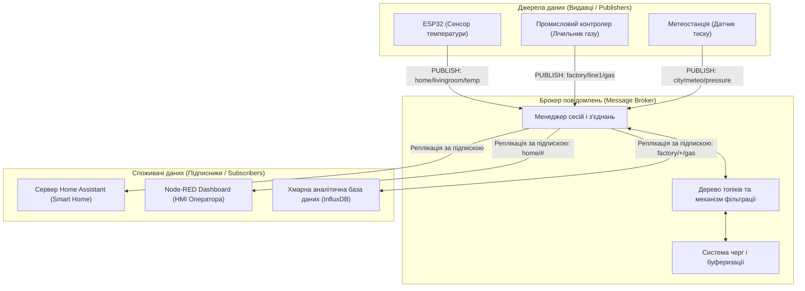
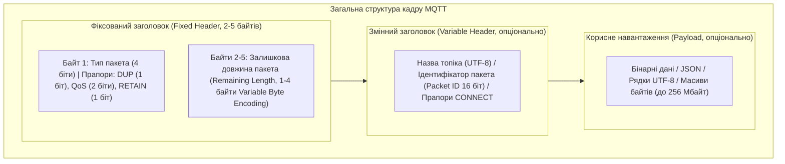
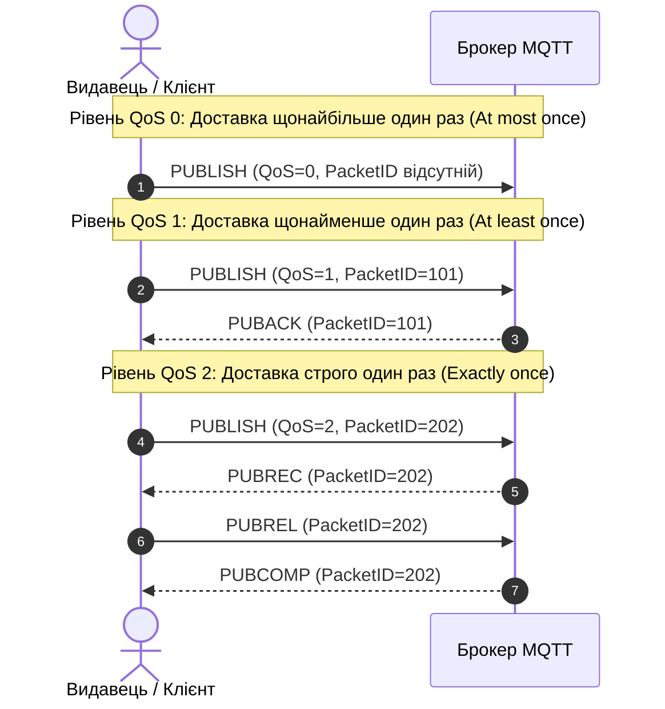
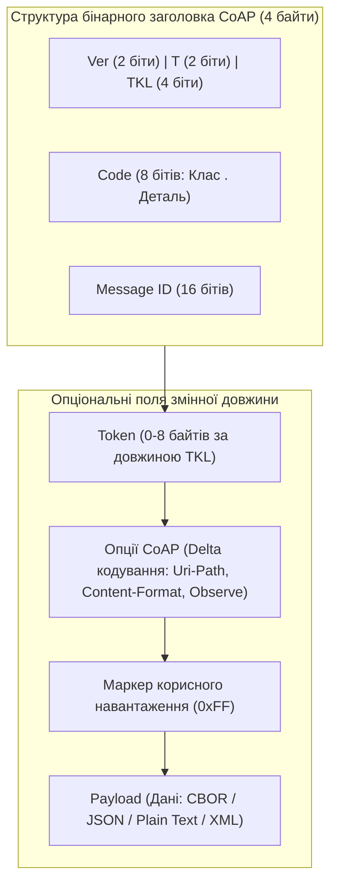
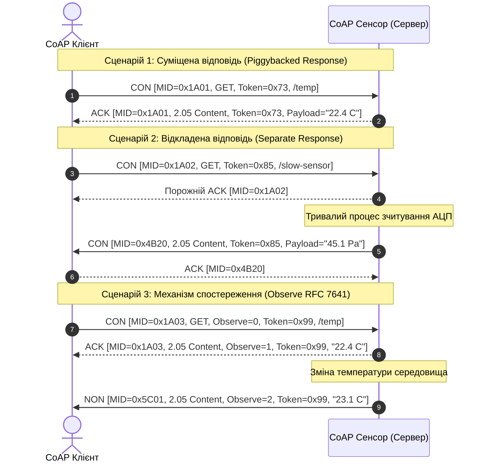

# Змістовий модуль 1. Архітектура, мережі та протоколи ІоТ

# Тема 4. Прикладні протоколи ІоТ (MQTT, CoAP)

---

## 4.1. Архітектура Publish/Subscribe та брокери

### Основний зміст та теоретичний базис

Традиційна клієнт-серверна модель комунікацій, яка десятиліттями слугувала базою для веб-інфраструктури на основі протоколу HTTP, виявляється нестійкою та неефективною в середовищі Інтернету речей. Класичний шаблон «запит-відповідь» (Request-Response) вимагає обов'язкового синхронного опитування сервера клієнтом (Polling), що спричиняє значні накладні витрати мережевого трафіку через передачу надлишкових текстових заголовків, перевантажує процесори кінцевих вузлів постійним парсингом сесійних дескрипторів і веде до швидкого вичерпання енергетичного ресурсу автономних сенсорів. Для усунення цих системних обмежень у прикладних мережах Інтернету речей домінує модель зв'язуючого програмного забезпечення, орієнтованого на обробку повідомлень (**MOM**, Message-Oriented Middleware), найефективнішим втіленням якої є архітектурний патерн **«видавець-підписник»** (**Publish/Subscribe**, скорочено **Pub/Sub**).

Фундаментальна перевага архітектури Publish/Subscribe полягає в реалізації повної декомпозиції та взаємного розв'язання (Decoupling) між джерелами даних (видавцями) та їх кінцевими одержувачами (підписниками). У цій комунікаційній моделі відсутній прямий зв'язок типу «точка-точка» між генератором події та споживачем інформації, оскільки взаємодія досягається завдяки трьом фундаментальним просторово-часовим розв'язанням. 

Просторове розв'язання (Space Decoupling) означає, що видавці та підписники не володіють інформацією про топологічне розміщення, IP-адреси чи мережеві порти один одного, адже обидві сторони взаємодіють виключно з проміжним комунікаційним вузлом. Часове розв'язання (Time Decoupling) гарантує, що пристрої не зобов'язані одночасно перебувати в активному мережевому стані, оскільки проміжний вузол здатний буферизувати повідомлення для вузлів, які перебувають у фазі глибокого енергозберігаючого сну. Синхронізаційне розв'язання (Synchronization Decoupling) забезпечує асинхронне функціонування підсистем: відправка телеметричного повідомлення видавцем є неблокуючою операцією, яка не зупиняє виконання локального коду мікроконтролера в очікуванні завершення прийому даних усіма підписниками.

Центральним диспетчеризуючим елементом архітектури Pub/Sub виступає **брокер повідомлень** (**Message Broker**), який являє собою високопродуктивне програмне ядро (наприклад, Eclipse Mosquitto, EMQX або HiveMQ), розгорнуте на локальному шлюзі, туманному сервері або у хмарі. 

Брокер бере на себе виконання таких критичних операцій:
1. Керує постійними та сесійними мережевими з'єднаннями з тисячами розподілених клієнтів.
2. Проводить автентифікацію та перевірку прав доступу пристроїв до операцій публікації та підписки.
3. Здійснює динамічну просторово-тематичну фільтрацію інформаційних пакетів, що надходять від сенсорів.
4. Організовує черги доставки повідомлень для тимчасово недоступних абонентів.
5. Забезпечує реплікацію та розсилку копій повідомлень усім зареєстрованим споживачам.

*Рисунок 1 — Архітектура інформаційної взаємодії в системі Інтернету речей на основі брокера повідомлень*

Організація маршрутизації в Pub/Sub базується на концепції **ієрархічних топіків** (**Topic Hierarchy**), які являють собою структуровані текстові рядки у форматі UTF-8, де логічні рівні ієрархії розділяються символом косої риски (`/`). Така структура дозволяє будувати семантично прозорі дерева просторів імен, що відповідають фізичній чи технологічній структурі контрольованого об'єкта, наприклад `enterprise/shop1/press3/vibration/x`. 

Для гнучкого оформлення підписки протоколи підтримують спеціальні символи групової фільтрації (Wildcards). Однорівневий підстановочний знак «плюс» (`+`) замінює рівно один рівень ієрархії всередині дерева топіків, що дозволяє отримувати дані за запитом `enterprise/shop1/+/vibration/x` від усіх пресів першого цеху одночасно. Багаторівневий підстановочний знак «ґрати» (`#`) замінює довільну кількість наступних дочірніх підрівнів дерева і може розміщуватися виключно наприкінці виразу фільтрації, наприклад підписка на `enterprise/shop1/#` забезпечує отримання абсолютно всіх телеметричних та аварійних повідомлень відповідного технологічного підрозділу.

Математична оцінка коефіцієнта мультиплікації мережевого трафіку брокером $M_{fanout}$ та сумарного вихідного інформаційного потоку $D_{out}$ (байт/с) при розгалуженні повідомлень визначається сумою добутків обсягів вхідних повідомлень на кількість активних підписників для кожного топіка:

$$D_{out} = \sum_{k=1}^{K} \left( \lambda_k \cdot S_k \cdot \sum_{m=1}^{M} \delta(T_k, F_m) \right)$$

де $K$ позначає загальну кількість унікальних топіків, у які надходять публікації від сенсорів; $\lambda_k$ визначає середню інтенсивність публікації нових повідомлень у $k$-й топік, виражену в кількості пакетів за секунду ($\text{с}^{-1}$); $S_k$ позначає повний середній розмір кадру публікації в $k$-му топіку (байт); $M$ є загальною кількістю зареєстрованих клієнтських підписок у брокері; $F_m$ позначає логічний фільтр $m$-ї підписки; $\delta(T_k, F_m)$ є бінарною функцією збігу топіка $T_k$ з фільтром $F_m$, яка набуває одиничного значення $\delta = 1$ у разі семантичної відповідності топіка правилам підстановки фільтра і дорівнює нулю $\delta = 0$ у протилежному випадку.

| Критерій порівняння | Модель «Запит-відповідь» (HTTP) | Модель «Видавець-підписник» (MQTT) | Модель «Шина даних» (DDS) |
| :--- | :--- | :--- | :--- |
| **Базовий транспортний протокол** | TCP | TCP (або WebSockets) | UDP / IP Multicast |
| **Ступінь зв'язаності вузлів** | Жорсткий зв'язок за адресою та часом | Повне розв'язання через брокер | Розподілений зв'язок без брокера |
| **Накладні витрати заголовків** | Високі (сотні байтів тексту на запит) | Мінімальні (від 2 байтів бінарного заголовка) | Середні (детермінований бінарний оверхед) |
| **Енергетична ефективність вузла**| Низька через постійні опитування | Екстремально висока (підтримка сну) | Середня (потребує постійної присутності) |
| **Типова сфера застосування** | Завантаження звітів, веб-сервіси | Сенсорна телеметрія, розумні будинки | Авіоніка, високошвидкісна робототехніка |

Порівняння комунікаційних підходів підтверджує, що для масових ієрархічних систем із тисячами різнорідних джерел телеметрії архітектура Pub/Sub є безальтернативним оптимумом з точки зору мінімізації енергетичних і обчислювальних ресурсів.

---

## 4.2. MQTT: структура пакетів та рівні QoS (0, 1, 2)

### Основний зміст та теоретичний базис

Стандарт **MQTT** (Message Queuing Telemetry Transport) був спочатку спроєктований у 1999 році Енді Стенфорд-Кларком (IBM) та Арленом Ніппером (Arcom) для задач дистанційного збору телеметричних параметрів із нафтопроводів через дорогі та нестабільні супутникові канали зв'язку. Згодом протокол отримав відкритий статус, був стандартизований міжнародним консорціумом OASIS, а також сертифікований ISO/IEC (стандарт ISO/IEC 20922). MQTT функціонує на прикладному рівні моделі OSI поверх надійного транспортного протоколу **TCP/IP**, використовуючи за замовчуванням мережевий порт 1883 для незахищених сесій та порт 8883 для з'єднань із використанням криптографічного захисту транспортного рівня TLS/SSL.

Бінарна структура пакетів MQTT спроєктована з розрахунку на максимальну компактність. Будь-який керуючий пакет протоколу складається з трьох обов'язкових чи опціональних частин: фіксованого заголовка (**Fixed Header**), змінного заголовка (**Variable Header**) та поля корисного навантаження (**Payload**).

*Рисунок 2 — Анатомія структури бінарного пакета протоколу MQTT*

Фіксований заголовок, продемонстрований на рисунку 2, присутній абсолютно в усіх типах керуючих пакетів MQTT. Його перший байт містить 4-бітне поле типу пакета (визначає одну з 14 керуючих інструкцій: CONNECT, CONNACK, PUBLISH, PUBACK, SUBSCRIBE, PINGREQ тощо) та 4-бітне поле специфічних прапорців:
1. Прапор дубліката **DUP** (1 біт) виставляється в одиничний стан, якщо клієнт або брокер здійснює повторну передачу раніше непідтвердженого кадру PUBLISH.
2. Поле рівня якості обслуговування **QoS Level** (2 біти) визначає алгоритм надійності доставки (значення `00` для QoS 0, `01` для QoS 1 та `10` для QoS 2).
3. Прапор збереження повідомлення **RETAIN** (1 біт) сигналізує брокеру про необхідність кешування даного пакета як останнього відомого достовірного значення (Last Known Good Value) для вказаного топіка.

Починаючи з другого байта фіксованого заголовка розміщується поле залишкової довжини (**Remaining Length**), яке визначає сумарний розмір змінного заголовка та корисного навантаження. Для мінімізації накладних витрат у MQTT застосовується динамічна схема кодування змінною кількістю байтів (**Variable Byte Integer**), де молодші 7 бітів кожного байта несуть значення довжини, а найстарший 8-й біт (Continuation Bit) є прапором продовження. Завдяки цій схемі пакети довжиною до 127 байтів кодуються всього одним байтом залишкової довжини, а максимальний розмір пакета обмежується чотирма байтами ($268\,435\,455\text{ байтів} \approx 256\text{ Мбайт}$).

Математично розкодування залишкової довжини пакета $L_{rem}$ з послідовності байтів $B_0, B_1, \dots, B_{N-1}$ (де $N \le 4$) описується формулою:

$$L_{rem} = \sum_{i=0}^{N-1} (B_i \ \& \ 127) \cdot 128^i$$

де $B_i$ позначає чисельне значення $i$-го байта поля довжини ($0 \le i \le 3$); оператор $\&$ виконує побітове логічне множення з маскою $127$ ($0\text{x}7\text{F}$), обнуляючи біт продовження; множник $128^i$ здійснює позиційне зважування семибітових груп.

Специфікація MQTT визначає три дискретні рівні гарантії якості обслуговування (**QoS**, Quality of Service) при транспортуванні повідомлень PUBLISH.

*Рисунок 3 — Протокольні послідовності рукостискання для рівнів якості обслуговування QoS 0, QoS 1 та QoS 2*

Механізми функціонування рівнів QoS, представлені на часовій діаграмі рисунка 3, мають фундаментальні алгоритмічні відмінності:
1. Рівень **QoS 0** (At most once — доставка щонайбільше один раз) є найпростішим непідтвердженим режимом («передай і забудь»). Пакет PUBLISH не містить унікального ідентифікатора Packet ID, а брокер не відправляє жодних відповідей; доставка гарантується лише надійністю самого протоколу TCP, але в разі розриву з'єднання пакет втрачається безповоротно.
2. Рівень **QoS 1** (At least once — доставка щонайменше один раз) гарантує обов'язкове отримання повідомлення одержувачем за рахунок механізму підтвердження. Пакет PUBLISH містить 16-бітний `Packet Identifier`. Одержувач, зафіксувавши пакет, надсилає у відповідь кадр **PUBACK** з ідентичним номером. Якщо відправник не отримує PUBACK протягом заданого таймауту, він повторно транслює PUBLISH зі встановленим прапором `DUP=1`. Це запобігає втраті інформації, проте у разі затримки первинного підтвердження може призвести до дублювання копій повідомлення на боці підписника.
3. Рівень **QoS 2** (Exactly once — доставка строго один раз без втрат і дублювань) реалізує чотиристороннє рукостискання. Відправник надсилає пакет PUBLISH із `PacketID`, зберігаючи його в буфері. Одержувач фіксує отримання кадром **PUBREC** (Publish Received). Отримавши PUBREC, відправник видає команду на розблокування повідомлення — пакет **PUBREL** (Publish Release). Одержувач, обробивши PUBREL, остаточно завершує транзакцію відправкою кадру **PUBCOMP** (Publish Complete), після чого сесійні стани видаляються з оперативної пам'яті обох сторін.

Особливе місце в екосистемі MQTT посідають системні механізми **LWT** (Last Will and Testament) та **Retained Messages**.

Механізм **«Остання воля і заповіт»** (**LWT**) дозволяє системі оперативно виявляти аварійне відключення вузлів. Під час первинної ініціалізації з'єднання у пакеті CONNECT клієнт передає брокеру спеціальний набір полів: `Will Topic`, `Will Message`, `Will QoS` та `Will Retain`. Якщо пристрій завершує сесію коректно, надіславши керуючий пакет `DISCONNECT`, брокер просто знищує збережений заповіт. Проте, якщо з'єднання розривається аварійно (внаслідок раптового знеструмлення сенсора, апаратного зависання мікроконтролера або обриву радіолінії без закриття сокета), брокер після закінчення контрольного періоду **Keep-Alive** (помноженого на коефіцієнт $1{,}5$) автоматично публікує повідомлення `Will Message` у топік `Will Topic` від імені цього клієнта. Це дає змогу іншим підсистемам миттєво дізнатися про перехід вузла в стан Offline.

Механізм **збережених повідомлень** (**Retained Message**) вирішує проблему інформування новопідключених абонентів. Якщо видавець відправляє повідомлення з бітом `RETAIN=1`, брокер не лише розсилає його поточним підписникам, але й назавжди зберігає його останню копію у своїй пам'яті. Коли будь-який новий клієнт підписується на даний топік, брокер негайно надсилає йому збережений кадр без очікування наступного циклу опитування сенсора видавцем.

| Тип пакета MQTT | Напрямок передачі | Числове значення | Призначення в протоколі |
| :--- | :--- | :--- | :--- |
| **CONNECT** | Клієнт $\to$ Брокер | 1 (0x01) | Запит клієнта на встановлення сесії та передача прапорів LWT |
| **CONNACK** | Брокер $\to$ Клієнт | 2 (0x02) | Підтвердження підключення з поверненням статус-коду |
| **PUBLISH** | Клієнт $\leftrightarrow$ Брокер | 3 (0x03) | Транспортування корисного навантаження у визначений топік |
| **PUBACK** | Клієнт $\leftrightarrow$ Брокер | 4 (0x04) | Підтвердження доставки повідомлення для рівня QoS 1 |
| **PUBREC** | Клієнт $\leftrightarrow$ Брокер | 5 (0x05) | Перша фаза підтвердження транзакції рівня QoS 2 |
| **PUBREL** | Клієнт $\leftrightarrow$ Брокер | 6 (0x06) | Дозвіл на звільнення черги повідомлення для рівня QoS 2 |
| **PUBCOMP** | Клієнт $\leftrightarrow$ Брокер | 7 (0x07) | Завершальна фаза рукостискання рівня QoS 2 |
| **SUBSCRIBE** | Клієнт $\to$ Брокер | 8 (0x08) | Реєстрація списку фільтрів підписки на топіки |
| **SUBACK** | Брокер $\to$ Клієнт | 9 (0x09) | Підтвердження успішної підписки з фіксацією наданих QoS |
| **UNSUBSCRIBE**| Клієнт $\to$ Брокер | 10 (0x0A) | Запит на видалення клієнта зі списку підписників топіка |
| **UNSUBACK** | Брокер $\to$ Клієнт | 11 (0x0B) | Підтвердження скасування підписки |
| **PINGREQ** | Клієнт $\to$ Брокер | 12 (0x0C) | Перевірка цілісності каналу зв'язку (Heartbeat) |
| **PINGRESP** | Брокер $\to$ Клієнт | 13 (0x0D) | Відповідь на команду перевірки цілісності зв'язку |
| **DISCONNECT** | Клієнт $\to$ Брокер | 14 (0x0E) | Коректне штатно завершення сесії клієнтом |

Аналіз специфікації керуючих пакетів MQTT доводить високу оптимізованість протоколу: службові функції діагностики каналу реалізуються джойновими пакетами PINGREQ/PINGRESP довжиною всього 2 байти, що мінімізує фоновий трафік мережі.

---

## 4.3. CoAP як RESTful протокол для обмежених мереж

### Основний зміст та теоретичний базис

Незважаючи на високу ефективність протоколу MQTT для задач агрегації телеметрії через централізований брокер, наявність обов'язкового транспортного протоколу TCP накладає низку жорстких вимог. Протокол TCP вимагає збереження стану з'єднання в пам'яті мікроконтролера, проведення трифазного рукостискання SYN-SYN/ACK-ACK при старті та постійного обміну підтвердженнями на транспортному рівні. Для класу екстремально обмежених пристроїв (Class 0 та Class 1 за стандартом RFC 7228), що функціонують у бездротових персональних мережах із втратами пакетів (**LLN**, Low-Power and Lossy Networks) поверх радіоканалів IEEE 802.15.4 та 6LoWPAN, робоча група IETF CoRE розробила спеціалізований протокол прикладного рівня **CoAP** (**Constrained Application Protocol**, стандартизований у RFC 7252).

Протокол CoAP переносить перевірену часом веб-архітектуру передачі стану представлення (**REST**, Representational State Transfer) у простір мікроконтролерів, замінюючи важкий стек HTTP/TCP на ультралегкий бінарний стек, що функціонує поверх ненадійного дейтаграмного протоколу **UDP** (порт 5683 для відкритого зв'язку та порт 5684 для захищеного протоколом DTLS). Завдяки REST-орієнтації кінцевий IoT-пристрій виступає повноцінним веб-сервером, ресурси якого адресуються стандартними уніфікованими ідентифікаторами URI виду `coap://192.168.1.50:5683/sensors/temperature` та модифікуються стандартними методами запитів: **GET** (зчитування даних), **POST** (створення ресурсу), **PUT** (оновлення стану) та **DELETE** (видалення ресурсу).

*Рисунок 4 — Формат бінарного кадру повідомлення протоколу CoAP за специфікацією RFC 7252*

Як показано на рисунку 4, базовий заголовок CoAP має фіксовану довжину всього 4 байти. Його перший байт включає версію протоколу **Ver** (2 біти, константа `01`), поле типу транзакції **T** (2 біти) та довжину токена **TKL** (Token Length, 4 біти, задає розмір токена від 0 до 8 байтів). 

Другий байт **Code** розділений на 3-бітний клас коду та 5-бітну деталь коду (формат `c.dd`): коди `0.01`–`0.04` позначають методи запитів GET, POST, PUT, DELETE, а коди класу `2.xx`, `4.xx`, `5.xx` відповідають статусам відповідей (наприклад `2.05 Content`, `4.04 Not Found`). Поле **Message ID** (16 бітів) призначене для детектування дублікатів та підтвердження доставки дейтаграм на рівні транзакцій.

Для забезпечення надійності поверх ненадійного транспорту UDP у CoAP реалізовано дворівневу модель: шар транзакцій (Messages Layer) та шар запитів/відповідей (Request/Response Layer). 

Шар транзакцій оперує чотирма типами повідомлень:
1. Підтверджуване повідомлення **CON** (Confirmable) вимагає обов'язкового отримання підтвердження від приймача у вигляді кадру **ACK** (Acknowledgement) з ідентичним значенням `Message ID`.
2. Непідтверджуване повідомлення **NON** (Non-confirmable) передається без очікування підтверджень у режимі найменших накладних витрат.
3. Повідомлення скидання **RST** (Reset) сигналізує про помилку обробки (наприклад, коли вузол отримує повідомлення, контекст якого відсутній у пам'яті).
4. Кадр підтвердження **ACK** може нести суміщену корисну відповідь на запит (Piggybacked Response) або бути порожнім кадром квитування з наступною відкладеною відповіддю (Separate Response).

*Рисунок 5 — Часові діаграми взаємодії у протоколі CoAP: пряма суміщена відповідь, розділена відповідь та асинхронний моніторинг Observe*

Часова послідовність, наведена на рисунку 5, ілюструє гнучкість транзакцій CoAP. Особливе значення має специфікація розширення **CoAP Observe** (RFC 7641), яка перетворює класичну REST-модель на повноцінний механізм Publish/Subscribe без потреби у виділеному брокері. Клієнт відправляє GET-запит із опцією `Observe=0`, реєструючи себе у списку спостерігачів на сервері-сенсорі. Після цього сенсор самостійно ініціює асинхронні трансляції повідомлень щоразу, коли змінюється фізичний стан вимірюваного параметра.

Контроль надійності передачі підтверджуваних повідомлень CON реалізує механізм експоненційного відступу (Exponential Backoff). Якщо після відправки кадру CON підтвердження ACK не отримано протягом початкового випадкового таймауту $T_{timeout}$, відправник повторює трансляцію, подвоюючи інтервал очікування. 

Час очікування для $r$-ї спроби повторної передачі ($r \in [0, \text{MAX\_RETRANSMIT}]$) розраховується за формулою:

$$T_{timeout}(r) = \text{ACK\_TIMEOUT} \cdot 2^r \cdot \left( 1 + \text{rand}() \cdot (\text{ACK\_RANDOM\_FACTOR} - 1) \right)$$

де $\text{ACK\_TIMEOUT} = 2{,}0\text{ с}$ позначає базову нормативну тривалість початкового таймауту; $\text{ACK\_RANDOM\_FACTOR} = 1{,}5$ визначає коефіцієнт рандомізації інтервалу для запобігання синхронному колапсу повторних передач багатьма вузлами; $\text{rand}()$ є генератором псевдовипадкових чисел з рівномірним розподілом на відрізку $[0, 1]$; гранична кількість повторних спроб конфігурується параметром $\text{MAX\_RETRANSMIT} = 4$.

Для комплексної оцінки ефективності протоколів прикладного рівня в умовах обмеженої пропускної здатності каналів зв'язку використовується коефіцієнт протокольного оверхеду (протокольної ефективності) $\eta_{proto}$:

$$\eta_{proto} = \frac{L_{payload}}{L_{payload} + L_{app\_hdr} + L_{trans\_hdr} + L_{net\_hdr} + L_{mac\_hdr}} \cdot 100\%$$

де $L_{payload}$ позначає обсяг корисних телеметричних даних сенсора (байт); $L_{app\_hdr}$ є довжиною заголовка прикладного протоколу (для CoAP становить від 4 байтів, для MQTT — від 2 байтів); $L_{trans\_hdr}$ позначає розмір заголовка транспортного рівня ($8\text{ байтів}$ для UDP проти $20\text{ байтів}$ для TCP); $L_{net\_hdr}$ позначає довжину мережевого заголовка ($40\text{ байтів}$ для IPv6 або від $2\text{ байтів}$ для стиснутого 6LoWPAN); $L_{mac\_hdr}$ є довжиною заголовка канального рівня (IEEE 802.15.4 або Wi-Fi).

| Системна характеристика | MQTT (Message Queuing Telemetry Transport) | CoAP (Constrained Application Protocol) |
| :--- | :--- | :--- |
| **Базова архітектурна модель** | Публікація/Підписка (Publish/Subscribe) | RESTful клієнт-сервер + Observe (Pub/Sub) |
| **Транспортний протокол** | TCP (порти 1883, 8883) | UDP (порти 5683, 5684) |
| **Центральний комунікаційний вузол** | Обов'язковий виділений брокер повідомлень | Не потрібен (прямий зв'язок точка-точка / M2M) |
| **Мінімальний розмір заголовка** | 2 байти | 4 байти |
| **Гарантія доставки (Надійність)**| Рівні QoS 0, QoS 1, QoS 2 на рівні протоколу | Повідомлення CON/ACK зі зворотним відступом |
| **Механізм моніторингу стану вузла** | Заповіт LWT (Last Will and Testament) | Періодичне опитування або CoAP Observe |
| **Криптографічний захист каналу** | TLS/SSL | DTLS (Datagram Transport Layer Security) |
| **Формат корисного навантаження** | Довільний двійковий / JSON (Payload-agnostic) | Довільний / оптимізований CBOR / JSON |
| **Сфера оптимального використання** | Централізований збір даних, розумні будинки | Автономні M2M сенсорні мережі, 6LoWPAN |

Зведена порівняльна таблиця демонструє, що протокол MQTT є найкращим вибором для систем, де потрібна висока надійність доставки, розвинене кешування та централізована диспетчеризація потоків через брокер, тоді як протокол CoAP є незамінним для автономних, надзвичайно обмежених у ресурсах бездротових сенсорних мереж, що потребують прямої M2M-взаємодії та нативної інтеграції з веб-службами без проміжних шлюзів.

---

### Питання для самоперевірки та аналітичного осмислення

1. Розкрийте зміст просторового, часового та синхронізаційного розв'язання (Decoupling) в архітектурному патерні Publish/Subscribe. Які переваги це надає порівняно з клієнт-серверною моделлю HTTP?
2. Поясніть принципи організації ієрархічного простору топіків у протоколі MQTT. У чому полягає різниця між підстановочними знаками фільтрації «+» та «#»?
3. Детально опишіть структуру першого байта фіксованого заголовка пакета MQTT. Яку роль відіграють прапорці DUP та RETAIN?
4. Проаналізуйте алгоритм чотиристороннього рукостискання рівня якості обслуговування QoS 2 у протоколі MQTT. Чому використання трьох пакетів (PUBLISH, PUBACK, PUBREC) є недостатнім для запобігання дублюванню повідомлень?
5. Розкрийте механізм функціонування заповіту LWT (Last Will and Testament) у протоколі MQTT. За яких конкретних умов брокер зобов'язаний опублікувати заповітне повідомлення підписникам?
6. Опишіть призначення полів базового чотирибайтного заголовка протоколу CoAP. Яким чином 16-бітне поле Message ID забезпечує надійність транспортування поверх протоколу UDP?
7. На основі математичної формули експоненційного відступу (Exponential Backoff) розрахуйте граничний час очікування підтвердження ACK для четвертої спроби повторної передачі кадру CON у протоколі CoAP.