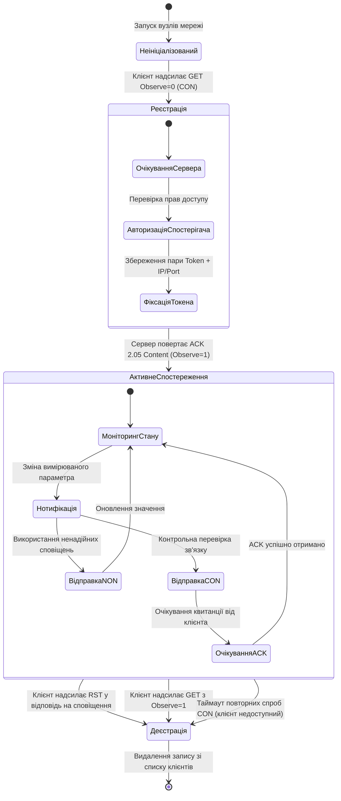
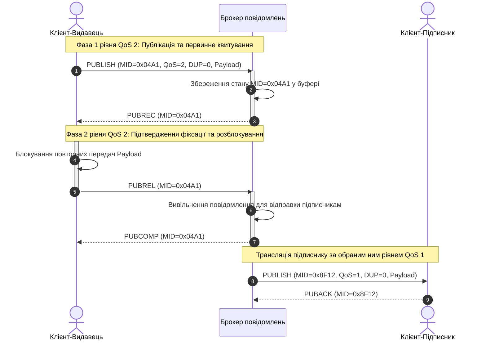
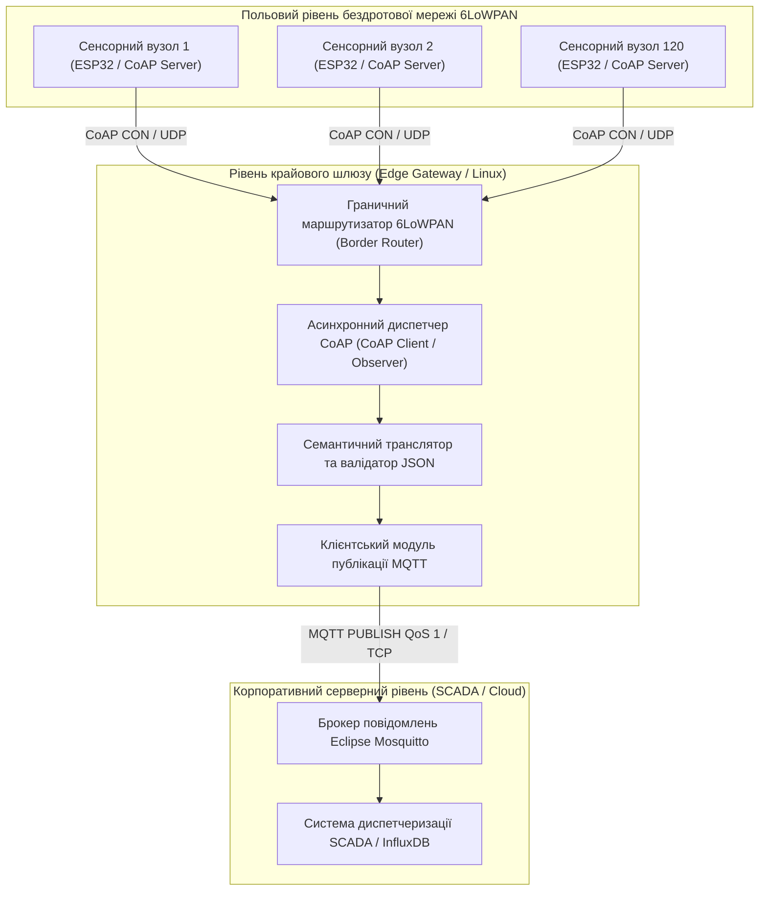

# Тема 4. Прикладні протоколи Інтернету речей (MQTT, CoAP)

## Мета лекції

Формування у майбутніх інженерів комплексної системи фундаментальних знань і прикладних компетенцій щодо архітектури, принципів функціонування та механізмів реалізації протоколів прикладного рівня MQTT та CoAP, які оптимізовані для функціонування в умовах суворих апаратних та мережевих обмежень систем Інтернету речей, із акцентом на вибір раціонального комунікаційного стека, забезпечення гарантованої доставки даних, досягнення максимальної енергоефективності кінцевих вузлів та їхньої безшовної інтеграції з хмарними і туманними аналітичними платформами сучасних автоматизованих комплексів.

## Очікувані результати навчання

1. **Знання та розуміння.** Здобувачі вищої освіти засвоять базові концепції архітектурних патернів Publish/Subscribe та RESTful для розподілених середовищ Інтернету речей, детально вивчивши бінарну структуру пакетів MQTT і CoAP, призначення керуючих прапорців, механізми збережених повідомлень Retain, заповіту LWT, а також функціональні відмінності чотирьох типів повідомлень транзакційного рівня CoAP.
2. **Застосування.** Здобувачі зможуть практично проектувати семантично вивірені простори ієрархічних топіків MQTT із використанням однорівневих і багаторівневих підстановочних знаків, налаштовувати клієнтські сесії з відповідними рівнями гарантії доставки QoS, а також конфігурувати взаємодію кінцевих мікроконтролерних вузлів із брокерами повідомлень і серверами CoAP із реалізацією адаптивних часових таймаутів.
3. **Аналіз.** Здобувачі навчаться здійснювати системний порівняльний інженерний аналіз протокольних стеків MQTT і CoAP за критеріями мережевого оверхеду, латентності, пропускної здатності, споживання струму та навантаження на обчислювальні ресурси мікроконтролера в умовах бездротових каналів зв'язку з високим рівнем втрат пакетів.
4. **Оцінювання та синтез.** Здобувачі оволодіють умінням аргументовано обґрунтовувати вибір прикладного протоколу під специфічні вимоги промислових та побутових сценаріїв Інтернету речей, синтезувати масштабовані багаторівневі телеметричні архітектури з трансляцією протоколів на межових шлюзах та оцінювати стійкість інфраструктури до апаратних збоїв, обривів ліній зв'язку й атак на цілісність інформаційних потоків.

---

## Детальний покроковий план лекції

### 1. Теоретико-концептуальний базис. Архітектурні моделі та принципи функціонування протоколів MQTT і CoAP
* 1.1. Парадигма Message-Oriented Middleware та архітектурний патерн «видавець-підписник» (Publish/Subscribe) із просторовим, часовим і синхронізаційним розв'язанням компонентів мережі
* 1.2. Функціональна роль, внутрішня організація та механізми тематичної фільтрації брокера повідомлень у розподілених топологіях Інтернету речей
* 1.3. Специфікація протоколу CoAP у розрізі моделі RESTful, принципи адресації ресурсів URI та дворівнева структура взаємодії поверх ненадійного дейтаграмного транспорту UDP
* 1.4. Механізм асинхронного спостереження CoAP Observe (RFC 7641) як реалізація розподіленої моделі підписки без використання централізованого брокера

### 2. Методологія та аналіз граничних умов. Бінарні формати, рівні надійності та системні бар'єри застосування
* 2.1. Анатомія бінарного кадру MQTT, структура фіксованого і змінного заголовків та алгоритм кодування залишкової довжини змінною кількістю байтів (Variable Byte Integer)
* 2.2. Механізми забезпечення надійності в MQTT: процедури квитування та послідовності рукостискання для рівнів якості обслуговування QoS 0, QoS 1 і QoS 2
* 2.3. Керування станом клієнтських сесій в MQTT через процедури діагностики Keep-Alive, кешування Retained Messages та превентивну публікацію заповіту Last Will and Testament (LWT)
* 2.4. Транзакційний шар CoAP, алгоритм доставки підтверджуваних повідомлень (CON/ACK) та розрахунок інтервалів повторної передачі за моделлю експоненційного відступу (Exponential Backoff)
* 2.5. Критичні бар'єри масштабування, вразливість до втрати пакетів у каналах LLN та обмеження енергоефективності транспортних протоколів TCP і UDP у польових сенсорних мережах

### 3. Практичний індустріальний / фаховий кейс. Проектування гетерогенної телеметричної системи підприємства
**Тема наскрізної задачі.** «Розробка та оптимізація багаторівневої телеметричної мережі моніторингу виробничого цеху на базі мікроконтролерів ESP32 та брокера Mosquitto з трансляцією протоколу CoAP у MQTT на крайовому шлюзі»

## 1. Теоретико-концептуальний базис. Архітектурні моделі та принципи функціонування протоколів MQTT і CoAP

### 1.1. Парадигма Message-Oriented Middleware та архітектурний патерн «видавець-підписник» (Publish/Subscribe) із просторовим, часовим і синхронізаційним розв'язанням компонентів мережі

Традиційна парадигма розподілених обчислень, що базується на моделі взаємодії типу «клієнт-сервер» та протоколі HTTP, орієнтована на передачу значних обсягів структурованої інформації через стабільні дротові або високошвидкісні бездротові магістралі. У класичному шаблоні «запит-відповідь» клієнт ініціює з'єднання, надсилає текстовий запит із великою кількістю службових заголовків і переходить у стан очікування результату, що вимагає постійної підтримки активної сесії або регулярного синхронного опитування сервера. Застосування подібної схеми у гетерогенних середовищах Інтернету речей стикається з фундаментальними фізичними та апаратними обмеженнями, серед яких критичний дефіцит оперативної пам'яті мікроконтролерів, висока питома вартість енергетичних витрат на підтримку радіоканалу та нестабільність бездротових сенсорних мереж із частими втратами пакетів.

Для подолання цих бар'єрів у галузі Інтернету речей домінує концепція проміжного програмного забезпечення, орієнтованого на повідомлення, відома як **Message-Oriented Middleware**. Базовим конструктивним елементом цієї парадигми є архітектурний патерн **«видавець-підписник»** (**Publish/Subscribe**), який виключає необхідність прямого адресного узгодження між джерелом інформації та її споживачем. Архітектура розподіленої взаємодії досягає системної ефективності завдяки реалізації трьох незалежних рівнів декомпозиції комунікаційного процесу.

Перший рівень становить **просторове розв'язання**, яке полягає в тому, що відправник (видавець) та отримувачі (підписники) не потребують взаємного знання IP-адрес, мережевих портів або фізичного розташування один одного. Усі взаємодії замикаються на проміжному маршрутизуючому вузлі, завдяки чому топологія кінцевих пристроїв може динамічно змінюватися без потреби реконфігурації всієї мережі. Другим рівнем є **часове розв'язання**, згідно з яким взаємодіючі вузли не зобов'язані одночасно перебувати в активній мережевій фазі. Джерело даних здатне опублікувати виміряний параметр і негайно перейти в режим глибокого сну для збереження енергії батареї, тоді як проміжний вузол буферизує повідомлення і передає його споживачеві в момент його виходу на зв'язок. Третім фундаментальним аспектом є **синхронізаційне розв'язання**, що забезпечує асинхронність транзакцій: операція публікації не блокує виконання основного обчислювального потоку на мікроконтролері видавця, усуваючи простої процесорного ядра в очікуванні підтвердження доставки від віддалених абонентів.

Математичний опис надійності доставки повідомлення $P_{\text{deliv}}$ у розподіленій Pub/Sub-системі з урахуванням просторово-часового розв'язання, ймовірності доступності вузлів та часу життя повідомлення описується наступною аналітичною залежністю:

$$P_{\text{deliv}}(T) = \prod_{j \in \text{Sub}(T)} \left[ 1 - \left(1 - p_j\right)^{1 + R_j} \right] \cdot \mathbb{I}\left(t_{\text{sub}, j} - t_{\text{pub}} \le \tau_{\text{TTL}}\right)$$

У наведеній моделі множина $\text{Sub}(T)$ позначає актуальний перелік підписників, зареєстрованих на ієрархічну тему $T$. Параметр $p_j$ визначає статистичну ймовірність успішної передачі одиничного кадру через фізичний радіоканал зв'язку до $j$-го підписника в умовах стохастичних завад. Змінна $R_j$ відповідає за гранично дозволену кількість повторних спроб передачі непідтвердженого кадру з боку посередника. Функція $\mathbb{I}(\cdot)$ є індикаторною функцією Хевісайда, яка приймає одиничне значення за умови виконання часового критерію і дорівнює нулю у випадку його порушення. Змінна $t_{\text{pub}}$ позначає точну часову мітку публікації повідомлення джерелом, $t_{\text{sub}, j}$ вказує на часовий момент доступності $j$-го клієнта для прийому даних, а константа $\tau_{\text{TTL}}$ регламентує максимальний час життя повідомлення у черзі очікування.

> **ПРАКТИЧНИЙ ЯКІР:** У розподілених системах моніторингу нафтогазових трубопроводів автономні вібраційні сенсори транслюють аварійні осцилограми через супутникові модеми з посекундною тарифікацією, де часове та просторове розв'язання патерну Pub/Sub забезпечує доставку критичних сповіщень диспетчерам без підтримки постійного IP-з'єднання між польовим контролером та сервером SCADA.

---

### 1.2. Функціональна роль, внутрішня організація та механізми тематичної фільтрації брокера повідомлень у розподілених топологіях Інтернету речей

Центральним диспетчеризуючим вузлом у традиційних топологіях «видавець-підписник» виступає **брокер повідомлень**. Брокер є спеціалізованим серверним програмним комплексом, який бере на себе повне навантаження з організації комунікацій, звільняючи периферійні мікроконтролери від необхідності виконання ресурсоємних завдань взаємного пошуку пристроїв та узгодження статусів сесій. Основними системними завданнями брокера є прийом вхідних з'єднань від клієнтів, парсинг пакетів прикладного рівня, демультиплексування інформаційних потоків, буферизація повідомлень у чергах та їх гарантована реплікація відповідно до активних підписок.

```mermaid
flowchart TD
    subgraph ClientsPublishers["Клієнти-Видавці"]
        P1["Сенсорний вузол 1 (ESP32)"]
        P2["Промисловий контролер (PLC)"]
    end

    subgraph MessageBroker["Архітектура ядра брокера повідомлень"]
        CM["Менеджер мережевих сесій (Session State)"]
        AuthMod["Модуль автентифікації та контролю доступу (ACL)"]
        
        subgraph Engine["Маршрутизація та буферизація"]
            TT["Дерево ієрархічних топіків (Prefix Trie)"]
            FiltEngine["Селектор фільтрації (Wildcard Engine)"]
            QueueMgr["Менеджер черг (Message Queues & Retain)"]
        end
        
        CM --> AuthMod
        AuthMod --> TT
        TT --> FiltEngine
        FiltEngine --> QueueMgr
    end

    subgraph ClientsSubscribers["Клієнти-Підписники"]
        S1["База даних часових рядів (InfluxDB)"]
        S2["Панель моніторингу оператора (HMI)"]
        S3["Шлюз аварійної сигналізації"]
    end

    P1 -->|PUBLISH| CM
    P2 -->|PUBLISH| CM
    QueueMgr -->|DISPATCH| S1
    QueueMgr -->|DISPATCH| S2
    QueueMgr -->|DISPATCH| S3
```

Організація адресації в брокері спирається на структуру **ієрархічних топіків**, які формуються у вигляді рядків змінної довжини в кодуванні UTF-8, де окремі логічні рівні розмежовуються символом прямої косої риски. Для оптимізації маршрутизації повідомлень брокери використовують алгоритмічну структуру префіксного дерева (Trie). Вузли цього дерева відповідають окремим текстовим сегментам імен, а листки містять вказівники на черги підписників. Така деревоподібна схема дозволяє реалізувати гнучкі підписки завдяки використанню спеціальних метасимволів групової фільтрації.

Символ **«плюс»** (`+`) виконує функцію однорівневого підстановочного знака і може заміщати строго один ієрархічний сегмент на будь-якій позиції шляху. Наприклад, вираз підписки `factory/workshop2/+/temperature` забезпечує отримання даних від будь-яких температурних датчиків, встановлених на різних технологічних лініях другого цеху. Символ **«ґрати»** (`#`) слугує багаторівневим підстановочним знаком і заміщує довільну кількість наступних дочірніх підрівнів дерева. За правилами протоколу цей символ може знаходитися виключно на завершальній позиції виразу підписки, тому запит `factory/workshop2/#` призведе до надсилання підписнику абсолютно всіх телеметричних даних, діагностичних параметрів та аварійних сповіщень зазначеного виробничого приміщення.

Математична формалізація процесу відповідності між вектором опублікованого топіка $\mathbf{T}$ та вектором фільтра підписки $\mathbf{F}$ може бути представлена у вигляді наступної предикатної моделі:

$$\mathbf{T} = \left(t_1, t_2, \dots, t_n\right), \quad \mathbf{F} = \left(f_1, f_2, \dots, f_m\right)$$

$$\text{Match}(\mathbf{T}, \mathbf{F}) = \begin{cases} 
\text{True}, & \text{якщо } (m = n) \land \left(\forall i \in \{1, \dots, n\}: (f_i = t_i) \lor (f_i = '+')\right) \\ 
\text{True}, & \text{якщо } \exists k \le m: (f_k = '\#') \land \left(\forall i < k: (f_i = t_i) \lor (f_i = '+')\right) \\ 
\text{False}, & \text{в усіх інших випадках.} 
\end{cases}$$

У наведеній моделі вектор $\mathbf{T}$ складається з $n$ послідовних текстових сегментів $t_i$, які формують конкретний маршрут публікації без застосування спеціальних символів. Вектор фільтра $\mathbf{F}$ містить $m$ компонентів $f_i$, які можуть бути як явними ідентифікаторами, так і підстановочними знаками. Перша умова описує строгий збіг довжини шляхів з урахуванням допустимості заміни окремих елементів знаком однорівневої підстановки. Друга умова фіксує правила обробки багаторівневого фільтра, коли наявність символу `_#_` на позиції $k$ санкціонує довільний залишок шляху за умови повного збігу всіх попередніх префіксних сегментів.

> **ТИПОВА ПОМИЛКА:** Хибне ототожнення збережених повідомлень (Retained Messages) протоколу MQTT із механізмами персистентних черг брокерів корпоративного класу, таких як Apache Kafka чи RabbitMQ. Якщо видавець транслює повідомлення в топік без активації прапорця Retain, а в цей конкретний момент часу на даний топік немає жодного активного підписника, брокер негайно і безповоротно знищує цей пакет. Вузол, який підключиться до мережі навіть через одну мілісекунду після трансляції, не отримає повідомлення, якщо воно не було позначене як збережене.

---

### 1.3. Специфікація протоколу CoAP у розрізі моделі RESTful, принципи адресації ресурсів URI та дворівнева структура взаємодії поверх ненадійного дейтаграмного транспорту UDP

У випадках, коли кінцеві пристрої функціонують у бездротових персональних мережах із жорстким обмеженням енергоспоживання та обчислювальних ресурсів класу LLN (Low-Power and Lossy Networks), використання протоколу MQTT може виявитися надлишковим через необхідність встановлення повноцінної сесії TCP із тривалим трьохетапним рукостисканням (SYN, SYN-ACK, ACK) та суттєвими накладними витратами на підтримку каналу. Спеціально для таких умов робочою групою IETF CoRE був стандартизований обмежений протокол додатків **CoAP** (**Constrained Application Protocol**, RFC 7252).

Протокол CoAP переносить архітектурні принципи передачі стану представлення (**REST**) у світ вбудованих мікросистем. На відміну від брокер-орієнтованих топологій, CoAP використовує пряму взаємодію за принципом «клієнт-сервер», де кожен інтелектуальний датчик або виконавчий механізм виступає повноцінним веб-сервером, ресурси якого однозначно ідентифікуються уніфікованими індикаторами ресурсів (**URI**). Для маніпуляції станом фізичних об'єктів використовуються стандартизовані методи прикладного рівня: операція **GET** виконує зчитування поточних показників датчика, **POST** здійснює створення нового ресурсу або ініціює обчислювальну функцію, **PUT** виконує примусове оновлення параметрів конфігурації актуатора, а **DELETE** видаляє відповідний логічний дескриптор.

> **ПРАКТИЧНИЙ ЯКІР:** У муніципальних системах розумного вуличного освітлення мікроконтролери дорожніх світильників під керуванням бездротового стека 6LoWPAN використовують протокол CoAP, що дозволяє диспетчерській станції звертатися безпосередньо до кожного ліхтаря за його IPv6-адресою та змінювати скважність ШІМ-модулятора запитом PUT без постійного утримання TCP-з'єднань.

Архітектурна модель CoAP реалізує функціональний розподіл на два логічні підрівні: подуровень обміну повідомленнями (**Messages Layer**) та подуровень запитів і відповідей (**Request/Response Layer**). Подуровень повідомлень працює безпосередньо поверх дейтаграмного протоколу **UDP** (використовуючи порт 5683 для незахищеного обміну та 5684 для шифрування за протоколом DTLS) і забезпечує компенсацію ненадійності транспортного середовища. Цей рівень оперує чотирма основними типами пакетів:
1. Підтверджувані повідомлення **CON** (Confirmable), які вимагають обов'язкової відповіді від протилежної сторони для перевірки факту проходження дейтаграми крізь мережу.
2. Непідтверджувані повідомлення **NON** (Non-confirmable), які надсилаються без квитування для передачі періодичної телеметрії, де втрата окремого кадру не є критичною.
3. Повідомлення підтвердження **ACK** (Acknowledgement), які підтверджують успішне отримання пакета типу CON і можуть транспортувати корисне навантаження відповіді.
4. Повідомлення скидання **RST** (Reset), які вказують на отримання некоректного кадру або сигналізують про втрату контексту обробки на стороні сервера.

Подуровень запитів і відповідей відповідає за передачу кодів методів та статусів виконання. Для забезпечення коректного зіставлення запитів із отриманими відповідями у дейтаграмному середовищі CoAP застосовує роздільні механізми ідентифікації. Поле **Message ID** (16 бітів) функціонує виключно на подуровні повідомлень для виявлення дублікатів та підтвердження транзакцій між сусідніми вузлами. Натомість поле **Token** (довжиною від 0 до 8 байтів) належить до подуровня запитів і слугує наскрізним ідентифікатором сесії, що дозволяє клієнту зіставити отриману відповідь із раніше ініційованим запитом навіть у випадку, коли сервер повертає відкладену розділену відповідь (Separate Response) із новим числовим значенням Message ID.

> **КОНТРОЛЬНЕ ПИТАННЯ:** За яких умов сервер CoAP повертає клієнту відповідь, у якій значення 16-бітного поля Message ID відрізняється від значення Message ID, переданого у вихідному запиті?
>
> 

> 
Розгорнути аналіз / відповідь

>
> **Правильний варіант: У разі використання розділеної відповіді (Separate Response), коли обробка запиту вимагає тривалого часу.**
>
> 1. Коли клієнт надсилає запит у підтверджуваному повідомленні типу CON, сервер повинен негайно підтвердити фізичне отримання дейтаграми. Якщо сервер не може сформувати корисні дані миттєво (наприклад, триває перетворення АЦП повільного сенсора), він відправляє порожній кадр ACK із тим самим Message ID, завершуючи транзакцію на рівні повідомлень. Після завершення вимірювань сервер ініціює новий окремий пакет типу CON або NON, що містить результат обробки, поле Token для зв'язування з вихідним запитом та абсолютно новий Message ID, оскільки це незалежна дейтаграма в мережі UDP.
>
> 2. Аналіз альтернативних випадків: У разі суміщеної відповіді (Piggybacked Response) сервер повертає корисні дані безпосередньо всередині первинного пакета ACK, тому Message ID зобов'язаний збігатися з Message ID запиту. При використанні непідтверджуваних повідомлень NON сервер не надсилає ACK взагалі, а відповідь повертається як новий незалежний запит або не генерується, проте базовий протокольний механізм зміни Message ID асоціюється саме з переходом від пігібекінгу до розділених відповідей через таймаути апаратного рівня.
> 

---

### 1.4. Механізм асинхронного спостереження CoAP Observe (RFC 7641) як реалізація розподіленої моделі підписки без використання централізованого брокера

Класична парадигма REST спирається на пасивну роль сервера, який очікує вхідних команд і не може самостійно ініціювати передачу оновлень клієнтам. У динамічних сценаріях Інтернету речей це змушувало б клієнтські додатки періодично опитувати сенсорний вузол запитами GET, що призводить до невиправданого розходу енергії акумулятора та засмічення радіоефіру однотипним трафіком. Для інтеграції переваг патерну Publish/Subscribe безпосередньо у стек CoAP без введення виділеного брокера повідомлень було розроблено розширення протоколу **CoAP Observe** (стандартизоване у специфікації RFC 7641).

Архітектурний принцип CoAP Observe трансформує звичайний стан взаємодії клієнта та сервера у відносини між спостерігачем та суб'єктом спостереження. Клієнт надсилає стандартний запит GET до цільового ресурсу, додаючи у заголовок спеціальну опцію `Observe` зі значенням $0$. Наявність цієї опції сигналізує серверу про необхідність не лише повернути поточний стан ресурсу, але й внести клієнта до локального списку спостерігачів. Щоразу, коли фізичний стан об'єкта змінюється або спливає заданий часовий інтервал, сервер самостійно формує та транслює клієнту нове повідомлення зі свіжими даними, де опція Observe містить монотонно зростаючий порядковий номер оновлення.

Життєвий цикл відносин спостереження, наведений на діаграмі станів, демонструє адаптивні механізми контролю цілісності зв'язку. Сервер може надсилати нотифікації у вигляді непідтверджуваних повідомлень NON для мінімізації накладних витрат. Проте для запобігання ситуації, коли сервер продовжує відправляти сповіщення клієнту, який вийшов із ладу або перемістився в іншу підмережу, періодично використовується підтверджуване повідомлення CON. Якщо клієнт не відповідає на повідомлення CON протягом встановленої кількості повторів, сервер автоматично видаляє його зі списку спостерігачів. Клієнт також може ініціювати дереєстрацію двома шляхами: пасивно, відповівши кадром RST на чергове сповіщення, або активно, надіславши звичайний GET-запит із параметром `Observe=1`.

Для комплексної систематизації розглянутих комунікаційних моделей та їх зіставлення з альтернативними протоколами розподілених систем складено наступну порівняльну таблицю.

| Протокол / Технологія | Парадигма взаємодії | Транспортний протокол | Ключовий механізм узгодження стану | Приклад з реальної практики |
| :--- | :--- | :--- | :--- | :--- |
| **MQTT** | Централізована публікація та підписка (Pub/Sub) | TCP (порти 1883, 8883) | Централізований брокер повідомлень із деревом топіків та рівнями QoS | Агрегація показників електролічильників житлового комплексу на шлюзі LoRaWAN-MQTT |
| **CoAP (Базовий)** | Клієнт-серверний RESTful (Запит-відповідь) | UDP (порти 5683, 5684) | Транзакційний шар Message ID з парними пакетами CON/ACK та токенами | Моніторинг параметрів вологості ґрунту в сільськогосподарських сенсорних мережах 6LoWPAN |
| **CoAP Observe** | Розподілена публікація та підписка без брокера | UDP (порти 5683, 5684) | Реєстрація списку спостерігачів на сервері через розширення заголовка GET | Пряме керування та синхронізація станів групи вуличних світильників у мережі Thread |
| **HTTP/REST** | Синхронний клієнт-сервер (Pull-модель) | TCP (порти 80, 443) | Сесійні текстові заголовки та явне синхронне опитування сервера (Polling) | Завантаження звітів споживання енергії оператором через браузерний веб-інтерфейс |
| **AMQP** | Черги повідомлень та маршрутизація (MOM) | TCP (порт 5672) | Програмні вузли обміну (Exchanges), прив'язки (Bindings) та черги брокера | Інтеграція банківських систем обробки фінансових мікротранзакцій та терміналів оплати |
| **DDS** | Розподілена шина даних (Data-Centric Pub/Sub) | UDP / IP Multicast | Децентралізована глобальна реляційна шина даних із розширеними політиками QoS | Автономне керування рухом промислових мобільних роботів-штабелерів на складі |

Аналітичний огляд засвідчує, що протокол MQTT є технологічно зрілим стандартом для задач централізованої телеметрії з високими вимогами до кешування та моніторингу статусу пристроїв, тоді як CoAP разом із розширенням Observe забезпечує безпрецедентну швидкість реакції та енергоефективність в автономних мережах прямої взаємодії між розумними речами.

---

### Вказівки для самостійного осмислення

1. Зіставте накладні витрати на передачу одного трибайтового показника температури при використанні протоколів HTTP, MQTT та CoAP, врахувавши мінімальні розміри заголовків прикладного, транспортного та мережевого рівнів для кожного випадку.
2. Спроєктуйте семантичну структуру ієрархічного дерева топіків MQTT для автоматизованої системи моніторингу виробничих приміщень фармацевтичного заводу з урахуванням необхідності одночасної підписки на аварійні сповіщення від усіх критичних автоклавів.
3. Проаналізуйте алгоритмічні ризики розсинхронізації спостерігача та суб'єкта спостереження в розширенні CoAP Observe за умов масової втрати дейтаграм UDP у зашумленому промисловому радіоефірі.

## 2. Методологія та аналіз граничних умов. Бінарні формати, рівні надійності та системні бар'єри застосування

### 2.1. Анатомія бінарного кадру MQTT та алгоритм кодування залишкової довжини

Проєктування бінарного формату кадру в протоколі **MQTT** підпорядковане фундаментальному інженерному компромісу: забезпечити мінімальне навантаження на канал зв'язку при збереженні масштабованої структури метаданих. Кожен пакет протоколу складається з обов'язкового фіксованого заголовка, розмір якого починається від двох байтів, а також опціональних змінного заголовка та корисного навантаження. Перший байт фіксованого заголовка жорстко стандартизує розподіл бітових полів, де старша тетрада (біти 7–4) ідентифікує тип керуючого пакета, а молодша тетрада (біти 3–0) визначає спеціальні прапорці виконання транзакції.

Починаючи з другого байта фіксованого заголовка, розміщується поле залишкової довжини (**Remaining Length**), яке визначає сумарну кількість байтів, що містяться у змінному заголовку та полі корисного навантаження поточного пакета. Для досягнення максимальної щільності упаковки при роботі як із мікроскопічними сенсорними значеннями, так і з великими масивами даних, розробники протоколу застосували алгоритм кодування змінною кількістю байтів (**Variable Byte Integer**). Згідно з цим підходом, молодші сім бітів кожного байта несуть інформаційне навантаження, тоді як найстарший восьмий біт слугує прапором продовження, вказуючи на наявність наступного байта довжини.

Формалізація алгоритмічного процесу побайтового кодування довільного цілочисельного значення залишкової довжини $L \in [0, 268\,435\,455]$ у бінарну послідовність байтів $B_0, B_1, \dots, B_{N-1}$ представляється у вигляді наступної покрокової моделі:

$$
\begin{aligned}
\text{Крок 1 (Ініціалізація змінних процесу):} & \quad X \leftarrow L, \quad i \leftarrow 0 \\
\text{Крок 2 (Виділення поточного септичного сегмента):} & \quad \text{encoded\_byte} \leftarrow X \pmod{128}, \quad X \leftarrow \lfloor X / 128 \rfloor \\
\text{Крок 3 (Модифікація прапора продовження):} & \quad \text{якщо } X > 0 \implies \text{encoded\_byte} \leftarrow \text{encoded\_byte} \lor 128 \\
\text{Крок 4 (Фіксація байта та циклічний перехід):} & \quad B_i \leftarrow \text{encoded\_byte}, \quad i \leftarrow i + 1, \quad \text{повторювати Крок 2, доки } X > 0
\end{aligned}
$$

У наведеному формалізованому алгоритмі змінна $X$ позначає поточний нерозподілений числовий залишок довжини корисного навантаження кадру. Оператор $\pmod{128}$ виділяє молодші сім бітів поточного числа, які переносяться в бінарну комірку $\text{encoded\_byte}$. Оператор $\lfloor X / 128 \rfloor$ виконує цілочисельне ділення зі зсувом вправо на сім бітових позицій. Логічна операція побітового «АБО» з числом 128 ($0\text{x}80$) виставляє старший біт продовження в одиничний стан, якщо величина залишку $X$ строго більша за нуль. Масив $B_i$ зберігає результуючу послідовність бінарного представлення довжини кадру в пам'яті.

Аналіз граничних умов функціонування цього алгоритму виявляє фундаментальні апаратні бар'єри при реалізації на мікроконтролерах із малою розрядністю шини. Математична межа кодування обмежує довжину пакета значенням $268\,435\,455$ байтів (рівно чотири байти в полі довжини). Якщо польовий вузол на базі 8-розрядного мікроконтролера AVR або 16-розрядного контролера MSP430 стикається з некоректно сформованим потоком байтів, у якому п'ятий байт поспіль має встановлений біт продовження, алгоритм входить у стан невизначеності. 

Крім того, на практиці передача пакетів, залишкова довжина яких перевищує доступний обсяг статичної оперативної пам'яті (SRAM) мікроконтролера, призводить до фрагментації купи (Heap Fragmentation) та аварійного перезавантаження системи через переповнення стека (Stack Overflow). У каналах із високим рівнем джитеру затримка між надходженням окремих байтів поля Remaining Length може бути інтерпретована локальним мережевим стеком як розрив пакета, що вимагає впровадження жорстких таймаутів побайтового зчитування на рівні драйвера послідовного інтерфейсу.

---

### 2.2. Алгоритмічні процедури квитування та рукостискання рівнів QoS 0, 1 та 2

Специфікація MQTT визначає концепцію якості обслуговування (**Quality of Service**, **QoS**) як наскрізний контракт надійності, що укладається між відправником і брокером або між брокером і підписником. Обслуговування потоків телеметрії суттєво різниться за рівнем складності кінцевих автоматів станів та навантаженням на буферну пам'ять взаємодіючих сторін.

При реалізації рівня **QoS 0** обмін обмежується одностороннім надсиланням кадру PUBLISH. Процедура не передбачає ведення обліку доставлених пакетів, тому поле ідентифікатора пакета (**Packet Identifier**) у змінному заголовку повністю відсутнє. Протилежна сторона приймає повідомлення за принципом максимальних зусиль (Best Effort).

Рівень **QoS 1** спирається на двостороннє квитування. Відправник зобов'язаний присвоїти кожному повідомленню унікальний 16-бітний `Packet Identifier` і зберігати повну копію кадру в локальній черзі відправки (In-flight Queue). Прийом повідомлення підтверджується відправкою зворотного пакета **PUBACK**, що містить аналогічний ідентифікатор. До моменту надходження PUBACK повідомлення вважається незавершеним. Якщо час очікування відповіді перевищує встановлений таймаут, відправник повторно передає пакет із виставленим прапором дубліката `DUP=1`.

Найбільш захищений рівень **QoS 2** унеможливлює як втрату, так і дублювання інформації завдяки чотиристоронньому сеансу рукостискання. Взаємодія розбивається на дві фази: первинну фіксацію отримання повідомлення та кінцеве вивільнення ресурсів із черги.

Часова діаграма демонструє, що критичною ланкою протоколу є розв'язання можливих мережевих колізій на проміжних етапах передачі. Якщо пакет **PUBREC** або **PUBREL** губиться в каналі зв'язку, спрацьовує механізм повторної передачі відповідного пакета з тим самим числовим значенням ідентифікатора. 

> **ВАЖЛИВО:** Ідентифікатор пакета (Packet Identifier) залишається зайнятим і не може бути повторно використаний стеком для нових публікацій доти, доки поточна транзакція не завершиться отриманням фінального кадру PUBACK (для QoS 1) або PUBCOMP (для QoS 2). Пул доступних ідентифікаторів обмежений діапазоном $[1, 65\,535]$, тому перевищення ліміту одночасних непідтверджених транзакцій (In-flight Limit) призводить до блокування вихідного буфера клієнта.

Аналіз граничних умов виявляє різке падіння ефективності рівнів QoS 1 та QoS 2 у бездротових каналах із високим показником затримки сигналу (RTT) та частими розривами сесій. У разі аварійного відключення зв'язку брокер зобов'язаний зберігати непідтверджені повідомлення для кожного підписника, у якого сесія зареєстрована як постійна (`CleanSession = 0`). Якщо відключений пристрій перебуває в офлайн-режимі протягом тривалого періоду, черга повідомлень брокера переповнюється, що призводить або до примусового скидання старих пакетів, або до вичерпання пулу оперативної пам'яті сервера та відмови в обслуговуванні всієї системи.

---

### 2.3. Керування станом сесій, діагностика Keep-Alive та механізм LWT

Специфікація протоколу MQTT передбачає розвинену систему контролю життєвого циклу мережевих з'єднань, яка базується на прапорі очищення сесії **CleanSession**, таймері спостереження **Keep-Alive** та механізмі заповіту **Last Will and Testament** (**LWT**).

При встановленні з'єднання через керуючий пакет CONNECT клієнт передає конфігураційний біт CleanSession. Якщо прапор встановлено в одиничний стан (`CleanSession = 1`), брокер ініціює тимчасову сесію: усі підписки та недоставлені пакети знищуються в момент розриву транспортного TCP-з'єднання. Навпаки, нульове значення прапора (`CleanSession = 0`) зобов'язує брокер зберігати повний стан клієнтської сесії, включаючи список оформлених підписок, непідтверджені повідомлення рівнів QoS 1 та QoS 2, а також чергу нових публікацій, що надійшли під час відсутності клієнта в мережі.

Для оперативного виявлення розривів зв'язку без очікування системного таймауту сокета операційної системи (який у стеку TCP може досягати двох годин) застосовується механізм Keep-Alive. Клієнт самостійно декларує інтервал очікування $T_{\text{KA}}$ у секундах під час відправки кадру CONNECT. Якщо за вказаний проміжок часу вузол не має корисних даних для публікації, він надсилає двобайтний тестовий пакет **PINGREQ**, на який брокер зобов'язаний негайно згенерувати відповідь **PINGRESP**.

Формальний розрахунок контрольного таймауту відключення клієнта брокером $T_{\text{disconnect}}$ та умов активації механізму LWT описується наступними виразами:

$$T_{\text{timeout\_broker}} = 1{,}5 \cdot T_{\text{KA}}$$

$$
\begin{aligned}
\text{Крок 1 (Реєстрація контрольного часу):} & \quad t_{\text{last\_activity}} \leftarrow \max(t_{\text{recv\_data}}, t_{\text{recv\_ping}}) \\
\text{Крок 2 (Оцінка інтервалу мовчання):} & \quad \Delta t_{\text{silence}} = t_{\text{current}} - t_{\text{last\_activity}} \\
\text{Крок 3 (Прийняття рішення щодо скидання сесії):} & \quad \text{якщо } \Delta t_{\text{silence}} > T_{\text{timeout\_broker}} \implies \text{Session\_Abort}() \\
\text{Крок 4 (Публікація заповіту LWT):} & \quad \text{якщо } \text{Session\_Abort} = \text{True} \land \text{CleanDisconnect} = \text{False} \implies \text{Publish}(T_{\text{will}}, M_{\text{will}})
\end{aligned}
$$

У даному алгоритмі змінна $T_{\text{KA}}$ позначає заявлений клієнтом період Keep-Alive, що масштабується брокером за стандартом коефіцієнтом $1{,}5$ для компенсації флуктуацій мережевої затримки. Змінна $t_{\text{last\_activity}}$ фіксує останній момент надходження довільного коректного пакета від клієнта. Параметр $\Delta t_{\text{silence}}$ визначає тривалість повної відсутності мережевих подій. Процедура $\text{Session\_Abort}()$ примусово закриває активний сокет із боку сервера. Заповітне повідомлення $M_{\text{will}}$ публікується в заздалегідь визначений топік $T_{\text{will}}$ тільки тоді, коли розрив каналу стався аварійно, без отримання фінального пакета DISCONNECT.

> **ПРАКТИЧНИЙ ЯКІР:** У системах телеметрії комерційного транспорту через мобільні мережі 2G/3G конфігурація параметра Keep-Alive менше 30 секунд призводить до швидкого вичерпання заряду резервного акумулятора трекера та блокування SIM-картки стільниковим оператором через паразитно високу частоту відправки сигнальних пакетів PINGREQ у зонах нестабільного радіопокриття.

Граничні умови надійності механізму LWT безпосередньо пов'язані з явищем мережевого мерехтіння (Network Flapping). У бездротових середовищах із глибокими інтерференційними завмираннями затримка доставки пакетів PINGREQ може перевищувати мультиплікований інтервал $1{,}5 \cdot T_{\text{KA}}$. У цьому випадку брокер передчасно приймає рішення про аварійне падіння вузла і транслює в мережу повідомлення LWT про перехід у стан «Offline». Якщо мікроконтролер відновлює працездатність каналу через секунду після цього, виникає критичний системний конфлікт: брокер фіксує повторний запит CONNECT від клієнта з тим самим ClientID, що змушує його примусово закрити попередню сесію і генерує нескінченний цикл взаємних перепідключень.

---

### 2.4. Транзакційний шар CoAP, експоненційний відступ та надійність дейтаграм

Протокол CoAP компенсує ненадійність дейтаграмного транспорту UDP за допомогою спеціалізованого транзакційного кінцевого автомата, ядрами якого є механізм підтверджуваних повідомлень (**CON**) та алгоритм повторної передачі з експоненційним відступом (**Exponential Backoff**). На відміну від транспортного протоколу TCP, який реалізує потокове ковзне вікно передачі, базовий CoAP (RFC 7252) використовує жорстке обмеження: між двома взаємодіючими кінцевими точками в один момент часу може бути відкрита лише одна непідтверджена транзакція (параметр $N_{\text{START}} = 1$).

У випадку надсилання повідомлення типу CON відправник встановлює таймер повторної передачі на початкове значення $T_0$, яке розраховується з урахуванням випадкового зсуву для запобігання ефекту синхронної перевантаженості мережі (Thundering Herd Problem).

Формалізація розрахунку таймаутів повторних передач і загального бюджету часу транзакції $T_{\text{total\_wait}}$ для максимальної кількості спроб $\text{MAX\_RETRANSMIT}$ представляється у вигляді послідовності кроків:

$$
\begin{aligned}
\text{Крок 1 (Рандомізація базового таймауту):} & \quad T_0 = \text{ACK\_TIMEOUT} \cdot \left(1 + \text{rand}() \cdot (\text{ACK\_RANDOM\_FACTOR} - 1)\right) \\
\text{Крок 2 (Експоненційне масштабування спроб):} & \quad T_r = T_0 \cdot 2^r, \quad \forall r \in \{0, 1, \dots, \text{MAX\_RETRANSMIT}\} \\
\text{Крок 3 (Інтегральна оцінка часу очікування):} & \quad T_{\text{total\_wait}} = \sum_{r=0}^{\text{MAX\_RETRANSMIT}} T_r = T_0 \cdot \left(2^{\text{MAX\_RETRANSMIT} + 1} - 1\right)
\end{aligned}
$$

У даному математичному описі константа $\text{ACK\_TIMEOUT}$ встановлена в специфікації за замовчуванням на рівні $2{,}0$ с. Параметр $\text{ACK\_RANDOM\_FACTOR}$ дорівнює $1{,}5$. Змінна $\text{rand}()$ є функцією генерації псевдовипадкових чисел із рівномірним розподілом на інтервалі $[0, 1]$, що забезпечує отримання початкового таймауту $T_0$ у діапазоні від $2{,}0$ до $3{,}0$ с. Індекс $r$ визначає поточний номер повторної спроби передачі ($0 \le r \le 4$). Значення $\text{MAX\_RETRANSMIT} = 4$ обмежує граничну кількість циклів ретрансляції, після вичерпання яких транзакція визнається невдалою, а ресурс — недоступним.

Граничні умови цієї моделі проявляються при розгортанні CoAP у багатоскачкових мережах (**Multi-hop Mesh**) на базі технологій 6LoWPAN чи ZigBee. У випадку, коли кількість транзитних вузлів між клієнтом і сервером перевищує 4–5 стрибків, базовий час обігу пакета (RTT) у мережі може перевищувати мінімальний початковий таймаут $T_0 = 2{,}0$ с. Це спричиняє так звану фальшиву ретрансляцію: відправник починає повторне надсилання кадру CON зі збільшеним таймаутом ще до того, як вихідний пакет дійде до адресата. Мережа перевантажується дублікатами пакетів, буфери черг маршрутизаторів переповнюються, викликаючи системний колапс перевантаження (Congestion Collapse), за якого коефіцієнт корисного пропускання каналу падає майже до нуля.

---

### 2.5. Порівняльний аналіз системних бар'єрів, енергоефективності та накладних витрат у польових мережах

Вибір між протоколами MQTT та CoAP для польових сенсорних мереж вимагає ретельного інженерного зіставлення накладних витрат усіх рівнів комунікаційного стека. Фізичний рівень стандарту IEEE 802.15.4 жорстко обмежує максимальний розмір кадру (**MTU**) величиною 127 байтів. Якщо врахувати накладні витрати канального рівня MAC (до 25 байтів) та заголовка безпеки AES-CCM (до 14 байтів), доступний обсяг для передачі даних вищих рівнів становить лише близько 81–88 байтів.

Транспортний протокол TCP, необхідний для MQTT, має фіксований заголовок розміром 20 байтів, тоді як дейтаграмний заголовок UDP, що використовується протоколом CoAP, займає всього 8 байтів. У поєднанні зі стандартним заголовком IPv6 (40 байтів) передача кадру MQTT вимагає обов'язкової фрагментації на рівні адаптації 6LoWPAN, оскільки сумарний стек заголовків $40 + 20 + 2 = 62$ байти залишає під корисні дані лічені байти. Натомість CoAP у комбінації зі стисненням заголовків 6LoWPAN (IPHC) дозволяє скоротити мережевий і транспортний оверхед до кількох байтів, укладаючи всю транзакцію разом із корисним навантаженням в один фізичний кадр IEEE 802.15.4.

Математична залежність витрат енергії автономного вузла $E_{\text{tx}}$ на передачу корисного навантаження $L_{\text{payload}}$ з урахуванням сумарного оверхеду заголовків $L_{\text{headers}}$ та середнього струму споживання передавача $I_{\text{tx}}$ визначається формулою:

$$E_{\text{tx}} = U_{\text{bat}} \cdot I_{\text{tx}} \cdot \frac{8 \cdot (L_{\text{payload}} + L_{\text{headers}})}{R_{\text{data}}}$$

де $U_{\text{bat}}$ — робоча напруга джерела живлення вузла (В); $I_{\text{tx}}$ — струм споживання радіотрансивера у режимі активного випромінювання (А); $R_{\text{data}}$ — фізична швидкість передачі даних у каналі (наприклад, $250\,000$ біт/с для IEEE 802.15.4); $L_{\text{headers}}$ — сумарний розмір службових заголовків усіх рівнів стека (байтів). Зі збільшенням $L_{\text{headers}}$ тривалість активного перебування трансивера в ефірі лінійно зростає, що критично скорочує життєвий цикл автономної батареї.

У наступній аналітичній матриці систематизовано та зіставлено ключові моделі та методи обох протоколів за критеріями складності впровадження, енергетичних витрат та критичних експлуатаційних обмежень.

| Протокольний режим / Метод | Транспортний профіль | Складність впровадження | Енергетичний слід | Критичні ризики / Обмеження |
| :--- | :--- | :--- | :--- | :--- |
| **MQTT QoS 0** | TCP (без повторів на рівні додатків) | Низька (мінімальний клієнтський стек) | Низький (відсутність квитування) | Повна втрата телеметрії при короткочасних розривах каналу зв'язку |
| **MQTT QoS 1** | TCP (з двостороннім квитуванням PUBACK) | Середня (потребує черги непідтверджених кадрів) | Середній (наявність повторних передач) | Можливість дублювання записів у базі даних при затримці PUBACK |
| **MQTT QoS 2** | TCP (чотиристороннє рукостискання) | Висока (складний кінцевий автомат, персистентний стан) | Високий (чотири пакети на одну транзакцію) | Блокування вихідного буфера при високому RTT, загроза падіння брокера |
| **CoAP NON** | UDP (дейтаграмна передача без квитування) | Мінімальна (простий формат повідомлення) | Екстремально низький (ідеально для сну) | Відсутність зворотного зв'язку про фізичну доставку інформації |
| **CoAP CON** | UDP (повтори з експоненційним відступом) | Середня (таймери та облік Message ID) | Низький / Змінний (залежить від втрат) | Колапс перевантаження мережі (Congestion Collapse) при глибоких топологіях |
| **CoAP Observe** | UDP (асинхронні оновлення стану) | Середня (керування списками спостерігачів) | Низький (усуває необхідність опитування Polling) | Ризик втрати клієнта при тривалій відсутності контрольних CON-сповіщень |

Порівняльний аналіз доводить, що застосування протоколу MQTT із високими рівнями QoS є виправданим виключно в магістральних ділянках мереж з доступом до постійного електроживлення, тоді як у напівпровідникових периферійних сегментах безпосереднього збору даних доцільно використовувати CoAP або MQTT-SN для збереження енергетичного ресурсу польових пристроїв.

---

> **КОНТРОЛЬНЕ ПИТАННЯ:** Під час промислового випробування телеметричної мережі виявлено, що бездротові датчики вібрації на базі мікроконтролерів STM32, які транслюють дані за протоколом MQTT з рівнем надійності QoS 1 через стільниковий канал GPRS, повністю розряджають батарею за 48 годин замість розрахункових 12 місяців. Інженерний аудит зафіксував, що через високий рівень завад у цеху показник втрати пакетів у каналі зв'язку сягає $35\%$, а час обігу пакета (RTT) коливається від $1\,800$ до $4\,500$ мс. У конфігурації клієнта параметр Keep-Alive встановлено на $15$ с, а таймаут очікування пакета PUBACK зафіксовано на рівні $1\,000$ мс. Здійсніть комплексний поетапний аналіз причин критичної енергетичної деградації вузла та сформулюйте необхідні коригувальні заходи.
>
> 

> 
Розгорнути аналіз / відповідь

>
> **Правильний варіант: Аварійна деградація енергоефективності спричинена штормом повторних передач (Packet Storm) через некоректно занижений таймаут PUBACK та надмірний трафік Keep-Alive.**
>
> 1. **Аналітичне обґрунтування виникнення проблеми:**
>    - **Конфлікт таймауту підтвердження:** Значення RTT каналу становить $1\,800–4\,500$ мс, тоді як клієнт очікує підтвердження PUBACK лише $1\,000$ мс. Це означає, що клієнт гарантовано починає повторну передачу вихідного кадру з виставленим прапором `DUP=1` ще до того, як перший пакет фізично дійде до брокера. Радіомодем вузла працює у безперервному циклі випромінювання на максимальній потужності передавача, не переходячи в енергозберігаючий режим сну (Sleep Mode).
>    - **Надлишковість діагностичних пакетів:** Встановлений період Keep-Alive у $15$ с змушує пристрій у моменти відсутності корисної телеметрії постійно пробуджувати модуль зв'язку для відправки кадру PINGREQ і очікування PINGRESP, що повністю нівелює можливості циклічного засинання мікроконтролера.
>    - **Шторм дублікатів у стільниковому каналі:** Враховуючи $35\%$ випадкових втрат пакетів, множинні дублікати перевантажують вихідний радіобуфер стільникового модема, провокуючи черги, подальше зростання RTT і безперервну генерацію повторних спроб.
>
> 2. **Комплекс технічних заходів для вирішення проблеми:**
>    - Збільшити таймаут очікування PUBACK до величини, що гарантовано перевищує максимальний RTT каналу з запасом: $T_{\text{ack\_wait}} \ge 1{,}5 \cdot \text{RTT}_{\text{max}} = 1{,}5 \cdot 4\,500\text{ мс} = 6\,750\text{ мс}$, а також впровадити алгоритм експоненційного відступу для інтервалів між повторами.
>    - Збільшити параметр Keep-Alive до технологічно обґрунтованого максимуму (наприклад, $300–600$ с), перевівши відправку статусів на механізм LWT або рідкісні контрольні синхронізації.
>    - Реалізувати локальне накопичення телеметричних пакетів у енергонезалежній flash-пам'яті мікроконтролера з наступною пакетною передачею пачки даних за один короткий сеанс зв'язку (Batch Uploading) замість спроби надсилання кожної окремої точки вимірювання в реальному часі.
> 

---

### Вказівки для самостійного осмислення

1. Розрахуйте аналітично загальну тривалість блокування клієнтського потоку CoAP при втраті перших трьох підтверджуваних повідомлень CON, прийнявши початковий нормативний параметр $\text{ACK\_TIMEOUT} = 3{,}0$ с та випадковий коефіцієнт рандомізації $\text{rand}() = 0{,}75$.
2. Проаналізуйте потенційні загрози вичерпання ресурсів оперативної пам'яті брокера Mosquitto при масовому аварійному відключенні 10 000 клієнтів, які працюють за схемою `CleanSession = 0` з рівнем надійності QoS 1, якщо вхідний потік нових публікацій від інших джерел зберігає інтенсивність 50 повідомлень на секунду.
3. Оцініть граничні умови застосування протоколу CoAP у топологіях із трансляцією мережевих адрес (NAT), визначивши мінімально допустимі інтервали відправки трафіку для підтримки відкритого стану сесійних таблиць маршрутизаторів.

## 3. Практичний індустріальний / фаховий кейс. Проектування гетерогенної телеметричної системи підприємства

### 3.1. Комплексний фаховий кейс. Розробка та оптимізація багаторівневої телеметричної мережі моніторингу виробничого цеху на базі мікроконтролерів ESP32 та брокера Mosquitto з трансляцією протоколу CoAP у MQTT на крайовому шлюзі

#### Постановка задачі / ситуації

На металургійному комбінаті модернізується цех гарячого прокату, де експлуатується критичне роторне обладнання: промислові димососи, прокатні кліті та високовольтні насоси системи гідрозбиву окалини. Непередбачений вихід із ладу підшипників кочення на приводах цих вузлів призводить до аварійної зупинки всієї технологічної лінії із прямими збитками понад $30\,000$ доларів США за годину простою. Необхідно розгорнути бездротову автономну систему предиктивної діагностики вібрації та теплового стану обладнання на базі 120 сенсорних вузлів. 

Умови виробничого середовища характеризуються високим рівнем електромагнітних завад від частотно-регульованих приводів потужністю до 2 МВт, наявністю масивних залізобетонних та металевих екрануючих конструкцій, що спричиняють значне загасання радіосигналу та багатопроменеву інтерференцію, а також неможливістю прокладання ліній зовнішнього дротового живлення до контрольованих об'єктів. Центральна диспетчерська SCADA підприємства інтегрується виключно за протоколом MQTT, проте пряме використання зв'язки MQTT/TCP на автономних польових сенсорах неможливе через надмірні енергетичні витрати радіотрансивера на підтримку постійного з'єднання та високу ймовірність обриву сесій TCP у зашумленому ефірі.

Для розв'язання поставленої задачі обрано гібридну багаторівневу топологію: безпосередній збір вібраційних і температурних даних здійснюється кінцевими автономними мікроконтролерними вузлами за енергоефективним протоколом CoAP поверх ненадійного дейтаграмного транспорту UDP у бездротовій мережі 6LoWPAN (IEEE 802.15.4), після чого потоки дейтаграм надходять на цеховий крайовий шлюз (Edge Gateway), де транслюються у формат JSON і публікуються через протокол MQTT у центральний брокер корпоративної мережі.

Вихідні параметри, фізичні обмеження середовища та вимоги до автономності системи зведені у наступну таблицю.

| Параметр системи | Значення | Одиниця вимірювання | Інженерний зміст параметра |
| :--- | :--- | :--- | :--- |
| **Загальна кількість сенсорних вузлів ($N$)** | 120 | шт. | Кількість точок віброконтролю на роторному обладнанні цеху |
| **Корисне навантаження сенсора ($L_{\text{payload}}$)** | 12 | байт | Часова мітка (4 байти), RMS віброшвидкості (4 байти), температура (4 байти) |
| **Період планової передачі ($\Delta t_{\text{norm}}$)** | 10 | с | Нормативний часовий крок опитування технологічного параметра |
| **Ємність батареї сенсора ($C_{\text{bat}}$)** | 2400 | $\text{мА}\cdot\text{год}$ | Літій-тіонілхлоридний елемент живлення $\text{Li-SOCl}_2$ ($U_{\text{bat}} = 3{,}6\text{ В}$) |
| **Струм передавача радіомодуля ($I_{\text{tx}}$)** | 28 | мА | Споживання струму мікроконтролером при активному випромінюванні в ефір |
| **Струм приймача радіомодуля ($I_{\text{rx}}$)** | 20 | мА | Споживання струму у фазі очікування квитанції підтвердження ACK |
| **Струм глибокого сну вузла ($I_{\text{sleep}}$)** | 2,5 | мкА | Споживання енергії сенсором у фазі низькоспоживаючого сну Deep Sleep |
| **Швидкість у радіоканалі ($R_{\text{data}}$)** | 250 | кбіт/с | Фізична швидкість стандарту IEEE 802.15.4 у діапазоні 2,4 ГГц |
| **Ймовірність втрати пакета ($p_{\text{loss}}$)** | 8 | % | Статистична втрата дейтаграм через індустріальні завади в цеху |
| **Вимога до автономного терміну служби** | $\ge 24$ | місяці | Безперервне функціонування без регламентної заміни батареї |

Архітектурна взаємодія між польовими сенсорними вузлами, цеховим шлюзом конвертації та центральним сервером диспетчеризації представлена на наступній функціональній схемі.

#### Покроковий аналіз та розв'язок

##### Крок 1. Аналітичний розрахунок розміру бінарного кадру CoAP та оцінка протокольної ефективності

Для забезпечення надійної доставки параметрів вібрації кінцеві вузли використовують підтверджувані повідомлення CoAP CON із методом PUT до ресурсу шлюзу. Повний розмір фізичного кадру на канальному рівні IEEE 802.15.4 формується сумою довжин заголовків усіх задіяних протокольних рівнів та корисного навантаження датчика:

$$L_{\text{frame}} = L_{\text{MAC}} + L_{\text{6LoWPAN}} + L_{\text{UDP}} + L_{\text{CoAP\_hdr}} + L_{\text{payload}}$$

Підстановка числових значень специфікації дає наступний вираз:

$$L_{\text{frame}} = 23 + 7 + 8 + 16 + 12 = 66\text{ байтів}$$

де заголовок рівня MAC стандарту IEEE 802.15.4 з адресацією розширеними ідентифікаторами EUI-64 займає 23 байти; заголовок адаптаційного рівня 6LoWPAN у режимі стиснення IPHC займає 7 байтів; заголовок дейтаграми UDP складає 8 байтів; заголовок CoAP разом із 4-байтним базовим заголовком, 4-байтним токеном кореляції, 7-байтною опцією Uri-Path та однобайтним маркером навантаження становить 16 байтів; поле корисних даних $L_{\text{payload}}$ дорівнює 12 байтам.

Коефіцієнт протокольного оверхеду (протокольної ефективності) $\eta_{\text{proto}}$, що показує частку цільових технологічних даних у загальному обсязі випроміненого радіоефіру, обчислюється як відношення корисного навантаження до повного розміру кадру:

$$\eta_{\text{proto}} = \frac{L_{\text{payload}}}{L_{\text{frame}}} \cdot 100\% = \frac{12}{66} \cdot 100\% \approx 18{,}18\%$$

##### Крок 2. Розрахунок тривалості активних радіофаз трансивера та сумарного енергетичного бюджету сенсора

Час передачі вихідного кадру $t_{\text{tx}}$ за фізичної швидкості каналу $R_{\text{data}} = 250\,000$ біт/с розраховується через пряме ділення бітового обсягу кадру на пропускну здатність:

$$t_{\text{tx}} = \frac{L_{\text{frame}} \cdot 8}{R_{\text{data}}} = \frac{66 \cdot 8}{250\,000} = \frac{528}{250\,000} \approx 2{,}112 \cdot 10^{-3}\text{ с} = 2{,}112\text{ мс}$$

Сервер-шлюз у відповідь генерує порожній кадр підтвердження CoAP ACK довжиною 42 байти у фізичному каналі, тривалість прийому якого $t_{\text{rx}}$ становить:

$$t_{\text{rx}} = \frac{L_{\text{ACK}} \cdot 8}{R_{\text{data}}} = \frac{42 \cdot 8}{250\,000} = \frac{336}{250\,000} \approx 1{,}344 \cdot 10^{-3}\text{ с} = 1{,}344\text{ мс}$$

З урахуванням статистичного коефіцієнта втрат у цеху $p_{\text{loss}} = 0{,}08$, середня кількість передач для успішного завершення однієї транзакції становить $k_{\text{tx}} = 1 + p_{\text{loss}} = 1{,}08$. Електричний заряд $Q_{\text{active}}$, що споживається вузлом за один десятисекундний період вимірювання, складається з активних витрат на передачу, прийом квитанції та пасивного струму сну протягом залишку часу $\Delta t_{\text{sleep}} = 10 - (t_{\text{tx}} + t_{\text{rx}}) \approx 9{,}9965$ с:

$$Q_{\text{active}} = k_{\text{tx}} \cdot \left( I_{\text{tx}} \cdot t_{\text{tx}} + I_{\text{rx}} \cdot t_{\text{rx}} \right) + I_{\text{sleep}} \cdot \Delta t_{\text{sleep}}$$

Підставляючи параметри струмів і часових інтервалів, отримуємо:

$$
\begin{aligned}
Q_{\text{active}} &= 1{,}08 \cdot \left( 28\text{ мА} \cdot 0{,}002112\text{ с} + 20\text{ мА} \cdot 0{,}001344\text{ с} \right) + 0{,}0025\text{ мА} \cdot 9{,}9965\text{ с} \\
&= 1{,}08 \cdot \left( 0{,}059136 + 0{,}02688 \right)\text{ мА}\cdot\text{с} + 0{,}024991\text{ мА}\cdot\text{с} \\
&= 1{,}08 \cdot 0{,}086016 + 0{,}024991 \approx 0{,}092897 + 0{,}024991 = 0{,}117888\text{ мА}\cdot\text{с}
\end{aligned}
$$

Середній інтегральний струм споживання сенсорного модуля $I_{\text{avg}}$ становить:

$$I_{\text{avg}} = \frac{Q_{\text{active}}}{\Delta t_{\text{norm}}} = \frac{0{,}117888\text{ мА}\cdot\text{с}}{10\text{ с}} \approx 0{,}011789\text{ мА} = 11{,}79\text{ мкА}$$

Розрахунковий час автономної роботи сенсорного вузла $T_{\text{life}}$ від одного елемента $\text{Li-SOCl}_2$ за умови використання $85\%$ номінальної ємності (з поправкою на саморозряд елемента живлення близько $1{,}5\%$ на рік) обчислюється наступним чином:

$$T_{\text{life}} = \frac{C_{\text{bat}} \cdot 0{,}85}{I_{\text{avg}} \cdot 24 \cdot 365} = \frac{2400 \cdot 0{,}85}{0{,}011789 \cdot 8760} = \frac{2040}{103{,}27} \approx 19{,}75\text{ років}$$

Отримане значення свідчить, що лімітуючим фактором життєвого циклу сенсора буде не витрата енергії на радіозв'язок, а природний хімічний розпад електроліту джерела живлення, що повністю задовольняє проектну вимогу щодо забезпечення мінімум двох років автономності.

##### Крок 3. Алгоритм трансляції CoAP-to-MQTT на крайовому шлюзі

Крайовий шлюз реалізує процедуру асинхронного мапінгу вхідних дейтаграм CoAP у структуру публікацій MQTT. Алгоритмічний конвеєр перетворення включає наступні операції:
1. Демодуляція кадру радіомодулем та вилучення вихідної дейтаграми IPv6/UDP через мережевий інтерфейс Tun/Tap операційної системи шлюзу.
2. Верифікація Message ID та вилучення поля Token для формування негайного зворотного підтвердження CoAP ACK із кодом `2.04 Changed`.
3. Вилучення значення змінного заголовка Uri-Path, виділення унікального апаратного ідентифікатора датчика та його зіставлення з мнемонічною схемою агрегатів цеху.
4. Десеріалізація бінарного масиву корисного навантаження довжиною 12 байтів у фізичні величини за формулами калібрування сенсора.
5. Формування вихідного текстового JSON-пакета для публікації у центральний брокер: `{"ts": 1711972800, "vibr_rms": 2.45, "temp": 64.2}`.
6. Публікація сформованого кадру через локальний сокет клієнта MQTT у топік виду `factory/shop1/drive/pump_4/telemetry` з рівнем надійності QoS 1.

##### Крок 4. Розрахунок пропускної здатності та навантаження магістрального каналу зв'язку

Сумарний трафік, що генерується шлюзом у напрямку центрального брокера Eclipse Mosquitto, формується 120 сенсорними вузлами. Інтенсивність надходження повідомлень на шлюз складає:

$$\lambda_{\text{total}} = \frac{N}{\Delta t_{\text{norm}}} = \frac{120}{10\text{ с}} = 12\text{ повідомлень/с}$$

Довжина кадру MQTT публікації містить фіксований заголовок (2 байти), змінний заголовок із назвою топіка довжиною 37 байтів та Packet ID (2 байти), а також корисне навантаження JSON обсягом 58 байтів, що сумарно становить 99 байтів на рівні прикладного протоколу. З урахуванням зворотного квитування кадрами PUBACK (4 байти) та оверхеду протоколів TCP/IP (40 байтів на сегмент), сумарна смуга пропускання $B_{\text{net}}$, необхідна для передачі телеметрії, дорівнює:

$$B_{\text{net}} = \lambda_{\text{total}} \cdot \left( L_{\text{MQTT\_total}} + L_{\text{PUBACK\_total}} \right) \cdot 8$$

$$B_{\text{net}} = 12 \cdot \left( (99 + 40) + (4 + 40) \right) \cdot 8 = 12 \cdot (139 + 44) \cdot 8 = 12 \cdot 183 \cdot 8 = 17\,568\text{ біт/с} \approx 17{,}57\text{ кбіт/с}$$

Потрібна смуга пропускання становить менше $0{,}2\%$ пропускної спроможності стандартного каналу Fast Ethernet або Wi-Fi, що гарантує відсутність черг та затримок буферизації на транспортному рівні підприємства.

#### Інтерпретація результатів та альтернативні сценарії

Розрахунки підтверджують, що використання гетерогенного підходу CoAP-to-MQTT забезпечує екстремально низьке енергоспоживання польових датчиків завдяки відсутності сесійних витрат TCP, тоді як магістральна мережа отримує повністю стандартизований потік даних із детермінованою інтенсивністю та гарантованою доставкою.

У випадку зміни вихідних умов системи можливі наступні проектні альтернативи:
1. Якби нормативний період вимірювання було скорочено з 10 секунд до 100 мілісекунд для фіксації ударних вібраційних перехідних процесів, інтегральний струм споживання польового вузла зріс би до $0{,}88\text{ мА}$, що зменшило б автономний термін служби батареї з 19 років до критичних 3,1 місяця, зробивши необхідним застосування енергетичного харвестингу вібрації на основі п'єзогенераторів.
2. Якби замість бездротового сегмента 6LoWPAN/CoAP було ухвалено рішення реалізувати зв'язок сенсорів безпосередньо з хмарним брокером через стільникові модеми NB-IoT із протоколом MQTT, накладні витрати TCP-рукостискань та підтримка сесій Keep-Alive збільшили б витрату заряду батареї в 14 разів, спричиняючи часті втрати сповіщень під час перевантаження базових станцій мобільного оператора.

---

### 3.2. Зведена довідкова система лекції

| Термін / Концепція | Формалізація / Сутність | Реальний кейс застосування | Основне обмеження / Ризик |
| :--- | :--- | :--- | :--- |
| **Парадигма Publish/Subscribe** | Архітектурна декомпозиція взаємодії через просторове, часове та синхронізаційне розв'язання | Розподілений збір телеметрії у міській системі контролю якості повітря | Залежність надійності всієї системи від доступності центрального вузла маршрутизації |
| **Брокер повідомлень (Broker)** | Серверне програмне ядро, що виконує збереження сесій, селекцію топіків та тиражування пакетів | Центральний диспетчерський сервер обміну даними між підсистемами Розумного будинку | Деградація пропускної здатності та ризик вичерпання RAM при накопиченні офлайн-черг |
| **Ієрархічні топіки та Wildcards** | Деревоподібні адреси UTF-8 із метасимволами вибірки: однорівневим `+` та кінцевим багаторівневим `#` | Масова адресація датчиків за географічним принципом: `city/district/street/sensor` | Помилкова підписка на кореневий рівень `#` перевантажує клієнт нерелевантними даними |
| **Рівень надійності MQTT QoS 0** | Одноразова передача дейтаграми «At most once» без квитування на рівні додатків | Високочастотна передача показників швидкості обертання вала двигуна на тахометр | Безповоротна втрата критичної інформації при найменшому збої в каналі зв'язку |
| **Рівень надійності MQTT QoS 1** | Гарантована доставка «At least once» із двостороннім квитуванням парами PUBLISH / PUBACK | Передача сповіщень про перевищення порогового значення температури охолоджувача | Необхідність обробки дублікатів повідомлень на стороні підписника |
| **Рівень надійності MQTT QoS 2** | Доставка строго один раз «Exactly once» через чотиристоронній сеанс зв'язку PUBLISH-PUBREC-PUBREL-PUBCOMP | Дистанційне списання коштів на інтелектуальному платіжному лічильнику газу | Чотирикратне збільшення мережевого трафіку та висока латентність транзакції |
| **Механізм MQTT LWT (Заповіт)** | Публікація збереженого повідомлення брокером від імені клієнта в разі нештатного обриву зв'язку | Сигналізація про аварійний вихід із ладу польового охоронного сповіщувача | Хибні спрацьовування при короткочасних мережевих флуктуаціях (Network Flapping) |
| **Протокол CoAP (RFC 7252)** | Дворівневий двійковий RESTful-протокол поверх UDP для ресурсів, що адресуються через URI | Локальне опитування польових приладів обліку в низькошвидкісних мережах 6LoWPAN | Відсутність вбудованих механізмів подолання трансляторів мережевих адрес (NAT) |
| **Розширення CoAP Observe** | Механізм асинхронного сповіщення клієнтів про зміну стану ресурсу сервера без брокера | Автоматичне ввімкнення зрошувальних клапанів за сигналом від датчика вологості | Ризик розсинхронізації списку спостерігачів при втраті контрольних пакетів CON |
| **Експоненційний відступ CoAP** | Алгоритмічне подвоєння таймауту ретрансляцій $T_r = T_0 \cdot 2^r$ із рандомізованим коефіцієнтом | Запобігання колізійному колапсу радіомережі при масовому відновленні зв'язку після збою | Значне зростання часу виявлення повної відмови недоступного вузла мережі |

---

### 3.3. Контрольні питання та завдання

#### Прикладні тестові завдання

1. Під час моніторингу виробничої лінії пакувальний автомат публікує повідомлення про кількість виготовлених одиниць продукції за протоколом MQTT у топік `factory/line1/pack/counter` із прапором `CleanSession = 0` та рівнем надійності `QoS 1`. Через ремонтні роботи на комутаторі зв'язок із сервером бази даних (єдиним підписником) обривається на 30 хвилин. Автомат продовжує працювати і публікує 1800 повідомлень за цей час. Що відбудеться з накопиченими даними в момент відновлення фізичного з'єднання підписника з брокером?
   - A. Усі 1800 повідомлень будуть безповоротно втрачені, оскільки брокер скидає буфер у разі відсутності квитанцій PUBACK понад 60 секунд.
   - B. Брокер доставить підписнику лише одне останнє повідомлення, оскільки за специфікацією MQTT черга зберігає тільки один пакет для кожного зареєстрованого топіка.
   - C. Брокер передасть підписнику всю послідовність накопичених повідомлень, при цьому для тих пакетів, квитанції за якими не були зафіксовані вчасно, буде виставлено прапорець `DUP = 1`.
   - D. З'єднання буде розірвано брокером через виникнення фатальної помилки узгодження лічильника Packet Identifier, що перевищив розмірність 16 бітів.

Розгорнути аналіз / відповідь

**Правильний варіант: C.**

1. **Аналітичне обґрунтування:** Конфігурація `CleanSession = 0` зобов'язує брокер підтримувати персистентний стан сесії підписника під час його відсутності в мережі. Оскільки публікація велася з рівнем `QoS 1`, брокер зобов'язаний гарантувати доставку «At least once» і ставити всі вхідні пакети у чергу клієнта. Після перепідключення підписника брокер почне вивантаження черги. Для пакетів, за якими тривалість очікування перевищила таймаут, або у разі повторної спроби передачі, виставляється прапор дубліката `DUP = 1`.

2. **Аналіз дистракторів:**
   - Варіант A є помилковим, оскільки брокер MQTT не має фіксованого 60-секундного таймера знищення черг при збереженій сесії; пакети зберігаються відповідно до системних лімітів сховища (max_queued_messages).
   - Варіант B описує поведінку збережених повідомлень (Retained Messages), а не черги гарантованої доставки сесії QoS 1.
   - Варіант D є хибним, оскільки 1800 повідомлень потребують лише 1800 унікальних ідентифікаторів, що значно менше за 16-бітну межу ($65\,535$), і навіть після досягнення межі ідентифікатори перевикористовуються циклічно.

2. Інженер налаштував систему адресних підписок для моніторингу роботи двигунів компресорної станції. У системі публікуються параметри за наступними шляхами топіків: `station/unit1/motor/temp`, `station/unit1/motor/voltage`, `station/unit1/pump/temp`, `station/unit2/motor/temp`. Підписник зареєстрував фільтр у вигляді `station/+/motor/+`. Які саме з перерахованих потоків даних будуть надходити до цього підписника?
   - A. `station/unit1/motor/temp`, `station/unit1/motor/voltage` та `station/unit2/motor/temp`.
   - B. Тільки `station/unit1/motor/temp` та `station/unit2/motor/temp`.
   - C. Усі чотири зазначені потоки даних, оскільки перший символ «плюс» санкціонує отримання інформації від будь-якого підрозділу станції.
   - D. Жоден із потоків, оскільки протокол MQTT забороняє використання двох символів однорівневої підстановки «плюс» в одному виразі фільтра.

Розгорнути аналіз / відповідь

**Правильний варіант: A.**

1. **Аналітичне обґрунтування:** Символ «плюс» (`+`) є однорівневим підстановочним знаком, який збігається з рівно одним довільним сегментом шляху між двома роздільниками `/`. Фільтр `station/+/motor/+` вимагає наявності слова `station` на першому рівні, довільного ідентифікатора на другому рівні, слова `motor` на третьому рівні та довільного параметра на четвертому рівні. Цьому критерію ідеально відповідають топіки `station/unit1/motor/temp`, `station/unit1/motor/voltage` та `station/unit2/motor/temp`.

2. **Аналіз дистракторів:**
   - Варіант B не враховує параметр `voltage`, який відповідає четвертому сегменту `+`.
   - Варіант C містить топік `station/unit1/pump/temp`, де на третій позиції стоїть слово `pump`, що порушує вимогу наявності сегмента `motor`.
   - Варіант D базується на хибному твердженні, оскільки специфікація MQTT дозволяє використовувати довільну кількість однорівневих знаків `+` на будь-яких позиціях ієрархії.

3. Вузол бездротової сенсорної мережі CoAP надсилає критичне повідомлення типу CON із початковим таймаутом `ACK_TIMEOUT = 2,0 с` та коефіцієнтом рандомізації `rand() = 0`. Внаслідок електромагнітної завади перші три спроби передачі (вихідна трансляція та дві наступні ретрансляції) зазнали втрати в радіоефірі. Лише четверта спроба виявилася успішною, і вузол отримав пакет ACK. Який загальний сумарний час минув від моменту первинного надсилання пакета до моменту фіксації відповіді, якщо фізичний час обігу сигналу (RTT) на четвертій спробі становив 200 мс?
   - A. 2,2 секунди.
   - B. 6,2 секунди.
   - C. 14,2 секунди.
   - D. 30,2 секунди.

Розгорнути аналіз / відповідь

**Правильний варіант: C.**

1. **Аналітичне обґрунтування:** За формулою експоненційного відступу CoAP:
   $$T_0 = \text{ACK\_TIMEOUT} \cdot (1 + 0) = 2{,}0\text{ с}$$
   - Спроба 0 (первинна передача): таймаут очікування становить $T_0 = 2{,}0$ с (пакет втрачено, очікування вичерпано повністю).
   - Спроба 1 (перша ретрансляція): таймаут подвоюється $T_1 = 2{,}0 \cdot 2^1 = 4{,}0$ с (пакет втрачено, очікування вичерпано).
   - Спроба 2 (друга ретрансляція): таймаут знову подвоюється $T_2 = 2{,}0 \cdot 2^2 = 8{,}0$ с (пакет втрачено, очікування вичерпано).
   - Спроба 3 (третя ретрансляція / четверта передача): відправка дейтаграми, відповідь ACK надходить через час $\text{RTT} = 0{,}2$ с.
   Сумарний час: $2{,}0 + 4{,}0 + 8{,}0 + 0{,}2 = 14{,}2$ с.

2. **Аналіз дистракторів:**
   - Варіант A враховує лише одну початкову спробу та час RTT ($2{,}0 + 0{,}2$).
   - Варіант B враховує лише перші дві невдалі спроби ($2{,}0 + 4{,}0 + 0{,}2$).
   - Варіант D помилково включає таймаут третьої ретрансляції ($16{,}0$ с), який не відпрацьовував до кінця, оскільки пакет ACK був успішно отриманий через 200 мс після старту спроби.

4. Промисловий контролер підключено до брокера MQTT із періодом діагностики зв'язку `Keep-Alive = 60 с`. У конфігурації зареєстровано заповіт LWT із топіком `device/status` та корисним навантаженням `offline`. О 12:00:00 контролер успішно надіслав пакет телеметрії. О 12:00:40 стався раптовий фізичний обрив оптоволоконної лінії без закриття сокета TCP. Клієнт більше не міг відправляти пакети PINGREQ. О котрій годині брокер зафіксує аварійний стан та опублікує повідомлення LWT у мережу?
   - A. О 12:00:40, у момент фактичного обриву оптоволоконного кабелю.
   - B. О 12:01:00, після завершення базового інтервалу Keep-Alive у 60 секунд.
   - C. О 12:01:30, після завершення нормативного таймауту $1{,}5 \cdot \text{Keep-Alive}$ від моменту останньої активності.
   - D. О 12:02:10, оскільки коефіцієнт $1{,}5$ починає відлічуватися лише після настання моменту обриву лінії.

Розгорнути аналіз / відповідь

**Правильний варіант: C.**

1. **Аналітичне обґрунтування:** Згідно зі специфікацією MQTT брокер веде моніторинг часу від моменту надходження останнього валідного пакета від клієнта ($t_{\text{last}} = \text{12:00:00}$). Граничний допустимий період мовчання клієнта становить півтора значення Keep-Alive:
   $$T_{\text{timeout}} = 1{,}5 \cdot 60\text{ с} = 90\text{ с}$$
   Брокер зафіксує таймаут та ініціює аварійну процедуру публікації заповіту LWT точно в момент часу $\text{12:00:00} + 90\text{ с} = \text{12:01:30}$.

2. **Аналіз дистракторів:**
   - Варіант A є неможливим, оскільки протокол TCP у напіввідкритому стані не генерує миттєвих сигналів розриву для прикладного рівня без отримання кадру TCP FIN/RST.
   - Варіант B ігнорує вимогу специфікації щодо обов'язкового множення інтервалу Keep-Alive на коефіцієнт $1{,}5$ для компенсації мережевого джитеру.
   - Варіант D помилково відлічує таймаут від моменту фізичної аварії, про який сервер не має жодної інформації до моменту настання системного таймауту сесії.

---

#### Завдання для самостійної роботи

##### Постановка задачі

Розглядається проект муніципальної системи комерційного обліку споживання природного газу, що охоплює $50\,000$ інтелектуальних побутових лічильників, розміщених у багатоквартирних будинках міста. Прилади обліку живляться від незнімної внутрішньої батареї з розрахунковим терміном експлуатації не менше 10 років. Зв'язок організовано через стільникову технологію NB-IoT. Необхідно провести системне проєктування комунікаційного стека, обґрунтувати вибір між CoAP та MQTT, мінімізувати оверхед та запропонувати архітектуру безпечної передачі даних до муніципального розрахункового центру.

##### Завдання для виконання

1. Складіть математичну модель добового енергетичного балансу лічильника газу, порівнявши витрати енергії при передачі даних один раз на добу за протоколами CoAP/UDP та MQTT/TCP з урахуванням тривалості радіосесії в мережі NB-IoT.
2. Розробіть ієрархічну схему адресації та структуру пакетів корисного навантаження із застосуванням бінарної серіалізації CBOR замість JSON для досягнення максимальної протокольної ефективності на канальному рівні.
3. Опишіть алгоритмічні заходи щодо запобігання мережевому шторму повідомлень, якщо внаслідок збою базової станції стільникового зв'язку кілька тисяч лічильників одночасно вийдуть із режиму сну та спробують передати накопичені архіви споживання.
4. Спроєктуйте архітектуру шлюзової підсистеми розрахункового центру з механізмами балансування вхідного дейтаграмного навантаження та верифікації цілісності даних на основі протоколу безпеки DTLS.
