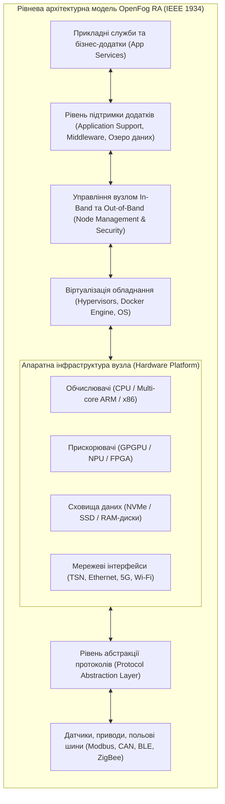
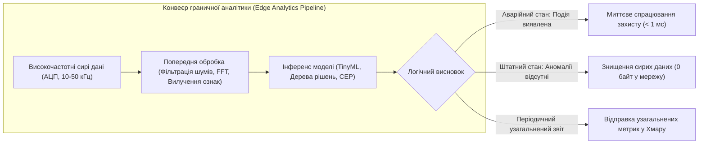

# Змістовий модуль 1. Архітектура, мережі та протоколи ІоТ

# Тема 5. Туманні (Fog) та граничні (Edge) обчислення

---

## 5.1. Обмеження хмарних архітектур

### Основний зміст та теоретичний базис

Класична парадигма централізованих **хмарних обчислень** (Cloud Computing), що базується на концентрації обчислювальних потужностей, систем зберігання та аналітичних алгоритмів у масштабованих центрах обробки даних (ЦОД), тривалий час розглядалася як універсальна платформа для функціонування інформаційних систем. Проте стрімкий розвиток та масштабне розгортання екосистем Інтернету речей зумовили явище інформаційного вибуху («Data Deluge»), за якого мільярди розподілених сенсорів, контролерів, інтелектуальних камер і промислових автоматів безперервно генерують колосальні обсяги слабоструктурованих даних. Спроба безпосереднього спрямування всього первинного потоку невибіркової телеметрії до віддалених хмарних провайдерів стикається з фундаментальними фізичними, мережевими, економічними та безпековими обмеженнями, які унеможливлюють ефективну роботу критично важливих кіберфізичних систем.

Першим фундаментальним обмеженням хмарних систем є непереборна **латентність мережі** (Network Latency) та варіація затримки (джиттер), зумовлені фізичною відстанню між польовими пристроями та континентальними дата-центрами. Час проходження сигналу по магістральних лініях зв'язку через десятки транзитних маршрутизаторів, протокольних шлюзів та конвертерів інтерфейсів становить від десятків мілісекунд до кількох секунд, причому цей параметр є випадковою величиною, яка сильно залежить від завантаженості глобальних каналів зв'язку. 

Для значного класу систем Інтернету речей такі часові затримки є неприпустимими. Системи екстреного захисту промислових реакторів, комплекси запобігання зіткненням на безпілотному транспорті, контури стабілізації параметрів літальних апаратів та системи телемедичної хірургії вимагають гарантованого, детермінованого часу реакції на рівні від одиниць мікросекунд до десяти мілісекунд (Hard Real-Time constraints). Відхилення від зазначеного часового бюджету внаслідок мережевих збоїв чи буферизації у глобальній мережі призводить до катастрофічних наслідків для життя людей та функціонування інфраструктури.

```mermaid
flowchart TD
    subgraph CloudOnlyArchitecture["Централізована хмарна архітектура (Вузькі місця)"]
        Sensors1["Мільйони IoT-сенсорів (Сирий трафік високої щільності)"]
        WAN1["Глобальна мережа WAN / Інтернет (Затримки, Джиттер, Вразливість каналу)"]
        CloudDC["Централізована хмара (ЦОД) (Віддалений аналіз, Збереження)"]
        Actuators1["Виконавчі механізми (Запізніла реакція > 200-500 мс)"]
        
        Sensors1 -->|Нефільтровані потоки| WAN1
        WAN1 -->|Транзитний оверхед| CloudDC
        CloudDC -->|Керуючі команди із затримкою| WAN1
        WAN1 -->|Ризик розриву зв'язку| Actuators1
    end

    subgraph DistributedArchitecture["Розподілена архітектура (Edge-Fog-Cloud)"]
        Sensors2["IoT-сенсори та камери"]
        EdgeNode["Граничні вузли (Edge) (Фільтрація, Локальний контур < 5 мс)"]
        FogNode["Туманні вузли (Fog) (Локальна агрегація, CEP, Сховище)"]
        CloudPlatform["Глобальна хмара (Cloud) (Довготривала аналітика, Big Data)"]
        Actuators2["Виконавчі механізми (Миттєва реакція)"]

        Sensors2 -->|Сирий сигнал| EdgeNode
        EdgeNode -->|Пряме управління < 5 мс| Actuators2
        EdgeNode -->|Очищені події| FogNode
        FogNode -->|Агреговані метадані| CloudPlatform
    end
```

*Рисунок 1 — Структурне зіставлення централізованої хмарної та розподіленої трирівневої архітектури обробки даних в Інтернеті речей*

Як проілюстровано на рисунку 1, централізований підхід створює критичну точку відмови в комунікаційному каналі та накладає значний часовий штраф на контур управління. Другим системним бар'єром виступає дефіцит **пропускної здатності каналів зв'язку** (Bandwidth Bottleneck). Одиничний сучасний автономний автомобіль, обладнаний комплексом сенсорів високої роздільної здатності (LiDAR, радарними системами, ультразвуковими далекомірами та масивом стереокамер кругового огляду), генерує від $1{,}5$ до $4{,}0$ терабайтів інформації за одну годину активного руху. 

Якщо помножити ці показники на тисячі автомобілів у масштабах одного мегаполісу або на десятки тисяч вібраційних датчиків промислового підприємства, що працюють із частотою дискретизації $10\dots 50\text{ кГц}$, виникає параліч магістральних каналів зв'язку. Вартість передачі та довготривалого орендованого зберігання надлишкових «сирих» даних у публічних хмарах зростає експоненційно, роблячи проєкт економічно нерентабельним.

Третім фактором є вимоги щодо **кібербезпеки, конфіденційності та суверенітету даних** (Data Privacy & Compliance). Пряма трансляція детальних біометричних параметрів пацієнтів, відеопотоків із приватних приміщень чи технологічних карт оборонних заводів у відкритий інтернет-простір несе ризики несанкціонованого перехоплення, модифікації трафіку та порушення регуляторних нормативів (зокрема GDPR чи стандартів безпеки критичної інфраструктури). Локалізація обробки дозволяє знеособлювати, фільтрувати або повністю замикати критичну інформацію всередині захищеного периметра підприємства.

Четвертим обмеженням є потреба у **високій автономності** (Offline Autonomy). Пристрої Інтернету речей повинні гарантувати безперебійне виконання базових технологічних функцій навіть за умов повного обриву зовнішнього інтернет-з'єднання, стихійного лиха або аварій у транзитній мережі провайдера. Централізована хмарна система в такій ситуації повністю втрачає зв'язок з об'єктом, що призводить до зупинки виробництва чи деградації функціоналу розумного будинку.

Математична модель загальної кругової затримки передачі та обробки сигналу в суто хмарній архітектурі $\tau_{cloud}$ описується сумою складових часового бюджету:

$$\tau_{cloud} = 2 \cdot (\tau_{access} + \tau_{core} + \tau_{dc\_in}) + \tau_{queue} + \tau_{proc}$$

де $\tau_{access}$ позначає час передачі пакета через бездротову мережу доступу (Wi-Fi, 4G/LTE, 5G, вимірюваний у секундах або мілісекундах); $\tau_{core}$ визначає затримку поширення та маршрутизації сигналу в опорній магістральній мережі WAN; $\tau_{dc\_in}$ є затримкою комутації та балансування навантаження всередині центру обробки даних; $\tau_{queue}$ позначає час очікування повідомлення в чергах обробки брокерів та серверів додатків; $\tau_{proc}$ є безпосереднім часом виконання алгоритму аналізу або запиту до бази даних у хмарі. 

Множник 2 враховує двосторонній цикл трансляції (Uplink для передачі телеметрії та Downlink для повернення керуючої директиви). У реальних умовах величина $\tau_{cloud}$ становить від $100\text{ мс}$ до $2000\text{ мс}$, тоді як для локального граничного контуру цей показник зводиться до суми $\tau_{edge} = \tau_{local\_bus} + \tau_{mcu\_proc} \le 5\text{ мс}$.

Сумарне навантаження на магістральний канал зв'язку $B_{total}$ (біт/с) від системи з $N$ сенсорних вузлів за умови передачі невідфільтрованого трафіку безпосередньо у хмару визначається залежністю:

$$B_{total} = \sum_{i=1}^{N} \left( f_{s,i} \cdot D_{sample,i} \cdot \left(1 + \frac{H_{net}}{P_{data,i}}\right) \right)$$

де $f_{s,i}$ позначає частоту опитування або дискретизації $i$-го сенсора (вимірювану в герцах, $\text{с}^{-1}$); $D_{sample,i}$ є розрядністю одного відліку вимірювання (біт); $H_{net}$ позначає фіксований сумарний розмір службових заголовків усіх мережевих рівнів (IP, TCP/UDP, TLS, протоколів додатків, виражений у байтах або бітах); $P_{data,i}$ позначає обсяг корисних даних сенсора, упакованих у пакет; відношення $H_{net} / P_{data,i}$ характеризує протокольний оверхед, який при передачі поодиноких числових відліків досягає сотень відсотків.

| Критерій функціонування | Централізована хмарна архітектура | Розподілена туманно-гранична архітектура |
| :--- | :--- | :--- |
| **Гарантований час відгуку (Latency)** | Від $100\text{ мс}$ до кількох секунд; висока ймовірність непередбачуваного джиттеру | Від часток мікросекунди до $10\dots 50\text{ мс}$; суворо детерміновані часові інтервали |
| **Вимоги до смуги магістрального каналу** | Екстремально високі; пропорційні кількості підключених сенсорів та частоті збору даних | Низькі; у глобальну мережу передаються лише аномалії, узагальнені звіти та витяги подій |
| **Поведінка при втраті зв'язку з WAN** | Повна зупинка аналітичних функцій та автоматизованого контуру керування | Збереження повної локальної функціональності, підтримка автономних режимів роботи |
| **Рівень захисту конфіденційної інформації** | Підвищений ризик витоку під час передачі через сторонніх провайдерів та публічні мережі | Максимальний; первинні дані обробляються локально, назовні транслюються знеособлені метадані |
| **Експлуатаційні витрати на передачу даних** | Високі (оплата мобільного та хмарного трафіку, оренда сховищ Big Data під сирі масиви) | Оптимізовані; витрати на трафік мінімізуються за рахунок попередньої локальної компресії |

Порівняльний аналіз підтверджує, що орієнтація виключно на хмарні ресурси утворює системне «вузьке місце», яке блокує розвиток широкомасштабних високошвидкісних рішень Інтернету речей та вимагає впровадження розподілених концепцій обробки.

---

## 5.2. Концепція OpenFog RA

### Основний зміст та теоретичний базис

Відповіддю індустрії та наукового співтовариства на обмеження хмарних обчислень стала концепція **туманних обчислень** (Fog Computing), сформована міжнародним консорціумом **OpenFog Consortium** (заснованим у 2015 році за участі корпорацій Cisco, Intel, ARM, Dell, Microsoft та Прінстонського університету) і згодом прийнята як офіційний міжнародний стандарт **IEEE 1934**. Відповідно до базових положень еталонної архітектури **OpenFog Reference Architecture (OpenFog RA)**, туманні обчислення визначаються як системна горизонтальна багаторівнева архітектура, яка розподіляє ресурси обчислення, зберігання даних, мережевої комунікації та оперативного управління в будь-якому місці уздовж безперервного континууму від хмарних дата-центрів до фізичних кінцевих пристроїв.

Фундаментальний зміст архітектури OpenFog базується на восьми концептуальних принципах, які в стандарті позначаються як **стовпи OpenFog** (OpenFog Pillars). Кожен стовп регламентує критичний набір вимог до проектування та розгортання туманних вузлів (**Fog Nodes**):

Завдяки інтеграції технологій віртуалізації та контейнеризації на базі Docker архітектура забезпечує високу **програмованість** (Programmability), що дозволяє динамічно перерозподіляти завдання між доступними вузлами шляхом оновлення мікросервісів без зупинки апаратного комплексу.

Принцип **відкритості** (Openness) гарантує використання загальнодоступних стандартів, протоколів і прикладних інтерфейсів програмування (API), що запобігає виникненню монопольної залежності від одного постачальника обладнання та дозволяє формувати гетерогенні обчислювальні кластери.

Стовп **масштабованості** (Scalability) визначає здатність системи адаптуватися до зростання кількості польових пристроїв, обсягів інформації та обчислювальної складності шляхом горизонтального додавання нових туманних вузлів у кластер або вертикального нарощування продуктивності.

Принцип **безпеки** (Security) вимагає впровадження апаратного кореня довіри (Hardware Root of Trust) на кожному вузлі, створення ізольованих анклавів виконання, контекстуального шифрування комунікацій та локального контролю доступу до даних до моменту їх виходу за межі захищеного сегмента.

Властивість **автономності** (Autonomy) забезпечує збереження повної працездатності, самодіагностики, диспетчеризації та реалізації бізнес-правил туманним кластером у разі відмови зовнішніх сервісів чи ізоляції від глобальної хмари.

Принцип **ієрархічності** (Hierarchy) структурує обчислювальні ресурси за логічними та фізичними рівнями відповідно до вимог щодо латентності, пропускної здатності та складності завдань.

Вимога **надійності, доступності та зручності обслуговування** (Reliability, Availability, and Serviceability — **RAS**) регламентує високу відмовостійкість архітектури в суворих промислових умовах завдяки гарячому резервуванню функцій та взаємному моніторингу суміжних вузлів за принципом «Watchdog».

Стовп **маневреності** (Agility) полягає у швидкому перетворенні великих обсягів розрізнених первинних даних на практичні керуючі дії та структуровані інсайти безпосередньо поблизу джерела їх генерації.

*Рисунок 2 — Багатошаровий функціональний стек туманного вузла відповідно до стандарту OpenFog RA*

Структура туманного вузла, подана на рисунку 2, демонструє глибоку ізоляцію апаратних ресурсів від прикладного програмного забезпечення. Рівень абстракції протоколів (**Protocol Abstraction Layer**) уніфікує взаємодію з різнорідними фізичними сенсорами, транслюючи промислові інтерфейси в стандартизовані моделі даних. 

Апаратна платформа обов'язково містить спеціалізовані апаратні прискорювачі (**Accelerators**: графічні процесори GPGPU, нейропроцесори NPU або програмовані логічні інтегральні схеми FPGA), призначені для паралельного виконання ресурсоємних матричних операцій комп'ютерного зору, цифрової фільтрації сигналів та інференсу моделей глибокого навчання без завантаження центрального процесора.

Для забезпечення відмовостійкості (Reliability) в туманних архітектурах застосовується кластеризація вузлів. Коефіцієнт готовності багатовузлового туманного кластера $A_{system}$ із паралельно-ієрархічним резервуванням $M$ незалежних вузлів розраховується за формулою:

$$A_{system} = 1 - \prod_{k=1}^{M} \left( 1 - A_{node, k} \right) = 1 - \prod_{k=1}^{M} \left( 1 - \frac{\text{MTTF}_k}{\text{MTTF}_k + \text{MTTR}_k} \right)$$

де $A_{node, k}$ позначає коефіцієнт готовності $k$-го окремого туманного вузла; $\text{MTTF}_k$ (Mean Time To Failure) є середнім часом безвідмовної роботи $k$-го пристрою (вираженим у годинах); $\text{MTTR}_k$ (Mean Time To Repair) позначає середній час відновлення працездатності вузла після збою за рахунок автоматичного перезапуску контейнерів або перемикання на резервний вузол. 

Якщо одиничний промисловий маршрутизатор має коефіцієнт готовності $A = 0{,}99$ (що відповідає понад 87 годинам простою на рік), то об'єднання трьох таких вузлів у туманний кластер забезпечує сумарну системну готовність $A_{system} = 1 - (1 - 0{,}99)^3 = 0{,}999999$ (менше 32 секунд сумарного простою на рік), що задовольняє найжорсткіші вимоги промислової автоматизації (клас надійності «Six Nines»).

| Рівень ієрархії | Типове апаратне забезпечення | Обчислювальні та ресурсні можливості | Цільові функції в екосистемі OpenFog |
| :--- | :--- | :--- | :--- |
| **Рівень 1: Сенсорні шлюзи (Micro Fog)** | Мікроконтролери з RTOS, одноплатні комп'ютери (ARM Cortex-A) | Обмежені (RAM $512\text{ Мбайт} \dots 2\text{ Гбайт}$, flash-накопичувачі) | Нормалізація протоколів, локальне зняття показів, проста фільтрація за порогом |
| **Рівень 2: Локальні контролери (Mini Fog)** | Промислові ПК, інтелектуальні комутатори (x86/ARM, $4\dots 16$ ядер) | Середні (RAM $8\dots 32\text{ Гбайт}$, апаратні прискорювачі NPU/TPU) | Обробка складних подій (CEP), візуалізація HMI, локальне керування процесом |
| **Рівень 3: Регіональні сервери (Heavy Fog)**| Сервери периметра (Edge Servers), мікро-ЦОД ($32\dots 128$ ядер) | Високі (RAM $64\dots 512\text{ Гбайт}$, високопродуктивні GPGPU, NVMe RAID) | Зберігання локальних озер даних, навчання легких нейромереж, координація підсистем |
| **Рівень 4: Глобальна хмара (Cloud)** | Публічні/приватні ЦОД (Еластичні пули віртуальних машин) | Теоретично необмежені обчислювальні ресурси та дисковий простір | Глобальне довготривале планування, навчання важких ШІ-моделей, Big Data аналітика |

Аналіз функціонального розподілу показує, що архітектура OpenFog створює плавний міст між польовим рівнем та глобальною інфраструктурою, дозволяючи виконувати обчислення саме там, де це найбільш доцільно з огляду на вимоги безпеки, швидкодії та економічної ефективності.

---

## 5.3. Перенесення аналітики на межу мережі

### Основний зміст та теоретичний базис

Трансформація обчислювального ландшафту привела до виникнення концепції **граничної аналітики** (**Edge Analytics**) та штучного інтелекту на межі мережі (**Edge AI / TinyML**). Замість традиційного підходу, орієнтованого на передачу сирих даних у сховища для апостеріорного офлайн-аналізу, сучасні системи реалізують парадигму прийняття рішень «тут і зараз». 

Аналітичний конвеєр переноситься безпосередньо на мікроконтролери та локальні шлюзи, забезпечуючи перетворення високочастотних сигналів датчиків на компактні значущі дескриптори подій.

*Рисунок 3 — Схема конвеєра обробки даних та прийняття рішень на граничному вузлі*

Як відображено на рисунку 3, повноцінний конвеєр граничної аналітики складається з кількох послідовних стадій. На першому етапі здійснюється високошвидкісна попередня фільтрація, усунення шумів та спектральне перетворення сигналів (наприклад, швидке перетворення Фур'є — FFT або вейвлет-аналіз). На другому етапі оптимізовані математичні моделі (квантовані нейронні мережі, механізми обробки складних подій CEP або алгоритми нечіткої логіки) виконують інференс. 

Якщо система фіксує нормальний стан функціонування об'єкта, гігабайти сирих вимірювань просто знищуються з оперативної пам'яті, що звільняє мережу від паразитних навантажень. У разі детектування аварійного паттерна вузол за частки мілісекунди генерує сигнал на виконавчий актуатор і лише після цього відправляє компактне повідомлення-тривогу до хмари.

Практична необхідність виконання аналітики на рівні Edge є критичною в таких технологічних галузях:

1. **Автономні транспортні засоби та мобільна робототехніка**. Безпілотний автомобіль, рухаючись зі швидкістю $100\text{ км/год}$, долає близько $28\text{ метрів}$ за одну секунду. Затримка в $200\text{ мс}$, необхідна для відправки відеокадру в хмару та отримання команди гальмування назад, призведе до неконтрольованого проїзду майже 6 метрів дистанції, що є фатальним при раптовій появі перешкоди. Бортові системи на базі спеціалізованих Edge AI процесорів здійснюють комплексування даних від камер, радарів і лідарів (Sensor Fusion), сегментацію сцени та прийняття рішення про екстрене гальмування за час, що не перевищує $5\dots 10\text{ мс}$.

2. **Промислова предиктивна вібродіагностика та безпека виробництва**. Підшипники турбоагрегатів електростанцій, лопатки газових компресорів та шпинделі прецизійних ЧПУ-верстатів вимагають безперервного аналізу вібраційного спектра з частотою дискретизації $20\dots 50\text{ кГц}$. Передача такого потоку від сотень вузлів у хмару технічно неможлива. Граничний контролер розраховує спектральну густину вібрації локально, виявляє зародження мікротріщин на ранніх стадіях за специфічними гармоніками та відправляє на сервер лише узагальнений показник залишкового ресурсу механізму, а в разі перевищення віброшвидкості самостійно знеструмлює привід.

3. **Комп'ютерний зір у системах безпеки та моніторингу простору**. Замість постійної трансляції десятків паралельних 4K-відеопотоків вуличного відеоспостереження через опорну мережу міста, камера з вбудованим нейромережевим прискорювачем локально детектує рух, розпізнає номерні знаки автомобілів або факт падіння людини і транслює до центрального пульта виключно короткі метадані та векторні координати події.

Математична оцінка ефективності скорочення обсягу мережевого трафіку $\eta_{red}$ за рахунок роботи механізмів граничної аналітики визначається як:

$$\eta_{red} = \left( 1 - \frac{S_{meta} \cdot f_{event}}{S_{raw} \cdot f_{sample}} \right) \cdot 100\%$$

де $S_{raw}$ позначає розмір одного первинного відліку або кадру вимірювання (байт); $f_{sample}$ є частотою отримання первинних вимірювань датчиком (Гц); $S_{meta}$ позначає обсяг структурованого результуючого повідомлення про подію (байт); $f_{event}$ є частотою виникнення значущих подій або аномалій ($f_{event} \ll f_{sample}$). 

У системах вібродіагностики відношення $f_{sample} / f_{event}$ зазвичай перевищує величину $10^5$, що забезпечує коефіцієнт зниження навантаження на канали зв'язку на рівні $\eta_{red} > 99{,}99\%$.

Для забезпечення гарантованої безпеки кіберфізичної системи сумарний час реакції граничного контуру $\tau_{edge\_loop}$ повинен суворо задовольняти критерію детермінізму:

$$\tau_{edge\_loop} = t_{acq} + t_{dsp} + t_{infer} + t_{act} \le T_{deadline}$$

де $t_{acq}$ позначає тривалість квантування та зчитування сигналів АЦП або сенсорної матриці (с); $t_{dsp}$ є часом цифрової фільтрації та формування вектору ознак; $t_{infer}$ позначає тривалість виконання математичного інференсу моделі на мікроконтролері; $t_{act}$ є часом спрацьовування силового драйвера та механічного переміщення актуатора; $T_{deadline}$ позначає критичний граничний часовий поріг стабільності фізичного процесу, перевищення якого призводить до руйнування керованого об'єкта.

| Галузь застосування | Характер вхідних даних | Типові методи граничної аналітики | Часовий бюджет реакції ($T_{deadline}$) | Ефект від перенесення обчислень на Edge |
| :--- | :--- | :--- | :--- | :--- |
| **Автономний транспорт (V2X)** | Відеопотоки, хмари точок LiDAR, дані IMU | Згорткові нейромережі (CNN), фільтри Калмана, Sensor Fusion | $< 10\text{ мс}$ | Запобігання ДТП, усунення залежності від покриття стільникових веж |
| **Промислові верстати та турбіни** | Віброприскорення, струм статора ($>20\text{ кГц}$) | Швидке перетворення Фур'є (FFT), автокореляція, TinyML | $< 1\dots 5\text{ мс}$ | Миттєве аварійне відключення, виявлення кавітації та зносу підшипників |
| **Інтелектуальні енергомережі (Smart Grid)**| Миттєві значення фаз напруги та струму (PMU) | Векторні вимірювання (Synchrophasors), розрахунок гармонік | $< 20\text{ мс}$ | Локалізація коротких замикань, запобігання каскадним блекаутам |
| **Охоронний відеонагляд та Smart City** | Потокове відео високої роздільної здатності (4K) | Детектування об'єктів (YOLO-tiny, MobileNet), трекінг | $< 100\text{ мс}$ | Зниження трафіку на 99%, збереження конфіденційності громадян |
| **Портативні медичні монітори** | Електрокардіограма (ЕКГ), фотоплетизмограма | Детектування спайків, QRS-аналіз, класифікація аритмій | $< 50\text{ мс}$ | Миттєва дефібриляція, автономне сповіщення про інфарктні стани |

Наведені дані підтверджують, що перенесення аналітичних алгоритмів безпосередньо на межу мережі є не просто засобом оптимізації трафіку, а критичною архітектурною умовою створення стійких, безпечних та швидкодіючих кіберфізичних систем майбутнього.

---

### Питання для самоперевірки та аналітичного осмислення

1. Розкрийте системні причини, через які централізована хмарна архітектура виявляється непридатною для прямого замкненого контуру управління швидкодіючими промисловими та транспортними об'єктами.
2. На основі формули кругової затримки $\tau_{cloud}$ проаналізуйте, які складові вносять найбільший внесок у недетермінованість поведінки хмарних систем у реальному часі.
3. Охарактеризуйте концептуальну сутність стандарту OpenFog Reference Architecture (IEEE 1934). Яким чином реалізується стовп «Автономність» (Autonomy) при повному розриві магістрального інтернет-каналу?
4. Детально опишіть функціональні обов'язки та апаратний склад чотирьох рівнів ієрархії туманних обчислень (Micro Fog, Mini Fog, Heavy Fog, Cloud).
5. Поясніть фізичний та математичний зміст досягнення високого коефіцієнта надійності $A_{system}$ за рахунок кластеризації туманних вузлів із застосуванням показників MTTF та MTTR.
6. Які алгоритмічні методи попередньої обробки сигналів та стиснення моделей машинного навчання (TinyML) використовуються для забезпечення інференсу на мікроконтролерах із суворими обмеженнями оперативної пам'яті?
7. Проаналізуйте інженерний компроміс між повнотою передачі даних у хмарне сховище Big Data для навчання глобальних нейромереж та необхідністю мінімізації мережевого трафіку за допомогою формули коефіцієнта скорочення $\eta_{red}$. Як знайти баланс між цими вимогами при проєктуванні системи вібродіагностики?