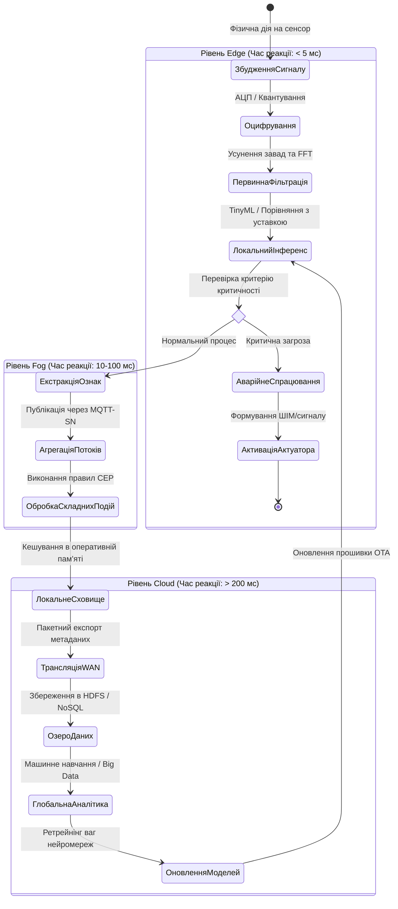
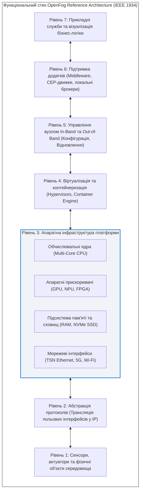
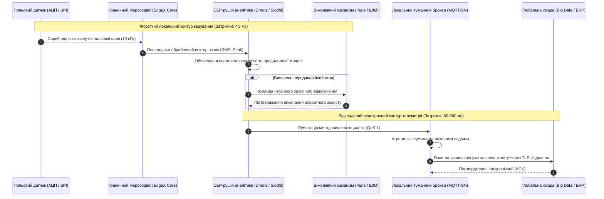
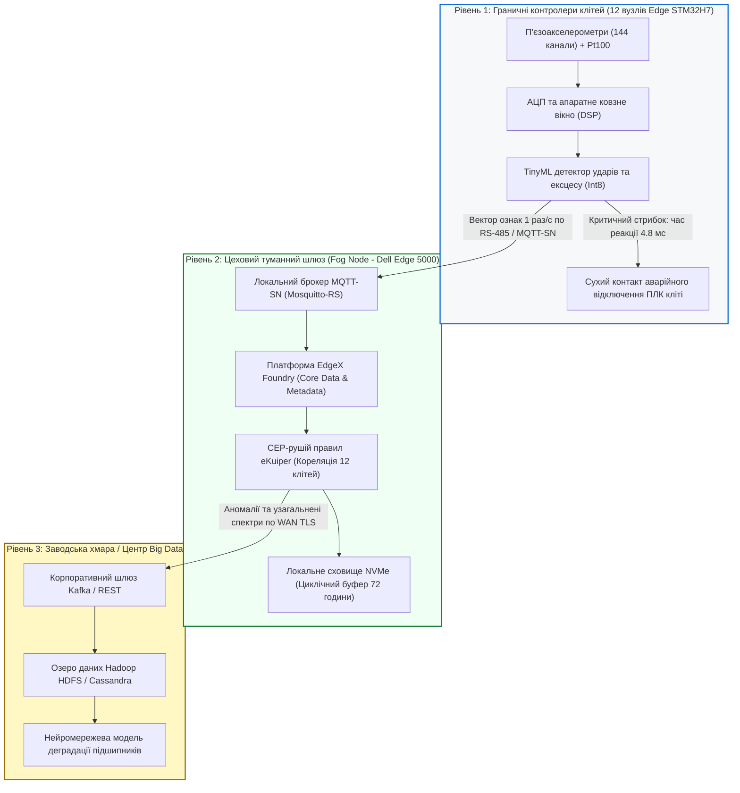

# Тема 5. Туманні та граничні обчислення в системах Інтернету речей

## Мета лекції

Метою лекції є формування у майбутніх інженерів комплексної системи фундаментальних теоретичних знань і практичних компетентностей щодо проектування, розгортання та оптимізації розподілених архітектур обробки даних на основі концепцій граничних (Edge) та туманних (Fog) обчислень. У межах навчальної дисципліни розглядаються фізичні, комунікаційні, обчислювальні та економічні передумови подолання обмежень класичних централізованих хмарних систем в екосистемах Інтернету речей, аналізується міжнародний стандарт OpenFog Reference Architecture (IEEE 1934), досліджуються алгоритми перенесення аналітичних функцій, механізмів обробки складних подій і моделей штучного інтелекту безпосередньо на периферію мережі, що дозволяє студентам здобути навички побудови високонадійних кіберфізичних систем із суворими обмеженнями затримки та енергоспоживання для сучасної автоматизованої промисловості, критичної інфраструктури й концепції розумного міста.

## Очікувані результати навчання

1. **Знання та розуміння.** Здобувачі вищої освіти опанують архітектурні принципи функціонування розподілених інфокомунікаційних систем, з'ясують фундаментальні відмінності між парадигмами Cloud, Fog та Edge обчислень, а також вивчать компонентний склад стандарту OpenFog Reference Architecture та критерії класифікації туманних вузлів.
2. **Застосування.** Студенти набудуть практичних умінь виконувати математичний розрахунок часового бюджету затримок у змішаних мережевих контурах і розраховувати показники зниження мережевого трафіку при впровадженні алгоритмів попередньої фільтрації та локальної аналітики на базі платформ віртуалізації та контейнеризації.
3. **Аналіз.** Слухачі зможуть здійснювати порівняльний аналіз багаторівневих топологій міжвузлової комунікації, оцінювати стійкість локальних кіберфізичних систем до розриву магістральних каналів зв'язку із глобальною мережею та виявляти критичні вузькі місця у контурах управління реального часу.
4. **Оцінювання та синтез.** Студенти сформують здатність комплексно оцінювати інженерні компроміси між обчислювальною потужністю периферійних вузлів, їхньою енергоефективністю, смугою пропускання каналів зв'язку та ризиками інформаційної безпеки, обґрунтовуючи оптимальну конфігурацію гібридної системи збирання, нормалізації та обробки телеметричних даних.

---

## Детальний покроковий план лекції

### 1. Теоретико-концептуальний базис. Еволюція розподілених обчислень та еталонна модель OpenFog RA

* 1.1. Передумови виникнення розподіленої обробки даних, інформаційний вибух в екосистемах Інтернету речей та системні обмеження централізованих хмарних архітектур за латентністю, пропускною здатністю й автономністю
* 1.2. Концептуальне розмежування та взаємозв'язок парадигм Cloud Computing, Fog Computing та Edge Computing уздовж континууму передачі інформації
* 1.3. Архітектурний стандарт OpenFog Reference Architecture (IEEE 1934), багаторівневий функціональний стек платформи та характеристика восьми базових стовпів проектування туманних вузлів
* 1.4. Ієрархічні рівні туманних обчислень (Micro Fog, Mini Fog, Heavy Fog, Cloud) та топології координації трафіку за напрямками «схід-захід» і «північ-південь»

### 2. Методологія та аналіз граничних умов. Організація граничної аналітики та критичні бар'єри периферійних систем

* 2.1. Конвеєр граничної аналітики, методи цифрової обробки сигналів, квантування даних та впровадження алгоритмів машинного навчання на мікроконтролерах класу Edge AI і TinyML
* 2.2. Застосування мікросервісної архітектури, технологій контейнеризації та систем оркестрації на інтелектуальних промислових шлюзах для забезпечення оперативного контуру керування
* 2.3. Алгоритми нормалізації протоколів, виявлення аномалій у реальному часі та механізми обробки складних подій без збереження повного масиву первинної телеметрії
* 2.4. Апаратні обмеження, дефіцит оперативної пам'яті, теплові режими, мережевий джиттер та критичні бар'єри забезпечення детермінованого часу відгуку в польових умовах експлуатації
* 2.5. Моделі кібербезпеки розподіленого периметра, організація апаратного кореня довіри (Hardware Root of Trust) та забезпечення захисту конфіденційних даних на локальних шлюзах

### 3. Практичний індустріальний / фаховий кейс. Інженерна реалізація гранично-туманного комплексу моніторингу та управління

**Тема наскрізної задачі.** «Проектування багаторівневої туманно-граничної системи предиктивної вібродіагностики та автоматичного аварійного захисту підшипникових вузлів прокатного стану металургійного підприємства на базі платформи EdgeX Foundry з використанням протоколу MQTT-SN»

## 1. Теоретико-концептуальний базис. Еволюція розподілених обчислень та еталонна модель OpenFog RA

### 1.1. Передумови виникнення розподіленої обробки даних, інформаційний вибух в екосистемах Інтернету речей та системні обмеження централізованих хмарних архітектур за латентністю, пропускною здатністю й автономністю

Історична еволюція обчислювальних систем розвивалася за спіральною траєкторією, чергуючи фази жорсткої централізації та розподіленої децентралізації. На початкових етапах розвитку інформаційних технологій домінувала модель мейнфреймів, де всі обчислювальні ресурси та пам'ять зосереджувалися на одному потужному вузлі, а взаємодія з користувачами здійснювалася через неінтелектуальні термінали введення-виведення. Подальша мініатюризація напівпровідникової елементної бази зумовила перехід до концепції персональних комп'ютерів і класичної клієнт-серверної архітектури, у якій частина логіки обробки та візуалізації делегувалася кінцевим робочим станціям. На межі двохтисячних років поява високошвидкісних глобальних каналів зв'язку, розвиток методів апаратної віртуалізації та прагнення до оптимізації капітальних витрат (CAPEX) у бік операційних витрат (OPEX) привели до формування концепції **хмарних обчислень** (Cloud Computing), що закріпилася як домінуюча платформа для розміщення корпоративних інформаційних систем.

Парадигма централізованих хмарних обчислень довела свою беззаперечну ефективність під час обслуговування традиційних користувацьких веб-додатків, систем управління базами даних і транзакційних платформ, для яких генерація запитів ініціювалася переважно діями людини. Проте стрімке розгортання екосистем Інтернету речей принципово змінило фізичну природу та обсяги трафіку в інфокомунікаційних мережах. Фізичні об'єкти реального світу, оснащені мікроелектромеханічними сенсорами (MEMS), засобами радіочастотної ідентифікації (RFID), відеокамерами високої роздільної здатності та виконавчими механізмами, перетворилися на автономні джерела безперервного продукування цифрових сигналів. Виник феномен інформаційного вибуху («Data Deluge»), за якого швидкість генерації та сумарний обсяг польових даних почали перевищувати пропускну здатність магістральних каналів зв'язку, а вимоги до оперативності прийняття рішень увійшли у суперечність із затримками, притаманними віддаленим дата-центрам.

Фундаментальним бар'єром під час використання виключно хмарної інфраструктури для потреб Інтернету речей є непереборна **латентність мережі** (Network Latency) та її недетермінована варіація, відома як джиттер. Фізична віддаленість континентальних центрів обробки даних від польових об'єктів на тисячі кілометрів зумовлює затримку поширення електромагнітної хвилі у фізичному середовищі, до якої додаються затримки пакетної комутації на численних проміжних маршрутизаторах, витрати часу на перепакування протоколів і черги буферизації. Для широкого класу кіберфізичних систем, таких як системи стабілізації безпілотних літальних апаратів, контури протиаварійного захисту в енергетиці чи роботизоване хірургічне обладнання, затримка керуючого сигналу понад кілька мілісекунд є неприпустимою, оскільки призводить до втрати стійкості об'єкта управління та техногенних аварій.

Математична модель загальної кругової затримки передачі та аналізу інформації в суто хмарній архітектурі $\tau_{\text{cloud}}$ описується адитивною композицією часових параметрів проходження сигналу по тракту зв'язку:

$$\tau_{\text{cloud}} = 2 \cdot \left( \tau_{\text{prop}} + \tau_{\text{trans}} + \sum_{k=1}^{M} \tau_{\text{router}, k} \right) + \tau_{\text{queue}} + \tau_{\text{proc}}$$

де $\tau_{\text{prop}}$ позначає час фізичного поширення сигналу оптичним або бездротовим каналом, що лінійно залежить від географічної відстані між датчиком і хмарою; $\tau_{\text{trans}}$ є затримкою серіалізації пакета під час його видачі в мережевий інтерфейс; $\tau_{\text{router}, k}$ позначає час комутації, перевірки контрольної суми та маршрутизації в $k$-му проміжному мережевому вузлі на шляху довжиною $M$ транзитних переходів (хопів); $\tau_{\text{queue}}$ представляє час перебування пакета в чергах очікування сокетів, брокерів повідомлень та балансувальників навантаження; $\tau_{\text{proc}}$ визначає безпосередню тривалість виконання аналітичного алгоритму чи транзакції бази даних на віртуальних машинах хмарного кластера. Коефіцієнт $2$ враховує повний двосторонній цикл взаємодії, що складається з висхідного каналу передачі первинних даних та низхідного каналу повернення керуючої команди.

Другим критичним обмеженням виступає вичерпання **пропускної здатності каналів зв'язку** (Bandwidth Saturation). Сумарне навантаження на магістральний канал зв'язку $B_{\text{total}}$ (біт/с), що генерується системою з $N$ сенсорних вузлів за умови передачі невідфільтрованого трафіку безпосередньо у хмару, визначається виразом:

$$B_{\text{total}} = \sum_{i=1}^{N} \left[ f_{s, i} \cdot D_{\text{sample}, i} \cdot \left( 1 + \frac{H_{\text{net}}}{P_{\text{data}, i}} \right) \right]$$

де $f_{s, i}$ є частотою опитування або дискретизації $i$-го сенсора (вимірюваною в герцах); $D_{\text{sample}, i}$ відображає розрядність одного виміру первинної фізичної величини (виражену в бітах); $H_{\text{net}}$ позначає сукупний обсяг службових заголовків усіх задіяних мережевих протоколів (включаючи кадри канального рівня IEEE 802.15.4 або Ethernet, пакети IPv6, дейтаграми UDP або сегменти TCP, а також криптографічні заголовки TLS/DTLS); $P_{\text{data}, i}$ позначає розмір корисного навантаження датчика, упакованого в одиничний пакет. У випадках надсилання високочастотних сигналів відношення $H_{\text{net}} / P_{\text{data}, i}$ набуває надмірних значень, зумовлюючи непропорційне перевантаження радіоефіру та значні фінансові витрати на оплату хмарного вхідного трафіку.

> **ПРАКТИЧНИЙ ЯКІР:** Сучасний автономний автомобіль четвертого рівня автоматизації генерує за допомогою лідарів, радарів і масиву 4K-відеокамер до $4\text{ терабайтів}$ сирих даних за одну годину руху; передача такого суцільного потоку через стільникову мережу 4G/LTE чи 5G у хмарний центр не лише технічно паралізує радіоканал базової станції, а й коштуватиме оператору автопарку сотні доларів за кожну годину експлуатації одного транспортного засобу.

Третім фактором є дефіцит **автономності функціонування** (Offline Autonomy) локальних об'єктів управління. Якщо система автоматизації повністю покладається на віддалений хмарний сервер для прийняття рішень, то будь-який обрив кабелю, аварія на лінії провайдера або зловмисна DoS-атака призводять до деградації керованості, унеможливлюючи базові технологічні операції. Додатково виникають суворі вимоги щодо **конфіденційності та безпеки** (Data Privacy): пряма трансляція чутливої інформації, наприклад, медичних показників пацієнтів чи параметрів технологічного процесу виготовлення оборонної продукції, через публічну мережу несе високі ризики несанкціонованого перехоплення або порушення регуляторних нормативів щодо захисту персональних даних.

---

### 1.2. Концептуальне розмежування та взаємозв'язок парадигм Cloud Computing, Fog Computing та Edge Computing уздовж континууму передачі інформації

Для подолання вказаних диспропорцій у сучасній інженерії Інтернету речей сформувалася концепція обчислювального континууму («Edge-to-Cloud Continuum»), яка передбачає диференційований розподіл функцій зберігання, нормалізації, фільтрації та аналізу даних між різними ієрархічними рівнями мережі. У цьому континуумі виділяють три базові парадигми: **хмарні обчислення** (Cloud Computing), **туманні обчислення** (Fog Computing) та **граничні обчислення** (Edge Computing). Незважаючи на спільну мету, що полягає в оптимізації обробки даних, кожна з цих парадигм володіє унікальними властивостями, займає чітко визначене місце в топології мережі та оперує різними масштабами часу.

Під **граничними обчисленнями** (Edge Computing) розуміють перенесення обчислювальних операцій безпосередньо на пристрої збору даних або на апаратно сполучені з ними вузли первинного доступу. Граничним пристроєм може виступати сам інтелектуальний датчик, мікроконтролер із підсистемою апаратного цифрового оброблення сигналів або компактний вбудований комп'ютер. Головною ознакою Edge Computing є робота з потоками даних у режимі жорсткого реального часу, де часовий бюджет вимірюється частками мікросекунд або одиницями мілісекунд. На цьому рівні дані розглядаються як «дані в русі» (Data in Motion): вони підлягають негайній дискретизації, видаленню високочастотних шумів, перевірці порогових значень і формуванню керуючих імпульсів на виконавчі актуатори, після чого сирі виміри можуть бути безповоротно знищені з оперативної пам'яті.

**Туманні обчислення** (Fog Computing) являють собою системну горизонтальну архітектуру, яка розгортається на рівні локальної чи міської мережі і пов'язує множину граничних пристроїв із віддаленою хмарою. Якщо граничні обчислення локалізовані на окремих пристроях, то туманні обчислення утворюють розподілене середовище з багатьох взаємопов'язаних вузлів: промислових контролерів, інтелектуальних маршрутизаторів, концентраторів і периферійних серверів. Туманні вузли функціонують у масштабі «майже реального часу» (Near Real-Time) із затримками від десяти до ста мілісекунд, забезпечуючи локальне накопичення інформації, агрегацію даних від просторово рознесених сенсорів, кореляцію подій і трансляцію гетерогенних польових протоколів у стандартизовані мережеві формати.

> **ТИПОВА ПОМИЛКА:** Ототожнення понять Edge Computing та Fog Computing як повних синонімів. Насправді Edge зосереджується виключно на обчисленнях безпосередньо на крайньому фізичному пристрої (наприклад, усередині самого сенсора чи мікроконтролера) без створення складної мережевої платформи, тоді як Fog — це багаторівнева структурована інфраструктура з підтримкою міжвузлової взаємодії, кластеризації, балансування навантаження та управління життєвим циклом додатків між краєм і хмарою.

Життєвий цикл переміщення та обробки телеметричних даних від моменту їх збудження у фізичному середовищі до фіксації в довготривалій аналітичній базі наочно відображається у вигляді переходів між станами обчислювального континууму.

*Рисунок 1.1 — Стейт-машина життєвого циклу обробки інформації в трирівневому обчислювальному континуумі Інтернету речей*

Наведена стейт-машина демонструє, що впровадження туманно-граничного континууму не витісняє централізовану хмару, а перетворює її на платформу стратегічного призначення. Хмара звільняється від рутинного оброблення високочастотного шуму, фокусуючись на агрегованих історичних трендах, глобальній оптимізації процесів підприємства та навчанні важких математичних моделей, результати яких у вигляді компактних коефіцієнтів згодом повертаються на граничні пристрої.

---

### 1.3. Архітектурний стандарт OpenFog Reference Architecture (IEEE 1934), багаторівневий функціональний стек платформи та характеристика восьми базових стовпів проектування туманних вузлів

Прагнення провідних технологічних корпорацій уніфікувати підходи до проектування периферійних систем привело до створення у листопаді 2015 року консорціуму OpenFog. Результатом роботи цієї організації стала розробка еталонної архітектури **OpenFog Reference Architecture (OpenFog RA)**, яка у 2018 році була офіційно ратифікована Інститутом інженерів з електротехніки та електроніки як міжнародний стандарт **IEEE 1934**. Стандарт визначає відкриту, масштабовану, безпечну горизонтальну архітектуру, яка регламентує вимоги до створення туманних систем від апаратного забезпечення кремнієвих кристалів до прикладних сервісів бізнес-рівня.

Методологічним ядром стандарту IEEE 1934 є вісім фундаментальних принципів проектування, які визначаються як **стовпи OpenFog** (OpenFog Pillars). Системне проектування будь-якого промислового туманного рішення вимагає обов'язкового врахування та технічної імплементації кожного з цих стовпів:

Фундаментальний стовп **безпеки** (Security) передбачає багаторівневу модель захисту, яка починається з апаратного кореня довіри (Hardware Root of Trust), інтегрованого в кремнієву мікросхему туманного вузла. Довірене завантаження гарантує перевірку цифрових підписів завантажувача, ядра операційної системи та контейнерів додатків, що повністю виключає виконання шкідливого або несанкціонованого коду. Крім того, вузол туману забезпечує шифрування каналів зв'язку та локальний контроль доступу до конфіденційних даних до їхньої передачі у відкритий простір.

Принцип **масштабованості** (Scalability) визначає спроможність системи гнучко адаптуватися до вибухового зростання кількості підключених польових сенсорів, потоків даних і аналітичних функцій. Архітектура підтримує як вертикальне масштабування окремого туманного вузла шляхом підключення додаткових апаратних блоків пам'яті чи процесорних плат, так і горизонтальне розширення системи за допомогою динамічного включення нових вузлів у єдиний обчислювальний кластер без необхідності переривання виробничих процесів.

Властивість **відкритості** (Openness) гарантує використання загальнодоступних стандартів, модульних специфікацій та уніфікованих відкритих прикладних програмних інтерфейсів (API). Це унеможливлює технологічну монополізацію рішень одним комерційним вендором, забезпечує взаємозамінність компонентів різних виробників та дозволяє стороннім розробникам створювати нове програмне забезпечення для функціонуючих промислових комплексів.

Стовп **автономності** (Autonomy) регламентує незалежність роботи локального туманного кластера від стану зовнішніх мережевих комунікацій. У разі аварійного відключення магістрального інтернет-каналу або глобальної хмарної інфраструктури туманний вузол самостійно забезпечує диспетчеризацію ресурсів, виконання алгоритмів зворотного зв'язку, тимчасове кешування вимірювань і виявлення локальних інцидентів, гарантуючи безперебійність технологічного процесу.

Принцип **програмованості** (Programmability) базується на широкому застосуванні технологій контейнеризації та мікросервісів. Логіка роботи туманного вузла не є статично «зашитою» в апаратну частину: прикладні модулі, драйвери протоколів та інструменти фільтрації пакуються в легковажні ізольовані контейнери, які можуть автоматично розгортатися, переконфігуруватися чи переміщуватися між вузлами відповідно до команд централізованого оркестратора.

Стовп **надійності, доступності та обслуговуваності** (Reliability, Availability, and Serviceability — **RAS**) є визначальним для впровадження систем на промислових об'єктах. Архітектурні рішення стандарту забезпечують механізми гарячого резервування вузлів, автоматичного відновлення після програмних збоїв, функціонування сторожових таймерів (Watchdog) і проведення самодіагностики апаратних підсистем без порушення цілісності мережі.

Принцип **маневреності** (Agility) полягає в оптимізації шляху проходження інформації: обчислення переміщуються ближче до місця виникнення даних, що дозволяє майже миттєво перетворювати сирі сигнали на управлінські рішення та керуючі команди, істотно підвищуючи динамічну стійкість об'єкта автоматизації.

Стовп **ієрархічності** (Hierarchy) структурує обчислювальні, комунікаційні та координаційні ресурси за вертикальними рівнями. Кожен рівень наділяється функціоналом відповідно до обмежень щодо допустимої затримки сигналу, пропускної здатності каналу та доступної апаратної потужності.

*Рисунок 1.2 — Структурна декомпозиція рівнів функціонального стека еталонної архітектури OpenFog RA*

> **ПРАКТИЧНИЙ ЯКІР:** У промислових комплексах підводного нафтовидобутку компанії застосовують туманні вузли стандарту IEEE 1934 безпосередньо на глибоководних платформах, що дозволяє виконувати автономний моніторинг сейсмічної активності та цілісності свердловин за допомогою локальних моделей у режимі закритого контуру, оскільки супутниковий канал зв'язку з материком має затримку понад $600\text{ мс}$ і періодично блокується штормовими умовами.

Надійність функціонування кластера туманних вузлів регламентується стовпом RAS. Розрахунок інтегрального коефіцієнта готовності туманного комплексу $A_{\text{system}}$, складеного з $M$ взаємозамінних паралельних вузлів обробки, визначається співвідношенням:

$$A_{\text{system}} = 1 - \prod_{k=1}^{M} \left( 1 - A_{\text{node}, k} \right) = 1 - \prod_{k=1}^{M} \left( 1 - \frac{\text{MTTF}_k}{\text{MTTF}_k + \text{MTTR}_k} \right)$$

де $A_{\text{node}, k}$ є коефіцієнтом готовності $k$-го окремого апаратного вузла; $\text{MTTF}_k$ (Mean Time To Failure) позначає середній час безвідмовної роботи вузла у годинах; $\text{MTTR}_k$ (Mean Time To Repair) визначає середній час відновлення працездатності пристрою шляхом автоматичного перезапуску мікросервісу чи перемикання на резерв. Завдяки ієрархічному резервуванню сукупна готовність туманного сегмента наближається до абсолютних показників $0{,}99999$ («п'ять дев'яток»), що гарантує безперебійність процесів високої категорії небезпеки.

---

### 1.4. Ієрархічні рівні туманних обчислень та топології координації трафіку за напрямками «схід-захід» і «північ-південь»

Стандарт OpenFog структурує обчислювальний простір за чотирма основними вертикальними рівнями, утворюючи піраміду обробки даних. На першому рівні розташовуються мікро-туманні вузли (**Micro Fog**), що являють собою прості вбудовані системи та мікроконтролери польового обладнання з обсягом оперативної пам'яті до $1\dots 2\text{ Гбайт}$, орієнтовані на первинну фільтрацію сигналів та трансляцію фізичних протоколів. Другий рівень формують міні-туманні вузли (**Mini Fog**), представлені захищеними промисловими шлюзами та комп'ютерами на базі процесорів архітектури x86 або високопродуктивних ARM, що володіють $8\dots 32\text{ Гбайт}$ пам'яті і здатні виконувати складніші алгоритми виявлення аномалій та обробки подій у межах виробничого цеху. 

Третій рівень складають важкі туманні вузли (**Heavy Fog**), які конструктивно є локальними периферійними серверами або модульними мікро-ЦОД із багатоядерними процесорами, графічними прискорювачами та ємними сховищами даних, призначеними для координації підсистем усього підприємства. Верхівкою піраміди залишається глобальна хмара (**Cloud**), де концентруються ресурси зберігання історичних баз даних та масштабної аналітики Big Data.

Координація інформаційних потоків між зазначеними рівнями здійснюється за двома просторовими напрямками. Трафік за напрямком **«північ-південь»** (North-South Traffic) представляє собою вертикальний ієрархічний обмін даними. Рух сигналу з півдня на північ передбачає передачу агрегованих метрик, виявлених інцидентів та узагальнених звітів від кінцевих сенсорів угору до важких вузлів і глобальної хмари. Зворотний рух із півночі на південь забезпечує транспортування команд глобального диспетчерського керування, політичних правил, оновлень мікропрограмного забезпечення (OTA Firmware Updates) та нових коефіцієнтів моделей машинного навчання.

На противагу вертикальному обміну, взаємодія за напрямком **«схід-захід»** (East-West Traffic) забезпечує горизонтальний розподілений зв'язок між одноранговими вузлами, що знаходяться на одному рівні ієрархії. Горизонтальний обмін реалізує механізми взаємного резервування завдань при відмові одного з пристроїв, динамічне балансування обчислювального навантаження, синхронізацію спільних кеш-сховищ і реалізацію протоколів узгодження консенсусу. Наприклад, сусідні інтелектуальні камери вуличного спостереження можуть безпосередньо обмінюватися векторними дескрипторами транспортних засобів для наскрізного відстеження їхньої траєкторії без перенаправлення важких відеопотоків до віддаленого сервера.

| Критерій порівняння | Централізована Хмара (Cloud) | Важкий туман (Heavy Fog) | Міні/Мікро туман (Mini/Micro Fog) | Граничні пристрої (Edge Nodes) | Приклад з реальної практики |
| :--- | :--- | :--- | :--- | :--- | :--- |
| **Місце розташування обладнання** | Віддалені гіпермасштабовані центри обробки даних | Локальні серверні підприємств або базові станції зв'язку | Промислові цехові шафи автоматизації, дорожні контролери | Безпосередньо на фізичному об'єкті або в корпусі сенсора | Автоматизована лінія штампування деталей кузова автомобіля |
| **Характерний час реакції (Latency)** | $200\text{ мс} \dots 2\text{ с}$ (висока дисперсія) | $20\dots 100\text{ мс}$ (стабільний канал) | $2\dots 20\text{ мс}$ (квазідетермінований) | $0{,}1\dots 2\text{ мс}$ (суворо детермінований) | Екстрена зупинка гідравлічного преса при виявленні перешкоди |
| **Апаратне забезпечення** | Тисячі блейд-серверів, еластичні віртуальні машини | Сервери стандартної архітектури x86, масиви GPU | Промислові ПК, інтелектуальні комутатори, шлюзи | Мікроконтролери Cortex-M, DSP, кристали FPGA | Промисловий шлюз Dell Edge Gateway 5000 у шафі цеху |
| **Типовий обсяг сховища даних** | Ексабайти (необмежені сховища озер даних HDFS) | Терабайти (локальні твердотільні RAID-масиви) | Гігабайти (швидкодіючі вбудовані флеш-карти eMMC) | Мегабайти або кілобайти (внутрішня SRAM/Flash) | Буферизація віброграм за зміну в кільцевий буфер пам'яті |
| **Підтримувані мережеві протоколи** | HTTP/HTTPS, REST, gRPC, AMQP, Kafka | MQTT, CoAP, OPC UA, IPv6/RPL, Modbus TCP | 6LoWPAN, BLE, ZigBee, Modbus RTU, CAN | Пропрієтарні шини SPI, I2C, UART, аналоговий струм 4-20 мА | Зняття показів вібродатчика через інтерфейс SPI мікроконтролером |
| **Ступінь автономності від інтернету** | Нульова (повна залежність від доступності WAN) | Висока (збереження функцій протягом днів і тижнів) | Повна автономність локального контуру управління | Абсолютна незалежність фізичного автомата | Автономне функціонування підсистеми захисту залізничного переїзду |

> **КОНТРОЛЬНЕ ПИТАННЯ:** Під час модернізації автоматизованої системи міського освітлення інженерна група запропонувала передавати всі дані з датчиків освітленості та руху безпосередньо до хмарної платформи через стільниковий зв'язок NB-IoT для централізованого вмикання світильників. Який системний ризик несе таке рішення і як його усунути на основі стандартів OpenFog RA?
>
> 

> 
Розгорнути аналіз / відповідь

>
> **Правильний варіант: Запропоноване рішення несе критичні ризики високої латентності, нестабільності часу відгуку та втрати працездатності освітлення при збоях мобільної мережі, що необхідно усунути перенесенням логіки вмикання на туманні вузли рівня Mini Fog.**
>
> 1. Логічне та аналітичне обґрунтування:
> Стандарт стільникового зв'язку NB-IoT оптимізований для передачі спорадичних невеликих повідомлень і характеризується затримками від 1,5 до 10 секунд, що унеможливлює динамічне вмикання освітлення під час руху пішохода чи автомобіля в реальному часі. У разі втрати зв'язку зі стільниковим оператором вулиці залишаться без освітлення, створюючи аварійну небезпеку. Відповідно до стандартів OpenFog RA, датчики освітленості та радарні модулі мають підключатися за допомогою локальної бездротової сітки (наприклад, 6LoWPAN або ZigBee) до місцевого туманного вузла (районного контролера освітлення класу Mini Fog). Цей вузол автономно виконує бізнес-правила ввімкнення світильників із детермінованою затримкою менше 20 мс, а вгору до глобальної хмари надсилає виключно агреговані звіти про енергоспоживання та сигнали про несправність окремих ламп.
>
> 2. Аналіз дистракторів:
> Спроба вирішити проблему лише збільшенням частоти опитування датчиків через NB-IoT є хибною, оскільки це призведе до швидкого вичерпання автономного заряду батарей датчиків та перевантаження каналу оператора. Використання виключно супутникового резервного каналу зв'язку з хмарою є економічно неприйнятним для розподіленої системи міського господарства. Делегування управління на рівень виключно одиничних світильників без туманного координатора унеможливить створення «світлової хвилі», коли група ліхтарів вмикається вздовж маршруту транспортного засобу заздалегідь на основі взаємодії за напрямком «схід-захід».
>
> 

---

### Вказівки для самостійного осмислення

1. Розрахуйте сумарний обсяг добового мережевого трафіку для цехової системи вібродіагностики з двадцяти верстатів за умови використання централізованої передачі сирих даних з частотою дискретизації $25\text{ кГц}$ (розрядність АЦП $16\text{ біт}$) та зіставте отриманий результат з обсягом трафіку за умови розгортання туманного вузла, який виконує локальне швидке перетворення Фур'є і передає у хмару лише амплітуди перших десяти гармонік двічі на хвилину.
2. Складіть аналітичну схему розподілу функціональних обов'язків для системи диспетчеризації швидкісного ліфта хмарочоса, визначивши, які операції контролю безпеки повинні суворо виконуватися на рівні граничного мікроконтролера кабіни ліфта, які функції координації групи ліфтів слід делегувати цеховому туманному контролеру, а які завдання оптимізації пасажиропотоків і предиктивного техобслуговування доцільно передати на хмарний рівень.
3. Проаналізуйте потенційні загрози інформаційній безпеці, що виникають під час організації горизонтальної комунікації за напрямком «схід-захід» між туманними вузлами різних муніципальних служб у системі «Розумне місто», та запропонуйте комплекс заходів для забезпечення довіреної автентифікації вузлів без участі центрального хмарного сервера сертифікації.

## 2. Методологія та аналіз граничних умов. Організація граничної аналітики та критичні бар'єри периферійних систем

### 2.1. Конвеєр граничної аналітики, методи цифрової обробки сигналів, квантування даних та впровадження алгоритмів машинного навчання на мікроконтролерах класу Edge AI і TinyML

Перенесення аналітичних процедур безпосередньо в точку генерації первинних даних вимагає кардинальної перебудови структури обчислювального процесу. Класичний підхід, за якого оцифрований масив вимірювань транслюється для пакетної обробки у віддалені сховища, замінюється концепцією потокового аналітичного конвеєра на межі мережі. У такій парадигмі первинний сигнал аналогового сенсора піддається багаторівневій фільтрації, нормалізації, екстракції спектральних або статистичних ознак і подальшій класифікації за допомогою оптимізованих математичних моделей. Це дозволяє приймати критичні керуючі рішення на рівні мікроконтролера за мілісекундні часові інтервали.

Реалізація конвеєра починається з отримання вибірки фізичного процесу за допомогою вбудованого або зовнішнього аналого-цифрового перетворювача (АЦП). Забезпечення математичної коректності подальшої цифрової обробки вимагає суворого дотримання теореми Котельникова-Шеннона, згідно з якою частота дискретизації $f_s$ повинна щонайменше удвічі перевищувати найвищу значущу частотну гармоніку в спектрі вимірюваного сигналу $f_{\max}$. На етапі попередньої обробки формуються вектори інформативних ознак: розраховуються середньоквадратичні значення (RMS), пік-фактори, коефіцієнти ексцесу (kurtosis), а також здійснюється перетворення сигналів із часової області у частотну за допомогою оптимізованого алгоритму швидкого перетворення Фур'є (FFT). Зазначені операції виконуються над фіксованими ковзними масивами даних із використанням апаратних блоків цифрової обробки сигналів (DSP), інтегрованих у сучасні мікроконтролери.

Впровадження моделей глибокого машинного навчання на вбудованих платформах із жорстко обмеженими обчислювальними ресурсами та малим обсягом оперативної пам'яті вимагає застосування методології **TinyML**. Оскільки стандартні нейронні мережі навчаються з використанням 32-розрядних чисел із плаваючою комою одинарної точності (формат IEEE 754 Float32), їх пряме виконання на апаратному забезпеченні класу ARM Cortex-M0+ або Cortex-M4 призводить до катастрофічного дефіциту швидкодії та переповнення статичної пам'яті (SRAM). Для подолання цього бар'єра застосовується методика постренувального симетричного або асиметричного цілочисельного квантування (Quantization), за якої матриці вагових коефіцієнтів та активацій трансформуються у 8-розрядні цілі числа зі знаком (Int8).

Формалізований процес лінійного афінного квантування матриць ваг нейронної мережі з простору дійсних чисел у цілочисельний простір виконується за алгоритмом, наведеним у наступному математичному виразі:

$$
\begin{aligned}
\text{Крок 1 (Визначення динамічного діапазону):} & \quad [\alpha, \beta] = [\min(W), \max(W)] \\
\text{Крок 2 (Обчислення масштабного коефіцієнта):} & \quad S = \frac{\beta - \alpha}{2^b - 1} \\
\text{Крок 3 (Розрахунок цілочисельного зсуву нуля):} & \quad Z = \text{round}\left(-\frac{\alpha}{S}\right) - 2^{b-1} \\
\text{Крок 4 (Квантування дійсного значення ваги):} & \quad q = \text{clamp}\left(\text{round}\left(\frac{w}{S}\right) + Z, -2^{b-1}, 2^{b-1}-1\right)
\end{aligned}
$$

де $W$ позначає вектор вагових коефіцієнтів вихідного тензора в дійсній точності Float32; $\alpha$ та $\beta$ визначають нижню та верхню межі значень коефіцієнтів; $b$ вказує цільову бітову розрядність квантування (для стандарту Int8 параметр $b = 8$); $S$ є дійсним масштабним коефіцієнтом, який відображає одиницю цілочисельного кроку у фізичну шкалу; $Z$ позначає целочисельну точку нуля, яка гарантує точне представлення дійсного нуля у квантованій сітці; функція $\text{clamp}(x, L, U)$ виконує операцію насичення, обмежуючи значення змінної нижньою $L$ та верхньою $U$ межами відповідно; $q$ позначає результуючий квантований 8-розрядний цілочисельний коефіцієнт.

Завдяки вказаній трансформації обсяг необхідної пам'яті для зберігання вагових коефіцієнтів зменшується рівно в чотири рази, а операції матричного множення з плаваючою комою замінюються високопродуктивними цілочисельними інструкціями векторного ядра, такими як SIMD у наборі команд ARM Cortex.

> **ВАЖЛИВО:** Під час квантування моделей із високим динамічним діапазоном активацій нелінійне накопичення похибок округлення може спричинити деградацію точності класифікації до рівня статистичного шуму; тому критично важливим є проведення процедури калібрування діапазонів на репрезентативному наборі валідаційних даних перед компіляцією прошивки для польового мікроконтролера.

---

### 2.2. Застосування мікросервісної архітектури, технологій контейнеризації та систем оркестрації на інтелектуальних промислових шлюзах для забезпечення оперативного контуру керування

У міру переходу від простих мікроконтролерних модулів до інтелектуальних промислових шлюзів виникає необхідність забезпечення модульності та гнучкості програмного забезпечення. Традиційний монолітний підхід до побудови вбудованого мікропрограмного коду унеможливлює динамічне оновлення окремих аналітичних компонентів без перезапуску всього контролера, що суперечить вимогам безперервності технологічних циклів. Відповіддю на цей виклик стала адаптація мікросервісної архітектури до периферійних платформ за допомогою легковажних рушіїв контейнеризації, оптимізованих для вбудованих операційних систем класу Linux.

Застосування контейнерних середовищ на промислових шлюзах дозволяє ізолювати функціональні задачі: драйвери польових шин функціонують у контейнерах доступу до обладнання, аналітичні алгоритми працюють у вигляді контейнерів обробки подій, а мережеві інтерфейси формують контейнери зв'язку з хмарою. Для координації виконання таких мікросервісів у гетерогенних туманних кластерах застосовуються спеціалізовані дистрибутиви платформ оркестрації, такі як K3s, що являє собою сертифіковану організацією CNCF полегшену версію Kubernetes, позбавлену надлишкових драйверів сховищ та оптимізовану для роботи в оперативній пам'яті обсягом від 512 Мбайт. 

Поділ архітектури шлюзу на швидкий детермінований контур локальної автоматизації та відкладений контур хмарної комунікації наочно відображається в часовій послідовності обміну повідомленнями між підсистемами.

Як показано на наведеній діаграмі послідовності дій, система структурно розділяє критичний потік керування від вторинного потоку телеметрії. Якщо час циклу взаємодії датчик-сервіс-актуатор утримується в межах декількох мілісекунд завдяки виключенню транзитних мережевих протоколів, то ресурсоємні операції шифрування, буферизації та маршрутизації в бік хмарного сервера виконуються асинхронно, не блокуючи функціонування локального контуру автоматизації.

---

### 2.3. Алгоритми нормалізації протоколів, виявлення аномалій у реальному часі та механізми обробки складних подій без збереження повного масиву первинної телеметрії

Однією з головних методологічних задач гранично-туманних вузлів є подолання проблеми гетерогенності промислових комунікацій. На сучасному підприємстві одночасно функціонують датчики із послідовними інтерфейсами RS-485 під протоколом Modbus RTU, автомобільні та верстатні шини CANopen, мережі автоматизації будівель BACnet, а також сучасні сенсори бездротових персональних мереж стандарту IEEE 802.15.4 з протоколами 6LoWPAN та ZigBee. Програмний рівень абстракції протоколів (**Protocol Abstraction Layer**) на туманному вузлі здійснює десеріалізацію низькорівневих бітових полів, валідацію типів даних та їхню нормалізацію у єдину канонічну об'єктну модель, яка зазвичай кодується у форматі компактних бінарних структур CBOR або JSON.

Після нормалізації дані потрапляють до підсистеми обробки складних подій (**Complex Event Processing — CEP**). Фундаментальна відмінність CEP-підходу від класичних реляційних баз даних полягає в інверсії логіки виконання запитів: у традиційній базі даних статичні дані перебувають у стані спокою на диску, а запити надходять динамічно; у системах CEP постійно зафіксовані аналітичні правила знаходяться в оперативній пам'яті, тоді як через них безперервно прокачується потік подій у реальному часі.

Для забезпечення можливості аналізу часових залежностей без збереження повного масиву первинних даних застосовуються математичні моделі ковзних вікон. Розрізняють перевертні вікна (Tumbling Windows), які не перекриваються у часі і закриваються з фіксованим періодом, стрибкоподібні вікна (Hopping Windows), які мають взаємне перекриття, та ковзні вікна (Sliding Windows), зміщення яких ініціюється надходженням кожного нового значення.

Алгоритм виявлення аномальних стрибків технологічного параметра на основі обчислення ковзного z-індексу в ковзному вікні розміром $W$ вибірок формалізується наступною системою розрахунків:

$$
\begin{aligned}
\text{Крок 1 (Оновлення суми вікна):} & \quad \Sigma_{x}(t) = \Sigma_{x}(t-1) + x(t) - x(t-W) \\
\text{Крок 2 (Оновлення квадратичної суми):} & \quad \Sigma_{x^2}(t) = \Sigma_{x^2}(t-1) + x^2(t) - x^2(t-W) \\
\text{Крок 3 (Оцінка ковзної дисперсії):} & \quad \sigma^2(t) = \frac{1}{W} \Sigma_{x^2}(t) - \left( \frac{1}{W} \Sigma_{x}(t) \right)^2 \\
\text{Крок 4 (Розрахунок критерію аномальності):} & \quad Z_{\text{score}}(t) = \frac{|x(t) - \mu(t)|}{\sqrt{\sigma^2(t) + \epsilon}}
\end{aligned}
$$

де $x(t)$ позначає поточне вимірювання параметра у момент часу $t$; $x(t-W)$ є значенням, що виходить за межі ковзного вікна і видаляється з пам'яті кільцевого буфера; $\mu(t) = \frac{1}{W} \Sigma_{x}(t)$ представляє ковзне середнє значення параметра; $\sigma^2(t)$ позначає поточну дисперсію сигналу у вікні; $\epsilon$ є малою позитивною константою регуляризації для запобігання діленню на нуль у стаціонарному режимі; $Z_{\text{score}}(t)$ виступає безрозмірним індикатором аномалії. Якщо обчислене значення $Z_{\text{score}}(t) > \gamma_{\text{threshold}}$, система CEP миттєво генерує синтетичну подію аварійної тривоги, водночас очищаючи пам'ять від проміжних вимірів, які не перевищили поріг.

> **ПРАКТИЧНИЙ ЯКІР:** У відкритій промисловій архітектурі EdgeX Foundry модуль обробки правил eKuiper використовує оптимізовані математичні вікна над потоками даних MQTT, обробляючи до $30\,000$ показань сенсорів на секунду на одноплатному комп'ютері Raspberry Pi 4 із завантаженням центрального процесора менше $15\%$, що дозволяє фільтрувати понад $98\%$ фонового шуму виробничих ліній без звернення до зовнішнього сервера.

---

### 2.4. Апаратні обмеження, дефіцит оперативної пам'яті, теплові режими, мережевий джиттер та критичні бар'єри забезпечення детермінованого часу відгуку в польових умовах експлуатації

Розгортання передових аналітичних і контейнерних технологій на периферії стикається з фундаментальними граничними умовами, обумовленими фізичними обмеженнями промислового середовища та специфікою напівпровідникової апаратури. Проектувальник кіберфізичної системи повинен чітко ідентифікувати технічні межі застосовності обраних методологій, за межами яких аналітичні моделі втрачають адекватність, а підсистема реального часу зазнає відмов.

Першим граничним бар'єром є **жорсткий ліміт енергоспоживання та обсягу оперативної пам'яті**. На відміну від серверних систем із терабайтами пам'яті, мікроконтролери польового рівня оперують статичною пам'яттю SRAM обсягом від 64 до 512 Кбайт. Спроба розгортання моделі або буфера вибірок, розмір якого перевищує фізичний простір SRAM, призводить до збою переповнення стека (Stack Overflow) або звернення до невирівняних адрес пам'яті (Hard Fault Exception). Крім того, робота багатьох сенсорних вузлів від хімічних джерел живлення (наприклад, літій-тіонілхлоридних елементів $\text{Li-SOCl}_2$) накладає ліміт на піковий струм споживання: активація апаратного нейроприскорювача з піковим споживанням 50 мА може викликати миттєве просідання внутрішньої напруги батареї нижче допустимого порогу перезапуску мікроконтролера (Brownout Reset).

Другим фактором є **деградація швидкодії внаслідок теплового тротлінгу** (Thermal Throttling). Промислові граничні шлюзи найчастіше виконуються в герметичних корпусах зі ступенем захисту IP66 або IP67 без примусового вентиляторного охолодження (Fanless Design) для запобігання потраплянню виробничого пилу та вологи. В умовах експлуатації в металургійних цехах або зовнішніх електротехнічних шафах, де температура навколишнього середовища сягає $+60\dots +70\ ^\circ\text{C}$, тепловиділення багатоядерного процесора під час інтенсивного виконання інференсу нейронних мереж або спектрального аналізу призводить до нагрівання кристала вище критичної позначки $+100\ ^\circ\text{C}$. Апаратна система теплового захисту автоматично знижує тактову частоту процесора (наприклад, з 1,6 ГГц до 400 МГц), що раптово збільшує тривалість аналітичного циклу в чотири рази, руйнуючи детермінований дедлайн управління та викликаючи аварійне зупинення керованого механізму.

Третім критичним обмеженням виступає **ресурсний знос незалежної пам'яті** (Flash Wear-out). Периферійні мікроконтролери та шлюзи використовують накопичувачі на базі NOR- або NAND-флеш-пам'яті (включаючи eMMC). Кожна комірка такої пам'яті витримує від $3\,000$ до $100\,000$ циклів стирання/запису. Якщо інженер реалізує локальне збереження необробленої високочастотної телеметрії на внутрішній накопичувач шлюзу за відсутності мережевого підключення, ресурс пам'яті може бути повністю вичерпаний за кілька місяців безперервної експлуатації, викликаючи незворотний апаратний збій контролера.

Четвертим бар'єром є **недетермінізм бездротових польових мереж зв'язку**. Застосування протоколів множинного доступу з контролем несучої (CSMA/CA), притаманних стандартам IEEE 802.15.4 та Wi-Fi, при високій щільності сенсорів призводить до ефекту колізійного колапсу: коли десятки вузлів одночасно фіксують небезпечну подію і намагаються надіслати аварійне повідомлення, мережа витрачає більше часу на випадкові затримки зворотного відліку (Exponential Backoff), ніж на корисну передачу інформації. В результаті час доставки екстреного повідомлення замість очікуваних 5 мс може перевищити 500 мс, роблячи реакцію виконавчого вузла запізнілою.

---

### 2.5. Моделі кібербезпеки розподіленого периметра, організація апаратного кореня довіри (Hardware Root of Trust) та забезпечення захисту конфіденційних даних на локальних шлюзах

Розосередження обчислювальних потужностей по численних фізично доступних периферійних вузлах докорінно змінює модель загроз інформаційній безпеці. Якщо в класичній системі захист концентрується на периметрі корпоративного центру обробки даних, то в екосистемах Інтернету речей кожен граничний пристрій або промисловий шлюз, встановлений поза межами контрольованих приміщень (на трубопроводах, трансформаторних підстанціях або транспортних магістралях), може бути підданий безпосередній фізичній атаці.

Методологія побудови довіреного граничного вузла спирається на створення апаратного кореня довіри (**Hardware Root of Trust — RoT**). Це досягається інтеграцією в плату пристрою спеціалізованих криптографічних інтегральних схем, таких як апаратні модулі безпеки (Hardware Security Module — HSM), чіпи довіреної платформи (Trusted Platform Module — TPM 2.0) або криптографічні автентифікатори. Апаратний корінь довіри містить незмінний закритий ключ, зашитий у захищену пам'ять на етапі фабричного виробництва мікросхеми, до якої заблоковано будь-який програмний доступ. 

Процес безпечного запуску пристрою (**Secure Boot**) являє собою нерозривний ланцюг перевірки цифрових підписів: мікропрограма постійного запам'ятовувального пристрою (Boot ROM) перевіряє криптографічний підпис первинного завантажувача; завантажувач верифікує цілісність ядра операційної системи; ядро контролює сертифікати контейнерних образів додатків. Якщо внаслідок фізичної модифікації флеш-пам'яті або шкідливої ін'єкції хеш-сума будь-якого компонента не збігається, завантаження процесора апаратно блокується.

Для гарантування конфіденційності під час взаємодії вузлів у туманних кластерах застосовується концепція нульової довіри (Zero Trust Architecture) на основі взаємної автентифікації протоколу захисту транспортного рівня (Mutual TLS — mTLS). Кожен туманний вузол повинен підтвердити свою автентичність шляхом пред'явлення дійсного цифрового сертифіката стандарту X.509, завіреного локальним центром сертифікації підприємства, а все прикладне корисне навантаження шифрується симетричними алгоритмами AES-128-GCM або ChaCha20-Poly1305 з апаратною підтримкою інструкцій шифрування на кристалі.

Зведена характеристика та аналіз обмежень ключових інженерних методологій організації обчислень на периферії подані в наступній матриці зіставлення:

| Архітектурний підхід | Обчислювальний стек | Типовий час циклу | Складність впровадження | Критичні ризики / Обмеження |
| :--- | :--- | :--- | :--- | :--- |
| **Мікроконтролерний рівень (Bare-Metal TinyML)** | C/C++, TensorFlow Lite for Microcontrollers, CMSIS-NN | Від $100\text{ мкс}$ до $5\text{ мс}$ | Висока (ручна оптимізація пам'яті, низькорівнева реєстрація драйверів) | Екстремальний дефіцит SRAM; неможливість динамічного оновлення архітектури нейромережі без перепрошивки |
| **Операційні системи реального часу (RTOS Edge)** | FreeRTOS, Zephyr RTOS, вбудовані алгоритми DSP | Від $1\text{ мс}$ до $10\text{ мс}$ | Середня (необхідність налаштування пріоритетів задач планувальника) | Вразливість до блокування переривань; ризик взаємного блокування потоків (Deadlock) при складній логіці |
| **Контейнеризовані граничні шлюзи (Container Edge)**| Embedded Linux, Docker, EdgeX Foundry, eKuiper | Від $10\text{ мс}$ до $50\text{ мс}$ | Середня (використання готових образів мікросервісів та декларативних конфігурацій) | Тепловий тротлінг процесора при високих температурах середовища; знос eMMC-пам'яті внаслідок надлишкового логування |
| **Периферійні сервери туманного кластера (Heavy Fog)**| Linux, Kubernetes/K3s, OpenFog Stack, Kafka, Spark | Від $30\text{ мс}$ до $200\text{ мс}$ | Дуже висока (потрібна кваліфікація в галузі розподілених систем, SDN і балансування) | Висока вартість апаратного забезпечення; енергозалежність (потрібне безперебійне трифазне електроживлення) |

Зіставлення архітектурних підходів демонструє, що вибір оптимального методу організації периферійних обчислень є багатокритеріальною задачею оптимізації, у якій вимоги до швидкодії та детермінізму повинні врівноважуватися апаратними витратами, надійністю елементної бази та складністю підтримки життєвого циклу системи.

---

> **КОНТРОЛЬНЕ ПИТАННЯ:** Промисловий робот-маніпулятор здійснює високошвидкісне лазерне зварювання автомобільних деталей. Для контролю якості шва встановлено пірометричний датчик температури ванни розплаву, що видає 16-розрядні дані з частотою 10 кГц по шині SPI. Інженерна група повинна реалізувати алгоритм виявлення прожогов металу і забезпечити відключення лазера за час, що не перевищує 2 мс від моменту виникнення дефекту. Розроблено два варіанти архітектури:
> Варіант А: Мікроконтролер шлюзу збирає вибірку в 1000 точок (100 мс), стискає її і відправляє по Wi-Fi у цеховий туманний сервер з CEP-рушієм.
> Варіант Б: Сенсорний модуль на базі мікроконтролера ARM Cortex-M4 самостійно обчислює ковзне середнє і дисперсію температури в апаратному кільцевому буфері розміром 20 відліків та формує сигнал переривання на лінію аварійного відключення лазера.
> Проведіть аналіз граничних умов і визначте, який варіант забезпечить виконання вимог безпеки.
>
> 

> 
Розгорнути аналіз / відповідь

>
> **Правильний варіант: Варіант Б є єдино допустимим інженерним рішенням, оскільки Варіант А принципово порушує граничні умови детермінізму реального часу.**
>
> 1. Логічне та аналітичне обґрунтування:
> Критичний часовий дедлайн безпеки становить $T_{\text{deadline}} = 2\text{ мс}$. 
> У Варіанті А лише етап накопичення вибірки триває:
> 
> $$t_{\text{accum}} = \frac{1000\text{ відліків}}{10\,000\text{ Гц}} = 100\text{ мс}$$
> 
> До цього часу необхідно додати затримку передачі по Wi-Fi ($\approx 2\dots 15\text{ мс}$) та час виконання алгоритму на сервері. Сумарний час реакції становить понад $105\text{ мс}$, що у $50$ разів перевищує допустиму межу. Протягом цього інтервалу лазерний промінь пропалить деталь, спричинивши невиправний брак або пожежу.
> 
> У Варіанті Б обробка виконується на кожному кроці дискретизації за допомогою ковзного вікна розміром $W = 20$ відліків:
> 
> $$t_{\text{step}} = \frac{1}{f_s} = \frac{1}{10\,000} = 0{,}1\text{ мс} = 100\text{ мкс}$$
> 
> Обчислення ковзного середнього і дисперсії на ядрі Cortex-M4 з інструкціями DSP займає не більше $15\dots 20\text{ мікросекунд}$. Час передачі сигналу на апаратну лінію аварійної зупинки становить частки мікросекунди. Загальний час реакції системи від моменту фізичного виходу температури за допустиму межу становить $t_{\text{react}} \le 0{,}2\text{ мс} < 2\text{ мс}$, що повністю задовольняє вимогу жорсткого реального часу.
>
> 2. Аналіз дистракторів:
> Варіант А не може бути виправданий навіть використанням надпотужних серверних процесорів у тумані, оскільки базове обмеження закладено в самій дискретності накопичення пачки даних ($100\text{ мс}$). Будь-яка оптимізація алгоритму CEP на боці сервера не здатна компенсувати фізичний час очікування заповнення вхідного буфера сенсорного вузла.
>
> 

## 3. Практичний індустріальний / фаховий кейс. Промислове впровадження Edge/Fog-інфраструктури

### 3.1. Комплексний фаховий кейс. Розгортання багаторівневої туманно-граничної системи предиктивної вібродіагностики та екстреного захисту промислового прокатного стану з використанням EdgeX Foundry та протоколу MQTT-SN

#### Постановка задачі / ситуації

На металургійному комбінаті експлуатується безперервний широкоштабовий стан гарячої прокатки, що містить дванадцять послідовних прокатних клітей. Кожна кліть приводиться в дію синхронним електродвигуном потужністю $6{,}5\text{ МВт}$ через масивні шестеренні кліті та редуктори. Найбільш уразливими елементами технологічної лінії є підшипники рідинного тертя та опорні конічні роликопідшипники валків. Руйнування або заклинювання підшипникового вузла під час руху металевої штаби зі швидкістю до $25\text{ м/с}$ призводить до зминання гарячого металу, поломки валків і простою прокатного стану, прямі збитки від якого становлять понад $45\,000\text{ доларів США}$ за кожну годину ліквідації аварії.

Керівництво підприємства поставило технічне завдання на створення комплексної системи безперервного моніторингу вібраційного стану, ранньої предиктивної діагностики зародження тріщин і реалізації апаратного захисту з аварійним відключенням приводу кліті. Технологічне середовище цеху характеризується високим рівнем електромагнітних завад від тиристорних перетворювачів частоти, температурою повітря біля прокатних клітей до $+65\ ^\circ\text{C}$, постійною вібрацією фундаментів та наявністю технологічної окалини й водяної пари від контурів гідрозбивання. Загальнозаводська мережа зв'язку має суворе обмеження щодо виділеної смуги пропускання для системи моніторингу, яка не повинна перевищувати $5\text{ Мбіт/с}$, щоб не порушувати роботу основної системи АСУ ТП цеху.

Для вирішення задачі на кожен із чотирьох підшипникових вузлів дванадцяти клітей встановлюються триосьові п'єзоелектричні акселерометри промислового класу та платинові термометри опору Pt100. Загальні технічні та експлуатаційні параметри розгортання наведені у наступній таблиці:

| Параметр системи | Одиниця виміру | Числове значення | Технічний коментар та умови експлуатації |
| :--- | :--- | :--- | :--- |
| **Кількість контрольованих клітей** | шт. | $12$ | Лінійна послідовність прокатної групи цеху |
| **Кількість підшипникових вузлів на кліть** | шт. | $4$ | Два вузли робочих валків, два вузли опорних валків |
| **Загальна кількість каналів вібрації ($N_{\text{vib}}$)** | од. | $144$ | Триосьові датчики ($12 \times 4 \times 3$) з виходом струму 4-20 мА |
| **Частота дискретизації вібрації ($f_s$)** | кГц | $25{,}6$ | Забезпечує детектування дефектів до $10\text{ кГц}$ |
| **Розрядність АЦП вібродатчиків** | біт | $16$ | Формат цілого числа зі знаком (Int16) |
| **Кількість каналів температури ($N_{\text{temp}}$)** | од. | $48$ | Термоопір Pt100, опитування з частотою $1\text{ Гц}$ |
| **Критичний час реакції захисту ($T_{\text{deadline}}$)** | мс | $\le 10$ | Максимальний інтервал до відключення головного приводу |
| **Ліміт смуги пропускання до глобальної мережі** | Мбіт/с | $\le 5{,}0$ | Квота трафіку в опорній корпоративній мережі |
| **Температура навколишнього середовища** | $^\circ\text{C}$ | $-10\dots +65$ | Вимагає безвентиляторного виконання шаф IP66 |

Архітектура рішення базується на трирівневій туманно-граничній моделі відповідно до принципів OpenFog RA, де первинне детектування аварійних станів здійснюється на граничних контролерах клітей, цехова координація покладається на туманний вузол під управлінням платформи EdgeX Foundry, а довгостроковий прогноз залишкового ресурсу (RUL) делегується заводському хмарному кластеру.

---

#### Покроковий аналіз та розв'язок

##### Крок 1. Розрахунок дефіциту пропускної здатності централізованої моделі

Для доведення непридатності прямої трансляції первинних вимірювань у хмарне середовище необхідно обчислити сумарний бітрейт сирого цифрового потоку $B_{\text{raw}}$, що безперервно генерується датчиками вібрації всіх прокатних клітей:

$$B_{\text{raw}} = N_{\text{vib}} \cdot f_s \cdot D_{\text{sample}} = 144 \cdot 25\,600\text{ с}^{-1} \cdot 16\text{ біт} = 58\,982\,400\text{ біт/с} \approx 58{,}98\text{ Мбіт/с}$$

Добовий обсяг накопиченої неструктурованої інформації $V_{\text{day}}$ за умови безперервної роботи агрегату розраховується через множення бітрейту на тривалість доби:

$$V_{\text{day}} = \frac{B_{\text{raw}} \cdot 86\,400\text{ с}}{8 \cdot 1024^3\text{ байт/Гбайт}} = \frac{58\,982\,400 \cdot 86\,400}{8\,589\,934\,592} \approx 593{,}2\text{ Гбайт/добу}$$

Отримане значення бітрейту $58{,}98\text{ Мбіт/с}$ майже в дванадцять разів перевищує виділену підприємством квоту магістрального каналу $5\text{ Мбіт/с}$. Спроба трансляції такого масиву гарантовано викличе переповнення мережевих черг комутаторів, неконтрольований джиттер та втрату критичних телеметричних пакетів.

##### Крок 2. Проектування конвеєра екстракції ознак на рівні граничних контролерів клітей

Для усунення надлишковості трафіку на кожній кліті встановлюється граничний контролер на базі двох ядер ARM Cortex-M7 (тактова частота $480\text{ МГц}$), який здійснює локальну цифрову обробку сигналів. Потік дискретних відліків розбивається на часові блоки розміром $N_{\text{FFT}} = 2048$ точок. Тривалість одного часового вікна вимірювання $t_{\text{win}}$ становить:

$$t_{\text{win}} = \frac{N_{\text{FFT}}}{f_s} = \frac{2048}{25\,600\text{ Гц}} = 0{,}08\text{ с} = 80\text{ мс}$$

У межах кожного вікна обчислювач ядра за допомогою бібліотеки CMSIS-DSP розраховує вісім компактних діагностичних параметрів для кожного каналу: середньоквадратичне значення віброшвидкості ($V_{\text{RMS}}$), пікове віброприскорення ($A_{\text{peak}}$), коефіцієнт ексцесу ($Kurt$), пік-фактор, а також амплітуди перших чотирьох гармонік частоти обертання валка. Результати пакуються в бінарний фрейм формату CBOR обсягом $64\text{ байти}$ на підшипниковий вузол і передаються на цеховий рівень із періодичністю один раз на секунду.

Сумарний інформаційний потік від усіх сорока восьми підшипникових вузлів $B_{\text{edge}}$, що спрямовується до цехового туманного шлюзу, набуває значення:

$$B_{\text{edge}} = N_{\text{nodes}} \cdot S_{\text{frame}} \cdot f_{\text{rep}} \cdot 8 = 48 \cdot 64\text{ байти} \cdot 1\text{ с}^{-1} \cdot 8\text{ біт/байт} = 24\,576\text{ біт/с} \approx 24{,}58\text{ кбіт/с}$$

де $N_{\text{nodes}} = 48$ позначає сумарну кількість підшипників; $S_{\text{frame}} = 64$ є розміром діагностичного фрейму; $f_{\text{rep}} = 1\text{ Гц}$ відображає частоту надсилання звітів. 

Коефіцієнт скорочення мережевого навантаження $\eta_{\text{red}}$ досягає показника:

$$\eta_{\text{red}} = \left( 1 - \frac{B_{\text{edge}}}{B_{\text{raw}}} \right) \cdot 100\% = \left( 1 - \frac{24\,576}{58\,982\,400} \right) \cdot 100\% \approx 99{,}958\%$$

##### Крок 3. Верифікація часового бюджету контуру екстреного захисту

Для виконання вимоги щодо аварійної зупинки приводу кліті за час $T_{\text{deadline}} \le 10\text{ мс}$ на першому ядрі контролера паралельно функціонує швидкий пороговий автомат захисту, що оперує мікровікнами ударних прискорень розміром $M_{\text{micro}} = 64$ відліки ($t_{\text{micro}} = 64 / 25\,600 = 2{,}5\text{ мс}$). 

Загальний час спрацьовування контуру захисту $\tau_{\text{prot}}$ складається з наступних часових складових:

$$\tau_{\text{prot}} = t_{\text{micro}} + t_{\text{dma}} + t_{\text{tinyml}} + t_{\text{gpio}} + t_{\text{relay}}$$

Підставляючи граничні часові параметри апаратних компонентів системи, отримуємо детерміновану оцінку тривалості захисної операції:

$$\tau_{\text{prot}} = 2{,}5\text{ мс} + 0{,}1\text{ мс} + 0{,}8\text{ мс} + 0{,}001\text{ мс} + 1{,}5\text{ мс} = 4{,}901\text{ мс}$$

Оскільки розрахований сумарний час реакції $\tau_{\text{prot}} = 4{,}901\text{ мс}$ є строго меншим за встановлений інженерний ліміт $T_{\text{deadline}} = 10\text{ мс}$, запропоноване граничне рішення повністю гарантує фізичний захист валків стану від руйнування при раптовому механічному заклинюванні підшипника.

##### Крок 4. Цехова агрегація та кореляційний аналіз на рівні Fog Node

Цеховий туманний шлюз Dell Edge Gateway 5000 під керуванням ОС Ubuntu Core з контейнерним стеком EdgeX Foundry приймає потоки MQTT-SN від усіх дванадцяти клітей. Движок обробки правил eKuiper виконує ковзний кореляційний аналіз: зіставляє стрибок вібрації на кліті №4 зі зміною струму приводу кліті №3 та температурою оливи в централізованій системі змащення. 

Тільки у випадку виявлення синхронного відхилення, що свідчить про системну деградацію або порушення геометрії валків, шлюз формує оповіщення стандарту OPC UA для інтеграції в заводську SCADA та відправляє стиснутий звіт у хмарне сховище через захищений канал IPsec/TLS. Обсяг висхідного трафіку від цехового шлюзу до глобальної хмари становить не більше $150\text{ кбіт/с}$, що повністю вкладається у встановлений норматив $5\text{ Мбіт/с}$.

---

#### Інтерпретація результатів та альтернативні сценарії

Впровадження гібридної гранично-туманної архітектури забезпечило скорочення обсягу первинного цехового трафіку на $99{,}958\%$, ліквідувавши загрозу перевантаження заводської мережі передачі даних та зберігши детермінований час реакції протиаварійного захисту на рівні $4{,}9\text{ мс}$. Це дозволило локалізувати прийняття критичних рішень безпосередньо в цеху прокатки.

У разі зміни вихідних умов задачі інженерне рішення зазнало б наступних системних модифікацій:

1. Якщо допустимий час реакції аварійного захисту збільшився б до $1\dots 2\text{ секунд}$ (наприклад, у системах контролю повільного температурного нагріву підшипників допоміжних конвеєрів), необхідність у використанні спеціалізованих високошвидкісних мікроконтролерів із підтримкою TinyML на кожній кліті відпала б, а функцію захисту можна було б повністю консолідувати на цеховому туманному шлюзі класу Mini Fog.
2. Якщо підприємство виділило б гарантований оптоволоконний канал зв'язку зі швидкістю $10\text{ Гбіт/с}$ без обмеження трафіку безпосередньо до приватного дата-центру заводу, централізація обчислень стала б частково припустимою для предиктивного аналізу деградації, проте контур екстреного відключення приводу все одно вимагав би збереження локального апаратного інтерлоку через ризик випадкового фізичного пошкодження оптичного кабелю в зоні гарячого прокату.
3. У випадку експлуатації прокатного стану в середовищі з температурами понад $+85\ ^\circ\text{C}$ без можливості встановлення промислового шлюзу поблизу клітей через тепловий тротлінг кремнієвих елементів, архітектуру довелося б розділити з виносом туманного вузла в кондиційоване приміщення операторської пультової, організувавши зв'язок між граничними платами клітей та шлюзом через завадозахищену диференціальну шину RS-485 з гальванічною розв'язкою до $2{,}5\text{ кВ}$.

---

### 3.2. Зведена довідкова система лекції

| Термін / Концепція | Формалізація / Сутність | Реальний кейс застосування | Основне обмеження / Ризик |
| :--- | :--- | :--- | :--- |
| **Граничні обчислення (Edge Computing)** | Локалізація обробки даних безпосередньо на первинному пристрої в часових межах $\tau \le 5\text{ мс}$ | Бортовий блок розпізнавання перешкод безпілотного транспорту | Жорсткий дефіцит оперативної пам'яті SRAM та ресурсів автономного живлення |
| **Туманні обчислення (Fog Computing)** | Горизонтальна багаторівнева архітектура розподілу обчислень між краєм і хмарою (стандарт IEEE 1934) | Цеховий шлюз координації промислових роботів-маніпуляторів | Складність синхронізації та оркестрації гетерогенних вузлів кластера |
| **Хмарні обчислення (Cloud Computing)** | Централізований пул масштабованих віртуалізованих ресурсів і довготривалих сховищ даних | Навчання глобальних нейромережевих моделей у сервісах AWS / Azure | Недетермінована затримка передачі даних (джиттер) і вразливість до обриву WAN-каналу |
| **OpenFog RA (IEEE 1934)** | Еталонна відкрита специфікація на базі восьми стовпів проектування туманних інфраструктур | Стандартизація муніципальних систем розумного міста (Smart City) | Високий поріг входження та вимоги до кваліфікації інженерного персоналу |
| **Концепція TinyML** | Набір методів оптимізації та квантування нейромереж для мікроконтролерів (Int8, Pruning) | Вбудоване розпізнавання голосових команд на автономних приладах | Втрата точності класифікації при нелінійному звуженні розрядності ваг |
| **Обробка складних подій (CEP)** | Аналіз потоку подій у пам'яті на відповідність шаблонам за допомогою ковзних вікон | Моніторинг кардіостимуляторів для виявлення пароксизмальної тахікардії | Ризик витоку пам'яті при некоректній конфігурації тривалості вікон аналізу |
| **Трафік «Північ-Південь» (North-South)** | Вертикальний обмін: агреговані дані вгору до хмари, конфігурації та моделі вниз до вузлів | Передача добових звітів енергоспоживання від підстанцій до диспетчерської | Вузьке місце пропускної здатності при сплесках генерації подій на периферії |
| **Трафік «Схід-Захід» (East-West)** | Горизонтальна однорангова міжвузлова комунікація для балансування та гарячого резервування | Координація сусідніх світлофорів для створення зеленої хвилі без сервера | Ризик лавинного широкомовного шторму при порушенні алгоритмів маршрутизації |
| **Апаратний корінь довіри (Root of Trust)** | Незмінний криптографічний блок перевірки цілісності завантаження (Secure Boot на базі TPM/HSM) | Захист контролерів енергетичних підстанцій Smart Grid від модифікації прошивки | Неможливість аварійного відновлення при втраті майстер-ключів виробника |
| **Тепловий тротлінг (Thermal Throttling)** | Автоматичне зниження тактової частоти ЦП при досягненні граничної температури кристала | Захист безвентиляторних промислових ПК у гарячих металургійних цехах | Раптове збільшення часу обробки та зрив дедлайнів реального часу |

---

### 3.3. Контрольні питання та завдання

#### Прикладні тестові завдання

1. На хімічному комбінаті система аварійного скидання тиску вимагає детермінованого часу спрацьовування електромагнітного клапана не більше $15\text{ мс}$ після виходу тиску за позначку $20\text{ МПа}$. Інженер підключив датчик тиску до промислового LTE-модему з прямою відправкою дейтаграм на хмарний сервер AWS, де розгорнуто аналітичний скрипт. Яка основна причина призведе до аварії при такій реалізації?
   - A. Відсутність підтримки протоколу IPv6 у мережах LTE промислового призначення.
   - B. Недетермінований джиттер стільникової мережі та затримка передачі, що перевищує часовий дедлайн безпеки.
   - C. Неможливість обробки показників тиску реляційними базами даних хмари у форматі SQL.
   - D. Висока вартість передачі одиничних повідомлень через протокол TCP порівняно з протоколом UDP.

Розгорнути аналіз / відповідь

**Правильний варіант: B.**

1. Повне логічне обґрунтування: Стандарт стільникового зв'язку LTE на канальному та мережевому рівнях забезпечує кругову затримку (RTT) у діапазоні від $30\text{ мс}$ до $100\text{ мс}$, яка в моменти перевантаження базової станції або інтерференції може зростати до кількох секунд. Часовий дедлайн безпеки хімічного реактора становить $15\text{ мс}$. Оскільки фізична затримка передачі сигналу через мобільну мережу перевищує критичний поріг у кілька разів, керуюча команда на відкриття клапана надійде із запізненням, що призведе до розриву трубопроводу під дією надлишкового тиску.

2. Аналіз дистракторів:
   - Варіант A є хибним, оскільки сучасні мережі LTE повністю підтримують протокол IPv6, і це не впливає на фізичну швидкість реакції системи.
   - Варіант C є невірним, тому що хмарні сервіси мають широкий спектр рушіїв баз даних (як реляційних, так і NoSQL), здатних записувати числові значення тиску.
   - Варіант D є дистрактором економічного характеру: хоча вартість трафіку має значення, вона не є безпосередньою технічною причиною руйнування технологічного обладнання в реальному часі.

2. Під час проектування автономного підводного робота-дослідника інженери застосували мікроконтролер для управління баластними цистернами. З метою економії пам'яті SRAM нейромережеву модель виявлення підводних перешкод квантували з Float32 до Int8. Проте під час перших випробувань робот почав стикатися з перешкодами через помилкову роботу алгоритму. Яка методологічна помилка була допущена при стисненні моделі?
   - A. Відмова від використання операційної системи Linux на користь виконання коду на голому залізі (Bare-Metal).
   - B. Непроведення калібрування діапазонів квантування на валідаційному наборі даних, що спричинило критичне зміщення нульової точки та перенасичення ваг.
   - C. Перехід від протоколу зв'язку MQTT до протоколу MQTT-SN під час передачі даних на актуатори.
   - D. Застосування апаратних інструкцій DSP мікроконтролера замість програмного обчислення операцій матричного множення.

Розгорнути аналіз / відповідь

**Правильний варіант: B.**

1. Повне логічне обґрунтування: При лінійному афінному квантуванні вагових коефіцієнтів та карт активацій з Float32 в Int8 визначаються масштабний коефіцієнт $S$ та зсув нуля $Z$. Якщо динамічний діапазон $[\alpha, \beta]$ визначено некоректно (без попереднього калібрування на репрезентативних даних гідролокатора), виникає ефект кліпінгу (насичення), коли суттєві амплітудні сплески сигналу від перешкод обрізаються до максимального цілочисельного значення $127$, а слабкі корисні сигнали перетворюються на нуль. Це спотворює роботу функції активації нейронів і призводить до хибної класифікації сцени.

2. Аналіз дистракторів:
   - Варіант A є хибним, тому що виконання коду на рівні Bare-Metal, навпаки, мінімізує накладні витрати часу і є рекомендованою практикою для систем TinyML.
   - Варіант C є невірним, оскільки протокол передачі телеметрії не впливає на внутрішню точність математичних обчислень усередині нейромережевого блоку.
   - Варіант D є хибним, оскільки використання апаратних векторних інструкцій DSP (наприклад, CMSIS-NN) є стандартним інженерним методом оптимізації і не вносить математичних спотворень в алгоритм порівняно з програмним аналогом.

3. Промисловий цеховий шлюз розміщено в герметичній металевій шафі зі ступенем захисту IP67 без примусової вентиляції. Влітку, в період пікового завантаження цеху, система почала періодично пропускати моменти спрацювання контуру контролю браку продукції на конвеєрі. Діагностика показала відсутність програмних збоїв та помилок пам'яті. Яке фізичне явище стало першопричиною деградації функціональності?
   - A. Вичерпання ресурсу циклів запису комірок флеш-пам'яті eMMC шлюзу.
   - B. Перехід центрального процесора шлюзу в режим теплового тротлінгу зі зниженням тактової частоти через перегрів кристала.
   - C. Виникнення колізійного колапсу в мережевому інтерфейсі Ethernet внаслідок наведення електромагнітної завади.
   - D. Блокування операційної системи внаслідок взаємного блокування задач планувальника FreeRTOS.

Розгорнути аналіз / відповідь

**Правильний варіант: B.**

1. Повне логічне обґрунтування: У герметичному безвентиляторному корпусі за високої температури цеху пасивне розсіювання тепла конвекцією стає неефективним. Під час максимального завантаження шлюзу алгоритмами комп'ютерного зору температура напівпровідникового кристала процесора досягає критичної межі ($+95\dots +105\ ^\circ\text{C}$). Апаратна система захисту кристала автоматично знижує робочу напругу та тактову частоту ядер (Thermal Throttling) для запобігання фізичному руйнуванню. Як наслідок, час обробки кожного відеокадру зростає, кадри конвеєра починають відкидатися у вхідній черзі через брак часу на обчислення, що призводить до пропуску дефектних деталей.

2. Аналіз дистракторів:
   - Варіант A є невірним, оскільки знос комірок пам'яті спричиняє помилки читання/запису файлової системи та аварійний перезапуск ядра ОС (Kernel Panic), що було спростовано результатами діагностики.
   - Варіант C є помилковим, тому що стандарт Ethernet при повнодуплексному підключенні через комутатор не використовує механізм колізій CSMA/CD, притаманний застарілим коаксіальним сегментам.
   - Варіант D є хибним, оскільки програмні взаємні блокування (Deadlock) повністю заморожують виконання задачі на невизначений термін до перезавантаження, а не викликають періодичне уповільнення обробки.

4. У системі моніторингу вітроелектростанції дев'яносто вітрогенераторів об'єднані в локальну мережу під керуванням двох туманних вузлів рівня Heavy Fog. Проектувальник обрав топологію, за якої кожен вузол здатен обробляти телеметрію від усіх генераторів, а між самими вузлами налаштовано протокол синхронізації стану. Який тип трафіку забезпечує перемикання функцій та балансування задач між цими двома вузлами у разі аварійного відключення одного з них?
   - A. Вертикальний трафік за напрямком «Південь-Північ».
   - B. Трафік локальних переривань апаратного таймера NVIC.
   - C. Горизонтальний трафік за напрямком «Схід-Захід».
   - D. Низхідний широкомовний трафік оновлення мікрокоду OTA.

Розгорнути аналіз / відповідь

**Правильний варіант: C.**

1. Повне логічне обґрунтування: Відповідно до стандартів еталонної архітектури OpenFog (IEEE 1934), взаємодія між одноранговими вузлами, що знаходяться на одному ієрархічному рівні без посередництва вищих серверів чи хмари, класифікується як горизонтальний трафік «Схід-Захід» (East-West Traffic). Саме цим каналом передаються контрольні пакети підтвердження життєздатності (Heartbeat), реплікуються дані оперативного стану кешу та узгоджуються протоколи консенсусу при перерозподілі навантаження у відмовостійких кластерах.

2. Аналіз дистракторів:
   - Варіант A є невірним, оскільки трафік «Південь-Північ» забезпечує виключно вертикальну висхідну передачу даних від нижчих рівнів (сенсорів) до вищих (хмари).
   - Варіант B описує внутрішньосхемну роботу контролера переривань одного окремого мікропроцесора і не є мережевим трафіком передачі даних між окремими пристроями.
   - Варіант D описує процедуру завантаження нового програмного забезпечення зверху вниз (трафік «Північ-Південь») і не стосується оперативного резервування навантаження в реальному часі.

---

#### Завдання для самостійної роботи

##### Постановка задачі

На компресорній станції магістрального газопроводу встановлено шість газоперекачувальних агрегатів із газотурбінним приводом. Необхідно розробити архітектуру периферійної системи моніторингу технічного стану підшипників турбін і автоматичного контролю температури вихлопних газів. 

Кожен агрегат оснащено вісьмома високотемпературними термопарами (інтерфейс зв'язку Modbus RTU, частота оновлення $10\text{ Гц}$) та чотирма датчиками віброшвидкості (частота оцифрування $20\text{ кГц}$, розрядність $16\text{ біт}$). Зв'язок компресорної станції з центральним диспетчерським пунктом газотранспортної компанії здійснюється через геостаціонарний супутниковий канал із затримкою $700\text{ мс}$ та жорстким лімітом швидкості $256\text{ кбіт/с}$. Часовий ліміт захисного аварійного відключення турбіни при перевищенні порогу вібрації становить $20\text{ мс}$.

##### Завдання для виконання

1. Розрахуйте сумарний обсяг цифрових даних у бітах на секунду та гігабайтах на добу, який генеруватимуть первинні датчики всіх шести агрегатів за умови прямої передачі невідфільтрованого потоку вимірювань, і порівняйте отриманий результат із пропускною здатністю наявного супутникового каналу.
2. Розробіть структурну схему розподілу обчислювальних функцій між граничними контролерами агрегатів, загальностанційним туманним сервером та центральною диспетчерською хмарою, оформивши її у вигляді графічної діаграми або деталізованої аналітичної таблиці.
3. Обґрунтуйте математичний алгоритм попередньої локальної обробки вібраційного сигналу на рівні граничного контролера турбіни, визначивши параметри ковзного вікна швидкого перетворення Фур'є та перелік спектральних характеристик, які необхідно передавати на станційний туманний сервер замість сирих відліків.
4. Опишіть технічні рішення щодо забезпечення відмовостійкості та безпеки системи, які гарантують виконання аварійного зупинення газового агрегату в межах встановленого часового дедлайну $20\text{ мс}$ у разі повного розриву зв'язку із супутниковою мережею та локального збою одного з контролерів.
