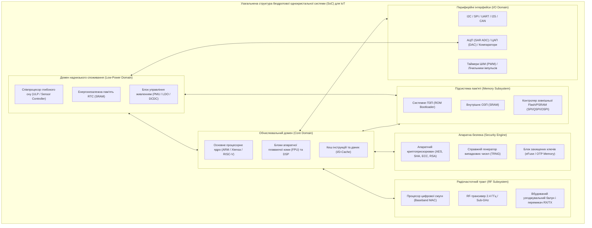
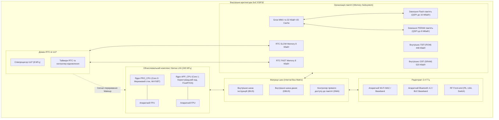
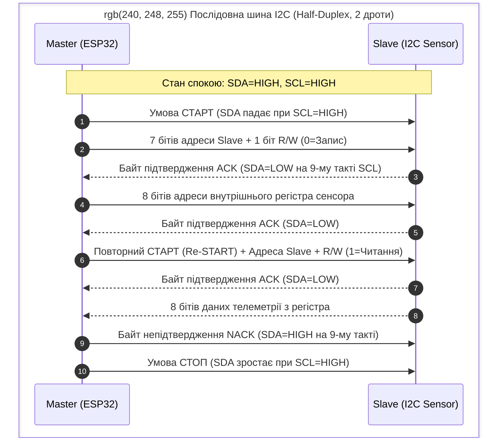
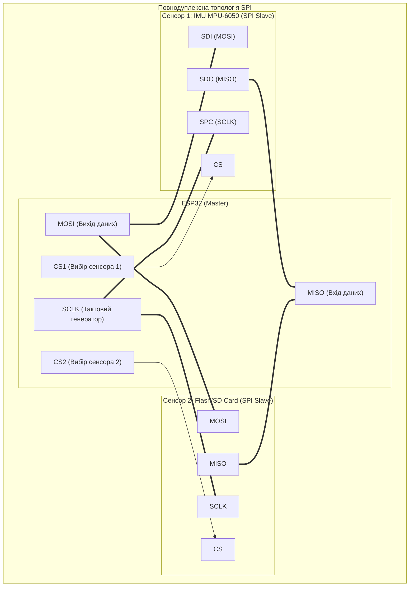

# Змістовий модуль 2. Апаратне та програмне забезпечення Edge-рівня

# Тема 6. Мікроконтролерні платформи в ІоТ. Архітектура ESP32

---

## 6.1. Огляд SoC рішень для ІоТ

### Основний зміст та теоретичний базис

Стрімкий розвиток граничних обчислень у сфері Інтернету речей зумовив перехід від класичних дискретних мікроконтролерних систем до високоінтегрованих однокристальних систем (**SoC**, System-on-Chip). Концепція однокристальної системи передбачає розміщення на єдиній кремнієвій підкладці одного або кількох процесорних ядер, модулів оперативної та постійної пам'яті, системи управління енергоспоживанням, апаратних криптографічних прискорювачів, блоків аналого-цифрового перетворення, а також повнофункціональних трансиверів бездротового зв'язку. Така монолітна інтеграція дозволяє суттєво зменшити геометричні габарити кінцевого вузла, знизити паразитні ємності та індуктивності друкованих провідників, мінімізувати собівартість виробу при масовому виробництві та оптимізувати струми витоку в режимах глибокого енергозбереження.

Сучасний ринок бездротових SoC для задач Інтернету речей формується навколо кількох провідних мікропроцесорних архітектур, серед яких домінують ядра родини **ARM Cortex-M** (профілі M0+, M3, M4F, M33, M55), процесорні блоки **Tensilica Xtensa** та відкрита архітектура з фіксованим набором інструкцій **RISC-V**. Кожен виробник оптимізує кристали під специфічні класи експлуатаційних задач, комбінуючи обчислювальні можливості ядра з відповідними радіочастотними блоками.


*Рисунок 1 — Структурно-функціональна топологія типової бездротової SoC платформи для Інтернету речей*

На рисунку 1 відображено внутрішній поділ кристала на функціональні домени з ізольованими лініями живлення. Таке структурування дозволяє в режимах глибокого сну повністю знеструмлювати високочастотний обчислювальний домен і радіотракт, залишаючи активним лише домен наднизького споживання для моніторингу аналогових компараторів та таймерів реального часу.

Серед провідних гравців напівпровідникової індустрії виділяється низка ключових виробників, чиї однокристальні платформи стали стандартом де-факто в інженерній практиці:

Корпорація **Espressif Systems** зробила прорив на ринку завдяки сімействам ESP8266 та ESP32, поєднавши доступну собівартість із інтегрованими інтерфейсами Wi-Fi ($802.11\text{ b/g/n}$) і Bluetooth/BLE на базі ядер Tensilica Xtensa та RISC-V.

Компанія **Nordic Semiconductor** (лінійки nRF52, nRF53, nRF54 та стільникові nRF91) займає провідні позиції у сегменті пристроїв з екстремально низьким енергоспоживанням завдяки глибокій оптимізації радіотракту BLE, ANT, Zigbee, Thread та впровадженню асиметричних двоядерних архітектур на базі ARM Cortex-M33.

Концерн **STMicroelectronics** розвиває напрям бездротових кристалів серіями STM32WB (комбінація ядер Cortex-M4 для користувацьких додатків та Cortex-M0+ для обслуговування стека BLE/802.15.4) та STM32WL, яка є першою у світі однокристальною системою з прямою інтеграцією модулятора LoRaWAN на кремнієвий кристал.

Компанія **Texas Instruments** пропонує платформу SimpleLink (чіпи родин CC13xx та CC26xx), характерною рисою яких є наявність повністю незалежного 16-бітного співпроцесора обробки сенсорів (Sensor Controller Engine), здатного опитувати цифрові та аналогові датчики при споживанні струму менше $1\text{ мкА}$.

Фірма **Silicon Labs** у серії Wireless Gecko (EFR32) фокусується на багатопротокольних радіомодулях для промислової автоматизації із розширеним апаратним захистом пам'яті (технологія Secure Vault).

Математична модель сумарної електричної потужності споживання однокристальної системи $P_{total}$ у динамічному режимі функціонування визначається суперпозицією динамічної потужності перемикання логічних вентилів та статичної потужності струмів витоку:

$$P_{total} = P_{dyn} + P_{stat} = \alpha \cdot C_{eff} \cdot V_{dd}^2 \cdot f_{clk} + V_{dd} \cdot I_{leak}(T)$$

де $\alpha$ позначає коефіцієнт активності перемикання логічних вентилів ($0 \le \alpha \le 1$); $C_{eff}$ є еквівалентною сумарною ємністю комутованих кіл кристала (Ф); $V_{dd}$ позначає напругу живлення ядра мікроконтролера (В); $f_{clk}$ є поточною тактовою частотою процесорного ядра (Гц); $I_{leak}(T)$ визначає сумарний струм статичного витоку p-n переходів напівпровідникової структури (А), який експоненційно зростає зі збільшенням абсолютної температури кристала $T$ (К).

Аналіз наведеної залежності показує, що для забезпечення високої енергетичної ефективності системи керування повинні застосовувати технологію динамічного масштабування напруги та частоти (**DVFS**, Dynamic Voltage and Frequency Scaling), знижуючи тактову частоту $f_{clk}$ та напругу $V_{dd}$ під час виконання ненавантажених ділянок коду.

| Платформа (SoC) | Архітектура ядра | Тактова частота | Вбудована пам'ять (RAM / Flash) | Бездротові інтерфейси | Струм у стані глибокого сну |
| :--- | :--- | :--- | :--- | :--- | :--- |
| **Espressif ESP32-D0WDQ6** | Двоядерний 32-біт Tensilica Xtensa LX6 | $240\text{ МГц}$ | $520\text{ Кбайт}$ SRAM / Зовнішня (до 16 Мбайт) | Wi-Fi 4 ($802.11\text{ b/g/n}$), Bluetooth 4.2 / BLE | $5\text{ мкА}$ (Deep Sleep RTC) |
| **Nordic nRF52840** | Одноядерний 32-біт ARM Cortex-M4F | $64\text{ МГц}$ | $256\text{ Кбайт}$ RAM / $1\text{ Мбайт}$ Flash | BLE 5.0, 802.15.4 (Zigbee, Thread), ANT | $0{,}4\text{ мкА}$ (System OFF) |
| **STM32WB55RG** | Двоядерний ARM Cortex-M4 + Cortex-M0+ | $64\text{ МГц} + 32\text{ МГц}$ | $256\text{ Кбайт}$ SRAM / $1\text{ Мбайт}$ Flash | BLE 5.2, IEEE 802.15.4 (Zigbee PRO, OpenThread) | $1{,}8\text{ мкА}$ (Stop 2 + RTC) |
| **TI CC1352P SimpleLink** | ARM Cortex-M4F + Cortex-M0 (RF) + SCE | $48\text{ МГц}$ | $80\text{ Кбайт}$ RAM / $352\text{ Кбайт}$ Flash | Дводіапазонний: Sub-1 GHz + $2{,}4\text{ ГГц}$ BLE, 802.15.4 | $0{,}85\text{ мкА}$ (Standby + RTC) |
| **Silicon Labs EFR32MG24** | 32-біт ARM Cortex-M33 + AI/ML Engine | $78\text{ МГц}$ | $256\text{ Кбайт}$ RAM / $1536\text{ Кбайт}$ Flash | Matter, OpenThread, Zigbee, BLE 5.3 | $1{,}3\text{ мкА}$ (EM2 Deep Sleep) |

Порівняльний аналіз параметрів демонструє суттєву диференціацію платформ: мікроконтролери родини ESP32 орієнтовані на обчислювально складні вузли з прямою передачею трафіку по Wi-Fi, тоді як сімейства nRF та CC13xx максимізують автономність у сенсорних мережах малого радіуса дії.

---

## 6.2. Архітектура, пам'ять та периферія ESP32

### Основний зміст та теоретичний базис

Однією з найбільш розповсюджених та функціонально насичених однокристальних систем для пристроїв граничного рівня є платформа **ESP32** виробництва компанії Espressif Systems. В основі кристала лежить симетрична багатопроцесорна архітектура (**SMP**, Symmetric Multiprocessing), представлена двома 32-розрядними ядрами **Tensilica Xtensa dual-core LX6**. Ядра функціонують на регульованій тактовій частоті від $80\text{ МГц}$ до $240\text{ МГц}$, забезпечуючи сукупну обчислювальну продуктивність до $600\text{ DMIPS}$. Процесори мають гарвардську архітектуру з роздільними шинами інструкцій і даних, підтримують 7-стадійний конвеєр інструкцій, містять апаратний блок обчислень із плаваючою комою (**FPU**, Floating Point Unit) одинарної точності, а також розширений набір векторних інструкцій цифрової обробки сигналів (**DSP**).

Для вирішення завдань ультранизького енергоспоживання кристал оснащений повністю незалежним енергоефективним співпроцесором **ULP** (Ultra-Low-Power Co-processor). Співпроцесор ULP побудований на базі кінцевого автомата (FSM) або полегшеного ядра RISC-V, тактується від внутрішнього низькочастотного генератора $8\text{ МГц}$ і зберігає активність у той час, коли обидва основні ядра Xtensa знеструмлені в режимі Deep Sleep. Співпроцесор ULP має прямий апаратний доступ до внутрішньої повільної пам'яті RTC, блоків аналого-цифрового перетворення, вбудованих компараторів та виводів GPIO, що дозволяє виконувати опитування аналогових сенсорів або перевірку порогових значень, пробуджуючи основні ядра лише у разі настання критичної технологічної події.


*Рисунок 2 — Архітектурна декомпозиція кристала ESP32 із відображенням матриці зв'язків між процесорними ядрами, доменом пам'яті та радіотрактом*

Організація адресного простору та підсистеми пам'яті ESP32, представлена на рисунку 2, має гібридну структуру. Внутрішня пам'ять кристала сумарним обсягом $520\text{ Кбайт}$ фізично розбита на кілька незалежних пулів static RAM (SRAM0, SRAM1, SRAM2), доступ до яких здійснюється через багатошарову комутаційну матрицю шин (Bus Matrix). 

Розподіл пам'яті реалізовано наступним чином:
1. Блок SRAM0 розміром $64\text{ Кбайт}$ використовується переважно як пам'ять інструкцій (IRAM) та кеш-буфер для зовнішніх транзакцій.
2. Блок SRAM1 розміром $128\text{ Кбайт}$ може конфігуруватися динамічно як пам'ять інструкцій або даних.
3. Блок SRAM2 розміром $200\text{ Кбайт}$ функціонує виключно як пам'ять даних (DRAM) для розміщення динамічної купи (Heap), глобальних змінних та стеків завдань.
4. Пам'ять RTC Fast Memory обсягом $8\text{ Кбайт}$ підключена до швидкісної шини та зберігає дані, необхідні для швидкого відновлення процесора після глибокого сну.
5. Пам'ять RTC Slow Memory обсягом $8\text{ Кбайт}$ зарезервована під виконання програмного коду та збереження змінних співпроцесора ULP.

Оскільки внутрішнього Flash-масиву кристал не містить, системний код та ресурси розміщуються у зовнішній мікросхемі SPI Flash обсягом від $4\text{ Мбайт}$ до $16\text{ Мбайт}$, яка підключається за високошвидкісним чотирипровідним інтерфейсом QSPI. Блок управління пам'яттю (**MMU**, Memory Management Unit) кристала прозоро відображає до $4\text{ Мбайт}$ зовнішньої Flash-пам'яті програм та до $4\text{ Мбайт}$ зовнішньої псевдостатичної пам'яті (**PSRAM**) у 32-розрядний віртуальний адресний простір ядра через швидкісний кеш інструкцій та даних обсягом $32\text{ Кбайт}$.

Апаратний радіочастотний блок кристала включає повнофункціональний приймально-передавальний тракт діапазону $2{,}4\text{ ГГц}$ із вбудованим антенним перемикачем, підсилювачем потужності (**PA**, до $+20\text{ дБм}$ на виході) та малошумливим вхідним підсилювачем (**LNA**). Апаратний процесор цифрової смуги (Baseband) та блок MAC підтримують стандарти IEEE 802.11 b/g/n (Wi-Fi 4) зі швидкістю передачі даних до $150\text{ Мбіт/с}$ (модуляція HT40), а також специфікації Bluetooth v4.2 BR/EDR та BLE. Критичною апаратною особливістю є інтеграція механізму прямого доступу до пам'яті (**DMA**, Direct Memory Access), який автоматично вивантажує прийняті з радіоефіру кадри безпосередньо в буфери SRAM без участі процесорних ядер, що усуває втрату пакетів на високих швидкостях.

Керування багатоядерною обчислювальною платформою здійснюється під управлінням модифікованої операційної системи реального часу **FreeRTOS** із підтримкою симетричного мультипроцесингу (**SMP**). На відміну від одноядерних архітектур, ядра ESP32 логічно розмежовані на протокольне ядро **PRO_CPU** (Core 0) та ядро прикладних додатків **APP_CPU** (Core 1). Операційна система автоматично закріплює виконання ресурсоємних завдань обслуговування стека Wi-Fi, Bluetooth та системних переривань за ядром Core 0, надаючи ядро Core 1 у повне розпорядження користувацької бізнес-логіки, опитування сенсорів та первинної обробки сигналів.

Для явного розподілу завдань у системному API ESP-IDF застосовується розширена функція планувальника FreeRTOS:

```c
BaseType_t xTaskCreatePinnedToCore(
    TaskFunction_t pvTaskCode,   /* Покажчик на функцію завдання */
    const char * const pcName,   /* Текстова назва завдання */
    const uint32_t usStackDepth, /* Розмір виділеного стека в байтах */
    void * const pvParameters,   /* Вхідні параметри завдання */
    Uptime_t uxPriority,         /* Пріоритет виконання (0..configMAX_PRIORITIES-1) */
    TaskHandle_t * const pvCreatedTask, /* Дескриптор завдання */
    const BaseType_t xCoreID     /* Ідентифікатор ядра: 0 (PRO_CPU), 1 (APP_CPU) або tskNO_AFFINITY */
);
```

Синхронізація потоків між різними ядрами базується на механізмах апаратних блокувань обертання (**Spinlocks**), міжпроцесорних переривань (**Cross-core Interrupts**), двійкових і лічильних семафорів, а також м'ютексів із захистом від інверсії пріоритетів.

Математичний аналіз планування періодичних завдань у середовищі FreeRTOS для гарантування детермінізму реакції в реальному часі базується на теоремі монотонії частоти (Rate-Monotonic Scheduling, RMS). Достатня умова гарантованої відсутності пропусків дедлайнів для набору з $n$ періодичних незалежних завдань описується нерівністю Лю і Лейланда:

$$U = \sum_{i=1}^{n} \frac{C_i}{T_i} \le n \left( 2^{1/n} - 1 \right)$$

де $U$ позначає сумарний коефіцієнт завантаження процесорного ядра обчислювальними потоками; $C_i$ визначає час виконання $i$-го завдання у найгіршому випадку (Worst-Case Execution Time, с); $T_i$ позначає період повторення активації $i$-го завдання (с). При прямуванні кількості завдань до нескінченності ($n \to \infty$) граничний поріг стійкості планувальника асимптотично наближається до значення $\ln(2) \approx 0{,}693$ ($69{,}3\%$).

| Тип пам'яті ESP32 | Фізичний обсяг | Ширина шини доступу | Швидкодія та латентність | Функціональне призначення |
| :--- | :--- | :--- | :--- | :--- |
| **Внутрішнє ПЗП (ROM)** | $448\text{ Кбайт}$ | 32 біти | 1 такт CPU (максимальна) | Первинний завантажувач (Bootloader), базові криптографічні підпрограми |
| **Внутрішнє ОЗП (IRAM/DRAM)**| $520\text{ Кбайт}$ | 32 біти | 1 такт CPU ($< 5\text{ нс}$) | Стеки завдань FreeRTOS, динамічна купа, буфери DMA Wi-Fi/BT трафіку |
| **RTC FAST Memory** | $8\text{ Кбайт}$ | 32 біти | 1 такт CPU | Код швидкого завантаження після виходу з Deep Sleep |
| **RTC SLOW Memory** | $8\text{ Кбайт}$ | 8/16/32 біти | Тактується від $8\text{ МГц}$ | Програмний код та структури даних автономного співпроцесора ULP |
| **Зовнішня Flash (через MMU)** | До $16\text{ Мбайт}$ | 4 біти (QSPI) / 8 біт | Кешований доступ (латенція кеш-промаху $20\dots 40$ тактів) | Збереження прошивки додатку, файлових систем SPIFFS/LittleFS |
| **Зовнішня PSRAM (через MMU)**| До $8\text{ Мбайт}$ | 4 біти (QSPI) / 8 біт | Кешований доступ через Data Cache | Буферизація зображень з камер, великих масивів аудіо та стеків ШІ |

Аналіз організації пам'яті свідчить, що критичні за часом секції коду (наприклад, обробники апаратних переривань ISR) повинні примусово маркуватися атрибутом `IRAM_ATTR` для постійного розміщення у внутрішній пам'яті SRAM, що виключає недетерміновані часові затримки при кеш-промахах зовнішньої Flash-пам'яті.

---

## 6.3. Апаратні інтерфейси (I2C, SPI, UART) в контексті сенсорів

### Основний зміст та теоретичний базис

Вузли Інтернету речей реалізують пряму взаємодію з навколишнім середовищем шляхом сполучення з масивами аналогових та цифрових сенсорних модулів. Для отримання інформації від інтелектуальних давачів мікроконтролер ESP32 оснащений апаратними контролерами послідовних інтерфейсів обміну даними: **I2C**, **SPI** та **UART**. Кожен інтерфейс має специфічні схемотехнічні, часові та протокольні характеристики, що визначають сферу його раціонального застосування.


*Рисунок 3 — Протокольна часова діаграма транзакції випадкового зчитування даних із регістра сенсора по шині I2C*

Інтерфейс **I2C** (Inter-Integrated Circuit), протокол якого проілюстровано на рисунку 3, є синхронною двопровідною напівдуплексною шиною зв'язку, що використовує лінію послідовних даних **SDA** (Serial Data) та лінію тактового сигналу **SCL** (Serial Clock). Вихідні каскади всіх підключених до шини пристроїв виконані за схемою з відкритим колектором (або відкритим стоком), що вимагає обов'язкового підтягування обох сигнальних ліній до шини живлення $V_{dd}$ через зовнішні резистори $R_p$. Така схемотехніка формує логіку «монтажного І» (Wired-AND), запобігаючи коротким замиканням при одночасній спробі трансляції кількома пристроями та реалізуючи механізми арбітражу шини й розтягування тактового сигналу веденим вузлом (**Clock Stretching**).

Розрахунок номіналу підтягувальних резисторів $R_p$ є суворим компромісом між швидкодією, рівнем шумів та струмом споживання. Мінімальний допустимий опір резистора $R_{p(min)}$ обмежується максимально допустимим вхідним струмом відкритого стоку мікросхеми $I_{OL}$ при збереженні рівня логічного нуля $V_{OL(max)}$:

$$R_{p(min)} = \frac{V_{dd} - V_{OL(max)}}{I_{OL}}$$

Максимальний допустимий опір резистора $R_{p(max)}$ обмежується нормативною тривалістю фронту наростання сигналу $t_r$ (Rise Time), яка залежить від сумарної паразитної ємності шини $C_b$ (визначається сумою ємностей виводів усіх підключених мікросхем та ємності провідників друкованої плати):

$$R_{p(max)} = \frac{t_r}{0{,}8473 \cdot C_b}$$

де $t_r = 1000\text{ нс}$ для стандартного режиму (Standard Mode, $100\text{ кбіт/с}$) та $t_r = 300\text{ нс}$ для швидкісного режиму (Fast Mode, $400\text{ кбіт/с}$); число $0{,}8473$ випливає з аналізу експоненційного заряду ємності від рівня $0{,}3 V_{dd}$ до $0{,}7 V_{dd}$ ($t_r = R_p C_b \ln(0{,}7 / 0{,}3) \approx 0{,}8473 R_p C_b$).

Інтерфейс **SPI** (Serial Peripheral Interface) являє собою синхронну чотирипровідну повнодуплексну шину зв'язку, що функціонує за топологією «ведучий-ведений» (Master-Slave). Шина містить лінії виходу даних ведучого **MOSI** (Master Out Slave In), входу даних ведучого **MISO** (Master In Slave Out), тактового сигналу **SCLK** та індивідуальні лінії вибору мікросхеми **CS/SS** (Chip Select) для кожного окремого сенсора. Виходи SPI працюють за двотактною комплементарною схемою (Push-Pull), що усуває потребу в підтягувальних резисторах і дозволяє досягати екстремальних швидкостей обміну даними (до $40\dots 80\text{ МГц}$ на мікроконтролерах ESP32).


*Рисунок 4 — Топологія підключення кількох сенсорних пристроїв до шини SPI мікроконтролера*

Взаємодія по SPI, наведена на рисунку 4, налаштовується відповідно до однієї з чотирьох конфігурацій, які задаються комбінацією полярності тактового сигналу **CPOL** (Clock Polarity, визначає рівень на лінії SCLK у стані спокою) та фази тактування **CPHA** (Clock Phase, визначає фронт SCLK, на якому відбувається стробування біта даних):

- **Режим 0 (Mode 0):** $\text{CPOL}=0$, $\text{CPHA}=0$ (тактовий сигнал у спокої LOW, дані фіксуються за наростаючим фронтом).
- **Режим 1 (Mode 1):** $\text{CPOL}=0$, $\text{CPHA}=1$ (тактовий сигнал у спокої LOW, дані фіксуються за спадним фронтом).
- **Режим 2 (Mode 2):** $\text{CPOL}=1$, $\text{CPHA}=0$ (тактовий сигнал у спокої HIGH, дані фіксуються за спадним фронтом).
- **Режим 3 (Mode 3):** $\text{CPOL}=1$, $\text{CPHA}=1$ (тактовий сигнал у спокої HIGH, дані фіксуються за наростаючим фронтом).

Інтерфейс **UART** (Universal Asynchronous Receiver-Transmitter) реалізує асинхронний послідовний дуплексний обмін даними за двома сигнальними лініями: передавача **TX** (Transmit) та приймача **RX** (Receive). Оскільки тактовий сигнал у лінії відсутній, приймач і передавач повинні бути заздалегідь налаштовані на строго ідентичну швидкість передачі (Baud Rate: $9600$, $115200$, $921600\text{ бод}$). Кадр UART складається з одного стартового біта логічного нуля (Start bit), 5–9 інформаційних бітів даних, опціонального біта контролю парності (Parity bit) та 1–2 стопових бітів логічної одиниці (Stop bits). 

Синхронізація приймача здійснюється за спадним фронтом стартового біта, після чого внутрішній лічильник відраховує інтервали стробування середини кожного наступного бітового інтервалу. Для запобігання втраті даних через переповнення внутрішнього апаратного FIFO-буфера обсягом 128 байтів, контролери UART мікроконтролера ESP32 підтримують апаратне управління потоком даних (**Hardware Flow Control**) за допомогою додаткових сигнальних ліній **RTS** (Request to Send) та **CTS** (Clear to Send).

Відносна похибка генерації бітової швидкості $\delta_{baud}$ у контролері UART мікроконтролера не повинна перевищувати допустимого системного порогу для уникнення накопичення часового фазового зсуву до кінця кадру:

$$\delta_{baud} = \left| \frac{f_{source} / (\text{DIV\_INT} + \frac{\text{DIV\_FRAG}}{8}) - \text{Baud}_{target}}{\text{Baud}_{target}} \right| \cdot 100\% \le 2{,}5\%$$

де $f_{source}$ позначає частоту опорного генератора шини (наприклад, APB Clock $80\text{ МГц}$ для ESP32); $\text{DIV\_INT}$ є цілочисельною частиною коефіцієнта ділення дільника частоти бод-генератора; $\text{DIV\_FRAG}$ позначає дробову частину дільника (3 біти для дискретності $1/8$); $\text{Baud}_{target}$ є цільовою швидкістю обміну (бод).

| Технічний критерій | Інтерфейс I2C | Інтерфейс SPI | Інтерфейс UART |
| :--- | :--- | :--- | :--- |
| **Кількість сигнальних ліній** | 2 лінії (SDA, SCL) | 4 лінії + по одній CS на кожен пристрій | 2 лінії (TX, RX) + 2 лінії Flow Control |
| **Режим передачі даних** | Напівдуплексний (Half-Duplex) | Повнодуплексний (Full-Duplex) | Повнодуплексний (Full-Duplex) |
| **Типова швидкість обміну** | $100\text{ кбіт/с} \dots 1\text{ Мбіт/с}$ | До $40\dots 80\text{ Мбіт/с}$ (з DMA) | $9{,}6\text{ кбод} \dots 5\text{ Мбод}$ |
| **Схемотехніка вихідних каскадів** | Відкритий стік (потрібні pull-up $R_p$) | Комплементарний вихід (Push-Pull) | Комплементарний вихід (Push-Pull) |
| **Спосіб адресації пристроїв** | Програмний (7- або 10-бітні адреси) | Апаратний (вибірка окремою лінією CS) | Точка-точка (Point-to-Point) |
| **Апаратна підтримка DMA** | Не передбачена або обмежена | Повнофункціональна двонаправлена | Підтримується для великих буферів |
| **Цільові пристрої на платі** | Сенсори клімату, тиску, RTC, OLED | Дисплеї, SD-карти, високошвидкісні IMU | GNSS/GPS модулі, модеми GSM/LTE |

Систематизація характеристик інтерфейсів свідчить, що шина I2C є оптимальною для низькошвидкісного опитування великої кількості сенсорів за мінімальної кількості виводів GPIO, інтерфейс SPI є незамінним для потокової передачі великих масивів телеметрії на максимальній швидкості з використанням прямого доступу до пам'яті (DMA), а інтерфейс UART є базовим стандартом сполучення з зовнішніми автономними модулями зв'язку та супутникової навігації.

---

### Питання для самоперевірки та аналітичного осмислення

1. Розкрийте фізичний та системний зміст переваг переходу від дискретних мікроконтролерів до однокристальних систем (SoC) при проектуванні автономних вузлів Інтернету речей.
2. На основі математичної формули динамічної потужності $P_{dyn}$ поясніть, чому технологія динамічного регулювання напруги та частоти (DVFS) у мікроконтролерах ESP32 дозволяє суттєво зменшити споживання енергії порівняно зі статичним тактуванням на максимальній частоті $240\text{ МГц}$.
3. Які архітектурні та схемотехнічні особливості має співпроцесор наднизького енергоспоживання ULP у складі ESP32? Які задачі він здатен вирішувати у стані глибокого сну (Deep Sleep) основних ядер?
4. Детально охарактеризуйте розподіл обов'язків між ядрами PRO_CPU (Core 0) та APP_CPU (Core 1) під управлінням операційної системи реального часу FreeRTOS SMP на ESP32. Чому функція `xTaskCreatePinnedToCore` є критично важливою для детермінованого опитування сенсорів?
5. Виведіть математичні залежності для розрахунку мінімального $R_{p(min)}$ та максимального $R_{p(max)}$ значення опору підтягувальних резисторів для шини I2C. До яких наслідків призводить завищення або заниження цього номіналу при підключенні групи сенсорів?
6. Розкрийте зміст чотирьох режимів роботи шини SPI на основі параметрів полярності (CPOL) та фази (CPHA) тактового сигналу. Яку роль відіграє контролер прямого доступу до пам'яті (DMA) при взаємодії з високошвидкісними сенсорами інерціальної навігації (IMU)?
7. Поясніть механізм апаратного контролю потоку даних (Hardware Flow Control RTS/CTS) в інтерфейсі UART. Чому похибка генерації тактової частоти бод-генератора $\delta_{baud}$ понад $2{,}5\%$ спричиняє спотворення кадрів при передачі довгих масивів телеметрії?