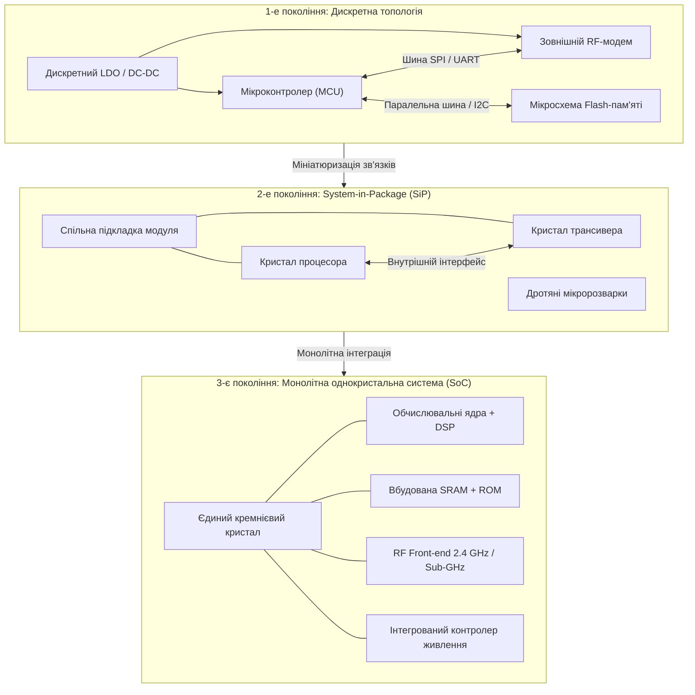
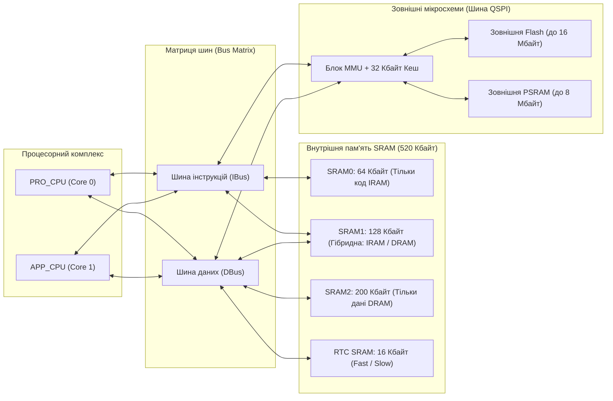
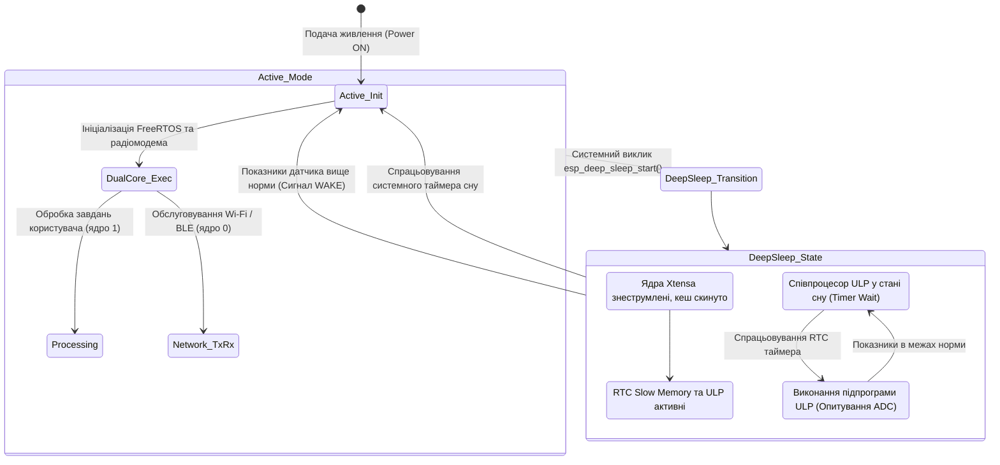
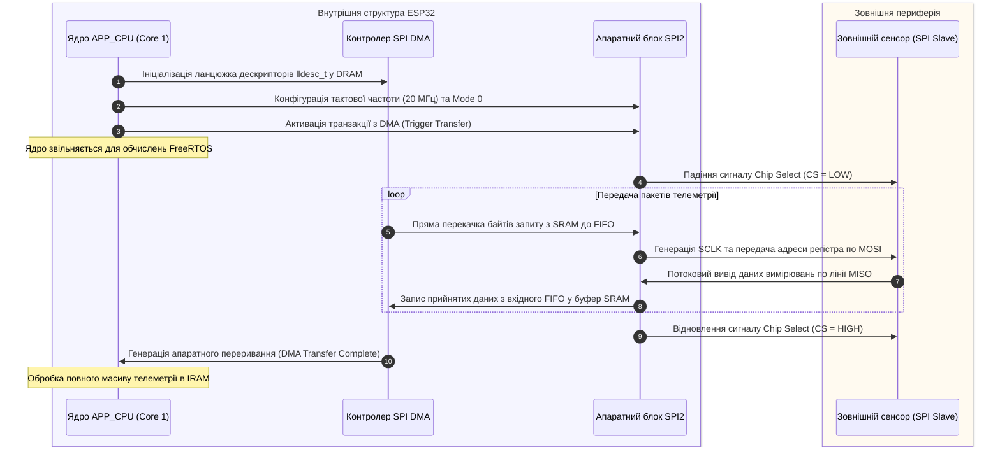
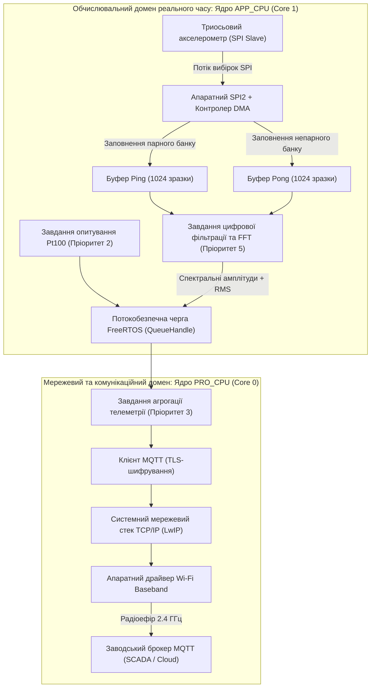

# Тема 6. Мікроконтролерні платформи в Інтернеті речей: архітектура та апаратно-програмна організація ESP32

## Мета лекції
Формування у здобувачів вищої освіти цілісної системи поглиблених теоретичних знань та прикладних інженерних компетентностей щодо архітектурної організації сучасних бездротових однокристальних систем (SoC), детального апаратного устрою обчислювального комплексу ESP32 на базі ядер Tensilica Xtensa LX6, механізмів сегментації пам'яті, багатопотокового планування завдань під управлінням FreeRTOS SMP, а також аналізу схемотехнічних і протокольних обмежень послідовних інтерфейсів збору телеметричних даних для проектування високонадійних вузлів Інтернету речей.

## Очікувані результати навчання
1. **Знання та розуміння.** Здобувачі опанують внутрішню топологію двоядерного процесорного комплексу Xtensa LX6, організацію домену низького енергоспоживання на базі співпроцесора ULP, принципи віртуалізації адресного простору блоком MMU та фізико-протокольні основи функціонування інтерфейсів I2C, SPI та UART.
2. **Застосування.** Здобувачі зможуть коректно розраховувати параметри аналогового узгодження ліній зв'язку, детерміновано розподіляти обчислювальні процеси між фізичними ядрами контролера за допомогою функцій FreeRTOS SMP та налаштовувати апаратні механізми прямого доступу до пам'яті для обслуговування високошвидкісних сенсорів.
3. **Аналіз.** Здобувачі навчаться здійснювати порівняльний аналіз пропускної здатності та енергетичних витрат бездротових SoC, виявляти джерела недетермінованих часових затримок у контурах реального часу та діагностувати апаратні збої, зумовлені паразитними параметрами комунікаційних шин або стрибками споживання струму радіотрактом.
4. **Оцінювання та синтез.** Здобувачі набудуть здатності оцінювати стійкість сенсорної підсистеми до системних колізій та синтезувати апаратно-програмні комплекси граничної обробки даних з оптимальним балансом між обчислювальною потужністю, надійністю каналів передачі та часом автономної роботи від хімічних джерел струму.

---

## Детальний покроковий план лекції

### 1. Теоретико-концептуальний базис. Архітектура та обчислювальні ресурси бездротових SoC
* 1.1. Еволюція мікропроцесорної техніки в IoT: концепція System-on-Chip (SoC), порівняльний аналіз апаратних платформ Espressif ESP32, Nordic nRF52, STMicroelectronics STM32WB та Texas Instruments CC13xx.
* 1.2. Мікроархітектура симетричного багатопроцесорного комплексу Tensilica Xtensa Dual-Core 32-bit LX6, векторні розширення DSP, конвеєризація та функціональний поділ обов'язків ядер PRO_CPU і APP_CPU.
* 1.3. Організація фізичного та віртуального адресного простору ESP32: внутрішні пули SRAM (IRAM/DRAM), робота блоку MMU з кешованою зовнішньою Flash-пам'яттю та пам'яттю PSRAM.
* 1.4. Енергоефективна підсистема реального часу: схемотехніка домену RTC, програмування незалежного співпроцесора наднизького споживання ULP та робота периферії у режимі Deep Sleep.

### 2. Методологія та аналіз граничних умов. Апаратні інтерфейси взаємодії, багатозадачність та системні обмеження
* 2.1. Методологія проектування шини I2C: схемотехніка відкритого стоку, аналітичний розрахунок діапазону номіналів підтягувальних резисторів, вплив паразитної ємності ліній та механізм Clock Stretching.
* 2.2. Організація високошвидкісного обміну по шині SPI: аналіз часових діаграм чотирьох режимів тактування (CPOL/CPHA), логіка апаратної вибірки Chip Select та каналізація даних через контролер DMA.
* 2.3. Асинхронний інтерфейс UART: математичний розрахунок дробових дільників частоти бод-генератора, часові допуски синхронізації та захист від переповнення буферів засобами Hardware Flow Control (RTS/CTS).
* 2.4. Архітектура багатозадачного середовища FreeRTOS SMP: розподіл потоків за ядрами через API ESP-IDF, міжпроцесорна синхронізація через Spinlocks та оцінка детермінізму реакції за теоремою Лю-Лейланда.
* 2.5. Критичні апаратні обмеження та вузькі місця платформи: латентність кеш-промахів при виконанні коду із зовнішньої Flash-пам'яті, завадостійкість інтерфейсів з відкритим колектором у промислових умовах та нестабільність шини живлення 3.3 В під час імпульсної активності калібрування радіотракту Wi-Fi/Bluetooth.

### 3. Практичний індустріальний / фаховий кейс. Проектування апаратно-програмного комплексу збору телеметрії
**Тема наскрізної задачі.** «Розробка відмовостійкого вузла моніторингу вібрації та температури промислового компресора на базі SoC ESP32 з використанням DMA-буферизації по SPI та асинхронного стека FreeRTOS»

## 1. Теоретико-концептуальний базис. Архітектура та обчислювальні ресурси бездротових SoC

### 1.1. Еволюція апаратної бази Інтернету речей: концепція System-on-Chip (SoC) та порівняльний аналіз платформ

Розвиток апаратної інфраструктури розподілених сенсорних мереж та систем промислової автоматизації пройшов шлях від гетерогенних багатокомпонентних вузлів до монолітних напівпровідникових структур. На ранніх етапах розвитку концепції Інтернету речей типовий кінцевий пристрій компонувався з дискретного мікроконтролера загального призначення, зовнішнього радіочастотного трансивера, окремих мікросхем енергонезалежної пам’яті та дискретних стабілізаторів напруги. Така компоновка створювала значні паразитні ємності та індуктивності друкованих провідників, вимагала складної трасування високочастотних трактів і суттєво підвищувала енергоспоживання вузла через необхідність безперервної підтримки струмів спокою множини окремих кристалів.

Відповіддю мікроелектронної галузі на виклики мініатюризації та енергоефективності стала концепція однокристальної системи (**System-on-Chip**, **SoC**). У межах єдиної кремнієвої підкладки архітектура SoC об'єднує процесорні ядра, багаторівневу підсистему пам’яті, блоки апаратного криптографічного прискорення, аналогові інтерфейси перетворення сигналів, цифровий процесор базової смуги та безпосередньо приймально-передавальний радіочастотний тракт. Завдяки усуненню міжкристальних з'єднань вдалося зменшити фізичні габарити модулів до одиниць міліметрів, скоротити втрати сигналу в антенних лініях та реалізувати централізоване керування живленням окремих внутрішніх доменів.

На наступній схемі показано еволюційний перехід топології побудови апаратних вузлів Інтернету речей від дискретної архітектури до інтегрованих однокристальних систем.

Енергетичний баланс функціонування вузла Інтернету речей в умовах циклічного опитування датчиків та передачі даних описується рівнянням повного споживання енергії за робочий цикл. Інтегральне значення витраченої енергії $E_{cycle}$ визначається як сума витрат у фазах активної обробки, передачі по радіоканалу та перебування в енергозберігаючому стані:

$$E_{cycle} = V_{dd} \left( \int_{0}^{t_{act}} I_{act}(t) \, dt + \int_{0}^{t_{tx}} I_{tx}(t) \, dt + \int_{0}^{t_{rx}} I_{rx}(t) \, dt + I_{sleep} \cdot t_{sleep} \right) + Q_{trans} \cdot V_{dd}$$

У цьому виразі $V_{dd}$ позначає напругу живлення вузла у вольтах. Змінні $I_{act}(t)$, $I_{tx}(t)$ та $I_{rx}(t)$ представляють миттєві значення струму споживання у фазах обчислень, радіопередачі та радіоприйому відповідно, виміряні в амперах. Значення $t_{act}$, $t_{tx}$ та $t_{rx}$ відповідають тривалості цих фаз у секундах. Величина $I_{sleep}$ визначає струм статичного витоку в режимі глибокого сну при тривалості пасивного стану $t_{sleep}$. Доданок $Q_{trans}$ характеризує електричний заряд у кулонах, який безповоротно втрачається на перезаряджання паразитних ємностей шин під час переходу між низькоспоживаючим та активним режимами роботи мікросхеми.

Для обґрунтованого вибору апаратної платформи при проектуванні кінцевих пристроїв різного функціонального призначення наведена порівняльна характеристика провідних мікроконтролерних систем.

| Апаратна платформа | Обчислювальне ядро та тактова частота | Інтегровані бездротові інтерфейси | Енергоспоживання в активному / пасивному режимах | Приклад з реальної практики |
| :--- | :--- | :--- | :--- | :--- |
| **Espressif ESP32** | Двоядерний 32-бітний Tensilica Xtensa LX6 (до $240\text{ МГц}$) | Wi-Fi 4 ($802.11\text{ b/g/n}$), Bluetooth v4.2 BR/EDR та BLE | $80\dots 240\text{ мА}$ (з увімкненим радіотрактом) / $5\text{ мкА}$ (Deep Sleep RTC) | Шлюзи збору даних з промислових вібромоніторів з передачею по Wi-Fi |
| **Nordic nRF52840** | Одноядерний 32-бітний ARM Cortex-M4F ($64\text{ МГц}$) | Bluetooth 5.3 LE, IEEE 802.15.4 (Thread, Zigbee), ANT, 2.4 GHz власні | $5{,}4\text{ мА}$ (Rx/Tx при $0\text{ дБм}$) / $0{,}4\text{ мкА}$ (System OFF без збереження ОЗП) | Автономні медичні трекери серцевого ритму з трирічним терміном роботи від батареї |
| **STM32WB55** | Двоядерний ARM Cortex-M4 ($64\text{ МГц}$) + Cortex-M0+ ($32\text{ МГц}$) | Bluetooth 5.2 LE, IEEE 802.15.4 (Zigbee PRO, Thread) | $5{,}5\text{ мА}$ (Tx при $0\text{ дБм}$) / $1{,}8\text{ мкА}$ (режим Stop 2 зі збереженням SRAM) | Системи розумного обліку споживання природного газу з криптозахистом |
| **TI CC1352P** | ARM Cortex-M4F ($48\text{ МГц}$) + власний Sensor Controller | Дводіапазонний: Sub-1 GHz ($868/915\text{ МГц}$) та $2{,}4\text{ ГГц}$ BLE/802.15.4 | $9{,}6\text{ мА}$ (Tx Sub-1 GHz при $+14\text{ дБм}$) / $0{,}85\text{ мкА}$ (Standby) | Далекосяжні сенсори вологості ґрунту в агросекторі з покриттям до 15 км |

> **ПРАКТИЧНИЙ ЯКІР:** У розподілених системах моніторингу нафтопроводів використання платформ на базі Texas Instruments CC1352P забезпечує передачу телеметрії в діапазоні $868\text{ МГц}$ на відстань до $10\text{ км}$ без проміжних ретрансляторів. Це дозволяє проектувати необслуговувані сенсорні вузли з десятирічним терміном експлуатації від одного елемента живлення типу $\text{Li-SOCl}_2$.

---

### 1.2. Мікроархітектура симетричного багатопроцесорного комплексу Tensilica Xtensa Dual-Core 32-bit LX6

Архітектурною основою однокристальної системи ESP32 є обчислювальний комплекс **Tensilica Xtensa Dual-Core 32-bit LX6**, розроблений для застосувань, які вимагають комбінації високої продуктивності при роботі з мережевими протоколами та низького тепловиділення. Обидва ядра кристала є ідентичними за своєю структурою, працюють на синхронізованій змінній тактовій частоті від $80\text{ МГц}$ до $240\text{ МГц}$ і забезпечують сукупну обчислювальну потужність на рівні до $600\text{ DMIPS}$.

Конвеєр команд кожного процесорного ядра має 7-стадійну глибину виконання цілочисельних операцій. Структура конвеєра мінімізує час простою обчислювальних трактів при умові правильного передбачення переходів і підтримує паралельне виконання інструкцій за рахунок технології конфігурованого набору команд Xtensa Instruction Extension (**TIE**). До складу ядра інтегровано апаратний блок обчислень із плаваючою комою (**FPU**), що підтримує стандарт IEEE 754 для операцій одинарної точності. Це дає змогу виконувати складні алгоритми фільтрації, матричних перетворень та первинної обробки сигналів без переходу до програмної емуляції операцій із плаваючою комою.

Особливістю архітектури Xtensa є механізм віконних регістрів (**Windowed Register Architecture**). Замість традиційного фіксованого набору регістрів загального призначення процесор містить фізичний масив із 64 регістрів, з яких у кожен момент часу програмі доступне логічне вікно розміром 16 регістрів (від $a_0$ до $a_{15}$). Під час виклику підпрограми вікно зміщується на 4, 8 або 12 позицій, що виключає необхідність збереження вмісту регістрів у зовнішній пам'яті (стеку) та забезпечує практично миттєвий вхід у процедури обробки переривань.

В операційній системі реального часу **FreeRTOS SMP**, адаптованій для мікроконтролерів ESP32, реалізовано чітке функціональне розмежування ядер:

Перше ядро позначається як **PRO_CPU** (Protocol CPU, Core 0) і бере на себе первинне завантаження системи, ініціалізацію апаратних компонентів, а також безперервне обслуговування високопріоритетних стеків бездротового зв'язку Wi-Fi 4 та Bluetooth Low Energy.

Друге ядро позначається як **APP_CPU** (Application CPU, Core 1) і призначається для виконання прикладного коду користувача, розрахунку математичних моделей, обслуговування графічних дисплеїв або опитування локальних сенсорів.

Прискорення паралельних обчислень у багатоядерній конфігурації підпорядковується закону Амдала, який математично формулює обмеження теоретичного коефіцієнта прискорення $S(p)$ для багатопроцесорних систем:

$$S(p) = \frac{1}{(1 - f) + \frac{f}{p}}$$

де $f$ є часткою програмного коду, яка може бути строго розпаралелена між процесорними вузлами ($0 \le f \le 1$); $p$ позначає кількість паралельних фізичних ядер (для мікроконтролера ESP32 $p = 2$). Якщо частка послідовних системних операцій (таких як доступ до критичних секцій шини Flash-пам'яті або синхронізація через блокування) становить $1 - f = 0{,}3$, то навіть за наявності двох обчислювальних ядер максимальний приріст продуктивності обмежений величиною $S(2) = 1 / (0{,}3 + 0{,}7 / 2) \approx 1{,}54$ раза.

> **ТИПОВА ПОМИЛКА:** Спроба організації прямого обміну даними між завданнями на ядрах PRO_CPU та APP_CPU через загальнодоступні глобальні змінні без застосування атомарних інструкцій або м'ютексів. Оскільки кожне ядро має власні регістрові вікна і внутрішній конвеєр, такий доступ спричиняє стан перегонів (Race Condition) та пошкодження пам'яті. Синхронізація між ядрами має здійснюватися виключно через системні черги FreeRTOS (`QueueHandle_t`), семафори або критичні секції на основі спінлоків (`taskENTER_CRITICAL()`).

---

### 1.3. Організація фізичного та віртуального адресного простору ESP32: внутрішня та зовнішня пам'ять

Адресний простір мікроконтролера ESP32 побудований за принципами гарвардської гармонізованої архітектури і має суцільний 32-розрядний діапазон адресації обсягом $4\text{ Гбайт}$ ($0\text{x0000\_0000} \dots 0\text{xFFFF\_FFFF}$). Фізично внутрішня оперативна пам'ять кристала має ємність $520\text{ Кбайт}$ і конструктивно розділена на три незалежні кремнієві блоки, доступ до яких організовано через матрицю внутрішніх шин (**Internal Bus Matrix**). Ця матриця дозволяє обом ядрам одночасно здійснювати звернення до різних банків пам'яті без затримок на арбітраж.

Розподіл внутрішніх пулів пам'яті мікроконтролера структуровано за спеціалізованими сегментами:

Блок **SRAM0** розміром $64\text{ Кбайт}$ підключений безпосередньо до внутрішньої шини інструкцій (IBus) і використовується ядрами для розміщення статичного коду, критичних підпрограм та кешування транзакцій зовнішньої пам'яті.

Блок **SRAM1** розміром $128\text{ Кбайт}$ має подвійне відображення: він підключений як до шини інструкцій (діапазон адрес від $0\text{x400A\_0000}$ до $0\text{x400B\_FFFF}$), так і до шини даних DBus (діапазон адрес від $0\text{x3FFE\_0000}$ до $0\text{x3FFF\_FFFF}$). Це дозволяє системному компонувальнику динамічно балансувати простір між виконанням коду та розміщенням змінних.

Блок **SRAM2** розміром $200\text{ Кбайт}$ з'єднаний виключно з шиною даних (DBus, адреси від $0\text{x3FFA\_E000}$ до $0\text{x3FFD\_FFFF}$) і призначений для розміщення системної купи (Heap), глобальних змінних та стеків завдань FreeRTOS.

Мікроконтролер не містить вбудованого масиву постійної Flash-пам'яті програм. Для збереження коду прошивки кристал використовує зовнішні мікросхеми NOR Flash ємністю від $4\text{ Мбайт}$ до $16\text{ Мбайт}$, що підключаються за чотирипровідним інтерфейсом Quad SPI (**QSPI**). Відображення зовнішнього фізичного носія у віртуальний адресний простір процесора реалізується за допомогою апаратного блоку управління пам'яттю (**MMU**, Memory Management Unit).

Апаратний блок MMU оперує пулом сторінок розміром по $64\text{ Кбайт}$. Віртуальний адресний простір інструкцій містить 50 таких сторінок, що забезпечує пряме кешоване відображення до $3{,}2\text{ Мбайт}$ зовнішньої Flash-пам'яті (діапазон $0\text{x400D\_0000} \dots 0\text{x403F\_FFFF}$). Аналогічно організовано доступ до зовнішньої псевдостатичної оперативної пам'яті (**PSRAM**) обсягом до $8\text{ Мбайт}$, яка відображається у простір шини даних через відповідні сторінкові таблиці MMU. Обмін між зовнішньою пам'яттю та процесором обслуговується спільним двоканальним апаратним кешем обсягом $32\text{ Кбайт}$.

Критичним експлуатаційним аспектом роботи з пам'яттю є блокування кешу під час виконання операцій стирання або посторінкового запису у зовнішню Flash-пам'ять. У момент запису сектору Flash апаратний кеш автоматично вимикається, і будь-яка спроба процесора звернутися до коду, розташованого у Flash, призводить до фатальної помилки ядра (`IllegalInstructionException`). 

Щоб запобігти збоям системи, усі обробники критичних переривань (ISR), математичні підпрограми керування та змінні, до яких звертаються під час запису пам'яті, повинні примусово розміщуватися у внутрішній оперативній пам'яті за допомогою атрибута лінкера `IRAM_ATTR` для функцій та `DRAM_ATTR` для констант.

Математична залежність середнього часу доступу до пам'яті $T_{access}$ в архітектурі з MMU та кеш-буферизацією виражається через коефіцієнт влучання в кеш $H$ (Cache Hit Rate):

$$T_{access} = H \cdot T_{cache} + (1 - H) \cdot (T_{cache} + T_{mmu} + T_{qspi})$$

де $T_{cache}$ позначає час звернення до вбудованого кешу в тактах CPU (для ESP32 $T_{cache} = 1\text{ такт}$); $H$ позначає ймовірність знаходження запитуваної інструкції в кеші ($0 \le H \le 1$); $T_{mmu}$ є апаратною затримкою перетворення адреси в блоці MMU (2–4 такти); $T_{qspi}$ відповідає тривалості послідовного вичитування 32-байтної лінії кешу через шину QSPI з урахуванням затримок сигналу вибірки CS (досягає $20\dots 40\text{ тактів}$). 

При зниженні показника $H$ нижче $0{,}85$ спостерігається лавиноподібна деградація швидкодії контурів регулювання реального часу через постійні очікування ядра на завершення транзакцій QSPI.

> **ПРАКТИЧНИЙ ЯКІР:** При бездротовому оновленні прошивки через інтернет (Over-The-Air, OTA) у пристроях автоматизації відключення живлення або спрацьовування таймера Watchdog під час стирання сектора Flash-пам'яті відбувається саме через відсутність директиви `IRAM_ATTR` у функціях керування сторожовим таймером. Це робить вузол повністю непрацездатним через виникнення виключення при вимкненому кеші.

---

### 1.4. Енергоефективна підсистема реального часу: домен RTC та співпроцесор ULP

Для забезпечення тривалої автономної роботи від хімічних джерел струму кристал ESP32 оснащений розвиненою підсистемою енергозбереження, архітектурним центром якої є незалежний домен **RTC** (Real-Time Clock). Цей блок має власне фізичне відокремлення живлення, що дозволяє вимикати напругу на процесорних ядрах Xtensa, блоці MMU, радіотракті Wi-Fi/Bluetooth та внутрішніх шинах пам'яті SRAM.

До складу підсистеми RTC входять такі модулі:

Енергонезалежний контролер керування живленням (**PMU**), що забезпечує ступінчасте регулювання напруги на внутрішніх LDO-стабілізаторах та формує сигнали перезапуску за подіями переривань.

Пам'ять **RTC Fast Memory** обсягом $8\text{ Кбайт}$, призначена для збереження функцій та даних, які потрібні процесору відразу після пробудження до моменту ініціалізації зовнішньої Flash-пам'яті.

Пам'ять **RTC Slow Memory** обсягом $8\text{ Кбайт}$, яка використовується автономним співпроцесором для розміщення мікрокоду програм і буферизації знятих телеметричних даних.

Апаратні таймери реального часу, сторожовий таймер RTC Watchdog, внутрішній RC-генератор $150\text{ кГц}$, генератор $8\text{ МГц}$ та контур збудження зовнішнього високоточного кварцового резонатора $32{,}768\text{ кГц}$.

Апаратний контролер сенсорних площадок (Touch Sensor) та компаратори низької напруги (Brownout Detector).

Ключовим компонентом домену RTC є інтегрований співпроцесор **ULP** (Ultra-Low-Power Co-processor). У класичній версії кристала ESP32 співпроцесор побудований на базі кінцевого автомата з оригінальним спрощеним набором інструкцій, що включає базові арифметичні та логічні операції, переходи за умовами, а також прямі інструкції опитування апаратного АЦП і керування регістрами вводу-виводу RTC GPIO. Співпроцесор тактується від внутрішнього стабілізованого джерела $8\text{ МГц}$ і споживає під час виконання програми струм не більше $100\dots 150\text{ мкА}$, тоді як у паузах між циклами споживання спадає до $2\dots 5\text{ мкА}$.

Співпроцесор ULP має власну систему адресації та структуру інструкцій фіксованого розміру (32 біти), які формуються асемблером `esp32ulp-elf-as`. Завдяки прямому зв'язку з периферією RTC співпроцесор може функціонувати в автономному контурі: періодично запускатися внутрішнім таймером, активувати вбудований аналого-цифровий перетворювач (SAR ADC), виконувати багатократне вимірювання напруги з аналогового датчика, записувати масив точок у RTC Slow Memory та за допомогою апаратної інструкції `WAKE` формувати сигнал переривання, який переводить основні процесорні ядра зі стану Deep Sleep в активний режим.

На наступній діаграмі станів відображено життєвий цикл роботи вузла на базі ESP32 при переході між режимами енергозбереження та обробці переривання від співпроцесора ULP.

> **КОНТРОЛЬНЕ ПИТАННЯ:** Який системний фактор унеможливлює використання стандартних функцій бібліотеки C/C++ (`malloc`, `printf`, `sin`) всередині програмного коду, скомпільованого для виконання на співпроцесорі ULP у режимі Deep Sleep мікроконтролера ESP32?

Розгорнути аналіз / відповідь

**Правильний варіант: Апаратна ізоляція домену RTC та відсутність доступу до системних ресурсів.**

1. Співпроцесор ULP та процесорні ядра Tensilica Xtensa мають кардинально відмінні набори інструкцій (ISA). У стані Deep Sleep живлення обчислювального комплексу Xtensa повністю вимкнено, блок MMU знеструмлений, а зовнішня Flash-пам'ять, де зберігаються стандартні бібліотеки C/C++, фізично недоступна. Крім того, співпроцесор ULP має прямий доступ лише до простору пам'яті RTC Slow Memory ($8\text{ Кбайт}$), не має доступу до системної купи FreeRTOS (`malloc`) та апаратних інтерфейсів UART/USB для виводу символів (`printf`).

2. Аналіз дистракторів: Припущення про те, що ULP обмежений лише за тактовою частотою і міг би повільно виконати стандартні функції, є хибним, оскільки відсутня сумісність за двійковим кодом інструкцій. Припущення про заборону викликів через нестачу часу також є невірним: обмеження має фундаментальний апаратно-архітектурний характер, зумовлений повною відсутністю ліній зв'язку між ULP та основною пам'яттю DRAM у фазі сну.

---

### Вказівки для самостійного осмислення

1. Проведіть аналітичний розрахунок часу автономного функціонування вузла моніторингу температури на базі ESP32 від літієвого елемента живлення типорозміру CR2032 (номінальна ємність $220\text{ мА}\cdot\text{год}$ при напрузі $3{,}0\text{ В}$) за умови, що вузол опитує аналоговий сенсор за допомогою ULP один раз на $10\text{ секунд}$ (тривалість активності ULP $5\text{ мс}$ при струмі $150\text{ мкА}$), а пробудження основних ядер та вихід у радіоефір Wi-Fi тривалістю $2\text{ секунди}$ зі середнім струмом $120\text{ мА}$ відбувається один раз на добу.
2. Дослідіть карту розподілу пам'яті ESP32 у документації виробника (Technical Reference Manual) та визначте межі фізичних адрес, які відповідають блоку пам'яті RTC Fast Memory під час її використання як пам'яті інструкцій після виходу зі стану Deep Sleep.
3. Побудуйте порівняльну модель ефективності обробки дискретних сигналів тривоги двома способами: за допомогою періодичного опитування ліній порту вводу-виводу співпроцесором ULP проти використання апаратного переривання від контролера зовнішніх ліній RTC IO, оцінивши різницю у затримці реакції вузла на вхідний вплив.

## 2. Методологія та аналіз граничних умов. Апаратні інтерфейси взаємодії, багатозадачність та системні обмеження

### 2.1. Методологія проектування шини I2C: схемотехніка відкритого стоку, аналітичний розрахунок діапазону номіналів підтягувальних резисторів, вплив паразитної ємності ліній та механізм Clock Stretching

Проектування фізичного рівня послідовної шини **I2C** базується на схемотехніці з відкритим стоком (**Open-Drain**), яка забезпечує двонаправлену передачу даних по двох сигнальних лініях із можливістю безконфліктного підключення багатьох ведучих та ведених пристроїв. У вимкненому стані транзистори вихідних каскадів закриті, тому логічний рівень на лініях послідовних даних **SDA** та тактування **SCL** формується виключно за рахунок підтягувальних резисторів, підключених до шини живлення $V_{dd}$. Активний низький рівень генерується відкриттям вихідного n-канального польового транзистора, який замикає сигнальну лінію на нульовий потенціал. Така конфігурація утворює логіку «монтажного І», що виключає виникнення наскрізних струмів короткого замикання при одночасній передачі сигналів кількома передавачами та забезпечує апаратний арбітраж шини.

Розрахунок номіналу підтягувальних резисторів шини вимагає аналітичного визначення строгого інтервалу $[R_{p(min)}; R_{p(max)}]$, межі якого диктуються фізичними процесами перезаряджання сумарної паразитної ємності та обмеженнями максимального вихідного струму напівпровідникових структур.

Поетапний аналіз та математичне виведення граничних параметрів підтягувальних елементів шини I2C формалізується наступним чином:

$$
\begin{aligned}
\text{Крок 1 (Струмове обмеження знизу):} & \quad R_{p(min)} = \frac{V_{dd} - V_{OL(max)}}{I_{OL}} \\
\text{Крок 2 (Динамічне рівняння наростання):} & \quad V(t) = V_{dd} \cdot \left(1 - e^{-\frac{t}{R_p C_b}}\right) \\
\text{Крок 3 (Інтегрування часових порогів):} & \quad t_r = t(0{,}7 V_{dd}) - t(0{,}3 V_{dd}) = R_p C_b \left( \ln\frac{1}{1-0{,}7} - \ln\frac{1}{1-0{,}3} \right) = R_p C_b \ln\left(\frac{0{,}7}{0{,}3}\right) \approx 0{,}8473 R_p C_b \\
\text{Крок 4 (Фінальний розрахунок стелі):} & \quad R_{p(max)} = \frac{t_{r(max)}}{0{,}8473 \cdot C_b}
\end{aligned}
$$

У наведених аналітичних співвідношеннях параметр $V_{dd}$ визначає напругу живлення інтерфейсної шини у вольтах, яка для платформи ESP32 зазвичай становить $3{,}3\text{ В}$. Змінна $V_{OL(max)}$ задає максимально допустиму залишковою напругу виходу відкритого стоку, що ще розпізнається приймачем як рівень логічного нуля (згідно зі специфікацією I2C вона дорівнює $0{,}4\text{ В}$ при струмі $I_{OL} = 3\text{ мА}$). Величина $C_b$ позначає сумарну паразитну ємність шини у фарадах, яка формується з суми вхідних ємностей усіх підключених мікросхем, ємності монтажних площадок та погонної ємності провідників друкованої плати. Параметр $t_{r(max)}$ відповідає нормативній верхній межі тривалості фронту наростання сигналу (для режиму Standard Mode зі швидкістю $100\text{ кбіт/с}$ норматив становить $1000\text{ нс}$, а для режиму Fast Mode зі швидкістю $400\text{ кбіт/с}$ поріг зменшується до $300\text{ нс}$).

Аналіз граничних умов показує, що при значній протяжності друкованих провідників або винесенні сенсорів на гнучких шлейфах за межі плати сумарна ємність $C_b$ швидко перевищує допустимий стандартом поріг $400\text{ пФ}$. За таких умов верхня межа $R_{p(max)}$ стає меншою за нижню допустиму межу $R_{p(min)}$. Вибір резистора з опором, нижчим за $R_{p(min)}$, спричиняє нездатність вихідного транзистора сенсора притиснути лінію до потенціалу, нижчого за $V_{OL(max)}$, через що ведучий контролер ESP32 фіксує постійний високий рівень на шині та генерує помилку шини. Якщо ж розробник встановлює завищений номінал резистора, експоненційне наростання напруги стає занадто пологим, тривалість фронту $t_r$ перевищує норматив, що веде до зсуву фази стробування даних, виникнення помилок контрольної суми та спотворення адресних пакетів.

Для узгодження швидкостей повільних сенсорів і швидкого контролера ESP32 стандарт передбачає механізм розтягування тактового сигналу (**Clock Stretching**). Якщо ведений сенсор потребує додаткового часу на виконання внутрішнього аналого-цифрового перетворення або очищення вхідного буфера, він апаратно утримує лінію SCL на низькому рівні після прийому дев'ятого тактового імпульсу. Провідний контролер ESP32 повинен перевести свій вивід SCL у режим високого імпедансу, відстежувати реальний стан лінії та призупинити генерацію наступних тактів доти, доки лінія SCL самостійно не відновиться до високого рівня під дією підтягувального резистора.

> **ВАЖЛИВО:** Реалізація апаратного контролера I2C у багатьох ревізіях кремнію ESP32 має відому системну вразливість обробки Clock Stretching. Якщо ведений сенсор утримує лінію SCL довше внутрішнього часового порогу контролера, апаратний автомат скінченних станів ESP32 некоректно інтерпретує це як тайм-аут шини та генерує повторну умову СТАРТ замість очікування, що призводить до повного блокування апаратного модуля. Для промислових систем із повільними датчиками необхідно програмно обмежувати інтервал тайм-ауту або застосовувати програмну реалізацію протоколу (Bit-Banging).

---

### 2.2. Організація високошвидкісного обміну по шині SPI: аналіз часових діаграм чотирьох режимів тактування (CPOL/CPHA), логіка апаратної вибірки Chip Select та каналізація даних через контролер DMA

Інтерфейс **SPI** є високошвидкісним повнодуплексним синхронним протоколом передачі даних за топологією прямого фізичного з'єднання «ведучий-ведений». Використання двотактних комплементарних вихідних каскадів (**Push-Pull**) усуває необхідність очікування заряду паразитних ємностей через резистори, що дозволяє тактувати шину ESP32 на частотах аж до $40\dots 80\text{ МГц}$.

Синхронізація потоків даних спирається на часову взаємодію між перепадами тактового сигналу **SCLK** та моментами встановлення даних на лініях **MOSI** і **MISO**. Конфігурація протоколу задається комбінацією двох параметрів: полярності тактового сигналу **CPOL** (визначає рівень напруги на лінії SCLK за відсутності передачі) та фази стробування **CPHA** (визначає, за яким фронтом здійснюється фіксація біта).

Формальне визначення чотирьох робочих режимів SPI описується логічною структурою:

$$
\text{Mode}(\text{CPOL}, \text{CPHA}) = 
\begin{cases}
\text{Mode 0:} \quad \text{SCLK}_{idle} = 0, \quad \text{Стробування} = \text{Front}_{\uparrow}, \quad \text{Зсув даних} = \text{Front}_{\downarrow} \\
\text{Mode 1:} \quad \text{SCLK}_{idle} = 0, \quad \text{Стробування} = \text{Front}_{\downarrow}, \quad \text{Зсув даних} = \text{Front}_{\uparrow} \\
\text{Mode 2:} \quad \text{SCLK}_{idle} = 1, \quad \text{Стробування} = \text{Front}_{\downarrow}, \quad \text{Зсув даних} = \text{Front}_{\uparrow} \\
\text{Mode 3:} \quad \text{SCLK}_{idle} = 1, \quad \text{Стробування} = \text{Front}_{\uparrow}, \quad \text{Зсув даних} = \text{Front}_{\downarrow}
\end{cases}
$$

Для забезпечення безпомилкового читання даних повинні строго виконуватися часові критерії динамічної пам'яті: час випередження даних $t_{su}$ (час, протягом якого рівень на лінії даних повинен стабілізуватися до приходу активного фронту стробування) та час утримання даних $t_h$ (час стабільності сигналу після проходження фронту).

Вибірка цільового сенсора здійснюється переведенням індивідуальної лінії вибору мікросхеми **CS** у рівень логічного нуля. На високих частотах критичним є параметр затримки від моменту падіння сигналу CS до появи першого тактового імпульсу $t_{css}$, а також час пост-утримання $t_{csh}$. Якщо процесор почне генерацію SCLK раніше завершення внутрішнього перехідного процесу дешифратора адреси в сенсорі, перший біт переданого пакета буде безповоротно втрачений.

При потоковому зчитуванні телеметрії з високочастотних сенсорів (наприклад, триосьових акселерометрів чи вимірювачів вібрації) обслуговування переривань байтового рівня перевантажує процесорні ядра. Для усунення цього вузького місця контролери SPI мікроконтролера ESP32 інтегровані з контролером прямого доступу до пам'яті (**DMA**). Контролер DMA бере на себе повне керування передачею масивів байтів між FIFO-буфером SPI та внутрішньою пам'яттю SRAM без участі центрального процесора.

На наступній часовій діаграмі показано взаємодію центрального процесора, контролера DMA, апаратного периферійного модуля SPI мікроконтролера ESP32 та зовнішнього високошвидкісного сенсора під час блокової вибірки даних.

Граничні умови застосування шини SPI з DMA визначаються швидкістю поширення електромагнітної хвилі у діелектрику друкованої плати та внутрішніми апаратними затримками трансивера веденого пристрою. Час затримки вихідних даних веденого вузла $t_{v(SDO)}$ при частотах понад $20\text{ МГц}$ стає співмірним із тривалістю половини періоду тактового сигналу $T_{sclk} / 2$. Якщо сумарний фазовий набіг затримки перевищує допустимий поріг:

$$t_{prop(PCB\_SCLK)} + t_{v(SDO)} + t_{prop(PCB\_MISO)} > \frac{T_{sclk}}{2} - t_{su(ESP32)}$$

то контролер ESP32 здійснюватиме стробування лінії MISO в момент, коли рівень напруги ще знаходиться у фазі невизначеного перехідного стану, що викликає катастрофічну появу помилок у кожному прийнятому слові. За таких умов робоча частота тактування шини повинна примусово знижуватися, або має застосовуватися режим фазової компенсації затримок (**Dummy Clock Cycles**).

---

### 2.3. Асинхронний інтерфейс UART: математичний розрахунок дробових дільників частоти бод-генератора, часові допуски синхронізації та захист від переповнення буферів засобами Hardware Flow Control (RTS/CTS)

Інтерфейс **UART** виконує перетворення паралельних байтів даних процесорного ядра у послідовний потік бітів для зв'язку з автономними модулями зв'язку або супутниковими приймачами. Відсутність окремої лінії тактування робить UART чутливим до розбіжностей частот внутрішніх генераторів приймача та передавача.

Швидкість передачі даних задається інтегрованим бод-генератором, який здійснює понижувальне ділення опорної системної тактової частоти шини $f_{source}$ (для ESP32 це зазвичай тактова частота шини периферії APB, рівна $80\text{ МГц}$). Оскільки відношення базової частоти до стандартних швидкостей передачі рідко є цілим числом, апаратний дільник складається з цілочисельної частини **DIV_INT** та дробової частини **DIV_FRAG** з дискретністю у три біти ($1/8$ кроку).

Математичний алгоритм покрокового налаштування дільника бод-генератора та оцінки виникаючої похибки виражається наступною формалізованою послідовністю дій:

$$
\begin{aligned}
\text{Крок 1 (Розрахунок дійсного дільника):} & \quad D_{real} = \frac{f_{source}}{16 \cdot \text{Baud}_{target}} \\
\text{Крок 2 (Виділення цілочисельної бази):} & \quad \text{DIV\_INT} = \lfloor D_{real} \rfloor \\
\text{Крок 3 (Апроксимація дробової частки):} & \quad \text{DIV\_FRAG} = \text{round}\left( 8 \cdot (D_{real} - \text{DIV\_INT}) \right) \\
\text{Крок 4 (Розрахунок фактичної швидкості):} & \quad \text{Baud}_{actual} = \frac{f_{source}}{16 \cdot \left( \text{DIV\_INT} + \frac{\text{DIV\_FRAG}}{8} \right)} \\
\text{Крок 5 (Оцінка частотної похибки):} & \quad \delta_{baud} = \left| \frac{\text{Baud}_{actual} - \text{Baud}_{target}}{\text{Baud}_{target}} \right| \cdot 100\%
\end{aligned}
$$

У наведених формулах величина $f_{source}$ відповідає тактовій частоті шини у герцах ($80 \cdot 10^6\text{ Гц}$), множник 16 позначає апаратний коефіцієнт передискретизації (**Oversampling**), що використовується приймачем для виділення центру бітового інтервалу, а $\text{Baud}_{target}$ задає цільову швидкість передачі у бодах.

Синхронізація приймача виконується одноразово за спадним фронтом стартового біта, після чого внутрішній лічильник відраховує фіксовані інтервали часу. Накопичення часової похибки $\delta_{accum}$ до кінця стандартного 10-бітного кадру (1 стартовий біт, 8 бітів даних, 1 стоповий біт) описується рівнянням накопиченого фазового зсуву:

$$\Delta t_{accum} = 10 \cdot T_{bit} \cdot \left( \frac{\delta_{baud}}{100} \right)$$

Якщо накопичений зсув перевищує захисний інтервал стробування центру біта, який при 16-кратному оверсемплінгу становить $\pm 3\dots 4$ такти базового дільника від номінального центру, приймач здійснить вибірку на фронті сигналу або захопить сусідній біт. Практичним граничним обмеженням для стабільного прийому є умова, за якої відносна похибка $\delta_{baud}$ не повинна перевищувати $2{,}5\%$, інакше стоповий біт фіксується як рівень нуля, спричиняючи апаратну помилку обрамлення кадру (**Framing Error**).

Для уникнення втрати пакетів при нерівномірному навантаженні процесорного ядра застосовується апаратне керування потоком (**Hardware Flow Control**). Передавач контролює лінію **CTS** (Clear to Send), здійснюючи вивід чергового байта тільки за наявності активного низького рівня. Приймач керує лінією **RTS** (Request to Send): як тільки глибина заповнення апаратного буфера FIFO приймача перевищує запрограмований поріг (наприклад, 120 зі 128 доступних байтів), лінія RTS автоматично переводиться у високий рівень, блокуючи подальшу передачу з боку зовнішнього пристрою до моменту вичитування даних ядром процесора.

> **ВАЖЛИВО:** Пряме електричне підключення ліній UART мікроконтролера ESP32 до зовнішніх пристроїв стандарту RS-232 або промислових ліній без спеціалізованих мікросхем гальванічної розв'язки та узгодження рівнів призводить до негайного руйнування кристала. Порти вводу-виводу ESP32 розраховані виключно на логічні рівні LVCMOS $3{,}3\text{ В}$, тоді як стандарт RS-232 оперує двополярними сигналами з амплітудою від $-12\text{ В}$ до $+12\text{ В}$. При роботі в промисловому середовищі обов'язковим є використання ізольованих трансиверів RS-485 із диференціальною передачею сигналу.

---

### 2.4. Архітектура багатозадачного середовища FreeRTOS SMP: розподіл потоків за ядрами через API ESP-IDF, міжпроцесорна синхронізація через Spinlocks та оцінка детермінізму реакції за теоремою Лю-Лейланда

Управління обчислювальними ресурсами мікроконтролера ESP32 реалізовано на основі модифікованої версії операційної системи реального часу **FreeRTOS SMP**, яка забезпечує симетричний розподіл завдань між ядрами PRO_CPU (Core 0) та APP_CPU (Core 1). Планувальник підтримує витісняючу багатозадачність на основі пріоритетів.

Для детермінованого виконання критичних алгоритмів розробник може явно зафіксувати завдання за конкретним фізичним ядром за допомогою системного виклику `xTaskCreatePinnedToCore()`. 

Розподіл обов'язків реалізується відповідно до наступних системних правил:
1. Системні завдання, пов'язані з підтримкою радіочастотних стеків Wi-Fi, Bluetooth та системних таймерів нижнього рівня, призначаються планувальником виключно на ядро PRO_CPU.
2. Обчислювальні алгоритми цифрової обробки сигналів, керування виконавчими механізмами та періодичне опитування датчиків прив'язуються до ядра APP_CPU для ізоляції їхньої поведінки від недетермінованих мережевих навантажень.
3. Доступ до спільних ресурсів, пам'яті та апаратних периферійних блоків з боку завдань, що виконуються одночасно на різних ядрах, захищається за допомогою спінлоків (`portMUX_TYPE`).
4. Вхід у критичну секцію ядра супроводжується локальним відключенням апаратних переривань на поточному ядрі та безперервним циклічним опитуванням атомарного прапорця в спільній пам'яті до моменту його звільнення іншим ядром.

Для оцінки стійкості системи реального часу та гарантування відсутності пропусків часових дедлайнів використовується класична аналітична модель теореми монотонії частоти (**Rate-Monotonic Scheduling**, **RMS**), сформульована Лю та Лейландом.

Сумарне завантаження процесорного ядра $U$ набором із $n$ періодичних незалежних завдань зі статичними пріоритетами оцінюється співвідношенням:

$$U = \sum_{i=1}^{n} \frac{C_i}{T_i} \le n \left( 2^{1/n} - 1 \right)$$

У наведеній моделі $C_i$ позначає тривалість виконання $i$-го завдання у найгіршому випадку (**Worst-Case Execution Time**, **WCET**), виміряну в мілісекундах. Параметр $T_i$ позначає період регулярного виклику $i$-го завдання, виміряний в аналогічних одиницях часу. Значення $n$ відповідає загальній кількості періодичних потоків, закріплених за процесорним ядром.

Граничні умови цієї моделі полягають у тому, що при прямуванні кількості завдань до нескінченності ($n \to \infty$) граничний коефіцієнт стійкого завантаження прямує до асимптотичної межі:

$$\lim_{n \to \infty} n \left( 2^{1/n} - 1 \right) = \ln(2) \approx 0{,}6931 \quad (69{,}31\%)$$

Якщо сумарне обчислювальне завантаження перевищує даний поріг, система переходить у зону ризику виникнення інверсії пріоритетів та випадкових пропусків дедлайнів через взаємне блокування завдань. Крім того, модель Лю-Лейланда стає абсолютно нерелевантною у випадках, коли завдання містять взаємні блокування через м'ютекси, очікують на завершення асинхронних операцій вводу-виводу (блокування на шинах I2C або SPI) або якщо пріоритети завдань змінюються динамічно під час роботи системи.

---

### 2.5. Критичні апаратні обмеження та вузькі місця платформи: латентність кеш-промахів при виконанні коду із зовнішньої Flash-пам'яті, завадостійкість інтерфейсів з відкритим колектором у промислових умовах та нестабільність шини живлення 3.3 В під час імпульсної активності калібрування радіотракту Wi-Fi/Bluetooth

Практична експлуатація мікроконтролерів ESP32 у складних промислових умовах та відповідальних контурах керування виявляє низку специфічних апаратних бар'єрів, ігнорування яких призводить до випадкових збоїв або повного зависання системи.

Першим критичним бар'єром є недетермінована затримка виконання програмного коду, зумовлена функціонуванням зовнішньої Flash-пам'яті через апаратний кеш. Якщо виконувана ділянка коду відсутня у внутрішньому кеші обсягом $32\text{ Кбайт}$, процесор зупиняє свій конвеєр команд на час вивантаження чергової лінії кешу через послідовну шину QSPI. Ця затримка (**Cache Miss Latency**) коливається від кількох десятків до сотень тактів процесора і має стохастичний характер, що робить неможливим побудову жорстких контурів керування реального часу (із допуском затримки реакції менше $1\text{ мкс}$) при виконанні коду безпосередньо з Flash. Крім того, операції запису або стирання Flash-пам'яті взагалі апаратно вимикають кеш на час до сотень мілісекунд.

Другим критичним обмеженням є низька завадостійкість інтерфейсів з відкритим колектором у промисловому середовищі. Оскільки шина I2C використовує пасивне підтягування лінії до рівня $V_{dd}$ через резистор, вхідний опір лінії у стані високого рівня залишається порівняно високим. Будь-які індуковані електромагнітні завади від комутації силових пускачів, реле або електродвигунів здатні створити ємнісну наводку на провідниках друкованої плати, амплітуда якої перевищує поріг спрацьовування тригера Шмітта. Це спричиняє появу хибних імпульсів на лінії SCL, які призводять до збою лічильника бітів у веденому сенсорі та повного блокування подальшого обміну.

Третім вузьким місцем платформи є екстремальна імпульсна динаміка струму споживання по шині живлення $3{,}3\text{ В}$. У моменти ініціалізації радіотракту, процедури радіочастотного калібрування та переходу вихідного каскаду підсилювача потужності у режим передачі пакетів Wi-Fi споживання струму мікроконтролером стрибкоподібно зростає від кількох міліампер до пікових значень порядку $450\dots 500\text{ мА}$ за час, менший за $1\text{ мкс}$.

Якщо імпеданс джерела живлення є недостатньо низьким, а на платі відсутні локальні блокувальні конденсатори з низьким еквівалентним послідовним опором (**ESR**), напруга живлення зазнає різкого короткочасного спаду (**Voltage Sag**). Падіння напруги нижче апаратного порогу $2{,}7\text{ В}$ викликає негайне спрацьовування вбудованого детектора зниження напруги (**Brownout Detector**) та апаратне перезавантаження мікроконтролера.

Для комплексного зіставлення розглянутих апаратних протоколів та інструментів міжпроцесорної взаємодії складено узагальнену матрицю параметрів.

| Механізм / Інтерфейс | Фізичний / Логічний рівень | Максимальна пропускна здатність | Складність впровадження | Критичні ризики / Обмеження |
| :--- | :--- | :--- | :--- | :--- |
| **I2C (Inter-Integrated Circuit)** | Фізичний: відкритий стік, 2 дроти; Логічний: кадрова адресна структура | До $400\text{ кбіт/с}$ (Fast Mode); До $1\text{ Мбіт/с}$ (Fast Plus) | Низька: мінімальна кількість сигнальних ліній | Обмеження паразитної ємності шини ($400\text{ пФ}$); блокування шини при Clock Stretching; чутливість до електромагнітних завад |
| **SPI з контролером DMA** | Фізичний: Push-Pull, 4 дроти + $N$ ліній CS; Логічний: потоковий синхронний обмін | До $40\dots 80\text{ Мбіт/с}$ за умови узгодження ліній | Висока: налаштування дескрипторів пам'яті, контроль цілісності кешу | Фазовий зсув сигналів на довгих трасах; розширення площі плати через необхідність виділених ліній CS |
| **UART з Hardware Flow Control** | Фізичний: Push-Pull, 2 дроти + 2 лінії RTS/CTS; Логічний: байтовий асинхронний | До $5\text{ Мбод}$ (типово $115{,}2\text{ кбод} \dots 921{,}6\text{ кбод}$) | Середня: конфігурація черг переривань та порогів буферів | Накопичення часового дрейфу частот генераторів; необхідність строгого дотримання похибки бод-рейту ($< 2{,}5\%$) |
| **Черги FreeRTOS (Queue Management)** | Системний рівень ОС: потокобезпечний буфер повідомлень у DRAM | Обмежується швидкістю копіювання даних у пам'яті SRAM | Середня: керування пам'яттю та пріоритетами потоків | Накладні витрати на перемикання контексту; затримки копіювання масивів даних при відсутності покажчиків |
| **Апаратні блокування Spinlocks** | Апаратний рівень: атомарні прапорці матриці шин кристала | Миттєва атомарна операція (одиниці тактів ядра CPU) | Висока: вимагає аналізу взаємних блокувань (Deadlock) | Блокування виконання другого процесорного ядра у марному циклі; ризик повного зависання системи |

> **ПРАКТИЧНИЙ ЯКІР:** Під час сертифікаційних випробувань промислових електролічильників за стандартом IEC 61000-4-4 (стійкість до електричних швидких перехідних процесів/пачок імпульсів) незахищені сигнальні лінії інтерфейсу I2C між мікроконтролером та мікросхемою вимірювання енергії фіксують індуковані сплески напруги амплітудою до $2\text{ кВ}$. За відсутності на платі TVS-діодних збірок та феритових фільтрів це спричиняє постійне звалювання апаратного автомата I2C у стан помилки передачі.

---

> **КОНТРОЛЬНЕ ПИТАННЯ:** Інженер розробляє систему телеметрії на базі мікроконтролера ESP32, до якого підключено групу цифрових сенсорів по шині I2C у режимі Fast Mode ($400\text{ кбіт/с}$, $t_{r(max)} = 300\text{ нс}$). Довжина сполучного кабелю становить $1{,}5\text{ м}$, а сумарна погонна ємність кабелю та вхідних каскадів сенсорів сягає $C_b = 350\text{ пФ}$. Вихідний каскад сенсора має параметри $V_{OL(max)} = 0{,}4\text{ В}$ при $I_{OL} = 3\text{ мА}$. Напруга живлення становить $V_{dd} = 3{,}3\text{ В}$. Інженер встановив резистори підтяжки номіналом $R_p = 1{,}5\text{ кОм}$. Чи забезпечить дана система стабільний обмін даними, і до яких негативних наслідків призведе заміна підтягувальних резисторів на номінал $4{,}7\text{ кОм}$ або $820\text{ Ом}$?

Розгорнути аналіз / відповідь

**Правильний варіант: Номінал 1,5 кОм забезпечує стабільну роботу; заміна на 4,7 кОм викликає збій через затягнутий фронт наростання, а заміна на 820 Ом — збій через неможливість формування рівня логічного нуля.**

1. Аналітичний розрахунок допустимого діапазону номіналів підтягувального резистора:

   Нижня межа опору обмежується струмом відкритого стоку:
   $$R_{p(min)} = \frac{V_{dd} - V_{OL(max)}}{I_{OL}} = \frac{3{,}3\text{ В} - 0{,}4\text{ В}}{0{,}003\text{ А}} = \frac{2{,}9}{0{,}003} \approx 966{,}7\text{ Ом}$$

   Верхня межа опору визначається максимальною тривалістю фронту наростання для Fast Mode:
   $$R_{p(max)} = \frac{t_{r(max)}}{0{,}8473 \cdot C_b} = \frac{300 \cdot 10^{-9}\text{ с}}{0{,}8473 \cdot 350 \cdot 10^{-12}\text{ Ф}} = \frac{300 \cdot 10^{-9}}{296{,}55 \cdot 10^{-12}} \approx 1011{,}6\text{ Ом}$$

   *Примітка щодо вибору номіналу інженером:* Діапазон за суворим стандартом становить $[967\text{ Ом} \dots 1012\text{ Ом}]$. Встановлений номінал $1{,}5\text{ кОм}$ насправді перевищує теоретичний розрахунковий поріг $R_{p(max)}$, через що час наростання становитиме:
   $$t_r = 0{,}8473 \cdot 1500 \cdot 350 \cdot 10^{-12} \approx 444{,}8\text{ нс} > 300\text{ нс}$$
   Це призведе до спотворення форми імпульсів та випадкових помилок синхронізації на частоті $400\text{ кбіт/с}$.

2. Аналіз альтернативних варіантів (дистракторів):

   При заміні резисторів на $R_p = 4{,}7\text{ кОм}$ час наростання фронту сигналу збільшиться до величини $t_r \approx 0{,}8473 \cdot 4700 \cdot 350 \cdot 10^{-12} \approx 1393\text{ нс}$. Це майже в п'ять разів перевищує допустимий ліміт $300\text{ нс}$, внаслідок чого імпульси тактування SCL взагалі не встигатимуть досягти порогу логічної одиниці ($0{,}7 V_{dd} = 2{,}31\text{ В}$), що призведе до повної зупинки передачі даних.

   При заміні резисторів на $R_p = 820\text{ Ом}$ номінал виявиться меншим за критичну межу $R_{p(min)} = 967\text{ Ом}$. У цьому випадку при відкритті вихідного транзистора струм через стік перевищить граничні $3\text{ мА}$ ($I = (3{,}3 - 0{,}4)/820 \approx 3{,}54\text{ мА}$), внаслідок чого залишкове падіння напруги на виводі $V_{OL}$ перевищить рівень $0{,}4\text{ В}$. Контролер ESP32 не зможе детектувати стан логічного нуля на шині, зв'язок буде заблоковано, а тривалий перегрів вихідного каскаду сенсора може спричинити його деградацію.

## 3. Практичний індустріальний / фаховий кейс. Проектування апаратно-програмного комплексу збору телеметрії

### 3.1. Комплексний фаховий кейс. Розробка відмовостійкого вузла моніторингу вібрації та температури промислового компресора на базі SoC ESP32 з використанням DMA-буферизації по SPI та асинхронного стека FreeRTOS

#### Постановка задачі / ситуації

На нафтохімічному підприємстві виникла критична необхідність безперервного моніторингу технічного стану відцентрового компресора вторинного стиснення газу. Основними діагностичними маркерами можливої деградації підшипникових вузлів та дисбалансу ротора є спектральні характеристики вібраційного прискорення в трьох осьових площинах, а також температура опорних втулок. Традиційні періодичні інспекції за допомогою ручних вимірювальних приладів не здатні виявити динамічний розвиток втомних тріщин між інтервалами регламентних робіт.

Інженерна група отримала завдання спроектувати автономний цифровий модуль предиктивної аналітики на базі однокристальної системи ESP32, інтегрований безпосередньо в корпус обладнання. Модуль повинен виконувати локальний спектральний аналіз методом швидкого перетворення Фур'є (**FFT**), фіксувати температуру, контролювати перевищення порогових значень віброшвидкості в реальному часі та передавати узагальнені показники по бездротовому каналу Wi-Fi за протоколом MQTT до центральної заводської SCADA-системи.

Вхідні проектні параметри, апаратні обмеження та кліматичні умови експлуатації представлені у наведеній нижче таблиці.

| Категорія параметрів | Конкретна інженерна вимога | Числове значення або характеристика |
| :--- | :--- | :--- |
| **Параметри віброметрії** | Сенсор вібрації: цифровий 3-осьовий акселерометр | Шина SPI, розрядність $16\text{ біт}$, діапазон $\pm 16g$ |
| **Частота дискретизації** | Частота зняття відліків вібрації ($f_s$) | $4000\text{ Гц}$ на кожну вісь ($12\ 000\text{ вимірювань/с}$) |
| **Розмір вікна аналізу** | Довжина вибірки для швидкого перетворення Фур'є | $N = 1024$ точки на кожну координатну вісь |
| **Параметри термометрії** | Сенсор температури підшипника: платиновий RTD Pt100 | Інтерфейс SPI, розрядність АЦП $15\text{ біт}$, період $1\text{ с}$ |
| **Мережевий протокол** | Трансляція телеметрії у локальну мережу цеху | Wi-Fi 4 ($802.11\text{n}$), MQTT по порту 8883 (з TLS 1.2) |
| **Апаратне живлення** | Цехова мережа постійного струму | Вхідна напруга $24\text{ В DC}$ зі зниженням до $3{,}3\text{ В}$ |
| **Умови середовища** | Робоча температура та електромагнітна обстановка | $-20^\circ\text{C} \dots +70^\circ\text{C}$, індустріальні завади електродвигунів |

Наступна блок-схема демонструє внутрішній розподіл потоків даних та завдань операційної системи між фізичними процесорними ядрами мікроконтролера ESP32.

#### Покроковий аналіз та розв'язок

##### Крок 1. Розрахунок розміру буферної пам'яті DMA та організація подвійної буферизації

Для безперервної реєстрації сигналів вібрації без втрати відліків під час роботи алгоритмів цифрової фільтрації необхідно організувати подвійну буферизацію типу «Ping-Pong». Кожен окремий блок повинен містити вибірку розміром $N = 1024$ вимірювань для трьох координатних осей.

Розрахунок ємності одиничного буферного масиву $S_{single}$ здійснюється на основі розрядності зразків:

$$S_{single} = N \cdot N_{axis} \cdot S_{word} = 1024 \cdot 3 \cdot 2\text{ байти} = 6144\text{ байти}$$

Сумарний обсяг внутрішньої пам'яті DRAM, необхідний для виділення двох зв'язаних буферів контролера DMA, становить:

$$S_{total\_DMA} = 2 \cdot S_{single} = 2 \cdot 6144\text{ байти} = 12\ 288\text{ байтів} \approx 12\text{ Кбайт}$$

Отримане значення становить лише $3{,}7\%$ від загального пулу внутрішнього ОЗП SRAM2 ($328\text{ Кбайт}$ DRAM), що забезпечує достатній запас для розміщення системної купи та контекстів завдань FreeRTOS.

##### Крок 2. Розрахунок частоти тактування та пропускної здатності шини SPI

Кожна транзакція зчитування даних акселерометра передбачає передачу 1 байта адреси початкового регістра та послідовне вичитування 6 байтів виміряних даних (по 2 байти на осі X, Y, Z).

Загальна кількість бітів, що передаються за одну вибірку, складає $B_{sample} = (1 + 6) \cdot 8 = 56\text{ бітів}$. Сумарний необхідний безперервний потік даних через інтерфейс SPI визначається співвідношенням:

$$\text{DataRate}_{SPI} = B_{sample} \cdot f_s = 56\text{ бітів} \cdot 4000\text{ с}^{-1} = 224\ 000\text{ біт/с} = 224\text{ кбіт/с}$$

Якщо тактова частота шини SPI2 вибрана рівною $f_{sclk} = 10\text{ МГц}$ ($10\cdot 10^6\text{ біт/с}$), то чистий час передачі одного блоку з 1024 точок за допомогою механізму прямого доступу до пам'яті розраховується за формулою:

$$t_{xfer} = \frac{1024 \cdot 56\text{ бітів}}{10 \cdot 10^6\text{ біт/с}} = \frac{57\ 344}{10 \cdot 10^6} \approx 5{,}734\text{ мс}$$

Оскільки тривалість накопичення 1024 вибірок при частоті дискретизації $4000\text{ Гц}$ становить:

$$T_{frame} = \frac{N}{f_s} = \frac{1024}{4000\text{ Гц}} = 0{,}256\text{ с} = 256\text{ мс}$$

коефіцієнт утилізації шини SPI контролером DMA не перевищує значення:

$$K_{SPI\_util} = \frac{t_{xfer}}{T_{frame}} \cdot 100\% = \frac{5{,}734\text{ мс}}{256\text{ мс}} \cdot 100\% \approx 2{,}24\%$$

Це залишає понад $97\%$ пропускної здатності інтерфейсу доступними для зняття температурних показників із мікросхеми перетворювача Pt100.

##### Крок 3. Перевірка обчислювального завантаження ядра APP_CPU (Core 1)

На ядрі Core 1 одночасно функціонують три періодичні завдання: обробник завершення передачі DMA $T_1$, алгоритм розрахунку 1024-точкового комплексного FFT з обчисленням дійсного середньоквадратичного значення віброшвидкості (RMS) $T_2$ та опитування сенсора температури $T_3$.

За результатами попереднього профілювання коду отримано значення найгіршого часу виконання: для завдання $T_1$ величина становить $C_1 = 0{,}4\text{ мс}$ при періоді $T_1 = 256\text{ мс}$; для завдання $T_2$ векторний розрахунок FFT забирає $C_2 = 14{,}5\text{ мс}$ при періоді $T_2 = 256\text{ мс}$; для завдання $T_3$ час конверсії становить $C_3 = 1{,}8\text{ мс}$ при періоді $T_3 = 1000\text{ мс}$.

Сумарне завантаження процесорного ядра $U_{Core1}$ обчислюється підстановкою параметрів:

$$U_{Core1} = \frac{C_1}{T_1} + \frac{C_2}{T_2} + \frac{C_3}{T_3} = \frac{0{,}4}{256} + \frac{14{,}5}{256} + \frac{1{,}8}{1000} \approx 0{,}00156 + 0{,}05664 + 0{,}00180 = 0{,}060 \quad (6{,}0\%)$$

Граничний поріг детермінізму за теоремою Лю-Лейланда для $n = 3$ завдань дорівнює:

$$U_{max} = 3 \cdot \left( 2^{1/3} - 1 \right) \approx 3 \cdot 0{,}2599 = 0{,}7797 \quad (77{,}97\%)$$

Оскільки $U_{Core1} = 6{,}0\% \ll 77{,}97\%$, розроблена система гарантує абсолютний детермінізм часових рамок без ризику пропуску дедлайнів обробки вібраційних сигналів.

##### Крок 4. Розрахунок ємності буферного фільтра вторинного джерела живлення 3.3 В

Під час активації радіомодуля Wi-Fi для надсилання накопиченого MQTT-пакета виникає сплеск струму амплітудою $\Delta I = 380\text{ мА}$ тривалістю $\Delta t = 80\text{ мкс}$. Внутрішній захисний поріг відключення детектора зниження напруги ESP32 налаштований на рівень $2{,}8\text{ В}$, що обмежує максимальний допустимий спад вихідної напруги величиною $\Delta V = 3{,}3\text{ В} - 2{,}8\text{ В} = 0{,}5\text{ В}$.

Мінімальна ємність вихідного фільтра стабілізатора, необхідна для утримання потенціалу за відсутності підкачки від первинного джерела, розраховується з балансу електричного заряду:

$$C_{filter\_min} = \frac{\Delta I \cdot \Delta t}{\Delta V} = \frac{0{,}380\text{ А} \cdot 80 \cdot 10^{-6}\text{ с}}{0{,}5\text{ В}} = 60{,}8\text{ мкФ}$$

З урахуванням деградації ємності електролітичних конденсаторів за низьких температур (до $-20^\circ\text{C}$) та напівпровідникового коефіцієнта запасу $k = 2{,}5$, підсумкова встановлена ємність локального розв'язувального вузла вибирається як паралельне з'єднання танталового конденсатора ємністю $150\text{ мкФ}$ з низьким ESR та керамічного багатошарового конденсатора MLCC ємністю $10\text{ мкФ}$.

#### Інтерпретація результатів та альтернативні сценарії

Проведені інженерні розрахунки довели, що комбінація апаратного контролера DMA на шині SPI та симетричного багатозадачного ядра FreeRTOS дозволяє вирішувати задачі цифрової обробки сигналів вібрації з мінімальним навантаженням на центральний процесор (завантаження ядра Core 1 складає лише $6\%$). Використання виділеного ядра PRO_CPU для підтримки мережевого стека гарантує, що жодні криптографічні затримки узгодження ключів TLS під час сеансів MQTT не спричинять спотворення часової сітки дискретизації акселерометра.

У разі зміни вихідних вимог проекту схемотехнічне рішення вимагатиме наступної адаптації:

1. Якщо об'єкт моніторингу позбавлений доступу до промислової електромережі $24\text{ В}$, архітектура безперервного моніторингу на базі Wi-Fi стає непридатною через високе середнє споживання струму (понад $80\text{ мА}$). У такому разі систему необхідно перевести на архітектуру чергування станів Deep Sleep із переносом функцій попереднього контролю амплітуди на співпроцесор ULP, замінити Wi-Fi на протокол LoRaWAN, а тактову частоту основного ядра зменшити до $80\text{ МГц}$.

2. Якщо частота дискретизації вібраційного прискорення зросте до значень високочастотної акустичної емісії ($f_s = 50\text{ кГц}$), пропускна здатність SPI з DMA впорається з потоком, однак час розрахунку FFT перевищить період вибірки. У цій ситуації ядро APP_CPU зазнає перевантаження, тому розробнику доведеться відмовитися від суцільного обчислення спектра на користь розрахунку виключно інтегральних енергетичних параметрів або використати зовнішній спеціалізований DSP-співпроцесор.

---

### 3.2. Зведена довідкова система лекції

Нижче наведено комплексну систематизацію ключових понять, апаратних блоків та протоколів, що складають концептуальну основу проектування мікроконтролерних систем Інтернету речей на базі архітектури ESP32.

| Термін / Концепція | Формалізація / Сутність | Реальний кейс застосування | Основне обмеження / Ризик |
| :--- | :--- | :--- | :--- |
| **System-on-Chip (SoC)** | Монолітна напівпровідникова інтеграція ядер, пам'яті, периферії та RF-тракту на єдиному кристалі | Бездротові датчики витоку газу, портативні медичні монітори | Неможливість гнучкої модифікації внутрішньої апаратної конфігурації |
| **Tensilica Xtensa LX6** | Двоядерний 32-бітний RISC-процесор із конвеєром 7 стадій та архітектурою віконних регістрів | Граничні контролери верстатів з ЧПК, розумні електролічильники | Недетермінізм виконання інструкцій при кеш-промахах із зовнішньої пам'яті |
| **Співпроцесор ULP** | Незалежний апаратний блок (FSM/RISC-V) у домені RTC, активний у режимі Deep Sleep | Моніторинг пожежних датчиків у приміщеннях з автономним живленням | Обмежений набір інструкцій та малий обсяг пам'яті коду ($8\text{ Кбайт}$ Slow SRAM) |
| **Блок керування пам'яттю (MMU)** | Апаратний перетворювач віртуальних адрес, що забезпечує сторінкове кешування зовнішньої Flash | Виконання коду великих прикладних програм розміром до кількох мегабайтів | Заборона доступу до кешованого коду під час операцій стирання сектора Flash |
| **Директива IRAM_ATTR** | Макрокоманда лінкера для примусового розміщення функцій у внутрішній пам'яті SRAM0/1 | Обробники апаратних переривань від аварійних датчиків та захисні таймери | Дефіцит внутрішнього ОЗП IRAM при надмірному перенесенні підпрограм |
| **Шина I2C (Open-Drain)** | Синхронна напівдуплексна шина з відкритим стоком та арбітражем через логіку «монтажного І» | Зняття показників із повільних датчиків вологості, тиску та мікросхем RTC | Деградація форми імпульсів при паразитній ємності шини понад $400\text{ пФ}$ |
| **Clock Stretching** | Тимчасове примусове втримання лінії SCL у низькому стані веденим пристроєм для затримки ведучого | Синхронізація роботи складних газоаналізаторів під час калібрування АЦП | Зависання апаратного контролера I2C в ранніх ревізіях кремнію ESP32 |
| **Шина SPI з DMA** | Повнодуплексний синхронний інтерфейс з Push-Pull виходами та прямим доступом до ОЗП | Високошвидкісні акселерометри, передача кадрів на TFT-дисплеї | Фазовий зсув сигналів на високих тактових частотах через затримку виходу веденого |
| **Hardware Flow Control** | Апаратне керування лініями RTS/CTS для запобігання переповненню вхідних FIFO-буферів UART | Обмін масивами телеметрії з високошвидкісними 4G/LTE модемами | Необхідність використання двох додаткових ліній зв'язку на друкованій платі |
| **FreeRTOS SMP Core Pinning** | Жорстке закріплення завдань за фізичними ядрами через функцію `xTaskCreatePinnedToCore` | Ізоляція контурів автоматичного регулювання від мережевих завдань Wi-Fi | Ризик виникнення дедлоків між ядрами через несинхронізовані спінлоки |

---

### 3.3. Контрольні питання та завдання

#### Прикладні тестові завдання

1. Під час проведення польових випробувань мікроконтролерного вузла на базі ESP32 було помічено, що прилад спонтанно перезавантажується у процесі збереження налаштувань користувача в енергонезалежну пам'ять NVS (Non-Volatile Storage), що викликає аварійне спрацьовування сторожового таймера. Лог налагодження зафіксував помилку `Guru Meditation Error: Core 1 panic'ed (Cache disabled but cached memory region accessed)`. Яка схемотехнічна або програмна помилка є першопричиною цієї системної аварії?
   - A. Відсутність конденсатора належної ємності на шині живлення $3{,}3\text{ В}$, що призвело до спрацьовування Brownout детектора в момент зростання струму запису Flash.
   - B. Виклик обробника апаратного переривання від сенсора, який не має атрибута `IRAM_ATTR`, під час виконання операції стирання сектору зовнішньої Flash-пам'яті.
   - C. Виникнення стану взаємного блокування (Deadlock) між ядрами PRO_CPU та APP_CPU при доступі до системного SPI-контролера.
   - D. Переповнення стека завдання FreeRTOS, призначеного для запису параметрів у файлову систему SPIFFS.

Розгорнути аналіз / відповідь

**Правильний варіант: B.**

1. Під час виконання операцій посторінкового запису або стирання сектору у зовнішній Flash-пам'яті апаратний контролер кешу автоматично вимикається для уникнення зчитування спотворених даних. Якщо в цей момент генерується апаратне переривання, вектор якого або виконуваний код обробника розташовані у віртуальному адресному просторі Flash, ядро Xtensa стикається з неможливістю вибірки інструкції і генерує фатальне виключення ядра. Обов'язковою вимогою є розміщення таких функцій у внутрішній пам'яті за допомогою макроса `IRAM_ATTR`.

2. Аналіз дистракторів:
   - Варіант A є хибним, оскільки при спрацьовуванні схеми захисту від просідання напруги лог зафіксував би повідомлення `Brownout detector was triggered`, а не помилку доступу до вимкненого кешу.
   - Варіант C є невірним, оскільки дедлок призводить до зависання виконання із подальшим скиданням від сторожового таймера Task Watchdog, але не викликає миттєвої паніки ядра щодо інвалідації кешу.
   - Варіант D є помилковим, оскільки переповнення стека завдання виявляється засобами перевірки цілісності канарок стека FreeRTOS із виводом повідомлення `Stack canary watchpoint got triggered`.

2. Інженер проектує систему сполучення ESP32 з цифровим датчиком барометричного тиску по шині I2C у режимі Fast Mode ($400\text{ кбіт/с}$). Паразитна ємність лінії становить $250\text{ пФ}$, напруга живлення $V_{dd} = 3{,}3\text{ В}$, а струм відкритого стоку сенсора $I_{OL} = 3\text{ мА}$ при $V_{OL(max)} = 0{,}4\text{ В}$. Інженер встановив резистори підтяжки номіналом $R_p = 560\text{ Ом}$. До яких фізичних наслідків призведе таке рішення під час спроби ініціалізації шини?
   - A. Фронт наростання сигналу стане надмірно затягнутим, через що тривалість $t_r$ перевищить ліміт $300\text{ нс}$.
   - B. Вихідний каскад датчика не зможе забезпечити стікання необхідного струму, потенціал лінії логічного нуля не опуститься нижче $0{,}4\text{ В}$, і ведучий зафіксує відсутність підтвердження ACK.
   - C. Виникне апаратний резонанс у контурі зв'язку, що призведе до високочастотного самозбудження вхідних буферів мікроконтролера.
   - D. Автоматично активується внутрішній механізм Clock Stretching веденого пристрою, сповільнюючи швидкість передачі до $10\text{ кбіт/с}$.

Розгорнути аналіз / відповідь

**Правильний варіант: B.**

1. Мінімальний допустимий опір підтягувального резистора для шини становить $R_{p(min)} = (3{,}3\text{ В} - 0{,}4\text{ В}) / 0{,}003\text{ А} \approx 967\text{ Ом}$. Номінал $560\text{ Ом}$ є значно нижчим за критичну межу. При спробі веденого сенсора відкрити свій вихідний n-МОП транзистор для формування біта підтвердження ACK струм через резистор перевищить граничний поріг насичення транзистора ($I \approx 5{,}18\text{ мА}$), через що напруга на лінії залишиться вищою за $V_{OL(max)} = 0{,}4\text{ В}$. Вхідний компаратор ESP32 інтерпретує це як логічну одиницю (NACK) і транзакція буде зірвана.

2. Аналіз дистракторів:
   - Варіант A є протилежним за фізичним змістом: малий опір навпаки прискорює перезаряджання ємності і робить фронт крутішим, ніж вимагається.
   - Варіант C є безпідставним, оскільки резистивно-ємнісна лінія I2C є аперіодичною ланкою першого порядку і не утворює коливального контуру за відсутності високої еквівалентної індуктивності.
   - Варіант D є хибним, оскільки Clock Stretching є функцією веденого вузла, яка активується програмно при внутрішній затримці обробки, а не апаратною реакцією на струмове перевантаження.

3. Для вимірювання динамічного профілю струму сонячної панелі використовується високошвидкісний SPI АЦП, опитування якого здійснюється на тактовій частоті $32\text{ МГц}$. З'єднувальний шлейф між ESP32 та платою АЦП має довжину $40\text{ см}$. Під час роботи зафіксовано, що зчитані байти даних містять випадкові бітові зсуви, хоча форма тактового сигналу на осцилографі є ідеальною. Який фізичний фактор спричинив виникнення цієї проблеми?
   - A. Інверсія полярності тактового сигналу через невідповідність між режимами Mode 0 та Mode 3.
   - B. Перевищення сумарного часу затримки сигналу на паразитній ємності та кабелі відносно тривалості напівперіоду тактової частоти.
   - C. Спрацьовування апаратного захисту DMA від переповнення внутрішнього буфера SRAM.
   - D. Недостатній струм підтягувальних резисторів на лініях MOSI та MISO.

Розгорнути аналіз / відповідь

**Правильний варіант: B.**

1. Період тактового сигналу при частоті $32\text{ МГц}$ становить $T_{sclk} = 31{,}25\text{ нс}$, а тривалість напівперіоду дорівнює всього $15{,}62\text{ нс}$. Поширення сигналу по кабелю довжиною $40\text{ см}$ туди й назад створює затримку близько $4\dots 5\text{ нс}$, а час перемикання вихідного каскаду веденого АЦП становить зазвичай $10\dots 12\text{ нс}$. Сумарна затримка перевищує напівперіод тактового сигналу, внаслідок чого ведучий контролер ESP32 стробує вхідний біт у момент, коли на лінії MISO ще присутній попередній стан сигналу.

2. Аналіз дистракторів:
   - Варіант A є невірним, оскільки несумісність режимів призводить до постійного систематичного фазового зсуву кожного байта на 1 біт, а не до стохастичних помилок, залежних від довжини шлейфа.
   - Варіант C є помилковим, оскільки контролер DMA передає дані на системну шину порціями та сигналізує про переповнення через системні переривання, а не шляхом побітового спотворення слів.
   - Варіант D є безглуздим, оскільки шина SPI має двотактні вихідні каскади Push-Pull і взагалі не потребує встановлення підтягувальних резисторів.

4. Необхідно спроектувати систему збору телеметрії, що виконує асинхронний обмін даними між ESP32 та стільниковим модемом по інтерфейсу UART на швидкості $921\ 600\text{ бод}$. Тактова частота джерела бод-генератора становить $80\text{ МГц}$. Яка відносна похибка генерації бітової швидкості буде закладена в апаратний дільник, і чи відповідає вона вимогам стабільного прийому 10-бітних пакетів?
   - A. Похибка становить близько $0{,}16\%$, що повністю вкладається в допустимий поріг $2{,}5\%$.
   - B. Похибка становить $3{,}85\%$, що призведе до систематичних помилок обрамлення кадру (Framing Error).
   - C. Похибка дорівнює нулю завдяки використанню дробового дільника з нескінченною дискретністю.
   - D. Похибка перевищує $5{,}0\%$, зв'язок можливий лише за умови обов'язкового використання біта парності.

Розгорнути аналіз / відповідь

**Правильний варіант: A.**

1. Виконуємо розрахунок згідно з математичною моделлю дільника UART ESP32:
   Ідеальний коефіцієнт ділення:
   $$D_{real} = \frac{80 \cdot 10^6}{16 \cdot 921\ 600} = \frac{80\ 000\ 000}{14\ 745\ 600} \approx 5{,}425347$$
   Цілочисельна частина: $\text{DIV\_INT} = 5$.
   Дробова частина:
   $$\text{DIV\_FRAG} = \text{round}(8 \cdot 0{,}425347) = \text{round}(3{,}4027) = 3$$
   Фактична швидкість з урахуванням дільника $5 + 3/8 = 5{,}375$:
   $$\text{Baud}_{actual} = \frac{80\ 000\ 000}{16 \cdot 5{,}375} = \frac{80\ 000\ 000}{86} \approx 930\ 232{,}5\text{ бод}$$
   Розрахунок похибки:
   $$\delta_{baud} = \left| \frac{930\ 232{,}5 - 921\ 600}{921\ 600} \right| \cdot 100\% = \frac{8632{,}5}{921\ 600} \cdot 100\% \approx 0{,}937\%$$
   Отримана похибка менша за $2{,}5\%$, що гарантує надійний прийом інформаційних пакетів.

2. Аналіз дистракторів:
   - Варіант B є помилковим, оскільки завищує похибку, яка була б актуальною лише за відсутності дробового дільника (при цілому дільнику 5 швидкість була б $1\text{ Мбод}$, а похибка сягала б $8{,}5\%$).
   - Варіант C є технічно некоректним, оскільки розрядність дробового регістра апаратно обмежена 3 бітами (дискретність $0{,}125$).
   - Варіант D є хибним, оскільки за похибки понад $5\%$ використання біта парності не вирішує проблему стробування стопового біта і не рятує кадр від відкидання.

---

#### Завдання для самостійної роботи

##### Постановка задачі

Для забезпечення моніторингу кліматичних параметрів та концентрації горючих газів у віддаленому резервуарному парку розробляється автономний вимірювальний зонд на базі мікроконтролера ESP32. Зонд живиться від літій-залізо-фосфатного акумулятора ($\text{LiFePO}_4$) ємністю $1500\text{ мА}\cdot\text{год}$ (робочий діапазон напруг $3{,}2\dots 2{,}8\text{ В}$). Прилад містить сенсор вуглеводневих газів з інтерфейсом I2C, інтегрований модуль енергонезалежної пам'яті FRAM на шині SPI для накопичення аварійних трендів та модуль стільникового зв'язку NB-IoT, що керується через UART. Пристрій повинен працювати в режимі глибокого сну з періодичним моніторингом порогових рівнів за допомогою співпроцесора ULP та виходити в ефір лише у разі аварії або один раз на добу для надсилання планового звіту.

##### Завдання для виконання

1. Складіть математичну модель добового енергетичного балансу пристрою, розрахувавши середній струм споживання на основі часових параметрів активності співпроцесора ULP у фазі сну та тривалості роботи модема NB-IoT у фазі передачі даних.
2. Розрахуйте параметри шини I2C для підключення газового сенсора при сумарній ємності лінії $180\text{ пФ}$, визначивши допустимі межі підтягувальних резисторів для забезпечення швидкості $100\text{ кбіт/с}$.
3. Розробіть структурну схему розподілу адресного простору пам'яті мікроконтролера із зазначенням сегментів для розміщення коду підпрограми ULP, кільцевого буфера аварійних подій у RTC Slow Memory та критичних обробників переривань у внутрішній пам'яті IRAM.
4. Сформулюйте перелік вимог до апаратної частини системи живлення, включаючи розрахунок блокувальних конденсаторів для компенсації імпульсних навантажень під час передачі радіосигналу стільниковим трансивером.

