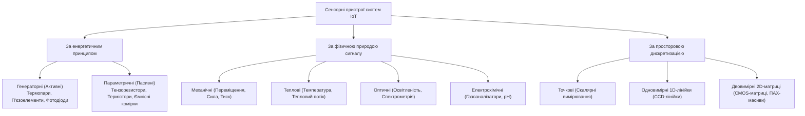
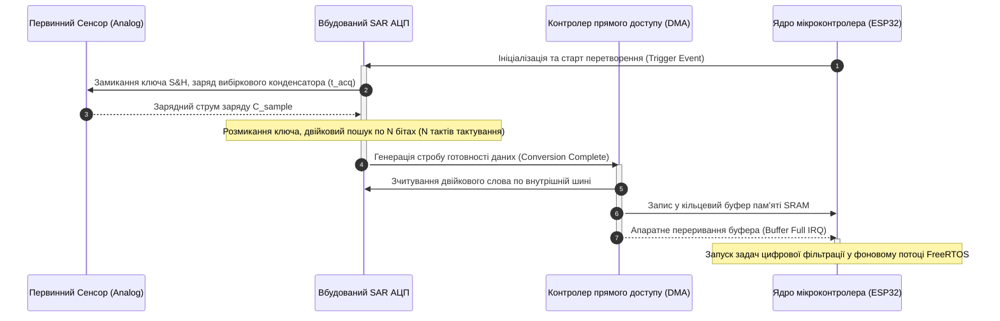
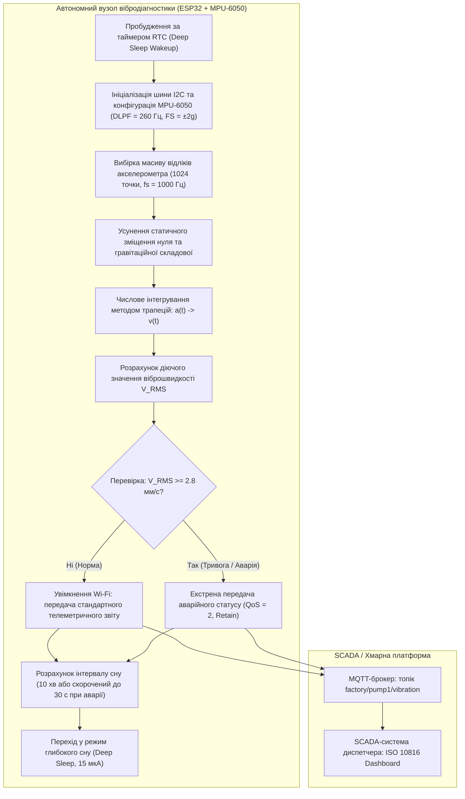

# Тема 7. Інтелектуальні сенсори та системи збору даних

## Мета лекції
Формування у майбутніх фахівців комплексної системи фундаментальних теоретичних знань і практичних інженерних компетентностей щодо принципів функціонування, схемотехнічної побудови та програмування інтелектуальних сенсорів і мікроелектромеханічних систем (MEMS) в інфраструктурі Інтернету речей, а також опанування математичного апарату аналого-цифрового перетворення, методів лінеаризації характеристик і алгоритмів цифрової фільтрації телеметричних даних безпосередньо на рівні граничних обчислювачів (Edge Computing) для побудови високоточних та енергоефективних систем моніторингу й автоматизованого керування.

## Очікувані результати навчання
1. **Знання та розуміння.** Здобувачі вищої освіти засвоять базову таксономію первинних та інтелектуальних сенсорів, фізичні принципи роботи мікроелектромеханічних перетворювачів, структуру аналогових інтерфейсів нормування сигналів і теоретичні засади теореми Котельникова-Шеннона для дискретизації неперервних процесів.
2. **Застосування.** Здобувачі вищої освіти навчаться розраховувати квант дискретизації та відношення сигналу до шуму квантування АЦП, налаштовувати апаратні цифрові інтерфейси обміну даними I2C і SPI для опитування сенсорних блоків, а також програмно реалізовувати алгоритми калібрування, експоненційного згладжування та медіанної фільтрації на базі мікроконтролерів.
3. **Аналіз.** Здобувачі вищої освіти зможуть здійснювати порівняльний аналіз архітектур аналого-цифрових перетворювачів послідовного наближення та дельта-сигма структур, класифікувати джерела апаратних похибок і шумів вимірювальних трактів, а також визначати вплив явищ аліасингу і температурного дрейфу на достовірність первинної інформації.
4. **Оцінювання та синтез.** Здобувачі вищої освіти зможуть науково обґрунтовувати вибір компонентної бази інтелектуальних сенсорів під конкретні експлуатаційні вимоги енергоспоживання, динамічного діапазону та швидкодії, а також проектувати оптимальний алгоритмічний конвеєр первинної обробки сигналів на рівні периферійного вузла для надійного формування подій перед їх відправкою до хмарних сервісів.

---

## Детальний покроковий план лекції

### 1. Теоретико-концептуальний базис. Архітектура інтелектуальних сенсорів та фізичні принципи MEMS-технологій
* 1.1. Еволюція первинних перетворювачів: від пасивного аналогового давача до інтелектуального сенсора (Smart Sensor) із вбудованою цифровою обробкою сигналів
* 1.2. Базова таксономія та класифікація сенсорів за фізичною природою вимірюваного параметра, енергетичним принципом функціонування та просторовою локалізацією
* 1.3. Технологічні основи виробництва кремнієвих мікроелектромеханічних систем (MEMS) та їх інтеграція на рівні кристала
* 1.4. Принципи функціонування MEMS-акселерометрів, гіроскопів та інтегрованих інерціальних вимірювальних модулів (IMU) з апаратними процесорами руху (DMP)

### 2. Методологія та аналіз граничних умов. Процеси квантування, лінеаризації та фільтрації сигналів у реальному часі
* 2.1. Математичні основи аналого-цифрового перетворення: теорема Котельникова-Шеннона, вага молодшого значущого розряду (LSB) та теоретичний поріг SQNR
* 2.2. Порівняльний аналіз архітектур АЦП послідовного наближення (SAR) та дельта-сигма ($\Sigma\Delta$) у контексті швидкодії, розрядності й енергоефективності
* 2.3. Алгоритми цифрової обробки сигналів на граничних пристроях: лінеаризація за рівнянням Стейнхарта-Харта, калібрування зміщення нуля та чутливості
* 2.4. Методи придушення шумів та компресії: медіанна фільтрація імпульсних викидів, експоненційне згладжування (EMA), фільтр Калмана та адаптивне стиснення за зоною нечутливості (Deadband)
* 2.5. Критичні апаратні обмеження вимірювальних трактів: явище аліасингу, шум квантування, температурний дрейф характеристик та детерміновані затримки реакції в контурах жорсткого реального часу

### 3. Практичний індустріальний / фаховий кейс. Розробка граничного вузла збору даних та вібродіагностики
**Тема наскрізної задачі.** «Проектування енергоефективного інтелектуального вузла предиктивної діагностики промислового насосного агрегата на основі MEMS-модуля MPU-6050, мікроконтролера ESP32 та алгоритмів локальної цифрової фільтрації»

## 1. Теоретико-концептуальний базис. Архітектура інтелектуальних сенсорів та фізичні принципи MEMS-технологій

### 1.1. Еволюція первинних перетворювачів: від пасивного аналогового давача до інтелектуального сенсора (Smart Sensor) із вбудованою цифровою обробкою сигналів

Історичний розвиток приладобудування та інформаційно-вимірювальної техніки пройшов шлях від механічних індикаторів прямої дії до розподілених кіберфізичних систем. На початкових етапах індустріалізації первинні перетворювачі функціонували виключно як пасивні аналогові пристрої, в яких вимірюваний неелектричний параметр безпосередньо трансформувався в переміщення покажчика (як у трубках Бурдона чи біметалічних пластинах) або в ненормовану зміну власного електричного параметра (опору, індуктивності, ємності). Такі прилади не мали власного інтелекту, характеризувалися високою чутливістю до електромагнітних завад, нелінійністю статичних характеристик, суттєвим температурним дрейфом і вимагали підключення довгих аналогових ліній зв'язку до вторинних вимірювальних приладів.

З появою напівпровідникової електроніки виник концепт сенсорно-комп'ютерних комплексів та систем централізованого збору даних (Data Acquisition Systems, DAQ). У цій конфігурації первинний чутливий елемент об'єднувався з аналоговим нормуючим підсилювачем (Analog Front-End, AFE), який формував стандартний уніфікований сигнал (струмова петля $4\dots20\text{ мА}$ або напруга $0\dots10\text{ В}$). Проте аналого-цифрове перетворення, лінеаризація та обчислення здійснювалися централізовано — у контролерах верхнього рівня або на серверних ЕОМ. Головними дефектами такої схеми залишалися спотворення сигналів під час транспортування аналоговими лініями значної довжини, складність індивідуального калібрування кожного окремого вимірювального каналу та значна обчислювальна завантаженість центрального процесора рутинними операціями попередньої фільтрації.

Справжня парадигмальна трансформація відбулася завдяки мікроелектронній революції та появі дешевих високоінтегрованих мікроконтролерів і сигнальних процесорів. Це уможливило перехід до концепції **інтелектуального сенсора** (Smart Sensor), стандартизованої міжнародним комплексом стандартів IEEE 1451. Сучасний інтелектуальний сенсор — це функціонально замкнена система на кристалі або в єдиному модульному корпусі, яка об'єднує первинний чутливий елемент, прецизійний тракт нормування, вбудований аналого-цифровий перетворювач, локальне обчислювальне ядро (мікроконтролер або цифровий сигнальний процесор DSP), незалежну пам'ять калібрувальних коефіцієнтів та стандартний цифровий мережевий інтерфейс. 

Взаємозв'язок між вимірюваною фізичною величиною $\lambda(t)$ та вихідним інформаційним сигналом $s(t)$ у довільному сенсорному перетворювачі в динамічному режимі описується лінійним диференціальним рівнянням $n$-го порядку із постійними або квазістаціонарними параметрами:

$$a_n \frac{d^n s(t)}{dt^n} + a_{n-1} \frac{d^{n-1} s(t)}{dt^{n-1}} + \dots + a_1 \frac{ds(t)}{dt} + a_0 s(t) = b_m \frac{d^m \lambda(t)}{dt^m} + \dots + b_1 \frac{d\lambda(t)}{dt} + b_0 \lambda(t)$$

де $\lambda(t)$ позначає вхідний фізичний вплив середовища на чутливий елемент у момент часу $t$; $s(t)$ є вихідним електричним сигналом первинного перетворювача; $a_i$ та $b_j$ є конструктивно-технологічними коефіцієнтами, що визначають інерційні, пружні, дисипативні та електромагнітні властивості датчика; $n$ та $m$ визначають порядок динамічної системи ($n \ge m$).

У стаціонарному (статичному) стані, коли всі похідні за часом прямують до нуля ($\frac{d^k s}{dt^k} = 0$, $\frac{d^k \lambda}{dt^k} = 0$), диференціальне рівняння редукується до алгебраїчної залежності $s = f(\lambda)$, яка називається статичною або градуювальною характеристикою перетворювача. Якщо класичний аналоговий давач видає користувачеві саме нелінійну функцію $s(t)$, то інтелектуальний сенсор вирішує обернену задачу відновлення вхідного параметра:

$$\lambda^*(t) = f^{-1}(s(t)) + \delta_{comp}(T, t)$$

де $\lambda^*(t)$ позначає обчислене цифрове значення фізичної величини у стандартизованих інженерних одиницях; $f^{-1}$ є математичною моделлю оберненої функції перетворення, закладеною у прошивку мікроконтролера; $\delta_{comp}(T, t)$ позначає розраховану аналітичну поправку на вплив температури навколишнього середовища $T$ та часового старіння компонентів.

Послідовність етапів розвитку та зміни технологічних поколінь вимірювальних перетворювачів наочно ілюструє наведена нижче діаграма станів.

Головною функціональною перевагою інтелектуального сенсора є локалізація обчислень: замість безперервної трансляції сирих шумних напруг чи струмів вузол самостійно проводить первинну обробку, порівнює значення із заданими аварійними межами, формує компактні повідомлення про події та взаємодіє із цифровою мережею за протоколами верхнього рівня.

> **ПРАКТИЧНИЙ ЯКІР:** У сучасних системах моніторингу віброактивності промислових турбін перехід від аналогових п'єзоакселерометрів зі стандартом $4\dots20\text{ мА}$ до інтелектуальних цифрових сенсорів вібрації з інтерфейсом IO-Link дозволив скоротити обсяг екранованого мідного кабелю на $70\%$ та повністю усунути похибки вимірювання, спричинені падінням напруги на контактних колодках розподільчих шаф.

---

### 1.2. Базова таксономія та класифікація сенсорів за фізичною природою вимірюваного параметра, енергетичним принципом функціонування та просторовою локалізацією

Масштабне різноманіття фізичних величин, які підлягають контролю в екосистемах Інтернету речей, потребує чіткої інженерної класифікації сенсорних компонентів. Основними класифікаційними ознаками виступають фізична природа вимірюваного явища, спосіб енергетичної взаємодії чутливого елемента з вимірювальним ланцюгом, режим просторової дискретизації об'єкта та наявність безпосереднього контакту з досліджуваним середовищем.

За фізичною природою інформаційного сигналу та вимірюваного процесу сенсори поділяються на кілька ключових класів. Механічні сенсори реєструють зміну форми, об'єму, лінійні та кутові координати, тиск, силу та прискорення. Термічні перетворювачі фіксують абсолютну температуру, градієнти теплових потоків і теплопровідність речовин. Оптичні прилади вимірюють інтенсивність світлового потоку, довжину хвилі, спектральний склад та поляризацію випромінювання. Акустичні сенсори сприймають амплітуду й частоту пружних коливань у газах, рідинах або твердих тілах. Хімічні та біохімічні давачі визначають молекулярний склад газових сумішей, концентрацію іонів у розчинах (pH), присутність специфічних біомаркерів або токсичних сполук. Електромагнітні сенсори аналізують напруженість магнітного поля, магнітну індукцію та параметри поверхневих зарядів.

За енергетичним принципом перетворення сенсорні пристрої строго поділяються на генераторні (активні) та параметричні (пасивні). 

Генераторні перетворювачі функціонують на основі прямого перетворення енергії вимірюваного процесу в електричну енергію, не вимагаючи для формування первинного сигналу стороннього джерела живлення. Прикладом термогенераторного пристрою є термопара, дія якої базується на термоелектричному ефекті Зеєбека: виникнення термо-ЕРС $E_{AB}$ у замкненому колі з двох різнорідних провідників $A$ та $B$, спаї яких підтримуються при різних температурах $T_1$ та $T_0$:

$$E_{AB} = \int_{T_0}^{T_1} \left( S_A(T) - S_B(T) \right) dT \approx \alpha_{AB} \cdot (T_1 - T_0)$$

де $S_A(T)$ та $S_B(T)$ позначають абсолютні коефіцієнти диференціальної термо-ЕРС відповідних металів; $\alpha_{AB}$ є сумарним коефіцієнтом термочутливості термопари, вираженим у $\text{мкВ/}^\circ\text{C}$; $T_1$ позначає температуру робочого спаю; $T_0$ позначає стабільну температуру опорного (холодного) спаю.

Параметричні сенсори діють як керовані імпеданси: під впливом вимірюваної величини змінюється внутрішній електричний параметр елемента — опір $R$, ємність $C$ або індуктивність $L$. Для вилучення вимірювальної інформації такий сенсор необхідно підключати до зовнішнього джерела живлення у складі мостових схем або дільників напруги. Наприклад, опір металевого тензорезистора під час деформації змінюється згідно з базовим законом тензорезистивного ефекту:

$$\frac{\Delta R}{R_0} = K_S \cdot \varepsilon = K_S \cdot \frac{\Delta l}{l_0}$$

де $R_0$ позначає початковий електричний опір провідника без прикладеного механічного навантаження; $\Delta R$ є абсолютною зміною опору під дією деформації; $K_S$ позначає коефіцієнт тензочутливості матеріалу (для константану $K_S \approx 2$, для легованого кремнію $K_S \approx 100\dots150$ завдяки п'єзоопору); $\varepsilon = \frac{\Delta l}{l_0}$ є відносною поздовжньою механічною деформацією.

Ієрархічна структура таксономії сенсорних вузлів схематично систематизована на рисунку нижче.

За способом просторової дискретизації об'єкта вимірювання сенсори поділяються на точкові (фіксують локальне значення в одній географічній або геометричній точці), лінійні (формують одновимірний масив даних уздовж координати, наприклад, розподілений волоконно-оптичний сенсор температури вздовж трубопроводу) та матричні (збирають інформацію у вигляді просторової двовимірної картини, як-от інфрачервоні матриці тепловізорів або 2D-матриці тиску в системах розумного взуття).

За типом фізичної локалізації виділяють контактні вимірювачі, які потребують прямого теплового, механічного або електричного зв'язку з об'єктом, та безконтактні (дистанційні) сенсори, які здійснюють вимірювання на відстані шляхом вловлювання відбитого або власного випромінювання (пірометри, пасивні інфрачервоні давачі руху PIR, ультразвукові далекоміри, лідари).

Порівняльний інженерний аналіз базових концепцій побудови та схем підключення ключових класів сенсорів наведено в наступній систематизованій таблиці.

| Клас перетворювача | Фізичний принцип дії | Тип вихідного сигналу | Рівень енергоспоживання | Приклад з реальної практики |
| :--- | :--- | :--- | :--- | :--- |
| **Термоелектричний (Термопара)** | Прямий ефект Зеєбека на контакті металів | Генераторний аналоговий сигнал ($\text{мкВ}$) | Нульове (пасивна генерація ЕРС) | Моніторинг температурних режимів камер згоряння промислових котлів ($+1200^\circ\text{C}$) |
| **Терморезистивний (RTD Pt100)** | Зміна питомого опору платини від температури | Параметричний аналоговий опір ($R(T)$) | Низьке (потрібен струм вимірювання $\le 1\text{ мА}$) | Прецизійний контроль температури в резервуарах для зберігання вакцин у фарміндустрії |
| **Ємнісний диференціальний** | Зміна зазору або площі пластин мікроконденсатора | Параметричний сигнал високої частоти або напруга | Наднизьке ($10\dots100\text{ мкА}$) | Акселерометри систем безпеки автомобілів для детектування зіткнень і розкриття подушок |
| **П'єзоелектричний** | Поляризація діелектрика під дією механічної сили | Генераторний імпульсний заряд ($Q \sim F$) | Нульове під час дії динамічної сили | Акустичні датчики контролю зносу та дефектоскопії залізничних рейок |
| **Магніторезистивний (AMR/GMR)** | Зміна орієнтації магнітних доменів у тонких плівках | Параметрична зміна опору мостової схеми | Середнє ($1\dots5\text{ мА}$) | Безконтактне безступеневе визначення кута положення дросельної заслінки двигуна |
| **Оптичний фотоелектричний** | Внутрішній фотоефект у $p\text{-}n$-переході кремнію | Генераторний фотострум або фото-ЕРС | Мікропотужне ($< 0{,}5\text{ мА}$) | Оптопари на конвеєрних лініях сортування для підрахунку та визначення габаритів тари |
| **Хеморезистивний (MOX)** | Каталітична адсорбція газу на плівці $SnO_2$ | Параметрична зміна поверхневої провідності | Високе ($30\dots150\text{ мА}$ на підігрів) | Детектори витоку побутового природного газу (метану) та чадного газу ($CO$) у ЖКГ |

Аналіз характеристик демонструє, що в сучасних автономних системах IoT перевага надається компонентам із низьким та наднизьким енергоспоживанням, що забезпечує багаторічне функціонування вузла від локального хімічного джерела живлення.

---

### 1.3. Технологічні основи виробництва кремнієвих мікроелектромеханічних систем (MEMS) та їх інтеграція на рівні кристала

Кремнієві мікроелектромеханічні системи стали апаратним фундаментом Інтернету речей завдяки поєднанню унікальних електричних та механічних властивостей монокристалічного кремнію. Кремній характеризується модулем Юнга, порівнянним зі сталлю ($E_{Si} \approx 130\dots190\text{ ГПа}$ залежно від кристалографічної орієнтації), але володіє майже втричі меншою густиною ($\rho \approx 2330\text{ кг/м}^3$) та високою межею пружності. Критичною перевагою кремнію над металами є абсолютна відсутність механічного гістерезису та явищ втоми матеріалу в межах робочих навантажень: кремнієва мікроскопічна пружина здатна витримувати трильйони циклів деформації без накопичення дефектів і зміни коефіцієнта жорсткості.

Технологічний цикл виробництва MEMS базується на модифікованих групових процесах планарної мікроелектроніки, які доповнюються операціями селективного об'ємного та поверхневого мікромеханічного формування. Базовий процес складається з наступної суворої технологічної послідовності операцій. 

Спершу на монокристалічну кремнієву пластину методом термічного окиснення або плазмохімічного осадження (PECVD) наносяться шари діелектрика ($\text{SiO}_2$, $\text{Si}_3\text{N}_4$) та структурні шари полікристалічного кремнію. 

Далі за допомогою фотолітографії крізь прецизійний фотошаблон формується просторовий рельєф майбутнього пристрою. Ключовою технологією створення вертикальних мікроструктур із високим аспектним співвідношенням (співвідношення глибини до ширини до $50:1$) є глибоке реактивне іонне травлення (Deep Reactive Ion Etching, DRIE), реалізоване через так званий процес Боша (Bosch process). Цей процес полягає в циклічному чергуванні двох фаз: фази швидкого плазмового травлення кремнію іонами газу гексафториду сірки ($SF_6$) та фази осадження полімерної захисної пасивуючої плівки з октафторциклобутану ($C_4F_8$) на вертикальні бічні стінки формуваного заглиблення.

Завершальною критичною стадією є видалення так званого «жертовного» шару (Sacrificial Layer, найчастіше діоксиду кремнію $\text{SiO}_2$), на якому формувалася рухома конструкція. Травлення жертовного шару здійснюється парами безводної фтористоводневої кислоти ($HF$). Після його видалення мікроскопічна інерційна маса, балка або мембрана повисає у відкритому зазорі над підкладкою, набуваючи ступенів вільної механічної рухливості.

Електростатична взаємодія між паралельними пластинами мікроконденсатора у структурі MEMS визначається рівнянням накопиченої енергії електричного поля $E_e$ та величиною сили електростатичного притягання $F_e$:

$$E_e(x) = \frac{1}{2} C(x) V^2 = \frac{\varepsilon_0 \varepsilon_r A}{2 (d_0 - x)} V^2$$

$$F_e = \frac{\partial E_e(x)}{\partial x} = \frac{\varepsilon_0 \varepsilon_r A V^2}{2 (d_0 - x)^2}$$

де $\varepsilon_0$ позначає електричну сталу вакууму ($\text{Ф/м}$); $\varepsilon_r$ є діелектричною проникністю газу в камері; $A$ позначає ефективну площу взаємного перекриття електродів (${\text{м}}^2$); $V$ є різницею потенціалів між рухомим та нерухомим електродом (В); $d_0$ позначає початковий зазор між обкладками за відсутності керуючої напруги (м); $x$ є просторовим переміщенням рухомого електрода (м).

У конструктивному плані інтеграція MEMS-структур з обчислювальною електронікою здійснюється за двома напрямами: монолітна система на кристалі (System-on-Chip, SoC) та багаточипова система в корпусі (System-in-Package, SiP). 

При монолітній інтеграції механічні вузли та CMOS-транзистори логіки виготовляються на одній пластині в єдиному технологічному маршруті. Це забезпечує мінімальні паразитні ємності сигнальних ліній, однак стикається з конфліктом високих температур осадження кремнію та обмежень CMOS-металізації. 

Тому понад $80\%$ сучасних промислових MEMS-компонентів проектуються за технологією SiP: механічний сенсорний кристал та кремнієвий кристал спеціалізованої схеми обробки сигналу (Application-Specific Integrated Circuit, ASIC) виготовляються на окремих пластинах за оптимальними технологічними нормами, монтуються в один герметичний корпус і з'єднуються між собою дротовим ультразвуковим мікрозварюванням або матрицею наскрізних кремнієвих переходів (Through-Silicon Vias, TSV).

> **ТИПОВА ПОМИЛКА:** Поширена помилкова інженерна думка полягає в тому, що механічні структури MEMS за законами підпорядковуються виключно класичній макроскопічній механіці без урахування атомних сил. На мікрорівні зі зменшенням розмірів співвідношення площі поверхні до об'єму різко зростає, внаслідок чого гравітаційні сили стають мізерними, а домінуючу роль починають відігравати поверхневі сили адгезії, капілярні сили Ван-дер-Ваальса та електростатичні заряди. Якщо в процесі рідинного травлення жертовного шару не застосувати надкритичну сушку вуглекислим газом або парове травлення, поверхневий натяг рідини притисне кремнієві балки до підкладки, викликаючи їх незворотне злипання (явище **стикції**, Stiction), що призводить до повного апаратного браку компонента.

---

### 1.4. Принципи функціонування MEMS-акселерометрів, гіроскопів та інтегрованих інерціальних вимірювальних модулів (IMU) з апаратними процесорами руху (DMP)

Основними компонентами систем навігації, просторової орієнтації та вібродіагностики в Інтернеті речей є ємнісні акселерометри та вібраційні гіроскопи, що об'єднуються в інтегровані інерціальні вимірювальні модулі (IMU).

Ємнісний триосьовий **MEMS-акселерометр** вимірює вектор суми кінематичного прискорення корпусу та гравітаційного прискорення вільного падіння. Чутливий елемент кожної осі містить кремнієву інерційну сейсмічну масу $m$, яка підвішена на гнучких балках із жорсткістю $k$. Маса забезпечена десятками кремнієвих мікропальців, розташованих між нерухомими пластинами підкладки, утворюючи диференціальний конденсатор. 

Динаміка зміщення маси $x(t)$ відносно основи описується класичним диференціальним рівнянням вимушених коливань у в'язкому середовищі:

$$m \frac{d^2 x(t)}{dt^2} + c \frac{dx(t)}{dt} + k x(t) = -m \cdot a_{in}(t)$$

де $m$ позначає масу кремнієвого тіла ($\text{кг}$); $c$ є коефіцієнтом механічного демпфування газом всередині порожнини ($\text{Н}\cdot\text{с/м}$); $k$ позначає жорсткість пружного підвісу ($\text{Н/м}$); $x(t)$ є лінійним зміщенням маси (м); $a_{\text{in}}(t)$ позначає проекцію вхідного лінійного прискорення на відповідну вісь вимірювання ($\text{м/с}^2$).

При статичному або низькочастотному прискоренні зміщення маси становить $x = -\frac{m}{k} a_{in}$. Зміна вихідної диференціальної ємності $\Delta C = C_1 - C_2$ лінійно відображає це переміщення:

$$\Delta C = \varepsilon_0 \varepsilon_r A \left( \frac{1}{d_0 - x} - \frac{1}{d_0 + x} \right) \approx \frac{2 \varepsilon_0 \varepsilon_r A}{d_0^2} \cdot x = \left( \frac{2 C_0 m}{d_0 k} \right) \cdot a_{in}$$

де $C_0$ позначає початкову спокійну ємність одиничної секції конденсатора; $d_0$ є базовою відстанню між пальцями у стані спокою. Спеціалізована мікросхема ASIC вимірює струми перезаряду ємностей на високій несучій частоті (від $100\text{ кГц}$ до $1\text{ МГц}$) і формує напругу, пропорційну значенню $a_{in}$.

Робота **вібраційного MEMS-гіроскопа** ґрунтується на вимірюванні сили Коріоліса, яка виникає під час обертання рухомого тіла, що коливається. Механічна структура гіроскопа має щонайменше два ступені вільності. Електростатичний гребінчастий привід (Drive Comb) збуджує неперервні коливання первинної маси вздовж осі $X$ із резонансною швидкістю $v_x(t) = V_0 \sin(\omega_r t)$. 

Якщо корпус датчика починає обертатися навколо перпендикулярної осі $Z$ з кутовою швидкістю $\Omega_z$, виникає коріолісова сила $\vec{F}_C$, вектор якої спрямований уздовж ортогональної осі $Y$:

$$\vec{F}_C = 2 m \left( \vec{v} \times \vec{\Omega} \right) = 2 m \cdot v_x(t) \cdot \Omega_z$$

де $m$ позначає величину вібруючої маси; $\vec{v}$ є вектором лінійної швидкості внутрішніх коливань підвісу; $\vec{\Omega}$ позначає вимірювану зовнішню кутову швидкість. Під дією цієї сили вторинна рамка починає коливатися вздовж осі $Y$, а амплітуда виниклих коливань, детектується вторинними конденсаторами чутливості (Sense Comb), виявляється строго пропорційною миттєвій кутовій швидкості $\Omega_z$.

Об'єднання 3-осьового акселерометра та 3-осьового гіроскопа формує модуль із 6 ступенями вільності (6-DOF IMU), прикладом якого є мікросхема MPU-6050. Однак пряме використання окремих сигналів має фізичні фундаментальні дефекти: інтегрування даних гіроскопа $\int \Omega dt$ дозволяє відстежувати кути крену, тангажу та рискання з високою частотою оновлення, але накопичує монотонний низькочастотний дрейф нуля (Drift/Random Walk), який за кілька хвилин спотворює оцінку кута на десятки градусів. Акселерометр, навпаки, забезпечує абсолютну довготривалу стабільність за вектором сили тяжіння Землі $g$, але піддається впливу високочастотних вібрацій та паразитних лінійних прискорень об'єкта.

Для розв'язання цієї проблеми в архітектуру MPU-6050 вбудовано апаратний сигнальний співпроцесор **DMP** (Digital Motion Processor). Він автоматично зчитує сирі дані від 16-бітних АЦП акселерометра та гіроскопа з внутрішньою частотою $200\text{ Гц}$, здійснює обчислення фільтрів злиття даних (Sensor Fusion) і записує у внутрішній апаратний буфер FIFO об'ємом 1024 байти орієнтаційні **кватерніони** просторового положення $q = [w, x, y, z]^T$. Це повністю розвантажує основний мікроконтролер IoT-вузла (наприклад, ESP32) від складних матричних тригонометричних обчислень у контурі реального часу.

Якщо застосування вбудованого апаратного DMP неможливе, на мікроконтролері реалізується алгоритм цифрового **комплементарного фільтра**, що об'єднує властивості фільтра високих частот для гіроскопа та фільтра низьких частот для акселерометра:

$$\theta[k] = \alpha \cdot \left( \theta[k-1] + \omega_{gyro}[k] \cdot \Delta t \right) + (1 - \alpha) \cdot \theta_{acc}[k]$$

де $\theta[k]$ позначає результуючу кутову оцінку на поточному $k$-му кроці розрахунку; $\alpha$ є безрозмірним коефіцієнтом зважування фільтра ($0{,}95 \le \alpha \le 0{,}98$); $\omega_{gyro}[k]$ позначає миттєву кутову швидкість від гіроскопа; $\Delta t$ є періодом циклу опитування сенсора в секундах; $\theta_{acc}[k] = \text{atan2}(a_y, a_z) \cdot \frac{180^\circ}{\pi}$ позначає кут, відновлений через проекції гравітаційного прискорення акселерометра.

> **ПРАКТИЧНИЙ ЯКІР:** У комерційних безпілотних літальних апаратах (квадрокоптерах) польотний контролер опитує MEMS IMU-модулі на частоті не менше $800\text{ Гц}$ через апаратне переривання, використовуючи комплементарне комплексування даних для відпрацювання алгоритмів стабілізації обертів безколекторних двигунів за час, що не перевищує $1{,}25\text{ мс}$.

> **КОНТРОЛЬНЕ ПИТАННЯ:** Чому для визначення кута рискання (Yaw, поворот у горизонтальній площині навколо осі, паралельної вектору гравітації) неможливо використати показання трьохосьового акселерометра навіть за повної відсутності руху, і які додаткові компоненти необхідні для повної 9-DOF орієнтації системи?

Розгорнути аналіз / відповідь

**Правильний варіант: Неможливість базується на колінеарності осі обертання вектору сили тяжіння, що потребує магнітометра.**

1. Акселерометр здатний визначати просторові кути нахилу (крен Roll та тангаж Pitch) виключно завдяки вимірюванню статичних проекцій вектора гравітаційного прискорення вільного падіння $g$ на відповідні ортогональні осі $X, Y, Z$. При обертанні об'єкта в горизонтальній площині (навколо вертикальної осі $Z$, спрямованої строго паралельно вектору $\vec{g}$) проекція вектора гравітації на вісь $Z$ залишається абсолютно незмінною ($a_z = 1g$), а проекції на осі $X$ та $Y$ залишаються рівними нулю ($a_x = 0, a_y = 0$). Оскільки вектор прискорення вільного падіння не має складової у площині обертання, математична система рівнянь стає невизначеною, і акселерометр принципово не здатний зафіксувати поворот по азимуту. Для компенсації цього обмеження та реалізації повноцінної просторової орієнтації 9-DOF до системи додають трьохосьовий магнітометр (електронний компас), який реєструє проекції вектора напруженості геомагнітного поля Землі у горизонтальній площині, надаючи стабільну опорну базу для осі рискання.

2. Аналіз дистракторів:
   - Гіроскоп за віссю $Z$ здатен детектувати зміну кутової швидкості обертання, але внаслідок неминучого інтегрування шуму та постійного зсуву нуля (Zero-rate Bias) оцінка кута рискання неперервно дрейфує, тому гіроскоп сам по собі не є абсолютним вимірювачем азимута у тривалому часі.
   - Збільшення розрядності АЦП чи калібрування акселерометра не вирішують проблему, оскільки обмеження зумовлене фундаментальною векторною геометрією, а не апаратними похибками вимірювального тракту.

---

### Вказівки для самостійного осмислення

1. Проаналізуйте технічну документацію на інерціальний вимірювальний сенсор MPU-6050, зосередивши увагу на призначеннях регістрів конфігурації фільтра низьких частот `CONFIG (0x1A)` та діапазонів чутливості `GYRO_CONFIG (0x1B)` і `ACCEL_CONFIG (0x1C)`.
2. Розрахуйте аналітично зміщення маси та зміну ємності диференціального акселерометра, прийнявши масу сейсмічного тіла рівною $0{,}25\text{ мкг}$, коефіцієнт пружності кремнієвого підвісу $k = 15\text{ Н/м}$, міжелектродний зазор $d_0 = 1{,}5\text{ мкм}$ при прикладанні статичного лінійного прискорення величиною $5g$.
3. Порівняйте монолітні технології інтеграції мікроелектромеханічних структур SoC із модульними рішеннями SiP за показниками паразитних параметрів ліній зв'язку, площі кристала, технологічної собівартості та відсотка виходу придатних інтегральних схем.

## 2. Методологія та аналіз граничних умов. Процеси квантування, лінеаризації та фільтрації сигналів у реальному часі

### 2.1. Математичні основи аналого-цифрового перетворення: теорема Котельникова-Шеннона, вага молодшого значущого розряду (LSB) та теоретичний поріг SQNR

Процес первинного збору інформації у вузлах Інтернету речей базується на перетворенні неперервних фізичних величин у дискретну цифрову послідовність. Математична формалізація цієї процедури охоплює два нерозривні процеси: дискретизацію за часом та квантування за амплітудою. Дискретизація перетворює неперервний аналоговий сигнал $x(t)$ у часову послідовність миттєвих значень $x[n] = x(n T_s)$, де $T_s = 1/f_s$ позначає період дискретизації, а $f_s$ є частотою вибірки вимірювального тракту.

Фундаментальною межею безпомилкового відновлення спектра досліджуваного процесу виступає теорема Котельникова-Шеннона. Відповідно до цієї теореми, неперервний сигнал із обмеженим енергетичним спектром, максимальна частота якого становить $f_{max}$, може бути повністю та однозначно відновлений за своїми дискретними відліками за умови, що частота дискретизації строго задовольняє критерій Найквіста:

$$f_s \ge 2 \cdot f_{max}$$

У разі порушення цієї фундаментальної нерівності ($f_s < 2 f_{max}$) спектральні компоненти сигналу, розташовані вище частоти Найквіста $f_N = f_s / 2$, дзеркально накладаються на основний діапазон частот. Це явище має назву **аліасинг** (маскування або накладання частот), а результуюча паразитна частота хибного сигналу $f_{alias}$ визначається модулем різниці між вхідною гармонікою $f_{in}$ та найближчою гармонікою частоти квантування:

$$f_{alias} = |f_{in} - k \cdot f_s|$$

де $k \in \mathbb{N}$ обирається таким чином, щоб значення $f_{alias}$ опинилося в межах смуги пропускання $[0; f_s / 2]$. Оскільки цифровими алгоритмами неможливо відрізнити справжній низькочастотний сигнал від дзеркально накладеної псевдочастоти, перед кожним аналого-цифровим перетворювачем є обов'язковим увімкнення апаратного аналогового фільтра захисту від накладання спектрів (Anti-Aliasing Filter, AAF).

Квантування за амплітудою відображає нескінченну множину значень напруги $V_{in}$ у скінченну множину цілочисельних кодів $D$. Для лінійного перетворювача з розрядністю $N$ бітів та діапазоном повної шкали від нуля до опорної напруги $V_{ref}$ вага молодшого значущого розряду (Least Significant Bit, LSB), що визначає крок квантування $q$, розраховується аналітично:

$$q = \text{LSB} = \frac{V_{ref}}{2^N - 1} \approx \frac{V_{ref}}{2^N}$$

де $q$ позначає мінімальну дискрету зміни аналогового потенціалу, яку здатна зафіксувати мікросхема АЦП, вимірювану у вольтах; $V_{ref}$ є високостабільною опорною напругою перетворення; $N$ визначає число вихідних двійкових розрядів.

Невідповідність між реальним рівнем напруги $V_{in}$ та його найближчим квантованим еквівалентом формує похибку квантування $e_q(t) = V_{in}(t) - V_{quant}(t)$, миттєве значення якої за ідеального перетворення лежить у симетричних межах $[-q/2; +q/2]$. Якщо вхідний сигнал є динамічним, складним за спектром і перетинає велику кількість квантів перетворення, похибку $e_q(t)$ розглядають як адитивний білий шум із рівномірною функцією густини ймовірності $p(e) = 1/q$. Потужність такого шуму квантування $P_e$ обчислюється шляхом інтегрування квадрата похибки:

$$P_e = \sigma_e^2 = \int_{-q/2}^{+q/2} e^2 \cdot p(e) \, de = \frac{1}{q} \left[ \frac{e^3}{3} \right]_{-q/2}^{+q/2} = \frac{q^2}{12}$$

Для гармонічного вхідного сигналу з максимально можливою амплітудою повної шкали $V(t) = \frac{V_{ref}}{2} \sin(\omega t)$ потужність корисного сигналу становить:

$$P_s = \frac{1}{T} \int_0^T V^2(t) \, dt = \frac{V_{ref}^2}{8} = \frac{(2^N \cdot q)^2}{8} = \frac{2^{2N} \cdot q^2}{8}$$

Формалізація теоретичного відношення потужності сигналу до потужності шуму квантування (Signal-to-Quantization-Noise Ratio, SQNR) у децибелах здійснюється за наступним математичним ланцюжком:

$$
\begin{aligned}
\text{Крок 1 (Визначення співвідношення потужностей):} & \quad \text{SQNR} = 10 \lg \left( \frac{P_s}{P_e} \right) = 10 \lg \left( \frac{\frac{2^{2N} q^2}{8}}{\frac{q^2}{12}} \right) \\
\text{Крок 2 (Алгебраїчне спрощення аргументу):} & \quad \text{SQNR} = 10 \lg \left( \frac{12}{8} \cdot 2^{2N} \right) = 10 \lg (1{,}5) + 10 \lg (2^{2N}) \\
\text{Крок 3 (Логарифмічне виведення формули Найквіста):} & \quad \text{SQNR} = 1{,}761 + 20 N \lg(2) \approx 6{,}02 \cdot N + 1{,}76 \text{ дБ}
\end{aligned}
$$

де $N$ позначає ефективну кількість розрядів перетворювача. Отриманий вираз установлює фундаментальну інженерну залежність: додавання кожного одного біта розрядності розширює динамічний діапазон вимірювального тракту на $6{,}02\text{ дБ}$. 

Аналіз граничних умов виявляє, що наведена модель SQNR різко деградує у випадках, коли вхідний сигнал є статичним або змінюється повільно. За таких умов похибка квантування втрачає властивості білого шуму і стає корельованою із вхідним сигналом, що породжує лінійчасті паразитні гармоніки у вихідному спектрі та зумовлює появу феномену граничних циклів. 

Крім того, модель стає нерелевантною для імпульсних та несинусоїдних сигналів із високим крест-фактором (відношенням пікового значення до середньоквадратичного), для яких амплітуда вимушено обмежується для уникнення апаратного насичення шкали АЦП, що автоматично знижує реальне співвідношення сигнал/шум на десятки децибелів від теоретичного розрахункового оптимуму.

---

### 2.2. Порівняльний аналіз архітектур АЦП послідовного наближення (SAR) та дельта-сигма ($\Sigma\Delta$) у контексті швидкодії, розрядності й енергоефективності

Вибір структурної організації АЦП безпосередньо зумовлює пропускну здатність та енергетичний бюджет граничного вузла Інтернету речей. В індустріальних застосуваннях та вбудованих мікроконтролерних системах конкурують дві фундаментальні парадигми: архітектура послідовного наближення (Successive Approximation Register, SAR) та дельта-сигма архітектура ($\Sigma\Delta$).

АЦП послідовного наближення функціонує за принципом двійкового пошуку аналогового еквівалента напруги. На початку кожного перетворення пристрій вибірки-зберігання (Sample-and-Hold, S&H) фіксує миттєву напругу на зарядному конденсаторі $C_{sample}$. Потім внутрішній регістр послідовного наближення встановлює старший значущий біт (MSB) внутрішнього прецизійного ЦАП в одиницю. Компаратор порівнює тестову напругу ЦАП із зафіксованою напругою сигналу. Якщо вхідна напруга вища, тестовий біт залишається в одиниці, в іншому випадку — скидається в нуль. 

Цей процес повторюється для всіх $N$ розрядів, вимагаючи строго $N$ тактів опорного тактового генератора на одне повне перетворення. Динамічним бар'єром швидкодії SAR виступає часова стала заряджання ємності дискретизатора через внутрішній вихідний опір джерела сигналу $R_{source}$ та опір аналогового ключа $R_{switch}$:

$$t_{acq} \ge - \ln \left( \frac{1}{2^{N+1}} \right) \cdot (R_{source} + R_{switch}) \cdot C_{sample}$$

де $t_{acq}$ позначає мінімально необхідний час вибірки для встановлення заряду з точністю краще $0{,}5\text{ LSB}$; $N$ є проектною розрядністю АЦП.

Принципово іншу методологію використовують дельта-сигма перетворювачі, які базуються на концепціях передискретизації (Oversampling) та формування спектра шуму (Noise Shaping). Дельта-сигма модулятор дискретизує вхідний сигнал на тактовій частоті $f_{oversample}$, яка у сотні або тисячі разів перевищує граничну частоту Найквіста, виражаючись через коефіцієнт передискретизації $\text{OSR} = f_{oversample} / (2 f_B)$, де $f_B$ позначає смугу пропускання корисного сигналу. 

Завдяки інтегратору та негативному зворотному зв'язку в модуляторі спектральна густина шуму квантування витискається з низькочастотної області у високочастотну зону спектра. Подальший цифровий децимаційний фільтр (переважно sinc-конфігурації) зрізає високочастотну складову разом із шумом квантування та знижує частоту відліків до цільової, забезпечуючи екстремально високу роздільну здатність аж до 24 чи 32 бітів без застосування надточних лазерно-підігнаних резистивних матриць.

Взаємодію мікроконтролерного вузла з інтегрованим модулем АЦП під час апаратного опитування первинного сенсора представлено на наступній часовій діаграмі.

Аналіз критичних умов застосування свідчить, що архітектура SAR стає нерелевантною у прецизійних тензометричних трактах, де корисний сигнал становить частки мікровольта: теплові шуми вхідного тракту перекривають молодші розряди перетворювача, роблячи останні $3\dots4$ біти абсолютно недостовірними. 

Натомість дельта-сигма перетворювачі принципово непридатні для мультиплексованого опитування високошвидкісних каналів: внутрішній цифровий децимаційний фільтр володіє значною груповою затримкою, і за кожного циклу перемикання вхідного аналогового комутатора конвеєр фільтра повинен повністю перезавантажуватися, що обвалює ефективну пропускну здатність вузла у десятки разів.

> **ПРАКТИЧНИЙ ЯКІР:** У промислових модулях вібродіагностики стандарту ISO 10816 для аналізу швидких перехідних процесів ударних навантажень підшипників застосовують виключно SAR АЦП із паралельним одночасним опитуванням каналів на частотах до $100\text{ кГц}$, тоді як у стаціонарних промислових вагових терміналах бункерів дозування домінують винятково $\Sigma\Delta$ АЦП (наприклад, Analog Devices AD7799), які забезпечують придушення синфазної завади промислової мережі частотою $50\text{ Гц}$ на рівні понад $100\text{ дБ}$ завдяки формуванню глибокого нуля передавальної характеристики на цій частоті цифровим фільтром дециматора.

---

### 2.3. Алгоритми цифрової обробки сигналів на граничних пристроях: лінеаризація за рівнянням Стейнхарта-Харта, калібрування зміщення нуля та чутливості

Сирі відліки, отримані на виході АЦП, потребують математичної нормалізації для усунення схемотехнічних похибок зміщення та переведення в реальні інженерні одиниці. Базовою процедурою лінійного калібрування вимірювального тракту є двоточкова корекція. Вона компенсує адитивну похибку зсуву нуля (Offset Error) та мультиплікативну похибку коефіцієнта передачі (Gain Error), спричинені розкидом опорів резисторів дільника напруги та внутрішніх опорних джерел АЦП. 

Математична формалізація процесу двоточкового калібрування лінійного каналу реалізується у три послідовні розрахункові етапи:

$$
\begin{aligned}
\text{Крок 1 (Отримання калібрувальних пар):} & \quad (\lambda_1, D_1) \text{ та } (\lambda_2, D_2) \\
\text{Крок 2 (Розрахунок масштабу та зміщення):} & \quad K_{gain} = \frac{\lambda_2 - \lambda_1}{D_2 - D_1}, \quad X_{offset} = \lambda_1 - K_{gain} \cdot D_1 \\
\text{Крок 3 (Оперативне відновлення сигналу):} & \quad \lambda_{real}[n] = K_{gain} \cdot D[n] + X_{offset}
\end{aligned}
$$

де $\lambda_1, \lambda_2$ позначають еталонні значення фізичної величини, виражені в інженерних одиницях вимірювання (наприклад, градусах або кілопаскалях); $D_1, D_2$ є числовими еквівалентами на виході АЦП під час дії еталонних впливів; $D[n]$ є поточним виміряним кодом АЦП; $\lambda_{real}[n]$ позначає відкаліброване вихідне значення параметра.

У випадках вираженої фізичної нелінійності чутливого елемента застосування простої лінійної моделі призводить до неприпустимих методичних похибок. Класичним прикладом є напівпровідникові термістори з негативним температурним коефіцієнтом (Negative Temperature Coefficient, NTC), питомий опір яких експоненційно зменшується зі зростанням абсолютної температури. Для відновлення температурного поля за виміряним опором терморезистора $R_t$ застосовується емпірична модель високого порядку — поліноміальне рівняння Стейнхарта-Харта. 

Математична послідовність отримання температури в інженерних одиницях шкали Цельсія здійснюється за наступними алгоритмічними фазами:

$$
\begin{aligned}
\text{Крок 1 (Розрахунок опору сенсора з виходу АЦП):} & \quad R_t = R_{ref} \cdot \frac{D[n]}{2^N - D[n]} \\
\text{Крок 2 (Обчислення натурального логарифма опору):} & \quad L_R = \ln(R_t) \\
\text{Крок 3 (Розрахунок температури в Кельвінах):} & \quad \frac{1}{T_K} = A + B \cdot L_R + C \cdot (L_R)^3 \implies T_K = \frac{1}{A + B \cdot L_R + C \cdot L_R^3} \\
\text{Крок 4 (Трансляція у шкалу Цельсія):} & \quad T_C = T_K - 273{,}15
\end{aligned}
$$

де $R_{ref}$ позначає опір високоточного реперного резистора верхнього плеча дільника напруги (Ом); $D[n]$ є значенням оцифрованої напруги; $N$ є розрядністю АЦП; $A, B, C$ є унікальними експериментальними коефіцієнтами Стейнхарта-Харта конкретного екземпляра напівпровідникової структури термістора, визначеними за трьома реперними температурними точками.

Аналіз граничних умов виявляє критичні ситуації, у яких математична модель Стейнхарта-Харта втрачає стійкість. При температурних режимах, що перевищують робочий діапазон сенсора ($T_C > 150^\circ\text{C}$ або $T_C < -50^\circ\text{C}$), модель демонструє різке зростання похибки екстраполяції через зміну механізму провідності напівпровідника (перехід від домішкової провідності до власної). 

Другим граничним фактором є ефект власного саморозігріву термістора вимірювальним струмом: потужність розсіювання $P = I^2 R_t$ створює паразитний тепловий градієнт між тілом датчика та вимірюваним середовищем. Якщо струм вимірювального ланцюга перевищує порогове значення $100\text{ мкА}$ у нерухомих газових середовищах із низьким коефіцієнтом тепловіддачі $\delta_{diss}$, виникає внутрішній перегрів чутливого шару на кілька градусів, що повністю спотворює достовірність телеметричного тракту незалежно від розрядності АЦП.

---

### 2.4. Методи придушення шумів та компресії: медіанна фільтрація імпульсних викидів, експоненційне згладжування (EMA), фільтр Калмана та адаптивне стиснення за зоною нечутливості (Deadband)

Первинні дані після масштабування містять комбінацію завад: поодинокі аномальні стрибки напруги великої амплітуди (імпульсні викиди) та високочастотний тепловий фліккер-шум. Для їх нейтралізації на мікроконтролері реалізується дворівневий цифровий фільтраційний тракт.

Перший рівень захисту від аномальних імпульсних сплесків реалізує **медіанний фільтр** непарного порядку $W = 2m + 1$. Алгоритм формує часове ковзне вікно з останніх $W$ відліків вимірювання $X_w = [x[n-m], \dots, x[n], \dots, x[n+m]]$, виконує їх сортування за зростанням амплітуди та обирає строго центральний елемент впорядкованого масиву:

$$y_{med}[n] = \text{med}(X_w) = X_{(m+1)}^{sorted}$$

Головною перевагою медіанної фільтрації перед лінійними фільтрами є здатність повністю видаляти імпульсні шуми тривалістю менше $m$ відліків без згладжування крутих фізичних фронтів перехідного процесу.

Другий рівень забезпечує придушення залишкового гаусового шуму за допомогою **експоненційного згладжування** (Exponential Moving Average, EMA), що є рекурсивним цифровим фільтром нескінченної імпульсної характеристики (IIR) першого порядку:

$$y_{ema}[n] = \alpha \cdot x[n] + (1 - \alpha) \cdot y_{ema}[n-1]$$

де $x[n]$ позначає вихідне значення медіанного фільтра на поточному кроці; $y_{ema}[n-1]$ є результатом фільтрації на попередньому такті; $\alpha$ є безрозмірним коефіцієнтом фільтрації у межах $0 < \alpha \le 1$. 

Зв'язок параметра $\alpha$ із частотою зрізу фільтра $f_c$ при періоді дискретизації $T_s$ виводиться з аналогії передавальної функції аналогового RC-кола у просторі $Z$-перетворення та записується співвідношенням:

$$\alpha = \frac{2\pi f_c T_s}{1 + 2\pi f_c T_s} = \frac{2\pi f_c}{f_s + 2\pi f_c}$$

Для прецизійної динамічної оцінки стану сенсора в умовах високих зовнішніх збурень застосовується одновимірний **дискретний фільтр Калмана**. Алгоритм функціонує за двоетапною рекурсивною схемою «прогноз-корекція». 

Математичний апарат обчислення на кроці $k$ формалізується наступними системними кроками:

$$
\begin{aligned}
\text{Крок 1 (Прогноз стану на такт вперед):} & \quad \hat{x}_k^- = \hat{x}_{k-1} \\
\text{Крок 2 (Прогноз коваріації похибки оцінки):} & \quad P_k^- = P_{k-1} + Q \\
\text{Крок 3 (Розрахунок коефіцієнта підсилення Калмана):} & \quad K_k = \frac{P_k^-}{P_k^- + R} \\
\text{Крок 4 (Корекція оцінки за новим вимірюванням $z_k$):} & \quad \hat{x}_k = \hat{x}_k^- + K_k \cdot (z_k - \hat{x}_k^-) \\
\text{Крок 5 (Оновлення дисперсії похибки):} & \quad P_k = (1 - K_k) \cdot P_k^-
\end{aligned}
$$

де $\hat{x}_k$ позначає оптимальну оцінку вимірюваної величини; $z_k$ є сирим поточним вимірюванням датчика; $P_k$ позначає оцінку коваріації похибки; $Q$ позначає дисперсію внутрішнього шуму динамічного процесу; $R$ є дисперсією шуму вимірювального каналу сенсора; $K_k$ позначає динамічний ваговий коефіцієнт Калмана ($0 \le K_k \le 1$).

Для радикального розвантаження каналів зв'язку та економії енергії бездротових передавачів відфільтровані дані проходять алгоритм **адаптивного проріджування за зоною нечутливості** (Deadband Compression). Черговий відлік $y_{ema}[n]$ транслюється в стек мережевого протоколу лише тоді, коли його відхилення від попереднього надісланого значення $y_{sent}$ перевищує граничний абсолютний або відносний поріг $\Delta_{th}$:

$$|y_{ema}[n] - y_{sent}| \ge \Delta_{th}$$

> **ВАЖЛИВО:** Застосування алгоритму Deadband Compression у контурах управління з високою швидкістю зміни координат вимагає обов'язкового введення захисного тайм-ауту максимального періоду передачі (Heartbeat Timeout). Якщо параметр залишається всередині зони нечутливості довше критичного часу $T_{heartbeat}$, сенсорний вузол зобов'язаний примусово надіслати актуальне значення для запобігання хибному діагностуванню втрати зв'язку (Watchdog Timeout) центральним шлюзом або хмарною платформою.

---

### 2.5. Критичні апаратні обмеження вимірювальних трактів: явище аліасингу, шум квантування, температурний дрейф характеристик та детерміновані затримки реакції в контурах жорсткого реального часу

Розгортання вимірювальних систем у виробничих середовищах стикається з низкою критичних бар'єрів, обумовлених реальною неідеальністю аналогових і цифрових компонентів. Головними дестабілізуючими факторами виступають температурний дрейф, джиттер тактового генератора, аліасинг та фазові затримки в контурах цифрової фільтрації.

Температурний дрейф проявляється у зміні напруги зміщення нуля ($TCV_{os}$, вираженому в $\text{мкВ/}^\circ\text{C}$) та температурному дрейфі коефіцієнта підсилення тракту ($TC_{Gain}$, вираженому в $\text{ppm/}^\circ\text{C}$). 

В умовах промислового цеху з сезонним або технологічним коливанням температури на $\Delta T = 60^\circ\text{C}$ сумарне зміщення передавальної характеристики може повністю нівелювати точність високорозрядного АЦП. Сумарна апаратна похибка вимірювального тракту $\Delta V_{total}$ декомпонується на наступні складові:

$$\Delta V_{total}(T) = \Delta V_{offset}(T_0) + TCV_{os} \cdot \Delta T + \left( \delta_{gain}(T_0) + TC_{Gain} \cdot \Delta T \right) \cdot V_{in} + \frac{q}{\sqrt{12}} + V_{noise}^{p-p}$$

де $\Delta V_{offset}(T_0)$ позначає початкове зміщення нуля при температурі калібрування $T_0$; $\delta_{gain}$ є відносною похибкою підсилення; $q/\sqrt{12}$ позначає середньоквадратичну похибку квантування; $V_{noise}^{p-p}$ є власним піковим шумом вхідного каскаду.

Критичним вузьким місцем контурів жорсткого реального часу є затримка обробки (Latency) та фазовий зсув, що вносяться цифровими фільтрами. Будь-яке статистичне згладжування за своєю фізичною природою опирається на історію сигналу. Зокрема, лінійний фільтр ковзного середнього порядку $W$ вносить детерміновану затримку на половину ширини вікна:

$$\tau_{delay} = \frac{W - 1}{2} \cdot T_s$$

У системах активного захисту роторного обладнання від аварійного дисбалансу затримка виявлення аварійного стану на величину $\tau_{delay} > 5\text{ мс}$ може призвести до руйнування опорних підшипників турбіни. 

У наведеній нижче порівняльній матриці систематизовано основні методи лінеаризації, нормалізації та цифрової фільтрації сигналів, які застосовуються у вузлах Інтернету речей.

| Метод / Алгоритм | Обчислювальна складність | Витрати пам'яті (RAM/ROM) | Складність впровадження | Енергетична ціна | Критичні ризики / Обмеження |
| :--- | :--- | :--- | :--- | :--- | :--- |
| **Двоточкове лінійне калібрування** | $O(1)$, 1 множення, 1 додавання | Мінімальні (2 константи у Flash/EEPROM) | Низька | Наднизька ($< 1\text{ мкДж}$) | Непридатне для сенсорів із нелінійністю статичної характеристики $> 1\%$ |
| **Рівняння Стейнхарта-Харта** | $O(1)$, високі витрати (логарифми, ділення FPU) | Середні (3 константи типу `double`) | Середня | Помірна (потрібен апаратний блок FPU) | Розбіжність за межами робочого діапазону температур; ризик теплового саморозігріву |
| **Медіанний фільтр ($W = 2m+1$)** | $O(W \log W)$ або $O(W^2)$ сортування | $W$ комірок для ковзного буфера вибірок | Середня | Низька при малих $W \le 5$ | Спотворює високочастотну гармонічну форму сигналу; неефективний проти гаусового шуму |
| **Експоненційне згладжування (EMA)** | $O(1)$, 2 множення, 1 віднімання | 1 комірка зберігання стану попереднього кроку | Низька | Наднизька ($< 0{,}5\text{ мкДж}$) | Вносить експоненційну фазову затримку; погіршує швидкодію в контурах аварійного реагування |
| **Фільтр Калмана (1D)** | $O(1)$, 5 операцій із числами рухомої коми | 4 змінні стану та параметрів матриць | Висока | Середня (вимогливий до частоти процесора) | Вимагає точного апріорного знання матриць шумів $Q$ та $R$; при хибній оцінці втрачає стійкість |
| **Компресія Deadband** | $O(1)$, 1 операція порівняння різниці | 1 змінна для збереження останнього переданого значення | Низька | Знижує сумарне енергоспоживання на $90\%$ | Може замаскувати повільний плавний аварійний дрейф; потребує захисного механізму Heartbeat |

Підсумковий аналіз матриці демонструє, що вибір методу обробки є багатокритеріальною задачею оптимізації, в якій інженер балансує між метрологічною точністю вимірювання, доступними обчислювальними ресурсами мікроконтролера та жорсткими лімітами енергетичного бюджету автономного сенсорного вузла.

> **КОНТРОЛЬНЕ ПИТАННЯ:** Проектується сенсорний вузол контролю тиску на базі 10-бітного SAR АЦП мікроконтролера з опорною напругою $V_{ref} = 3{,}3\text{ В}$. Вимірювальний тракт піддається дії високочастотної завади напруги з частотою $f_{noise} = 45\text{ кГц}$. Інженер налаштував частоту дискретизації АЦП на рівні $f_s = 50\text{ кГц}$, відмовившись від вхідного аналогового фільтра низьких частот для спрощення друкованої плати, розраховуючи придушити заваду програмним цифровим фільтром низьких частот із частотою зрізу $f_c = 1\text{ кГц}$. Оцініть наслідки цього інженерного рішення та визначте, чи вдасться усунути шум за допомогою цифрового фільтра.

Розгорнути аналітичний розв'язок

**Правильний висновок: Програмний цифровий фільтр принципово не зможе усунути заваду, оскільки внаслідок аліасингу вона трансформується у хибний сигнал частотою 5 кГц, а при спробі зрізати її фільтром з $f_c = 1\text{ кГц}$ виникне фазове запізнення корисного процесу, якщо спектр корисного сигналу перекривається з цією зоною.**

1. Поетапне аналітичне обґрунтування:
   - Обчислюємо частоту Найквіста для заданої частоти дискретизації $f_s = 50\text{ кГц}$:
     $$f_N = \frac{f_s}{2} = \frac{50}{2} = 25\text{ кГц}$$
   - Оскільки частота високочастотної завади $f_{noise} = 45\text{ кГц}$ строго перевищує частоту Найквіста ($45\text{ кГц} > 25\text{ кГц}$), виникає явище аліасингу.
   - Розраховуємо дзеркальну псевдочастоту $f_{alias}$, на якій завада відобразиться всередину смуги пропускання АЦП ($k=1$):
     $$f_{alias} = |f_{noise} - f_s| = |45\text{ кГц} - 50\text{ кГц}| = 5\text{ кГц}$$
   - Оцифрований масив відліків на виході АЦП міститиме паразитне гармонійне коливання амплітудою в кілька LSB на частоті $5\text{ кГц}$, яке нічим математично не відрізняється від справжніх фізичних пульсацій тиску в гідросистемі.
   - Якщо корисний динамічний процес тиску містить робочі частоти понад $1\text{ кГц}$, цифровий фільтр із частотою зрізу $f_c = 1\text{ кГц}$ зріже разом із завадою і корисну інформацію динаміки процесу, спричинивши критичну затримку детектування аварійного гідроудару. 
   - Якщо ж корисний процес лежить нижче $1\text{ кГц}$, цифровий фільтр першого порядку забезпечить придушення на частоті $5\text{ кГц}$ лише близько $14\text{ дБ}$ ($20 \lg(5/1)$), чого недостатньо для ліквідації впливу завади на молодші розряди 10-бітного перетворювача.

2. Системний висновок:
   Відмова від аналогового Anti-Aliasing фільтра перед входом АЦП є грубою методологічною помилкою проектувальника, оскільки алгоритми цифрової фільтрації неспроможні відновити інформацію, втрачену або спотворену на етапі дискретизації внаслідок накладання спектрів.

---

### Вказівки для самостійного осмислення

1. Складіть аналітичну блок-схему алгоритму автономного перекалібрування нульового рівня MEMS-акселерометра у стані спокою на основі контролю модуля результуючого вектора прискорення за умовою $|\sqrt{a_x^2 + a_y^2 + a_z^2} - 1g| \le \varepsilon$.
2. Розрахуйте мінімально необхідний коефіцієнт приглушення аналогового фільтра низьких частот Баттерворта другого порядку на частоті Найквіста для забезпечення повної відповідності динамічному діапазону 12-розрядного SAR АЦП мікроконтролера ESP32.
3. Дослідіть вплив збільшення параметра зони нечутливості $\Delta_{th}$ в алгоритмі Deadband Compression на відносну похибку відновлення інтегральних технологічних показників витрати енергоресурсів при потоковому моніторингу рідинних середовищ.

## 3. Практичний індустріальний / фаховий кейс. Апаратна інтеграція та цифрова обробка даних сенсорного вузла вібромоніторингу

### 3.1. Комплексний фаховий кейс. Проектування енергоефективного вузла предиктивної вібродіагностики промислового насосного агрегата

#### Постановка задачі / ситуації
На комунальному підприємстві водопостачання експлуатується магістральний відцентровий насосний агрегат потужністю $250\text{ кВт}$. Вихід із ладу опорних підшипникових вузлів насоса призводить до каскадної аварії та зупинки водопостачання промислового району міста. Необхідно спроектувати автономний граничний сенсорний вузол (Edge IoT Node), що встановлюється безпосередньо на корпус підшипникового щита електродвигуна, здійснює безперервний моніторинг вібрації відповідно до міжнародного стандарту ISO 10816-3 (вібрація промислових машин потужністю понад $15\text{ кВт}$), виконує первинну цифрову фільтрацію вхідного сигналу та передає агреговані діагностичні параметри в локальну SCADA-систему за протоколом MQTT через мережу Wi-Fi.

У наведеній нижче таблиці деталізовано технічні характеристики технологічного об'єкта, апаратної бази сенсорного вузла та параметри експлуатаційного середовища.

| Категорія параметра | Фізична величина / Параметр | Числове значення та розмірність | Інженерне обґрунтування / Обмеження |
| :--- | :--- | :--- | :--- |
| **Параметри агрегата** | Частота обертання ротора ($n$) | $2950\text{ об/хв}$ ($f_0 \approx 49{,}17\text{ Гц}$) | Базова кінематична частота агрегата |
| | Спектральний діапазон діагностики | $10\dots1000\text{ Гц}$ | Вимога стандарту ISO 10816-3 |
| | Поріг віброшвидкості: Норма (Зона A/B) | $V_{RMS} < 2{,}8\text{ мм/с}$ | Безперервна довготривала експлуатація |
| | Поріг віброшвидкості: Тривога (Зона C) | $V_{RMS} \ge 2{,}8\text{ мм/с}$ | Потребує технічного обслуговування |
| | Поріг віброшвидкості: Аварія (Зона D) | $V_{RMS} \ge 4{,}5\text{ мм/с}$ | Негайне аварійне відключення агрегата |
| **Апаратна платформа** | Сенсорний модуль | InvenSense MPU-6050 (MEMS) | 3-осьовий акселерометр, 16-бітний АЦП |
| | Обчислювальне ядро (MCU) | Espressif ESP32 ($240\text{ МГц}$) | Вбудовані інтерфейси I2C та Wi-Fi 802.11b/g/n |
| | Джерело живлення | Батарея $\text{Li-SOCl}_2$ (тип ER14505) | Номінальна напруга $3{,}6\text{ В}$, ємність $2400\text{ мА}\cdot\text{год}$ |
| **Енергетичний профіль**| Струм активного режиму ($I_{active}$) | $120\text{ мА}$ | Збір відліків, розрахунок FFT/RMS, Wi-Fi |
| | Струм глибокого сну ($I_{sleep}$) | $15\text{ мкА}$ ($0{,}015\text{ мА}$) | Режим Deep Sleep із живленням таймера RTC |
| | Тривалість активного сеансу ($t_{active}$) | $1{,}5\text{ с}$ | Час на замір, фільтрацію та передачу |
| | Базовий період передачі ($T_{period}$) | $600\text{ с}$ ($10\text{ хвилин}$) | За відсутності перевищення зони тривоги |

Архітектуру взаємодії компонентів та алгоритмічний потік прийняття рішень на рівні мікроконтролера представлено на схемі нижче.

#### Покроковий аналіз та розв'язок

##### Крок 1. Вибір смуги пропускання та розрахунок частоти дискретизації за Найквістом
Для гарантованого виявлення кінематичних аномалій механізму (зокрема, дефектів підшипників кочення на частотах $f_{BPFO}$, $f_{BPFI}$, які для заданого типу насоса сягають $400\dots600\text{ Гц}$) максимальна гранична частота аналізу повинна становити $f_{max} = 1000\text{ Гц}$. 

Розрахунок мінімально допустимої частоти дискретизації за теоремою Котельникова-Шеннона та вибір робочої частоти здійснюється наступним чином:

$$f_{s\_min} = 2 \cdot f_{max} = 2 \cdot 1000\text{ Гц} = 2000\text{ Гц}$$

З огляду на апаратні обмеження вбудованого в MPU-6050 цифрового фільтра низьких частот (DLPF), що працює на внутрішніх частотах $1\text{ кГц}$ або $8\text{ кГц}$, обираємо режим із частотою дискретизації $f_s = 1000\text{ Гц}$ із конфігурацією апаратного фільтра низьких частот з частотою зрізу $f_c = 260\text{ Гц}$. Для базового стандарту ISO 10816-3 (діапазон нормування $10\dots1000\text{ Гц}$) вибірка на частоті $1000\text{ Гц}$ забезпечує достовірний аналіз перших п'яти гармонік обертової частоти ротора ($f_0 \approx 49{,}17\text{ Гц}$, $2f_0 \approx 98{,}3\text{ Гц}$, $3f_0 \approx 147{,}5\text{ Гц}$), що є діагностично достатнім для детектування дисбалансу та розцентровки валів. Період дискретизації становить:

$$T_s = \frac{1}{f_s} = \frac{1}{1000\text{ Гц}} = 0{,}001\text{ с} = 1\text{ мс}$$

##### Крок 2. Конфігурація діапазону повної шкали АЦП, ваги LSB та апаратного фільтра MPU-6050
Оскільки амплітуда віброприскорення справного насосного обладнання рідко перевищує $1{,}5g$, конфігуруємо акселерометр на мінімальний діапазон повної шкали $\pm 2g$ через запис значення `0x00` у регістр `ACCEL_CONFIG (0x1C)`. Це забезпечує максимальну роздільну здатність 16-бітного двополярного АЦП. 

Вага молодшого значущого розряду ($q$) в одиницях прискорення вільного падіння та в одиницях системи SI обчислюється наступним чином:

$$q = \text{LSB} = \frac{2 \cdot FS}{2^{16}} = \frac{4g}{65536} \approx 6{,}1035 \cdot 10^{-5} g/\text{LSB}$$

$$q_{SI} = q \cdot 9{,}80665\text{ м/с}^2 = 6{,}1035 \cdot 10^{-5} \cdot 9{,}80665 \approx 5{,}985 \cdot 10^{-4}\text{ м/с}^2/\text{LSB} \approx 0{,}5985\text{ мм/с}^2/\text{LSB}$$

##### Крок 3. Розрахунок середньоквадратичного значення віброшвидкості (RMS) за ISO 10816-3
Стандарт ISO 10816-3 оцінює вібраційний стан машин за середньоквадратичним значенням віброшвидкості $V_{RMS}$ у діапазоні від $10\text{ Гц}$ до $1000\text{ Гц}$. Мікроконтролер зчитує з FIFO буфера масив із $M = 1024$ послідовних відліків прискорення по осі $Z$ ($a_z[k]$), що відповідає тривалості вибірки $t_{sample} = 1024 \cdot 1\text{ мс} = 1{,}024\text{ с}$.

Математичний конвеєр перетворення реалізується у чотири послідовні кроки:

$$
\begin{aligned}
\text{Крок 1 (Компенсація постійної складової):} & \quad \bar{a} = \frac{1}{M} \sum_{k=0}^{M-1} a_z[k], \quad \tilde{a}[k] = (a_z[k] - \bar{a}) \cdot q_{SI} \quad [\text{м/с}^2] \\
\text{Крок 2 (Числове інтегрування методом трапецій):} & \quad v[k] = v[k-1] + \frac{\tilde{a}[k-1] + \tilde{a}[k]}{2} \cdot T_s \quad [\text{м/с}] \\
\text{Крок 3 (Видалення інтегрального низькочастотного дрейфу):} & \quad \bar{v} = \frac{1}{M} \sum_{k=0}^{M-1} v[k], \quad \tilde{v}[k] = v[k] - \bar{v} \\
\text{Крок 4 (Розрахунок середньоквадратичної віброшвидкості):} & \quad V_{RMS} = \sqrt{\frac{1}{M} \sum_{k=0}^{M-1} (\tilde{v}[k])^2} \cdot 1000 \quad [\text{мм/с}]
\end{aligned}
$$

Під час тестового вимірювання на насосі отримано масив інтегрованих швидкостей, для якого сума квадратів центрованих відліків склала $\sum_{k=0}^{1023} (\tilde{v}[k])^2 = 0{,}01016\text{ м}^2/\text{с}^2$. 

Підставляючи дані значення у формулу кроку 4, отримуємо:

$$V_{RMS} = \sqrt{\frac{0{,}01016}{1024}} \cdot 1000 = \sqrt{9{,}9218 \cdot 10^{-6}} \cdot 1000 = 0{,}00315\text{ м/с} \cdot 1000 = 3{,}15\text{ мм/с}$$

Отримане значення $V_{RMS} = 3{,}15\text{ мм/с}$ перевищує поріг Зони B ($2{,}8\text{ мм/с}$), що свідчить про перехід агрегата в Зону C («Тривога» — розвиток дефекту розцентровки або кавітації), вимагаючи термінового інформування диспетчера.

##### Крок 4. Оптимізація енергоспоживання та обчислення автономності вузла
Середній струм споживання вузла $I_{avg}$ за період циклу $T_{period} = 600\text{ с}$ при тривалості активного стану $t_{active} = 1{,}5\text{ с}$, струмі активної фази $I_{active} = 120\text{ мА}$ та струмі режиму Deep Sleep $I_{sleep} = 0{,}015\text{ мА}$ розраховується як:

$$I_{avg} = \frac{I_{active} \cdot t_{active} + I_{sleep} \cdot (T_{period} - t_{active})}{T_{period}} = \frac{120 \cdot 1{,}5 + 0{,}015 \cdot (600 - 1{,}5)}{600}$$

$$I_{avg} = \frac{180 + 8{,}9775}{600} = \frac{188{,}9775}{600} \approx 0{,}315\text{ мА}$$

Термін автономної експлуатації вузла $T_{\text{life}}$ від батареї $\text{Li-SOCl}_2$ ємністю $C_{\text{bat}} = 2400\text{ мА}\cdot\text{год}$ з урахуванням коефіцієнта деградації та саморозряду $\eta = 0{,}85$ становить:

$$T_{life} = \frac{C_{bat} \cdot \eta}{I_{avg} \cdot 24 \cdot 365} = \frac{2400 \cdot 0{,}85}{0{,}315 \cdot 8760} = \frac{2040}{2759{,}4} \approx 0{,}739\text{ року} \approx 8{,}9\text{ місяців}$$

Якщо застосувати адаптивне стиснення за зоною нечутливості (Deadband) і збільшити період сеансів передачі у штатному стані (Зона А) до однієї години ($T_{period} = 3600\text{ с}$), середній струм впаде до:

$$I_{avg\_opt} = \frac{120 \cdot 1{,}5 + 0{,}015 \cdot 3598{,}5}{3600} = \frac{180 + 53{,}98}{3600} \approx 0{,}065\text{ мА}$$

$$T_{life\_opt} = \frac{2040}{0{,}065 \cdot 8760} \approx 3{,}58\text{ роки}$$

#### Інтерпретація результатів та альтернативні сценарії
1. Проведені розрахунки доводять, що локальна цифрова фільтрація та агрегація даних безпосередньо на мікроконтролері ESP32 перетворює $1024$ сирих 16-бітних вимірювань ($2048$ байтів) в одне інформативне скалярне значення $V_{RMS}$ (4 байти), скорочуючи необхідний радіотрафік на $99{,}8\%$.
2. Впровадження динамічного керування періодом опитування забезпечує збільшення терміну автономної роботи батареї з $8{,}9$ місяців до більш ніж $3{,}5$ років, що переводить систему в категорію промислово придатних рішень.
3. У разі, якщо частота обертання агрегата зросте до $15000\text{ об/хв}$ (високошвидкісні компресори з частотою $f_0 = 250\text{ Гц}$), смуги пропускання MPU-6050 ($1000\text{ Гц}$) стане недостатньо для виявлення високочастотних складових кавітації. У такому сценарії розробник зобов'язаний відмовитися від дешевого модуля MPU-6050 на користь спеціалізованого промислового п'єзоелектричного або високочастотного ємнісного MEMS-акселерометра (наприклад, Analog Devices ADXL1002 із смугою пропускання до $11\text{ кГц}$), що потребуватиме переходу на зовнішній прецизійний SAR АЦП із частотою дискретизації не менше $50\text{ кГц}$ та перегляду всього енергетичного бюджету з відмовою від автономного живлення на користь технології Power over Ethernet (PoE).

---

### 3.2. Зведена довідкова система лекції

Нижче наведено підсумкову систему фундаментальних понять, математичних моделей та інженерних рішень, розглянутих у лекційному матеріалі.

| Термін / Концепція | Формалізація / Сутність | Реальний кейс застосування | Основне обмеження / Ризик |
| :--- | :--- | :--- | :--- |
| **Інтелектуальний сенсор (Smart Sensor)** | Концепція об'єднання первинного чутливого елемента, AFE, АЦП, DSP-ядра та інтерфейсу зв'язку в єдиному модулі | Промислові давачі тиску й температури стандарту IO-Link на автоматизованих виробничих лініях | Вища вартість компонентів та обмежена стійкість вбудованої мікроелектроніки до температур понад $+125^\circ\text{C}$ |
| **Кремнієві MEMS (Micro-Electro-Mechanical Systems)** | Мікросистеми, в яких механічні рухомі елементи та електроніка сформовані на кремнієвій підкладці за планарною технологією | Триосьові акселерометри подушок безпеки автомобілів, мікрофони у смартфонах | Ризик апаратного злипання мікробалок (стикція) під час ударних перевантажень або конденсації вологи |
| **Сила Коріоліса у вібраційних гіроскопах** | $\vec{F}_C = 2m(\vec{v} \times \vec{\Omega})$, виникнення ортогональної сили на вібруючій масі при обертанні корпуса | Контури кутової автостабілізації комерційних безпілотних літальних апаратів (квадрокоптерів) | Неминуче накопичення низькочастотного інтегрального дрейфу кута (Random Walk) при тривалій роботі |
| **Квант перетворення (LSB)** | $q = \frac{V_{ref}}{2^N}$, мінімальна дискрета квантування аналогової напруги $N$-розрядним перетворювачем | Визначення роздільної здатності електронних ваг та прецизійних медичних вимірювачів | Обмежує абсолютну чутливість вимірювального тракту; вимагає стабілізації джерела опорної напруги $V_{ref}$ |
| **Теоретичне відношення SQNR** | $\text{SQNR} \approx 6{,}02 N + 1{,}76\text{ дБ}$, поріг шуму ідеального квантування синусоїдного сигналу | Розрахунок необхідної розрядності АЦП для аудіотрактів та систем вібродіагностики | Модель справедлива лише для динамічних сигналів з амплітудою повної шкали; не враховує апаратні шуми |
| **Експоненційне згладжування (EMA)** | $y[n] = \alpha x[n] + (1-\alpha)y[n-1]$, рекурсивний цифровий фільтр низьких частот першого порядку | Програмне згладжування пульсацій вимірюваного тиску та температури в контролерах клімат-контролю | Вносить апертурну фазову затримку $\tau \approx T_s / \alpha$, що уповільнює реакцію на аварійні перепади |
| **Дискретний фільтр Калмана (1D)** | Рекурсивний байєсівський алгоритм оптимального оцінювання стану системи за рівняннями «прогноз-корекція» | Фільтрація шумів висотомірів (барометрів) та орієнтації IMU в навігаційних модулях | Вимагає точного апріорного завдання дисперсій шуму процесу $Q$ та вимірювання $R$; при невідповідності втрачає стійкість |
| **Стиснення Deadband** | Передача даних у мережу виключно за виконання критерію $|y[n] - y_{sent}| \ge \Delta_{th}$ | Бездротові сенсорні мережі моніторингу навколишнього середовища (LoRaWAN / ZigBee) | Ризик пропуску повільних квазістатичних трендів деградації обладнання; необхідність тайм-ауту Heartbeat |
| **Процесор руху DMP (Digital Motion Processor)** | Апаратний сигнальний співпроцесор всередині MEMS IMU для розрахунку орієнтації у кватерніонах | Зняття обчислювального навантаження комплексування даних з основного мікроконтролера в робототехніці | Закрита заводська прошивка мікрокоду, фіксований набір алгоритмів, обмежена можливість кастомізації |
| **DRIE (Deep Reactive Ion Etching)** | Технологія глибокого плазмового травлення кремнію з циклічним чергуванням фаз травлення $SF_6$ та пасивації $C_4F_8$ | Формування мікрогребінчастих конденсаторів та сейсмічних мас акселерометрів на кремнієвій пластині | Висока собівартість обладнання, виникнення хвилястості (scalloping) на бічних стінках глибоких канавок |

---

### 3.3. Контрольні питання та завдання

#### Прикладні тестові завдання

1. Під час моніторингу вібрації турбіни з робочою частотою обертання $f_0 = 50\text{ Гц}$ інженер зафіксував у спектрі дискретизованого сигналу паразитну амплітудну складову на частоті $f = 120\text{ Гц}$. Частота вибірки АЦП становила $f_s = 1000\text{ Гц}$. На турбіні був відсутній аналоговий Anti-Aliasing фільтр, проте було виявлено джерело завади на частоті $880\text{ Гц}$. Яке явище відбулося в тракті перетворення?
   - A. Амплітудна модуляція сигналу обертової частоти частотою завади.
   - B. Дзеркальний аліасинг завади $880\text{ Гц}$ в основну смугу дискретизатора через недотримання критерію Найквіста.
   - C. Нелінійне спотворення вихідного каскаду вбудованого підсилювача AFE.
   - D. Помилка квантування внаслідок недостатньої ваги молодшого розряду LSB.

Розгорнути аналіз / відповідь

**Правильний варіант: B.**

1. За теоремою Котельникова-Шеннона частота Найквіста для даного тракту становить $f_N = f_s / 2 = 1000 / 2 = 500\text{ Гц}$. Вхідний сигнал завади з частотою $f_{in} = 880\text{ Гц}$ значно перевищує межу Найквіста ($880\text{ Гц} > 500\text{ Гц}$). Оскільки на вході був відсутній аналоговий фільтр захисту від аліасингу, дана завада дзеркально відобразилася в робочу смугу навколо першої гармоніки частоти дискретизації ($k=1$): $f_{alias} = |f_{in} - f_s| = |880 - 1000| = 120\text{ Гц}$. Оцифрований масив містить псевдогармоніку на частоті $120\text{ Гц}$, яка є математичним наслідком накладання спектрів.

2. Аналіз дистракторів:
   - Варіант A хибний, оскільки амплітудна модуляція породжує бічні смуги навколо несучої ($50 \pm 880\text{ Гц}$), що не дає частоту $120\text{ Гц}$.
   - Варіант C хибний, оскільки нелінійні спотворення підсилювача генерують вищі гармоніки основного сигналу ($100\text{ Гц}, 150\text{ Гц}, 200\text{ Гц}$), а не складову $120\text{ Гц}$.
   - Варіант D хибний, тому що похибка квантування проявляється у вигляді широкосмугового білого шуму, а не ізольованого вузькосмугового гармонійного піка.

2. Проектується вимірювальний канал з 12-розрядним SAR АЦП та опорною напругою $V_{ref} = 3{,}3\text{ В}$. Чутливість первинного п'єзорезистивного датчика тиску становить $S = 10\text{ мВ/кПа}$. Який мінімальний приріст тиску $\Delta P_{min}$ здатна зареєструвати ця система без урахування шумів?
   - A. $0{,}0806\text{ кПа}$
   - B. $0{,}8057\text{ кПа}$
   - C. $8{,}0566\text{ кПа}$
   - D. $0{,}0008\text{ кПа}$

Розгорнути аналіз / відповідь

**Правильний варіант: A.**

1. Вага молодшого значущого розряду (крок квантування) 12-розрядного АЦП ($N = 12$) становить:
   $$q = \text{LSB} = \frac{V_{ref}}{2^{12}} = \frac{3{,}3\text{ В}}{4096} \approx 0{,}00080566\text{ В} = 0{,}80566\text{ мВ}$$
   Мінімальний приріст тиску, що викличе зміну цифрового коду на 1 LSB при чутливості $S = 10\text{ мВ/кПа}$, дорівнює:
   $$\Delta P_{min} = \frac{q}{S} = \frac{0{,}80566\text{ мВ}}{10\text{ мВ/кПа}} \approx 0{,}08057\text{ кПа}$$

2. Аналіз дистракторів:
   - Варіант B відповідає помилці в розрахунках на один десятковий порядок (втрата множника чутливості $S$).
   - Варіант C відповідає хибному припущенню про використання 8-бітного перетворювача ($2^8 = 256$).
   - Варіант D відповідає вазі LSB у вольтах, а не перерахованій фізичній величині тиску в кілопаскалях.

3. Для придушення високочастотних шумів у каналі вимірювання температури з періодом вибірки $T_s = 0{,}1\text{ с}$ застосовано цифровий фільтр експоненційного згладжування (EMA). Інженер прагне встановити еквівалентну частоту зрізу фільтра низьких частот на рівні $f_c \approx 0{,}5\text{ Гц}$. Яке значення коефіцієнта фільтрації $\alpha$ необхідно запрограмувати?
   - A. $\alpha \approx 0{,}95$
   - B. $\alpha \approx 0{,}76$
   - C. $\alpha \approx 0{,}24$
   - D. $\alpha \approx 0{,}05$

Розгорнути аналіз / відповідь

**Правильний варіант: C.**

1. Зв'язок між коефіцієнтом згладжування $\alpha$, періодом дискретизації $T_s$ та частотою зрізу $f_c$ визначається аналітичним виразом:
   $$\alpha = \frac{2\pi f_c T_s}{1 + 2\pi f_c T_s}$$
   Підставляємо вихідні дані:
   $$2\pi f_c T_s = 2 \cdot 3{,}14159 \cdot 0{,}5\text{ Гц} \cdot 0{,}1\text{ с} \approx 0{,}31416$$
   $$\alpha = \frac{0{,}31416}{1 + 0{,}31416} = \frac{0{,}31416}{1{,}31416} \approx 0{,}239 \approx 0{,}24$$

2. Аналіз дистракторів:
   - Варіант A ($\alpha = 0{,}95$) практично вимикає фільтрацію, залишаючи смугу пропускання близькою до частоти Найквіста ($f_c \approx 3\text{ Гц}$).
   - Варіант B ($\alpha = 0{,}76$) відповідає формулі $1 - \alpha$, що є поширеною плутаниною комплементарних вагових коефіцієнтів у рекурсивних виразах.
   - Варіант D ($\alpha = 0{,}05$) формує занадто вузьку смугу зрізу ($f_c \approx 0{,}08\text{ Гц}$), що викличе критичну фазову затримку каналу вимірювання тривалістю понад 3 секунди.

4. Автономний сенсорний вузол контролю температури працює від хімічного джерела струму, використовуючи алгоритм стиснення за зоною нечутливості Deadband ($\Delta_{th} = 0{,}5^\circ\text{C}$). Під час технологічного збою на лінії вентиляції температура плавно зростала зі швидкістю $0{,}05^\circ\text{C}$ за хвилину. Проте диспетчерська SCADA-система зафіксувала аварійне перевищення лише через 10 хвилин після початку інциденту, хоча вимірювання здійснювалися щосекунди. Що стало причиною затримки виявлення аварії?
   - A. Апаратний збій тактового генератора таймера RTC у мікроконтролері.
   - B. Принцип роботи зони нечутливості, за якого сигнал не транслюється в радіоканал, доки абсолютний приріст не досягне величини $\Delta_{th} = 0{,}5^\circ\text{C}$.
   - C. Нелінійне насичення розрядів вхідного дельта-сигма АЦП.
   - D. Блокування черги повідомлень протоколу MQTT на рівні брокера.

Розгорнути аналіз / відповідь

**Правильний варіант: B.**

1. Алгоритм Deadband блокує відправку даних, якщо різниця між поточним значенням та останнім надісланим менша за поріг: $|T[n] - T_{sent}| < \Delta_{th}$. При швидкості зростання температури $v = 0{,}05^\circ\text{C/хв}$ час, необхідний для досягнення порогу $\Delta_{th} = 0{,}5^\circ\text{C}$, становить строго:
   $$\Delta t = \frac{\Delta_{th}}{v} = \frac{0{,}5^\circ\text{C}}{0{,}05^\circ\text{C/хв}} = 10\text{ хвилин}$$
   Протягом усіх 10 хвилин вузол виконував вимірювання, але коректно відсікав пакети для економії енергії відповідно до закладеного алгоритму, що стало причиною пізньої доставки події за відсутності контролю похідної швидкості наростання.

2. Аналіз дистракторів:
   - Варіант A хибний, оскільки таймер RTC відраховує інтервали сну, а за умовою мікроконтролер вимірював дані щосекунди.
   - Варіант C хибний, оскільки плавній зміні на $0{,}5^\circ\text{C}$ відповідає мізерна зміна вхідної напруги, яка не здатна викликати апаратне насичення шкали.
   - Варіант D хибний, оскільки мережеві пакети фізично не формувалися та не відправлялися сенсорним вузлом, тому брокер MQTT не брав участі у формуванні затримки.

---

#### Завдання для самостійної роботи

##### Постановка задачі
На високовольтному силовому автотрансформаторі підстанції $110/10\text{ кВ}$ необхідно встановити автономну інтелектуальну систему моніторингу температури та акустичного шуму перемикача відгалужень під навантаженням (РПН). Система використовує платиновий термоперетворювач опору Pt1000 та цифровий MEMS-мікрофон із виходом I2S. Збір даних координується контролером із живленням від акумулятора та сонячної панелі з передачею даних по протоколу LoRaWAN.

##### Завдання для виконання
1. Розрахуйте параметри триточкового вимірювального моста Уітстона для термоперетворювача Pt1000 у температурному діапазоні від $-40^\circ\text{C}$ до $+100^\circ\text{C}$ та визначте максимальний струм збудження для запобігання похибці саморозігріву понад $0{,}05^\circ\text{C}$.
2. Обґрунтуйте вибір типу вхідного аналогового фільтра низьких частот для захисту від електромагнітних завад коронного розряду підстанції в діапазоні частот $10\dots150\text{ кГц}$.
3. Розробіть дискретний алгоритм оцінювання рівня акустичного шуму на базі розрахунку середньоквадратичного значення (RMS) у ковзному часовому вікні розміром 256 відліків.
4. Складіть формальну блок-схему кінцевого автомата управління режимами енергоспоживання вузла для забезпечення безперебійної роботи системи протягом 14 діб повної відсутності сонячної генерації.
