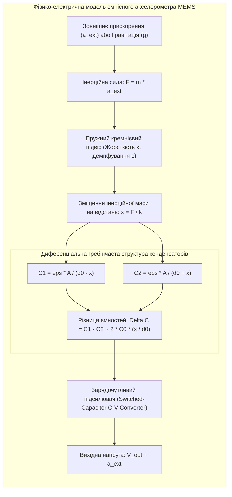

# Змістовий модуль 2. Апаратне та програмне забезпечення Edge-рівня

# Тема 7. Інтелектуальні сенсори та системи збору даних

---

## 7.1. Класифікація та АЦП/ЦАП перетворення

### Основний зміст та теоретичний базис

Первинною ланкою будь-якої кіберфізичної системи та екосистеми Інтернету речей є сенсорний вузол, який виконує функцію взаємодії між матеріальним фізичним середовищем та цифровим простором обчислювача. Відповідно до положень метрології та теорії вимірювальних перетворювачів, класичний **сенсор** (або первинний вимірювальний перетворювач) є пристроєм, що безпосередньо сприймає вимірювану фізичну величину та трансформує її у відповідний інформаційний електричний або механічний сигнал. 

Проте сучасні вимоги до граничних вузлів IoT зумовили еволюцію первинних давачів у повнофункціональні **інтелектуальні сенсори** (Smart Sensors). Інтелектуальний сенсорний комплекс об'єднує на рівні модуля або кристала чутливий первинний елемент, аналоговий інтерфейсний блок нормування сигналу (Analog Front-End, AFE), аналого-цифровий перетворювач (АЦП), мікроконтролерне процесорне ядро з підсистемою цифрової обробки сигналів (DSP), енергонезалежну пам'ять калібрувальних коефіцієнтів та стандартний цифровий мережевий інтерфейс.

```mermaid
flowchart LR
    subgraph PhysicalDomain["Фізичний домен"]
        Measurand["Вимірювана фізична величина: Температура, Тиск, Прискорення"]
    end

    subgraph SmartSensorModule["Архітектура інтелектуального сенсора (Smart Sensor)"]
        SensorElem["Чутливий елемент: П'єзорезистивний, Ємнісний, Оптичний"]
        AFE["Блок нормування сигналу AFE: Підсилювач, ФНЧ, Схема зміщення"]
        ADC_Block["Аналого-цифровий перетворювач: SAR / Sigma-Delta АЦП"]
        DSP_Core["Мікроконтролерне ядро DSP: Калібрування, Фільтрація, Лінеаризація"]
        CalibMem["Пам'ять констант калібрування: EEPROM / OTP"]
        BusInterface["Цифровий інтерфейс зв'язку: I2C, SPI, UART, CAN"]
    end

    subgraph CyberDomain["Цифровий світ (Edge / Gateway)"]
        EdgeNode["Шлюз або Edge-контролер: ESP32 / Industrial Gateway"]
    end

    Measurand -->|Фізичний вплив| SensorElem
    SensorElem -->|Слабкий аналоговий сигнал| AFE
    AFE -->|Нормована напруга| ADC_Block
    ADC_Block -->|Сирий двійковий код| DSP_Core
    CalibMem <-->|Коефіцієнти| DSP_Core
    DSP_Core -->|Очищені інженерні дані| BusInterface
    BusInterface ===|Цифрова шина| EdgeNode
```


*Рисунок 1 — Структурно-функціональна схема інтелектуального сенсора з інтегрованим трактом аналого-цифрового перетворення та цифрової обробки сигналів*

Повноцінний тракт перетворення, представлений на рисунку 1, забезпечує автономне виконання процедур первинної валідації та масштабування даних ще до моменту формування вихідного мережевого кадру.

Класифікація сенсорних пристроїв у системах Інтернету речей здійснюється за низкою базових ознак:

За фізичною природою вимірюваного параметра сенсори поділяються на механічні (давачі лінійного та кутового переміщення, тиску, сили, деформації, вібрації, швидкості потоку), теплові (термопари, терморезистори NTC/PTC, платинові термоперетворювачі опору Pt100/Pt1000, пірометри), оптичні (фотодіоди, фоторезистори, фототранзистори, матриці ПЗЗ та CMOS), акустичні (п'єзоелектричні та ємнісні мікрофони, гідрофони, ультразвукові сенсори відстані), хімічні та електрохімічні (давачі концентрації газів $CO_2$, $CO$, $CH_4$, сенсори вологості, pH-метри, датчики каламутності води), а також магнітні (давачі на ефекті Холла, магніторезистивні структури AMR/GMR).

За енергетичним принципом функціонування виділяють генераторні (активні) та параметричні (пасивні) перетворювачі. Генераторні сенсори здійснюють пряму конвертацію енергії вимірюваного фізичного процесу в електричний сигнал без використання додаткового джерела живлення (термоелектричні перетворювачі на ефекті Зеєбека, п'єзоелектричні датчики динамічного тиску, фотоелементи). Параметричні сенсори перетворюють зміну вимірюваного параметра на зміну власного пасивного електричного параметра — активного опору $R$, індуктивності $L$ або ємності $C$, вимагаючи обов'язкового підключення зовнішнього джерела стабілізованої напруги або струму.

За способом подання вихідної інформації розрізняють аналогові прилади (вихідна напруга або струм змінюються неперервно пропорційно вхідному сигналу), бінарні/дискретні сенсори (формують релейний сигнал двох рівнів, наприклад «сухий контакт» або логічні рівні $0/1$ при досягненні порогу спрацювання) та цифрові інтелектуальні прилади (передають закодовані дані у вигляді слів фіксованої розрядності по послідовних шинах).

За просторовою дискретизацією виділяють точкові (скалярні) сенсори, лінійні одновимірні масиви (1D-лінійки фотодіодів сканерів), матричні двовимірні структури (2D-матриці відеокамер або тепловізорів) та об'ємні багатошарові сенсорні комплекси (3D-детектори).

Для інтеграції аналогових сенсорів у цифрову мікроконтролерну систему застосовуються **аналого-цифрові перетворювачі** (АЦП, ADC). Процес аналого-цифрового перетворення складається з трьох послідовних фізико-математичних етапів: дискретизації за часом, квантування за рівнем та цифрового кодування.

Дискретизація неперервного сигналу $x(t)$ за часом підпорядковується фундаментальній **теоремі Котельникова-Шеннона (Найквіста)**, згідно з якою для однозначного та точного відновлення аналогового сигналу зі скінченним спектром без втрати інформації частота дискретизації $f_s$ повинна щонайменше вдвічі перевищувати найвищу значущу гармонічну складову вхідного спектра $f_{max}$:

$$f_s \ge 2 \cdot f_{max}$$

Якщо зазначена умова порушується ($f_s < 2 f_{max}$), виникає явище накладання спектрів (**аліасинг**, Aliasing), за якого високочастотні компоненти сигналу дзеркально відображаються в область низьких частот, утворюючи непереборні паразитні спотворення. Для запобігання аліасингу перед входом АЦП завжди встановлюють аналоговий фільтр низьких частот (Anti-Aliasing Filter) із крутим спадом амплітудно-частотної характеристики.

Квантування за рівнем полягає в заміні неперервної множини амплітуд сигналу дискретним набором фіксованих значень. Квант перетворення (крок квантування, вага молодшого значущого розряду **LSB**, Least Significant Bit) для $N$-розрядного АЦП із діапазоном повної шкали напруги опорного джерела $V_{ref}$ визначається виразом:

$$q = \text{LSB} = \frac{V_{ref}}{2^N}$$

де $q$ позначає мінімальну зміну вхідної напруги, яку здатний зафіксувати перетворювач, вимірювану у вольтах (В); $V_{ref}$ є стабілізованою опорною напругою перетворення (В); $N$ позначає розрядність АЦП у бітах.

Ідеальний процес квантування породжує неминучу методичну похибку — шум квантування $e_q(t)$, абсолютне значення якого не перевищує половини кванта ($|e_q(t)| \le q/2$). 

Теоретичне відношення сигнал/шум квантування (**SQNR**, Signal-to-Quantization-Noise Ratio) для гармонічного сигналу повної шкали зв'язане з розрядністю $N$ логарифмічною залежністю:

$$\text{SQNR} = 6{,}02 \cdot N + 1{,}76\text{ дБ}$$

Кожен додатковий біт розрядності АЦП покращує динамічний діапазон вимірювального тракту приблизно на $6\text{ дБ}$ ($20 \lg(2) \approx 6{,}02$). Наприклад, для 12-бітного АЦП мікроконтролера ESP32 теоретичний поріг SQNR становить $74\text{ дБ}$, тоді як для прецизійного 24-бітного дельта-сигма АЦП він сягає $146{,}24\text{ дБ}$.

Зворотне перетворення цифрового керуючого коду $D$ у вихідну пропорційну напругу $V_{out}$ забезпечують **цифро-аналогові перетворювачі** (ЦАП, DAC). Вихідна напруга $M$-розрядного ЦАП розраховується за формулою:

$$V_{out} = V_{ref} \cdot \frac{D}{2^M} = V_{ref} \cdot \sum_{i=1}^{M} b_i \cdot 2^{-i}$$

де $D = \sum_{i=1}^{M} b_i \cdot 2^{M-i}$ позначає десятковий еквівалент вхідного двійкового слова; $b_i \in \{0, 1\}$ є бітами двійкового коду; $M$ позначає розрядність ЦАП (наприклад, $M = 8$ для вбудованих ЦАП контролера ESP32 на виводах GPIO25 та GPIO26).

| Архітектура АЦП | Типова розрядність ($N$) | Швидкодія (Частота $f_s$) | Енергоспоживання | Сфера застосування в системах IoT |
| :--- | :--- | :--- | :--- | :--- |
| **Послідовного наближення (SAR ADC)** | $10 \dots 16\text{ бітів}$ | $100\text{ квиб/с} \dots 5\text{ Мвиб/с}$ | Середнє ($0{,}1 \dots 2\text{ мВт}$) | Вбудовані АЦП мікроконтролерів (ESP32, STM32), універсальні сенсори |
| **Дельта-Сигма ($\Sigma\Delta$ ADC)** | $16 \dots 24\text{ біти}$ | $10\text{ виб/с} \dots 100\text{ квиб/с}$ | Низьке ($0{,}05 \dots 1\text{ мВт}$) | Прецизійні вимірювання (тензометричні ваги, термопари, сейсмографи) |
| **Паралельного перетворення (Flash ADC)** | $6 \dots 8\text{ бітів}$ | $100\text{ Мвиб/с} \dots 5\text{ Гвиб/с}$ | Високе ($50 \dots 500\text{ мВт}$) | Радари, осцилографи, високошвидкісні радіоінтерфейси прямої оцифровки |
| **Подвійного інтегрування (Dual-Slope)** | $12 \dots 18\text{ бітів}$ | $1 \dots 50\text{ виб/с}$ | Дуже низьке | Мультиметри, стаціонарні повільні системи повірки з високим придушенням $50\text{ Гц}$ |

Порівняльний аналіз таблиці підтверджує, що в архітектурах Інтернету речей домінують структури SAR (завдяки оптимальному компромісу між швидкістю, розрядністю та енергоспоживанням) та Sigma-Delta (за необхідності досягнення максимальної метрологічної точності).

---

## 7.2. Датчики MEMS

### Основний зміст та теоретичний базис

Революційним технологічним проривом у створенні компактних сенсорних вузлів стало освоєння виробництва **мікроелектромеханічних систем** (**MEMS**, Micro-Electro-Mechanical Systems). Технологія MEMS є міждисциплінарним напрямом мікросистемної техніки, що поєднує методи прецизійної мікрообробки напівпровідникових кремнієвих пластин (об'ємне та поверхневе плазмохімічне травлення DRIE, фотолітографію, осадження тонких плівок, анодне зрощування) із класичною схемотехнікою інтегральних мікросхем. 

Завдяки цьому на єдиній монокристалічній підкладці площею в кілька квадратних міліметрів вдається одночасно формувати як мініатюрні механічні рухомі структури (пружні підвіси, інерційні маси, мембрани, резонатори, мікроконсолі, гребінчасті структури конденсаторів), так і інтегровані електронні підсилювачі, АЦП та цифрові сигнальні процесори.

Серед широкого спектра приладів MEMS у прикладних застосуваннях Інтернету речей наймасовішими є триосьові акселерометри, гіроскопи, барометричні датчики абсолютного тиску, кремнієві мікрофони та інтелектуальні інерціальні вимірювальні модулі (**IMU**, Inertial Measurement Unit).


*Рисунок 2 — Схема перетворення механічного прискорення в електричний сигнал у ємнісному MEMS-акселерометрі*

Принцип функціонування триосьового ємнісного акселерометра MEMS, поданий на рисунку 2, базується на законах класичної механіки Ньютона та електростатики. Рухома інерційна кремнієва маса $m$ утримується пружними кремнієвими балками з коефіцієнтом жорсткості $k$. Під дією зовнішнього прискорення $a_{ext}$ (або проекції вектора гравітаційного прискорення вільного падіння $g \approx 9{,}81\text{ м/с}^2$) на масу діє сила інерції $F = m \cdot a_{ext}$, що викликає її просторове зміщення на величину $x$ від положення рівноваги. 

Рухома маса має гребінчасті виступи, які входять у зачеплення з нерухомими електродами підкладки, утворюючи систему диференціальних мікроконденсаторів із початковим міжелектродним зазором $d_0$.

Динаміка механічної системи акселерометра описується лінійним диференціальним рівнянням другого порядку для коливань із демпфуванням:

$$m \cdot \frac{d^2 x(t)}{dt^2} + c \cdot \frac{dx(t)}{dt} + k \cdot x(t) = m \cdot a_{ext}(t)$$

де $m$ позначає масу сейсмічного тіла (кг); $c$ є коефіцієнтом в'язкого механічного демпфування середовища (газового наповнення герметичної камери мікросхеми, вимірюваним у $\text{Н·с/м}$); $k$ визначає коефіцієнт жорсткості кремнієвого підвісу ($\text{Н/м}$); $x(t)$ є лінійним зміщенням маси відносно корпусу (м); $a_{ext}(t)$ позначає вимірюване прискорення ($\text{м/с}^2$).

У квазістатичному режимі ($\ddot{x} \approx 0, \dot{x} \approx 0$) зміщення маси пропорційне прикладеному прискоренню: $x = \frac{m}{k} a_{ext}$. Відповідно, різниця ємностей диференціальної структури $\Delta C = C_1 - C_2$ описується виразом:

$$\Delta C = \varepsilon_0 \varepsilon_r A \left( \frac{1}{d_0 - x} - \frac{1}{d_0 + x} \right) = \frac{2 \varepsilon_0 \varepsilon_r A \cdot x}{d_0^2 - x^2} \approx \frac{2 C_0}{d_0} \cdot x = \left( \frac{2 C_0 m}{d_0 k} \right) \cdot a_{ext}$$

де $\varepsilon_0 = 8{,}85 \cdot 10^{-12}\text{ Ф/м}$ є електричною сталою вакууму; $\varepsilon_r$ позначає відносну діелектричну проникність газу в порожнині; $A$ є площею перекриття гребінчастих обкладинок (${\text{м}}^2$); $d_0$ позначає початковий зазор між пластинами у стані спокою ($x = 0$); $C_0 = \varepsilon_0 \varepsilon_r A / d_0$ є базовою статичною ємністю секції. Спеціалізований комутований ємнісний підсилювач (Switched-Capacitor Circuit) перетворює малу різницю ємностей $\Delta C$ (порядку фемтофарад, $10^{-15}\text{ Ф}$) у пропорційний вихідний двійковий код.

Принцип роботи триосьового **MEMS-гіроскопа** ґрунтується на вимірюванні сили Коріоліса $\vec{F}_C$. Внутрішня маса гіроскопа примусово приводиться у стан неперервних високочастотних коливань уздовж первинної осі збудження з лінійною швидкістю $\vec{v}$. Під час обертання корпусу приладу навколо перпендикулярної осі з кутовою швидкістю $\vec{\Omega}$ виникає сила Коріоліса:

$$\vec{F}_C = 2 m \left( \vec{v} \times \vec{\Omega} \right)$$

де $\vec{F}_C$ позначає вектор сили Коріоліса (Н); $\vec{v}$ є вектором миттєвої швидкості первинного збудженого коливального руху маси (м/с); $\vec{\Omega}$ визначає вимірювану векторну кутову швидкість обертання об'єкта (рад/с). Сила Коріоліса зміщує масу вздовж третьої ортогональної осі чутливості, викликаючи вторинні коливання, амплітуда яких реєструється ємнісним сенсором.

Сучасні інерціальні модулі (наприклад, мікросхема **MPU-6050**) містять на одному кристалі 3-осьовий акселерометр, 3-осьовий гіроскоп, датчик температури кристала та спеціалізований вбудований апаратний співпроцесор обробки руху (**DMP**, Digital Motion Processor). 

Співпроцесор DMP апаратно реалізує алгоритми комплексування даних (Sensor Fusion), усуваючи з основного процесора ESP32 обчислювальне навантаження з розрахунку тривимірної орієнтації. DMP формує на виході 16-розрядні кватерніони просторової орієнтації $q = [w, x, y, z]$, які транслюються в буфер FIFO мікросхеми та зчитуються по шині I2C.

Для об'єднання високочастотних сигналів гіроскопа (який має швидкий відгук, але страждає від низькочастотного інтегрального дрейфу нуля) та низькочастотних сигналів акселерометра (який точно визначає статичний кут нахилу відносно вектора гравітації, але чутливий до динамічних вібрацій) на мікроконтролері реалізується алгоритм **комплементарного фільтра** (Complementary Filter). 

Розрахунок оцінки кута нахилу $\theta_{est}[k]$ на $k$-му кроці дискретизації здійснюється за формулою:

$$\theta_{est}[k] = \alpha \cdot \left( \theta_{est}[k-1] + \omega_{gyro}[k] \cdot \Delta t \right) + (1 - \alpha) \cdot \theta_{acc}[k]$$

де $\omega_{gyro}[k]$ позначає кутову швидкість, виміряну гіроскопом (град/с); $\Delta t$ є періодом дискретизації вимірювального циклу (с); $\theta_{acc}[k] = \text{atan2}(a_y, a_z) \cdot \frac{180}{\pi}$ визначає кут нахилу, розрахований за даними векторних проекцій прискорення $a_y, a_z$; $\alpha$ позначає безрозмірний ваговий коефіцієнт фільтрації ($0{,}90 \le \alpha \le 0{,}98$), який обчислюється через часову сталу фільтра $\tau$ як $\alpha = \frac{\tau}{\tau + \Delta t}$.

| Клас датчика MEMS | Вимірюваний параметр | Фізичний принцип перетворення | Чутливість та розрядність | Застосування в прикладних IoT проєктах |
| :--- | :--- | :--- | :--- | :--- |
| **Акселерометр (напр. ADXL345)** | Лінійне прискорення по 3 осях ($X, Y, Z$) | Диференціальна ємність інерційної маси | До $13\text{ бітів}$, $\pm 2g \dots \pm 16g$ ($3{,}9\text{ мг/LSB}$) | Вібродіагностика моторів, трекери активності, детектування падіння |
| **Гіроскоп (напр. L3GD20)** | Кутова швидкість по 3 осях | Ємнісне детектування сили Коріоліса | $16\text{ бітів}$, $\pm 250 \dots \pm 2000^\circ\text{/с}$ | Автопілоти дронів, стабілізація камер, робототехніка |
| **Барометр / Висотомір (BMP280)**| Абсолютний атмосферний тиск | П'єзорезистивний міст кремнієвої мембрани | $24\text{ біти}$, $300 \dots 1100\text{ гПа}$ ($\pm 0{,}12\text{ гПа}$) | Метеостанції, навігація всередині будівель (визначення поверху) |
| **Мікрофон (SPH0645LM4H)** | Акустичні коливання тиску повітря | Ємнісна мембрана з прямим інтерфейсом I2S | $24\text{ біти}$, $50\text{ Гц} \dots 15\text{ кГц}$, SNR $65\text{ дБ}$ | Голосове управління, акустичний моніторинг промислових шумів |
| **Газовий сенсор (BME680)** | Опір летких органічних сполук (VOC) | Хеморезистивний шар оксиду металу (MOX) | $20\text{ бітів}$, індекс якості повітря IAQ | Системи HVAC, моніторинг безпеки шахт і складів |

Зведена таблиця доводить універсальність технології MEMS: завдяки напівпровідниковому масштабуванню складні механічні прилади перетворилися на малогабаритні компоненти для поверхневого монтажу (SMD) з наднизьким енергоспоживанням (одиниці мікроампер).

---

## 7.3. Специфіка збору даних у реальному часі та цифрова обробка сигналів

### Основний зміст та теоретичний базис

Отримання масивів первинних даних від сенсорів мікроконтролерними вузлами в реальному часі ускладнюється впливом зовнішніх електромагнітних завад, шумів квантування АЦП, випадкових апаратних збоїв та нестабільності ліній зв'язку. Пряма відправка невідфільтрованих «сирих» показів у бездротовий канал Wi-Fi чи MQTT-топіки є неприпустимою, оскільки це створює надлишковий паразитний трафік, перевантажує брокери повідомлень та генерує хибні спрацьовування в системах автоматизації. 

З огляду на це, обов'язковим завданням граничного програмного забезпечення є побудова локального тракту **цифрової обробки сигналів** (**DSP**, Digital Signal Processing), який здійснює калібрування, температурну компенсацію, статистичну фільтрацію та вилучення корисних ознак безпосередньо в оперативній пам'яті мікроконтролера.

```mermaid
flowchart TD
    subgraph EdgeDSPPipeline["Тракт цифрової обробки сигналів на мікроконтролері ESP32"]
        RawInput["Оцифровані сирі відліки АЦП / Сенсора: x[k] (Частота fs)"]
        
        subgraph Stage1["Етап 1: Калібрування та лінеаризація"]
            LinearCalib["Корекція зміщення нуля та масштабу: x_cal = a * x_raw + b"]
            TempComp["Температурна компенсація дрейфу характеристик"]
        end

        subgraph Stage2["Етап 2: Цифрова фільтрація"]
            MedianFilt["Медіанний фільтр 3-5 порядку (Усунення імпульсних викидів)"]
            LowPassFilt["Фільтр експоненційного згладжування EMA або Фільтр Калмана"]
        end

        subgraph Stage3["Етап 3: Компресія та формування подій"]
            DeadbandCheck{"Перевірка зони нечутливості: |y[k] - y_last| >= Delta ?"}
            FeatureExtract["Розрахунок агрегатів: RMS, дисперсія, мінімум, максимум"]
        end

        NetworkOut["Формування MQTT JSON-пакета та відправка в мережу"]
        DropSample["Ігнорування надлишкового відліку (Зниження трафіку)"]
    end

    RawInput --> LinearCalib
    LinearCalib --> TempComp
    TempComp --> MedianFilt
    MedianFilt --> LowPassFilt
    LowPassFilt --> DeadbandCheck
    LowPassFilt --> FeatureExtract
    DeadbandCheck -->|Так (Зміна зафіксована)| NetworkOut
    DeadbandCheck -->|Ні (Значення стабільне)| DropSample
    FeatureExtract --> NetworkOut
```
*Рисунок 3 — Повний конвеєр алгоритмів цифрової фільтрації, лінеаризації та адаптивного проріджування даних на рівні Edge*

На рисунку 3 представлено послідовну реалізацію алгоритмічного конвеєра обробки. Першим етапом є **калібрування та лінеаризація**. Залежність між вхідною напругою та реальними інженерними одиницями вимірювання часто має нелінійний характер. 

Для лінійних сенсорів застосовується двоточкова калібрувальна модель корекції зміщення нуля (**Offset**) та чутливості (**Gain**):

$$X_{cal}[k] = K_{gain} \cdot X_{raw}[k] + X_{offset}$$

де $X_{raw}[k]$ позначає безрозмірний двійковий код вимірювання на виході АЦП; $K_{gain}$ є масштабуючим коефіцієнтом чутливості; $X_{offset}$ є коригувальним значенням зміщення нульового рівня.

Для суттєво нелінійних сенсорів (наприклад, напівпровідникових терморезисторів NTC) аналітична апроксимація температурної залежності виконується за поліноміальним рівнянням **Стейнхарта-Харта**:

$$\frac{1}{T} = A + B \cdot \ln(R_t) + C \cdot \left(\ln(R_t)\right)^3$$

де $T$ позначає абсолютну температуру вимірюваного середовища в Кельвінах (К); $R_t$ є миттєвим електричним опором NTC-терморезистора (Ом), розрахованим за значенням падіння напруги; $A, B, C$ є унікальними експериментальними коефіцієнтами конкретного типу напівпровідникової структури.

Другим етапом конвеєра є **цифрова фільтрація шумів**. У граничних мікроконтролерних системах застосовується комбінація нелінійних та лінійних фільтрів. Для гарантованого придушення поодиноких імпульсних завад (Spikes), спричинених комутаційними процесами силового обладнання або збоями шини зв'язку, використовується **медіанний фільтр** (Median Filter). Алгоритм медіанного фільтра непарного порядку $W$ формує вибірку з останніх $W$ відліків, здійснює їх числове ранжування за зростанням та обирає центральний елемент варіаційного ряду, повністю відсікаючи аномальні викиди без спотворення фронтів корисного сигналу.

Для придушення високочастотного гаусового шуму застосовується рекурсивний цифровий фільтр низьких частот першого порядку — **експоненційне ковзне середнє** (**EMA**, Exponential Moving Average):

$$y[k] = \alpha \cdot x[k] + (1 - \alpha) \cdot y[k-1]$$

де $y[k]$ позначає згладжене вихідне значення на поточному $k$-му кроці розрахунку; $x[k]$ є вхідним каліброваним відліком вимірювання; $y[k-1]$ позначає результат фільтрації на попередньому кроці; $\alpha$ є безрозмірним коефіцієнтом згладжування ($0 < \alpha \le 1$).

Зв'язок коефіцієнта згладжування $\alpha$ з часовою сталою еквівалентного аналогового RC-фільтра $\tau$ та частотою зрізу $f_c$ (Гц) при періоді дискретизації $\Delta t = 1/f_s$ задається аналітичним співвідношенням:

$$\alpha = \frac{\Delta t}{\tau + \Delta t} = \frac{2\pi f_c \Delta t}{1 + 2\pi f_c \Delta t}$$

Для прецизійної оцінки динамічного стану об'єкта в умовах високого рівня випадкових шумів вимірювання та внутрішніх шумів системи застосовується одновимірний **дискретний фільтр Калмана** (Kalman Filter). 

Алгоритм виконується циклічно у дві фази:

Фаза екстраполяції (прогнозування стану на наступний крок):

$$\hat{x}_k^- = \hat{x}_{k-1}$$

$$P_k^- = P_{k-1} + Q$$

Фаза корекції (оновлення оцінки за новим вимірюванням $z_k$):

$$K_k = \frac{P_k^-}{P_k^- + R}$$

$$\hat{x}_k = \hat{x}_k^- + K_k \cdot \left( z_k - \hat{x}_k^- \right)$$

$$P_k = (1 - K_k) \cdot P_k^-$$

де $\hat{x}_k^-$ та $\hat{x}_k$ позначають апопріорну та апостеріорну оцінки фізичної величини на кроці $k$; $P_k^-$ та $P_k$ є дисперсіями похибки оцінки відповідно до і після врахування нового вимірювання; $Q$ позначає дисперсію шуму технологічного процесу; $R$ позначає дисперсію шуму вимірювального каналу (коваріацію похибки сенсора); $K_k$ є оптимальним коефіцієнтом підсилення Калмана ($0 \le K_k \le 1$), який автоматично балансує ступінь довіри між математичною моделлю динаміки та показами фізичного датчика.

Третім етапом є **адаптивне проріджування даних** на основі контролю зони нечутливості (**Deadband Compression**). Мікроконтролер відправляє сформований пакет публікації в мережу виключно за умови, якщо абсолютна різниця між поточним відфільтрованим значенням $y[k]$ та значенням останньої успішної трансляції $y_{last}$ перевищує встановлений поріг дельти $\Delta_{th}$:

$$|y[k] - y_{last}| \ge \Delta_{th}$$

Такий підхід зменшує кількість сеансів передачі по каналах Wi-Fi/MQTT у статичних режимах технологічного процесу на $90\dots 98\%$, звільняючи радіоефір та продовжуючи термін автономної експлуатації вузла.

| Алгоритм цифрової фільтрації | Обчислювальна складність | Витрати пам'яті RAM | Фазова затримка сигналу | Ефективність придушення завад |
| :--- | :--- | :--- | :--- | :--- |
| **Просте ковзне середнє (SMA, вікно $W$)** | $O(1)$ при кільцевому буфері | $W$ комірок пам'яті | Фіксована: $\frac{W-1}{2}$ тактів | Ефективне для періодичних завад $50\text{ Гц}$ |
| **Експоненційне згладжування (EMA / IIR)** | $O(1)$ (дві операції множення) | 1 комірка пам'яті | Залежить від $\alpha$: $\tau \approx \frac{\Delta t}{\alpha}$ | Високе згладжування білого шуму |
| **Медіанний фільтр ($W$ непарне)** | $O(W \log W)$ або $O(W^2)$ | $W$ комірок пам'яті | Фіксована: $\frac{W-1}{2}$ тактів | Ідеальне для імпульсних спайків та викидів |
| **Дискретний фільтр Калмана (1D)** | $O(1)$ (5 простих операцій) | 3 комірки ($P, Q, R$) | Мінімальна динамічна затримка | Оптимальне статистичне відновлення сигналу |

Порівняння алгоритмів свідчить, що комбінація триточкового медіанного фільтра та фільтра EMA реалізується мінімальним набором процесорних інструкцій мікроконтролера ESP32, забезпечуючи високу якість вимірювального тракту без залучення ресурсів зовнішніх серверів.

---

### Питання для самоперевірки та аналітичного осмислення

1. Розкрийте системні та алгоритмічні відмінності між класичним первинним вимірювальним перетворювачем та інтелектуальним сенсором (Smart Sensor) у вузлах Інтернету речей.
2. На основі теореми Котельникова-Шеннона та формули шуму квантування SQNR поясніть фізичні наслідки зменшення частоти дискретизації $f_s$ нижче подвоєної максимальної частоти спектра сигналу $f_{max}$. Яку роль відіграє аналоговий фільтр Anti-Aliasing?
3. Детально опишіть фізичний принцип перетворення лінійного прискорення в електричний сигнал у ємнісному MEMS-акселерометрі на основі диференціальної гребінчастої структури.
4. Поясніть механізм виникнення сили Коріоліса в кремнієвих структурах MEMS-гіроскопів. Чому для стабільної оцінки просторової орієнтації рухомих об'єктів необхідне комплексування даних акселерометра та гіроскопа за допомогою комплементарного фільтра?
5. Які переваги надає апаратний цифровий процесор руху DMP (Digital Motion Processor), інтегрований у структуру сучасних IMU-модулів (наприклад, MPU-6050), для розвантаження обчислювальних ядер мікроконтролера ESP32?
6. Виведіть співвідношення між коефіцієнтом згладжування $\alpha$ фільтра EMA, інтервалом дискретизації $\Delta t$ та частотою зрізу $f_c$ еквівалентного низькочастотного фільтра. Яким чином вибір значення $\alpha$ впливає на фазову затримку вихідного сигналу?
7. Проаналізуйте роботу фаз екстраполяції та корекції в дискретному фільтрі Калмана. Як співвідношення між дисперсією шуму процесу $Q$ та дисперсією шуму вимірювання $R$ визначає величину вагового коефіцієнта підсилення Калмана $K_k$?