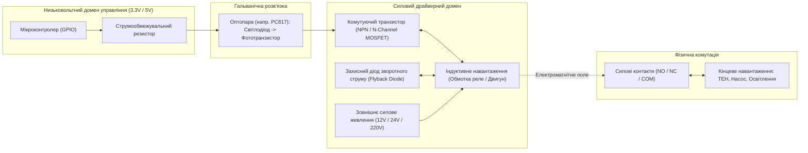
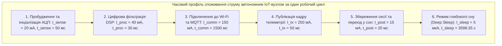
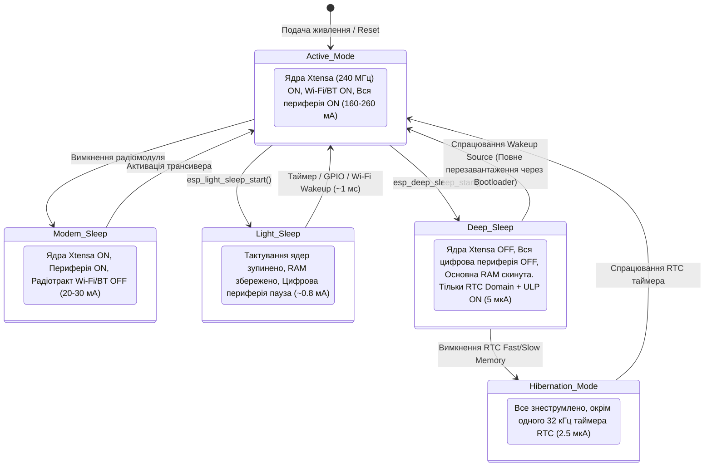

# Змістовий модуль 2. Апаратне та програмне забезпечення Edge-рівня

# Тема 8. Виконавчі пристрої та оптимізація енергоспоживання

---

## 8.1. Актуатори та реле в ІоТ

### Основний зміст та теоретичний базис

Кінцевою метою функціонування будь-якої кіберфізичної системи є не лише моніторинг параметрів навколишнього середовища, а й активний вплив на керований об'єкт. Цю функцію реалізують **виконавчі пристрої** (**актуатори**, Actuators), які перетворюють цифрові або низьковольтні аналогові керуючі сигнали мікроконтролера в механічний рух, теплову енергію, світловий потік або зміну стану гідравлічних і пневматичних магістралей. У прикладних вузлах Інтернету речей наймасовішими виконавчими компонентами є електромагнітні та твердотільні реле, сервоприводи, крокові двигуни та колекторні двигуни постійного струму.

Під час сполучення мікроконтролерів (наприклад, ESP32 з рівнями логіки $3{,}3\text{ В}$ або Arduino Uno з рівнями $5\text{ В}$) із силовими виконавчими механізмами виникає фундаментальна інженерна проблема узгодження за напругою, струмом і гальванічною розв'язкою. Вихідні лінії портів загального призначення (GPIO) мікроконтролерів здатні віддавати в навантаження струм не більше $12\dots 40\text{ мА}$, тоді як обмотки електромагнітних реле споживають від $50$ до $200\text{ мА}$, а електродвигуни — від сотень міліампер до десятків ампер.


*Рисунок 1 — Принципова структурна схема оптоелектронно ізольованого драйвера індуктивного навантаження*

На рисунку 1 наведено класичну схему безпечного підключення індуктивного навантаження (обмотки реле). Гальванічна розв'язка на базі оптопари повністю усуває прямий електричний зв'язок між чутливим цифровим ядром мікроконтролера та силовим контуром. Це запобігає проникненню високочастотних імпульсних завад та синфазних стрибків напруги. 

Обов'язковим елементом схеми керування будь-яким індуктивним навантаженням (реле, соленоїди, двигуни) є **захисний діод зворотного струму** (**Flyback Diode**), підключений паралельно індуктивності у зворотному напрямку. У момент раптового розмикання комутуючого транзистора відповідно до закону електромагнітної індукції Фарадея в обмотці з індуктивністю $L$ виникає електрорушійна сила (ЕРС) самоіндукції:

$$V_{spike} = -L \cdot \frac{di}{dt}$$

де $V_{spike}$ позначає величину стрибка напруги самоіндукції, вимірювану у вольтах (В); $L$ є індуктивністю котушки реле або обмотки двигуна, вираженою в генрі (Гн); $\frac{di}{dt}$ позначає швидкість спадання струму в колі в момент відключення (А/с). 

Оскільки час вимикання транзистора $dt$ вимірюється наносекундами, амплітуда $V_{spike}$ може сягати сотень або тисяч вольт, що за відсутності захисного діода неминуче спричиняє лавинний пробій вихідного каскаду транзистора. Захисний діод фіксує потенціал на рівні напруги живлення, замикаючи струм самоіндукції всередині котушки до моменту його повного теплового розсіювання на активному опорі проводу.

Для комутації силових кіл змінного струму поряд з електромеханічними реле застосовують **твердотільні реле** (**SSR**, Solid-State Relay). Вони побудовані на базі силових оптосімісторів (Triac) або зустрічно увімкнених MOSFET-транзисторів. Твердотільні реле позбавлені рухомих механічних контактів, тому вони не створюють електричної дуги, характеризуються безшумністю, підтримують високу частоту комутації та мають необмежений ресурс спрацьовувань. 

Крім того, більшість промислових SSR містять внутрішню схему детектування переходу напруги через нуль (**Zero-Crossing Circuit**), яка дозволяє вмикати навантаження виключно в момент нульової фази синусоїди, що радикально знижує пускові струми та електромагнітні завади в мережі.

Для керування реверсивним рухом колекторних двигунів постійного струму застосовують схемотехнічну конфігурацію **H-моста** (H-Bridge), реалізовану в інтегральних драйверах (наприклад, L298N, TB6612FNG, DRV8833). Швидкість обертання вала регулюється методом широтно-імпульсної модуляції (**ШІМ**, PWM). 

Середня напруга, що прикладається до двигуна $V_{avg}$, визначається коефіцієнтом заповнення ШІМ-сигналу $D$:

$$V_{avg} = D \cdot V_{supply} = \frac{t_{on}}{T_{pwm}} \cdot V_{supply} = \frac{t_{on}}{t_{on} + t_{off}} \cdot V_{supply}$$

де $V_{supply}$ позначає напругу силового джерела живлення двигуна (В); $t_{on}$ є тривалістю імпульсу у відкритому стані ключа (с); $t_{off}$ є тривалістю паузи (с); $T_{pwm}$ позначає період генерації сигналу ШІМ (с).

Для завдань прецизійного кутового позиціонування (поворот заслінок повітропроводів, керування положенням сонячних панелей, позиціонування камер) застосовують **сервоприводи** та **крокові двигуни**. Сервоприводи керуються спеціалізованим імпульсним протоколом із фіксованим періодом повторення $T_{pwm} = 20\text{ мс}$ (частота $50\text{ Гц}$). 

Кут повороту вихідного вала однозначно задається тривалістю позитивного імпульсу $t_{pulse}$: імпульс тривалістю $1{,}0\text{ мс}$ відповідає куту $0^\circ$, тривалість $1{,}5\text{ мс}$ встановлює вал у нейтральне положення $90^\circ$, а тривалість $2{,}0\text{ мс}$ розвертає механізм на повний кут $180^\circ$. Крокові двигуни (наприклад, чотирифазний 28BYJ-48 з редуктором 1:48) потребують послідовного перемикання обмоток за допомогою транзисторних масивів Дарлінгтона (ULN2003A), забезпечуючи дискретний крок повороту ротора.

| Тип виконавчого пристрою | Принцип функціонування | Час спрацьовування | Комутована потужність | Переваги та обмеження в IoT |
| :--- | :--- | :--- | :--- | :--- |
| **Електромеханічне реле (EMR)** | Замикання рухомих контактів магнітним полем котушки | $5 \dots 15\text{ мс}$ | Дуже висока (до $10\dots 16\text{ А}$, $250\text{ В}$) | Повна гальванічна ізоляція, нульове падіння напруги; обмежений механічний ресурс, брязкіт контактів |
| **Твердотільне реле (SSR)** | Оптоелектронна комутація симістором або MOSFET | $< 1\text{ мс}$ (з детекцією нуля $\le 10\text{ мс}$) | Середня / Висока (до $10\dots 40\text{ А}$) | Відсутність зносу, безшумність, висока швидкість; падіння напруги $1\dots 1{,}5\text{ В}$, значне нагрівання |
| **Сервопривод (Servo)** | Електродвигун із вбудованим редуктором, потенціометром зворотного зв'язку та ПІД-контролером | $100 \dots 500\text{ мс}$ | Низька / Середня (момент $1\dots 20\text{ кг·см}$) | Точне позиціонування кута без зовнішніх датчиків; постійний струм споживання для утримання позиції |
| **Кроковий двигун (Stepper)** | Дискретний поворот ротора за рахунок послідовної комутації статорних обмоток | Визначається частотою кроків ($< 1\text{ кГц}$) | Середня (високий момент на низьких швидкостях) | Можливість точного позиціонування у відкритому контурі; споживає номінальний струм у стані зупинки |
| **Колекторний двигун (DC Motor)** | Безперервне обертання під дією постійної напруги через H-міст | Залежить від механічної інерції системи | Широкий діапазон (від $1\text{ Вт}$ до кількох кВт) | Простота регулювання швидкості через ШІМ; вимагає додаткових енкодерів для контролю положення |

Аналіз характеристик виконавчих пристроїв показує, що актуатори споживають основну частку потужності кіберфізичної системи, тому їх активація повинна строго дозуватися алгоритмами енергозбереження.

---

## 8.2. Профілі енергоспоживання

### Основний зміст та теоретичний базис

Проєктування автономних вузлів Інтернету речей базується на формуванні детального **бюджету енергоспоживання**. Більшість польових пристроїв функціонують в умовах відсутності стаціонарної електромережі, використовуючи первинні хімічні джерела живлення (літій-тіонілхлоридні елементи $\text{Li-SOCl}_2$, літій-діоксидмарганцеві $\text{Li-MnO}_2$, лужні елементи Alkaline) або вторинні акумулятори ($\text{Li-ion}$, $\text{LiFePO}_4$), доповнені системами збору відновлюваної енергії. 

Головна електрохімічна проблема автономного вузла криється у нелінійному характері розряду джерела. Зі зменшенням залишкової ємності та зниженням температури навколишнього середовища внутрішній опір батареї $R_{int}$ стрімко зростає. 

Під час випромінювання радіопакета модуль Wi-Fi мікроконтролера ESP32 споживає імпульсний струм до $350\text{ мА}$. Цей імпульсний струм викликає миттєве динамічне просідання напруги на клемах джерела живлення:

$$V_{term}(t) = V_{emf}(t) - I_{load}(t) \cdot R_{int}$$

де $V_{term}(t)$ позначає миттєву напругу на клемах живлення вузла (В); $V_{emf}(t)$ є внутрішньою електрорушійною силою хімічного джерела струму (В); $I_{load}(t)$ позначає струм навантаження, споживаний електронними модулями (А); $R_{int}$ є повним внутрішнім активним опором джерела струму (Ом). 

Якщо в момент передачі кадру напруга $V_{term}$ падає нижче апаратного порогу спрацьовування детектора зниження живлення мікроконтролера (Brownout Detector, зазвичай $2{,}5\dots 2{,}7\text{ В}$), процесор переходить у неконтрольоване циклічне перезавантаження, що призводить до повного порушення функціонування вузла.


*Рисунок 2 — Фазовий розподіл струмів споживання періодичного циклу вимірювання та передачі даних*

На рисунку 2 графічно відображено чергування фаз функціонування автономного вузла. Повний робочий інтервал $T_{cycle}$ складається з короткої активної фази $T_{act} = t_{sense} + t_{proc} + t_{comm} + t_{tx} + t_{post}$ та тривалої фази сну $T_{sleep}$.

Математична модель інтегральної електричної енергії $E_{cycle}$ (у джоулях), яка витрачається мікроконтролером за один повний робочий цикл, визначається кусочно-лінійним інтегруванням миттєвої потужності:

$$E_{cycle} = V_{dd} \cdot \left( I_{sense} t_{sense} + I_{proc} t_{proc} + I_{comm} t_{comm} + I_{tx} t_{tx} + I_{post} t_{post} + I_{sleep} t_{sleep} \right)$$

де $V_{dd}$ позначає стабілізовану напругу живлення схеми (В); $I_{sense}, I_{proc}, I_{comm}, I_{tx}, I_{post}$ позначають середні струми споживання відповідних фаз активного стану (А); $t_{sense}, t_{proc}, t_{comm}, t_{tx}, t_{post}$ позначають тривалості цих фаз (с); $I_{sleep}$ є струмом витоку та функціонування таймера реального часу у стані Deep Sleep (А); $t_{sleep}$ позначає тривалість пасивного інтервалу сну (с).

Середній струм споживання системи $I_{avg}$ за період циклу $T_{cycle} = T_{act} + t_{sleep}$ розраховується як:

$$I_{avg} = \frac{E_{cycle}}{V_{dd} \cdot T_{cycle}} = \frac{\sum_{j} I_j t_j}{T_{cycle}}$$

Для реалістичного прогнозування терміну автономної служби хімічного джерела струму $L_{years}$ (у роках) необхідно враховувати не лише інтегральне навантаження, але й коефіцієнт річного природного саморозряду джерела $S_{annual}$ (виражений у відносних одиницях або відсотках):

$$L_{years} = \frac{C_{nom}}{I_{avg} \cdot 8760 \cdot 1000 + C_{nom} \cdot S_{annual}}$$

де $C_{nom}$ позначає номінальну ємність батареї, виражену в міліампер-годинах (мА·год); $I_{avg}$ виражається в міліамперах (мА); константа $8760$ дорівнює кількості годин у році; $S_{annual}$ є річним коефіцієнтом саморозряду (наприклад, $S_{annual} = 0{,}01$ для $1\%$ саморозряду на рік у якісних елементів $\text{Li-SOCl}_2$ або $S_{annual} = 0{,}05$ для літій-іонних акумуляторів).

Для демонстрації впливу інтервалу передачі даних проведемо розрахунок для вузла на базі ESP32 із літієвою батареєю ємністю $C_{nom} = 2500\text{ мА·год}$ ($S_{annual} = 0{,}02$) за двох різних сценаріїв експлуатації:

Сценарій А (Публікація MQTT один раз на годину, $T_{cycle} = 3600\text{ с}$): активна фаза триває $T_{act} = 1{,}65\text{ с}$ із середнім активним струмом $I_{act} = 140\text{ мА}$, фаза глибокого сну триває $t_{sleep} = 3598{,}35\text{ с}$ зі струмом $I_{sleep} = 0{,}005\text{ мА}$ ($5\text{ мкА}$). 

Середній струм становить:

$$I_{avg\_A} = \frac{140 \cdot 1{,}65 + 0{,}005 \cdot 3598{,}35}{3600} = \frac{231 + 17{,}99}{3600} \approx 0{,}0692\text{ мА}$$

Очікуваний термін експлуатації складе:

$$L_{years\_A} = \frac{2500}{0{,}0692 \cdot 8760 + 2500 \cdot 0{,}02} = \frac{2500}{606{,}19 + 50} \approx 3{,}81\text{ року}$$

Сценарій Б (Публікація MQTT один раз на хвилину, $T_{cycle} = 60\text{ с}$): тривалості та струми активних фаз залишаються незмінними, проте фаза сну скорочується до $t_{sleep} = 58{,}35\text{ с}$. 

Середній струм зростає до:

$$I_{avg\_B} = \frac{140 \cdot 1{,}65 + 0{,}005 \cdot 58{,}35}{60} = \frac{231 + 0{,}29}{60} \approx 3{,}855\text{ мА}$$

Термін функціонування вузла в цьому режимі катастрофічно скорочується:

$$L_{years\_B} = \frac{2500}{3{,}855 \cdot 8760 + 2500 \cdot 0{,}02} = \frac{2500}{33769{,}8 + 50} \approx 0{,}074\text{ року} \approx 27\text{ діб}$$

| Тип хімічного джерела живлення | Номінальна напруга | Питома енергоємність | Рівень саморозряду | Здатність віддавати імпульсні струми | Сфера використання в IoT |
| :--- | :--- | :--- | :--- | :--- | :--- |
| **Літій-тіонілхлорид ($\text{Li-SOCl}_2$)** | $3{,}6\text{ В}$ | Дуже висока (до $650\text{ Вт·год/кг}$) | Мінімальний ($< 1\%$ на рік) | Низька (потребує паралельних суперконденсаторів HLC) | Автономні вузли з періодом передачі від годин до діб, лічильники газу/води |
| **Літій-діоксид марганцю ($\text{Li-MnO}_2$)**| $3{,}0\text{ В}$ | Висока (до $280\text{ Вт·год/кг}$) | Низький ($1\dots 2\%$ на рік) | Висока (добре витримує імпульси Wi-Fi/GSM без просідання) | Системи безпеки, трекери, розумні замки, метеорологічні зонди |
| **Літій-залізо-фосфат ($\text{LiFePO}_4$)** | $3{,}2\text{ В}$ | Середня (до $160\text{ Вт·год/кг}$) | Помірний ($2\dots 4\%$ на місяць) | Екстремально висока (струми розряду до $10C$, $2000\dots 5000$ циклів) | Системи з підзарядкою від сонячних панелей, промислові безпілотники |
| **Літій-іон / Полімер ($\text{Li-ion / Li-Po}$)**| $3{,}7\text{ В}$ | Висока (до $250\text{ Вт·год/кг}$) | Помірний ($3\dots 5\%$ на місяць) | Висока (обмежений температурний діапазон $0\dots 45^\circ\text{C}$ при заряді) | Носимі гаджети, смартфони, портативні аналізатори повітря |

Аналіз даних підтверджує, що вибір частоти генерації телеметричних пакетів має більш вагомий вплив на життєвий цикл виробу, ніж фізична ємність акумулятора.

---

## 8.3. Режими сну (Light Sleep, Deep Sleep) та пробудження по перериванням (Wake-up sources)

### Основний зміст та теоретичний базис

Головним методом забезпечення багаторічної автономності мікроконтролерних вузлів є керування внутрішніми доменами живлення та тактовими генераторами за допомогою спеціалізованих **режимів енергозбереження** (Sleep Modes). Архітектура мікроконтролера ESP32 підтримує п'ять базових режимів управління енергоспоживанням: Active Mode, Modem Sleep, Light Sleep, Deep Sleep та Hibernation.

Управління станами реалізується завдяки апаратному поділу кристала на незалежні домени живлення (**Power Domains**) та селективному відключенню тактових сигналів (**Clock Gating**).


*Рисунок 3 — Граф станів енергоспоживання мікроконтролера ESP32 та умови переходів між режимами сну*

Граф станів, наведений на рисунку 3, ілюструє глибину відключення апаратних вузлів мікроконтролера. 

Функціональні особливості кожного з режимів мають наступний зміст:

У режимі **Modem Sleep** обидва процесорні ядра Xtensa LX6 залишаються повністю активними, проте тактування та живлення радіочастотних блоків Wi-Fi та Bluetooth динамічно вимикаються у періоди між сеансами обміну. Цей режим використовується, коли мікроконтролеру необхідно виконувати складні обчислення в реальному часі або підтримувати роботу швидкісних периферійних інтерфейсів SPI/I2S, зберігаючи логічний зв'язок із точкою доступу Wi-Fi через регулярне прослуховування DTIM-маяків. Струм споживання становить $20\dots 30\text{ мА}$.

У режимі **Light Sleep** тактування процесорних ядер та більшості цифрових периферійних блоків апаратно зупиняється. Внутрішні стабілізатори напруги переводяться в режим низької потужності. Вміст усієї внутрішньої оперативної пам'яті SRAM та регістрів периферії повністю зберігається. Перевагою Light Sleep є практично миттєвий вихід у робочий стан ($< 1\text{ мс}$) без проходження процедури початкового завантаження, що дозволяє продовжувати виконання програми з тієї ж самої інструкції, на якій її було призупинено. Струм споживання зменшується до $0{,}8\text{ мА}$.

У режимі **Deep Sleep** високочастотний домен процесора, пам'ять інструкцій IRAM, пам'ять даних DRAM та всі стандартні периферійні контролери (I2C, SPI, UART, PWM) повністю знеструмлюються. Активним залишається виключно **RTC-домен** (Real-Time Clock Domain), що включає енергозберігаючий співпроцесор ULP, внутрішню пам'ять RTC Fast/Slow Memory та модуль управління пробудженням. Струм споживання кристала падає до екстремально низького рівня $5\dots 10\text{ мкА}$. 

Вихід із режиму Deep Sleep призводить до повного апаратного перезавантаження процесорних ядер через виконання системного завантажувача (Bootloader), тому звичайні змінні, розташовані у динамічній пам'яті Heap або на стеку, безповоротно втрачаються.

Для збереження значень критичних змінних (наприклад, лічильників циклів, стану калібрувальних коефіцієнтів або криптографічних сесійних ключів) під час перебування у стані Deep Sleep застосовується розміщення даних у пам'яті RTC Slow Memory обсягом $8\text{ Кбайт}$. 

У середовищі розробки ESP-IDF або Arduino IDE для цього використовується спеціальний атрибут компілятора `RTC_DATA_ATTR`:

```c
#include "esp_sleep.h"

// Змінна зберігається в енергонезалежній пам'яті RTC під час Deep Sleep
RTC_DATA_ATTR static uint32_t bootCount = 0;
RTC_DATA_ATTR static float lastKnownTemperature = 0.0f;

void app_main(void) {
    bootCount++;
    // Виконання зчитування сенсора та передачі по MQTT
    // ...
    // Налаштування таймера пробудження на 60 секунд (60 * 10^6 мікросекунд)
    esp_sleep_enable_timer_wakeup(60ULL * 1000000ULL);
    
    // Перехід у режим глибокого сну
    esp_deep_sleep_start();
}
```

Управління виходом зі стану Deep Sleep забезпечується налаштуванням **джерел пробудження** (**Wake-up Sources**), які апаратно інтегровані в контролер живлення RTC:

1. **Таймер реального часу RTC (Timer Wake-up)** активує мікроконтролер після закінчення заданого часового інтервалу, вираженого в мікросекундах (`esp_sleep_enable_timer_wakeup()`).
2. **Зовнішнє переривання EXT0 (External Wake-up 0)** дозволяє використовувати один виділений вивід класу RTC GPIO для відстеження появи заданого логічного рівня (HIGH або LOW) від зовнішнього джерела (наприклад, сигналу тривоги від цифрового компаратора чи детектора руху PIR), функція виклику: `esp_sleep_enable_ext0_wakeup(GPIO_NUM_33, 1)`.
3. **Зовнішнє переривання EXT1 (External Wake-up 1)** дозволяє контролювати стан комбінації довільної кількості виводів RTC GPIO за допомогою бітової маски (`esp_sleep_enable_ext1_wakeup()`), підтримуючи логіку пробудження за схемою «монтажного АБО» (пробудження, якщо хоча б один вивід перейшов у стан одиниці) або «монтажного І» (пробудження лише при переході всіх обраних виводів у низький стан).
4. **Сенсорні ємнісні виводи (Touch Pad Wake-up)** ініціюють пробудження при зміні власної ємності контактних майданчиків при дотику пальця людини (`esp_sleep_enable_touchpad_wakeup()`).
5. **Співпроцесор ULP (ULP Wake-up)** самостійно формує сигнал переривання для основних ядер, коли зчитані ним покази аналогових каналів виходять за межі встановленого програмного коридору безпеки.

У режимі **Hibernation** відключається навіть внутрішня пам'ять RTC Fast/Slow Memory, а живлення подається лише на один базовий лічильник повільного таймера RTC. Струм споживання при цьому знижується до рекордного значення $2{,}5\text{ мкА}$, проте система повністю втрачає можливість збереження змінних у пам'яті RTC.

| Режим енергозбереження ESP32 | Стан процесорних ядер | Стан пам'яті RAM | Активні генератори | Типовий струм споживання | Час виходу в робочий режим |
| :--- | :--- | :--- | :--- | :--- | :--- |
| **Active Mode (Повна потужність)** | Dual-core $240\text{ МГц}$ ON | Вся пам'ять ON | PLL $240\text{ МГц}$, APB $80\text{ МГц}$, RTC | $160 \dots 260\text{ мА}$ (з Wi-Fi TX) | 0 (Система активна) |
| **Modem Sleep** | Dual-core $80\dots 240\text{ МГц}$ ON| Вся пам'ять ON | PLL ON, APB ON, RF Baseband OFF | $20 \dots 30\text{ мА}$ | $< 1\text{ мс}$ (увімкнення RF) |
| **Light Sleep** | Ядра зупинені (Clock-gated) | Вся пам'ять ON | Внутрішній RC $8\text{ МГц}$ / XTAL, PLL OFF | $0{,}8\text{ мА}$ | $\approx 1\text{ мс}$ |
| **Deep Sleep** | Ядра знеструмлені (Power-gated)| Тільки RTC SRAM | Тільки RTC $32{,}768\text{ кГц}$ / $150\text{ кГц}$ RC | $5 \dots 10\text{ мкА}$ | $\approx 10\dots 50\text{ мс}$ (Cold Boot) |
| **Hibernation Mode** | Все знеструмлено | Вся пам'ять OFF | Тільки низькочастотний таймер RTC | $2{,}5\text{ мкА}$ | $\approx 10\dots 50\text{ мс}$ (Cold Boot) |

Зведена порівняльна таблиця демонструє колосальний динамічний діапазон струмів мікроконтролера ESP32: співвідношення між піковим струмом випромінювання Wi-Fi ($260\text{ мА}$) та струмом режиму Hibernation ($2{,}5\text{ мкА}$) перевищує п'ять порядків ($10^5$), що вимагає ретельного алгоритмічного проєктування чергування фаз активності та сну в кожному вузлі Інтернету речей.

---

### Питання для самоперевірки та аналітичного осмислення

1. Розкрийте фізичний механізм виникнення електрорушійної сили самоіндукції при вимиканні електромагнітних реле. Чому відсутність захисного діода Flyback призводить до незворотного виходу з ладу комутуючих напівпровідникових ключів?
2. Поясніть принципові відмінності між електромеханічними (EMR) та твердотільними (SSR) реле. За яких умов наявність схеми Zero-Crossing у складі твердотільного реле є критично необхідною для функціонування електромережі?
3. На основі математичної моделі $V_{term}(t) = V_{emf}(t) - I_{load}(t) \cdot R_{int}$ проаналізуйте, чому зростання внутрішнього опору батареї внаслідок старіння або охолодження спричиняє спрацьовування детектора Brownout Reset під час активації модуля Wi-Fi.
4. Розрахуйте середній струм споживання та очікуваний термін експлуатації вузла на базі батареї ємністю $3000\text{ мА·год}$ із річним саморозрядом $1{,}5\%$, якщо пристрій прокидається кожні $10\text{ хвилин}$ на $2\text{ секунди}$ зі струмом споживання $120\text{ мА}$, а решту часу проводить у стані Deep Sleep зі струмом $8\text{ мкА}$.
5. Охарактеризуйте відмінності між режимами Modem Sleep, Light Sleep та Deep Sleep мікроконтролера ESP32 з точки зору збереження стану пам'яті, активності тактових генераторів та часу повернення до виконання коду.
6. Яким чином макрос `RTC_DATA_ATTR` забезпечує збереження інформаційного контексту між циклами глибокого сну? Які обмеження накладаються на обсяг та тип даних, що розміщуються в пам'яті RTC Slow Memory?
7. Проаналізуйте роботу джерел пробудження EXT0 та EXT1. За яких умов доцільно делегувати функції контролю порогових станів сенсорів автономному співпроцесору ULP замість використання періодичного таймера RTC?