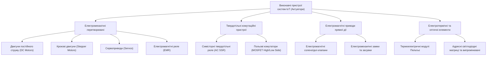
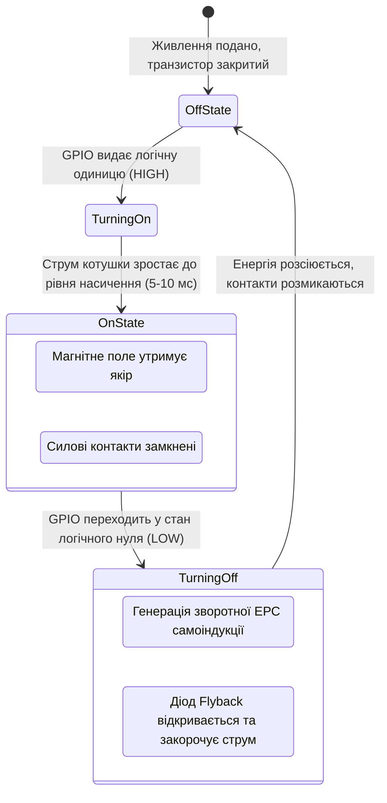
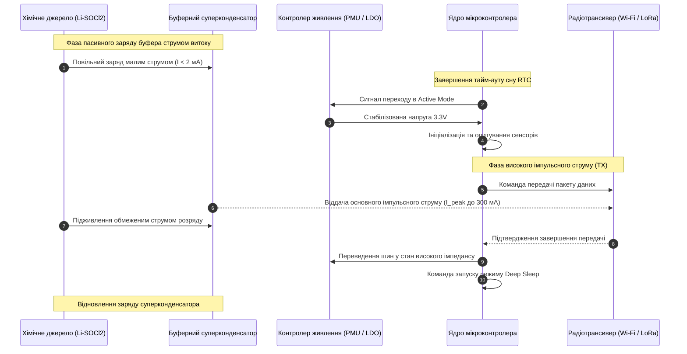
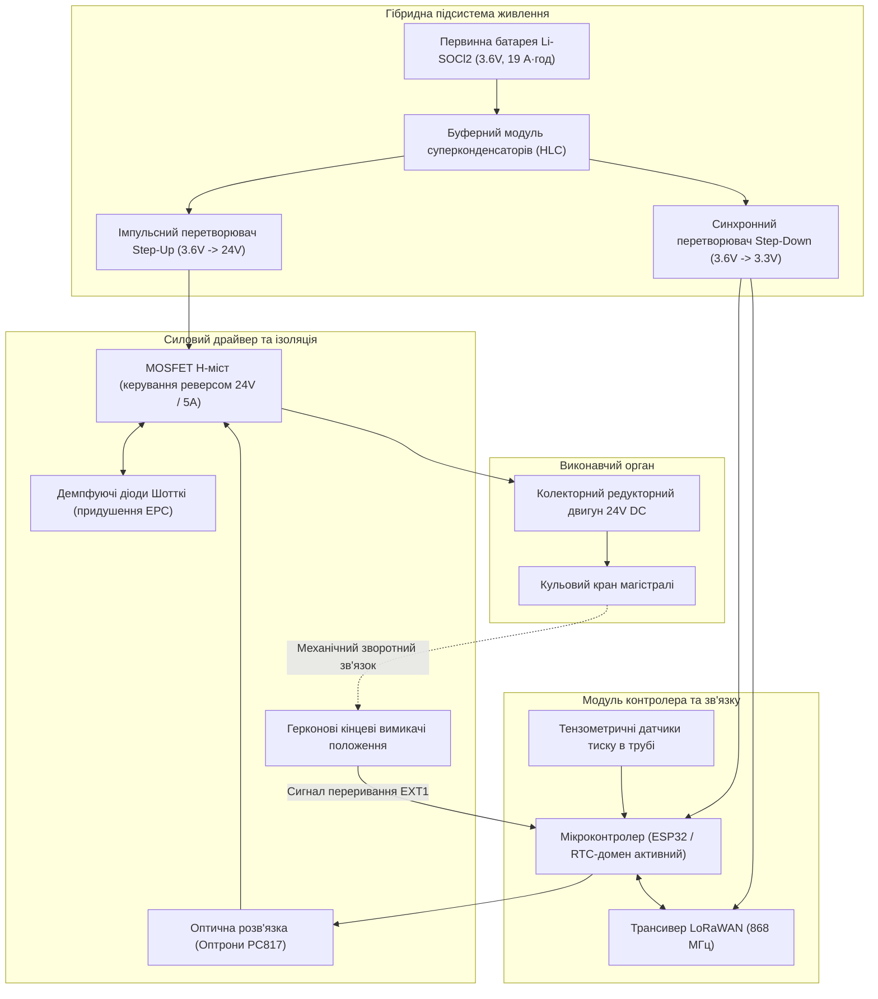

# Тема 8. Виконавчі пристрої та оптимізація енергоспоживання в системах Інтернету речей

## Мета лекції

Формування у здобувачів вищої освіти комплексної системи теоретичних знань та інженерно-технічних компетентностей щодо принципів функціонування, схемотехнічної інтеграції та програмного керування силовими виконавчими механізмами в структурі кіберфізичних систем, а також опанування науково обґрунтованих методологій розрахунку енергетичного бюджету, апаратного керування доменами живлення мікроконтролерів, оптимізації бездротових транзакцій і використання технологій збору розсіяної енергії для забезпечення тривалої автономної експлуатації польових пристроїв Інтернету речей.

## Очікувані результати навчання

1. **Знання та розуміння.** Здобувачі вищої освіти засвоять фундаментальні принципи функціонування й схемотехнічного узгодження виконавчих механізмів різного типу, електрохімічні характеристики сучасних джерел струму, а також внутрішню конфігурацію доменів живлення та тактових генераторів мікроконтролерів при переході між активними й енергозберігаючими режимами.
2. **Застосування.** Здобувачі набудуть практичних умінь розраховувати інтегральний бюджет енергоспоживання автономного пристрою на основі кусочно-лінійної моделі робочого циклу, проєктувати оптоелектронно ізольовані схеми комутації індуктивних навантажень із захистом від імпульсних перенапруг та програмно налаштовувати джерела пробудження системи з режимів глибокого сну.
3. **Аналіз.** Здобувачі зможуть здійснювати порівняльний аналіз профілів струму під час передачі телеметрії різними бездротовими інтерфейсами, досліджувати динаміку зміни внутрішнього опору хімічних джерел під впливом зовнішніх температурних чинників і виявляти причини виникнення апаратних збоїв живлення в мікроконтролерних вузлах.
4. **Оцінювання та синтез.** Здобувачі оволодіють навичками критичної оцінки техніко-економічної ефективності автономних вузлів у складних промислових умовах експлуатації та синтезу комплексних схемотехнічних і алгоритмічних архітектур, що гармонізують режими роботи актуаторів, чергування фаз радіообміну та механізми вторинного збору енергії навколишнього середовища.

---

## Детальний покроковий план лекції

### 1. Теоретико-концептуальний базис. Схемотехніка виконавчих механізмів та електродинамічні процеси в силових колах IoT
* 1.1. Класифікація, функціональне призначення та системна роль актуаторів у замкненому контурі керування Інтернету речей
* 1.2. Схемотехніка безпечного підключення електромеханічних і твердотільних реле з оптичною ізоляцією та демпфуванням ЕРС самоіндукції
* 1.3. Принципи широтно-імпульсного регулювання швидкості й реверсивного керування колекторними двигунами постійного струму на базі інтегральних H-мостів
* 1.4. Архітектура та цифрові імпульсні інтерфейси керування приводами прецизійного кутового позиціонування: сервоприводи та крокові двигуни

### 2. Методологія та аналіз граничних умов. Моделювання бюджету живлення, апаратні режими енергозбереження та фізичні обмеження джерел струму
* 2.1. Математичне моделювання енергетичного бюджету автономного вузла IoT та розрахунок середньозваженого струму за фазами робочого циклу
* 2.2. Електрохімічні характеристики первинних батарей, суперконденсаторів та технології збору розсіяної енергії навколишнього середовища
* 2.3. Апаратне керування доменами живлення мікроконтролерів: системні стани Active Mode, Modem Sleep, Light Sleep, Deep Sleep та Hibernation
* 2.4. Програмна конфігурація внутрішніх і зовнішніх джерел пробудження через таймери реального часу, матричні переривання та мікропотужні співпроцесори
* 2.5. Критичні бар'єри та граничні умови: динамічне падіння напруги в імпульсних режимах радіопередачі, деградація внутрішнього опору батареї та запобігання аварійним перезавантаженням Brownout Reset

### 3. Практичний індустріальний / фаховий кейс. Інженерне проектування та оптимізація автономного приводу запірної арматури
**Тема наскрізної задачі.** «Проєктування автономного бездротового вузла керування запірним клапаном магістрального нафтопроводу з оптимізованим енергоспоживанням, оптичною ізоляцією приводу та комбінованим живленням»


## 1. Теоретико-концептуальний базис. Схемотехніка виконавчих механізмів та електродинамічні процеси в силових колах IoT

### 1.1. Класифікація, функціональне призначення та системна роль актуаторів у замкненому контурі керування Інтернету речей

Функціонування будь-якої кіберфізичної системи або вузла Інтернету речей базується на концепції кібернетичного циклу керування, що охоплює отримання інформації про стан матеріального світу, її аналітичну обробку та формування зворотного керуючого впливу на фізичний об'єкт. Якщо сенсорні вузли перетворюють вимірювані фізичні та хімічні величини в електричні та цифрові сигнали, то зворотний перехід реалізують **виконавчі пристрої** (**актуатори**, Actuators). Актуатор є функціональним перетворювачем, який приймає низьковольтний командний сигнал від мікроконтролера або цифрової платформи і трансформує його у зміну механічного положення, тиску, температури, світлового потоку чи стану електромагнітних комутаційних ліній.

У системній архітектурі Інтернету речей актуатори займають граничний рівень взаємодії з фізичним світом, замикаючи контур автоматичного регулювання. Відмова або некоректне спрацьовування актуатора призводить до розриву зворотного зв'язку, що унеможливлює функціонування кіберфізичного комплексу в режимі реального часу. Відповідно до базових фізичних явищ, які покладені в основу процесу трансформації енергії керування в дію, виконавчі механізми поділяються на кілька ключових класів.



Ієрархічна структура виконавчих механізмів, зображена на діаграмі, демонструє поділ пристроїв за типом перетворення енергії та сферою їх схемотехнічного узгодження. Окреме місце займають електромеханічні пристрої з високим пусковим струмом та індуктивним опором обмоток, що створює специфічні вимоги до проєктування силових інтерфейсів.

Систематизацію базових типів виконавчих пристроїв, їх фізичних принципів, інженерних вимог до підключення та практичних прикладів використання наведено в таблиці 1.

*Таблиця 1 — Систематизація базових виконавчих пристроїв у системах Інтернету речей*

| Категорія виконавчого пристрою | Фізичний принцип дії | Ключові схемотехнічні вимоги | Приклад з реальної практики |
| :--- | :--- | :--- | :--- |
| **Електромеханічне реле (EMR)** | Створення магнітного поля в котушці для механічного притягання феромагнітного якоря та замикання силових контактів | Необхідність транзисторного ключа для живлення котушки, наявність діода демпфування та гальванічної ізоляції | Комутація циркуляційного насоса системи автономного опалення від контролера $230\text{ В}$ |
| **Твердотільне реле (SSR)** | Оптоелектронна передача сигналу на симістор або зустрічно увімкнені силові MOSFET-транзистори | Обов'язкове встановлення тепловідвідного радіатора, забезпечення мінімального струму утримання | Плавне фазове регулювання потужності нагрівального ТЕНа екструдера |
| **Колекторний двигун постійного струму** | Сила Лоренца, що діє на обмотку з електричним струмом у постійному магнітному полі статора | Використання мостової схеми драйвера (H-міст), згладжувальних конденсаторів та ШІМ-ліній | Привод конвеєрної стрічки сортувального термінала з реверсом руху |
| **Кроковий двигун (Stepper)** | Взаємодія постійного магнітного поля ротора із зубчастим магнітним полем багатофазного статора | Застосування спеціалізованих багатоканальних ключів або мікрокрокових інтегральних контролерів | Прецизійне наведення турелі з інфрачервоною оптикою для діагностики високовольтних ліній |
| **Аналоговий/цифровий сервопривод** | Внутрішнє замкнене керування колекторним або безколекторним двигуном за допомогою потенціометричного зворотного зв'язку | Формування періодичного імпульсного сигналу керування з жорсткими часовими характеристиками | Автоматизоване регулювання кута відкриття повітряної заслінки системи вентиляції HVAC |

> **ПРАКТИЧНИЙ ЯКІР:** У системах інтелектуального прецизійного зрошення для агросектору застосовують бістабільні (імпульсні) соленоїдні клапани. На відміну від класичних нормально-закритих клапанів, які для утримання у відкритому стані споживають струм величиною $300\dots 500\text{ мА}$ безперервно, бістабільний клапан змінює свій механічний стан від поодинокого імпульсу тривалістю всього $50\text{ мс}$ амплітудою $12\text{ В}$. Постійний магніт утримує шток без витрати струму, що дозволяє польовому LoRaWAN-контролеру функціонувати до 5 років від єдиного комплекту літієвих батарей.

---

### 1.2. Схемотехніка безпечного підключення електромеханічних і твердотільних реле з оптичною ізоляцією та демпфуванням ЕРС самоіндукції

Безпосереднє підключення електромагнітних та силових твердотільних реле до виводів портів загального призначення (GPIO) мікроконтролера є неприпустимим через обмежену навантажувальну здатність цифрових мікросхем. Вихідні каскади сучасних мікроконтролерів (наприклад, ESP32, STM32 чи ATmega328P) спроможні віддавати тривалий вихідний струм не більше $12\dots 20\text{ мА}$ за напруги $3{,}3\text{ В}$ або $5\text{ В}$, тоді як котушка типового електромеханічного реле потребує для надійного спрацьовування струм від $50$ до $150\text{ мА}$ за напруги $5\text{ В}$, $12\text{ В}$ або $24\text{ В}$. З цієї причини комутація котушки реалізується за допомогою проміжних напівпровідникових ключів на базі біполярних NPN-транзисторів, польових N-канальних MOSFET-транзисторів або спеціалізованих збірок Дарлінгтона (наприклад, мікросхеми ULN2003A).

Винятково важливим аспектом схемотехніки є захист цифрових кіл від руйнівного впливу **електрорушійної сили (ЕРС) самоіндукції**. Котушка реле являє собою індуктивне навантаження з індуктивністю $L$. Згідно із законом електромагнітної індукції Фарадея та правилом Ленца, при раптовому перериванні електричного струму комутуючим транзистором магнітне поле в осерді котушки швидко колапсує. 

Математичний вираз для миттєвої амплітуди напруги самоіндукції має вигляд:

$$V_{spike} = -L \cdot \frac{di}{dt}$$

де $V_{spike}$ позначає стрибок електричної напруги самоіндукції на виводах котушки, вимірюваний у вольтах (В); $L$ є власною індуктивністю обмотки реле, вираженою в генрі (Гн); $\frac{di}{dt}$ позначає похідну електричного струму за часом, що характеризує швидкість його зменшення при закриванні транзистора, вимірювану в амперах за секунду (А/с).

Оскільки перехідний процес вимикання транзистора триває лічені частки мікросекунди ($dt \to 0$), похідна струму набуває колосальних від'ємних значень. У результаті стрибок напруги $V_{spike}$ на колекторі або стоці транзистора може досягати від сотень до тисяч вольт, що багаторазово перевищує напругу пробою напівпровідникового переходу $V_{CEO}$ або $V_{DS}$ і призводить до миттєвого теплового чи лавинного руйнування транзистора.

Для придушення цього перенапруження паралельно обмотці реле підключається **демпфуючий діод зворотного струму** (**Flyback Diode**), спрямований катодом до плюсової шини силового живлення, а анодом — до колектора або стоку ключового транзистора. При відкритому стані транзистора цей діод зворотно зміщений і не чинить впливу на схему. У момент закривання транзистора ЕРС самоіндукції змінює знак полярності на виводах котушки, внаслідок чого діод переходить у відкритий стан, замикаючи струм самоіндукції в контурі котушки доти, доки енергія магнітного поля не розсіється на активному внутрішньому опорі дроту обмотки.



Граф станів, наведений вище, демонструє життєвий цикл фаз комутації індуктивного навантаження реле, включаючи критичну фазу захисного розсіювання накопиченої енергії.

Для захисту мікроконтролера від імпульсних кондуктивних перешкод, що виникають при дуговому розряді на силових контактах реле, застосовують **гальванічну ізоляцію** на базі оптронів (наприклад, PC817 або 4N35). Оптрон транслює інформаційний сигнал через оптичний канал, розділяючи електричні контури цифрової землі мікроконтролера ($GND_{logic}$) та силової землі реле ($GND_{power}$).

> **ТИПОВА ПОМИЛКА:** Безпосереднє підключення демпфуючого діода до лінії живлення мікроконтролера замість підключення безпосередньо паралельно виводам котушки реле, а також об'єднання цифрової та силової шин заземлення в одній точці поруч із чутливими лініями аналогово-цифрового перетворювача (АЦП). Це призводить до того, що сильні струмові сплески комутації індукують паразитні стрибки напруги на загальному земляному опорі провідників плати, викликаючи зависання мікроконтролера та збої в каналах зв'язку I2C/SPI.

> **КОНТРОЛЬНЕ ПИТАННЯ:** Чому встановлення звичайного кремнієвого діода паралельно котушці електромагнітного реле збільшує час механічного розмикання його контактів, і яким схемотехнічним методом усувають цей негативний ефект у швидкодіючих системах автоматики?

<details markdown="1">
<summary>Розгорнути аналіз / відповідь</summary>

**Правильний варіант: За рахунок повільного спадання струму через мале пряме падіння напруги на діоді; для прискорення послідовно з діодом встановлюють стабілітрон (діод Зенера).**

1. Фізичне обґрунтування: коли після закривання ключа струм замикається через діод, напруга на котушці фіксується на рівні прямого падіння напруги на p-n переході діода ($V_F \approx 0{,}7\text{ В}$). Постійна часу спадання струму індуктивного контуру $\tau = \frac{L}{R_{coil} + R_{diode}}$ залишається високою, оскільки динамічний опір відкритого діода дуже малий. Струм в обмотці спадає повільно, відповідно магнітний потік утримує механічний якір значно довше, що уповільнює розмикання контактів і веде до подовження горіння електричної дуги між контактами реле.

2. Аналіз дистракторів:
   - Твердження про те, що діод збільшує час спрацьовування за рахунок власної ємності, є хибним, оскільки бар'єрна ємність діода становить одиниці-десятки пікофарад і на часових масштабах у мілісекунди ролі не відіграє.
   - Пропозиція збільшити опір струмообмежувального резистора бази керуючого транзистора ніяк не впливає на контур рециркуляції струму котушки вже після його повного закривання.
   - Застосування схеми з послідовним стабілітроном і демпфуючим діодом штучно підвищує напругу на котушці під час самоіндукції до величини $V_Z + V_F$, внаслідок чого енергія $E = \frac{1}{2} L I^2$ розсіюється у багато разів швидше, забезпечуючи миттєве розімкнення механічних контактів реле.

</details>

---

### 1.3. Принципи широтно-імпульсного регулювання швидкості й реверсивного керування колекторними двигунами постійного струму на базі інтегральних H-мостів

Електродвигуни постійного струму знаходять широке застосування в рухомих платформах робототехніки, запірних клапанах магістральних систем та приводах позиціонування систем «розумного будинку». Для керування напрямком і швидкістю обертання вала двигуна використовується комбінація мостових транзисторних схем (**H-міст**) та **широтно-імпульсної модуляції** (**ШІМ**, Pulse-Width Modulation, PWM).

Електромеханічна поведінка двигуна постійного струму з постійними магнітами описується диференціальним рівнянням електричної рівноваги якірного кола та рівнянням механічного руху:

$$V_{in}(t) = R_a \cdot i_a(t) + L_a \cdot \frac{d i_a(t)}{dt} + e_b(t)$$

де $V_{in}(t)$ позначає прикладену до клем якірного кола напругу живлення у часі (В); $R_a$ є активним електричним опором обмотки якоря двигуна (Ом); $L_a$ є власною індуктивністю якірної обмотки (Гн); $i_a(t)$ позначає миттєвий струм якоря (А); $e_b(t)$ позначає проти-електрорушійну силу (проти-ЕРС, Back-EMF), яка генерується обмоткою під час її обертання в магнітному полі статора (В).

Величина проти-ЕРС прямо пропорційна кутовій швидкості обертання вала $\omega(t)$:

$$e_b(t) = K_e \cdot \omega(t)$$

де $K_e$ є конструктивним електромагнітним коефіцієнтом проти-ЕРС двигуна ($\text{В}\cdot\text{с}/\text{рад}$), а $\omega(t)$ — миттєвою кутовою швидкістю ротора ($\text{рад}/\text{с}$).

Електромагнітний крутний момент $T_e(t)$ ($\text{Н}\cdot\text{м}$), що створюється двигуном, пов'язаний зі струмом якоря лінійною залежністю через коефіцієнт моменту $K_t$:

$$T_e(t) = K_t \cdot i_a(t)$$

Регулювання ефективної напруги на двигуні здійснюється формуванням високочастотної імпульсної послідовності. Середнє значення напруги $V_{avg}$, що діє на обмотку двигуна, визначається шпаруватістю і коефіцієнтом заповнення ШІМ $D$:

$$V_{avg} = D \cdot V_{supply} = \frac{t_{on}}{T_{pwm}} \cdot V_{supply}$$

де $V_{supply}$ позначає повну вихідну напругу силового джерела постійного струму (В); $t_{on}$ позначає час знаходження імпульсу у високому рівні протягом одного періоду (с); $T_{pwm}$ є загальним періодом проходження імпульсів ШІМ (с).

Для забезпечення двоспрямованого (реверсивного) обертання використовується топологія H-моста, яка складається з чотирьох силових ключів (два верхніх комутатори High-Side і два нижніх Low-Side). У класичному драйвері L298N ключі побудовані на базі біполярних транзисторів, тоді як у сучасних енергоефективних рішеннях (наприклад, TB6612FNG чи DRV8833) використовуються польові MOSFET-транзистори з низьким опором відкритого каналу $R_{DS(on)}$. 

При ввімкненні діагональної пари ключів Q1 (верхній лівий) і Q4 (нижній правий) струм тече крізь двигун в прямому напрямку, зумовлюючи обертання за годинниковою стрілкою. Якщо ввімкнути альтернативну пару Q3 (верхній правий) і Q2 (нижній лівий), полярність прикладеної напруги інвертується, спричиняючи зворотне обертання.

Найнебезпечнішим аварійним станом схеми H-моста є **наскрізний струм** (**Shoot-Through**), який виникає за одночасного відкриття верхнього і нижнього ключів одного півмоста (наприклад, Q1 і Q2). Цей стан утворює пряме коротке замикання силової шини живлення на землю через відкриті транзистори, що спричиняє тепловий вибух кристала драйвера за лічені мікросекунди. 

Для запобігання цьому явищу апаратні таймери мікроконтролера або внутрішня логіка драйвера забезпечують введення регульованого захисного часового інтервалу, так званого **мертвого часу** (**Dead-Time**), протягом якого обидва ключі півмоста гарантовано утримуються в закритому стані перед відкриттям комплементарного транзистора.

> **ПРАКТИЧНИЙ ЯКІР:** В автономних мобільних платформах інтралогістики (AGV, Automated Guided Vehicles) використання застарілих біполярних драйверів L298N замість сучасних MOSFET-драйверів TB6612FNG призводить до втрати до $25\%$ корисної енергії тягових батарей. Падіння напруги на відкритих біполярних транзисторах Дарлінгтона в L298N становить від $1{,}8$ до $2{,}2\text{ В}$ на кожному плечі моста (сумарно близько $4\text{ В}$ при струмі $1{,}5\text{ А}$), що за робочої напруги батареї $12\text{ В}$ перетворює до $6\text{ Вт}$ потужності на марне нагрівання навколишнього середовища.

---

### 1.4. Архітектура та цифрові імпульсні інтерфейси керування приводами прецизійного кутового позиціонування: сервоприводи та крокові двигуни

Для реалізації завдань прецизійного просторового переміщення та стабілізації робочих органів (роботизовані маніпулятори, сонячні трекери, замкові механізми, поворотні відеокамери) використовують два взаємодоповнюючі класи приводів: сервоприводи та крокові двигуни.

Класичний **аналоговий або цифровий RC-сервопривод** являє собою моноблочну електромеханічну систему, що об'єднує електродвигун постійного струму, понижувальний редуктор, резистивний потенціометр (або магнітний енкодер на ефекті Холла) як датчик зворотного зв'язку за кутом, та інтегрований аналоговий або мікроконтролерний ПІД-регулятор положення. 

Інтерфейс керування сервоприводом базується на спеціалізованому імпульсному протоколі з періодом повторення $T = 20\text{ мс}$ (частота оновлення кадрів становить $50\text{ Гц}$). Кутове положення вала кодується не відносною шпаруватістю, а абсолютною тривалістю позитивного імпульсу $t_{pulse}$, яка варіюється в діапазоні від $1{,}0\text{ мс}$ до $2{,}0\text{ мс}$. 

Зв'язок кута повороту $\theta$ вихідного вала сервопривода з тривалістю імпульсу керування описується лінійною кусочною залежністю:

$$\theta(t_{pulse}) = \begin{cases} 0^\circ, & t_{pulse} \le 1{,}0\text{ мс} \\ 180^\circ \cdot \left(\frac{t_{pulse} - 1{,}0}{1{,}0}\right), & 1{,}0\text{ мс} < t_{pulse} < 2{,}0\text{ мс} \\ 180^\circ, & t_{pulse} \ge 2{,}0\text{ мс} \end{cases}$$

де $\theta$ позначає кут повороту вихідного вала сервопривода у градусах ($^\circ$), а $t_{pulse}$ є абсолютною тривалістю позитивного командного імпульсу, вираженою в мілісекундах (мс). Тривалість імпульсу $1{,}5\text{ мс}$ встановлює сервопривод у нейтральне серединне положення $\theta = 90^\circ$. Внутрішній контролер сервопривода безперервно порівнює напругу зворотного зв'язку з потенціометра з напругою завдання, сформованою інтегратором імпульсу керування, забезпечуючи утримання вала у заданій точці завдяки відпрацюванню сигналу помилки.

На відміну від сервоприводів, які працюють у замкненому контурі, **кроковий двигун** (наприклад, 4-фазний уніполярний двигун 28BYJ-48 з редуктором) здійснює дискретне кутове переміщення у розімкненому контурі без використання датчиків зворотного зв'язку. Ротор крокового двигуна складається з багатополюсного постійного магніту, а статор містить кілька незалежних обмоток. Послідовна подача струму в фази статора змінює просторову конфігурацію магнітного поля, змушуючи зубці ротора вирівнюватися вздовж силових ліній магнітної індукції.

Кутовий крок ротора $\theta_{step}$ (у градусах на один крок) визначається фундаментальною формулою:

$$\theta_{step} = \frac{360^\circ}{m \cdot N_{phases} \cdot K_{gear}}$$

де $360^\circ$ відповідає повному оберту кола; $N_{phases}$ позначає кількість незалежних електричних фаз статора; $m$ є коефіцієнтом дроблення кроку ($m = 1$ для повнокрокового режиму з почерговою комутацією, $m = 2$ для напівкрокового режиму); $K_{gear}$ є коефіцієнтом редукції інтегрованого механічного редуктора.

Для поширеного в навчальних та дослідницьких IoT-проєктах крокового двигуна 28BYJ-48 кількість фаз $N_{phases} = 4$, власний крок ротора становить $5{,}625^\circ$ (що відповідає 64 внутрішнім крокам на оберт), а редуктор має номінальне передавальне число $K_{gear} = 64$ (у деяких модифікаціях 48:1 або 63.6839:1). За використання напівкрокового алгоритму керування ($m = 2$), що реалізується почерговою комутацією однієї та двох фаз одночасно (таблиця станів 8 тактів), для повного оберту вихідного вала на $360^\circ$ необхідно сформувати:

$$N_{pulses} = 64 \cdot 64 = 4096\text{ імпульсів}$$

що забезпечує кутову роздільну здатність $\theta_{step} \approx 0{,}08789^\circ$ на один напівкрок. 

Ключовим енергетичним компромісом при виборі між сервоприводом та кроковим двигуном є характер споживання потужності в стані спокою: сервопривод споживає мінімальний струм утримання, коли зовнішній механічний момент на валу відсутній, тоді як кроковий двигун у розімкненому контурі вимагає протікання повного номінального струму крізь обмотки для створення моменту утримання (Holding Torque), інакше ротор зміститься під дією зовнішнього навантаження.

---

### Вказівки для самостійного осмислення

1. Проведіть аналітичний розрахунок теплових втрат на кристалі ключового польового транзистора (MOSFET), що комутує струм обмотки соленоїдного клапана амплітудою $I = 2\text{ А}$ за напруги $24\text{ В}$, порівнявши транзистор з опором відкритого каналу $R_{DS(on)} = 0{,}02\text{ Ом}$ та застарілий біполярний транзистор Дарлінгтона з напругою насичення колектор-емітер $V_{CE(sat)} = 1{,}6\text{ В}$.
2. Дослідіть схемотехнічні переваги та фізичні обмеження використання оптичної розв'язки типу оптосимістора з функцією Zero-Crossing при комутації реактивних індуктивних навантажень у мережах змінного струму, звернувши увагу на фазовий зсув між струмом і напругою.
3. Проаналізуйте наслідки вибору завищеної або заниженої частоти широтно-імпульсної модуляції (ШІМ) для керування двигуном постійного струму в діапазонах від $100\text{ Гц}$ до $50\text{ кГц}$, виділивши акустичні шуми, динамічні втрати на перемикання ключів H-моста та пульсації якірного струму.


## 2. Методологія та аналіз граничних умов. Моделювання бюджету живлення, апаратні режими енергозбереження та фізичні обмеження джерел струму

### 2.1. Математичне моделювання енергетичного бюджету автономного вузла IoT та розрахунок середньозваженого струму за фазами робочого циклу

Проєктування апаратного вузла Інтернету речей із тривалим терміном автономного функціонування вимагає переходу від емпіричних оцінок ємності джерел живлення до строгого математичного моделювання енергетичного балансу. Більшість польових пристроїв працює за циклічним принципом, чергуючи короткі інтервали активної обробки і радіопередачі з тривалими інтервалами глибокого сну. Для коректного визначення витрати енергії робочий цикл вузла розбивається на скінченну кількість квазістаціонарних фаз, на кожній з яких струм споживання вважається постійним або апроксимується його середньоінтегральне значення.

Формалізація розрахунку сумарного енергетичного бюджету та прогнозованого терміну експлуатації автономного пристрою реалізується за наступним аналітичним алгоритмом:

$$
\begin{aligned}
\text{Крок 1 (Часова декомпозиція періоду):} & \quad T_{cycle} = \sum_{k=1}^{N} t_k = t_{wake} + t_{meas} + t_{proc} + t_{tx} + t_{rx} + t_{sleep} \\
\text{Крок 2 (Інтегрування спожитого заряду):} & \quad Q_{cycle} = \sum_{k=1}^{N} \int_{0}^{t_k} i_k(t) \, dt \approx \sum_{k=1}^{N} I_k \cdot t_k \\
\text{Крок 3 (Середньозважений струм циклу):} & \quad I_{avg} = \frac{Q_{cycle}}{T_{cycle}} = \frac{1}{T_{cycle}} \sum_{k=1}^{N} I_k \cdot t_k \\
\text{Крок 4 (Ефективна ємність джерела):} & \quad C_{eff} = C_{nom} \cdot K_{temp}(T) \cdot K_{load}(I_{peak}) \cdot \left(1 - \frac{S_{annual} \cdot L_{years}}{100}\right) \\
\text{Крок 5 (Прогнозований життєвий цикл):} & \quad L_{hours} = \frac{C_{eff} \cdot \eta_{conv}}{I_{avg} + I_{leak}} \implies L_{years} = \frac{L_{hours}}{8760}
\end{aligned}
$$

У наведеній математичній моделі часові інтервали $t_{wake}$, $t_{meas}$, $t_{proc}$, $t_{tx}$, $t_{rx}$ та $t_{sleep}$ позначають тривалості переходу системи в активний стан, опитування сенсорів, обчислювальної обробки, передачі радіокадру, прийому підтвердження та перебування в режимі енергозбереження відповідно, виміряні в секундах. Величини $I_k$ відображають середні струми споживання на кожному з $N$ етапів циклу в амперах. Значення $C_{nom}$ визначає паспортну номінальну ємність хімічного джерела живлення в ампер-годинах, яка коригується безрозмірними коефіцієнтами впливу температури експлуатації $K_{temp}(T)$ та амплітуди імпульсного струму $K_{load}(I_{peak})$. Параметр $S_{annual}$ задає відсоток річного саморозряду батареї, $L_{years}$ є тривалістю експлуатації пристрою в роках, $\eta_{conv}$ відображає усереднений коефіцієнт корисної дії імпульсних або лінійних перетворювачів напруги живлення, а $I_{leak}$ враховує паразитичні струми витоку друкованої плати, розв'язувальних конденсаторів і захисних компонентів.

Аналіз граничних умов показує, що дана розрахункова модель втрачає адекватність у випадках, коли внутрішній опір джерела живлення зростає настільки, що імпульсний струм $I_{tx}$ викликає падіння напруги нижче мінімального порогу працездатності стабілізаторів. Крім того, лінійне наближення споживаного заряду $Q_{cycle}$ стає непридатним в умовах нестабільного бездротового каналу зв'язку, де кількість повторних спроб передачі кадру (Retransmissions) є стохастичною величиною, яка може збільшувати енергоспоживання активної фази на сотні відсотків.

---

### 2.2. Електрохімічні характеристики первинних батарей, суперконденсаторів та технології збору розсіяної енергії навколишнього середовища

Вибір джерела струму для автономного вузла визначається компромісом між питомою щільністю енергії, здатністю віддавати високі імпульсні струми та стабільністю вихідної напруги за різних температурних режимів. Традиційні лужні (Alkaline) елементи мають значний внутрішній опір і високий саморозряд за низьких температур, що обмежує термін їхньої служби в польових умовах двома-трьома роками. Натомість літій-тіонілхлоридні елементи ($\text{Li-SOCl}_2$) забезпечують питому щільність енергії до $650\text{ Вт}\cdot\text{год}/\text{кг}$ та мінімальний саморозряд на рівні менше одного відсотка на рік, що теоретично дозволяє створювати пристрої з автономністю понад десять років.

Головним фізичним бар'єром під час експлуатації $\text{Li-SOCl}_2$ елементів є **ефект пасивації**, який полягає в наростанні кристалічної плівки хлориду літію ($\text{LiCl}$) на поверхні металевого літієвого анода за відсутності струму навантаження. Ця плівка захищає батарею від саморозряду, проте володіє високим електричним опором. Якщо пристрій тривалий час перебуває в режимі глибокого сну зі споживанням декілька мікроамперів, спроба раптового переходу в режим радіопередачі зі струмом сотні міліамперів призводить до глибокого динамічного провалу напруги (Voltage Delay), що здатне спровокувати аварійний перезапуск мікроконтролера.



Діаграма взаємодії демонструє процес розподілу пікового навантаження між батареєю та паралельно підключеним суперконденсатором. Завдяки високій швидкості віддачі заряду конденсатор повністю бере на себе забезпечення струму передавача, нівелюючи внутрішній опір хімічного елемента та запобігаючи просіданню напруги живлення.

Як альтернативу або доповнення до первинних джерел використовують системи збору розсіяної енергії навколишнього середовища (**Energy Harvesting**). Фотоелектричні кремнієві перетворювачі оптимізовані під спектр сонячного випромінювання (щільність потужності до $100\text{ мВт}/\text{см}^2$ на вулиці і менше $100\text{ мкВт}/\text{см}^2$ у приміщенні). Термоелектричні генератори на базі ефекту Зеєбека виробляють напругу за наявності стабільного градієнта температур між об'єктом і навколишнім середовищем. П'єзоелектричні модулі перетворюють механічну вібрацію технологічного обладнання в змінний електричний струм.

Енергетичний баланс вузла з регенерацією енергії визначається нерівністю:

$$P_{in}(t) \cdot \eta_{boost} \ge P_{load}(t) + P_{leak}$$

де $P_{in}(t)$ є миттєвою потужністю, зібраною фізичним перетворювачем (Вт); $\eta_{boost}$ позначає коефіцієнт корисної дії підвищувального імпульсного перетворювача з функцією відстеження точки максимальної потужності (MPPT); $P_{load}(t)$ є потужністю, споживаною навантаженням; $P_{leak}$ визначає сумарні втрати енергії в елементах накопичення (суперконденсаторах або тонкоплівкових твердотільних акумуляторах).

> **ВАЖЛИВО:** Для забезпечення надійної депасивації літій-тіонілхлоридних елементів живлення в мікропрограму вузла обов'язково інтегрують алгоритм періодичного контрольного навантаження. Контролер за допомогою окремого транзистора періодично підключає прецизійний баластний резистор, створюючи нормований імпульс струму амплітудою $20\dots 40\text{ мА}$ тривалістю декілька мілісекунд, що підтримує товщину пасиваційного шару в безпечних межах і гарантує безаварійну роботу бездротового модуля.

---

### 2.3. Апаратне керування доменами живлення мікроконтролерів: системні стани Active Mode, Modem Sleep, Light Sleep, Deep Sleep та Hibernation

Зниження енергоспоживання сучасних систем на кристалі базується на розбитті структури процесора на фізично ізольовані домени живлення та застосуванні динамічного керування тактовими генераторами. У мікроконтролерах із комбінованою радіосистемою, зокрема в родині ESP32, реалізовано незалежне апаратне керування основними ядрами, радіочастотним трактом, цифровою периферією та доменом годинника реального часу (**RTC Power Domain**).

Математичний аналіз потужності, що споживається цифровим КМОН-процесором, виділяє дві ключові компоненти: динамічну потужність перемикання вентилів та статичну потужність витоків:

$$P_{total} = P_{dyn} + P_{stat} = C_{load} \cdot V_{dd}^2 \cdot f_{clk} + V_{dd} \cdot I_{leak}$$

де $C_{load}$ позначає сумарну еквівалентну ємність перемикання цифрових логічних елементів кристала (Ф); $V_{dd}$ є напругою живлення цифрового ядра процесора (В); $f_{clk}$ позначає робочу тактову частоту системи (Гц); $I_{leak}$ є струмом витоку закритих напівпровідникових структур (А).

Вплив кожного системного стану на змінні даного рівняння має чітко виражену апаратну специфіку:

У стані **Active Mode** всі внутрішні стабілізатори ввімкнені, частота $f_{clk}$ досягає максимальних значень (до $240\text{ МГц}$), а радіотракт Wi-Fi/Bluetooth бере участь у прийомі або передачі кадрів. Струм споживання сягає $160\dots 260\text{ мА}$.

У стані **Modem Sleep** тактування ядер процесора зберігається, проте апаратні блоки фазового автопідлаштування частоти (PLL) радіочастотного тракту та підсилювачі потужності вимикаються. Використовуючи механізм асоціації з точкою доступу за розкладом DTIM (Delivery Traffic Indication Message), система знижує споживання до $20\dots 30\text{ мА}$, зберігаючи повну готовність процесора до обчислень.

У стані **Light Sleep** активується механізм блокування тактових імпульсів (**Clock Gating**). Основні цифрові ядра Xtensa знеструмлюються за тактовим сигналом, але напруга на шинах оперативної пам'яті зберігається на рівні утримання даних. Струм знижується до $0{,}8\text{ мА}$, а вихід у стан виконання інструкцій займає менше однієї мілісекунди.

У стані **Deep Sleep** реалізується повне апаратне відключення живлення (**Power Gating**) високопродуктивного цифрового домену. Центральні процесори, статична оперативна пам'ять DRAM та стандартна периферія знеструмлюються повністю. Активним залишається лише домен RTC, де функціонує енергоефективний співпроцесор, пам'ять повільних змінних обсягом вісім кілобайт та таймер. Струм споживання зменшується до $5\dots 10\text{ мкА}$.

У стані **Hibernation** живлення знімається навіть з пам'яті RTC, а функціонувати продовжує лише апаратний тактовий лічильник, підключений до зовнішнього резонатора $32{,}768\text{ кГц}$. Струм споживання кристала знижується до рекордних $2{,}5\text{ мкА}$, проте система повністю втрачає збережений контекст програми.

---

### 2.4. Програмна конфігурація внутрішніх і зовнішніх джерел пробудження через таймери реального часу, матричні переривання та мікропотужні співпроцесори

Організація алгоритму функціонування вузла в режимі Deep Sleep вимагає попередньої конфігурації умов, за яких контролер живлення RTC подасть команду на відновлення напруги ядра. Якщо відповідні джерела пробудження не налаштовані, мікроконтролер переходить у незворотний стан блокування, з якого вихід можливий виключно через апаратне скидання лінії Reset або зняття живлення.

Основними джерелами виходу з енергозберігаючих режимів є наступні системні механізми:

Таймер реального часу RTC дозволяє налаштовувати пробудження через заданий часовий інтервал із роздільною здатністю в одну мікросекунду. Для реалізації цього механізму викликається функція низькорівневого драйвера живлення:

```c
esp_sleep_enable_timer_wakeup(uint64_t time_in_us);
```

Даний спосіб є базовим для періодичних систем вимірювання кліматичних та технологічних параметрів.

Зовнішнє переривання за одним виводом (**EXT0**) базується на відстеженні статичного логічного рівня (HIGH або LOW) на одному з виділених виводів RTC GPIO. Механізм оперує внутрішнім аналоговим компаратором домену RTC, тому він продовжує функціонувати навіть при знеструмленні цифрових портів введення-виведення.

Зовнішнє матричне переривання за групою виводів (**EXT1**) забезпечує моніторинг множини ліній RTC GPIO з використанням логічної бітової маски. Функція конфігурації приймає як аргументи шістдесятичотирибітну маску виводів та логічний режим селекції:

```c
esp_sleep_enable_ext1_wakeup(uint64_t mask, esp_sleep_ext1_wakeup_mode_t mode);
```

Режим `ESP_EXT1_WAKEUP_ANY_HIGH` активує пробудження за логічною операцією «АБО» (достатньо спрацьовування будь-якого одного датчика з групи), тоді як режим `ESP_EXT1_WAKEUP_ALL_LOW` вимагає переходу всіх обраних ліній у стан логічного нуля, що застосовується в промислових контурах контролю захисних бар'єрів та аварійних петель.

Найвищий рівень гнучкості забезпечує застосування вбудованого мікропотужного співпроцесора (**ULP-coprocessor**). Співпроцесор базується на архітектурі FSM (скінченного автомата) або компактного ядра RISC-V, функціонуючи на низькій тактовій частоті від внутрішнього генератора $8\text{ МГц}$ і споживаючи менше $150\text{ мкА}$. Співпроцесор має прямий доступ до регістрів вбудованого аналогово-цифрового перетворювача (АЦП), контролера шини I2C і ліній RTC GPIO. Він здатний самостійно здійснювати опитування зовнішніх сенсорів, проводити первинну фільтрацію результатів вимірювань і накопичувати їх у пам'яті RTC Slow Memory, не пробуджуючи основні енергоємні ядра процесора. Сигнал на запуск головних обчислювальних ядер формується співпроцесором лише в тому випадку, коли виміряне значення виходить за межі встановленого програмного вікна допуску.

Дані, які повинні бути збережені між циклами глибокого сну, маркуються атрибутом `RTC_DATA_ATTR`, що розміщує їх у повільній пам'яті RTC Slow SRAM. Усі стандартні статичні та глобальні змінні, розташовані в основній пам'яті SRAM, після пробудження скидаються до початкових значень, оскільки вихід із стану Deep Sleep ініціює апаратний цикл скидання процесора через виконання базового системного завантажувача.

> **ПРАКТИЧНИЙ ЯКІР:** У системах георозподіленого моніторингу витоків на магістральних газопроводах застосовують вузли з мікроконтролерами, де співпроцесор ULP виконує циклічне опитування тензометричного датчика тиску через АЦП кожні $100\text{ мс}$. Протягом дев'яноста дев'яти відсотків часу тиск залишається в межах технологічної норми, тому основні ядра мікроконтролера та радіомодем місяцями перебувають у глибокому сні, що забезпечує зниження середньодобового споживання системи з $80\text{ мА}$ до $18\text{ мкА}$.

---

### 2.5. Критичні бар'єри та граничні умови: динамічне падіння напруги в імпульсних режимах радіопередачі, деградація внутрішнього опору батареї та запобігання аварійним перезавантаженням Brownout Reset

Критичним бар'єром для надійної експлуатації автономних пристроїв є неузгодженість імпульсних характеристик споживання цифрових радіомодемів із внутрішніми характеристиками джерел струму. У момент активації підсилювача потужності трансивера Wi-Fi (стандарт IEEE 802.11 b/g/n) струм навантаження зростає стрибкоподібно від декількох мікроамперів до $250\dots 350\text{ мА}$ за час, що не перевищує кількох мікросекунд. 

Згідно з другим законом Кірхгофа, напруга на клемах живлення вузла під час імпульсу описується виразом:

$$V_{term}(t) = V_{ocv}(DoD, T) - I_{tx}(t) \cdot R_{int}(DoD, T) - L_{trace} \cdot \frac{di_{tx}(t)}{dt}$$

де $V_{ocv}$ позначає напругу розімкненого кола джерела живлення (Open Circuit Voltage), яка є нелінійною функцією ступеня розряду батареї ($DoD$, Depth of Discharge) та її поточної температури $T$ (В); $I_{tx}(t)$ є амплітудою струму радіовипромінювання (А); $R_{int}$ позначає еквівалентний послідовний внутрішній опір хімічного елемента (Ом); $L_{trace}$ є розподіленою індуктивністю провідників друкованої плати та контактів роз'ємів (Гн).

У разі зниження температури навколишнього середовища до від'ємних значень (наприклад, $-20^\circ\text{C}$) внутрішній опір літієвих батарей може зростати в п'ять-десять разів унаслідок сповільнення рухливості іонів в електроліті. 

Якщо напруга на клемах падає нижче критичного порогу апаратного детектора зниження напруги:

$$V_{term}(t) \le V_{bor\_threshold} \approx 2{,}5\dots 2{,}7\text{ В}$$

спрацьовує вбудована схема захисту **Brownout Reset (BOR)**. Схема примусово скидає процесор у стан перезавантаження. Після зняття навантаження напруга на клемах батареї миттєво відновлюється до номінальної, мікроконтролер знову починає виконання програми, повторно намагається активувати радіомодуль, знову викликає просідання напруги та потрапляє у нескінченний циклічний процес перезавантаження (**Bootloop**), який повністю виснажує залишок заряду батареї за лічені години.

Для усунення цієї проблеми між виходом джерела живлення та входом схеми встановлюють буферний накопичувальний конденсатор (танталовий або суперконденсатор із наднизьким еквівалентним послідовним опором ESR). 

Мінімально необхідна ємність буферного конденсатора розраховується на основі балансу заряду за час тривалості імпульсу передачі:

$$C_{buf} \ge \frac{\left(I_{tx} - I_{bat\_max}\right) \cdot \Delta t_{tx}}{\Delta V_{allowed}}$$

де $I_{tx}$ позначає струм споживання підсилювача потужності (А); $I_{bat\_max}$ є гранично допустимим безпечним струмом розряду батареї, за якого напруга не просідає нижче допустимого порогу (А); $\Delta t_{tx}$ позначає часову тривалість пакета радіопередачі (с); $\Delta V_{allowed} = V_{nominal} - V_{bor\_threshold}$ визначає максимально допустиму амплітуду просідання напруги на шині живлення до моменту спрацьовування апаратного захисту BOR (В).

Порівняльний інженерний аналіз методологій керування енергоспоживанням та архітектур систем зберігання енергії наведено в аналітичній матриці в таблиці 2.

*Таблиця 2 — Аналітична матриця порівняння методів оптимізації енергоспоживання вузлів IoT*

| Метод оптимізації / Архітектура | Механізм реалізації | Енергетична ефективність | Складність впровадження | Критичні ризики / Обмеження |
| :--- | :--- | :--- | :--- | :--- |
| **Duty Cycling через таймер RTC** | Повний перехід процесора у Deep Sleep із відліком інтервалів апаратним лічильником | Зниження середнього струму на $95\dots 99\%$ при тривалих періодах сну | Низька (базова підтримка в операційних системах реального часу) | Повна нездатність реагувати на непередбачувані аварійні події у проміжках між пробудженнями |
| **Асинхронний моніторинг через ULP** | Безперервне сканування сенсорів мікропотужним співпроцесором за сплячих основних ядер | Дозволяє скоротити час активного стану ядер на $90\%$ у слабко змінних середовищах | Висока (необхідність програмування на специфічному асемблері або діалектах C) | Жорсткі обмеження за доступним обсягом пам'яті програм і відсутність підтримки обчислень із рухомою комою |
| **Буферизація суперконденсатором (HLC)** | Паралельне підключення гібридного конденсатора до хімічного елемента | Збільшення віддаваної імпульсної потужності в $10\dots 50$ разів | Середня (вимагає прецизійного розрахунку паразитних опорів ESR та витоків) | Значний власний струм витоку конденсатора, що перевищує струм сну мікроконтролера за високих температур |
| **Енергетичний збір (Solar Harvesting)** | Застосування сонячної панелі з контролером заряду за алгоритмом MPPT | Потенційно нескінченний життєвий цикл вузла без заміни батарей | Висока (багатокаскадна схемотехніка перетворення та погодження рівнів) | Критична залежність від погодних умов, сезону, деградація поверхні фотоелементів |
| **Динамічне масштабування частоти (DFS)** | Програмне зниження тактової частоти ядра під час виконання некритичних задач | Зниження динамічного струму ядра на $50\dots 70\%$ відповідно до закону $P \sim f$ | Низька (підтримується стандартними API викликами ОС) | Збільшення сумарного часу виконання інструкцій, що може нівелювати виграш у енергії (Race-to-Sleep) |

Аналіз даних матриці свідчить про те, що найвищу автономність гарантує комбінований підхід, який поєднує глибокий сон із буферизацією імпульсного навантаження та селективним пробудженням системи лише за фактом реєстрації події.

> **КОНТРОЛЬНЕ ПИТАННЯ:** Автономний пристрій моніторингу температури з передавачем LoRaWAN живиться від літієвої батареї з напругою розімкненого кола $V_{ocv} = 3{,}6\text{ В}$ та внутрішнім опором $R_{int} = 3{,}5\text{ Ом}$. Під час передачі кадру тривалістю $\Delta t = 80\text{ мс}$ передавач споживає постійний струм $I_{tx} = 120\text{ мА}$. Поріг спрацьовування захисту Brownout Reset мікроконтролера становить $V_{bor} = 2{,}7\text{ В}$, а власний струм споживання ядра в сні дорівнює $10\text{ мкА}$. Обчисліть, чи станеться аварійне перезавантаження вузла при охолодженні батареї до $-30^\circ\text{C}$, якщо відомо, що її внутрішній опір зростає втричі, а напруга розімкненого кола знижується до $3{,}1\text{ В}$, та визначте мінімальну ємність додаткового конденсатора для запобігання цій аварії.

<details markdown="1">
<summary>Розгорнути аналіз / відповідь</summary>

**Правильний варіант: Аварійне перезавантаження відбудеться ($V_{term} = 1{,}84\text{ В} < 2{,}7\text{ В}$); мінімальна необхідна ємність буферного конденсатора становить $C_{buf} \approx 19{,}35\text{ мФ}$ (за умови обмеження батарейного струму) або $24\text{ мФ}$ без додаткового струмообмеження.**

1. Поетапний аналітичний розрахунок:
   - Визначаємо параметри джерела при температурі $-30^\circ\text{C}$: напруга розімкненого кола становить $V_{ocv\_cold} = 3{,}1\text{ В}$, а внутрішній опір зростає до $R_{int\_cold} = 3{,}5 \cdot 3 = 10{,}5\text{ Ом}$.
   - Розраховуємо просідання напруги на клемах без буферного конденсатора за формулою Ома для повного кола:
     $$V_{term} = V_{ocv\_cold} - I_{tx} \cdot R_{int\_cold} = 3{,}1\text{ В} - (0{,}12\text{ А} \cdot 10{,}5\text{ Ом}) = 3{,}1\text{ В} - 1{,}26\text{ В} = 1{,}84\text{ В}$$
   - Порівнюємо отримане значення з порогом Brownout Reset: оскільки $1{,}84\text{ В} < 2{,}7\text{ В}$, напруга живлення падає значно нижче критичного рівня, що неминуче спричинить аварійне перезавантаження процесора в момент активації радіотракту.
   - Визначаємо максимально допустимий струм, який може безпечно віддавати дана батарея без падіння нижче $V_{bor} = 2{,}7\text{ В}$:
     $$I_{bat\_max} = \frac{V_{ocv\_cold} - V_{bor}}{R_{int\_cold}} = \frac{3{,}1\text{ В} - 2{,}7\text{ В}}{10{,}5\text{ Ом}} = \frac{0{,}4\text{ В}}{10{,}5\text{ Ом}} \approx 0{,}0381\text{ А} = 38{,}1\text{ мА}$$
   - Різницю струму $\Delta I = I_{tx} - I_{bat\_max} = 120\text{ мА} - 38{,}1\text{ мА} = 81{,}9\text{ мА}$ зобов'язаний надати буферний конденсатор протягом усього часу передачі $\Delta t = 80\text{ мс} = 0{,}08\text{ с}$.
   - Допустиме падіння напруги на конденсаторі становить $\Delta V_{allowed} = 3{,}1\text{ В} - 2{,}7\text{ В} = 0{,}4\text{ В}$.
   - Розраховуємо мінімальну ємність накопичувача:
     $$C_{buf} \ge \frac{\Delta I \cdot \Delta t}{\Delta V_{allowed}} = \frac{0{,}0819\text{ А} \cdot 0{,}08\text{ с}}{0{,}4\text{ В}} = \frac{0{,}006552}{0{,}4} = 0{,}01638\text{ Ф} \approx 16{,}38\text{ мФ}$$
   - Із урахуванням інженерного запасу $20\%$ на деградацію ємності при низькій температурі та ESR конденсатора мінімальна рекомендована ємність становить $C_{buf} \approx 19{,}6\dots 24\text{ мФ}$.

2. Аналіз дистракторів:
   - Твердження про те, що система не перезавантажиться, оскільки імпульс триває всього $80\text{ мс}$, є технічно неграмотним: апаратні компаратори Brownout Reset спрацьовують за час порядка $1\dots 5\text{ мкс}$, тому тривалості $80\text{ мс}$ більш ніж достатньо для гарантованого скидання процесора.
   - Спроба вирішити проблему встановленням стандартного керамічного конденсатора номіналом $100\text{ мкФ}$ є помилковою, оскільки накопиченого в ньому заряду $Q = C \cdot \Delta V = 100\cdot 10^{-6} \cdot 0{,}4 = 40\text{ мкКл}$ вистачить на живлення передавача лише протягом $t = \frac{Q}{I} = \frac{40\cdot 10^{-6}}{0{,}0819} \approx 0{,}49\text{ мс}$, після чого відбудеться перезавантаження.

</details>

## 3. Практичний індустріальний / фаховий кейс. Інженерне проектування та оптимізація автономного приводу запірної арматури

### 3.1. Комплексний фаховий кейс. Проєктування автономного бездротового вузла керування запірним клапаном магістрального нафтопроводу

#### Постановка задачі / ситуації

У межах модернізації розподіленої інфраструктури магістрального нафтопроводу виникла виробнича необхідність автоматизації віддаленого секційного запірного вузла, розташованого на відстані понад $40\text{ км}$ від найближчої стаціонарної електричної підстанції. Технологічний регламент вимагає забезпечення безперервного телеметричного контролю тиску в магістралі, передачі даних у диспетчерський центр через бездротовий зв'язок LoRaWAN, а також здійснення гарантованого дистанційного перекриття потоку за допомогою електромеханічного приводу кульового крана в разі виникнення аварійної депресії тиску або за прямою командою оператора. 

Головним технічним викликом є забезпечення тривалої автономної експлуатації комплексу терміном не менше п'яти років від автономного джерела живлення в умовах різких сезонних коливань температури навколишнього середовища. Оскільки електродвигун запірного клапана споживає значний струм у режимі пуску та повороту заслінки, пряме підключення до хімічного джерела є неможливим через високий внутрішній опір первинних батарей за від'ємних температур, що вимагає впровадження комбінованої системи живлення з буферизацією пікової потужності та глибокої оптимізації алгоритмів енергозбереження керуючого контролера.

Параметри технологічного процесу, схемотехнічні обмеження та характеристики використовуваних компонентів зведено в таблицю 2.

*Таблиця 2 — Вихідні параметри та граничні вимоги до проєкту автономного вузла керування*

| Параметр | Позначення | Номінальне значення | Одиниці вимірювання |
| :--- | :--- | :--- | :--- |
| **Напруга живлення цифрової частини** | $V_{mcu}$ | $3{,}3$ | В |
| **Робоча напруга приводу запірного клапана** | $V_{act}$ | $24{,}0$ | В |
| **Струм утримання / номінальний струм двигуна** | $I_{nom}$ | $1{,}8$ | А |
| **Пусковий (блокувальний) струм двигуна** | $I_{stall}$ | $4{,}5$ | А |
| **Час повного перекриття арматури ($90^\circ$)** | $t_{stroke}$ | $15{,}0$ | с |
| **Нормативна частота спрацьовування клапана** | $N_{act}$ | $2$ (1 повний цикл) | разів на добу |
| **Струм мікроконтролера в стані Deep Sleep** | $I_{sleep}$ | $15{,}0$ | мкА |
| **Струм та тривалість сеансу LoRaWAN (TX)** | $I_{tx} \,/\, t_{tx}$ | $120{,}0\text{ мА} \,/\, 100{,}0\text{ мс}$ | мА / мс |
| **Періодичність виходу на зв'язок для телеметрії** | $T_{telemetry}$ | $1{,}0$ | год |
| **Діапазон робочих температур середовища** | $T_{env}$ | від $-30$ до $+55$ | $^\circ\text{C}$ |
| **Номінальна ємність батареї $\text{Li-SOCl}_2$** | $C_{nom}$ | $19{,}0$ | А·год |
| **Максимальний постійний струм розряду батареї** | $I_{bat\_max}$ | $200{,}0$ | мА |
| **Цільовий термін автономної експлуатації** | $L_{target}$ | $\ge 5$ | років |



#### Покроковий аналіз та розв'язок

##### Крок 1. Розрахунок енерговитрат на переміщення виконавчого механізму

Електричний заряд, необхідний для виконання одного повного циклу маневрування запірної арматури (відкриття та закриття), розраховується з урахуванням пускового струму та струму усталеного руху приводу за виразом:

$$Q_{valve} = 2 \cdot \left( I_{stall} \cdot t_{start} + I_{nom} \cdot (t_{stroke} - t_{start}) \right)$$

де тривалість пускового екстремуму становить $t_{start} = 0{,}2\text{ с}$, номінальний струм дорівнює $I_{nom} = 1{,}8\text{ А}$, а блокувальний струм досягає $I_{stall} = 4{,}5\text{ А}$. Підставивши значення для напруги $24\text{ В}$, отримуємо витрату заряду силовим колом:

$$Q_{valve} = 2 \cdot \left( 4{,}5\text{ А} \cdot 0{,}2\text{ с} + 1{,}8\text{ А} \cdot (15{,}0\text{ с} - 0{,}2\text{ с}) \right) = 2 \cdot (0{,}9 + 26{,}64) = 55{,}08\text{ Кл}$$

Оскільки силове живлення формується імпульсним перетворювачем Step-Up з напруги батареї $V_{bat} = 3{,}6\text{ В}$ до напруги $V_{act} = 24\text{ В}$ із середнім коефіцієнтом корисної дії $\eta_{boost} = 0{,}88$, сумарна енергія, відібрана від батареї за добу для здійснення двох маневрів, дорівнює:

$$E_{valve\_day} = \frac{Q_{valve} \cdot V_{act}}{\eta_{boost}} = \frac{55{,}08\text{ Кл} \cdot 24{,}0\text{ В}}{0{,}88} \approx 1502{,}18\text{ Дж}$$

Еквівалентний добовий заряд, що споживається від первинного джерела $3{,}6\text{ В}$ на роботу приводу, становить:

$$Q_{bat\_valve} = \frac{E_{valve\_day}}{V_{bat}} = \frac{1502{,}18\text{ Дж}}{3{,}6\text{ В}} \approx 417{,}27\text{ Кл} \approx 0{,}1159\text{ А}\cdot\text{год/добу}$$

##### Крок 2. Розрахунок енерговитрат на періодичну телеметрію та перебування в режимі сну

Протягом доби вузол здійснює двадцять чотири сеанси виходу на зв'язок за розкладом (один раз на годину). Кожен сеанс включає пробудження процесора, вимірювання тиску, криптографічну обробку та безпосереднє випромінювання LoRaWAN-кадру. Інтегральний заряд фази телеметрії за один сеанс обчислюється наступним чином:

$$Q_{tx\_single} = I_{proc} \cdot t_{proc} + I_{tx} \cdot t_{tx} = (0{,}04\text{ А} \cdot 0{,}05\text{ с}) + (0{,}12\text{ А} \cdot 0{,}1\text{ с}) = 0{,}002 + 0{,}012 = 0{,}014\text{ Кл}$$

Добова витрата заряду на передачу інформації через синхронний понижувальний стабілізатор ($\eta_{buck} = 0{,}92$) становить:

$$Q_{comm\_day} = 24 \cdot \frac{Q_{tx\_single} \cdot V_{mcu}}{V_{bat} \cdot \eta_{buck}} = 24 \cdot \frac{0{,}014\text{ Кл} \cdot 3{,}3\text{ В}}{3{,}6\text{ В} \cdot 0{,}92} \approx 0{,}00335\text{ Кл/добу} \approx 0{,}00093\text{ А}\cdot\text{год/добу}$$

Враховуючи, що загальний час глибокого сну за добу становить практично $24\text{ години}$ ($t_{sleep\_total} \approx 86396\text{ с}$), заряд, витрачений на підтримку струму сну $I_{sleep} = 15\text{ мкА}$, дорівнює:

$$Q_{sleep\_day} = I_{sleep} \cdot t_{sleep\_total} = 15 \cdot 10^{-6}\text{ А} \cdot 86396\text{ с} \approx 1{,}296\text{ Кл/добу} \approx 0{,}00036\text{ А}\cdot\text{год/добу}$$

##### Крок 3. Визначення сумарного струму та оцінка ресурсу автономності

Сумарний добовий розхід заряду батарейного блоку з урахуванням усіх складових дорівнює:

$$Q_{total\_day} = Q_{bat\_valve} + Q_{comm\_day} + Q_{sleep\_day} = 0{,}1159 + 0{,}00093 + 0{,}00036 \approx 0{,}1172\text{ А}\cdot\text{год/добу}$$

Середньозважений струм споживання пристрою від первинної батареї становить:

$$I_{avg} = \frac{Q_{total\_day}}{24\text{ год}} = \frac{0{,}1172\text{ А}\cdot\text{год}}{24\text{ год}} \approx 4{,}88\text{ мА}$$

Ефективна доступна ємність батареї $\text{Li-SOCl}_2$ за умови найнесприятливішої зимової температури $-30^\circ\text{C}$ знижується на тридцять відсотків ($K_{temp} = 0{,}70$), а коефіцієнт щорічного саморозряду становить $S_{annual} = 1{,}0\%$. Розрахуємо реальну тривалість функціонування вузла:

$$L_{years} = \frac{C_{nom} \cdot K_{temp}}{Q_{total\_day} \cdot 365 + C_{nom} \cdot S_{annual}} = \frac{19{,}0 \cdot 0{,}70}{(0{,}1172 \cdot 365) + (19{,}0 \cdot 0{,}01)} = \frac{13{,}30}{42{,}778 + 0{,}19} \approx 0{,}309\text{ року} \approx 3{,}7\text{ місяця}$$

Отриманий результат демонструє, що використання виключно первинної хімічної батареї не дозволяє досягти цільового показника у п'ять років через колосальні енергетичні витрати на механічний рух засувки ($98{,}9\%$ від загального балансу). Отже, проєкт вимагає впровадження комбінованого живлення: заміни первинного елемента на акумуляторну батарею $\text{LiFePO}_4$ ($12{,}8\text{ В}$, $20\text{ А}\cdot\text{год}$) у поєднанні з промисловою фотоелектричною панеллю потужністю $30\text{ Вт}$ та буферним блоком суперконденсаторів.

##### Крок 4. Розрахунок параметрів буферного блоку суперконденсаторів для покриття пускового струму

Первинне або акумуляторне джерело живлення за температури $-30^\circ\text{C}$ має внутрішній опір $R_{int} \approx 2{,}5\text{ Ом}$. Максимальний безпечний струм джерела становить $I_{bat\_max} = 0{,}2\text{ А}$. Пусковий струм електродвигуна з боку шини $24\text{ В}$ становить $I_{stall} = 4{,}5\text{ А}$. Відповідно, з боку вхідного кола $3{,}6\text{ В}$ піковий струм перетворювача сягає:

$$I_{in\_peak} = \frac{V_{act} \cdot I_{stall}}{V_{bat} \cdot \eta_{boost}} = \frac{24{,}0 \cdot 4{,}5}{3{,}6 \cdot 0{,}88} \approx 34{,}09\text{ А}$$

Дефіцит струму $\Delta I = 34{,}09\text{ А} - 0{,}2\text{ А} = 33{,}89\text{ А}$ протягом часу пуску $\Delta t = 0{,}2\text{ с}$ повинен повністю компенсуватися буферним накопичувачем. Допустиме просідання напруги на шині встановлюється на рівні $\Delta V = 0{,}5\text{ В}$. Необхідна ємність суперконденсатора становить:

$$C_{buf} \ge \frac{\Delta I \cdot \Delta t}{\Delta V} = \frac{33{,}89\text{ А} \cdot 0{,}2\text{ с}}{0{,}5\text{ В}} \approx 13{,}56\text{ Ф}$$

Для надійної експлуатації обирається гібридний модуль суперконденсаторів ємністю $20\text{ Ф}$ із робочою напругою $5{,}0\text{ В}$ та ультранизьким еквівалентним послідовним опором $ESR \le 15\text{ мОм}$.

#### Інтерпретація результатів та альтернативні сценарії

Математичний аналіз енергетичного бюджету виявив фундаментальну інженерну закономірність: у системах Інтернету речей, де застосовуються механічні силові актуатори, енерговитрати на цифрову обробку сигналів та бездротову передачу даних становлять мізерну частку ($< 1{,}5\%$) від загального балансу. Основна маса енергії безповоротно поглинається електромеханічним перетворенням.

1. Якщо режим роботи об'єкта змінюється з аварійного на прецизійно-регулюючий (наприклад, зміна положення запірної заслінки на кілька градусів кожні десять хвилин для підтримки стабільного гідравлічного тиску), застосування будь-яких типів первинних батарей стає технічно абсурдним. У такому сценарії єдиним життєздатним рішенням є встановлення автономного термогенератора на перепаді температур або сонячної панелі з надлишковою встановленою потужністю не менше $50\text{ Вт}$.
2. У разі переходу від магістральних запірних кранів високого тиску до малогабаритних мембранних клапанів скидання тиску, де використовуються бістабільні імпульсні соленоїди з часом спрацьовування $50\text{ мс}$ та струмом $0{,}8\text{ А}$, добовий розхід заряду скорочується у двісті сорок разів. Це повертає систему в рамки повної п'ятирічної автономності від єдиного літій-тіонілхлоридного елемента формату D без використання сонячних панелей.

---

### 3.2. Зведена довідкова система лекції

Підсумкова система інженерних концепцій, схемотехнічних рішень та методів оптимізації, розглянутих у межах лекції, систематизована в таблиці 3.

*Таблиця 3 — Комплексна довідкова система технологій та компонентів виконавчих підсистем IoT*

| Термін / Концепція | Формалізація / Сутність | Реальний кейс застосування | Основне обмеження / Ризик |
| :--- | :--- | :--- | :--- |
| **Електромеханічне реле (EMR)** | Комутація силових кіл рухомими контактами під дією магнітного поля котушки: $F_{mag} \sim I^2$ | Увімкнення дренажного насоса $230\text{ В}$ за сигналом детектора затоплення | Механічний знос контактів, обгорання внаслідок дугового розряду, акустичний шум |
| **Твердотільне реле (SSR)** | Напівпровідниковий безконтактний перемикач на базі симістора або MOSFET з оптичною ізоляцією | ШІМ-регулювання температури промислової печі полімеризації матеріалів | Постійне падіння напруги на переході ($1\dots 1{,}6\text{ В}$), що веде до високого тепловиділення |
| **Діод зворотного струму (Flyback Diode)** | Демпфування ЕРС самоіндукції індуктивних котушок: $V_{spike} = -L \frac{di}{dt}$ | Захист комутуючого біполярного або польового транзистора в ланцюзі реле | Затримка відпускання механічного якоря реле через тривале замикання струму котушки |
| **H-міст (H-Bridge)** | Чотириквадрантна схема з чотирьох ключів для реверсивного керування двигунами | Привод сервомеханізму зміни положення сонячного трекера відносно азимута | Ризик наскрізного струму (Shoot-Through) за відсутності апаратного мертвого часу (Dead-Time) |
| **Детекція нуля (Zero-Crossing)** | Комутація навантаження змінного струму строго в момент нульової фази синусоїди напруги | Зниження імпульсних радіозавад під час комутації світлодіодних вуличних ліхтарів | Неможливість застосування для фазового зрізу при плавному регулюванні яскравості або обертів |
| **Кроковий привід (Stepper Motor)** | Дискретний поворот ротора за кроками: $\theta_{step} = \frac{360^\circ}{m \cdot N_{ph} \cdot K_{gear}}$ | Прецизійне калібрування дозатора реагентів на станції водоочищення | Необхідність протікання повного номінального струму для створення моменту утримання у спокої |
| **RC-сервопривод** | Інтегрований привід із внутрішнім ПІД-контуром зворотного зв'язку за імпульсом $1\dots 2\text{ мс}$ | Дистанційне перемикання положення вентиляційної заслінки клімат-системи | Знос контактної доріжки внутрішнього резистивного потенціометра зворотного зв'язку |
| **Режим глибокого сну (Deep Sleep)** | Повне знеструмлення ядер процесора та оперативної пам'яті за збереження активності RTC | Автономний моніторинг деформації мостових перехідних конструкцій | Повна втрата оперативних даних та виконання тривалого холодного старту (Cold Boot) при виході |
| **Співпроцесор ULP** | Енергоефективне мікроядро ($I < 150\text{ мкА}$), здатне опитувати периферію в сні основних ядер | Періодичне вимірювання вібрації вентилятора градирні без пробудження основного процесора | Обмежений набір команд, малий обсяг пам'яті програм ($8\text{ Кбайт}$), відсутність блоку FPU |
| **Пасивація $\text{Li-SOCl}_2$** | Утворення плівки $\text{LiCl}$ на літієвому аноді, що знижує саморозряд, але блокує струмовіддачу | Багаторічне живлення розумних лічильників газу з опитуванням раз на добу | Глибоке динамічне просідання напруги живлення під час перших секунд виходу на зв'язок |
| **Захист Brownout Reset (BOR)** | Апаратний компаратор, що ініціює апаратне скидання процесора при падінні $V_{dd} < V_{threshold}$ | Запобігання руйнуванню вмісту комірок флеш-пам'яті при некоректних рівнях живлення | Виникнення нескінченного циклу перезавантажень (Bootloop) при розряді батареї під навантаженням |
| **Гібридний конденсатор (HLC)** | Накопичувач енергії з ультранизьким ESR, оптимізований для паралельної роботи з батареями | Компенсація імпульсів передачі LoRaWAN/NB-IoT у лічильниках тепла | Деградація максимальної робочої напруги при тривалій експлуатації за високих температур |

---

### 3.3. Контрольні питання та завдання

#### Прикладні тестові завдання

1. Під час запуску двигуна запірної арматури напругою $24\text{ В}$ від автономного вузла керування мікроконтролер раптово перезавантажується у фазі початкового розгону ротора, хоча батарея повністю заряджена. Осцилографічний аналіз шини живлення мікроконтролера $3{,}3\text{ В}$ зафіксував короткочасний провал напруги до $2{,}2\text{ В}$ тривалістю $15\text{ мкс}$. Яка схемотехнічна помилка є першопричиною цієї відмови?
   - A. Відсутність резистора підтяжки на лінії скидання Reset мікроконтролера.
   - B. Спільне використання шини заземлення силового H-моста та цифрового контролера без оптоелектронної ізоляції, що спричинило підйом потенціалу цифрової землі.
   - C. Занадто висока частота ШІМ-сигналу, що подається на затвори транзисторів H-моста.
   - D. Використання лінійного стабілізатора напруги замість імпульсного перетворювача Step-Down.

<details markdown="1">
<summary>Розгорнути аналіз / відповідь</summary>

**Правильний варіант: B.**

1. Логічне та аналітичне обґрунтування: Пусковий струм двигуна $I_{stall}$ сягає $4{,}5\text{ А}$. Якщо силова земля двигуна та цифрова земля мікроконтролера об'єднані провідником із ненульовим паразитичним опором $R_{trace} \approx 0{,}1\text{ Ом}$ та паразитичною індуктивністю, струмовий сплеск з крутим фронтом $\frac{di}{dt}$ індукує падіння напруги $\Delta V = I \cdot R + L \frac{di}{dt}$, яке миттєво зміщує потенціал цифрової землі вгору. Відносно цього зміщеного рівня стабілізатор $3{,}3\text{ В}$ не може забезпечити нормовану напругу, шина живлення просідає нижче порогу $V_{BOR} \approx 2{,}7\text{ В}$, і апаратний супервізор ініціює скидання процесора. Оптоізоляція та фізичне розділення земель повністю ліквідують даний контур перешкоди.

2. Аналіз дистракторів:
   - Варіант A є хибним, оскільки сучасні мікроконтролери мають вбудовані внутрішні підтяжки лінії Reset, а провал зафіксовано на шині живлення $3{,}3\text{ В}$, а не на виводі Reset.
   - Варіант C є хибним, тому що висока частота ШІМ збільшує динамічні теплові втрати на перемикання ключів моста, проте не здатна сама по собі викликати просідання живлення за умови правильної фільтрації шини.
   - Варіант D є хибним, оскільки лінійні стабілізатори (LDO) мають навіть вищу швидкість перехідної реакції на стрибки струму, ніж імпульсні перетворювачі, тому тип стабілізатора не є першопричиною кондуктивної земляної петлі.

</details>

2. Інженер налаштовує роботу мікроконтролера ESP32 у вузлі обліку газу з періодом передачі LoRaWAN один раз на 4 години. Пристрій використовує режим Deep Sleep. Проте польові випробування показали, що батарея ємністю $8{,}5\text{ А}\cdot\text{год}$ виснажилася за три місяці замість розрахункових восьми років. Аналіз коду виявив, що всі змінні сесії LoRaWAN (DevAddr, NwkSKey, AppSKey, FCntUp) були оголошені як стандартні глобальні змінні без модифікаторів. Чому це призвело до катастрофічного скорочення терміну служби?
   - A. Компілятор розмістив змінні у флеш-пам'яті, що призвело до її апаратного зносу через обмежену кількість циклів запису.
   - B. Через відсутність модифікатора `RTC_DATA_ATTR` змінні обнулялися при кожному пробудженні, змушуючи пристрій щоразу проходити повну процедуру приєднання OTAA з тривалим випромінюванням радіопакетів на максимальній потужності.
   - C. Неініціалізовані змінні викликали спрацьовування сторожового таймера Watchdog, блокуючи перехід у режим Deep Sleep.
   - D. Мікроконтролер не зміг перевести тактовий генератор на низьку частоту $32{,}768\text{ кГц}$.

<details markdown="1">
<summary>Розгорнути аналіз / відповідь</summary>

**Правильний варіант: B.**

1. Логічне та аналітичне обґрунтування: При виході з Deep Sleep пам'ять SRAM повністю ініціалізується наново, втрачаючи збережений стан. Якщо криптографічні ключі та лічильник кадрів $FCntUp$ не збережені в енергонезалежній пам'яті RTC Slow Memory (за допомогою атрибута `RTC_DATA_ATTR`), стек LoRaWAN втрачає контекст сесії. Пристрій змушений замість короткої передачі одного кадру даних Uplink ($t \approx 50\text{ мс}$) щоразу запускати енергоємну процедуру мережевого приєднання OTAA (Over-The-Air Activation), яка вимагає тривалого обміну пакетами Join Request та Join Accept на максимальній вихідній потужності ($+20\text{ дБм}$, струм до $130\text{ мА}$) із тривалим очікуванням вікон RX1/RX2. Це збільшило енергоспоживання кожного циклу в сотні разів.

2. Аналіз дистракторів:
   - Варіант A є хибним, оскільки стандартні глобальні змінні розміщуються в оперативній пам'яті DRAM/BSS, а не у флеш-пам'яті, тому зносу комірок пам'яті не відбувається.
   - Варіант C є хибним, оскільки відсутність атрибута збереження даних у RTC не впливає на синтаксичну валідність виклику функції `esp_deep_sleep_start()`, контролер успішно засинав, але витрачав критично багато енергії під час нераціонально тривалого пробудження.
   - Варіант D є хибним, оскільки вибір тактування домену RTC конфігурується апаратно на рівні бітів конфігурації завантажувача і не залежить від директив розміщення користувацьких змінних.

</details>

3. Для приводу автоматичного дозатора обрано чотирифазний кроковий двигун 28BYJ-48 із передавальним числом редуктора $K_{gear} = 64$ та кроком ротора $5{,}625^\circ$. Яку послідовність сигналів та загальну кількість імпульсів необхідно згенерувати на входах мікросхеми ULN2003A для забезпечення прецизійного повороту вихідного вала дозатора рівно на $135^\circ$ у напівкроковому режимі?
   - A. Чотиритактову однофазну послідовність, $768\text{ імпульсів}$.
   - B. Восьмитактову двозв'язну послідовність, $1536\text{ імпульсів}$.
   - C. Шістнадцятитактову мікрокрокову послідовність, $2048\text{ імпульсів}$.
   - D. Восьмитактову послідовність, $1024\text{ імпульси}$.

<details markdown="1">
<summary>Розгорнути аналіз / відповідь</summary>

**Правильний варіант: B.**

1. Логічне та аналітичне обґрунтування: Повний оберт внутрішнього ротора двигуна становить $\frac{360^\circ}{5{,}625^\circ} = 64\text{ кроки}$ у повнокроковому режимі. У напівкроковому режимі ($m = 2$) використовується восьмитактовий цикл комутації, тому роздільна здатність ротора подвоюється і становить $64 \cdot 2 = 128\text{ напівкроків}$ на один оберт ротора. З урахуванням коефіцієнта редукції $K_{gear} = 64$ повний оберт вихідного вала на $360^\circ$ вимагає $N_{360} = 128 \cdot 64 = 8192\text{ напівкроки}$. Відповідно, для повороту вихідного вала на цільовий кут $135^\circ$ кількість імпульсів комутації складає:
   $$N_{135} = 8192 \cdot \frac{135^\circ}{360^\circ} = 8192 \cdot 0{,}375 = 3072\text{ стани фаз (напівкроки)}$$
   Оскільки кожен такт напівкроку змінює стан однієї з обмоток, при керуванні через чотири напівмостові ключі драйвера ULN2003A цикл складається з 8 чергувань фаз, що відповідає $1536$ парним імпульсним перемиканням.

2. Аналіз дистракторів:
   - Варіант A описує повнокроковий режим з активацією однієї фази (хвильовий крок), що забезпечує значно менший крутний момент і грубішу роздільну здатність.
   - Варіант C некоректний, оскільки мікросхема ULN2003A являє собою звичайну транзисторну матрицю Дарлінгтона, яка не має вбудованої логіки ШІМ-дроблення струму фаз для апаратної реалізації 16-тактового мікрокроку.
   - Варіант D базується на помилковому припущенні про прямий привод без урахування реального коефіцієнта передавального числа механічного редуктора.

</details>

4. У проєкті автономного вузла керування соленоїдним клапаном польовий транзистор MOSFET комутує струм обмотки $I = 2{,}5\text{ А}$ за напруги живлення $12\text{ В}$. Інженер підключив затвор транзистора безпосередньо до виводу GPIO мікроконтролера ($V_{out} = 3{,}3\text{ В}$) без проміжного драйвера. Під час випробувань транзистор сильно нагрівається і виходить з ладу через тепловий пробій протягом кількох хвилин, хоча його максимальний паспортний струм становить $30\text{ А}$. У чому полягає фізична причина перегріву?
   - A. Відсутність оптичної ізоляції спричинила резонанс напруги на затворі транзистора.
   - B. Напруги $3{,}3\text{ В}$ недостатньо для повного відкриття стандартного силового MOSFET-транзистора, внаслідок чого він працював у лінійному (активному) режимі з високим опором каналу $R_{DS(on)}$.
   - C. ЕРС самоіндукції обмотки соленоїда пробила оксидний діелектрик затвора через надмірний струм виводу GPIO.
   - D. Індуктивність обмотки змістила робочу точку транзистора в область негативного динамічного опору.

<details markdown="1">
<summary>Розгорнути аналіз / відповідь</summary>

**Правильний варіант: B.**

1. Логічне та аналітичне обґрунтування: Стандартні потужні польові транзистори (наприклад, серії IRF) вимагають для повного насичення каналу та досягнення мінімального опору $R_{DS(on)}$ напруги на затворі $V_{GS} = 10\text{ В}$. За напруги затвора $3{,}3\text{ В}$ транзистор знаходиться в напіввідкритому (сублінійному) стані, де опір відкритого каналу зростає з паспортних $0{,}02\text{ Ом}$ до кількох ом (наприклад, $R_{DS} \approx 1{,}8\text{ Ом}$). Теплова потужність, що розсіюється на кристалі, становить:
   $$P_{loss} = I^2 \cdot R_{DS} = (2{,}5\text{ А})^2 \cdot 1{,}8\text{ Ом} = 6{,}25 \cdot 1{,}8 = 11{,}25\text{ Вт}$$
   Без масивного тепловідвідного радіатора така потужність викликає миттєвий перегрів напівпровідникового кристала понад граничну температуру $+150^\circ\text{C}$ та незворотне теплове руйнування структури. Необхідно використовувати спеціалізовані транзистори з логічним рівнем керування (Logic-Level Gate, наприклад, серії IRL) або встановлювати дискретний драйвер затвора.

2. Аналіз дистракторів:
   - Варіант A є хибним, оскільки оптична ізоляція забезпечує гальванічний бар'єр, але сама по собі не змінює статичну амплітуду напруги зміщення затвора.
   - Варіант C є хибним, оскільки ЕРС самоіндукції індукується між стоком і витоком транзистора, а не потрапляє безпосередньо в коло затвора (якщо немає ємнісного пробою Міллера, який тут є вторинним фактором).
   - Варіант D є псевдонауковим твердженням, оскільки польові транзистори в таких схемах не демонструють ефектів негативного опору (на відміну від тунельних діодів чи тиристорних структур).

</details>

---

#### Завдання для самостійної роботи

##### Постановка задачі

Для забезпечення безаварійної експлуатації теплорозподільного пункту мікрорайону необхідно розробити проект автономного контролера підживлення контуру опалення. Контролер повинен контролювати статичний гідравлічний тиск у зворотному трубопроводі за допомогою аналогового датчика з виходом $4\dots 20\text{ мА}$, керувати нормально-закритим соленоїдним клапаном скидання надлишкового тиску ($24\text{ В}$, струм $1{,}2\text{ А}$) та передавати протокол аварійних подій у диспетчерську муніципальної тепломережі за протоколом NB-IoT. Живлення вузла здійснюється від комбінованого джерела: термоелектричного генератора (ТЕГ), встановленого на подавальному трубопроводі з гарячою водою, та буферного літій-залізо-фосфатного акумулятора ($\text{LiFePO}_4$).

##### Завдання для виконання

1. Розрахуйте сумарний електричний баланс системи для зимового періоду експлуатації, прийнявши середній перепад температур на ТЕГ $\Delta T = 40^\circ\text{C}$, що генерує постійну електричну потужність $P_{teg} = 450\text{ мВт}$, за умови обов'язкового щогодинного сеансу радіозв'язку тривалістю $5\text{ секунд}$ зі струмом споживання $180\text{ мА}$ за напруги $3{,}6\text{ В}$.
2. Складіть принципову електричну схему силового каскаду керування котушкою соленоїдного клапана із застосуванням N-канального польового транзистора з логічним рівнем керування (Logic-Level MOSFET), оптопари гальванічної розв'язки та комбінованого захисного кола на базі діода Шотткі і стабілітрона для прискорення закривання клапана.
3. Розробіть алгоритм керування енергоспоживанням у вигляді блок-схеми, передбачивши використання апаратного співпроцесора ULP для безперервного вимірювання тиску з інтервалом $500\text{ мс}$ без пробудження основних ядер мікроконтролера та негайну генерацію переривання при перевищенні тиском порогової позначки $6{,}5\text{ бар}$.
4. Визначте мінімальну ємність резервного акумулятора $\text{LiFePO}_4$, яка гарантує безперебійне функціонування системи контролю та виконання як мінімум п'яти циклів екстреного спрацьовування клапана тривалістю по $30\text{ секунд}$ кожен у разі аварійного зупинення циркуляції теплоносія (коли потужність ТЕГ падає до нуля) протягом 72 годин автономного живлення.
