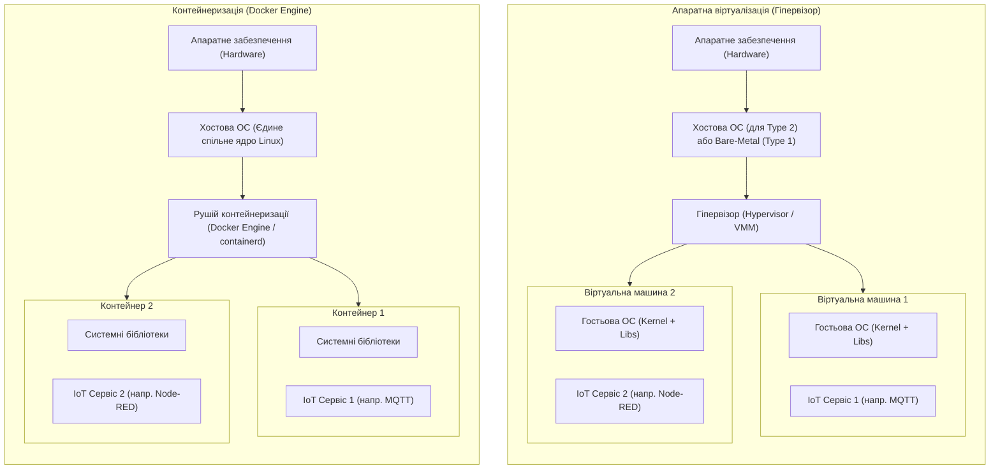
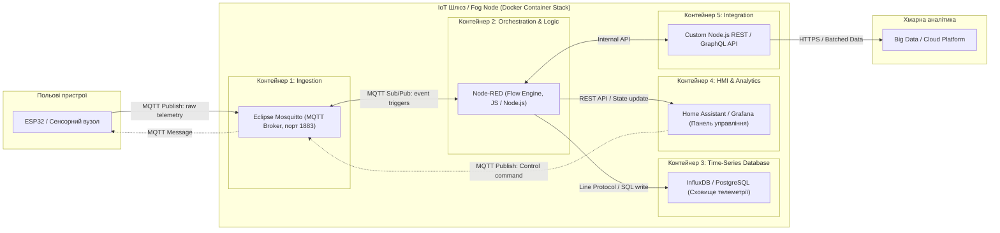
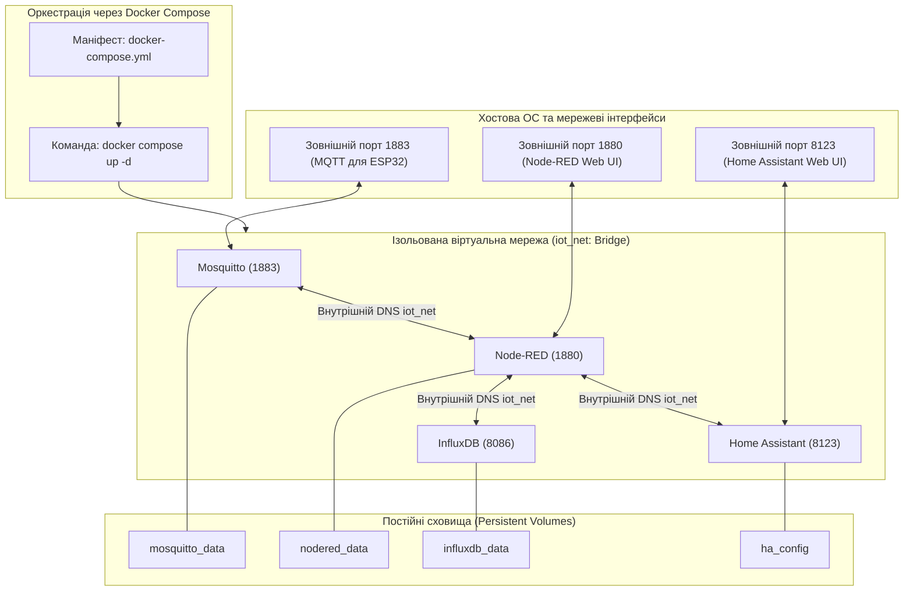

# Змістовий модуль 2. Апаратне та програмне забезпечення Edge-рівня

# Тема 9. Віртуалізація та контейнеризація IoT інфраструктури

---

## 9.1. Гіпервізори vs Контейнери (Docker)

### Основний зміст та теоретичний базис

Під час побудови серверної та туманної інфраструктури Інтернету речей ключовим викликом є забезпечення ізоляції, масштабованості та надійності програмних компонентів, що виконуються на обчислювальних вузлах різного класу — від малопотужних одноплатних комп'ютерів до високопродуктивних серверів центрів обробки даних. Традиційний підхід до розгортання всього програмного забезпечення безпосередньо в базовій операційній системі (bare-metal deployment) спричиняє виникнення конфліктів системних залежностей, ускладнює процес оновлення компонентів та створює загрозу повної відмови системи при збої одного з процесів. Для розв'язання цих проблем у сучасному інженерному проєктуванні застосовують технології віртуалізації, які принципово поділяються на апаратну віртуалізацію на основі гіпервізорів та віртуалізацію на рівні операційної системи, відому як контейнеризація.


*Рисунок 1 — Порівняння архітектури апаратної віртуалізації на базі гіпервізора та віртуалізації на рівні ядра операційної системи (Docker)*

Апаратна віртуалізація реалізується за допомогою монітора віртуальних машин або гіпервізора. Гіпервізори першого типу (Type 1, bare-metal), такі як VMware ESXi чи KVM, функціонують безпосередньо на фізичному обладнанні, тоді як гіпервізори другого типу (Type 2, hosted), представлені Oracle VirtualBox або VMware Workstation, запускаються як прикладні процеси поверх хостової операційної системи. У такій парадигмі кожна віртуальна машина містить власну повнофункціональну гостьову операційну систему зі своїм ядром, драйверами віртуальних пристроїв, системними службами та копіями бібліотек. Такий підхід гарантує найвищий рівень апаратної та безпекової ізоляції, проте створює критичні накладні витрати оперативної пам'яті, дискового простору та процесорного часу на емуляцію системних викликів і функціонування кількох паралельних ядер.

На противагу цьому, технологія контейнеризації на базі платформи Docker використовує механізми віртуалізації на рівні ядра єдиної хостової операційної системи Linux. Контейнери не містять гостьової операційної системи та віртуального ядра, а спільно використовують системне ядро хоста. 

Ізоляція процесів у середовищі Docker досягається завдяки трьом фундаментальним компонентам ядра Linux:
1. Простори імен (Linux Namespaces) забезпечують повну логічну ізоляцію системних ресурсів для кожного контейнера, включаючи таблицю ідентифікаторів процесів (pid), мережевий стек та інтерфейси (net), точки монтування файлових систем (mnt), засоби міжпроцесорної взаємодії (ipc), мережеві імена вузлів (uts) та облікові записи користувачів (user).
2. Контрольні групи (Control Groups, cgroups) встановлюють жорсткі кількісні обмеження на споживання фізичних ресурсів обчислювального вузла, дозволяючи квотувати виділення оперативної пам'яті, лімітувати кванти часу центрального процесора та обмежувати пропускну здатність дискового введення-виведення для кожного окремого контейнера.
3. Багатошарові файлові системи (Union File Systems, зокрема драйвер Overlay2) реалізують механізм копіювання при записі (Copy-on-Write, CoW), завдяки чому базові шари образів залишаються незмінними та спільно використовуються різними контейнерами, а всі зміни записуються лише у тонкий верхній шар конкретного екземпляра.

Математична модель порівняння загального обсягу споживаної оперативної пам'яті для архітектури на базі гіпервізора $M_{hypervisor}$ та контейнеризованої системи $M_{container}$ при розгортанні $N$ незалежних IoT-сервісів описується системою виразів:

$$M_{hypervisor} = M_{vmm} + \sum_{i=1}^{N} \left( M_{guest\_os, i} + M_{kernel, i} + M_{runtime, i} + M_{app, i} \right)$$

$$M_{container} = M_{host\_os} + M_{engine} + \sum_{i=1}^{N} \left( M_{runtime, i} + M_{app, i} + M_{cgroup, i} \right)$$

де $M_{vmm}$ позначає обсяг пам'яті, необхідний для роботи самого гіпервізора (Мбайт); $M_{guest\_os, i}$ є пам'яттю, яку споживають системні служби гостьової операційної системи $i$-ї віртуальної машини (зазвичай від $512\text{ Мбайт}$ до кількох гігабайтів); $M_{kernel, i}$ позначає пам'ять виділеного ядра гостьової ОС (Мбайт); $M_{runtime, i}$ та $M_{app, i}$ позначають обсяги пам'яті, що безпосередньо необхідні для середовища виконання та самого прикладного коду IoT-сервісу (Мбайт); $M_{host\_os}$ є обсягом пам'яті хостової системи (Мбайт); $M_{engine}$ відповідає системному навантаженню рушія Docker Engine (Мбайт); $M_{cgroup, i}$ є мінімальними накладними витратами структур ядра Linux на адміністрування контрольної групи $i$-го контейнера (зазвичай кілька кілобайтів).

Оскільки величина $M_{guest\_os} + M_{kernel} \gg M_{cgroup}$, показник коефіцієнта щільності розміщення мікросервісів $K_{density}$ на одному фізичному вузлі з обмеженим загальним обсягом пам'яті $M_{total}$ суттєво переважає на користь контейнеризації:

$$K_{density} = \frac{N_{container\_max}}{N_{vm\_max}} \approx \frac{M_{guest\_os} + M_{kernel} + M_{runtime} + M_{app}}{M_{runtime} + M_{app}}$$

де $N_{container\_max}$ та $N_{vm\_max}$ визначають теоретично граничну кількість одночасно запущених сервісів у контейнерах та віртуальних машинах відповідно. Для граничних шлюзів на базі архітектури ARM (наприклад, Raspberry Pi або промислових платформ із $2 \dots 4\text{ Гбайт}$ RAM) значення $K_{density}$ сягає від $5$ до $15$, що робить контейнеризацію єдиним практично життєздатним інструментом запуску багатокомпонентних програмних комплексів.

| Критерій порівняння | Апаратна віртуалізація (Гіпервізори) | Контейнеризація (Docker) |
| :--- | :--- | :--- |
| **Рівень абстракції** | Апаратний рівень (Емуляція фізичного заліза) | Рівень операційної системи (Спільне ядро Linux) |
| **Час холодного запуску** | Від десятків секунд до кількох хвилин | Від сотень мілісекунд до кількох секунд |
| **Накладні витрати пам'яті** | Високі (Кожна VM потребує від $512\text{ Мбайт}$ до кількох Гбайт) | Мінімальні (Лише накладні витрати на процес, одиниці Мбайт) |
| **Дисковий простір** | Гігабайти (Повний образ ОС для кожної інстанції) | Мегабайти (Шарувата структура образів із передосконаленим CoW) |
| **Продуктивність обчислень** | Можлива деградація через трансляцію інструкцій та переривань | Нативна швидкість виконання безпосередньо на процесорі хоста |
| **Рівень ізоляції** | Абсолютна ізоляція (Різні ядра, апаратні бар'єри CPU) | Процесна ізоляція (Спільне ядро створює спільний вектор атак) |
| **Портативність та CI/CD** | Важкі образи VM (OVA/OVF), повільне перенесення | Легкі та стандартизовані OCI-сумісні образи Docker |

Дані порівняльної таблиці підтверджують, що для Edge- та Fog-вузлів Інтернету речей контейнеризація забезпечує оптимальний компроміс між ізольованістю процесів та ефективністю утилізації обмежених апаратних потужностей.

---

## 9.2. Мікросервісна архітектура в ІоТ

### Основний зміст та теоретичний базис

Класична монолітна архітектура серверних систем, за якої прийом повідомлень від сенсорів, парсинг пакетів, бізнес-логіка управління, збереження даних у базі та візуалізація HMI-інтерфейсу скомпільовані в єдиний виконуваний модуль, виявляється непридатною для складних проектів Інтернету речей. Падіння одного з внутрішніх потоків через переповнення буфера пам'яті або зависання під час виконання складного аналітичного запиту призводить до аварійної зупинки всього моноліту, унеможливлюючи як збір критичної телеметрії, так і передачу команд на виконавчі пристрої.

Мікросервісна архітектура передбачає розбиття складної системи Інтернету речей на множину слабко зв'язаних, автономних, спеціалізованих сервісів, кожен із яких розгортається в окремому ізольованому контейнері та взаємодіє з іншими виключно через стандартизовані мережеві інтерфейси або брокери повідомлень.


*Рисунок 2 — Схема інформаційних потоків у мікросервісній архітектурі IoT-шлюзу на базі Docker-контейнерів*

Як продемонстровано на рисунку 2, кожен функціональний компонент шлюзу винесено в окремий контейнеризований мікросервіс:
1. Сервіс прийому телеметрії (Ingestion Microservice) реалізується легковагим брокером повідомлень Eclipse Mosquitto, який приймає сотні одночасних з'єднань від сенсорів за протоколом MQTT, витрачаючи мінімальний обсяг пам'яті (близько $10\text{ Мбайт}$).
2. Сервіс обробки та маршрутизації бізнес-логіки (Logic Microservice) будується на базі платформи Node-RED, яка трансформує вхідні повідомлення JSON, виконує скрипти обробки подій на JavaScript та керує взаємодією з іншими вузлами.
3. Сервіс довготривалого зберігання (Storage Microservice) представлений спеціалізованою базою даних часових рядів (Time-Series Database, наприклад InfluxDB), оптимізованою для високої швидкості запису метрик із мітками точного часу.
4. Сервіс представлення даних та HMI (Presentation Microservice) забезпечується системою Home Assistant або панелями Grafana, які надають оператору графічний веб-інтерфейс моніторингу та управління.
5. Сервіс зовнішньої інтеграції (Integration Microservice) реалізує кастомний REST API на базі середовища Node.js, транслюючи попередньо агреговані дані у віддалені хмарні платформи.

Ізоляція IoT-платформ у контейнерах надає фундаментальні переваги:
- Ізоляція збоїв та підвищення надійності: аварійне завершення обробника подій у Node-RED внаслідок некоректного вхідного формату пакета жодним чином не впливає на працездатність брокера Mosquitto; брокер продовжує приймати пакети від фізичних контролерів ESP32 та буферизувати їх у чергах.
- Співіснування гетерогенних середовищ виконання: в одній системі без конфліктів бібліотек функціонують бінарний компільований брокер на мові C (Mosquitto), середовище виконання Node.js (Node-RED), стек Python 3.11 для складних модулів аналітики та специфічні версії системних утиліт Linux.
- Гранулярне масштабування та оптимізація ресурсів: у разі зростання кількості польових датчиків адміністратор може виділити додаткові ядра процесора виключно для контейнера бази даних InfluxDB або брокера повідомлень за допомогою параметрів cgroups, не змінюючи конфігурацію інших компонентів.
- Безперервне оновлення без простою системи (Zero-Downtime Rolling Updates): оновлення версії веб-інтерфейсу Home Assistant здійснюється заміною одного контейнера за кілька секунд без зупинки фонового запису телеметрії в базу даних.

З погляду теорії надійності, доступність монолітної системи $A_{monolith}$ визначається як добуток коефіцієнтів готовності всіх її функціональних модулів:

$$A_{monolith} = \prod_{k=1}^{K} A_k$$

де $A_k$ є коефіцієнтом готовності $k$-го функціонального блоку ($0 \le A_k \le 1$), а $K$ — загальною кількістю модулів. Навіть за високої індивідуальної надійності блоків ($A_k = 0{,}99$) наявність десяти залежних компонентів знижує сумарну доступність моноліту до неприпустимого рівня $A_{monolith} = 0{,}99^{10} \approx 0{,}904$ ($90{,}4\%$).

У мікросервісній контейнеризованій системі з чергами повідомлень відмова сервісу обробки не призводить до втрати даних, оскільки вхідний потік буферизується брокером. Ймовірність втрати телеметрії $P_{loss}$ при виході з ладу мікросервісу обробки на час ремонту чи перезапуску контейнера $T_{down}$ мінімізується за умови, що розмір буфера черги $Q_{max}$ перевищує обсяг даних, накопичених за час простою:

$$P_{loss} = P\left( \int_{0}^{T_{down}} \lambda(t) \, dt > Q_{max} \right)$$

де $\lambda(t)$ позначає інтенсивність надходження вхідних повідомлень від сенсорної мережі у момент часу $t$ (пакетів/с), а $Q_{max}$ є максимальною місткістю апаратно виділеної черги повідомлень у пам'яті брокера.

---

## 9.3. Docker Compose для розгортання IoT-стеку

### Основний зміст та теоретичний базис

Для управління багатоконтейнерними мікросервісними комплексами на туманних та граничних вузлах стандартом де-факто є інструмент **Docker Compose**. Він реалізує парадигму «Інфраструктура як код» (Infrastructure as Code, IaC), дозволяючи в єдиному декларативному текстовому файлі формату **YAML** (`docker-compose.yml`) описати повну конфігурацію IoT-стеку: правила збирання та запуску контейнерів, розподіл портів введення-виведення, топологію віртуальних мереж, конфігурацію постійних сховищ даних та жорсткі ліміти апаратних ресурсів.


*Рисунок 3 — Топологія віртуальної мережі, мапінгу портів та томів даних, створена за допомогою Docker Compose*

При розгортанні IoT-інфраструктури через Docker Compose ключовими архітектурними елементами є:
- Управління мережевою взаємодією: рушій Compose створює виділену віртуальну міст-мережу (user-defined bridge network), у межах якої функціонує вбудований DNS-сервер. Контейнери звертаються один до одного за іменами служб (наприклад, рядок підключення у Node-RED має вигляд `mqtt://mosquitto:1883`, а не статичну IP-адресу). При цьому порти бази даних (наприклад, порт 8086 для InfluxDB) не публікуються на зовнішньому інтерфейсі хоста, що захищає сховище від несанкціонованого сканування ззовні.
- Забезпечення персистентності даних (Persistent Storage): оскільки файлова система контейнера за замовчуванням є ефемерною (знищується разом із контейнером), критичні дані конфігурації, дашбордів та історичних записів монтуються у виділені іменовані томи (Named Volumes) або локальні каталоги хостової системи (Bind Mounts).
- Політики автоматичного відновлення (Restart Policies): директива `restart: unless-stopped` гарантує, що у разі раптового перезавантаження апаратного шлюзу внаслідок збою електроживлення всі мікросервіси IoT-стеку автоматично запустяться у належній послідовності без потреби ручного втручання адміністратора.

Математична модель детермінованого планування ресурсів на прикордонному шлюзі вимагає, щоб сума встановлених жорстких лімітів пам'яті $M_{limit, j}$ та процесорних квот $C_{limit, j}$ для всіх $S$ мікросервісів стека не перевищувала доступних фізичних ресурсів обчислювального вузла з урахуванням системного резерву:

$$\sum_{j=1}^{S} M_{limit, j} \le M_{total\_RAM} - M_{system\_reserve}$$

$$\sum_{j=1}^{S} C_{limit, j} \le C_{total\_cores} - C_{system\_reserve}$$

де $M_{total\_RAM}$ позначає фізичний обсяг оперативної пам'яті шлюзу (Мбайт); $M_{system\_reserve}$ є резервом пам'яті для стабільного функціонування системного ядра Linux та фонових демонів (рекомендується не менше $20 \dots 25\%$ від загального обсягу); $C_{total\_cores}$ визначає сумарну обчислювальну потужність процесора (кількість еквівалентних ядер); $C_{system\_reserve}$ є резервом процесорного часу для обробки апаратних переривань та мережевих драйверів. Нехтування цими обмеженнями призводить до спрацьовування механізму ядра Linux Out-Of-Memory (OOM) Killer, який примусово аварійно зупиняє найбільш ресурсомісткі контейнери.

Нижче наведено професійний, академічно вивірений та практично оптимізований маніфест `docker-compose.yml`, призначений для розгортання базового серверного IoT-стеку на шлюзі:

```yaml
version: '3.8'

networks:
  iot_network:
    driver: bridge
    ipam:
      driver: default

volumes:
  mosquitto_data:
    driver: local
  mosquitto_log:
    driver: local
  nodered_data:
    driver: local
  influxdb_data:
    driver: local
  homeassistant_config:
    driver: local

services:
  mosquitto:
    image: eclipse-mosquitto:2.0.18
    container_name: iot_mosquitto
    restart: unless-stopped
    networks:
      - iot_network
    ports:
      - "1883:1883"
      - "9001:9001"
    volumes:
      - mosquitto_data:/mosquitto/data
      - mosquitto_log:/mosquitto/log
    deploy:
      resources:
        limits:
          cpus: '0.50'
          memory: 128M

  influxdb:
    image: influxdb:2.7.5
    container_name: iot_influxdb
    restart: unless-stopped
    networks:
      - iot_network
    volumes:
      - influxdb_data:/var/lib/influxdb2
    environment:
      - DOCKER_INFLUXDB_INIT_MODE=setup
      - DOCKER_INFLUXDB_INIT_USERNAME=iot_admin
      - DOCKER_INFLUXDB_INIT_PASSWORD=StrongIoTPlatformPassword2026
      - DOCKER_INFLUXDB_INIT_ORG=iot_department
      - DOCKER_INFLUXDB_INIT_BUCKET=telemetry_bucket
    deploy:
      resources:
        limits:
          cpus: '1.00'
          memory: 512M

  nodered:
    image: nodered/node-red:latest
    container_name: iot_nodered
    restart: unless-stopped
    networks:
      - iot_network
    ports:
      - "1880:1880"
    volumes:
      - nodered_data:/data
    environment:
      - TZ=Europe/Kyiv
    depends_on:
      - mosquitto
      - influxdb
    deploy:
      resources:
        limits:
          cpus: '0.75'
          memory: 384M

  homeassistant:
    image: ghcr.io/home-assistant/home-assistant:stable
    container_name: iot_homeassistant
    restart: unless-stopped
    networks:
      - iot_network
    ports:
      - "8123:8123"
    volumes:
      - homeassistant_config:/config
      - /etc/localtime:/etc/localtime:ro
    environment:
      - TZ=Europe/Kyiv
    depends_on:
      - mosquitto
    deploy:
      resources:
        limits:
          cpus: '1.00'
          memory: 512M
```

| Директива конфігурації Docker Compose | Тип параметра | Функціональне призначення в архітектурі IoT |
| :--- | :--- | :--- |
| `networks` | Мережева конфігурація | Створює ізольований програмний міст (Bridge), що унеможливлює доступ сторонніх хостів до внутрішніх шин взаємодії мікросервісів |
| `ports` | Мережевий мапінг | Відкриває доступ до сервісу ззовні шлюзу (наприклад, порт 1883 для ESP32 або 8123 для панелі моніторингу оператора) |
| `volumes` | Персистентне сховище | Відокремлює стан системи від життєвого циклу контейнера, зберігаючи дані БД та налаштування при перезапусках |
| `depends_on` | Управління залежностями | Визначає детермінований порядок ініціалізації сервісів під час системного старту |
| `deploy.resources.limits` | Квотування ресурсів | Обмежує виділення оперативної пам'яті та квантів процесорного часу через підсистему cgroups ядра Linux |
| `restart: unless-stopped` | Політика відмовостійкості | Забезпечує автоматичне перезавантаження сервісу при аварійних збоях або перезапуску шлюзу |

Аналіз наведених директив свідчить, що застосування Docker Compose стандартизує розгортання повного стеку інтернету речей, скорочуючи процес введення в експлуатацію нового шлюзу до виконання єдиної команди `docker compose up -d` та забезпечуючи абсолютну повторюваність програмного середовища незалежно від апаратного забезпечення.

---

### Питання для самоперевірки та аналітичного осмислення

1. Розкрийте принципову різницю в утилізації апаратних ресурсів (CPU, RAM, Disk) між гіпервізорами першого/другого типу та рушієм контейнеризації Docker при побудові туманних обчислювальних вузлів.
2. Яким чином механізми ядра Linux (Namespaces, Cgroups, Overlay2) забезпечують ізоляцію та квотування ресурсів для окремих контейнерів у системі?
3. Проаналізуйте причини, через які монолітна архітектура серверного програмного забезпечення демонструє низьку відмовостійкість у задачах збору високочастотної сенсорної телеметрії.
4. Поясніть роль черг повідомлень у брокері Mosquitto для забезпечення надійності системи у випадку аварійного перезапуску контейнера аналітичної обробки Node-RED.
5. На основі математичної моделі розподілу ресурсів шлюзу поясніть небезпеку виникнення ситуації нестачі пам'яті (Out of Memory) та наведіть методи захисту критичних IoT-сервісів за допомогою Docker Compose.
6. У чому полягає відмінність між директивами `ports` та `expose` у маніфесті `docker-compose.yml`, і як ця різниця використовується для підвищення рівня кібербезпеки баз даних телеметрії?
7. Обґрунтуйте необхідність використання іменованих томів (Named Volumes) при розгортанні баз даних часових рядів (наприклад, InfluxDB) у контейнеризованій інфраструктурі Інтернету речей.