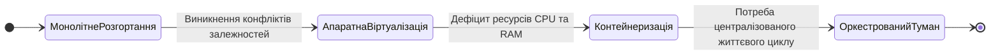
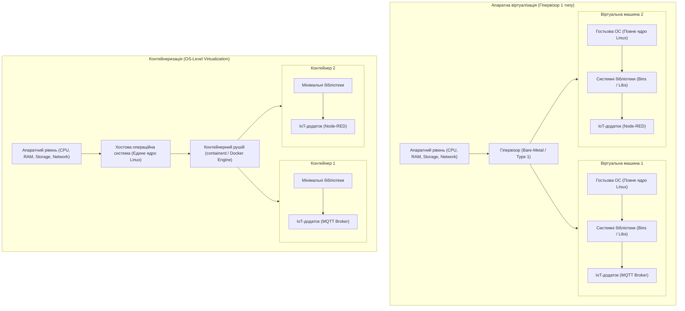
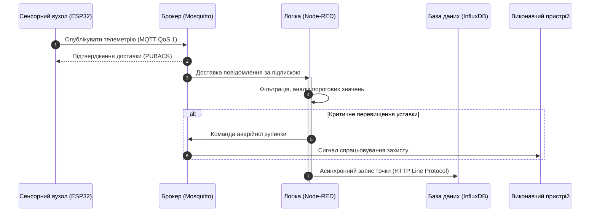
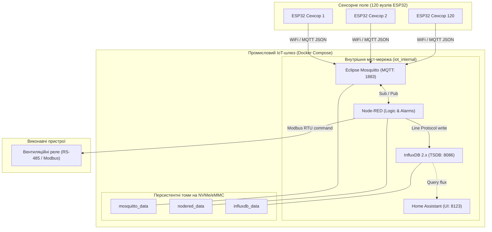

# Тема 9. Віртуалізація та контейнеризація IoT інфраструктури

## Мета лекції
Метою лекції є формування у майбутніх фахівців системних теоретичних знань та прикладних інженерних компетентностей щодо архітектурного проектування, ізоляції, автоматизованого розгортання та адміністрування віртуалізованих сервісів у розподілених середовищах Інтернету речей. Особливий наголос робиться на порівняльному аналізі апаратної віртуалізації на рівні гіпервізорів та легкої контейнеризації середовища Docker з урахуванням жорстких апаратних обмежень прикордонних і туманних обчислювальних вузлів. Опанування принципів мікросервісної декомпозиції та інструментів декларативної оркестрації дозволить студентам створювати відмовостійкі, масштабовані та кібербезпечні програмні комплекси шлюзів для збору, первинної аналітики, довготривалого збереження та маршрутизації телеметричних потоків даних.

## Очікувані результати навчання
1. **Знання та розуміння.** Здобувачі вищої освіти засвоять принципи функціонування моніторів віртуальних машин і системних механізмів просторів імен та контрольних груп ядра операційної системи, а також демонструватимуть розуміння архітектурної специфіки мікросервісного підходу в розподіленій інфраструктурі Інтернету речей.
2. **Застосування.** Студенти набудуть практичних навичок самостійно розробляти декларативні маніфести оркестрації Docker Compose для автоматизованого конфігурування, мережевої інтеграції та розгортання повного прикладного стеку служб обробки й візуалізації сенсорної інформації.
3. **Аналіз.** Слухачі навчаться критично порівнювати накладні витрати оперативної пам'яті, дискового простору та циклів центрального процесора при виборі між віртуальними машинами та контейнерами, виявляючи потенційні вузькі місця у пропускній здатності каналів міжсервісної взаємодії.
4. **Оцінювання та синтез.** Майбутні інженери зможуть комплексно оцінювати рівень відмовостійкості та інформаційної безпеки контейнеризованих систем, а також синтезувати раціональні схеми розподілу обчислювальних ресурсів граничних шлюзів в умовах пікових навантажень сенсорних мереж.

---

## Детальний покроковий план лекції

### 1. Теоретико-концептуальний базис. Архітектурні засади віртуалізації та контейнеризації на Edge і Fog рівнях IoT
* 1.1. Еволюція підходів до розгортання програмного забезпечення від монолітних середовищ bare-metal до ізольованих компонентів у туманних обчислювальних вузлах.
* 1.2. Порівняльний аналіз гіпервізорів першого та другого типів із контейнерними рушіями за критеріями утилізації апаратних ресурсів центрального процесора і пам'яті.
* 1.3. Системні механізми ядра Linux для забезпечення ізоляції контейнерів на основі просторів імен, контрольних груп та багатошарових файлових систем.
* 1.4. Формалізовані математичні моделі щільності розміщення мікросервісів та оцінки системних накладних витрат пам'яті на прикордонних обчислювачах.

### 2. Методологія та аналіз граничних умов. Проєктування мікросервісного стеку та декларативна оркестрація шлюзів
* 2.1. Принципи функціональної декомпозиції завдань інтернету речей на автономні мікросервіси прийому, аналітичної обробки, збереження та графічного відображення даних.
* 2.2. Декларативний опис багатоконтейнерних розподілених конфігурацій за допомогою специфікацій Docker Compose та маніфестів мови розмітки YAML.
* 2.3. Методика створення ізольованих програмних мостових мереж і правила безпечного прокидання мережевих портів між хостом і внутрішніми службами.
* 2.4. Забезпечення збереженості стану баз даних часових рядів за допомогою іменованих томів та конфігурування політик автоматичного відновлення процесів.
* 2.5. Апаратні обмеження вбудованих обчислювачів, критичні ризики аварійного завершення мікросервісів підсистемою Out-Of-Memory Killer та бар'єри вичерпання дискового ресурсу твердотільної пам'яті при інтенсивному журналюванні.

### 3. Практичний індустріальний / фаховий кейс. Розгортання відмовостійкого мікросервісного комплексу прикордонного шлюзу
**Тема наскрізної задачі.** «Розгортання контейнеризованого шлюзу збору кліматичної телеметрії та виявлення аварійних ситуацій на базі стеку Eclipse Mosquitto, Node-RED, InfluxDB та Home Assistant із апаратним квотуванням ресурсів»

## 1. Теоретико-концептуальний базис. Архітектурні засади віртуалізації та контейнеризації на Edge і Fog рівнях IoT

Сучасні концепції побудови інфраструктури Інтернету речей передбачають перехід від централізованих хмарних обчислень до багаторівневих ієрархічних моделей, що інтегрують ресурси безпосередньо на периферії мережі. Зростання потоків первинної телеметрії, жорсткі вимоги до детермінізму часу реакції у кіберфізичних системах та обмежена пропускна здатність висхідних каналів зв'язку зумовили формування парадигми граничних та туманних обчислень. У межах цієї архітектури прикордонні шлюзи виконують не лише функції ретрансляції та перепакування протоколів, а й повноцінні завдання попередньої фільтрації, локального аналізу, зберігання часових рядів і прийняття рішень у режимі реального часу. Реалізація такого широкого спектра обов'язків на обчислювачах із жорстко обмеженими апаратними можливостями вимагає застосування технологій логічної ізоляції процесів, гнучкого розподілу ресурсів та уніфікованого керування програмним забезпеченням.

### 1.1. Еволюція підходів до розгортання програмного забезпечення від монолітних систем bare-metal до ізольованих компонентів у туманних обчислювальних вузлах

Історичний розвиток програмного забезпечення для вбудованих систем та вузлів інтернету речей тривалий час спирався на монолітну парадигму розгортання безпосередньо на апаратному рівні, відому як підхід bare-metal. У таких архітектурах системне програмне забезпечення, мережевий стек, прикладні алгоритми збору телеметрії та низькорівневі драйвери компілювалися в єдиний монолітний образ або виконувалися як сукупність неізольованих процесів у межах єдиної інсталяції вбудованої операційної системи Linux. Подібний метод забезпечував максимальну швидкодію за рахунок відсутності проміжних рівнів абстракції, проте створював суттєві перешкоди під час масштабування та модифікації систем.

Головним деструктивним фактором монолітного підходу стала взаємна залежність програмних компонентів від системних динамічних бібліотек та конфігураційних файлів. Оновлення інтерпретатора або бібліотеки шифрування задля підтримки нового типу датчика нерідко призводило до втрати працездатності брокера повідомлень або підсистеми управління локальними інтерфейсами введення-виведення. Крім того, відсутність міжпроцесорних бар'єрів ізоляції створювала системні ризики: вичерпання виділеної оперативної пам'яті через витік в одному допоміжному модулі неминуче спричиняло падіння всієї операційної системи шлюзу, перериваючи функціонування критично важливих контурів регулювання технологічних процесів.

Необхідність забезпечення надійності та простоти супроводу стимулювала еволюцію моделей розгортання програмного забезпечення у напрямку ізоляції функціональних вузлів. Початкова спроба вирішення проблеми за допомогою апаратної віртуалізації дозволила розділити сервіси між незалежними віртуальними машинами, проте виявилася занадто ресурсомісткою для вбудованих обчислювачів. Логічним завершенням цієї еволюції стало впровадження технологій контейнеризації на рівні операційної системи, що дозволило поєднати сувору ізоляцію монолітів із нативною швидкодією bare-metal рішень.

На діаграмі відображено послідовні етапи переходу від неізольованих монолітних систем до сучасних контейнеризованих стеків, що динамічно оркеструються у вузлах туманних обчислень для забезпечення безперервного функціонування критичної інфраструктури.

> **ПРАКТИЧНИЙ ЯКІР:** На морських вітрогенераторних установках застосування контейнеризованої структури дозволяє дистанційно оновлювати мікросервіс прогнозної вібраційної аналітики підшипників турбіни без зупинки базового контейнера безпеки, який відповідає за аварійну зміну кута атаки лопатей при штормових поривах вітру.

### 1.2. Порівняльний аналіз гіпервізорів першого та другого типів із контейнерними рушіями за критеріями утилізації апаратних ресурсів центрального процесора і пам'яті

Технології ізоляції середовищ виконання принципово поділяються на повну апаратну віртуалізацію під управлінням гіпервізорів та віртуалізацію на рівні операційної системи, представлену рушіями контейнеризації. Вибір між цими підходами на рівнях Edge та Fog безпосередньо визначає межі продуктивності, енергоспоживання та обчислювальної щільності кінцевого обладнання.

Гіпервізори першого типу, які часто називають автономними або bare-metal гіпервізорами, завантажуються безпосередньо на фізичне обладнання сервера і беруть на себе функції управління процесорними сокетами, системною шиною та адресним простором оперативної пам'яті. Представниками цього класу є комерційні платформи корпоративного рівня та відкриті рішення на базі ядра із вбудованими модулями віртуалізації. Вони забезпечують найвищий рівень ізоляції та стабільний захист від взаємного впливу гостьових систем, проте вимагають значного обсягу апаратних ресурсів для власного функціонування. Гіпервізори другого типу функціонують як звичайні користувацькі процеси поверх існуючої хостової операційної системи, транслюючи апаратні виклики через системне ядро хоста, що спричиняє подвійні накладні витрати на диспетчеризацію та суттєво уповільнює обробку переривань від зовнішніх інтерфейсів введення-виведення.

Принципова відмінність контейнеризації полягає у відмові від емуляції віртуального заліза та використанні єдиного екземпляра ядра операційної системи для всіх ізольованих середовищ. Завдяки цьому контейнери виключають необхідність запуску декількох паралельних копій планувальника завдань, підсистем керування віртуальною пам'яттю та стеків мережевих драйверів.

| Парадигма розгортання | Архітектурний рівень абстракції | Накладні витрати ресурсів (CPU/RAM/IO) | Рівень безпекової ізоляції | Приклад з реальної практики |
| :--- | :--- | :--- | :--- | :--- |
| **Гіпервізори 1 типу (Type 1 Bare-Metal)** | Апаратний шар абстракції (віртуалізація процесора, пам'яті, шин введення-виведення) | Високі: вимагають фіксованого виділення RAM (від 512 Мбайт на VM) та циклів CPU на роботу ядра гостьової ОС | Критично високий: апаратна ізоляція адресного простору на рівні кілець захисту процесора | Багатопрофільні сервери SCADA систем та сервери хмарних ЦОД корпоративних мереж |
| **Гіпервізори 2 типу (Type 2 Hosted)** | Прикладний шар поверх хостової ОС (емуляція заліза через системні виклики базової ОС) | Надзвичайно високі: подвійна диспетчеризація команд процесора та переривань контролерів | Помірний: безпека залежить від стабільності як хостової ОС, так і гіпервізора | Стенди локального налагодження та емуляції гетерогенних мереж розробниками |
| **Контейнеризація (Docker, containerd)** | Рівень простору користувача єдиного системного ядра операційної системи | Мінімальні: практично нульові витрати CPU на трансляцію команд, RAM виділяється виключно під робочий процес | Достатній для більшості задач: ізоляція системних викликів, спільне ядро для всіх сервісів | Прикордонні шлюзи на базі промислових комп'ютерів серії Dell Edge Gateway або модулів Advantech |

> **ТИПОВА ПОМИЛКА:** Хибним є уявлення про те, що контейнер містить власне компактне ядро операційної системи, подібне до спрощеного ядра вбудованого Linux. Контейнер являє собою звичайний процес хостової операційної системи, ізольований за допомогою вбудованих низькорівневих примітивів ядра, тому він повністю розділяє ресурси та стан хостового ядра і не здатний виконувати драйвери пристроїв, скомпільовані під відмінні версії ядер.

### 1.3. Системні механізми ядра Linux для забезпечення ізоляції контейнерів на основі просторів імен, контрольних груп та багатошарових файлових систем

Функціонування контейнерного середовища базується на поєднанні трьох незалежних фундаментальних підсистем ядра Linux, які разом створюють стійку ілюзію роботи програми на окремому комп'ютері:

Простори імен (Linux Namespaces) забезпечують віртуалізацію системних ресурсів, обмежуючи видимість глобальних структур ядра для конкретного процесу. Ядро Linux реалізує кілька типів просторів імен:
1. Простір ідентифікаторів процесів (pid namespace) забезпечує ізоляцію нумерації процесів, завдяки чому головний процес всередині контейнера отримує ідентифікатор одиниці, що дозволяє йому здійснювати ініціалізацію та перехоплення сигналів, тоді як у глобальній таблиці хоста він має довільний старший номер.
2. Мережевий простір імен (net namespace) надає контейнеру персональний віртуальний мережевий стек, що включає власну таблицю маршрутизації, правила фільтрації міжмережевого екрана, сокети та віртуальні мережеві інтерфейси, такі як пара віртуальних адаптерів типу veth.
3. Простір точок монтування (mnt namespace) відокремлює ієрархію файлової системи контейнера від загального дерева файлів хостової машини.
4. Простір міжпроцесорної взаємодії (ipc namespace) ізолює черги повідомлень, семафори та сегменти спільної пам'яті стандарту POSIX.
5. Простір імен доменних імен та хоста (uts namespace) дозволяє кожному контейнеру встановлювати власні локальні мережеві імена.
6. Простір ідентифікаторів користувачів (user namespace) транслює локальний обліковий запис адміністратора всередині контейнера на непривілейованого користувача на хостовому сервері, що суттєво підвищує загальний рівень кібербезпеки.

Контрольні групи (Control Groups, cgroups версій v1 та v2) вирішують завдання кількісного обмеження та пріоритезації утилізації фізичних ресурсів обчислювального вузла. Контрольні групи дозволяють виділяти ліміти процесорного часу через квоти планувальника повністю справедливого розподілу (Completely Fair Scheduler, CFS), встановлювати жорсткі межі споживання оперативної пам'яті для запобігання падінню системи через витоки, а також регулювати швидкість дискового введення-виведення для запобігання монополізації накопичувачів фоновими завданнями журналювання.

Багатошарові файлові системи на основі драйвера Overlay2 реалізують оптимізацію роботи з довготривалою пам'яттю за допомогою механізму копіювання при записі (Copy-on-Write, CoW). Структура контейнерного образу формується з послідовності незмінних базових шарів, доступних виключно для читання, поверх яких під час запуску накладається тонкий шар змін конкретного контейнера. Якщо контейнеру необхідно модифікувати існуючий системний конфігураційний файл, драйвер зберігання копіює його з нижнього незмінного шару у верхній робочий каталог і виконує модифікацію, залишаючи базові шари цілісними для повторного використання іншими мікросервісами.

> **ПРАКТИЧНИЙ ЯКІР:** У підсистемах автоматичного управління швидкісними електропоїздами критичний сервіс збору показників з температурних датчиків осей коліс ізольовано за допомогою контрольної групи cgroups із резервуванням фіксованої квоти процесорного часу, що повністю нівелює ризик затримки обробки аварійного сигналу навіть у моменти пікового навантаження мережевого стека зв'язку з диспетчерським центром.

### 1.4. Формалізовані математичні моделі щільності розміщення мікросервісів та оцінки системних накладних витрат пам'яті на прикордонних обчислювачах

Для математичного обґрунтування вибору архітектури розгортання в умовах дефіциту обчислювальних потужностей необхідно формалізувати баланс споживання системних ресурсів. Розглянемо фізичний прикордонний вузол, що володіє загальним обсягом оперативної пам'яті $M_{\text{RAM}}$, на якому необхідно розгорнути $N$ функціональних мікросервісів обробки даних сенсорної мережі.

Загальний обсяг пам'яті, що вимагається для підтримки інфраструктури на базі гіпервізора $M_{\text{total\_hyp}}$, формується як сума витрат на базову операційну систему, сам монітор віртуальних машин та сукупність ресурсів, виділених для кожної гостьової віртуальної машини:

$$M_{\text{total\_hyp}} = M_{\text{host}} + M_{\text{hyp}} + \sum_{i=1}^{N} \left( M_{\text{guest\_os}, i} + M_{\text{kernel}, i} + M_{\text{runtime}, i} + M_{\text{app}, i} \right)$$

У цьому рівнянні змінна $M_{\text{host}}$ визначає обсяг пам'яті, зайнятий первинною операційною системою шлюзу, виражений у мегабайтах; змінна $M_{\text{hyp}}$ описує накладні витрати коду самого гіпервізора на диспетчеризацію та управління апаратними ресурсами; параметр $M_{\text{guest\_os}, i}$ позначає системну пам'ять, необхідну для функціонування служб та демонів гостьової операційної системи всередині $i$-ї віртуальної машини; змінна $M_{\text{kernel}, i}$ відповідає обсягу статичних структур виділеного ядра гостьової ОС; $M_{\text{runtime}, i}$ є обсягом пам'яті середовища виконання конкретного сервісу, такого як віртуальна машина Java або інтерпретатор Node.js; змінна $M_{\text{app}, i}$ позначає пам'ять, безпосередньо зайняту бізнес-кодом та динамічними даними телеметрії.

Для контейнеризованої системи на базі рушія Docker або containerd загальні витрати пам'яті $M_{\text{total\_cont}}$ визначаються без необхідності дублювання ядер та гостьових систем:

$$M_{\text{total\_cont}} = M_{\text{host}} + M_{\text{daemon}} + \sum_{i=1}^{N} \left( M_{\text{runtime}, i} + M_{\text{app}, i} + \delta_{\text{cgroup}, i} \right)$$

де змінна $M_{\text{daemon}}$ позначає обсяг пам'яті, що витрачається фоновою службою контейнерного рушія на управління контейнерами; величина $\delta_{\text{cgroup}, i}$ описує мінімальні накладні витрати структур ядра Linux, виділені для адміністрування контрольної групи та просторів імен $i$-го екземпляра контейнера, що зазвичай вимірюється одиницями кілобайт.

Спираючись на наведені балансові рівняння, теоретично граничну кількість одночасно виконуваних мікросервісів у межах доступного апаратного пулу оперативної пам'яті можна визначити за допомогою коефіцієнта обчислювальної щільності $K_{\text{density}}$, припускаючи усереднені однакові вимоги до сервісів:

$$K_{\text{density}} = \frac{N_{\text{cont\_max}}}{N_{\text{hyp\_max}}} = \frac{\left\lfloor \frac{M_{\text{RAM}} - M_{\text{host}} - M_{\text{daemon}}}{M_{\text{runtime}} + M_{\text{app}} + \delta_{\text{cgroup}}} \right\rfloor}{\left\lfloor \frac{M_{\text{RAM}} - M_{\text{host}} - M_{\text{hyp}}}{M_{\text{guest\_os}} + M_{\text{kernel}} + M_{\text{runtime}} + M_{\text{app}}} \right\rfloor}$$

де символи $\lfloor \dots \rfloor$ позначають математичну операцію взяття цілої частини числа, що відображає дискретність кількості розгорнутих інстанцій. З огляду на те, що типові значення $M_{\text{guest\_os}} + M_{\text{kernel}}$ становлять від 300 до 1024 Мбайт для мінімальних збірок Linux, тоді як $\delta_{\text{cgroup}}$ не перевищує десятків кілобайт, коефіцієнт $K_{\text{density}}$ для прикордонних шлюзів із загальним пулом пам'яті 2–4 Гбайт досягає значень від 6 до 12. Це аналітично доводить неможливість застосування класичних віртуальних машин для щільного розгортання десятків автономних мікросервісів на периферійних вузлах.

Накладні часові витрати на виконання квантів обчислювальних операцій $\tau_{\text{exec}}$ у процесорному конвеєрі для обох підходів моделюються через тривалість контекстного перемикання та трансляцію системних викликів:

$$\tau_{\text{exec}} = \tau_{\text{app}} + \Delta \tau_{\text{switch}} \cdot \left( 1 + \alpha_{\text{vmm}} \right)$$

де $\tau_{\text{app}}$ є чистим часом виконання алгоритму обробки телеметрії процесором безпосередньо в машинних інструкціях; $\Delta \tau_{\text{switch}}$ позначає тривалість стандартного апаратного перемикання контексту між процесами на рівні системного планувальника; параметр $\alpha_{\text{vmm}}$ є коефіцієнтом додаткового уповільнення, обумовленим втручанням монітора віртуальних машин або перехопленням привілейованих інструкцій через технології вкладених сторінкових таблиць (Extended Page Tables). Для контейнерів коефіцієнт $\alpha_{\text{vmm}} = 0$, оскільки процес взаємодіє з ядром напряму через стандартний інтерфейс викликів posix, тоді як для апаратної віртуалізації $\alpha_{\text{vmm}} > 0$, що зумовлює деградацію часу відгуку при високій інтенсивності обробки апаратних переривань.

> **КОНТРОЛЬНЕ ПИТАННЯ:** Яким чином механізм ядра Linux Out-Of-Memory Killer реагує на ситуацію перевищення фізичного ліміту пам'яті окремим контейнером, для якого у відповідній контрольній групі встановлено параметр обмеження `memory.max`, і чому за правильної конфігурації це не призводить до аварійної зупинки всієї операційної системи IoT-шлюзу?

Розгорнути аналіз / відповідь

**Правильний варіант: Аварійна зупинка виключно процесів усередині контрольної групи контейнера без порушення стабільності хостової ОС.**

1. Підсистема контрольних груп (cgroups v2) через параметр `memory.max` встановлює жорстку верхню межу пулу оперативної пам'яті разом зі сторінковим кешем для всіх процесів, закріплених за конкретним простором імен. Коли сумарне споживання пам'яті всередині контрольної групи перевищує задане значення, ядро Linux спочатку ініціює примусове скидання сторінкового кешу та механізми прямого вивільнення (direct reclaim). Якщо дефіцит пам'яті ліквідувати не вдається, механізм Out-Of-Memory Killer активується локально в межах цієї контрольної групи. На основі внутрішньої оцінки `oom_score` обирається та примусово завершується системним сигналом `SIGKILL` найбільш енергоємний процес саме всередині контейнера. Оскільки ресурси процесу повністю обмежені його власною контрольною групою, хостова операційна система та сусідні критичні контейнери (наприклад, брокер MQTT чи драйвер шини CAN) не відчувають браку ресурсів і продовжують виконуватися у штатному режимі.

2. Аналіз дистракторів: гіпотеза про те, що аварія одного процесу викличе паніку всього ядра (kernel panic), є хибною, оскільки саме ізоляція cgroups усуває монополізацію пам'яті. Твердження про те, що надлишок пам'яті автоматично скидається на диск у розділ swap, є невірним у випадках, коли використання swap заборонено директивою конфігурації або фізично відключено на твердотільних вбудованих накопичувачах для захисту кристалів Flash-пам'яті від деградації через обмежений ресурс циклів перезапису.

### Вказівки для самостійного осмислення

1. Зіставте вимоги до апаратної бази шлюзів Інтернету речей та розрахуйте теоретичну межу кількості мікросервісів обробки телеметрії, які можна одночасно розгорнути на платформі Raspberry Pi 4 із двома гігабайтами оперативної пам'яті, використовуючи наведену в підрозділі 1.4 математичну модель балансу пам'яті за умови середнього споживання одним сервісом вісімдесяти мегабайтів.
2. Проаналізуйте наслідки використання дискових шарів Overlay2 для надійності промислових накопичувачів Flash-пам'яті та сформулюйте інженерні рекомендації щодо правильного винесення директорій інтенсивного збереження баз даних за межі файлової системи контейнера.
3. Дослідіть архітектуру просторів імен ядра Linux та визначте, які потенційні загрози несанкціонованого підвищення привілеїв виникають у системі в разі запуску Docker-контейнера з прапорцем повного привілейованого доступу до апаратних пристроїв хоста.

## 2. Методологія та аналіз граничних умов. Проєктування мікросервісного стеку та декларативна оркестрація шлюзів

Перехід від теоретичних концепцій контейнеризації до практичної реалізації розподілених вузлів Інтернету речей вимагає застосування суворої інженерної методології. Прикордонний шлюз класу Edge або Fog є компромісним обчислювальним середовищем, де одночасно діють жорсткі обмеження на споживання електроенергії, ліміти пропускної здатності каналів пам'яті та дефіцит ресурсу накопичувачів Flash. У таких умовах проектування програмного комплексу не може спиратися на надлишкові патерни хмарних центрів обробки даних. Інженер повинен володіти формалізованими методами декомпозиції функціональних завдань, розрахунку балансу ресурсів та конфігурування засобів оркестрації з урахуванням граничних умов експлуатації, за яких система наближається до стану відмови або аварійної деградації.

### 2.1. Принципи функціональної декомпозиції завдань інтернету речей на автономні мікросервіси прийому, аналітичної обробки, збереження та графічного відображення даних

Методологія мікросервісної декомпозиції для периферійних систем IoT базується на принципі розподілу відповідальності (Separation of Concerns) та концепції предметно-орієнтованого проектування (Domain-Driven Design). Замість створення єдиної програми, яка опитує датчики, зберігає дані на диск та генерує користувацький веб-інтерфейс, система розбивається на функціональні домени, кожен із яких функціонує в окремому процесному просторі з мінімально необхідним набором привілеїв.

Першим рівнем декомпозиції є шар прийому телеметрії (Ingestion Layer). Основним завданням цього шару є забезпечення гарантованого підключення гетерогенних польових сенсорів та первинних контролерів через протоколи з низькими накладними витратами. Мікросервіс прийому повинен мати мінімальний розмір кодової бази та не містити складної бізнес-логіки, щоб запобігти блокуванню вхідних мережевих сокетів під час пікових навантажень.

Другим рівнем виступає шар обробки подій та оркестрації бізнес-правил (Processing and Business Logic Layer). Цей компонент ізолюється від мережевого прийому, отримуючи інформаційні пакети виключно через локальний брокер повідомлень за підпискою на відповідні топіки. Тут реалізуються алгоритми фільтрації шумів, перевірка виходу параметрів за технологічні уставки, лінеаризація калібрувальних кривих та формування керуючих впливів для актуаторів зворотного зв'язку.

Третім і четвертим рівнями є шар збереження часових рядів (Persistence Layer) та шар представлення інформації оператору (Presentation Layer). База даних часових рядів оптимізується виключно під операції потокового послідовного запису з автоматичним стисненням метрик та агрегацією за часовими вікнами. Сервіс графічної візуалізації HMI функціонує автономно, звертаючись до бази даних лише за фактом відкриття сесії користувачем, що виключає вплив рендерингу веб-інтерфейсів на обчислювальний процес критичних контурів управління.

Наведена діаграма послідовностей демонструє часовий розподіл потоків даних між ізольованими мікросервісами шлюзу під час фіксації аварійної події на об'єкті, підкреслюючи паралелізм та незалежність процесів обробки і збереження.

> **ВАЖЛИВО:** Фундаментальним архітектурним правилом мікросервісної декомпозиції в IoT є повна заборона прямої синхронної взаємодії між сервісом прийому телеметрії та базою даних. Усі потоки повинні розв'язуватися через асинхронні буферизовані черги брокера повідомлень, що гарантує збереження цілісності з'єднань із сенсорами навіть під час тимчасового блокування дискового введення-виведення бази даних.

### 2.2. Декларативний опис багатоконтейнерних розподілених конфігурацій за допомогою специфікацій Docker Compose та маніфестів мови розмітки YAML

Декларативна методологія розгортання «Інфраструктура як код» (IaC) замінює ручне покрокове введення команд у терміналі на формалізований опис кінцевого цільового стану системи за допомогою файлу специфікації `docker-compose.yml`. Декларативний підхід забезпечує відтворюваність середовища на будь-якому екземплярі шлюзу, виключаючи людський фактор та невідповідності у версіях залежностей між етапами розробки, заводського тестування та промислової експлуатації.

Маніфест мови YAML структурує опис багатокомпонентного середовища у вигляді дерева параметрів, що визначають джерела образів, механізми ізоляції та правила використання системних ресурсів. Під час проектування системного стеку для Edge-вузлів інженер зобов'язаний застосовувати комплексний підхід до вибору стратегій ізоляції та розгортання, зіставляючи функціональні переваги зі складністю супроводу та супутніми ризиками.

| Стратегія організації середовища | Архітектурний стек | Складність впровадження | Критичні ризики / Обмеження | Приклад з реальної практики |
| :--- | :--- | :--- | :--- | :--- |
| **Монолітне виконання в хостовій ОС** | Системні демони Linux (systemd, native C/Python) | Низька: відсутність абстракцій, безпосередній запуск бінарних файлів | Конфлікти версій бібліотек glibc, взаємне блокування пам'яті, аварійна зупинка всього шлюзу при збої одного процесу | Прості цифрові лічильники електроенергії на базі мікроконтролерів без динамічних оновлень |
| **Повна ізоляція на гіпервізорах** | Type 1 KVM / Xen, віртуальні машини Linux Yocto | Висока: вимагає розробки образів гостьових ОС, налаштування віртуальних комутаторів | Критичний оверхед RAM (від 512 Мбайт на службу), неможливість запуску на бюджетних ARM SoC із малим обсягом пам'яті | Бортові обчислювальні комплекси авіаційних систем із сертифікацією розділення критичних доменів |
| **Мікросервісна контейнеризація** | Docker Engine, containerd, специфікація OCI | Помірна: проектування шаруватих образів, декларативних маніфестів YAML | Спільне системне ядро створює вектор уразливості при атаках класу Privilege Escalation, навантаження на Flash при неправильному журналюванні | Промислові шлюзи перекачувальних станцій на базі Advantech та Dell Edge Gateway 5000 |
| **Гібридне безапаратне виконання (Unikernel)** | Бібліотечні ОС (OSv, MirageOS) поверх апаратного рівня | Критично висока: специфічні інструменти збирання, обмежена підтримка стандартних бібліотек | Відсутність стандартних засобів налагодження на місці експлуатації, складність організації багатопотокового вводу-виводу | Високошвидкісні шлюзи криптографічного шифрування телеметрії військового призначення |

Аналітичне порівняння демонструє, що мікросервісна контейнеризація за допомогою Docker Compose забезпечує найкращий компроміс між складністю інженерного супроводу та відмовостійкістю для промислових рішень автоматизації.

### 2.3. Методика створення ізольованих програмних мостових мереж і правила безпечного прокидання мережевих портів між хостом і внутрішніми службами

Мережева архітектура контейнеризованого вузла IoT повинна проектуватися відповідно до концепції нульової довіри (Zero Trust Architecture). За замовчуванням будь-який порт, відкритий для доступу ззовні шлюзу, розглядається як потенційний вектор проведення атак на відмову в обслуговуванні або несанкціонованого проникнення до внутрішніх шин керування.

Методика створення безпечного мережевого середовища засобами Docker базується на створенні користувацьких програмних мостів (user-defined bridge networks). Коли рушій ініціалізує таку мережу, у просторі ядра Linux створюється новий віртуальний комутатор, до якого підключаються кінці пар віртуальних інтерфейсів типу `veth`, інша частина яких делегується у мережевий простір імен конкретного контейнера. Між процесами всередині одного моста автоматично активується механізм вирішення мережевих імен через вбудований DNS-сервер Docker, що дозволяє службам спілкуватися без фіксації статичних IP-адрес.

Принципове значення має розмежування директив `ports` та `expose` у маніфестах конфігурації:
- Директива `ports` здійснює фізичне зв'язування порту хостової системи з портом контейнера за допомогою генерації правил перенаправлення адрес (Destination NAT) у підсистемі `iptables` або `nftables`. Тільки ті сервіси, які безпосередньо взаємодіють із зовнішніми пристроями, повинні публікуватися через цю директиву.
- Директива `expose` лише декларує готовність контейнера приймати трафік на вказаному порту виключно від інших контейнерів, підключених до тієї самої внутрішньої віртуальної мережі. При цьому порт не публікується на фізичних інтерфейсах шлюзу (Ethernet, Wi-Fi або LTE).

У професійно спроектованому IoT-стеку порти баз даних часових рядів (наприклад, порт 8086 для InfluxDB) категорично заборонено публікувати на зовнішньому мережевому інтерфейсі. Доступ до накопичених метрик повинен надаватися виключно авторизованим внутрішнім мікросервісам аналітики та представлення через закритий сегмент віртуального моста.

> **ПРАКТИЧНИЙ ЯКІР:** У 2020 році внаслідок некоректного прокидання порту бази даних безпосередньо у зовнішню мережу без обмеження мережевого інтерфейсу дослідниками безпеки було виявлено у відкритому доступі понад 15 000 незахищених промислових баз даних MQTT-телеметрії водоочисних споруд та систем освітлення, що створило загрозу віддаленого впровадження хибних уставок автоматики.

### 2.4. Забезпечення збереженості стану баз даних часових рядів за допомогою іменованих томів та конфігурування політик автоматичного відновлення процесів

Контейнери за своєю природою проектуються як ефемерні сутності (stateless), чия файлова система знищується під час кожного оновлення, перестворення або аварійного завершення образу. Однак такі ключові компоненти інфраструктури IoT, як бази даних часових рядів (Time-Series DBMS), сховища конфігурацій брокера та файли сценаріїв логіки є системами зі збереженням стану (stateful). Збереження їхніх даних вимагає винесення операцій запису за межі багатошарової файлової системи Overlay2.

Для вирішення цього завдання застосовується підсистема томів даних (Volumes). Архітектурно іменований том являє собою виділену директорію у файловій системі хостової операційної системи, яка монтується безпосередньо в цільову точку монтування контейнера в обхід драйвера CoW. Це забезпечує повну швидкість введення-виведення на рівні фізичного накопичувача, усуває накладні витрати на копіювання файлів під час запису та гарантує збереження історичної телеметрії навіть при повному видаленні контейнера з бази даних.

Методологія відмовостійкості на прикордонному шлюзі вимагає обов'язкового налаштування політик відновлення процесів (Restart Policies). У розподілених кіберфізичних системах неприпустима ситуація, за якої тимчасовий збій живлення або помилка в прикладній функції виводить сервіс із ладу до моменту фізичного візиту сервісного інженера. Конфігурація директиви `restart: unless-stopped` інструктує системний демон контейнеризації автоматично ініціювати перезапуск контейнера при аварійному виході з ненульовим кодом завершення, а також перезапускати весь стек служб під час холодного завантаження операційної системи шлюзу після відновлення живлення.

### 2.5. Апаратні обмеження вбудованих обчислювачів, критичні ризики аварійного завершення мікросервісів підсистемою Out-Of-Memory Killer та бар'єри вичерпання дискового ресурсу твердотільної пам'яті при інтенсивному журналюванні

Проектування мікросервісного стеку для вбудованих систем натрапляє на суворі бар'єри фізичного обладнання. Найбільш критичними деструктивними факторами є обмеженість обсягу оперативної пам'яті та кінцевий фізичний ресурс циклів перезапису мікросхем енергонезалежної Flash-пам'яті (eMMC, SD-карт або вбудованих чіпів NAND).

Формалізований процес розрахунку надійності та розміщення служб для запобігання відмовам шлюзу описується наступною аналітичною послідовністю кроків:

$$
\begin{aligned}
\text{Крок 1 (Розрахунок ліміту RAM):} & \quad \sum_{j=1}^{S} M_{\text{limit}, j} + M_{\text{reserve}} \le M_{\text{total}} \\
\text{Крок 2 (Баланс процесорних квот):} & \quad \sum_{j=1}^{S} \frac{C_{\text{quota}, j}}{C_{\text{period}}} \le N_{\text{cores}} \cdot (1 - \mu_{\text{sys}}) \\
\text{Крок 3 (Оцінка деградації Flash):} & \quad T_{\text{life}} = \frac{E_{\text{NAND}} \cdot C_{\text{PE}}}{W_{\text{daily}} \cdot \text{WAF}}
\end{aligned}
$$

де у формулі Кроку 1 змінна $M_{\text{limit}, j}$ позначає встановлену в маніфесті верхню межу пам'яті для $j$-го контейнера через механізм cgroups; параметр $M_{\text{reserve}}$ є обов'язковим буфером оперативної пам'яті (не менше $25\%$ від загального пулу), зарезервованим виключно під системні потреби ядра Linux, кешування та обслуговування мережевих черг сокетів; $M_{\text{total}}$ визначає фізичний обсяг пам'яті мікросхем RAM шлюзу.

У моделі Кроку 2 параметр $C_{\text{quota}, j}$ визначає квант часу процесора у мікросекундах, що надається процесам контейнера протягом базового періоду $C_{\text{period}}$ (за замовчуванням $100\,000\text{ мкс}$); величина $N_{\text{cores}}$ відповідає фізичній кількості процесорних ядер архітектури ARM або x86; коефіцієнт $\mu_{\text{sys}}$ встановлює частку продуктивності, яка обов'язково утримується для обробки апаратних переривань та контекстних переходів ядра.

У моделі деградації накопичувача Кроку 3 змінна $T_{\text{life}}$ позначає прогнозований термін служби Flash-пам'яті у днях; $E_{\text{NAND}}$ є фізичною ємністю накопичувача у гігабайтах; $C_{\text{PE}}$ визначає паспортний ліміт циклів перезапису блоків пам'яті (Program/Erase Cycles, що для побутових карт типу TLC/QLC становить усього $500 \dots 1500$ циклів); $W_{\text{daily}}$ відповідає щоденному обсягу корисних даних, що записуються системою; величина $\text{WAF}$ позначає коефіцієнт посилення запису (Write Amplification Factor), який через специфіку блочного стирання у твердотільних накопичувачах може досягати значень від $3$ до $10$ при дрібноблоковому записі логів.

#### Граничні умови функціонування та сценарії відмови

Наведена методологічна модель розрахунку втрачає адекватність і призводить до системного колапсу в низці граничних технічних ситуацій, які виникають під час практичної експлуатації:

Перша гранична умова: тривалий обрив висхідного каналу передачі даних до хмари (Network Outage). Якщо під час аварії зовнішнього каналу зв'язку брокер повідомлень або мікросервіс логіки налаштовані на збереження черг повідомлень у пам'яті без фіксованого ліміту повідомлень, настає швидке вичерпання виділеного пулу $M_{\text{limit}}$. Спроба виділити додаткову сторінку пам'яті викличе негайне спрацьовування механізму ядра Out-Of-Memory (OOM) Killer. Якщо параметри cgroups були налаштовані без жорсткого відокремлення сторінкового кешу, ядро знищить процес брокера, що спричинить лавиноподібне відключення всіх локальних сенсорів.

Друга гранична умова: неконтрольований шторм повідомлень (Telemetry Flooding). У разі апаратного пошкодження сенсорного кола (наприклад, деренчання контактів або відмова компаратора АЦП) частота генерації повідомлень може зрости на три порядки. Якщо в контейнері логіки відсутній алгоритм обмеження частоти (Rate Limiting), процесорна квота вичерпується за лічені мілісекунди. Виникає ефект процесорного голодування (CPU Starvation) для сусідніх служб, за якого планувальник Linux не здатний вчасно виділити кванти часу критичним контурам регулювання, переводячи технологічний об'єкт у аварійний некерований стан.

Третя гранична умова: виснаження ресурсу зберігання через неоптимальне журналювання. Якщо інженер залишає стандартні налаштування Docker із веденням текстових логів у форматі JSON без обмеження максимального розміру та ротації (`max-size` та `max-file`), мікросервіси, що функціонують у режимі налагодження (Debug Mode), здатні повністю заповнити вбудований накопичувач eMMC за кілька тижнів. При досягненні $100\%$ заповнення дискового простору база даних InfluxDB переходить у стан аварійного блокування транзакцій (Read-Only State), операційна система втрачає можливість створювати сокети міжпроцесорної взаємодії, а постійні дрібноблокові операції перезапису призводять до фізичної деградації комірок Flash-пам'яті та незворотної апаратної відмови шлюзу.

> **КОНТРОЛЬНЕ ПИТАННЯ:** Під час розгортання промислового шлюзу з $1\text{ Гбайт}$ RAM на базі одноплатного комп'ютера під управлінням Linux інженер запустив стек із трьох контейнерів (Mosquitto, Node-RED, InfluxDB). Через 48 годин безперервної роботи шлюз раптово перестав передавати дані, доступ по протоколу SSH було заблоковано, а після примусового перезавантаження живленням виявилося, що база даних пошкоджена. Яка методологічна помилка при конфігуруванні ресурсних обмежень та томів призвела до такого каскадного колапсу системи, і як поетапно усунути цей дефект?

Розгорнути аналіз / відповідь

**Правильний варіант аналізу та послідовність дій з усунення аварійного стану:**

Каскадний колапс спричинено сукупністю трьох критичних помилок конфігурації:
1. Відсутність параметрів `mem_limit` (або `deploy.resources.limits.memory`) у маніфесті Compose дозволила базі даних InfluxDB в умовах інтенсивного потоку метрик монополізувати всю доступну пам'ять хоста, що викликало глобальну активацію механізму ядра Linux OOM Killer. Оскільки пріоритет вибору жертви `oom_score_adj` не було налаштовано, ядро примусово завершило системний процес sshd та критичні потоки ядра, заблокувавши віддалене управління.
2. База даних зберігала файли структури LSM-дерева у стандартній ефемерній файловій системі контейнера Overlay2 замість іменованого тому (Named Volume). Аварійне вимкнення живлення під час скидання сторінок пам'яті на диск призвело до пошкодження метаданих багатошарової файлової системи.
3. Додатково, інтенсивне журналювання стандартного виводу Docker у форматі JSON без ротації заповнило залишок кореневого розділу накопичувача.

Поетапний алгоритм виправлення:
1. У маніфесті `docker-compose.yml` встановити для InfluxDB жорсткий ліміт пам'яті $384\text{ Мбайт}$ та для Node-RED $256\text{ Мбайт}$, залишивши гарантований буфер не менше $300\text{ Мбайт}$ під системні процеси хоста.
2. Перенести директорію даних `/var/lib/influxdb2` на іменований том із прямим монтуванням на розділ із журнальованою файловою системою ext4 з опцією монтування `data=ordered` для захисту від збоїв живлення.
3. У глобальній конфігурації демона `/etc/docker/daemon.json` налаштувати драйвер логування `local` або обмежити розмір `json-file` параметрами `max-size: "10m"` та `max-file: "3"`.

## 3. Практичний індустріальний / фаховий кейс. Розгортання відмовостійкого мікросервісного комплексу прикордонного шлюзу

### 3.1. Комплексний фаховий кейс. Розгортання контейнеризованого шлюзу кліматичної телеметрії на базі стеку Mosquitto, Node-RED, InfluxDB та Home Assistant

#### Постановка задачі / ситуації

На сучасному фармацевтичному логістичному комплексі впроваджується автоматизована система моніторингу та предиктивного контролю мікроклімату в зоні зберігання термолабільних медичних препаратів. Відповідно до стандартів належної практики зберігання (Good Storage Practice, GSP), критичні відхилення температури за межі діапазону від $+2^{\circ}\text{C}$ до $+8^{\circ}\text{C}$ або перевищення відносної вологості понад $60\%$ протягом більше ніж п'яти хвилин призводять до вибракування партії продукції. 

Для збору даних розгорнуто сенсорну мережу із $120$ автономних вимірювальних вузлів на базі мікроконтролерів ESP32, які здійснюють опитування цифрових сенсорів температури, вологості та тиску. Обмін даними здійснюється за протоколом MQTT через бездротову інфраструктуру Wi-Fi. Центральним елементом збору, локальної обробки, тривалого архівування та відображення HMI-інтерфейсу виступає промисловий прикордонний шлюз на базі обчислювального модуля архітектури ARM.

Перед інженером поставлено завдання: спроектувати та розгорнути стійкий мікросервісний стек у складі брокера Eclipse Mosquitto, середовища візуального програмування логіки Node-RED, бази даних часових рядів InfluxDB 2.x та веб-панелі Home Assistant. Система повинна забезпечувати безперервний збір метрик, миттєву генерацію аварійних сигналів для виконавчих вентиляційних установок, гарантувати збереженість даних при аварійному вимкненні електроживлення та запобігати деградації вбудованого накопичувача Flash-пам'яті.

| Категорія параметрів | Фізична назва параметра | Позначення | Значення та одиниці виміру |
| :--- | :--- | :--- | :--- |
| **Апаратна база шлюзу** | Загальний обсяг оперативної пам'яті | $M_{\text{total}}$ | $2048\text{ Мбайт}$ (LPDDR4) |
| **Апаратна база шлюзу** | Кількість фізичних ядер процесора | $N_{\text{cores}}$ | $4$ ядра (ARM Cortex-A72, $1{,}5\text{ ГГц}$) |
| **Апаратна база шлюзу** | Ємність вбудованого накопичувача | $E_{\text{NAND}}$ | $16\text{ Гбайт}$ (промислова eMMC 5.1) |
| **Апаратна база шлюзу** | Ресурс циклів перезапису накопичувача | $C_{\text{PE}}$ | $3000\text{ циклів}$ (pSLC-режим) |
| **Сенсорна мережа** | Загальна кількість кінцевих сенсорних вузлів | $N_{\text{nodes}}$ | $120\text{ пристроїв}$ |
| **Сенсорна мережа** | Період відправки телеметрії одним вузлом | $T_{\text{poll}}$ | $5\text{ секунд}$ (частота $f = 0{,}2\text{ Гц}$) |
| **Сенсорна мережа** | Розмір корисного навантаження JSON | $S_{\text{payload}}$ | $128\text{ байт}$ |
| **Надійність і резерв** | Резерв оперативної пам'яті для хостової ОС | $M_{\text{reserve}}$ | $512\text{ Мбайт}$ |
| **Надійність і резерв** | Коефіцієнт посилення запису накопичувача | $\text{WAF}$ | $3{,}5$ (дрібноблоковий запис) |

#### Покроковий аналіз та розв'язок

##### Крок 1. Розрахунок мережевого потоку та навантаження брокера повідомлень

Для визначення вимог до мережевого стека та буферів черг обчислимо сумарну інтенсивність вхідного потоку повідомлень $\lambda_{\text{total}}$ та пропускну здатність вхідного каналу $B_{\text{in}}$, що транслюється від сенсорного поля:

$$\lambda_{\text{total}} = \frac{N_{\text{nodes}}}{T_{\text{poll}}} = \frac{120}{5} = 24\text{ пакетів/с}$$

Сумарний вхідний трафік корисного навантаження без урахування заголовків нижчих рівнів моделі OSI розраховується за співвідношенням:

$$B_{\text{in}} = \lambda_{\text{total}} \cdot S_{\text{payload}} = 24 \cdot 128 = 3072\text{ байт/с} \approx 3{,}0\text{ Кбайт/с}$$

Оскільки протокол MQTT функціонує поверх транспортного протоколу TCP з механізмом гарантування доставки QoS 1, кожна транзакція вимагає відправки пакета `PUBLISH` та отримання відповіді `PUBACK`. Повний мережевий трафік на фізичному інтерфейсі шлюзу з урахуванням службових заголовків TCP/IP ($40\text{ байт}$) становить:

$$B_{\text{wire}} = \lambda_{\text{total}} \cdot (S_{\text{payload}} + 40) + \lambda_{\text{total}} \cdot (S_{\text{ack}} + 40) = 24 \cdot 168 + 24 \cdot 44 = 4032 + 1056 = 5088\text{ байт/с} \approx 4{,}97\text{ Кбайт/с}$$

Такий потік створює мінімальне навантаження на мережевий контролер, що дозволяє виділити під контейнер Mosquitto мінімальну процесорну квоту без ризику затримки прийому пакетів.

##### Крок 2. Формування балансу та квотування оперативної пам'яті (cgroups limits)

Доступний для мікросервісів обсяг пам'яті $M_{\text{available}}$ визначається шляхом віднімання гарантованого системного резерву хоста від загальної фізичної ємності:

$$M_{\text{available}} = M_{\text{total}} - M_{\text{reserve}} = 2048 - 512 = 1536\text{ Мбайт}$$

Виконується інженерний розподіл лімітів пам'яті $M_{\text{limit}, j}$ для кожного компонента мікросервісного стека з урахуванням профілю навантаження:

$$
\begin{aligned}
\text{Крок 2.1 (Mosquitto):} & \quad M_{\text{limit}, 1} = 128\text{ Мбайт (буфери черг клієнтів у RAM)} \\
\text{Крок 2.2 (Node-RED):} & \quad M_{\text{limit}, 2} = 384\text{ Мбайт (середовище Node.js, V8 heap limit)} \\
\text{Крок 2.3 (InfluxDB):} & \quad M_{\text{limit}, 3} = 640\text{ Мбайт (LSM-дерево, WAL, індекси в пам'яті)} \\
\text{Крок 2.4 (Home Assistant):} & \quad M_{\text{limit}, 4} = 384\text{ Мбайт (Python runtime, компоненти інтерфейсу)}
\end{aligned}
$$

Перевірка виконання граничної умови балансу пам'яті підтверджує безпечність конфігурації:

$$\sum_{j=1}^{4} M_{\text{limit}, j} = 128 + 384 + 640 + 384 = 1536\text{ Мбайт} \le M_{\text{available}}$$

Жоден із контейнерів не зможе спожити пам'ять понад встановлену межу завдяки конфігурації `deploy.resources.limits.memory`. У разі внутрішнього витоку пам'яті в середовищі Node-RED системний механізм ядра OOM Killer примусово завершить процес виключно всередині цього ізольованого контейнера, зберігши працездатність брокера, бази даних та операційної системи хоста.

##### Крок 3. Розрахунок процесорних квот планувальника ядра

Загальний обчислювальний ресурс чотириядерного процесора становить $4{,}00$ умовних процесорних еквівалентів. Зберігаючи системний резерв ядра Linux на рівні $\mu_{\text{sys}} = 0{,}25$ ($1{,}00$ ядро для переривань мережі та ядра), сумарний пул розподілу між контейнерами становить $3{,}00$ процесорних одиниць:

$$
\begin{aligned}
\text{Mosquitto (IO-bound):} & \quad C_{\text{limit}, 1} = 0{,}30 \implies C_{\text{quota}} = 30\,000\text{ мкс при } C_{\text{period}} = 100\,000\text{ мкс} \\
\text{Node-RED (CPU-bound):} & \quad C_{\text{limit}, 2} = 0{,}90 \implies C_{\text{quota}} = 90\,000\text{ мкс} \\
\text{InfluxDB (Compaction):} & \quad C_{\text{limit}, 3} = 1{,}00 \implies C_{\text{quota}} = 100\,000\text{ мкс} \\
\text{Home Assistant (Web UI):} & \quad C_{\text{limit}, 4} = 0{,}80 \implies C_{\text{quota}} = 80\,000\text{ мкс}
\end{aligned}
$$

Сумарне значення $\sum C_{\text{limit}} = 0{,}30 + 0{,}90 + 1{,}00 + 0{,}80 = 3{,}00$ процесорних одиниць, що гарантує відсутність взаємного блокування потоків виконання.

##### Крок 4. Розрахунок деградації Flash-пам'яті накопичувача eMMC

База даних InfluxDB отримує щосекунди $24$ вимірювання. Одне нормалізоване повідомлення у форматі Line Protocol формує запис розміром $S_{\text{point}} \approx 80\text{ байт}$. Добовий обсяг чистої телеметрії $W_{\text{data}}$ обчислюється наступним чином:

$$W_{\text{data}} = \lambda_{\text{total}} \cdot S_{\text{point}} \cdot 86\,400\text{ с} = 24 \cdot 80 \cdot 86\,400 = 165\,888\,000\text{ байт} \approx 0{,}154\text{ Гбайт/добу}$$

Оскільки сервіси ведуть системні логи зі швидкістю близько $W_{\text{logs}} \approx 0{,}08\text{ Гбайт/добу}$, загальний обсяг даних на запис $W_{\text{daily}}$ з урахуванням коефіцієнта посилення запису $\text{WAF} = 3{,}5$ становить:

$$W_{\text{daily\_actual}} = (W_{\text{data}} + W_{\text{logs}}) \cdot \text{WAF} = (0{,}154 + 0{,}08) \cdot 3{,}5 = 0{,}819\text{ Гбайт/добу}$$

Розрахунок прогнозованого терміну служби комірок пам'яті $T_{\text{life}}$ здійснюється за формулою:

$$T_{\text{life}} = \frac{E_{\text{NAND}} \cdot C_{\text{PE}}}{W_{\text{daily\_actual}}} = \frac{16 \cdot 3000}{0{,}819} = \frac{48\,000}{0{,}819} \approx 58\,608\text{ днів} \approx 160\text{ років}$$

Отриманий результат підтверджує, що винесення бази даних на окремий іменований том із використанням внутрішніх механізмів буферизації WAL гарантує колосальний запас надійності твердотільного накопичувача.

#### Інтерпретація результатів та альтернативні сценарії

Проведені інженерні розрахунки свідчать, що запропонований мікросервісний стек на базі Docker Compose повністю задовольняє вимогам надійності фармацевтичного складу. Система функціонує в межах $75\%$ утилізації оперативної пам'яті, має захищені мережеві контури та високий ресурс апаратного накопичувача.

Проаналізуємо зміну поведінки системи за умови радикальної зміни вхідних умов:

1. Зменшення обсягу оперативної пам'яті шлюзу до $512\text{ Мбайт}$. За такого обмеження реалізація наведеного стеку є принципово неможливою, оскільки один лише процес InfluxDB 2.x разом із середовищем виконання Home Assistant потребують мінімум $1\text{ Гбайт}$ RAM. У цьому випадку інженер зобов'язаний перейти до архітектурної декомпозиції першого рівня: на шлюзі залишається виключно брокер Eclipse Mosquitto та оптимізований модуль фільтрації на мові C або Rust, скомпільований у форматі Unikernel чи мінімального контейнера на базі Alpine Linux ($M_{\text{limit}} \le 48\text{ Мбайт}$). Усі операції збереження даних та рендерингу інтерфейсу переносяться на вищий рівень ієрархії — сервер туманних або хмарних обчислень.
2. Зростання частоти опитування датчиків до $100\text{ Гц}$ (наприклад, перехід до вібраційного контролю механізмів). У такому режимі вхідний потік становитиме $12\,000\text{ пакетів/с}$. Середовище Node-RED на базі однопотокового рушія JavaScript не впорається з диспетчеризацією черги подій, що викличе переповнення виділеної оперативної пам'яті та постійні спрацьовування OOM Killer. Альтернативним сценарієм стане заміна Node-RED на компільований мікросервіс потокового аналізу (наприклад, на базі Apache Arroyo або власного демона на Go/C++), а також агрегація даних безпосередньо у внутрішній пам'яті за допомогою кольцевого буфера перед скиданням на накопичувач.

---

### 3.2. Зведена довідкова система лекції

| Термін / Концепція | Формалізація / Сутність | Реальний кейс застосування | Основне обмеження / Ризик |
| :--- | :--- | :--- | :--- |
| **Гіпервізор першого типу (Bare-Metal)** | Програмний або апаратно-програмний шар, що виконується безпосередньо на фізичному обладнанні: $M_{\text{VM}} = M_{\text{guest}} + M_{\text{kernel}}$ | Розподіл критичних контурів SCADA та підсистем АСУ ТП на промислових серверах Advantech | Високий оверхед оперативної пам'яті; неможливість запуску на бюджетних мікропроцесорах |
| **Контейнеризація (OS-Level)** | Ізоляція просторів користувача в межах єдиного ядра операційної системи Linux через cgroups та namespaces | Розгортання стеків збору даних Mosquitto + Node-RED на шлюзах Raspberry Pi та Dell Edge | Спільне ядро створює загрозу безпеці при наявності експлойтів виходу з контейнера (container escape) |
| **Простори імен (Namespaces)** | Механізм ядра Linux, що дискретизує глобальні системні ресурси (PID, NET, MNT, IPC, UTS, USER) | Створення ізольованих мережевих стеків для розділення технологічного та публічного трафіку | Не обмежують споживання фізичних ресурсів (пам'яті, процесора, дисків) |
| **Контрольні групи (cgroups v2)** | Механізм кількісного обмеження та пріоритезації утилізації ресурсів процесора, пам'яті та введення-виведення | Встановлення жорсткої квоти RAM для сервісу візуалізації, щоб запобігти падінню брокера телеметрії | При перевищенні ліміту `memory.max` процес всередині контейнера аварійно завершується OOM Killer |
| **Файлова система Overlay2** | Драйвер шаруватої файлової системи, що реалізує парадигму Copy-on-Write (CoW) | Базове збереження незмінних образів служб із мінімальним використанням постійної пам'яті | Високий коефіцієнт посилення запису; падіння продуктивності бази даних при інтенсивному IO |
| **Іменований том (Docker Volume)** | Виділений каталог файлової системи хостової ОС, змонтований безпосередньо в контейнер в обхід CoW | Збереження історичних баз даних часових рядів InfluxDB та конфігураційних баз Home Assistant | Необхідність ручного контролю прав доступу на рівні файлової системи хоста |
| **Мостова мережа (Bridge Network)** | Віртуальний програмний комутатор ядра Linux, що з'єднує контейнери за допомогою віртуальних пар `veth` | Ізоляція внутрішнього трафіку бази даних від зовнішнього сегмента промислової локальної мережі | Продуктивність обмежена накладними витратами на трансляцію мережевих адрес (NAT) |
| **Docker Compose** | Інструмент декларативного опису та оркестрації багатоконтейнерних додатків у форматі файлів YAML | Стандартизоване введення в експлуатацію партії з сотень прикордонних шлюзів однією командою | Відсутність вбудованих механізмів динамічного автоматичного масштабування між вузлами |

---

### 3.3. Контрольні питання та завдання

#### Прикладні тестові завдання

1. Під час конфігурування файлу `docker-compose.yml` інженер вказав директиву `ports: ["1883:1883"]` для брокера Mosquitto та `expose: ["8086"]` для бази даних InfluxDB. Обидва сервіси підключені до спільної мережі `driver: bridge`. Яке твердження точно описує доступність сервісів?
   - A. Порт брокера 1883 доступний лише всередині мостової мережі, а база даних 8086 доступна для зовнішніх пристроїв.
   - B. Обидва сервіси повністю відкриті для доступу через фізичний мережевий інтерфейс Ethernet шлюзу.
   - C. Порт 1883 транслюється на фізичний інтерфейс хоста, а порт 8086 доступний лише для інших контейнерів цієї віртуальної мережі.
   - D. Жоден із сервісів не зможе обмінюватися даними до моменту ручного налаштування міжмережевого екрана хоста.

Розгорнути аналіз / відповідь

**Правильний варіант: C.**

1. Директива `ports` створює реальні правила трансляції адрес у системі `iptables` хоста, завдяки чому трафік з будь-якого зовнішнього джерела, що надходить на порт 1883 шлюзу, перенаправляється всередину контейнера Mosquitto. Директива `expose` виконує виключно інформаційну роль всередині Docker-мережі, повідомляючи сусіднім контейнерам (наприклад, Node-RED), що служба очікує підключень на порт 8086, але жодних портів на зовнішніх інтерфейсах хоста не публікує, що захищає базу даних від несанкціонованого зовнішнього сканування.

2. Аналіз дистракторів: Варіант A описує поведінку з точністю до навпаки. Варіант B є хибним, оскільки директива `expose` не відкриває порт на зовнішніх інтерфейсах хоста. Варіант D не відповідає дійсності, оскільки рушій Docker автоматично додає необхідні ланцюжки правил у міжмережевий екран операційної системи Linux.

2. У системі збору телеметрії мікросервіс обробки скриптів Node-RED має встановлений ліміт пам'яті $256\text{ Мбайт}$. Внаслідок некоректно написаного алгоритму масив вхідних повідомлень безперервно накопичується в оперативній пам'яті. Що відбудеться у системі, коли споживання пам'яті досягне встановленої межі?
   - A. Відбудеться аварійна паніка всього системного ядра Linux із перезавантаженням фізичного шлюзу.
   - B. Процесорний планувальник примусово виділить сторінковий кеш хоста, що сповільнить сусідні контейнери.
   - C. Ядро активує механізм OOM Killer всередині контрольної групи контейнера і завершить процес Node-RED сигналом SIGKILL.
   - D. Контейнерний рушій автоматично збільшить обсяг виділеної пам'яті за рахунок невикористаних ресурсів Mosquitto.

Розгорнути аналіз / відповідь

**Правильний варіант: C.**

1. Підсистема контрольних груп ядра Linux (cgroups) ізолює облік споживання пам'яті для кожного контейнера. При досягненні ліміту, встановленого параметром `memory.max`, ядро ініціює скидання кешу, а у разі неможливості вивільнення адресного простору викликає Out-Of-Memory Killer. Цей механізм надсилає системний сигнал термінації процесу з найбільшим показником внутрішньої уразливості (`oom_score`) саме всередині зазначеного контейнера. Якщо в конфігурації Compose встановлено політику `restart: unless-stopped`, контейнер буде перезапущено без аварії хостової ОС.

2. Аналіз дистракторів: Варіант A є хибним, оскільки ізоляція cgroups запобігає впливу на ядро хоста. Варіант B не відповідає дійсності, оскільки ліміт пам'яті жорстко обмежує суму анонімної пам'яті та сторінкового кешу для цієї групи. Варіант D є принципово невірним, оскільки ліміти пам'яті в Docker є статичними обмеженнями, які не можуть динамічно змінюватися без зміни конфігурації.

3. Для підвищення надійності бази даних InfluxDB інженер вирішив зберігати файли бази даних у багатошаровій файловій системі контейнера без використання монтування томів (`volumes`). Який критичний інженерний наслідок матиме таке рішення під час промислової експлуатації?
   - A. База даних відмовиться запускатися через конфлікт просторів імен користувачів.
   - B. Усі накопичені історичні дані будуть безповоротно знищені під час першого ж штатного оновлення образу контейнера.
   - C. Швидкість зчитування даних зросте в кілька разів завдяки попередньому кешуванню шарів.
   - D. Контейнер автоматично заблокує мережевий інтерфейс бази даних для збереження цілісності файлів.

Розгорнути аналіз / відповідь

**Правильний варіант: B.**

1. Робочий шар контейнера, побудований на базі драйвера Overlay2, є ефемерним і жорстко прив'язаний до життєвого циклу конкретного контейнера. Під час виконання операцій оновлення версії сервісу (`docker compose pull` та `docker compose up -d`) старий контейнер зупиняється та повністю видаляється разом із його верхнім шаром запису, внаслідок чого всі історичні файли бази даних будуть незворотно втрачені. Для систем збереження стану використання іменованих томів або прив'язувальних монтувань (bind mounts) є критичним обов'язковим інваріантом проектування.

2. Аналіз дистракторів: Варіант A є помилковим, оскільки файлова система CoW прозоро працює з просторами імен. Варіант C не відповідає дійсності, оскільки механізм копіювання при записі (CoW) викликає додаткові накладні витрати та уповільнює дискові операції, а не прискорює їх. Варіант D не має під собою технічного підґрунтя в архітектурі Docker.

4. Промисловий шлюз працює в автономному режимі, і зовнішнє мережеве з'єднання з хмарою обривається на 72 години. Яка комбінація налаштувань брокера Mosquitto та бази даних забезпечить повне збереження даних телеметрії без вичерпання апаратних ресурсів?
   - A. Використання виключно протоколу QoS 0 та зберігання повідомлень лише в оперативній пам'яті.
   - B. Активація персистентного збереження черг у Mosquitto на диску з обмеженням розміру черги та локальне буферизоване збереження в InfluxDB на іменованому томі.
   - C. Повне відключення брокера повідомлень і тимчасове перенаправлення датчиків безпосередньо у веб-інтерфейс Home Assistant.
   - D. Налаштування нескінченного розміру черг у пам'яті з відключенням механізму ротації журналів.

Розгорнути аналіз / відповідь

**Правильний варіант: B.**

1. За умови тривалої відсутності зовнішнього каналу зв'язку прикордонний шлюз повинен взяти на себе функції автономного сховища. Конфігурування персистентності брокера (`persistence true` у конфігураційному файлі Mosquitto) із обмеженням максимального розміру черг (`max_queued_messages`) дозволяє акумулювати пакети з гарантованим рівнем доставки QoS 1 на диску без переповнення RAM. Одночасно мікросервіс логіки записує всі метрики в локальну базу даних InfluxDB, розміщену на персистентному томі, забезпечуючи збереження повної історії до моменту відновлення зв'язку з хмарою.

2. Аналіз дистракторів: Варіант A призведе до миттєвої втрати телеметрії при будь-яких мережевих флуктуаціях, оскільки рівень QoS 0 не передбачає повторної відправки. Варіант C технічно нереалізовний і порушує принципи функціональної декомпозиції. Варіант D гарантовано викличе вичерпання пам'яті та аварійну зупинку брокера процесом OOM Killer.

---

#### Завдання для самостійної роботи

##### Постановка задачі

Вам доручено спроектувати систему автономного моніторингу та управління мікрокліматом для мобільного рефрижераторного автопоїзда, що транспортує донорську плазму крові. Система розгортається на базі автомобільного вбудованого обчислювача з процесором ARMv8 ($2\text{ ядра}$, $1{,}2\text{ ГГц}$), обмеженим обсягом оперативної пам'яті $1024\text{ Мбайт}$ та твердотільним накопичувачем eMMC обсягом $8\text{ Гбайт}$. Автопоїзд може перебувати поза зоною дії стільникових мереж LTE до 48 годин. Під час руху шлюз повинен опитувати 16 бездротових сенсорних датчиків температури та струму компресора з частотою один раз на дві секунди, локально архівувати вимірювання, виявляти аварійні відхилення температури та відображати інформаційне табло на екрані водія.

##### Завдання для виконання

1. Складіть формалізований маніфест оркестрації у файлі `docker-compose.yml`, що описує взаємодію трьох мікросервісів: брокера Eclipse Mosquitto, сервісу обробки подій та сповіщень водія, а також оптимізованого сховища часових рядів.
2. Розрахуйте та зафіксуйте у специфікації Compose жорсткі обмеження споживання оперативної пам'яті та процесорних часток для кожного контейнера так, щоб сумарне резервування підсистемою cgroups не перевищувало $768\text{ Мбайт}$, гарантуючи стабільну роботу хостової операційної системи.
3. Опишіть конфігурацію іменованих томів для гарантованого збереження бази даних телеметрії при вимкненні акумуляторного живлення транспорту та налаштуйте політику автоматичного відновлення сервісів після аварійних зупинок.
4. Розробіть параметри конфігураційного файлу демона Docker для оптимізації розміру дискових журналів, встановивши обмеження на розмір одного файлу логування та максимальну кількість файлів ротації задля запобігання передчасному зносу комірок пам'яті eMMC.
