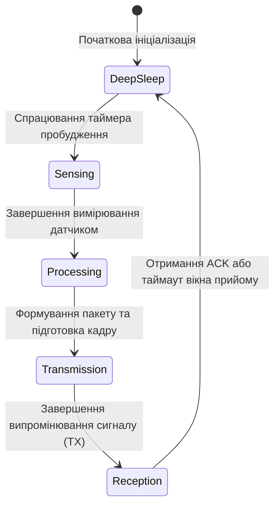
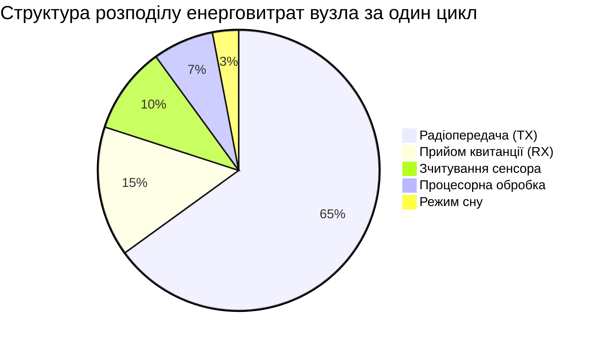

# Практичне заняття № 1. Розрахунок пропускної здатності та енергетичного бюджету автономного IoT-вузла

**Мета:** Засвоїти фундаментальні принципи функціонування енергообмежених бездротових сенсорних вузлів, опанувати математичний апарат розрахунку часових інтервалів передачі телеметричних даних з урахуванням службових заголовків протоколів, а також набути практичних навичок розрахунку енергетичного балансу та оцінки прогнозованого життєвого циклу автономного джерела живлення кінцевого пристрою за допомогою табличних процесорів і скриптів верифікації.

**Стек технологій та інструменти:**
* **Мова програмування / Середовище:** Python 3.10+ (модулі `math`, `tabulate`, `matplotlib` для побудови графіків та аналізу), кросплатформовий табличний процесор (Microsoft Excel / LibreOffice Calc).
* **Платформа / Бібліотеки / Модулі:** Вбудовані математичні функції обчислення профілів струмів, бібліотека `pandas` для пакетного розрахунку масивів телеметрії.
* **Інструменти розробки:** Емулятор термінала операційної системи (Bash, PowerShell), інтегроване середовище розробки (VS Code або Jupyter Notebook).

---

## 1 Теоретичні відомості

Автономність функціонування кінцевих пристроїв Інтернету речей є однією з найбільш критичних вимог під час проєктування сенсорних мереж. Більшість польових вузлів розташовуються у важкодоступних місцях, що робить часту заміну хімічних джерел струму економічно недоцільною або фізично неможливою. Життєвий цикл автономного вузла безпосередньо залежить від профілю його енергоспоживання, який формується в результаті періодичної зміни робочих станів мікроконтролера та радіотрансивера.

Типовий алгоритм функціонування сенсорного пристрою має циклічний характер. Переважну частину часу мікроконтролер перебуває в енергозберігаючому стані глибокого сну (Deep Sleep), під час якого вимикається більшість периферійних модулів, тактових генераторів та обчислювальних ядер. Пробудження системи відбувається періодично за сигналом внутрішнього таймера або зовнішнього переривання від датчика, після чого пристрій послідовно виконує опитування чутливих елементів, аналого-цифрове перетворення, локальну обробку сигналу, ініціалізацію радіомодуля, передачу інформаційного кадру та очікування квитанції підтвердження.


*Рисунок 1 — Граф станів та часова діаграма функціонування автономного IoT-вузла*

Граф станів, наведений на рисунку 1, демонструє чітке розділення часових фаз роботи мікроконтролера. Кожна фаза характеризується власною тривалістю та величиною споживаного струму.

Тривалість активної фази передачі даних ($t_{\text{tx}}$) визначається швидкістю модуляції фізичного рівня та сумарним обсягом інформаційного кадру. До загального розміру пакету, крім корисного навантаження сенсора, обов'язково додаються заголовки протоколів прикладного, транспортного, мережевого та канального рівнів. Математична залежність часу передачі описується виразом:

$$t_{\text{tx}} = \frac{L_{\text{payload}} + L_{\text{headers}}}{R_{\text{data}}}$$

У цій формулі змінна $t_{\text{tx}}$ позначає тривалість випромінювання радіосигналу в секундах ($\text{с}$), параметр $L_{\text{payload}}$ відповідає розміру безпосередніх корисних даних датчика у бітах ($\text{біт}$), змінна $L_{\text{headers}}$ визначає сумарну довжину накладних службових заголовків усіх рівнів стека протоколів у бітах ($\text{біт}$), а $R_{\text{data}}$ представляє ефективну бітову швидкість передачі даних у каналі зв'язку в бітах за секунду ($\text{біт/с}$).

Повний електричний заряд ($Q_{\text{cycle}}$), який витрачається вузлом за один період вимірювання та передачі, дорівнює сумі зарядів, накопичених у кожному дискретному стані:

$$Q_{\text{cycle}} = I_{\text{sense}} \cdot t_{\text{sense}} + I_{\text{proc}} \cdot t_{\text{proc}} + I_{\text{tx}} \cdot t_{\text{tx}} + I_{\text{rx}} \cdot t_{\text{rx}} + I_{\text{sleep}} \cdot t_{\text{sleep}}$$

У цьому рівнянні величина $Q_{\text{cycle}}$ вимірюється в кулонах ($\text{Кл}$) або міліампер-секундах ($\text{мА}\cdot\text{с}$). Змінні $I_{\text{sense}}$, $I_{\text{proc}}$, $I_{\text{tx}}$, $I_{\text{rx}}$, $I_{\text{sleep}}$ позначають силу струму, що споживається схемою у режимах зчитування сенсора, процесорної обробки, передачі, прийому та сну відповідно, виражену в міліамперах ($\text{мА}$). Змінні $t_{\text{sense}}$, $t_{\text{proc}}$, $t_{\text{tx}}$, $t_{\text{rx}}$, $t_{\text{sleep}}$ відповідають тривалості перебування пристрою у зазначених режимах у секундах ($\text{с}$).


*Рисунок 2 — Діаграма питомого розподілу споживаної енергії за робочими фазами пристрою*

Діаграма на рисунку 2 наочно ілюструє, що основна частка енергетичного бюджету витрачається під час радіочастотної передачі пакетів у ефір, тоді як фаза сну, незважаючи на її тривалість, формує мінімальний внесок у розряд акумулятора.

Загальний період робочого циклу пристрою ($T_{\text{period}}$) становить суму тривалостей усіх послідовних операцій:

$$T_{\text{period}} = t_{\text{sense}} + t_{\text{proc}} + t_{\text{tx}} + t_{\text{rx}} + t_{\text{sleep}}$$

де $T_{\text{period}}$ вимірюється в секундах ($\text{с}$) і задає інтервал між послідовними сеансами відправки телеметрії.

Середній струм споживання пристрою ($I_{\text{avg}}$) на протязі тривалого часу розраховується як відношення сумарного заряду одного циклу до тривалості цього циклу:

$$I_{\text{avg}} = \frac{Q_{\text{cycle}}}{T_{\text{period}}}$$

де $I_{\text{avg}}$ виражається в міліамперах ($\text{мА}$).

Для врахування природної деградації хімічного джерела живлення вводять струм саморозряду акумулятора ($I_{\text{self}}$), який вираховується через річний коефіцієнт втрати ємності:

$$I_{\text{self}} = \frac{C_{\text{nom}} \cdot \sigma_{\text{self}}}{8760 \cdot 100\%}$$

У цьому виразі змінна $I_{\text{self}}$ представляє еквівалентний постійний струм саморозряду в міліамперах ($\text{мА}$), $C_{\text{nom}}$ позначає номінальну паспортну ємність джерела живлення в міліампер-годинах ($\text{мА}\cdot\text{год}$), $\sigma_{\text{self}}$ вказує на відсоток втрати заряду через саморозряд за один рік ($\%/\text{рік}$), а константа 8760 визначає кількість годин у календарному році.

Прогнозований термін служби джерела живлення ($T_{\text{life}}$) у роках обчислюється за формулою з урахуванням експлуатаційного коефіцієнта корисної дії батареї:

$$T_{\text{life}} = \frac{C_{\text{nom}} \cdot \eta_{\text{bat}}}{(I_{\text{avg}} + I_{\text{self}}) \cdot 8760}$$

де $T_{\text{life}}$ є розрахунковим часом експлуатації вузла у роках ($\text{роки}$), а безрозмірний коефіцієнт $\eta_{\text{bat}}$ (зазвичай у межах $0{,}80 \dots 0{,}90$) враховує глибину розряду акумулятора та падіння напруги нижче допустимого порогу стабілізатора.

---

## 2 Підготовка середовища та розгортання проєкту (Крок 0)

Для виконання практичних розрахунків, автоматизованої обробки варіантів та побудови графіків залежності життєвого циклу від періодичності зв'язку використовується мова програмування Python версії 3.10 або вище разом із пакетами чисельного аналізу.

1. Перевірте встановлену версію інтерпретатора Python у терміналі:

```bash
# Перевірка версії інтерпретатора Python у командному рядку
python --version

# Або для операційних систем на базі Linux/macOS
python3 --version
```

2. Створіть ізольоване віртуальне середовище для виконання розрахункової частини та активуйте його:

```bash
# Створення віртуального оточення в каталозі проєкту
python -m venv venv_iot_energy

# Активація віртуального середовища у Linux/macOS
source venv_iot_energy/bin/activate

# Активація віртуального середовища у Windows PowerShell
.\venv_iot_energy\Scripts\Activate.ps1
```

3. Встановіть необхідні зовнішні бібліотеки для форматованого виведення таблиць та візуалізації результатів:

```bash
# Встановлення пакетів tabulate та matplotlib через pip
pip install tabulate matplotlib pandas
```

4. Створіть файлову структуру розрахункового проєкту:

```text
IoT_Energy_Calculations/
├── data/
│   └── variants_input.csv     # Таблиця вихідних даних індивідуальних варіантів
├── output/
│   ├── results_summary.txt    # Текстовий звіт із результатами обчислень
│   └── lifetime_plot.png      # Графік залежності терміну служби від періоду сну
├── energy_calculator.py       # Основний розрахунковий модуль
└── Excel_Template.xlsx        # Електронна таблиця розрахунку моделі
```

---

## 3 Порядок виконання роботи

### 3.1 Індивідуальні завдання

Кожен здобувач вищої освіти здійснює розрахунок енергетичного бюджету сенсорного вузла відповідно до індивідуальних параметрів, наведених у таблиці 1.

*Таблиця 1 — Індивідуальні параметри варіантів практичного завдання*

| Варіант | Технологія / Бездротовий стек | Номінальна ємність $C_{\text{nom}}$ (мА·год) | Напруга $U$ (В) | Струм передачі $I_{\text{tx}}$ (мА) / Швидкість $R$ (кбіт/с) | Струм прийому $I_{\text{rx}}$ (мА) / Час $t_{\text{rx}}$ (мс) | Струм сенсора $I_{\text{sense}}$ (мА) / Час $t_{\text{sense}}$ (мс) | Струм сну $I_{\text{sleep}}$ (мкА) | Обсяг даних $L_{\text{pay}} / L_{\text{head}}$ (байт) | Інтервал $T_{\text{period}}$ (хв) |
| :---: | :--- | :---: | :---: | :---: | :---: | :---: | :---: | :---: | :---: |
| **1** | Wi-Fi (802.11b) + MQTT | 2400 | 3.3 | 180 / 11000 | 60 / 20 | 12 / 50 | 25 | 16 / 54 | 5 |
| **2** | LoRaWAN (EU868 SF7) | 1200 | 3.6 | 45 / 5.47 | 12 / 60 | 8 / 30 | 3.5 | 12 / 13 | 15 |
| **3** | BLE 5.0 (2 Mbps) | 650 | 3.0 | 22 / 2000 | 15 / 10 | 5 / 20 | 2.0 | 24 / 18 | 2 |
| **4** | NB-IoT (Band 20) | 3000 | 3.6 | 120 / 64 | 35 / 100 | 15 / 80 | 6.0 | 32 / 48 | 30 |
| **5** | ZigBee (802.15.4) | 1000 | 3.0 | 35 / 250 | 25 / 15 | 6 / 40 | 4.0 | 8 / 23 | 1 |
| **6** | Wi-Fi (802.11g) + HTTP | 3200 | 3.3 | 220 / 54000 | 65 / 45 | 20 / 100 | 35 | 64 / 120 | 10 |
| **7** | LoRaWAN (EU868 SF12) | 2600 | 3.6 | 50 / 0.29 | 14 / 120 | 10 / 60 | 4.0 | 10 / 13 | 60 |
| **8** | BLE 4.2 (Legacy) | 850 | 3.0 | 28 / 1000 | 18 / 15 | 4 / 25 | 2.5 | 16 / 21 | 3 |
| **9** | Sigfox (RC1 100 bps) | 2200 | 3.6 | 40 / 0.1 | 0 / 0 | 5 / 40 | 1.8 | 12 / 14 | 120 |
| **10** | IEEE 802.15.4 + CoAP | 1500 | 3.3 | 38 / 250 | 22 / 20 | 9 / 35 | 5.0 | 20 / 32 | 5 |
| **11** | Wi-Fi HaLow (802.11ah) | 1800 | 3.3 | 85 / 150 | 28 / 30 | 11 / 45 | 8.0 | 30 / 40 | 8 |
| **12** | LoRaWAN (US915 SF8) | 2000 | 3.6 | 48 / 3.12 | 13 / 80 | 7 / 25 | 3.0 | 16 / 13 | 20 |
| **13** | Z-Wave (908 MHz) | 1100 | 3.0 | 32 / 40 | 24 / 25 | 6 / 50 | 4.5 | 14 / 20 | 4 |
| **14** | NB-IoT (eDRX mode) | 3500 | 3.6 | 130 / 128 | 40 / 80 | 18 / 90 | 7.5 | 48 / 48 | 45 |
| **15** | Wi-Fi (802.11n) + MQTT | 2800 | 3.3 | 195 / 72000 | 58 / 25 | 14 / 60 | 30 | 28 / 54 | 12 |
| **16** | LoRaWAN (EU868 SF10) | 2400 | 3.6 | 46 / 0.98 | 12 / 100 | 8 / 40 | 3.8 | 16 / 13 | 30 |
| **17** | BLE 5.0 Coded PHY | 900 | 3.0 | 25 / 500 | 16 / 35 | 5 / 30 | 2.2 | 20 / 18 | 5 |
| **18** | Thread (6LoWPAN) | 1300 | 3.3 | 42 / 250 | 26 / 18 | 10 / 30 | 4.8 | 24 / 38 | 6 |
| **19** | Wi-Fi (Power Save) | 2500 | 3.3 | 170 / 11000 | 55 / 15 | 12 / 40 | 20 | 16 / 54 | 15 |
| **20** | LoRaWAN (EU868 SF9) | 1900 | 3.6 | 47 / 1.76 | 12 / 70 | 7 / 35 | 3.2 | 14 / 13 | 25 |

*Примітка:* Для всіх варіантів прийняти струм мікропроцесорної обробки $I_{\text{proc}} = 15\text{ мА}$ при тривалості $t_{\text{proc}} = 10\text{ мс}$, річний саморозряд батареї $\sigma_{\text{self}} = 2\%/\text{рік}$, а коефіцієнт корисної ємності $\eta_{\text{bat}} = 0{,}85$.

---

### 3.2 Покроковий алгоритм та розв'язок еталонного прикладу

Як еталонний приклад розглянемо автономний вузол моніторингу напруги сонячної панелі з передачею даних каналом LoRaWAN (режим SF7).

Вихідні дані еталонного прикладу:
* Номінальна ємність батареї: $C_{\text{nom}} = 2000\text{ мА}\cdot\text{год}$
* Номінальна напруга живлення: $U = 3{,}6\text{ В}$
* Корисне навантаження сенсора: $L_{\text{payload}} = 8\text{ байт} = 64\text{ біт}$
* Службові заголовки канального рівня: $L_{\text{headers}} = 13\text{ байт} = 104\text{ біт}$
* Бітова швидкість передачі в ефірі: $R_{\text{data}} = 5{,}47\text{ кбіт/с} = 5470\text{ біт/с}$
* Струм та тривалість вимірювання сенсором: $I_{\text{sense}} = 10\text{ мА}$, $t_{\text{sense}} = 40\text{ мс} = 0{,}040\text{ с}$
* Струм та тривалість обробки мікроконтролером: $I_{\text{proc}} = 15\text{ мА}$, $t_{\text{proc}} = 10\text{ мс} = 0{,}010\text{ с}$
* Струм передавача під час випромінювання: $I_{\text{tx}} = 44\text{ мА}$
* Струм та тривалість вікна прийому квитанції: $I_{\text{rx}} = 11\text{ мА}$, $t_{\text{rx}} = 50\text{ мс} = 0{,}050\text{ с}$
* Струм схеми у режимі глибокого сну: $I_{\text{sleep}} = 3{,}0\text{ мкА} = 0{,}003\text{ мА}$
* Загальний період надсилання даних: $T_{\text{period}} = 10\text{ хв} = 600\text{ с}$
* Річний рівень саморозряду джерела: $\sigma_{\text{self}} = 2\%/\text{рік}$
* Коефіцієнт корисної ємності акумулятора: $\eta_{\text{bat}} = 0{,}85$

#### Крок 1. Розрахунок тривалості передачі пакету

Сумарна довжина сформованого кадру становить:

$$L_{\text{total}} = L_{\text{payload}} + L_{\text{headers}} = 64 + 104 = 168\text{ біт}$$

Тривалість активного перебування радіомодуля у режимі випромінювання дорівнює:

$$t_{\text{tx}} = \frac{L_{\text{total}}}{R_{\text{data}}} = \frac{168\text{ біт}}{5470\text{ біт/с}} \approx 0{,}030713\text{ с} \approx 30{,}71\text{ мс}$$

#### Крок 2. Розрахунок тривалості фази сну

Тривалість активних фаз за один цикл становить:

$$t_{\text{active}} = t_{\text{sense}} + t_{\text{proc}} + t_{\text{tx}} + t_{\text{rx}} = 0{,}040 + 0{,}010 + 0{,}030713 + 0{,}050 = 0{,}130713\text{ с}$$

Тривалість перебування вузла у стані глибокого сну складає:

$$t_{\text{sleep}} = T_{\text{period}} - t_{\text{active}} = 600 - 0{,}130713 = 599{,}869287\text{ с}$$

#### Крок 3. Розрахунок сумарного електричного заряду за цикл

Заряд, витрачений на кожній окремій фазі циклу:

$$Q_{\text{sense}} = I_{\text{sense}} \cdot t_{\text{sense}} = 10\text{ мА} \cdot 0{,}040\text{ с} = 0{,}4000\text{ мА}\cdot\text{с}$$

$$Q_{\text{proc}} = I_{\text{proc}} \cdot t_{\text{proc}} = 15\text{ мА} \cdot 0{,}010\text{ с} = 0{,}1500\text{ мА}\cdot\text{с}$$

$$Q_{\text{tx}} = I_{\text{tx}} \cdot t_{\text{tx}} = 44\text{ мА} \cdot 0{,}030713\text{ с} \approx 1{,}3514\text{ мА}\cdot\text{с}$$

$$Q_{\text{rx}} = I_{\text{rx}} \cdot t_{\text{rx}} = 11\text{ мА} \cdot 0{,}050\text{ с} = 0{,}5500\text{ мА}\cdot\text{с}$$

$$Q_{\text{sleep}} = I_{\text{sleep}} \cdot t_{\text{sleep}} = 0{,}003\text{ мА} \cdot 599{,}869287\text{ с} \approx 1{,}7996\text{ мА}\cdot\text{с}$$

Повний заряд, витрачений пристроєм за один робочий цикл:

$$Q_{\text{cycle}} = 0{,}4000 + 0{,}1500 + 1{,}3514 + 0{,}5500 + 1{,}7996 = 4{,}2510\text{ мА}\cdot\text{с}$$

#### Крок 4. Розрахунок середнього споживаного струму

Середній струм навантаження за період становить:

$$I_{\text{avg}} = \frac{Q_{\text{cycle}}}{T_{\text{period}}} = \frac{4{,}2510\text{ мА}\cdot\text{с}}{600\text{ с}} \approx 0{,}007085\text{ мА} = 7{,}085\text{ мкА}$$

#### Крок 5. Розрахунок втрат на саморозряд та оцінка терміну життя батареї

Еквівалентний струм внутрішнього саморозряду акумулятора дорівнює:

$$I_{\text{self}} = \frac{2000\text{ мА}\cdot\text{год} \cdot 2\%}{8760\text{ год} \cdot 100\%} = \frac{40}{876000} \approx 0{,}004566\text{ мА} = 4{,}566\text{ мкА}$$

Сумарний еквівалентний струм навантаження на батарею з урахуванням витоків становить:

$$I_{\text{total}} = I_{\text{avg}} + I_{\text{self}} = 0{,}007085 + 0{,}004566 = 0{,}011651\text{ мА}$$

Корисна ємність батареї з урахуванням коефіцієнта $\eta_{\text{bat}}$ складає:

$$C_{\text{eff}} = C_{\text{nom}} \cdot \eta_{\text{bat}} = 2000 \cdot 0{,}85 = 1700\text{ мА}\cdot\text{год}$$

Загальний розрахунковий ресурс роботи автономного пристрою в годинах та роках:

$$T_{\text{hours}} = \frac{C_{\text{eff}}}{I_{\text{total}}} = \frac{1700\text{ мА}\cdot\text{год}}{0{,}011651\text{ мА}} \approx 145910\text{ годин}$$

$$T_{\text{life}} = \frac{145910}{8760} \approx 16{,}65\text{ років}$$

Оскільки фізичний термін деградації електроліту літієвих елементів живлення (Li-SOCl2) становить близько $10 \dots 12$ років, розрахункове значення $16{,}65$ року свідчить про те, що сенсорний вузол гарантовано відпрацює весь максимально допустимий конструктивний термін без заміни джерела енергії.

#### Програмна реалізація розрахункової моделі (Python)

Створіть файл `energy_calculator.py` та збережіть наступний повний виконуваний код для автоматичної верифікації розрахунків:

```python
"""
Модуль для розрахунку енергетичного бюджету та пропускної здатності IoT-вузла.
Виконано відповідно до навчально-методичних вимог курсу 'Технології інтернету речей'.
"""

import math
from tabulate import tabulate


def calculate_iot_energy_budget(
    c_nom_mah: float,
    u_volts: float,
    i_tx_ma: float,
    r_data_kbps: float,
    i_rx_ma: float,
    t_rx_ms: float,
    i_sense_ma: float,
    t_sense_ms: float,
    i_proc_ma: float,
    t_proc_ms: float,
    i_sleep_ua: float,
    l_payload_bytes: int,
    l_headers_bytes: int,
    t_period_minutes: float,
    sigma_self_percent_year: float = 2.0,
    eta_battery: float = 0.85,
) -> dict:
    """
    Виконує повний інженерний розрахунок енергетичного бюджету автономного IoT-пристрою.
    """
    # 1. Розрахунок розмірів та тривалості передачі
    l_total_bits = (l_payload_bytes + l_headers_bytes) * 8
    r_data_bps = r_data_kbps * 1000.0
    t_tx_seconds = l_total_bits / r_data_bps
    t_tx_ms = t_tx_seconds * 1000.0

    # 2. Переведення часових інтервалів у секунди
    t_sense_s = t_sense_ms / 1000.0
    t_proc_s = t_proc_ms / 1000.0
    t_rx_s = t_rx_ms / 1000.0
    t_period_s = t_period_minutes * 60.0

    # 3. Розрахунок тривалості сну
    t_active_s = t_sense_s + t_proc_s + t_tx_seconds + t_rx_s
    t_sleep_s = t_period_s - t_active_s

    if t_sleep_s < 0:
        raise ValueError(
            "Помилка: тривалість активних фаз перевищує загальний період циклу!"
        )

    # 4. Розрахунок заряду за окремими фазами (мА * с)
    i_sleep_ma = i_sleep_ua / 1000.0
    q_sense = i_sense_ma * t_sense_s
    q_proc = i_proc_ma * t_proc_s
    q_tx = i_tx_ma * t_tx_seconds
    q_rx = i_rx_ma * t_rx_s
    q_sleep = i_sleep_ma * t_sleep_s
    q_cycle = q_sense + q_proc + q_tx + q_rx + q_sleep

    # 5. Середній струм та втрати на саморозряд
    i_avg_ma = q_cycle / t_period_s
    hours_per_year = 8760.0
    i_self_ma = (c_nom_mah * (sigma_self_percent_year / 100.0)) / hours_per_year
    i_total_ma = i_avg_ma + i_self_ma

    # 6. Розрахунок терміну функціонування
    c_effective_mah = c_nom_mah * eta_battery
    lifetime_hours = c_effective_mah / i_total_ma
    lifetime_years = lifetime_hours / hours_per_year
    lifetime_days = lifetime_hours / 24.0

    # 7. Енергія за цикл (Джоулі)
    energy_cycle_joules = (q_cycle / 1000.0) * u_volts

    return {
        "l_total_bits": l_total_bits,
        "t_tx_ms": t_tx_ms,
        "t_active_s": t_active_s,
        "t_sleep_s": t_sleep_s,
        "q_cycle_mas": q_cycle,
        "q_tx_mas": q_tx,
        "q_rx_mas": q_rx,
        "q_sense_mas": q_sense,
        "q_proc_mas": q_proc,
        "q_sleep_mas": q_sleep,
        "i_avg_ua": i_avg_ma * 1000.0,
        "i_self_ua": i_self_ma * 1000.0,
        "i_total_ua": i_total_ma * 1000.0,
        "energy_cycle_mj": energy_cycle_joules * 1000.0,
        "lifetime_hours": lifetime_hours,
        "lifetime_days": lifetime_days,
        "lifetime_years": lifetime_years,
    }


def main():
    print("=" * 75)
    print("  РОЗРАХУНОК ЕНЕРГЕТИЧНОГО БЮДЖЕТУ АВТОНОМНОГО IOT-ВУЗЛА (ЕТАЛОН)  ")
    print("=" * 75)

    # Параметри еталонного вузла
    results = calculate_iot_energy_budget(
        c_nom_mah=2000.0,
        u_volts=3.6,
        i_tx_ma=44.0,
        r_data_kbps=5.47,
        i_rx_ma=11.0,
        t_rx_ms=50.0,
        i_sense_ma=10.0,
        t_sense_ms=40.0,
        i_proc_ma=15.0,
        t_proc_ms=10.0,
        i_sleep_ua=3.0,
        l_payload_bytes=8,
        l_headers_bytes=13,
        t_period_minutes=10.0,
        sigma_self_percent_year=2.0,
        eta_battery=0.85,
    )

    table_data = [
        ["Загальний розмір кадру в ефірі", f"{results['l_total_bits']} біт"],
        [
            "Тривалість передачі в ефірі (TX)",
            f"{results['t_tx_ms']:.2f} мс ({results['t_tx_ms']/1000:.6f} с)",
        ],
        ["Тривалість активних фаз (t_active)", f"{results['t_active_s']:.4f} с"],
        ["Тривалість режиму сну (t_sleep)", f"{results['t_sleep_s']:.2f} с"],
        ["Заряд фази вимірювання (Q_sense)", f"{results['q_sense_mas']:.4f} мА·с"],
        ["Заряд фази обробки (Q_proc)", f"{results['q_proc_mas']:.4f} мА·с"],
        ["Заряд фази передачі (Q_tx)", f"{results['q_tx_mas']:.4f} мА·с"],
        ["Заряд фази прийому (Q_rx)", f"{results['q_rx_mas']:.4f} мА·с"],
        ["Заряд фази сну (Q_sleep)", f"{results['q_sleep_mas']:.4f} мА·с"],
        ["Повний заряд за цикл (Q_cycle)", f"{results['q_cycle_mas']:.4f} мА·с"],
        ["Енергія одного циклу (E_cycle)", f"{results['energy_cycle_mj']:.4f} мДж"],
        [
            "Середній струм споживання (I_avg)",
            f"{results['i_avg_ua']:.3f} мкА ({results['i_avg_ua']/1000:.6f} мА)",
        ],
        ["Струм саморозряду батареї (I_self)", f"{results['i_self_ua']:.3f} мкА"],
        [
            "Сумарний середній струм (I_total)",
            f"{results['i_total_ua']:.3f} мкА",
        ],
        ["Оцінка терміну служби (години)", f"{results['lifetime_hours']:.1f} год"],
        ["Оцінка терміну служби (доби)", f"{results['lifetime_days']:.1f} діб"],
        ["Оцінка терміну служби (роки)", f"{results['lifetime_years']:.2f} років"],
    ]

    print(
        tabulate(
            table_data,
            headers=["Параметр системи", "Розраховане значення"],
            tablefmt="grid",
        )
    )
    print("=" * 75)


if __name__ == "__main__":
    main()
```

---

### 3.3 Запуск, тестування та перевірка результатів

1. Запустіть розрахунковий скрипт через термінал віртуального середовища:

```bash
# Запуск розрахункової програми в консолі
python energy_calculator.py
```

2. Звірте отримані результати з еталонним консольним виводом:

```text
===========================================================================
  РОЗРАХУНОК ЕНЕРГЕТИЧНОГО БЮДЖЕТУ АВТОНОМНОГО IOT-ВУЗЛА (ЕТАЛОН)  
===========================================================================
+------------------------------------+------------------------------------+
| Параметр системи                   | Розраховане значення               |
+====================================+====================================+
| Загальний розмір кадру в ефірі     | 168 біт                            |
+------------------------------------+------------------------------------+
| Тривалість передачі в ефірі (TX)   | 30.71 мс (0.030713 с)              |
+------------------------------------+------------------------------------+
| Тривалість активних фаз (t_active) | 0.1307 с                           |
+------------------------------------+------------------------------------+
| Тривалість режиму сну (t_sleep)    | 599.87 с                           |
+------------------------------------+------------------------------------+
| Заряд фази вимірювання (Q_sense)   | 0.4000 мА·с                        |
+------------------------------------+------------------------------------+
| Заряд фази обробки (Q_proc)        | 0.1500 мА·с                        |
+------------------------------------+------------------------------------+
| Заряд фази передачі (Q_tx)         | 1.3514 мА·с                        |
+------------------------------------+------------------------------------+
| Заряд фази прийому (Q_rx)          | 0.5500 мА·с                        |
+------------------------------------+------------------------------------+
| Заряд фази сну (Q_sleep)           | 1.7996 мА·с                        |
+------------------------------------+------------------------------------+
| Повний заряд за цикл (Q_cycle)     | 4.2510 мА·с                        |
+------------------------------------+------------------------------------+
| Енергія одного циклу (E_cycle)     | 15.3036 мДж                        |
+------------------------------------+------------------------------------+
| Середній струм споживання (I_avg)  | 7.085 мкА (0.007085 мА)            |
+------------------------------------+------------------------------------+
| Струм саморозряду батареї (I_self) | 4.566 мкА                          |
+------------------------------------+------------------------------------+
| Сумарний середній струм (I_total)  | 11.651 мкА                         |
+------------------------------------+------------------------------------+
| Оцінка терміну служби (години)     | 145909.5 год                       |
+------------------------------------+------------------------------------+
| Оцінка терміну служби (доби)       | 6079.6 діб                         |
+------------------------------------+------------------------------------+
| Оцінка терміну служби (роки)       | 16.66 років                        |
+------------------------------------+------------------------------------+
===========================================================================
```

3. Здійсніть дослідження чутливості життєвого циклу: змініть у коді період передачі $T_{\text{period}}$ у діапазоні від $1$ хвилини до $60$ хвилин із кроком $5$ хвилин та зафіксуйте зміну середнього споживаного струму у формі порівняльної таблиці у звіті.

---

## 4 Вимоги до змісту звіту

Звіт про виконання практичного заняття оформлюється відповідно до стандарту ДСТУ 3008:2015 і повинен містити такі структурні елементи:

1. **Титульна сторінка** встановленого зразка із зазначенням назви Міністерства освіти і науки України, університету, факультету, випускової кафедри, назви дисципліни, номера і теми практичного заняття, номера індивідуального варіанта, академічної групи та прізвища здобувача.
2. **Мета заняття** та стислий виклад теоретичних засад розрахунку часових і енергетичних параметрів IoT-вузлів.
3. **Постановка індивідуального завдання** для закріпленого варіанта з випискою всіх числових значень параметрів.
4. **Аналітично-розрахункова частина**, яка містить повні покрокові математичні викладки з проміжними та кінцевими числовими значеннями розмірностей за всіма етапами (розрахунок часу передачі кадру, тривалості сну, витраченого заряду за кожною фазою, середнього струму, витоків батареї та прогнозованого терміну експлуатації).
5. **Фрагмент розрахункової таблиці** у середовищі табличного процесора (MS Excel / LibreOffice Calc) із відображенням застосованих формул у комірках або повний вихідний лістинг власного скрипта верифікації мовою Python.
6. **Графік залежності терміну служби акумулятора** від періоду відправки телеметрії ($T_{\text{period}}$) у діапазоні від $1$ до $120$ хвилин.
7. **Аналітичні висновки**, що містять обґрунтування отриманих результатів, аналіз фаз із найбільшим споживанням енергії та рекомендації щодо оптимізації бездротового протоколу для збільшення автономності пристрою.

---

## 5 Контрольні запитання для захисту роботи

1. **Яким чином співвідношення між розміром корисного навантаження ($L_{\text{payload}}$) та накладними заголовками протоколів ($L_{\text{headers}}$) впливає на ефективність використання радіоканалу та енерговитрати вузла?** Поясніть це явище на прикладі протоколів MQTT та CoAP.
2. **Чому за низьких бітових швидкостей передачі (наприклад, у LoRaWAN на коефіцієнті розширення SF12 або Sigfox) енерговитрати на передачу одного байту суттєво вищі, ніж у високошвидкісних мережах Wi-Fi, незважаючи на менший піковий струм трансивера?**
3. **Яку роль відіграє внутрішній струм саморозряду батареї ($I_{\text{self}}$) при оцінці життєвого циклу пристроїв із надвеликими інтервалами опитування (наприклад, одне вимірювання на добу)?** За якої умови саморозряд стає домінуючим фактором вичерпання ємності?
4. **У чому полягає фізична та апаратна різниця між режимами енергозбереження Light Sleep та Deep Sleep у сучасних мікроконтролерах класу ESP32?** Які модулі залишаються активними у кожному з режимів?
5. **Як використання технології підтвердження доставки повідомлень (Acknowledgment, ACK) на канальному або прикладному рівні впливає на загальний струм споживання і тривалість циклу при роботі в зашумленому радіоефірі?**
6. **Запропонуйте інженерні заходи зі зменшення середнього споживаного струму IoT-вузла без зміни ємності хімічного джерела живлення та типу бездротового радіоінтерфейсу.**