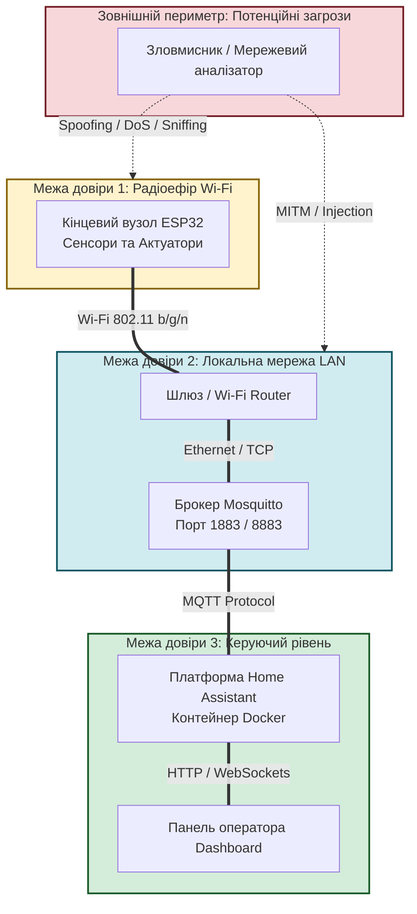
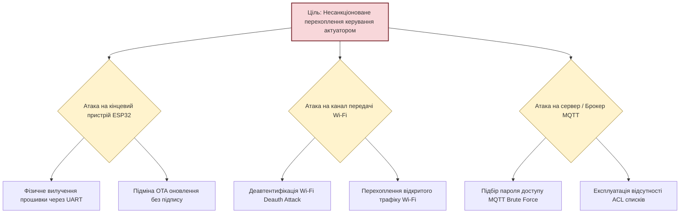

# Практичне заняття № 10. Моделювання загроз та комплексний аналіз безпеки IoT-системи за методологією STRIDE

**Мета:** Засвоїти фундаментальні концепції кібербезпеки в розподілених мережах Інтернету речей, вивчити математичні та алгоритмічні моделі оцінки ризиків, опанувати методологію моделювання загроз STRIDE (Spoofing, Tampering, Repudiation, Information Disclosure, Denial of Service, Elevation of Privilege) та кількісного оцінювання DREAD, а також розробити програмний інструментарій для проведення аудиту безпеки власного курсового проєкту з визначенням векторів атак на фізичний рівень, бездротовий канал, брокер повідомлень і платформу керування.

**Стек технологій та інструменти:**
* **Мова програмування та середовище:** Python (версія 3.11 або вище), середовище виконання аналітичних розрахунків.
* **Методології та стандарти:** Модель класифікації загроз Microsoft STRIDE, кількісна матриця ризиків DREAD, фреймворк оцінки вразливостей CVSS v3.1, рекомендації NIST SP 800-183 щодо безпеки розподілених мереж речей.
* **Бібліотеки та модулі:** Модуль структурованих класів `dataclasses`, бібліотека форматування виводу матриць `tabulate`, стандартний модуль `json` для серіалізації звітів аудиту.
* **Інструменти розробки:** Редактор Visual Studio Code, емулятор термінала операційної системи (CLI), середовище діаграмного моделювання Mermaid.

---

## 1 Теоретичні відомості

Архітектура Інтернету речей відрізняється від традиційних інформаційних систем наявністю глибоко інтегрованих фізичних компонентів, обмеженими апаратними ресурсами мікроконтролерів (пам'ять RAM порядку десятків кілобайт, обмежена частота процесора) та використанням незахищених бездротових середовищ передавання даних. Зазначені особливості створюють розширену поверхню атаки (Attack Surface), оскільки компрометація навіть одного низькопотужного датчика відкриває зловмиснику доступ до корпоративної або домашньої локальної мережі.

Для систематичного виявлення вразливостей на етапі системного проєктування застосовується методологія **STRIDE**, розроблена для декомпозиції системи за шістьма основними категоріями загроз:

1. **Підміна суб'єкта або пристрою (Spoofing)** полягає у спробі неавторизованого пристрою або зловмисника видати себе за легітимний сенсор чи керуючий сервер шляхом фальсифікації MAC-адреси, IP-адреси або ідентифікатора клієнта `client_id` у протоколі MQTT.
2. **Фальсифікація даних (Tampering)** виражається у несанкціонованій модифікації телеметричних пакетів у каналі зв'язку, підміні прошивки мікроконтролера або маніпуляції значеннями калібрувальних коефіцієнтів у енергонезалежній пам'яті EEPROM.
3. **Відмова від авторства дій (Repudiation)** полягає у відсутності механізмів криптографічного підтвердження та аудиту, коли користувач або скомпрометований вузол може здійснити критичну дію (наприклад, відкриття аварійного клапана) без можливості фіксації його авторства в системних журналах.
4. **Витік конфіденційної інформації (Information Disclosure)** виникає внаслідок передавання телеметрії у відкритому текстовому вигляді без шифрування, що дозволяє зловмиснику перехоплювати паролі доступу до Wi-Fi, приватні ключі або дані спостереження за допомогою пасивного прослуховування ефіру.
5. **Відмова в обслуговуванні (Denial of Service, DoS)** має на меті виснаження обчислювальних або мережевих ресурсів пристрою (глушіння радіочастотного діапазону 2.4 ГГц, лавинне надсилання пакетів SYN Flood або генерація надмірної кількості MQTT-повідомлень), що призводить до неможливості виконання функцій реального часу.
6. **Підвищення привілеїв (Elevation of Privilege)** дозволяє зловмиснику з обмеженими правами доступу отримати повний адміністративний контроль над брокером повідомлень, сервером Home Assistant або мікроконтролером через експлуатацію вразливостей переповнення буфера чи помилок конфігурації списків контролю доступу (ACL).


*Рисунок 1 — Діаграма потоків даних (DFD) з виділеними межами довіри (Trust Boundaries)*

На рисунку 1 відображено чотири ключові домени безпеки. Перетин інформаційними потоками ліній меж довіри (Trust Boundaries) вимагає обов'язкової взаємної автентифікації, перевірки цілісності та шифрування каналів.

Для визначення пріоритетності нейтралізації загроз застосовують кількісну модель оцінки **DREAD**, яка базується на обчисленні узагальненого індексу небезпеки $R_{\text{DREAD}}$:

$$R_{\text{DREAD}} = \frac{D + R_p + E + A + D_i}{5}$$

де $D$ (Damage Potential) — потенційний розмір збитків у разі успішної реалізації атаки (шкала від 1 до 10);  
$R_p$ (Reproducibility) — простота повторного відтворення атаки зловмисником (шкала від 1 до 10);  
$E$ (Exploitability) — обсяг зусиль, знань та інструментарію, необхідних для проведення атаки (шкала від 1 до 10);  
$A$ (Affected Users/Devices) — частка скомпрометованих вузлів або користувачів у системі (шкала від 1 до 10);  
$D_i$ (Discoverability) — легкість виявлення даної вразливості зовнішнім аудитором або хакером (шкала від 1 до 10).

Залежно від розрахованого значення індексу $R_{\text{DREAD}}$ загрози класифікують за чотирма рівнями критичності:
* Низький рівень (Low): $1.0 \le R_{\text{DREAD}} \le 3.9$;
* Середній рівень (Medium): $4.0 \le R_{\text{DREAD}} \le 6.9$;
* Високий рівень (High): $7.0 \le R_{\text{DREAD}} \le 8.9$;
* Критичний рівень (Critical): $9.0 \le R_{\text{DREAD}} \le 10.0$.

Для оцінки сукупного ризику відмови багатоетапного ланцюга компрометації використовують розрахунок ймовірності прориву захисту $P_{\text{breach}}$:

$$P_{\text{breach}} = 1 - \prod_{j=1}^{M} \left( 1 - P(T_j) \right)$$

де $M$ — кількість незалежних векторів атак, спрямованих на систему;  
$P(T_j)$ — ймовірність успішної реалізації $j$-ї окремої загрози, яка залежить від показників доступності та захищеності відповідного компонента.


*Рисунок 2 — Дерево атак (Attack Tree) на систему керування актуатором*

На рисунку 2 представлено ієрархічну декомпозицію дій зловмисника, що демонструє можливість досягнення деструктивної мети через компрометацію фізичного мікроконтролера, радіоканалу або серверного посередника.

---

## 2 Підготовка середовища та розгортання проєкту (Крок 0)

Для підготовки робочого місця необхідно перевірити наявність інтерпретатора Python версії 3.11 або новішої та встановити бібліотеку табличного форматування для формування звітів аудиту.

1. Відкрийте термінал операційної системи та виконайте діагностику версій системного оточення:

```bash
# Перевірка версії мови програмування Python
python3 --version

# Перевірка наявності та працездатності інсталятора pip
pip3 --version
```

2. Встановіть додатковий пакет `tabulate` для генерації структурованих звітів у текстовому форматі:

```bash
# Встановлення бібліотеки форматування матриць оцінки ризиків
pip3 install tabulate
```

3. Створіть ієрархію робочих каталогів практичного заняття:

```bash
# Створення робочих каталогів проєкту
mkdir -p ~/IoT_Practicals/PZ10_ThreatModeling/{src,models,reports,docs}
cd ~/IoT_Practicals/PZ10_ThreatModeling
```

Структура розгорнутого проєкту повинна відповідати такій схемі:

```text
PZ10_ThreatModeling/
├── src/
│   └── threat_engine.py         # Основний скрипт розрахунку DREAD та генерації звіту
├── models/
│   └── system_threats.json      # Декларативний опис активів, загроз та вразливостей
├── reports/
│   └── security_audit_report.md # Автоматично згенерований звіт моделювання загроз
└── docs/
    └── attack_tree.png          # Графічна схема дерева атак для індивідуального варіанта
```

4. Створіть файл моделі загроз у форматі JSON, який слугуватиме вхідними даними для аналітичного рушія.

---

## 3 Порядок виконання роботи

### 3.1 Індивідуальні завдання

Кожен здобувач вищої освіти здійснює комплексний аналіз безпеки для відповідного технологічного об'єкта (згідно з тематикою курсового проєкту) за індивідуальним варіантом з таблиці.

| Варіант | Об'єкт дослідження / Система | Найбільш критичний актив системи | Провідні загрози за класифікацією STRIDE | Вектор атаки та обов'язкові контрзаходи |
| :---: | :--- | :--- | :--- | :--- |
| **1** | Електронний замок котеджу | Ключі шифрування доступу у пам'яті ESP32 | Spoofing (підміна картки), Tampering (злам прошивки) | Атака через шину UART; контрзахід: Flash Encryption + Secure Boot |
| **2** | Монітор вібрацій ЧПУ-верстата | Потік телеметрії віброприскорення | Tampering (підміна показів), DoS (флуд брокера) | Модифікація MQTT payload; контрзахід: TLS 1.3 + цифрові підписи HMAC |
| **3** | Система поливу агротеплиці | Електромагнітний клапан магістралі | Tampering (відкриття клапана), DoS (вимкнення зв'язку) | Ін'єкція фальшивих команд; контрзахід: ізоляція топіків через MQTT ACL |
| **4** | Клімат-контроль серверної ЦОД | Датчик температури та реле кондиціонера | Spoofing (хибна норма температури), Tampering | Спуфінг сенсора; контрзахід: взаємна автентифікація вузлів (mTLS) |
| **5** | Сигналізація витоку газу | Сирена та відсічний газовий клапан | Denial of Service (глушіння Wi-Fi), Repudiation | Wi-Fi Deauth атака; контрзахід: використання 802.11w Protected Frames |
| **6** | Кардіомонітор палати інтенсивної терапії | Дані пульсоксиметрії пацієнта | Information Disclosure (витік медданих), Spoofing | Сніффінг незахищеного трафіку; контрзахід: AES-256 шифрування на рівні додатку |
| **7** | Сушарка зернового елеватора | Пальники високої температури | Elevation of Privilege (захоплення прав оператора) | Несанкціонований доступ до Web UI; контрзахід: 2FA + рольова модель RBAC |
| **8** | Вуличне освітлення Smart City | Шлюз керування групою ліхтарів | Denial of Service (блокування магістралі), Spoofing | Переповнення черги брокера; контрзахід: Rate Limiting + ізольовані VLAN |
| **9** | Підстанція 110 кВ Smart Grid | Реле високовольтного вимикача | Tampering (фальсифікація команд комутації) | MITM атака на протокол Modbus TCP; контрзахід: перехід на Secure Modbus / TLS |
| **10** | Автономна метеостанція злітної смуги | Дані швидкості та напрямку вітру | Tampering (заниження швидкості вітру), Repudiation | Підміна пакетів у бездротовій мережі; контрзахід: протокол CoAP поверх DTLS |
| **11** | Лінія розливу фармацевтичного цеху | Дозатор діючої речовини ліків | Tampering (зміна дозування), Information Disclosure | Експлуатація вразливостей Node-RED; контрзахід: контейнеризація в Docker Rootless |
| **12** | Зумпфовий водовідлив шахти | Пускач дренажного глибинного насоса | Denial of Service (блокування запуску помпи) | Затоплення шахти через блокування пакетів; контрзахід: локальний таймер Fail-Safe |
| **13** | Автоматичний інкубатор птахофабрики | Контур підігріву яєць | Spoofing (підміна уставки), Tampering (перегрів) | Перехоплення сесії керування; контрзахід: обмеження IP-адрес через Firewall |
| **14** | Шлагбаум платного автопаркінгу | Сервопривід підйому стріли | Elevation of Privilege (безкоштовний проїзд), Spoofing | Фальсифікація відкриття шлагбаума; контрзахід: одноразові токени сесій (Nonce) |
| **15** | Катодний захист газопроводу | Станція поляризаційного струму | Information Disclosure (координати та дефекти труби) | Витік геопросторових даних; контрзахід: TLS шифрування бази даних Data Lake |
| **16** | Лазерний розкрійний комплекс | Захисний екран оптичної головки | Elevation of Privilege (зняття блокування лазера) | Травмування персоналу; контрзахід: апаратні реле безпеки, дублюючі софт |
| **17** | Холодильна камера зберігання вакцин | Датчик ультранизької температури ($-80^\circ\text{C}$) | Tampering (фальсифікація журналу температур) | Псування медикаментів; контрзахід: незмінні логи з використанням блокчейну/Append-Only |
| **18** | Фарбувально-сушильна камера СТО | Вентиляційна система витяжки | Denial of Service (зупинка витяжки), Tampering | Накопичення вибухонебезпечних парів; контрзахід: апаратні Watchdog-таймери |
| **19** | Автономний інвертор сонячної станції | Силові ключі комутації з міською мережею | Spoofing (фальсифікація частоти мережі), Tampering | Пошкодження інвертора; контрзахід: перевірка фази за допомогою PMU + шифрування |
| **20** | Дробарно-сортувальний конвеєр | Аварійний тросовий вимикач лінії | Repudiation (приховування аварійної зупинки), DoS | Блокування сигналу «Стоп»; контрзахід: нормально-замкнута апаратна лінія безпеки |

---

### 3.2 Покроковий алгоритм та розв'язок еталонного прикладу

Як еталонний приклад розглянемо проведення аудиту безпеки та моделювання загроз за методологією STRIDE для **«Комплексної системи безпеки та мікроклімату приміщення на базі мікроконтролера ESP32, бездротової мережі Wi-Fi, брокера Eclipse Mosquitto та платформи Home Assistant»**.

#### Крок 1. Декомпозиція системи та побудова маніфесту загроз у форматі JSON

Створіть файл опису активів та виявлених загроз `~/IoT_Practicals/PZ10_ThreatModeling/models/system_threats.json` із повним описом усіх векторів атак:

```json
{
  "system_name": "Smart Office Access & Climate IoT System",
  "target_mcu": "ESP32-WROOM-32D",
  "firmware_framework": "ESPHome / Arduino Core",
  "threats": [
    {
      "id": "THR-01",
      "category": "Spoofing",
      "component": "ESP32 Edge Node",
      "description": "Зловмисник клонує MAC-адресу та Client ID датчика, надсилаючи підроблені дані температури",
      "attack_vector": "Бездротовий ефір Wi-Fi, підміна ARP-таблиць",
      "dread": {
        "damage": 7,
        "reproducibility": 8,
        "exploitability": 6,
        "affected_users": 5,
        "discoverability": 7
      },
      "mitigation": "Впровадження взаємної автентифікації за сертифікатами x509 (mTLS) та валідація токенів сесії"
    },
    {
      "id": "THR-02",
      "category": "Tampering",
      "component": "Wi-Fi Communication Channel",
      "description": "Модифікація корисного навантаження MQTT-повідомлення під час транзиту (Man-in-the-Middle)",
      "attack_vector": "Перехоплення незашифрованого TCP-трафіку на порту 1883",
      "dread": {
        "damage": 9,
        "reproducibility": 7,
        "exploitability": 8,
        "affected_users": 8,
        "discoverability": 9
      },
      "mitigation": "Примусове увімкнення шифрування TLS 1.3 на порту 8883 із контролем цілісності пакетів через SHA-256"
    },
    {
      "id": "THR-03",
      "category": "Repudiation",
      "component": "Home Assistant Event Log",
      "description": "Скомпрометований оператор вимикає охоронну сигналізацію без збереження запису в журналі аудиту",
      "attack_vector": "Маніпуляція локальною базою даних SQLite через прямий доступ до файлової системи",
      "dread": {
        "damage": 6,
        "reproducibility": 4,
        "exploitability": 5,
        "affected_users": 3,
        "discoverability": 4
      },
      "mitigation": "Передача системних логів на віддалений захищений Syslog-сервер у режимі Append-Only"
    },
    {
      "id": "THR-04",
      "category": "Information Disclosure",
      "component": "ESP32 Flash Memory",
      "description": "Зчитування пароля від корпоративної мережі Wi-Fi та MQTT брокера з незахищеної Flash-пам'яті через порт UART",
      "attack_vector": "Пряме фізичне підключення програматора до контактів RX/TX мікроконтролера",
      "dread": {
        "damage": 9,
        "reproducibility": 9,
        "exploitability": 7,
        "affected_users": 10,
        "discoverability": 8
      },
      "mitigation": "Активація апаратного шифрування Flash Encryption та апаратного захисту Secure Boot v2 у чипі ESP32"
    },
    {
      "id": "THR-05",
      "category": "Denial of Service",
      "component": "Mosquitto MQTT Broker",
      "description": "Лавинне надсилання пакетів CONNECT (MQTT Flood) з метою вичерпання пулу з'єднань брокера",
      "attack_vector": "DoS-атака з неавторизованого комп'ютера всередині локальної мережі",
      "dread": {
        "damage": 8,
        "reproducibility": 9,
        "exploitability": 9,
        "affected_users": 10,
        "discoverability": 9
      },
      "mitigation": "Налаштування обмеження частоти запитів (Rate Limiting) та заборона анонімних підключень у mosquitto.conf"
    },
    {
      "id": "THR-06",
      "category": "Elevation of Privilege",
      "component": "Home Assistant Dashboard",
      "description": "Отримання прав адміністратора через експлуатацію вразливості застарілого HACS-компонента",
      "attack_vector": "Міжсайтовий скриптинг (XSS) у користувацькій панелі керування Lovelace",
      "dread": {
        "damage": 10,
        "reproducibility": 5,
        "exploitability": 6,
        "affected_users": 10,
        "discoverability": 6
      },
      "mitigation": "Використання двофакторної автентифікації (2FA), ізоляція в Docker та своєчасне оновлення модулів"
    }
  ]
}
```

#### Крок 2. Реалізація аналітичного скрипта оцінки ризиків на Python

Створіть файл `~/IoT_Practicals/PZ10_ThreatModeling/src/threat_engine.py`. Скрипт зчитує маніфест загроз, виконує математичний розрахунок оцінок DREAD, класифікує загрози за ступенем критичності, формує матрицю контрзаходів та експортує підсумковий звіт у форматі Markdown:

```python
#!/usr/bin/env python3
# -*- coding: utf-8 -*-
"""
Програмний модуль аналізу загроз безпеки IoT за методологією STRIDE та розрахунку ризиків DREAD.
"""

import json
import os
import sys
from dataclasses import dataclass
from typing import List, Dict, Any
from tabulate import tabulate

MODEL_FILE_PATH = "../models/system_threats.json"
REPORT_OUTPUT_PATH = "../reports/security_audit_report.md"

@dataclass
class ThreatRecord:
    """Клас представлення окремої загрози безпеки."""
    threat_id: str
    category: str
    component: str
    description: str
    attack_vector: str
    damage: int
    reproducibility: int
    exploitability: int
    affected_users: int
    discoverability: int
    mitigation: str

    @property
    def dread_score(self) -> float:
        """Обчислює середній індекс ризику за формулою DREAD."""
        total = (
            self.damage +
            self.reproducibility +
            self.exploitability +
            self.affected_users +
            self.discoverability
        )
        return round(total / 5.0, 2)

    @property
    def severity_level(self) -> str:
        """Класифікує загрозу на основі балу DREAD."""
        score = self.dread_score
        if score >= 9.0:
            return "CRITICAL"
        elif score >= 7.0:
            return "HIGH"
        elif score >= 4.0:
            return "MEDIUM"
        else:
            return "LOW"

class SecurityAuditEngine:
    """Головний аналітичний клас аудиту системи безпеки IoT."""
    def __init__(self, model_path: str):
        self.model_path = model_path
        self.threats: List[ThreatRecord] = []
        self.system_name = "Undefined IoT System"
        self.target_mcu = "Generic MCU"
        self.framework = "Generic Framework"

    def load_model(self):
        """Зчитує та десеріалізує JSON-маніфест загроз."""
        if not os.path.exists(self.model_path):
            print(f"[ПОМИЛКА]: Файл моделі '{self.model_path}' не знайдено.")
            sys.exit(1)

        with open(self.model_path, "r", encoding="utf-8") as f:
            data = json.load(f)

        self.system_name = data.get("system_name", self.system_name)
        self.target_mcu = data.get("target_mcu", self.target_mcu)
        self.framework = data.get("firmware_framework", self.framework)

        for item in data.get("threats", []):
            dread_data = item.get("dread", {})
            record = ThreatRecord(
                threat_id=item.get("id", "N/A"),
                category=item.get("category", "General"),
                component=item.get("component", "Unknown"),
                description=item.get("description", ""),
                attack_vector=item.get("attack_vector", ""),
                damage=int(dread_data.get("damage", 0)),
                reproducibility=int(dread_data.get("reproducibility", 0)),
                exploitability=int(dread_data.get("exploitability", 0)),
                affected_users=int(dread_data.get("affected_users", 0)),
                discoverability=int(dread_data.get("discoverability", 0)),
                mitigation=item.get("mitigation", "Не визначено")
            )
            self.threats.append(record)

        print(f"[УСПІХ]: Завантажено {len(self.threats)} загроз для системи '{self.system_name}'.")

    def generate_console_summary(self):
        """Виводить аналітичний звіт у термінал."""
        table_data = []
        for t in self.threats:
            table_data.append([
                t.threat_id,
                t.category,
                t.component,
                f"{t.dread_score:.2f}",
                t.severity_level,
                t.mitigation[:40] + "..." if len(t.mitigation) > 40 else t.mitigation
            ])

        headers = ["ID", "STRIDE Категорія", "Компонент", "DREAD", "Рівень", "Запропонований контрзахід"]
        print("\n" + "=" * 90)
        print(f"  РЕЗУЛЬТАТИ АУДИТУ БЕЗПЕКИ: {self.system_name} ({self.target_mcu})")
        print("=" * 90)
        print(tabulate(table_data, headers=headers, tablefmt="fancy_grid"))

        # Статистика за рівнями критичності
        critical_cnt = sum(1 for t in self.threats if t.severity_level == "CRITICAL")
        high_cnt = sum(1 for t in self.threats if t.severity_level == "HIGH")
        med_cnt = sum(1 for t in self.threats if t.severity_level == "MEDIUM")
        low_cnt = sum(1 for t in self.threats if t.severity_level == "LOW")

        print(f"\nСтатистичний розподіл ризиків:")
        print(f"  [!] КРИТИЧНІ (CRITICAL): {critical_cnt}")
        print(f"  [+] ВИСОКІ    (HIGH):     {high_cnt}")
        print(f"  [-] СЕРЕДНІ   (MEDIUM):   {med_cnt}")
        print(f"  [*] НИЗЬКІ    (LOW):      {low_cnt}")
        print("=" * 90 + "\n")

    def export_markdown_report(self, output_path: str):
        """Генерує офіційний звіт у форматі Markdown для включення до звіту/курсового проєкту."""
        with open(output_path, "w", encoding="utf-8") as f:
            f.write(f"# Звіт з моделювання загроз безпеки (Threat Model Report)\n\n")
            f.write(f"**Об'єкт аудиту:** {self.system_name}  \n")
            f.write(f"**Цільова апаратна платформа:** {self.target_mcu}  \n")
            f.write(f"**Середовище розробки прошивки:** {self.framework}  \n")
            f.write(f"**Дата формування звіту:** 26 серпня 2026 року  \n\n")

            f.write("## 1. Реєстр ідентифікованих загроз за класифікацією STRIDE\n\n")
            
            table_rows = []
            for t in self.threats:
                table_rows.append([
                    t.threat_id,
                    t.category,
                    t.component,
                    t.description,
                    t.attack_vector
                ])
            headers_1 = ["ID", "STRIDE", "Компонент", "Опис загрози", "Вектор атаки"]
            f.write(tabulate(table_rows, headers=headers_1, tablefmt="github"))
            f.write("\n\n")

            f.write("## 2. Матриця кількісного оцінювання ризиків DREAD\n\n")
            dread_rows = []
            for t in self.threats:
                dread_rows.append([
                    t.threat_id,
                    t.damage,
                    t.reproducibility,
                    t.exploitability,
                    t.affected_users,
                    t.discoverability,
                    f"**{t.dread_score:.2f}**",
                    f"`{t.severity_level}`"
                ])
            headers_2 = ["ID", "D", "R", "E", "A", "D", "Score", "Рівень"]
            f.write(tabulate(dread_rows, headers=headers_2, tablefmt="github"))
            f.write("\n\n")

            f.write("## 3. Матриця інженерних контрзаходів та рекомендацій\n\n")
            mitig_rows = []
            for t in self.threats:
                mitig_rows.append([
                    t.threat_id,
                    t.category,
                    t.component,
                    t.mitigation
                ])
            headers_3 = ["ID", "Категорія", "Цільовий вузол", "Рекомендовані заходи захисту"]
            f.write(tabulate(mitig_rows, headers=headers_3, tablefmt="github"))
            f.write("\n")

        print(f"[ЕКСПОРТ]: Підсумковий звіт аудиту безпеки збережено у '{output_path}'.")

def main():
    engine = SecurityAuditEngine(MODEL_FILE_PATH)
    engine.load_model()
    engine.generate_console_summary()
    engine.export_markdown_report(REPORT_OUTPUT_PATH)

if __name__ == "__main__":
    main()
```

---

### 3.3 Запуск, тестування та перевірка результатів

1. Перейдіть до каталогу вихідного коду та виконайте запуск аналітичного рушія:

```bash
# Перехід до робочого каталогу та запуск аудиту безпеки
cd ~/IoT_Practicals/PZ10_ThreatModeling/src
python3 threat_engine.py
```

#### Еталонний результат виконання програми в консолі:

```text
[УСПІХ]: Завантажено 6 загроз для системи 'Smart Office Access & Climate IoT System'.

==========================================================================================
  РЕЗУЛЬТАТИ АУДИТУ БЕЗПЕКИ: Smart Office Access & Climate IoT System (ESP32-WROOM-32D)
==========================================================================================
╒════════╤════════════════════════╤═══════════════════════════╤═════════╤══════════╤════════════════════════════════════════════╕
│ ID     │ STRIDE Категорія       │ Компонент                 │   DREAD │ Рівень   │ Запропонований контрзахід                  │
╞════════╪════════════════════════╪═══════════════════════════╪═════════╪══════════╪════════════════════════════════════════════╡
│ THR-01 │ Spoofing               │ ESP32 Edge Node           │    6.6  │ MEDIUM   │ Впровадження взаємної автентифікації за... │
├────────┼────────────────────────┼───────────────────────────┼─────────┼──────────┼────────────────────────────────────────────┤
│ THR-02 │ Tampering              │ Wi-Fi Communication Ch... │    8.2  │ HIGH     │ Примусове увімкнення шифрування TLS 1.3... │
├────────┼────────────────────────┼───────────────────────────┼─────────┼──────────┼────────────────────────────────────────────┤
│ THR-03 │ Repudiation            │ Home Assistant Event Log  │    4.4  │ MEDIUM   │ Передача системних логів на віддалений ... │
├────────┼────────────────────────┼───────────────────────────┼─────────┼──────────┼────────────────────────────────────────────┤
│ THR-04 │ Information Disclosure │ ESP32 Flash Memory        │    8.6  │ HIGH     │ Активація апаратного шифрування Flash E... │
├────────┼────────────────────────┼───────────────────────────┼─────────┼──────────┼────────────────────────────────────────────┤
│ THR-05 │ Denial of Service      │ Mosquitto MQTT Broker     │    9.0  │ CRITICAL │ Налаштування обмеження частоти запитів ... │
├────────┼────────────────────────┼───────────────────────────┼─────────┼──────────┼────────────────────────────────────────────┤
│ THR-06 │ Elevation of Privilege │ Home Assistant Dashboard  │    7.4  │ HIGH     │ Використання двофакторної автентифікаці... │
╘════════╧════════════════════════╧═══════════════════════════╧═════════╧══════════╧════════════════════════════════════════════╛

Статистичний розподіл ризиків:
  [!] КРИТИЧНІ (CRITICAL): 1
  [+] ВИСОКІ    (HIGH):     3
  [-] СЕРЕДНІ   (MEDIUM):   2
  [*] НИЗЬКІ    (LOW):      0
==========================================================================================

[ЕКСПОРТ]: Підсумковий звіт аудиту безпеки збережено у '../reports/security_audit_report.md'.
```

2. Перевірте згенерований Markdown-звіт `security_audit_report.md` у каталозі `reports/`.

---

## 4 Вимоги до змісту звіту

Звіт оформлюється відповідно до вимог стандарту ДСТУ 3008:2015 на аркушах формату А4 та повинен містити такі обов'язкові структурні елементи:

1. **Титульна сторінка** із зазначенням реквізитів університету, факультету, кафедри, дисципліни, теми практичного заняття, номера варіанта, навчальної групи, прізвища та ініціалів здобувача й викладача.
2. **Мета роботи** та стисла теоретична характеристика моделі загроз STRIDE і методу DREAD.
3. **Постановка індивідуального завдання** для закріпленого варіанта з таблиці 3.1 із детальним описом апаратної частини, бездротового протоколу та серверних компонентів.
4. **Діаграма потоків даних (DFD)** із графічним виділенням меж довіри (Trust Boundaries), створена у нотації Mermaid або Draw.io.
5. **Дерево атак (Attack Tree)** для найбільш критичного активу системи з математичним обґрунтуванням ймовірностей прориву.
6. **Повний лістинг конфігураційного файлу моделі загроз** у форматі JSON.
7. **Повний вихідний код аналітичної програми на мові Python** із докладними коментарями до кожного модуля.
8. **Результати тестування:** скріншоти роботи скрипта у консолі, згенерована таблиця DREAD та матриця запропонованих інженерних контрзаходів.
9. **Аналітичні висновки**, у яких надано оцінку залишкового рівня ризику системи після впровадження рекомендованих засобів захисту (TLS, Flash Encryption, ACL) та сформульовано рекомендації для розділу безпеки курсового проєкту.

---

## 5 Контрольні запитання для захисту роботи

1. **Які принципові відмінності існують між моделлю якісної класифікації загроз STRIDE та моделлю кількісної оцінки ризиків DREAD?** Поясніть, яким чином параметри Exploitability та Discoverability впливають на результуючий бал ризику.
2. **Чому фізичний доступ до мікроконтролера ESP32 без увімкненого шифрування Flash Encryption становить загрозу для всієї локальної мережі підприємства?** Які дані зловмисник може отримати через інтерфейс SPI/UART?
3. **Поясніть механізм виникнення атак типу Man-in-the-Middle (MITM) у протоколі MQTT при використанні стандартного TCP-порту 1883.** Які переваги надає впровадження протоколу TLS 1.3 на порту 8883?
4. **У чому полягає відмінність між механізмами автентифікації клієнта та списками контролю доступу (Access Control Lists, ACL) на брокері Mosquitto?** Чому автентифікація за логіном і паролем без ACL не захищає від несанкціонованої публікації команд в чужі топіки?
5. **Яким чином атака типу Wi-Fi Deauthentication (Deauth Attack) впливає на пристрої Інтернету речей, що функціонують у режимі реального часу?** Які інженерні засоби (наприклад, стандарт 802.11w) дозволяють нівелювати цю загрозу?
6. **Опишіть концепцію безпечного завантаження (Secure Boot v2) у сучасних IoT-мікроконтролерах.** Яку роль відіграє асиметрична криптографія (RSA/ECDSA) та відкритий ключ, зашитий у захищену пам'ять eFuse, у запобіганні запуску модифікованого шкідливого коду?