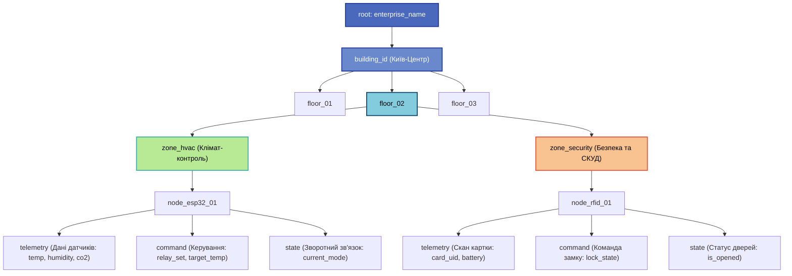
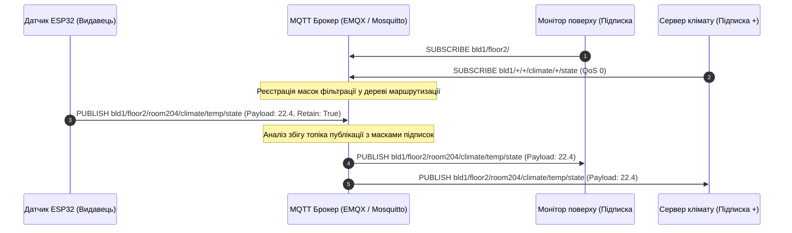

# Практичне заняття № 2. Проєктування ієрархії топіків (Topic Architecture) та маршрутизації у протоколі MQTT

**Мета:** Вивчити фундаментальні принципи організації простору імен та адресації повідомлень у шаблонній моделі «видавець-підписник» (Publish/Subscribe), опанувати правила побудови ієрархічних структур топіків протоколу MQTT, дослідити механізми фільтрації та маршрутизації потоків даних за допомогою символів групування (wildcards), а також набути практичних навичок проєктування масштабованої, безпечної та енергоефективної архітектури топіків для складних багаторівневих систем розумного будинку та промислової автоматизації.

**Стек технологій та інструменти:**
* **Мова програмування / Середовище:** Python 3.10+ (модулі `re`, `json`, `tabulate`, `typing` для розробки та валідації архітектури простору імен), графічний векторний редактор інженерних діаграм (Draw.io / diagrams.net або PlantUML).
* **Платформа / Бібліотеки / Модулі:** Вбудований механізм регулярних виразів мови Python для парсингу та верифікації структури топіків згідно зі специфікацією OASIS MQTT v3.1.1/v5.0, бібліотека `paho-mqtt` для симуляції підписок.
* **Інструменти розробки:** Середовище Visual Studio Code або JetBrains PyCharm, термінал командного рядка (CLI).

---

## 1 Теоретичні відомості

У протоколі MQTT адресація повідомлень принципово відрізняється від класичних мережевих моделей «клієнт-сервер», де відправник повинен чітко знати IP-адресу та номер порту конкретного отримувача. Архітектура Publish/Subscribe забезпечує повне просторове, часове та синхронізаційне розділення джерел інформації (видавців) та її споживачів (підписників). Центральним вузлом координації виступає брокер повідомлень (MQTT Broker), який здійснює прийом вхідних пакетів публікації `PUBLISH` і динамічно маршрутизує їх клієнтам на основі збігу символьних рядків — топіків (Topics).

Топік у протоколі MQTT є текстовим рядком у кодуванні UTF-8, що має деревоподібну ієрархічну структуру, рівні якої розділяються прямим слешем (`/`). Кожен рівень між роздільниками виступає як окремий логічний сегмент простору імен. Стандарт протоколу вимагає суворого дотримання регістрозалежності символів: топіки `office/floor1/temp` та `Office/Floor1/Temp` розглядаються брокером як два абсолютно різні канали передачі інформації.


*Рисунок 1 — Ієрархічне дерево простору імен MQTT для багаторівневої інфраструктури*

Деревовидна топологія, наведена на рисунку 1, забезпечує структуроване та інтуїтивно зрозуміле позиціонування кожного пристрою. Вона дозволяє розширювати мережу додаванням нових поверхів, зон і кінцевих вузлів без зміни структури існуючих сервісів.

Для отримання даних підписники надсилають брокеру пакет `SUBSCRIBE`, де вказують маску підписки (Topic Filter). Протокол підтримує два типи символів групування:

Перший тип — це однорівневий символ підстановки (Single-Level Wildcard), який позначається символом плюса (`+`). Цей символ замінює собою рівно один ієрархічний сегмент між роздільниками. Наприклад, маска `enterprise/bld1/+/room101/temperature` дозволяє отримувати дані температури з кімнати 101 на будь-якому поверсі будівлі, але не відповідає топіку, де пропущено або додано більше одного сегмента.

Другий тип — це багаторівневий символ підстановки (Multi-Level Wildcard), який позначається символом решітки (`#`). Цей символ замінює будь-яку кількість дочірніх підрівнів дерева і обов'язково розміщується виключно на останній позиції в рядку фільтра. Наприклад, підписка на фільтр `enterprise/bld1/floor2/#` забезпечує отримання абсолютно всіх телеметричних даних, повідомлень стану та керуючих команд, які генеруються всіма датчиками та актуаторами другого поверху.


*Рисунок 2 — Маршрутизація повідомлення за допомогою однорівневих та багаторівневих масок*

Процес маршрутизації, наведений на рисунку 2, демонструє, як одне повідомлення від фізичного датчика доставляється одночасно кільком підписникам із різними зонами відповідальності без дублювання запитів від самого пристрою.

При проєктуванні архітектури топіків інженер повинен суворо дотримуватися стандартних правил та обмежень індустрії:
* Початок топіка з прямого слеша (наприклад, `/bld1/floor1`) є грубою помилкою, оскільки створює порожній нульовий рівень в дереві брокера, що збільшує накладні витрати оперативної пам'яті та сповільнює роботу алгоритмів фільтрації;
* Застосування пробілів, спеціальних та недрукованих символів усередині імен рівнів заборонено, оскільки це ускладнює налагодження та може призводити до збоїв у клієнтських бібліотеках;
* Семантика топіків обов'язково повинна розділяти напрямки передачі даних на потоки телеметрії (`telemetry` або `state`), команди прямого керування (`set` або `command`) та системні події (`event` або `alarm`);
* Префікс `$SYS/` зарезервований специфікацією протоколу для внутрішніх службових метрик брокера (статистика завантаження, кількість активних клієнтів, обсяги переданого трафіку) і не повинен використовуватися для користувацьких додатків.

Математична модель узгодження топіка з маскою підписки базується на формальній теорії послідовностей. Нехай публікований топік є вектором сегментів $T = (t_1, t_2, \dots, t_n)$, де кожен елемент $t_i$ належить алфавіту символів $\Sigma^*$, а довжина вектора становить $n \in \mathbb{N}$. Маска підписки представляється вектором $S = (s_1, s_2, \dots, s_m)$, де $s_j \in \Sigma^* \cup \{'+', '\#'\}$ при довжині $m \in \mathbb{N}$.

Функція предикату відповідності $\mathcal{M}(T, S) \in \{0, 1\}$ визначається системою логічних умов:

$$\mathcal{M}(T, S) = \begin{cases} 
1, & \text{якщо } \forall i \in [1, n]: (s_i = t_i \lor s_i = '+') \land (n = m) \\
1, & \text{якщо } \exists k \le m: (s_k = '\#') \land (\forall i < k: s_i = t_i \lor s_i = '+') \\
0, & \text{в усіх інших випадках}
\end{cases}$$

У цьому математичному описі значення $\mathcal{M}(T, S) = 1$ свідчить про те, що брокер зобов'язаний надіслати копію повідомлення підписнику, а значення $\mathcal{M}(T, S) = 0$ означає відхилення передачі через невідповідність структури топіка умовам фільтра.

Оцінка мережевого навантаження ($B_{\text{topic}}$), що створюється виключно передачею рядків топіків за одиницю часу, обчислюється за формулою:

$$B_{\text{topic}} = \sum_{k=1}^{K} f_k \cdot \left( L_{\text{topic}, k} + 2 \right)$$

де $B_{\text{topic}}$ позначає сумарний трафік назв топіків у байтах за секунду ($\text{байт/с}$);
$K$ є загальною кількістю зареєстрованих у системі топіків публікації;
$f_k$ позначає частоту відправки повідомлень у $k$-й топік у герцах ($\text{Гц}$);
$L_{\text{topic}, k}$ представляє довжину символьного рядка $k$-го топіка в байтах ($\text{байт}$);
константа $2$ враховує обов'язкове 2-байтове поле довжини топіка у заголовку фіксованого пакета `PUBLISH`.

---

## 2 Підготовка середовища та розгортання проєкту (Крок 0)

Для розробки, перевірки та симуляції розгалужених ієрархій топіків використовується мова програмування Python та середовище побудови схем Draw.io.

1. Перевірте версію інтерпретатора Python у терміналі операційної системи:

```bash
# Перевірка версії Python (вимагається 3.10 або вище)
python3 --version
```

2. Створіть робочу директорію проєкту та розгорніть структуру файлів для виконання завдань:

```bash
# Створення робочих папок для діаграм, схем і скриптів
mkdir -p ~/MQTT_Topic_Design/{diagrams,validators,schemas,results}
cd ~/MQTT_Topic_Design
```

Структура каталогу проєкту має такий вигляд:

```text
MQTT_Topic_Design/
├── diagrams/
│   └── office_topic_tree.drawio   # Графічна векторна схема дерева топіків (Draw.io)
├── schemas/
│   └── topic_dictionary.json      # Повний словник спроєктованих топіків у форматі JSON
├── validators/
│   └── mqtt_tree_validator.py     # Модуль перевірки синтаксису та емуляції підписок
└── results/
    └── validation_report.txt      # Протокол тестування масок та маршрутизації
```

3. Встановіть додатковий пакет `tabulate` для форматованого виведення матриць маршрутизації у консолі:

```bash
# Встановлення бібліотеки форматування консольних таблиць
pip install tabulate
```

---

## 3 Порядок виконання роботи

### 3.1 Індивідуальні завдання

Кожен здобувач вищої освіти проєктує повну багаторівневу ієрархію топіків для закріпленого індивідуального об'єкта відповідно до таблиці 1. Проєкт повинен містити не менше 4 рівнів глибини, розділення на канали телеметрії, керування та аварійних подій, а також розроблені маски підписок для 4 різних типів користувачів/сервісів (Глобальний моніторинг, Диспетчер поверху/зони, Локальний контролер, Служба безпеки).

*Таблиця 1 — Індивідуальні варіанти для проєктування архітектури топіків MQTT*

| Варіант | Тип об'єкта та масштаб інфраструктури | Обов'язкові підсистеми | Склад сенсорів та актуаторів | Вимоги до спеціальних підписок |
| :---: | :--- | :--- | :--- | :--- |
| **1** | Триповерхова офісна будівля IT-компанії | Клімат-контроль, СКУД, Освітлення | Датчики: CO2, температура, PIR, геркони. Актуатори: реле світла, замки, фанкойли | Окремі маски для адміна будівлі, прибиральної служби та чергового охоронця |
| **2** | Багатопрофільний клінічний стаціонар (4 поверхи) | Моніторинг палат, Вентиляція, Киснева станція | Датчики: тиск кисню, SpO2, потік повітря. Актуатори: клапани, сигнальні табло | Маски для головного лікаря, чергової медсестри відділення та інженера кисневої служби |
| **3** | Логістичний складський термінал (3 зони) | Зони охолодження, Ворота, Пожежний нагляд | Датчики: температура (-20...+5), дим, оптичні бар'єри. Актуатори: теплові завіси, сирени | Маски для начальника зміни, оператора навантажувачів та системи відеоспостереження |
| **4** | Смарт-тепличний комбінат (5 блоків) | Полив, Досвічування, Вентиляційні фрамуги | Датчики: вологість грунту, інсоляція, EC/pH. Актуатори: сервоприводи вікон, насоси добрив | Маски для головного агронома, чергового техніка блоку та системи енергообліку |
| **5** | Автоматизований підземний паркінг (2 рівні) | Контроль загазованості, Шлагбауми, Освітлення | Датчики: CO, NO2, ультразвукові зайнятості місць. Актуатори: струменеві вентилятори, табло | Маски для автоматичної каси, диспетчера евакуації та водіїв через мобільний додаток |
| **6** | Дата-центр телекомунікаційного оператора | Прецизійний клімат, РБЖ (UPS), СКУД серверних стійок | Датчики: температура гарячих/холодних коридорів, витік води, струм. Актуатори: вентилятори, замки | Маски для чергового системного адміністратора, служби безпеки та моніторингу PUE |
| **7** | Фармацевтичний виробничий цех (3 лінії) | Чисті кімнати, Градієнт тиску, Стерилізація | Датчики: дифтиск кімнат, вологість, лічильник часток. Актуатори: шлюзові двері, HEPA-клапани | Маски для валідаційного офіцера, начальника виробничої лінії та служби вентиляції |
| **8** | Розумний навчальний корпус університету | Аудиторії, Лабораторії, Енергомоніторинг | Датчики: освітленість, CO2, споживання електроенергії. Актуатори: проєктори, контактори, кондиціонери | Маски для диспетчера розкладу, енергоменеджера та чергового коменданта |
| **9** | Торгово-розважальний центр (3 поверхи) | Ескалатори, Зона фудкорту, Система димовидалення | Датчики: вібрація ескалатора, дим, температура печей. Актуатори: заслінки димовидалення, підсвітка | Маски для служби клінінгу, технічного директора та оператора протипожежної автоматики |
| **10** | Автоскладальне роботизоване підприємство | Малярний цех, Складальний конвеєр, Зварювальний пост | Датчики: концентрація парів розчинника, тиск повітря, зварювальний струм. Актуатори: витяжки, конвеєр | Маски для оператора робота, інженера з техніки безпеки та системи предиктивної аналітики |
| **11** | Автоматизована зерносушарна станція | Елеватор, Сушильна колона, Приймальний бункер | Датчики: вологість зерна, температура шарів, рівень бункера. Актуатори: пальники, норії, шнеки | Маски для технолога зернопереробки, оператора завантаження та протипожежного пульта |
| **12** | Міська фільтрувальна станція водоканалу | Насосна 1-го підйому, Зона хлорування, Резервуари | Датчики: залишковий хлор, тиск магістралі, каламутність. Актуатори: насоси-дозатори, засувки | Маски для хіміка лабораторії, диспетчера міськводоканалу та аварійної бригади |
| **13** | Розумний готельний комплекс (4 поверхи) | Номерний фонд, Пральня, Спа-зона | Датчики: присутність гостя, протікання води, температура сауни. Актуатори: електронні замки, термостати | Маски для служби рецепції (Front Desk), покоївок та інженера з водопостачання |
| **14** | Тваринницький комплекс молочного напрямку | Доїльний зал, Корівники, Сховище комбікормів | Датчики: аміак, температура, облік надою. Актуатори: скреперні установки, вентиляційні штори | Маски для ветеринарного лікаря, зоотехніка та оператора системи автоматичного доїння |
| **15** | Автоматизована деревообробна фабрика | Сушильні камери, Цех розпилу, Силос тирси | Датчики: температура деревини, рівень пилу, іскровиявлення. Актуатори: пневмотранспорт, спринклери | Маски для начальника сушильного цеху, майстра зміни та чергового пожежного розрахунку |
| **16** | Розумний залізничний вокзал | Касові зали, Зали очікування, Перони | Датчики: пасажиропотік, шум, температура нагріву стрілочних переводів. Актуатори: обігрів стрілок, табло | Маски для диктора вокзалу, дорожнього майстра колії та чергового чергової частини |
| **17** | Багатоповерховий житловий комплекс (3 секції) | Індивідуальні теплопункти, Домофонія, Ліфти | Датчики: статус аварії ліфта, затоплення підвалу, загальнобудинкові лічильники. Актуатори: клапани, освітлення | Маски для мешканців секції, диспетчера ліфтової служби та голови правління ОСББ |
| **18** | Спортивно-оздоровчий аквакомплекс | Басейни, Системи циркуляції, Вентиляція залів | Датчики: pH води, редокс-потенціал, вологість залу. Актуатори: дозатори коагулянту, осушувачі повітря | Маски для тренера, інженера водопідготовки та адміністратора спа-центру |
| **19** | Виноробний завод із підземними погребами | Бродильне відділення, Підвали витримки, Лінія розливу | Датчики: CO2 у підвалі, температура бродіння, рівень у ємностях. Актуатори: азотні клапани, насоси | Маски для головного технолога-винороба, сомельє та начальника служби охорони праці |
| **20** | Сміттєпереробний сортувальний комплекс | Приймальний ангар, Оптичний сепаратор, Прес вторинної сировини | Датчики: заповнення бункерів, температура преса, метан. Актуатори: реверс конвеєра, система пожежогасіння | Маски для оператора оптичного сортувальника, начальника зміни та екологічного інспектора |

---

### 3.2 Покроковий алгоритм та розв'язок еталонного прикладу

Як еталонний приклад розглянемо завдання проєктування простору топіків для **«Триповерхової офісної будівлі з комплексними системами моніторингу клімату, освітлення та контролю фізичного доступу»**.

#### Крок 1. Визначення загального семантичного формату структури топіка

Для забезпечення максимальної сумісності та масштабованості системи вводиться стандартизований 7-рівневий семантичний шаблон побудови топіка:

$$\text{Шаблон:} \quad \mathbf{Root} \,/\, \mathbf{Building} \,/\, \mathbf{Floor} \,/\, \mathbf{Zone} \,/\, \mathbf{Subsystem} \,/\, \mathbf{DeviceID} \,/\, \mathbf{MsgType} \,/\, \mathbf{Property}$$

Структура сегментів шаблону:
1. $\mathbf{Root}$ — назва організації або кореневий префікс підприємства (`kpi-corp`);
2. $\mathbf{Building}$ — унікальний ідентифікатор споруди або філії (`bld-main`);
3. $\mathbf{Floor}$ — рівень поверху (`fl-01`, `fl-02`, `fl-03`);
4. $\mathbf{Zone}$ — функціональне приміщення (`room-101`, `server-room`, `lobby`, `corridor`);
5. $\mathbf{Subsystem}$ — технологічна підсистема (`climate`, `access`, `light`, `power`);
6. $\mathbf{DeviceID}$ — апаратний ідентифікатор кінцевого контролера (`esp32-c1`, `rfid-d1`);
7. $\mathbf{MsgType}$ — категорія повідомлення: `state` (фактичний стан/телеметрія), `set` (команда керування), `event` (сповіщення про подію);
8. $\mathbf{Property}$ — конкретна фізична або логічна змінна (`temperature`, `co2`, `lock`, `brightness`).

#### Крок 2. Побудова таблиці простору топіків та корисного навантаження (Payload)

Кожен датчик або виконавчий пристрій повинен мати окремо визначені топіки для публікації поточних вимірювань і прийому керуючих сигналів.

*Таблиця 2 — Специфікація топіків публікації та підписки еталонної системи*

| № | Повний шлях топіка (Topic String) | Напрямок | Опис функції та призначеного сигналу | Тип даних (Payload) | QoS | Retain |
| :---: | :--- | :---: | :--- | :---: | :---: | :---: |
| 1 | `kpi-corp/bld-main/fl-01/lobby/climate/esp32-c1/state/temperature` | Вихідний (Pub) | Поточна температура повітря у холі 1 поверху | `{"val": 21.5, "unit": "C"}` | 0 | True |
| 2 | `kpi-corp/bld-main/fl-01/lobby/climate/esp32-c1/state/humidity` | Вихідний (Pub) | Відносна вологість повітря у холі | `{"val": 48.0, "unit": "%"}` | 0 | True |
| 3 | `kpi-corp/bld-main/fl-01/lobby/access/rfid-d1/event/scan` | Вихідний (Pub) | Подія зчитування карти доступу на турнікеті | `{"uid": "A1B2C3D4", "ts": 171800}` | 1 | False |
| 4 | `kpi-corp/bld-main/fl-01/lobby/access/rfid-d1/set/lock` | Вхідний (Sub) | Керування електромагнітним замком турнікета | `{"action": "UNLOCK", "dur": 5}` | 2 | False |
| 5 | `kpi-corp/bld-main/fl-02/room-201/climate/esp32-c2/state/co2` | Вихідний (Pub) | Концентрація вуглекислого газу в кабінеті | `{"val": 650, "unit": "ppm"}` | 1 | True |
| 6 | `kpi-corp/bld-main/fl-02/room-201/climate/esp32-c2/set/fan_speed` | Вхідний (Sub) | Команда швидкості обертання фанкойла | `{"speed": 2}` | 1 | False |
| 7 | `kpi-corp/bld-main/fl-02/room-201/light/esp32-l1/set/brightness` | Вхідний (Sub) | Регулювання яскравості світлодіодної панелі | `{"level": 80}` | 0 | False |
| 8 | `kpi-corp/bld-main/fl-03/server-room/climate/esp32-s1/event/alarm` | Вихідний (Pub) | Аварійний сигнал перегріву або затоплення серверної | `{"alert": "TEMP_HIGH", "val": 35.2}` | 2 | True |
| 9 | `kpi-corp/bld-main/fl-03/server-room/access/rfid-s2/state/door_status` | Вихідний (Pub) | Стан герконового датчика дверей серверної | `{"is_open": false}` | 1 | True |
| 10 | `kpi-corp/bld-main/fl-03/server-room/power/ups-01/state/battery` | Вихідний (Pub) | Рівень заряду резервного джерела безперебійного живлення | `{"charge": 98.5, "status": "ONLINE"}` | 0 | True |

#### Крок 3. Формування масок підписок для функціональних ролей

Для мінімізації зайвого мережевого трафіку та ізоляції підсистем формуються спеціалізовані підписки з використанням символів `+` та `#`:

* Сервіс глобального кліматичного моніторингу та аналітики підписується на всі параметри клімату у всій будівлі:
  $$\text{Filter 1:} \quad \mathbf{\text{kpi-corp/bld-main/+/+/climate/+/state/+}}$$
* Сервіс центральної диспетчеризації безпеки та СКУД підписується на всі події доступу та тривоги:
  $$\text{Filter 2:} \quad \mathbf{\text{kpi-corp/bld-main/+/+/access/+/event/+}}$$
* Локальний шлюз автоматизації другого поверху підписується на всі змінні виключно другого поверху для автономного прийняття рішень:
  $$\text{Filter 3:} \quad \mathbf{\text{kpi-corp/bld-main/fl-02/#}}$$
* Ситуаційний монітор серверної кімнати отримує абсолютно всі повідомлення, що стосуються приміщення серверної на 3 поверсі:
  $$\text{Filter 4:} \quad \mathbf{\text{kpi-corp/bld-main/fl-03/server-room/#}}$$

#### Крок 4. Розробка програмного валідатора архітектури топіків (Python)

Створіть файл `validators/mqtt_tree_validator.py` та вставте повний код для валідації синтаксису топіків і тестування відповідності масок:

```python
"""
Модуль перевірки синтаксису, валідації та тестування маршрутизації MQTT топіків.
Розроблено для практичного заняття з курсу 'Технології інтернету речей'.
"""

from typing import List, Dict, Tuple
from tabulate import tabulate
import json
import re


class MQTTTopicValidator:
    """
    Клас виконує перевірку коректності структури топіків MQTT згідно зі стандартом OASIS
    та здійснює фільтрацію публікацій на основі символів групування (+ та #).
    """

    @staticmethod
    def validate_topic_syntax(topic: str, is_filter: bool = False) -> Tuple[bool, str]:
        """
        Перевіряє синтаксичні правила формування рядка топіка або маски підписки.
        """
        if not topic:
            return False, "Помилка: Рядок топіка не може бути порожнім."
        
        if len(topic.encode('utf-8')) > 65535:
            return False, "Помилка: Перевищено максимальну довжину топіка (65535 байт)."

        # Перевірка на заборонений нульовий рівень (слеш на початку або в кінці)
        if topic.startswith('/'):
            return False, "Попередження: Топік починається зі слеша, створюючи порожній рівень на початку."
        if topic.endswith('/'):
            return False, "Попередження: Топік закінчується на слеш, створюючи порожній рівень у кінці."

        segments = topic.split('/')

        # Перевірка на порожні сегменти всередині рядка (подвійний слеш //)
        for idx, seg in enumerate(segments):
            if seg == "" and not (idx == 0 or idx == len(segments) - 1):
                return False, "Помилка: Виявлено порожній сегмент між слешами ('//')."

        if not is_filter:
            # Для топіка публікації використання wildcards суворо заборонено
            if '+' in topic or '#' in topic:
                return False, "Помилка: Топік публікації не може містити символи '+' або '#'."
        else:
            # Правила для масок підписок (Topic Filters)
            for idx, seg in enumerate(segments):
                if '#' in seg and seg != '#':
                    return False, f"Помилка: Символ '#' повинен займати весь рівень окремо (знайдено '{seg}')."
                if '+' in seg and seg != '+':
                    return False, f"Помилка: Символ '+' повинен займати весь рівень окремо (знайдено '{seg}')."
                if seg == '#' and idx != len(segments) - 1:
                    return False, "Помилка: Багаторівневий символ '#' може знаходитися лише на останній позиції."

        return True, "Синтаксис коректний."

    @staticmethod
    def match_topic(pub_topic: str, sub_filter: str) -> bool:
        """
        Реалізує алгоритм перевірки збігу топіка публікації з маскою підписки.
        """
        # Перевірка на повний збіг для швидкого виходу
        if pub_topic == sub_filter:
            return True

        pub_levels = pub_topic.split('/')
        sub_levels = sub_filter.split('/')

        p_len = len(pub_levels)
        s_len = len(sub_levels)

        for i in range(s_len):
            current_sub = sub_levels[i]

            # Якщо зустріли багаторівневий вайлдкард, він покриває все подальше
            if current_sub == '#':
                return True

            # Якщо публікований топік коротший за маску підписки без '#'
            if i >= p_len:
                return False

            current_pub = pub_levels[i]

            # Перевірка однорівневого вайлдкарда або точного збігу тексту
            if current_sub != '+' and current_sub != current_pub:
                return False

        # Якщо маска закінчилась без '#', довжина топіка повинна точно збігатися
        return p_len == s_len


def run_architecture_test():
    """
    Функція запускає повне тестування спроєктованої ієрархії для еталонного офісу.
    """
    print("=" * 85)
    print("      ВЕРИФІКАЦІЯ АРХІТЕКТУРИ ТОПІКІВ ТА МАТРИЦІ МАРШРУТИЗАЦІЇ MQTT      ")
    print("=" * 85)

    # Список спроєктованих топіків публікації
    published_topics = [
        "kpi-corp/bld-main/fl-01/lobby/climate/esp32-c1/state/temperature",
        "kpi-corp/bld-main/fl-01/lobby/climate/esp32-c1/state/humidity",
        "kpi-corp/bld-main/fl-01/lobby/access/rfid-d1/event/scan",
        "kpi-corp/bld-main/fl-02/room-201/climate/esp32-c2/state/co2",
        "kpi-corp/bld-main/fl-02/room-201/climate/esp32-c2/set/fan_speed",
        "kpi-corp/bld-main/fl-02/room-201/light/esp32-l1/set/brightness",
        "kpi-corp/bld-main/fl-03/server-room/climate/esp32-s1/event/alarm",
        "kpi-corp/bld-main/fl-03/server-room/access/rfid-s2/state/door_status",
        "kpi-corp/bld-main/fl-03/server-room/power/ups-01/state/battery",
        # Завідомо некоректний топік для тестування валідатора:
        "/kpi-corp/bld-main//fl-01/bad_topic/"
    ]

    # Словник фільтрів підписок
    subscription_filters = {
        "Sub 1 (Всі дані клімату будівлі)": "kpi-corp/bld-main/+/+/climate/+/state/+",
        "Sub 2 (Всі події СКУД та доступу)": "kpi-corp/bld-main/+/+/access/+/event/+",
        "Sub 3 (Повний контроль 2-го поверху)": "kpi-corp/bld-main/fl-02/#",
        "Sub 4 (Повний моніторинг серверної)": "kpi-corp/bld-main/fl-03/server-room/#"
    }

    # 1. Валідація синтаксису публікацій
    syntax_table = []
    for topic in published_topics:
        is_valid, msg = MQTTTopicValidator.validate_topic_syntax(topic, is_filter=False)
        status_str = "КОРЕКТНИЙ" if is_valid else "ПОМИЛКА"
        syntax_table.append([topic, status_str, msg])

    print("\n--- 1. РЕЗУЛЬТАТИ ВАЛІДАЦІЇ СИНТАКСИСУ ПУБЛІКАЦІЙ ---")
    print(tabulate(syntax_table, headers=["Топік публікації", "Статус", "Деталі перевірки"], tablefmt="grid"))

    # 2. Формування матриці маршрутизації
    valid_topics = [t for t in published_topics if MQTTTopicValidator.validate_topic_syntax(t, False)[0]]
    
    matrix_headers = ["Публікований топік"] + list(subscription_filters.keys())
    matrix_rows = []

    for pub in valid_topics:
        row = [pub]
        for filter_name, sub_mask in subscription_filters.items():
            is_matched = MQTTTopicValidator.match_topic(pub, sub_mask)
            row.append(" ДОСТАВЛЕНО " if is_matched else " — ")
        matrix_rows.append(row)

    print("\n--- 2. МАТРИЦЯ МАРШРУТИЗАЦІЇ ТЕЛЕМЕТРІЇ ЗА МАСКАМИ ПІДПИСОК ---")
    print(tabulate(matrix_rows, headers=matrix_headers, tablefmt="grid"))
    print("=" * 85)


if __name__ == "__main__":
    run_architecture_test()
```

---

### 3.3 Запуск, тестування та перевірка результатів

1. Запустіть модуль валідації через консоль терміналу:

```bash
# Запуск валідатора простору імен MQTT у терміналі
python3 validators/mqtt_tree_validator.py
```

2. Звірте отримане виведення консолі з еталонним протоколом тестування:

```text
=====================================================================================
      ВЕРИФІКАЦІЯ АРХІТЕКТУРИ ТОПІКІВ ТА МАТРИЦІ МАРШРУТИЗАЦІЇ MQTT      
=====================================================================================

--- 1. РЕЗУЛЬТАТИ ВАЛІДАЦІЇ СИНТАКСИСУ ПУБЛІКАЦІЙ ---
+------------------------------------------------------------------+------------+-----------------------------------------------------------+
| Топік публікації                                                 | Статус     | Деталі перевірки                                          |
+==================================================================+============+===========================================================+
| kpi-corp/bld-main/fl-01/lobby/climate/esp32-c1/state/temperature | КОРЕКТНИЙ  | Синтаксис коректний.                                      |
+------------------------------------------------------------------+------------+-----------------------------------------------------------+
| kpi-corp/bld-main/fl-01/lobby/climate/esp32-c1/state/humidity    | КОРЕКТНИЙ  | Синтаксис коректний.                                      |
+------------------------------------------------------------------+------------+-----------------------------------------------------------+
| kpi-corp/bld-main/fl-01/lobby/access/rfid-d1/event/scan          | КОРЕКТНИЙ  | Синтаксис коректний.                                      |
+------------------------------------------------------------------+------------+-----------------------------------------------------------+
| kpi-corp/bld-main/fl-02/room-201/climate/esp32-c2/state/co2      | КОРЕКТНИЙ  | Синтаксис коректний.                                      |
+------------------------------------------------------------------+------------+-----------------------------------------------------------+
| kpi-corp/bld-main/fl-02/room-201/climate/esp32-c2/set/fan_speed  | КОРЕКТНИЙ  | Синтаксис коректний.                                      |
+------------------------------------------------------------------+------------+-----------------------------------------------------------+
| kpi-corp/bld-main/fl-02/room-201/light/esp32-l1/set/brightness   | КОРЕКТНИЙ  | Синтаксис коректний.                                      |
+------------------------------------------------------------------+------------+-----------------------------------------------------------+
| kpi-corp/bld-main/fl-03/server-room/climate/esp32-s1/event/alarm  | КОРЕКТНИЙ  | Синтаксис коректний.                                      |
+------------------------------------------------------------------+------------+-----------------------------------------------------------+
| kpi-corp/bld-main/fl-03/server-room/access/rfid-s2/state/door... | КОРЕКТНИЙ  | Синтаксис коректний.                                      |
+------------------------------------------------------------------+------------+-----------------------------------------------------------+
| kpi-corp/bld-main/fl-03/server-room/power/ups-01/state/battery   | КОРЕКТНИЙ  | Синтаксис коректний.                                      |
+------------------------------------------------------------------+------------+-----------------------------------------------------------+
| /kpi-corp/bld-main//fl-01/bad_topic/                             | ПОМИЛКА    | Попередження: Топік починається зі слеша...               |
+------------------------------------------------------------------+------------+-----------------------------------------------------------+

--- 2. МАТРИЦЯ МАРШРУТИЗАЦІЇ ТЕЛЕМЕТРІЇ ЗА МАСКАМИ ПІДПИСОК ---
+------------------------------------------------------------------+---------------------+---------------------+----------------------+---------------------+
| Публікований топік                                               | Sub 1 (Всі клімат)  | Sub 2 (Події СКУД)  | Sub 3 (Весь поверх 2)| Sub 4 (Серверна)    |
+==================================================================+=====================+=====================+======================+=====================+
| kpi-corp/bld-main/fl-01/lobby/climate/esp32-c1/state/temperature |     ДОСТАВЛЕНО      |          —          |          —           |          —          |
+------------------------------------------------------------------+---------------------+---------------------+----------------------+---------------------+
| kpi-corp/bld-main/fl-01/lobby/climate/esp32-c1/state/humidity    |     ДОСТАВЛЕНО      |          —          |          —           |          —          |
+------------------------------------------------------------------+---------------------+---------------------+----------------------+---------------------+
| kpi-corp/bld-main/fl-01/lobby/access/rfid-d1/event/scan          |          —          |     ДОСТАВЛЕНО      |          —           |          —          |
+------------------------------------------------------------------+---------------------+---------------------+----------------------+---------------------+
| kpi-corp/bld-main/fl-02/room-201/climate/esp32-c2/state/co2      |     ДОСТАВЛЕНО      |          —          |     ДОСТАВЛЕНО       |          —          |
+------------------------------------------------------------------+---------------------+---------------------+----------------------+---------------------+
| kpi-corp/bld-main/fl-02/room-201/climate/esp32-c2/set/fan_speed  |          —          |          —          |     ДОСТАВЛЕНО       |          —          |
+------------------------------------------------------------------+---------------------+---------------------+----------------------+---------------------+
| kpi-corp/bld-main/fl-02/room-201/light/esp32-l1/set/brightness   |          —          |          —          |     ДОСТАВЛЕНО       |          —          |
+------------------------------------------------------------------+---------------------+---------------------+----------------------+---------------------+
| kpi-corp/bld-main/fl-03/server-room/climate/esp32-s1/event/alarm  |          —          |          —          |          —           |     ДОСТАВЛЕНО      |
+------------------------------------------------------------------+---------------------+---------------------+----------------------+---------------------+
| kpi-corp/bld-main/fl-03/server-room/access/rfid-s2/state/door... |          —          |          —          |          —           |     ДОСТАВЛЕНО      |
+------------------------------------------------------------------+---------------------+---------------------+----------------------+---------------------+
| kpi-corp/bld-main/fl-03/server-room/power/ups-01/state/battery   |          —          |          —          |          —           |     ДОСТАВЛЕНО      |
+------------------------------------------------------------------+---------------------+---------------------+----------------------+---------------------+
=====================================================================================
```

3. У середовищі Draw.io побудуйте структурну схему спроєктованого дерева топіків для закріпленого індивідуального варіанта, позначивши відповідні вузли публікації та зони дії розроблених масок підписок. Збережіть файл схеми у форматі `diagrams/variant_X_tree.png`.

---

## 4 Вимоги до змісту звіту

Звіт оформлюється відповідно до стандарту ДСТУ 3008:2015 і повинен містити такі обов'язкові розділи:

1. **Титульна сторінка** встановленого зразка із зазначенням назви Міністерства освіти і науки України, університету, випускової кафедри, дисципліни, номера і теми практичного заняття, номера індивідуального варіанта, навчальної групи та прізвища здобувача.
2. **Мета роботи** та стисла теоретична база щодо структури адресного простору MQTT та принципів фільтрації за масками.
3. **Постановка індивідуального завдання** для відповідного варіанта із зазначенням типу об'єкта, переліку технологічних підсистем, сенсорів і актуаторів.
4. **Таблиця повної специфікації топіків** для власного варіанта із зазначенням назви топіка, напрямку передачі (Pub/Sub), опису призначення, типу даних у форматі JSON, рівня QoS та прапорця Retain.
5. **Обґрунтування масок підписок** для 4 різних користувацьких ролей із поясненням логіки використання символів `+` та `#`.
6. **Графічна векторна діаграма** дерева топіків, створена в редакторі Draw.io.
7. **Повний вихідний код розрахунково-валідаційного скрипту** мовою Python та скріншоти консольного виведення результатів тестування власного варіанта.
8. **Аналітичні висновки**, у яких охарактеризовано масштабованість розробленої структури, оцінено накладні витрати на передачу назв топіків у загальному трафіку та сформульовано рекомендації щодо забезпечення конфіденційності підсистем.

---

## 5 Контрольні запитання для захисту роботи

1. **У чому полягає відмінність між функціонуванням однорівневого (`+`) та багаторівневого (`#`) символів групування у масках підписок MQTT?** Наведіть приклад топіка, який відповідає масці `a/+/c`, але не відповідає масці `a/b/c/#`.
2. **Чому створення топіків, що починаються з прямого слеша (наприклад, `/sensor/temp`), вважається нераціональною інженерною практикою?** Яким чином це впливає на продуктивність дерева індексації брокера?
3. **Для яких цілей використовується службовий префікс `$SYS/` у брокерах повідомлень MQTT?** Чи має право клієнтський вузол здійснювати публікацію власних телеметричних даних у гілку `$SYS/`?
4. **Яким чином прапорець збереження повідомлення (Retain Flag) взаємодіє з ієрархією топіків під час підключення нового підписника?** У яких випадках прапорець Retain встановлювати категорично заборонено?
5. **Як вибір довжини назв рівнів топіка впливає на загальний енергетичний бюджет автономного IoT-вузла, що працює через канал з обмеженою пропускною здатністю (наприклад, LoRaWAN або NB-IoT)?**
6. **Які переваги надає семантичне розділення топіків на гілки стану (`.../state`) та керування (`.../set`) при побудові систем зі зворотним зв'язком у порівнянні з використанням одного спільного топіка?**