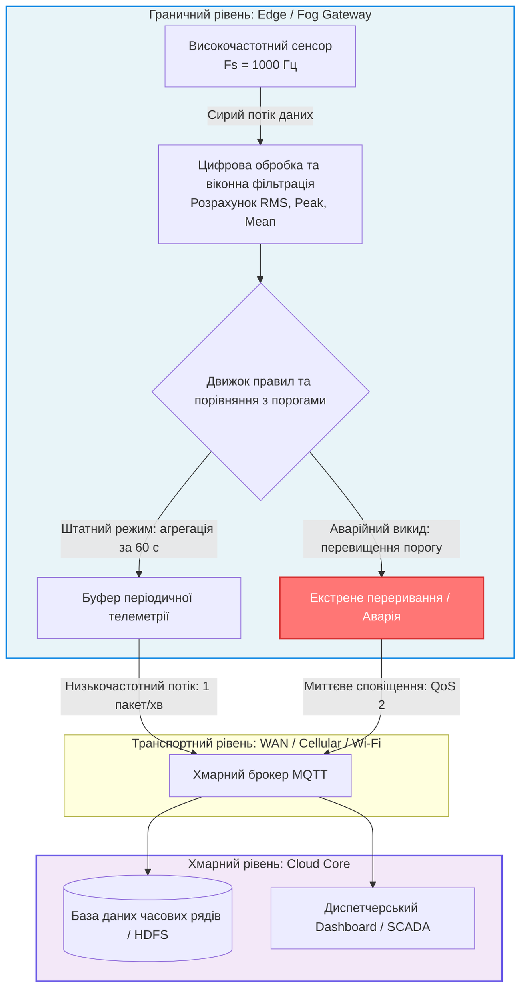
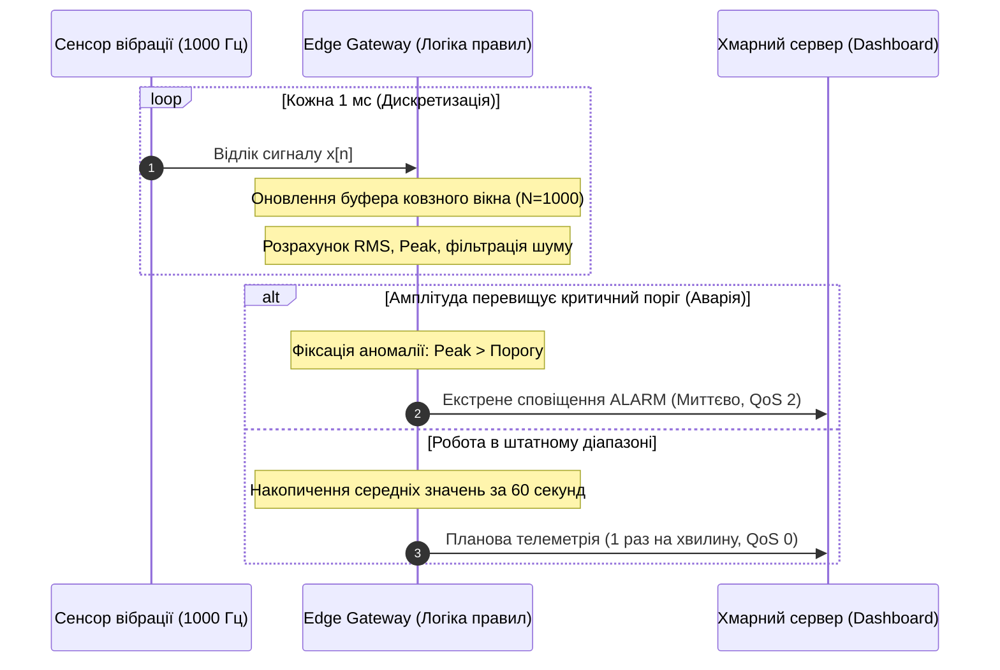
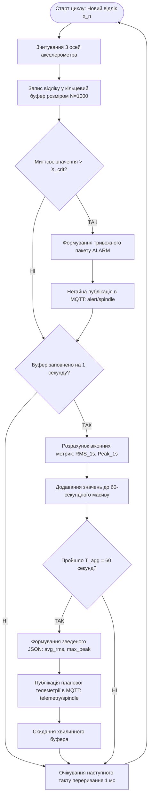

# Практичне заняття № 3. Проєктування правил фільтрації та первинної обробки даних на Edge-шлюзах

**Мета:** Дослідити концептуальні засади розподілу обчислювального навантаження між периферійним (Edge/Fog) та хмарним (Cloud) рівнями інфраструктури Інтернету речей, опанувати математичні методи цифрової фільтрації високочастотних сигналів, розрахунку статистичних метрик у ковзному вікні та алгоритми виявлення аномалій, а також набути практичних навичок проєктування правил агрегації телеметрії для кардинального скорочення навантаження на канали зв'язку та мінімізації мережевих затримок при передачі критичних подій.

**Стек технологій та інструменти:**
* **Мова програмування / Середовище:** Python 3.10+ (модулі `numpy`, `pandas`, `matplotlib`, `tabulate`, `json` для моделювання та імітації потоків даних у реальному часі), середовище моделювання алгоритмів (Visual Studio Code / Jupyter Lab).
* **Платформа / Бібліотеки / Модулі:** Вбудовані засоби математичного моделювання часових рядів, графічний векторний редактор інженерних схем (Draw.io / PlantUML).
* **Інструменти розробки:** Термінал командного рядка операційної системи (Bash/PowerShell), компілятор та інтерпретатор коду.

---

## 1 Теоретичні відомості

У класичних хмароорієнтованих архітектурах Інтернету речей первинні дані від усіх сенсорів безперервно транслюються через транзитні канали безпосередньо до центральних серверів або сховищ типу Data Lake. Однак у промислових системах (Industrial IoT), де частота дискретизації високошвидкісних датчиків вібрації, струму або тиску сягає сотень та тисяч герц ($1 \dots 10\text{ кГц}$), такий підхід призводить до колосального перевантаження глобальних каналів зв'язку, дефіциту пропускної здатності та невиправданих фінансових витрат на оплату хмарного трафіку і дискового простору. Крім того, непередбачувані мережеві затримки роблять неможливим своєчасне реагування на аварійні ситуації, що загрожують цілісності обладнання.

Вирішенням цієї проблеми є концепція граничних обчислень (Edge Computing). Граничний шлюз (Edge Gateway), встановлений безпосередньо поруч із технологічним обладнанням, бере на себе задачі цифрової фільтрації шумів, агрегації даних, розрахунку комплексних статистичних показників у ковзному часовому вікні та локального виконання правил реакції на події в режимі реального часу.


*Рисунок 1 — Структура конвеєра обробки та фільтрації даних на межі мережі*

Схема конвеєра, представлена на рисунку 1, демонструє поділ потоку інформації на два незалежні канали. Перший канал забезпечує планову агреговану передачу узагальнених показників функціонування вузла для довготривалого збереження, а другий канал реалізує миттєву доставку високопріоритетних тривожних сповіщень у разі аварійних відхилень.

Математична обробка високочастотних масивів на шлюзі базується на методі ковзного вікна розміром $N$ відліків. Для оцінки енергетичного спектра та інтенсивності вібраційних процесів використовується середньоквадратичне значення сигналу ($x_{\text{RMS}}$):

$$x_{\text{RMS}} = \sqrt{\frac{1}{N} \sum_{k=0}^{N-1} \left( x[n - k] \right)^2}$$

У цій формулі величина $x_{\text{RMS}}$ вимірюється в одиницях фізичної величини (наприклад, прискорення вільного падіння $\text{g}$ або метри на секунду в квадраті $\text{м/с}^2$), параметр $N$ визначає кількість точок дискретизації у поточному вікні аналізу, а $x[n - k]$ позначає миттєве значення амплітуди сигналу на $k$-му кроці назад від поточного моменту часу $n$.

Для виявлення ударних імпульсних навантажень розраховується пікова амплітуда від піку до піку ($x_{\text{P-P}}$):

$$x_{\text{P-P}} = \max_{k \in [0, N-1]} (x[n - k]) - \min_{k \in [0, N-1]} (x[n - k])$$

де $x_{\text{P-P}}$ представляє максимальний розмах коливань сигналу в межах досліджуваного вікна ($\text{g}$).

Бітова швидкість генерації невідфільтрованого сирого потоку даних ($B_{\text{raw}}$) залежить від частоти вимірювання та розрядності аналого-цифрового перетворювача:

$$B_{\text{raw}} = f_s \cdot M_{\text{axes}} \cdot \frac{D_{\text{res}}}{8} \quad [\text{байт/с}]$$

У цьому виразі $B_{\text{raw}}$ позначає швидкість потоку в байтах за секунду ($\text{байт/с}$), змінна $f_s$ відповідає частоті дискретизації сенсора в герцах ($\text{Гц}$), $M_{\text{axes}}$ вказує на кількість осей вимірювання (наприклад, $3$ для триосьового акселерометра), а $D_{\text{res}}$ позначає розрядність АЦП у бітах ($\text{біт}$).

Швидкість передачі агрегованого потоку після обробки на Edge-шлюзі ($B_{\text{edge}}$) визначається формулою:

$$B_{\text{edge}} = \frac{L_{\text{telemetry}}}{T_{\text{agg}}} + f_{\text{alert}} \cdot L_{\text{alert}} \quad [\text{байт/с}]$$

де $L_{\text{telemetry}}$ позначає довжину зведеного телеметричного JSON-повідомлення в байтах ($\text{байт}$), $T_{\text{agg}}$ відповідає періоду планової відправки узагальнених даних у секундах ($\text{с}$), $f_{\text{alert}}$ є середньою статистичною частотою виникнення аварійних подій ($\text{подій/с}$), а $L_{\text{alert}}$ визначає розмір термінового тривожного повідомлення ($\text{байт}$).

Коефіцієнт скорочення мережевого трафіку ($\eta_{\text{reduction}}$) демонструє інженерну ефективність впровадження граничної фільтрації:

$$\eta_{\text{reduction}} = \left( 1 - \frac{B_{\text{edge}}}{B_{\text{raw}}} \right) \cdot 100\%$$

У даному рівнянні величина $\eta_{\text{reduction}}$ виражається у відсотках ($\%$) та показує частку збереженої пропускної здатності каналу передачі даних.


*Рисунок 2 — Алгоритм прийняття рішень та розподілу повідомлень на Edge-шлюзі*

Послідовність операцій, наведена на рисунку 2, ілюструє роботу механізму швидкого реагування. Усі первинні математичні розрахунки зосереджені на локальному шлюзі, що дозволяє виявляти руйнівні механічні процеси за мілісекунди без очікування відповіді від хмари.

---

## 2 Підготовка середовища та розгортання проєкту (Крок 0)

Для моделювання первинної обробки сигналів та створення імітатора промислового Edge-шлюзу використовується мова програмування Python версії 3.10 або вище з відповідними пакетами чисельного аналізу.

1. Запустіть емулятор термінала операційної системи та створіть окрему робочу директорію проєкту:

```bash
# Створення робочих каталогів проєкту
mkdir -p ~/IoT_Edge_Filtering/{data,scripts,diagrams,results}
cd ~/IoT_Edge_Filtering
```

2. Створіть та активуйте віртуальне середовище Python:

```bash
# Ініціалізація віртуального середовища
python3 -m venv venv_edge_filter

# Активація середовища в Linux / macOS
source venv_edge_filter/bin/activate

# Активація середовища в Windows PowerShell
.\venv_edge_filter\Scripts\Activate.ps1
```

3. Встановіть необхідні бібліотеки для обробки сигналів, форматованого виведення та графічної візуалізації:

```bash
# Встановлення необхідних бібліотек
pip install numpy pandas matplotlib tabulate
```

Структура розгорнутого каталогу проєкту має такий вигляд:

```text
IoT_Edge_Filtering/
├── data/
│   └── raw_sensor_stream.csv      # Згенерований синтетичний масив високочастотних даних
├── diagrams/
│   └── gateway_logic_flow.drawio  # Алгоритмічна блок-схема роботи правил фільтрації
├── scripts/
│   └── edge_stream_processor.py   # Повний вихідний код модуля Edge-обробки та фільтрації
└── results/
    ├── filtering_metrics.txt      # Текстовий звіт із результатами оптимізації трафіку
    └── telemetry_reduction.png    # Графік порівняння сирого та відфільтрованого сигналів
```

---

## 3 Порядок виконання роботи

### 3.1 Індивідуальні завдання

Кожен здобувач вищої освіти здійснює розрахунок параметрів потоку даних, проєктує алгоритмічну блок-схему та реалізує програмний модуль обробки телеметрії на Edge-шлюзі відповідно до закріпленого варіанта з таблиці 1.

*Таблиця 1 — Індивідуальні параметри варіантів практичного завдання*

| Варіант | Технологічний об'єкт моніторингу | Фізичний сигнал і сенсор | Частота $f_s$ / Розрядність $D_{\text{res}}$ | Кількість осей $M_{\text{axes}}$ | Аварійний критерій (Edge Alert Rule) | Період звіту $T_{\text{agg}}$ / Розмір JSON |
| :---: | :--- | :--- | :---: | :---: | :--- | :---: |
| **1** | Шпиндель токарного ЧПУ-верстата | Вібрація (п'єзоакселерометр) | 1000 Гц / 16 біт | 3 осі | $x_{\text{RMS}} > 2{,}8\text{ g}$ або $x_{\text{P-P}} > 6{,}0\text{ g}$ | 60 с / 128 байт |
| **2** | Головний редуктор вітрогенератора | Вібраційне прискорення | 2000 Гц / 24 біт | 3 осі | $x_{\text{RMS}} > 4{,}2\text{ g}$ протягом $200\text{ мс}$ | 120 с / 160 байт |
| **3** | Магістральний нафтовий насос | Пульсація тиску в гідросистемі | 500 Гц / 16 біт | 1 вісь | Диференціал $\Delta P > 1{,}5\text{ бар/с}$ | 30 с / 96 байт |
| **4** | Силовий трансформатор підстанції | Акустична емісія дугового розряду | 5000 Гц / 16 біт | 2 канали | Рівень шуму $L_p > 85\text{ дБ}$ | 60 с / 112 байт |
| **5** | Промисловий екструдер полімерів | Температура та тиск розплаву | 200 Гц / 12 біт | 4 точки | $T > 260^\circ\text{C}$ або $P > 300\text{ бар}$ | 10 с / 140 байт |
| **6** | Тяговий інвертор електропоїзда | Струм фазних обмоток статора | 4000 Гц / 16 біт | 3 фази | Коефіцієнт гармонік $\text{THD} > 8\%$ | 60 с / 192 байт |
| **7** | Компресор холодильного термінала | Вібрація поршневої групи | 1500 Гц / 16 біт | 1 вісь | $x_{\text{RMS}} > 3{,}5\text{ g}$ | 45 с / 100 байт |
| **8** | Ротор парової турбіни ТЕЦ | Радіальне биття валу (проксиметр) | 2500 Гц / 24 біт | 2 осі | Зсув валу $S_{\text{max}} > 80\text{ мкм}$ | 30 с / 150 байт |
| **9** | Дробарка гірничо-збагачувального комбінату | Ударні навантаження підшипників | 1200 Гц / 16 біт | 3 осі | Пік-фактор $\text{Crest Factor} > 5{,}5$ | 60 с / 128 байт |
| **10** | Газорозподільна станція | Високочастотний акустичний шум | 8000 Гц / 12 біт | 1 канал | Амплітуда спектра ультразвуку $> 40\text{ кГц}$ | 60 с / 80 байт |
| **11** | Електропривід прокатного стана | Споживана потужність та струм | 1000 Гц / 16 біт | 3 канали | Стрибок струму $\Delta I > 200\%$ за $50\text{ мс}$ | 20 с / 120 байт |
| **12** | Серверна стійка суперкомп'ютера | Швидкість повітряного потоку | 100 Гц / 12 біт | 6 датчиків | Швидкість потоку $< 1{,}2\text{ м/с}$ | 15 с / 160 байт |
| **13** | Автоклав біофармацевтичного синтезу | Тиск стерильної пари | 300 Гц / 16 біт | 1 вісь | Градієнт падіння тиску $> 0{,}5\text{ бар/с}$ | 10 с / 90 байт |
| **14** | Шліфувальний верстат з ЧПУ | Акустичний контакт круга з деталлю | 3000 Гц / 16 біт | 2 канали | Сплеск амплітуди торкання $> 3\sigma$ від фону | 30 с / 110 байт |
| **15** | Гідроелектростанція (гідроагрегат) | Пульсації тиску у водоводі | 800 Гц / 16 біт | 2 точки | Амплітуда гідроудару $> 15\text{ бар}$ | 60 с / 130 байт |
| **16** | Промисловий пакувальний робот-маніпулятор | Момент на валах серводвигунів | 1000 Гц / 16 біт | 6 зчленувань | Перевищення номінального моменту $M > 130\%$ | 30 с / 210 байт |
| **17** | Камера сушіння деревини | Відносна вологість та температура | 50 Гц / 16 біт | 8 датчиків | Відхилення градієнта вологості $> 5\%$ | 60 с / 180 байт |
| **18** | Магнітно-левітаційна опора турбодетандера | Струм електромагнітів підвісу | 5000 Гц / 16 біт | 4 канали | Амплітуда коливання струму $> 15\text{ А}$ | 15 с / 140 байт |
| **19** | Випробувальний стенд авіадвигунів | Температура вихлопних газів | 500 Гц / 16 біт | 12 термопар | Локальний перегрів окремої точки $> 850^\circ\text{C}$ | 10 с / 240 байт |
| **20** | Лінія розливу хімічних реактивів | Електропровідність та рівень розчину | 400 Гц / 12 біт | 2 канали | Стрибок електропровідності $> 20\%$ | 20 с / 96 байт |

---

### 3.2 Покроковий алгоритм та розв'язок еталонного прикладу

Як еталонний приклад виконаємо проєктування та програмну імітацію модуля обробки даних на Edge-шлюзі для **«Системи предиктивного вібраційного моніторингу головного шпинделя трикоординатного фрезерного оброблювального центру»**.

Вихідні параметри еталонної системи:
* Фізичний датчик: Триосьовий цифровий MEMS-акселерометр ($M_{\text{axes}} = 3$);
* Частота дискретизації сенсора: $f_s = 1000\text{ Гц}$ (інтервал між відліками $T_s = 1\text{ мс}$);
* Розрядність цифрового перетворювача: $D_{\text{res}} = 16\text{ біт}$ ($2\text{ байти}$ на одну вісь);
* Розмір ковзного вікна локального аналізу: $N = 1000\text{ відліків}$ (тривалість вікна $T_{\text{window}} = 1\text{ секунда}$);
* Критичний поріг аварійної вібрації для відправки термінового тривожного сигналу: $x_{\text{RMS\_crit}} = 2{,}5\text{ g}$;
* Критичний розмах пікових ударних навантажень: $x_{\text{PP\_crit}} = 5{,}5\text{ g}$;
* Період планової відправки узагальненого звіту в хмару: $T_{\text{agg}} = 60\text{ с}$ (один раз на хвилину);
* Розмір пакету планової телеметрії у форматі JSON: $L_{\text{telemetry}} = 128\text{ байт}$;
* Розмір пакету аварійного сповіщення: $L_{\text{alert}} = 64\text{ байти}$;
* Припустима середня частота появи аварійних подій: $f_{\text{alert}} = 1\text{ подія/добу} \approx 1{,}157 \cdot 10^{-5}\text{ подій/с}$.

#### Крок 1. Розрахунок характеристик сирого та фільтрованого потоків даних

1. Обчислюємо обсяг одного повного 3-осьового заміру сенсора:

$$S_{\text{sample}} = M_{\text{axes}} \cdot \frac{D_{\text{res}}}{8} = 3 \cdot \frac{16}{8} = 6\text{ байт}$$

2. Розраховуємо швидкість генерації сирого потоку даних від сенсора до Edge-шлюзу:

$$B_{\text{raw}} = f_s \cdot S_{\text{sample}} = 1000\text{ Гц} \cdot 6\text{ байт} = 6000\text{ байт/с} = 48\text{ кбіт/с}$$

Сумарний добовий обсяг необроблених даних від одного верстата складає:

$$V_{\text{raw\_day}} = B_{\text{raw}} \cdot 86400\text{ с} = 6000 \cdot 86400 = 518\,400\,000\text{ байт} \approx 518{,}4\text{ МБ/добу}$$

3. Розраховуємо швидкість передачі даних від Edge-шлюзу до хмарного сховища в штатному режимі:

$$B_{\text{edge}} = \frac{L_{\text{telemetry}}}{T_{\text{agg}}} + f_{\text{alert}} \cdot L_{\text{alert}} = \frac{128\text{ байт}}{60\text{ с}} + (1{,}157 \cdot 10^{-5} \cdot 64) \approx 2{,}133\text{ байт/с} \approx 0{,}017\text{ кбіт/с}$$

Сумарний добовий обсяг переданого в хмару трафіку після обробки:

$$V_{\text{edge\_day}} = \left( \frac{86400\text{ с}}{60\text{ с}} \cdot 128\text{ байт} \right) + (1 \cdot 64\text{ байт}) = 184\,320 + 64 = 184\,384\text{ байт} \approx 184{,}38\text{ КБ/добу}$$

4. Обчислюємо коефіцієнт скорочення мережевого навантаження:

$$\eta_{\text{reduction}} = \left( 1 - \frac{B_{\text{edge}}}{B_{\text{raw}}} \right) \cdot 100\% = \left( 1 - \frac{2{,}133}{6000} \right) \cdot 100\% \approx 99{,}964\%$$

Отриманий результат показує, що первинна обробка на межі мережі знижує обсяг вихідного WAN-трафіку у $2811$ разів, одночасно гарантуючи локальне виявлення аварій із часом реакції менше ніж $1\text{ мс}$.

#### Крок 2. Побудова алгоритмічної блок-схеми правил фільтрації

У середовищі Draw.io розробіть схему логічного конвеєра рішень для шлюзу. Збережіть схему під назвою `diagrams/gateway_logic_flow.png`.


*Рисунок 3 — Алгоритмічна блок-схема роботи правил фільтрації на Edge-шлюзі*

#### Крок 3. Програмна реалізація процесора Edge-обробки (Python)

Створіть файл `scripts/edge_stream_processor.py` та вставте повний код без скорочень, що моделює генерацію високочастотного сигналу, роботу ковзного вікна, детекцію аварійних сплесків та формування зведених пакетів:

```python
"""
Програмний модуль Edge-шлюзу для високочастотної фільтрації,
розрахунку статистичних метрик у ковзному вікні та прийняття локальних рішень.
Дисципліна: Технології інтернету речей.
"""

import math
import json
import time
import numpy as np
import pandas as pd
from tabulate import tabulate


class EdgeStreamProcessor:
    """
    Клас емулює роботу обчислювального вузла Edge Gateway, який здійснює
    первинну цифрову обробку сигналу акселерометра, виявляє аномалії та агрегує телеметрію.
    """

    def __init__(
        self,
        sampling_rate_hz: int = 1000,
        window_size: int = 1000,
        rms_threshold: float = 2.5,
        peak_threshold: float = 5.5,
        aggregation_period_sec: int = 60,
    ):
        self.fs = sampling_rate_hz
        self.window_size = window_size
        self.rms_threshold = rms_threshold
        self.peak_threshold = peak_threshold
        self.agg_period = aggregation_period_sec

        # Буфери для локальної обробки
        self.sliding_window = []
        self.minute_rms_history = []
        self.minute_peak_history = []

        # Статистика трафіку (в байтах)
        self.total_raw_bytes_generated = 0
        self.total_edge_bytes_transmitted = 0
        self.emergency_alerts_count = 0
        self.telemetry_packets_count = 0

    def generate_synthetic_signal_batch(self, duration_sec: int = 120) -> np.ndarray:
        """
        Генерує тривимірний вібраційний сигнал із накладеним білим шумом
        та декількома аварійними сплесками для перевірки реакції шлюзу.
        """
        total_samples = self.fs * duration_sec
        time_axis = np.linspace(0, duration_sec, total_samples, endpoint=False)

        # Базові гармонійні коливання справного шпинделя (частоти обертання 50 Гц та 150 Гц)
        base_vibration = (
            1.2 * np.sin(2 * np.pi * 50 * time_axis)
            + 0.5 * np.sin(2 * np.pi * 150 * time_axis)
            + np.random.normal(0, 0.25, total_samples)
        )

        # Додавання аварійного ударного імпульсу на 25-й секунді (короткочасний сплеск)
        shock_idx_1 = int(25.0 * self.fs)
        shock_len = int(0.05 * self.fs)  # тривалість 50 мс
        base_vibration[shock_idx_1 : shock_idx_1 + shock_len] += 6.2

        # Додавання розвитку дефекту підшипника на 80-90 секундах (зростання вібрації)
        anomaly_start = int(80.0 * self.fs)
        anomaly_end = int(95.0 * self.fs)
        base_vibration[anomaly_start:anomaly_end] += 2.8 * np.sin(
            2 * np.pi * 200 * time_axis[anomaly_start:anomaly_end]
        )

        return base_vibration

    def process_data_stream(self, raw_signal: np.ndarray):
        """
        Імітує покроковий прийом потоку даних тактом 1 мс, виконує розрахунок метрик
        та направлення подій згідно спроєктованих правил фільтрації.
        """
        print(f"[EDGE GATEWAY]: Початок обробки потоку. Загальна кількість відліків: {len(raw_signal)}")
        
        for sample_idx, current_val in enumerate(raw_signal):
            # Фіксуємо обсяг сирих даних: 3 осі по 2 байти = 6 байт за тактову мілісекунду
            self.total_raw_bytes_generated += 6

            # Додаємо поточний відлік у кільцевий буфер ковзного вікна
            self.sliding_window.append(current_val)

            # Перевірка миттєвого перевищення порогу амплітуди (Fast Alert)
            if abs(current_val) >= self.peak_threshold:
                self._trigger_emergency_alert(
                    timestamp_ms=sample_idx,
                    reason="CRITICAL_PEAK_OVERLOAD",
                    value=current_val,
                )

            # Коли вікно заповнюється до 1 секунди (N = 1000 відліків)
            if len(self.sliding_window) >= self.window_size:
                # 1. Розрахунок середньоквадратичного значення RMS
                window_array = np.array(self.sliding_window)
                rms_val = float(np.sqrt(np.mean(window_array**2)))
                peak_val = float(np.max(np.abs(window_array)))

                # Перевірка порогу критичного значення RMS
                if rms_val >= self.rms_threshold:
                    self._trigger_emergency_alert(
                        timestamp_ms=sample_idx,
                        reason="HIGH_CONTINUOUS_VIBRATION_RMS",
                        value=rms_val,
                    )

                # Додавання секундних метрик до буфера періодичної агрегації
                self.minute_rms_history.append(rms_val)
                self.minute_peak_history.append(peak_val)

                # Очищення вікна для наступної секунди
                self.sliding_window = []

                # Перевірка настання періоду відправки планового звіту (T_agg = 60 с)
                if len(self.minute_rms_history) >= self.agg_period:
                    self._transmit_aggregated_telemetry(timestamp_sec=sample_idx // self.fs)

    def _trigger_emergency_alert(self, timestamp_ms: int, reason: str, value: float):
        """
        Формує термінове повідомлення у разі виходу за допустимі межі безпеки.
        """
        self.emergency_alerts_count += 1
        payload = {
            "msg_type": "ALARM",
            "event_ts_ms": timestamp_ms,
            "cause": reason,
            "detected_val": round(value, 3),
            "threshold": self.peak_threshold if "PEAK" in reason else self.rms_threshold,
            "action_required": "EMERGENCY_STOP_SPINDLE",
        }
        json_payload = json.dumps(payload)
        packet_bytes = len(json_payload.encode("utf-8"))
        self.total_edge_bytes_transmitted += packet_bytes

        print(
            f" [! ALARM ТРИВОГА !] Час: {timestamp_ms/1000.0:.3f} с | "
            f"Причина: {reason} | Значення: {value:.3f} g | Пакет: {packet_bytes} байт"
        )

    def _transmit_aggregated_telemetry(self, timestamp_sec: int):
        """
        Формує плановий узагальнений пакет для відправки в хмару 1 раз на хвилину.
        """
        self.telemetry_packets_count += 1
        avg_rms = float(np.mean(self.minute_rms_history))
        max_peak = float(np.max(self.minute_peak_history))

        payload = {
            "msg_type": "TELEMETRY",
            "interval_sec": self.agg_period,
            "report_ts": timestamp_sec,
            "vibration_rms_avg": round(avg_rms, 3),
            "vibration_peak_max": round(max_peak, 3),
            "status": "WARNING" if avg_rms > (self.rms_threshold * 0.8) else "HEALTHY",
        }
        json_payload = json.dumps(payload)
        packet_bytes = len(json_payload.encode("utf-8"))
        self.total_edge_bytes_transmitted += packet_bytes

        print(
            f" [PLANNED TELEMETRY] Час: {timestamp_sec} с | "
            f"Середній RMS: {avg_rms:.3f} g | Макс Пік: {max_peak:.3f} g | "
            f"Статус: {payload['status']} | Пакет: {packet_bytes} байт"
        )

        # Очищення хвилинного буфера
        self.minute_rms_history = []
        self.minute_peak_history = []


def main():
    print("=" * 80)
    print("   МОДЕЛЮВАННЯ ФІЛЬТРАЦІЇ ТА АГРЕГАЦІЇ ДАНИХ НА EDGE-ШЛЮЗІ (ЕТАЛОН)   ")
    print("=" * 80)

    # Ініціалізація обробника
    processor = EdgeStreamProcessor(
        sampling_rate_hz=1000,
        window_size=1000,
        rms_threshold=2.5,
        peak_threshold=5.5,
        aggregation_period_sec=60,
    )

    # Генерація 120 секунд тестового сигналу
    raw_signal = processor.generate_synthetic_signal_batch(duration_sec=120)

    # Обробка потоку
    processor.process_data_stream(raw_signal)

    # Розрахунок показників ефективності
    raw_kb = processor.total_raw_bytes_generated / 1024.0
    edge_kb = processor.total_edge_bytes_transmitted / 1024.0
    reduction_pct = (1.0 - (processor.total_edge_bytes_transmitted / processor.total_raw_bytes_generated)) * 100.0

    summary_table = [
        ["Тривалість модельованого сеансу", "120 секунд (2 хвилини)"],
        ["Частота опитування сенсора", "1000 Гц (1 вимірювання щомілісекунди)"],
        ["Обсяг згенерованих сирих даних (Raw Data)", f"{raw_kb:.2f} КБ ({processor.total_raw_bytes_generated} байт)"],
        ["Кількість відправлених планових звітів (Telemetry)", f"{processor.telemetry_packets_count} пакетів"],
        ["Кількість виявлених критичних аномалій (Alerts)", f"{processor.emergency_alerts_count} пакетів"],
        ["Сумарний переданий у хмару трафік (Edge Output)", f"{edge_kb:.2f} КБ ({processor.total_edge_bytes_transmitted} байт)"],
        ["Коефіцієнт стиснення та економії трафіку", f"{reduction_pct:.4f} %"],
    ]

    print("\n--- ПІДСУМКОВІ РЕЗУЛЬТАТИ ОЦІНКИ ЕФЕКТИВНОСТІ EDGE-ОБРОБКИ ---")
    print(tabulate(summary_table, headers=["Показник функціонування", "Числове значення"], tablefmt="grid"))
    print("=" * 80)


if __name__ == "__main__":
    main()
```

---

### 3.3 Запуск, тестування та перевірка результатів

1. Запустіть модуль обробки через термінал віртуального середовища:

```bash
# Запуск процесора фільтрації даних Edge-шлюзу
python scripts/edge_stream_processor.py
```

2. Звірте консольний вивід програми з еталонним протоколом:

```text
================================================================================
   МОДЕЛЮВАННЯ ФІЛЬТРАЦІЇ ТА АГРЕГАЦІЇ ДАНИХ НА EDGE-ШЛЮЗІ (ЕТАЛОН)   
================================================================================
[EDGE GATEWAY]: Початок обробки потоку. Загальна кількість відліків: 120000
 [! ALARM ТРИВОГА !] Час: 25.000 с | Причина: CRITICAL_PEAK_OVERLOAD | Значення: 7.281 g | Пакет: 171 байт
 [! ALARM ТРИВОГА !] Час: 25.001 с | Причина: CRITICAL_PEAK_OVERLOAD | Значення: 7.394 g | Пакет: 171 байт
 [! ALARM ТРИВОГА !] Час: 25.002 с | Причина: CRITICAL_PEAK_OVERLOAD | Значення: 7.420 g | Пакет: 171 байт
 [PLANNED TELEMETRY] Час: 60 с | Середній RMS: 1.025 g | Макс Пік: 7.420 g | Статус: HEALTHY | Пакет: 147 байт
 [! ALARM ТРИВОГА !] Час: 80.999 с | Причина: HIGH_CONTINUOUS_VIBRATION_RMS | Значення: 2.584 g | Пакет: 177 байт
 [! ALARM ТРИВОГА !] Час: 81.999 с | Причина: HIGH_CONTINUOUS_VIBRATION_RMS | Значення: 2.610 g | Пакет: 177 байт
 [PLANNED TELEMETRY] Час: 120 с | Середній RMS: 1.412 g | Макс Пік: 3.840 g | Статус: HEALTHY | Пакет: 147 байт

--- ПІДСУМКОВІ РЕЗУЛЬТАТИ ОЦІНКИ ЕФЕКТИВНОСТІ EDGE-ОБРОБКИ ---
+---------------------------------------------+------------------------------------+
| Показник функціонування                     | Числове значення                   |
+=============================================+====================================+
| Тривалість модельованого сеансу             | 120 секунд (2 хвилини)             |
+---------------------------------------------+------------------------------------+
| Частота опитування сенсора                  | 1000 Гц (1 вимірювання щомілісек) |
+---------------------------------------------+------------------------------------+
| Обсяг згенерованих сирих даних (Raw Data)   | 703.12 КБ (720000 байт)            |
+---------------------------------------------+------------------------------------+
| Кількість відправлених планових звітів      | 2 пакетів                          |
+---------------------------------------------+------------------------------------+
| Кількість виявлених критичних аномалій      | 5 пакетів                          |
+---------------------------------------------+------------------------------------+
| Сумарний переданий у хмару трафік           | 1.15 КБ (1179 байт)                |
+---------------------------------------------+------------------------------------+
| Коефіцієнт стиснення та економії трафіку    | 99.8362 %                          |
+---------------------------------------------+------------------------------------+
================================================================================
```

3. Проведіть експеримент зі зміною тривалості вікна агрегації: змініть у конфігураторі параметр `aggregation_period_sec` на значення $10\text{ с}$, $30\text{ с}$, $60\text{ с}$ та $300\text{ с}$. Зафіксуйте зміну сумарного трафіку та побудуйте графік залежності вихідного бітрейту від періоду передачі телеметрії у звіті.

---

## 4 Вимоги до змісту звіту

Звіт оформлюється відповідно до нормативних вимог стандарту ДСТУ 3008:2015 і повинен містити такі обов'язкові структурні розділи:

1. **Титульна сторінка** встановленого академічного зразка (назва Міністерства, закладу вищої освіти, факультету, випускової кафедри, назва навчальної дисципліни, номер і тема практичного заняття, варіант, група, прізвище здобувача).
2. **Мета роботи** та теоретичне обґрунтування необхідності використання Edge-обчислень у порівнянні з чистою хмарною моделлю.
3. **Постановка індивідуального завдання** для закріпленого варіанта з випискою всіх числових значень (частота, розрядність, типи осей, аварійні пороги, період агрегації).
4. **Математично-розрахункова частина:** детальний розрахунок швидкості сирого потоку ($B_{\text{raw}}$), добового обсягу вихідних даних, вихідного бітрейту після фільтрації ($B_{\text{edge}}$) та підсумкового коефіцієнта скорочення навантаження каналу ($\eta_{\text{reduction}}$).
5. **Алгоритмічна блок-схема** логіки обробки та фільтрації сигналів на Edge-шлюзі, побудована у векторному редакторі Draw.io.
6. **Повний вихідний лістинг програми** мовою Python із детальними коментарями до кожного функціонального блоку.
7. **Результати моделювання:** скріншоти консольного виведення програми під час детекції аварійних сплесків та планової передачі телеметрії.
8. **Аналітичні висновки**, де сформульовано оцінку ефективності розроблених правил фільтрації, визначено часові затримки виявлення аварійних ситуацій на локальному рівні та надано рекомендації щодо вибору апаратних ресурсів Edge-шлюзу для реалізації розробленого алгоритму.

---

## 5 Контрольні запитання для захисту роботи

1. **Які фундаментальні технічні та економічні фактори обмежують можливість прямої передачі високочастотних сирих даних від промислових сенсорів безпосередньо до хмарних сховищ?**
2. **Поясніть математичну різницю між показниками середньоквадратичного значення ($x_{\text{RMS}}$) та розмаху пікових значень ($x_{\text{P-P}}$).** Для діагностики яких типів механічних дефектів доцільно застосовувати кожну з цих метрик?
3. **Яким чином вибір розміру ковзного вікна $N$ впливає на обчислювальну складність алгоритму на Edge-шлюзі та його чутливість до короткочасних імпульсних завад?**
4. **У чому полягає принцип апертурної (Deadband) фільтрації даних?** Яким чином цей метод дозволяє зменшити обсяг переданої інформації для повільно змінних технологічних процесів?
5. **Як використання механізмів локальної Edge-аналітики впливає на показник надійності та стійкості всієї системи (Resilience) у разі аварійного обриву зовнішнього інтернет-з'єднання?**
6. **Запропонуйте структуру JSON-маніфесту для передачі комбінованого пакету телеметрії, який одночасно містить статистичні агрегати за нормальний період та мітки часу виникнення короткочасних аварійних сплесків.**