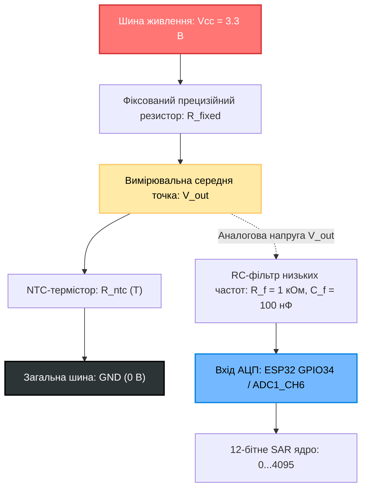

# Практичне заняття № 4. Математичне моделювання та розрахунок параметрів аналогово-цифрового перетворення для сполучення резистивних сенсорів із мікроконтролером

**Мета:** Дослідити фізичні та математичні засади функціонування аналогово-цифрових перетворювачів (АЦП) сучасних мікроконтролерних систем (на прикладі архітектури ESP32), опанувати методи розрахунку параметрів кіл узгодження на базі подільників напруги, вивчити математичні моделі терморезисторів із негативним температурним коефіцієнтом (NTC-термісторів), а також набути практичних навичок аналітичного перетворення вихідного дискретного двійкового коду у фізичну величину температури з оцінкою похибок квантування та апаратної нелінійності.

**Стек технологій та інструменти:**
* **Мова програмування / Середовище:** Python 3.10+ (модулі `numpy`, `math`, `matplotlib`, `tabulate` для чисельного розрахунку, побудови калібрувальних таблиць та оцінки похибок), кросплатформовий табличний процесор (Microsoft Excel / LibreOffice Calc).
* **Платформа / Бібліотеки / Модулі:** Математичні моделі Стейнхарта-Харта та $\beta$-параметричні рівняння апроксимації напівпровідникових сенсорів.
* **Інструменти розробки:** Інтегроване середовище Visual Studio Code / Jupyter Notebook, емулятор термінала операційної системи (CLI).

---

## 1 Теоретичні відомості

Первинні вимірювальні перетворювачі параметрів навколишнього середовища здебільшого змінюють свій електричний опір під впливом фізичних факторів. Зокрема, напівпровідникові терморезистори з негативним температурним коефіцієнтом (NTC-термістори) зменшують власний опір при зростанні температури внаслідок експоненційного збільшення концентрації вільних носіїв заряду. Оскільки вбудовані аналогово-цифрові перетворювачі мікроконтролерів (зокрема, послідовного наближення SAR ADC у мікроконтролері ESP32) здатні вимірювати виключно різницю електричних потенціалів (напругу), виникає необхідність застосування схеми параметричного перетворення опору в напругу.

Найбільш поширеним та економічно ефективним рішенням для сполучення резистивного датчика з мікроконтролером є резистивний подільник напруги. У нижньоплечовій конфігурації NTC-термістор підключається між вимірювальним аналоговим піном і шиною заземлення (GND), тоді як стабільний опорний резистор з фіксованим опором ($R_{\text{fixed}}$) підтягується до шини живлення ($V_{cc}$).


*Рисунок 1 — Електрична схема сполучення NTC-термістора з аналоговим входом мікроконтролера ESP32*

Схема на рисунку 1 демонструє проходження сигналу від чутливого напівпровідникового елемента через фільтруючий RC-ланцюг до ядра аналогово-цифрового перетворювача. Введення RC-фільтра дозволяє ефективно придушити високочастотні наведені шуми комутації бездротового радіомодуля Wi-Fi.

Вихідна напруга подільника ($V_{\text{out}}$) у точці підключення до аналогового входу мікроконтролера описується рівнянням:

$$V_{\text{out}} = V_{cc} \cdot \frac{R_{\text{ntc}}}{R_{\text{fixed}} + R_{\text{ntc}}}$$

У цій формулі величина $V_{\text{out}}$ визначає миттєвий потенціал на вимірювальному вході у вольтах ($\text{В}$), змінна $V_{cc}$ позначає стабілізовану напругу живлення схеми подільника у вольтах ($\text{В}$), $R_{\text{ntc}}$ представляє динамічний опір термістора при поточній температурі в омах ($\text{Ом}$), а параметр $R_{\text{fixed}}$ позначає номінальний опір постійного узгоджувального резистора в омах ($\text{Ом}$).

Процес квантування вхідної напруги інтегрованим $N$-розрядним АЦП формує цілочисельний код ($D_{\text{raw}}$), пропорційний виміряній напрузі відносно опорного рівня ($V_{\text{ref}}$):

$$D_{\text{raw}} = \text{round}\left( \frac{V_{\text{out}}}{V_{\text{ref}}} \cdot (2^N - 1) \right)$$

де $D_{\text{raw}}$ позначає безрозмірний дискретний вихідний код АЦП у діапазоні $[0; \, 2^N - 1]$;
$V_{\text{ref}}$ є опорною напругою перетворювача у вольтах ($\text{В}$), яка для вбудованого модуля ESP32 за максимального послаблення атенюатора (Full Scale $11\text{ дБ}$) приймається рівною напрузі живлення $3{,}3\text{ В}$;
$N$ визначає розрядність аналогово-цифрового перетворювача в бітах ($N = 12\text{ біт}$, що забезпечує $4096$ дискретних рівнів квантування від $0$ до $4095$).

Крок квантування, або ціна молодшого значущого розряду ($\text{LSB}$), визначає граничну роздільну здатність перетворювача за напругою:

$$\Delta V_{\text{LSB}} = \frac{V_{\text{ref}}}{2^N - 1}$$

де $\Delta V_{\text{LSB}}$ вимірюється у вольтах ($\text{В}$) або мілівольтах ($\text{мВ}$) і для 12-бітної шкали за напруги $3{,}3\text{ В}$ становить приблизно $0{,}80586\text{ мВ}$.


*Рисунок 2 — Конвеєр перетворення фізичної величини у двійковий код та зворотного відновлення у мікроконтролері*

Конвеєр, зображений на рисунку 2, ілюструє повний замкнений цикл цифрової обробки сигналу від первинної фізичної дії середовища до її відновлення в програмному забезпеченні контролера.

Зворотний перерахунок вихідного двійкового коду $D_{\text{raw}}$ в опір термістора виконується програмно шляхом алгебраїчних перетворень:

$$R_{\text{ntc}} = R_{\text{fixed}} \cdot \frac{D_{\text{raw}}}{(2^N - 1) - D_{\text{raw}}}$$

Математичний зв'язок між опором напівпровідникового матеріалу та його абсолютною температурою описується експоненційною $\beta$-моделлю (спрощеним рівнянням Стейнхарта-Харта):

$$\frac{1}{T} = \frac{1}{T_0} + \frac{1}{\beta} \cdot \ln\left( \frac{R_{\text{ntc}}}{R_0} \right)$$

У цьому виразі змінна $T$ позначає вимірювану абсолютну температуру у кельвінах ($\text{K}$), константа $T_0$ відповідає базовій калібрувальній температурі у кельвінах (зазвичай $25^\circ\text{C} = 298{,}15\text{ K}$), $R_0$ позначає паспортний номінальний опір термістора при базовій температурі $T_0$ в омах ($\text{Ом}$), а коефіцієнт $\beta$ представляє температурний коефіцієнт чутливості напівпровідникового матеріалу у кельвінах ($\text{K}$).

Переведення розрахованої абсолютної температури у шкалу Цельсія здійснюється за стандартною залежністю:

$$T_{\text{celsius}} = T - 273{,}15$$

Температурна роздільна здатність вимірювального каналу ($\Delta T_{\text{res}}$), яка визначає мінімальну зміну температури, що викликає зміну цифрового коду АЦП рівно на $1\text{ LSB}$, розраховується через похідну функції перетворення:

$$\Delta T_{\text{res}} = \left| \frac{dT}{d D_{\text{raw}}} \right| \approx \left| \frac{T(D_{\text{raw}} + 1) - T(D_{\text{raw}})}{1} \right|$$

де $\Delta T_{\text{res}}$ виражається у градусах Цельсія на один квант ($\text{}^\circ\text{C/LSB}$) і змінюється по всьому діапазону внаслідок істотної нелінійності схеми подільника та самого NTC-сенсора.

---

## 2 Підготовка середовища та розгортання проєкту (Крок 0)

Для виконання аналітичних розрахунків, моделювання передавальної характеристики вимірювального тракту та побудови калібрувальних таблиць використовується мова програмування Python версії 3.10 або вище.

1. Запустіть емулятор термінала операційної системи та перевірте версію інтерпретатора Python:

```bash
# Перевірка наявності та версії Python у системі
python3 --version
```

2. Створіть робочий каталог практичного заняття та налаштуйте структуру папок для збереження результатів моделювання:

```bash
# Створення робочих каталогів проєкту
mkdir -p ~/IoT_ADC_Calculations/{scripts,tables,plots,results}
cd ~/IoT_ADC_Calculations
```

3. Створіть та активуйте віртуальне середовище Python:

```bash
# Ініціалізація віртуального оточення
python3 -m venv venv_adc_calc

# Активація середовища в Linux / macOS
source venv_adc_calc/bin/activate

# Активація середовища в Windows PowerShell
.\venv_adc_calc\Scripts\Activate.ps1
```

4. Встановіть бібліотеки, необхідні для проведення чисельного аналізу, табуляції та побудови графіків:

```bash
# Встановлення необхідних бібліотек через менеджер пакетів pip
pip install numpy tabulate matplotlib pandas
```

Структура робочої директорії проєкту повинна мати такий вигляд:

```text
IoT_ADC_Calculations/
├── scripts/
│   └── adc_ntc_calculator.py    # Головний розрахунково-аналітичний модуль
├── tables/
│   └── ntc_lookup_table.csv     # Згенерована калібрувальна таблиця (LUT) для прошивки
├── plots/
│   └── transfer_curve.png       # Графік залежності вихідного коду АЦП від температури
└── results/
    └── calculation_report.txt   # Підсумковий протокол розрахунку параметрів схеми
```

---

## 3 Порядок виконання роботи

### 3.1 Індивідуальні завдання

Кожен здобувач вищої освіти виконує розрахунок параметрів схеми узгодження, визначає точний опір термістора, обчислює поточну температуру у градусах Цельсія за зареєстрованим кодом АЦП, а також оцінює похибку квантування відповідно до закріпленого варіанта з таблиці 1.

*Таблиця 1 — Індивідуальні параметри варіантів практичного завдання*

| Варіант | Номінал термістора $R_0$ (кОм) | Базова температура $T_0$ ($^\circ\text{C}$) | Коефіцієнт чутливості $\beta$ (K) | Опір підтяжки $R_{\text{fixed}}$ (кОм) | Напруга живлення $V_{cc}$ (В) | Розрядність АЦП $N$ (біт) | Отриманий код АЦП $D_{\text{raw}}$ |
| :---: | :---: | :---: | :---: | :---: | :---: | :---: | :---: |
| **1** | 10.0 | 25.0 | 3950 | 10.0 | 3.30 | 12 | 1850 |
| **2** | 10.0 | 25.0 | 3435 | 10.0 | 3.30 | 12 | 2420 |
| **3** | 5.0 | 25.0 | 3984 | 4.7 | 3.30 | 12 | 1650 |
| **4** | 100.0 | 25.0 | 4200 | 100.0 | 3.30 | 12 | 3100 |
| **5** | 10.0 | 25.0 | 3950 | 15.0 | 3.30 | 12 | 1420 |
| **6** | 47.0 | 25.0 | 4050 | 47.0 | 3.30 | 12 | 2250 |
| **7** | 2.2 | 25.0 | 3500 | 2.2 | 3.00 | 10 | 480 |
| **8** | 10.0 | 25.0 | 3950 | 10.0 | 3.30 | 12 | 980 |
| **9** | 5.0 | 25.0 | 3900 | 10.0 | 3.30 | 12 | 1250 |
| **10** | 100.0 | 25.0 | 4300 | 82.0 | 3.30 | 12 | 1980 |
| **11** | 10.0 | 25.0 | 3650 | 10.0 | 3.30 | 12 | 2890 |
| **12** | 20.0 | 25.0 | 4100 | 20.0 | 3.30 | 12 | 2048 |
| **13** | 10.0 | 25.0 | 3950 | 6.8 | 3.30 | 12 | 2150 |
| **14** | 50.0 | 25.0 | 4150 | 51.0 | 3.30 | 12 | 1780 |
| **15** | 10.0 | 25.0 | 3435 | 10.0 | 3.00 | 10 | 610 |
| **16** | 1.0 | 25.0 | 3200 | 1.0 | 3.30 | 12 | 2560 |
| **17** | 10.0 | 25.0 | 3950 | 10.0 | 3.30 | 12 | 3450 |
| **18** | 22.0 | 25.0 | 3970 | 22.0 | 3.30 | 12 | 1340 |
| **19** | 4.7 | 25.0 | 3850 | 4.7 | 3.30 | 12 | 2750 |
| **20** | 10.0 | 25.0 | 4250 | 10.0 | 3.30 | 12 | 1620 |

---

### 3.2 Покроковий алгоритм та розв'язок еталонного прикладу

Як еталонний приклад розглянемо вимірювальний канал системи теплового моніторингу акумуляторної батареї на базі мікроконтролера ESP32 та NTC-термістора.

Вихідні дані еталонного варіанта:
* Номінальний опір термістора: $R_0 = 10{,}0\text{ кОм} = 10000\text{ Ом}$ при базовій температурі $T_0 = 25^\circ\text{C} = 298{,}15\text{ K}$;
* Температурний коефіцієнт чутливості: $\beta = 3950\text{ K}$;
* Опір постійного узгоджувального резистора: $R_{\text{fixed}} = 10{,}0\text{ кОм} = 10000\text{ Ом}$;
* Напруга живлення вимірювального моста: $V_{cc} = 3{,}30\text{ В}$;
* Розрядність перетворювача: $N = 12\text{ біт}$ ($2^{12} - 1 = 4095$ рівнів квантування);
* Опорна напруга АЦП: $V_{\text{ref}} = 3{,}30\text{ В}$;
* Зафіксований цілочисельний код АЦП: $D_{\text{raw}} = 1750$.

#### Крок 1. Розрахунок вхідної аналогової напруги АЦП

Ціна молодшого розряду квантування становить:

$$\Delta V_{\text{LSB}} = \frac{V_{\text{ref}}}{4095} = \frac{3{,}30\text{ В}}{4095} \approx 0{,}00080586\text{ В} = 0{,}80586\text{ мВ}$$

Напруга на вимірювальному вході мікроконтролера, що відповідає отриманому коду $D_{\text{raw}} = 1750$, дорівнює:

$$V_{\text{out}} = D_{\text{raw}} \cdot \Delta V_{\text{LSB}} = 1750 \cdot 0{,}00080586\text{ В} \approx 1{,}410256\text{ В}$$

#### Крок 2. Обчислення опору NTC-термістора

Оскільки схема подільника використовує нижнє плече для встановлення терморезистора, залежність струму кола дозволяє знайти опір $R_{\text{ntc}}$:

$$R_{\text{ntc}} = R_{\text{fixed}} \cdot \frac{V_{\text{out}}}{V_{cc} - V_{\text{out}}} = 10000 \cdot \frac{1{,}410256}{3{,}30 - 1{,}410256} = 10000 \cdot \frac{1{,}410256}{1{,}889744} \approx 7462{,}68\text{ Ом}$$

Прямий розрахунок через відношення двійкових кодів без проміжних округлень напруги:

$$R_{\text{ntc}} = R_{\text{fixed}} \cdot \frac{D_{\text{raw}}}{4095 - D_{\text{raw}}} = 10000 \cdot \frac{1750}{4095 - 1750} = 10000 \cdot \frac{1750}{2345} \approx 7462{,}6866\text{ Ом}$$

Отримане значення $R_{\text{ntc}} \approx 7{,}46\text{ кОм}$ менше за номінальне значення $10{,}0\text{ кОм}$, що свідчить про те, що поточна температура перевищує базовий рівень $+25^\circ\text{C}$.

#### Крок 3. Розрахунок абсолютної температури за $\beta$-моделлю

Обчислюємо логарифм відношення опорів:

$$\ln\left( \frac{R_{\text{ntc}}}{R_0} \right) = \ln\left( \frac{7462{,}6866}{10000} \right) = \ln(0{,}746269) \approx -0{,}292699$$

Підставляємо отримані параметри у формулу $\beta$-апроксимації:

$$\frac{1}{T} = \frac{1}{T_0} + \frac{1}{\beta} \cdot \ln\left( \frac{R_{\text{ntc}}}{R_0} \right) = \frac{1}{298{,}15} + \frac{-0{,}292699}{3950}$$

$$\frac{1}{T} \approx 0{,}00335402 - 0{,}00007410 = 0{,}00327992\text{ K}^{-1}$$

Знаходимо абсолютну температуру у кельвінах:

$$T = \frac{1}{0{,}00327992} \approx 304{,}885\text{ K}$$

Переводимо результат у шкалу Цельсія:

$$T_{\text{celsius}} = 304{,}885 - 273{,}15 = 31{,}735^\circ\text{C} \approx 31{,}74^\circ\text{C}$$

#### Крок 4. Оцінка локальної чутливості та похибки квантування

Для оцінки локальної роздільної здатності обчислюємо температуру, що відповідає сусідньому коду $D_{\text{raw}} + 1 = 1751$:

$$R_{\text{ntc}}(1751) = 10000 \cdot \frac{1751}{4095 - 1751} = 10000 \cdot \frac{1751}{2344} \approx 7469{,}2833\text{ Ом}$$

$$\frac{1}{T_{1751}} = \frac{1}{298{,}15} + \frac{1}{3950} \cdot \ln\left( \frac{7469{,}2833}{10000} \right) \approx 0{,}00328014\text{ K}^{-1} \implies T_{1751} \approx 31{,}715^\circ\text{C}$$

Локальна температурна роздільна здатність каналу на рівні коду $1750$ становить:

$$\Delta T_{\text{res}} = |31{,}715^\circ\text{C} - 31{,}735^\circ\text{C}| = 0{,}020^\circ\text{C/LSB}$$

Таким чином, у робочій зоні біля $+31{,}7^\circ\text{C}$ один дискретний крок 12-бітного АЦП відповідає зміні температури всього на $0{,}02^\circ\text{C}$, що забезпечує високу точність вимірювання для систем автоматизованого моніторингу.

#### Програмна реалізація розрахункового комплексу (Python)

Створіть файл `scripts/adc_ntc_calculator.py` та вставте повний код без скорочень, який здійснює чисельне моделювання передавальної характеристики, формує калібрувальну таблицю (Look-Up Table) та генерує інженерний звіт:

```python
"""
Модуль чисельного моделювання характеристик АЦП та параметричного перетворення
сигналів NTC-терморезисторів для мікроконтролерів класу ESP32.
Дисципліна: Технології інтернету речей.
"""

import math
import numpy as np
import matplotlib.pyplot as plt
from tabulate import tabulate


def convert_adc_to_temperature(
    d_raw: int,
    r_fixed: float,
    r0: float,
    t0_celsius: float,
    beta: float,
    v_cc: float = 3.3,
    n_bits: int = 12,
) -> dict:
    """
    Здійснює повний аналітичний перерахунок цілочисельного коду АЦП
    у значення напруги, опору сенсора та температури за шкалою Цельсія.
    """
    max_code = (2 ** n_bits) - 1

    if d_raw <= 0 or d_raw >= max_code:
        raise ValueError(
            f"Помилка: Код АЦП ({d_raw}) виходить за межі діапазону вимірювання (1 ... {max_code - 1})."
        )

    # 1. Розрахунок напруги на вході АЦП
    lsb_voltage = v_cc / float(max_code)
    v_out = float(d_raw) * lsb_voltage

    # 2. Розрахунок опору NTC-термістора
    r_ntc = r_fixed * (float(d_raw) / float(max_code - d_raw))

    # 3. Розрахунок температури за рівнянням Стейнхарта-Харта (бета-модель)
    t0_kelvin = t0_celsius + 273.15
    inv_t = (1.0 / t0_kelvin) + (1.0 / beta) * math.log(r_ntc / r0)
    t_kelvin = 1.0 / inv_t
    t_celsius = t_kelvin - 273.15

    # 4. Оцінка локальної чутливості (диференціал на 1 LSB)
    r_ntc_next = r_fixed * (float(d_raw + 1) / float(max_code - (d_raw + 1)))
    inv_t_next = (1.0 / t0_kelvin) + (1.0 / beta) * math.log(r_ntc_next / r0)
    t_celsius_next = (1.0 / inv_t_next) - 273.15
    resolution_deg_per_lsb = abs(t_celsius_next - t_celsius)

    return {
        "max_code": max_code,
        "lsb_voltage_mv": lsb_voltage * 1000.0,
        "v_out_volts": v_out,
        "r_ntc_ohms": r_ntc,
        "t_kelvin": t_kelvin,
        "t_celsius": t_celsius,
        "resolution_deg_per_lsb": resolution_deg_per_lsb,
    }


def generate_lookup_table(
    r_fixed: float,
    r0: float,
    t0_celsius: float,
    beta: float,
    v_cc: float = 3.3,
    n_bits: int = 12,
    temp_start: int = -20,
    temp_end: int = 100,
    temp_step: int = 10,
) -> list:
    """
    Генерує калібрувальну таблицю (Look-Up Table) залежності коду АЦП від температури.
    """
    max_code = (2 ** n_bits) - 1
    t0_kelvin = t0_celsius + 273.15
    lut_records = []

    for t_c in range(temp_start, temp_end + 1, temp_step):
        t_k = t_c + 273.15
        # Прямий розрахунок опору термістора від температури
        r_val = r0 * math.exp(beta * ((1.0 / t_k) - (1.0 / t0_kelvin)))
        # Розрахунок очікуваної напруги на подільнику
        v_val = v_cc * (r_val / (r_fixed + r_val))
        # Розрахунок ідеального коду АЦП
        code_val = int(round((v_val / v_cc) * max_code))

        lut_records.append([t_c, t_k, round(r_val, 2), round(v_val, 4), code_val])

    return lut_records


def plot_transfer_characteristic(
    r_fixed: float,
    r0: float,
    t0_celsius: float,
    beta: float,
    v_cc: float = 3.3,
    n_bits: int = 12,
):
    """
    Будує та зберігає графік передавальної характеристики вимірювального каналу.
    """
    max_code = (2 ** n_bits) - 1
    t0_kelvin = t0_celsius + 273.15

    temps_c = np.linspace(-20, 100, 240)
    temps_k = temps_c + 273.15
    r_curve = r0 * np.exp(beta * ((1.0 / temps_k) - (1.0 / t0_kelvin)))
    v_curve = v_cc * (r_curve / (r_fixed + r_curve))
    code_curve = (v_curve / v_cc) * max_code

    plt.figure(figsize=(10, 6))
    plt.plot(temps_c, code_curve, color="#0984e3", linewidth=2.5, label="Код АЦП D_raw(T)")
    plt.title("Передавальна характеристика NTC-подільника та 12-бітного АЦП ESP32", fontsize=13)
    plt.xlabel("Температура навколишнього середовища T, °C", fontsize=11)
    plt.ylabel("Дискретний код АЦП D_raw (0 ... 4095)", fontsize=11)
    plt.grid(True, linestyle="--", alpha=0.6)
    plt.axvline(25.0, color="#d63031", linestyle=":", label="Точка калібрування T0 = 25 °C")
    plt.legend(loc="upper right", fontsize=10)
    plt.tight_layout()
    plt.savefig("plots/transfer_curve.png", dpi=300)
    print("\n[ВІЗУАЛІЗАЦІЯ]: Графік передавальної характеристики збережено у 'plots/transfer_curve.png'.")


def main():
    print("=" * 80)
    print("  РОЗРАХУНОК СПОЛУЧЕННЯ NTC-ТЕРМІСТОРА З 12-БІТНИМ АЦП ESP32 (ЕТАЛОН)  ")
    print("=" * 80)

    # Параметри еталонного розрахунку
    r_fixed = 10000.0
    r0 = 10000.0
    t0_c = 25.0
    beta = 3950.0
    v_cc = 3.30
    n_bits = 12
    d_raw_input = 1750

    # Виконання аналітичного перерахунку
    res = convert_adc_to_temperature(
        d_raw=d_raw_input,
        r_fixed=r_fixed,
        r0=r0,
        t0_celsius=t0_c,
        beta=beta,
        v_cc=v_cc,
        n_bits=n_bits,
    )

    summary_table = [
        ["Вхідний дискретний код АЦП (D_raw)", f"{d_raw_input} (з 4095)"],
        ["Крок квантування напруги (LSB)", f"{res['lsb_voltage_mv']:.3f} мВ"],
        ["Обчислена напруга на вході (V_out)", f"{res['v_out_volts']:.4f} В"],
        ["Обчислений опір термістора (R_ntc)", f"{res['r_ntc_ohms']:.2f} Ом ({res['r_ntc_ohms']/1000:.3f} кОм)"],
        ["Відновлена абсолютна температура (T)", f"{res['t_kelvin']:.3f} K"],
        ["Відновлена температура (T_celsius)", f"{res['t_celsius']:.2f} °C"],
        ["Роздільна здатність каналу при 1750 LSB", f"{res['resolution_deg_per_lsb']:.4f} °C/LSB"],
    ]

    print("\n--- РЕЗУЛЬТАТИ ВІДНОВЛЕННЯ ТЕМПЕРАТУРИ ЗА ДВІЙКОВИМ КОДОМ ---")
    print(tabulate(summary_table, headers=["Параметр вимірювального тракту", "Значення"], tablefmt="grid"))

    # Генерація Look-Up Table
    lut_data = generate_lookup_table(
        r_fixed=r_fixed,
        r0=r0,
        t0_celsius=t0_c,
        beta=beta,
        v_cc=v_cc,
        n_bits=n_bits,
    )

    print("\n--- ЕТАЛОННА КАЛІБРУВАЛЬНА ТАБЛИЦЯ (LOOK-UP TABLE) ДЛЯ ПРОШИВКИ ---")
    print(
        tabulate(
            lut_data,
            headers=["T, °C", "T, K", "Опір R_ntc, Ом", "Напруга V_out, В", "Код АЦП D_raw"],
            tablefmt="grid",
        )
    )

    # Побудова графіка
    plot_transfer_characteristic(
        r_fixed=r_fixed,
        r0=r0,
        t0_celsius=t0_c,
        beta=beta,
        v_cc=v_cc,
        n_bits=n_bits,
    )
    print("=" * 80)


if __name__ == "__main__":
    main()
```

---

### 3.3 Запуск, тестування та перевірка результатів

1. Запустіть розрахунковий модуль у терміналі віртуального середовища:

```bash
# Запуск розрахункового скрипта АЦП
python scripts/adc_ntc_calculator.py
```

2. Порівняйте отримані консольні дані з еталонним протоколом виконання:

```text
================================================================================
  РОЗРАХУНОК СПОЛУЧЕННЯ NTC-ТЕРМІСТОРА З 12-БІТНИМ АЦП ESP32 (ЕТАЛОН)  
================================================================================

--- РЕЗУЛЬТАТИ ВІДНОВЛЕННЯ ТЕМПЕРАТУРИ ЗА ДВІЙКОВИМ КОДОМ ---
+------------------------------------------+------------------------------------+
| Параметр вимірювального тракту           | Значення                           |
+==========================================+====================================+
| Вхідний дискретний код АЦП (D_raw)       | 1750 (з 4095)                      |
+------------------------------------------+------------------------------------+
| Крок квантування напруги (LSB)           | 0.806 мВ                           |
+------------------------------------------+------------------------------------+
| Обчислена напруга на вході (V_out)       | 1.4103 В                           |
+------------------------------------------+------------------------------------+
| Обчислений опір термістора (R_ntc)       | 7462.69 Ом (7.463 кОм)             |
+------------------------------------------+------------------------------------+
| Відновлена абсолютна температура (T)     | 304.885 K                          |
+------------------------------------------+------------------------------------+
| Відновлена температура (T_celsius)       | 31.74 °C                           |
+------------------------------------------+------------------------------------+
| Роздільна здатність каналу при 1750 LSB  | 0.0203 °C/LSB                      |
+------------------------------------------+------------------------------------+

--- ЕТАЛОННА КАЛІБРУВАЛЬНА ТАБЛИЦЯ (LOOK-UP TABLE) ДЛЯ ПРОШИВКИ ---
+---------+--------+------------------+--------------------+------------------+
|   T, °C |   T, K |   Опір R_ntc, Ом |   Напруга V_out, В |   Код АЦП D_raw  |
+=========+========+==================+====================+==================+
|     -20 | 253.15 |         97052.79 |             2.9918 |             3712 |
+---------+--------+------------------+--------------------+------------------+
|     -10 | 263.15 |         55319.82 |             2.7951 |             3468 |
+---------+--------+------------------+--------------------+------------------+
|       0 | 273.15 |         32650.82 |             2.5264 |             3135 |
+---------+--------+------------------+--------------------+------------------+
|      10 | 283.15 |         19899.99 |             2.1906 |             2718 |
+---------+--------+------------------+--------------------+------------------+
|      20 | 293.15 |         12493.63 |             1.8329 |             2274 |
+---------+--------+------------------+--------------------+------------------+
|      30 | 303.15 |          8057.29 |             1.4728 |             1827 |
+---------+--------+------------------+--------------------+------------------+
|      40 | 313.15 |          5326.68 |             1.1462 |             1422 |
+---------+--------+------------------+--------------------+------------------+
|      50 | 323.15 |          3602.04 |             0.8738 |             1084 |
+---------+--------+------------------+--------------------+------------------+
|      60 | 333.15 |          2488.58 |             0.6575 |              816 |
+---------+--------+------------------+--------------------+------------------+
|      70 | 343.15 |          1751.78 |             0.4921 |              611 |
+---------+--------+------------------+--------------------+------------------+
|      80 | 353.15 |          1256.09 |             0.3678 |              456 |
+---------+--------+------------------+--------------------+------------------+
|      90 | 363.15 |           916.48 |             0.2768 |              343 |
+---------+--------+------------------+--------------------+------------------+
|     100 | 373.15 |           679.52 |             0.2100 |              261 |
+---------+--------+------------------+--------------------+------------------+

[ВІЗУАЛІЗАЦІЯ]: Графік передавальної характеристики збережено у 'plots/transfer_curve.png'.
================================================================================
```

3. Здійсніть перевірку нелінійності чутливості: проаналізуйте значення коду АЦП при зміні температури від $-20^\circ\text{C}$ до $-10^\circ\text{C}$ (зміна коду $\Delta D = 3712 - 3468 = 244\text{ LSB}$) та при зміні температури від $+90^\circ\text{C}$ до $+100^\circ\text{C}$ (зміна коду $\Delta D = 343 - 261 = 82\text{ LSB}$). Зафіксуйте у висновках причину деградації чутливості за високих температур.

---

## 4 Вимоги до змісту звіту

Звіт оформлюється відповідно до стандарту ДСТУ 3008:2015 і повинен містити такі обов'язкові розділи:

1. **Титульна сторінка** встановленого зразка із зазначенням назви Міністерства освіти і науки України, університету, факультету, кафедри, дисципліни, номера і теми практичного заняття, номера індивідуального варіанта, навчальної групи та прізвища здобувача.
2. **Мета роботи** та стислі теоретичні відомості з описом принципів аналогово-цифрового перетворення та математичної моделі NTC-термісторів.
3. **Постановка індивідуального завдання** для закріпленого варіанта з випискою всіх числових параметрів схеми та зареєстрованого коду АЦП.
4. **Аналітично-розрахункова частина:** повний покроковий математичний розрахунок вхідної напруги $V_{\text{out}}$, опору термістора $R_{\text{ntc}}$, логарифма співвідношення опорів, температури у кельвінах і градусах Цельсія, а також оцінка локальної роздільної здатності каналу $\Delta T_{\text{res}}$.
5. **Розрахункова таблиця калібрування (Look-Up Table)** у діапазоні від $-20^\circ\text{C}$ до $+100^\circ\text{C}$ з кроком $10^\circ\text{C}$, розрахована для індивідуального варіанта.
6. **Графік передавальної характеристики** залежності коду АЦП від температури, побудований за допомогою скрипта Python або у середовищі табличного процесора.
7. **Повний вихідний лістинг власної програми** мовою Python із детальними коментарями до кожного рядка коду.
8. **Аналітичні висновки**, у яких охарактеризовано вплив опору постійного резистора $R_{\text{fixed}}$ на положення точки максимальної чутливості вимірювального моста, проаналізовано апаратні обмеження АЦП ESP32 при малих і великих вхідних напругах та запропоновано методи лінеаризації передавальної функції.

---

## 5 Контрольні запитання для захисту роботи

1. **Яким чином вибір опору постійного резистора $R_{\text{fixed}}$ впливає на крутизну передавальної характеристики та діапазон максимальної чутливості NTC-подільника напруги?** За якої умови досягається максимальна лінійність схеми біля заданої робочої точки $T_0$?
2. **У чому полягає фізична сутність коефіцієнта $\beta$ у рівнянні терморезистора?** Чому проста $\beta$-модель дає суттєву похибку при розширенні температурного діапазону понад $100^\circ\text{C}$ у порівнянні з повним трипараметричним рівнянням Стейнхарта-Харта?
3. **Які апаратні особливості та нелінійності характерні для вбудованого модуля SAR ADC мікроконтролера ESP32 біля нижньої ($0 \dots 0{,}1\text{ В}$) та верхньої ($3{,}1 \dots 3{,}3\text{ В}$) меж діапазону напруги?** Які інженерні методи калібрування (eFuse Vref) застосовують для усунення цих похибок?
4. **Як впливає струм власного розігріву (Self-Heating Effect), що протікає через NTC-термістор від джерела $V_{cc}$, на статичну похибку вимірювання температури?** Як правильно обрати номінал $R_0$, щоб звести цей ефект до мінімуму?
5. **Чому в промислових вбудованих системах замість безпосереднього обчислення логарифмів та операцій ділення з рухомою комою у реальному часі застосовують попередньо згенеровані таблиці пошуку (Look-Up Tables) або поліноміальну апроксимацію?**
6. **Яким чином зміниться формула для розрахунку опору $R_{\text{ntc}}$, якщо поміняти місцями компоненти подільника (встановити термістор у верхнє плече до $V_{cc}$, а фіксований резистор — у нижнє плече до GND)?**