# Практичне заняття № 5. Складання та оптимізація енергетичного профілю функціонування акумуляторного IoT-вузла

**Мета:** Дослідити динаміку енергоспоживання автономних мікроконтролерних модулів на різних фазах їхнього робочого циклу, опанувати методику побудови деталізованих часових діаграм (таймінг-діаграм) зміни струму навантаження, навчитися аналітично визначати найбільш енергозатратні етапи функціонування вузла та розробляти інженерні рішення щодо їхньої оптимізації для подовження ресурсу автономного живлення.

**Стек технологій та інструменти:**
* **Мова програмування / Середовище:** Python 3.10+ (модулі `matplotlib`, `numpy`, `tabulate` для точного числового моделювання енергетичного профілю та візуалізації ступінчастих таймінг-діаграм), середовище побудови інженерних схем (Draw.io / Microsoft Visio).
* **Платформа / Бібліотеки / Модулі:** Бібліотека `matplotlib.pyplot` для побудови графіків струмів $I(t)$ та кругових діаграм питомого розподілу енергії.
* **Інструменти розробки:** Текстовий редактор Visual Studio Code, термінал командного рядка (CLI).

---

## 1 Теоретичні відомості

Автономні вузли бездротових сенсорних мереж, які функціонують на базі мікроконтролерів із вбудованими радіоінтерфейсами Wi-Fi (зокрема, сімейства ESP32 або ESP8266), мають дискретно-змінний профіль струму споживання. Амплітуда струму змінюється від одиниць мікроамперів у стані глибокого сну до кількох сотень міліамперів під час активного випромінювання електромагнітної енергії в ефір.

Повний період функціонування типового вимірювального вузла ($T_{\text{cycle}}$) складається з п'яти послідовних фаз, кожна з яких характеризується власною тривалістю ($t_k$) та середнім струмом споживання ($I_k$):
1. **Фаза ініціалізації та пробудження ядра ($t_1, I_1$):** мікроконтролер виходить зі стану сну, стабілізує роботу кварцового генератора, ініціалізує системні шини та завантажує первинний код із Flash-пам'яті;
2. **Фаза опитування сенсора та АЦП-перетворення ($t_2, I_2$):** мікроконтролер подає живлення на датчик, виконує обмін даними цифровими шинами I2C/SPI або зчитує аналоговий сигнал за допомогою АЦП і проводить первинну обробку масиву;
3. **Фаза встановлення радіозв'язку Wi-Fi ($t_3, I_3$):** радіочастотний тракт виконує сканування радіоефіру, здійснює процедуру асоціації з точкою доступу за протоколом IEEE 802.11, виконує 4-етапне рукостискання WPA2/WPA3 та отримує мережеві параметри від сервера DHCP;
4. **Фаза мережевого обміну та публікації MQTT ($t_4, I_4$):** пристрій встановлює TCP-з'єднання з брокером повідомлень на порту 1883, передає пакет авторизації `CONNECT`, надсилає пакет `PUBLISH` із корисним навантаженням телеметрії, очікує квитанцію `PUBACK` (для рівня QoS 1) та коректно розриває з'єднання командою `DISCONNECT`;
5. **Фаза ультранизького енергоспоживання / Deep Sleep ($t_5, I_5$):** обчислювальні ядра, радіотрансивер та основна оперативна пам'ять знеструмлюються, а активними залишаються лише таймер реального часу RTC та схема виявлення зовнішніх переривань.

```mermaid
gantt
    title Послідовність та тривалість фаз робочого циклу IoT-вузла
    dateFormat X
    axisFormat %s с

    section Пробудження
    Ініціалізація ядра (t1=0.12 c)        :active, 0, 120
    
    section Вимірювання
    Опитування сенсора (t2=0.08 c)        :crit, 120, 200
    
    section Мережа
    Асоціація Wi-Fi та DHCP (t3=2.20 c)  :done, 200, 2400
    Публікація MQTT (t4=0.25 c)          :active, 2400, 2650
    
    section Сон
    Режим Deep Sleep (t5=597.35 c)       : 2650, 600000
```


*Рисунок 1 — Часова діаграма послідовності виконання фаз одного робочого циклу*

Діаграма на рисунку 1 наочно демонструє часові пропорції між окремими фазами. Незважаючи на те, що активна робота триває менше $3$ секунд, саме вона формує основне навантаження на джерело енергії.


*Рисунок 2 — Порівняння алгоритмів стандартного та оптимізованого підключення до мережі Wi-Fi*

Алгоритмічна схема на рисунку 2 ілюструє ключовий напрямок енергетичної оптимізації. Використання енергонезалежної пам'яті RTC для кешування параметрів радіоканалу та налаштування статичної IP-адреси дозволяє уникнути процедури широкомовного узгодження DHCP, скорочуючи час найважчої фази у $8 \dots 10$ разів.

Математична оцінка електричного заряду ($Q_k$), який витрачається пристроєм на $k$-й фазі робочого циклу, визначається добутком струму на відповідний інтервал часу:

$$Q_k = I_k \cdot t_k$$

У цьому виразі $Q_k$ вимірюється в міліампер-секундах ($\text{мА}\cdot\text{с}$), змінна $I_k$ позначає середній струм споживання на $k$-й фазі в міліамперах ($\text{мА}$), а $t_k$ є тривалістю цієї фази в секундах ($\text{с}$).

Сумарний електричний заряд ($Q_{\text{total}}$), витрачений за один повний робочий цикл, дорівнює сумі зарядів усіх п'яти послідовних станів:

$$Q_{\text{total}} = \sum_{k=1}^{5} Q_k = Q_1 + Q_2 + Q_3 + Q_4 + Q_5$$

де $Q_{\text{total}}$ виражається в міліампер-секундах ($\text{мА}\cdot\text{с}$).

Електрична енергія ($E_k$), що споживається схемою протягом кожної окремої фази, розраховується з урахуванням номінальної напруги живлення:

$$E_k = U \cdot Q_k = U \cdot I_k \cdot t_k$$

У цьому рівнянні змінна $E_k$ позначає енерговитрати у міліджоулях ($\text{мДж}$), а $U$ представляє вихідну напругу стабілізатора або акумулятора у вольтах ($\text{В}$).

Питома вагомість (частка) енерговитрат кожної фази у загальному балансі ($\gamma_k$) обчислюється у відсотках за формулою:

$$\gamma_k = \frac{E_k}{E_{\text{total}}} \cdot 100\% = \frac{Q_k}{Q_{\text{total}}} \cdot 100\%$$

де $\gamma_k$ є безрозмірним відсотковим коефіцієнтом ($\%$), що дозволяє точно локалізувати енергетичні втрати системи.

Середній інтегральний струм навантаження ($I_{\text{avg}}$) за весь період моніторингу становить:

$$I_{\text{avg}} = \frac{Q_{\text{total}}}{T_{\text{cycle}}}$$

де $T_{\text{cycle}} = \sum_{k=1}^5 t_k$ позначає повний період опитування у секундах ($\text{с}$), а $I_{\text{avg}}$ виражається в міліамперах ($\text{мА}$).

Оцінка розрахункового терміну функціонування вузла ($T_{\text{life}}$) у роках із урахуванням корисної ємності батареї ($C_{\text{nom}}$), коефіцієнта глибини розряду ($\eta_{\text{bat}}$) та річного струму саморозряду ($I_{\text{self}}$) визначається виразом:

$$T_{\text{life}} = \frac{C_{\text{nom}} \cdot \eta_{\text{bat}}}{\left( I_{\text{avg}} + \frac{C_{\text{nom}} \cdot \sigma_{\text{self}}}{8760 \cdot 100\%} \right) \cdot 8760}$$

де $T_{\text{life}}$ вимірюється в роках ($\text{роки}$), $C_{\text{nom}}$ — номінальна ємність батареї в міліампер-годинах ($\text{мА}\cdot\text{год}$), $\eta_{\text{bat}}$ — коефіцієнт віддачі ємності (приймається $\eta_{\text{bat}} = 0{,}85$), $\sigma_{\text{self}}$ — річний відсоток саморозряду ($\%/\text{рік}$), а константа 8760 позначає кількість годин у році.

---

## 2 Підготовка середовища та розгортання проєкту (Крок 0)

Для виконання практичних розрахунків, моделювання профілів струму та графічної побудови таймінг-діаграм використовується мова програмування Python версії 3.10 або вище.

1. Запустіть емулятор термінала операційної системи та перевірте наявність інстальованого інтерпретатора Python:

```bash
# Перевірка версії інтерпретатора Python
python3 --version
```

2. Створіть структуру папок проєкту для розміщення вихідних скриптів, таблиць та побудованих графіків:

```bash
# Створення робочих каталогів практичного заняття
mkdir -p ~/IoT_Energy_Profiling/{scripts,plots,diagrams,reports}
cd ~/IoT_Energy_Profiling
```

3. Створіть та активуйте віртуальне середовище:

```bash
# Створення віртуального середовища
python3 -m venv venv_profiling

# Активація середовища в Linux / macOS
source venv_profiling/bin/activate

# Активація середовища в Windows PowerShell
.\venv_profiling\Scripts\Activate.ps1
```

4. Встановіть необхідні модулі для графічної побудови часових діаграм та розрахунку балансу:

```bash
# Встановлення необхідних бібліотек через pip
pip install matplotlib numpy tabulate pandas
```

Структура каталогу проєкту має такий вигляд:

```text
IoT_Energy_Profiling/
├── diagrams/
│   └── timing_profile.drawio     # Векторна часова діаграма станів пристрою (Draw.io)
├── plots/
│   ├── current_timing_plot.png   # Побудований графік функції струму I(t)
│   └── energy_pie_chart.png      # Кругова діаграма питомого розподілу енергії за фазами
├── scripts/
│   └── profile_optimizer.py      # Головний розрахунковий модуль та генератор графіків
└── reports/
    └── profiling_summary.txt     # Протокол чисельних розрахунків та аналізу оптимізації
```

---

## 3 Порядок виконання роботи

### 3.1 Індивідуальні завдання

Кожен здобувач вищої освіти здійснює розрахунок енергетичного профілю функціонування вузла, будує графічну таймінг-діаграму зміни струму $I(t)$, визначає критичну фазу максимальних енерговитрат та розраховує ефект від впровадження інженерної оптимізації відповідно до закріпленого варіанта з таблиці 1.

*Таблиця 1 — Індивідуальні варіанти параметрів робочого циклу IoT-вузла*

| Варіант | Склад мікроконтролера та сенсора | Номінал АКБ $C_{\text{nom}}$ (мА·год) / $U$ (В) | Фаза 1: $I_1$ (мА) / $t_1$ (мс) | Фаза 2: $I_2$ (мА) / $t_2$ (мс) | Фаза 3: $I_3$ (мА) / $t_3$ (мс) | Фаза 4: $I_4$ (мА) / $t_4$ (мс) | Фаза 5: $I_5$ (мкА) | Інтервал $T_{\text{cycle}}$ (хв) |
| :---: | :--- | :---: | :---: | :---: | :---: | :---: | :---: | :---: |
| **1** | ESP32 + BME280 (Тиск/Вологість) | 2600 / 3.3 | 45 / 120 | 18 / 80 | 110 / 2200 | 140 / 250 | 10 | 10 |
| **2** | ESP8266 + DHT22 (Клімат) | 1800 / 3.3 | 35 / 150 | 12 / 250 | 95 / 2800 | 125 / 300 | 20 | 5 |
| **3** | STM32 + ESP-01 + DS18B20 | 1200 / 3.0 | 25 / 100 | 8 / 750 | 80 / 2100 | 110 / 200 | 5 | 15 |
| **4** | ESP32-S3 + MPU6050 (Акселерометр) | 3000 / 3.3 | 55 / 110 | 22 / 60 | 120 / 1900 | 150 / 350 | 12 | 2 |
| **5** | ESP32 + Оптичний датчик пилу | 2200 / 3.3 | 45 / 130 | 30 / 120 | 115 / 2400 | 145 / 280 | 15 | 8 |
| **6** | ESP32-C3 + SHT30 (I2C) | 1500 / 3.3 | 30 / 90 | 10 / 40 | 85 / 1600 | 110 / 180 | 8 | 5 |
| **7** | ESP8266 + Аналоговий датчик газу MQ-2 | 3200 / 3.3 | 40 / 160 | 150 / 500 | 100 / 3100 | 130 / 320 | 25 | 30 |
| **8** | ESP32 + Ультразвуковий HC-SR04 | 2000 / 3.3 | 45 / 120 | 25 / 100 | 110 / 2050 | 140 / 240 | 11 | 6 |
| **9** | nRF52840 + Wi-Fi копроцесор | 1000 / 3.0 | 18 / 60 | 6 / 50 | 75 / 1500 | 95 / 150 | 3 | 12 |
| **10** | ESP32 + Датчик освітленості BH1750 | 2400 / 3.3 | 45 / 110 | 9 / 180 | 110 / 2300 | 140 / 260 | 10 | 10 |
| **11** | ESP8266 + Тензодатчик HX711 | 2500 / 3.3 | 38 / 140 | 16 / 400 | 98 / 2600 | 128 / 290 | 18 | 15 |
| **12** | ESP32-S2 + Датчик вологості грунту | 1900 / 3.3 | 42 / 100 | 14 / 70 | 105 / 1850 | 135 / 220 | 9 | 20 |
| **13** | ESP32 + Інфрачервоний датчик полум'я | 2800 / 3.3 | 45 / 120 | 15 / 50 | 110 / 2150 | 140 / 250 | 10 | 4 |
| **14** | ESP8266 + Датчик шуму (мікрофон) | 1600 / 3.3 | 36 / 150 | 20 / 300 | 96 / 2900 | 126 / 310 | 22 | 10 |
| **15** | ESP32 + Магнітометр HMC5883L | 2100 / 3.3 | 45 / 115 | 12 / 90 | 110 / 2100 | 140 / 230 | 10 | 15 |
| **16** | ESP32-C3 + Термопара MAX6675 | 1700 / 3.3 | 32 / 95 | 15 / 110 | 88 / 1700 | 115 / 190 | 7 | 8 |
| **17** | ESP32 + Водолічильник з імпульсним виходом | 3500 / 3.3 | 45 / 120 | 5 / 30 | 110 / 2000 | 140 / 220 | 10 | 60 |
| **18** | ESP8266 + Датчик тиску BMP180 | 1400 / 3.3 | 35 / 145 | 11 / 85 | 95 / 2750 | 125 / 270 | 19 | 10 |
| **19** | ESP32 + Датчик струму ACS712 | 2600 / 3.3 | 48 / 130 | 28 / 150 | 112 / 2250 | 142 / 260 | 12 | 5 |
| **20** | ESP32 + Датчик CO2 MH-Z19B | 3000 / 3.3 | 45 / 120 | 60 / 1200 | 110 / 2200 | 140 / 250 | 14 | 30 |

*Примітка:* Для всіх варіантів річний саморозряд батареї прийняти $\sigma_{\text{self}} = 2\%/\text{рік}$, а коефіцієнт глибини розряду $\eta_{\text{bat}} = 0{,}85$. При моделюванні оптимізованого режиму час фази Wi-Fi ($t_3$) скорочується до $250\text{ мс}$ за рахунок використання статичної IP-адреси та BSSID-кешування.

---

### 3.2 Покроковий алгоритм та розв'язок еталонного прикладу

Як еталонний приклад виконаємо повний інженерний розрахунок енергетичного балансу, складемо пофазний розподіл та розрахуємо подовження життєвого циклу в результаті оптимізації для **«Бездротового сенсорного вузла моніторингу температури та вологості на базі ESP32 і датчика BME280»**.

Вихідні параметри еталонного вузла:
* Номінальна напруга живлення схеми: $U = 3{,}3\text{ В}$;
* Номінальна ємність літій-іонного акумулятора: $C_{\text{nom}} = 2500\text{ мА}\cdot\text{год}$;
* Загальний період повторення циклу: $T_{\text{cycle}} = 10\text{ хв} = 600\text{ с}$;
* Параметри фази 1 (Пробудження та завантаження ядра): $I_1 = 45\text{ мА}$, $t_1 = 120\text{ мс} = 0{,}12\text{ с}$;
* Параметри фази 2 (Опитування сенсора BME280 по I2C): $I_2 = 18\text{ мА}$, $t_2 = 80\text{ мс} = 0{,}08\text{ с}$;
* Параметри фази 3 (Асоціація Wi-Fi та отримання IP через DHCP): $I_3 = 110\text{ мА}$, $t_3 = 2200\text{ мс} = 2{,}20\text{ с}$;
* Параметри фази 4 (Встановлення TCP та публікація MQTT): $I_4 = 140\text{ мА}$, $t_4 = 250\text{ мс} = 0{,}25\text{ с}$;
* Параметри фази 5 (Режим Deep Sleep): $I_5 = 10\text{ мкА} = 0{,}010\text{ мА}$;
* Параметри оптимізованої фази 3 (Fast Wi-Fi Connect зі статичним IP): $I_{3\text{\_opt}} = 110\text{ мА}$, $t_{3\text{\_opt}} = 250\text{ мс} = 0{,}25\text{ с}$.

#### Крок 1. Розрахунок витрат заряду та енергії для базового режиму (DHCP)

1. Обчислюємо тривалість активного стану пристрою ($t_{\text{active}}$):

$$t_{\text{active}} = t_1 + t_2 + t_3 + t_4 = 0{,}12 + 0{,}08 + 2{,}20 + 0{,}25 = 2{,}65\text{ с}$$

2. Розраховуємо тривалість перебування у режимі сну ($t_5$):

$$t_5 = T_{\text{cycle}} - t_{\text{active}} = 600 - 2{,}65 = 597{,}35\text{ с}$$

3. Обчислюємо електричний заряд, витрачений на кожній окремій фазі циклу:

$$Q_1 = I_1 \cdot t_1 = 45\text{ мА} \cdot 0{,}12\text{ с} = 5{,}400\text{ мА}\cdot\text{с}$$

$$Q_2 = I_2 \cdot t_2 = 18\text{ мА} \cdot 0{,}08\text{ с} = 1{,}440\text{ мА}\cdot\text{с}$$

$$Q_3 = I_3 \cdot t_3 = 110\text{ мА} \cdot 2{,}20\text{ с} = 242{,}000\text{ мА}\cdot\text{с}$$

$$Q_4 = I_4 \cdot t_4 = 140\text{ мА} \cdot 0{,}25\text{ с} = 35{,}000\text{ мА}\cdot\text{с}$$

$$Q_5 = I_5 \cdot t_5 = 0{,}010\text{ мА} \cdot 597{,}35\text{ с} = 5{,}9735\text{ мА}\cdot\text{с}$$

4. Знаходимо повний сумарний заряд одного циклу ($Q_{\text{total}}$):

$$Q_{\text{total}} = 5{,}400 + 1{,}440 + 242{,}000 + 35{,}000 + 5{,}9735 = 289{,}8135\text{ мА}\cdot\text{с}$$

5. Визначаємо питому частку енерговитрат кожної фази ($\gamma_k$):

$$\gamma_1 = \frac{5{,}400}{289{,}8135} \cdot 100\% \approx 1{,}86\%$$

$$\gamma_2 = \frac{1{,}440}{289{,}8135} \cdot 100\% \approx 0{,}50\%$$

$$\gamma_3 = \frac{242{,}000}{289{,}8135} \cdot 100\% \approx \mathbf{83{,}50\%} \quad (\text{Головне вузьке місце системи!})$$

$$\gamma_4 = \frac{35{,}000}{289{,}8135} \cdot 100\% \approx 12{,}08\%$$

$$\gamma_5 = \frac{5{,}9735}{289{,}8135} \cdot 100\% \approx 2{,}06\%$$

Аналіз питомих часток свідчить про те, що процедура встановлення з'єднання Wi-Fi та отримання динамічної адреси через DHCP (фаза 3) поглинає $83{,}50\%$ усього енергетичного бюджету батареї.

6. Розраховуємо середній струм споживання ($I_{\text{avg}}$) та ресурс акумулятора у базовому режимі:

$$I_{\text{avg}} = \frac{Q_{\text{total}}}{T_{\text{cycle}}} = \frac{289{,}8135\text{ мА}\cdot\text{с}}{600\text{ с}} \approx 0{,}48302\text{ мА} = 483{,}02\text{ мкА}$$

Струм внутрішнього саморозряду акумулятора становить:

$$I_{\text{self}} = \frac{2500\text{ мА}\cdot\text{год} \cdot 2\%}{8760\text{ год} \cdot 100\%} \approx 0{,}00571\text{ мА} = 5{,}71\text{ мкА}$$

Сумарний середній струм розряду:

$$I_{\text{sum}} = I_{\text{avg}} + I_{\text{self}} = 0{,}48302 + 0{,}00571 = 0{,}48873\text{ мА}$$

Корисна розрахункова ємність акумулятора дорівнює:

$$C_{\text{eff}} = C_{\text{nom}} \cdot \eta_{\text{bat}} = 2500 \cdot 0{,}85 = 2125\text{ мА}\cdot\text{год}$$

Термін автономної роботи у базовому режимі складає:

$$T_{\text{life\_base}} = \frac{C_{\text{eff}}}{I_{\text{sum}} \cdot 8760} = \frac{2125}{0{,}48873 \cdot 8760} \approx 0{,}496\text{ року} \approx \mathbf{5{,}95\text{ місяців}}$$

#### Крок 2. Розрахунок показників після оптимізації (Fast Wi-Fi Connect)

При впровадженні збереження параметрів каналу Wi-Fi та BSSID у енергонезалежній пам'яті RTC мікроконтролера та застосуванні статичної IP-адреси тривалість фази 3 скорочується до $t_{3\text{\_opt}} = 0{,}25\text{ с}$.

1. Обчислюємо новий заряд фази 3:

$$Q_{3\text{\_opt}} = I_3 \cdot t_{3\text{\_opt}} = 110\text{ мА} \cdot 0{,}25\text{ с} = 27{,}500\text{ мА}\cdot\text{с}$$

2. Нова тривалість активного стану та сну:

$$t_{\text{active\_opt}} = 0{,}12 + 0{,}08 + 0{,}25 + 0{,}25 = 0{,}70\text{ с}$$

$$t_{5\text{\_opt}} = 600 - 0{,}70 = 599{,}30\text{ с}$$

$$Q_{5\text{\_opt}} = 0{,}010\text{ мА} \cdot 599{,}30\text{ с} = 5{,}9930\text{ мА}\cdot\text{с}$$

3. Сумарний заряд оптимізованого циклу:

$$Q_{\text{total\_opt}} = 5{,}400 + 1{,}440 + 27{,}500 + 35{,}000 + 5{,}9930 = 75{,}333\text{ мА}\cdot\text{с}$$

4. Новий середній струм навантаження:

$$I_{\text{avg\_opt}} = \frac{75{,}333\text{ мА}\cdot\text{с}}{600\text{ с}} \approx 0{,}12556\text{ мА} = 125{,}56\text{ мкА}$$

5. Сумарний розрядний струм з урахуванням саморозряду:

$$I_{\text{sum\_opt}} = 0{,}12556 + 0{,}00571 = 0{,}13127\text{ мА}$$

6. Термін автономної роботи після оптимізації:

$$T_{\text{life\_opt}} = \frac{2125}{0{,}13127 \cdot 8760} \approx 1{,}848\text{ року} \approx \mathbf{22{,}18\text{ місяців}}$$

Коефіцієнт збільшення життєвого циклу батареї дорівнює:

$$K_{\text{boost}} = \frac{T_{\text{life\_opt}}}{T_{\text{life\_base}}} = \frac{1{,}848}{0{,}496} \approx \mathbf{3{,}73\text{ раза}}$$

У результаті усунення тривалого очікування відповідей DHCP-сервера та фіксації параметрів радіоканалу термін служби акумулятора збільшується майже в чотири рази.

#### Програмна реалізація модуля профілювання та побудови графіків (Python)

Створіть файл `scripts/profile_optimizer.py` та збережіть повний виконуваний лістинг програми:

```python
"""
Програмний комплекс для побудови часових діаграм струму I(t),
аналізу енергетичного балансу та оцінки інженерної оптимізації IoT-вузлів.
Дисципліна: Технології інтернету речей.
"""

import matplotlib.pyplot as plt
import numpy as np
from tabulate import tabulate


def analyze_energy_profile(
    c_nom_mah: float,
    u_volts: float,
    i1_ma: float,
    t1_ms: float,
    i2_ma: float,
    t2_ms: float,
    i3_ma: float,
    t3_ms: float,
    i4_ma: float,
    t4_ms: float,
    i5_ua: float,
    t_cycle_min: float,
    t3_opt_ms: float = 250.0,
    sigma_self: float = 2.0,
    eta_bat: float = 0.85,
) -> dict:
    """
    Виконує пофазний розрахунок заряду, середнього струму та життєвого циклу
    для базового (DHCP) та оптимізованого (Fast Connect) сценаріїв.
    """
    # Переведення часу в секунди
    t1 = t1_ms / 1000.0
    t2 = t2_ms / 1000.0
    t3_base = t3_ms / 1000.0
    t3_opt = t3_opt_ms / 1000.0
    t4 = t4_ms / 1000.0
    t_cycle = t_cycle_min * 60.0

    i5_ma = i5_ua / 1000.0

    # --- 1. Базовий розрахунок ---
    t_act_base = t1 + t2 + t3_base + t4
    t5_base = t_cycle - t_act_base

    q1 = i1_ma * t1
    q2 = i2_ma * t2
    q3_base = i3_ma * t3_base
    q4 = i4_ma * t4
    q5_base = i5_ma * t5_base

    q_total_base = q1 + q2 + q3_base + q4 + q5_base
    i_avg_base = q_total_base / t_cycle

    # Втрати на саморозряд
    i_self_ma = (c_nom_mah * (sigma_self / 100.0)) / 8760.0
    i_sum_base = i_avg_base + i_self_ma

    c_eff = c_nom_mah * eta_bat
    life_years_base = c_eff / (i_sum_base * 8760.0)

    # Частотні частки фаз
    gamma1 = (q1 / q_total_base) * 100.0
    gamma2 = (q2 / q_total_base) * 100.0
    gamma3_base = (q3_base / q_total_base) * 100.0
    gamma4 = (q4 / q_total_base) * 100.0
    gamma5_base = (q5_base / q_total_base) * 100.0

    # --- 2. Оптимізований розрахунок ---
    t_act_opt = t1 + t2 + t3_opt + t4
    t5_opt = t_cycle - t_act_opt

    q3_opt = i3_ma * t3_opt
    q5_opt = i5_ma * t5_opt

    q_total_opt = q1 + q2 + q3_opt + q4 + q5_opt
    i_avg_opt = q_total_opt / t_cycle
    i_sum_opt = i_avg_opt + i_self_ma
    life_years_opt = c_eff / (i_sum_opt * 8760.0)

    boost_factor = life_years_opt / life_years_base

    return {
        "t_act_base": t_act_base,
        "t5_base": t5_base,
        "q_total_base": q_total_base,
        "q_phases_base": [q1, q2, q3_base, q4, q5_base],
        "gamma_base": [gamma1, gamma2, gamma3_base, gamma4, gamma5_base],
        "i_avg_base_ua": i_avg_base * 1000.0,
        "life_months_base": life_years_base * 12.0,
        "life_years_base": life_years_base,
        "t_act_opt": t_act_opt,
        "t5_opt": t5_opt,
        "q_total_opt": q_total_opt,
        "i_avg_opt_ua": i_avg_opt * 1000.0,
        "life_months_opt": life_years_opt * 12.0,
        "life_years_opt": life_years_opt,
        "boost_factor": boost_factor,
        "raw_timings": [t1, t2, t3_base, t4, t3_opt],
        "raw_currents": [i1_ma, i2_ma, i3_ma, i4_ma, i5_ma],
    }


def generate_timing_plot(data: dict):
    """
    Будує східчасту часову діаграму споживання струму I(t) для базового та оптимізованого режимів.
    """
    t1, t2, t3_base, t4, t3_opt = data["raw_timings"]
    i1, i2, i3, i4, i5 = data["raw_currents"]

    # Формування часової сітки базового варіанта
    time_points_base = [0, t1, t1, t1 + t2, t1 + t2, t1 + t2 + t3_base, t1 + t2 + t3_base, t1 + t2 + t3_base + t4, t1 + t2 + t3_base + t4, 3.5]
    current_points_base = [i1, i1, i2, i2, i3, i3, i4, i4, i5, i5]

    # Формування часової сітки оптимізованого варіанта
    time_points_opt = [0, t1, t1, t1 + t2, t1 + t2, t1 + t2 + t3_opt, t1 + t2 + t3_opt, t1 + t2 + t3_opt + t4, t1 + t2 + t3_opt + t4, 3.5]
    current_points_opt = [i1, i1, i2, i2, i3, i3, i4, i4, i5, i5]

    plt.figure(figsize=(11, 5.5))
    plt.step(time_points_base, current_points_base, where="post", color="#d63031", linewidth=2.2, label="Базовий профіль (DHCP)")
    plt.step(time_points_opt, current_points_opt, where="post", color="#00b894", linewidth=2.2, linestyle="--", label="Оптимізований профіль (Fast Static IP)")

    plt.title("Таймінг-діаграма активних фаз струму навантаження I(t)", fontsize=13)
    plt.xlabel("Час від моменту пробудження t, с", fontsize=11)
    plt.ylabel("Струм споживання I, мА", fontsize=11)
    plt.grid(True, linestyle=":", alpha=0.6)
    plt.xlim(0, 3.2)
    plt.ylim(0, 160)

    # Підписи фаз
    plt.axvspan(0, t1, color="#ffeaa7", alpha=0.3, label="1. Boot")
    plt.axvspan(t1, t1 + t2, color="#74b9ff", alpha=0.3, label="2. Sensor Read")
    plt.axvspan(t1 + t2, t1 + t2 + t3_base, color="#ff7675", alpha=0.2, label="3. Wi-Fi Connect")
    plt.axvspan(t1 + t2 + t3_base, t1 + t2 + t3_base + t4, color="#a29bfe", alpha=0.3, label="4. MQTT Pub")

    plt.legend(loc="upper right", fontsize=9)
    plt.tight_layout()
    plt.savefig("plots/current_timing_plot.png", dpi=300)
    print("\n[ВІЗУАЛІЗАЦІЯ]: Графік таймінг-діаграми збережено у 'plots/current_timing_plot.png'.")


def generate_pie_chart(data: dict):
    """
    Будує кругову діаграму розподілу енергетичного бюджету за фазами.
    """
    labels = ["1. Boot", "2. Sensor", "3. Wi-Fi (DHCP)", "4. MQTT", "5. Deep Sleep"]
    colors = ["#ffeaa7", "#74b9ff", "#ff7675", "#a29bfe", "#55efc4"]
    explode = (0, 0, 0.1, 0, 0)

    plt.figure(figsize=(7, 6))
    plt.pie(data["gamma_base"], explode=explode, labels=labels, autopct="%1.2f%%", colors=colors, startangle=140, shadow=True)
    plt.title("Питомий розподіл витраченого заряду за фазами циклу", fontsize=12)
    plt.tight_layout()
    plt.savefig("plots/energy_pie_chart.png", dpi=300)
    print("[ВІЗУАЛІЗАЦІЯ]: Кругову діаграму розподілу енергії збережено у 'plots/energy_pie_chart.png'.")


def main():
    print("=" * 80)
    print("    ПРОФІЛЮВАННЯ ТА ОПТИМІЗАЦІЯ ЕНЕРГОСПОЖИВАННЯ IOT-ВУЗЛА (ЕТАЛОН)    ")
    print("=" * 80)

    # Параметри еталонного пристрою
    results = analyze_energy_profile(
        c_nom_mah=2500.0,
        u_volts=3.3,
        i1_ma=45.0,
        t1_ms=120.0,
        i2_ma=18.0,
        t2_ms=80.0,
        i3_ma=110.0,
        t3_ms=2200.0,
        i4_ma=140.0,
        t4_ms=250.0,
        i5_ua=10.0,
        t_cycle_min=10.0,
        t3_opt_ms=250.0,
    )

    phases_table = [
        ["1. Ініціалізація (Boot)", f"{results['raw_timings'][0]*1000:.0f} мс", f"{results['raw_currents'][0]:.1f} мА", f"{results['q_phases_base'][0]:.3f} мА·с", f"{results['gamma_base'][0]:.2f} %"],
        ["2. Опитування сенсора", f"{results['raw_timings'][1]*1000:.0f} мс", f"{results['raw_currents'][1]:.1f} мА", f"{results['q_phases_base'][1]:.3f} мА·с", f"{results['gamma_base'][1]:.2f} %"],
        ["3. Асоціація Wi-Fi (DHCP)", f"{results['raw_timings'][2]*1000:.0f} мс", f"{results['raw_currents'][2]:.1f} мА", f"{results['q_phases_base'][2]:.3f} мА·с", f"{results['gamma_base'][2]:.2f} % (КРИТИЧНА)"],
        ["4. Публікація MQTT", f"{results['raw_timings'][3]*1000:.0f} мс", f"{results['raw_currents'][3]:.1f} мА", f"{results['q_phases_base'][3]:.3f} мА·с", f"{results['gamma_base'][3]:.2f} %"],
        ["5. Режим Deep Sleep", f"{results['t5_base']:.2f} с", f"{results['raw_currents'][4]*1000:.1f} мкА", f"{results['q_phases_base'][4]:.3f} мА·с", f"{results['gamma_base'][4]:.2f} %"],
    ]

    print("\n--- 1. ПОФАЗНИЙ РОЗПОДІЛ ЕНЕРГОВИТРАТ ЗА ОДИН ЦИКЛ (БАЗОВИЙ) ---")
    print(tabulate(phases_table, headers=["Робоча фаза пристрою", "Тривалість", "Струм", "Заряд Q_k", "Частка у балансі"], tablefmt="grid"))

    comparison_table = [
        ["Тривалість активного стану (t_active)", f"{results['t_act_base']:.2f} с", f"{results['t_act_opt']:.2f} с", f"Скорочено на {results['t_act_base'] - results['t_act_opt']:.2f} с"],
        ["Сумарний заряд циклу (Q_total)", f"{results['q_total_base']:.2f} мА·с", f"{results['q_total_opt']:.2f} мА·с", f"Зменшено на {((results['q_total_base']-results['q_total_opt'])/results['q_total_base'])*100:.1f} %"],
        ["Середній струм споживання (I_avg)", f"{results['i_avg_base_ua']:.2f} мкА", f"{results['i_avg_opt_ua']:.2f} мкА", f"Знижено у {results['i_avg_base_ua']/results['i_avg_opt_ua']:.2f} раза"],
        ["Розрахунковий ресурс роботи", f"{results['life_months_base']:.1f} міс ({results['life_years_base']:.2f} р)", f"{results['life_months_opt']:.1f} міс ({results['life_years_opt']:.2f} р)", f"Подовжено у {results['boost_factor']:.2f} раза"],
    ]

    print("\n--- 2. ПОРІВНЯЛЬНИЙ АНАЛІЗ ЕФЕКТИВНОСТІ ОПТИМІЗАЦІЇ ---")
    print(tabulate(comparison_table, headers=["Параметр функціонування", "Базовий режим (DHCP)", "Оптимізований режим", "Інженерний виграш"], tablefmt="grid"))

    # Генерація графічних матеріалів
    generate_timing_plot(results)
    generate_pie_chart(results)
    print("=" * 80)


if __name__ == "__main__":
    main()
```

---

### 3.3 Запуск, тестування та перевірка результатів

1. Запустіть модуль розрахунку енергетичного профілю через консоль терміналу:

```bash
# Запуск скрипта аналізу та візуалізації профілю струмів
python scripts/profile_optimizer.py
```

2. Звірте отримане консольне виведення з еталонними чисельними показниками:

```text
================================================================================
    ПРОФІЛЮВАННЯ ТА ОПТИМІЗАЦІЯ ЕНЕРГОСПОЖИВАННЯ IOT-ВУЗЛА (ЕТАЛОН)    
================================================================================

--- 1. ПОФАЗНИЙ РОЗПОДІЛ ЕНЕРГОВИТРАТ ЗА ОДИН ЦИКЛ (БАЗОВИЙ) ---
+---------------------------+--------------+-----------+--------------+----------------------+
| Робоча фаза пристрою      | Тривалість   | Струм     | Заряд Q_k    | Частка у балансі     |
+===========================+==============+===========+==============+======================+
| 1. Ініціалізація (Boot)   | 120 мс       | 45.0 мА   | 5.400 мА·с   | 1.86 %               |
+---------------------------+--------------+-----------+--------------+----------------------+
| 2. Опитування сенсора     | 80 мс        | 18.0 мА   | 1.440 мА·с   | 0.50 %               |
+---------------------------+--------------+-----------+--------------+----------------------+
| 3. Асоціація Wi-Fi (DHCP) | 2200 мс      | 110.0 мА  | 242.000 мА·с | 83.50 % (КРИТИЧНА)   |
+---------------------------+--------------+-----------+--------------+----------------------+
| 4. Публікація MQTT        | 250 мс       | 140.0 мА  | 35.000 мА·с  | 12.08 %              |
+---------------------------+--------------+-----------+--------------+----------------------+
| 5. Режим Deep Sleep       | 597.35 с     | 10.0 мкА  | 5.974 мА·с   | 2.06 %               |
+---------------------------+--------------+-----------+--------------+----------------------+

--- 2. ПОРІВНЯЛЬНИЙ АНАЛІЗ ЕФЕКТИВНОСТІ ОПТИМІЗАЦІЇ ---
+------------------------------------+------------------------+----------------------+--------------------+
| Параметр функціонування            | Базовий режим (DHCP)   | Оптимізований режим  | Інженерний виграш  |
+====================================+========================+======================+====================+
| Тривалість активного стану         | 2.65 с                 | 0.70 с               | Скорочено на 1.95 с|
+------------------------------------+------------------------+----------------------+--------------------+
| Сумарний заряд циклу (Q_total)     | 289.81 мА·с            | 75.33 мА·с           | Зменшено на 74.0 % |
+------------------------------------+------------------------+----------------------+--------------------+
| Середній струм споживання (I_avg)  | 483.02 мкА             | 125.56 мкА           | Знижено у 3.85 раза|
+------------------------------------+------------------------+----------------------+--------------------+
| Розрахунковий ресурс роботи        | 5.9 міс (0.50 р)       | 22.2 міс (1.85 р)    | Подовжено у 3.73 р |
+------------------------------------+------------------------+----------------------+--------------------+

[ВІЗУАЛІЗАЦІЯ]: Графік таймінг-діаграми збережено у 'plots/current_timing_plot.png'.
[ВІЗУАЛІЗАЦІЯ]: Кругову діаграму розподілу енергії збережено у 'plots/energy_pie_chart.png'.
================================================================================
```

3. У векторному редакторі Draw.io створіть детальну графічну схему часових інтервалів відповідно до свого варіанта із зазначенням переходів між станами низького та високого енергоспоживання. Збережіть схему у каталозі `diagrams/timing_profile.png`.

---

## 4 Вимоги до змісту звіту

Звіт про виконання практичного заняття оформлюється відповідно до нормативного стандарту ДСТУ 3008:2015 і повинен містити такі обов'язкові структурні розділи:

1. **Титульна сторінка** встановленого зразка із зазначенням назви Міністерства освіти і науки України, закладу вищої освіти, факультету, випускової кафедри, назви дисципліни, номера і теми практичного заняття, номера закріпленого варіанта, академічної групи та прізвища здобувача.
2. **Мета заняття** та розгорнутий вступ із теоретичним описом фаз функціонування мікроконтролерів у режимах ультранизького енергоспоживання.
3. **Постановка індивідуального завдання** для закріпленого варіанта з випискою всіх числових значень параметрів струмів та часових інтервалів.
4. **Аналітично-розрахункова частина:** покроковий розрахунок тривалості фази сну, споживаного заряду та енергії за кожною з п'яти фаз, визначення питомих часток $\gamma_1 \dots \gamma_5$, розрахунок середнього інтегрального струму $I_{\text{avg}}$ та прогнозованого терміну функціонування батареї до та після оптимізації.
5. **Графічні матеріали:**
   * Ступінчаста таймінг-діаграма зміни струму $I(t)$ у часі для базового та оптимізованого режимів;
   * Кругова діаграма пофазного розподілу спожитої енергії.
6. **Повний вихідний лістинг власної програми** мовою Python із детальними коментарями до кожного рядка коду.
7. **Аналітичні висновки**, де сформульовано аналіз отриманих результатів, вказано найбільш енергоємний процес у циклі, оцінено вплив тривалості сну $t_5$ на загальну автономність вузла та запропоновано додаткові апаратно-програмні заходи зі зниження енергоспоживання.

---

## 5 Контрольні запитання для захисту роботи

1. **Чому фаза встановлення бездротового з'єднання Wi-Fi за протоколом DHCP є найбільш критичною за рівнем енерговитрат у порівнянні з фазами зчитування датчиків та передачі корисного навантаження?**
2. **Яким чином збереження інформації про попереднє з'єднання (BSSID точки доступу, робочий частотний канал, статичні IP-адреси вузла та шлюзу) в енергонезалежній RTC-пам'яті мікроконтролера дозволяє скоротити тривалість радіочастотного сеансу?**
3. **Які апаратні модулі мікроконтролера ESP32 продовжують споживати струм під час перебування кристала у режимі Deep Sleep, і які заходи дозволяють знизити цей струм до мінімального рівня $5 \dots 10\text{ мкА}$?**
4. **У чому полягає фізичний ефект саморозряду хімічних джерел струму?** За яких інтервалів періодичності виходу пристрою на зв'язок (наприклад, $1\text{ раз на добу}$) струм саморозряду стає співмірним із середнім струмом функціонування схеми?
5. **Як впливає вибір типу датчика та інтерфейсу сполучення (аналоговий вихід АЦП проти цифрової шини I2C) на загальну тривалість активної фази $t_{\text{active}}$ та сумарний розряд акумулятора?**
6. **Запропонуйте схемотехнічне рішення для повного апаратного знеструмлення зовнішніх датчиків та дільників напруги під час перебування мікроконтролера в режимі глибокого сну.**