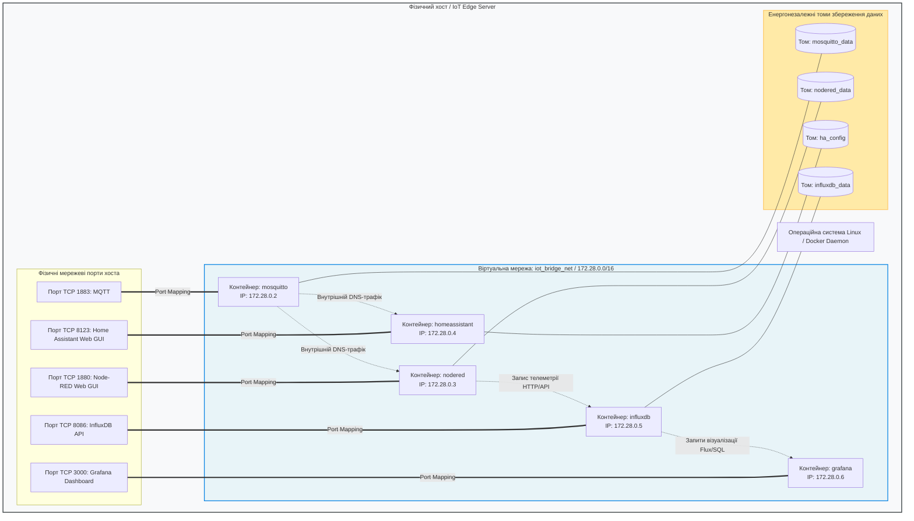
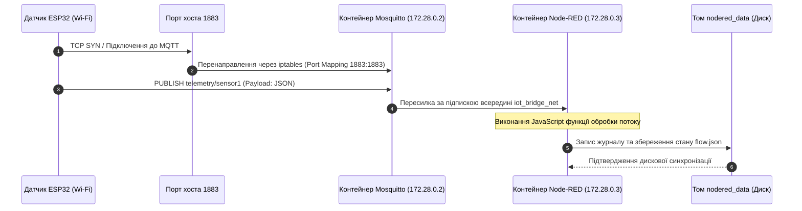

# Практичне заняття № 6. Проєктування мікросервісної архітектури та декларативної конфігурації Docker Compose для IoT-сервера

**Мета:** Вивчити концептуальні засади віртуалізації на рівні операційної системи та контейнеризації програмних компонентів Інтернету речей, опанувати синтаксис декларативного опису інфраструктури мовою YAML, навчитися проєктувати ізольовані віртуальні мережі, схеми прокидання мережевих портів і механізми збереження даних (Data Persistence) за допомогою томів (Volumes), а також набути практичних навичок розгортання та адміністрування багатоконтейнерного IoT-сервера на базі брокера Eclipse Mosquitto, середовища Node-RED та платформи Home Assistant.

**Стек технологій та інструменти:**
* **Мова програмування / Середовище:** Декларативна мова розмітки YAML (специфікація Docker Compose v2.x), командна оболонка Linux Shell (Bash), мова Python 3.10+ (модулі `yaml`, `tabulate`, `socket` для автоматизованої валідації конфігурації та перевірки конфліктів портів).
* **Платформа / Бібліотеки / Модулі:** Середовище контейнеризації Docker Engine версії 24.0+, утиліта Docker Compose версії 2.20+, офіційні контейнерні образи `eclipse-mosquitto:2.0`, `nodered/node-red:latest`, `homeassistant/home-assistant:stable`, `influxdb:2.7`, `grafana/grafana:latest`.
* **Інструменти розробки:** Текстовий редактор Visual Studio Code з плагінами YAML та Docker, термінал операційної системи (CLI).

---

## 1 Теоретичні відомості

Традиційне розгортання серверного програмного забезпечення Інтернету речей безпосередньо в операційній системі хоста (Bare-metal) призводить до виникнення конфліктів залежностей динамічних бібліотек, складнощів масштабування та високої вразливості системи при аварійній зупинці окремого процесу. Мікросервісна парадигма передбачає поділ функцій IoT-сервера на незалежні ізольовані модулі: брокер повідомлень (Message Broker), графічний обробник бізнес-логіки (Logic Engine), платформу автоматизації та координації пристроїв (Smart Home Core) і базу даних часових рядів (Time-Series Database).

Технологія контейнеризації Docker забезпечує ізоляцію процесів на рівні ядра Linux за допомогою просторів імен (namespaces) та контрольних груп ресурсів (cgroups). Простір імен мережі (`net namespace`) виділяє для кожного контейнера власний віртуальний мережевий стек, таблицю маршрутизації та IP-адресу, а простори імен точок монтування (`mnt namespace`) гарантують повну ізоляцію файлової системи. Контрольні групи дозволяють жорстко обмежити максимальний обсяг оперативної пам'яті (RAM Limit) та кванти часу центрального процесора (CPU Quota), запобігаючи деградації всієї системи через витік пам'яті в окремому сервісі.


*Рисунок 1 — Структурна схема взаємодії мікросервісів, мережевих портів та томів у середовищі Docker*

Архітектура, наведена на рисунку 1, демонструє поділ системи на ізольовані контейнери, об'єднані єдиною віртуальною мережею типу Bridge. Внутрішній DNS-сервер Docker дозволяє контейнерам звертатися один до одного безпосередньо за іменами служб (`mosquitto`, `nodered`), що повністю виключає необхідність ручної прив'язки до динамічних IP-адрес.

Для опису багатоконтейнерних комплексів використовується інструмент Docker Compose, який інтерпретує декларативний файл `docker-compose.yml`. Утиліта забезпечує одночасний запуск сервісів, автоматичне створення віртуальних підмереж, монтування томів і контроль черговості завантаження за допомогою директиви `depends_on`.


*Рисунок 2 — Діаграма послідовності обробки мережевого пакету та збереження даних на том*

Діаграма послідовності на рисунку 2 ілюструє шлях телеметричного кадру. Фізичний пакет потрапляє на порт хоста, транслюється у віртуальну мережу Docker через правила трансляції мережевих адрес `iptables`, обробляється брокером і передається до середовища Node-RED, яке фіксує результати на енергонезалежному томі хостової файлової системи.

Математична модель виділення оперативної пам'яті для стабільної роботи IoT-сервера враховує гарантовані базові ліміти кожного мікросервісу та накладні витрати операційної системи хоста:

$$\text{RAM}_{\text{req}} = \text{RAM}_{\text{OS\_overhead}} + \sum_{i=1}^{M} \text{RAM}_{\text{limit}, i}$$

У цій формулі величина $\text{RAM}_{\text{req}}$ позначає сумарний необхідний обсяг фізичної оперативної пам'яті хоста в мегабайтах ($\text{МБ}$), константа $\text{RAM}_{\text{OS\_overhead}}$ відповідає пам'яті, зарезервованій під ядро Linux та системні демони ($\text{МБ}$), змінна $M$ вказує на кількість запущених контейнерів, а $\text{RAM}_{\text{limit}, i}$ є встановленим у конфігурації апаратним лімітом пам'яті для $i$-го сервісу в мегабайтах ($\text{МБ}$).

Умова запобігання апаратним конфліктам мережевих портів на хості описується виразом несумісності множин відкритих сокетів:

$$\forall i, j \in [1, M], \, i \neq j \implies \mathcal{P}_{\text{host}}(i) \cap \mathcal{P}_{\text{host}}(j) = \emptyset$$

де $\mathcal{P}_{\text{host}}(k)$ позначає множину фізичних TCP/UDP портів хостової машини, які прив'язані до $k$-го контейнера за допомогою директиви `ports`.

Швидкість накопичення дискового простору ($S_{\text{storage}}$) базою даних телеметрії за інтервал часу $t$ розраховується з урахуванням частоти вимірювань і коефіцієнта накладних витрат журналу випереджального запису (WAL):

$$S_{\text{storage}}(t) = S_{\text{init}} + \sum_{k=1}^{K} \left( f_k \cdot D_{\text{record}, k} \cdot (1 + \alpha_{\text{wal}}) \right) \cdot t$$

У цьому рівнянні $S_{\text{storage}}(t)$ визначає обсяг сховища в байтах ($\text{байт}$), $S_{\text{init}}$ є початковим розміром структур бази даних при розгортанні ($\text{байт}$), $K$ позначає кількість підключених датчиків, $f_k$ є частотою публікації даних $k$-м датчиком у герцах ($\text{Гц}$), $D_{\text{record}, k}$ визначає розмір одного бінарного запису точки вимірювання в байтах ($\text{байт}$), $\alpha_{\text{wal}}$ є безрозмірним коефіцієнтом надлишковості системного журналу транзакцій, а $t$ вимірює тривалість неперервної експлуатації сервера в секундах ($\text{с}$).

---

## 2 Підготовка середовища та розгортання проєкту (Крок 0)

Для розробки, верифікації синтаксису та практичного тестування архітектури Docker Compose використовується робоча станція або віртуальна машина під управлінням операційної системи Linux (Ubuntu Server 22.04 LTS або новіша).

1. Перевірте встановлені версії компонентів Docker Engine та плагіна Docker Compose у терміналі:

```bash
# Перевірка працездатності демона Docker
docker --version

# Перевірка версії плагіна Docker Compose
docker compose version
```

2. Створіть ієрархію робочих директорій для проєкту та конфігураційних файлів мікросервісів:

```bash
# Створення кореневого каталогу та структури сервісних папок
mkdir -p ~/IoT_Docker_Server/{mosquitto/{config,data,log},nodered/data,homeassistant/config,influxdb/data,scripts,tests}
cd ~/IoT_Docker_Server
```

3. Сформуйте файл базової конфігурації для брокера Eclipse Mosquitto, який дозволяє анонімний доступ у тестовому режимі та вмикає збереження стану в базу даних `mosquitto.db`:

```bash
# Створення конфігураційного файлу mosquitto.conf
cat << 'EOF' > mosquitto/config/mosquitto.conf
listener 1883
allow_anonymous true
persistence true
persistence_location /mosquitto/data/
log_dest file /mosquitto/log/mosquitto.log
log_dest stdout
EOF
```

4. Встановіть права доступу на каталоги для запобігання помилкам монтування всередині контейнерів:

```bash
# Встановлення прав запису для користувачів контейнерів
chmod -R 777 mosquitto/
chmod -R 777 nodered/
chmod -R 777 homeassistant/
chmod -R 777 influxdb/
```

Файлова структура розгорнутого проєкту повинна мати такий вигляд:

```text
IoT_Docker_Server/
├── docker-compose.yml             # Головний маніфест декларативного розгортання стеку
├── mosquitto/
│   ├── config/
│   │   └── mosquitto.conf         # Конфігураційний файл брокера повідомлень
│   ├── data/                      # Збереження персистентної бази mosquitto.db
│   └── log/                       # Системні логи підключень та транзакцій
├── nodered/
│   └── data/                      # Файли потоків flows.json та конфігурація середовища
├── homeassistant/
│   └── config/                    # База даних конфігурацій configuration.yaml
├── influxdb/
│   └── data/                      # Файли Time-Series сховища InfluxDB
├── scripts/
│   └── docker_compose_linter.py   # Модуль валідації синтаксису та перевірки ресурсів
└── tests/
    └── test_stack_connectivity.sh # Bash-скрипт тестування мережевої доступності
```

---

## 3 Порядок виконання роботи

### 3.1 Індивідуальні завдання

Кожен здобувач вищої освіти здійснює проєктування унікального профілю IoT-сервера, розраховує баланс оперативної пам'яті, обирає необхідні сервіси та розробляє маніфест `docker-compose.yml` відповідно до закріпленого варіанта з таблиці 1.

*Таблиця 1 — Індивідуальні варіанти конфігураційного проєктування IoT-сервера*

| Варіант | Назва профілю сервера / Призначення | Обов'язковий набір контейнерних служб | Зовнішні порти на хості | Вимоги до персистентних томів (Volumes) | Ліміт пам'яті RAM (Node-RED / HA / DB) |
| :---: | :--- | :--- | :---: | :--- | :---: |
| **1** | Сервер розумної міської квартири | Mosquitto, Node-RED, Home Assistant | 1883, 1880, 8123 | `mosq_data`, `nr_data`, `ha_cfg` | 256 МБ / 512 МБ / — |
| **2** | Промисловий моніторинг верстатного цеху | Mosquitto, Node-RED, InfluxDB, Grafana | 1883, 1880, 8086, 3000 | `mosq_data`, `nr_data`, `influx_data`, `graf_data` | 512 МБ / — / 1024 МБ |
| **3** | Диспетчерський пункт тепличного господарства | Mosquitto, Home Assistant, InfluxDB | 1883, 8123, 8086 | `mosq_data`, `ha_cfg`, `influx_data` | — / 512 МБ / 512 МБ |
| **4** | Система автоматизації дата-центру (PUE) | Mosquitto, Node-RED, Grafana, Portainer | 1883, 1880, 3000, 9443 | `mosq_data`, `nr_data`, `graf_data`, `port_data` | 512 МБ / — / — |
| **5** | Моніторинг сонячної електростанції (СЕС) | Mosquitto, Node-RED, InfluxDB, Home Assistant | 1883, 1880, 8086, 8123 | `mosq_data`, `nr_data`, `influx_data`, `ha_cfg` | 256 МБ / 512 МБ / 512 МБ |
| **6** | Лабораторний стенд дослідження сенсорів | Mosquitto, Node-RED, Portainer | 1883, 1880, 9443 | `mosq_data`, `nr_data`, `port_data` | 256 МБ / — / — |
| **7** | Сервер контролю доступу бізнес-центру | Mosquitto, Home Assistant, PostgreSQL | 1883, 8123, 5432 | `mosq_data`, `ha_cfg`, `pg_data` | — / 512 МБ / 512 МБ |
| **8** | Автономний хаб агрометеорології | Mosquitto, Node-RED, SQLite-обробник | 1883, 1880 | `mosq_data`, `nr_data` | 256 МБ / — / — |
| **9** | Логістичний моніторинг автопарку | Mosquitto, Node-RED, InfluxDB, Traccar | 1883, 1880, 8086, 8082 | `mosq_data`, `nr_data`, `influx_data`, `tracc_data` | 512 МБ / — / 1024 МБ |
| **10** | Розумний кампус навчального закладу | Mosquitto, Node-RED, Home Assistant, Grafana | 1883, 1880, 8123, 3000 | `mosq_data`, `nr_data`, `ha_cfg`, `graf_data` | 512 МБ / 1024 МБ / — |
| **11** | Система управління готелем (PMS Link) | Mosquitto, Home Assistant, MySQL | 1883, 8123, 3306 | `mosq_data`, `ha_cfg`, `mysql_data` | — / 512 МБ / 512 МБ |
| **12** | Енергомоніторинг промислового підприємства | Mosquitto, InfluxDB, Grafana | 1883, 8086, 3000 | `mosq_data`, `influx_data`, `graf_data` | — / — / 1024 МБ |
| **13** | Шлюз безпеки та відеоспостереження | Mosquitto, Home Assistant, Frigate NVR | 1883, 8123, 5000, 8554 | `mosq_data`, `ha_cfg`, `frigate_media` | — / 1024 МБ / — |
| **14** | Смарт-елеватор та зерносховище | Mosquitto, Node-RED, InfluxDB | 1883, 1880, 8086 | `mosq_data`, `nr_data`, `influx_data` | 256 МБ / — / 512 МБ |
| **15** | Автоматизація котельної станції | Mosquitto, Node-RED, Home Assistant | 1883, 1880, 8123 | `mosq_data`, `nr_data`, `ha_cfg` | 256 МБ / 512 МБ / — |
| **16** | Центральний вузол обліку води (Водоканал) | Mosquitto, Node-RED, TimescaleDB, Grafana | 1883, 1880, 5432, 3000 | `mosq_data`, `nr_data`, `timescale_data`, `graf_data` | 512 МБ / — / 1024 МБ |
| **17** | Охоронний комплекс котеджного містечка | Mosquitto, Home Assistant, WireGuard VPN | 1883, 8123, 51820/udp | `mosq_data`, `ha_cfg`, `wg_config` | — / 512 МБ / — |
| **18** | Фармацевтичний склад вакцин | Mosquitto, Node-RED, InfluxDB, Uptime-Kuma | 1883, 1880, 8086, 3001 | `mosq_data`, `nr_data`, `influx_data`, `kuma_data` | 256 МБ / — / 512 МБ |
| **19** | Розумна насосна станція зрошення | Mosquitto, Node-RED, Home Assistant, InfluxDB | 1883, 1880, 8123, 8086 | `mosq_data`, `nr_data`, `ha_cfg`, `influx_data` | 256 МБ / 512 МБ / 512 МБ |
| **20** | Система предиктивного аналізу електродвигунів | Mosquitto, Node-RED, Grafana, Python Worker | 1883, 1880, 3000 | `mosq_data`, `nr_data`, `graf_data`, `worker_logs` | 512 МБ / — / — |

---

### 3.2 Покроковий алгоритм та розв'язок еталонного прикладу

Як еталонний приклад виконаємо проєктування повного стеку **«Універсального шлюзу автоматизації та моніторингу на базі Eclipse Mosquitto, Node-RED та Home Assistant Core»**.

#### Крок 1. Розрахунок балансу ресурсів хоста

Вихідні параметри розподілу оперативної пам'яті для еталонного комплексу:
* Накладні витрати ядра Linux та Docker Daemon: $\text{RAM}_{\text{OS\_overhead}} = 512\text{ МБ}$;
* Ліміт для брокера Mosquitto ($\text{RAM}_{\text{limit}, 1}$): $128\text{ МБ}$;
* Ліміт для середовища Node-RED ($\text{RAM}_{\text{limit}, 2}$): $256\text{ МБ}$;
* Ліміт для платформи Home Assistant ($\text{RAM}_{\text{limit}, 3}$): $512\text{ МБ}$.

Сумарний мінімальний обсяг оперативної пам'яті хоста становить:

$$\text{RAM}_{\text{req}} = 512 + 128 + 256 + 512 = 1408\text{ МБ} \approx 1{,}375\text{ ГБ}$$

Розрахована величина демонструє, що спроєктований комплекс може стабільно функціонувати на компактних одноплатних комп'ютерах (Raspberry Pi 4 / Orange Pi) з обсягом оперативної пам'яті від $2\text{ ГБ}$.

#### Крок 2. Формування карти прокидання мережевих портів

Схема зовнішньої адресації фізичного хоста:
* `0.0.0.0:1883` $\to$ направляється на порт `1883/tcp` контейнера `mosquitto` (прийом повідомлень від польових ESP32);
* `0.0.0.0:1880` $\to$ направляється на порт `1880/tcp` контейнера `nodered` (доступ до середовища візуального програмування);
* `0.0.0.0:8123` $\to$ направляється на порт `8123/tcp` контейнера `homeassistant` (веб-інтерфейс диспетчера).

Множини портів не перетинаються: $\{1883\} \cap \{1880\} \cap \{8123\} = \emptyset$, що гарантує відсутність конфліктів у мережевому стеку хоста.

#### Крок 3. Створення декларативного файлу docker-compose.yml

Створіть у кореневому каталозі `~/IoT_Docker_Server/` файл `docker-compose.yml` та введіть повний робочий текст конфігурації без скорочень:

```yaml
version: '3.8'

# Оголошення спільної ізольованої віртуальної мережі
networks:
  iot_network:
    name: iot_bridge_net
    driver: bridge
    ipam:
      driver: default
      config:
        - subnet: 172.28.0.0/16
          gateway: 172.28.0.1

# Оголошення іменованих томів для персистентного зберігання даних
volumes:
  mosquitto_data:
    name: mosquitto_data_vol
  mosquitto_log:
    name: mosquitto_log_vol
  nodered_data:
    name: nodered_data_vol
  ha_config:
    name: ha_config_vol

services:
  # ===================================================================
  # 1. Сервіс брокера повідомлень MQTT (Eclipse Mosquitto)
  # ===================================================================
  mosquitto:
    image: eclipse-mosquitto:2.0
    container_name: iot_mosquitto
    restart: unless-stopped
    networks:
      iot_network:
        ipv4_address: 172.28.0.2
    ports:
      - "1883:1883"
    volumes:
      - ./mosquitto/config/mosquitto.conf:/mosquitto/config/mosquitto.conf:ro
      - mosquitto_data:/mosquitto/data
      - mosquitto_log:/mosquitto/log
    environment:
      - TZ=Europe/Kyiv
    deploy:
      resources:
        limits:
          cpus: '0.50'
          memory: 128M

  # ===================================================================
  # 2. Сервіс обробки логіки та потоків даних (Node-RED)
  # ===================================================================
  nodered:
    image: nodered/node-red:latest
    container_name: iot_nodered
    restart: unless-stopped
    depends_on:
      - mosquitto
    networks:
      iot_network:
        ipv4_address: 172.28.0.3
    ports:
      - "1880:1880"
    volumes:
      - nodered_data:/data
    environment:
      - TZ=Europe/Kyiv
      - NODE_OPTIONS=--max-old-space-size=256
    deploy:
      resources:
        limits:
          cpus: '1.00'
          memory: 256M

  # ===================================================================
  # 3. Сервіс ядра платформи автоматизації (Home Assistant Core)
  # ===================================================================
  homeassistant:
    image: homeassistant/home-assistant:stable
    container_name: iot_homeassistant
    restart: unless-stopped
    depends_on:
      - mosquitto
    networks:
      iot_network:
        ipv4_address: 172.28.0.4
    ports:
      - "8123:8123"
    volumes:
      - ha_config:/config
      - /etc/localtime:/etc/localtime:ro
    environment:
      - TZ=Europe/Kyiv
    deploy:
      resources:
        limits:
          cpus: '1.50'
          memory: 512M
```

#### Крок 4. Розробка модуля валідації конфігурації (Python)

Створіть файл `scripts/docker_compose_linter.py` для автоматизованого аудиту синтаксису, контролю обмежень пам'яті та виявлення конфліктів портів:

```python
"""
Модуль для автоматизованої перевірки синтаксису, мапінгу портів
та аналізу виділення пам'яті у файлі docker-compose.yml.
Дисципліна: Технології інтернету речей.
"""

import sys
import socket
from typing import Dict, List, Any
import yaml
from tabulate import tabulate


class DockerComposeLinter:
    """
    Клас виконує статичний аналіз маніфесту Docker Compose, контролює правила іменування,
    обмеження апаратних ресурсів та доступність фізичних портів на хості.
    """

    def __init__(self, compose_file_path: str = "docker-compose.yml"):
        self.file_path = compose_file_path
        self.config_data = {}
        self.errors = []
        self.warnings = []

    def load_file(self) -> bool:
        """
        Зчитує та розбирає структуру YAML-файлу.
        """
        try:
            with open(self.file_path, "r", encoding="utf-8") as stream:
                self.config_data = yaml.safe_load(stream)
            return True
        except Exception as error_msg:
            self.errors.append(f"Критична помилка парсингу YAML: {str(error_msg)}")
            return False

    def validate_architecture(self) -> dict:
        """
        Здійснює комплексний аудит сервісів, мереж, томів та обмежень ресурсів.
        """
        if not self.config_data:
            return {"status": "FAIL", "summary": []}

        services = self.config_data.get("services", {})
        volumes = self.config_data.get("volumes", {})
        networks = self.config_data.get("networks", {})

        report_table = []
        bound_ports = []
        total_ram_limit_mb = 0

        for service_name, srv_body in services.items():
            image_tag = srv_body.get("image", "UNSPECIFIED")
            container_name = srv_body.get("container_name", service_name)
            restart_policy = srv_body.get("restart", "no")
            
            # 1. Перевірка портів
            ports_raw = srv_body.get("ports", [])
            host_ports = []
            for p in ports_raw:
                if isinstance(p, str) and ":" in p:
                    h_port = int(p.split(":")[0])
                    host_ports.append(h_port)
                    if h_port in bound_ports:
                        self.errors.append(f"Конфлікт портів: Порт {h_port} дублюється у сервісі {service_name}!")
                    else:
                        bound_ports.append(h_port)

            # 2. Перевірка лімітів пам'яті
            deploy_cfg = srv_body.get("deploy", {}).get("resources", {}).get("limits", {})
            mem_limit = deploy_cfg.get("memory", "No Limit")
            
            if mem_limit != "No Limit":
                if mem_limit.endswith("M"):
                    total_ram_limit_mb += int(mem_limit[:-1])
                elif mem_limit.endswith("G"):
                    total_ram_limit_mb += int(mem_limit[:-1]) * 1024
            else:
                self.warnings.append(f"Сервіс {service_name} не має встановленого ліміту пам'яті (Memory Limit)!")

            report_table.append([
                service_name,
                container_name,
                image_tag,
                ", ".join(map(str, host_ports)) if host_ports else "None (Internal)",
                restart_policy,
                mem_limit
            ])

        return {
            "status": "SUCCESS" if not self.errors else "FAIL",
            "report_table": report_table,
            "volumes_count": len(volumes),
            "networks_count": len(networks),
            "total_ram_mb": total_ram_limit_mb
        }


def main():
    print("=" * 85)
    print("      СТАТИЧНИЙ АНАЛІЗ ТА АУДИТ КОНФІГУРАЦІЇ DOCKER COMPOSE IOT-СЕРВЕРА      ")
    print("=" * 85)

    linter = DockerComposeLinter("docker-compose.yml")
    if not linter.load_file():
        print("[ПОМИЛКА]: Не вдалося завантажити файл конфігурації.")
        for err in linter.errors:
            print(f" - {err}")
        sys.exit(1)

    analysis = linter.validate_architecture()

    print("\n--- 1. РЕЄСТР ПРОЄКТОВАНИХ МІКРОСЕРВІСІВ ІОТ-СТЕКУ ---")
    headers = ["Сервіс", "Ім'я контейнера", "Базовий образ", "Хост-порти", "Restart Policy", "RAM Limit"]
    print(tabulate(analysis["report_table"], headers=headers, tablefmt="grid"))

    print("\n--- 2. ПІДСУМКОВИЙ БАЛАНС СИСТЕМНИХ РЕСУРСІВ ---")
    metrics_summary = [
        ["Загальна кількість задіяних сервісів", len(analysis["report_table"])],
        ["Кількість підключених віртуальних мереж", analysis["networks_count"]],
        ["Кількість персистентних томів (Volumes)", analysis["volumes_count"]],
        ["Сумарно зарезервована оперативна пам'ять під ліміти", f"{analysis['total_ram_mb']} МБ ({analysis['total_ram_mb']/1024:.2f} ГБ)"],
        ["Статус валідації маніфесту", analysis["status"]]
    ]
    print(tabulate(metrics_summary, headers=["Характеристика інфраструктури", "Значення"], tablefmt="grid"))

    if linter.warnings:
        print("\n--- ПОПЕРЕДЖЕННЯ СИСТЕМИ ---")
        for warn in linter.warnings:
            print(f" [!] {warn}")

    if linter.errors:
        print("\n--- ВИЯВЛЕНІ КРИТИЧНІ ПОМИЛКИ ---")
        for err in linter.errors:
            print(f" [X] {err}")
    else:
        print("\n[УСПІХ]: Конфігурація docker-compose.yml повністю коректна і готова до розгортання.")
    print("=" * 85)


if __name__ == "__main__":
    main()
```

---

### 3.3 Запуск, тестування та перевірка результатів

1. Запустіть програмний валідатор синтаксису та ресурсного балансу в терміналі:

```bash
# Запуск аудиту конфігурації
python3 scripts/docker_compose_linter.py
```

2. Звірте консольне виведення з еталонним протоколом аналізу:

```text
=====================================================================================
      СТАТИЧНИЙ АНАЛІЗ ТА АУДИТ КОНФІГУРАЦІЇ DOCKER COMPOSE IOT-СЕРВЕРА      
=====================================================================================

--- 1. РЕЄСТР ПРОЄКТОВАНИХ МІКРОСЕРВІСІВ ІОТ-СТЕКУ ---
+---------------+-------------------+----------------------------------+--------------+------------------+-------------+
| Сервіс        | Ім'я контейнера   | Базовий образ                    | Хост-порти   | Restart Policy   | RAM Limit   |
+===============+===================+==================================+==============+==================+=============+
| mosquitto     | iot_mosquitto     | eclipse-mosquitto:2.0            | 1883         | unless-stopped   | 128M        |
+---------------+-------------------+----------------------------------+--------------+------------------+-------------+
| nodered       | iot_nodered       | nodered/node-red:latest          | 1880         | unless-stopped   | 256M        |
+---------------+-------------------+----------------------------------+--------------+------------------+-------------+
| homeassistant | iot_homeassistant | homeassistant/home-assistant:st..| 8123         | unless-stopped   | 512M        |
+---------------+-------------------+----------------------------------+--------------+------------------+-------------+

--- 2. ПІДСУМКОВИЙ БАЛАНС СИСТЕМНИХ РЕСУРСІВ ---
+-----------------------------------------------------+-----------------------------+
| Характеристика інфраструктури                       | Значення                    |
+=====================================================+=============================+
| Загальна кількість задіяних сервісів                | 3                           |
+-----------------------------------------------------+-----------------------------+
| Кількість підключених віртуальних мереж             | 1                           |
+-----------------------------------------------------+-----------------------------+
| Кількість персистентних томів (Volumes)             | 4                           |
+-----------------------------------------------------+-----------------------------+
| Сумарно зарезервована оперативна пам'ять під ліміти | 896 МБ (0.88 ГБ)            |
+-----------------------------------------------------+-----------------------------+
| Статус валідації маніфесту                          | SUCCESS                     |
+-----------------------------------------------------+-----------------------------+

[УСПІХ]: Конфігурація docker-compose.yml повністю коректна і готова до розгортання.
=====================================================================================
```

3. Здійсніть розгортання спроєктованого стеку у фоновому режимі (Detached Mode):

```bash
# Запуск усіх мікросервісів стеку
docker compose up -d
```

4. Перевірте статус активності контейнерів та коректність прив'язки портів:

```bash
# Перевірка робочого стану контейнерів
docker compose ps
```

Очікуване виведення статусу контейнерів:

```text
NAME                IMAGE                                COMMAND                  SERVICE             CREATED             STATUS              PORTS
iot_homeassistant   homeassistant/home-assistant:stable  "/init"                  homeassistant       10 seconds ago      Up 9 seconds        0.0.0.0:8123->8123/tcp
iot_mosquitto       eclipse-mosquitto:2.0                "/docker-entrypoint.…"   mosquitto           10 seconds ago      Up 9 seconds        0.0.0.0:1883->1883/tcp
iot_nodered         nodered/node-red:latest              "./entrypoint.sh"        nodered             10 seconds ago      Up 9 seconds        0.0.0.0:1880->1880/tcp
```

5. Перевірте збереження даних (персистентність): створіть тестовий потік у Node-RED за адресою `http://localhost:1880`, перезапустіть контейнери командою `docker compose restart` та переконайтеся, що конфігурація не була втрачена завдяки змонтованому тому `nodered_data_vol`.

---

## 4 Вимоги до змісту звіту

Звіт оформлюється відповідно до стандарту ДСТУ 3008:2015 і повинен містити такі обов'язкові структурні розділи:

1. **Титульна сторінка** встановленого зразка із зазначенням назви Міністерства освіти і науки України, закладу вищої освіти, факультету, випускової кафедри, дисципліни, номера і теми практичного заняття, номера індивідуального варіанта, навчальної групи та прізвища здобувача.
2. **Мета заняття** та розгорнута теоретична база щодо мікросервісної організації серверного рівня Інтернету речей і технологій віртуалізації ресурсів.
3. **Постановка індивідуального завдання** для закріпленого варіанта з переліком усіх сервісів, виділених портів, томів та обмежень пам'яті.
4. **Розрахункова частина:** детальний розрахунок сумарного балансу оперативної пам'яті ($\text{RAM}_{\text{req}}$), оцінка швидкості приросту дискового простору томами бази даних ($S_{\text{storage}}$) та обґрунтування відсутності колізій мережевих портів.
5. **Повний вихідний текст конфігураційних файлів:** файл маніфесту `docker-compose.yml`, конфігурація брокера `mosquitto.conf` та лістинг скрипта валідації мовою Python із вичерпними коментарями.
6. **Графічні матеріали:**
   * Структурна схема взаємодії контейнерів, віртуальних мереж і томів, створена у Draw.io;
   * Скріншоти термінала виконання команд `docker compose up -d`, `docker compose ps` та виведення логів `docker compose logs`.
7. **Аналітичні висновки**, у яких оцінено надійність розгорнутого комплексу, проаналізовано переваги застосування іменованих томів у порівнянні з прямим прив'язуванням каталогів (Bind Mounts) та сформульовано рекомендації щодо забезпечення кібербезпеки середовища Docker на виробництві.

---

## 5 Контрольні запитання для захисту роботи

1. **У чому полягає фундаментальна різниця між апаратною віртуалізацією на базі гіпервізорів (Type-1/Type-2) та контейнеризацією на базі рушія Docker?** Яким чином відсутність гостьової операційної системи впливає на швидкість запуску та накладні витрати оперативної пам'яті IoT-сервера?
2. **Яким чином внутрішній DNS-сервер Docker здійснює розпізнавання імен сервісів всередині призначеної для користувача мережі типу Bridge?** Чому сервіси не можуть звертатися один до одного за іменами у стандартній мережі `bridge` за замовчуванням?
3. **Поясніть різницю між механізмами збереження даних Bind Mounts та Named Volumes.** Чому для промислових баз даних (InfluxDB, PostgreSQL) наполегливо рекомендується використання саме іменованих томів (Named Volumes)?
4. **Яку роль відіграє директива `restart: unless-stopped` у конфігурації сервісів IoT-сервера?** Як поведеться контейнер при аварійному збої внутрішнього процесу та при плановому перезавантаженні операційної системи хоста?
5. **Як використання контрольних груп ядра Linux (`deploy.resources.limits`) захищає операційну систему хоста від аварійної зупинки за механізмом Out-Of-Memory (OOM Killer)?**
6. **Запропонуйте конфігурацію блоку `healthcheck` у файлі `docker-compose.yml` для автоматичного контролю працездатності брокера Eclipse Mosquitto за допомогою утиліти `mosquitto_sub`.**